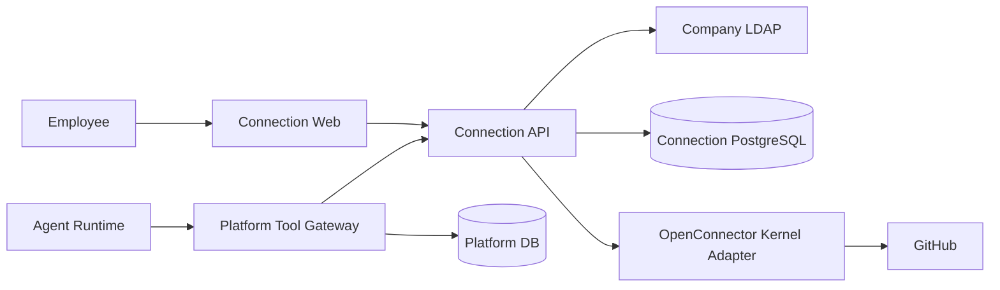

# Connection M1 高层设计

## 1. 状态与范围

本文定义 Connection M1 首个 Agent Platform delegated GitHub Pilot 的高层设计。产品行为以 [Connection M1 产品需求](../prd/PRD-connection-M1.md) 和 [Agent 平台 M1 产品需求](../prd/PRD-agent-platform-M1.md) 为准；跨系统工程边界以 [M1 工程架构 Spec](SPEC-agent-infra-M1-engineering-architecture.md) 为准。

本设计已完成 Wayfinder 决策，可以进入独立 Implementation Issues；它不表示代码、部署或 Pilot 已完成。首个 Pilot 只覆盖：

- Connection 独立中文 Web 与 LDAP 登录。
- Agent Platform delegated Consumer 和稳定 Agent Actor。
- GitHub 专用测试账号、一个受控 private 仓库和三项 Action。
- 连接、Grant、真实创建 PR、幂等、撤权、未知结果、审计和跨主体隔离。

Direct MCP Client、Connection PAT、Connection OAuth Authorization Server、员工日常 GitHub 账号、GitHub App、Bitbucket、Jira、Confluence、共享账号真实组织范围和广泛生产化不在本 Pilot 范围。

## 2. 设计目标

1. Connection 独立拥有 Principal、Consumer/Actor、Connection Grant、外部账号、Credential 和调用审计。
2. Platform Agent Action policy 与 Connection Grant 只能共同收紧能力，不能互相替代。
3. Agent、模型、浏览器和 Platform 都不能获得 Provider Credential；delegated Action 调用不能由 Agent、模型、Platform 或请求字段指定目标 Connection。Connection Web 仅允许当前 Principal 在管理流程中选择经服务端确认其有权使用的 Connection。
4. 撤权在 Provider 提交前可靠阻止调用；提交后保留外部真实结果，不伪造回滚。
5. 写操作结果未知时不自动重发，并能经过限时自动对账、管理员处理和明确未知终态。
6. 所有跨 Principal、Consumer、Actor 和 Connection 访问 fail closed 且不可枚举。

## 3. 核心模型

| 模型 | 含义与权威 |
| --- | --- |
| Principal | `identity issuer + stable subject` 映射的 Connection 员工主体 |
| BrowserSession | Connection Web 的 hash-only、可撤销登录会话 |
| AdministratorRole | Connection 内独立、可撤销且可审计的管理员角色绑定 |
| Consumer | 已注册的调用产品；本 Pilot 为 Agent Platform |
| ConsumerInstance | 已认证 Platform workload 的稳定实例 |
| Actor | Consumer 内不透明稳定授权单元；本 Pilot 为 Agent ID |
| ProviderRelease | 经来源、权限、Schema 和执行审查后发布的 Provider 版本 |
| ActionVersion | ProviderRelease 下不可变的 Action 契约 |
| Connection | Principal 拥有或当前有资格使用的外部账号连接 |
| CredentialVersion | Connection 当前受保护的 Provider Credential 版本 |
| Grant | Principal 对 Consumer/Actor、Connection 和 exact ActionVersion 的确认授权 |
| ActionCall | Connection 已接受并持久化的一次逻辑调用 |
| Effect | ActionCall 可能产生的外部业务副作用 |
| Dispatch | 向 Provider 发起 Effect 的具体提交尝试 |

Connection DB 是上述模型的唯一权威。Platform DB 只保存 Agent Action policy、执行状态、Connection `callId`、状态和脱敏结果引用。

## 4. 系统上下文



- `connection-web` 只调用 Connection Browser API，不读取 Platform DB。
- Platform Tool Gateway 不读取 Connection DB，也不接收 Provider Credential。
- OpenConnector Kernel 只执行已发布 Provider Action，不拥有 Principal、Grant、Credential、审计或恢复状态。

## 5. Principal 与浏览器会话

### 5.1 LDAP 登录

Connection 使用部署批准的固定 LDAP profile：

1. Browser 通过 HTTPS 向 Connection 提交用户名和密码。
2. Connection 转义所有 DN/filter 输入，设置连接、bind、search 和总请求 deadline，拒绝空密码和匿名 bind。
3. 成功验证后读取稳定 `uid`，以 `issuer + uid` 查找或创建 Principal。
4. 邮箱、登录名和显示名只更新展示资料，不参与授权键。
5. LDAP 密码在请求结束后丢弃，不进入持久化、Token、Cookie、日志、错误、审计或模型上下文。

LDAP endpoint、Service Bind Credential 和 transport profile 由部署 Secret/配置提供，调用方不能选择或触发降级。

### 5.2 Session

登录成功后签发高熵 opaque Cookie：

- `HttpOnly`、`Secure`、`SameSite=Strict`。
- PostgreSQL 只保存 session hash、Principal、issuer、过期、撤销和 recovery generation。
- 退出、过期、Principal 停用或 recovery generation 变化后立即失效。
- BrowserSession 只用于 Connection Web 管理操作，不能作为 delegated Action 调用凭据。

### 5.3 Principal 复核

- 登录时查询 LDAP。
- 登录后以 Principal 为单位缓存 15 分钟；窗口内的 Session/Token 请求共享该验证时间。
- 缓存过期后的并发请求合并为一次 LDAP 查询，其他请求等待同一结果。
- LDAP 条目缺失时禁用 Principal 并拒绝敏感操作；LDAP 不可用或返回非法结果时 fail closed。
- 当前 Pilot 只验证 `uid` 条目存在。缺少离职 active-state 真值必须进入风险与验收说明，不能描述为离职立即停权。

## 6. Catalog 与双层授权

### 6.1 Catalog

Connection 发布版本化只读 Catalog，内容只包括 Provider、immutable ActionVersion、输入/输出 Schema、effect、required scope 和发布状态。

Platform 使用注册 workload identity 和短期 `catalog:read` credential 拉取并保存只读投影。该凭据：

- 可撤销、轮换和审计。
- 不能调用 Action。
- 不能读取 Principal、Connection、Grant、Credential、调用或审计。
- 不能发布、停用或覆盖 Catalog。

Platform Catalog 缓存只用于 Owner 配置；调用时 Connection 始终按 current ProviderRelease/ActionVersion 状态重新校验。

### 6.2 Platform policy 与 Connection Grant

有效 Action 是以下集合交集：

```text
Platform current Agent Action policy
∩ Connection current Consumer declaration
∩ Principal current Grant exact ActionVersions
∩ current Provider/Action/Connection/Credential state
∩ Pilot repository policy
```

Platform policy 由 Agent Owner 管理。Connection Grant 只能由当前 Principal 在 Connection Web 确认。GitHub OAuth 成功不自动创建 Grant；Owner 新增 Action 后旧 Grant 不自动扩权。

## 7. Delegated 身份

### 7.1 Platform 签发责任

Platform Tool Gateway 负责：

- 重新确认当前平台用户仍可使用 Agent。
- 校验 Action 仍在 Agent Owner 当前 policy。
- 认证注册 workload，并解析稳定 Agent Actor。
- 从可信 Platform IdentityContext 取得部署批准的稳定 issuer/subject；该值必须与 Connection LDAP `issuer + uid` 映射同一员工，不能从邮箱、显示名或请求字段推导。
- 签发短期、不可篡改、一次性 delegated assertion。
- 保存自己的执行记录和 Connection `callId` 引用。

### 7.2 Connection 验证责任

Connection 在 Grant lookup 前校验：

- 签名、issuer、audience、issued/expiry 和 key version。
- 一次性 `jti` 与 recovery generation。
- Principal evidence、Consumer、ConsumerInstance 和 workload。
- Actor 存在、已注册且 current workload 有权代表；Agent Platform 固定 `REQUIRED` Actor，不允许回退到 Consumer-level Grant。
- exact ActionVersion、参数摘要、业务幂等键和 deadline。

PostgreSQL 原子绑定 `jti` 与首次接受的请求。完全相同的传输重放只能读取原 ActionCall，不能再次执行；任一绑定字段变化都拒绝。Assertion 只能证明调用主体和请求绑定，不能创建/扩大 Grant 或指定 Connection。

## 8. GitHub ProviderRelease

首个 Pilot 固定一个 GitHub Cloud ProviderRelease：

| ActionVersion | 用途 | Effect |
| --- | --- | --- |
| `github.get_current_user` | 验证当前 GitHub 账号及稳定数值 ID | READ |
| `github.list_my_repositories` | 确认受控测试仓库可见 | READ |
| `github.create_pull_request` | 从预置 head branch 创建真实 PR | WRITE |

- OAuth App 请求 `read:user repo`；不请求 `user:email`、`workflow` 或 `delete_repo`。
- 只使用专用 GitHub 测试账号；员工日常账号禁止进入 Pilot。
- 外部账号 identity 为 `github.com + numeric user id`，login/name 仅展示。
- 部署级 repository allowlist 固定唯一 private 测试仓库；create-PR 在 Provider 网络请求前检查，repository-read 的返回结果只保留该仓库。
- 其他 GitHub Action 和其他 Provider 不发布、不发现、不执行。

固定 OpenConnector commit 的 allowlist closure 必须记录 source commit、digest、license、notice 和复制清单。默认不维护 Fork；只有 Provider/OAuth/executor 通用缺口经过评审后才建立最小 Fork。

## 9. Action 执行与撤权

### 9.1 创建调用

Connection 在一个持久化流程中：

1. 验证 delegated assertion 和 current Grant。
2. 校验 Action Schema 和 repository policy。
3. 以 Principal、Consumer/Actor、ActionVersion、参数摘要和业务幂等键查找原调用。
4. 同键同请求返回原 `callId`；同键不同请求拒绝。
5. 创建 ActionCall，并为 WRITE Action 创建 Effect 和 PENDING Dispatch。

### 9.2 Dispatch 线性化

在访问 Provider 前，Connection 在同一 PostgreSQL 事务重新检查：

- Principal、ConsumerInstance、workload 和 Actor。
- Grant root/current Grant 和 exact ActionVersion。
- Connection revision/fence 和 CredentialVersion。
- Consumer declaration、ProviderRelease 和 ActionVersion 状态。
- repository allowlist。

全部有效时原子把 Dispatch 从 `PENDING` 变为 `SUBMISSION_STARTED`。该持久状态转换是外部提交的授权线性化点，可能早于实际网络请求；零行更新等价于本地拒绝，不得调用 Provider。

撤权在该事务前完成时阻止当前调用；事务完成后才撤权时不回滚可能已提交的 Provider 操作，但后续新调用均拒绝。

## 10. 未知结果与对账

GitHub create-PR 不接受 Connection 业务幂等键。Provider 可能已接受请求但 Connection 未取得或未保存可靠结果时：

1. ActionCall/Effect 进入 `RESULT_PENDING/UNCERTAIN`。
2. 不自动再次 POST create-PR。
3. 对账最多运行 24 小时并退避查询。
4. 唯一且完整匹配的 PR 可以确认成功；零候选不构成可安全重发证据。
5. 多候选或字段冲突立即进入 `NEEDS_MANUAL_REVIEW`。
6. Connection 管理员在 Connection Web 选择有 Provider 证据的结果或记录仍无法确认；普通用户只能查看脱敏证据并提供线索。
7. 管理目标为一个工作日。七天后仍无法确认则进入终态 `UNRESOLVED`。
8. `UNRESOLVED` 既不是成功也不是失败，不再自动查询/重试，原幂等键永久绑定原调用。新操作必须人工核查后显式使用新键。

## 11. Connection 与 Provider 撤销

- Grant revoke、Connection disconnect、Credential fence 和 Provider revoke 分别记录。
- 本地撤销先原子终结 current Grant/fence，立即阻止新 dispatch。
- Disconnect 创建持久 Provider revoke attempt，默认只撤销该 Connection 的单个 GitHub Token。
- Provider revoke 记录请求、成功、失败/待重试、attempt 和脱敏证据。
- 不默认删除用户对整个 OAuth App 的 grant；该动作只允许由明确展示影响范围的独立用户操作触发。
- 用户在 GitHub 侧撤销或 scope 缩减后，Provider 401/403 或 token check 将 Credential fence 为不可用，并要求重新连接。

## 12. Web 与管理

`connection-web` 是独立 React SPA，与 `connection-api` 通过同一批准 public origin 路由：

- Connection Web 路由进入 SPA。
- Browser API、OAuth callback、Catalog 和 delegated API 进入 Connection API。
- 不使用跨域 Cookie、公共 tunnel 或调用方身份 Header 补偿错误路由。

普通用户可以登录、连接 GitHub、查看脱敏账号、确认/撤销 Grant、断开 Connection，以及查看自己的调用和未知结果。管理员可以管理 Catalog/共享 Connection/审计，并处理 `NEEDS_MANUAL_REVIEW`。LDAP 只认证 Principal；Connection PostgreSQL 保存 AdministratorRole binding，每次管理请求重新检查当前角色。首个管理员只能由持有部署权限的操作员按稳定 LDAP subject 一次性 bootstrap，已有管理员后该入口不能再次授予角色。所有页面默认简体中文。

## 13. 数据与审计

Connection DB 至少保存：

- Principal、identity mapping、BrowserSession 和 AdministratorRole binding。
- Consumer、ConsumerInstance、workload 和 Actor registration。
- ProviderRelease、ActionVersion 和 Consumer declaration。
- Connection、CredentialVersion、Grant/root/fence。
- AuthorizedInvocation、ActionCall、Effect、Dispatch 和 reconciliation job。
- Provider revoke attempt 和 Connection audit。

审计记录稳定 ID、主体、版本、状态、时间和脱敏证据。不得记录 LDAP 密码、Provider Token、Cookie、delegated assertion、加密密钥、聊天正文或模型内部思考。

## 14. 部署与失败停止

- `connection-api`、`connection-web` 和 migration job 使用从 `main` 固定 commit 构建的不可变镜像 digest。
- ProviderRelease 和 Action 默认 disabled，只在具名 LA3 HCI Pilot 环境和测试主体范围内启用。
- 缺少 PostgreSQL、LDAP、Credential key、GitHub OAuth、repository policy 或 delegated verifier 时，业务路由启动 fail closed。
- 越权、Credential 泄露、错误 assertion 被接受、重复 PR、Effect 无法持久化或撤权后仍可新调用时立即停止 Pilot。
- 停止时禁用 ProviderRelease/Action 或 delegated route，保留数据库和审计。回滚到健康检查或只读入口不表示 GitHub 能力仍可用。
- 公司 KMS/Secret 产品、唯一受控 egress、HA/PITR、容量和正式值班仍是 Pilot 后生产化门禁；受监督 Pilot 的局部通过不能关闭这些缺口。

## 15. Pilot 验证矩阵

### 15.1 正向

- Alice、Bob 分别使用 LDAP 登录并连接各自专用 GitHub 测试账号。
- 两个账号只访问同一受控 private 仓库，并使用不同预置 head branch。
- 两人分别为同一 Agent Actor 确认三项 Action，调用只能解析各自 Connection。
- current-user 返回稳定 numeric ID；repository-read 发现受控仓库；create-PR 产生真实 PR。
- 相同幂等键重试返回同一 `callId` 和 PR，不创建第二个 PR。
- Platform execution 与 Connection audit 通过 `callId` 关联。

### 15.2 负向

- Alice/Bob 不能访问对方 Principal、Connection、Grant、Credential、OAuth transaction 或调用记录。
- 错误 issuer、audience、期限、`jti`、workload、Consumer/Actor、ActionVersion、参数或幂等绑定均拒绝。
- Owner policy 移除、Grant revoke、Connection disconnect、Credential/Action/Provider 停用均阻止新调用。
- repository allowlist 外的请求在访问 GitHub 前拒绝。
- 浏览器、Agent、Platform、日志、错误和审计均无原始 Secret。

### 15.3 故障与人工处理

- dispatch 前撤权、本地持久化失败、Provider 响应丢失、结果落库失败和进程重启。
- 24 小时自动对账、歧义转管理员、七天 `UNRESOLVED`。
- 单 Token revoke 成功、失败/重试和 GitHub 侧已撤销。
- Provider/Action disable、delegated route shutdown 和固定 digest 回滚。

## 16. 证据与成功声明

每次 Pilot 记录镜像 digest、migration、ProviderRelease、ActionVersion、测试账号 numeric ID、仓库、PR URL、`callId` 和脱敏审计证据。测试 PR 不合并，验收后关闭；branch 按固定前缀清理；测试 Token 撤销并确认失效，Connection 调用和审计不删除。

Platform Owner、Connection Owner、Security、SRE 和 Pilot 使用者分别签收自己的边界。任一签收缺失，Pilot 不通过。

唯一允许的成功声明是：在具名 HCI 环境、固定镜像、两个测试 Principal、两个专用 GitHub 账号和一个受控 private 仓库范围内，Agent Platform delegated GitHub Pilot 已通过。

## 17. 实施顺序

1. 权威文档和 wire contracts。
2. Connection Core/PostgreSQL 与 migrations。
3. 并行实现 LDAP Session、三项 GitHub Adapter、Catalog、Connection Web/Grant 和 delegated verifier。
4. 可靠 Effect、对账和 Provider revoke。
5. 生产 runtime、HCI readiness 和跨系统真实 Pilot。

每项实施使用独立 primary Issue 和 PR，直接从最新 `main` 开始。历史分支、tag 和开放 PR只作为候选证据，不整体合入或作为执行授权。
