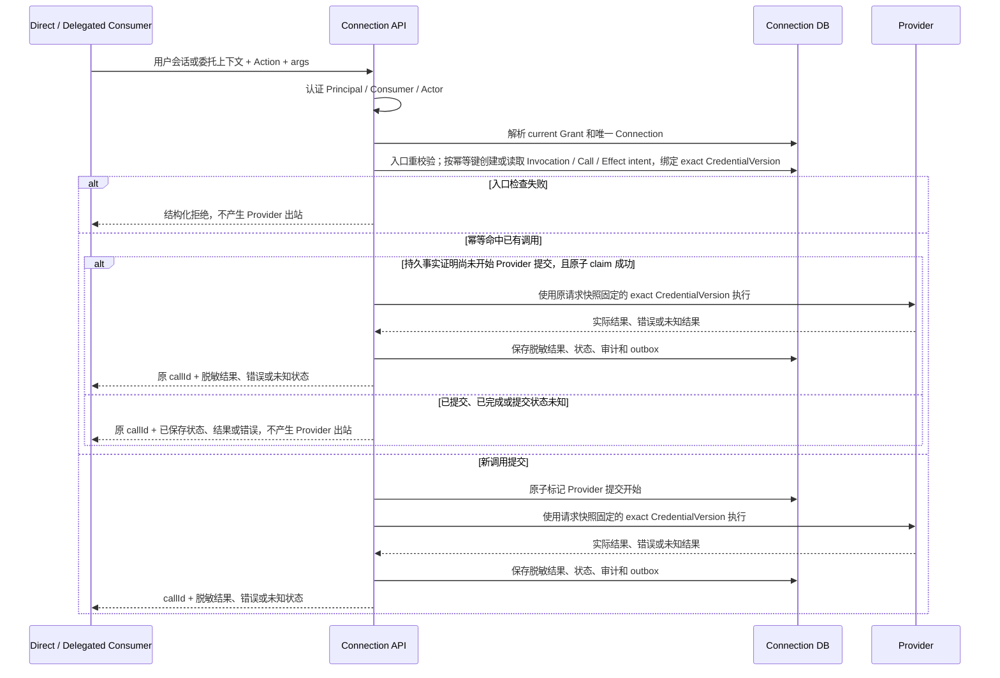

# Connection M1 High-Level Design

| 项目 | 内容 |
| --- | --- |
| 状态 | Proposed for Design Review |
| 版本 | v2.1 |
| 日期 | 2026-08-14 |
| 适用范围 | 独立 Connection M1 服务 |
| 关联 Issue | [#4](https://github.com/AgoraIO-Extensions/agent-infra/issues/4)、[#121](https://github.com/AgoraIO-Extensions/agent-infra/issues/121) |
| 产品依据 | [Connection M1 PRD](../prd/PRD-connection-M1.md)、[Agent 平台 M1 PRD](../prd/PRD-agent-platform-M1.md) |
| 工程依据 | [M1 工程架构 Spec](SPEC-agent-infra-M1-engineering-architecture.md) |
| 交付流程依据 | [AI 主导开发工作流 Spec](SPEC-ai-native-development-workflow.md) |
| 参考实现 | [OpenConnector 固定 Commit `07f0a190`](https://github.com/oomol-lab/open-connector/tree/07f0a190a9815827d2d3ecae1e6ba7b8524662e8) |

## 1. 文档目的

本文只冻结 Connection M1 进入实现所需的系统边界、核心模型和可观察行为。产品行为以两份 PRD 为准；部署、数据归属和身份边界以工程 Spec 为准。本文与权威文档冲突时，先修正权威文档，再更新本文。

本文不设计 Consumer 内部的 Agent、Conversation、Task、Pipeline 或审批流程，也不把字段级协议、数据库列或尚未批准的恢复方案写成 M1 契约。

## 2. M1 结论

### 2.1 当前 active contract

1. Connection 是可独立部署、可被多种客户端和服务消费的外部能力系统。Agora Agent Platform 是一个 Delegated Consumer，不是 Connection 的必经入口或授权权威。
2. Connection DB 独立保存并校验 Principal、Consumer、可选 Actor、具体 Connection 和已确认 Action 集合。Consumer 内部策略只能进一步收紧调用，不能扩大 Connection 授权。
3. Direct MCP Consumer 使用 Connection 当前用户会话；Delegated Consumer 使用注册 workload 和受信任的短期委托上下文。两种入口都由 Connection 服务端解析当前主体、授权和唯一目标 Connection。
4. Connection 在请求入口检查当前授权、Connection、Provider、Action、Credential 和外部 scope，并形成仅供本次请求使用的快照。
5. 入口检查提交前已经生效的撤权、断开、停用或失效拒绝本次请求，且不产生 Provider 出站。入口检查提交后发生的变化不取消、不回滚已经进入执行的请求。
6. Provider 返回的实际结果必须保留。结果未知的写操作不得盲目重放；用户修复授权或 Connection 后，只能主动创建新调用。
7. Consumer、Agent、模型、Sandbox、浏览器、日志和审计查询都不能获得原始 Credential。Credential 只在 Connection 内部解密和使用。

### 2.2 OpenConnector 对齐范围

**[OpenConnector 参考]** 固定 Commit 的托管 Action 请求在入口解析 runtime token 和 policy，形成当前请求快照，然后继续执行；执行过程中不会再次读取授权状态、主动取消 Provider 请求或回滚已经提交的外部操作。

**[本项目设计决策]** M1 对齐这一请求级行为，并参考其 Provider/Action 定义、OAuth、Credential 刷新和执行机制。经过固定版本、allowlist 和安全评审的代码可以作为 `connection-api` 进程内 Adapter 使用。

OpenConnector 不作为公司 Principal、组织、Consumer、Connection 授权、企业存储或审计的权威来源；不得把其 Runtime Server、Web Console、全局 alias 或 deployment token 直接暴露为本项目产品入口。

### 2.3 不属于当前 M1 contract

以下内容不作为本 HLD 的实现或上线前置：

- Platform `GrantSlot`、Platform 签发的 `ExecutionPermit`、在线 redeem 或 Permit introspection；
- Platform 与 Connection 之间的授权 epoch、跨系统 revision fence 或双向授权同步；
- 请求进入执行后的重复授权检查、主动取消 Provider 请求或自动回滚外部副作用；
- PITR 域外 Recovery Control、Evidence Journal、alternate-path acquisition、abandonment 或 terminal proof/delivery；
- 为上述候选协议新增的独立 Egress Proxy、Recovery listener 或业务 Worker 部署单元。

这些能力未来只有在出现明确产品需求时，才通过独立 HLD/ADR 和 primary Issue 进入设计与实现。

## 3. 产品与工程范围

### 3.1 M1 目标

- Codex、Claude App、Cursor 等 Direct MCP Client 分别注册为独立 Consumer，只配置 Connection MCP 即可完成登录、连接真实 Provider、授权和 Action 调用。
- 每个拟支持的 Direct MCP Client 产品和版本分别完成 MCP/OAuth、请求幂等、刷新和撤销 conformance；一个客户端通过不能证明其他客户端兼容。
- Agent Platform 通过通用 Delegated 契约使用同一 Action，不获得特殊授权路径。
- 用户明确选择 Consumer/Actor、外部账号和 Action；Consumer 不能选择默认账号或替换目标 Connection。
- 个人 Connection、公司共享 Connection、跨用户、跨 Consumer、跨 Actor 和跨账号访问相互隔离。
- 同一 Connection 支持多个 Credential 版本，但新调用只使用唯一 current 版本。
- GitHub 完成 Direct、Delegated、连接、刷新、授权、调用、审计和撤销闭环；内部 Confluence、Jira 和 Bitbucket 完成获批 Action 的真实账号 E2E。

### 3.2 初期 Provider 范围

| Provider | 状态 | 初期实现要求 |
| --- | --- | --- |
| GitHub | 纳入 | 首个完整闭环，覆盖多账号、创建 Pull Request、撤销、幂等和结果待确认 |
| 内部 Confluence、Jira、Bitbucket | 纳入 | 按各自公司内部 deployment 建立独立 ProviderRelease，并完成获批 Action 的真实账号 E2E |
| Microsoft Outlook | 待定 | 确认具体 API、认证方式、Action 和 scope 后才纳入，不作为当前交付依赖 |

不同 Provider 或 deployment 不共享 Credential、endpoint 或授权范围；每个纳入项都必须独立完成 Provider onboarding。

### 3.3 M1 非目标

- 任意 URL、任意 HTTP 模板、任意 Credential resolver、运行时上传脚本或动态加载未知 Provider；
- Consumer 自主选择账号、默认账号或在多个账号间自动切换；
- 每次写 Action 的逐次人工确认；
- Webhook、定时任务、主动通知或事件型 Connector；
- Redis、Kafka、NATS、Temporal 或独立 Connection Worker；
- 把 OpenConnector Runtime Server 或 Web Console 作为产品入口。

## 4. 系统边界与权威归属

### 4.1 部署边界

`connection-api` 是独立部署单元，与 Platform 使用不同进程、镜像、运行身份、数据库账号和 PostgreSQL 数据库。MCP、HTTP/OpenAPI、OAuth callback 和 PostgreSQL outbox/lease 处理可以由同一镜像承担，不增加没有独立扩缩容需求的业务服务。

应用入口只负责认证材料解析、协议接入和依赖装配；领域规则位于 Connection core，Drizzle、KMS、公司 Identity 和 OpenConnector 都是 Adapter。

### 4.2 数据权威

| 数据或决策 | 权威系统 | 其他系统允许保存 |
| --- | --- | --- |
| 公司用户状态和组织关系 | Company Identity | Connection 的当前解析结果和稳定主体映射 |
| Agent、Conversation、Task 和 Consumer 内部策略 | 对应 Consumer | Connection 的 opaque Actor/correlation ID |
| Principal、Consumer、ConsumerInstance 和 Consumer Grant | Connection DB | Consumer 的稳定 ID 和只读展示引用 |
| Provider、Action、发布状态和执行版本 | Connection DB | Consumer 的只读目录缓存或版本引用 |
| Connection、外部账号、共享范围和 Credential | Connection DB + KMS | 脱敏账号摘要和稳定 Connection 引用 |
| AuthorizedInvocation、ActionCall、Provider 结果和审计 | Connection DB | `callId`、状态和脱敏结果引用 |

Connection 不读取 Consumer 数据库，Consumer 不读取 Connection DB、KMS 或 Credential endpoint。两个系统不建立可写授权副本，也不使用分布式事务。

### 4.3 信任边界

- Consumer 只提交 Action、参数和对应入口要求的认证材料；Action 参数中的用户、组织、Consumer、Actor、Connection 或账号字段都不是权限依据。
- Direct MCP 请求由 Connection 会话解析 Principal、ConsumerInstance 和授权目标；不同客户端产品不能共享 Consumer、Session 或 Grant。
- Delegated 请求先认证注册 workload，再验证由 Connection 或其信任的公司身份系统签发的短期委托上下文；Consumer 不能自签或自报 Principal。
- Connection 始终以 Connection DB 中的当前 Grant 解析唯一目标 Connection；委托上下文只能证明调用主体，不能创建、替换或扩大 Grant。
- Provider 返回内容是不可信数据，不能改变主体、授权、Connection、Credential 或目标 endpoint。
- 只有 Connection workload identity 可以解密 Provider Credential。

## 5. 核心模型

| 概念 | M1 职责 |
| --- | --- |
| Principal | Connection 识别的员工或受管理服务主体 |
| Consumer / ConsumerInstance | 使用 Connection 的产品及其具体设备或 workload；不同 Direct MCP Client 产品分别注册 Consumer |
| Actor | Delegated Consumer 内可选的不透明稳定使用单元，例如一个 Agent |
| ProviderRelease / ActionVersion | 不可变、可审核、可停用的 Provider 和 Action 发布版本 |
| Connection | 对应一个稳定外部账号的个人或公司共享连接 |
| CredentialVersion | Connection 内部加密保存的 Credential 版本；最多一个 current |
| ConsumerGrant | Principal 对 Consumer、可选 Actor、具体 Connection 和已确认 Action 集合的授权 |
| AuthorizedInvocation | Connection 入口校验后形成的单请求授权与执行快照，包含固定的 `CredentialVersion` |
| ActionCall / Effect | 稳定调用记录、Provider 出站意图、实际结果和未知结果事实 |

M1 中，同一 `Principal + Consumer + Actor（如有）+ Provider` 只能选择一个当前 Connection。ConsumerGrant 不设置独立期限；撤销、换号、账号禁用或共享资格失效时终止，Connection 或 Credential 暂时失效时暂停。

## 6. 核心调用流程



### 6.1 Direct MCP Consumer

Direct MCP Client 通过 Connection MCP 调用。Connection 从当前会话解析 Principal 和 ConsumerInstance，`tools/list` 只暴露当前授权可用的 Action。Codex、Claude App、Cursor 等客户端产品分别注册 Consumer，每个设备或安装形成独立 ConsumerInstance；它们不需要经过 Agent Platform，也不保存 Provider Credential。

### 6.2 Delegated Consumer

Delegated Consumer 使用版本化 HTTP/OpenAPI、注册 workload 身份和短期委托上下文。委托上下文必须绑定当前调用主体、Consumer、具体 ConsumerInstance、已认证 workload 的 sender identity、可选 Actor、Action、参数摘要、audience、有效期和一次性防重放标识；Connection 必须校验这些绑定与当前连接身份一致。具体签名字段、sender constraint 和 token 格式在 Identity 契约 Issue 中冻结，在契约冻结前不开放 Delegated 调用。

Agent Platform 在发起调用前仍执行自己的用户、Agent、渠道和 Owner Action 策略；这些检查只能收紧调用。Connection 独立执行当前 ConsumerGrant 和 Connection 状态检查，任何一侧拒绝都不调用 Provider。

### 6.3 Connection 入口检查

Connection 在 Provider 出站前完成一次当前状态检查，并在同一提交点持久化 AuthorizedInvocation、ActionCall、写操作的 Effect intent 和本次请求使用的准确 `CredentialVersion`：

- Principal、Consumer、ConsumerInstance 和可选 Actor 仍有效；
- Consumer 当前声明、用户最近确认和系统发布状态都包含目标 ActionVersion；
- ConsumerGrant 仍指向当前唯一 Connection，个人归属或共享资格仍有效；
- Connection、current Credential 和 Provider 外部 scope 仍允许该 Action；
- 参数符合 ActionVersion Schema，执行器、endpoint 和必要网络规则均在 allowlist；
- 幂等键、参数摘要、限流和熔断条件允许创建或读取本次调用。

该数据库提交点是本次请求的授权判定点。实现可以使用事务、行锁或等价的原子条件更新，但本 HLD 不冻结 revision、fence 或 token 字段。

## 7. 授权、撤权与生命周期

### 7.1 有效能力

一次 Action 调用必须同时满足：

```text
系统当前已发布 Action
∩ Consumer 当前已发布 Action 声明
∩ Principal 最近确认的 Consumer / Actor Action 集
∩ Principal 对当前 Connection 的有效资格
∩ Connection current Credential 的外部 scope
```

Consumer 内部 Agent policy 可以进一步缩小该集合，但不能扩大它。缓存缺失、调用方字段或 Provider 返回内容都不能扩大能力。

### 7.2 账号与 Action 变化

- 用户必须明确选择具体 Connection；同一 Provider 的多个账号不能自动切换或回退。
- Consumer 新增 Action，或 Action 的 scope/effect 扩大时，旧授权不自动获得新增能力。
- Consumer 移除 Action、Provider/Action 停用或权限收缩时，后续请求立即拒绝。
- 同账号重连可以恢复因连接中断暂停的授权；不同账号重连终止旧授权并要求重新选择和确认。
- 公司共享范围只表示 Principal 有资格选择该 Connection，不等于已经授权给任何 Consumer。

### 7.3 撤权竞态

| 变化何时提交 | 本次请求 | 后续请求 |
| --- | --- | --- |
| Connection 入口提交点之前 | 拒绝，不产生 Provider 出站 | 继续拒绝，直到用户修复 |
| Connection 入口提交点之后 | 按请求快照继续，不主动取消、不回滚 | 新请求按当前状态重新检查 |

这条规则适用于 ConsumerGrant 撤销、ConsumerInstance 撤销、Connection 断开、账号或共享资格失效、Provider/Action 停用和 Credential 失效。Consumer 自己的内部策略撤销负责阻止该 Consumer 发起新请求；已经进入 Connection 执行的请求仍遵循同一入口边界。

## 8. Connection 与 Credential

M1 至少区分 `ACTIVE`、`DEGRADED`、`REAUTH_REQUIRED`、`DISCONNECTED` 和 `DISABLED`。状态转换、外部账号稳定识别、共享范围和 Credential 生命周期由 Connection 持久化。

- OAuth 使用 Authorization Code、PKCE、一次性高熵 state 和预注册回跳地址；callback 校验 Provider、发起 Principal、Consumer、目标用途、过期时间并原子消费事务。
- API Key/PAT 只允许受控输入，提交后立即加密保存，不回显。
- Credential 使用公司 KMS/Secret Service envelope encryption；数据库只保存密文、Key 版本和必要元数据。
- refresh、rotation 和 revoke 使用 Connection 本地幂等键以及事务/CAS/lease，避免并发覆盖 current 版本。
- refresh 明确失效时进入 `REAUTH_REQUIRED`；结果未知时不盲目重复使用可能旋转的 refresh token。
- 新调用在入口绑定当时的 current `CredentialVersion`；执行只使用该版本，不切换或自动回退到其他版本。

## 9. Provider、执行与可靠性

- Connection 是 Provider/Action 目录的权威来源；发布对象使用不可变版本。
- 只有经过代码、安全、网络出口和 Provider Owner 评审的 allowlist executor 可以执行。目录存在不等于自动允许执行。
- Provider 出站的 origin、path 模板和 Credential 注入来自已发布版本，不来自 Action 参数或 Provider 返回内容。
- 写 Action 在访问 Provider 前提交稳定 `callId`、ActionCall 和 Effect intent。
- 幂等作用域为 `Principal + Consumer + Actor（如有）+ Connection + ActionVersion + 幂等键`。相同参数摘要返回原调用；不同摘要返回冲突；不同作用域互不影响。
- 幂等命中时，只有持久事实证明 Provider 提交尚未开始且能够原子 claim 原 ActionCall，才可继续执行该原调用一次；已经提交、已经完成或提交状态未知时只返回原调用，不产生新的 Provider 出站。
- 只有 Provider 明确支持幂等机制时才自动重试写操作。Provider 可能已执行但结果无法确认时记录 `UNCERTAIN`，不伪造失败或成功。
- 用户主动重试是新的 tool call；系统不得把授权修复、重连或进程重启解释为自动重放旧请求。

## 10. API 与错误契约

M1 只冻结职责和可观察行为，不在本 HLD 固化内部 token、签名字段或数据库列名。具体契约由 `packages/contracts` 和对应 primary Issue 维护：

- Direct MCP Consumer 使用 MCP；Delegated Consumer 使用版本化 HTTP/OpenAPI；Connection Web 和管理操作使用独立的用户态 HTTP/OpenAPI；
- Connection Web 提供账号、授权、调用记录、Consumer、Catalog、共享 Connection 和审计入口；
- MCP 与 HTTP 入口调用同一 application service，使用相同授权、执行、审计和错误语义；
- 服务端返回稳定错误码、用户可读消息、`traceId` 和可重试标记；
- 认证失败、无权、资源不存在和跨主体访问使用不枚举的错误族；
- 调用结果包含稳定 `callId` 和脱敏状态、结果或错误。

当前 M1 不提供 Permit redeem、Permit introspection 或 Platform/Connection 跨系统授权版本接口。

## 11. 审计与安全

Connection 审计覆盖连接、重连、断开、Consumer 注册和停用、授权确认和撤销、Provider/Action 发布和停用，以及每次 ActionCall 的状态和结果。审计至少可通过 `Principal`、`Consumer`、可选 `Actor`、`connectionId`、`actionId`、`callId` 和时间关联一次调用。

普通用户只能查看本人 Connection、授权和调用记录；Consumer 管理者不能查看其他用户记录；管理员可以查看 Connection 管理审计和调用审计，但不能读取原始 Credential 或 Consumer 对话正文。

所有跨 Principal、Consumer、Actor 和 Connection 的访问都必须 fail closed 且不泄露资源是否存在。日志、Trace、错误、指标和审计不记录原始 Credential、完整敏感参数、聊天正文或模型思考原文。

## 12. 测试与验收

### 12.1 必测行为

- Direct MCP Client：拟支持的产品和版本分别通过 conformance；至少一个客户端只配置 Connection MCP，完成登录、GitHub 连接、授权和真实写 Action；
- Delegated Consumer：Agent Platform 使用同一 Action 和通用委托契约，不成为授权权威；
- 多主体隔离：Alice/Bob、同用户多账号、跨 Consumer/Actor/Connection、委托重放和参数替换均拒绝且不枚举；
- Connection：个人/共享、OAuth callback、refresh、同账号重连、不同账号切换、断开和账号禁用；
- Credential：Consumer、Agent、模型、Sandbox、页面、日志和审计均无法读取原始值；
- Action：Consumer 声明、用户确认新增/扩权、移除/收缩/停用后新请求拒绝；
- 调用：Provider 前持久化 ActionCall/Effect intent，幂等冲突、Provider 实际结果和脱敏审计；
- 撤权竞态：入口提交前撤权拒绝，提交后撤权继续并保留实际结果；
- 未知结果：不确定写操作不盲目重放，用户主动重试创建新调用；
- GitHub 同时完成 Direct 和 Delegated 的连接、刷新、授权、调用、撤销和错误闭环；内部 Confluence、Jira 和 Bitbucket 分别完成获批 Action 的真实账号 E2E。

### 12.2 不作为当前验收前置

Permit redeem、跨系统 epoch、Recovery Control、Evidence Journal、独立 Egress admission、alternate path、abandonment 和 terminal proof 不进入当前 M1 测试矩阵。未来单独立项后再增加契约、迁移和故障注入测试。

## 13. 实施顺序

1. 工程与身份底座：`connection-api`、Connection core/store/contracts、独立数据库、Company Identity/KMS Fake 和 pinned OpenConnector Adapter。
2. Catalog 与 Connection：Provider/Action 发布、个人/共享 Connection、OAuth/API Key、多账号和 Credential 版本。
3. Consumer 授权：Consumer/Instance、Action 声明、ConsumerGrant、账号选择、确认和撤销。
4. 接口与执行：Direct MCP、Delegated HTTP、入口 live check、ActionCall/Effect、幂等和审计。
5. 真实闭环：GitHub 的 Direct/Delegated 完整验证，以及内部 Confluence、Jira、Bitbucket 获批 Action 的真实账号 E2E；Outlook 仅在范围确认后纳入。
6. 上线加固：负向隔离、故障注入、容量基线、备份恢复、运行手册和安全签收。

每一步遵循 `Issue -> 实现与验证 -> PR`。改变授权、身份传递、数据权威、部署单元或 Agent Runtime Contract 前，先更新工程 Spec；需要冻结具体机制时再新增 ADR。

## 14. 评审退出条件

设计评审通过前必须确认：

- PRD、工程 Spec 与本文没有冲突；
- 公司身份、Direct session 和 Delegated workload/委托契约有明确 Owner；
- 初期 Provider 的 exact deployment、认证方式、Action、测试账号和最小 scope 已确定，Outlook 是否纳入已有结论；
- Connection 授权权威、唯一账号选择、Credential current 约束和负向隔离测试已确定；
- Connection 入口一次检查、请求快照、撤权竞态和不自动重放有可执行测试；
- Provider 前持久化、`UNCERTAIN` 处理、真实 Provider 验收和审计关联有 Owner；
- 没有把后续候选协议作为 M1 API、Schema、实现或上线门禁的隐含前置。

本文合并不等于所有字段级协议或恢复方案已经批准。后续实现通过各自 primary Issue 和必要 ADR 冻结细节。
