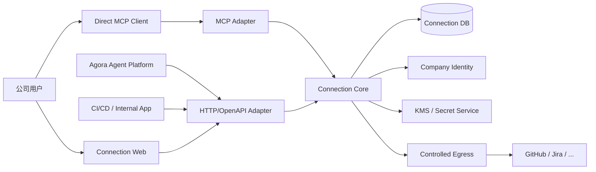
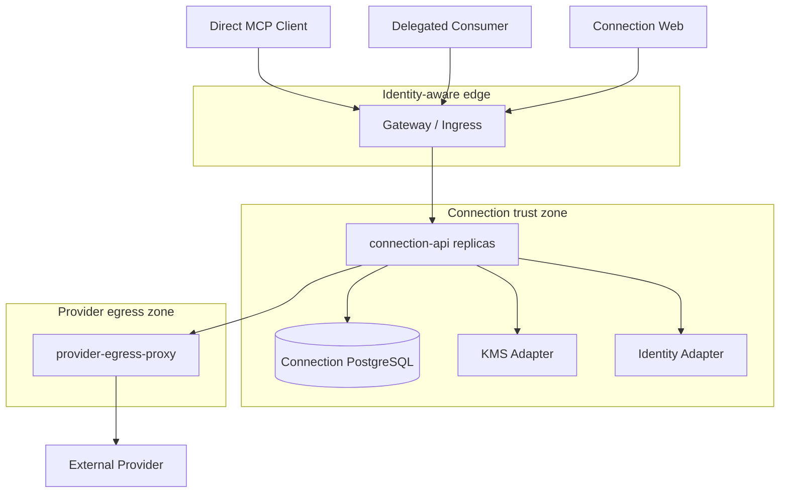
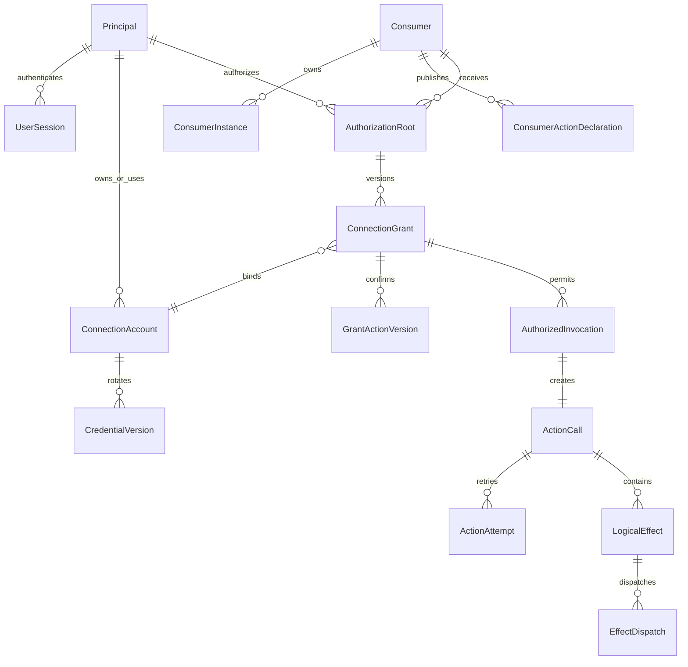
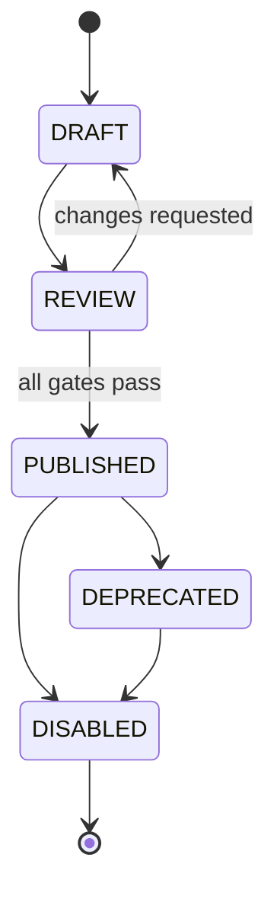
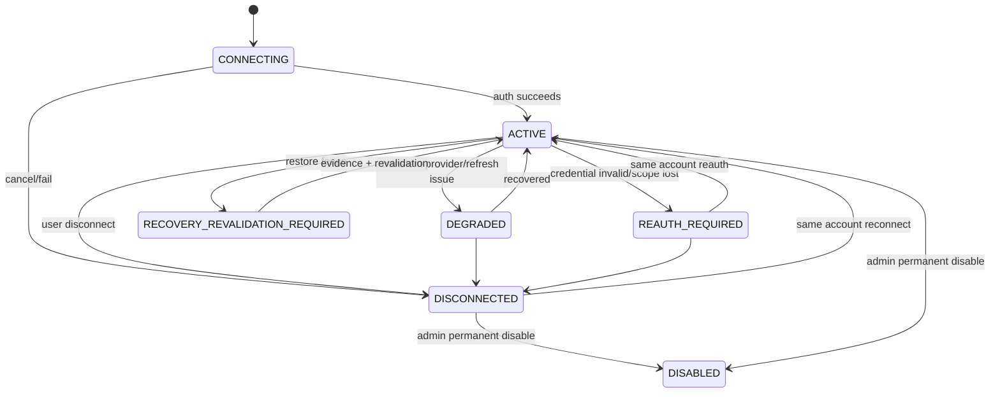
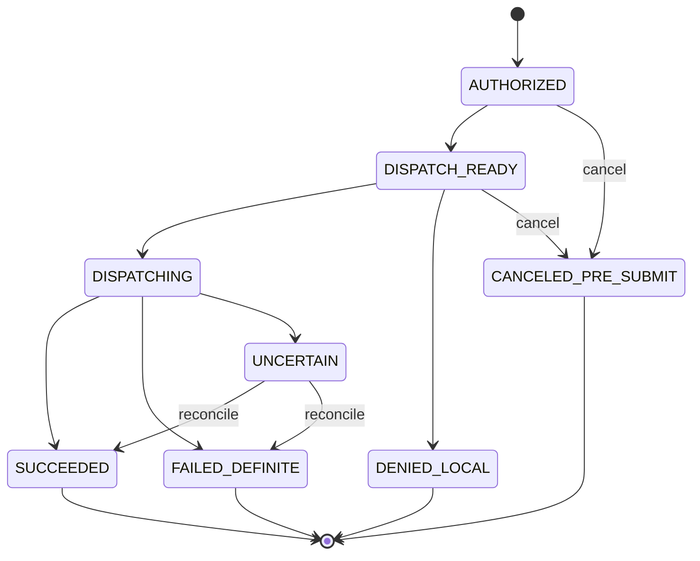
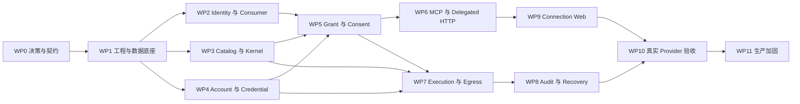

# Connection M1 High-Level Design

| 项目 | 内容 |
| --- | --- |
| 状态 | Proposed for Design Review |
| 版本 | v2.0 |
| 日期 | 2026-08-13 |
| 适用范围 | 独立 Connection M1 服务 |
| Primary Issue | [#121](https://github.com/AgoraIO-Extensions/agent-infra/issues/121) |
| 产品依据 | [Connection M1 产品需求](../prd/PRD-connection-M1.md) |
| 工程依据 | [agent-infra M1 工程架构 Spec](SPEC-agent-infra-M1-engineering-architecture.md) |
| 交付流程依据 | [AI 主导开发工作流 Spec](SPEC-ai-native-development-workflow.md) |
| 参考实现 | [OpenConnector 固定 Commit `0cb0e0d`](https://github.com/oomol-lab/open-connector/tree/0cb0e0dd2ed686fa7fa2ff8d9eef97a7d6b31674) |

## 1. 文档目的

本文把 Connection M1 产品要求细化为可以进入设计评审、拆分实施任务、冻结契约并编写测试的 High-Level Design。本文回答：

1. Connection 如何作为独立服务被 Direct MCP Client、Agent Platform、CI/CD 和内部应用消费。
2. Principal、Consumer、Actor、Connection、Credential、Grant 和 Invocation 如何建模。
3. Codex、Claude App、Cursor 等 Direct MCP Client 如何只配置 Connection，完成登录、连接 GitHub 和创建 Pull Request。
4. Direct 和 Delegated 两种入口如何共享同一授权和执行核心。
5. 多用户、多外部账号和多 Credential 版本如何隔离。
6. 写 Action 如何避免盲目重试，并在未知结果、崩溃和恢复后保持安全。
7. OpenConnector 哪些能力可以复用，哪些企业身份、授权、存储和运行假设必须替换。
8. Connection 如何独立部署、观测、迁移、恢复和验收。

本文不设计任何 Consumer 的内部实现。Agora Agent Platform 只作为 Delegated Consumer 示例；其 Agent、Conversation、Tool Gateway、数据库和 PITR 均不属于本文。

## 2. 结论来源

| 标记 | 含义 | 约束力 |
| --- | --- | --- |
| **[PRD]** | Connection PRD 已确认的产品要求 | HLD 不得改写 |
| **[工程 Spec]** | 当前工程架构基线 | 变更前必须先更新 Spec |
| **[仓库现状]** | 当前已提交工程骨架可验证事实 | 不是长期产品契约 |
| **[OpenConnector 参考]** | 固定 Commit 的事实或可借鉴机制 | 不是本项目验收依据 |
| **[设计决策]** | 本文提出的工程设计 | 需设计评审和必要 ADR 批准 |
| **[评审门禁]** | 外部依赖或重大行为待确认项 | 未关闭前不得实现或上线 |

未单独标记的字段、状态、API、约束和默认值均属于 **[设计决策]**。OpenConnector 始终指表头固定 Commit，不指浮动分支。

## 3. 目标、范围与非目标

### 3.1 M1 目标

| 目标 | 来源 | 设计落点 |
| --- | --- | --- |
| Consumer 使用外部 API但拿不到原始 Credential | [PRD] | Credential Boundary、Provider Executor |
| 用户只配置 Connection 即可在 Direct MCP Client 使用 | [PRD] | MCP、remote OAuth、Direct Session |
| Connection 独立保存和校验 Consumer 授权 | [PRD] | ConnectionGrant、AuthorizationRoot |
| 支持多用户、同用户多账号和多 Credential 版本 | [PRD] | Principal、ConnectionAccount、CredentialVersion |
| Direct 与 Delegated Consumer 使用同一执行核心 | [PRD] | AuthorizedInvocation |
| 写 Action 先持久化再访问 Provider | [工程 Spec] | ActionCall、LogicalEffect、EffectDispatch |
| 至少一个真实 Provider 完成完整闭环 | [PRD] | GitHub create pull request E2E |
| OpenConnector 不成为企业身份或授权权威 | [PRD] | pinned Connector Kernel 与企业领域核心 |

### 3.2 M1 范围

- 公司 Principal 与组织资格接入。
- Consumer、ConsumerInstance、Direct Session 和 Delegated Workload 注册。
- Provider/Action Catalog 导入、审核、发布、停用和不可变版本。
- 个人与公司共享 Connection。
- 同一 Principal 在同一 Provider 下的多个外部账号。
- OAuth Authorization Code + PKCE、API Key/PAT 和 Credential rotation。
- Consumer Action 声明、ConnectionGrant、授权确认、换号和撤销。
- MCP 工具发现与调用；HTTP/OpenAPI 浏览器、管理和 Delegated 接口。
- AuthorizedInvocation、ActionCall、Effect Ledger、幂等和 reconciliation。
- 受控 Provider egress、审计、观测、限流、备份和恢复。

#### 3.2.1 初期 Provider 实现范围

| 类别 | Provider | 状态 | 初期实现要求 |
| --- | --- | --- | --- |
| 外部网站 | GitHub | 纳入 | 作为首个完整闭环，覆盖连接、多账号授权、创建 Pull Request、撤销、幂等和结果待确认 |
| 外部网站 | Microsoft Outlook | 待定 | G-02 确认具体 API、认证方式、Action 和 scope 后才纳入实现与交付承诺 |
| 内部网站 | Confluence | 纳入 | 按公司内部部署建立独立 ProviderRelease，并完成获批 Action 的真实账号 E2E |
| 内部网站 | Jira | 纳入 | 按公司内部部署建立独立 ProviderRelease，并完成获批 Action 的真实账号 E2E |
| 内部网站 | Bitbucket | 纳入 | 按公司内部部署建立独立 ProviderRelease，并完成获批 Action 的真实账号 E2E |

本表属于 **[设计决策]**，不把不同产品或 deployment 合并为共享 Credential、endpoint 或授权范围。每个纳入项仍必须分别通过 13.4 的 Provider Onboarding；Microsoft Outlook 在状态从“待定”变更前不是 M1 交付依赖。

### 3.3 非目标

| 非目标 | 原因 |
| --- | --- |
| Consumer 内部 Agent、Conversation、Task、Pipeline、审批 | 属于 Consumer 自己的 bounded context |
| Platform HLD 或 Platform DB 契约 | Connection 不拥有该设计 |
| 任意 URL、通用 HTTP Proxy、运行时 JavaScript 或 npm 上传 | 会绕过 Catalog、scope 和供应链审核 |
| Webhook、定时任务、主动通知 | M1 只处理调用型 Action |
| 每次写 Action 都要求人工确认 | M1 在授权和扩权时确认，不新增逐次确认 |
| 自动回滚已提交给 Provider 的外部操作 | 外部副作用通常不可事务回滚 |
| Redis、Kafka、NATS、Temporal 或独立 Connection Worker | PostgreSQL lease/outbox 足以满足 M1 |
| OpenConnector Runtime Server 或 Web Console | 不满足企业身份、授权和隔离边界 |

## 4. 关键架构决策与门禁

### 4.1 已同步的权威结论

| ID | 结论 | 权威文档 |
| --- | --- | --- |
| A-01 | Connection 是独立多 Consumer 服务 | Connection PRD、工程 Spec |
| A-02 | Connection DB 是 Consumer 授权权威 | Connection PRD、工程 Spec |
| A-03 | Direct MCP Client 可以只配置 Connection MCP | Connection PRD、工程 Spec |
| A-04 | Direct/Delegated 入口收敛到 AuthorizedInvocation | Connection PRD、工程 Spec |
| A-05 | Consumer 不能提交可信 Principal 或 Connection | Connection PRD、工程 Spec |
| A-06 | Connection 保存多账号、多 Credential 版本 | Connection PRD、工程 Spec |
| A-07 | Platform 只是 Delegated Consumer 示例 | 两份 PRD、工程 Spec |

### 4.2 待批准门禁

| ID | 待确认项 | 未关闭时行为 | Owner |
| --- | --- | --- | --- |
| G-01 | 公司 OIDC、目标 Direct MCP Client 版本的 MCP/OAuth profile 和 delegated workload identity 精确契约 | 只使用 Fake Identity，不声明对应客户端受支持，也不发布 Direct 登录 | Identity/Security |
| G-02 | 初期 Provider 的 exact deployment、认证方式、测试账号、Action/scope，以及 Outlook 是否纳入 | 对应 ProviderRelease 不得进入 `PUBLISHED`；Outlook 不进入实现 | Product/Connection/Provider |
| G-03 | `UNCERTAIN` 用户文案、对账责任和支持流程 | 写 Action 只在测试环境开放 | Product/Support |
| G-04 | 公司 KMS、网络出口、审计保留和对象存储产品 | 只使用 Fake Adapter | Security/SRE |
| G-05 | Shared Connection 永久 disable 或可恢复语义 | 禁止实现不可逆 tombstone | Product |
| G-06 | Effect Ledger acknowledged commit 的生产 RPO | 写 Action 保持关闭 | SRE/DBA |
| G-07 | Provider 完整审计能否覆盖数据恢复风险窗口 | 不能以抽样解冻写能力 | SRE/Provider Owner |
| G-08 | 现网是否存在 legacy Connection/Credential/Grant | 禁止假设 greenfield cutover | Data Owner |

## 5. 方案比较与选型

| 方案 | 描述 | 优点 | 代价与风险 |
| --- | --- | --- | --- |
| A. 企业领域核心 + pinned OpenConnector Kernel | Connection 自己实现身份、授权、存储、审计和可靠性，只复用经过审核的 Provider/OAuth/executor | 独立服务边界清晰；保留上游 Provider 资产；可支持多 Consumer | 需要维护内部 Fork 和 Adapter |
| B. 部署上游 Runtime | 把 OpenConnector Runtime Server 暴露给 Consumer | 初期接入快 | deployment token、global alias、SQLite/D1 和授权模型不满足企业隔离 |
| C. 完全自研 Connector Engine | 所有 Provider、OAuth 和 executor 自研 | 控制最强 | M1 成本最高，重复实现大量 Provider 细节 |

评分按 1 至 5：

| 维度 | 权重 | A | B | C |
| --- | ---: | ---: | ---: | ---: |
| 多主体授权与隔离 | 25% | 5 | 2 | 5 |
| 独立 Consumer 接入 | 20% | 5 | 2 | 4 |
| M1 交付速度 | 20% | 4 | 4 | 2 |
| Credential 与执行可靠性 | 15% | 5 | 2 | 5 |
| 上游升级成本 | 10% | 4 | 1 | 2 |
| 契约测试能力 | 10% | 5 | 3 | 4 |
| **折算总分** | **100%** | **95** | **47** | **76** |

选择方案 A。OpenConnector 只作为 `connection-api` 进程内高权限 Connector Kernel，不作为网络边界或授权权威。

## 6. 系统上下文与权威边界



### 6.1 权威数据矩阵

| 数据或决策 | 权威系统 | 允许的外部引用 |
| --- | --- | --- |
| 公司用户状态和组织关系 | Company Identity | Connection 保存短期验证结果和 opaque revision |
| Principal、Consumer、ConsumerInstance | Connection DB | Consumer 保存自己的稳定 consumer ID |
| Consumer Action 声明 | Connection DB | Consumer 可缓存已发布版本 |
| ConnectionGrant 和确认 Action 集 | Connection DB | Consumer 不保存可写副本 |
| ProviderRelease、ActionVersion | Connection DB | MCP/OpenAPI 生成只读投影 |
| 外部账号、Connection、scope | Connection DB | Consumer 只看到脱敏 profile |
| Credential 密文和版本 | Connection DB + KMS | 其他系统无副本 |
| AuthorizedInvocation、ActionCall、Effect | Connection DB | Consumer 保存 `callId` 和脱敏结果引用 |
| Consumer 内部 Agent、对话和任务 | Consumer 自己 | Connection 只保存 opaque actor/correlation ID |

### 6.2 硬性边界

- Connection 不读取 Consumer 数据库。
- Consumer 不读取 Connection DB、KMS 或 Credential endpoint。
- Direct Session 和 Delegated Assertion 只提供调用身份，不是授权权威。
- `userId`、`consumerId`、`actorId`、`connectionId` 和 scope 不能从 Action args 取得。
- Consumer 内部 policy 可以进一步收紧调用，但不能扩大 ConnectionGrant。
- MCP 与 HTTP 入口必须调用同一 application service 和 repository 接口。
- Provider 返回内容是不可信数据，不能改变 Principal、Consumer、Connection 或 endpoint。

## 7. 信任边界与调用主体

| 边界 | 调用主体 | 认证 | 授权依据 | 禁止行为 |
| --- | --- | --- | --- | --- |
| Browser -> Connection | 公司用户 | OIDC/Identity Gateway session | 当前 Principal、RBAC、组织关系 | 接受 body 中的 userId |
| Direct MCP Client -> MCP | Direct ConsumerInstance | remote MCP OAuth user session；客户端支持时增加 sender constraint | ConnectionGrant current revision | 传 connectionId 或 Provider token |
| Delegated Consumer -> HTTP | 注册 workload | mTLS + signed assertion | ConnectionGrant + actor constraint | assertion 创建或扩大 Grant |
| Connection -> Identity | connection workload | workload identity | 请求期 current identity | 把缓存当永久资格 |
| Connection -> KMS | connection workload | KMS workload identity | key policy、environment、purpose | Consumer 使用解密权限 |
| Connection -> Egress | Provider executor | workload mTLS + bound dispatch assertion | exact durable EffectDispatch | 直连公网或重放 assertion |
| Egress -> Provider | controlled egress | strict TLS | allowlisted release endpoint | 跟随任意 redirect/DNS |
| Admin -> Connection | Connection admin | company session + RBAC | Connection admin role | 读取普通用户 Credential |
| Recovery runner -> Connection | short-lived recovery workload | recovery-specific mTLS | quarantined control state | 调用普通业务 route |

## 8. 部署拓扑



M1 只有一个 Connection 业务部署单元 `connection-api`。MCP、HTTP、OAuth callback、后台 lease/outbox/reconciliation 可以在同一镜像中以不同进程角色运行；不增加独立业务 Worker 服务。Egress Proxy 是网络安全边界，不拥有领域状态。

本地开发可以在同一机器运行 API、PostgreSQL、Fake KMS 和 Fake Provider，但使用独立进程、数据库账号和端口，不能以本地模式跳过 Principal/Grant 校验。

## 9. Connection Bounded Context

### 9.1 模块分解

| 模块 | 负责 | 不负责 |
| --- | --- | --- |
| Identity Access | Principal、session、workload、ConsumerInstance | 公司用户目录权威 |
| Consumer Registry | Consumer、Action 声明、callback、实例状态 | Consumer 内部 Agent/Task |
| Catalog | ProviderRelease、ActionVersion、发布和停用 | 用户授权 |
| Account | Connection、ExternalAccountIdentity、scope | Consumer policy |
| Credential | OAuth/API Key、KMS、refresh/rotation/revoke | 向 Consumer 导出 Secret |
| Authorization | Grant、Consent、switch/revoke、actor constraint | Consumer 内部审批 |
| Invocation | Direct/Delegated 归一化、幂等、deadline | Provider HTTP 细节 |
| Execution | Call、Attempt、Effect、Dispatch、reconciliation | 授权 UI |
| Egress | endpoint/DNS/TLS/redirect/header policy | 业务授权决定 |
| Audit | 连接、授权、调用和管理事件 | Consumer 对话正文 |
| Operations | outbox、lease、recovery、metrics | 第二套业务权威 |

### 9.2 依赖方向

```text
protocol adapters -> application use cases -> domain
                                      -> repository/port interfaces
infrastructure adapters -------------------------^
```

Domain 不依赖 Hono、MCP SDK、Drizzle、KMS SDK、OpenConnector 或 Provider client。MCP 与 HTTP 只做认证材料解析、Schema 校验和 response mapping。

## 10. OpenConnector 复用边界

### 10.1 可复用资产

| 能力 | 处理方式 |
| --- | --- |
| Provider/Action 结构 | 转换为本项目不可变 ProviderRelease/ActionVersion |
| OAuth PKCE/state helper | 复用算法，事务和 ownership 由 Connection DB 管理 |
| Credential public profile | 复用脱敏思想，不复用上游存储权威 |
| Refresh single-flight | 扩展为 DB lease + durable attempt + CAS |
| Provider executor | 仅 allowlist、固定 digest、进程内调用 |
| guarded fetch | 复用校验并由 Egress Proxy 强制网络出口 |

### 10.2 禁止装配

- Runtime Server 和 Web Console。
- deployment admin/runtime token 或 global connection alias。
- SQLite/D1 业务存储。
- 明文 SecretCodec fallback。
- public transit file URL。
- 动态 JavaScript、npm package 或任意 Credential resolver。
- Provider 返回后才 best-effort 写审计的流程。

### 10.3 Fork 治理

- 依赖精确 commit 和私有 package digest，不使用 tag 或浮动 range。
- 每次升级生成 Catalog diff、license/SBOM、executor digest 和兼容矩阵。
- Provider adapter 需要代码、安全、scope、endpoint 和真实测试五项签收。
- 上游变更不能直接改变已发布 ActionVersion；必须产生新版本。
- 紧急安全停用通过 Connection Catalog kill switch，不能等待 Fork 发布。

### 10.4 Action 说明与发现契约

固定 Commit 的 OpenConnector MCP 只暴露 `list_apps`、`list_connections`、`search_actions`、
`get_action_guide` 和 `execute_action` 五个通用 tool，不把每个 Action 注册为独立 tool。Agent 先搜索 Action，
再由 `get_action_guide` 按需返回使用说明，最后以 `actionId` 和业务参数调用 `execute_action`。

`get_action_guide` 的说明不是 AI 生成或逐 Action 人工维护的文档。上游代码根据已维护的 Action description、
input schema、scope，以及当前 Connection 摘要和执行策略，确定性生成包含参数表、调用示例和权限状态的
Markdown；它不是原始 input/output schema 接口。AI 只负责选择 Action，并从用户请求和可见上下文中寻找业务
参数；Credential、账号选择、endpoint、HTTP method 和鉴权 header 仍由 Runtime 与 executor 处理。

M1 只复用 Provider/Action 元数据、schema 和 executor，不复用上述发现契约或 Markdown renderer，也不维护逐
Action Guide。Direct MCP 按 22.3 节从版本化 ActionVersion 直接生成当前主体已授权的 Action tool。

## 11. 标识、Revision 与全局不变量

### 11.1 标识

所有业务 ID 使用 opaque UUID/ULID，不编码用户、Provider 或环境。至少包含：

```text
principalId, consumerId, consumerInstanceId,
providerId, providerReleaseId, actionId, actionVersionId,
connectionId, externalAccountIdentityId, credentialVersionId,
authorizationRootId, grantId, consentId,
invocationId, callId, attemptId, effectId, dispatchId
```

### 11.2 Revision 与 fence

| Revision/fence | 所有者 | 变化条件 | 作用 |
| --- | --- | --- | --- |
| `consumerRevision` | Consumer | Action 声明、状态、key/callback 变化 | 阻止旧声明继续调用 |
| `instanceRevision` | ConsumerInstance | session/workload revoke、key rotation | 阻止旧实例重放 |
| `grantRevision` | Grant root | 授权、扩权、换号、撤销 | 线性化授权与调用 |
| `connectionExecutionFence` | Connection | disconnect、换号、disable | 阻止旧账号出站 |
| `credentialSetRevision` | Connection | refresh/replace/revoke current pointer | 固定实际 Credential |
| `credentialStateRevision` | CredentialVersion | lifecycle/expiry/invalid 变化 | 阻止已失效版本使用 |
| `catalogStateRevision` | Catalog object | publish/deprecate/disable | 阻止停用版本执行 |
| `recoveryGeneration` | Recovery Control | PITR/failover/数据完整性事故 | 隔离恢复前生成的调用 |

### 11.3 全局不变量

1. Action args 不能包含可信 identity、Connection 或 Credential。
2. 一个 Grant 始终绑定一个 exact Connection 和不可变 ActionVersion 集。
3. 同一 `principal + consumer + actor? + provider` 最多一个 current Grant。
4. 一个 Connection 最多一个 current CredentialVersion。
5. 历史 Credential 不能被新 Invocation 自动选择。
6. AuthorizedInvocation 一经创建不改变 Principal、Consumer、Actor、Connection、CredentialVersion、Action 或 args hash。
7. 写 Provider 请求前必须存在 committed Call、Effect 和 Dispatch intent。
8. `SUBMISSION_STARTED` 之后不能声称“确定未发送”。
9. 任何 identity、Grant、Catalog、Connection、Credential 或 recovery 校验失败都 fail closed。
10. Consumer 内部 policy 只能收紧，不能扩大 Connection 授权。
11. 审计、日志和错误不包含原始 Credential 或普通用户业务正文。
12. 恢复不能让已撤销授权、停用 Action 或未知外部效果重新可执行。

## 12. 核心领域模型



### 12.1 聚合边界

| 聚合 | 一致性边界 | 关键命令 |
| --- | --- | --- |
| Consumer | Consumer + current declaration + instance status | register、publish declaration、rotate key、revoke instance |
| Provider Catalog | ProviderRelease + ActionVersion | import、review、publish、deprecate、disable |
| Connection Account | account + external identity + current Credential pointer | connect、refresh、replace、disconnect、disable |
| Authorization Root | root + current Grant + consent | preview、confirm、switch、revoke、terminate |
| Invocation | AuthorizedInvocation + idempotency binding | authorize、claim、expire |
| Action Call | Call + Attempt + Effect + Dispatch | prepare、submit、finalize、reconcile |

一个事务只修改一个聚合和同聚合的 outbox/audit。跨聚合使用稳定 ID、短事务重校验和 outbox，不使用进程内事件冒充提交。

### 12.2 Principal

```ts
type Principal = {
  principalId: string;
  principalType: "USER" | "SERVICE";
  identityIssuer: string;
  identitySubjectHash: string;
  status: "ACTIVE" | "DISABLED";
  identityRevision: string;
  lastVerifiedAt: string;
};
```

- `identitySubjectHash` 使用按环境隔离的 keyed HMAC；每个环境使用独立 key，并对版本化 `canonical(environment, identityIssuer, identitySubject)` 计算摘要。不能保存原始 bearer 或可枚举邮箱，也不能跨环境复用或导出 HMAC key。
- USER 的 display name/email 只作为受限 profile projection，不作为 join/unique/auth key。
- SERVICE Principal 只能通过管理员注册和 workload identity 建立，不能模拟 USER。
- 每个敏感操作都要求未超过 freshness budget 的 Identity assertion；禁用事件同时提升本地 revision/fence。

### 12.3 Consumer 与 ConsumerInstance

```ts
type Consumer = {
  consumerId: string;
  type: "DIRECT_CLIENT" | "DELEGATED_SERVICE";
  actorMode: "NONE" | "REQUIRED";
  name: string;
  ownerPrincipalIds: readonly string[];
  status: "DRAFT" | "ACTIVE" | "SUSPENDED" | "DISABLED";
  currentDeclarationId: string | null;
  consumerRevision: bigint;
};

type ConsumerInstance = {
  consumerInstanceId: string;
  consumerId: string;
  ownerPrincipalId: string | null;
  instanceType: "DEVICE" | "WORKLOAD";
  authenticationBindingHash: string;
  status: "ACTIVE" | "REVOKED";
  instanceRevision: bigint;
  lastSeenAt: string | null;
};

type ConsumerActorBinding = {
  consumerId: string;
  actorKey: string;
  consumerInstanceId: string;
  status: "ACTIVE" | "REVOKED";
  bindingRevision: bigint;
};
```

- Codex、Claude App、Cursor 等客户端产品分别注册为 `DIRECT_CLIENT` Consumer，每个设备或安装登录形成一个 `DEVICE` instance；产品间不能共享 Consumer、Session 或 Grant，`actorMode` 固定为 `NONE`。
- Agent Platform、CI/CD 是 `DELEGATED_SERVICE`，每个部署 workload 形成 `WORKLOAD` instance。Delegated Consumer 注册时必须选择 `actorMode`；Agent Platform 使用 `REQUIRED`，以稳定 Agent ID 作为 opaque Actor。
- `Consumer.type` 表示信任与调用模式，不编码客户端品牌。产品名、版本和已验证能力属于注册元数据与 conformance evidence；Connection Core 不按 Codex、Claude App 或 Cursor 分支授权规则。
- `authenticationBindingHash` 绑定 OAuth client/session 或 workload mTLS identity；客户端支持 sender-constrained token 时同时绑定 key thumbprint，不保存 private key或 bearer token。
- `actorMode = REQUIRED` 时，每次授权和调用都必须携带已注册 Actor，并由 current `ConsumerActorBinding` 证明当前 WORKLOAD instance 可以代表该 Actor；缺失、未注册或绑定失效时在 Root lookup 前拒绝，不能回退到 Consumer 级授权。`actorMode = NONE` 时拒绝 Actor claim。
- Consumer disable 同步阻止全部实例、新授权和调用；不能只依赖 token expiry。

### 12.4 Consumer Action Declaration

Consumer 声明其需要展示和调用的 ActionVersion：

```ts
type ConsumerActionDeclaration = {
  declarationId: string;
  consumerId: string;
  version: bigint;
  actionVersionIds: readonly string[];
  declarationDigest: string;
  state: "DRAFT" | "PUBLISHED" | "SUPERSEDED" | "REVOKED";
};
```

发布时验证所有 ActionVersion 当前存在、Schema 可生成 MCP/OpenAPI、Consumer 类型允许对应 effect class。声明只限制 Consumer 可以请求的最大集合，不授予任何 Principal 的账号。

## 13. Provider 与 Action Catalog

### 13.1 ProviderRelease

```ts
type ProviderRelease = {
  providerReleaseId: string;
  providerId: string;
  version: string;
  displayName: string;
  deploymentProfile: ProviderDeploymentProfileV1;
  authProfile: ProviderAuthProfileV1;
  executorDigest: string;
  catalogChecksum: string;
  state: "DRAFT" | "REVIEW" | "PUBLISHED" | "DEPRECATED" | "DISABLED";
  stateRevision: bigint;
};
```

`ProviderDeploymentProfileV1` 冻结 exact product、deployment type、API origin、authorization/token/profile endpoint、允许 redirect host、DNS/TLS policy 和账号身份字段。运行时不能跟随 floating provider pointer 切换 origin。

### 13.2 ActionVersion

```ts
type ActionVersion = {
  actionVersionId: string;
  providerReleaseId: string;
  actionId: string;
  version: string;
  toolName: string;
  inputSchema: object;
  outputSchema: object;
  requiredScopes: readonly string[];
  effectClass: "READ_ONLY" | "MUTATING";
  idempotencySupport: "NONE" | "PROVIDER_KEY" | "NATURAL_KEY";
  endpointTemplateId: string;
  executorDigest: string;
  authorizationDigest: string;
  state: "DRAFT" | "REVIEW" | "PUBLISHED" | "DEPRECATED" | "DISABLED";
  stateRevision: bigint;
};
```

- `toolName` 使用 `conn__{providerKey}__{actionKey}` 且不包含用户数据。名称全局归属于一个 logical Action；同一 Action 的多个不可变版本可以复用该名称，其他 Action 不能占用。rename 创建使用新名称的 ActionVersion，旧名称继续保留给原 Action 的兼容版本。
- Schema 使用受限 JSON Schema 2020-12 子集，拒绝远程 `$ref`、可执行默认值和未受限递归。
- `authorizationDigest` 覆盖用途、effect class、required scopes、敏感参数提示和外部账号类型；变化时用户必须重新确认。
- M1 的 MUTATING Action 只允许一个独立 LogicalEffect，避免部分成功产品状态。
- `DEPRECATED` 只用于不扩大权限且不涉及安全修复的兼容旧版本，可执行但不能进入新 Consumer declaration。scope/effect 收缩、安全修复或其他强制限制必须在 Catalog 事务中将所有不再合规的旧版本置为 `DISABLED`；`DISABLED` 立即拒绝全部新 dispatch。

### 13.3 发布状态机



发布事务写 immutable release/version、签名 manifest、Catalog state revision、audit 和 outbox。`DISABLED` 不删除历史 Schema、digest 或审计；重新启用必须发布新版本。

### 13.4 Provider Onboarding

每个真实 Provider 在 `PUBLISHED` 前提供：

1. exact issuer/audience/scope 和 token acceptance 证据。
2. stable external account identity 字段和 ownership 证明。
3. OAuth/API Key refresh、revoke、expiry 和错误映射。
4. endpoint/DNS/redirect/TLS allowlist。
5. rate limit、provider request ID 和 idempotency contract。
6. input/output Schema golden fixture。
7. read-only 与 mutating Action 真实测试账号。
8. license、SBOM、executor signature/digest 和安全评审。

任何一个产品或 deployment 的成功不能外推到同品牌其他产品或 deployment。

## 14. Connection 归属与生命周期

### 14.1 ConnectionAccount

```ts
type ConnectionAccount = {
  connectionId: string;
  providerReleaseId: string;
  ownerType: "PERSONAL" | "SHARED";
  ownerPrincipalId: string | null;
  sharedScopeId: string | null;
  externalAccountIdentityId: string;
  status: ConnectionStatus;
  connectionRevision: bigint;
  connectionExecutionFence: bigint;
  credentialSetRevision: bigint;
  currentCredentialVersionId: string | null;
};

type ConnectionStatus =
  | "CONNECTING"
  | "ACTIVE"
  | "DEGRADED"
  | "REAUTH_REQUIRED"
  | "DISCONNECTED"
  | "DISABLED"
  | "RECOVERY_REVALIDATION_REQUIRED";
```

数据库必须使用 CHECK constraint 同时约束 owner 类型和字段，不能只校验两个 owner 字段恰有一个非空，也不能由 application convention 代替：

```sql
CHECK (
  (owner_type = 'PERSONAL' AND owner_principal_id IS NOT NULL AND shared_scope_id IS NULL)
  OR
  (owner_type = 'SHARED' AND owner_principal_id IS NULL AND shared_scope_id IS NOT NULL)
)
```

### 14.2 生命周期



### 14.3 转换规则

- `ACTIVE/DEGRADED -> DISCONNECTED` 在 Connection Account 事务中提升 execution fence、清 current Credential pointer、创建 revoke attempt并写 audit/outbox。引用 Grant 因 fence 不匹配立即不可执行；其 `PAUSED_CONNECTION` 展示状态由 outbox 消费者幂等更新。
- 同账号 reauth 只能在 stable account proof、Credential scope 和原 Consent 的授权摘要均未变化时恢复；由于 execution fence 已提升，系统必须基于原 Consent 创建冻结 current revision/fence 的 replacement Grant，并将旧 Grant 标记为 `REPLACED`，不能原地恢复旧 Grant。
- 不同账号不能改写原 Connection identity；创建或选择另一个 Connection，原 Grant 终结并要求新确认。
- `DISABLED` 是否永久由 G-05 决定；批准前实现只能停用执行并保留可逆管理状态。
- ProviderRelease/ActionVersion disable 不改变 Connection 状态，但 effective eligibility 立即为 false。
- Identity、Shared scope 或 Recovery evidence 不可用时返回暂时不可用，不猜测为永久 loss。

### 14.4 Shared Scope

Shared scope 是 Connection 内部聚合：

```ts
type SharedScope = {
  sharedScopeId: string;
  directPrincipalIds: readonly string[];
  organizationUnitRefs: readonly string[];
  scopeRevision: bigint;
  state: "ACTIVE" | "SUSPENDED" | "DISABLED";
};
```

每次授权 preview 和调用前都用当前身份系统解析 Principal 是否仍命中 direct 或 organization path。Grant 冻结用户确认时使用的 exact eligibility path hash；该 path 失效时不自动切换另一条 path，用户需重新确认，以免静默替换授权证据。

## 15. 外部账号稳定身份与重连

### 15.1 ExternalAccountIdentity

```ts
type ExternalAccountIdentity = {
  externalAccountIdentityId: string;
  providerReleaseId: string;
  issuerHash: string;
  tenantHash: string | null;
  subjectHash: string;
  fingerprintVersion: number;
  fingerprint: string;
  displayProfileCiphertext: string;
};
```

仅接受 Provider 证明的 issuer/tenant/subject。login、email、display name、repository owner 或 OAuth state 不能作为 stable identity。

### 15.2 Fingerprint

```text
fingerprint = HMAC-SHA-256(
  environment_account_identity_key,
  canonical(providerReleaseIdentityNamespace, issuer, tenant?, subject)
)
```

- canonicalization 有版本号和 golden vectors。
- HMAC key 与 Credential encryption key 分离并可轮换。
- 数据库 uniqueness 至少包含 providerRelease identity namespace + fingerprint。
- fingerprint 不跨不兼容 Provider deployment 合并账号。

### 15.3 重连判定

| 情况 | 处理 |
| --- | --- |
| fingerprint 相同，scope 足够且原 Consent 授权摘要未变化 | 新 CredentialVersion，CAS current pointer；基于原 Consent 创建冻结 current revision/fence 的 replacement Grant，旧 Grant 标记为 `REPLACED` |
| fingerprint 相同但 scope 缩小或原 Consent 授权摘要变化 | 新 CredentialVersion，受影响 Grant 保持暂停并要求重新确认 |
| fingerprint 不同 | 新 Connection 或切换到已有账号，旧 Grant 终结 |
| Provider 无 stable identity proof | ProviderRelease 不得发布为可授权账号 |
| identity endpoint 暂时不可用 | 保持原状态并返回 retryable，不猜测同账号 |

## 16. OAuth、API Key 与 Credential

### 16.1 OAuth Transaction

```ts
type OAuthTransaction = {
  oauthTransactionId: string;
  principalId: string;
  consumerId: string | null;
  consumerInstanceId: string | null;
  providerReleaseId: string;
  purpose: "CONNECT" | "REAUTH";
  targetConnectionId: string | null;
  stateHash: string;
  pkceVerifierCiphertext: string;
  requestedScopes: readonly string[];
  returnIntentId: string;
  expiresAt: string;
  consumedAt: string | null;
  status: "PENDING" | "CONSUMED" | "FAILED" | "EXPIRED";
};
```

OAuth 流程：

1. Browser/Consumer 只提交 Provider 和 opaque return intent。
2. Connection 解析当前 Principal 和允许 scope；Consumer 发起时再从认证上下文解析 Consumer/Instance，独立 Connection 管理流程则把两者都保存为 null。
3. state 只保存 hash，PKCE verifier 加密保存；TTL 不超过 10 分钟。
4. callback 事务使用 `SELECT FOR UPDATE` take-once 消费 state，并精确校验 transaction 中 Consumer/Instance 的存在性和值；独立管理流程不得临时附加 Consumer。
5. token exchange 通过受控 egress，保存 durable attempt。
6. 使用 token 调 exact profile endpoint，取得 stable identity proof。
7. 创建/匹配 Connection 和新 CredentialVersion，CAS current pointer。
8. callback 返回 Connection 自己签发的 return URL，不接受任意 redirect。

callback、token exchange 或 profile response 未知时，不重放已消费 authorization code；用户获得可重新开始的明确状态。

### 16.2 API Key/PAT

- 只在 Connection Web 的 `type=password` 受控表单输入。
- Browser 与 API response 永不回显 key；成功只返回脱敏 profile 和 credential version ID。
- 服务端先用 exact Provider profile/validation endpoint 验证 key 和 stable account identity，再提交 current pointer。
- replacement 创建新 CredentialVersion，旧版本进入 `RETIRED`；验证失败不影响当前版本。
- API Key/PAT 不能通过 MCP tool args、Delegated assertion 或 Consumer callback 提交。

### 16.3 Envelope Encryption

```text
Credential plaintext
  -> random DEK (AES-256-GCM)
  -> ciphertext + nonce + tag
  -> KMS encrypt(DEK, keyRef, encryptionContext)
  -> encryptedDEK
```

`encryptionContext` 固定绑定 environment、providerReleaseId、connectionId、credentialVersionId 和 purpose。解密结果只在单次 executor 调用内通过可清零的 mutable byte buffer 或受限 Secret handle 传递，不转换为长期 JavaScript string；egress client 在请求构造边界消费，并在 `finally` 中清零所有可控 buffer。Node.js runtime 或 Provider SDK 产生的不可控副本不能声明已被擦除，因此必须缩短 executor 生命周期、执行 27.5 的生产 dump 隔离，并确保 plaintext 不进入 exception、Trace 或 retry queue。

### 16.4 CredentialVersion

```ts
type CredentialVersion = {
  credentialVersionId: string;
  connectionId: string;
  credentialType: "OAUTH" | "API_KEY" | "PAT";
  ciphertext: string;
  encryptedDek: string;
  kmsKeyRef: string;
  codecVersion: number;
  scopes: readonly string[];
  expiresAt: string | null;
  lifecycle: "CANDIDATE" | "CURRENT" | "RETIRED" | "REVOKED" | "INVALID";
  credentialStateRevision: bigint;
};
```

数据库约束保证每个 Connection 最多一个 `CURRENT`。current pointer、Credential lifecycle 和 `credentialSetRevision` 在同一事务修改。

### 16.5 Refresh 与 Rotation

1. Worker 以 `connectionId` 获取 DB lease，其他副本退避。
2. 事务重读 exact current CredentialVersion ID/revision，创建绑定该版本且状态为 `PREPARED` 的 refresh attempt。
3. 解密该 exact 版本；解密失败时记录为确定未提交。访问 Provider 前用短事务再次比较 current version ID/revision，并将 attempt 从 `PREPARED` CAS 到 `SUBMISSION_STARTED`；CAS 失败时清零可控 plaintext buffer 并停止。
4. CAS 提交后才访问 Provider；随后持久化 Provider response metadata，不记录 token。
5. 成功时创建新版本；事务锁 Connection，比较 old version ID/revision 后 CAS。
6. CAS 输家销毁候选 ciphertext 并读取新 current，不覆盖胜者。
7. Provider 明确 `invalid_grant` 时标 old `INVALID`、清 pointer、提升 fence并进入 `REAUTH_REQUIRED`。
8. timeout、进程崩溃或结果未知时 attempt 进入 `UNCERTAIN`，不得盲目重复使用旋转型 refresh token。

### 16.6 Scope 变化

- scope 扩大只能通过用户重新授权并创建新 CredentialVersion。
- scope 缩小立即使不再覆盖的 Grant Action 不可执行。
- scope 比较使用 ProviderRelease 定义的 canonical scope set，不比较原始字符串顺序。
- Consumer 声明的 scope 不能扩大 Provider 实际授予 scope。

## 17. Consumer Grant 与授权交集

### 17.1 AuthorizationRoot

每个 `(principalId, consumerId, actorKey, providerId)` 有一个稳定 AuthorizationRoot。`actorKey` 对 Direct Consumer 和 `actorMode = NONE` 的 Delegated Consumer 固定为空值，对 `actorMode = REQUIRED` 的 Delegated Consumer 是 opaque actor ID hash。

```ts
type AuthorizationRoot = {
  authorizationRootId: string;
  principalId: string;
  consumerId: string;
  actorKey: string;
  providerId: string;
  currentGrantId: string | null;
  authorizationFence: bigint;
  status: "ACTIVE" | "REVOKED" | "TERMINATED";
};
```

Root 在 Grant 被替换或撤销后仍保留。授权、换号、扩权、撤销和 Invocation 创建都锁同一个 Root，避免不同 Grant 行之间出现竞态。

### 17.2 ConnectionGrant

```ts
type ConnectionGrant = {
  grantId: string;
  authorizationRootId: string;
  connectionId: string;
  connectionRevision: bigint;
  connectionExecutionFence: bigint;
  externalAccountFingerprint: string;
  sharedEligibilityPathHash: string | null;
  consumerDeclarationId: string;
  confirmedActionSetDigest: string;
  grantRevision: bigint;
  status:
    | "ACTIVE"
    | "PAUSED_CONNECTION"
    | "PAUSED_CREDENTIAL"
    | "REPLACED"
    | "REVOKED"
    | "TERMINATED";
  createdFromConsentId: string;
};
```

Grant 是不可变确认版本。切换账号、Action 集变化或任一 frozen revision/fence 变化都创建新 Grant，并在同一事务把旧 current 标记为 `REPLACED`、切换 Root pointer、提升 fence、写 audit/outbox。同账号 reconnect 仅在 stable account proof、Credential scope 和原 Consent 授权摘要均未变化时复用原 Consent 创建 replacement Grant；否则必须重新 preview/consent。

### 17.3 有效能力公式

```text
Grant 与 Consumer declaration 共同引用的 exact ProviderRelease/ActionVersion
current executable state (`PUBLISHED` or `DEPRECATED`)
∩ Consumer current published declaration 仍包含该 exact ActionVersion
∩ Principal current ConnectionGrant confirmed exact ActionVersion/capability digest
∩ actor constraint
∩ Connection current ownership/shared eligibility
∩ current Credential scopes
∩ Connection/Credential/Catalog/recovery fences
```

工具“可发现”与“可执行”分开：

- 可发现：ActionVersion 处于 `PUBLISHED` 或 `DEPRECATED` 可执行态、Consumer current declaration 仍包含该 exact version 且用户已授权；Connection 暂时需要 reauth 时仍可展示并提供下一步。`DEPRECATED` 不能进入新 declaration。
- 可执行：除可发现条件外，所有实时身份、共享资格、Credential、scope、fence、limit 和 recovery gate 都通过。

### 17.4 Authorization Preview

用户确认前，Connection 创建短期 preview：

```ts
type AuthorizationPreview = {
  previewId: string;
  principalId: string;
  consumerId: string;
  actorKey: string;
  connectionId: string;
  externalAccountDisplayProfile: object;
  actionVersionIds: readonly string[];
  authorizationDigest: string;
  requiredScopes: readonly string[];
  effectSummary: readonly string[];
  sourceRevisions: object;
  expiresAt: string;
};
```

Preview 由服务端根据当前 Consumer declaration、账号和 Catalog 计算。Browser 只提交 `previewId + opaque confirmation token + Idempotency-Key`，不能提交 Action 集、scope、actor、Connection 或 digest。

### 17.5 Authorization Consent

Consent 保存用户看到并确认的 exact 事实：Consumer 名称/ID、Actor display（如可见）、外部账号脱敏 profile、Action 用途/effect/scope、所有 source revision 和 locale 文案版本。Consent 不保存 Provider token 或 Consumer 对话正文。

确认事务：

1. 锁 AuthorizationRoot。
2. 锁 preview 并检查未过期、未消费、Principal/Consumer/Actor 匹配。
3. 重新读取 Consumer declaration、Catalog、Connection、identity/shared eligibility 和 Credential scope。
4. 任一 digest/revision 变化则 preview 失效，要求重新展示；不能静默确认新集合。
5. 创建 Consent 和 immutable Grant，切换 Root pointer并提升 fence。
6. 写 audit/outbox/idempotency response 后提交。

### 17.6 换号、扩权和撤销

| 操作 | 结果 |
| --- | --- |
| 同账号 reconnect，原确认集合未变 | 基于原 Consent 创建冻结 current revision/fence 的 replacement Grant；旧 Grant replaced |
| 切换另一个 Connection | 新 preview/consent/Grant；旧 Grant replaced |
| Consumer 新增 Action或Action扩权 | 新 preview/consent/Grant；旧集合继续有效直到替换 |
| Consumer 移除 Action | effective set 立即收缩；可异步生成新 compact Grant |
| 用户撤销 | Root fence 提升、current Grant revoked、pointer 清空 |
| Principal/共享资格确定失效 | Grant terminated；重新获得资格也需新 consent |
| Connection 暂时失效 | Grant paused；不得创建 Invocation |

撤销不回滚已越过 Provider submission boundary 的操作。尚未开始出站的 Invocation 在最终校验时因 fence 不匹配而拒绝。

### 17.7 多账号规则

同一 Principal 可以保存多个 GitHub Connection，但 Root 只指向一个 current Grant：

```text
Alice
├── github/alice-personal  (Connection A)
├── github/alice-company   (Connection B)
│
├── Direct Client root -> Grant -> Connection B
└── Release CI root -> Grant -> Connection A
```

不同 Consumer 可以使用同一账号或不同账号；每个选择都由用户独立确认。Consumer 不得到“列出全部账号并自动选一个”的权限。

## 18. Direct Session、Delegated Assertion 与 AuthorizedInvocation

### 18.1 Direct MCP Client Session

Direct MCP Client 通过 remote MCP transport 使用其目标版本支持的标准 OAuth 登录。Connection 把公司 OIDC 作为上游身份来源，MCP OAuth 层只建立受限的 Direct Session：

1. 客户端从 MCP authorization metadata 发现 Connection 的授权服务和资源标识。
2. 用户在系统浏览器完成公司登录、ConsumerInstance 绑定和最小 MCP scope 授权；浏览器会话只完成用户认证，不单独决定 Consumer 或 Instance，也不会获得 Provider Credential。
3. Connection 把 OAuth issuer、组织或租户和 subject 映射为 Principal，并将 access/refresh token 绑定 Principal、已注册 Consumer、Instance、audience、scope、expiry 和 current recovery generation。
4. 客户端使用 access token 调用 MCP；Connection 每次检查 token 绑定、session/Instance/Principal current status 和 PITR 域外的 current recovery generation，其他 Consumer 或 Instance 的 token 必须拒绝。
5. 若目标客户端版本支持 sender-constrained token，Connection 必须启用并验证 key thumbprint；否则使用短 TTL、refresh rotation、replay detection 和实例级撤销降低 bearer 风险。
6. 用户可在 Connection 页面单独撤销该实例和所有关联 session。

Direct session 只证明当前 Principal/Consumer/Instance，不包含 Connection 或 Action 授权副本。authorization session、access/refresh token 和 refresh family 都必须携带或保存签发时的 recovery generation；generation 不等于 Recovery Control current 值时不得刷新或调用。

G-01 必须对每个拟支持的 Codex、Claude App、Cursor 等客户端版本分别完成 conformance，冻结实际 authorization metadata、redirect、dynamic registration、token storage/refresh、稳定请求键、scope、撤销和 sender-constraint 能力。一个客户端版本通过不能外推到其他产品或版本；本文不声称任何客户端支持私有 device authorization 或自定义逐请求 PoP 协议，不满足标准 remote MCP OAuth 时不得用长期静态 token 替代。

### 18.2 Delegated Assertion

```ts
type DelegatedInvocationAssertionV1 = {
  issuer: string;
  audience: "connection-api";
  principalIssuer: string;
  principalSubject: string;
  organizationContext: string;
  consumerId: string;
  consumerInstanceId: string;
  workloadBindingHash: string;
  actorId?: string;
  actionVersionId: string;
  argsHash: string;
  idempotencyKeyHash: string;
  correlationId: string;
  recoveryGeneration: string; // canonical unsigned decimal integer
  issuedAt: string;
  notBefore: string;
  expiresAt: string;
  jti: string;
};
```

- assertion 默认通过 Connection token exchange 签发：Connection 同时认证当前 Principal、注册 workload 的 mTLS identity 及其 Consumer/Instance 映射。若由受信公司身份系统签发，该系统也必须完成相同认证和注册映射校验，不能根据 Consumer 自报字段签发；workload 不能自签 Principal 身份、组织或租户。
- token exchange 必须独立取得受信 Principal evidence：交互式调用使用公司身份系统签发的当前用户断言；非交互渠道使用由 Connection 配置的受信身份签发方在校验来源事件签名、事件唯一 ID、防重放和发送者到公司 Principal 的映射后签发的短期断言。该 evidence 必须绑定来源事件、workload、Consumer/Instance、Actor、audience、期限和一次性 `jti`；Consumer 请求体中的映射结果不能替代它。
- 签名内的 `principalIssuer + organizationContext + principalSubject` 经 Connection Identity Adapter 映射到唯一 Principal，并重新校验当前组织关系；不能采用 Consumer body 中的 userId 或 organizationId。
- `actorMode = REQUIRED` 时，assertion 必须包含 `actorId`，且 token exchange 和最终校验都必须验证 Actor 已注册到该 Consumer、current ConsumerActorBinding 允许已认证 WORKLOAD instance 代表该 Actor；外部受信 signer 也必须认证同一 workload-to-actor 事实。`actorMode = NONE` 时 assertion 不得包含 `actorId`；Consumer 自报 Actor 不能进入授权上下文。
- `recoveryGeneration` wire claim 使用无符号十进制规范字符串，必须通过 22.9 的格式和范围校验后才能转换为内部 `bigint`；其值来自 PITR 域外的 Recovery Control 并等于 current generation。旧 generation assertion 即使其 `jti` 记录因恢复丢失也必须拒绝。
- TTL 不超过 60 秒；`jti` 在 Connection DB take-once，只负责 assertion 防重放。
- `idempotencyKeyHash` 必须与 HTTP `Idempotency-Key` 一致并纳入签名；Consumer 重试必须向受信 issuer 获取带新 `jti` 的令牌，并复用同一业务幂等键。
- `actorId` 只参与 exact Grant lookup 和审计，不能用来查询 Consumer 内部对象。
- assertion 不携带 `connectionId`、grant、scope、Credential 或可替换 endpoint。

### 18.3 AuthorizedInvocation

```ts
type AuthorizedInvocation = {
  invocationId: string;
  source: "DIRECT" | "DELEGATED";
  principalId: string;
  consumerId: string;
  consumerRevision: bigint;
  consumerDeclarationId: string;
  consumerInstanceId: string;
  consumerInstanceRevision: bigint;
  actorKey: string;
  actorBindingRevision: bigint | null;
  authorizationRootId: string;
  authorizationFence: bigint;
  grantId: string;
  grantRevision: bigint;
  connectionId: string;
  connectionExecutionFence: bigint;
  credentialSetRevision: bigint;
  credentialVersionId: string;
  credentialStateRevision: bigint;
  actionVersionId: string;
  argsHash: string;
  idempotencyKeyHash: string;
  correlationId: string;
  deadlineAt: string;
  recoveryGeneration: bigint;
  status: "AUTHORIZED" | "CLAIMED" | "EXPIRED" | "DENIED";
};
```

AuthorizedInvocation 是 Connection 内部的单次授权快照，不是 Consumer 签发的 Permit。创建事务锁 Consumer、current declaration、ConsumerInstance、适用的 ConsumerActorBinding、Root、current Grant、Connection、current CredentialVersion 和 idempotency record，重读所有 current revision/fence，冻结具体 declaration、instance/actor binding revision 和 `credentialVersionId` 并生成稳定 `invocationId`。Direct 调用的 `actorBindingRevision` 为空；Delegated Actor binding 缺失、撤销或变化都在出站前拒绝。后续 refresh/rotation 不能替换 frozen CredentialVersion。

### 18.4 Idempotency Scope

Direct stable subject scope：

```text
principalId + consumerId + consumerInstanceId
```

request key 使用 MCP stable request key。

Delegated stable subject scope：

```text
principalId + consumerId + consumerInstanceId + actorKey
```

request key 使用 HTTP `Idempotency-Key`。

Connection 先认证 current Principal、Consumer、ConsumerInstance 和 Actor，再按上述 stable subject scope + request key 查找 `idempotency_record`，命中前不能解析新的 current Grant、Connection 或 ActionVersion。首次请求在同一事务中冻结由协议 Action 标识与 canonical args 组成的 versioned request hash、Connection、CredentialVersion 和 ActionVersion。命中时必须校验当前身份、Instance 和 AuthorizationRoot 访问仍有效：已撤销则拒绝且不创建新 Call；仍有效且请求相同则返回原 Invocation/Call，不因换号、非撤销类授权更新或版本发布重新解析；请求不同返回 `IDEMPOTENCY_CONFLICT`。`jti` replay 与业务幂等分别落库：同一 `jti` 的重复 assertion 必须在 take-once 检查处拒绝；业务重试必须使用新 `jti` 并复用原 Idempotency-Key，由幂等记录返回原 Invocation/Call，且不能创建第二个 Call。

### 18.5 撤销线性化

授权撤销与 Invocation 创建锁同一 AuthorizationRoot：

- Invocation 事务先提交：它仍必须在 EffectDispatch 前比较 current fence；撤销若先于出站提交则拒绝。
- 撤销先提交：新 Invocation 无法创建。
- 已越过 `SUBMISSION_STARTED`：撤销阻止新 dispatch，但不能伪称外部请求未发送。

## 19. Action 调用完整时序

### 19.1 Direct MCP Client 创建 GitHub PR

```mermaid
sequenceDiagram
    participant U as Alice
    participant X as Direct MCP Client
    participant M as Connection MCP
    participant C as Connection Core
    participant D as Connection DB
    participant K as KMS
    participant E as Egress Proxy
    participant G as GitHub

    U->>X: 创建 feature/login 到 main 的 PR
    X->>M: authenticated tools/call + args + stable request key
    M->>C: verified Direct Session + tool + args
    C->>D: lock root; resolve current Grant/Connection
    C->>D: create Invocation; freeze Connection/Action/CredentialVersion
    C->>D: create ActionCall + Effect intent
    C->>D: recheck identity/catalog/grant/connection/credential fences
    C->>K: decrypt exact frozen CredentialVersion
    C->>D: create Attempt/Dispatch; CAS SUBMISSION_STARTED
    C->>E: bound dispatch assertion + allowlisted request
    E->>G: GitHub API + pinned ActionVersion reliability contract
    G-->>E: PR #42 / error / timeout
    E-->>C: signed result or unknown receipt
    C->>D: finalize Call/Effect/audit/outbox
    C-->>M: callId + typed redacted result
    M-->>X: PR URL or RESULT_PENDING
    X-->>U: PR #42 已创建，或结果待确认
```

Codex、Claude App、Cursor 等产品使用同一 MCP endpoint 时仍是不同 Consumer；一个客户端的 Session/Grant 不能被另一个客户端使用。Bob 登录任一客户端时，其 Direct Session 解析到 Bob 的 Principal 和 Root；Alice 无法通过 args、tool name、repository owner 或猜测 ID使用 Bob 的 Connection。

### 19.2 Agora Agent Platform Delegated 调用

```mermaid
sequenceDiagram
    participant P as Agent Platform Consumer
    participant H as Connection HTTP
    participant C as Connection Core
    participant D as Connection DB
    participant G as GitHub

    P->>P: enforce current Agent/Owner Action policy
    P->>H: mTLS + delegated assertion + action args
    H->>C: verified workload/assertion/args hash
    C->>D: take-once jti; bind business idempotency key
    C->>D: resolve Principal/Actor Grant
    C->>D: create same AuthorizedInvocation/Call/Effect
    C->>G: same Credential and egress execution path
    G-->>C: result/error/timeout
    C->>D: finalize same state machines
    C-->>H: callId + redacted result
    H-->>P: typed response
```

Connection 不读取 Platform DB，也不要求 Platform GrantSlot、Conversation、Execution 或 Tool Gateway。Agent Platform 必须在请求 delegated assertion 前校验 current Agent/Owner Action policy；该 policy 只能在 Consumer 侧额外收紧，Connection 不信任或复制其结论，仍只校验自身 Consumer/Actor Grant。

### 19.3 Preflight 与最终校验

工具发现或授权 preview 的 preflight 只用于用户体验。Provider 出站前必须重新检查：

- Principal 和 Consumer/Instance current status；Consumer/Instance revision 必须等于 Invocation 快照，current declaration ID 必须未变且仍包含 frozen ActionVersion；Delegated Actor binding 必须仍为 current 且 revision 匹配。
- AuthorizationRoot current Grant、fence、actor key 和 Action set。
- Connection owner/shared eligibility、revision 和 execution fence。
- ProviderRelease/ActionVersion state、digest 和 endpoint policy。
- exact frozen CredentialVersion ID/state revision、current pointer/fence、expiry 和 required scope；pointer 变化时拒绝，不能替换或回退版本。
- recovery generation、mutation gate、rate limit、deadline 和 breaker。

最终校验和 dispatch 使用两次短事务，不跨网络持 DB lock：

1. 事务 A 锁 Consumer -> current declaration -> ConsumerInstance -> applicable ActorBinding -> Root -> Grant -> Connection -> frozen CredentialVersion -> ActionVersion -> Call，固定 exact revisions并创建 Attempt/Effect/Dispatch `PREPARED`。
2. 事务 B 按相同顺序重读 current 状态，在同一 CAS 中把 Call `DISPATCH_READY -> DISPATCHING`、Dispatch `PREPARED -> SUBMISSION_STARTED`，然后创建 durable egress hop；任一状态已变化都失败。
3. 提交后才签发绑定 exact dispatch 的短期 egress assertion。
4. 任一校验失败都在 `SUBMISSION_STARTED` 前结束，证明没有本次外部副作用。

### 19.4 同步响应与查询

HTTP/MCP 可以短时等待 Provider 结果；超过等待时间返回：

```json
{
  "callId": "opaque",
  "status": "IN_PROGRESS",
  "nextAction": "POLL",
  "pollAfterSeconds": 2
}
```

Consumer 使用受同一 Session/Workload 和 Principal/Consumer scope 保护的 `get_action_call`/GET 查询原 Call。不能通过重复 POST 创建新 PR来恢复丢失响应。

## 20. ActionCall、Attempt 与 Effect Ledger

### 20.1 四层实体

| 实体 | 表达 | 数量关系 |
| --- | --- | --- |
| ActionCall | 一次 Consumer 可见逻辑调用 | 一个 Invocation 一个 Call |
| ActionAttempt | 一次 Provider 尝试 | 一个 Call 可有多个 |
| LogicalEffect | 预期外部效果 | M1 mutating Call 恰好一个 |
| EffectDispatch | 一次可能出站的提交 | 一个 Effect 可有多个受控 retry dispatch |

### 20.2 ActionCall 状态机



### 20.3 LogicalEffect 与 Dispatch 状态

```text
LogicalEffect:
  INTENT_RECORDED -> SUBMISSION_POSSIBLE
  SUBMISSION_POSSIBLE -> CANCELED_PRE_SUBMIT
  SUBMISSION_POSSIBLE -> CONFIRMED_APPLIED | CONFIRMED_NOT_APPLIED | UNCERTAIN
  UNCERTAIN -> CONFIRMED_APPLIED | CONFIRMED_NOT_APPLIED

EffectDispatch:
  PREPARED -> CANCELED_PRE_SUBMIT | FAILED_BEFORE_SUBMIT
  PREPARED -> SUBMISSION_STARTED
  SUBMISSION_STARTED -> REQUEST_STARTED | UNKNOWN
  REQUEST_STARTED -> RESPONSE_RECEIVED | UNKNOWN
```

只有 `FAILED_BEFORE_SUBMIT` 能证明该 dispatch 没有产生外部效果。进程在 `SUBMISSION_STARTED` 后崩溃，没有 Provider 证据时必须为 `UNKNOWN/UNCERTAIN`。

### 20.4 Crash Window

| Crash point | durable evidence | 恢复 |
| --- | --- | --- |
| Invocation 已提交，Call 未创建 | Invocation AUTHORIZED | worker 幂等创建同一 Call |
| Effect intent 已提交，Dispatch 未开始 | PREPARED | 可安全继续或取消 |
| `SUBMISSION_STARTED` 前 | marker 不存在 | 确定未发送 |
| marker 后、proxy accept 前 | hop prepared，无 accept receipt | 查询 proxy admission；未知则 UNCERTAIN |
| proxy accept 后、request receipt 前 | accept receipt | UNCERTAIN，不重放 assertion |
| Provider response 后、DB final 前 | signed terminal receipt | 幂等 finalize 原 Call |
| DB final 后、Consumer 响应前 | Call terminal | 重试返回原结果 |

### 20.5 Retry Policy

- READ_ONLY 在 deadline/retry budget 内可自动 retry。
- MUTATING 只有 Provider 原生 idempotency key 或可证明 natural key 时可自动 retry。
- Provider 原生 idempotency key 在首次 Dispatch 前与 LogicalEffect 一起持久化为包含 KMS key reference 的可恢复加密值、hash 和 codec version；相同 LogicalEffect 的 retry/recovery 解密并使用完全相同的 key，创建新 Attempt/Dispatch但不创建新 Call。仅保存 hash 不满足恢复要求。
- 401 触发一次受控 refresh 后，只在确定请求未提交时 retry。
- 429/5xx 遵循 Provider retry-after、全局 budget 和 deadline。
- `UNCERTAIN` 不进入普通 retry queue。

### 20.6 Reconciliation

对账优先级：

1. Provider idempotency status endpoint。
2. Provider request ID/operation ID查询。
3. exact natural key查询，例如 repository + head/base + idempotency marker。
4. Provider 管理审计。
5. 人工支持流程。

对账只能把 UNCERTAIN 单调收敛为 `CONFIRMED_APPLIED` 或 `CONFIRMED_NOT_APPLIED`，不能改写 Principal、Connection、Action、args 或原始时间。

### 20.7 结果持久化

终态事务原子更新 Call、Attempt、Effect、Dispatch，写脱敏 result/error、audit 和 outbox。大结果写受主体绑定的对象存储，DB 只保存 object ID、hash、size、media type 和 retention class。

### 20.8 Mutation Durability Gate

Effect Ledger 属于单独的 mutation durability class。生产开放 MUTATING Action 前必须证明：

- acknowledged commit 使用同步复制或等价 RPO=0 拓扑。
- WAL/archive/backup/failover 能恢复 Call、Effect、Dispatch 和 egress receipt。
- 任一 failover/PITR/commit-unknown 事故立即提升 recovery generation并关闭写入口。
- 重新开放只有两条路径：证明风险窗口零丢失，或用 Provider 完整可枚举审计覆盖并完成全量对账。
- 抽样、应用日志、Trace、用户陈述或“未观察到异常”不能解冻写能力。

该门禁由 G-06/G-07 和 External Effect Reliability ADR 批准。未批准时真实环境只开放 READ_ONLY Action。

## 21. 数据模型

### 21.1 通用数据库规则

- PostgreSQL 是 Connection 唯一业务权威；Drizzle migration 只做 forward-compatible expand/contract。
- 主键为 opaque ID；所有时间为 UTC `timestamptz`，服务端 DB time 决定过期与顺序。
- revision/fence 使用 `bigint` 单调递增，更新必须带 expected revision CAS。
- JSONB 只保存版本化 Schema payload；主体、状态、foreign key 和查询条件使用结构列。
- 所有外键明确 `ON DELETE RESTRICT`；M1 不物理删除历史授权、Credential 或 Effect。
- partial unique、CHECK、DEFERRABLE FK 和 exclusion constraint 用于跨副本不变量。
- audit/outbox 与领域变更同事务提交。

### 21.2 Identity 与 Consumer 表

| 表 | 关键列 | 关键约束 |
| --- | --- | --- |
| `principal` | id、type、issuer、subject_hash、status、identity_revision | unique issuer+subject_hash |
| `principal_profile` | principal_id、ciphertext、profile_revision | PK principal_id |
| `consumer` | id、type、actor_mode、name、status、current_declaration_id、revision | name非授权键；DIRECT 必须 NONE |
| `consumer_owner` | consumer_id、principal_id | composite PK |
| `consumer_instance` | id、consumer_id、owner_principal_id?、type、auth_binding_hash、status、revision | unique consumer+auth binding；unique id+consumer |
| `consumer_actor_binding` | consumer_id、actor_key、instance_id、status、revision | composite PK；composite FK instance+consumer；current binding required |
| `consumer_action_declaration` | id、consumer_id、version、digest、state | unique consumer+version；one current published |
| `consumer_declared_action` | declaration_id、action_version_id、action_id、tool_name | composite PK；unique declaration+tool_name；composite FK 到 ActionVersion |
| `user_session` | id、principal_id、instance_id、recovery_generation、key_thumbprint、expires_at、revoked_at | session secret只存hash |
| `workload_identity` | id、instance_id、issuer、subject、key_set_ref、audience、status | exact issuer+subject+audience |
| `delegation_replay` | instance_id、jti_hash、args_hash、idempotency_key_hash、invocation_id、expires_at | unique instance+jti_hash |

Direct OAuth 另有 `oauth_authorization_session` 表，保存 state/authorization code hash、PKCE challenge、client/redirect/resource/scope、recovery generation、expiry、approved Principal 和 take-once 状态；原始 code/token 不落库。若目标 Direct MCP Client 只支持外部 authorization server，Connection 改存 subject/session binding，不复制上游 token。

### 21.3 Catalog 表

| 表 | 关键列 |
| --- | --- |
| `provider` | provider_id、key、display_name、status |
| `provider_release` | release_id、provider_id、version、deployment_profile_json、auth_profile_json、executor_digest、checksum、state、revision |
| `action` | action_id、provider_id、action_key |
| `action_tool_name` | action_id、tool_name；PK tool_name，名称永久归属一个 Action |
| `action_version` | action_version_id、release_id、action_id、version、tool_name、schemas、scopes、effect_class、idempotency_support、digests、state、revision |
| `catalog_review` | object_type/id、reviewer、decision、evidence_ref、reviewed_checksum |

`provider_release(provider_id, version)` 和 `action_version(action_id, version)` 唯一。`action_version(action_id, tool_name)` 引用 `action_tool_name`，允许同一 Action 的多个版本复用名称，但不同 Action 不能共享；`consumer_declared_action(declaration_id, tool_name)` 唯一，发布事务不能把同名版本同时放入一个 declaration。发布后规范字段不可 UPDATE，只能变更 state/revision 或创建新版本。

### 21.4 Account 与 Credential 表

| 表 | 关键列 | 关键约束 |
| --- | --- | --- |
| `external_account_identity` | id、release_id、issuer_hash、tenant_hash、subject_hash、fingerprint、profile_ciphertext | unique release namespace+fingerprint |
| `shared_scope` | id、state、revision | 不保存组织快照为永久权利 |
| `shared_scope_principal` | scope_id、principal_id | direct path |
| `shared_scope_org_ref` | scope_id、org_ref_hash | organization path |
| `connection_account` | id、release_id、owner_type、owner_principal_id、shared_scope_id、external_identity_id、status、revisions/fences、current_credential_id | owner_type 与对应 owner 字段严格匹配 CHECK |
| `credential_version` | id、connection_id、type、ciphertext、encrypted_dek、kms_ref、codec_version、scope_json、expiry、lifecycle、revision | one CURRENT per connection |
| `oauth_transaction` | id、principal_id、consumer_id?、consumer_instance_id?、release_id、purpose、state_hash、pkce_ciphertext、return_intent_id、expiry、status | unique state_hash；consumer/instance 同为空或同非空；take-once |
| `credential_attempt` | id、connection_id、kind、source_version、status、provider_request_id、started/finished | refresh/replace/revoke durable evidence |

### 21.5 Authorization 表

| 表 | 关键列 | 关键约束 |
| --- | --- | --- |
| `authorization_root` | id、principal_id、consumer_id、actor_key、provider_id、current_grant_id、fence、status | unique principal+consumer+actor+provider；composite current pointer FK |
| `authorization_preview` | id、root_id、connection_id、declaration_id、action_set_digest、source_revisions_json、expiry、consumed_at | opaque token hash unique |
| `authorization_consent` | id、root_id、preview_id、display_snapshot_json、locale、confirmed_at | immutable |
| `connection_grant` | id、root_id、connection_id、all frozen revisions/digests、status、consent_id | current pointer only via root |
| `grant_action_version` | grant_id、action_version_id、authorization_digest | composite PK |

Root 使用 `(current_grant_id, id)` 复合 DEFERRABLE FK 引用 `connection_grant(id, root_id)`，后者建立对应 UNIQUE constraint；`current_grant_id` 可为空。数据库在事务末尾强制 pointer 指向同一 Root 的 Grant，不能依赖应用层检查。Grant 不能原地恢复为 ACTIVE；同账号 reconnect 仅在 exact account proof、Credential scope 和 Consent 授权摘要未变化时基于原 Consent 创建 replacement Grant，并冻结 current revision/fence。

### 21.6 Invocation 与 Effect Ledger 表

| 表 | 关键列 |
| --- | --- |
| `authorized_invocation` | 全部 18.3 frozen claims、status、created/expiry |
| `idempotency_record` | stable_scope_hash、request_key_hash、request_hash、connection_id、action_version_id、invocation_id、response_ref、response_expires_at、reuse_blocked_until、state；unique stable scope+request key |
| `action_call` | call_id、invocation_id、status、first_submission_started_at、result/error refs |
| `action_attempt` | attempt_id、call_id、ordinal、credential_version_id、executor_digest、status |
| `logical_effect` | effect_id、call_id、effect_key、state、provider_idempotency_key_hash、provider_idempotency_key_ciphertext?、idempotency_key_kms_ref?、idempotency_key_codec_version? |
| `effect_dispatch` | dispatch_id、effect_id、ordinal、state、request_hash、deadline |
| `provider_egress_hop` | hop_id、dispatch_id、jti、assertion_hash、state、receipt refs |
| `egress_admission` | hop_id、jti、accepted_at、lease_proof_hash；unique hop_id；FK hop_id -> provider_egress_hop ON DELETE RESTRICT |
| `provider_receipt` | receipt_id、hop_id、type、signed_envelope、checksum、occurred_at |
| `reconciliation_job` | id、effect_id、strategy、lease、next_at、status、evidence_ref |

`action_call(invocation_id)` 唯一；`logical_effect(call_id, effect_key)` 唯一；`effect_dispatch(effect_id, ordinal)` 唯一。Hop 先以不可发送状态持久化；Proxy admission 事务通过 hop 状态 CAS 原子插入唯一 `egress_admission`。只使用 admission -> hop 的单向外键，不要求两个跨事务对象通过双向外键同时存在。

MUTATING 调用的 response payload 可以按 G-04 保留策略清理，但 stable scope + request key 不得随 response expiry 立即复用。记录转为最小 tombstone，至少保留到已批准的最大客户端重放、PITR 恢复和审计窗口结束；命中 tombstone 时返回原调用引用或明确拒绝，不得创建新 Call。G-04 未关闭前不得物理删除 MUTATING tombstone。

### 21.7 Audit、Outbox 与 Recovery 表

| 表 | 关键列 |
| --- | --- |
| `audit_event` | event_id、actor principal/consumer、operation、resource refs、result、trace_id、occurred_at、prev_hash、event_hash |
| `outbox_event` | event_id、aggregate_type/id、sequence、schema_version、payload、available_at、delivered_at |
| `recovery_runtime` | environment、generation、phase、mutation_state、validation revisions、updated_at |
| `validation_overlay` | object_type/id、generation、source_checksum、validated_at |
| `recovery_operation` | id、type、idempotency_key、status、evidence_ref、result_checksum |

Audit payload 使用 allowlist serializer；不允许把任意 request/response object 直接 JSON stringify。调用参数只保存 args hash 和必要脱敏摘要。

### 21.8 敏感字段分级

| 等级 | 示例 | 存储/日志规则 |
| --- | --- | --- |
| Secret | token、API key、PKCE verifier、DEK | 加密存储；永不日志/审计/返回 |
| Restricted | 外部账号 profile、organization path、Provider payload | 加密或受限列；脱敏访问 |
| Internal | opaque IDs、revision、request ID、hash | 可进结构化日志，需访问控制 |
| Public metadata | Provider/Action 名称和说明 | 可用于 Catalog/MCP Schema |

## 22. MCP、HTTP 与 Adapter 契约

### 22.1 通用规则

- 所有契约有明确 version；未知字段默认拒绝写命令，读 response 遵循向后兼容规则。
- 时间使用 RFC 3339 UTC，ID opaque，enum 未知值由 client fail closed。
- HTTP mutation 要求 `Idempotency-Key`。MCP mutation 要求 G-01 conformance 证明目标客户端版本提供并在响应丢失、transport retry 和用户重试时保留同一稳定 request key；只能映射已发布且验证过的 MCP 字段或客户端 request identity，不能假定私有字段一定存在。
- 目标 Direct MCP Client 版本无法提供稳定 request key 时，不得向该客户端发布或展示 Direct mutating Action。Provider 原生幂等键或 natural key 只用于同一已持久化 LogicalEffect 的 dispatch retry，不能合并两个没有共同入站键的 `tools/call`，也不能替代 Consumer 业务幂等键。
- Delegated assertion 必须签入同一 `Idempotency-Key` 的 hash；`jti` 防重放不能替代业务幂等。
- payload size、string length、array count、schema depth 和 deadline 有服务端上限。
- 认证错误与资源不存在对跨主体请求使用相同外部状态，防止枚举。
- `traceId`/`requestId` 由 edge 生成或验证，不采用任意长度用户输入。

### 22.2 错误 Envelope

```ts
type ConnectionErrorV1 = {
  error: {
    code: ConnectionErrorCode;
    messageKey: string;
    retryable: boolean;
    traceId: string;
    callId?: string;
    nextAction?:
      | { kind: "OPEN_URL"; url: string; expiresAt: string }
      | { kind: "POLL"; afterSeconds: number }
      | { kind: "NONE" };
  };
};
```

稳定错误码至少包括：

```text
AUTHENTICATION_REQUIRED, SESSION_EXPIRED, CONSUMER_DISABLED,
CONNECTION_REQUIRED, CONSENT_REQUIRED, REAUTH_REQUIRED,
ACTION_NOT_DECLARED, ACTION_NOT_GRANTED, ACTION_DISABLED,
ACCOUNT_NOT_AVAILABLE, CREDENTIAL_SCOPE_INSUFFICIENT,
IDEMPOTENCY_CONFLICT, RATE_LIMITED, PROVIDER_UNAVAILABLE,
RESULT_PENDING, RESULT_UNCERTAIN, RECOVERY_BLOCKED,
RESOURCE_NOT_FOUND
```

### 22.3 MCP 契约

MCP Server 暴露：

| 能力 | 行为 |
| --- | --- |
| initialize/auth metadata | 返回 Connection service identity、支持的登录方式和 contract version |
| tools/list | 固定返回少量 control tools；Action tools 只返回当前 Principal/Consumer 已授权的 Action，MUTATING 还要求当前客户端版本已通过稳定 request key conformance |
| tools/call: control | `connection_status` 返回连接/授权入口；`get_action_call` 返回当前主体可见的 Call 状态和脱敏结果 |
| tools/call: Action | 创建或复用 AuthorizedInvocation 和 ActionCall |

M1 不暴露上游的 `search_actions`、`get_action_guide` 或通用 `execute_action`；Action description 和 input schema
直接映射到 `tools/list` 返回的已授权 Action tool。

所有 Direct MCP Client 使用相同的 tool 与错误契约；产品或版本差异只能影响 G-01 验证过的 OAuth、registration、token 和 request identity Adapter 行为，不能改变 ConnectionGrant、ActionVersion 或执行语义。

每个 ActionVersion 映射为一个稳定 tool：

```json
{
  "name": "conn__github__create_pull_request",
  "description": "Create a pull request using your authorized GitHub account.",
  "inputSchema": {
    "type": "object",
    "additionalProperties": false,
    "required": ["repository", "head", "base", "title"],
    "properties": {
      "repository": { "type": "string", "maxLength": 256 },
      "head": { "type": "string", "maxLength": 255 },
      "base": { "type": "string", "maxLength": 255 },
      "title": { "type": "string", "maxLength": 256 },
      "body": { "type": "string", "maxLength": 65536 },
      "draft": { "type": "boolean" }
    }
  }
}
```

Tool Schema 不包含 user、consumer、actor、connection、grant、credential、endpoint 或 access token。`repository` 是 Action 参数，不是账号选择依据；executor 仍校验当前 Credential 对目标 repository 的权限。

Control tool 不能接受 Principal、Consumer、Connection 或 Grant selector。`connection_status` 只返回当前 session 的脱敏状态和短期 Connection Web URL；`get_action_call` 只接受本次 session 可见的 opaque `callId`，repository 查询仍附加完整主体 scope。

### 22.4 Direct Auth API

```text
GET  /.well-known/oauth-protected-resource
GET  /.well-known/oauth-authorization-server
GET  /connection/oauth/authorize
POST /connection/oauth/token
DELETE /connection/v1/consumer-instances/{instanceId}/session
```

具体 endpoints 以 G-01 对目标 Direct MCP Client 版本支持的 remote MCP OAuth profile 为准。授权请求不接收可信 userId；authorization code 使用 PKCE、短 TTL 和 take-once，token audience 固定 Connection MCP resource。若客户端需要 dynamic client registration，必须限制 redirect URI、software metadata 和注册生命周期，不能开放任意公共 client。

### 22.5 Browser API

```text
GET  /connection/v1/me
GET  /connection/v1/providers
GET  /connection/v1/connections
POST /connection/v1/oauth-transactions
POST /connection/v1/api-key-connections
POST /connection/v1/connections/{id}/reauthorize
POST /connection/v1/connections/{id}/disconnect
GET  /connection/v1/authorization-requirements
POST /connection/v1/authorization-previews
POST /connection/v1/authorization-consents
DELETE /connection/v1/authorization-roots/{id}/current-grant
GET  /connection/v1/action-calls
GET  /connection/v1/action-calls/{callId}
```

URL 中的 Connection/root/call ID 只是 selector；repository query 必须同时 scope 当前 Principal，跨主体统一返回 `RESOURCE_NOT_FOUND`。

### 22.6 Delegated Invocation API

```http
POST /connection/internal/v1/action-calls
Authorization: mTLS workload
Delegated-Assertion: <compact signed envelope>
Idempotency-Key: <opaque>
Content-Type: application/json

{
  "actionVersionId": "opaque",
  "args": {},
  "deadlineAt": "RFC3339"
}
```

Response：

```json
{
  "invocationId": "opaque",
  "callId": "opaque",
  "status": "IN_PROGRESS",
  "result": null,
  "error": null
}
```

body 不含 user/actor/connection/grant；这些来自验签 assertion 和 Connection DB。Header 的 Idempotency-Key hash、body 的 ActionVersionId 和 canonical args hash 必须分别等于 assertion claim；任一不一致即拒绝。GET status 使用同一 workload、subject、consumer/actor scope，不能只凭 callId。

### 22.7 Management API

管理 API 包含 Consumer 注册、Action declaration publish、ProviderRelease/ActionVersion review/publish/disable、Shared scope 和审计查询。管理 listener 可与业务 listener 同进程但路由、RBAC、audience、rate limit 和日志 serializer 分离。

### 22.8 Provider Adapter

```ts
interface ProviderAdapter {
  getAuthorizationUrl(input: OAuthStartInput): Promise<OAuthStartResult>;
  exchangeAuthorizationCode(input: OAuthExchangeInput): Promise<CredentialCandidate>;
  resolveExternalIdentity(input: CredentialCandidate): Promise<ExternalIdentityProof>;
  refreshCredential(input: RefreshInput): Promise<CredentialCandidate>;
  revokeCredential(input: RevokeInput): Promise<RevokeResult>;
  execute(input: ProviderExecutionInput): Promise<ProviderExecutionResult>;
  reconcile(input: ReconcileInput): Promise<ReconcileResult>;
}
```

Adapter 输入包含 exact ProviderRelease、ActionVersion、Credential plaintext handle 和 egress client；不包含任意 fetch、DB、KMS 或 identity access。Adapter 不能直接记录 Secret 或绕过 egress。

### 22.9 Canonicalization 与 Hash

args hash、declaration digest、authorization digest、assertion、dispatch request 和 receipts 使用独立 versioned canonicalization registry。JSON canonicalization 固定 Unicode、number、object key、array 和 absent/null 规则，提供跨语言 golden vectors；不能用普通 `JSON.stringify` 暗示稳定字节。JSON/JWT 中的 `bigint` 领域值使用无符号十进制规范字符串：只允许 `0` 或不以 `0` 开头的数字，范围不超过 PostgreSQL `bigint` 上限；验签和 canonicalization 通过后才转换为内部 `bigint`。

### 22.10 Egress Dispatch Assertion

Assertion 绑定：

```text
issuer, audience, environment, recoveryGeneration,
providerReleaseId, actionVersionId, connectionId,
credentialVersionId, callId, effectId, dispatchId, hopId,
method, exact origin/path template, requestHash,
jti, nbf, exp, workload certificate thumbprint
```

Proxy 验签、校验 current recovery control、endpoint/DNS/TLS/header policy后，回 Connection 执行 take-once admission CAS。只有 Connection 返回 `ACCEPTED_NOW` 才能创建一个逻辑 Provider request/HTTP stream。重复或未知 response 不能授予第二次发送权。

### 22.11 Recovery 与 Diagnostic API

- `management-read`：只读、固定 GET、受限字段、独立 SRE identity。
- `recovery-command`：仅在 QUARANTINED、独立 listener/audience/purpose、双人批准 operation。
- 普通业务/admin identity 不能调用 recovery route，recovery identity 不能调用普通 mutation。
- Recovery request 绑定 exact operation ID、expected generation、evidence checksum 和 idempotency key。

## 23. 事件与一致性

### 23.1 Event Envelope

```ts
type ConnectionEventV1<T> = {
  eventId: string;
  type: string;
  schemaVersion: 1;
  aggregateType: string;
  aggregateId: string;
  aggregateSequence: bigint;
  occurredAt: string;
  traceId: string;
  payload: T;
};
```

### 23.2 事件目录

```text
consumer.registered.v1
consumer.declaration-published.v1
consumer.instance-revoked.v1
connection.connected.v1
connection.reauth-required.v1
connection.disconnected.v1
connection.disabled.v1
credential.rotated.v1
authorization.granted.v1
authorization.replaced.v1
authorization.revoked.v1
authorization.terminated.v1
action-call.started.v1
action-call.succeeded.v1
action-call.failed.v1
action-call.uncertain.v1
action-call.reconciled.v1
catalog.action-disabled.v1
```

事件只包含 opaque ID、revision、状态、低敏 display key 和 correlation ID，不包含 Credential、Action raw args、Provider raw result 或 Consumer 对话。

### 23.3 Outbox Delivery

- 领域事务写 outbox；dispatcher 用 `FOR UPDATE SKIP LOCKED` claim。
- delivery at-least-once，Consumer 按 eventId/aggregate sequence 去重。
- delivered_at 只表示 transport ACK，不是对方业务状态权威。
- 长期失败进入 visible dead-letter state并告警，不物理搬走导致审计断链。
- Consumer 不消费事件也不影响 Connection 在线授权正确性。

### 23.4 一致性规则

- 授权、Connection、Credential、Catalog 停用都在 Connection DB立即拒绝新调用。
- Consumer 内部 policy 变化不需要回写 Connection；它只能停止自身调用。
- Consumer declaration 变化在 Connection 内部事务更新并触发 Grant effective set 收缩/重确认。
- 不使用跨 Consumer 数据库事务或双向状态机。
- Consumer correlation 与 Connection call 通过稳定 IDs 关联，不互相恢复业务状态。

## 24. 跨主体隔离

### 24.1 不可折叠维度

授权查询必须同时包含：

```text
environment + principalId + consumerId + actorKey
+ providerId + authorizationRootId + grantId + connectionId
+ actionVersionId + all current revisions/fences
```

不能因为当前产品只有一个 Consumer 或一个账号而省略维度。测试 fixture 必须至少有 Alice/Bob、Direct Client A/B、Platform、Agent A/B、GitHub personal/company。

### 24.2 服务端解析链

```text
transport authentication
-> Principal + ConsumerInstance
-> Consumer current state/declaration
-> Actor key (delegated only)
-> AuthorizationRoot/current Grant
-> exact Connection/current Credential
-> ActionVersion/current Catalog
-> AuthorizedInvocation
```

任一阶段只接受前一阶段产生的 opaque ID，不采用 args/header 中未签名替代值。

### 24.3 攻击与拒绝矩阵

| 攻击 | 必须拒绝的位置 | 外部表现 |
| --- | --- | --- |
| Alice 枚举 Bob connectionId | scoped repository query | `RESOURCE_NOT_FOUND` |
| Alice 改 tool args 传 Bob userId | Schema/identity boundary | invalid args 或忽略身份字段 |
| Direct Client A 重放 Direct Client B session | OAuth session/Instance/resource binding | authentication required |
| Platform A 重放 Platform B assertion | issuer/consumer/workload binding | authentication required |
| Agent A 使用 Agent B Actor Grant | exact actor root lookup | action not granted |
| 个人 GitHub 静默换公司 GitHub | Grant exact connection/fingerprint | consent required |
| revoked Grant 创建 Invocation | Root fence lock | action not granted |
| Invocation 后撤销、出站前执行 | final fence recheck | denied local |
| old Credential 在 rotation 后使用 | current pointer/state revision | reauth/retry original call |
| Action disable 后旧 cache 调用 | Catalog live check | action disabled |
| Provider response 注入 endpoint/token | output schema + egress | provider response invalid |
| 猜测 callId 查询结果 | principal+consumer+actor scope | resource not found |

### 24.4 存在性隐藏

跨主体 resource not found、not authorized 和 wrong owner 对普通调用方使用相同 status/messageKey/latency budget。管理员审计可区分原因，但不得向攻击方反射。

### 24.5 Consumer 间独立撤销

撤销 Alice->Direct Client A 不影响 Alice->Direct Client B 或 Alice->Agent Platform；撤销 Agent A 不影响同 Platform Consumer 下 Agent B；断开底层 Connection 会暂停所有引用它的 Grant。三种动作使用不同 audit reason。

## 25. 错误、幂等、取消、限流与背压

### 25.1 错误 Registry

| Code | HTTP/MCP category | Retryable | Next action |
| --- | --- | --- | --- |
| `AUTHENTICATION_REQUIRED` | 401/auth | 否 | 打开 Connection 登录 |
| `SESSION_EXPIRED` | 401/auth | 否 | 重新登录 |
| `CONSUMER_DISABLED` | 403/permission | 否 | 联系 Consumer 管理者 |
| `CONNECTION_REQUIRED` | 409/precondition | 否 | 打开连接页 |
| `CONSENT_REQUIRED` | 409/precondition | 否 | 打开授权 preview |
| `REAUTH_REQUIRED` | 409/precondition | 否 | 重新鉴权当前账号 |
| `ACTION_NOT_DECLARED` | 403/permission | 否 | Consumer 发布声明 |
| `ACTION_NOT_GRANTED` | 403/permission | 否 | 用户授权 |
| `ACTION_DISABLED` | 409/precondition | 否 | 选择替代能力 |
| `ACCOUNT_NOT_AVAILABLE` | 409/precondition | 视原因 | 重试或换号确认 |
| `CREDENTIAL_SCOPE_INSUFFICIENT` | 409/precondition | 否 | 重新授权 scope |
| `IDEMPOTENCY_CONFLICT` | 409/conflict | 否 | 使用新 key 或原参数 |
| `RATE_LIMITED` | 429/rate | 是 | 按 retry-after |
| `PROVIDER_UNAVAILABLE` | 503/provider | 是 | 稍后重试 |
| `RESULT_PENDING` | 202/progress | 是 | poll 原 callId |
| `RESULT_UNCERTAIN` | 202/uncertain | 否 | 等待对账 |
| `RECOVERY_BLOCKED` | 503/safety | 否 | 等待运维恢复 |
| `RESOURCE_NOT_FOUND` | 404/not-found | 否 | 无 |

messageKey 到用户文案的映射由 Connection Web/MCP client presentation 层管理；Provider 原始错误、SQL、Pod、host 和 token 不进入 message。

### 25.2 Provider 错误映射

- 400/422：若是已发布 Schema 与 Provider 合同不匹配，标记 Action regression并告警；不能全部归咎于用户。
- 401：Credential invalid 或 refresh；精确区分确定未提交与可能已提交。
- 403：scope/账号资源权限不足，不暴露其他账号。
- 404：目标 Provider 资源不存在；与 Connection 资源不存在使用不同内部 code但谨慎文案。
- 409：Provider natural conflict，可对账为 success 或 definite failure。
- 429：解析受限 `Retry-After`，应用 Provider/Connection/Consumer 多层 budget。
- 5xx/network：READ_ONLY 可 retry，MUTATING 依 Effect evidence处理。

### 25.3 Deadline 与 Timeout

deadline 取 Consumer 请求、Action 上限、Provider 上限和服务端最大值的最小值。Provider connect/read/total timeout 分离。Consumer 断开不会自动取消已经开始的 Provider mutation。

### 25.4 取消

- `AUTHORIZED/PREPARED` 只能通过原子 pre-submit cancel 进入 `CANCELED_PRE_SUBMIT`，并确定没有外部效果。
- 取消事务锁定 ActionCall、LogicalEffect 和 current EffectDispatch（如有）；Call 为 `AUTHORIZED` 且尚无 Dispatch 时可直接 CAS Call/Effect，已有 Dispatch 时仅在其仍为 `PREPARED` 时同时 CAS Call/Effect/Dispatch 到 `CANCELED_PRE_SUBMIT`。worker 必须在同一 CAS 中将 Call `DISPATCH_READY -> DISPATCHING`、保持 Effect `SUBMISSION_POSSIBLE`、Dispatch `PREPARED -> SUBMISSION_STARTED`，因此只有一方能成功。
- `SUBMISSION_STARTED` 后取消只停止等待和后续 retry，不撤回 Provider 请求。
- Provider 提供明确 cancel API 时，它是另一个受控 Action/Effect，不是本地状态改写。
- Call 最终状态保留实际结果，不能因用户取消伪装为未执行。

### 25.5 限流层次

限流键至少包含 environment、Principal、Consumer、Provider、Connection 和 Action。顺序为全局保护 -> Consumer quota -> Principal fairness -> Connection/Provider quota。低权限主体不能通过大量失败授权请求耗尽 Provider quota。

### 25.6 Retry Budget 与背压

- 每个 Call 有 attempt count、累计延迟和绝对 deadline budget。
- refresh、Provider、reconciliation 使用独立 budget，避免级联重试。
- DB pool、outbox、KMS、egress、Provider breaker 接近阈值时先拒绝新低优先级调用。
- MUTATING admission 在 Effect Ledger/KMS/egress 不健康时为零，不以排队隐藏安全故障。

### 25.7 Provider 输出

输出先过 size/content-type/decompression ratio 和 JSON Schema，再写结果和返回 Consumer。文本进入模型前标记 external untrusted content；不得把 Provider prompt-like 内容解释成 Connection 指令。

## 26. 审计模型与查询权限

### 26.1 最小审计字段

```text
eventId, occurredAt, traceId, operation,
principalId?, consumerId?, consumerInstanceId?, actorKey?,
providerId?, actionVersionId?, connectionId?, grantId?, callId?,
result, reasonCode, sourceIpClass, workloadThumbprint?,
resourceRevision?, prevHash, eventHash
```

### 26.2 必审操作

- Consumer register/disable、instance/device revoke、key rotation。
- Provider/Action import/review/publish/deprecate/disable。
- Connection connect/reauth/disconnect/disable、Credential rotate/revoke/invalid。
- Grant preview/confirm/replace/revoke/terminate。
- Invocation authorize/deny、Call start/terminal/uncertain/reconcile。
- 管理查询、recovery command 和数据导出。

### 26.3 查询权限

- 普通用户：自己的 Connection、Grant 和 Call。
- Consumer owner：Consumer 配置和聚合健康，不查看普通用户账号详情、调用 payload 或 Credential。
- Connection admin：Catalog/Shared/Consumer 管理和脱敏审计。
- Security/SRE：按职责访问安全或运行字段；Secret 永不可查。
- Support：基于 case-bound purpose 和时间范围查看最小脱敏调用信息。

### 26.4 完整性与保留

Audit 使用每 partition hash chain 或外部 append-only sink。保留策略由 G-04关闭；删除个人 profile 时仍保留依法需要的 opaque security/audit evidence，但不保留可恢复 Credential。

## 27. 安全策略与威胁模型

### 27.1 保护资产

- Provider Credential 与 KMS context。
- Principal、ExternalAccountIdentity 和 Shared scope。
- Consumer/Workload key、Direct Session、Delegated Assertion。
- ConnectionGrant、Consent 和 AuthorizedInvocation。
- Provider request/response、Effect Ledger 和审计。
- Catalog/executor supply chain 和 egress policy。

### 27.2 STRIDE 风险与控制

| 风险 | 示例 | 控制 |
| --- | --- | --- |
| Spoofing | Consumer 自报 Alice | remote MCP OAuth；可用时 sender constraint；mTLS assertion；服务端 subject mapping |
| Tampering | 修改 connectionId/args | Schema 禁止身份字段；args hash；Grant lookup；signed dispatch |
| Repudiation | 否认授权或 PR 创建 | immutable Consent、audit hash chain、Provider request ID |
| Information disclosure | Token 进入日志/模型 | envelope encryption、allowlist serializer、Secret canary |
| Denial of service | 某 Consumer 耗尽 Provider quota | 分层 rate limit、breaker、backpressure |
| Elevation of privilege | Agent A 使用 Agent B Grant | exact actor root、fence、负向测试 |

### 27.3 OAuth 安全

- Authorization Code + PKCE S256；state take-once；exact redirect URI。
- issuer/authorization/token/profile endpoint来自 immutable ProviderRelease。
- 不接受 password grant、implicit flow 或任意 callback。动态 client registration 默认关闭；仅在 G-01 证明目标 Direct MCP Client 版本确有需要时，才按 22.4 的 redirect URI、software metadata 和注册生命周期约束启用。
- login CSRF、session fixation、mix-up attack、code injection 和 open redirect 有专门测试。
- OAuth client secret 在 KMS，不能进入 Web bundle、Consumer 或 repo。

### 27.4 SSRF 与网络出口

- Provider origin/path template来自 Catalog，不来自 args 或 Provider response。
- Egress Proxy 对每次新连接执行受控 DNS 解析，拒绝 loopback、link-local、private、metadata 和未 allowlist ranges，并把该连接固定到已校验 IP；HTTP client 不得再次独立解析 hostname。
- TLS SNI、证书 hostname 校验和 HTTP `Host` 继续使用 Catalog 原始 hostname，不能使用或接受调用方提供的替代值。
- 每次 redirect 和新连接都重新执行 scheme、host、DNS/IP、TLS 和 header 校验；默认禁止跨 origin。
- 禁止 Consumer 控制 Host、Authorization、Cookie、Proxy-*、Forwarded 和 hop-by-hop headers。
- Egress Proxy 是唯一公网路径；NetworkPolicy 阻止 `connection-api` 直连公网。

### 27.5 Secret 泄露防护

- structured redaction 按字段类型，不依赖 regex 猜嵌套 JSON。
- CI/测试为每种 Secret 注入 canary，扫描日志、Trace、metrics、audit、error、object storage 和 MCP/HTTP response。
- crash dump、heap snapshot 和 debug endpoint 在生产禁用或严格隔离。
- Provider SDK exception 在进入 logger 前转换为 allowlist error。

### 27.6 供应链与运行身份

- Connector Kernel、Provider adapter 和 image 使用 digest/signature/SBOM。
- `connection-api`、egress、migration、diagnostic、recovery 使用不同 ServiceAccount。
- 容器 non-root、read-only rootfs、drop capabilities、seccomp 和最小 writable volumes。
- Dependency security update 不能绕过 Catalog compatibility tests。

### 27.7 安全验收不变量

1. Consumer 永远不能读取 Provider Credential。
2. 一个主体的 Session/assertion/Grant/Call不能被另一个主体重放或查询。
3. 任意 args/response 不能改变 endpoint、identity 或账号选择。
4. Catalog disable、Grant revoke、Connection disconnect 和 Credential invalid都能 fence 新出站。
5. Recovery/diagnostic identity 不能替代业务/admin identity。
6. Secret canary 全路径零命中。

## 28. 部署、容量与恢复

### 28.1 进程角色

同一 `connection-api` 镜像支持：

| 角色 | 入口/工作 |
| --- | --- |
| `api` | Browser HTTP、MCP、Delegated HTTP、OAuth callback |
| `worker` | outbox、refresh、reconciliation、cleanup lease |
| `migration` | one-shot Drizzle migration |
| `diagnostic` | management-read only |
| `recovery` | quarantined recovery-command only |

生产可以分别部署 API 与 worker replicas，但属于同一业务部署单元和 codebase。不同角色使用独立 ServiceAccount/config，不通过命令参数获得超集权限。

### 28.2 配置分类

| 类别 | 示例 | 载体 |
| --- | --- | --- |
| 非敏感 | ports、limits、Provider allowlist IDs | versioned config |
| Secret reference | KMS key ref、OAuth client secret ref | Secret Service reference |
| 动态业务 | Consumer、Catalog、Shared scope、Grant | Connection DB |
| Recovery control | generation、phase、mutation gate、evidence ref | PITR 域外 signed control |

环境变量不得承载动态授权、raw Credential 或可变 Provider endpoint。

### 28.3 PostgreSQL 与容量

- API/worker 使用不同 pool；management/recovery 使用独立低上限 pool。
- background claim 使用 `SKIP LOCKED` 和 lease expiry；业务事务不跨 Provider/KMS 网络。
- 先给出容量模型：active sessions、Consumer instances、Connections、Credential versions、Grant roots、calls/day、payload bytes、outbox lag、reconciliation backlog。
- 发布前用实测确定 pool、replica、rate limit和storage retention，不在 HLD 编造固定 QPS。

### 28.4 高可用与降级

| 依赖故障 | 行为 |
| --- | --- |
| Identity unavailable | 新授权和调用 fail closed；不猜测资格 |
| KMS unavailable | 不解密、不出站；Call 保持可恢复状态 |
| DB unavailable | 所有 mutation 拒绝；无内存降级权威 |
| Egress unavailable | pre-submit 失败或 UNCERTAIN 依 receipt 判断 |
| Provider outage | breaker、retry budget、明确错误 |
| Audit/outbox dispatcher lag | 领域事务仍写 DB outbox；超阈值阻止高风险 mutation |
| Recovery Control unavailable | 新 mutating dispatch 为零 |

### 28.5 备份与 PITR

Connection DB备份包含 Schema、Catalog、Principal/Consumer、Grant、Connection/Credential ciphertext、Effect Ledger、audit/outbox。KMS key material 不在 DB backup；恢复演练必须验证历史 key仍可按 retention 解密需要保留的 Credential/evidence。

PITR 不能只恢复业务库后开放流量，因为可能复活：已撤销 Grant、已停用 Action、已断开账号或已提交但丢失的 Effect。Recovery Control 位于业务库 PITR 域外，保存 current generation、phase、mutation gate 和签名 evidence refs。

### 28.6 恢复状态

```text
QUARANTINED -> REVALIDATING -> READ_ONLY_CANARY
-> READ_ONLY_OPEN
-> MUTATION_CANARY -> MUTATION_OPEN
```

- PITR/failover/数据损坏前先提升 generation并进入 QUARANTINED；来不及先做时，恢复入口第一步完成。
- 旧 generation Session/assertion/Invocation/dispatch 全部拒绝。
- 逐对象重校验 Consumer、Catalog、Connection、Grant 和 Credential current状态。
- Identity/Shared 当前资格只能创建新 validation evidence，不能默默扩大旧 Grant。
- Effect Ledger 连续性未证明前，MUTATION 保持关闭。

### 28.7 恢复 Runbook

1. 冻结业务入口、worker 和 egress admission。
2. 建立 incident/recovery operation，双人批准目标 restore point。
3. 提升 recovery generation，签 QUARANTINED control。
4. 恢复 DB 到隔离环境，校验 backup/WAL checksum 和 migration compatibility。
5. 验证 Catalog disabled set、Consumer disabled set和Grant revoke evidence。
6. 重放 PITR 域外 restrictive evidence；缺证据对象保持 blocked。
7. 校验 Credential ciphertext/KMS key availability，不批量改 current pointer。
8. 枚举所有 `SUBMISSION_STARTED` 非终态 Effect，进入 UNCERTAIN/reconciliation。
9. 对 Principal/Shared/Grant 做 current identity revalidation。
10. 开放 Direct/Delegated auth 和只读 canary，不访问 mutating endpoint。
11. 通过只读 smoke 后进入 READ_ONLY_OPEN。
12. 只有 G-06/G-07 证据满足才做 MUTATION_CANARY，最终人工推进 MUTATION_OPEN。

禁止使用人工 SQL 把所有状态设 ACTIVE、批量盖 generation、从“表中未看到 Effect”推断没有丢行，或用日志替代 Provider/DB evidence。

## 29. 可观测性、告警与 SLO

### 29.1 Trace

关键 spans：

```text
connection.authenticate
connection.resolve_consumer
connection.resolve_grant
connection.authorize_invocation
connection.load_credential
connection.prepare_effect
connection.egress_admission
connection.provider_request
connection.finalize_call
connection.reconcile_effect
```

attributes 使用低基数 enum/opaque ID；不记录 args、token、external account raw identity 或 Provider body。

### 29.2 Metrics

- auth/session/remote MCP OAuth success/failure。
- active/revoked ConsumerInstance、Grant、Connection 和 Credential lifecycle。
- invocation deny reasons、idempotency conflict、cross-scope reject。
- calls/latency/error 按 Consumer/Provider/Action/effect class 聚合。
- Provider 429/5xx、breaker、egress deny、KMS failure。
- UNCERTAIN count/oldest age、reconciliation backlog/success。
- outbox lag、lease contention、DB pool saturation。
- recovery phase/generation、mutation gate、validation backlog。
- Secret canary hits 固定为 P0。

### 29.3 Dashboards 与告警

| 级别 | 条件示例 |
| --- | --- |
| P0 | Secret canary、跨主体成功、mutation gate绕过、Credential解密越权 |
| P1 | UNCERTAIN age 超限、Effect Ledger evidence失效、recovery卡滞、egress admission异常 |
| P2 | Provider error/429升高、refresh failure、outbox lag、session login failure |

告警必须指向 runbook、Owner、environment、Provider/Consumer低基数维度和 trace 查询，不把普通用户 ID放 label。

### 29.4 SLI/SLO 门禁

设计定义 SLI：Direct login成功率、授权成功率、read-only/mutating Action availability、P95/P99 latency、Call durable terminal ratio、UNCERTAIN reconciliation time、Credential refresh success、outbox delay。具体 SLO 数字需基于 staging load和 Provider quota 由 G-04/SRE 批准。

## 30. 迁移、升级与回滚

### 30.1 起点

仓库已有工程骨架，尚无 Connection 领域实现；这不能证明生产环境没有 legacy 数据。WP0 必须关闭 G-08 inventory：系统、表、Credential format、账号数、Grant/调用记录和 Owner 签字。

### 30.2 Greenfield

确认无 legacy 后：

1. 部署 Schema 和 disabled-by-default API。
2. 注册 Fake Consumer/Provider，验证 Direct/Delegated contract。
3. 导入 signed allowlist Catalog。
4. 打开 READ_ONLY canary。
5. 完成真实 Provider、KMS、egress和mutation evidence后开放写。

### 30.3 Legacy

存在 legacy 时需专用计划：

- Principal/Consumer/Connection stable ID 映射。
- 无法导出的 Credential 要求用户 reauth，不能复制明文。
- 旧账号 identity/fingerprint 重建与冲突人工队列。
- 旧授权缺少 exact Consent/Action digest 时必须重新确认。
- 外部 Effect 和审计无法证明时不导入为可重试 Call。
- 双写禁止作为默认迁移；确需双写必须定义单一权威和退出时间。

### 30.4 Schema Expand/Contract

- Expand 先加 nullable/兼容 reader、backfill、约束 `NOT VALID`。
- 新 writer 只有 reader matrix通过后启用。
- Validate constraint、切 current writer，再等待旧 binary drain。
- Contract 删除前证明无旧 reader、rollback和recovery依赖。
- Credential codec、assertion canonicalization、receipt和Effect evidence需要永久历史 reader，不能普通 contract 删除。

### 30.5 API/MCP Compatibility

- OpenAPI/MCP tool schema 以 ActionVersion 固定，不原地改 required fields。
- 新错误 enum 旧 client必须 fail closed或映射通用错误。
- Consumer assertion version 支持 N/N-1 reader；未知 security field不得忽略。
- MCP tool rename 产生新 ActionVersion，旧 tool按 deprecation周期保留。

### 30.6 Credential/KMS Rotation

- KEK rotation 使用 rewrap，不解密/重加密 Credential plaintext。
- codec 升级采用 read-old/write-new，按 batch CAS re-encrypt。
- current pointer 在转换失败时保持旧版本，不能产生半写 candidate。
- 历史 Effect/receipt 验证 key按审计/恢复 retention 保留。

### 30.7 回滚边界

- 应用可回滚到仍理解 current Schema/contract/evidence 的版本。
- 已发布新 ActionVersion、已写新 Consent/Grant/Effect不能通过代码回滚删除。
- Provider mutation无法回滚；回滚只停止新流量并保留实际结果。
- security/recovery fence不因应用回滚降低 generation或重新开放。

## 31. 测试策略与验证证据

### 31.1 测试层级

| 层级 | 覆盖 |
| --- | --- |
| Domain | 状态机、revision/fence、authorization digest、retry decision |
| Repository | FK/CHECK/partial unique/DEFERRABLE、lock order、CAS |
| Contract | MCP/OpenAPI、assertion、canonicalization、Provider Adapter |
| Integration | PostgreSQL、KMS Fake/real test、egress proxy、Identity Fake |
| E2E | Direct MCP Client、Delegated Consumer、Connection Web、真实 Provider |
| Fault injection | crash windows、network/KMS/DB/Provider、PITR |
| Security | cross-principal/consumer/actor、SSRF、Secret canary、supply chain |
| Load | sessions、invocations、Provider quota、DB/outbox/reconciliation |

### 31.2 Domain 状态机

为 Consumer、Connection、Credential、AuthorizationRoot/Grant、Invocation、Call/Effect/Dispatch 和 Recovery phase 生成 transition table tests。每个非法 transition、terminal resurrection、stale revision和unknown enum必须失败。

### 31.3 授权组合

最小 pairwise + targeted full matrix：

```text
Principal: Alice | Bob | disabled
Consumer: Direct Client A | Direct Client B | Agent Platform | disabled
Actor: none | Agent A | Agent B
Connection: personal A | company A | Bob | disconnected
Grant: active | paused | revoked | replaced
Action: read | mutating | disabled | expanded
Credential: current | expired | rotated | invalid
Recovery: open | read-only | quarantined
```

所有 allow case 必须证明 exact tuple；所有 deny case检查无 Call/Effect/Provider request 和存在性隐藏。

### 31.4 Direct MCP Client Conformance 与 E2E

1. 每个拟支持的 Codex、Claude App、Cursor 客户端版本分别完成 G-01 conformance；未通过的产品或版本不能标记为受支持。
2. 目标客户端只配置 Connection MCP endpoint。
3. remote MCP OAuth 把 Alice、目标 ConsumerInstance 和 Connection resource 绑定为 Direct Session。
4. Alice 连接 personal/company 两个 GitHub账号。
5. Alice 为目标 Direct Consumer 选择 company账号并确认 create PR。
6. `tools/list` 只显示授权 tool；另一个 Direct Consumer 或设备不能复用其 Session/Grant。
7. 创建真实 test repository PR并返回 URL。
8. 重放同 idempotency key返回同 PR。
9. 撤销设备或 Grant 后新调用拒绝。
10. Bob 登录同 endpoint只看到自己的账号/调用。

### 31.5 Delegated E2E

- 注册 Agent Platform Consumer/workload。
- Alice 为 Agent A 授权 company GitHub，Agent B无授权。
- Agent A assertion成功，Agent B和错误 subject/consumer/audience/jti失败。
- Platform DB/服务不可用不影响 Direct MCP Client；Connection 不读取 Platform DB。
- Consumer 只保存 callId，不能用 callId查询 Bob或Agent B结果。

### 31.6 并发与 Crash

- preview vs Action declaration change。
- consent vs account switch/revoke。
- Invocation create vs Grant revoke/root replace。
- refresh winner/loser CAS。
- disconnect vs Dispatch submission。
- Action disable vs Dispatch submission。
- 每个 20.4 crash point kill -9 + restart。
- Provider response lost、DB commit unknown、proxy receipt lost。
- outbox duplicate/gap和reconciliation lease takeover。

### 31.7 Recovery

- backup restore 到隔离 environment。
- stale Grant/Action/Connection复活均被 generation/overlay阻止。
- 丢失或可能丢失 Effect 时 mutation gate保持关闭。
- CONTINUITY 与 PROVIDER_COVERAGE 两条 reopen 路径分别演练。
- old binary、old session、old assertion、old dispatch在新 generation零流量。
- recovery identity跨 listener/audience/purpose调用全部失败。

### 31.8 真实 Provider 证据

保存脱敏证据：ProviderRelease/ActionVersion checksum、test tenant、scope、account fingerprint proof、request/idempotency ID、PR URL、Call/Effect terminal状态、revoke/reauth、429/timeout和response-lost测试。Mock/CLI/其他产品成功不能替代。

### 31.9 CI/CD 门禁

- format/lint/typecheck/unit/integration/contract/build/smoke。
- migration drift/constraint tests。
- OpenAPI/MCP schema compatibility与golden fixtures。
- dependency/license/SBOM/signature/secret scan。
- markdownlint/link check/workflow policy/actionlint。
- staging E2E、安全和破坏性恢复证据作为生产 promote gate。

## 32. 分阶段实施计划

### 32.1 阶段总览

| 阶段 | 目标 | Work Package | 退出条件 |
| --- | --- | --- | --- |
| Phase 0：决策冻结 | 关闭身份、Provider、KMS、恢复和 legacy 前置问题 | WP0 | P0 门禁有结论，必要 ADR 与契约 skeleton 获批 |
| Phase 1：领域底座 | 建立独立数据库、身份、Consumer、Catalog、Account 和 Credential | WP1-WP4 | migration、领域状态机、Fake Adapter 和负向隔离通过 |
| Phase 2：授权与接入 | 打通 Direct MCP、Delegated HTTP 和 Connection Web 授权 | WP5-WP6 | 两个入口收敛到相同 AuthorizedInvocation，越权矩阵为零 |
| Phase 3：可靠执行 | 实现 Call、Effect、egress、幂等、对账和审计 | WP7-WP8 | crash-window 测试无重复效果，UNCERTAIN 可查询和收敛 |
| Phase 4：真实闭环 | 完成 Connection 页面、初期 Provider 范围和运维面 | WP9-WP10 | GitHub 完成完整验收；Confluence、Jira、Bitbucket 完成获批 Action 的真实账号 E2E |
| Phase 5：生产加固 | 完成容量、安全、升级、备份和恢复演练 | WP11 | go-live 证据包获 Product、Security、SRE 和 Connection Owner 签署 |

阶段是依赖顺序，不要求每个阶段单独发布。未关闭对应门禁时可以实现 Fake 和只读路径，但不能以 feature flag 绕过 Credential、egress、Effect Ledger 或 recovery gate。

### 32.2 依赖关系



### 32.3 Work Package 与 DoD

| WP | Owner | 交付 | Definition of Done |
| --- | --- | --- | --- |
| WP0 决策与契约 | Connection Owner | 关闭 G-01 至 G-08；冻结 OpenAPI/MCP、状态与错误 skeleton | PRD、工程 Spec、HLD、ADR 无冲突；初期 Provider 范围和 legacy 结论可追溯 |
| WP1 工程与数据底座 | Connection Owner/DBA | `connection-api`、Connection DB、migration、ports、Fake Adapter | 空库和前一版本升级/回退验证；缺 DB/KMS/Identity 配置 fail readiness |
| WP2 Identity 与 Consumer | Identity/Security | Principal、remote MCP OAuth session、Consumer、Instance、workload key | 目标 Direct MCP Client 分别通过 OAuth conformance；mTLS/assertion、禁用与重放负向测试通过 |
| WP3 Catalog 与 Kernel | Provider Owner | pinned Kernel、ProviderRelease、ActionVersion、发布/停用 | digest/SBOM/allowlist 可核验；任意 URL/script 和未签版本不能发布 |
| WP4 Account 与 Credential | Connection Owner/Security | Personal/Shared、OAuth/PAT、stable identity、rotation | 多账号和 current Credential 约束通过；Secret canary 零命中 |
| WP5 Grant 与 Consent | Connection Owner/Product | preview、Consent、AuthorizationRoot、immutable Grant | 换号/扩权/撤销竞态与 Alice/Bob/Consumer/Actor 负向矩阵通过 |
| WP6 Consumer 接口 | Connection Owner | MCP、Direct Auth、Delegated OpenAPI、查询接口 | Direct MCP Client 只配置 Connection 可登录；两入口产生相同内部授权语义 |
| WP7 Execution 与 Egress | Connection Owner/SRE | Invocation、Call、Effect、Dispatch、proxy、reconcile | 每个 crash window 经过 kill/restart；重复非幂等外部效果为零 |
| WP8 Audit 与 Recovery | SRE/DBA/Security | outbox、审计、Recovery Control、PITR runbook | restore 演练保持 mutation closed，直到 continuity 或 Provider coverage 证据通过 |
| WP9 Connection Web | Connection Owner/Product | 账号、授权、调用、Consumer、Catalog 和审计页面 | 普通用户与管理员可见性符合 26.3；页面不接收或缓存原始 Credential |
| WP10 初期 Provider 验收 | Provider Owner/QA | GitHub read/write E2E；Confluence、Jira、Bitbucket 获批 Action E2E；Outlook 仅在 G-02 确认后纳入 | 每个纳入 Provider 完成真实账号、reauth、revoke 和错误路径验证；GitHub 额外覆盖多账号、Direct MCP、Delegated、幂等和 response-lost |
| WP11 生产加固 | SRE/Security | HA、容量、SLO、升级、回滚、DR 和 on-call | load/soak、N/N-1、backup/PITR、Secret 和安全评审通过，无未接受 P0 风险 |

每个 WP 使用自己的 Issue 和验收证据；不能继续复用本 HLD 的 primary Issue 作为实现总包。实现 PR 必须遵循开发工作流 Spec 的 Issue-first 规则。

## 33. 需求与验收追踪

| ID | PRD 要求 | HLD 落点 | 主要契约/数据 | 验证证据 |
| --- | --- | --- | --- | --- |
| R-01 | 独立多 Consumer 服务 | 3、6、8、9 | MCP、Delegated HTTP、`consumer` | Direct MCP 与 Delegated E2E；Consumer 故障互不影响 |
| R-02 | Direct MCP Client 只配置 Connection | 18.1、19.1、22.3 | remote MCP OAuth、MCP `tools/list/call` | 31.4 conformance 与真实 E2E |
| R-03 | Connection 掌握授权权威 | 6.1、17、21.5 | `authorization_root`、`connection_grant`、`authorization_consent` | preview/confirm/revoke 和 stale revision 测试 |
| R-04 | Direct/Delegated 统一执行 | 18、19、22 | `authorized_invocation`、两类认证 Adapter | 同 args/action 产生同 authorization/effect 语义 |
| R-05 | 多用户和同用户多账号 | 14、15、17.7、24 | `connection_account`、`external_account_identity`、Root unique key | Alice/Bob 与 personal/company 账号矩阵 |
| R-06 | 每 Connection 多 Credential 版本 | 16、21.4 | `credential_version`、current partial unique | refresh/rotation CAS、历史版本不回退 |
| R-07 | Consumer 不能选择账号或获得 Secret | 6.2、17、24、27 | args Schema、Grant lookup、KMS port | ID 篡改、Secret canary 和日志扫描 |
| R-08 | Action 新增/扩权重新确认 | 13、17.3-17.6 | declaration/version/digest、immutable Grant | declaration race、scope expand/contract 测试 |
| R-09 | 写 Action 幂等与未知结果 | 20、25 | Call、Effect、Dispatch、reconciliation | crash matrix、response-lost、无盲重试 |
| R-10 | 调用记录和审计 | 21.7、23、26 | audit、outbox、Call query | 用户/管理员可见性、hash chain 和零 Secret |
| R-11 | 个人与公司共享 Connection | 14.4、17.3、24 | shared scope、eligibility path | 调岗/离职/路径失效和存在性隐藏 |
| R-12 | 独立部署和恢复 | 8、28、34 | Connection DB、Recovery Control、generation | 单系统 PITR、旧 session/dispatch 零流量 |
| R-13 | 真实 Provider 闭环 | 13.4、31.8、32 | pinned release、test tenant、call/effect evidence | 真实 PR URL、revoke/reauth 和 Provider 侧核验 |

需求变更时先修改 PRD，再更新本矩阵。表中“验证证据”是实现期必须生成的证据，不表示当前设计稿已经通过运行时验收。

## 34. 运维手册

### 34.1 通用处置规则

1. 以 `callId`、`effectId`、`connectionId` 等 opaque ID 定位，不在工单粘贴 token、完整 args 或 Provider body。
2. 先判断是否越过 `SUBMISSION_STARTED`；只有明确未越过时才允许系统自动重试 mutating 请求。
3. 隔离故障维度。停用单个 Consumer、ProviderRelease、ActionVersion、Connection 或 Credential，不扩大为全局操作。
4. 所有管理和恢复命令走受控 API，携带 reason、case reference、expected revision 和 Idempotency-Key；禁止直接 SQL 改状态。
5. 结束事故前核对领域状态、Provider 事实、审计/outbox 和用户可见结果，不以 HTTP 超时推断失败。

### 34.2 Provider 故障或限流

- **检测：** Provider 429/5xx、breaker、P95/P99 和 retry budget 告警。
- **止损：** 按 Provider/Action 收紧 admission；read-only 可按 budget 重试，mutating 只按 20.5 执行。
- **确认：** 抽查 Provider status/request ID；区分 Catalog regression、Credential、账号权限和 Provider outage。
- **恢复：** breaker 半开 canary，先 read-only 后 mutating；观察 backlog 和 UNCERTAIN age。
- **关闭：** 保存 Provider 时间窗、影响 Action、Call 集、对账结果和用户沟通记录。

### 34.3 Credential 失效或 KMS 故障

- Provider 明确 `invalid_grant` 时原子标记 current Credential `INVALID`、清 current pointer、提升 Connection fence并进入 `REAUTH_REQUIRED`。
- refresh timeout 或 commit unknown 不复用旋转型 refresh token；记录 uncertain attempt并要求 reauth或受控核验。
- KMS 不可用时停止解密和全部新出站，不使用内存缓存或历史 Credential 降级。
- 大面积异常先确认 OAuth client、KMS key policy、clock 和 egress，不能批量把 Credential 改成 `CURRENT`。
- 恢复后用测试 Connection canary，再按 Provider 分批释放 refresh 和调用 backlog。

### 34.4 `UNCERTAIN` 外部效果

1. 冻结该 Effect 的普通 retry 和新的人工“重试”按钮。
2. 读取 Dispatch/egress receipt、Provider request ID 和 exact natural key，不修改原 Call。
3. 按 20.6 的顺序自动对账；无可靠证据时保持 `UNCERTAIN` 并展示 `resolutionRef`。
4. 人工处置只能提交带 evidence 的 resolution proposal；批准者不能是提交者。
5. 结果单调收敛为 applied/not-applied 后，原子写终态、audit 和 outbox；不删除不确定历史。

### 34.5 Secret 泄露

1. 立即将 Secret canary 或可信泄露信号定级为 P0，停止相关 Provider/Connection 的新出站。
2. 撤销 Provider Credential、Consumer workload key、session 或 KMS grant，按泄露资产最小范围轮换。
3. 隔离日志、Trace、对象和 dump；保留取证副本，不在普通工单重复 Secret。
4. 扫描所有输出路径和备份，确定首次/最后暴露时间和访问主体。
5. 修复 serializer/redaction 根因并以新 canary 验证；Security 批准后恢复。

### 34.6 Catalog 或 Connector 回归

- 立即 `DISABLED` 目标 ActionVersion 或 ProviderRelease，提升 Catalog revision，fence 新 dispatch。
- 保留旧版本和既有 Call 证据，不原地覆盖 Schema、scope、endpoint 或 executor digest。
- 回滚到上一已发布版本必须作为新的发布指针变更，并验证 Credential 和 external identity compatibility。
- 重新开放前运行 golden fixture、egress、scope、真实 read-only 和最小 mutating canary。

### 34.7 DB、Identity 或 Consumer 身份事故

| 事故 | 立即行为 | 恢复条件 |
| --- | --- | --- |
| Connection DB 不可用 | 全部 mutation 拒绝；不以内存状态提供授权 | primary/replica 一致、migration 和 Effect continuity 通过 |
| Company Identity 不可用 | 新 session、授权和 Invocation fail closed | current subject/organization 校验恢复 |
| Consumer workload key 泄露 | revoke Instance、提升 revision、拒绝旧 jti/key | 新 key 与 mTLS binding 验证；重放扫描完成 |
| Direct client 丢失 | revoke ConsumerInstance、session 和 refresh family | 用户重新完成 remote MCP OAuth |
| assertion replay 激增 | 按 Consumer 隔离、保留 jti evidence、限流 | 根因修复且跨 Principal/Actor 测试通过 |

### 34.8 PITR 与 mutation 恢复

严格执行 28.6-28.7。Connection 恢复不调用或修改 Consumer 数据库，也不等待 Platform 恢复。恢复判断只依赖 Connection 自己的备份、PITR 域外 Recovery Control、当前 Company Identity/KMS 和 Provider evidence。

重新开放 mutating Action 只有两条证据路径：

- **CONTINUITY：** 证明恢复点到事故时刻的 Effect Ledger acknowledged commits 没有缺口。
- **PROVIDER_COVERAGE：** 无法证明 DB 连续性时，对风险窗口全部 mutating Effect 完成 Provider 侧枚举和对账。

任一路径都必须留下 signed evidence、检查范围、query/checksum、双人批准和 canary 结果。证据不完整时保持 `READ_ONLY_OPEN`，不能以业务压力跳过。

## 35. 风险登记

| ID | 风险 | 概率/影响 | 主要控制 | Owner | 上线条件 |
| --- | --- | --- | --- | --- | --- |
| RK-01 | Delegated Consumer 冒充 Principal/Actor | 中/极高 | mTLS、signed assertion、Identity mapping、jti take-once | Security | 跨主体负向测试零越权 |
| RK-02 | 同用户多账号被静默换号 | 中/高 | Root 唯一 current Grant、Consent、fingerprint/fence | Product/Connection | switch race E2E 通过 |
| RK-03 | Secret 进入模型、日志或响应 | 中/极高 | KMS、allowlist serializer、Secret canary | Security | 全路径扫描零命中 |
| RK-04 | Provider 已执行但服务盲目重试 | 中/极高 | Effect Ledger、receipt、UNCERTAIN、reconcile | Connection/SRE | crash matrix 重复效果为零 |
| RK-05 | PITR 复活撤销授权或丢失 Effect | 低/极高 | external recovery generation、restrictive evidence、mutation gate | SRE/DBA | 破坏性恢复演练通过 |
| RK-06 | OpenConnector 升级改变安全语义 | 中/高 | pinned digest、Fork、Catalog diff、conformance | Provider Owner | 升级报告和签名通过 |
| RK-07 | Shared scope 资格缓存过期 | 中/高 | current Identity revalidation、path hash、fail closed | Identity | 调岗/离职测试通过 |
| RK-08 | Provider 不支持可靠幂等/对账 | 高/高 | 限制 Action、natural key 或人工 resolution | Provider/Product | G-02/G-03 明确接受 |
| RK-09 | Consumer 滥用配额影响其他用户 | 中/中 | 多层 quota、公平调度、breaker | SRE | load/soak 达标 |
| RK-10 | legacy Credential/Grant 无法可信迁移 | 未知/高 | G-08 inventory、reauth、重新 consent | Data Owner | inventory 签署或迁移 ADR |
| RK-11 | MCP 与 OpenAPI 行为漂移 | 中/高 | 共享 application service、schema/golden tests | Connection Owner | contract parity 通过 |
| RK-12 | 设计范围重新耦合 Platform | 中/高 | Consumer-neutral contract、权威矩阵、架构检查 | Connection Owner | 无 Platform 内部依赖残留 |

风险只能通过证据关闭或由具名 Owner 接受，不能因功能藏在 feature flag 后自动降级。

## 36. 决策记录与评审门禁

### 36.1 本 HLD 提议批准的决策

| ID | 决策 | 评审人 | ADR |
| --- | --- | --- | --- |
| D-01 | Connection 是独立多租户服务，所有上游统一为 Consumer | Product/Connection | 不需要；已写入 PRD/Spec |
| D-02 | Connection DB 是 Principal、Consumer Grant、账号、Credential 和 Call 权威 | Product/Security/DBA | 需要 |
| D-03 | Direct MCP 与 Delegated HTTP 收敛到 AuthorizedInvocation | Connection/Security | 需要 |
| D-04 | Direct MCP Client 使用标准 remote MCP OAuth 并按客户端 conformance 启用 sender constraint；Delegated 使用 mTLS + signed assertion | Identity/Security | 需要 |
| D-05 | OpenConnector 只作为 pinned in-process Connector Kernel | Connection/Security/Legal | 需要 |
| D-06 | 一个 AuthorizationRoot 只选择一个 current Connection | Product/Connection | 不需要；已写入 PRD |
| D-07 | 每 Connection 多 CredentialVersion、最多一个 current | Security/DBA | 需要 |
| D-08 | 写 Action 使用 Call + Effect + Dispatch，`SUBMISSION_STARTED` 后未知即 UNCERTAIN | Connection/SRE | 需要 |
| D-09 | PostgreSQL lease/outbox 支撑 M1，不引入额外消息/工作流系统 | Connection/SRE | 需要 |
| D-10 | Connection PITR 使用域外 Recovery Control 和独立 mutation gate | Security/SRE/DBA | 需要 |

`D-01` 至 `D-10` 在本文状态仍为 `Proposed for Design Review`。即使相关 PRD/Spec 已同步，也不表示具体字段、协议和恢复实现已经批准。

### 36.2 P0 与 P1 门禁

| 优先级 | Gate | 必须关闭时间 | 关闭证据 |
| --- | --- | --- | --- |
| P0 | G-01 Identity/session/workload 契约 | WP2 实现前 | Identity 与 Security 批准的协议和 test tenant |
| P0 | G-02 初期 Provider deployment、auth、Action/scope、测试账号与 Outlook 状态 | 对应 WP3 真实 Adapter 前 | 各 Provider onboarding 表和 Product/Provider 签字 |
| P0 | G-05 Shared disable 语义 | Shared 管理实现前 | PRD 结论或 M1 明确禁用该操作 |
| P0 | G-08 legacy inventory | migration 设计前 | Data Owner 的系统/数据/格式清单 |
| P1 | G-03 UNCERTAIN 文案和人工处置 | mutating beta 前 | 产品文案、Support runbook、双人审批契约 |
| P1 | G-04 KMS/egress/audit/object storage | production integration 前 | Security/SRE 产品选择和访问策略 |
| P1 | G-06 acknowledged commit RPO | mutating production 前 | DBA 拓扑、故障注入和 RPO 报告 |
| P1 | G-07 Provider coverage | mutation recovery 演练前 | Provider 枚举能力和完整性证据 |

### 36.3 必需 ADR

1. `ADR-connection-authority-and-consumer-identity`：D-02 至 D-04。
2. `ADR-openconnector-kernel-boundary`：D-05 和升级/供应链策略。
3. `ADR-credential-versioning-and-kms`：D-07。
4. `ADR-mutating-action-effect-ledger`：D-08 和 Provider idempotency/reconciliation。
5. `ADR-connection-recovery-control`：D-10、PITR 和 mutation reopen 证据。

ADR 只在评审批准后创建或更新；HLD 不把提议伪装为已经接受的历史决定。

### 36.4 Reviewer 与 Owner

| 领域 | Accountable | 必需 Reviewer |
| --- | --- | --- |
| 产品范围、授权 UX、多账号 | Product Owner | Connection Owner、Security |
| Connection 领域与接口 | Connection Owner | Product、Consumer representative、QA |
| Identity、session、delegation | Identity Owner | Security、Connection Owner |
| Credential、egress、Secret | Security Owner | Connection、SRE、Provider Owner |
| Effect Ledger、HA、PITR | SRE Owner | DBA、Security、Connection Owner |
| Provider/Kernel/Catalog | Provider Owner | Security、Legal、Connection Owner |
| Schema、migration、retention | DBA/Data Owner | Security、Connection Owner |

Agent Platform 只需以一个 Delegated Consumer representative 身份评审通用 HTTP 契约；它不是 Connection 授权、Credential、数据库或恢复设计的批准权威。

### 36.5 明确废弃的旧门禁

本版本不再包含，也不得通过 ADR 恢复以下 Platform 特权路径：

- Platform DB 作为 Connection Grant 或 Action 确认权威。
- Platform `GrantSlot`、Platform 签发的 `ExecutionPermit` 或 Connection redeem Permit。
- Platform Tool Gateway 作为使用 Connection 的唯一入口。
- Connection 调用 Platform 内部 API 才能完成授权或调用终态。
- Platform-only、Connection-only 之间互相写状态，或双库/bidirectional PITR 协议。

Consumer 可以在自己的数据库保存内部 policy 和 `callId`，但这些数据只会进一步限制自身调用，不能替代或扩大 ConnectionGrant。

## 37. 附录

### 37.1 未采用方案

| 方案 | 不采用原因 | 重新评估条件 |
| --- | --- | --- |
| 直接部署 OpenConnector Runtime | identity、alias、storage 和 token 模型不满足企业隔离 | 上游提供等价企业多租户契约并通过审计 |
| Platform + Connection 作为固定组合 | Direct MCP Client 和其他 Consumer 不能独立接入 | 不重新评估；违背已确认产品边界 |
| Consumer 保存 Provider Credential | Secret 会进入 Agent/runtime 边界 | 不重新评估 |
| 每个 Consumer 各存一份 Connection Grant | 撤销、换号和审计出现多权威 | 不重新评估 |
| 写 Action 普通队列自动重试 | 网络未知时可能重复创建外部效果 | Provider 对全部写 Action 提供可证明 exactly-once 合同 |
| M1 引入 Kafka/Temporal/Redis | PostgreSQL lease/outbox 足够且系统尚无量化瓶颈 | load/故障证据证明现方案不满足 SLO |

### 37.2 OpenConnector 固定版本核验范围

本 HLD 的参考基线固定为 commit `0cb0e0dd2ed686fa7fa2ff8d9eef97a7d6b31674`。设计评审只认可对该 commit 重新核验的以下事实：

- Provider/Action schema 和 executor 组织方式。
- OAuth PKCE/state helper、Credential public profile 和 refresh single-flight 思路。
- guarded fetch、运行时 token/alias、存储和 Web Console 的实际边界。
- license、依赖、构建产物、动态加载和网络访问面。

若当前审计环境无法获取该 commit，必须把结论标记为未核验并阻止 WP3 发布真实 Provider；不能用浮动 `main` 或 README 描述代替 source audit。

### 37.3 设计评审输出

设计评审完成时应产生：

1. 对 D-01 至 D-10 的逐项 `APPROVED`、`CHANGES_REQUESTED` 或 `REJECTED` 记录。
2. G-01 至 G-08 的 Owner、结论、证据链接和关闭日期。
3. 5 份必要 ADR 或明确合并后的等价 ADR。
4. OpenAPI/MCP skeleton、错误 Registry、状态机和数据库约束评审结果。
5. WP0-WP11 的 Issue 拆分、Owner、依赖和可执行 DoD。
6. 已接受风险清单以及生产前必须关闭的 P0/P1 项。

在这些输出完成前，本文只能称为“评审稿完成”，不能称为“架构已批准”或“Connection M1 已实现”。
