# Connection M1 High-Level Design

| 项目 | 内容 |
| --- | --- |
| 状态 | Proposed for Design Review |
| 版本 | v1.0 |
| 日期 | 2026-08-11 |
| 适用范围 | agent-infra M1 Connection 子系统 |
| 工程 Owner | Connection 子系统工程 Owner |
| 产品依据 | [企业级 Agent 平台 M1 产品需求](../prd/PRD-agent-platform-M1.md)、[Connection M1 产品需求](../prd/PRD-connection-M1.md) |
| 工程依据 | [agent-infra M1 工程架构 Spec](SPEC-agent-infra-M1-engineering-architecture.md) |
| 交付流程依据 | [agent-infra AI 主导开发工作流 Spec](SPEC-ai-native-development-workflow.md) |
| 参考实现 | [OpenConnector 固定 Commit `0cb0e0d`](https://github.com/oomol-lab/open-connector/tree/0cb0e0dd2ed686fa7fa2ff8d9eef97a7d6b31674) |

## 1. 文档目的

本文把 Connection M1 的产品要求和工程架构基线细化为可直接进入设计评审、可以拆分实施任务、可以编写契约与测试的 High-Level Design。本文回答：

1. Platform、Connection、Agent Runtime、公司身份系统、KMS 和外部 Provider 的边界是什么。
2. Provider、Action、Connection、Credential、Grant、Execution Permit 和 ActionCall 如何建模。
3. 个人与公司共享 Connection 如何连接、重连、断开、授权、暂停和失效。
4. Agent 如何在不知道用户、Connection 和凭证的情况下安全调用 Action。
5. 两个独立数据库如何在没有分布式事务的情况下处理撤销、停用、审计和失败恢复。
6. OpenConnector 哪些能力可以复用，哪些部署级身份与 alias 假设必须被企业授权边界替换。
7. 如何部署、观测、迁移、测试，并分阶段交付至少一个真实 Provider 闭环。

本文是设计评审稿，不改变 PRD。涉及产品行为但现有 PRD 尚无结论的内容统一标记为评审门禁；门禁批准后，必须先回写对应 PRD 或工程 Spec，再把本文状态改为 Approved。

## 2. 结论来源标记

本文使用以下标记区分结论来源。表格中的“来源”列与段落前缀具有相同含义。

| 标记 | 含义 | 约束力 |
| --- | --- | --- |
| **[PRD]** | 两份 M1 PRD 已明确的产品要求 | 不得由 HLD 改写 |
| **[现有工程 Spec]** | 当前工程 Spec 已明确的实现基线 | 变更前需要更新 Spec；重大边界变化还需要 ADR |
| **[仓库现状]** | 当前已提交文件和工程阶段的可验证事实 | 不是长期产品或架构契约；变化后必须重新核对 |
| **[OpenConnector 参考]** | 固定 Commit 的实际做法或可借鉴机制 | 不是本项目验收依据 |
| **[本项目设计决策]** | 为闭合 M1 需求提出的工程设计 | HLD PR 合并只证明该版本完成交付门禁；决策是否生效还取决于本文章节36记录的批准状态及前置PRD、工程Spec和ADR动作 |
| **[评审门禁]** | 会改变产品语义、外部依赖或重大架构边界的待确认项 | 未批准前不得进入实现 |

除引用外部项目事实的段落外，OpenConnector 均指固定 Commit `0cb0e0dd2ed686fa7fa2ff8d9eef97a7d6b31674`，不指浮动的 `main`。

**来源继承规则：** 本文所有未在句首、表格“来源”列或所属小节中另行标注的规范性状态、字段、时序、API、约束和默认值，统一属于 **[本项目设计决策]**，不是 PRD 已确认结论，也不是 OpenConnector 现成能力。产品行为只有明确标注 **[PRD]** 时才表示权威需求；外部事实只有明确标注 **[OpenConnector 参考]** 时才表示固定 Commit 的参考做法。

开发流转、Issue/PR 追踪和自动化边界以 [AI 主导开发工作流 Spec](SPEC-ai-native-development-workflow.md) 为准。本文只引用该流程，不复制其门禁，也不把交付流程结论当作 Connection 产品行为或运行架构事实。

## 3. 目标、范围与非目标

### 3.1 M1 目标

| 目标 | 来源 | HLD 落点 |
| --- | --- | --- |
| Agent 可以调用真实外部 API，但不能获得原始凭证 | [PRD] | Tool Gateway、Credential Boundary、Provider Executor |
| Agent Owner 决定 Agent 可使用的 Action | [PRD] | Owner Action Set 与不可变 ActionVersion |
| 使用者决定把哪个 Connection 授权给哪个 Agent | [PRD] | Platform ConnectionGrant 与确认快照 |
| 个人、共享、跨用户、跨 Agent 授权相互隔离 | [PRD] | 服务端解析、Permit 绑定、数据库约束和负向测试 |
| 至少一个真实 Provider 完成连接、刷新、授权、调用和撤销 | [PRD] | Provider Onboarding 与真实 E2E 门禁 |
| Platform 与 Connection 保持独立模块、数据库账号和部署边界 | [现有工程 Spec] | 两个 bounded context、版本化 HTTP 和 outbox |
| Action 调用先获得稳定 ID 和持久化状态；其他 Provider 出站也先建立 durable attempt | Action持久化：[现有工程 Spec]；其他attempt与具体模型：[本项目设计决策] | ActionCall、ActionAttempt、OAuth/refresh/revoke attempt、LogicalEffect 和 EffectDispatch |
| OpenConnector 不成为公司用户、组织或 Agent 授权权威 | [PRD] | 权威矩阵、服务端授权与隔离约束 |
| 固定私有 package 在 `connection-api` 进程内装配，不部署上游 Runtime Server | [现有工程 Spec] | pinned package、单部署单元和禁止暴露清单 |
| 只装配经 allowlist 的上游代码并命名为 Connector Architecture A | [本项目设计决策] | Connector Kernel allowlist、禁止装配清单和 Fork 治理 |

### 3.2 M1 范围

| M1 范围 | 来源拆分 |
| --- | --- |
| Provider/Action 目录导入、评审、发布和停用；发布对象使用不可变版本 | 目录与发布管理：[PRD]；不可变版本和评审流水线：[本项目设计决策] |
| 个人 Connection 与公司共享 Connection | [PRD] |
| OAuth Authorization Code + PKCE 和受控 API Key 输入 | 鉴权方式：[PRD]；PKCE、take-once与输入控制：[本项目设计决策] |
| 外部账号稳定识别、同账号重连和不同账号切换 | 产品行为：[PRD]；issuer/tenant/subject fingerprint算法：[本项目设计决策] |
| Owner Action 选择、用户授权、Action 扩权确认和撤销 | [PRD] |
| Tool Gateway与Action执行；一次性 Execution Permit和在线兑换 | 调用能力与Agent不可见凭证：[PRD]；Permit协议：[本项目设计决策] |
| ActionCall持久化、幂等、防盲目重试、外部效果账本和最小对账能力 | Provider前持久化：[现有工程 Spec]；状态机、Effect Ledger和对账协议：[本项目设计决策] |
| 用户调用记录、管理员审计、跨系统关联和脱敏 | 可见记录与审计目标：[PRD]；事件源、correlation和脱敏字段：[本项目设计决策] |
| PostgreSQL、KMS、公司身份、对象存储和真实Provider的生产Adapter边界 | 技术栈与部署边界：[现有工程 Spec]；真实Provider闭环：[PRD]；Adapter契约：[本项目设计决策] |
| Web、企微和自定义WebUI触发执行时的统一Connection授权边界 | 渠道与身份要求：[PRD]；统一Platform执行上下文和Permit链路：[本项目设计决策] |

### 3.3 非目标

| 非目标 | 理由 | 来源 |
| --- | --- | --- |
| 任意 URL、任意 HTTP 请求模板；M1不提供通用 Provider Proxy | 会绕过已发布 Action 和 scope 审查 | URL与模板禁令：[PRD]；不提供通用Proxy：[本项目设计决策] |
| Agent 自主选择账号、默认账号或在多个账号间切换 | 账号选择必须由当前用户明确完成 | [PRD] |
| 每次写 Action 都要求人工确认 | PRD 只定义授权和新增 Action 扩权确认；M1 不额外增加逐次确认 | [本项目设计决策] |
| Webhook、定时任务、主动通知和事件型 Connector | 属于 M1 之外的触发模式 | [现有工程 Spec] |
| 平台级 Sandbox、多 Agent 协作、Skill Hub 和 Eval | 已列为其他阶段能力 | [现有工程 Spec] |
| 把 OpenConnector Web Console 或 Runtime Server 作为产品入口 | 现有 Spec 已固定不部署或暴露上游 Runtime Server，PRD 也禁止其替代企业授权边界 | 企业授权边界：[PRD]；不部署Runtime：[现有工程 Spec] |
| 引入 Redis、Kafka、NATS、Temporal 或独立 Connection Worker 服务 | PostgreSQL lease/outbox 足以满足 M1 | 单部署与PostgreSQL基线：[现有工程 Spec]；足够性判断：[本项目设计决策] |
| 自动回滚已提交给 Provider 的外部操作 | 外部副作用通常不可事务性回滚 | [PRD] |
| 一个 Action 内包含两个或更多独立可变更外部状态的 Effect | PRD 未定义部分成功状态；M1 写 Action 只允许一个 mutating LogicalEffect | [本项目设计决策] |

## 4. 权威契约差异与评审门禁

### 4.1 必须显式解决的差异

| ID | 当前事实 | 风险 | Proposed 处理 | 后续权威文档动作 |
| --- | --- | --- | --- | --- |
| G-01 | Platform DB 是授权权威，但 Connection 也被描述为负责授权校验和授权审计 | 双方可能各建一份可写 Grant | Platform 保存 Grant；Connection 只兑换 Permit 并保存只读审计投影 | 先澄清工程 Spec 6.2 和审计边界，再批准/落地 |
| G-02 | Execution Grant 未绑定目标 Connection、Grant revision 或 ActionVersion | Agent/调用方可能替换目标，撤销无法 fence | 增加调用级一次性 ExecutionPermit 和在线 redeem | 先更新工程 Spec 9.3、13.3，再批准/落地 |
| G-03 | 架构原则要求 Action 调用先持久化，原时序却在 Provider 返回后记录 | 进程崩溃时可能已有副作用却无记录 | 先创建 ActionCall 和 Effect intent，再出站 | 先更新工程 Spec 13.3，再批准/落地 |
| G-04 | PRD 只列成功或失败，未定义 Provider 超时后的未知效果 | Agent 可能盲目重试并重复写入 | 增加 `UNCERTAIN`/“结果待确认”及对账语义 | **[评审门禁]** 产品确认后更新 Connection PRD |
| G-05 | Action 实质变化要求重新发布和 Owner 重选，但未明确用户是否重确认 | 用户可能静默获得新能力 | 权限摘要变化时必须重新确认 | **[评审门禁]** 产品确认后更新 Connection PRD |
| G-06 | 同账号重连可恢复授权，但稳定账号键和比较算法未定义 | display name 或 fallback ID 可导致错绑 | 只接受 Provider 证明的 issuer/tenant/subject，并生成 keyed fingerprint | 先更新工程 Spec，再批准/落地 |
| G-07 | 自带 WebUI 只定义身份入口，未闭合 Execution/Tool Gateway 链路 | Pod 或 WebUI 可能直连 Connection | 所有 Connection 调用仍走 Platform Tool Gateway | 先更新工程 Spec 14.3，再批准/落地 |
| G-08 | 两个系统都要展示授权与调用审计，但事件源和聚合未定义 | 审计重复、丢失或相互矛盾 | Platform 为 Grant 事件源；Connection 为调用事件源；稳定 ID 关联 | 先更新工程 Spec 15.3，再批准/落地 |
| G-09 | 首个真实 Provider 尚未在 PRD 中指定 | 无法冻结 OAuth、scope 和验收账号 | HLD 保持 Provider-neutral；实现 WP0 必须选定 | **[评审门禁]** 设计评审选择，GitHub 仅为候选 |
| G-10 | 公司审计保留、KMS、身份接口和网络出口产品尚未指定 | 无法完成生产配置和恢复演练 | 以 Adapter 契约和部署门禁管理，不在代码中硬编码厂商 | **[评审门禁]** 外部依赖 Owner 确认 |
| G-11 | 业务库PITR可能恢复备份点后已缩减的Agent policy、已DISABLED的Catalog状态或永久禁用的Shared Connection | 用户重新确认、Account重鉴权或恢复重校验仍可能基于过时扩大权限执行 | PITR域外签名evidence journal + final RESTRICT append-first barrier + JournalSafetyGate + policy/catalog validation generation + Shared disable tombstone；证据不连续或未物化时保持隔离 | **[评审门禁]** 先更新工程Spec并批准Recovery Evidence ADR |
| G-12 | 工程Spec要求Provider前持久化，但未给Effect Ledger单独的RPO契约 | Provider mutation成功后若PITR丢失Effect/Dispatch/Hop/Admission，就无法枚举未知效果且可能重复执行 | acknowledged-commit RPO=0 durability class +独立mutation generation/state + current typed CONTINUITY或完整PROVIDER_COVERAGE证据；证据不完整时只恢复read-only | **[评审门禁]** SRE/DBA批准External effect与Recovery fencing ADR并完成破坏性演练 |
| G-13 | Proxy需要Recovery Control lease，但accept端proof验证、Admission-Hop约束和receipt单调性原先未定义 | 持有效Proxy证书也可能伪造/错绑proof；receipt或响应丢失可能被误当第二次发送许可 | accept端完整验签和事务边界有效性检查；Admission-Hop双向DEFERRABLE绑定；exact receipt状态机 | **[评审门禁]** Security/SRE批准Provider egress ADR、容量和混版门禁 |
| G-14 | PRD定义Shared范围和使用资格，但未定义管理员“禁用”是否永久、旧ID是否可恢复或已有引用如何展示 | HLD若直接固化不可逆tombstone，会在未获产品批准时改变用户可见生命周期 | Proposed为disable永久终结旧Connection ID、已有引用显示已禁用、重新接入创建新ID；恢复协议按此fail closed | **[评审门禁]** Product Owner确认并回写Connection PRD后，才批准Shared永久disable设计 |
| G-15 | 仓库已有M1工程骨架但尚无Connection领域实现；仓库事实仍不能证明公司环境没有legacy Connection数据或既有集成 | 把未知历史数据当greenfield会遗漏导入、凭证重建、对账和回滚 | WP0由Connection/Data Owner完成inventory并签字；确认无legacy后走greenfield，否则先补充专用迁移方案 | **[评审门禁]** 迁移起点确认进入primary Issue/评审证据 |
| G-16 | PRD要求Shared资格按当前组织关系判断，但未定义Connection DB恢复后无法证明资格连续时，旧授权是暂停还是终结、用户看到什么以及是否必须重新授权 | HLD若直接把旧root/Grant永久终结并要求INITIAL，会新增用户可见授权语义；若只暂停又无法证明旧资格未曾中断 | Proposed为旧root全量REVOKED、旧Grant TERMINATED、当前资格使用new epoch并由用户重新INITIAL授权；工程上用环境级双侧bounded reset收敛 | **[评审门禁]** Product Owner确认用户状态、提示和重新授权行为并回写Connection PRD；PRD不写root/reset/CAS实现术语 |
| G-17 | PRD按当前USER/ORG关系定义Shared资格，但未定义一个用户同时命中多条路径时，已绑定路径失效而另一条路径仍有效是否终结旧授权、是否需要重新授权 | 每次按优先级重选会让不可变Grant binding无故stale；静默切换会替换用户确认过的exact证据；未经确认直接终结又会让仍在Shared范围内的用户失去授权 | 已绑定path仍有效时始终保留。另一path仍有效但bound path失效时，未批准build只做零状态变更的fail-closed；Proposed在批准后才终结旧root/Grant，并由用户以备用path建立new epoch、重新INITIAL，不迁移旧Grant | **[评审门禁]** Product Owner确认终结状态、提示、是否重新授权及下一步并回写两份PRD；随后同步工程Spec和ADR |
| G-18 | G-17的fail-closed回滚允许未完成alternate attempt长期保留，但PRD未定义用户能否显式放弃，也未定义另一Agent何时可接管同一predecessor链 | 某个Agent的`CLAIMED/ROOT_READY/PENDING_BINDING`可永久阻塞同用户在另一Agent完成备用路径授权；静默超时或直接接管又会绕过用户确认并制造跨库race | Proposed为用户先明确确认“终止旧attempt”，两侧以不可变receipt/tombstone收敛`ABANDONED`，再由目标Agent发起fresh confirmation；永不自动转移、恢复或伪装成STALE | **[评审门禁]** 仅在G-17已批准后由Product Owner确认放弃提示、不可恢复语义、跨Agent重新确认和下一步，先回写两份PRD，再同步工程Spec的身份、授权、HTTP、事件和恢复边界并批准ADR |

### 4.2 评审批准规则

**[本项目设计决策]** G-01、G-02、G-03、G-06、G-07 和 G-08 是本文提出的可执行契约细化；其中任何会改变工程 Spec 既有接口、数据归属、身份传递或运行契约的结论，都必须先更新工程 Spec，再批准本文对应决策并进入实现。HLD Review 不能倒置该权威顺序。

**[评审门禁]** G-04、G-05、G-14、G-16、G-17 和 G-18 会改变用户可见产品状态或授权语义，必须由 Product Owner 明确确认并回写 PRD。G-09至G-13是上线外部依赖或重大安全契约；在不固化未批准边界的前提下可以评审Fake契约，但不能宣布真实M1闭环完成。G-11不把Journal变成第二个业务授权库，但新增PITR域外依赖、恢复身份和路由；G-12新增不可放宽的mutating数据可靠性门禁；G-13新增Proxy/Connection线性化协议，三者都必须先同步工程Spec并完成对应ADR。G-15在进入数据DDL/cutover前必须关闭；仓库当前领域功能尚未实现不能替代legacy inventory证据。G-16批准并回写PRD前，只允许继续设计评审或在不进入默认分支、不形成可复用migration/worker/state transition的隔离验证环境中做一次性技术探针；不得提交会写`REVOKED/TERMINATED/new epoch`的Schema、worker、状态迁移或产品流程实现。G-17批准前可以实现“bound exact path仍有效时完全保留”和live fail-closed检查；若bound path失效但另一当前path仍有效，只可返回安全不可用且对root、Grant、event和审计终态零写，不得实现`CURRENT_PATH_LOST`终结、备用path迁移、产品提示或重新INITIAL入口。没有任何当前资格path时，PRD已明确的不具备使用资格仍可走基础definitive-loss终结。G-18是G-17之上的第二层条件门禁：只有两者均已回写两份PRD、工程Spec已接纳跨系统状态/身份传递变化且ADR已批准时，active migration/OpenAPI/UI/event/fixture才可包含`ABANDON_REQUESTED/ABANDONED`、用户放弃入口或跨Agent successor；否则G-17的未完成attempt继续fail closed保留，不能用TTL、管理员操作或后台worker模拟放弃。

## 5. 架构方案比较与选型

### 5.1 候选方案

| 方案 | 描述 | 优点 | 代价与风险 | 来源拆分 |
| --- | --- | --- | --- | --- |
| A. 企业领域核心 + pinned OpenConnector Adapter | 企业数据、授权、KMS、审计和执行状态机由本项目实现；固定版本复用 Provider kernel | 与现有 Spec 一致；安全边界清晰；保留大目录和 OAuth/executor 资产 | 需要定义严格 Adapter，并维护小范围内部 Fork | 装配方案：[本项目设计决策]；固定Fork基线：[现有工程 Spec]；可复用资产：[OpenConnector 参考] |
| B. 深度改造上游 Runtime | 直接把上游 self-host Runtime 扩展为公司用户、Agent 和共享范围感知的企业服务 | 初期能较快看到目录和页面 | 部署级 token/JWT、全局 alias、fail-open 配置、SQLite/D1、事后审计等需要系统性重写；升级合并困难 | 上游现状：[OpenConnector 参考]；改造范围与风险判断：[本项目设计决策] |
| C. 完全自研 Connector Engine | 自研 Provider SDK、OAuth、执行和目录 | 边界最干净、无上游耦合 | M1 成本最高，重复实现 refresh、SSRF 和大量 Provider 适配 | 候选方案、收益与成本判断：[本项目设计决策] |

### 5.2 量化决策

评分为 1 至 5，最终得分按权重折算到 100。

| 维度 | 权重 | A | B | C |
| --- | ---: | ---: | ---: | ---: |
| 企业身份与隔离边界 | 25% | 5 | 2 | 5 |
| 与现有工程 Spec 一致性 | 20% | 5 | 2 | 2 |
| M1 交付速度 | 20% | 4 | 4 | 2 |
| 可靠性和审计可控性 | 15% | 5 | 2 | 5 |
| 上游升级维护成本 | 10% | 4 | 1 | 2 |
| 契约与隔离测试能力 | 10% | 5 | 3 | 4 |
| **折算总分** | **100%** | **95** | **49** | **68** |

**[现有工程 Spec]** `connection-api` 以精确版本依赖内部 Fork 发布的固定私有 package，在同一进程装配 Provider、OAuth 和 Action 执行；M1 不额外暴露或部署上游 Runtime Server。

**[PRD]** OpenConnector 只用于参考 Provider、Action、鉴权和执行模型，不是公司用户、组织或 Agent 授权的权威来源，也不能替代 M1 多用户隔离要求。

**[OpenConnector 参考]** 固定 Commit 提供本文 10 和 37.2 审计过的 Catalog、OAuth 和 executor 候选复用资产；这些事实不表示本项目已批准其身份、授权、存储或发布边界。

**[本项目设计决策]** 将上述继承基线与复用方式命名为 **Connector Architecture A**：仅把经过 allowlist 和本项目约束的上游代码作为 `connection-api` 进程内的高权限 Connector Kernel。该名称不重新批准既有部署拓扑，也不包含 Authorization Protocol R-A、G-04 或 Shared 恢复用户行为。

**[本项目设计决策]** 本稿推荐 Connector Architecture A 并把它作为唯一 active proposal。本文后续领域、数据、API、部署、迁移、测试和 Work Package 只按该方案展开；方案 B/C 仅是已比较的替代项，尚未通过正式设计评审，也不得在实现时混入上游 Runtime Server、Web Console 或第二套授权/存储边界。本文仍处于 `Proposed for Design Review`；对应 HLD PR 按工作流 Spec §§5.1、6.6、7 和 9 完成 Issue/AC evidence、current-head checks、Approve、阻塞线程关闭和合并，只建立同一reviewed head的交付证据，不自动批准D-01或任何产品/架构结论。D-01只有在36.1状态改为Approved、其前置权威文档动作关闭且所需ADR获批后才生效。

## 6. 系统上下文与权威边界

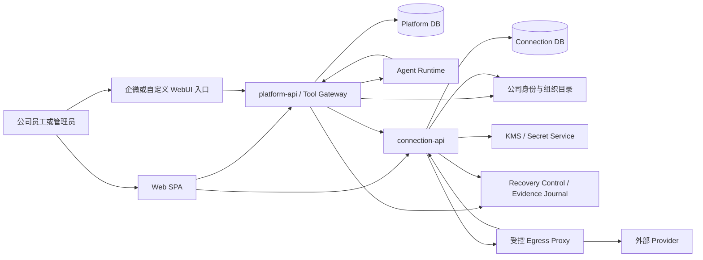

### 6.1 权威数据矩阵

| 数据或决策 | 权威系统 | 非权威副本或引用 | 来源 |
| --- | --- | --- | --- |
| 公司用户状态和组织成员关系 | 公司身份系统 | 请求期解析结果，不持久化为永久权限 | [PRD] |
| Agent、Owner、Agent 可用范围和渠道能力 | Platform | Permit 中的不可变调用快照 | 权威归属：[PRD]；Permit快照：[本项目设计决策] |
| Owner 当前 Action 选择 | Platform | Connection 仅按 ActionVersion 校验当前发布状态 | Owner选择权威：[PRD]；Connection校验方式：[本项目设计决策] |
| 用户到 Agent/Connection 的 Grant 和确认 Action 集 | Platform DB | Connection 中的审计投影不可写 | Platform Grant权威：[现有工程 Spec]；只读投影：[本项目设计决策] |
| Provider、ProviderRelease、ActionVersion 和发布状态 | Connection DB | Platform 目录缓存/投影 | 目录/发布权威：[PRD]；版本与投影结构：[本项目设计决策] |
| 个人或共享 Connection、外部账号归属和共享范围 | Connection DB | Platform Grant 只保存稳定 Connection ID 与 account binding revision | Connection归属/范围：[PRD]；revision引用：[本项目设计决策] |
| OAuth、Credential 密文和 refresh 状态 | Connection DB + KMS | 其他系统无副本 | Credential归属：[PRD]；Connection DB/KMS基线：[现有工程 Spec] |
| ActionCall、Provider attempt、外部 Effect 和脱敏调用结果 | Connection DB | Platform 保存 callId 和用户时间线引用 | Action持久化边界：[现有工程 Spec]；attempt/Effect/投影：[本项目设计决策] |
| 对话、execution、toolCall 和渠道上下文 | Platform DB | Permit 中包含最小绑定，不含会话正文 | Platform上下文归属：[现有工程 Spec]；Permit最小绑定：[本项目设计决策] |
| Alternate attempt 的签名终态 receipt | Connection DB | Platform 保存首次验签后冻结的 terminal projection、原 Connection signature evidence 和 source provenance | [本项目设计决策]，仅在 G-17/G-18 对应条件能力启用后存在 |
| Platform 对 alternate terminal receipt 的首次接纳时间、source、SIGNED acceptance proof 和 durable delivery receipt | Platform DB | Connection 保存不可变 proof witness、terminal-ack projection、canonical ACK 与 acquisition pointer；这些副本不能反向成为 Platform 授权或状态权威 | [本项目设计决策]，仅在 G-17/G-18 对应条件能力启用后存在 |
| 恢复 cohort、执行 generation 和恢复后 policy/catalog validation generation | PITR 域外 Recovery Control | 两个业务库 runtime 行只保存验签后的事务镜像 | [本项目设计决策] |
| Agent policy/Catalog安全变更与Shared永久disable的恢复证据序列 | PITR域外签名Recovery Evidence Journal | 业务库保存receipt/checkpoint、逐对象validation overlay和disable materialization；正常业务状态仍以各自DB为准 | [本项目设计决策] |

### 6.2 硬性系统边界

**[PRD]** 当前用户、授权关系和目标外部账号不能由 Agent 或调用方提交、替换或覆盖；浏览器、Agent 和模型传入的身份字段不是授权依据。

**[本项目设计决策]** 该规则同样覆盖 Sandbox 输入和 Provider 返回内容。服务端从公司身份、execution、Agent 配置和 Grant 解析当前用户、Agent、Connection 与外部账号；任何不可信内容只能提供 Action 参数，不能改变授权主体。

**[本项目设计决策]** Agent Runtime 唯一可见的工具调用输入是 Provider-qualified `toolName`、符合 Schema 的 `args` 和 Platform 签发的 execution token。`toolName` 由 Platform 目录按 `conn__{providerKey}__{actionKey}` 生成并全局检查唯一，再服务端解析为 `providerId + actionId + exact actionVersionId`；不能只用可能跨 Provider 重名的 `actionKey`。Agent 不接收 `connectionId`、`grantId`、`permitId`、外部账号标识或 Credential。

**[现有工程 Spec]** Agent Pod 只能访问 Platform Tool Gateway，网络策略拒绝其访问 Connection DB、Connection API、KMS 和 Provider Credential endpoint。

**[本项目设计决策]** Platform 不读取 Connection DB，Connection 不读取 Platform DB。跨边界只使用版本化 HTTP、服务身份、短期 Permit、outbox 事件和稳定关联 ID。

**[本项目设计决策]** 正常路径中，Connection 的 receipt/proof witness 与 Platform 的 projection/acceptance proof 各自只证明另一侧已经发生的不可变事实，不能成为对方业务状态的可写副本。唯一受限例外是 28.7 的 `QUARANTINED` PITR repair：它只能用原权威方已经签名且另一侧原样保存的 witness 恢复**同一历史字节和身份**，不能据此创建新 Grant、Connection、attempt、successor、当前授权或新的接纳时间。

## 7. 信任边界与调用主体

| 边界 | 调用主体 | 认证 | 授权依据 | 禁止行为 |
| --- | --- | --- | --- | --- |
| Browser -> Platform | 公司员工 | 公司会话 Cookie / Identity Gateway | 实时公司身份、Agent 范围 | 接受 body 中的 userId/agent owner 身份 |
| Browser -> Connection | 公司员工或管理员 | 同一公司会话或等价网关身份 | 当前用户、RBAC、实时组织关系 | 以 URL 中 ownerId 决定数据范围 |
| Agent -> Tool Gateway | Agent workload | workload service identity + execution token | Platform execution 记录 | 传入 userId、connectionId 或 permit |
| Platform -> Connection | `platform-api` | mTLS 或公司等价服务身份 | 一次性 Permit + 本地 live state | 仅凭集群网络或可重放 JWT 放行 |
| Connection -> Platform redeem | `connection-api` | mTLS + audience 限制 | Permit hash、callId、argsHash | 把 token 返回 Browser/Agent，或允许其代为兑换 |
| Connection -> KMS | `connection-api` workload | 独立 workload identity | key policy、environment、purpose | Platform/Agent 使用解密权限 |
| Connection Provider Adapter -> Egress Proxy | `connection-api` workload | workload mTLS + per-request JWS + keyed envelope MAC | exact durable owner/hop、current Control/generations/Catalog overlay | 直连公网、复用旧JWS/MAC、把TCP连接当授权 |
| Egress Proxy -> Connection admission/receipt | `provider-egress-proxy` workload | Proxy专用mTLS/audience | exact hop/JTI/MAC/control lease；DB take-once CAS | 通用Connection API/DB访问、把receipt当第二次发送许可 |
| Egress Proxy -> Provider | `provider-egress-proxy` workload | 受控网络身份 + strict TLS | 首次`ACCEPTED_NOW`、endpoint/DNS/TLS policy、同一request/stream | 在admission未知/重复后发送、跨Provider header转发 |
| SRE diagnostic -> management-read | SRE diagnostic runner | 独立diagnostic mTLS identity | 固定GET route与bounded allowlist | mutation、Secret/payload/业务identity查询 |
| Recovery runner -> recovery-command | short-lived recovery runner | 独立recovery mTLS identity + fixed audience | current QUARANTINED Control、连续Journal、exact signed evidence、双人审批 | 修改phase/OPEN或policy/Catalog字段、调用业务/admin route |
| Platform alternate-terminal recovery runner -> Platform terminal restore | short-lived Platform recovery runner | mTLS audience=`platform-recovery-command` + certificate purpose=`PLATFORM_TERMINAL_ACCEPTANCE_RESTORE` | current QUARANTINED Control、Platform restore scope、exact mirror/cohort/generations/fence及原Platform-signed witness | 复用普通event/snapshot入口、创建新terminal事实、修改phase/OPEN或调用其他recovery command |
| Platform alternate-terminal recovery runner -> Connection witness resolve | 同一事故operation的route-specific cross-service recovery identity | mTLS audience=`connection-recovery-command` + certificate purpose=`PLATFORM_TERMINAL_ACCEPTANCE_WITNESS_RESOLVE` | exact current recovery tuple与claim，只读返回Connection已保存的原canonical witness envelope | 枚举任意Connection、拆字段返回、重序列化proof、写Connection领域事实或调用其他Connection route |

**[本项目设计决策]** Provider executor 与 `connection-api` 同进程并能接触解密后的 Credential，因此属于高权限供应链代码。M1 只装配经过代码、安全和网络出口评审的 Provider allowlist；目录中存在定义不等于自动允许执行。

## 8. 部署拓扑

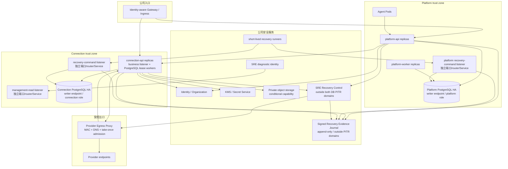

**[现有工程 Spec]** M1 保持 `connection-api` 一个独立部署单元和一个独立数据库账号，不拆出 OAuth、目录、执行、审计或 worker 微服务。

**[本项目设计决策]** HTTP 处理、outbox、refresh、Effect reconciliation 和清理任务运行在同一镜像中；后台任务通过 PostgreSQL lease、`FOR UPDATE SKIP LOCKED` 或等价 fenced lock 认领，内存队列不保存权威状态。

**[本项目设计决策]** 至少部署两个 `connection-api` 副本以验证无本地单例假设。副本数和资源规格由容量测试形成基线，不在 HLD 虚构吞吐承诺。

**[本项目设计决策]** 图中的management-read和recovery-command是同一签名镜像/Deployment内的独立listener与Service，不是新增业务微服务；它们使用不同端口、router、证书audience、ServiceAccount可达策略和NetworkPolicy。Platform提供等价的recovery-command listener以应用Agent policy evidence。Diagnostic只能到management-read；短生命周期runner只能到对应command Service；两者都不能经业务Ingress互相替代，具体route见22.11/28.1。

**[本项目设计决策]** 本稿为 **Terminal Recovery Route 方案 A** 提出以下候选实现：把alternate terminal restore和witness resolve登记为两个独立logical operation，并分别展开为Platform与Connection recovery-command listener上的一个physical instance。它们不是三类typed evidence endpoint的request variant，不共用operation ID、serializer allowlist、audience或certificate purpose；它们增加business/protocol registry计数，但不增加Deployment、process target或3/12 operational route。该方案尚未获得独立Owner确认，也不关闭G-17 Product Gate、两份PRD回写、工程Spec更新、D-20/ADR批准或正式设计评审。

**[本项目设计决策]** Recovery Control 是公司 SRE/DR control plane 中独立于 Platform/Connection 业务库 PITR 的条件写控制对象，不是第三个业务数据库或消息系统。两服务的 runtime generation 行只是它的本地镜像；恢复出的旧`OPEN/ACTIVE`行若与外部control object的cohort/generation/phase不同，相关readiness、Permit、worker claim和egress全部拒绝。签名Recovery Evidence Journal同属PITR域外安全控制能力，只保存安全相关对象ID/revision/canonical checksum、restrict/enable决定、sequence/hash chain、审批和bounded encrypted diff；它不保存Credential/Grant/Call payload，也不接受运行时权限查询，正常业务DB仍是权威。由于这些production Adapter、恢复listener和workload identity改变部署、身份与接口边界，必须先更新工程Spec并批准对应ADR，本文随后才可把相关决策标为Approved或进入实现。

## 9. Connection bounded context

### 9.1 模块分解

| 模块 | 负责 | 依赖 | 不负责 |
| --- | --- | --- | --- |
| Provider Catalog | Provider/Action 导入、校验、版本、发布、停用 | OpenConnector Catalog Adapter、Connection Store | Owner 选择和用户 Grant |
| Provider Governance | allowlist、变更分类、发布检查和升级报告 | Catalog、审计、供应链扫描 | 动态加载未知第三方代码 |
| Connection Account | 个人/共享 Connection、归属、共享范围、账号 fingerprint、状态机 | Identity Adapter、Connection Store | Agent 可用范围和会话 |
| Authorization Flow | OAuth transaction、callback、API Key 替换、重连 | Provider Auth Adapter、KMS、Store | 保存 Agent Grant |
| Credential Vault | envelope encryption、revision、refresh lease、CAS、rotation | KMS Adapter、Store | 向调用方返回明文 Credential |
| Execution Authorization | Permit 校验/redeem、live Connection/Action/scope 交集 | Platform Permit Client、Catalog、Account | 创建或修改 Platform Grant |
| Action Execution | 输入输出校验、幂等、attempt、effect、Provider 调用、对账 | Provider Adapter、Credential Vault、Egress Client | 任意 Provider proxy |
| Connection Audit | 连接、目录、Credential 状态和 Action 调用审计 | Store、Platform 审计投影 | 保存聊天正文或模型思考 |
| Background Maintenance | outbox、refresh、清理、reconciliation、projection | PostgreSQL leases | 以内存队列作为事实来源 |
| Recovery Control Adapter | 外部 cohort/generation/phase 条件读写、本地镜像校验 | 公司 SRE/DR control plane | 保存业务授权或替代两侧数据库 |
| Recovery Evidence Adapter | policy/catalog安全变更与Shared disable tombstone append、签名receipt、连续head读取和恢复evidence验证 | PITR域外签名Journal | 直接回答业务授权、保存Secret或绕过逐对象复核 |

### 9.2 依赖方向

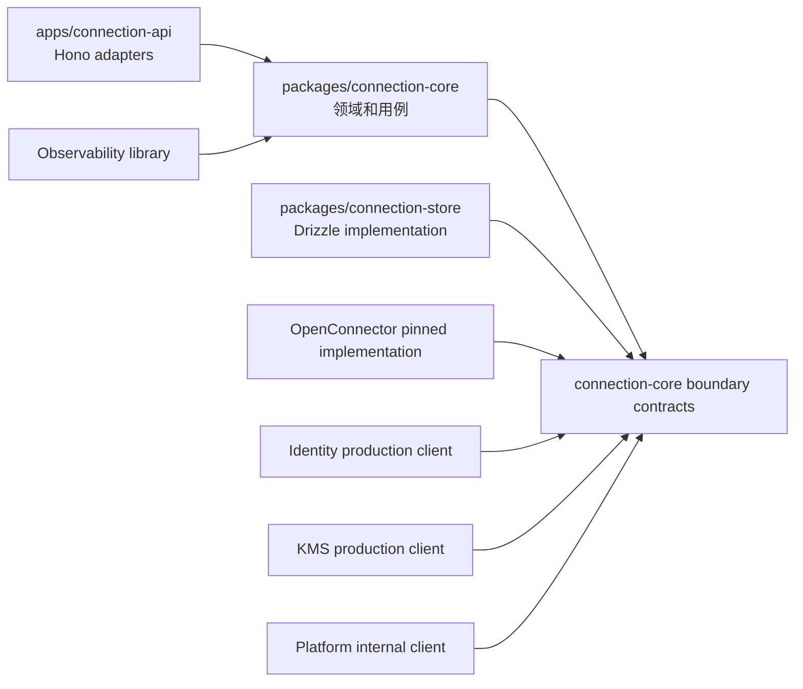

**[现有工程 Spec]** Hono Context、Drizzle transaction、Provider token 和网络响应不能进入领域接口。应用层把认证主体、命令和已明确的边界实现装配给 `connection-core`。

**[现有工程 Spec]** 工程 Spec 6.3 列明的外部依赖必须形成最小边界契约，并提供一个生产实现和测试 Fake；该要求用于隔离领域规则与外部 I/O，不表示已经存在两个可替换的真实实现。

**[本项目设计决策]** 测试 Fake 不计作第二个真实 Adapter。M1 对工程 Spec 已明确列出的 Identity、KMS/Secret Service 和 OpenConnector Provider/Action 执行边界实现最小协议契约、单一生产 client/implementation 与 conformance Fake，但不预设运行时可切换的 Strategy/Plugin 接口。Platform internal HTTP client按经正式门禁批准后的版本化协议实现；批准前只冻结候选 contract 与 conformance Fake。Clock、ID Generator、Store 和 observability使用具体库或模块契约，不为了测试再包一层可替换接口。只有确认两个真实 Adapter 后才增加可替换接口。Recovery Control、Recovery Evidence Journal、Egress Proxy等新增外部协议边界必须先进入工程 Spec和ADR，再以具体client、协议契约和测试Fake实现；在对应Gate批准前，本文的候选接口不能冒充现有工程基线。

## 10. OpenConnector 复用边界

### 10.1 审计基线

**[OpenConnector 参考]** 在固定 Commit checkout 执行 `npm run generate:catalog`，generator 输出 `Generated 1211 apps and 12996 actions.`；随后对按路径排序的 `catalog/apps/*.json` 逐文件 SHA-256 再聚合，得到 `86bf6e351dff2e896c15960a63fd464274166d758f642598b9aab0c1b8ae7189`。该结果可由 37.2 的命令重现。

**[本项目设计决策]** 上述数量只用于证明需要目录索引、按需加载和生产 allowlist，不能证明这些 Provider 已通过本项目安全与真实调用验收。

**[OpenConnector 参考]** 上游开源 Runtime 支持本地/自托管部署、admin token、persistent runtime token 和可选 JWT；其授权主体是部署级调用方与 connection alias。上游 admin/runtime auth 和本地数据加密可以缺省，SQLite/D1 是权威存储，Action run log 发生在 Provider 调用之后且允许 best-effort 失败。

**[本项目设计决策]** 上述上游行为不表达公司用户、Agent、Personal/Shared scope 和逐调用 Grant，不能直接充当 M1 企业身份、授权、存储或审计边界。

### 10.2 复用矩阵

| 上游能力 | 决策 | 本项目约束 | 来源拆分 |
| --- | --- | --- | --- |
| `ProviderDefinition`、Action Schema、scope/permission 描述 | 复用并适配 | 导入后生成本项目不可变 ActionVersion | 上游机制：[OpenConnector 参考]；约束：[本项目设计决策] |
| immutable catalog snapshot、`actionsById`、lazy executor import | 复用 | 仅 allowlisted Provider 可加载 executor | 上游机制：[OpenConnector 参考]；约束：[本项目设计决策] |
| OAuth PKCE、短期 state、take-once、token endpoint 防护 | 复用算法和测试意图 | 状态和密文改存 PostgreSQL + KMS，绑定公司主体 | 上游机制：[OpenConnector 参考]；PostgreSQL/KMS：[现有工程 Spec]；主体绑定：[本项目设计决策] |
| refresh single-flight + revision CAS | 复用语义 | 进程内锁替换为跨副本 DB lease + revision fence | 上游机制：[OpenConnector 参考]；约束：[本项目设计决策] |
| JSON Schema 输入校验 | 复用 | 增加 canonicalization、输出校验和大小/深度限制 | 上游机制：[OpenConnector 参考]；约束：[本项目设计决策] |
| guarded fetch、逐跳 DNS/redirect 检查、跨 origin header 移除 | 复用并加固 | 统一收口到 Connection-owned 单一生产 `ProviderHttpClient`；Pod 只能连接受控 proxy，禁止直连公网 | 上游机制：[OpenConnector 参考]；约束：[本项目设计决策] |
| HTTP idempotency claim/replay/request hash | 参考状态机 | hash 加入用户、Agent、Grant、Connection 与 Action revisions | 上游机制：[OpenConnector 参考]；约束：[本项目设计决策] |
| bounded audit summary 与敏感字段脱敏 | 复用测试语料 | 执行前必须有持久化 intent；审计写失败不可伪装成功 | 上游机制：[OpenConnector 参考]；Provider前持久化：[现有工程 Spec]；失败语义：[本项目设计决策] |
| discovery-oriented MCP 元工具 | 不进入 M1 runtime | Platform 已有 Tool Gateway；可作为未来目录搜索参考 | 上游对象：[OpenConnector 参考]；处置：[本项目设计决策] |
| Provider proxy | 禁止 | Agent 只能调用已发布 Action | 已发布Action边界：[PRD]；禁止装配上游proxy：[本项目设计决策] |
| Runtime Server、Web Console、runtime token、JWT claims | 禁止装配 | 上游主体不映射企业授权 | 上游对象：[OpenConnector 参考]；处置：[本项目设计决策] |
| SQLite/D1 store、global alias | 禁止装配 | 使用独立 PostgreSQL 和 opaque Connection ID | 禁用对象：[OpenConnector 参考]；PostgreSQL边界：[现有工程 Spec]；opaque ID：[本项目设计决策] |
| 可选 AES SecretCodec、无 key 明文回退 | 禁止装配 | KMS 不可用时 fail closed | 上游对象：[OpenConnector 参考]；处置：[本项目设计决策] |
| public transit file URL | 禁止装配 | 文件使用公司对象存储和主体绑定短期授权 | 禁用对象：[OpenConnector 参考]；对象存储：[现有工程 Spec]；主体绑定：[本项目设计决策] |
| Provider 执行后 best-effort run log | 禁止复用 | 先持久化 ActionCall/Effect，再出站 | 上游行为：[OpenConnector 参考]；Provider前持久化：[现有工程 Spec]；Effect边界：[本项目设计决策] |

### 10.3 Fork 和升级策略

**[现有工程 Spec]** OpenConnector 以内部 Fork 的固定私有 package 进入 `connection-api`，不额外部署上游 Runtime Server。

**[本项目设计决策]** Fork 必须保留上游 remote，并记录：

- `upstreamCommit`、内部 package version、导入时间和生成目录 checksum。
- 本地 patch 清单及其安全目的，避免散落修改无法审查。
- Provider/Action 增删改报告、授权摘要变化和需要重新确认的 ActionVersion。
- 依赖许可证、漏洞、Node-only 能力、网络目的地和 executor 权限变化。
- 升级前后的 Credential 隐藏、SSRF、scope、幂等、输出校验和真实 Provider smoke 结果。

未通过 conformance suite 的上游升级不能进入发布目录。上游 Provider 数量增加不能自动扩大生产 allowlist。

## 11. 标识、修订与全局不变量

### 11.1 标识规则

| 类型 | 格式 | 生成方 | 可见范围 | 权限用途 |
| --- | --- | --- | --- | --- |
| `providerId`、`actionVersionId`、`connectionId` | UUIDv7 | Connection | API 中 opaque | 可以作为资源键，但必须与主体条件共同查询 |
| `providerKey`、`actionKey`、派生 `toolName` | 稳定 lowercase 字符串 | Provider package / Platform catalog | Agent 只见全局唯一 toolName | 只定位能力，不决定授权 |
| `grantId`、`executionId`、`toolCallId` | UUIDv7 | Platform | Platform 和关联审计 | Platform 权威资源 |
| `permitId` | UUIDv7 | Platform | Platform、Connection | 一次调用许可键，不向 Agent/Browser 暴露 |
| `callId`、`attemptId`、`effectId` | UUIDv7 | Connection | Platform 引用、用户调用详情 | 调用与外部效果关联 |
| `auditEventId`、`outboxEventId` | UUIDv7 | 各事件源 | 跨系统去重 | 不作为业务授权依据 |
| OAuth `state`、confirmation token、Permit token | 256-bit CSPRNG opaque value | 对应权威服务 | 只在协议中短时出现 | 权威比较使用 SHA-256 hash；OAuth/confirmation另有短期KMS加密response-replay副本，Permit明文永不持久化 |
| `externalAccountFingerprint` | versioned keyed HMAC | Connection | 不对普通用户显示 | 同账号重连比较，不可由客户端提交 |

**[本项目设计决策]** UUID 的有序性只帮助索引局部性，不能代替 `createdAt`、revision 或 fence。任何权限查询必须同时包含当前主体和资源状态，不能先按 opaque ID 取出后再在应用层补 owner 判断。

### 11.2 Revision 和 fence

| 名称 | 所属系统 | 何时递增 | 不递增场景 | 绑定用途 |
| --- | --- | --- | --- | --- |
| `providerRevision` | Connection | Provider 运行配置或发布指针变化 | 调用统计变化 | 目录同步和停用 fence |
| `actionVersionId` | Connection | Action 产生任何不可变新版本 | 不允许原地修改 | Owner 选择、用户确认、Permit |
| `authorizationDigest` | Connection | 用途、输入输出 Schema、required scopes、effect class 变化 | 纯展示文案且语义不变 | 判断是否需要重新选择/确认 |
| `connectionRevision` | Connection | Connection 任意持久化状态变化 | 无 | 乐观并发和审计 |
| `accountBindingRevision` | Connection | 首次绑定，或经明确迁移重新证明 external fingerprint/issuer/tenant/subject | 同账号重连、scope 和共享范围变化 | Grant 确认防止账号偷换 |
| `externalScopeRevision` | Connection | Provider 有效 scope 集合变化 | token 变化但 scope 相同 | Permit 与 Action required scope 交集 |
| `sharedScopeRevision` | Connection | Shared 的 USER/ORG 配置集合变化 | 实时组织成员变化由身份断言处理 | Permit 和共享范围审计 |
| `connectionExecutionFence` | Connection | 断开、重连完成、禁用、账号/scope/共享范围变化等必须淘汰旧执行许可的转换 | 不改变可执行性的展示字段变化 | Permit 和 dispatch live check |
| `credentialSetRevision` | ConnectionAccount | current Credential 指针或其可用性变化 | display profile、同版本 lease 续期 | active pointer/refresh CAS 和执行选择 |
| `credentialStateRevision` | CredentialVersion | lifecycle、refresh lease 或销毁状态变化 | Connection 展示字段变化 | 单版本状态 CAS；不进入 AEAD AAD |
| `encryptionRevision` | CredentialVersion | CredentialVersion 创建时固定；重新加密必须创建新版本 | lifecycle/lease、仅 rewrap DEK | 不可变 AEAD AAD |
| `ownerActionSetRevision` | Platform | Owner Action 集变化 | 调用发生 | ExecutionGrant/Permit |
| `agentAuthorizationRevision` | Platform | Agent 状态、Owner Action、可用范围或渠道执行策略任一变化 | 调用统计、展示文案变化 | 所有 Platform 授权命令的共同线性化根 |
| `grantRevision` | Platform | Connection 选择、确认快照、状态变化 | Permit 签发 | 撤销、切换和扩权 fence |
| `authorizationFence` | Platform | 稳定 GrantSlot 上的创建、替换、撤销或确认变化 | 只读查询 | issue/redeem 与撤销线性化 |
| `platformRecoveryGeneration` | Recovery Control，Platform 镜像 | 任一业务 DB restore/PITR 或可能丢已提交写的故障转移所建立的 recovery cohort | 普通发布、Pod 重启或已证明零数据丢失的故障转移 | 淘汰旧 Permit，并让恢复出的 Grant 进入重确认隔离 |
| `connectionRecoveryGeneration` | Recovery Control，Connection 镜像 | 与 Platform 同一 recovery cohort 旋转 | 同上 | 淘汰旧 Permit、lease、OAuth/refresh/revoke、Call 和 Dispatch |
| `connectionDataValidationGeneration` | Recovery Control，Connection 镜像 | Connection DB 本身发生可能丢写的 restore/failover | Platform-only restore、普通发布和零数据丢失故障转移 | 让恢复出的 Account/Shared scope 必须重新鉴权确认 |
| `platformPolicyValidationGeneration` | Recovery Control，Platform 镜像 | Platform DB 本身发生可能丢写的 restore/failover | Connection-only restore、普通发布和零数据丢失故障转移 | 让恢复出的 Agent owner、范围、渠道和 Owner Action policy 在重放/复核前不可签 Permit |
| `catalogValidationGeneration` | Recovery Control，Connection 镜像 | Connection DB 本身发生可能丢写的 restore/failover | Platform-only restore、普通发布和零数据丢失故障转移 | 让恢复出的 Provider/Release/ActionVersion 和 kill switch 状态在重放/复核前不可执行 |
| `mutationLedgerGeneration` | Recovery Control，Platform/Connection 镜像 | Effect Ledger acknowledged commit连续性无法证明、mutation authority重建或恢复cohort按策略旋转 | 普通发布、Pod重启和已证明Effect Ledger零丢失的故障转移 | 让mutating preview、Permit、Signer、Admission和request start共同绑定同一RPO=0证据代次；通用OPEN不能替代 |

**[本项目设计决策]** Revision 为单实体单调递增 `bigint`，不使用更新时间戳做 CAS。跨实体集合使用显式 revision 或不可变快照 ID，避免“读取多行后靠最大更新时间”产生遗漏。Recovery/validation generation 是 Recovery Control 生成的随机 opaque value，不参与大小比较，也不能用“被恢复库中的旧值加一”生成。Execution generation 淘汰旧执行对象；validation generation 隔离可能回退的业务配置。二者不能互相替代。

### 11.3 全局不变量

以下不变量必须同时由领域测试、数据库约束和接入层校验保护：

1. **[PRD]** Personal Connection 只有一个公司用户 Owner，不能转换为 Shared。
2. **[PRD]** Shared Connection 的共享范围不等于 Agent Grant，不能自动创建 Grant。
3. **[PRD]** 同一 `user + agent + provider` 最多只有一个当前授权 Connection；**[本项目设计决策]** 以最多一个current `ConnectionGrant`及数据库partial unique落地。
4. **[PRD]** Agent Owner 选择 Action，不选择普通用户的外部账号。
5. **[PRD]** Agent、Browser body 和模型输出都不能成为 user、Agent、Connection 或外部账号的授权来源。
6. **[本项目设计决策]** 每个 Permit 只能绑定一个规范化参数 hash 和一个 `callId`；跨 call 重放必须冲突。
7. **[本项目设计决策]** Provider 出站前必须已有 ActionCall、ActionAttempt、LogicalEffect 和 EffectDispatch intent。
8. **[PRD]** Action、Provider、Connection、公司账号或共享范围任一当前无效时，新出站请求必须 fail closed。
9. **[本项目设计决策]** Credential 明文只存在于单次执行或 refresh 的受控内存范围，不进入异常、日志、Trace、事件、队列或持久化 payload。
10. **[本项目设计决策]** `UNCERTAIN` 外部效果不能通过普通重试再次执行，只能对账或由明确的人工作出新调用决定。
11. **[本项目设计决策]** Recovery generation 是业务 DB 恢复**之前**由外部 Recovery Control 用 CSPRNG 生成的 128-bit 不可预测新值，不是保存在同一被恢复数据库中的自增数；任一业务 DB restore/PITR 前必须先冻结入口/egress，并为同一 cohort 旋转 Platform/Connection execution generations。任何旧 generation 的 Permit、Grant、lease、OAuth callback、refresh、revoke、Call 或 Dispatch 都不能继续授权或出站。
12. **[本项目设计决策]** Platform 或 Connection DB 可能丢写后，分别恢复出的 Agent policy 或 Catalog lifecycle 行都不是可立即执行的 current policy。其 validation generation 必须等于 Recovery Control 当前值，且已由 PITR 域外连续证据重放或双人全量复核；否则 preview/Permit 或 Provider 出站必须为零。
13. **[本项目设计决策]** 每次 Provider 出站必须同时验证 Provider、exact ProviderRelease 和 exact ActionVersion 当前可执行且已在本代 Catalog 复核；任一层 DISABLED、validation generation 过期或 executor/release digest不符都在逻辑请求/HTTP2 stream 接受前 fail closed，不能只检查父 Provider或目录 current pointer。
14. **[本项目设计决策]** ToolConnectionInvocation 首次签发 Permit 时冻结 `grantId + connectionId + accountBindingRevision + preauthorizationRequestHash`；同一 toolCall 之后不得因 Grant 切换、账号更换、重绑或另一 Call 的 Permit 而静默执行。
15. **[本项目设计决策]** 每个 EgressDispatchAssertion 的 `(issuer,kid,jti)` 只能由共享强一致 admission store 接受一次；只有本次 CAS 返回 `ACCEPTED_NOW` 的 proxy 请求可以创建逻辑外部请求、HTTP/2 stream 或写出首字节。
16. **[本项目设计决策]** Agent policy、Catalog和Shared永久disable的restrictive mutation必须先提交PITR域外、不可取消的final `RESTRICT` barrier，再物化业务库deny；barrier已提交而本地状态未提交、未知或被PITR回退时，preview、confirm、Permit、eligibility、revalidate、Signer和dispatch都必须拒绝。Policy/Catalog恢复能力只能是新的permissive operation；Shared disable永久tombstone没有permissive operation。任何旧barrier都不能删除、覆盖或取消。
17. **[本项目设计决策]** 任何mutating Action出站前，其ActionCall、LogicalEffect、EffectDispatch、ProviderEgressHop、Admission和receipt所在Effect Ledger durability domain必须绑定当前Control version的完整`MutationDurabilityEvidenceV1`：`CONTINUITY`直接证明风险窗口零丢失，或`PROVIDER_COVERAGE`完整重建/对账该窗口；两者都绑定exact Catalog mutating set并证明恢复后未来acknowledged commit仍RPO=0。任一字段缺失、过期、集合变化或可能丢失枚举锚点时，外部Control必须保持`MUTATION_RECOVERY_BLOCKED`；不能用“把仍看得到的行标UNCERTAIN”推断丢失行不存在。
18. **[本项目设计决策]** Admission accept 端必须独立验证 Recovery admission lease proof 的签名、主体、版本、代次、Proxy mTLS binding、nonce 和有效期，并把 exact proof、Hop、JTI、MAC 与 generation tuple 以数据库约束绑定。Receipt 只能证明 transport 事实，不能再次授予发送权。
19. **[本项目设计决策]** `ConnectionUserEntitlement`是连续资格stable root，证据只能append version并让current pointer单调指向同root最大revision。Connection data generation变化后G0不得eligible；Personal只有以PITR域外current authority epochs证明continuity时才可在同epoch追加G1。M1没有PITR域外Shared scope lifecycle证据，因此Shared恢复出的旧root一律单向REVOKED，fresh eligibility只可为当前有效资格创建new root/new epoch。Platform只为current exact evidence创建immutable binding；旧Grant只能按source/target协议被替换或终结，不能原地换binding或被事件复活。
20. **[本项目设计决策]** Platform 对同一 alternate terminal claim 首次合法接纳的 `HTTP_RESPONSE | EVENT | SNAPSHOT` source、原 Connection signature evidence、source artifact、`accepted_at=observed_at` 和 terminal event identity一经提交即冻结；后到source只可独立验签并证明同一receipt，不能改写首次 provenance。Platform-only PITR也只能从原 Platform-signed acceptance proof恢复这些完全相同的历史值。
21. **[本项目设计决策]** Alternate successor 的最小闭环固定为：Connection terminal receipt、Platform terminal projection与原source evidence、Platform `SIGNED` acceptance proof与`READY` outbox、Connection proof witness/terminal-ack projection/canonical ACK/六列pointer、Platform proof-bound durable delivery receipt。任何一层缺失、仍为`BODY_COMMITTED|WAITING_PROOF`、checksum不一致或只收到HTTP 2xx时，successor提交数必须为0。

## 12. 核心领域模型

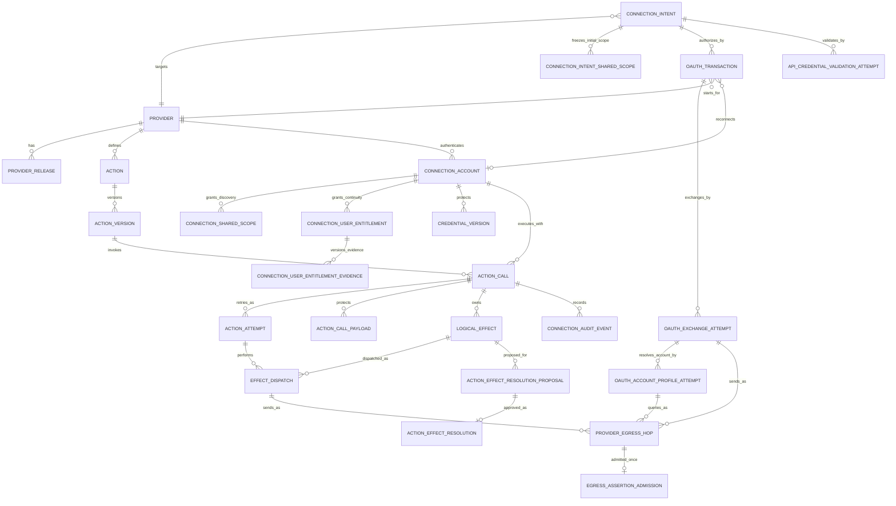

图中的 `ACTION_EFFECT_RESOLUTION_PROPOSAL` 与 `ACTION_EFFECT_RESOLUTION` 仅表示
`ONLY_IF_G04_APPROVED` 候选模型；G-04 未批准时，它们不属于当前 active 领域模型、Schema 或交付物。

### 12.1 聚合边界

| 聚合 | Root | 原子事务范围 | 跨聚合协作 |
| --- | --- | --- | --- |
| Catalog | Provider/ActionVersion | 新版本导入、校验结果、发布指针 | outbox 通知 Platform 目录刷新 |
| Connection Account | ConnectionAccount | 状态、account/scope/shared revisions、execution fence、display profile | Credential 使用独立密文行并通过 revision 关联 |
| Connection Authorization | ConnectionIntent | actor、Provider、连接类型、Shared初始scope快照、鉴权方法、结果和幂等根 | OAuthTransaction 或 API Credential Validation Attempt 完成后创建/更新 Connection |
| OAuth Transaction | OAuthTransaction | state消费、PKCE、current exchange pointer和父流程状态 | 必须属于一个ConnectionIntent；成功时共同完成Intent |
| OAuth Exchange/Profile | OAuthExchangeAttempt / OAuthAccountProfileAttempt | token candidate、network stage、profile evidence、lease/fence和cleanup ownership | 每次Provider逻辑请求有独立EgressHop；本地ID Token证据不伪造network attempt |
| API Credential Validation | ApiCredentialValidationAttempt | write-only Secret 密文候选、提交证据和验证结果 | 必须属于一个 API Key ConnectionIntent；成功时共同完成 Intent |
| Credential | CredentialVersion | 密文、key metadata、状态、refresh CAS | KMS 调用不与 DB 形成分布式事务，使用 staged version |
| Connection Entitlement | ConnectionUserEntitlement | `(Connection,user)`连续资格epoch、current evidence pointer和终结状态 | append-only evidence version复制Identity/scope本次证明；Platform只保存不可变binding |
| Action Execution | ActionCall | 幂等 claim、当前状态、结果引用 | Attempt/Effect 追加写；Permit 通过跨系统协议兑换 |
| Provider Egress | ProviderEgressHop / EgressAssertionAdmission | exact durable owner、JWS/MAC binding、全局take-once CAS和receipt progression | Proxy只有首次ACCEPTED_NOW可发送；Control lease与网络结果跨系统保守收敛 |
| Audit/Outbox | AuditEvent/OutboxEvent | 与产生业务变化的事务同写 | 独立投递和幂等投影 |

## 13. Provider 与 Action 目录

### 13.1 Provider 模型

每个发布 Provider 至少包含：

| 字段 | 含义 | 来源 |
| --- | --- | --- |
| `providerId`、`providerKey`、`displayName` | 稳定内部 ID、机器键和展示名 | [本项目设计决策] |
| `upstreamCommit`、`sourcePath`、`sourceChecksum` | 上游来源与可复现证据 | [本项目设计决策] |
| `authMethods` | OAuth/API Key 等受支持方式 | [OpenConnector 参考] |
| `issuerPolicy`、`allowedOrigins`、`allowedRedirectOrigins` | 账号签发方和网络出口边界 | [本项目设计决策] |
| `accountIdentityContract` | 如何取得稳定 issuer/tenant/subject | [本项目设计决策] |
| `credentialSchema`、`safeProfileSchema` | Secret 输入与可显示字段 | [OpenConnector 参考] |
| `status`、`publishedReleaseId`、`revision` | 管理生命周期与当前发布指针 | 发布/停用生命周期：[PRD]；指针与revision模型：[本项目设计决策] |
| `riskReview`、`licenseReview`、`testEvidence` | 上线治理证据 | [本项目设计决策] |

### 13.2 ActionVersion 模型

每个逻辑 Action 有稳定 `actionId`；每个 ActionVersion 是该 Action 的不可变实现与合同快照，至少包含：

- 稳定 `actionId/actionKey` 与唯一 `actionVersionId`。
- Provider release 和 executor export 的精确引用。
- 用户可见名称、用途、输入说明、输出说明和 required external scopes。
- Draft 2020-12 兼容的输入、输出 JSON Schema 及各自 checksum。
- `effectClass = READ_ONLY | IDEMPOTENT_WRITE | NON_IDEMPOTENT_WRITE`。
- Provider 原生 idempotency key 支持、timeout、可重试错误集合和 `reconcileEffect` 能力。
- Provider request ID 提取、审计摘要、字段级脱敏和最大结果大小规则。
- `authorizationDigest`：对所有会改变用户授权理解的字段做 canonical hash。
- 创建者、来源 commit、验证状态、发布时间、停用时间和原因码。

**[本项目设计决策]** Provider原生幂等不能用一个`supportsIdempotency=true`布尔值表达。每个声明原生幂等的ActionVersion必须引用ProviderRelease内不可变、canonical的`ProviderIdempotencyContractV1`：

```ts
type ProviderIdempotencyContractV1 =
  | {
      schemaVersion: 1;
      mode: "NONE";
    }
  | {
      schemaVersion: 1;
      mode: "NATIVE_EXACT_KEY";
      contractVersion: string;
      keyDerivationVersion: string;
      keyFormatVersion: string;
      keyNamespaceScope: "PROVIDER_ACCOUNT_ACTION_EFFECT";
      placement:
        | { kind: "HEADER"; headerNameLowercase: string }
        | { kind: "JSON_BODY"; jsonPointer: string };
      sameKeySameRequestSemantics: "SAME_LOGICAL_EFFECT";
      sameKeyDifferentRequestSemantics: "REJECT_CONFLICT";
      replayEvidenceKind:
        | "PROVIDER_REQUEST_ID"
        | "RESOURCE_ID"
        | "STATUS_ENDPOINT";
      minimumRetentionSeconds: number;
      endpointPolicyId: string;
      method: string;
      pathTemplate: string;
    };
```

合同checksum覆盖上述完整closed tuple；自由说明、当前发布时间和测试日志不进入checksum。发布门禁要求`minimumRetentionSeconds`覆盖Action总deadline、最大backoff和恢复窗口，真实Provider conformance证明同key同canonical request只产生同一logical effect、同key异request确定拒绝，并验证placement、大小写/JSON Pointer、重复字段、代理重写和response-loss。`NONE`不得带其他字段；`IDEMPOTENT_WRITE`必须引用`NATIVE_EXACT_KEY`，`NON_IDEMPOTENT_WRITE`不得借该合同取得unknown-outcome retry资格。

“兼容policy drift”不是Adapter自行语义比较。LogicalEffect冻结exact contract ID/checksum和完整tuple；current signed `catalog_recovery_validation`还必须逐字节声明支持该原checksum，并携未过期Provider support evidence。只有Effect冻结checksum、ActionVersion引用、ProviderRelease registry和current overlay四者完全相等，且原合同仍在支持期内，才是compatible；executor/Proxy继续按原tuple放置原key。任一字段、checksum、支持证据、有效期或overlay不一致都按incompatible处理，禁止从current合同重派生或把“看起来等价”作为放行依据。

**[PRD]** Agent Owner 只能选择已经发布的 Action。Action 被停用后，新调用立即拒绝，不能因为 Platform 目录缓存仍显示可用而继续执行。

**[本项目设计决策]** Owner 选择和每次执行都保存 exact immutable `actionVersionId`；“已发布 Action”不实现为跟随浮动 latest 指针。

### 13.3 发布状态机

Provider、ProviderRelease 和 ActionVersion 各自使用下列 lifecycle；发布命令在同一事务分别推进涉及的exact rows并维护current pointers。父Provider为DISABLED时，不能因子Release/ActionVersion仍为PUBLISHED而出站；exact ProviderRelease或ActionVersion为DISABLED时，也不能因父Provider仍可用而绕过。

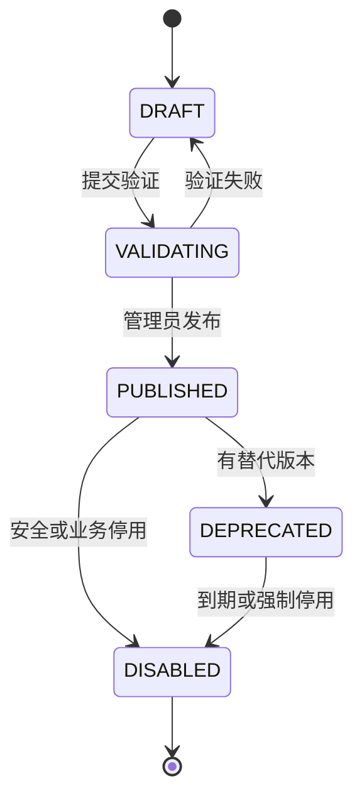

| 转换 | 必要条件 | 副作用 | 来源 |
| --- | --- | --- | --- |
| `DRAFT -> VALIDATING` | Schema、来源、effect class 和测试元数据完整 | 启动静态/契约验证 | [本项目设计决策] |
| `VALIDATING -> PUBLISHED` | 安全、许可证、egress、Fake/真实测试门禁通过 | outbox 发布目录新 revision | 只允许已发布Action：[PRD]；验证门禁/outbox/revision：[本项目设计决策] |
| `PUBLISHED -> DEPRECATED` | 存在迁移说明和替代版本 | 仍可按政策短期使用，不可自动迁移选择 | [本项目设计决策] |
| `* -> DISABLED` | 管理员停用或安全 kill switch | 新出站立即拒绝，记录审计 | 停用后不可调用：[PRD]；状态机/审计原子性：[本项目设计决策] |

**[本项目设计决策]** 上表是持久business lifecycle；执行使用`effectiveCatalogStatus`。任何层stored DISABLED立即deny；其他PUBLISHED/DEPRECATED row只有在21.3存在绑定current `catalogValidationGeneration + exact stateRevision + state/manifest checksum`的overlay才effective executable。Connection DB PITR后旧PUBLISHED只是待复核事实，不能由Account重鉴权、用户重新确认、目录cache或本地OPEN变成可执行。备份点后kill switch从PITR域外Journal重放；证据不连续时保持`CATALOG_REVALIDATION_REQUIRED`。

正常disable以PITR域外Journal的final restrictive record作为write-ahead deny barrier，再在同一资源revision/fence下materialize Connection DB的DISABLED、validation失配、audit/outbox和receipt。Journal record提交后，即使本地事务失败、结果未知或数据库立即丢失，该资源也只可deny；API返回202并由同operation幂等补落，不能取消记录或恢复旧PUBLISHED。publish/enable同样先有批准receipt才落business row和overlay。完整线性化和head lease见28.7；该顺序属于本项目恢复安全设计，不是OpenConnector现成功能。

### 13.4 变更分类

| 变更 | 是否新建版本 | Owner 是否重选 | 用户是否重确认 | 依据 |
| --- | --- | --- | --- | --- |
| 修正错别字但用途、Schema、scope 和 effect 不变 | 是 | 无需被迫升级；升级时仍显式选择 exact version | 否，前提是 `actionId + authorizationDigest` 相同 | [本项目设计决策] |
| 输入/输出 Schema、用途、required scope、effect class 变化 | 是 | 是 | **待 G-05 产品确认，Proposed 为是** | 新版本与Owner重选：[PRD]；用户重确认：[评审门禁 G-05] |
| executor 修复且对外契约和权限摘要不变 | 是 | 是；选择新 exact version，不改写旧版本 | 否，前提是 `actionId + authorizationDigest` 相同 | [本项目设计决策] |
| scope 缩减 | 是 | **是**；required permission 实质变化必须重新发布和重选 | **待 G-05 产品确认，Proposed 为是**，因为 digest 已变化 | 重新发布/重选：[PRD]；用户重确认：[评审门禁 G-05] |
| Provider/ProviderRelease/ActionVersion 安全停用 | 不要求新版本 | 选择立即失效 | 无确认机会，直接拒绝 | 停用立即失效：[PRD]；exact版本拒绝机制：[本项目设计决策] |

**[本项目设计决策]** 任何版本都不能原地覆盖，executor 修复和回滚也创建或重新选择不可变 exact ActionVersion。Owner 配置始终引用 exact `actionVersionId`；用户确认授权键为稳定 `actionId + authorizationDigest`，Snapshot 另存用户当时看到的 exact version 作为证据。Owner 选择同一 Action 的等价版本时，只有 digest 完全相同才可继承用户确认；digest 变化必须走 G-05 结论。是否等价由 canonical digest 决定，不比较自由文本，也不存在可静默改写 executor digest 的浮动部署指针。

### 13.5 Provider onboarding 门禁

一个 Provider 进入生产 allowlist 前必须证明：

1. 能从受信任 API 或已验证 ID Token 获得稳定 issuer、tenant 和 account subject；禁止随机 fallback ID。
2. OAuth redirect、token、profile 和业务 API host 均有明确 allowlist；动态企业域名有可验证的租户配置规则。
3. Credential schema 能区分 secret 与 safe profile，所有 secret 字段进入 KMS envelope encryption。
4. 每个 Action 有输入/输出 Schema、required scopes、effect class、timeout、错误映射和脱敏规则。
5. 多请求 Action 能逐个登记 LogicalEffect 和 EffectDispatch。M1 read-only Action 可有多个 required read Effect；写 Action 必须恰好只有一个 mutating LogicalEffect，且 mutation 后不再执行会改变业务成败的外部步骤。需要多个独立写 Effect 的 Action 不进入 M1 allowlist。
6. 自动重试只针对 read-only 或有 Provider 原生 idempotency key 的写操作。
7. 有 Fake Provider 契约测试、受控真实测试账号、最小 scope 说明和撤销/刷新验证方式。
8. executor 依赖、许可证、网络目的地和潜在 Credential 泄露路径已经评审。
9. 若包含 mutating Action，部署环境已由 SRE 证明 Effect Ledger acknowledged commit 在全部受支持 HA/failover/backup 恢复路径上 RPO=0；Provider 原生完整审计只能作为无法证明连续性后的恢复证据，不能在正常准入时替代 durable prewrite。

## 14. Connection 归属与生命周期

### 14.1 Connection 类型

**[PRD]** 下表的Personal/Shared归属、可发现范围、逐用户Agent授权和不可互转均来自Connection PRD；HLD后续只细化其服务端谓词、数据约束和协议。

| 类型 | Owner | 谁可发现 | 谁可授权给 Agent | 是否可转换 |
| --- | --- | --- | --- | --- |
| `PERSONAL` | 一个稳定公司 `userId` | 仅本人 | 仅本人 | 不可转换为 Shared |
| `COMPANY_SHARED` | 公司管理域；由系统管理员管理 | 当前命中 USER 或 ORG 共享范围的员工 | 每个员工仍需单独授权具体 Agent | 不可转换为 Personal |

**[PRD]** Connection 名称只用于展示和选择，不能作为权限判断依据。

**[本项目设计决策]** 外部 display name、邮箱、组织名称和 masked identifier 同样只属于 safe profile。权限与同账号重连不能使用这些可变字符串，只使用服务端验证的 stable subject 与 fingerprint。

### 14.2 Connection 持久状态与恢复覆盖层

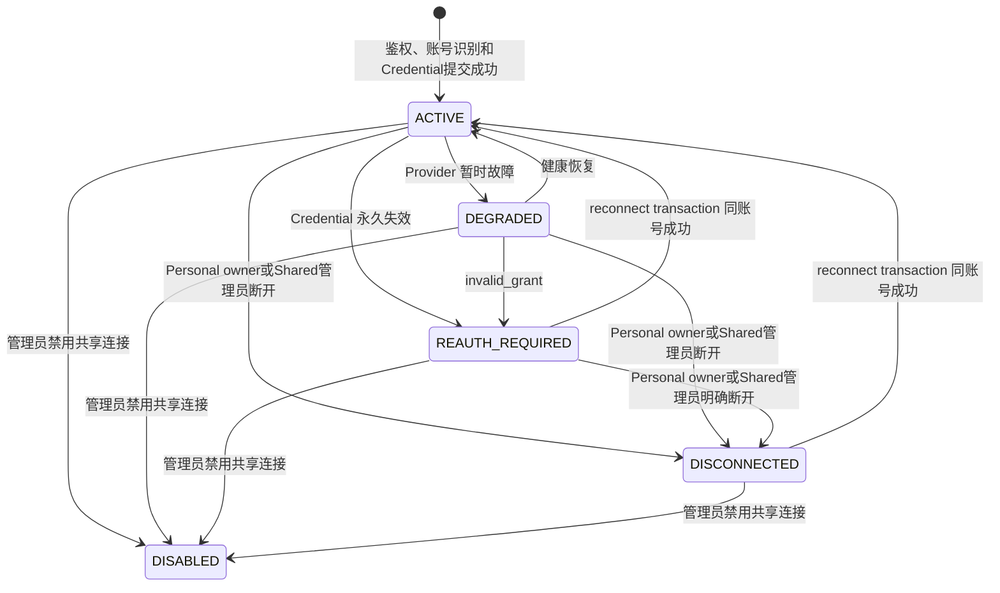

图中只包含 `connection_account.stored_status` 的持久枚举：`ACTIVE | DEGRADED | REAUTH_REQUIRED | DISCONNECTED | DISABLED`。恢复需求先由独立谓词计算；`RECOVERY_REVALIDATION_REQUIRED`是非DISABLED账号的恢复覆盖层effective status，不是可写入数据库的第六个状态，也不参与上图transition：

```text
needsRecoveryRevalidation(account, runtime) =
  account.validatedDataGeneration != runtime.dataValidationGeneration

effectiveConnectionStatus(account, runtime, journalSafetyGate) =
  DISABLED
    if account.storedStatus == DISABLED
       or journalSafetyGate.hasFinalSharedDisableTombstone(account.id)
  RECOVERY_REVALIDATION_REQUIRED
    if needsRecoveryRevalidation(account, runtime)
  account.storedStatus
    otherwise
```

Shared恢复另有环境级收敛谓词，不能折叠进单个Account的stored/effective状态：

```text
sharedEntitlementResetCurrent(runtime, connectionReset, platformCheckpoint) =
  true
    if runtime.sharedEntitlementRecoveryRequired == false
  otherwise
    connectionReset.environmentId == runtime.environmentId
    and connectionReset.recoveryCohortId == runtime.recoveryCohortId
    and connectionReset.platformRecoveryGeneration
      == runtime.platformRecoveryGeneration
    and connectionReset.connectionRecoveryGeneration
      == runtime.recoveryGeneration
    and connectionReset.targetDataValidationGeneration
      == runtime.dataValidationGeneration
    and connectionReset.state == COMPLETED
    and connectionReset.manifestSchemaVersion is supported
    and connectionReset.manifestChecksum is present
    and platformCheckpoint.checkpointId is present
    and platformCheckpoint.sourceResetId == connectionReset.id
    and platformCheckpoint.recoveryCohortId
      == runtime.recoveryCohortId
    and platformCheckpoint.platformRecoveryGeneration
      == runtime.platformRecoveryGeneration
    and platformCheckpoint.connectionRecoveryGeneration
      == runtime.recoveryGeneration
    and platformCheckpoint.targetDataValidationGeneration
      == runtime.dataValidationGeneration
    and platformCheckpoint.state == COMPLETED
    and platformCheckpoint.sourceManifestSchemaVersion
      == connectionReset.manifestSchemaVersion
    and platformCheckpoint.sourceManifestChecksum
      == connectionReset.manifestChecksum
    and platformCheckpoint.platformManifestSchemaVersion is supported
    and platformCheckpoint.platformManifestChecksum is present
```

两侧runtime只镜像Recovery Control按28.7公式计算的Required。Connection DB被恢复，或前代Required义务尚未有Control接受的双侧completion evidence时，它为true；后一种carry-forward即使本次scope不含Connection DB、target data generation不变，也必须在mirror事务创建新cohort/reset、started outbox和后续Platform checkpoint。全新环境、普通运行，以及前代义务已清偿且本次不恢复Connection DB的cohort为false，reset pointer、checkpoint和completion evidence必须为空，不能凭历史reset自行把该位改为true。Required为true且上述谓词为false时，所有Shared eligibility、preview/Confirmation、Permit和revalidation入口都fail closed；Personal仍按自身Account/evidence规则处理。Reset/checkpoint只证明旧root/Grant已经有界终结，不成为当前Shared资格权威，也不能替代Identity fresh check。

API展示、事件、eligibility、Grant产品投影和最终dispatch check一律使用effective status；Store/迁移和状态CAS一律使用stored status。**[评审门禁 G-14]** Proposed的Shared永久disable先在PITR域外Journal形成final tombstone；因此Connection DB恢复出旧ACTIVE行时，JournalSafetyGate仍派生DISABLED并阻止eligibility、reconnect、revalidation和dispatch，materializer随后只可把本地行补落为DISABLED。**恢复Intent创建资格单独使用`needsRecoveryRevalidation`，不得通过effective enum反推**，并且要求`stored_status != DISABLED`且不存在final或未物化Shared disable tombstone。按该Proposed语义，恢复出的Shared `DISABLED`始终展示/执行为DISABLED、Grant保持TERMINATED；tombstone物化前只允许materializer，物化后也不提供revalidation入口。普通用户和live admin都不能以恢复重校验触碰该旧Connection ID，重新接入只能创建新Connection。Product Owner批准并回写PRD前，不得把这一不可逆用户行为标为Approved或进入生产实现。外部Recovery Control/Journal不可读、cohort/phase/mirror不匹配属于环境级`RECOVERY_CONTROL_UNAVAILABLE`门禁，不伪造或批量改写任何ConnectionAccount状态。

| Effective 状态 | 是否可发现 | 是否可新签 Permit | 是否可出站 | Grant 产品状态 |
| --- | --- | --- | --- | --- |
| `ACTIVE` | 按 owner/shared scope | 是 | 是 | 有效 |
| `DEGRADED` | 是 | 可签，但本地 live check 可返回暂时不可用 | 视错误和熔断器 | 暂时不可用，不终止 Grant |
| `REAUTH_REQUIRED` | 是 | 否 | 否 | 暂停，提供重连入口 |
| `DISCONNECTED` | 是，仅用于管理和同账号重连 | 否 | 否 | 暂停 |
| `RECOVERY_REVALIDATION_REQUIRED` | 仅 Personal 原 owner 或 Shared live system admin 管理可见 | 否 | 否 | 恢复覆盖；必须在当前 data generation 重新证明账号/共享范围 |
| `DISABLED` | 普通用户不可新发现；已有引用显示已禁用 | 否 | 否 | 所有引用该Shared Connection的current Grant持久化为TERMINATED；不保留可恢复暂停态 |

ConnectionAccount 只在 OAuth/API Key 鉴权、stable account identity 和 Credential 都已成功提交后创建，初始 stored status 为 ACTIVE。`PENDING_AUTH/AUTH_FAILED/EXPIRED` 属于 `ConnectionIntent`/OAuthTransaction 的 UI 状态，不是 ConnectionAccount status，也不分配可授权的 `connectionId`。`ConnectionIntent` 绑定 actor、kind、provider、auth method、return intent、idempotency claim 和 expiry，状态为 `PENDING | COMPLETED | FAILED_DEFINITE | UNCERTAIN | EXPIRED`；COMPLETED 保存 result connectionId。失败或过期 intent 按保留政策清理，但其安全审计不删除。

恢复重校验不是隐含 reconnect，而是独立 `ConnectionIntent.mode=REVALIDATE_RECOVERY`。Personal 由当前 owner 调用，Shared 由 live system admin 通过独立 admin route调用；Intent 固定 target、旧 `validatedDataGeneration`、当前目标 data generation、expected stored status、Connection/account/Credential/scope revisions 和 execution fence，不创建 reserved Connection ID。它复用 OAuth/API Key child协议，但只接受 same fingerprint；异账号确定失败并引导普通 reconnect/new Connection，不能借恢复命令换号。

成功事务只把 Account和Shared完整active scope验证到Intent固定的当前 data generation，写必要的Credential/scope revisions、提升execution fence并保留**完全相同**的stored status。Shared Intent创建、child出站和最终事务都必须验证本代`sharedEntitlementResetCurrent=true`；root reset与Platform checkpoint未完成时返回`RECOVERY_ENTITLEMENT_RESETTING`，不得先推进Account/scope generation，也不得把per-user eligibility当成reset替代品。`ACTIVE/DEGRADED` 可以原子切换本次fresh Credential但不改变状态；`REAUTH_REQUIRED/DISCONNECTED` 不得留下可执行Credential，API Key candidate立即销毁，OAuth token candidate创建exact revoke cleanup后才可销毁。`DISABLED`或存在任一final Shared tombstone时在Intent创建、child出站和最终事务三处均直接拒绝，不能创建candidate或`connection.revalidated.v1`。提交前还必须在JournalSafetyGate同一fresh decision lease下证明没有该Shared的final或未物化disable tombstone；存在tombstone时只允许disable materializer获胜。提交后 effective status 自然恢复为原 stored status，例如恢复出的 `DISCONNECTED` 仍是 DISCONNECTED。若执行期间stored status/revision/fence、scope checksum、actor role、target generation、Recovery Control、Shared reset checkpoint或Journal head再次变化，Intent以stale/failed结果终结且不更新generation。响应丢失只回放同一Intent结果。

### 14.3 关键转换规则

| 操作 | 前置检查 | 原子变化 | 跨系统结果 |
| --- | --- | --- | --- |
| 创建 Personal | 当前公司账号有效，Provider 已发布 | 先原子创建`AWAITING_USER_ACTION` ConnectionIntent；用户执行nextAction后再以独立事务创建所选 OAuth/API validation child并推进pointer | 尚不创建 Platform Grant |
| 创建 Shared | 系统管理员、Provider 已发布、共享范围合法 | 先原子创建带冻结scope snapshot的`AWAITING_USER_ACTION` Shared Intent；用户执行nextAction后再创建auth child；成功后写 scope revision | 用户仍需独立 Grant |
| 断开 | Personal 仅当前 owner；Shared 仅 live system admin；幂等键 | 先把状态改为 DISCONNECTED、提升 connectionExecutionFence、禁用 Credential并创建 revoke attempt | 后续 redeem/dispatch 立即拒绝；Provider revoke 由 durable worker 执行并保留未知结果 |
| Reauth | Personal 仅当前 owner；Shared 仅 live system admin；进行中旧 Connection 保持原状态 | 新 RECONNECT Intent + OAuth/API child绑定目标、旧 fingerprint、previous status 和 expected fences | 同账号成功原子切换Credential/ACTIVE；失败不改旧状态；异账号创建新Connection、旧Connection本地DISCONNECTED/revoke并发出Grant终止事件 |
| API Key替换 | Personal 仅当前 owner；Shared 仅 live system admin；same fingerprint、expected revisions | REPLACE_CREDENTIAL Intent成功后原子切current Credential并提升fence | 失败/异账号/UNCERTAIN不覆盖原Connection |
| 恢复重校验 | `REVALIDATE_RECOVERY`；`needsRecoveryRevalidation=true`；`stored_status != DISABLED`且无final Shared tombstone；Personal owner或Shared live admin；same fingerprint与current data generation；Shared另要求环境级双侧reset已完成；不依赖effective enum | 保留stored status，更新Account/完整Shared scope generation、必要Credential和execution fence；非可执行stored status不留可执行Credential；不在Account事务批量触碰entitlement root | 发 `connection.revalidated.v1`；Personal仅在continuity可证明时append本代evidence并走RECOVERY_RECONFIRM；Shared旧root已由环境reset终结，当前资格以new epoch走INITIAL；terminal Grant不恢复 |
| 禁用 Shared | **[评审门禁 G-14]** 管理员；stable safety operation与expected revision/checksum | Proposed为先append final Shared disable tombstone，再物化状态 DISABLED、提升 connectionExecutionFence、写审计/outbox | tombstone一提交所有用户新调用立即拒绝；PITR不复活；旧ID不可恢复需Product批准 |
| 修改共享范围 | 管理员、scope revision CAS | 替换不可变 scope 集并提升 sharedScopeRevision 与 connectionExecutionFence | 失去范围的用户不能签发或兑换新 Permit |

**[PRD]** 断开或撤销不会回滚已经提交给 Provider 的操作，产品保留实际完成或失败结果。

**[本项目设计决策]** scope 变化同样只阻止尚未越过 dispatch 资格边界的新操作；已经可能提交给 Provider 的操作不做虚假回滚，继续按实际终态或 `UNCERTAIN` 保存和展示。

**[本项目设计决策]** 本文区分三道边界：Permit redeem 只线性化 Platform 授权接受；Connection 在同一短事务完成 live check 和 Effect/Dispatch intent，线性化本地 dispatch 资格；EffectDispatch `SUBMISSION_STARTED` 后才可能已经向 Provider 提交。数据库与网络不能原子提交，因此最后一道边界采用保守的“可能已提交”语义。

**[本项目设计决策]** 任一业务 DB 进入可能丢写的恢复都建立同一 recovery cohort，并旋转 Platform 与 Connection execution generation，从而 fence 两侧旧 Invocation/Call/lease。只有 Connection DB 本身恢复时才额外旋转 `connectionDataValidationGeneration` 和 `catalogValidationGeneration`：所有恢复出的ConnectionAccount均取得`needsRecoveryRevalidation=true`；非DISABLED账号的effective status为RECOVERY_REVALIDATION_REQUIRED；DISABLED仍为DISABLED，并按G-14 Proposed语义不给Personal owner或Shared admin恢复重校验入口，只允许final tombstone materializer、revoke cleanup、受限只读查询和operation poll，重新接入必须创建新Connection ID。Provider/Release/ActionVersion也因缺少本代Catalog validation overlay不可执行。对于非DISABLED账号，Personal必须由原owner通过上述Intent重新鉴权并证明stable account；Shared必须由当前管理员重新鉴权并确认完整USER/ORG scope。恢复出的Credential、scope、Catalog lifecycle、stored status和旧entitlement evidence不能被批量信任或改写。Account/scope完成本代重校验后，Personal用户仍须在fresh eligibility中以PITR域外current account/owner epochs证明资格连续：可证明时保留epoch并append本代evidence version，不可证明时终结旧root。

M1的`CONNECTION_SAFETY` Journal只覆盖Shared永久disable，不记录Shared scope remove/re-add，恢复库中的`scopeBindingGeneration`不能证明备份点之后没有发生过资格中断；因此Connection data generation旋转后，mirror同步事务立即创建环境级`SharedEntitlementRecoveryReset`。Connection worker在固定批次内把所有current evidence generation不是target的ACTIVE Shared root以exact CAS置REVOKED并写逐root loss outbox；Platform随后按Connection completion manifest有界终结所有仍current且binding generation不是target的Shared Grant。两侧零查询、checkpoint和checksum均完成前，Shared eligibility/revalidation/preview/Confirmation/Permit全部为零且Recovery Control不能activate；不依赖用户再次访问。完成后当前仍符合资格的用户才由fresh eligibility创建new root/new CSPRNG epoch，旧Grant保持TERMINATED并以source为空的INITIAL重新授权。旧长期Grant在任何cohort都取得effective `PAUSED_RECOVERY`，已TERMINATED Grant不恢复；本代evidence binding和新Grant确认完成前不能签发Permit。

### 14.4 公司共享范围

共享范围由 `USER(userId)` 和 `ORG(orgId)` 条目组成。Connection DB 保存管理员配置的稳定 subject ID 和 scope revision，公司身份系统实时回答用户是否仍有效以及是否属于目标组织。

**[本项目设计决策]** 共享 Connection 的发现、Grant 创建、Permit 签发和 Permit redeem 都必须重新检查当前公司账号与组织成员关系。缓存只能缩短查询，不能在身份系统明确返回失效后继续授权；身份系统不可用时敏感写操作 fail closed。

**[PRD]** 直接 USER 范围和 ORG 范围分别判断：调岗会立即移除 ORG 派生权限，但不会移除独立 USER 条目，除非管理员显式删除。

## 15. 外部账号稳定身份与重连

### 15.1 稳定账号证明

Provider Adapter 必须返回 `VerifiedExternalAccount`：

```ts
interface VerifiedExternalAccount {
  identityIssuer: string;
  tenantSubject?: string;
  accountSubject: string;
  display: {
    accountName?: string;
    organizationName?: string;
    maskedIdentifier?: string;
  };
  grantedScopes: string[];
  evidence: "PROFILE_API" | "VERIFIED_ID_TOKEN";
}
```

**[本项目设计决策]** `identityIssuer` 按 Provider identity contract 规范化并保留经过验证的完整 issuer URI 或 tenant namespace；OIDC issuer path 不能被截成 origin，否则可能合并两个不同 issuer。网络访问使用独立的 `allowedNetworkOrigin` policy，不能拿 identity issuer 直接放行 egress。`tenantSubject` 和 `accountSubject` 必须来自受信任 profile endpoint 或经过 issuer/audience/signature 校验的 ID Token。display 字段、Access Token hash、随机 UUID、OAuth email fallback 和用户输入都不是稳定账号证明。

### 15.2 Fingerprint 算法

```text
canonicalAccountKey = lengthPrefixed(
  providerKey,
  canonicalIdentityIssuer,
  tenantSubject ?? "",
  accountSubject
)

externalAccountFingerprint =
  HMAC-SHA-256(accountFingerprintKeyVersion, canonicalAccountKey)
```

Granted scopes 不进入 fingerprint。Fingerprint HMAC key 轮换使用 dual-read/reindex 和 key version，不能把纯 key rotation 解释成账号变化，也不提升 accountBindingRevision 或 execution fence。

**[本项目设计决策]** 数据库保存 key version 和 fingerprint。确有支持排障需要时，原始 subject 使用独立 KMS purpose 加密；日志、Metric、普通审计和前端不显示 fingerprint 或原始 subject。

### 15.3 重连判定

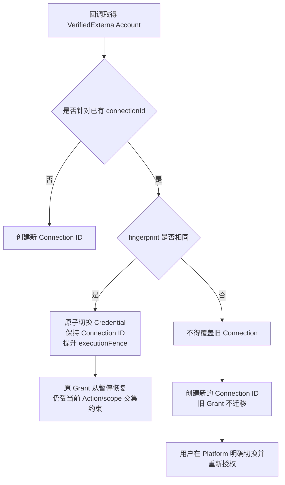

| 结果 | Connection ID | 原 Credential | 原 Grant | 用户动作 |
| --- | --- | --- | --- | --- |
| 同 fingerprint | 保持；accountBindingRevision 保持，executionFence 必升；scope 变化单独提升 externalScopeRevision | 新版本验证成功后销毁/停用旧版本 | Connection同事务发 `same-account-reconnected`；Platform按23.5把仍匹配的PAUSED_CONNECTION幂等恢复 | 返回原流程 |
| 不同 fingerprint | 创建新 ID，旧 ID 不变 | 旧 Connection 继续保持断开/失效 | 旧 Grant不迁移且由Platform终止；新 Connection必须重新授权 | 明确选择新账号并重新授权 |
| Provider 无稳定 subject | 不允许声明“同账号” | 不覆盖 | 不自动恢复 | 作为新连接处理；首个 M1 Provider 必须避免此情况 |

**[PRD]** 同一 Provider 可以有多个 Connection，同一用户、Agent、Provider 只有一个当前授权 Connection且替换必须由用户明确完成。**[本项目设计决策]** 以最多一个current Grant落地该产品语义；新建另一个 Connection 不自动替换当前 Grant。

## 16. OAuth、API Key 与 Credential

### 16.1 OAuth transaction

所有首次连接和 reconnect 先创建 ConnectionIntent；OAuthTransaction 只是该 Intent 选择 OAuth 鉴权方法后的协议子资源。`POST /oauth-transactions` 只接收 `connectionIntentId` 并要求 `Idempotency-Key`，不接收`actionRef`；服务端从锁定的Intent/current child解析 actor、Provider exact release、kind、目标 Connection、return intent 和 recovery generation，禁止客户端重复提交或覆盖这些字段。一个 Intent 同时最多一个 active OAuthTransaction；只有前一 transaction 明确失败、确定从未产生 token、`retryDisposition=RETRY_SAME_INTENT`、`retryDecision=NONE`、Intent 未过期且 actor/target 仍有权限时，用户才可用新幂等键请求下一sequence。该命令事务先按冻结policy重验deadline/endpoint/max并取得完整retry budget；只有`ACQUIRED`才创建新child，EXHAUSTED/FORBIDDEN原子终结父Intent。旧 transaction 的 state/PKCE 永久失效，下一 sequence 必须生成全新的 state、PKCE、nonce 和 response checksum。OAuth 成功时，ConnectionAccount/Credential、OAuthTransaction COMPLETED、ConnectionIntent COMPLETED 和 command idempotency result 在同一 Connection DB 事务提交。

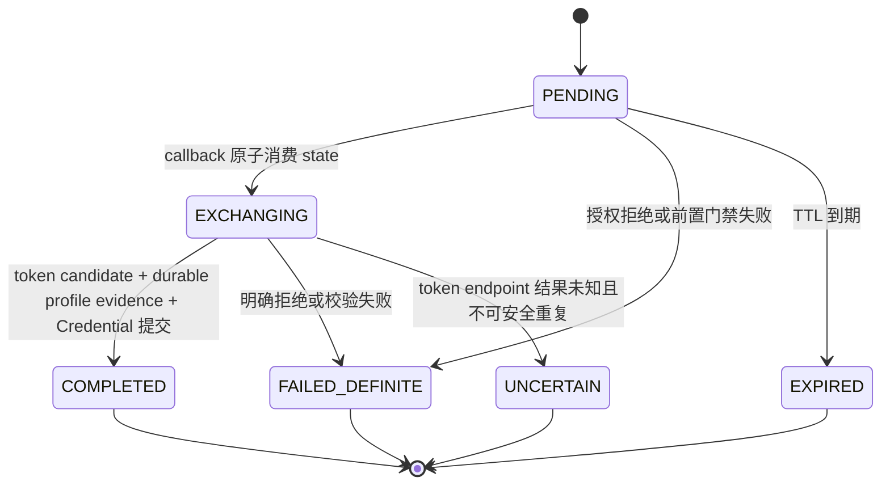

每个 OAuthTransaction 至少绑定：

- `connectionIntentId`、transaction sequence，并由 composite FK 保证 actor、Provider、auth method 和目标 Connection 与 Intent 一致。
- transaction ID、state hash、短期 state response-replay密文、创建和过期时间、一次消费时间。
- 发起公司 userId、发起会话 hash、Provider exact release 和 auth method。
- `PERSONAL` 或 `COMPANY_SHARED` 连接意图；Shared 还绑定管理员权限快照引用。
- 可选待重连 `connectionId` 和发起时的完整 `connection/accountBinding/credentialSet/sharedScope revisions + sharedScopeChecksum + storedStatus + connectionExecutionFence` CAS 向量；必须与父 Intent 相同。
- 请求 scopes 的 canonical 集合与 hash。
- PKCE S256 verifier独立KMS envelope、challenge和OAuth nonce。
- 可选 Platform `returnIntentId`、binding checksum 和 Platform recovery generation；完成后只回到固定 Platform completion route，不接受浏览器提交的任意回跳 URL。
- current exchange attempt、`internalReasonCode OAuthTransactionInternalReasonCodeV1?`、traceId 和 Connection recovery generation；
  internal reason不进入public error/condition union，也不保存 Provider 错误正文中的潜在 Secret。

**[OpenConnector 参考]** 复用随机短期 state、PKCE S256、take-once、token response 大小限制、timeout、redirect 和 SSRF 防护的测试意图。

**[本项目设计决策]** callback 只信任 state 映射出的主体和连接意图。query、cookie 或前端 body 中的 userId、connectionId、共享范围和 redirect URL 不能覆盖持久化绑定。

OAuth start 在同一事务保存transaction、state hash、PKCE verifier独立envelope、用于回放authorization URL的state密文、command terminal resource reference和response checksum。相同actor/operation/Idempotency-Key/request hash在state未消费且未过期时解密同一state并重建完全相同的allowlisted URL；不能创建第二个active transaction。state被callback消费、transaction终结或过期后立即销毁replay copy的wrapped DEK，hash和安全审计按保留策略保留；此后重放只返回terminal safe status，不再返回可用authorization URL。只有OAuth start response serializer可短时解密state，worker、日志、审计和普通GET不可读取。PKCE envelope只允许exact exchange attempt解密：PENDING/EXCHANGING且尚未可靠取得token时必须完整保留；进入CANDIDATE_PERSISTED或任何terminal transaction状态时同事务销毁其wrapped DEK。

Callback 在交换 authorization code 前，还必须同步复核：Personal 的 stored initiating user 仍是有效公司账号且仍可管理目标 Personal Connection；Shared 的 initiating user 仍具有系统管理员角色。失败时state仍被原子消费，OAuthTransaction与ConnectionIntent均进入 `FAILED_DEFINITE/TERMINATE_INTENT`，防止同code/state被另一路径重放。

State consume 与网络交换分成持久化阶段：callback事务锁OAuthTransaction、消费state、创建`OAuthExchangeAttempt(PREPARED)`并提交；`ProviderHttpClient`创建token endpoint逻辑请求前在第二个短事务校验lease/recovery generation，写`SUBMISSION_STARTED`，再按该attempt签发22.10 EgressDispatchAssertion，并由Proxy取得take-once admission后才出站。明确未发送的PREPARED可由fenced worker接管；`SUBMISSION_STARTED`后若没有可靠响应，只在Provider contract证明code exchange可安全查询或重放时恢复，否则进入`UNCERTAIN`，不能把lease expiry或“应用进程未观察到request/stream开始”当作未交换。

Token candidate可靠持久化后，任何需要外部profile/identity endpoint的 `resolveAccount` 都必须先创建 `OAuthAccountProfileAttempt(PREPARED)`，绑定exact OAuth exchange candidate、ProviderRelease、只读endpoint policy、current recovery/catalog validation generations和lease fence。打开profile逻辑请求或HTTP/2 stream前，短事务推进`SUBMISSION_STARTED`并创建该attempt独占的ProviderEgressHop，Signer只可签`egressPurpose=ACCOUNT_PROFILE`；无attempt、owner不匹配、exchange未CANDIDATE_PERSISTED或attempt非SUBMISSION_STARTED均拒绝。Provider verified ID Token已足以按15.1证明账号时可以不联网，但必须在exchange evidence中记录验证器版本/issuer/audience/checksum，不能伪造一个ACCOUNT_PROFILE出站。

Profile attempt主路径为`PREPARED -> SUBMISSION_STARTED -> EVIDENCE_RECEIVED -> SUCCEEDED`；失败边为`PREPARED -> FAILED_BEFORE_SUBMIT|FAILED_DEFINITE`、`SUBMISSION_STARTED -> FAILED_RETRYABLE|OUTCOME_UNKNOWN|FAILED_DEFINITE`以及最终身份/RBAC/target提交确定拒绝时的`EVIDENCE_RECEIVED -> FAILED_DEFINITE`。`FAILED_RETRYABLE`只表示已可靠取得Provider 429或暂时不可用证据且预算允许新sequence，不允许在原attempt重发。可靠响应先加密持久化bounded VerifiedExternalAccount evidence与checksum，再进入EVIDENCE_RECEIVED；最终Connection/Credential提交事务把exact attempt置为SUCCEEDED。一个exchange至多一个active profile attempt；如果SUBMISSION_STARTED结果未知，只有ProviderRelease明确声明endpoint read-only/repeatable时才可把旧attempt收敛OUTCOME_UNKNOWN并创建下一sequence，每个sequence仍使用新hop/JTI和take-once admission。lease过期本身不授权重复查询。若profile后任何验证/RBAC/target CAS失败，Intent终结、profile attempt置FAILED_DEFINITE，并为已签发token创建exact auth-candidate revoke cleanup；不能留下无owner的token或第二次隐式profile请求。

OAuthTransaction 与父 ConnectionIntent 的终态耦合固定如下；`retryDisposition` 由服务端 OAuth 错误目录决定，不能由 Provider 文本、浏览器或 Agent 指定：

| 可证明事实 | OAuthTransaction | `retryDisposition` | ConnectionIntent | 后续动作 |
| --- | --- | --- | --- | --- |
| authorization callback 明确拒绝，或 token endpoint 可靠证明未签发 token；错误可通过全新授权流程恢复，actor/target/revision 仍有效 | `FAILED_DEFINITE + retryDecision=NONE` | `RETRY_SAME_INTENT` | 保持 `PENDING/AWAITING_USER_ACTION`，current pointer保留该最大sequence失败child，零budget写 | GET Intent返回绑定该child/revision的fresh `START_OAUTH` UI ref；用户以新幂等键请求budget定案，旧 state/code/PKCE 不得重用 |
| 上一行用户命令取得budget `ACQUIRED` | `FAILED_DEFINITE + SUCCESSOR_CREATED` | `RETRY_SAME_INTENT` | 同事务移动pointer到新`PENDING` child并切`PROCESSING` | 创建唯一下一sequence和全新授权URL；旧child/旧幂等键只读 |
| 上一行用户命令判定budget `EXHAUSTED`或policy/deadline/endpoint/max/budget配置不允许 | `FAILED_DEFINITE + RETRY_EXHAUSTED\|RETRY_FORBIDDEN` | `RETRY_SAME_INTENT` | 同事务 `FAILED_DEFINITE`并写exact parent reason | 返回稳定失败和重新创建Intent的下一步；budget只按21.4定案一次，零successor |
| 尚无 token，但错误本身不可恢复，或actor/target/expected revision已失效 | `FAILED_DEFINITE + NOT_APPLICABLE` | `TERMINATE_INTENT` | 同事务 `FAILED_DEFINITE` | 返回稳定错误和新建 Intent 的下一步；不得创建下一 child |
| PENDING transaction 到期且没有 callback | `EXPIRED` | 空 | 同事务 `EXPIRED` | 销毁 state/PKCE replay key；必须创建新 Intent |
| token request 可能已提交但无法证明结果 | `UNCERTAIN` | 空 | 同事务 `UNCERTAIN` | 禁止新 child 和盲目重兑 code；按 Provider contract 对账或人工处置 |
| candidate 已可靠持久化，但 profile/identity/RBAC/target CAS 等最终门禁确定失败 | `FAILED_DEFINITE` | `TERMINATE_INTENT` | 同事务 `FAILED_DEFINITE` | 同事务创建 exact auth-candidate revoke/cleanup；禁止新 child |
| Connection/Credential 原子提交成功 | `COMPLETED` | 空 | 同事务 `COMPLETED` | 只回放同一 result reference |

`RETRY_SAME_INTENT` 只复用父 Intent 已冻结的业务意图，不复用任何 OAuth protocol material，也不延长 Intent、ReturnIntent 或 target revision 的 deadline。失败child与父current pointer保持不可变lineage；`START_OAUTH` actionRef绑定父Intent ID/revision、该child ID/sequence/`retry_operation_id`、initiating actor、target和剩余expiry，但只作为UI导航与渲染前防陈旧提示，不进入POST或授权判断。用户命令在同一锁内独立重验仍是最大`FAILED_DEFINITE/RETRY_SAME_INTENT + NONE`且无active sibling；取得budget后，创建全新transaction、写旧child定案、把pointer前移并把父stage切回PROCESSING在一个事务提交，或以EXHAUSTED/FORBIDDEN原子终结父Intent。任何“可能已签发 token”都不满足该分支；不能为了改善重试体验把 UNCERTAIN 降格为明确失败，也不能由worker、旧OAuth幂等重放、actionRef本身或页面poll自动创建下一child。

Provider 返回 token 后先以 OAuthExchangeAttempt AAD 持久化加密 candidate和可靠响应证据，不直接创建/切换 Credential。需要联网识别账号时先完成上述OAuthAccountProfileAttempt并取得durable evidence；随后在DB锁外取得新的短期公司identity assertion，并在不持有行锁时把candidate重加密为待提交的最终Credential AAD。最终短事务才锁Intent/target，复核profile evidence checksum、assertion freshness、Personal initiating user仍有效且是目标owner，或Shared initiating user仍为live system admin，以及expected target revisions/fences/recovery generation，再提交Connection/Credential并把profile attempt置SUCCEEDED。任一CAS失败销毁未提交的最终staged copy，保留原candidate供安全收敛。Identity不可用时保持加密candidate和fenced attempt等待恢复；candidate持久化后若因profile/identity验证、角色撤销、目标CAS或其他最终门禁而确定不能提交Connection/Credential，必须终结Intent并在同一事务为已签发token创建21.4的auth-candidate revoke/cleanup attempt。Cleanup未收敛前candidate wrapped DEK不能销毁，且任何执行路径都不能使用它。

Callback 还必须比较 OAuthTransaction 的 `connectionRecoveryGeneration` 与当前 `connection_runtime_generation`。DB restore/PITR 前创建的 transaction 一律 fail closed 并要求重新发起，不允许用恢复出来的 PENDING state 重兑已经消费过的 authorization code。

Reconnect transaction 保存 `previousConnectionStatus` 和 expected execution fence。发起 reconnect 不把旧 Connection 改成 `PENDING_AUTH`；pending/exchanging 只属于 OAuthTransaction。完成路径为：

- `FAILED_DEFINITE/EXPIRED` 保持旧 Connection 原 `ACTIVE/DEGRADED/DISCONNECTED/REAUTH_REQUIRED` 状态和 Credential，不需要“恢复”写入。
- `UNCERTAIN` 通过 expected revision/fence CAS 把仍可能使用旧 token 的 Connection 保守置为 `REAUTH_REQUIRED`；旧状态已是 DISCONNECTED/REAUTH_REQUIRED 时保持不可执行，不使用结果未知的 Credential。
- 同 fingerprint 时，在提交新 current Credential、把 stored status 置为 ACTIVE 并提升 execution fence 的同一事务，无条件追加 `connection.same-account-reconnected.v1` outbox；OAuth、API Key 以及同步/异步完成路径必须调用同一领域命令，不能有“连接已恢复但没有恢复候选事件”的旁路。事件只允许 Platform 恢复仍引用同 Connection 且状态为 PAUSED_CONNECTION 的 Grant，不能恢复 PAUSED_RECOVERY 或任何终态 Grant。
- 不同 fingerprint 创建新 Connection ID，绝不改写旧Connection的identity/fingerprint历史或把旧Grant迁移到新ID。同一Connection DB事务还把target旧Connection保持/推进为DISCONNECTED、提升execution fence、移除current Credential并创建durable revoke attempt，再写 `connection.reconnect-account-mismatch.v1` outbox；因此事件送达前旧Connection已经不可执行。Platform消费后锁相应GrantSlot并把仍引用旧Connection的Grant置TERMINATED(reason=ACCOUNT_CHANGED)；新Connection始终需要新的preview/确认。
- expiry/exchange recovery worker 与 callback 使用同一 transition 方法和 generation-fenced lease，重复执行幂等；EXCHANGING 不允许永久无 owner，无效 lease 必须收敛到接管、FAILED_DEFINITE 或 UNCERTAIN。

### 16.2 API Key 流程

首次 API Key 连接和既有 Credential 替换共享 write-only/KMS/Provider Validator，但使用不同聚合：首次连接必须经过 ConnectionIntent，验证成功前没有对外可见 ConnectionAccount；替换绑定既有 Connection 和 expected revisions，失败不改变 current Credential。

首次连接协议：

1. Browser 先以公司会话和 `Idempotency-Key` 创建 `mode=CREATE/authMethod=API_KEY` 的 ConnectionIntent；Personal 使用普通 endpoint 并绑定当前 employee owner，Shared 使用唯一 admin endpoint 并重新校验 live system admin。服务端解析固定 kind、Provider exact release 和 recovery generation，并预留但不返回 `reservedConnectionId`。
2. Browser 向该 Intent 的 write-only Secret endpoint 提交 API Key/credential fields。Secret 只出现在一次 TLS body；Gateway/应用设置严格 body/decompression/depth 上限，并在 access log、APM capture 和异常 serializer 之前关闭 body 记录。
3. 服务端先按 21.6 claim command idempotency；对包含每个 Secret value 的完整 canonical request 计算 keyed HMAC。相同 key/HMAC 回放同 Intent/result，不同 HMAC 返回 `IDEMPOTENCY_CONFLICT`。数据库只在 `command_idempotency` 受限列保存 HMAC 与 key version，不保存 Secret；任何响应、日志、Trace、Metric、审计和普通查询都不返回 HMAC 或 Secret。
4. 在不持有数据库锁时生成 DEK 和 candidate AEAD 密文；candidate AAD 绑定 `environment/provider/connectionIntentId/validationAttemptId/candidateEncryptionRevision`，不能冒充最终 Credential。随后以短事务、lease fence 和 current recovery generation 保存 `ApiCredentialValidationAttempt(PREPARED)`。若进程在 claim 后、密文提交前崩溃，worker 不能从 HMAC 重构 Secret，只能等待客户端以相同 Secret 重送。
5. Provider Credential Validator只能调用发布时声明为read-only/repeatable的allowlisted identity/profile endpoint。创建逻辑request/HTTP2 stream前先在DB锁外取得fresh identity assertion，再在短事务复核其freshness、Personal initiating user仍有效/为目标owner或Shared initiating user仍为live system admin、expected target revisions/fences和recovery generation，才写`SUBMISSION_STARTED`并取得22.10断言；Proxy仍需take-once admission。响应必须解析为VerifiedExternalAccount、canonical scope/capability和safe profile。没有可重复验证契约的API Key Provider不进入M1 allowlist。
6. 收到可靠成功结果后，再在 DB 锁外取得一份新的短期 identity assertion，并在不持有行锁的受控闭包内把 candidate 解密、用最终 `connectionId/credentialVersionId/encryptionRevision` AAD 重新加密为 staged copy。最终短事务重复 assertion freshness、actor/role/target/recovery检查，成立时才以预留 ID 和最终密文创建/切换 ConnectionAccount、ACTIVE CredentialVersion、审计/outbox，将 Attempt 和 Intent 置 COMPLETED，并写 command result reference；到此才公开 `connectionId`。CAS失败销毁 staged copy；成功时candidate wrapped DEK在同一事务作废，不能留下第二个可独立解密副本。Identity暂时不可用保持Attempt可恢复且不提交；actor/role明确失效使Attempt/Intent FAILED_DEFINITE并销毁API Key candidate，既有Connection/Credential不变。
7. 明确无效 Key/identity/scope 使 Attempt/Intent 进入 FAILED_DEFINITE，销毁候选 wrapped DEK，不创建 ConnectionAccount。请求可能已提交但响应无法可靠恢复时进入 UNCERTAIN，不假设 Key 有效，也不创建 Connection；UI 要求查询状态或发起新 Intent，不能自动换 key 重试。
8. 同步窗口内完成返回 `201` 和 safe Connection summary；仍在验证返回 `202 + intentId/status/pollAfter`；响应丢失后 GET Intent 或同 key/HMAC 重送只回放同一 result reference。响应永不回显 API Key、候选密文、外部 subject 或 HMAC。

既有 Connection 的 API Key 替换 endpoint 在同一个幂等命令中创建 `mode=REPLACE_CREDENTIAL` Intent，并按 kind 校验 Personal 当前 owner 或 Shared live system admin、effective status、expected `connectionRevision/credentialSetRevision/accountBindingRevision`，再使用相同 candidate/attempt/submission协议。stable fingerprint 相同才用最终目标 AAD重加密并 CAS 切换 current Credential、提升 execution fence、完成 Intent，把旧版本置 RETIRED；不同 fingerprint 不覆盖原 Connection，而使 Intent FAILED_DEFINITE并返回需要创建新 Connection/重新 Grant 的稳定结果。任一失败或 UNCERTAIN 均保留旧 current Credential 和 stored status，但可按风险把 effective execution fail closed。

API Key 的`mode=RECONNECT`使用同一validation attempt，但语义不能退化为REPLACE_CREDENTIAL：它同时绑定target Connection、预留的新Connection ID、previous stored status和expected revisions/fence。最终fresh identity/RBAC复核后，同fingerprint按16.1同账号事务恢复target、切换Credential并发出`connection.same-account-reconnected.v1`；不同fingerprint按16.1创建预留新Connection、使旧target不可执行并发出mismatch事件。所有Provider validation request/stream仍固定到Intent的exact ProviderRelease，并在出站前和最终提交前检查Provider、ProviderRelease、actor/role和recovery/catalog validation generations；任何失败都不能静默覆盖旧账号或迁移Grant。

OAuth与API Key的`mode=REVALIDATE_RECOVERY`共用同一Intent约束而不共用RECONNECT transition：只允许`needsRecoveryRevalidation=true`、`stored_status != DISABLED`且无final Shared tombstone，不要求其他effective enum等于某值；target data generation固定，same fingerprint才可完成，stored status逐字保持。ACTIVE/DEGRADED可切fresh Credential；REAUTH_REQUIRED/DISCONNECTED的API candidate销毁，OAuth candidate以exact revoke attempt收敛，均不得形成current pointer。成功原子写Account/完整Shared scope generation、必要revisions/fence、Intent/command result、`connection.revalidated.v1`、audit/outbox；它不发same-account-reconnected且Platform不能据此恢复Grant。第二次Recovery Control rotate使旧Intent/attempt generation stale并终结；响应丢失只GET/回放同一result。

### 16.3 Envelope encryption

```text
plaintext Credential
  -> random DEK + AEAD encrypt
  -> ciphertext + nonce + auth tag
  -> KMS wrap(DEK)
  -> wrappedDEK + kmsKeyId + kmsKeyVersion
```

最终 Credential 的 AEAD associated data 至少绑定：

```text
environmentId | providerId | connectionId | credentialVersionId | encryptionRevision
```

API Key candidate 使用独立 `environmentId | providerId | connectionIntentId | validationAttemptId | candidateEncryptionRevision` AAD；Provider 身份验证成功后必须在受控内存闭包中重新加密为最终 Credential AAD，不能把 candidate ciphertext直接改标签或复用。若最终 Connection/Credential 不提交，必须销毁 candidate wrapped DEK。OAuth code、PKCE verifier 等非最终 Credential Secret同样使用各自 `environmentId | providerId | aggregateType | aggregateId | secretVersion` AAD，不能借用空 connectionId 或可变 revision。

| 控制 | 设计 | 来源 |
| --- | --- | --- |
| KMS 不可用 | 创建、替换、refresh 和执行全部 fail closed，不回退本地 key 或明文 | [本项目设计决策] |
| 解密权限 | 只有 `connection-api` workload identity | [现有工程 Spec] |
| 明文生命周期 | 单次受控闭包内使用，完成后释放引用；不进入 DTO | [本项目设计决策] |
| key rotation | 新写使用新 key version；后台逐条 rewrap，CAS 防覆盖 | [本项目设计决策] |
| 备份恢复 | DB 密文与 KMS key/version 的恢复能力一起演练 | [本项目设计决策] |
| Secret 日志 | telemetry 只用 allowlist 字段构造；敏感字段 denylist、canary 和 entropy 扫描作为二次防线；未知 Provider error/header/body 默认不记录 | 不泄露Credential：[PRD]；allowlist/canary/entropy控制：[本项目设计决策] |

### 16.4 Credential 状态与 refresh

| 状态 | 含义 | 是否可执行 |
| --- | --- | --- |
| `STAGED` | 已加密但尚未成为当前版本 | 否 |
| `ACTIVE` | 当前可用版本 | 是 |
| `REFRESHING` | 某副本持有带 fence 的 refresh lease | 旧 token 未过期时可按策略等待或使用，否则等待 |
| `REFRESH_UNCERTAIN` | Provider 可能已轮换 token，但新 Credential 未可靠持久化 | 否；仅可按 Provider 契约安全恢复，否则重连 |
| `INVALID` | 永久无效，例如 `invalid_grant` | 否，Connection 进入 REAUTH_REQUIRED |
| `REVOKE_PENDING` | 已从 current pointer 移除，本地不可执行，但外部 revoke 尚未确定 | 否；仅 revoke/reconcile 用例可受控解密 |
| `RETIRED` | 已被新版本替换 | 否 |
| `DESTROYED` | wrapped DEK 已销毁 | 否，不能恢复明文 |

跨副本 refresh 算法：

1. 读取 `currentCredentialVersionId`、ConnectionAccount 的 `credentialSetRevision`、CredentialVersion 的 `credentialStateRevision` 和过期时间。
2. 过期阈值内尝试原子获取 `refreshLeaseOwner/leaseUntil/fenceToken`；未到期 lease 只能等待或返回明确暂时状态。
3. 创建durable RefreshAttempt；在创建Provider token endpoint逻辑request前以generation/lease fence写`SUBMISSION_STARTED`并签发22.10 EgressDispatchAssertion，Proxy还要取得take-once admission。请求遵守OAuth SSRF、timeout和response size限制。若请求可能成功但结果未可靠取得，只有Provider契约证明refresh可安全重放时才能恢复，否则进入`REFRESH_UNCERTAIN`。
4. 生成新的 `STAGED` CredentialVersion；处理 refresh token rotation 和新 scopes。Provider 已返回新 token 后若进程在 DB 切换前崩溃，恢复器同样按 Provider refresh 契约判断；无法证明安全时进入 `REFRESH_UNCERTAIN` 并要求重连。
5. 以 `WHERE credential_set_revision = expected` CAS 切换 active pointer 并提升 `credentialSetRevision`；CredentialVersion lifecycle 使用独立 `credentialStateRevision` CAS。失败时销毁本次 staged secret，不覆盖胜出的新 token。
6. scope 变化时提升 `externalScopeRevision` 和 `connectionExecutionFence`；仅 Access Token/Refresh Token 常规轮换只提升 `credentialSetRevision`；完成重连总是提升 `connectionExecutionFence`。稳定账号 fingerprint 不同不得覆盖原 Connection，而是创建新 Connection。
7. `invalid_grant`、账号撤销或 fingerprint 不一致将 Connection 置为 `REAUTH_REQUIRED`；限流和 5xx 只进入 `DEGRADED`，不得误判永久失效。

**[OpenConnector 参考]** 上游使用 `connection.id + revision` 合并进程内 refresh 并防 stale write。

**[本项目设计决策]** 本项目只复用该 CAS 意图；跨副本 single-flight、durable attempt、submission marker、recovery generation 和 PostgreSQL lease 均为本项目扩展，不是上游现成能力。

### 16.5 Scope 变化

| 变化 | 处理 |
| --- | --- |
| Provider 返回 scope 缩减 | 原子更新 scope snapshot，提升 externalScopeRevision 与 connectionExecutionFence；新调用按实时交集只拒绝缺失 scope 的 Action |
| Provider 返回 scope 扩大 | 保存外部 scope，但不会自动扩大 Owner 选择或用户确认 |
| 无法取得 scope | Provider Adapter 必须按其鉴权模型给出保守能力；不能默认全部允许 |
| scope 字符串顺序/大小写差异 | 使用 Provider Adapter 的规范化函数后排序、去重、hash |
| refresh 响应省略 scope | 按 Provider 明确语义继承旧值；未声明该语义的 Provider 必须重新 profile 验证 |

## 17. Platform Grant 与授权交集

### 17.1 两层授权对象

**[现有工程 Spec]** Platform DB 是用户到 `Agent + Connection + 已确认 Action 集` 的权威来源。

**[本项目设计决策]** Connection 不复制一份可写 Grant，只保存 Permit 兑换与调用所需证据和只读审计投影。

**[本项目设计决策]** 授权分成两个层次：

| 对象 | 生命周期 | 粒度 | 持有方 | 用途 |
| --- | --- | --- | --- | --- |
| `ConnectionGrant` | 长期，直到撤销、账号切换或权威条件终止 | `user + agent + provider -> connection` | Platform DB | 表达用户选择和最近确认范围 |
| `ExecutionPermit` | 单次 Action 调用，短期、一次兑换 | `execution + toolCall + connection + actionVersion + argsHash` | Platform DB，Connection 在线兑换 | 把当前授权决定安全交给 Connection 执行 |

Agent execution 级的 `ExecutionGrant` 继续绑定用户、Agent、渠道和 Owner Action Set revision；它允许 Agent 调用 Tool Gateway，但不能直接授权任何外部账号。Tool Gateway 为每个实际工具调用再创建 ExecutionPermit。

### 17.2 有效能力公式

**[PRD]** 一次调用的产品授权基础为：

```text
已发布 Action
INTERSECT Owner 当前选择
INTERSECT 用户最近确认
INTERSECT Connection 当前外部 scope
```

**[本项目设计决策]** 上式中的每个“已发布 Action”在实现时解析为用户预览并确认过的不可变 exact
`ActionVersion + authorizationDigest`；这是防止目录版本替换的工程约束，不把 `ActionVersion` 伪称为 PRD 术语。

**[本项目设计决策]** 可执行能力还必须同时满足运行上下文和 live state：

```text
productAuthorizedActions
INTERSECT Agent Runtime 声明能力
INTERSECT 当前渠道 capability domain
INTERSECT 当前公司用户和 Agent 可用范围
INTERSECT Connection 当前归属或共享范围
INTERSECT Provider / Action / Connection / Credential 当前可用状态
INTERSECT Recovery Control / Journal current safety decisions
INTERSECT mutation durability current (仅mutating Action)
```

任何集合只允许缩小结果，不能通过默认值、缓存缺失、Provider scope 无法解析或 Adapter 错误扩大能力。

这里的 Connection状态始终指14.2 effective status：ACTIVE可执行；DEGRADED仅在当前breaker/error policy允许时可执行；REAUTH_REQUIRED/DISCONNECTED/RECOVERY_REVALIDATION_REQUIRED/DISABLED均拒绝。Recovery Control环境级门禁、JournalSafetyGate、data generation overlay和mutating Action的20.9 decision lease不能被目录缓存、stored status、通用OPEN或read-only可用性覆盖。

### 17.3 工具可发现与可执行

| 层次 | 所需交集 | Agent 能看到什么 | 目的 |
| --- | --- | --- | --- |
| 配置目录 | published + Owner selected + runtime/channel capable | Action 名称、用途和参数 Schema | 让 Agent 理解已配置能力 |
| 用户可用目录 | 配置目录 + 当前用户/Agent 范围 + Grant/Connection 状态 | `AVAILABLE` 或产品化不可用原因，不含账号 ID | 支持连接/确认入口 |
| 实际执行 | 全部授权交集 + live revisions + Permit redeem | 仅工具结果或稳定错误 | 防止目录缓存和长 execution 绕过撤销 |

**[本项目设计决策]** “Agent 看到了 Action Schema”不等于“Action 已授权”。当前用户没有可选Connection时返回`CONNECTION_REQUIRED`；已有Connection但尚未授权给该Agent时返回`GRANT_REQUIRED`；现有Grant未覆盖新增Action时返回`ACTION_CONFIRMATION_REQUIRED`。三者在唯一错误registry中有不同resolution，任何情况都不能先调用Provider。

### 17.4 Agent 授权根与 GrantSlot 并发根

**[本项目设计决策]** Platform 为每个 Agent 建立稳定 `AgentAuthorizationRoot(agentId, authorizationRevision)`。Agent 启停、Owner Action 选择、可用用户/组织范围和渠道执行策略的任何变化，都必须先锁该 Root、更新对应配置并递增 revision。Confirmation commit、Permit issue 和 Permit redeem 也先锁相同 Root，再重读这些本地条件；因此 Owner 移除与 redeem 在 PostgreSQL `READ COMMITTED` 下仍只有一个提交顺序，不依赖一次无锁 revision read。

Platform 还为每个 `(userId, agentId, providerId)` 建立稳定 `GrantSlot`。Slot 在 Grant 替换、撤销后仍保留，包含 `currentGrantId` 和单调 `authorizationFence`。Grant 是该 Slot 下不可变的用户确认版本：首次授权创建首个版本，扩权、恢复重确认和换号都在同一事务把旧 current Grant 标为 `REPLACED`、创建新 Grant并切换 Slot pointer；只有不改变确认 tuple 的同账号重连可以在原 Grant上做 `PAUSED_CONNECTION -> ACTIVE` 生命周期更新。首次授权、确认、切换、撤销、Permit issue 和 redeem 全部锁定同一 Slot，再读取当前 Grant。只锁 Grant 行不够：确认替换可能创建新 Grant，撤销线程和 redeem 线程若分别锁旧/新行，就无法证明全局顺序。

Platform 对所有授权路径使用同一个effective predicate，而不是让各路由自行解释恢复状态：

```text
effectiveGrantStatus(grant, runtime) =
  grant.status
    if grant.status in (REPLACED, REVOKED, TERMINATED)
  PAUSED_RECOVERY
    if grant.status in (ACTIVE, PAUSED_CONNECTION, PAUSED_RECOVERY)
       and (grant.confirmedPlatformRecoveryGeneration
              != runtime.platformRecoveryGeneration
            or grant.confirmedConnectionRecoveryGeneration
              != runtime.connectionRecoveryGeneration)
  grant.status
    otherwise
```

API投影、Confirmation preview/commit、Permit issue/redeem、同账号恢复和数据库constraint trigger都调用该predicate；存储、CAS和审计仍读取`grant.status`。Recovery rotation不依赖批量UPDATE Grant才能fail closed，后台materializer也不是正确性前提。`RECOVERY_RECONFIRM`可把stored `ACTIVE`或`PAUSED_CONNECTION`但effective为`PAUSED_RECOVERY`的source直接原子置为`REPLACED`；同账号reconnect只接受stored/effective均为`PAUSED_CONNECTION`且两侧generation匹配的source。

若runtime Required=true，Shared授权还有独立环境reset gate，不论它来自本次Connection DB restore还是前代义务carry-forward：本代21.2 Platform checkpoint完成前，preview/Confirmation/Permit一律拒绝，即使某个旧Grant已经被事件提前TERMINATED或某个Connection已重校验。Checkpoint worker只持久化terminal lifecycle和Slot fence，不UPDATE不可变Binding/Snapshot/Grant confirmation tuple。双侧reset完成后，旧Shared binding跨epoch不能进入RECOVERY_RECONFIRM；INITIAL短事务先重读Slot，要求旧current已经TERMINATED/pointer为空，再为new-epoch binding创建首个current Grant。迟到worker以`old validatedDataGeneration + exact current Grant`谓词跳过该新Grant。

所有 Platform 授权短事务使用同一锁顺序：`PlatformAuthorizationRuntime(fenced read) -> AgentAuthorizationRoot -> GrantSlot -> current Grant -> Invocation -> Permit/ConfirmationIntent`。同generation业务事务对runtime取得可彼此并行、但会被recovery rotate/checkpoint final的`FOR UPDATE`阻塞的fenced read lock；这使generation校验与Shared checkpoint零查询具有同一提交顺序。操作先在事务外做只读解析和远程 preflight，事务内按已解析 ID 重新取锁和复核；行消失、主体或 revision 变化即重试或 fail closed。Owner/范围/渠道命令只需要锁到其最后一个相关对象，但不得逆序。违反锁顺序由 repository API、数据库集成测试和 deadlock telemetry 共同阻止。

AgentAuthorizationRoot还有恢复后effective validity：`validatedPolicyGeneration`必须等于runtime current `platformPolicyValidationGeneration`，且validation evidence绑定当前Owner/Agent status/range/channel/Owner Action完整checksum。Platform DB PITR后，恢复出的Root即使status=ACTIVE也只能显示`POLICY_REVALIDATION_REQUIRED`；未逐对象应用PITR外Journal/full-state manifest前不得创建preview、commit Confirmation、issue或redeem Permit。Fresh用户确认不能把过时扩大policy变current。Restrictive普通变更使Root立即失配/deny，receipt回写后才重新validated；permissive变更必须receipt先行，见21.2/28.7。

### 17.5 ConnectionGrant 关键字段

| 字段 | 含义 |
| --- | --- |
| `grantId`、`grantSlotId`、`grantRevision` | 不可变确认版本、稳定并发根引用和生命周期 CAS revision |
| `userId`、`agentId`、`providerId` | Platform 服务端解析的唯一主体组合 |
| `connectionId`、`confirmedAccountBindingRevision` | 用户选择的账号及确认时账号身份绑定 revision；scope 始终 live check，不固化为永久授权 |
| `entitlementBindingId`、`connectionEntitlementEpoch`、`entitlementEvidenceChecksum` | 不可变 entitlement exact tuple：持久化连续资格epoch；Shared 另绑定 exact USER/ORG scope entry 与 Identity membership epoch |
| `agentAuthorizationRevision`、`ownerActionSetRevision` | 用户确认时 Agent 共同授权根和 Owner 配置快照 |
| `confirmedPlatformRecoveryGeneration`、`confirmedConnectionRecoveryGeneration` | 最近一次有效确认所属两侧恢复代；任一与当前 generation 不同即恢复隔离 |
| `confirmedActionSnapshotId` | 不可变的 `actionId + authorizationDigest` 授权集合；每项同时保存用户确认时的 exact `actionVersionId`、required scopes、effect class 和 version manifest 证据。Pending commit 还要比较 exact version，Grant 生效后的 Permit issue/redeem 按13.4使用稳定授权键 |
| `status` | stored `ACTIVE/PAUSED_CONNECTION/PAUSED_RECOVERY/REPLACED/REVOKED/TERMINATED`；授权判断统一使用17.4的effective predicate |
| `statusReason` | 断开、reauth、`AUTHORIZATION_UPDATED`、`RECOVERY_RECONFIRMED`、不同账号、用户禁用、范围失效等稳定原因 |
| `createdAt/confirmedAt/lifecycleChangedAt`、actor、`supersededByGrantId?` | 授权和生命周期审计；REPLACED必须指向同Slot的新Grant |

数据库必须有 partial unique constraint，保证同一 `(userId, agentId, providerId)` 最多一个 `ACTIVE`、`PAUSED_CONNECTION` 或 `PAUSED_RECOVERY` 当前 Grant。历史 Grant 不删除，用 `REPLACED/REVOKED/TERMINATED` 保留审计。

Grant 的 Connection、entitlement、授权 revisions、两侧 recovery generations 和 confirmed snapshot 均为 write-once confirmation tuple。`grantRevision` 只保护状态、reason和审计时间等生命周期变化，不能用来原地改写确认 tuple。扩权、恢复重确认和换号都必须递增 Slot fence并创建新 Grant；旧版本与旧 Snapshot永久保留。相同账号 reconnect只在account binding、entitlement和两侧已确认recovery generations仍匹配时恢复原 `PAUSED_CONNECTION` Grant，因此不违反不可变确认规则。

`entitlementBindingId` 指向确认时服务端选择的单一、连续授权路径。Personal 绑定 `ACCOUNT_ACTIVE(userId, accountAuthorizationEpoch)` 和 exact owner。Shared对**已有ACTIVE root**必须先复核current evidence记录的exact path：该USER entry仍ACTIVE且binding generation相同，或该ORG entry仍ACTIVE、binding generation相同且Identity证明同一membership edge/epoch时，继续返回完全相同的path，即使后来新增direct USER、另一个ORG或稳定排序更小的候选也不得改选。只有用户从未存在ACTIVE或因该资格创建过历史root的首次资格，才优先选择exact `USER` scope entry，否则从当前匹配的`ORG` entry中按稳定ID选择一个，并绑定`scopeEntryId/scopeBindingGeneration + Identity membershipEdgeId/membershipEpoch`。

当前bound path被权威明确证明失效时，Connection必须先在同一锁内判断是否还存在另一条current USER/ORG资格path。若不存在任何current path，用户已不符合PRD的Shared使用资格，基础契约可原子REVOKE旧root、返回绑定旧tuple的signed definitive loss，并由Platform终结旧Grant。若另一path仍有效，则该终结行为本身属于**[评审门禁 G-17]**：未批准build只能返回签名`ELIGIBILITY_NOT_AVAILABLE + SAFE_DENY`，对root、Grant、terminal reason、loss checksum和outbox/event全部零写；旧Permit因exact bound path live check失败而不能执行，但stored root/Grant不被HLD擅自终结。Product批准并回写两份PRD后，条件build才可原子REVOKE旧root并返回`AlternatePathPredecessorV1`，Platform验签后把旧Grant终结为`CURRENT_ENTITLEMENT_PATH_LOST`，再由用户通过显式`ALTERNATE_PATH_INITIAL`为当前备用path建立new root/new CSPRNG epoch和source-empty ConfirmationIntent。该mode不是通用`INITIAL`别名，同一loss decision不选择、创建或返回备用root。Connection的`CURRENT_PATH_LOST`与Platform的`CURRENT_ENTITLEMENT_PATH_LOST`是两个不可alias的typed enum；Permit路径永远不能创建root、终结root或切换path。

`connectionEntitlementEpoch` 是 Connection 为这段连续资格生成的稳定 CSPRNG root epoch，不等同于任一 Identity/scope epoch。账号禁用后重新启用、scope entry 移除后重建或成员离开后重入会终结旧 root，之后重新满足资格只能生成新 epoch；暂时 Identity 不可用或event gap只fail closed，不得猜测资格中断。普通运行中，Shared exact path可证明当前资格并检测明确loss；但Connection data recovery后，恢复库中的scope generation不能证明备份点之后从未remove/re-add。M1只有Personal可在PITR域外current account/owner epochs完整连续时保留同一`connectionEntitlementEpoch`并追加本代evidence；Shared旧root由环境reset一律REVOKED，Platform旧Grant由本代checkpoint一律TERMINATED，当前资格只能在双侧completion后以new epoch重新建立，且该G-16用户行为也须先通过对应Product Gate。display name、组织名称、缓存 TTL 或仅有时间戳不能充当任一 epoch 或连续性证明。

G-17条件build使用统一`AlternatePathPredecessorV1{connectionEntitlementId,connectionEntitlementEpoch,
entitlementEvidenceChecksum,definitiveLossChecksum}`和三列terminal lineage
`previousTerminalClaimId + previousTerminalDisposition + previousTerminalReceiptChecksum`。Connection在REVOKE旧root的同一事务计算并持久化稳定`definitiveLossChecksum`，signed loss逐项返回predecessor tuple；Platform在映射旧Grant为`TERMINATED/CURRENT_ENTITLEMENT_PATH_LOST`的同一事务保存完全相同的root ID/checksum。Platform必须在调用条件eligibility**之前**创建durable acquisition claim和stable operation；每个claim另保存从1开始的`acquisitionAttemptSequence`。第一次attempt固定sequence=1且terminal lineage三列全空；sequence大于1时三列全非空并指向sequence恰少1的同链终态claim。G-17-only build的`previousTerminalDisposition`唯一允许`STALE_TARGET_PATH`；G-18批准后才额外允许`USER_ABANDONED`。两种终态都使用22.6唯一的`AlternatePathAttemptTerminalReceiptV1`，lineage checksum逐字节等于前一claim在两库保存的同一canonical receipt checksum，而不是target loss checksum、Platform自造checksum或日志摘要。Successor gate必须逐项验证五层证据：Connection权威receipt；Platform immutable projection及完整原Connection signature/source evidence；状态为`SIGNED`的Platform acceptance proof；Connection保存且验签成功的proof witness、terminal-ack projection、canonical ACK和六列acquisition pointer；Platform terminal-ack outbox中`ACKED`且逐字节匹配consumer projection/proof/ACK checksum的delivery receipt。任一checksum不能替代typed tuple相等；`BODY_COMMITTED`、`WAITING_PROOF`、仅发送event、HTTP 2xx或任一单侧终态均不满足门禁。前一claim处于对应终态且五层证据闭合后，仍只有用户重新进入显式确认页并再次提交才可创建下一claim。每个attempt的响应丢失只重用自己的claim/operation及`nonce + correlation + contract version + canonical request hash` replay quartet，不从日志、Binding或临时HTTP状态重构；普通GRANT、Permit、事件consumer和后台worker都不能分配下一attempt。

Connection按同operation/attempt创建new root、acquisition row和revision 1 evidence时，acquisition状态固定`PENDING_BINDING`；write-once reason、Platform claim、operation、attempt lineage、initial request replay quartet和完整predecessor tuple逐项进入signed conditional response及Platform terminal-binding receipt，Platform immutable Binding与distinct Intent继续保留既有十五列alternate provenance。`PENDING_BINDING`期间普通`GRANT/INITIAL/PERMIT`都不能消费root，只有同claim/operation/attempt/predecessor的显式流程可重试或重建短期Intent。首个条件Intent成功消费时，Platform在Grant/Snapshot/Slot事务内把该attempt claim置`BOUND`、写不可变terminal-binding receipt及outbox；Connection只在验签并通过既有Platform event/snapshot gap repair核对exact receipt后把本地acquisition置`BOUND`。之后普通Grant preview/INITIAL可以为同user/new Agent Slot复用该root，但仍必须完成各自用户确认，且Binding/Permit继续携带同一provenance；撤销某个Grant不把root改回orphan。

Intent拒绝、过期、stale或响应丢失只保留同一ROOT_READY/PENDING attempt供用户继续，不创建并行root。若target在Platform claim BOUND前失去current path，Connection把root/acquisition原子置REVOKED/STALE，写统一`STALE_TARGET_PATH` receipt，并在loss event与attempt-terminal event/snapshot返回完整attempt lineage和target loss；Platform只可把对应CLAIMED、ROOT_READY或已发起放弃的ABANDON_REQUESTED attempt置STALE，再以terminal-ack event/snapshot把同一receipt投影回Connection。requirements随后显示“上一备用路径已失效，需要再次确认”；双方receipt/ack一致后，用户再次提交才以`previousTerminalDisposition=STALE_TARGET_PATH`及同一receipt checksum创建下一sequence。Connection在predecessor root锁内要求所有较早attempt均为可验证终态、没有BOUND winner，并拒绝复用任一旧attempt的path generation。若Platform已先BOUND，则该Grant是新的授权事实；随后target loss按普通definitive-loss流程终结该result Grant，下一流程以该新terminal Grant/root为新的predecessor，不改写旧BOUND claim。这样既不允许普通入口消费orphan，也不会因第一个备用target提前失效而永久卡死。

**[评审门禁 G-18]** 只有G-17和G-18都批准后的条件build才允许用户显式放弃未完成attempt。requirements先返回
`ALTERNATE_PATH_ATTEMPT_BLOCKING`，安全展示原attempt所属Agent和当前状态，并明确说明继续会永久终止旧attempt、旧页面不能恢复；用户执行
`ABANDON_AND_RESTART_ALTERNATE_AUTHORIZATION`后，Platform只把`CLAIMED|ROOT_READY` CAS为`ABANDON_REQUESTED`，生成稳定
abandonment operation并调用`purpose=ALTERNATE_PATH_ABANDON`的签名内部契约。Connection必须为同claim/operation/attempt写
`ABANDONED` acquisition tombstone；即使条件root尚未创建也必须有tombstone，若root已存在则在同一事务将其单向
`REVOKED/ALTERNATE_PATH_ACQUISITION_ABANDONED`。Platform只有验签并持久化相同receipt checksum后才把claim置`ABANDONED`并发布terminal-ack。任一侧的
`ABANDONED`都不可恢复、改写为STALE、删除或被普通Grant/Permit/INITIAL消费。

放弃完成后requirements返回`ALTERNATE_PATH_RESTART_CONFIRMATION_REQUIRED`；新Agent必须由用户再次执行fresh preview/confirmation，不能继承旧Intent、token、Snapshot、Binding或Action确认。下一claim以`previousTerminalDisposition=USER_ABANDONED`和exact abandonment receipt创建，且把旧attempt的`predecessorAgentId/predecessorGrantSlotId`与新attempt的`acquiringAgentId/acquiringGrantSlotId`分别持久化和约束；两组可以不同，但都由Platform从权威Grant/Slot和当前已授权页面上下文解析，Browser、Agent和模型不能提交或覆盖。`ABANDON_REQUESTED`期间requirements只返回
`ALTERNATE_PATH_ABANDONING`和poll提示，不能提前创建successor。只有上一段五层proof/delivery闭环全部一致后才允许下一sequence；后台worker只修复同一abandonment operation，不创建successor。

三个race都以数据库CAS形成exactly-one terminal winner：bind先提交则claim保持BOUND且abandon固定失败；Platform先提交`ABANDON_REQUESTED`则条件consume不能再BOUND。Target loss先在Connection提交时，签名的`STALE_TARGET_PATH` receipt允许Platform把`ABANDON_REQUESTED`收敛为STALE并保留放弃请求审计组，不得误写ABANDONED；abandon先在Connection提交则迟到loss不能覆盖ABANDONED。Root create先提交时abandon事务终结该root并返回`TARGET_REVOKED`；Platform在原`ABANDON_REQUESTED`尚无target时只能从该签名receipt一次性填满target整组。Tombstone先提交时迟到create在unique claim/operation约束处零写。任何跨库响应丢失都通过同operation、receipt、terminal event/ack和23.4 snapshot repair收敛，不允许超时猜测winner。

Permit issue/redeem 的 fresh Identity + Connection eligibility 必须返回与 Grant 完全一致的 entitlement binding。若权威响应明确为 `ACCOUNT_DISABLED | OWNER_MISMATCH | SCOPE_ENTRY_REMOVED | MEMBERSHIP_ENDED | ENTITLEMENT_EPOCH_CHANGED`，Platform 在同一次授权短事务按 `AgentAuthorizationRoot -> GrantSlot -> current Grant` 加锁，将仍引用旧 binding 的 current Grant CAS 为 `TERMINATED`、递增 Slot fence、清 current pointer并写 audit/outbox，再返回拒绝；不能只在内存拒绝一次。Identity/Connection 的有序 loss event 和 gap-repair snapshot也调用同一命令。Identity 暂时不可用或 sequence gap 只 fail closed并标 projection不健康，不能猜成终止；证据恢复后再判定。账号重新启用、成员离开后重入或 scope 删除后重建都会产生新 epoch，必须重新 preview/confirm 创建新 Grant，`same-account-reconnected` 永不恢复 TERMINATED。

### 17.6 Confirmation Intent

**[本项目设计决策]** 首次授权、Action 扩权和换账号使用“preview 后 commit”协议，证明用户提交的正是页面展示的能力，而不是信任前端回传 Action 集合。

1. Platform 解析当前 user/Agent，短事务创建或读取稳定 GrantSlot并冻结 `grantSlotId/authorizationFence/currentGrantId/currentGrantRevision`。只有runtime `sharedEntitlementRecoveryRequired=true`时，Shared才额外要求本代Connection reset与Platform checkpoint exact manifest均COMPLETED；Required=false时不得要求或伪造checkpoint。G-17条件流程还必须在任何Connection网络调用前，以latest terminal Grant和已验签`AlternatePathPredecessorV1`创建或重读21.2 durable acquisition claim；若前一attempt已形成可验证terminal lineage，则只有本次新的用户page action可以在锁定predecessor/previous terminal claim后分配连续sequence和新operation。普通preview、poll、worker和事件consumer不创建claim。G-18下`ABANDON_REQUESTED`尚未取得双侧ABANDONED proof时也不得创建successor。随后才在无行锁状态调用 Connection eligibility，生成不可变 preview。若候选列表包含mutating Action，还要从外部Recovery Control取得`purpose=PREVIEW`的fresh mutation decision lease；Required=true且任一reset/checkpoint未完成或BLOCKED、proof不可得或本地mirror不一致时整个preview拒绝，不把写Action静默删掉后诱导用户确认不同集合。
2. Preview 同时展示 Agent、Connection safe profile、完整 ActionVersion 列表、用途、required scopes 和 effect class；每个授权项冻结 `actionId + actionVersionId + authorizationDigest`，并保存展示时的 version manifest 证据。exact version 是确认 tuple 的组成部分，不只是展示字段。含mutating item时快照另保存current mutation ledger generation，proof本身不展示。
3. Platform 创建短期一次性 `GrantConfirmationIntent`；DB 保存 confirmation token hash和仅供同一 preview响应丢失回放的短期 KMS envelope副本。
4. Intent 绑定 active `kind=INITIAL|EXPAND_ACTIONS|SWITCH_CONNECTION|RECOVERY_RECONFIRM`、主体和 Slot fence，并把并发比较拆成两组不可混用的 exact tuple；`ALTERNATE_PATH_INITIAL`只在G-17批准后的条件enum加入。`source_*` 保存 expected current Grant ID/revision、旧 Connection/account/entitlement、两侧confirmed recovery generations和confirmed snapshot；`target_*` 保存用户本次看到并将写入新 Grant/Snapshot 的 Connection/account/scope/entitlement、execution fence、Connection/Platform recovery generations、policy validation generation、Agent/Owner revisions及`actionId+actionVersionId+authorizationDigest+requiredScopes+effectClass+versionManifestChecksum`。INITIAL要求source与alternate predecessor组全空且Slot current pointer为空；target Binding通常无acquisition provenance，但若有，则其Platform acquisition claim必须已`BOUND`且terminal-binding receipt可验证，表示复用已完成首次确认的root，而不是消费orphan。条件ALTERNATE_PATH_INITIAL同样source为空，却必须携latest terminal predecessor Grant/Binding、attempt sequence、三列previous terminal lineage、predecessor Agent/Slot和acquiring Agent/Slot exact tuple，并只引用状态`ROOT_READY`、reason/predecessor/lineage完全匹配的claim和target Binding；Intent的`grantSlotId/agentId`必须等于acquiring组，不能等同推断为predecessor组。其他kind要求source完整并属于同Slot/主体。EXPAND_ACTIONS只接受source effective ACTIVE并要求source/target Connection和连续entitlement相同；SWITCH_CONNECTION可从effective ACTIVE、PAUSED_CONNECTION或PAUSED_RECOVERY明确换到不同target；RECOVERY_RECONFIRM只接受source effective PAUSED_RECOVERY、保持同Connection，并强制`source_connection_entitlement_epoch = target_connection_entitlement_epoch`，target仅可使用同一连续root的本代exact evidence。Epoch不同表示continuity已经终结：旧Grant必须先TERMINATED并清Slot pointer，随后按原因使用通用INITIAL或G-17条件ALTERNATE_PATH_INITIAL确认new epoch，不能用RECOVERY_RECONFIRM把旧Grant标为REPLACED。只有含mutating item时target mutation generation和完整evidence tuple非空。
5. Browser commit 只提交 opaque confirmation token 和幂等键，不提交可覆盖的 user、Action 集、scope、safe profile、claim、predecessor、path、purpose、abandonment状态或任一Agent/GrantSlot ID。G-18页面动作也只提交服务端签发并绑定当前会话/目标Agent的opaque action ref；已有route path中的`agentId`只是需重新鉴权的selector，不能覆盖ref和服务端claim中持久化的acquiring Agent。
6. Platform 在数据库锁外取得带 monotonic account/membership epoch 的 fresh identity assertion，并重新调用 Connection eligibility；返回的 account/scope/shared revisions、entitlement binding、execution fence 和 Connection recovery generation 必须与 Intent 完全一致，Platform 再从自身权威 runtime 核对 platform recovery/policy validation generations。含mutating item时还必须直接从 Recovery Control 重新取得`purpose=CONFIRM`的fresh mutation decision lease，并要求generation等于Intent；Connection eligibility不代理该决策，preview旧proof不能复用。
7. Platform 开启短事务，按 17.4 顺序锁定 AgentAuthorizationRoot、acquiring GrantSlot、source current Grant和Intent，G-17条件流程再按stable ID锁predecessor GrantSlot/Grant、previous terminal claim和current acquisition claim；复核 assertion和mutation proof freshness、外部current/本地runtime exact匹配、Intent TTL/status、Owner set、Action 发布状态，以及两组Agent/Slot、acquiring Slot current pointer/authorization fence、source Grant完整tuple/revision和所有 Platform revisions均与preview一致。INITIAL只在acquiring Slot current pointer仍为空时原子consume Intent并创建新的current Grant/Snapshot，不能改写或复活历史终态Grant；其他kind在同一事务把source Grant置`REPLACED`、以target tuple创建新Grant/Snapshot、切换Slot pointer并递增fence。`ALTERNATE_PATH_INITIAL`还必须把同一claim从`ROOT_READY`推进`BOUND`，写唯一terminal-binding receipt和`platform.alternate-path-acquisition-bound.v1` outbox；Claim、Intent、Grant、Snapshot、Slot、receipt、audit和outbox任一失败全部回滚。Claim为`ABANDON_REQUESTED|ABANDONED`时consume固定失败；Slot发生撤销、重建、切换或其他确认时旧Intent必须stale，不能自动套到新current Grant。
8. 任一绑定变化返回 `409 CONFIRMATION_STALE`，生成新 preview；不能静默按新范围提交。任何远程 Identity/Connection 调用都不能发生在持有 Platform 行锁期间。

Preview 后只允许当前 Owner 集的 `(actionId, actionVersionId, authorizationDigest)` 多重集合与 preview 完全相等时提交。任一 exact version、digest 或 Action 增删变化都返回 `409 CONFIRMATION_STALE`且对 Intent consume、Grant、Snapshot、Slot 和 outbox 零写；即使新 ActionVersion 复用相同 authorization digest，也必须刷新 preview 后由用户重新确认。既有 Grant 在 commit 后按13.4处理同 digest 的受审 executor 修复，不构成 pending confirmation 绕过 exact version 门禁。

Proposed 默认有效期为 10 分钟，部署可缩短但不能延长到足以成为长期授权 token。Token 不进入 URL、日志或审计；审计保存 Intent ID、preview checksum 和最终结果。Preview create 以 authenticated user/operation/idempotency key/canonical request claim，在同一事务保存 Intent和加密 token replay copy；相同请求在未消费/未过期时只向同一用户回放同一 token。Intent consume、stale或expiry时销毁 replay copy 的 wrapped DEK并原子保存 `resultGrantId/resultSnapshotId/resultGrantRevision/resultAuthorizationFence/responseChecksum`；hash按审计保留策略存在。同 token、同主体、同 operation 和同幂等键的 commit重试返回持久化结果；同 token 不同幂等键或同幂等键不同 canonical request 返回 `409 IDEMPOTENCY_CONFLICT`，不能在任一响应丢失后创建第二个 Intent或Grant。

Token replay copy 只允许 Platform preview response serializer 在同一 authenticated user、operation、canonical request和PENDING TTL校验通过后按专用KMS purpose短时解密；后台worker、普通GET、审计、日志和管理员接口均无解密权限。回放响应再次应用 `Cache-Control: no-store`、CSRF和Secret serializer规则；terminal结果只回放持久化Grant reference，绝不重新生成或返回confirmation token。

### 17.7 Grant 生命周期

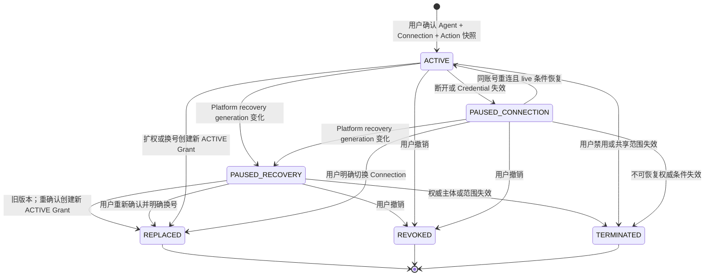

图中的recovery箭头表示17.4 effective状态变化，不要求对全部Grant做批量stored UPDATE；普通业务命令导致的其他箭头仍持久化stored状态和生命周期审计。实现和测试不能分别为图与数据库发明两套判定。

**[PRD]** Agent 授权本身无独立到期时间；用户撤销、换为不同外部账号、账号被禁用或共享范围失效时授权终止，Connection 断开或外部凭证失效时授权暂停，且停用、撤销等收紧必须对后续调用即时生效。

**[本项目设计决策]** 上述即时失效通过每次 Permit issue、redeem 和 dispatch 的 live check 实现；“无期限”不能被实现成永不复核的长期 bearer token。

**[本项目设计决策]** 任一confirmed recovery generation与runtime current不一致时，所有恢复出的current Grant即使stored状态仍显示ACTIVE或PAUSED_CONNECTION，也由17.4 predicate得到effective `PAUSED_RECOVERY`；只有当前Agent policy已验证到本代`platformPolicyValidationGeneration`，且用户重新完成当前Agent、Connection、账号、同一entitlement epoch和Action preview，才能以本代两侧recovery generations创建新的ACTIVE Grant，并把旧source置为`REPLACED(reason=RECOVERY_RECONFIRMED)`。Entitlement epoch已变化时旧Grant必须TERMINATED，新授权走INITIAL。M1没有可替代用户确认的外部授权账本，因此不得批量直接OPEN或原地改写旧确认版本。外部policy change journal只用于证明恢复出的Owner/范围/渠道配置没有遗漏后续缩权，不替用户重建Grant。

### 17.8 创建、切换、扩权和撤销

| 操作 | Platform 必须检查 | Connection 必须回答 | 结果 |
| --- | --- | --- | --- |
| 首次授权 | 当前用户/Agent/Owner Action Set | Connection 对当前用户可发现、处于 ACTIVE 或可管理的 DEGRADED、provider/binding/scope snapshot | 创建 Grant + 不可变确认快照 |
| 切换账号 | 旧 Grant、明确替换确认、幂等键 | 新 Connection 对当前用户可用及 fingerprint/profile | 同一事务将旧 Grant REPLACED 并创建新 Grant |
| Owner 新增 Action | Owner 权限、Action 已发布 | 当前 scope 是否支持只用于展示 | 不修改旧确认；首次调用返回确认入口 |
| 用户确认新增 Action | 当前 Agent 授权根、Owner set revision、稳定 Action 和 permission 摘要 | Connection live account binding、scope revisions 和 execution fence | 同一事务将旧 Grant REPLACED并创建新 Grant/确认快照，切换Slot pointer/fence |
| Owner 移除 Action | Owner 权限、配置 revision | 无 | live 交集立即移除，无需等待用户确认 |
| 用户撤销 | 当前用户、Grant revision、幂等键 | 无同步写依赖 | 锁定 Grant/fence，状态 REVOKED；后续 redeem 失败 |
| 普通终态后重新授权 | Slot current pointer为空；不存在需要收敛或续接的alternate claim；当前Agent policy与新资格已验证 | fresh eligibility返回current exact entitlement；若资格曾中断则必须是new epoch | 使用通用INITIAL创建新的current Grant；历史REVOKED/TERMINATED版本保持终态 |
| Alternate attempt终态后续接（条件build） | 前一claim是连续sequence-1；17.5五层proof/delivery闭环完整；当前用户在目标Agent页面执行新的page action | previous lineage与本地terminal receipt、proof witness、六列ack pointer完全一致 | 只能创建下一sequence的ALTERNATE_PATH_INITIAL；普通INITIAL、worker、consumer和管理员均不得创建successor |

**[本项目设计决策]** Grant 创建、切换和确认前，Platform 通过内部 eligibility API 让 Connection 校验账号归属和共享范围。该预检改善用户反馈，但不替代 Connection 在 dispatch 前的 live check。

**[本项目设计决策]** `STALE/ABANDONED` alternate lineage不会因为Slot current pointer为空而降级成普通首次授权。`BODY_COMMITTED` proof、未定稿`WAITING_PROOF` outbox、只保存receipt/投影、只收到普通ACK或缺proof ID/checksum的旧pointer都必须返回安全不可用，且对Grant、claim sequence和successor零写。

### 17.9 渠道规则

- **[PRD]** Web、企微和自定义 WebUI 都映射到公司稳定用户身份；无法映射时不调用 Agent。
- **[PRD]** 企微群聊只使用触发本次消息的发送者 Grant，不能使用群内其他成员的 Connection。
- **[本项目设计决策]** `channel` 和 `channelSubjectBindingId` 进入 ExecutionGrant/Permit；回调、重试或跨渠道继续任务不能替换原 actor。
- **[本项目设计决策]** 自定义 WebUI 即使拥有自己的页面和会话，也只能通过身份感知入口创建 Platform execution，再经 Tool Gateway 调用 Connection。WebUI 或 Agent Pod 直连 `connection-api` 被服务认证和 NetworkPolicy 双重拒绝。

## 18. ExecutionGrant 与 ExecutionPermit

### 18.1 对象职责

| 对象 | 创建时机 | 可持有者 | 是否可兑换 Connection 调用 |
| --- | --- | --- | --- |
| Execution token | Platform 接受用户消息/execution 后 | Agent Runtime | 否，只能认证 Tool Gateway 请求 |
| ExecutionGrant | Platform 创建 execution 时 | Platform DB | 否，缺少具体 Connection/Action/args |
| ExecutionPermit | Tool Gateway 接受一次 toolCall 并完成授权检查后 | Platform DB；opaque token 只发送给 Connection | 是，一次、短期、在线 redeem |

### 18.2 Permit claims

Platform DB 为每个 Permit 持久化以下不可变 claims：

| Claim | 作用 |
| --- | --- |
| `permitId`、`invocationId`、`tokenHash`、`jti` | Permit/逻辑调用标识、Secret 比对和防重放 |
| `issuer`、`audience=connection-api` | 防跨服务使用 |
| `issuedAt`、`expiresAt` | 限制泄露窗口；Proposed 默认 TTL 60 秒、最大 120 秒 |
| `executionId`、`toolCallId` | 关联一次 Agent execution 和逻辑工具调用 |
| `userId`、`agentId`、`channel`、`channelSubjectBindingId` | 固定主体、渠道和服务端身份映射绑定，不由 Connection 请求覆盖 |
| `providerId`、`connectionId`、`accountBindingRevision`、`externalScopeRevision`、`sharedScopeRevision`、`connectionExecutionFence`、`connectionRecoveryGeneration` | 固定目标外部账号、当前 scope snapshots、执行 fence 和 Connection 恢复代次 |
| `mutationLedgerGeneration?`、`mutationDecisionStateAtIssue?`、`mutationDecisionLeaseId?`、`mutationDecisionChecksum?`、`mutationDecisionTargetChecksum?`、`mutationCanaryManifestChecksumAtIssue?`、`mutationDecisionExpiresAt?` | mutating Action必须绑定issue边界的current RPO=0 decision与exact target；CANARY还绑定manifest；read-only全部为空；redeem仍重新取proof |
| `grantSlotId`、`authorizationFence`、`grantId`、`grantRevision` | 与撤销、切换、确认串行化 |
| `platformRecoveryGeneration`、`platformPolicyValidationGeneration`、`agentAuthorizationRevision`、`ownerActionSetRevision`、`confirmedActionSnapshotId` | 固定Platform恢复/Policy复核代次、共同授权根、Owner和用户确认依据 |
| `toolName`、`actionId`、`actionVersionId`、`authorizationDigest`、`effectClass` | 固定 Provider-qualified 工具身份、实际执行契约和mutation分类；effect class来自immutable ActionVersion，不能由调用方提交 |
| `deadlineAt` | 固定逻辑 toolCall 总 deadline；任何续签或下游 timeout 只能缩短 |
| `preauthorizationRequestHash`、`preauthorizationHashVersion`、`canonicalArgsHash`、`logicalRequestHash`、`authorizationSnapshotHash`、`canonicalizationVersion` | 在redeem前绑定Connection prewrite；防参数/Call替换，区分稳定逻辑调用和每代授权快照 |
| `entitlementBindingId`、`connectionEntitlementEpoch`、`entitlementEvidenceChecksum` | 绑定确认时连续 entitlement exact tuple；明确 loss/epoch mismatch 会终结 Grant而非仅拒绝本次调用 |
| `traceId`、`requestId` | 跨系统诊断，不作为权限输入 |

**[本项目设计决策]** Permit token 是 256-bit opaque Secret，Platform 只存 hash。即使未来改为签名 JWS，Connection 仍必须在线 redeem；离线验签不能满足立即撤销和一次消费。

### 18.3 签发流程

**[本项目设计决策]** 任何远程 Identity/Connection 调用都不能发生在持有 Platform 数据库行锁的事务内。签发分两阶段：

阶段 A，在数据库锁外准备证据：

1. 从 execution token 找到持久化 execution；忽略 Agent 提交的任何主体字段。ExecutionGrant 的 Platform recovery generation 必须为当前代，并从 execution/toolCall budget 计算不可延长的 `deadlineAt`。
2. 向公司身份 Adapter 取得当前账号有效性和短期 `identityAssertion`；不可用时 fail closed。
3. 规范化 Provider-qualified `toolName + args`，服务端解析 `providerId/actionId`，取得 Owner 当前 exact ActionVersion、immutable effect class和 `argsHash`；未知或歧义 toolName fail closed。Mutating Action还要取得`purpose=PERMIT_ISSUE`的fresh mutation decision lease并独立验签/current校验；read-only不得伪造非空mutation proof。
4. 创建或读取稳定 `ToolConnectionInvocation(executionId, toolCallId)`；首次创建时由Platform生成并持久化不可变CSPRNG `connectionCallIdempotencyKey`，它不是bearer且只供Platform到Connection的exact Invocation调用使用。冻结 `preauthorizationRequestHash/
   logicalRequestHash/deadlineAt/platformRecoveryGeneration/platformPolicyValidationGeneration/effectClass/
   mutationLedgerGeneration?/mutationDurabilityEvidenceKind+Ref+Checksum+IssuedAt+ExpiresAt?/
   mutationRiskWindowStart+End?/catalogMutatingSetVersion+Checksum?/
   futureWriteTopologyAttestationRef+Checksum+ExpiresAt?`，同toolCall不同request、更晚deadline或mutation
   generation/evidence/risk-window/Catalog set/future-topology tuple变化冲突。
5. 调用 Connection eligibility preflight，取得当前 account/scope/shared revisions、exact entitlement binding、`connectionExecutionFence`、`connectionRecoveryGeneration` 和不泄露存在性的结果。

阶段 B，使用 Platform DB 短事务线性化：

1. 按 17.4 固定顺序锁 `PlatformAuthorizationRuntime -> AgentAuthorizationRoot -> GrantSlot -> current Grant -> Invocation -> current Permit`。
2. 验证 identityAssertion freshness/monotonic epoch、当前 Platform recovery generation和policy validation generation、AgentAuthorizationRoot已在本代复核、Grant的本代重确认与entitlement binding，并重新检查 Agent 范围、渠道、Owner exact selection、`actionId + authorizationDigest` 用户确认和 `authorizationFence`。Pending confirmation 的 exact `actionVersionId` 门禁只发生在17.2 commit；Grant生效后按13.4仅允许当前Owner选择同digest的受审exact version，digest变化仍须重新确认。Mutating Action还要在事务提交点验证decision lease未过期，external current与Platform mirror的control version、mutation generation/state、evidence kind/ref/checksum/issuedAt/expiresAt、风险窗口、Catalog mutating-set version/checksum和future topology ref/checksum/expiry完全一致；发现 definitive entitlement loss 时按17.5原子终结Grant后拒绝。
3. 首次签发时，Invocation原子冻结`grantSlotId/grantId/entitlementBindingId+connectionEntitlementEpoch+entitlementEvidenceChecksum/connectionId/accountBindingRevision/platformPolicyValidationGeneration/connectionRecoveryGeneration/effectClass`；mutating Action另冻结`mutationLedgerGeneration + 完整MutationDurabilityEvidenceV1 common tuple`。后续generation的GrantSlot、Grant、entitlement、Connection、账号绑定和recovery/validation/mutation/evidence/set/topology tuple必须与冻结值相同；任一变化都把未绑定Call的Invocation终结为`TARGET_STALE`或`RECOVERY_CANCELLED`，要求新toolCall，绝不改投新账号。
4. `grantRevision/authorizationFence/agentAuthorizationRevision/ownerActionSetRevision/externalScopeRevision/sharedScopeRevision/connectionExecutionFence`可以变化，但只能在冻结值未变且本次完整live交集仍允许exact ActionVersion时写入下一代Permit。阶段A的Connection/Identity evidence还必须未超过最大年龄；definitive entitlement mismatch走终结而非续签。
5. 若 Invocation 已绑定 callId，不再签 Permit，只返回 call association，后续使用 22.6 的 ExecutionAccessAssertion 查询；若未绑定且有尚有效 ISSUED Permit，不签发或 supersede 新 Permit。
6. 仅当上一 Permit 在同一事务确认 `expiresAt <= now`、仍未兑换并转为 EXPIRED 后，才可递增 `permitSequence`。新 Permit 继承同一逻辑 request、冻结 target 和原 `deadlineAt`；read-only的`expiresAt = min(now + permitTTL, deadlineAt)`，mutating还必须取本次新proof并使用`min(now + permitTTL, deadlineAt, mutationDecisionExpiresAt, mutationDurabilityEvidenceExpiresAt, futureWriteTopologyAttestationExpiresAt)`。
7. 创建 `ISSUED` Permit、平台审计和 outbox 后提交，立即释放锁。Platform从持久化Invocation读取`invocationId + connectionCallIdempotencyKey`，连同request-local内存中的opaque token、toolName、toolCallId、actionVersionId、deadlineAt和args发送给Connection；不把token、Invocation ID或幂等键返回Agent。

Permit 明文不持久化，因此“数据库里有 ISSUED 行”不等于新进程能返回原 token。原 request-local 执行路径可在内存仍持有 token 时重试同一 Connection 请求；进程崩溃、调用栈丢失或响应是否送达未知时，恢复器先观察 Invocation/Permit 是否已因 redeem 绑定 callId。未绑定且 Permit 仍有效时返回内部 `PERMIT_DELIVERY_PENDING` 和不晚于 `expiresAt` 的 retry time，等待原请求完成或旧 Permit 到期；不得仅凭“可能未送达”提前作废。到期后按步骤 6 签下一代，并从Invocation重读同一`connectionCallIdempotencyKey`继续原prewritten Call；request中的`invocationId`和该key都进入preauthorization commitment。该协议只持久化非bearer幂等材料，不保存可恢复Permit明文，也不会让两个有效generation并存。

**[评审门禁]** 公司身份系统若不能提供 revision/epoch，只能通过每次敏感操作同步查询和短 freshness 窗口实现 fail closed，无法与 Platform DB 形成严格分布式线性化。身份 Adapter 的禁用传播契约必须在上线前批准。

### 18.4 在线 redeem

Connection 调用 Platform 内部 redeem endpoint，提交：

```json
{
  "permitToken": "opaque-secret",
  "callId": "connection-generated-call-id",
  "actionVersionId": "uuid",
  "argsHash": "sha256:...",
  "preauthorizationRequestHash": "sha256:..."
}
```

Platform 先在事务外同步取得当前 `identityAssertion`；若Permit声明mutating，还必须取得新的
`purpose=PERMIT_REDEEM` mutation decision lease。随后在短事务中：

1. 以 token hash 查找 Permit，并验证 service audience、TTL 和状态。
2. 从 Permit 的稳定 ID 解析 Agent/Slot，在事务中按 `PlatformAuthorizationRuntime -> AgentAuthorizationRoot -> GrantSlot -> current Grant -> Invocation -> Permit` 固定顺序加锁。
3. 验证 identityAssertion freshness/monotonic epoch、两侧 recovery generation、当前policy validation generation、Grant本代确认与exact entitlement binding、当前 Agent 范围/渠道/Owner exact selection、Grant status/revision、`actionId + authorizationDigest` 用户确认和 Invocation 冻结 target；当前exact ActionVersion必须满足13.4同digest受审选择，不能借redeem改变Invocation已冻结target。Mutating Permit另验证effect class不可变、新proof在事务提交点有效，proof与外部current/Platform mirror/Invocation/Permit的mutation generation、state及完整`MutationDurabilityEvidenceV1` common tuple完全一致，且state为MUTATION_CANARY或MUTATION_OPEN；issue proof不能代替redeem proof。Definitive entitlement mismatch按17.5终结Grant并拒绝；暂时不可读只fail closed。
4. 比对 `callId`、toolName、ActionVersion、argsHash、`preauthorizationRequestHash` 和 deadline；要求该hash同时等于Invocation与Permit的write-once commitment，确认 Invocation 尚未绑定其他 call，且当前时间早于 `deadlineAt`。
5. 原子执行 Permit `ISSUED -> REDEEMED` 和 Invocation `PERMIT_ISSUED -> CALL_BOUND`，一次性保存 `redeemedAt/redeemedBy/callId/redeemedPreauthorizationRequestHash`。数据库 composite约束/trigger要求callId与hash作为同一association写入，不能先消费Permit后再补hash。
6. 返回权威 Permit claims；Connection 必须逐字段与本地请求/live state 比对。

| 重复情况 | 结果 |
| --- | --- |
| 同 token、同 callId、同 action/args | 幂等返回相同 REDEEMED claims |
| 同 token、不同 callId | `PERMIT_REPLAY_CONFLICT` |
| 同 token/callId但 preauthorization hash 不同 | `PERMIT_REPLAY_CONFLICT`；Permit/Invocation保持未消费或原association不变 |
| token 已过期且未兑换 | `PERMIT_EXPIRED`，确认无 Provider 出站 |
| Grant 已撤销/替换/revision 变化 | `AUTHORIZATION_REVOKED_OR_STALE` |
| Platform/Connection recovery generation 变化 | `RECOVERY_COHORT_MISMATCH`；旧未绑定 Invocation 以内部 reason `RECOVERY_CANCELLED` 终结 |
| mutation generation/state、evidence exact tuple、Catalog set或future topology变化，任一proof过期或decision lease不可得 | `MUTATION_RECOVERY_BLOCKED`；mutating Permit不消费，未绑定Invocation终结或等待新的明确toolCall；read-only不受此项提升 |
| token 不存在、主体不匹配或 audience 错误 | 统一 `PERMIT_INVALID`，不披露细节 |

### 18.5 Redeem 与撤销线性化

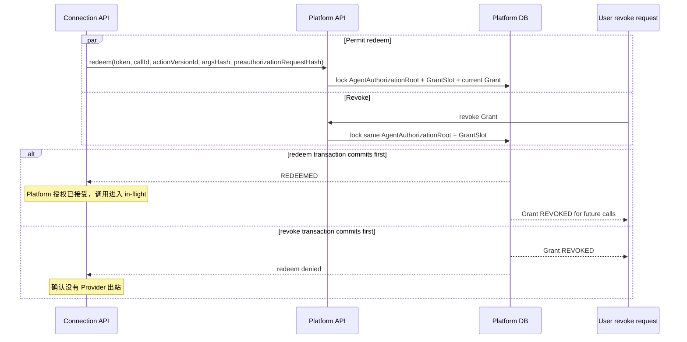

**[本项目设计决策]** 上述两个结果是唯一合法的 Platform 授权线性化结果。不能出现“撤销已向用户成功返回，但一个尚未兑换的 Permit 随后兑换成功”。Redeem 只表示该调用获得授权并进入 in-flight，**不表示请求已经提交给外部 Provider**；真正可能产生外部副作用的边界从 Effect dispatch 开始。

**[评审门禁]** Proposed 语义是：redeem 先成功的 in-flight 调用不因随后 Platform Grant 撤销而被强制回滚，但仍可能被 Connection 当前 Provider、exact ProviderRelease、exact ActionVersion或Connection状态拒绝；撤销阻止后续调用。若产品要求“撤销必须取消尚未开始网络发送的已兑换调用”，需要新增跨系统 dispatch-commit 协议并更新 PRD。

### 18.6 Permit 状态

```text
ISSUED -> REDEEMED
ISSUED -> EXPIRED
ISSUED -> DENIED
```

Permit 不从 `REDEEMED` 退回，也不复用；有效 ISSUED Permit 不能被直接 supersede。清理任务可在审计保留期后删除 token hash，但需保留不含 Secret 的 permit audit/reference。

单个 Permit `EXPIRED` 不会终结逻辑调用。若 ActionCall 已 prewrite，它保持 `PREPARED`；若尚未创建 Call，则 Invocation 保持可恢复。只有 ToolConnectionInvocation 固定 `deadlineAt` 到期时，Call 才进入 `EXPIRED_BEFORE_AUTH`；明确取消且可证明没有mutating Effect开始时进入`CANCELLED_NO_MUTATION`。下一代 Permit 必须继续绑定同一 Invocation、冻结 target、原 deadline 和已有 ActionCall，不能创建第二个 Call 或 LogicalEffect。Grant/账号/recovery generation 变化则终结旧 Invocation，不属于可续签场景。

## 19. Action 调用完整时序

```mermaid
sequenceDiagram
    participant A as Agent Runtime
    participant P as Platform Tool Gateway
    participant PD as Platform DB
    participant C as Connection API
    participant CD as Connection DB
    participant K as KMS
    participant E as Egress Proxy
    participant R as Recovery Control
    participant X as Provider

    A->>P: provider-qualified toolName + args + executionToken
    P->>PD: resolve execution/user/Agent/Grant snapshot without row lock
    P->>C: eligibility preflight via service identity
    C->>CD: check ownership/shared scope + all revisions/fence
    C-->>P: eligible + revisions or existence-neutral denial
    P->>R: mutating only: acquire PERMIT_ISSUE mutation decision lease
    P->>PD: lock Agent auth root + GrantSlot + Invocation, persist Permit
    P->>C: permitToken + toolName + toolCallId + actionVersionId + deadlineAt + args
    C->>CD: claim/select Call + compare preauthorization commitment
    C->>P: redeem permitToken + callId + argsHash + preauthorizationHash
    P->>R: mutating only: acquire PERMIT_REDEEM mutation decision lease
    P->>PD: compare Invocation/Permit commitment + atomically bind/redeem
    P-->>C: authoritative Permit claims
    C->>CD: persist AUTHORIZED + dispatch lease
    C->>CD: recheck catalog/account/scope/credential and write Attempt + LogicalEffect + Dispatch PREPARED
    C->>K: decrypt current Credential revision
    C->>R: mutating Action verify current generation/state/typed evidence/Catalog set
    C->>CD: recheck fences + CAS Dispatch SUBMISSION_STARTED
    C->>E: mTLS + EgressDispatchAssertion + allowlisted request
    E->>R: acquire current ACTIVE admission lease proof
    E->>C: accept exact hop/JTI/MAC/proof
    C->>CD: verify signed lease proof; INSERT admission + CAS hop ACCEPTED_NO_START
    C-->>E: ACCEPTED_NOW exactly once
    E->>X: bound request + Provider idempotency key when supported
    E->>C: signed REQUEST_STARTED receipt
    X-->>E: result/error/requestId
    E-->>C: signed terminal response/unknown receipt + bounded evidence
    C->>CD: atomically finalize Effect, Call, audit and outbox
    C-->>P: callId + typed redacted result/error
    P->>PD: persist Connection call reference and execution event
    P-->>A: tool result
```

### 19.1 Preflight 与最终校验

Preflight 只用于快速拒绝和取得当前 account/scope/shared revisions 与 execution fence。以下条件必须在实际 Provider 出站前由 Connection 再检查：

- Platform redeem 返回的 `connectionId/accountBindingRevision/externalScopeRevision/sharedScopeRevision/connectionExecutionFence/connectionRecoveryGeneration/toolName/actionId/actionVersionId/argsHash/deadlineAt` 与本地完全一致。
- Provider、exact ProviderRelease和exact ActionVersion均为`PUBLISHED | DEPRECATED`且三层21.3 validation overlay属于current `catalogValidationGeneration`并匹配exact revision/checksum；任一DISABLED、缺overlay或Journal/checkpoint异常都拒绝。
- Connection effective status 为 ACTIVE，或为 DEGRADED 且当前 breaker/错误策略明确允许本次 dispatch；个人 owner 或共享范围仍包含当前 user。REAUTH_REQUIRED/DISCONNECTED/RECOVERY_REVALIDATION_REQUIRED/DISABLED 一律拒绝。
- Credential revision 可用，外部 scopes 仍覆盖 required scopes。
- Provider/Connection/主体并发和速率限制允许执行。
- ActionVersion executor digest 与已发布记录相同。

最终校验与 dispatch 分两次短事务，不跨网络持锁：

1. 在 DB 锁外取得最新公司 identity assertion；Personal 校验账号有效，Shared 还校验当前 USER/ORG membership。Identity 不可用时 fail closed。
2. 按固定顺序锁或 CAS `provider -> provider_release -> action_version -> connection_account -> current credential -> action_call`，验证 assertion freshness、所有状态/revisions/fence/scope，并把 exact `providerReleaseId + executorDigest + credentialVersionId + credentialSetRevision + credentialStateRevision` 固定到 ActionAttempt。
3. 在同一事务创建 ActionAttempt、稳定 LogicalEffect、EffectDispatch `PREPARED`，并把 Call 推进 `DISPATCH_READY`；写 audit/outbox 后提交。
4. disconnect、shared scope update、Provider/ProviderRelease/ActionVersion disable 使用同样的资源锁顺序并提升对应 revision/fence，因此和步骤 2 只有一个合法先后结果。
5. `ProviderHttpClient`准备创建逻辑Provider请求前开启第二个短事务，仍按 `provider -> provider_release -> action_version -> connection_account -> exact credential_version -> action_call -> attempt -> effect -> dispatch` 加锁；重新检查Provider/Release/ActionVersion状态、current catalog validation overlays与digests、Connection fences、current Credential pointer、`credentialSetRevision`、exact Credential的`credentialStateRevision/lifecycle/expiry`、本地Recovery Control mirror freshness/cohort/generations/phase和execution recovery state，再CAS `EffectDispatch PREPARED -> SUBMISSION_STARTED`、把Call首次`first_submission_started_at`从null填为当前时间并推进到`DISPATCHING`（后续Effect/重试只验证该字段非空并保持`DISPATCHING`），同时插入绑定该dispatch的`ProviderEgressHop(PREPARED)`。
6. disconnect、Credential refresh/API Key 替换/invalid、shared scope update和 Provider/ProviderRelease/ActionVersion disable 使用相同前缀锁序。若这些变化先提交，旧 Dispatch记`FAILED_BEFORE_SUBMIT`、旧Attempt记`FAILED_DEFINITE`，Call按原因进入`DENIED_LOCAL`，需要时只能由上层以新 current Credential和新toolCall发起新调用；若 SUBMISSION_STARTED 先提交，该 Dispatch 成为 in-flight，随后 Credential 退休或停用只阻止新 Dispatch，不能伪称旧请求未发送。
7. 提交SUBMISSION_STARTED后释放DB锁，按exact durable dispatch签发22.10短期mTLS-bound EgressDispatchAssertion。Proxy完成外部Recovery Control admission lease、完整MAC和endpoint policy检查后，还必须取得Connection DB CAS唯一返回的ACCEPTED_NOW，才可创建一个逻辑request/HTTP2 stream。marker/签发/CAS后任一点崩溃都按admission+transport receipt收敛为FAILED_BEFORE_SUBMIT或UNCERTAIN；不能跨网络保持行锁来伪造数据库与Provider原子性，也不能凭旧Pod/Proxy内存绕过take-once fence。

任何 live check 失败都在 EffectDispatch `SUBMISSION_STARTED` 之前结束，从而能证明没有外部副作用。`INTENT_RECORDED/PREPARED` 严格表示尚未开始出站；`SUBMISSION_STARTED` 表示可能已经出站。

### 19.2 同步响应与恢复查询

**[本项目设计决策]** `POST action-calls` 可以在一个 HTTP 请求中等待短时 Provider 结果；无论连接是否保持，ActionCall 都已持久化。超过网关等待时间时返回 `202 + callId + status=IN_PROGRESS`，Platform 通过受服务身份保护的 `GET action-calls/{callId}` 查询。

Platform 不通过重复创建新 ActionCall 来恢复丢失响应。相同 `(executionId, toolCallId)` 与持久化 Connection 幂等键一旦绑定，必须在该 Invocation 的完整保留期内始终解析到原 `invocationId/callId`；`SUCCEEDED`、`FAILED_DEFINITE`、`UNCERTAIN` 或其他终态都不释放绑定。相同 canonical request只查询或回放原 Call，不同 request返回`409 IDEMPOTENCY_CONFLICT`；执行新的业务动作必须由Platform显式创建新的toolCall、Invocation和幂等键，原`UNCERTAIN` Effect只能按20.7对账，不能借新Call重放。

## 20. ActionCall、Attempt 与 Effect Ledger

### 20.1 四层实体

| 实体 | 表达 | 数量关系 | 是否能被重试创建多个 |
| --- | --- | --- | --- |
| `ActionCall` | 一次逻辑 Tool 调用和用户可见结果 | 一个 toolCall 至多一个 | 否；幂等重放返回同一 call |
| `ActionAttempt` | Connection 对该调用的一次受控执行尝试 | 一个 call 可有多个 | 仅按 20.6 的唯一 successor 协议创建 |
| `LogicalEffect` | Action 内一个稳定逻辑外部效果 | 一个 call 按 `logicalEffectKey` 可有多个 | 否；跨 attempt 保持同一 effectId/idempotency key |
| `EffectDispatch` | 对一个逻辑 Effect 的一次实际网络发送尝试 | 一个 effect 可有多个 | 仅 read/idempotent policy 允许时 |

多步骤 Action 必须为每个逻辑外部效果使用确定性 `logicalEffectKey` 创建 Effect，并为每次网络发送创建 Dispatch，定义各步骤顺序、结果和对账方式。无法把外部请求接入受控 Effect hook 的 executor 不得发布为 M1 写 Action。M1 不引入 `PARTIAL_SUCCESS` 产品状态，因此多个 Effect 仅允许用于 read-only 聚合，或一个写 Effect 前的无副作用读取；不得在一个 Action 中串联两个独立 mutation。

同一 `(callId, logicalEffectKey)` 再次登记时，request hash、endpoint policy、method、冻结的effect policy version、Provider idempotency contract/key derivation version/hash或语义版本任一不同，冲突请求都禁止创建第二个Effect、额外Dispatch、Hop、Admission及任何Provider出站，也禁止改写既有Effect/Dispatch的request binding、contract或key字段；executor不能复用effect key把第二个业务效果伪装成retry。唯一允许的lifecycle写，是按本段原子终结已经存在的current零发送retry successor。冲突只追加不含请求正文的安全审计与高优先级telemetry，并按原Effect和21.4 retry decision的持久证据决定Call：mutating Effect为`SUBMITTED`时保持`DISPATCHING`等待原请求收敛；为`RETRY_PENDING`时，只有current successor Dispatch仍为`PREPARED`、不存在Hop/Admission且未进入`SUBMISSION_STARTED`，才可终结该零发送successor。若decision证明predecessor为`PROVED_NOT_APPLIED`，或Effect为`READ_ONLY`，同一事务把current Dispatch置`FAILED_BEFORE_SUBMIT`、Attempt置`FAILED_DEFINITE`、Effect置`NOT_APPLIED`，随后在全部mutating Effect均为`NOT_APPLIED`时以`ACTION_LOGICAL_EFFECT_CONFLICT`终结Call。若mutating predecessor为`OUTCOME_UNKNOWN`，current Dispatch仍以`RETRY_SUCCESSOR_BINDING_CONFLICT_WITH_PRIOR_OUTCOME_UNKNOWN_BEFORE_SUBMIT`终结为`FAILED_BEFORE_SUBMIT`，但Attempt、Effect和Call必须原子进入`UNCERTAIN`并投影`ACTION_OUTCOME_UNCERTAIN`；successor零发送只证明本次Dispatch未开始，不能覆盖predecessor可能已经产生的外部效果，也不能投影`ACTION_LOGICAL_EFFECT_CONFLICT`。若successor已可能开始，则必须先按持久事实推进`SUBMITTED/UNCERTAIN`，不能写冲突确定失败。任一mutating Effect为`UNCERTAIN`或Call已`RECONCILING`时保持对应状态并最终使用`ACTION_OUTCOME_UNCERTAIN`；mutating Effect已`CONFIRMED`时保持或收敛`SUCCEEDED`并回放原结果。只有同一事务证明不存在mutating Effect，或全部mutating Effect均已凭exact transport/Provider证据成为`NOT_APPLIED`，才可把Call置为`FAILED_DEFINITE + ACTION_LOGICAL_EFFECT_CONFLICT`。冲突本身不能把未知效果伪装成确定失败，也不能覆盖已确认成功。

### 20.2 ActionCall 状态机

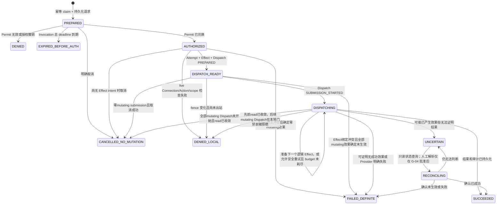

`DISPATCH_READY`只表示整个Call尚无任何Dispatch进入过`SUBMISSION_STARTED`。首次Dispatch写入`SUBMISSION_STARTED`的同一事务必须fill-once `ActionCall.first_submission_started_at`并把Call推进`DISPATCHING`；此后即使当前Effect已完成、下一个Effect或安全重试仍为`PREPARED`，Call也不得回退`DISPATCH_READY`或清空该时间。这个单调门禁避免多read-effect Action在已有Provider读取后被误报为“从未出站”。

`DISPATCHING -> DENIED_LOCAL`只允许在多步骤`read-before-write` Action中使用：至少一个read-only Effect已经确定收敛，但后续唯一mutating Effect仍没有任何Dispatch进入`SUBMISSION_STARTED`，且最新Connection/Credential/Catalog/scope/recovery fence检查在创建或提交该mutating Dispatch前确定拒绝。终结事务必须保存已完成read的审计事实、`first_submission_started_at`、零mutating-submission证明和exact local-denial reason；不得回退`DISPATCH_READY`、把read伪装成从未出站，或在任一mutating Hop/Admission/stream可能存在时使用该边。并发cancel若先提交且同样证明零mutating submission，可进入`CANCELLED_NO_MUTATION`；local-denial先提交后，cancel只能回放`ALREADY_TERMINAL/DENIED_LOCAL`。

### 20.3 状态语义

| 状态 | Provider 请求可能已发出 | 允许普通重试 | 用户表现 |
| --- | --- | --- | --- |
| `PREPARED` | 否 | 可恢复同一 call 的 redeem | 提交中 |
| `DENIED/EXPIRED_BEFORE_AUTH` | 否 | DENIED 需新授权；总 deadline 到期后需明确新 toolCall | 授权失效或请求过期 |
| `AUTHORIZED` | 否 | 可恢复同一 call 的 dispatch | 已授权，等待执行 |
| `DISPATCH_READY` | 否；`first_submission_started_at`必为空 | 恢复Call的首次PREPARED dispatch | 已授权，等待首次出站 |
| `DENIED_LOCAL` | 可能已有read-only请求；mutating请求确定未开始 | 按原因连接/重连/等待 | Connection 或能力不可用 |
| `DISPATCHING` | 可能已发出 | 只按 Effect policy 在同一 call/effect 内恢复 | 执行中 |
| `SUCCEEDED` | 是 | 幂等回放结果，不再出站 | 成功 |
| `FAILED_DEFINITE` | 可能发出，但结果确定失败/未生效 | 否；符合 policy 的自动 retry 必须在进入该终态前完成 | 明确失败及下一步 |
| `UNCERTAIN` | 是 | **禁止盲重试** | **[评审门禁] 结果待确认** |
| `RECONCILING` | 不执行原操作，只查询 | 不适用 | 正在核对结果 |
| `CANCELLED_NO_MUTATION` | read-only请求可能已发出；mutating请求确定未开始 | 否；需要明确新 toolCall | 已取消，未产生外部变更 |

### 20.4 LogicalEffect 状态

```text
INTENT_RECORDED -> SUBMITTED -> CONFIRMED
INTENT_RECORDED -> RETRY_PENDING
SUBMITTED -> RETRY_PENDING
RETRY_PENDING -> SUBMITTED
RETRY_PENDING -> NOT_APPLIED
RETRY_PENDING -> UNCERTAIN
INTENT_RECORDED -> NOT_APPLIED
SUBMITTED -> NOT_APPLIED
SUBMITTED -> UNCERTAIN
UNCERTAIN -> CONFIRMED | NOT_APPLIED | UNCERTAIN
```

| 状态 | 证据要求 |
| --- | --- |
| `INTENT_RECORDED` | DB 已保存 endpoint policy、request hash、Provider idempotency key 和 attempt fence，但尚未开始网络调用 |
| `SUBMITTED` | 网络发送已开始或无法证明未开始；记录提交时间和可用的 Provider request ID |
| `RETRY_PENDING` | policy/budget已允许安全retry且current successor仍引用同一LogicalEffect；它不单独断言predecessor未生效。21.4 decision必须持久化predecessor的`PROVED_NOT_APPLIED`或`OUTCOME_UNKNOWN` provenance。前者，或READ_ONLY的后者，可在零发送successor遇binding/冻结合同冲突时收敛为`NOT_APPLIED`；mutating `OUTCOME_UNKNOWN`只能收敛为`UNCERTAIN` |
| `CONFIRMED` | Provider 明确成功，或对账 API 证明效果存在 |
| `NOT_APPLIED` | Provider 明确拒绝且契约证明没有效果，或对账证明未生效 |
| `UNCERTAIN` | timeout、连接中断、进程崩溃或结果持久化失败，无法证明外部状态 |

Call 终态按全部 required LogicalEffect 确定性聚合：

| Effect 集合事实 | ActionCall 结果 | 约束 |
| --- | --- | --- |
| 任一 mutating Effect 为 `UNCERTAIN` | `UNCERTAIN` | 即使其他读取成功也禁止普通 retry |
| 唯一 mutating Effect 为 `CONFIRMED` | `SUCCEEDED` | 后续本地结果处理失败不能伪装成外部失败；使用 `resultAvailability=UNAVAILABLE`的固定安全文案，具体InternalReason不对普通用户序列化 |
| LogicalEffect绑定冲突，且不存在mutating Effect或全部mutating Effect均为`NOT_APPLIED` | `FAILED_DEFINITE` + `ACTION_LOGICAL_EFFECT_CONFLICT` | 冲突请求零新Effect/Dispatch/Hop/Admission/出站；必须有exact证据满足本行，不能覆盖`SUBMITTED/RETRY_PENDING/UNCERTAIN/CONFIRMED` |
| mutating Effect 明确 `NOT_APPLIED`，且 retry 已耗尽 | `FAILED_DEFINITE` | 必须有 Provider/transport 证据证明未生效 |
| 已请求取消、全部 mutating Effect 均可证明从未创建Provider stream，且 read-only 请求已终结 | `CANCELLED_NO_MUTATION` | 已完成读取只保留审计，不组成成功结果；任何mutating `REQUEST_STARTED`即使最终证明NOT_APPLIED也不得进入本终态 |
| read-only Action 的全部 required Effect `CONFIRMED` | `SUCCEEDED` | optional 展示增强不得影响业务终态 |
| read-only required Effect 明确失败且无未知结果 | `FAILED_DEFINITE` | 可按 policy 在进入终态前重试 |
| 存在两个 mutating Effect | 发布拒绝 | 需要未来 PRD 定义部分成功、补偿和用户责任后再设计 |

聚合优先级固定为mutating Effect的`CONFIRMED -> SUCCEEDED`和`OUTCOME_UNKNOWN/UNCERTAIN -> UNCERTAIN`外部效果事实优先于LogicalEffect绑定冲突；`SUBMITTED`以及尚未由decision provenance证明可以确定终结的`RETRY_PENDING`不得提前写冲突终态。current successor的零发送证据只描述current Dispatch，不会把mutating predecessor的`OUTCOME_UNKNOWN`升级成`PROVED_NOT_APPLIED`。一旦 mutating Effect `CONFIRMED`，Call 不得因绑定冲突、输出 Schema、payload 持久化或回调投递错误改写为 `FAILED_DEFINITE`。这些错误保持外部效果成功事实，结果字段标记不可用并告警；audit/outbox 由本地事务恢复。

EffectDispatch 使用更细的 transport 状态：

```text
PREPARED -> SUBMISSION_STARTED -> RESPONSE_RECEIVED
PREPARED -> FAILED_BEFORE_SUBMIT
SUBMISSION_STARTED -> OUTCOME_UNKNOWN
```

在首次Effect的短 DB 事务中，Connection 锁定 Provider、exact ProviderRelease、exact ActionVersion、Connection 当前 rows 或验证相同 fences，完成 live check，并原子写入 ActionCall `DISPATCH_READY`、ActionAttempt、LogicalEffect intent 和 EffectDispatch `PREPARED`。后续read-only Effect或安全retry创建新的PREPARED Dispatch时，Call因`first_submission_started_at`已非空而保持`DISPATCHING`。三层目录停用或Connection断开命令锁相同资源并提升 fence，因此只有一个先获得本地 dispatch 资格；事务提交后立即释放锁，绝不跨 Provider 网络请求持锁。

`ProviderHttpClient`在把请求交给Proxy前，必须在同一事务把Dispatch标为`SUBMISSION_STARTED`、fill-once Call的`first_submission_started_at`并保证Call为`DISPATCHING`。数据库、Proxy admission和外部网络无法形成一个原子事务，因此该状态采用保守语义：“可能开始提交”；此后崩溃对非幂等写按UNCERTAIN处理。只有Hop仍停在`ASSERTION_ISSUED`且不存在Admission，或受信Proxy已验签并持久化exact terminal `NOT_STARTED_AFTER_ACCEPT` receipt，才能返回`FAILED_BEFORE_SUBMIT`；仅凭`ACCEPTED_NO_START`、应用进程未创建request/stream或未观察到首字节不足以证明。

### 20.5 Crash window 矩阵

| 崩溃点 | 持久证据 | 恢复动作 | 能否再次出站 |
| --- | --- | --- | --- |
| ActionCall prewrite 前 | 无 call | Platform 可用同 toolCall 重试创建 | 是，因为可证明未执行 |
| PREPARED 后、redeem 前 | PREPARED + Invocation/permit reference | 响应未知先等 active Permit redeem/expire；仅 frozen target/deadline/两侧 generation 不变才按同 Invocation 重签；否则终结旧 toolCall | 尚不可出站 |
| redeem 成功、AUTHORIZED 写入前 | Platform Permit REDEEMED，Connection PREPARED | 查询 redeem 状态并把同 call 推进 AUTHORIZED | 是，同 call 一次 |
| AUTHORIZED 后、本地 dispatch 事务前 | AUTHORIZED | lease worker 锁 live rows、校验 fences 并继续 | 是 |
| Effect/Dispatch PREPARED 后、submission 前 | 持久 intent + dispatch fence | 若明确仍为 PREPARED 可继续同一 Dispatch；不得创建另一逻辑 Effect | 是，同一 dispatch |
| SUBMISSION_STARTED 后、响应前 | 可能已提交 | 标记 Effect UNCERTAIN，执行 reconcile | 非幂等写禁止 |
| Provider 成功、结果 DB commit 前 | Provider 可能已生效 | 标记 UNCERTAIN；用 idempotency/status API 对账 | 禁止盲重试 |
| 结果 commit 后、HTTP 响应前 | SUCCEEDED/FAILED 已持久化 | 重放同 call 的持久化结果 | 不再次出站 |
| Connection final 后、Platform event 前 | Connection 已终态，Platform 尚无引用 | Platform 按 callId 查询并幂等补写事件 | 不再次出站 |

### 20.6 Retry policy

| Effect class | 自动重试条件 | 禁止条件 |
| --- | --- | --- |
| `READ_ONLY` | Provider 契约声明安全，错误为 retryable，未超总 deadline，使用 bounded backoff | auth/scope/schema/4xx definite、用户取消、总 deadline 到期 |
| `IDEMPOTENT_WRITE` | Provider 原生 idempotency key 已绑定 effectId，契约证明重复 key 返回同一效果 | Provider 不接受或不持久化 key、key 语义未知 |
| `NON_IDEMPOTENT_WRITE` | 只有durable Hop仍为`ASSERTION_ISSUED`且无Admission，或已验签持久化exact terminal `NOT_STARTED_AFTER_ACCEPT` receipt时 | `ACCEPTED_NO_START`但无terminal receipt、admission/receipt未知，或任何证据表明logical request/stream可能开始即禁止自动重试 |

每次受控重试都创建新的 ActionAttempt 和新的 EffectDispatch，并各自使用新 ID；它们必须继续引用同一个 LogicalEffect。LogicalEffect首次创建时从`callId + logicalEffectKey + exact ActionVersion冻结的effectPolicyVersion + ProviderIdempotencyContractV1 checksum`确定性派生一次Provider idempotency key，并把contract ID/checksum、derivation version、密文/hash与Effect原子持久化为write-once字段。后续Attempt/Dispatch只读取该持久化合同和key，禁止从current Provider/Action policy重新派生；current policy漂移不能改变旧Effect的placement、duplicate-key semantics、retention contract或key。创建successor前必须执行13.2唯一compatible predicate：Effect冻结tuple/checksum、ActionVersion引用、ProviderRelease registry和current signed/validated overlay support checksum逐字节相等，support evidence未过期且覆盖本次deadline；不做自由语义比较。不兼容时在predecessor finalization事务写`RETRY_FORBIDDEN`，零budget扣减、零successor、零出站，并按exact未生效或未知证据进入`NOT_APPLIED`确定失败或`UNCERTAIN`/reconciliation。若漂移发生在successor已提交后、`SUBMISSION_STARTED`前，current Dispatch使用25.1.6独立的`RETRY_SUCCESSOR_*_POLICY_INCOMPATIBLE_BEFORE_SUBMIT` reason终结为`FAILED_BEFORE_SUBMIT`，不能复用只允许`RESPONSE_RECEIVED/OUTCOME_UNKNOWN`的predecessor reason。21.4 decision provenance为`PROVED_NOT_APPLIED`或Effect为READ_ONLY时，Attempt、Effect、Call按该predecessor category进入确定终态；mutating provenance为`OUTCOME_UNKNOWN`时，Attempt、Effect、Call必须进入`UNCERTAIN`。只有successor登记的Effect tuple本身漂移时才使用binding-conflict reason；其中mutating `OUTCOME_UNKNOWN`使用`RETRY_SUCCESSOR_BINDING_CONFLICT_WITH_PRIOR_OUTCOME_UNKNOWN_BEFORE_SUBMIT`并投影`ACTION_OUTCOME_UNCERTAIN`，不得投影`ACTION_LOGICAL_EFFECT_CONFLICT`。重试次数、backoff 和 timeout 是首个Effect冻结的Provider/ActionVersion policy，不由Agent参数决定。

预算内重试不是“把旧 Attempt 再跑一次”。worker 在一个短事务中按 `ActionCall -> current ActionAttempt -> LogicalEffect -> current EffectDispatch -> retry budget bucket` 顺序加锁，验证旧 Attempt/Dispatch 仍是各自 parent 的 current/max sequence、旧行尚无 successor、ActionVersion policy和总 deadline仍允许，并按21.4用同一stable retry operation取得Provider/account共享预算的唯一`ACQUIRED` decision，然后原子完成：

1. 旧 Dispatch写入所属aggregate的 exact `*_RETRYABLE` reason和terminal transport state。
2. LogicalEffect写入`RETRY_PENDING`，旧 ActionAttempt写入`RETRY_PENDING + exact retryable reason`。
3. 创建`sequence + 1`的ActionAttempt `PREPARED`和同一Effect的`dispatchSequence + 1` Dispatch `PREPARED`，两条previous edge分别指向刚终结的旧行。
4. 移动Call和Effect的current pointer；Call因首次submission事实已存在而保持`DISPATCHING`，不得回退`DISPATCH_READY`；并写同一个budget decision/items、bucket CAS、audit和outbox。

任一步失败整个事务回滚；旧Attempt/Dispatch保持current，不能产生半个successor。只有21.4的`EXHAUSTED` decision可以写exact `*_RETRY_BUDGET_EXHAUSTED` reason和`RETRY_EXHAUSTED`。Policy、deadline、endpoint合同或max sequence不允许，以及预算配置不可验证时，必须写distinct exact `*_RETRY_FORBIDDEN` reason和`RETRY_FORBIDDEN`；前四类不得创建budget decision，预算配置不可验证只能引用`UNAVAILABLE` decision。两类都禁止先写`RETRY_PENDING`再改写旧行，并在同一终结事务完成相应Dispatch/Effect/Attempt/Call闭合。若外部效果可能已发生，则无论预算是否剩余都不能走确定`NOT_APPLIED`失败链；只有read-only或Provider原生idempotency合同明确允许时可创建successor，否则进入`UNCERTAIN`/reconciliation。已创建successor之后的新本地冲突同样必须读取原`ACQUIRED` decision中的category/effectEvidence，禁止以current Dispatch零发送覆盖predecessor事实。进程接管、HTTP重试和迟到worker只能从parent current pointer继续，不能从历史row重新分叉或再次扣预算。

### 20.7 Reconciliation

**[本项目设计决策]** M1 的最小 reconciliation 不重新执行原写操作，只允许：

- 使用 Provider request ID、原生 idempotency key 或业务资源 ID 查询状态。
- 由 Provider Adapter 的 `reconcileEffect` 返回 `CONFIRMED/NOT_APPLIED/UNCERTAIN` 和脱敏证据。
- **[评审门禁 G-04]** Proposed人工解析不新增第四类产品角色：只有当前仍是Connection系统管理员、同时由公司IAM授予受限`EFFECT_RECONCILE_PROPOSE`或`EFFECT_RECONCILE_APPROVE` capability并完成step-up的主体，才可分别提交不可变ResolutionProposal或批准。两项capability不得由同一审批会话满足，提交者和批准者必须不同；批准把exact proposal绑定的`UNCERTAIN + expected effectStateRevision`解析为`CONFIRMED`或`NOT_APPLIED`，并追加终局resolution、audit和outbox，不得删除或改写原Attempt/Dispatch。该capability只是系统管理员内的高风险操作权限，不改变PRD角色集合。Product Owner尚未确认人工解析主体、用户可见语义和支持责任并回写PRD前，M1 OpenAPI、页面和交付计划不得启用这两个命令；系统只保留自动只读对账和持续`UNCERTAIN`状态。
- 对超过运维阈值的 UNCERTAIN 产生告警和 runbook 工单。

每次自动Provider状态查询都先创建`EffectReconcileAttempt(PREPARED)`，绑定exact effect/call、只读reconcile endpoint policy、evidence query hash、Credential purpose、lease fence和current recovery generation。创建任何逻辑request/HTTP2 stream前以独立短事务推进`SUBMISSION_STARTED`、插入归属该attempt的`ProviderEgressHop(PREPARED)`，再签发`egressPurpose=EFFECT_RECONCILE`断言并取得Proxy take-once admission。它不能引用或重放原mutation`EffectDispatch`，也不能调用Provider Adapter普通`execute`。响应可靠取得后追加bounded evidence并推进Effect；查询本身结果未知只终结本次reconcile attempt为`OUTCOME_UNKNOWN`，原Effect仍为UNCERTAIN，可按只读查询policy/budget创建下一sequence。

Reconcile endpoint 必须在 ProviderRelease 中被证明为 read-only、allowlisted且不改变外部效果。它默认使用原 ActionAttempt 固定的账号/Credential purpose；Credential 已销毁、Provider/Release因安全事件禁止任何出网、账号权限不足或 endpoint合同不可靠时不降级到其他 Connection/账号，只保留 UNCERTAIN并进入人工证据流程。断开 Connection 不删除既有 Effect事实，但是否允许使用 REVOKE_PENDING Credential做只读对账必须由 Provider安全合同显式批准；否则 fail closed。

以下两段只定义 `ONLY_IF_G04_APPROVED` 候选契约，不进入当前 active Schema、API、页面、测试 fixture 或 WP DoD。Proposal 固化 `effectId/callId/expectedEffectStateRevision/proposedConclusion/evidenceKind/evidenceChecksum/safeEvidenceRefs/providerObservedAt/caseId/reasonCode/submittedBy/submittedAt/submitterStepUpEvidenceRef/expiresAt/canonicalRequestHash/idempotencyKey/proposalChecksum`。`safeEvidenceRefs` 只能使用受控enum和opaque non-bearer ID，单项/数量/总bytes有Schema上限；不保存Credential、任意URL/path/query、未脱敏正文或工单bearer token。只有Provider管理审计、只读状态API或已批准工单附件受控副本可作为evidence。

批准endpoint从proposal读出结论和证据，request body不得重述/覆盖它们。事务锁proposal和Effect，重验approver当前角色/step-up、`approvedBy != submittedBy`、proposal TTL/checksum、exact `Effect=UNCERTAIN AND stateRevision=expected`，再原子插入唯一resolution、CAS Effect、聚合Call、写audit/outbox和terminal idempotency result。一个proposal至多批准一次，一个Effect至多一个终局人工resolution；并发批准只有一个成功。响应丢失以同actor/operation/key回放。M1不提供可变“退回提案”：不批准的proposal自然过期；未来若需拒绝原因，另建append-only rejection而不UPDATE proposal。没有可靠证据、有效第二人或fresh revision时保持UNCERTAIN。若产品不批准“结果待确认”，相应非幂等写Action不能进入M1 allowlist，而不是把未知结果映射成失败。

### 20.8 结果持久化

**[现有工程 Spec]** Connection DB 至少保存调用状态和脱敏结果摘要，Platform 保存 callId 和 execution event 引用。

**[本项目设计决策]** 为支持 HTTP 响应丢失后的幂等回放，Connection 还需保存经过输出 Schema 校验和凭证扫描的加密结果 payload 或受控对象引用。它与长期审计摘要分离：

- bounded 小结果使用 KMS envelope encryption 的 `action_call_payload`。
- 大结果/文件先进入公司对象存储immutable staged key，metadata绑定`environment/callId/payloadId/payloadKind/canonicalHash/schemaVersion/encryptionRevision`及授权后的user/Agent/Connection/execution；只有DB final事务发布object reference，孤儿stage由generation-fenced cleanup回收。
- payload retention 遵循公司数据政策，过期后调用记录仍保留非敏感摘要和状态。
- 原始 Provider headers、Cookie、Credential、完整错误栈和未经校验响应不进入 payload。
- 只有 Platform 服务身份为原 execution 取回一次结果，普通调用记录 API 返回产品定义的脱敏内容。

### 20.9 Mutating Effect durability 与恢复门禁

**[本项目设计决策]** `ActionCall + LogicalEffect + EffectDispatch + ProviderEgressHop +
EgressAssertionAdmission + signed receipt` 共同构成 Effect Ledger。它们可以物理位于 Connection
PostgreSQL，但必须属于单独声明的 mutation durability class：数据库 acknowledged commit、同步复制、
WAL archive、backup restore 和 failover 证据都要证明 **RPO=0**。普通业务数据的“approved RPO”不能
自动覆盖该硬约束，异步副本、只读投影、日志、Trace 或 Provider request ID 也不能替代 Ledger。

Recovery Control 为每个 environment 持有 PITR 域外的
`mutationLedgerGeneration + mutationRecoveryState(MUTATION_RECOVERY_BLOCKED|MUTATION_CANARY|MUTATION_OPEN) +
MutationDurabilityEvidenceV1`。证据不是 `activateMutation` 的临时附件，而是 current Control version 的签名内容：

```text
MutationDurabilityEvidenceV1 {
  kind: CONTINUITY | PROVIDER_COVERAGE,
  evidenceSetRef, evidenceSetChecksum,
  issuedAt, expiresAt,
  riskWindowStart, riskWindowEnd,
  catalogMutatingSetVersion, catalogMutatingSetChecksum,
  futureWriteTopologyAttestationRef,
  futureWriteTopologyAttestationChecksum,
  futureWriteTopologyAttestationExpiresAt
}
```

下文“完整`MutationDurabilityEvidenceV1` common tuple”固定指
`kind/evidenceSetRef/evidenceSetChecksum/issuedAt/expiresAt/riskWindowStart/riskWindowEnd/
catalogMutatingSetVersion/catalogMutatingSetChecksum/futureWriteTopologyAttestationRef/
futureWriteTopologyAttestationChecksum/futureWriteTopologyAttestationExpiresAt`，不得把总checksum当作省略任一独立
约束列的理由。所有时间使用UTC instant，固定满足
`riskWindowStart <= riskWindowEnd <= issuedAt <= decisionDbNow < expiresAt <= futureWriteTopologyAttestationExpiresAt`；
evidence TTL还受服务端批准上限约束，等号只允许空风险窗口或同一事务观测点，不能用调用方时钟放宽。
`evidenceSetChecksum`使用versioned canonicalization覆盖除自身与外层签名外的全部common字段及kind-specific
evidence正文；禁止把checksum递归纳入自身输入，验签实现必须有固定golden vector。`CONTINUITY`
证据集还覆盖database timeline、required commit boundary、同步复制/WAL/archive连续性及隔离恢复结果；
`PROVIDER_COVERAGE`证据集还覆盖完整Provider审计manifest集合、每个manifest checksum、covered entry count和每个
缺失Effect的重建/对账结果。两种kind都必须包含未过期的future-write topology attestation，证明**恢复后当前
database topology对未来每个acknowledged mutation commit仍满足RPO=0**；Provider coverage只能替代风险窗口历史
连续性证明，不能把未来写降级成RPO>0。Reference是不可变、非bearer的受控证据ID；证据正文不可读、checksum不符、
任一expiry到期或topology proof失效时视为没有证据。

`catalogMutatingSet`是Connection按稳定顺序canonicalize的environment全集：每个当前effective executable、状态为
`PUBLISHED | DEPRECATED`的mutating
ActionVersion记录`providerId/providerReleaseId/actionId/actionVersionId/effectClass/stateRevision/
catalogStateChecksum/versionManifestChecksum/executorDigest`，集合版本单调、checksum不可交换。首次开启写Action前，
SRE/DBA必须对该exact集合和当前拓扑签名；current kind为`PROVIDER_COVERAGE`时，证据集必须逐项且仅逐项覆盖该集合。
任一mutating Action publish/disable、current pointer、effect class、manifest或executor digest变化都会产生新集合；
无论current kind为何，Catalog命令都必须**先**完成`blockMutation`，再改变Catalog、CAS新集合并重新走双人activate，
不能让任何旧proof跨集合继续。`CONTINUITY`可复用仍覆盖未来commit的底层连续性/拓扑证明，但必须签发绑定新集合的
typed evidence wrapper；`PROVIDER_COVERAGE`必须重新审计完整新集合。Catalog对象还须通过自己的Journal/validation门禁。

`MUTATION_RECOVERY_BLOCKED`的current Control version要求`mutationLedgerGeneration`以外的完整common tuple和
全部canary字段为空；历史Control
version保留旧证据用于审计，不能重新成为current。`MUTATION_CANARY|MUTATION_OPEN`要求完整、未过期且可读取的typed
evidence。每次preview、Confirmation commit、Permit issue/redeem、Signer、Admission accept和mutating request start
都校验外部current state、generation及完整`MutationDurabilityEvidenceV1` common tuple；本地mirror、旧发布配置或只有
一个evidence/attestation checksum都不能放行。

为把Platform preview/Confirmation/Permit与Connection Signer放在同一安全线性化边界，Recovery Control提供
`acquireMutationDecisionLease(expectedControlVersion,workloadBinding,purpose,nonce)`。短期签名proof绑定
`leaseId/issuer/audience/environment/cohort/controlVersion/mutationLedgerGeneration/mutationRecoveryState/
mutationDurabilityEvidenceKind+Ref+Checksum+IssuedAt+ExpiresAt/riskWindowStart+End/
catalogMutatingSetVersion+Checksum/futureWriteTopologyAttestationRef+Checksum+ExpiresAt/
workload mTLS binding/purpose(PREVIEW|CONFIRM|PERMIT_ISSUE|
PERMIT_REDEEM|SIGNER)/targetChecksum/mutationCanaryManifestChecksum?/nonce/nbf/exp/schema+signing version`。
进入BLOCKED、旋转generation、替换evidence、coverage集合变化或任一证据即将过期时，Control先停止签发旧decision
和mutating admission lease并等待或撤销在途lease，再CAS新current version；因此尚未越过本地事务线性化点的旧proof
不能继续。Platform和Connection都独立验签、校验外部current和本地mirror；普通watch/TTL cache不能冒充。
Permit `expiresAt`不得晚于issue proof expiry，redeem仍必须取得新的`PERMIT_REDEEM` proof；receipt或旧Permit不
延长lease。Proof只保存checksum/ID/expiry等低敏证据，不保存raw bearer。

`workloadBinding`是versioned typed input，不是调用方自报的workload字符串或一个opaque target hash。Adapter从
当前mTLS会话派生workload identity，并接收purpose-specific canonical target：PREVIEW/CONFIRM绑定测试主体
cohort hash与完整候选Action set，PERMIT_ISSUE/PERMIT_REDEEM绑定exact ActionVersion与Invocation，SIGNER绑定
exact ActionVersion、Call和Hop。Control按manifest重算`targetChecksum`后签proof；调用服务还要从自己的权威对象
独立重算并逐字段匹配，不能因Control签过一个调用方伪造的hash就放行。

`MUTATION_CANARY`不是“所有写已开放”。Control current object必须引用短期双人签名
`mutationCanaryManifest`，只列opaque测试主体cohort hash、允许的workload identity、exact ActionVersion、
operation/call purpose、流量上限和expiry。PREVIEW/CONFIRM的targetChecksum覆盖完整候选Action set与测试主体，
PERMIT/SIGNER覆盖exact ActionVersion+Invocation/Call/Hop；Adapter只有全部命中manifest才签proof，并把manifest
checksum带入。任一wildcard、过期、漏target或本地tuple不匹配都拒绝。`MUTATION_OPEN`不再要求canary allowlist，
但仍要求current generation和完整typed durability evidence；OPEN不能保留或解释一个旧canary proof。

任何 failover、PITR、数据损坏、WAL gap、commit-unknown incident 或人工恢复，只要不能证明 Effect Ledger
acknowledged commit 全部保留，必须立即通过restrictive `blockMutation` fence两类lease并设置
`MUTATION_RECOVERY_BLOCKED`；涉及DB恢复/代次不再可信时还要在恢复前旋转 `mutationLedgerGeneration`。此时
read-only Action 可在其他 recovery/catalog/account 门禁满足后进入
CANARY/OPEN，但 mutating Action 的 preview、Permit issue/redeem、Signer、Admission 和 Provider request start
全部为零。恢复器只把**仍存在**且可能出站的行转为 UNCERTAIN，明确记录“该集合不保证完备”；不得由此
推出没有丢失的 Provider effect。

重新开放写能力只有两条路径，且都由 SRE + DBA/Security 双人批准外部 Control CAS：

1. 用同步复制/WAL/commit index和隔离恢复演练证明风险窗口内 Effect Ledger 零丢失，签发kind为
   `CONTINUITY`、绑定`environment + recoveryCohort + mutationLedgerGeneration + requiredCommitBoundary +
   databaseTimeline + exact risk window + Catalog mutating set + future-write topology`的证据集。
2. 若确有或可能丢行，只对能提供**完整、可枚举、可校验且覆盖整个风险窗口** Provider 管理审计的
   mutating Provider/Action生成kind为`PROVIDER_COVERAGE`的完整manifest集合并重建/对账每个effect，同时证明恢复后
   future-write topology仍为RPO=0。M1基线采用environment级
   all-or-nothing：manifest集合必须覆盖该environment当前所有effective executable、状态为
   `PUBLISHED | DEPRECATED`的mutating Action，漏一个就让全部
   mutating能力保持 `MUTATION_RECOVERY_BLOCKED`；不在M1引入per-Action mutation recovery overlay。抽样、
   用户陈述、应用日志或“未观察到异常”均不能解冻。M1 可以因此长期关闭写能力，不能以可用性为由盲放行。

**[评审门禁]** 上述 RPO=0 durability class、typed durability evidence schema、Provider complete-audit 判定、
environment级all-or-nothing reopen和mutation decision lease必须在 External effect reliability 与 Recovery
fencing ADR 中共同批准。未来若需要per-Action reopen，必须新增权威overlay/ADR，不能复用Catalog状态冒充。
未批准或未演练时，M1 只允许 read-only Action。

## 21. 数据模型

### 21.1 通用数据库规则

**[现有工程 Spec]** Platform 与 Connection 使用独立数据库账号，不能跨库直接读写。以下 Platform 表是本 HLD 对跨团队契约的要求，物理 migration 归 Platform 模块；其余表归 Connection 模块。

**[本项目设计决策]** 通用规则：

- 主键使用 UUIDv7；业务 revision/fence 使用非负 `bigint`；时间使用 UTC `timestamptz`。
- 枚举在数据库使用 `text + CHECK` 或受控 enum migration；未知外部值先映射，不直接写入状态列。
- 所有 JSONB 都有 Zod/JSON Schema、大小和深度上限；不把 JSONB 当作逃避关系约束的万能字段。
- 权威记录默认 `ON DELETE RESTRICT`；用户产品操作通过状态迁移，不级联删除审计、Call 或 Effect。
- 写请求同时写业务状态、audit event 和 outbox；三者同一个本地 PostgreSQL 事务。
- 所有更新使用 expected revision；受安全影响的 blind update 必须失败。
- 表名、字段名和索引名以下为逻辑契约；实现时由 Drizzle migration 固化并进入 schema review。
- Optional association 必须先区分“本行始终非空的 identity”和“整组可空的关联 tuple”。只有一个 FK 的**全部 child
  列**都属于同一 all-null/all-non-null 关联组时才使用 `MATCH FULL`；若 FK 同时包含本行始终非空的 identity，则使用
  PostgreSQL 默认 `MATCH SIMPLE`，另以 `CHECK` 保证关联列全空或全满。若关联 tuple 含 attempt 1 合法为空的 previous
  pointer，previous 永远从 composite FK 拆出，以单列 `MATCH SIMPLE` FK 加
  `DEFERRABLE INITIALLY DEFERRED` constraint trigger 验证 sequence、同一 predecessor 和前序终态。pointer 是否属于同一
  parent、是否指向最大 sequence，以及 parent/child 的状态闭合都在 commit 时双向验证；不能把这些不变量误写成
  `MATCH FULL`，也不能只依赖 Store/ORM 调用顺序。
- 逻辑类型`Sha256DigestV1`在JSON/JCS/JWS/OpenAPI中唯一编码为匹配`^sha256:[0-9a-f]{64}$`的小写hex string；不接受裸hex、大写hex、base64/base64url或省略前缀。链式hash、domain separator拼接和数据库`bytea`运算一律先把该string解码为exact 32 raw bytes，输出到wire时再编码；不能把UTF-8字符串本身当作digest bytes。数据库checksum列若物理使用`bytea`必须固定32 bytes，若使用text必须套同一CHECK；所有名为checksum/digest/hash且语义为SHA-256的API与manifest字段复用该类型，不各自选择编码。
- 凡ProviderFailure映射允许自动创建successor的链，统一持久化sequence、exact predecessor、冻结retry policy/max/deadline、五值retry decision、稳定retry operation和可验证budget decision；不能只在worker内存里计数。适用链及其共同约束在21.4的retry budget契约中完整定义。

### 21.2 Platform DB 依赖表

#### `platform_authorization_runtime`

每个environment一行：`environment_id PK/recovery_generation uuid/policy_validation_generation uuid/mutation_ledger_generation uuid/recovery_cohort_id/control_phase/shared_entitlement_recovery_required boolean/authorization_recovery_state/mutation_recovery_state/control_object_version/required_policy_evidence_head_sequence+hash/applied_policy_evidence_head_sequence+hash/policy_validation_manifest_checksum/shared_entitlement_recovery_evidence_ref+checksum?/mutation_durability_evidence_kind+ref+checksum+issued_at+expires_at/mutation_risk_window_start+end/catalog_mutating_set_version+checksum/future_write_topology_attestation_ref+checksum+expires_at/mutation_canary_manifest_ref+checksum+expires_at/revision/rotated_at/rotated_by/reason_code/restore_evidence_ref`。此表是外部Recovery Control/Journal的事务内镜像，不是恢复权威；mirror只能由验证control object与journal version/signature/hash chain的受限同步用例更新。`control_phase = QUARANTINED | ACTIVE`和`shared_entitlement_recovery_required`必须与外部对象严格相同。Required不是只看本次`restoreScope`：本次恢复Connection DB，或前代Required且其双侧completion evidence尚未被Recovery Control接受时，新代都必须为true；只有两者都不成立才为false。False时Shared completion evidence和本代checkpoint引用必须为空，正常Shared root/Grant不依赖reset；true时QUARANTINED阶段evidence为空，ACTIVE前必须存在与current cohort/generation完全一致的双侧completion evidence。Platform本地业务门禁另用`authorization_recovery_state = BLOCKED | RECONFIRM_ONLY | OPEN`，不能混成一个enum。外部QUARANTINED或本地BLOCKED时preview、Confirmation commit、Permit issue/redeem全部拒绝；基础对账只能先把本地状态和canary计划准备好，不能提前对用户开放。外部Control CAS为ACTIVE后，RECONFIRM_ONLY才允许**已验证到current policy generation的Agent root**做fresh preview/commit；Required=true时，还要求21.2本代Shared checkpoint COMPLETED且其双侧manifest等于Control组合evidence。Permit issue/redeem另要求`confirmed_platform_recovery_generation`等于当前代、root policy validation当前且主体在SRE批准的bounded canary allowlist。OPEN移除canary allowlist但仍保留逐Grant/root generation检查。对effect class为mutating的Action，Platform还必须从外部Control取得20.9/28.7的fresh fenced mutation decision lease，逐项匹配current `mutation_ledger_generation + MUTATION_CANARY|MUTATION_OPEN + typed evidence exact tuple`；CANARY还精确匹配双人manifest和target checksum。本地mirror只作事务内比对，不能单独放行。CHECK要求BLOCKED时evidence/canary整组为空，CANARY/OPEN时typed evidence、risk window、Catalog set和future topology整组非空且未过期；PROVIDER_COVERAGE时本地Catalog set必须等于Control current。Blocked时read-only Action仍可按通用状态运行，但mutating Action不能进入preview item、Confirmation commit、Permit issue或redeem。旧ConfirmationIntent、ExecutionGrant、未绑定Call的Invocation和Permit因generation/evidence mismatch失效。required journal head未连续apply、Required=true时Shared reset/checkpoint evidence不匹配、外部object/journal不可读、mutation decision lease不可得或本地mirror超过短freshness bound时相关授权fail closed。

该runtime另保存`current_bootstrap_mirror_receipt_id/current_bootstrap_environment_id/
current_bootstrap_authority_epoch_id/current_bootstrap_operation_id/current_bootstrap_side=PLATFORM/
current_bootstrap_plan_checksum/current_bootstrap_control_version/current_bootstrap_control_hash/
current_bootstrap_receipt_checksum`。九列all-null/all-non-null，并以`MATCH FULL DEFERRABLE INITIALLY DEFERRED` composite FK
指向21.6 Platform receipt的exact九列candidate key；另有CHECK要求pointer非空时
`current_bootstrap_environment_id = environment_id`。因此合法QUARANTINED空pointer不会把本行始终非空的environment混入
nullable `MATCH FULL` tuple，partial pointer和cross-environment pointer都在commit失败。bootstrap/rebootstrap seed时与mirror和receipt
INSERT同事务切换，之后不可回退或跨epoch复制。首次activate前缺pointer、receipt或
Authority ACK只保持QUARANTINED；普通rotate保留当前epoch的既有pointer，total-loss rebootstrap必须切到新epoch/new operation receipt。

#### `platform_command_idempotency`

Platform DB 自有命令幂等表；它与 Connection DB 的 `command_idempotency` 物理隔离，不能跨库复用或建立 FK。字段固定为 `id PK/environment_id/actor_type(USER|WORKLOAD)/actor_id/operation/idempotency_key/canonical_request_hash/canonical_request_hash_version/status(SUCCEEDED|FAILED_DEFINITE)/resource_type/resource_id/http_status/response_content_type/response_schema_version/response_body_bytes/response_body_sha256/trace_id/created_at/expires_at`。Unique `(environment_id,actor_type,actor_id,operation,idempotency_key)`定义 actor/operation/key scope；unique `(id,actor_id,resource_id)`是供领域结果反向绑定的 composite candidate key。相同 scope/key/hash 逐字节回放原 status/content-type/schema-version/body/checksum，相同 scope/key 异 hash 返回409，跨actor、operation或environment永不命中。

`consumeConnectionCompletion`使用该表的terminal-only profile：`actor_type=USER`、`operation=consumeConnectionCompletion`、`resource_type=CONNECTION_RETURN_INTENT`、`resource_id=ReturnIntent.id`、`status=SUCCEEDED`、`http_status=200`，且response body最大8KiB。它属于22.1的`NO_PUBLIC_IN_PROGRESS`：服务端在一个Platform DB短事务中按stable ID锁住ReturnIntent，验证current user和exact binding后，同时插入terminal claim、把`BOUND -> CONSUMED`、写六个`consume_*` replay列、audit和outbox；事务提交前没有可观察的claim或状态推进。相同key/hash竞争者等待该短事务后回放；不同key不能消费已经绑定另一claim的ReturnIntent。该表不接受Credential、Provider正文、conversation正文或调用方身份字段，response checksum按`Sha256DigestV1`编码并由数据库约束与原bytes一致。

#### `connection_return_intent`

Platform 为“从 Agent 对话进入 Connection，再回到原上下文”保存短期一次性 ReturnIntent。字段包含 `id/initiating_user_id/agent_id/conversation_id/paused_execution_id/purpose(CONNECT|RECONNECT|REPLACE_CREDENTIAL|REVALIDATE_RECOVERY)/channel/completion_route_id/platform_recovery_generation/status(PENDING|BOUND|CONSUMED|EXPIRED)/bound_connection_intent_id/bound_provider_id/bound_mode/binding_checksum/revision/created_at/expires_at/bound_at/consumed_at/idempotency_key/canonical_request_hash/consume_command_idempotency_id?/consume_response_status?/consume_response_content_type?/consume_response_schema_version?/consume_response_body_bytes?/consume_response_body_sha256?/trace_id`。`completion_route_id` 是 Platform 服务端 enum 到固定站内路由的映射，不保存任意 URL；`conversation_id/paused_execution_id` 必须以 composite FK 绑定同一 user/Agent，不能由 Connection 或回跳 query 改写。`bound_*` 只允许在 PENDING -> BOUND 时一次填入；purpose/mode 只允许 `CONNECT -> CREATE`、`RECONNECT -> RECONNECT`、`REPLACE_CREDENTIAL -> REPLACE_CREDENTIAL`、`REVALIDATE_RECOVERY -> REVALIDATE_RECOVERY` 四种映射。

时间与状态使用穷举CHECK和fill-once trigger闭合：`created_at < expires_at`；PENDING要求bound组、`bound_at/consumed_at`全空；
BOUND要求bound组和`bound_at`全非空、`consumed_at`为空且`created_at <= bound_at < expires_at`；CONSUMED保留bound组并要求
`created_at <= bound_at <= consumed_at < expires_at`；EXPIRED要求`consumed_at`为空，bound组与`bound_at`同时全空或全非空，
非空时仍满足`created_at <= bound_at < expires_at`。合法转换只有`PENDING -> BOUND -> CONSUMED`和
`PENDING|BOUND -> EXPIRED`；所有时间由数据库写入，客户端不得提交或改写。

ReturnIntent ID 只是关联 ID，不是 bearer authorization；创建、bind、完成和消费都要求同一 live 公司用户会话或双方 mTLS 服务身份，并重新校验 Agent 可用范围。unique `(initiating_user_id, purpose, idempotency_key)` 和 unique non-null `bound_connection_intent_id`；同 key只有 canonical request hash完全相同才回放，否则冲突。bind 使用 expected revision CAS，只有完全相同的 `returnIntentId + userId + connectionIntentId + providerId + mode` 才可幂等回放，且 `expires_at <= ConnectionIntent.expires_at`；不满足时双方都不能延长旧 TTL。Platform recovery generation 变化后旧 ReturnIntent 只能显示安全过期结果，不能恢复 execution。消费只改变 Platform 行，不授权 Connection 或 Action。

`consumeConnectionCompletion`是唯一允许`BOUND -> CONSUMED`的Browser command，固定为`POST /api/v1/connection-completions/{connectionIntentId}:consume`。它要求公司session、CSRF header、`Idempotency-Key`和strict `ConsumeConnectionCompletionRequestV1{returnIntentId,expectedReturnIntentRevision}`；path、body、header之外不接受query，unknown field、缺body、错误Content-Type或任意调用方身份/route/Agent字段均为Schema错误。服务端从session解析current user，按`ReturnIntent -> bound ConnectionIntent -> Agent/execution context`锁序验证同一user、exact binding checksum、current Platform recovery generation、固定completion route和terminal ConnectionIntent；无权、跨user/Agent、ID替换或不存在统一404，Intent尚未terminal或revision过期使用`409 CONNECTION_INTENT_STATE_CONFLICT`，TTL到期使用`410 CONNECTION_INTENT_EXPIRED`，全部零状态推进。

```ts
type ConsumeConnectionCompletionRequestV1 = {
  returnIntentId: UUID;
  expectedReturnIntentRevision: NonNegativeBigIntString;
};

type ConnectionCompletionResultV1 =
  | {
      returnIntentId: UUID;
      connectionIntentId: UUID;
      completionDisposition: "COMPLETED";
      completionRouteId: ConnectionCompletionRouteIdV1;
      resumeDisposition:
        | "RETURN_TO_AGENT_CONTEXT"
        | "RESUME_PAUSED_EXECUTION";
      connectionId: UUID;
    }
  | {
      returnIntentId: UUID;
      connectionIntentId: UUID;
      completionDisposition: "FAILED_DEFINITE" | "UNCERTAIN" | "EXPIRED";
      completionRouteId: ConnectionCompletionRouteIdV1;
      resumeDisposition: "RETURN_TO_AGENT_CONTEXT";
      connectionId?: never;
    };
```

两类response variant使用`oneOf + const + required + additionalProperties:false`生成；`ConnectionCompletionRouteIdV1`只能来自Platform部署时签名的固定站内route enum，response不返回URL。`RESUME_PAUSED_EXECUTION`还要求原`paused_execution_id`仍属于current user/Agent且恢复前置条件仍满足；否则即使Connection已完成也安全降级为`RETURN_TO_AGENT_CONTEXT`，不能用消费命令隐式授权或恢复执行。

成功事务原子提交`BOUND -> CONSUMED`、数据库生成`consumed_at`、21.2 `platform_command_idempotency` terminal claim、固定completion response bytes/checksum和audit；响应为strict `ConnectionCompletionResultV1{returnIntentId,connectionIntentId,completionDisposition(COMPLETED|FAILED_DEFINITE|UNCERTAIN|EXPIRED),completionRouteId,resumeDisposition(RETURN_TO_AGENT_CONTEXT|RESUME_PAUSED_EXECUTION),connectionId?}`。只有COMPLETED可返回同一Intent的safe `connectionId`；其余variant禁止该字段。response bytes最大8KiB且不得包含Credential、Provider正文、任意URL、conversation正文或其他主体ID。相同actor/operation/key/hash在`CONSUMED`后逐字节回放原`200/content-type/schema-version/body`，不同key不能再次消费，相同key异hash返回409；因此消费不使用GET、页面刷新不会触发第二次状态迁移，CSRF或预取器也不能消费ReturnIntent。`consume_*`六列在CONSUMED时all non-null，其他状态全空；`(consume_command_idempotency_id,initiating_user_id,id)`以composite FK绑定`platform_command_idempotency(id,actor_id,resource_id)`的同一terminal claim，deferred trigger再逐字段核对固定operation/type/status、response status/content-type/schema-version/bytes/checksum与typed源行。`BOUND -> CONSUMED`、claim、六列、audit和outbox必须在同一Platform DB事务提交，任何一项失败全部回滚。

#### `agent_authorization_root`

字段为 `agent_id PK/authorization_revision/status/policy_snapshot_checksum/validated_policy_generation/
validation_evidence_kind(JOURNAL_RECORD|FULL_STATE_MANIFEST)/validation_evidence_ref/
validation_evidence_checksum/validation_evidence_partition/validation_required_head_sequence+hash/
journal_sequence?/journal_record_checksum?/journal_record_schema_version?/journal_canonicalization_version?/
journal_kid?/journal_signature_checksum?/full_state_manifest_checksum?/full_state_manifest_version?/
full_state_manifest_kid?/full_state_manifest_signature_checksum?/control_version/updated_at/updated_by`。
`policy_snapshot_checksum`覆盖exact Owner、Agent status、用户/组织范围、渠道执行策略、Owner Action exact selection及其revision。
CHECK固定`validation_evidence_partition=PLATFORM_POLICY`，按kind要求Journal record组或full-state manifest组exactly-one且
all-or-none；common ref/checksum、required head和签名receipt字段不得只存一个opaque ref后靠应用猜kind。所有source字段
write-once并绑定当前`authorization_revision + policy_snapshot_checksum + validated_policy_generation`。
Owner Action、Agent可用范围、Agent启停和渠道策略与Root在同事务更新；Confirmation preview/commit、Permit issue/redeem
必须先`SELECT ... FOR UPDATE`此行，并要求`validated_policy_generation = runtime.policy_validation_generation`且evidence
绑定当前root tuple，不能用目录投影或一次无锁读代替共同线性化根。

安全相关policy mutation遵循外部write-ahead证据协议。命令先在业务锁外以28.7的canonical scope/request hash调用
Journal Authority `claimOperation`，取得PITR外stable `operationId + claimChecksum`并投影到21.6同构operation表；随后
锁住AgentAuthorizationRoot、固定expected old/new revision+checksum，并携claim tuple以expected Journal head调用
`appendExpectedHead`追加final `RESTRICT` record。该record立即成为deny-only safety barrier，再在同一DB事务递增
revision、materialize restrictive policy、使validation失配，并把operation receipt、root source-specific receipt、
audit/outbox及applied head原子提交。外部record成功而DB commit失败/未知时，API返回202，后续preview/Confirmation/
Permit通过JournalSafetyGate看到未materialized barrier后一律deny，并以同operation幂等补落；禁止删除/cancel record。
Permissive/enable mutation也必须先取得针对expected old/new checksum和双人审批的新operation Journal receipt，随后DB
事务才更新policy并写本代validation。恢复apply只能通过22.11 typed evidence union从Journal重读签名record或完整
full-state manifest，并对exact revision/checksum盖章；不能用管理SQL批量设置generation。DB锁跨外部append是该低频
安全命令的受控例外，使用短deadline；调用结果未知按28.7以claim tuple resolve，不能假定未append。

#### `platform_shared_entitlement_recovery_checkpoint`

该表是Platform对Connection环境级Shared root reset的持久收敛checkpoint，不是资格权威。只有runtime `shared_entitlement_recovery_required=true`时才可创建。字段包含`id PK/environment_id/recovery_cohort_id/platform_recovery_generation/connection_recovery_generation/target_data_validation_generation/source_reset_id/source_manifest_schema_version?/source_manifest_checksum?/source_revoked_count?/source_completed_at?/state(PENDING|RUNNING|COMPLETED|BLOCKED)/cursor_agent_authorization_root_id/cursor_grant_slot_id/processed_grant_count/terminated_grant_count/last_item_ordinal/manifest_header_digest/rolling_manifest_checksum/lease_owner/lease_until/lease_fence/revision/manifest_schema_version/manifest_checksum/blocked_condition_code/created_at/completed_at`。候选键为`UNIQUE(environment_id,recovery_cohort_id,platform_recovery_generation,connection_recovery_generation,target_data_validation_generation)`和`UNIQUE(id,environment_id,recovery_cohort_id,platform_recovery_generation,connection_recovery_generation,target_data_validation_generation,source_reset_id,source_manifest_checksum)`；不再以`(environment_id,target_data_validation_generation)`唯一，因为carry-forward rotate允许同一data generation产生新cohort行。PENDING时`last_item_ordinal=0`且两个digest为空；填满source proof并转RUNNING时原子计算`manifest_header_digest=H0`并令`rolling_manifest_checksum=H0`。之后`last_item_ordinal=processed_grant_count`，两者只递增。

Started event、inbox receipt、随机`checkpointId`和PENDING row在同一Platform事务提交；此时`source_reset_id`已知，但四列source completion proof必须全空。Completed event只唤醒worker；Platform随后调用22.6 strong read，并以`expected checkpoint revision + runtime/cohort/两侧generation + sourceResetId` fenced CAS一次性填满`source_manifest_schema_version/source_manifest_checksum/source_revoked_count/source_completed_at`四列，再转RUNNING；强读与event错配则转BLOCKED。四列使用all-null/all-non-null CHECK且fill-once：PENDING必须全空，RUNNING/COMPLETED必须全非空，BLOCKED保留转入时的全空或全非空组。Event或调用方自报值不能单独成为source proof。

`PlatformSharedGrantCheckpointManifestV1`固定`manifestSchemaVersion=1`、SHA-256和RFC 8785 UTF-8 canonical JSON；schema version本身是值为1的JSON integer，UUID使用小写规范字符串，所有源自PostgreSQL `bigint`的revision/fence/sequence/count统一编码为匹配`0|[1-9][0-9]*`的非负十进制JSON **string**，禁止JSON number、前导零、正号、负零、指数、空白和浮点。实现以BigInt/任意精度整数验证范围与等式，不能先转JavaScript Number。所有SHA字段使用21.1的`Sha256DigestV1`；内部链值`H0..Hn`为raw 32 bytes，进入JCS字段时使用`EncodeSha256(Hn)`。禁止schema外字段和字段省略；Header、item和trailer声明的每个key都必须出现，不适用值只能编码为JSON `null`，不能省略、空字符串或使用实现默认值。Header固定`environmentId/recoveryCohortId/platformRecoveryGeneration/connectionRecoveryGeneration/targetDataValidationGeneration/checkpointId/sourceResetId/sourceManifestSchemaVersion/sourceManifestChecksum`。令`H0 = SHA256(JCS(header))`；按`(agentAuthorizationRootId,grantSlotId)`升序，对每个候选构造item：`agentAuthorizationRootId/grantSlotId/sourceGrantId/sourceGrantRevision/sourceGrantStatus/sourceBindingId/sourceEntitlementEpoch/sourceValidatedDataGeneration/sourceBindingChecksum/result(TERMINATED|ALREADY_TERMINAL|STALE_SKIP)/resultGrantRevision/resultSlotFence/resultCurrentGrantId`，并计算`Hi = SHA256(0x01 || H(i-1) || SHA256(JCS(item)))`。固定32-byte digest和单字节domain separator使拼接无歧义，batch边界不进入hash。`resultGrantRevision/resultSlotFence`对三个variant都必须为持久化后的非空十进制字符串；TERMINATED要求`resultCurrentGrantId=null`，ALREADY_TERMINAL和STALE_SKIP则按提交后的Slot pointer编码小写UUID或null，不能伪造旧source为current。

Final trailer固定`finalCursorAgentAuthorizationRootId/finalCursorGrantSlotId/processedGrantCount/terminatedGrantCount/entryCount/remainingBacklog="0"/rollingDigest=EncodeSha256(Hn)`。空集两个cursor都为null且三个count都为字符串`"0"`；非空集两个cursor都非空并等于最后一个item的排序键。解析十进制字符串后的固定等式为`entryCount=processedGrantCount`、`terminatedGrantCount=count(result=TERMINATED)`且`0 <= terminatedGrantCount <= processedGrantCount`。Wire值`manifestChecksum = EncodeSha256(SHA256(0x02 || Hn || SHA256(JCS(trailer))))`。每批必须把item序列、双游标、`processed_grant_count/terminated_grant_count/last_item_ordinal`和raw `rolling_manifest_checksum=Hn`在同一事务推进；commit unknown重读该完整批次承诺，不能只看cursor。COMPLETED时`manifest_schema_version/manifest_checksum/completed_at`必须all-non-null且write-once，其他状态不得携可被误当完成的final checksum；BLOCKED必须有`blocked_condition_code=RECOVERY_CHECKPOINT_BLOCKED`。Golden vectors至少覆盖空集、三种result、null/non-null current pointer、不同batch切分、digest首字节为`0x00`时的固定64位小写hex保零编码，以及`2^53-1/2^53/2^53+1`三个相邻bigint值；Node与另一独立实现必须生成不同且一致的canonical bytes/checksum。

##### `platform_shared_entitlement_recovery_checkpoint_item`

每个已处理候选都持久化为append-only item，不能在崩溃后从可变Grant/Slot当前状态重新推导。字段包含`checkpoint_id/item_ordinal/agent_authorization_root_id/grant_slot_id/source_grant_id?/source_grant_revision?/source_grant_status/source_binding_id?/source_entitlement_epoch?/source_validated_data_generation?/source_binding_checksum?/result/result_grant_revision/result_slot_fence/result_current_grant_id?/canonical_item_bytes/item_digest/previous_rolling_digest/result_rolling_digest/created_at`。PK为`(checkpoint_id,item_ordinal)`，unique `(checkpoint_id,agent_authorization_root_id,grant_slot_id)`；ordinal从1连续递增，排序键严格递增，父FK`ON DELETE RESTRICT`，所有列禁止UPDATE/DELETE。`canonical_item_bytes`必须是上述item的exact RFC 8785 UTF-8 bytes；CHECK固定digest为32 bytes，数据库函数用`pgcrypto`验证`item_digest=SHA256(canonical_item_bytes)`和`result_rolling_digest=SHA256(0x01 || previous_rolling_digest || item_digest)`。首项previous等于父`manifest_header_digest`，后项等于前一item result，父rolling等于最后item result；空集父rolling等于header digest。

每个worker batch在一个事务中完成Grant/Slot终结、audit/outbox、按ordinal INSERT全部item和父cursor/count/ordinal/rolling CAS；DEFERRABLE trigger在commit验证`last_item_ordinal=processed_grant_count=count(items)`、terminated count等于TERMINATED item数、父cursor等于最后item排序键且chain无gap。Commit unknown时按父revision、ordinal范围和不可变item bytes重读并复算，不读取后来可能变化的Slot pointer。Item保留期不得短于checkpoint、Recovery Control evidence、审计和最晚PITR/rollback验证窗口；清理只能在父记录已超出全部窗口后由受审分区归档执行，不能单删item。

DEFERRABLE constraint trigger处理“既有恢复行”和“新写”两种情况：恢复出的旧generation current Grant可以原样暂存为effective PAUSED_RECOVERY供worker终结；任何INSERT、replacement或会把Grant推进current-status的业务写，其Shared Binding `validated_data_generation`必须等于Connection runtime current。若Platform runtime `shared_entitlement_recovery_required=true`，同一业务写还要求本代checkpoint已经COMPLETED、source manifest等于strong-read Connection reset且Platform recovery generation为current；否则preview Snapshot/Intent/Grant事务commit失败。Required=false时不要求reset/checkpoint，Personal Grant始终不受此Shared-only约束。旧binary即使绕过应用判断，也不能在cursor之后补写old-generation current Grant。

Worker按稳定`platform_authorization_runtime -> checkpoint -> AgentAuthorizationRoot -> GrantSlot -> current Grant`锁序分批扫描Shared binding，runtime使用允许同代普通事务并行的fenced read lock；只有`binding.validated_data_generation != target_data_validation_generation`、Grant仍是current status且exact Connection/entitlement tuple匹配时，才调用17.5同一终结命令置TERMINATED、清Slot pointer、递增fence并写audit/outbox。用户撤销、迟到loss event或其他worker已终结时幂等跳过；target-generation/new-epoch Grant永不匹配。每批提交后以`lease_fence + revision`原子推进双游标、count和rolling checksum，commit unknown必须重读相同checkpoint和Grant终态，不能越过未确定项。

最终事务先以`FOR UPDATE`锁Platform runtime再锁checkpoint，验证Required仍为true、lease/current两侧recovery generation/source checksum仍匹配，并强查询“仍current且Shared binding generation不是target”的Grant为零，才能以`remainingBacklog=0` trailer固化COMPLETED与versioned manifest checksum。所有创建/推进current Grant的事务先取得runtime fenced read lock，因此零查询与并发INSERT不能形成phantom；final lock释放后，old-generation业务写仍由上述trigger拒绝。BLOCKED只表示发现不变量破坏并维持QUARANTINED，不能人工改为COMPLETED；下一次recovery rotate无论target data generation是否变化，都按新cohort和两侧execution generations创建新checkpoint，旧行与旧lease只保留审计。只有Required=true时，Platform `RECONFIRM_ONLY`、INITIAL preview/confirm、Permit issue/redeem以及Recovery Control activate才额外要求本代checkpoint COMPLETED；Required=false不创建或消费该checkpoint。

#### `connection_grant_slot`

| 字段 | 类型 | 约束/用途 |
| --- | --- | --- |
| `id` | uuid | PK；稳定并发根 |
| `user_id`、`agent_id`、`provider_id` | uuid/text | NOT NULL；三元组 UNIQUE |
| `current_grant_id` | uuid nullable | 指向当前 ACTIVE/PAUSED Grant；首次创建前可空 |
| `authorization_fence` | bigint | NOT NULL >= 0；所有授权语义变化递增 |
| `revision`、`created_at/updated_at` | bigint/timestamptz | CAS 和审计 |

所有 Grant 命令、Permit issue/redeem 使用 `SELECT ... FOR UPDATE` 锁 Slot。Grant 历史行被替换后 Slot 不删除，避免并发线程锁到不同资源。

Slot 声明 unique `(id, user_id, agent_id, provider_id)`。Grant 通过 composite FK `(grant_slot_id, user_id, agent_id, provider_id) -> connection_grant_slot(id, user_id, agent_id, provider_id)`，从数据库层防止把 Grant 挂到另一主体 Slot。

#### `connection_grant`

| 字段 | 类型 | 约束/用途 |
| --- | --- | --- |
| `id` | uuid | PK |
| `grant_slot_id` | uuid | FK GrantSlot；NOT NULL |
| `user_id`、`agent_id`、`provider_id` | uuid/text | NOT NULL；权威主体组合 |
| `connection_id` | uuid | NOT NULL；opaque 外部资源引用 |
| `confirmed_account_binding_revision` | bigint | NOT NULL >= 0；只钉账号身份，不因 scope 缩减让整个 Grant stale |
| `entitlement_binding_id`、`connection_entitlement_epoch`、`entitlement_evidence_checksum` | uuid/uuid/bytea | NOT NULL；composite FK到不可变grant entitlement evidence；连续资格epoch变化即终结旧Grant |
| `agent_authorization_revision`、`owner_action_set_revision` | bigint | NOT NULL >= 0；确认时 Platform 授权根快照 |
| `confirmed_platform_recovery_generation` | uuid | NOT NULL；恢复后必须重新确认到当前代 |
| `confirmed_connection_recovery_generation` | uuid | NOT NULL；绑定确认时 Connection 恢复代，与当前代不同时隔离 |
| `confirmed_policy_validation_generation` | uuid | NOT NULL；确认所依据Agent policy必须已在current validation generation复核 |
| `confirmed_snapshot_id` | uuid | 通过下述 composite FK 绑定同主体/Connection/revisions 的 grant_confirmation_snapshot |
| `status`、`status_reason` | text | CHECK 状态集合；reason 使用稳定 code |
| `terminal_connection_entitlement_id`、`terminal_entitlement_loss_checksum` | uuid/bytea nullable | 仅`TERMINATED/CURRENT_ENTITLEMENT_PATH_LOST`成对非空；保存已验签Connection predecessor root与stable loss commitment |
| `revision`、`created_at_fence` | bigint | Grant 自身 CAS；记录创建时 Slot fence |
| `created_by/at`、`confirmed_at`、`lifecycle_changed_by/at` | uuid/timestamptz | 创建、确认及最后一次生命周期变化审计 |
| `superseded_by_grant_id` | uuid nullable | 仅REPLACED非空；指向同一Slot内原子创建的target Grant |

关键约束和索引：

- partial unique `(user_id, agent_id, provider_id) WHERE status IN ('ACTIVE','PAUSED_CONNECTION','PAUSED_RECOVERY')`，并校验与 Slot current pointer 一致。
- Grant 声明 unique `(grant_slot_id,id)` 和 unique `(grant_slot_id, id, user_id, agent_id, provider_id)`；Slot 的 `(id, current_grant_id, user_id, agent_id, provider_id)` 使用 DEFERRABLE composite FK 指回同主体 Grant。循环创建/替换在一个事务内完成。
- Grant另声明供ConfirmationIntent result pointer使用的unique `(id,grant_slot_id,user_id,agent_id,provider_id,
  connection_id,confirmed_account_binding_revision,entitlement_binding_id,connection_entitlement_epoch,
  entitlement_evidence_checksum,agent_authorization_revision,owner_action_set_revision,
  confirmed_platform_recovery_generation,confirmed_connection_recovery_generation,
  confirmed_policy_validation_generation,confirmed_snapshot_id)`；这些confirmation维度在Grant创建后不可改写，
  status/revision变化不破坏历史result引用。合法UPDATE只允许状态、稳定reason、`lifecycle_changed_by/at`、生命周期CAS revision，以及在首次进入
  `TERMINATED/CURRENT_ENTITLEMENT_PATH_LOST`时从全空写入terminal entitlement两列；这两列写入后不可改写或清空；
  `superseded_by_grant_id`只允许在同一事务进入REPLACED时从NULL写为该事务target Grant，写入后永久不可改，其他状态始终为空。扩权、恢复重确认或换号必须INSERT新Grant并把旧行置REPLACED。
- Grant 的 `(confirmed_snapshot_id, grant_slot_id, user_id, agent_id, provider_id, connection_id, confirmed_account_binding_revision, entitlement_binding_id, connection_entitlement_epoch, entitlement_evidence_checksum, agent_authorization_revision, owner_action_set_revision, confirmed_platform_recovery_generation, confirmed_connection_recovery_generation, confirmed_policy_validation_generation)` 使用 composite FK 指向Snapshot同名稳定维度，防止把另一用户、Agent、Provider、Connection、entitlement exact tuple或旧revision/generation的展示证据拼到当前Grant。Grant/Snapshot同事务创建时该FK可DEFERRABLE，commit后不可改写历史Snapshot。
- `(grant_slot_id,superseded_by_grant_id) -> connection_grant(grant_slot_id,id)`使用DEFERRABLE composite FK。CHECK要求status=REPLACED时`superseded_by_grant_id/lifecycle_changed_by/lifecycle_changed_at`全非空，其他status的superseded pointer为空；REVOKED/TERMINATED要求lifecycle actor/time非空。Deferred trigger再要求replacement target `created_at_fence`大于source；ACTIVE初建时lifecycle change组为空，PAUSED状态变化记录actor/time但不填superseded pointer。Pointer一旦填入不可改写，不能让历史source改指第二个target。
- deferred constraint trigger 在 commit 时保证：`current_grant_id` 非空 iff 存在一个 current-status Grant，且指针正好指向它；REPLACED/REVOKED/TERMINATED 后不得残留历史 pointer。仅应用层“校验一致”不作为约束。
- CHECK要求`status=TERMINATED AND status_reason=CURRENT_ENTITLEMENT_PATH_LOST` iff terminal entitlement两列全非空；其他状态/reason两列全空，不接受Connection的`CURRENT_PATH_LOST`作为Platform alias。另声明命名candidate unique `uq_grant_g17_predecessor(id,grant_slot_id,user_id,agent_id,provider_id,connection_id,entitlement_binding_id,connection_entitlement_epoch,entitlement_evidence_checksum,terminal_connection_entitlement_id,terminal_entitlement_loss_checksum,status,status_reason,created_at_fence)`。终结事务必须从fresh signed loss逐项写入root ID/loss checksum，并以deferred trigger证明epoch/evidence checksum等于旧Binding；不能靠后续worker补列。
- index `(connection_id, status)` 供 Connection 状态投影后的影响查询，不用于越权读取。
- update 必须 `WHERE id=? AND revision=?`；撤销/redeem 还要行锁 `authorization_fence`。

#### `alternate_path_acquisition_claim`、terminal projection 与 binding receipt

以下Claim、Connection terminal receipt投影和binding receipt均为`ONLY_IF_G17_APPROVED`的Platform条件expand。Claim必须在任何条件eligibility网络调用前提交，字段固定为
`id/operation_id UNIQUE/acquisition_attempt_sequence/previous_terminal_claim_id?/
previous_terminal_disposition?/previous_terminal_receipt_checksum?/user_id/
predecessor_agent_id/predecessor_grant_slot_id/predecessor_grant_slot_authorization_fence/
acquiring_agent_id/acquiring_grant_slot_id/acquiring_grant_slot_authorization_fence/
provider_id/connection_id/created_platform_recovery_generation/created_connection_recovery_generation/
created_connection_data_validation_generation/predecessor_grant_id/
predecessor_grant_created_at_fence/predecessor_entitlement_binding_id/
predecessor_connection_entitlement_id/predecessor_connection_entitlement_epoch/
predecessor_entitlement_evidence_checksum/predecessor_definitive_loss_checksum/
predecessor_grant_status=TERMINATED/predecessor_grant_reason=CURRENT_ENTITLEMENT_PATH_LOST/
request_nonce/request_correlation_id/conditional_contract_version/canonical_request_hash/
status(CLAIMED|ROOT_READY|BOUND|STALE)/target_connection_entitlement_id?/
target_connection_entitlement_epoch?/target_entitlement_evidence_checksum?/target_binding_id?/
root_ready_at?/bound_at?/target_definitive_loss_checksum?/stale_reason?/stale_at?/
terminal_attempt_receipt_projection_id?/terminal_attempt_disposition?/
terminal_attempt_receipt_schema_version?/terminal_attempt_receipt_checksum?/terminal_at?/
terminal_attempt_accepted_at?/
terminal_binding_receipt_id?/
terminal_binding_receipt_checksum?/revision/created_by/created_at/updated_at`。

每个predecessor的第一次claim固定`acquisition_attempt_sequence=1`且三列terminal lineage全NULL；后续claim的
`previous_terminal_claim_id`以普通FK指向前一claim PK，三列使用all-null/all-non-null CHECK。DEFERRABLE trigger证明同一
user/Connection/predecessor tuple、前一sequence恰为当前减一，并按disposition做strict union：`STALE_TARGET_PATH`要求前一状态
STALE、前一target和`target_definitive_loss_checksum`完整，且三列lineage以composite FK绑定前一claim已验签的
`connection_alternate_path_terminal_receipt_projection`；`USER_ABANDONED`只在
`ONLY_IF_G17_AND_G18_APPROVED`可达，要求前一状态ABANDONED并绑定同表的USER_ABANDONED variant。Non-null
`previous_terminal_claim_id`另有unique，禁止一个terminal claim分叉出两个successor。前一projection的`terminal_at`来自Connection
时钟，只作为签名receipt的exact typed字段参与相等性校验，绝不与Platform时间排序。Successor必须满足当前claim
`created_at >=`前一terminal-ack outbox的`delivered_at`，两者都由Platform DB生成；同时要求该outbox已ACKED且其
`consumer_projection_checksum`逐字节等于Connection返回的terminal-ack projection checksum。不能改用Connection
`terminal_at`、`platformAcknowledgedAt`或HTTP到达时间做wall-clock门禁；Checksum也不能替代claim/disposition/sequence/主体/
receipt candidate key。
声明unique
`(user_id,connection_id,predecessor_connection_entitlement_id,predecessor_definitive_loss_checksum,
acquisition_attempt_sequence)`和partial unique
`(user_id,connection_id,predecessor_connection_entitlement_id,predecessor_definitive_loss_checksum)
WHERE status IN ('CLAIMED','ROOT_READY','ABANDON_REQUESTED','BOUND')`。G-18列/状态不存在时predicate自然只有前三个既有值。
因此同一predecessor可保留多个有序STALE或ABANDONED历史，但任一时刻最多一个非终态attempt；任一BOUND winner永久阻止
同predecessor后续attempt。`request_nonce/request_correlation_id/conditional_contract_version/canonical_request_hash`是首次条件请求的
write-once replay quartet；hash除environment、authenticated caller、purpose、nonce与correlation外，还覆盖attempt sequence、三列terminal
lineage、两组Agent/Slot及fence、三个created generation和完整predecessor Grant/Binding/entitlement tuple。Same
claim/operation/quartet重读，任一字段不同都冲突；四列必须逐项传播到Connection acquisition、两类terminal receipt/projection和BOUND
receipt/event/projection，不能只传播hash或从日志重构nonce/correlation/version。

Claim到`uq_grant_g17_predecessor`的有序十四列引用固定为
`(predecessor_grant_id,predecessor_grant_slot_id,user_id,predecessor_agent_id,provider_id,connection_id,
predecessor_entitlement_binding_id,predecessor_connection_entitlement_epoch,
predecessor_entitlement_evidence_checksum,predecessor_connection_entitlement_id,
predecessor_definitive_loss_checksum,predecessor_grant_status,predecessor_grant_reason,
predecessor_grant_created_at_fence)`；全部NOT NULL并使用DEFERRABLE composite FK，不能声称一个缺
`agent_id/created_at_fence/status/reason`的短FK可证明terminal Grant。Constraint trigger按
`PlatformAuthorizationRuntime -> predecessor AgentAuthorizationRoot -> predecessor GrantSlot -> predecessor Grant -> acquiring
AgentAuthorizationRoot -> acquiring GrantSlot -> previous terminal claim -> current claim`锁序要求predecessor Slot current pointer为空、
三个created generation逐项等于claim INSERT时的current Platform runtime与已验签Connection context；普通业务transition要求它们仍current，
recovery rotation后只能由28.7受限repair runner写只收紧terminal projection，不能继续ROOT_READY/BOUND或创建successor。Trigger还要求
该Grant是同Slot按`created_at_fence,id`最大的已授权历史Grant，两列Slot authorization fence逐项等于claim创建事务的行锁值，
acquiring Slot属于同user/provider且current pointer为空，并且没有
非终态sibling或已BOUND winner。第一次attempt要求predecessor仍是排除本链terminal unbound target后的latest授权root；后续attempt
只允许前面出现同predecessor、同链且全部有typed terminal proof的unbound roots，不把它们伪装成新Grant predecessor。
`(predecessor_grant_slot_id,user_id,predecessor_agent_id,provider_id)`与
`(acquiring_grant_slot_id,user_id,acquiring_agent_id,provider_id)`分别以DEFERRABLE composite FK绑定GrantSlot identity；两个
authorization fence是claim创建时的历史值，会被后续合法Slot操作递增，因此不进入指向可变父行的FK，只由claim INSERT/page action/
Intent consume的行锁trigger与canonical request/receipt冻结；
predecessor/acquiring Agent或Slot可相同，但任何一列置换都在commit失败。

状态字段使用穷举CHECK：`CLAIMED`时target、target-loss、stale、两类receipt组及`root_ready_at/bound_at/terminal_at/
terminal_attempt_accepted_at`全空；`ROOT_READY`时四列target与`root_ready_at`全非空，其余终结组和`bound_at`全空，且
`created_at <= root_ready_at`；`BOUND`时target、binding receipt ID/checksum、`root_ready_at/bound_at`全非空，
target-loss/stale/terminal-attempt组全空，且`created_at <= root_ready_at <= bound_at`；`STALE`时target、
`target_definitive_loss_checksum/stale_reason=TARGET_PATH_LOST`及terminal-attempt projection/disposition/schema/checksum/
`terminal_at/terminal_attempt_accepted_at`全非空，binding receipt和`bound_at`全空，disposition固定`STALE_TARGET_PATH`，
`root_ready_at`允许为空或保留既有值，并要求
`stale_at = terminal_attempt_accepted_at >= COALESCE(root_ready_at,created_at)`。
`terminal_at`逐字节复用Connection签名receipt时间，只参与receipt/projection exact equality；
`terminal_attempt_accepted_at`是Platform接纳该receipt事务唯一一次读取的`transaction_timestamp()`。两者不是同一时钟，任何
CHECK、trigger、successor gate或测试都不得比较其先后，也不得用一方伪造另一方。
只有验签conditional response并插入target Binding的同一事务才可`CLAIMED -> ROOT_READY`；只有消费匹配Intent的事务可
`ROOT_READY -> BOUND`；target的signed terminal event/response/snapshot可把`CLAIMED|ROOT_READY -> STALE`并补齐target组。
`root_ready_at/bound_at/stale_at/terminal_attempt_accepted_at`由数据库生成且fill-once。Intent拒绝/过期不使claim STALE；状态、
attempt lineage、predecessor和已写target/terminal组均不回退、不清空、不改写。

`ONLY_IF_G17_AND_G18_APPROVED`再以expand增加
`status=ABANDON_REQUESTED|ABANDONED/abandonment_operation_id?/abandon_requested_by?/
abandonment_request_nonce?/abandonment_correlation_id?/abandonment_contract_version?/
abandonment_canonical_request_hash?/abandon_requested_at?/abandoned_at?`。`ABANDON_REQUESTED`只能由CLAIMED或ROOT_READY进入，保留进入前target组
全空或全非空的形态，要求全部abandonment request字段非空、所有bound/stale/terminal-attempt列为空，且
`abandon_requested_at >= COALESCE(root_ready_at,created_at)`。若进入时target为空，在途Connection create先提交后，只有
`USER_ABANDONED/TARGET_REVOKED`签名receipt可在终结事务把target四列整组从全空一次填满；其他来源和partial fill均失败。
`ABANDONED`要求全部abandonment字段和terminal-attempt projection/disposition/schema/checksum/`terminal_at/
terminal_attempt_accepted_at`非空、bound/stale组为空、disposition固定`USER_ABANDONED`，并要求
`abandoned_at = terminal_attempt_accepted_at >= abandon_requested_at`；remote `terminal_at`只做receipt exact equality，不参与该
Platform本地时间约束。若Connection已先提交target loss，
同一签名`STALE_TARGET_PATH` receipt允许`ABANDON_REQUESTED -> STALE`，保留全部abandonment request字段作审计但
`abandoned_at`保持空；该分支除STALE约束外还要求Platform本地
`stale_at = terminal_attempt_accepted_at >= abandon_requested_at`。两个中间状态都禁止Intent consume；只有验签Connection terminal
receipt并在同一Platform事务插入immutable projection、推进claim、写audit和terminal-ack outbox，才可
`ABANDON_REQUESTED -> ABANDONED|STALE`。状态和所有时间/receipt字段fill-once；ABANDONED、BOUND、STALE互斥终态，任何终态互转、
清列或复活均由trigger拒绝。

`connection_alternate_path_terminal_receipt_projection`是Platform保存的Connection权威签名终态，不是第二授权源。它在G-17
expand先支持`STALE_TARGET_PATH`，仅在`ONLY_IF_G17_AND_G18_APPROVED`增加`USER_ABANDONED` variant。字段固定为
`projection_id/platform_acquisition_claim_id UNIQUE/alternate_acquisition_operation_id/acquisition_attempt_sequence/
previous_terminal_claim_id?/previous_terminal_disposition?/previous_terminal_receipt_checksum?/user_id/provider_id/connection_id/
created_platform_recovery_generation/created_connection_recovery_generation/
created_connection_data_validation_generation/
initial_request_nonce/initial_request_correlation_id/initial_contract_version/initial_canonical_request_hash/
predecessor_agent_id/predecessor_grant_slot_id/predecessor_grant_slot_authorization_fence/
acquiring_agent_id/acquiring_grant_slot_id/acquiring_grant_slot_authorization_fence/
predecessor_grant_id/predecessor_grant_created_at_fence/predecessor_entitlement_binding_id/
predecessor_grant_status=TERMINATED/predecessor_grant_reason=CURRENT_ENTITLEMENT_PATH_LOST/
predecessor_connection_entitlement_id/predecessor_connection_entitlement_epoch/predecessor_entitlement_evidence_checksum/
predecessor_definitive_loss_checksum/terminal_disposition/target_connection_entitlement_id?/
target_connection_entitlement_epoch?/target_entitlement_evidence_checksum?/target_definitive_loss_checksum?/
abandonment_operation_id?/abandonment_request_nonce?/abandonment_correlation_id?/abandonment_contract_version?/
abandonment_canonical_request_hash?/target_disposition?/terminal_at/receipt_schema_version/canonical_receipt_bytes/receipt_checksum/
platform_terminal_status(STALE|ABANDONED)/accepted_at/signature_evidence_schema_version/signature_algorithm/
signature_canonicalization_version/signature_context_kind/signature_kid/signature_issued_at/signature_expires_at/
signature_audience/signature_caller_mtls_binding_hash/signature_request_hash/signature_body_hash/
canonical_signature_input_bytes/signature_bytes/signature_evidence_checksum/
source_kind(HTTP_RESPONSE|EVENT|SNAPSHOT)/source_http_request_hash?/source_http_response_body_hash?/
source_event_producer?/source_event_id?/source_event_envelope_checksum?/source_snapshot_checksum?/
canonical_source_artifact_bytes/source_artifact_body_hash/source_provenance_checksum/observed_at/
recovery_operation_id?/restored_from_acceptance_proof_id?/restored_from_acceptance_proof_checksum?/
restored_under_control_version?/restored_under_recovery_cohort_id?/restored_under_platform_generation?/
restored_under_connection_generation?/restored_at?`。全部write-once；
`receipt_checksum=SHA256(canonical_receipt_bytes)`且typed列与RFC 8785 canonical bytes逐字段一致。`STALE_TARGET_PATH`要求target四元组和
definitive loss非空、五列abandonment request组全空；`USER_ABANDONED`要求五列abandonment request组全非空、loss checksum为空，target形态按
`NO_TARGET_TOMBSTONE|TARGET_REVOKED`严格全空/全非空。Projection以真实composite FK绑定claim/predecessor，并对source执行三分strict union：
`HTTP_RESPONSE`只允许且必须有两个HTTP hash；`EVENT`只允许且必须有producer、event ID和envelope checksum；`SNAPSHOT`只允许且必须有
snapshot checksum。三种variant都必须保存实际签名source body的`canonical_source_artifact_bytes`，其
`source_artifact_body_hash=SHA256(canonical_source_artifact_bytes)=signature_body_hash`；不能假设detached
`canonical_signature_input_bytes`必然内嵌响应或event正文。HTTP两个hash逐字节等于signature evidence的request/body hash；EVENT的
producer/event ID/envelope checksum和SNAPSHOT的snapshot checksum必须由versioned parser从保存的source artifact解析并逐项相等。
Partial、both、neither、kind/字段交叉、parser未知或artifact/hash不一致全部commit失败。
`source_provenance_checksum=SHA256(JCS({domain:"agent-infra/ConnectionTerminalSourceV1",sourceKind,
sourceHttpRequestHash?,sourceHttpResponseBodyHash?,sourceEventProducer?,sourceEventId?,sourceEventEnvelopeChecksum?,
sourceSnapshotChecksum?,sourceArtifactBodyHash}))`；preimage排除自身，proof body必须保存并覆盖同一值。
`platform_terminal_status`与disposition固定映射`STALE_TARGET_PATH -> STALE`、`USER_ABANDONED -> ABANDONED`；
签名证据组全部NOT NULL且来自Platform首次接纳该terminal fact时已经验证通过的原始Connection detached signature。
`signature_context_kind`固定为受registry约束的`HTTP_RESPONSE|EVENT_ENVELOPE|SNAPSHOT_RESPONSE`之一；
source与context一一对应为`HTTP_RESPONSE -> HTTP_RESPONSE`、`EVENT -> EVENT_ENVELOPE`、
`SNAPSHOT -> SNAPSHOT_RESPONSE`，不存在第四种映射。
`canonical_signature_input_bytes`保存当时实际验签的完整输入，不由恢复worker重构，typed context必须逐项证明该输入绑定同一environment、
audience、caller mTLS、request/event、receipt body hash和`receipt_checksum`。`signature_bytes`保存原始签名字节；
`signature_evidence_checksum = SHA256(JCS({signatureEvidenceSchemaVersion,signatureAlgorithm,
signatureCanonicalizationVersion,signatureContextKind,signatureKid,signatureIssuedAt,signatureExpiresAt,signatureAudience,
signatureCallerMtlsBindingHash,signatureRequestHash,signatureBodyHash,canonicalSignatureInputBase64Url,signatureBase64Url}))`。
Platform接纳事务要求`signature_issued_at <= accepted_at <= signature_expires_at`；历史恢复只验证“当时有效”，不得把已过当前TTL误判为无效，
也不得跳过签名重验。验签公钥、algorithm/canonicalization registry和撤销历史与该projection及全部successor lineage同寿命；不能因常规key
rotation、inbox/outbox清理或HTTP响应过期删除。

同一claim首次通过上述完整校验的HTTP response、event或snapshot决定immutable source。其他source随后到达时必须各自重新验签并逐字段比较
同一claim、receipt canonical bytes/checksum、terminal disposition/time、request lineage和target strict union；匹配则幂等成功但不改
`source_kind`、source artifact、signature evidence、`accepted_at`或`observed_at`，不匹配则记录受限conflict audit并保持零领域写。
`observed_at`固定逐字节等于首次接纳事务的`accepted_at`，不再生成第二个不可恢复时间。

最后八列recovery metadata使用all-null/all-non-null CHECK。正常首次接纳全部为空；只有22.11/28.7专用数据库函数可在恢复同一历史projection时填入，且
`restored_at`取恢复事务本地`transaction_timestamp()`，current control/cohort/generations只证明本次runner/fence。它们不进入terminal receipt、source
provenance、acceptance proof或event checksum，也不能覆盖历史`accepted_at/observed_at`；业务、普通event/snapshot consumer和通用migration role均无写权限。

`platform_terminal_acceptance_proof`是Platform对“已在何时、以何source接纳该Connection终态”的不可变自签证明，字段为
`proof_id/terminal_projection_id UNIQUE/platform_acquisition_claim_id UNIQUE/state(BODY_COMMITTED|SIGNED)/
proof_schema_version/proof_canonicalization_version/canonical_body_bytes/body_checksum/terminal_ack_core_checksum/
signing_algorithm?/signing_kid?/signing_trust_registry_version?/signed_at?/canonical_proof_signature_input_bytes?/
signature_bytes?/proof_checksum?/created_at/signed_completed_at?`。Canonical proof body完整绑定：environment、claim/operation/attempt与
previous lineage、source kind及对应provenance、`canonical_source_artifact_bytes/source_artifact_body_hash`、Platform首次保存的完整原Connection
signature evidence及其checksum、完整terminal receipt正文/checksum/status/disposition/`accepted_at`、terminal-ack event ID/type/
aggregate ID/revision/export sequence/`occurred_at=accepted_at`、创建时Platform/Connection/data-validation三代generation，以及该接纳事务中
任何不可从上述字段推导的audit/outbox随机ID和checksum。它不能只绑定receipt checksum或当前projection摘要。

三个无环hash domain固定为：

```text
terminalAckCoreChecksum = SHA256(JCS({
  domain: "agent-infra/PlatformTerminalAcceptanceProofV1/core",
  eventId, aggregateType, aggregateId, aggregateRevision, exportSequence,
  terminalReceipt, platformTerminalStatus, platformAcknowledgedAt,
  createdPlatformRecoveryGeneration, createdConnectionRecoveryGeneration,
  createdConnectionDataValidationGeneration
}))

bodyChecksum = SHA256(JCS({
  domain: "agent-infra/PlatformTerminalAcceptanceProofV1/body",
  proofSchemaVersion, proofCanonicalizationVersion, proofBody,
  terminalAckCoreChecksum
}))

proofChecksum = SHA256(JCS({
  domain: "agent-infra/PlatformTerminalAcceptanceProofV1/envelope",
  proofBody, bodyChecksum, signingAlgorithm, signingKid,
  signingTrustRegistryVersion, signedAt,
  canonicalProofSignatureInputBase64Url, signatureBase64Url
}))
```

`terminalAckCoreChecksum`和`bodyChecksum`分别排除自身及后续proof/event checksum；`proofChecksum`排除自身。Proof signer的实际签名输入为
版本化JCS `{domain:"agent-infra/PlatformTerminalAcceptanceProofV1/signature", proofSchemaVersion,
proofCanonicalizationVersion, bodyChecksum, signingAlgorithm, signingKid, signingTrustRegistryVersion, signedAt}`，必须逐字节等于
`canonical_proof_signature_input_bytes`。Platform首次接纳事务锁claim和aggregate cursor，只读一次
`transaction_timestamp()`作为`accepted_at/observed_at/event occurred_at/proof created_at`，数据库约束四者逐字节相等；事务原子提交claim terminal transition、terminal projection、audit、
event identity/core checksum、状态`WAITING_PROOF`的terminal-ack outbox和proof的immutable body/`BODY_COMMITTED`；该事务不在持锁期间调用KMS。

Signer先在短事务对BODY_COMMITTED proof执行一次性CAS，固定algorithm/kid/trust registry version/`signed_at`和canonical signature input；
这组input字段只允许all-null到all-non-null一次。随后在事务外仅对已持久化bytes调用KMS，最后短事务重验body/input checksum并fill-once写
signature/proof checksum、推进`SIGNED`。BODY_COMMITTED时signature output与proof checksum必须全空；SIGNED时input/output全部非空且可独立复算。
UPDATE/DELETE trigger只允许上述两次fill-once transition；签名timeout/响应未知只可按同proof ID/body checksum重试，不能换accepted time、
event identity、kid、signed time或source。只有proof SIGNED后，outbox才可fill-once定稿包含proof ID/checksum的final payload checksum并从
`WAITING_PROOF -> READY`；此前worker不可claim、snapshot不可宣称terminal ack、successor固定为零。

Proof是non-bearer archival evidence，不授予业务权限。Platform proof signing public key、algorithm/canonicalization/trust registry和撤销历史与
所有proof witness及successor lineage同寿命；历史验签按proof `signed_at`对应的历史trust状态，不因当前TTL或常规rotation失败。

命名common candidate key
`UNIQUE(projection_id,platform_acquisition_claim_id,initial_request_nonce,initial_request_correlation_id,
initial_contract_version,initial_canonical_request_hash,platform_terminal_status,terminal_disposition,receipt_schema_version,
receipt_checksum,terminal_at,accepted_at)`供claim terminal pointer反向引用，另有
`UNIQUE(platform_acquisition_claim_id,terminal_disposition,receipt_checksum)`供successor lineage引用。Platform只有完成22.6 detached
签名与freshness验证后才能插入；Partial row、同claim第二receipt、错source/variant、同义时间相差一微秒或checksum-only join均commit失败。
三种source各有partial unique：HTTP按request+body hash、EVENT按producer+event ID、SNAPSHOT按snapshot checksum去重；这些索引不替代
claim唯一和完整typed equality。

Terminal-ack outbox属于授权lineage证据，不能按普通投递保留期清理。该row在Connection consumer已同事务持久化21.4 ack projection后，
才可用一次性`delivery_state=ACKED/delivered_at/consumer_projection_checksum/consumer_proof_id/
consumer_proof_checksum/consumer_ack_checksum`整组终结；ACK checksum覆盖
`eventId + platformAcquisitionClaimId + terminalDisposition + receiptChecksum + Connection projection checksum + proofId + proofChecksum`，其中
`consumer_projection_checksum`必须逐字节等于21.4稳定定义的`projection_checksum`，Platform按同一canonical算法独立复算后才接受。
proof ID/checksum必须逐字节等于SIGNED proof和Connection witness；同event重复ACK必须逐字节相同，异checksum保持READY并告警。
`delivered_at`只由Platform ACK持久化事务生成，不能采用Connection
`observed_at`、`platformAcknowledgedAt`或HTTP时间。后续claim的deferred trigger除检查previous terminal projection外，还要求该previous claim对应的
proof为SIGNED、terminal-ack outbox已ACKED且consumer projection/proof/receipt checksum精确匹配；因此Platform不能仅凭“已发送event”、
BODY_COMMITTED proof或本地ABANDONED/STALE
状态创建下一sequence。该delivery receipt与全部后继lineage同寿命，回滚和PITR repair不得删除或伪造。

Terminal binding receipt字段为`id PK/acquisition_claim_id UNIQUE/operation_id/acquisition_attempt_sequence/
previous_terminal_claim_id?/previous_terminal_disposition?/previous_terminal_receipt_checksum?/user_id/
predecessor_agent_id/predecessor_grant_slot_id/predecessor_grant_slot_authorization_fence/
acquiring_agent_id/acquiring_grant_slot_id/acquiring_grant_slot_authorization_fence/
provider_id/connection_id/created_platform_recovery_generation/created_connection_recovery_generation/
created_connection_data_validation_generation/initial_request_nonce/initial_request_correlation_id/
initial_contract_version/initial_canonical_request_hash/predecessor_grant_id/
predecessor_grant_created_at_fence/predecessor_grant_status=TERMINATED/
predecessor_grant_reason=CURRENT_ENTITLEMENT_PATH_LOST/predecessor_entitlement_binding_id/
predecessor_connection_entitlement_id/predecessor_connection_entitlement_epoch/
predecessor_entitlement_evidence_checksum/predecessor_definitive_loss_checksum/
target_connection_entitlement_id/target_connection_entitlement_epoch/target_entitlement_evidence_checksum/
target_binding_id/target_acquisition_reason=ALTERNATE_PATH_INITIAL/
result_confirmation_intent_id UNIQUE/result_confirmation_intent_kind=ALTERNATE_PATH_INITIAL/
result_confirmation_intent_status=CONSUMED/result_confirmation_intent_response_checksum/
result_grant_slot_id/result_grant_id/result_grant_created_at_fence/result_grant_revision/
result_confirmed_account_binding_revision/result_agent_authorization_revision/result_owner_action_set_revision/
result_platform_recovery_generation/result_connection_recovery_generation/result_policy_validation_generation/
result_snapshot_id/result_snapshot_checksum/result_authorization_fence/bound_at/receipt_schema_version/canonical_receipt_bytes/
receipt_checksum`。全部write-once；typed列、canonical bytes和checksum逐字段一致；
`receipt_checksum=SHA256(canonical_receipt_bytes)`，canonical bytes使用版本化RFC 8785 JSON并包含每个语义字段。
BOUND事务只读取一次PostgreSQL `transaction_timestamp()`并逐字节写入Claim `bound_at`、Intent
`consumed_at/terminal_at`、Receipt `bound_at`、Grant `confirmed_at/created_at`、Snapshot `created_at`、Slot `updated_at`和bound
outbox `created_at`；Connection投影之后复制同一signed `boundAt`。Receipt时间必须不早于父Claim `created_at`，且上述Platform
时间任一相差一微秒都由DEFERRABLE constraint trigger在commit拒绝；不能由serializer事后补写、接受客户端时间或使用另一时钟值。

以下parent candidate key和FK列顺序是DDL契约，不得退化为ID lookup或应用层join。所有forward composite FK都排除
attempt 1合法为空的三列terminal lineage；Receipt的previous ID以单列FK引用前序Claim，三列使用all-null/all-non-null CHECK，并由
同一deferred trigger用`IS NOT DISTINCT FROM`逐项比较parent，验证attempt 1全空、后续指向同链typed terminal predecessor：

- Claim的`uq_claim_g17_receipt_parent`依次为`id,operation_id,acquisition_attempt_sequence,user_id,
  predecessor_agent_id,predecessor_grant_slot_id,predecessor_grant_slot_authorization_fence,acquiring_agent_id,
  acquiring_grant_slot_id,acquiring_grant_slot_authorization_fence,provider_id,connection_id,
  created_platform_recovery_generation,created_connection_recovery_generation,created_connection_data_validation_generation,
  request_nonce,request_correlation_id,conditional_contract_version,canonical_request_hash,
  predecessor_grant_id,predecessor_grant_created_at_fence,predecessor_grant_status,predecessor_grant_reason,
  predecessor_entitlement_binding_id,predecessor_connection_entitlement_id,
  predecessor_connection_entitlement_epoch,predecessor_entitlement_evidence_checksum,
  predecessor_definitive_loss_checksum,target_connection_entitlement_id,target_connection_entitlement_epoch,
  target_entitlement_evidence_checksum,target_binding_id`；Receipt同序引用，`result_grant_slot_id`必须映射
  `acquiring_grant_slot_id`，不得映射predecessor Slot。
- Binding的`uq_binding_g17_receipt_parent`依次为`id,grant_slot_id,user_id,agent_id,provider_id,connection_id,
  connection_entitlement_id,connection_entitlement_epoch,entitlement_evidence_checksum,acquisition_reason,
  alternate_acquisition_operation_id,platform_acquisition_claim_id,alternate_acquisition_attempt_sequence,
  predecessor_agent_id,predecessor_grant_slot_id,acquiring_agent_id,acquiring_grant_slot_id,
  predecessor_connection_entitlement_id,predecessor_connection_entitlement_epoch,
  predecessor_entitlement_evidence_checksum,predecessor_definitive_loss_checksum`；Receipt以target/result同名列和
  `target_acquisition_reason`同序引用。
- Intent的`uq_intent_g17_consumed_result`依次为`id,kind,status,alternate_acquisition_claim_id,
  alternate_acquisition_attempt_sequence,user_id,agent_id,provider_id,grant_slot_id,target_connection_id,
  target_entitlement_binding_id,target_connection_entitlement_epoch,target_entitlement_evidence_checksum,
  result_grant_id,result_snapshot_id,result_grant_revision,result_authorization_fence,response_checksum`；Receipt以新增的
  `result_confirmation_intent_kind/status`及result列同序引用。
- Grant的`uq_grant_g17_receipt_parent`依次为`id,grant_slot_id,user_id,agent_id,provider_id,connection_id,
  confirmed_account_binding_revision,entitlement_binding_id,connection_entitlement_epoch,
  entitlement_evidence_checksum,agent_authorization_revision,owner_action_set_revision,
  confirmed_platform_recovery_generation,confirmed_connection_recovery_generation,
  confirmed_policy_validation_generation,confirmed_snapshot_id,created_at_fence`；Snapshot的
  `uq_snapshot_g17_receipt_parent`依次为`id,checksum,grant_slot_id,user_id,agent_id,provider_id,connection_id,
  account_binding_revision,entitlement_binding_id,connection_entitlement_epoch,entitlement_evidence_checksum,
  agent_authorization_revision,owner_action_set_revision,platform_recovery_generation,
  connection_recovery_generation,policy_validation_generation`。Receipt新增的六个revision/generation列让两条FK都能逐列
  建立，而不是只靠ID join。

Receipt中上述FK child除三列terminal lineage按attempt形态可空外全部NOT NULL。`result_grant_revision`和
`result_authorization_fence`是线性化时的历史值，会因后续合法生命周期或Slot操作变化，因此不进入指向可变Grant/Slot父列的
FK；它们只由Intent parent key和同事务constraint trigger冻结并与当时行锁值比较。

Receipt另声明`UNIQUE(id,receipt_checksum)`；Claim的可选`terminal_binding_receipt_id +
terminal_binding_receipt_checksum`两列使用all-null/all-non-null CHECK和`MATCH FULL DEFERRABLE` FK反向引用它，其余immutable
tuple由同一constraint trigger逐项比较。Claim
`BOUND`、条件Intent `CONSUMED`、result Grant/Snapshot、Slot pointer/fence、receipt、audit和
`platform.alternate-path-acquisition-bound.v1` outbox必须在一个deferred-constraint事务提交。Constraint trigger要求outbox payload checksum绑定同一receipt canonical checksum；只写Grant、只推进claim、缺receipt/outbox、第二receipt、Intent未CONSUMED或result来自另一Slot/Binding/root均commit失败。

G-18不另建只支持abandonment的第二类Platform receipt；`STALE_TARGET_PATH`与`USER_ABANDONED`直接使用上述统一terminal projection。
Claim的`terminal_attempt_receipt_projection_id + status + terminal_attempt_disposition + terminal_attempt_receipt_schema_version +
terminal_attempt_receipt_checksum + terminal_at + terminal_attempt_accepted_at`使用all-null/all-non-null CHECK；该组非空时，child按
`terminal_attempt_receipt_projection_id + id + request_nonce + request_correlation_id + conditional_contract_version +
canonical_request_hash + status + terminal_attempt_disposition + terminal_attempt_receipt_schema_version +
terminal_attempt_receipt_checksum + terminal_at + terminal_attempt_accepted_at`顺序，使用`MATCH SIMPLE DEFERRABLE INITIALLY DEFERRED` FK
反向引用projection的final-state candidate key。Pointer为空时由MATCH SIMPLE跳过，不能把四列始终非空的首次request quartet错误纳入
all-null CHECK。Projection再以
`platform_acquisition_claim_id + initial_request_nonce + initial_request_correlation_id + initial_contract_version +
initial_canonical_request_hash + platform_terminal_status + terminal_disposition + receipt_schema_version + receipt_checksum + terminal_at +
accepted_at`按该顺序引用Claim命名的reciprocal final-state candidate key
`id + request_nonce + request_correlation_id + conditional_contract_version + canonical_request_hash + status +
terminal_attempt_disposition + terminal_attempt_receipt_schema_version + terminal_attempt_receipt_checksum + terminal_at +
terminal_attempt_accepted_at`；两个FK都只在事务最终状态检查，不引用已经被离开的
`ABANDON_REQUESTED` parent status。Nullable target不进入会被NULL短路的composite FK，而由strict union CHECK与deferred trigger逐项比较。
Trigger还逐项比较claim/operation/attempt/previous terminal lineage/user/Provider/Connection、两组Agent/Slot、predecessor和target，并要求
首次request quartet完全一致；`ABANDON_REQUESTED -> STALE`在Claim保留原abandonment request组但receipt/projection五列固定全空，
`ABANDON_REQUESTED -> ABANDONED`要求Claim、receipt和projection的五列abandonment request组逐项相等，并按receipt一次性补齐可选target组。
Claim terminal state、projection、audit和terminal-ack outbox同事务提交；Connection已先提交的权威receipt通过inbox event/snapshot source
保留，不再制造另一份语义不同的“Platform abandonment checksum”。缺签名receipt、target形态不一致、只推进claim、第二receipt、
引用中间状态或晚到binding winner都在commit失败。

#### `grant_entitlement_binding`

该不可变Platform evidence row证明Grant创建时用户对exact Connection的一段连续资格及其exact evidence version，而不是复制Identity或Connection权威。字段包含`id/grant_slot_id/user_id/agent_id/provider_id/connection_id/kind(PERSONAL_OWNER|SHARED_DIRECT_USER|SHARED_ORG_MEMBER)/identity_authority/account_authorization_epoch/scope_entry_id?/scope_binding_generation?/membership_edge_id?/membership_epoch?/connection_entitlement_id/connection_entitlement_epoch/connection_entitlement_evidence_revision/entitlement_evidence_checksum/validated_data_generation/observed_at/created_at`。Personal要求所有scope/membership列为空；Shared direct USER要求exact scope entry/generation且membership列为空；Shared ORG要求两组都非空。所有列write-once；保留unique `(id,grant_slot_id,user_id,agent_id,provider_id,connection_id,connection_entitlement_epoch,entitlement_evidence_checksum)`供既有Grant/Snapshot/Intent/Invocation/Permit composite约束，另声明包含`connection_entitlement_id`的同构candidate key供G-17 claim/receipt约束。Unique `(grant_slot_id,user_id,agent_id,provider_id,connection_id,connection_entitlement_id,connection_entitlement_epoch,connection_entitlement_evidence_revision,entitlement_evidence_checksum)`保证相同Slot和Connection evidence version在preview/响应丢失重试时只会取得同一个binding ID。

`ONLY_IF_G17_APPROVED` expand为Binding增加write-once
`acquisition_reason?/alternate_acquisition_operation_id?/platform_acquisition_claim_id?/
alternate_acquisition_attempt_sequence?/alternate_previous_terminal_claim_id?/
alternate_previous_terminal_disposition?/alternate_previous_terminal_receipt_checksum?/
predecessor_agent_id?/predecessor_grant_slot_id?/acquiring_agent_id?/acquiring_grant_slot_id?/
predecessor_connection_entitlement_id?/predecessor_connection_entitlement_epoch?/
predecessor_entitlement_evidence_checksum?/predecessor_definitive_loss_checksum?`。十五列中terminal lineage三列必须全空或全非空，
其余core association除lineage外必须all-null或全非空；非空时reason唯一为`ALTERNATE_PATH_INITIAL`、kind必须Shared，且CHECK固定
attempt=1 iff lineage三列全空、attempt>1 iff三列全非空。Previous ID不进入任何composite FK，只用单列FK指向前一Platform claim；
其余core列使用`MATCH SIMPLE DEFERRABLE INITIALLY DEFERRED` composite FK指向claim的operation/attempt、两组Agent/Slot、
predecessor/target root exact tuple，deferred trigger再验证terminal lineage的disposition/checksum。`grant_slot_id/agent_id`必须逐项等于
acquiring组，predecessor组只指向旧Grant来源。全部值逐项来自22.6 signed response。Binding声明上述
`uq_binding_g17_receipt_parent`及排除terminal lineage、包含core provenance与current exact tuple的candidate unique key，供条件Intent target
composite FK使用；attempt 1 的NULL lineage不能让core FK短路。
普通首次资格、G-16恢复new root和其他非alternate reacquisition十五列必须全空；未批准active migration物理上没有这些列。相同Slot/current evidence但
acquisition/predecessor tuple不同不得命中既有Binding unique或被upsert覆盖。

Connection eligibility按17.5“已有ACTIVE root先保留仍有效current path；无root时才按USER优先、ORG稳定ID”的规则选择exact path，并精确返回当前
`connection_user_entitlement.entitlement_epoch` 的持久化CSPRNG UUID及
current evidence revision/checksum；Platform同时验证Identity assertion中的account/membership epoch后写本表。
Epoch不从membership、scope、HMAC key或其他字段重新派生，fingerprint/key rotation也不能改变它；完全相同的
current evidence version复用原Platform binding。Connection data recovery后，Personal只有用PITR域外current account/owner
epochs证明continuity时才在同一epoch追加本代evidence version，Platform为该新revision/checksum INSERT新的binding ID；
Shared因M1没有PITR域外scope lifecycle证据而终结旧root，只能为current资格创建new epoch和new binding；两类路径都不UPDATE旧binding。
Definitive loss终结continuity root，之后重新获得资格才生成新CSPRNG epoch。Checksum覆盖
`connectionId/userId/epoch/accountAuthorizationEpoch/path kind/exact scope binding generation/membership epoch/
validated data generation/evidence revision` 的versioned canonical tuple，不包含Secret或原组织展示路径。
条件alternate Binding还把`acquisitionReason/alternate acquisition operation/Platform acquisition claim/attempt sequence/previous terminal claim/disposition/receipt checksum/predecessor Agent/Slot/acquiring Agent/Slot/predecessor entitlement id/epoch/evidence checksum/definitive loss checksum`加入独立versioned Binding checksum；
Connection evidence checksum本身仍只描述该root current evidence，不能被当成predecessor证明。

两个数据库之间不建立跨库FK：Connection通过mTLS eligibility API复制exact epoch/revision/checksum/typed path证据，Platform以
Identity fresh assertion复核后持久化Binding。Platform DB内部则必须形成一条不可拆分的约束链：Grant以
`(entitlement_binding_id,grant_slot_id,user_id,agent_id,provider_id,connection_id,
connection_entitlement_epoch,entitlement_evidence_checksum)` composite FK指向Binding；Snapshot和ConfirmationIntent以相同tuple指向
Binding；Grant再以包含该tuple的composite FK指向Snapshot；Invocation和Permit分别通过composite FK或
DEFERRABLE constraint trigger同时匹配current Grant、Binding、Snapshot中的exact ID/checksum。任何只替换ID、
epoch或checksum的拼接都必须在DB commit失败。Permit issue/redeem若fresh evidence显示epoch或权威path已definitive
变化，必须按17.5的TerminateGrantForEntitlementChange命令持久化TERMINATED；不得UPDATE binding到新epoch。
同epoch但evidence version因受控Connection recovery推进时，旧Grant已PAUSED_RECOVERY，只能通过
RECOVERY_RECONFIRM以新binding创建新Grant，不能原地换binding或在普通Permit路径静默升级。
Identity/Connection事件consumer使用`identity_entitlement_checkpoint(authority,subject,stream)`保存连续
sequence/checksum和gap状态，只有权威snapshot确认definitive mismatch才终结；gap或依赖不可用只fail closed。

#### `grant_confirmation_snapshot` 与 `grant_confirmation_item`

Snapshot字段至少包含`id/grant_slot_id/user_id/agent_id/provider_id/connection_id/account_binding_revision/entitlement_binding_id/connection_entitlement_epoch/entitlement_evidence_checksum/agent_authorization_revision/owner_action_set_revision/platform_recovery_generation/connection_recovery_generation/policy_validation_generation/contains_mutating_actions/mutation_ledger_generation?/mutation_durability_evidence_kind+ref+checksum+issued_at+expires_at?/mutation_risk_window_start+end?/catalog_mutating_set_version+checksum?/future_write_topology_attestation_ref+checksum+expires_at?/connection_safe_profile_checksum/created_by/created_at/checksum`，保存确认时主体、连续entitlement、Connection safe profile摘要、revisions、两侧recovery/validation/mutation generations和不可变校验和。CHECK要求`contains_mutating_actions=false`时所有mutation字段为空，true时完整common tuple非空、时间有序、证据/拓扑未过期且逐项等于PREVIEW decision proof和runtime current；这只记录确认事实，之后恢复写能力不修改历史Snapshot。它声明与Grant composite FK完全相同维度并包含`id + checksum`的命名candidate unique `uq_snapshot_g17_receipt_parent`，供Grant、Intent及G-17 receipt的preview/result exact pointer引用，并以上述exact entitlement tuple指向Binding；`created_by`必须等于确认actor或受控recovery re-confirm actor，不能由客户端提交。Item以composite FK归属Snapshot，同时使用unique `(snapshot_id,action_id)`和defensive unique `(snapshot_id,action_id,authorization_digest)`，保存required scope摘要、effect class、用户确认时的`action_version_id`和version manifest checksum。Pending preview commit必须按`actionId + actionVersionId + authorizationDigest`匹配current Owner集合；Grant生效后的Permit issue/redeem按稳定`actionId + authorizationDigest`授权键及13.4 current exact selection执行，数据库保证同一Snapshot一个actionId只有一个digest和一份所见version证据。

Snapshot 不因 Owner 移除 Action而修改；执行时与 Owner 当前集合求交。新增或授权摘要变化产生新 Snapshot，不覆盖历史。

#### `grant_confirmation_intent`

字段包含`id/token_hash UNIQUE/token_ciphertext/token_nonce/token_auth_tag/token_wrapped_dek/token_kms_key_version/token_codec_version/kind(INITIAL|EXPAND_ACTIONS|SWITCH_CONNECTION|RECOVERY_RECONFIRM)/user_id/agent_id/provider_id/grant_slot_id/expected_authorization_fence/source_grant_id?/source_grant_revision?/source_connection_id?/source_account_binding_revision?/source_entitlement_binding_id?/source_connection_entitlement_epoch?/source_entitlement_evidence_checksum?/source_platform_recovery_generation?/source_connection_recovery_generation?/source_policy_validation_generation?/source_confirmed_snapshot_id?/target_connection_id/target_account_binding_revision/target_external_scope_revision/target_shared_scope_revision/target_entitlement_binding_id/target_connection_entitlement_epoch/target_entitlement_evidence_checksum/target_connection_execution_fence/target_connection_recovery_generation/target_platform_recovery_generation/target_policy_validation_generation/contains_mutating_actions/target_mutation_ledger_generation?/target_mutation_durability_evidence_kind+ref+checksum+issued_at+expires_at?/target_mutation_risk_window_start+end?/target_catalog_mutating_set_version+checksum?/target_future_write_topology_attestation_ref+checksum+expires_at?/target_agent_authorization_revision/target_owner_action_set_revision/preview_snapshot_id/preview_checksum/canonical_request_hash/status/created_at/expires_at/consumed_at/terminal_at/idempotency_key/result_grant_id/result_snapshot_id/result_grant_revision/result_authorization_fence/response_checksum/trace_id`。状态为`PENDING | CONSUMED | EXPIRED | STALE | DENIED`；同token take-once；unique `(user_id,kind,idempotency_key)`。`ONLY_IF_G17_APPROVED` expand才把`ALTERNATE_PATH_INITIAL`加入kind并增加
`alternate_acquisition_claim_id?/alternate_acquisition_attempt_sequence?/alternate_previous_terminal_claim_id?/
alternate_previous_terminal_disposition?/alternate_previous_terminal_receipt_checksum?/
alternate_predecessor_agent_id?/alternate_predecessor_grant_slot_id?/
alternate_acquiring_agent_id?/alternate_acquiring_grant_slot_id?/
alternate_predecessor_grant_id?/alternate_predecessor_entitlement_binding_id?/
alternate_predecessor_connection_entitlement_id?/alternate_predecessor_connection_entitlement_epoch?/
alternate_predecessor_entitlement_evidence_checksum?/alternate_predecessor_definitive_loss_checksum?/
target_acquisition_reason?/target_alternate_acquisition_operation_id?/target_predecessor_connection_entitlement_id?/
target_predecessor_connection_entitlement_epoch?/target_predecessor_entitlement_evidence_checksum?/
target_predecessor_definitive_loss_checksum?`；二十一列只在该kind出现，terminal lineage三列all-null/all-non-null，其他core列全非空，
且attempt=1 iff lineage全空、attempt>1 iff lineage全非空；其他kind二十一列全空。

Composite FK `(grant_slot_id,user_id,agent_id,provider_id)`绑定Slot。source整组要么全空，要么通过包含旧Connection、旧entitlement、两侧confirmed recovery generations、policy generation和confirmed snapshot的composite FK精确绑定该Slot的expected current Grant；通用INITIAL必须source/二十一列alternate组全空且expected Slot current pointer为空。其target Binding acquisition组通常全空；若非空，trigger必须锁到状态`BOUND`且receipt exact匹配的Platform claim，`ROOT_READY/STALE/ABANDON_REQUESTED/ABANDONED`一律拒绝。Replacement kind必须source全非空且alternate组全空。Kind-specific DEFERRABLE constraint trigger在同一事务锁定Platform runtime并调用17.4 predicate：EXPAND_ACTIONS要求source effective ACTIVE，SWITCH_CONNECTION要求source effective ACTIVE/PAUSED_CONNECTION/PAUSED_RECOVERY，RECOVERY_RECONFIRM要求source effective恰为PAUSED_RECOVERY；任一source stored状态/revision、Slot pointer/fence或runtime generation在preview后变化都使Intent stale。target entitlement tuple指向本次fresh Binding；`preview_snapshot_id + preview_checksum`通过包含主体、target Connection/account/entitlement、target authorization revisions、两侧recovery/policy generations和完整mutation common tuple的DEFERRABLE composite FK指向Snapshot。EXPAND_ACTIONS要求source/target Connection、account binding和entitlement exact tuple相同；SWITCH_CONNECTION要求target Connection不同；RECOVERY_RECONFIRM要求同Connection、`source_connection_entitlement_epoch = target_connection_entitlement_epoch`且target两侧generation为current，只允许同一root因Connection数据恢复产生的本代fresh Binding。Epoch不同必须先以终结命令把旧Grant置TERMINATED/清Slot pointer，再按reacquisition reason使用正确source-empty intent；trigger直接拒绝用RECOVERY_RECONFIRM跨epoch替换。CONSUMED时`result_snapshot_id/result_grant_id`只通过target exact tuple指向新Snapshot/Grant，trigger要求result Grant的confirmed snapshot正是result Snapshot、replacement source Grant已在同事务变为REPLACED且`superseded_by_grant_id = result_grant_id`、Slot current pointer正是result Grant，并比较`result_grant_revision + result_authorization_fence`与线性化结果；source-empty kind要求不存在replacement pointer。后续合法生命周期revision变化不改写历史结果。

条件`ALTERNATE_PATH_INITIAL`要求source组全空、acquiring Slot current pointer为空；二十一列alternate组中terminal lineage以外的
十八列组成all-null/all-non-null core association，previous ID只用单列FK。Claim ID、attempt、两组Agent/Slot、old Grant/Binding、
root ID/epoch/evidence/loss checksum及target六列分别以`MATCH SIMPLE DEFERRABLE INITIALLY DEFERRED` composite FK指向状态
`ROOT_READY`的Platform claim和target Binding candidate key；deferred trigger另做terminal lineage null-safe equality、attempt 1/后续形态和
前序typed terminal连续性校验。Intent `agent_id/grant_slot_id`必须等于acquiring组；predecessor组可以属于另一Agent但必须精确引用old
Grant/Binding。Claim自身已通过包含
`TERMINATED/CURRENT_ENTITLEMENT_PATH_LOST`常量、terminal root/loss checksum和`created_at_fence`的FK/trigger约束latest old
Grant，Intent不再声称一个缺列FK能直接证明latest，也不能让attempt 1的NULL previous使整条core FK跳过。
Constraint trigger锁claim、previous terminal claim、old Grant/Binding和两组Slot，重验attempt连续性、old Binding epoch/checksum、terminal root/loss checksum、Platform reason exact name、target epoch不同且path generation未被任一旧terminal attempt使用，并拒绝已有terminal receipt或第二consumed successor。条件Intent进入EXPIRED/STALE/DENIED后claim保持ROOT_READY，Binding和Connection root保留审计，只能被相同claim/operation/attempt/predecessor的后续显式preview复用；G-18 abandon CAS后Intent必须STALE且不能consume。普通INITIAL仅在claim已BOUND且receipt可验证后才能引用其Binding，未绑定时commit失败。Intent声明21.2要求的`uq_intent_g17_consumed_result`，使receipt能以真正可执行的parent candidate key绑定消费结果。

CHECK要求read-only的全部target mutation字段为空，mutating字段整组非空、时间有序并逐项等于preview Snapshot和PREVIEW proof。CONFIRM事务必须取得新的proof并要求current generation与完整target common tuple仍完全相同且未过期，否则Intent变STALE；source revision和expected fence为preview比较值，不随父行更新。时间和result组使用同一穷举CHECK：`created_at < expires_at`；PENDING要求`consumed_at/terminal_at`与result组全空；CONSUMED要求result组全非空且`created_at <= consumed_at = terminal_at < expires_at`；EXPIRED要求result组与`consumed_at`为空、`terminal_at >= expires_at`；STALE/DENIED要求result组与`consumed_at`为空、`created_at <= terminal_at`。合法状态转换只允许从PENDING进入一种terminal状态，所有时间fill-once且由数据库生成。token replay密文AAD绑定environment/Intent/user/kind/preview checksum/expiry；只有PENDING可有非空wrapped DEK，任何terminal transition在同一事务清除replay ciphertext/wrapped DEK，trigger拒绝terminal行保留可解密副本。

Preview item 保存 exact `action_version_id/authorization_digest/required_scopes/effect_class/version_manifest_checksum`。Intent只用于证明用户确认页面内容，不直接授权Provider调用；但commit必须证明current Owner exact tuple与该preview逐项相等，不能把相同digest的新version替换进结果Snapshot。

#### `tool_connection_invocation`

Invocation 是一次逻辑 toolCall 的稳定幂等根，避免把短期 Permit 误当成长期调用对象。字段包括：

- `id/execution_id/tool_call_id`，unique `(execution_id, tool_call_id)`。
- `connection_call_idempotency_key`由Platform在Invocation创建时生成，NOT NULL、write-once，unique且不作为授权凭证；日志、Metric和审计只记录keyed hash。它必须跨进程、跨Permit sequence复用，不能在delivery retry时重新生成。
- `preauthorization_request_hash/preauthorization_hash_version/logical_request_hash/tool_name/action_id/action_version_id/provider_id/effect_class/channel_subject_binding_id/deadline_at`；preauthorization hash必须覆盖本Invocation ID和上述幂等键；同toolCall不同hash/version/effect class或更晚deadline冲突。
- 首签时不可变写入`user_id/agent_id/channel/channel_subject_binding_id/grant_slot_id/grant_id/entitlement_binding_id/connection_entitlement_epoch/entitlement_evidence_checksum/connection_id/account_binding_revision/platform_recovery_generation/policy_validation_generation/connection_recovery_generation/mutation_ledger_generation?/mutation_durability_evidence_kind+ref+checksum+issued_at+expires_at?/mutation_risk_window_start+end?/catalog_mutating_set_version+checksum?/future_write_topology_attestation_ref+checksum+expires_at?/target_bound_at`；mutating必须有runtime current generation和完整typed evidence common tuple，read-only全部为空；DEFERRABLE trigger用授权/entitlement exact tuple同时匹配Grant、Binding和Snapshot。Mutation generation/evidence只绑定本次Invocation/Permit与runtime，不要求等于历史Snapshot确认时的generation；基础Grant仍有效不代表当前写门禁开放。Evidence、风险窗口、Catalog set或future topology变化使未绑定Call的Invocation进入TARGET_STALE，不能继续签下一代Permit。
- `status = PREPARING | PERMIT_ISSUED | CALL_BOUND | COMPLETED | FAILED | TARGET_STALE | RECOVERY_CANCELLED | EXPIRED | CANCELLED`。
- `current_permit_sequence`、可选 `bound_call_id`、correlation IDs。Invocation 声明 unique `(id, execution_id, tool_call_id)`；`(id, current_permit_sequence) -> execution_permit(invocation_id, permit_sequence)` 使用 DEFERRABLE composite FK，禁止 current pointer 指到另一 Invocation 的 Permit。`bound_call_id`只能由null填充一次，之后禁止清空或改绑；partial unique保证每个Invocation至多一个`REDEEMED` Permit，DEFERRABLE trigger要求该Permit的`call_id`逐字节等于Invocation `bound_call_id`。
- 创建/更新时间、state revision，以及可空的`internal_reason_code ToolInvocationInternalReasonCodeV1?`。该reason只用于受限诊断和
  聚合状态迁移，不属于25.1任一public union，也不得由Invocation serializer直接输出。

只有当前 Permit 已确认 EXPIRED 且未兑换、两侧 recovery generation 和冻结 target 未变时，Invocation 才能在重新授权检查后签发下一 sequence。一旦任何 Permit REDEEMED，Invocation 永久绑定同一 callId，不得续签为另一次调用；`SUCCEEDED/FAILED_DEFINITE/UNCERTAIN`及其他Call终态都不清空`bound_call_id`，恢复出的已绑定 Invocation 只允许关联查询或回放，不创建新 Permit。Invocation/Call association或不含Secret的等价tombstone保留期不得短于Gateway仍接受该`executionId/toolCallId`的期限；清理前必须先永久关闭该execution的受理，row absent或tombstone过期在任何情况下都不授权创建第二个Invocation/Call。

#### `execution_permit`

| 字段组 | 关键字段 |
| --- | --- |
| 身份 | `id`、`invocation_id`、`permit_sequence`、`token_hash UNIQUE`、`jti UNIQUE`、`issuer`、`audience`、`version` |
| execution | `execution_id`、`tool_call_id`、`user_id`、`agent_id`、`channel`、`channel_subject_binding_id` |
| target | `provider_id`、`connection_id`、`account_binding_revision`、`external_scope_revision`、`shared_scope_revision`、`connection_execution_fence`、`connection_recovery_generation`、`mutation_ledger_generation?` |
| authorization | `platform_recovery_generation`、`policy_validation_generation`、`agent_authorization_revision`、`grant_slot_id/authorization_fence`、`grant_id/revision`、`entitlement_binding_id/connection_entitlement_epoch/entitlement_evidence_checksum`、`owner_action_set_revision`、`confirmed_snapshot_id` |
| request | `tool_name`、`action_id`、`action_version_id`、`authorization_digest`、`effect_class`、`connection_call_idempotency_key`、`preauthorization_request_hash`、`preauthorization_hash_version`、`canonical_args_hash`、`logical_request_hash`、`authorization_snapshot_hash`、`canonicalization_version`、`deadline_at`、`mutation_decision_state_at_issue/lease_id/checksum/target_checksum/expires_at?`、`mutation_durability_evidence_kind/ref/checksum/issued_at/expires_at?`、`mutation_risk_window_start/end?`、`catalog_mutating_set_version/checksum?`、`future_write_topology_attestation_ref/checksum/expires_at?`、`mutation_canary_manifest_checksum_at_issue?` |
| state | `ISSUED/REDEEMED/DENIED/EXPIRED`、`issued_at/expires_at/redeemed_at`、`call_id` |
| correlation | `trace_id`、`request_id`、`created_by_service` |

约束：

- unique `(invocation_id, permit_sequence)`；同一 Invocation 同时最多一个未终结的 ISSUED Permit。
- Permit 的 identity/execution/target/authorization/request claims 全部 write-once；数据库 trigger 只允许领域 Store 更新合法的 lifecycle state、对应 timestamp 和首次 call binding，禁止 UPDATE 历史 claims、token hash 或 sequence。
- `(invocation_id, execution_id, tool_call_id) -> tool_connection_invocation(id, execution_id, tool_call_id)`为composite FK；DEFERRABLE constraint trigger在Permit INSERT事务尾逐字段比较Invocation的`user/agent/channel/channelSubjectBinding/provider/action/actionVersion/effectClass/toolName/preauthorizationRequestHash+version/logicalRequestHash/deadline/entitlement/frozen target/recovery+policy+mutation generations`，任一不等即拒绝。后续live revision变化不改历史Permit，只在issue/redeem判stale。
- Permit的`connection_call_idempotency_key`必须逐字节等于parent Invocation的write-once值；Permit token轮换或sequence增加不能改变它。该key只随内部POST发送，redeem/introspect返回其绑定checksum用于Connection验证，不把值暴露给Agent或浏览器。
- `(grant_slot_id, grant_id, user_id, agent_id, provider_id) -> connection_grant(grant_slot_id, id, user_id, agent_id, provider_id)` 为 composite FK，保证 Permit 的 Grant 属于同一稳定 Slot/主体。INSERT trigger 还比较当时 `grantRevision/authorizationFence/confirmedSnapshot`；这些可变值之后变化不会级联改写 Permit。
- Permit的`(entitlement_binding_id,grant_slot_id,user_id,agent_id,provider_id,connection_id,connection_entitlement_epoch,entitlement_evidence_checksum)`必须精确引用Binding，且DEFERRABLE trigger要求同一tuple同时等于Invocation、Grant和confirmed Snapshot。不能只比较checksum而忽略ID/epoch，也不能只比较ID而忽略checksum。
- Invocation current sequence 的 composite FK 与 Permit INSERT 在同一短事务 deferred 校验；deferred trigger同时保证 pointer为空 iff从未签发，否则正好指向该 Invocation 最大 `permit_sequence` 行（无论其后变为REDEEMED/EXPIRED/DENIED），并另以 partial unique保证至多一个ISSUED，不能只递增数字而没有对应行。
- `expires_at > issued_at`，且不超过服务端最大 TTL；mutating还要求issue state/decision lease ID/checksum/target checksum/expiry、generation与完整evidence common tuple全非空且时间有序，逐项等于Invocation/runtime/current proof，target checksum等于exact ActionVersion+Invocation commitment，且Permit `expires_at`不晚于decision、durability evidence和future topology expiry；issue state为MUTATION_CANARY时manifest checksum必须等于当时runtime current，issue state为MUTATION_OPEN时该列为空；read-only要求所有mutation列全空。Redeem使用新的current proof，并要求generation/common tuple仍等于issue-time tuple；CANARY/OPEN只可在该tuple不变时合法推进或收紧，不改写历史Permit。任一evidence切换、字段/expiry失效、Catalog set或future topology变化都拒绝并终结未绑定Invocation。
- `call_id`和`redeemed_preauthorization_request_hash`在REDEEMED时必须同时非空且等于immutable commitment，其他状态必须同时为空；trigger禁止分步绑定或后改。
- token 只比较常量时间 hash；明文不进 DB、日志或审计。

### 21.3 Connection Catalog 表

#### `provider` 与 `provider_release`

`provider`保存稳定`id/key`、display metadata、status、current published release、revision和覆盖status/current pointer的`catalog_state_checksum`。`provider_release`不可变保存：

- source/upstream commit、source checksum、internal package version、executor registry digest。
- auth method schema、identity contract、allowed origins、OAuth endpoint policy。
- versioned `ProviderIdempotencyContractV1` registry、每项canonical bytes/checksum及registry checksum；发布后write-once。
- catalog checksum、Node runtime compatibility、SBOM/license/security review 引用。
- lifecycle status、`state_revision`、`catalog_state_checksum`、validation report、published/disabled actor/time/reason。

约束：

- `provider.key UNIQUE`；`provider_release(provider_id, release_sequence) UNIQUE`，并声明 unique `(provider_id, id)`。
- `provider` 声明 unique `(id, current_published_release_id)`；`(id, current_published_release_id) -> provider_release(provider_id, id)` 为 DEFERRABLE composite FK，保证指针不跨 Provider。
- deferred constraint trigger 在 commit 时保证非空 current pointer 只指向 `PUBLISHED | DEPRECATED` release；被指版本 DISABLED 时必须在同一事务清 pointer 或切到另一个已发布 release，不能保留“当前但不可选择”的悬空语义。

#### `action` 与 `action_version`

`action` 保存稳定 `id`、`(provider_id, action_key)` 和当前发布指针。目录导出 `tool_name = conn__{provider_key}__{action_key}`，并以全局 unique index/构建检查拒绝规范化后冲突。`action_version` 不可变保存：

| 字段组 | 字段 |
| --- | --- |
| identity/contract | action_id、purpose、input/output Schema、contract checksums、required scopes、effect class |
| execution | executor build digest/export、timeout、result size、retry/reconcile policy、egress profile、nullable `provider_idempotency_contract_id/checksum` |
| security | authorization digest、redaction profile、credential requirements、review evidence |
| lifecycle | status、state revision、catalog state checksum、version sequence、created/published/disabled actor/time/reason |

约束：

- unique `(action_id, version_sequence)` 和 `(action_id, version_manifest_checksum)`；manifest checksum 包含 contract、executor build/export、source 和 policy，可区分同 authorization contract 的不同修复 build。
- `authorization_digest` 只覆盖用户授权语义；不同 `version_manifest_checksum` 可以拥有相同 authorization digest，不能误用 digest 做版本唯一键或供应链完整性校验。
- `action` 声明 unique `(provider_id, action_key)`、unique `(id, provider_id)`；`action_version` 冗余保存受约束的 `provider_id/provider_release_id`，以 composite FK `(action_id, provider_id) -> action(id, provider_id)` 和 `(provider_id, provider_release_id) -> provider_release(provider_id, id)` 防止把另一 Provider release 的 executor 拼到当前 Action。
- `action_version` 声明 unique `(action_id, id)`；`action` 的 `(id, current_published_version_id) -> action_version(action_id, id)` 为 DEFERRABLE composite FK。deferred constraint trigger 只允许 current pointer 指向同 Action 的 `PUBLISHED | DEPRECATED` version；发布/停用/切换在一个事务结束时必须自洽。
- `provider_idempotency_contract_id/checksum`为all-null/all-non-null；非空时composite FK精确引用本ActionVersion所属ProviderRelease registry entry。`IDEMPOTENT_WRITE`必须非空且合同mode为`NATIVE_EXACT_KEY`，`NON_IDEMPOTENT_WRITE`必须为空；READ_ONLY可为空，若非空同样只能引用exact registry entry。manifest checksum覆盖该引用和完整contract checksum。
- PUBLISHED/DEPRECATED/DISABLED 版本不可 UPDATE identity、contract、execution、security、source 或 manifest 字段；只允许受控 lifecycle status/disable 审计转换。数据库 trigger 或 store policy 拒绝其他更新，修复和回滚只能 INSERT/选择新 exact version。
- GIN 仅用于管理员目录搜索的 bounded metadata；执行 lookup 使用 `id/status` B-tree。

#### `catalog_mutating_set_root`、`catalog_mutating_set_snapshot` 与 entry

Connection DB 为每个environment保存唯一Catalog mutating-set并发根，而不是在Recovery Control激活时临时扫描：
`catalog_mutating_set_root(environment_id PK,current_set_version,current_set_checksum,current_entry_count,revision,
updated_at)`；不可变snapshot保存`environment_id/set_version/set_checksum/entry_count/previous_set_checksum/
created_at/created_by_operation_id`，entry以`environment_id/set_version/ordinal`为PK并保存
`provider_id/provider_release_id/action_id/action_version_id/effect_class/state_revision/catalog_state_checksum/
version_manifest_checksum/executor_digest/entry_checksum`。Snapshot/entry composite FK绑定exact Catalog对象；unique
`(environment_id,set_version,action_version_id)`且ordinal连续。Checksum按20.9的versioned canonicalization覆盖所有entry，
不允许只对ID集合hash。

Deferred constraint trigger在每次影响Provider/Release/ActionVersion status、current pointer、effect class、manifest或
executor digest的Catalog事务尾，证明新snapshot逐项等于全部current且`PUBLISHED|DEPRECATED`的mutating
ActionVersion，entry count/checksum与root pointer完全相同；漏一项、多一项或跨Provider拼接均commit失败。即使新集合
为空也必须有显式空集snapshot，不能用NULL表示“没有检查”。Root使用`SELECT ... FOR UPDATE`和expected
`current_set_version + current_set_checksum + revision` CAS，publish/disable并发只能一个获胜。

任何会改变该集合的命令，只要外部mutation state不是BLOCKED，都必须先用expected Control version、mutation
generation和old set tuple调用`blockMutation`，等待decision/admission lease被fence，再开始Catalog事务。事务提交后
Control仍BLOCKED；SRE双人`activateMutation`只能读取并绑定新的root tuple。`CONTINUITY`路径可复用仍有效的底层
database continuity与future topology证明，但必须签发包含新Catalog set的新版typed evidence wrapper；`PROVIDER_COVERAGE`必须重新证明
完整新集合。这样publish/disable/current-pointer与coverage activate不能竞态复用旧集合。

#### `catalog_recovery_validation`

Provider、ProviderRelease和ActionVersion恢复后可执行性使用逐对象overlay，不能原地把恢复行批量stamp为current。字段包含
`id/resource_type(PROVIDER|PROVIDER_RELEASE|ACTION_VERSION)/provider_id/provider_release_id?/
action_version_id?/resource_state_revision/resource_state_checksum/manifest_checksum/catalog_validation_generation/
provider_idempotency_contract_checksum?/provider_support_evidence_checksum?/provider_support_valid_until?/
evidence_kind(JOURNAL_RECORD|FULL_STATE_MANIFEST)/evidence_ref/evidence_checksum/
evidence_partition/required_head_sequence+hash/journal_sequence?/journal_record_checksum?/
journal_record_schema_version?/journal_canonicalization_version?/journal_kid?/journal_signature_checksum?/
full_state_manifest_checksum?/full_state_manifest_version?/full_state_manifest_kid?/
full_state_manifest_signature_checksum?/validated_by/validated_at/control_version`；exactly-one resource CHECK和concrete
composite FK绑定对应资源及其Provider。CHECK固定`evidence_partition=CONNECTION_CATALOG`，并按kind要求Journal record组或
full-state manifest组exactly-one且all-or-none；typed common ref/checksum、required head和source receipt必须完整。
Unique `(resource_type,resource_id,catalog_validation_generation)`；一个资源当前最多一条本代validation。Overlay与全部
source字段write-once；资源revision/checksum变化后旧overlay自然失配。

ActionVersion引用`NATIVE_EXACT_KEY`时，overlay的三项Provider support字段必须全非空，contract checksum逐字节等于ActionVersion/ProviderRelease registry，support evidence由发布验证签名并且`valid_until`覆盖当前执行deadline；其他ActionVersion三项全空。恢复、续签和每个successor创建/`SUBMISSION_STARTED`都重新验证该exact overlay。Overlay只能证明原合同仍受支持，不能声明另一个“兼容”checksum。

Effective executable要求每一层同时满足：业务行`PUBLISHED|DEPRECATED`、current pointer/composite FK正确、exact manifest/executor digest正确，并存在`catalog_validation_generation = connection_runtime_generation.catalog_validation_generation`且revision/checksum完全一致的overlay。DISABLED无条件deny，即使残留overlay；缺overlay、journal gap、checksum mismatch或父层未验证只可在管理员UI显示`CATALOG_REVALIDATION_REQUIRED`，目录不能导出给Agent、eligibility不能成功、Signer/dispatch不能放行。

Catalog安全mutation遵循与Platform policy相同的write-ahead顺序，并在可能改变mutating set时先执行上述全局mutation
block。命令先在业务锁外调用Journal Authority `claimOperation`并把PITR外stable operation/claim checksum投影到21.6；
Disable/kill switch随后锁住exact Provider/Release/ActionVersion及current pointer、冻结expected old/new
revision+checksum，携claim tuple append签名final RESTRICT record作为PITR外deny barrier，再在Connection DB原子deny、递增
revision、使overlay失配、CAS新mutating-set snapshot并保存operation/resource receipt、audit/outbox和applied head。外部record成功而DB未materialize时，
Signer/dispatch的JournalSafetyGate按resource barrier拒绝，API保持202并幂等补落；不能因业务行仍PUBLISHED而放行。
Publish/enable/current pointer扩大能力必须先有双人批准Journal record，再在业务事务写行、本代overlay和exact新set。
恢复时`catalog recovery evidence apply`只接受Journal/双人full-state manifest中exact resource revision+checksum；Journal
不连续或未materialized barrier可以逐对象维持deny，不能通过fresh用户确认、Account重鉴权或管理员点OPEN绕过。

### 21.4 Connection 与 Credential 表

#### `connection_runtime_generation`

每个environment只有一行，字段为`environment_id PK/recovery_generation uuid/platform_recovery_generation uuid/data_validation_generation uuid/catalog_validation_generation uuid/mutation_ledger_generation uuid/recovery_cohort_id/control_phase/shared_entitlement_recovery_required boolean/execution_recovery_state/mutation_recovery_state/control_object_version/required_catalog_evidence_head_sequence+hash/applied_catalog_evidence_head_sequence+hash/required_connection_safety_head_sequence+hash/applied_connection_safety_head_sequence+hash/catalog_validation_manifest_checksum/connection_safety_manifest_checksum/current_shared_entitlement_reset_id?/current_reset_environment_id?/current_reset_cohort_id?/current_reset_platform_recovery_generation?/current_reset_connection_recovery_generation?/current_reset_target_data_validation_generation?/mutation_durability_evidence_kind+ref+checksum+issued_at+expires_at/mutation_risk_window_start+end/catalog_mutating_set_version+checksum/future_write_topology_attestation_ref+checksum+expires_at/mutation_canary_manifest_ref+checksum+expires_at/revision/rotated_at/rotated_by/reason_code/restore_operation_id`。该行同样只是外部Recovery Control/Journal的本地镜像，`control_phase = QUARANTINED | ACTIVE`和Required flag必须与外部current object相同；Connection通用执行门禁为`execution_recovery_state = BLOCKED | CANARY | OPEN`，写效果另要求`mutation_recovery_state = MUTATION_RECOVERY_BLOCKED | MUTATION_CANARY | MUTATION_OPEN`。任一业务DB生产restore/PITR或可能丢失已提交写的故障转移后，Recovery Control为两侧execution写入全新CSPRNG UUID和同一新cohort，禁止对恢复数字加一。Connection DB本身被恢复时同时旋转随机`data_validation_generation`和`catalog_validation_generation`；若前代Required义务尚无Control已接受的completion evidence，即使本次`restoreScope`不含Connection DB，新代仍carry-forward Required=true且保留当前data/catalog generation。任何Required=true的新Control版本在本地mirror事务中都必须创建新cohort的PENDING Shared entitlement reset、写完整current pointer tuple、分配首个export sequence并写`connection.shared-entitlement-reset-started.v1` outbox；carry-forward可保持相同target data generation，但绝不复用前代reset行。Pointer六列使用all-null/all-non-null CHECK和`MATCH FULL` composite FK绑定本表21.4 reset的exact `id/environment/cohort/两侧execution generation/target data generation`候选键，并额外强制`CHECK (current_reset_environment_id IS NULL OR current_reset_environment_id = environment_id)`，不能让environment A runtime指向environment B的合法reset tuple；Required=false时该组、Shared completion evidence都必须为空，不能创建current reset/checkpoint。只要Effect Ledger RPO=0证明不完整，还要旋转`mutation_ledger_generation`并在外部current object保持`MUTATION_RECOVERY_BLOCKED`且清空current evidence/canary字段。外部ACTIVE后仍先进入CANARY，仅允许Account、Shared disable tombstone与exact三层Catalog均已本代验证的read-only recovery canary；写canary还要求新的完整typed durability evidence、双人canary manifest、exact target match和MUTATION_CANARY，最终独立推进MUTATION_OPEN。CHECK与Platform mirror相同：BLOCKED时evidence整组为空，CANARY/OPEN时完整非空、时间有序且未过期；两侧同control version必须逐项一致。普通Pod重启、扩缩容、release或有证据的同步零数据丢失故障转移不旋转。应用启动、eligibility、每次lease claim/renew和每个OAuth/API validation/profile/refresh/revoke/reconcile/Effect Dispatch的`SUBMISSION_STARTED`都验证外部object、三个Journal partition freshness、严格mirror和本地execution state；Account eligibility另比对data generation，并在Required=true时比对Shared reset双侧checkpoint；Shared disable barrier始终检查。每个Provider请求另比对exact Catalog overlays，mutating路径再比对mutation generation/state/evidence/Catalog mutating set/canary manifest。

`connection_runtime_generation`另保存nullable `shared_entitlement_recovery_evidence_ref + checksum`并逐项镜像28.7 Control object。Required=true且Control仍QUARANTINED时两字段为空；ACTIVE时必须与本代reset、Platform checkpoint投影和组合completion evidence完全一致。Required=false时两字段和reset pointer必须为空；旧cohort evidence不得被复制到新mirror。

该runtime还保存与Platform同构的`current_bootstrap_mirror_receipt_id/current_bootstrap_environment_id/
current_bootstrap_authority_epoch_id/current_bootstrap_operation_id/current_bootstrap_side=CONNECTION/
current_bootstrap_plan_checksum/current_bootstrap_control_version/current_bootstrap_control_hash/
current_bootstrap_receipt_checksum`九列pointer。九列all-null/all-non-null，并以`MATCH FULL DEFERRABLE INITIALLY DEFERRED`
composite FK指向21.6 Connection receipt的exact九列candidate key；CHECK要求非空时
`current_bootstrap_environment_id = environment_id`。本行始终非空的environment不进入optional tuple，因此空bootstrap pointer合法，
partial或cross-environment pointer失败。
Seed、不可回退、普通rotate保留和total-loss新epoch切换规则与Platform完全相同；任一侧pointer/receipt/ACK不完整都不能被另一侧补齐或让Control首次activate。

#### `connection_shared_disable_materialization`

Shared永久禁用使用独立的`CONNECTION_SAFETY` Journal partition和本地materialization receipt。表字段为
`operation_id PK/environment_id/connection_id/expected_old_revision/expected_old_state_checksum/
intended_disabled_revision/intended_disabled_state_checksum/evidence_kind(JOURNAL_RECORD|FULL_STATE_MANIFEST)/
journal_partition?/journal_claim_checksum?/journal_sequence?/journal_record_checksum?/journal_record_schema_version?/
journal_canonicalization_version?/journal_kid?/journal_signature_checksum?/full_state_manifest_ref?/
full_state_manifest_checksum?/full_state_manifest_version?/full_state_manifest_kid?/
full_state_manifest_signature_checksum?/source_required_head_sequence/source_required_head_hash/
status(PENDING|APPLIED)/applied_connection_revision/applied_connection_state_checksum/claimed_by/lease_until/lease_fence/
created_at/applied_at/canonical_request_hash/idempotency_key/control_version`，unique `(environment_id,connection_id)`保证
一个Shared只有一个final disable tombstone；同operation或同idempotency key异hash冲突。CHECK按evidence kind要求
Journal字段组或manifest字段组exactly-one且all-or-none；JOURNAL_RECORD还要求`journal_claim_checksum`与21.6同operation
projection完全相同，receipt schema/canonicalization/kid/signature checksum不可省略。
Journal record只含opaque Connection ID、expected old和intended DISABLED revision/checksum、stable operation、reason
code和approval refs，不含Credential、external subject或scope。

Append final RESTRICT成功即由JournalSafetyGate全局派生DISABLED，DB仍为ACTIVE也不得eligibility、scope update、
reconnect、replace/revalidate、refresh、Signer/dispatch或任何会推进该aggregate revision的命令/worker claim。唯一允许
的写是同tombstone materializer、已存在Credential的revoke cleanup、audit/outbox补投和同operation terminal result；
只读详情与poll继续可用。Materializer从Journal重读record并在同一事务CAS Account、fence/revoke Credential、写
receipt/audit/outbox/terminal idempotency result及`connection.shared-disabled.v1`；append响应未知只用同operation的
`claimChecksum + canonicalRequestHash` resolve，
不能新建tombstone或取消。正常路径要求Account等于record的expected old tuple；PITR恢复到更早revision时，受限recovery
runner在QUARANTINED下以同一final tombstone或完整disabled-set manifest为source，锁定恢复行并写新的本地DISABLED
revision/checksum，receipt同时保留original intended tuple与actual applied tuple，绝不能把revision mismatch解释为允许。
恢复时required/applied safety head有gap、record未物化或full-state manifest漏一个disabled ID，所有受影响Shared保持deny。

Shared final disable是不可逆resource tombstone，不存在`PERMIT_EXPANSION`、enable或undo record；想重新接入外部账号只能
走新Intent创建**新的Connection ID**和新Grant。Connection-safety Journal不连续时，只有`Connection Owner + Security`
对完整Shared inventory、完整disabled ID集合、每项current safe checksum及required head签署full-state manifest后才能补落；
无法证明全集完整时environment保持Connection recovery BLOCKED，不能只评审计划恢复的ACTIVE行。

#### `connection_intent`

ConnectionIntent 是首次 OAuth/API Key 连接、reconnect、API Key替换和恢复重校验的鉴权编排根，验证成功前不创建或切换可授权 Credential。字段包含 `id/provider_id/provider_release_id/mode(CREATE|RECONNECT|REPLACE_CREDENTIAL|REVALIDATE_RECOVERY)/connection_kind/auth_method(OAUTH|API_KEY)/initiating_user_id/required_role/target_connection_id/reserved_connection_id/expected_connection_revision/expected_account_binding_revision/expected_credential_set_revision/expected_execution_fence/expected_stored_status/expected_validated_data_generation/target_data_validation_generation/pending_shared_scope_checksum/expected_shared_scope_revision/expected_shared_scope_checksum/return_intent_id/return_binding_checksum/return_platform_recovery_generation/status/pending_stage(AWAITING_USER_ACTION|PROCESSING)?/revision/connection_recovery_generation/expires_at/current_oauth_transaction_id/current_api_validation_attempt_id/result_connection_id/result_safe_checksum/condition_code/internal_reason_code ConnectionIntentInternalReasonCodeV1?/created_at/completed_at/trace_id`。

约束和状态规则：

- 状态为 `PENDING | COMPLETED | FAILED_DEFINITE | UNCERTAIN | EXPIRED`；只有PENDING可且必须有严格`pending_stage=AWAITING_USER_ACTION | PROCESSING`，所有terminal状态该字段为空。两个child pointer都为空时必须为AWAITING_USER_ACTION并返回由`auth_method`确定的初始安全nextAction。OAUTH Intent的current pointer指向所属最大sequence `FAILED_DEFINITE/RETRY_SAME_INTENT` child、该child无candidate、`retry_decision=NONE`且Intent仍未过期时也必须为AWAITING_USER_ACTION，并返回绑定Intent/current child/revision的fresh `START_OAUTH`；该例外表示尚未占用retry budget的用户触发候选，保留失败lineage而不把terminal child误表述成服务端仍在处理。其他exactly-one current child存在时必须为PROCESSING，safe stage只能从该OAuth/API attempt状态派生，不能用自由文本。只有 COMPLETED 可有 `result_connection_id`：CREATE 必须等于内部预留 ID；RECONNECT 同 fingerprint 等于 target ID、不同 fingerprint 等于预留 ID；REPLACE_CREDENTIAL和REVALIDATE_RECOVERY必须等于target ID。其他状态绝不向客户端返回预留 ID。
- 时间和result字段使用穷举CHECK：`created_at < expires_at`；PENDING要求`completed_at/result_connection_id/
  result_safe_checksum`全空；COMPLETED要求三列全非空且`created_at <= completed_at < expires_at`；
  `FAILED_DEFINITE|UNCERTAIN`要求`completed_at`非空、result两列为空且`created_at <= completed_at`；EXPIRED同样只允许
  `completed_at`非空并额外要求`completed_at >= expires_at`。`completed_at`在这里是任一terminal transition的数据库线性化时间，
  不是“成功时间”；它与result两列均fill-once。任一terminal状态不得回到PENDING或改写completed/result组。
- `condition_code` 使用25.1.5的DB enum/composite contract：UNCERTAIN固定
  `CONNECTION_AUTH_OUTCOME_UNCERTAIN`；FAILED_DEFINITE通常为`CONNECTION_AUTH_FAILED_DEFINITE`，只有
  `mode=REVALIDATE_RECOVERY`且已受理后current recovery generation/revision/scope发生确定变化时才允许
  `CONNECTION_RECOVERY_REVALIDATION_STALE`。PENDING/COMPLETED/EXPIRED必须为空。Command 4xx/5xx的
  `error.code`不写入该列；内部attempt reason另存在所属attempt，不得塞入condition。
- 已受理REVALIDATE_RECOVERY发生确定stale时，父Intent与exact current child在同一事务进入
  `FAILED_DEFINITE + CONNECTION_RECOVERY_REVALIDATION_STALE`，写terminal command result、audit/outbox并销毁可回放
  state/PKCE/API candidate DEK。若已有OAuth token candidate，则同事务创建21.5要求的candidate revoke attempt并按其
  cleanup约束保留必要DEK；若Provider提交结果未知则不能伪装成stale，必须进入UNCERTAIN。该terminal representation和
  所有幂等重放固定`resolution=REFRESH_CONTEXT`；客户端刷新target与环境gate，只有新代READY且target仍可管理时才创建
  新Intent，不重放旧Secret、child或candidate。
- CREATE 必须 `target_connection_id IS NULL` 且有 reserved ID；RECONNECT 必须同时绑定 target和reserved new ID；REPLACE_CREDENTIAL/REVALIDATE_RECOVERY必须绑定target且没有reserved ID。后三者都保存发起时 `expected_connection_revision/expected_account_binding_revision/expected_credential_set_revision/expected_execution_fence/expected_stored_status`；Shared target另保存 `expected_shared_scope_revision/expected_shared_scope_checksum`。只有REVALIDATE_RECOVERY同时要求旧 `expected_validated_data_generation != target_data_validation_generation`，target必须等于提交时runtime current generation且在整个流程不变；其他mode这两列必须为空。完成时按目标 kind 重做 Personal 当前 owner 或 Shared live system admin 检查，并执行 CAS live check；system admin 角色本身不能管理他人的 Personal Connection。
- REVALIDATE_RECOVERY只接受same fingerprint，且创建、child出站和完成trigger都要求`connection_account.stored_status != DISABLED`、不存在该Shared的final Journal tombstone，并要求`connection_account.stored_status = expected_stored_status`且更新后仍完全相同；Account和所有active Shared scope的validated generation必须在同一事务变为target generation。stored status为REAUTH_REQUIRED/DISCONNECTED时，完成事务还要求没有ACTIVE/REFRESHING/REFRESH_UNCERTAIN Credential pointer；本次API candidate已销毁，OAuth candidate已有同事务创建的revoke cleanup。任何一个约束不满足都不能把Intent标COMPLETED；DISABLED不得创建或完成该mode。
- Personal Intent的pending/expected Shared scope字段必须全空；Shared CREATE必须有pending checksum且expected revision/checksum为空；Shared `RECONNECT | REPLACE_CREDENTIAL | REVALIDATE_RECOVERY`必须没有pending checksum、没有任何`connection_intent_shared_scope` child，并保存目标current的expected shared revision/checksum。CHECK与deferred trigger拒绝漏expected、同时有pending/expected、或把恢复重校验伪装成Shared CREATE的组合。
- Intent 声明 unique `(id, provider_id, auth_method, initiating_user_id)`。OAuthTransaction/ApiCredentialValidationAttempt 通过 composite FK 继承这组稳定维度；子资源不能改变 actor、Provider、auth method 或目标 Connection。
- `(id, current_oauth_transaction_id)` 与 `(id, current_api_validation_attempt_id)` 分别使用 DEFERRABLE composite FK 指向同 Intent 子资源；CHECK 保证 OAUTH Intent 只能有 OAuth pointer、API_KEY Intent 只能有 API validation pointer。deferred constraint trigger 保证非空 pointer 指向所属 Intent 对应类型的最大 sequence child，不能回指历史 child；child 表的 active partial unique 保证同一 Intent 同时最多一个 active child。Intent 刚创建尚未执行nextAction时pointer必须为空且pending stage为AWAITING_USER_ACTION；创建active child后必须在同一事务推进pointer并切PROCESSING；current OAuth child确定进入`FAILED_DEFINITE/RETRY_SAME_INTENT`且全部retry-ready predicate成立时，同一事务保留pointer、保留`retry_decision=NONE`并把stage切回AWAITING_USER_ACTION。随后只有当前initiating actor发起的新`createOAuthTransaction`用户命令，才能在锁内重新验证Intent revision、最大child ID/sequence、`retry_operation_id`、expiry和actor后决定budget并原子创建sequence+1、前移pointer和切回PROCESSING；`START_OAUTH.actionRef`不进入命令body且不是授权凭证。相同create idempotency claim在pointer仍为空时只回放同一Intent与nextAction，不能返回无进展的poll状态或创建第二Intent；失败child的旧OAuth idempotency key也不能充当sequence+1命令。
- `reserved_connection_id` 创建时生成但只在服务内部使用；数据库 unique 防两个 CREATE/异账号 reconnect Intent 把同一预留 ID 作为新 Connection 完成，既有 target 的幂等 reconnect则可回放同一 ID。失败/过期清理可以销毁候选 Secret，但安全审计和 terminal command result 按政策保留。
- `return_intent_id` 可空；非空时必须先按 22.7 以预留 `connection_intent.id` 完成 Platform bind，再保存返回的 binding checksum/generation。Platform bind 成功而 Connection commit 前崩溃时，相同命令幂等重用同一预留 Intent ID；不同 ID/actor/context 不能接管，孤立 bind 到 TTL 后由 Platform 过期。Connection 完成不直接消费 ReturnIntent，也不能据此签发 Grant/Permit。
- ConnectionIntent 与 `command_idempotency` 通过 result/resource reference 关联；二者 terminal state、Connection/Credential 写入、audit 和 outbox 必须在同一事务收敛，不能出现 Intent COMPLETED 但幂等查询仍创建第二个资源。

#### `connection_intent_shared_scope`

Shared首次创建时由admin API把初始USER/ORG范围冻结在Intent child，字段包含 `connection_intent_id/sequence/connection_kind=COMPANY_SHARED/mode=CREATE/scope_type(USER|ORG)/subject_id/item_checksum/created_at`。父Intent声明可供composite FK引用的 `(id,connection_kind,mode)` unique；child通过该FK和CHECK从数据库层拒绝Personal、RECONNECT、REPLACE_CREDENTIAL或REVALIDATE_RECOVERY挂载临时scope。unique `(connection_intent_id,scope_type,subject_id)` 防重复，至少一条child和canonical全量checksum由deferred trigger与 `pending_shared_scope_checksum` 双向校验；Personal和非CREATE Intent的checksum必须为空。Shared REVALIDATE_RECOVERY的合法形态是零child、`pending_shared_scope_checksum IS NULL`且expected revision/checksum均非空。

创建Intent前，Identity Adapter在数据库锁外验证每个稳定subject格式/存在性和当前admin角色；提交Intent的短事务再验证fresh assertion。鉴权完成前child不可修改；范围变化只能终结旧Intent并以新幂等命令创建新Intent。Shared CREATE最终提交时，再取得fresh identity/admin证据并复核所有subject，把这组snapshot以 `shared_scope_revision=1` 和current data validation generation原子复制为 `connection_shared_scope` ACTIVE rows，同时创建Connection/Credential、完成Intent、写audit/outbox。Shared RECONNECT/REPLACE/REVALIDATE_RECOVERY不使用child：前两者按既有重连规则保持expected current set；REVALIDATE_RECOVERY必须重读并复核**完整**expected active set，在scope revision/checksum不变时只更新Account和全部active scope的validation generation，绝不增删条目。RECONNECT不同fingerprint创建新Shared Connection时，只在target的revision/checksum仍与Intent一致且每个subject复核通过后，把exact active set复制到新ID并从revision 1开始。旧Grant仍全部终止且不迁移。任一scope并发变化使提交stale，显式范围变更仍走管理API。

#### `connection_account`

| 字段 | 类型/说明 |
| --- | --- |
| `id`、`provider_id` | PK 和 Provider FK |
| `kind` | `PERSONAL/COMPANY_SHARED` |
| `owner_user_id` | Personal 必填、Shared 必须为空；CHECK 保证 |
| `stored_status`、`status_reason` | 14.2 持久状态机；effective status 在查询/授权时派生，不持久化 recovery overlay |
| `display_name`、`safe_profile` | bounded safe fields；不得含 Credential |
| `external_fingerprint`、`fingerprint_key_version` | bytea + key version；ACTIVE 后必填 |
| `external_subject_ciphertext_ref` | 可选受控加密 subject 引用 |
| `granted_scopes`、`scope_checksum` | 规范化、排序、去重后的 bounded 集合 |
| `current_credential_version_id` | 与 Connection 自身组成 DEFERRABLE composite FK；状态切换时 CAS |
| `validated_data_generation` | uuid；只有等于 current `connectionDataValidationGeneration` 才可执行 |
| `revision`、`account_binding_revision`、`external_scope_revision`、`shared_scope_revision`、`execution_fence`、`credential_set_revision` | 通用、账号身份、两类 scope、执行代次和 current Credential 选择 CAS |
| `created_by/at`、`updated_at`、`disconnected_at`、`disabled_at` | 审计时间 |

约束和索引：

- CHECK：Personal 只有 owner_user_id；Shared 没有个人 owner。
- index Personal `(provider_id, owner_user_id, external_fingerprint)` 用于同账号重连候选查找，但 M1 不自行增加 unique；PRD 允许同 Provider 多 Connection，是否允许同账号按不同 auth/scope 建多个 Connection 属于 **[评审门禁]**。
- Shared 同一 fingerprint 是否允许多个业务包装属于 **[评审门禁]**；Proposed 为一个 Connection 配多个 scope 条目。
- index Personal `(owner_user_id, stored_status, provider_id)`；Shared discovery 不能只查本表，必须 join 当前 scope 并实时验证组织；API还必须应用 data generation overlay。
- `connection_account` 声明 unique `(id, kind)` 和 unique `(id, current_credential_version_id)`。`(id, current_credential_version_id) -> credential_version(connection_id, id)` 使用 DEFERRABLE composite FK，保证 current pointer 不可能指向另一 Connection 的 Secret。创建 staged version 和切 pointer 的循环依赖由同一受控事务处理。
- partial unique `credential_version(connection_id) WHERE lifecycle IN ('ACTIVE','REFRESHING','REFRESH_UNCERTAIN')` 保证至多一个 current-lifecycle Credential。deferred constraint trigger 在 commit 时保证双向一致：非空 pointer 只能指向这三个状态之一；任何处于这三个状态的 Credential 必须正好被所属 Connection 指向。`ACTIVE/DEGRADED` Connection 必须有 pointer，`DISCONNECTED/DISABLED` 必须为空；`REAUTH_REQUIRED` 可以为空，也可以暂时指向仍需安全恢复或撤销的 current-lifecycle Credential，但 eligibility 始终拒绝执行。Credential 转 `INVALID/REVOKE_PENDING/RETIRED/DESTROYED` 时必须在同一事务清除或切换 pointer。

#### `connection_shared_scope`

字段包含`id/connection_id/connection_kind/scope_type(USER|ORG)/subject_id/scope_revision/binding_generation/status(ACTIVE|REMOVED)/validated_data_generation/validated_by/at/created_by/at/removed_by/at`。`connection_kind`固定为`COMPANY_SHARED`并有CHECK；composite FK `(connection_id,connection_kind) -> connection_account(id,kind)`从数据库层拒绝给Personal Connection插入scope。表声明候选键unique `(id,connection_id,connection_kind,binding_generation)`，供evidence exact path composite FK引用；active partial unique `(connection_id,scope_type,subject_id)`；父Connection使用`ON DELETE RESTRICT`。`binding_generation`是每次scope entry创建/重新加入时生成的不可预测值，REMOVED后永不复用；不能把旧row改回ACTIVE来复活旧Grant entitlement。

移除scope使用状态变化而非删除。授权判断读取current active set，要求每个命中scope与Account的`validated_data_generation`均等于runtime current generation，并用公司Identity Adapter取得account authorization epoch与ORG membership edge/epoch。Connection按17.5规则先验证并保留ACTIVE root的current exact path；新增direct USER或另一ORG不能让它改选。只有用户对该Connection从未存在过资格root的首次`GRANT`，才按USER优先、ORG稳定ID选择新path并创建`connection_user_entitlement`；同一连续资格返回该row持久化的`entitlement_epoch`，不做确定性派生。Current entry移除/重建、current membership leave/rejoin或account disable/re-enable时：若没有任何current资格path，基础流程终结旧row；若另一候选path仍有效，G-17未批准build只做SAFE_DENY且对root/event零写，G-17批准build才终结旧row、返回旧path definitive loss并允许后续显式`ALTERNATE_PATH_INITIAL`使用新的CSPRNG epoch。任一情况都不能在同一decision创建备用root；普通`GRANT`和所有`PERMIT`不得借旧path失效自动换路。Connection DB恢复后，Shared admin必须以expected scope checksum/revision确认完整active set，在同一事务更新各scope与Account generation；不能只验证一个条目就恢复整个Shared Connection。

#### `connection_user_entitlement` 与 `connection_user_entitlement_evidence`

`connection_user_entitlement`是每个连续资格段的稳定root，不把它当成Identity替代品。字段包含`id/connection_id/user_id/connection_kind/status(ACTIVE|REVOKED)/entitlement_epoch/current_evidence_id/current_evidence_revision/current_evidence_checksum/revision/created_at/revoked_at/revocation_reason/terminal_loss_checksum?/recovery_reset_id?/recovery_reset_environment_id?/recovery_reset_cohort_id?/recovery_reset_platform_generation?/recovery_reset_connection_generation?/recovery_reset_target_generation?/export_sequence`。`entitlement_epoch`在root INSERT时生成并持久化为CSPRNG UUID；composite FK `(connection_id,connection_kind) -> connection_account(id,kind)`固定Personal/Shared父类型；unique `(connection_id,user_id,entitlement_epoch)`；partial unique `(connection_id,user_id) WHERE status='ACTIVE'`。Root声明候选键unique `(id,connection_id,user_id,connection_kind,entitlement_epoch)`，并声明命名candidate unique `uq_entitlement_g17_predecessor(id,connection_id,user_id,connection_kind,entitlement_epoch,current_evidence_checksum,terminal_loss_checksum,status,revocation_reason)`以及`uq_entitlement_g17_target(id,connection_id,user_id,connection_kind,entitlement_epoch,current_evidence_checksum)`。后一个key故意不含可从ACTIVE变为REVOKED的status；target创建时必须ACTIVE、后续终结时必须STALE的规则由锁内constraint trigger检查，不能用可变parent key造成FK阻止合法终结。Current evidence pointer与revision/checksum必须all-null或all-non-null并通过下述DEFERRABLE composite FK指向同root、同kind evidence；ACTIVE必须有current pointer，REVOKED保留最后pointer作历史但不可恢复。状态只允许`ACTIVE -> REVOKED`，不得把旧root改回ACTIVE、换epoch或清除/回退最后pointer。`terminal_loss_checksum`只允许在同一事务首次进入`REVOKED/CURRENT_PATH_LOST`时从NULL写入，之后不可改写；其他状态/reason必须为空。创建ACTIVE root、首个evidence和current pointer必须在同一deferred-constraint事务完成。六列Recovery reset tuple只能在Shared root因本代reset首次REVOKED时从全空一次填满，使用all-null/all-non-null CHECK和`MATCH FULL` composite FK绑定reset exact候选键；其他revocation保持全空。索引`(connection_kind,status,connection_id,id)`和current evidence generation覆盖环境reset的稳定游标/零查询。

状态时间矩阵由CHECK闭合：ACTIVE要求`revoked_at/revocation_reason/terminal_loss_checksum`和六列reset tuple全空；REVOKED要求
`revoked_at >= created_at`且`revocation_reason`非空。`CURRENT_PATH_LOST`要求`terminal_loss_checksum`非空且reset tuple全空；
恢复reset reason要求loss checksum为空、Shared kind且reset tuple全非空；其他批准的terminal reason要求两组都空。
`ALTERNATE_PATH_ACQUISITION_ABANDONED`仅在`ONLY_IF_G17_AND_G18_APPROVED`可达，要求Shared、十五列alternate provenance全非空或按attempt形态合法、
loss/reset两组全空，并由同事务acquisition ABANDONED receipt证明；普通root不得使用该reason。`revoked_at`、reason、
loss和reset tuple在同一终结事务fill-once，任何REVOKED复活、倒序时间、reason与证据组错配或第二次改写都由trigger拒绝。

**[评审门禁 G-17]** `ALTERNATE_PATH_INITIAL`的候选Schema只在Product批准并回写PRD后的独立expand中增加。Root新增write-once
`acquisition_reason=ALTERNATE_PATH_INITIAL/alternate_acquisition_operation_id/platform_acquisition_claim_id/
acquisition_attempt_sequence/previous_terminal_platform_claim_id?/
previous_terminal_disposition?/previous_terminal_receipt_checksum?/
predecessor_agent_id/predecessor_grant_slot_id/acquiring_agent_id/acquiring_grant_slot_id/
predecessor_entitlement_id/predecessor_entitlement_epoch/predecessor_entitlement_evidence_checksum/
predecessor_definitive_loss_checksum`十五列；普通root十五列全空，alternate-derived root的terminal lineage三列按attempt形态全空或全非空，
其余全非空。Previous ID以单列FK指向前一Platform claim；其余core association使用
`MATCH SIMPLE DEFERRABLE INITIALLY DEFERRED` composite FK指向下述acquisition exact target tuple，deferred trigger验证
lineage同predecessor、sequence恰少1及typed terminal disposition/receipt。CHECK固定attempt=1 iff三列lineage全空、attempt>1 iff全非空；
attempt 1的NULL lineage不能短路core FK。Unique `(connection_id,user_id,alternate_acquisition_operation_id)`和unique
`(platform_acquisition_claim_id)`保证一个operation/claim最多一个root；同一predecessor允许多个有序typed-terminal attempt，但最多一个PENDING/BOUND winner。当前active Schema不含这些列或mode；普通首次资格、G-16恢复new epoch与其他reacquisition使用各自既有且互斥的领域命令，不能伪造predecessor绕过G-17。

`connection_alternate_path_acquisition`同属条件expand，字段为
`operation_id PK/platform_acquisition_claim_id UNIQUE/acquisition_attempt_sequence/
previous_terminal_platform_claim_id?/previous_terminal_disposition?/previous_terminal_receipt_checksum?/
connection_id/user_id/connection_kind=COMPANY_SHARED/created_platform_recovery_generation/
created_connection_recovery_generation/created_connection_data_validation_generation/
initial_request_nonce/initial_request_correlation_id/initial_contract_version/initial_canonical_request_hash/
predecessor_agent_id/predecessor_grant_slot_id/predecessor_grant_slot_authorization_fence/
acquiring_agent_id/acquiring_grant_slot_id/acquiring_grant_slot_authorization_fence/
predecessor_grant_id/predecessor_grant_created_at_fence/predecessor_entitlement_binding_id/
predecessor_grant_status=TERMINATED/predecessor_grant_reason=CURRENT_ENTITLEMENT_PATH_LOST/
predecessor_entitlement_id/predecessor_entitlement_epoch/predecessor_entitlement_evidence_checksum/
predecessor_definitive_loss_checksum/predecessor_status=REVOKED/predecessor_reason=CURRENT_PATH_LOST/
target_entitlement_id? UNIQUE/target_entitlement_epoch?/target_entitlement_evidence_checksum?/
status(PENDING_BINDING|BOUND|STALE)/bound_platform_confirmation_intent_id?/
bound_platform_confirmation_intent_response_checksum?/
bound_platform_entitlement_binding_id?/bound_platform_grant_slot_id?/bound_platform_grant_id?/
bound_platform_grant_created_at_fence?/bound_platform_grant_revision?/bound_platform_snapshot_id?/
bound_platform_snapshot_checksum?/bound_platform_authorization_fence?/
terminal_binding_receipt_projection_id?/terminal_binding_receipt_id?/
terminal_binding_receipt_schema_version?/terminal_binding_receipt_checksum?/
target_definitive_loss_checksum?/stale_reason?/terminal_attempt_receipt_id?/
terminal_attempt_disposition?/terminal_attempt_receipt_schema_version?/
terminal_attempt_receipt_checksum?/platform_terminal_ack_projection_id?/
platform_terminal_ack_receipt_checksum?/platform_terminal_ack_projection_checksum?/
platform_terminal_acknowledged_at?/platform_terminal_acceptance_proof_id?/
platform_terminal_acceptance_proof_checksum?/
revision/created_at/bound_at?/stale_at?/terminal_at?`。

声明unique
`(connection_id,user_id,predecessor_entitlement_id,predecessor_definitive_loss_checksum,
acquisition_attempt_sequence)`、partial unique
`(connection_id,user_id,predecessor_entitlement_id,predecessor_definitive_loss_checksum)
WHERE status IN ('PENDING_BINDING','BOUND')`及普通FK
`previous_terminal_platform_claim_id -> connection_alternate_path_acquisition.platform_acquisition_claim_id ON DELETE RESTRICT`。第一次attempt固定sequence=1且lineage三列全NULL；后续三列以`MATCH FULL DEFERRABLE` composite FK指向前一acquisition的
`UNIQUE(platform_acquisition_claim_id,terminal_attempt_disposition,terminal_attempt_receipt_checksum)`，trigger再要求同user/Connection/
predecessor、sequence恰小1、current `created_at >= previous terminal-ack projection.observed_at`，两者都使用Connection DB本地时钟；并按`STALE_TARGET_PATH`或条件
`USER_ABANDONED`逐项匹配前一终态；前一Connection receipt和Platform terminal-ack projection必须在claim/disposition/schema/checksum/
terminal time上完全一致。Non-null previous claim另有unique，禁止lineage分叉。Predecessor全组以非nullable composite FK精确指向
`uq_entitlement_g17_predecessor`，target全组以composite FK精确指向`uq_entitlement_g17_target`，不能用应用层ID lookup替代。

DEFERRABLE constraint trigger按`connection_runtime_generation -> Account -> scope -> predecessor root -> prior acquisitions按sequence -> current acquisition -> target root`锁序要求：三个created generation逐项等于request、Platform claim和INSERT时current Connection runtime；普通create/bind/abandon/late-event transition要求它们仍current，recovery rotation后只能走28.7受限只收紧repair。第一次attempt的predecessor是按`(created_at,id)`排序的latest授权root；后续attempt之间只允许出现同predecessor产生且已有typed terminal receipt及Platform terminal-ack的STALE或条件ABANDONED unbound target/tombstone；不存在PENDING/BOUND sibling；target epoch不同、revision=1，且current path generation既不同于predecessor也未被任一旧terminal attempt使用。已移除后以新scope/membership generation重新出现的path可作为新path；复用相同generation直接拒绝。这样“latest authorized root/ordered terminal attempts/different path”成为可执行SQL契约而非FK宣称。

创建条件root时，acquisition、root、revision 1 evidence、current pointer、audit/outbox同事务提交，状态固定PENDING_BINDING。Acquisition使用一个状态穷举CHECK：

- `PENDING_BINDING`：全部bound/binding-receipt、target-loss/stale/terminal-attempt和Platform terminal-ack字段及`bound_at/stale_at/terminal_at`为空；G-18 expand后的abandonment operation、request quartet与`abandoned_at`也全部为空。
- `BOUND`：从confirmation Intent到binding receipt checksum的完整bound result group全非空，target-loss/stale/terminal-attempt和Platform terminal-ack组及`stale_at/terminal_at`为空；G-18 abandonment字段组也全部为空。`bound_at`逐字节复制Platform receipt时间，不与Connection `created_at`排序；同库时序改由bound projection的`observed_at >= acquisition.created_at`约束证明。
- `STALE`：完整bound result group及`bound_at`为空，`target_definitive_loss_checksum/stale_reason=TARGET_PATH_LOST/stale_at`和terminal-attempt pointer/disposition/schema/checksum/time全非空，disposition固定`STALE_TARGET_PATH`、`stale_at=terminal_at>=created_at`；target root必须为同事务`REVOKED/CURRENT_PATH_LOST`并持有同loss checksum。G-18 abandonment字段组全部为空；Platform terminal-ack六列可先全空，收到23.3 exact ack event/snapshot并保存SIGNED acceptance proof witness后才一次性全非空；successor创建要求后者已完成。

前三个状态都要求target三列全非空。`ONLY_IF_G17_AND_G18_APPROVED`再增加terminal
`ABANDONED`和字段`abandonment_operation_id?/abandonment_request_nonce?/abandonment_correlation_id?/
abandonment_contract_version?/abandonment_canonical_request_hash?/abandoned_at?`：ABANDONED要求全部abandonment字段及统一terminal-attempt
pointer/disposition/schema/checksum/time非空，disposition固定`USER_ABANDONED`，bound/target-loss/stale组全空且
`abandoned_at=terminal_at>=created_at`；target三列和对应root要么全空，要么全非空。Platform terminal-ack六列可先全空，收到23.3
exact ack event/snapshot并保存SIGNED acceptance proof witness后才一次性全非空；successor创建要求后者已完成。全空表示在任何root提交前按claim/operation写入的durable
tombstone；全非空时同一事务将target root置`REVOKED/ALTERNATE_PATH_ACQUISITION_ABANDONED`且`terminal_loss_checksum`保持空。
Acquisition INSERT/UPDATE、可选root终结、terminal receipt、audit/outbox原子提交；ABANDONED不可回退、转STALE或删除。

Abandon command按`runtime -> Account -> predecessor root -> previous acquisitions -> acquisition/tombstone -> optional target root`锁序执行。
若同claim acquisition不存在就只允许以Platform已签名的原始claim/operation/attempt/predecessor tuple插入ABANDONED tombstone；若
PENDING_BINDING则CAS为ABANDONED；BOUND或STALE固定拒绝并返回其真实terminal decision。Tombstone与root create使用同一
`platform_acquisition_claim_id`/operation unique，谁先提交谁fence另一事务；迟到条件create、bound event、snapshot和Permit全部零写。
若target loss已先提交，abandon command返回同一`STALE_TARGET_PATH` receipt而不是改写为ABANDONED；若target在request时尚未写入但在途
create先提交，abandon事务必须从本地row读取并以`TARGET_REVOKED`一次性承诺target完整组。BOUND冲突只返回binding终态且绝不生成
terminal-attempt receipt或successor proof。

`connection_alternate_path_terminal_receipt`是Connection权威不可变表，canonical类型固定为22.6的
`AlternatePathAttemptTerminalReceiptV1`。字段为`id PK/platform_acquisition_claim_id UNIQUE/
alternate_acquisition_operation_id/acquisition_attempt_sequence/previous_terminal_platform_claim_id?/
previous_terminal_disposition?/previous_terminal_receipt_checksum?/connection_id/user_id/provider_id/
created_platform_recovery_generation/created_connection_recovery_generation/
created_connection_data_validation_generation/
initial_request_nonce/initial_request_correlation_id/initial_contract_version/initial_canonical_request_hash/
predecessor_agent_id/predecessor_grant_slot_id/predecessor_grant_slot_authorization_fence/
acquiring_agent_id/acquiring_grant_slot_id/acquiring_grant_slot_authorization_fence/
predecessor_grant_id/predecessor_grant_created_at_fence/predecessor_entitlement_binding_id/
predecessor_grant_status=TERMINATED/predecessor_grant_reason=CURRENT_ENTITLEMENT_PATH_LOST/
predecessor_entitlement_id/predecessor_entitlement_epoch/predecessor_entitlement_evidence_checksum/
predecessor_definitive_loss_checksum/terminal_disposition/target_entitlement_id?/target_entitlement_epoch?/
target_entitlement_evidence_checksum?/target_definitive_loss_checksum?/abandonment_operation_id?/
abandonment_request_nonce?/abandonment_correlation_id?/abandonment_contract_version?/
abandonment_canonical_request_hash?/
target_disposition?/terminal_at/receipt_schema_version/canonical_receipt_bytes/receipt_checksum`。`STALE_TARGET_PATH`与
`USER_ABANDONED`的required/forbidden集合逐列遵循Platform projection同一strict union：STALE五列abandonment request组全空，
USER_ABANDONED五列全非空；全部write-once，typed列、RFC 8785 bytes与
SHA-256 checksum必须一致。Receipt声明命名common candidate key
`UNIQUE(id,platform_acquisition_claim_id,initial_request_nonce,initial_request_correlation_id,initial_contract_version,
initial_canonical_request_hash,terminal_disposition,receipt_schema_version,receipt_checksum,terminal_at)`。Acquisition的
`terminal_attempt_receipt_id + terminal_attempt_disposition + terminal_attempt_receipt_schema_version +
terminal_attempt_receipt_checksum + terminal_at`使用all-null/all-non-null CHECK；该组非空时连同自身
`platform_acquisition_claim_id + initial request quartet`使用`MATCH SIMPLE DEFERRABLE INITIALLY DEFERRED`反向引用上述key。
Receipt再以包含同一initial quartet的完整candidate key引用acquisition/predecessor；nullable target不进入FK，由strict CHECK和trigger验证。
G-18 deferred trigger另要求USER_ABANDONED的五列abandonment request组逐项等于acquisition，STALE则receipt五列全空；checksum不能替代
nonce/correlation/version或typed字段比较。Target loss事务同时终结root、置acquisition STALE、写receipt、
`connection.entitlement-lost.v1`、`connection.alternate-path-acquisition-terminal.v1`、audit/outbox；USER_ABANDONED事务写tombstone或
终结已有root、置acquisition ABANDONED、写receipt、terminal event、audit/outbox，但绝不发entitlement-lost。任一半提交、第二receipt、
同claim双terminal或receipt/outbox时间相差一微秒均在commit失败。两类Connection终结事务都只读取一次
`transaction_timestamp()`，逐字节写入可选root `revoked_at`、acquisition `stale_at|abandoned_at`与`terminal_at`、receipt
`terminal_at`、audit和两个相关outbox的`created_at`；abandon HTTP response和terminal event复用receipt中的同一`terminalAt`，不得调用
第二次时钟或接受Platform时间。No-target tombstone没有root时间，但其余字段仍遵循同一约束。

`platform_terminal_acceptance_proof_witness`是Connection永久保存的原始Platform-signed
`PlatformTerminalAcceptanceProofV1`，不是第二Platform授权库。字段为`proof_id PK/platform_acquisition_claim_id UNIQUE/
terminal_ack_event_id UNIQUE/proof_schema_version/proof_canonicalization_version/canonical_body_bytes/body_checksum/
terminal_ack_core_checksum/signing_algorithm/signing_kid/signing_trust_registry_version/signed_at/
canonical_proof_signature_input_bytes/signature_bytes/canonical_proof_envelope_bytes/proof_checksum/
source_kind/source_provenance_checksum/canonical_source_artifact_bytes/source_artifact_body_hash/
connection_signature_evidence_schema_version/connection_signature_evidence_checksum/
canonical_connection_signature_input_bytes/connection_signature_bytes/observed_at`，并为21.2完整原Connection signature evidence和source strict union的
其余typed字段建NOT NULL列。只接受proof state=SIGNED；三个proof hash domain、Platform proof签名、proof body中的terminal event identity/
core checksum/generations、完整原Connection evidence/checksum/source artifact与本地receipt/acquisition必须全部独立复算和逐项相等。
Platform proof trust key与历史algorithm/canonicalization/trust registry必须从Connection受控trust store按proof `signed_at`解析，不能接受event
携带的任意key。声明`UNIQUE(proof_id,platform_acquisition_claim_id,proof_checksum)`供ack projection和acquisition引用；所有业务role的
UPDATE/DELETE被拒绝，retention覆盖该proof及全部successor lineage。

`platform_alternate_path_terminal_ack_projection`是Connection保存的Platform终态接纳投影，属于G-17 reader expand，G-18只增加
`USER_ABANDONED` variant。字段为`projection_id/platform_acquisition_claim_id UNIQUE/
alternate_acquisition_operation_id/acquisition_attempt_sequence/previous_terminal_platform_claim_id?/
previous_terminal_disposition?/previous_terminal_receipt_checksum?/connection_id/user_id/provider_id/
created_platform_recovery_generation/created_connection_recovery_generation/
created_connection_data_validation_generation/
initial_request_nonce/initial_request_correlation_id/initial_contract_version/initial_canonical_request_hash/
predecessor_agent_id/predecessor_grant_slot_id/predecessor_grant_slot_authorization_fence/
acquiring_agent_id/acquiring_grant_slot_id/acquiring_grant_slot_authorization_fence/
predecessor_grant_id/predecessor_grant_created_at_fence/predecessor_entitlement_binding_id/
predecessor_grant_status=TERMINATED/predecessor_grant_reason=CURRENT_ENTITLEMENT_PATH_LOST/
predecessor_entitlement_id/predecessor_entitlement_epoch/predecessor_entitlement_evidence_checksum/
predecessor_definitive_loss_checksum/terminal_disposition/target_entitlement_id?/target_entitlement_epoch?/
target_entitlement_evidence_checksum?/target_definitive_loss_checksum?/abandonment_operation_id?/
abandonment_request_nonce?/abandonment_correlation_id?/abandonment_contract_version?/
abandonment_canonical_request_hash?/target_disposition?/
receipt_schema_version/canonical_receipt_bytes/receipt_checksum/terminal_at/platform_acknowledged_at/
platform_terminal_acceptance_proof_id/platform_terminal_acceptance_proof_checksum/
projection_schema_version/canonical_projection_bytes/projection_checksum/canonical_consumer_ack_bytes/
consumer_ack_checksum/source_event_id?/source_snapshot_checksum?/source_aggregate_revision/source_export_sequence/observed_at`。
Receipt字段逐字节复用`AlternatePathAttemptTerminalReceiptV1`；`platform_acknowledged_at`、proof ID/checksum和proof body中的
`acceptedAt/proofId/proofChecksum`逐项相等。M1条件artifact尚未启用，因此冻结前直接把proof加入`projection_schema_version=1`，不发布不完整旧V1。
稳定projection wire定义固定为：

```text
canonicalProjectionBytes = JCS({
  projectionSchemaVersion,
  terminalReceipt,
  platformAcknowledgedAt,
  platformTerminalAcceptanceProofId,
  platformTerminalAcceptanceProofChecksum
})
projectionChecksum = SHA256(canonicalProjectionBytes)

canonicalConsumerAckBytes = JCS({
  domain: "agent-infra/PlatformTerminalAcceptanceAckV1/checksum",
  eventId,
  platformAcquisitionClaimId,
  terminalDisposition,
  receiptChecksum,
  consumerProjectionChecksum: projectionChecksum,
  platformTerminalAcceptanceProofId,
  platformTerminalAcceptanceProofChecksum
})
consumerAckChecksum = SHA256(canonicalConsumerAckBytes)
```

Typed列、`terminalReceipt`、proof witness和RFC 8785 bytes必须逐字段一致。`source_event_id`与`source_snapshot_checksum`
exactly-one，source revision/sequence与`observed_at`只记录首次本地物化transport；EVENT时source event ID必须等于proof body原terminal event ID，
SNAPSHOT时snapshot checksum必须覆盖同一proof ID/checksum。Transport source和`observedAt`不进入projection checksum，因此event-first、
snapshot-first及后续重复event必须得到同一canonical projection和consumer ACK bytes。

Projection以包含initial request quartet、条件abandonment request组和proof candidate key的完整引用绑定本地terminal receipt与witness，并声明
`UNIQUE(projection_id,platform_acquisition_claim_id,initial_request_nonce,initial_request_correlation_id,initial_contract_version,
initial_canonical_request_hash,terminal_disposition,receipt_schema_version,receipt_checksum,terminal_at,platform_acknowledged_at,
platform_terminal_acceptance_proof_id,platform_terminal_acceptance_proof_checksum,projection_checksum)`。
Acquisition的`platform_terminal_ack_projection_id/platform_terminal_ack_receipt_checksum/
platform_terminal_ack_projection_checksum/platform_terminal_acknowledged_at/platform_terminal_acceptance_proof_id/
platform_terminal_acceptance_proof_checksum`六列ack pointer使用独立all-null/all-non-null CHECK；非空时连同自身claim、initial quartet、terminal
disposition/schema/time以`MATCH SIMPLE DEFERRABLE INITIALLY DEFERRED`反向引用上述candidate key，deferred trigger再逐项比较五列
abandonment request组、target strict union、proof witness和consumer ACK checksum。

Event/snapshot consumer只能对本地已是同一STALE或ABANDONED终态的acquisition一次性填入ack组；PENDING_BINDING、BOUND、proof非SIGNED、
错disposition、错两组Agent/Slot、错target形态、未知event major、sequence gap未修复、canonical projection/proof/source/ACK checksum不一致全部
零写并告警。合法consumer同一事务写inbox、immutable proof witness、projection、canonical ACK bytes和六列pointer，`observed_at`使用
Connection DB本地`transaction_timestamp()`；事务提交后才逐字节返回保存的ACK。若另一transport source随后到达，只逐字段重读既有逻辑
projection/witness并保持source metadata write-once；PITR或event重投也必须返回原canonical ACK bytes，不能用当前时间重序列化。
Successor constraint要求本地receipt、该projection/proof witness、Platform请求的previous terminal三列和Platform保存的delivery receipt完全相同，
并要求current acquisition `created_at >=`前一ack projection的本地`observed_at`；不比较remote
`platform_acknowledged_at/terminal_at/signed_at`。只看到任意一侧终态或BODY_COMMITTED proof都继续fail closed。

`platform_alternate_path_binding_receipt_projection`是同一条件expand中的Connection本地不可变typed projection，不是Grant权威。
字段逐列为`projection_id/platform_acquisition_claim_id/alternate_acquisition_operation_id/
acquisition_attempt_sequence/previous_terminal_platform_claim_id?/previous_terminal_disposition?/
previous_terminal_receipt_checksum?/user_id/predecessor_agent_id/predecessor_grant_slot_id/
predecessor_grant_slot_authorization_fence/acquiring_agent_id/acquiring_grant_slot_id/
acquiring_grant_slot_authorization_fence/provider_id/connection_id/created_platform_recovery_generation/
created_connection_recovery_generation/created_connection_data_validation_generation/initial_request_nonce/
initial_request_correlation_id/initial_contract_version/initial_canonical_request_hash/predecessor_grant_id/
predecessor_grant_created_at_fence/predecessor_entitlement_binding_id/predecessor_grant_status=TERMINATED/
predecessor_grant_reason=CURRENT_ENTITLEMENT_PATH_LOST/
predecessor_entitlement_id/predecessor_entitlement_epoch/predecessor_entitlement_evidence_checksum/
predecessor_definitive_loss_checksum/target_entitlement_id/target_entitlement_epoch/target_entitlement_evidence_checksum/
target_binding_id/target_acquisition_reason=ALTERNATE_PATH_INITIAL/result_confirmation_intent_id/
result_confirmation_intent_kind=ALTERNATE_PATH_INITIAL/result_confirmation_intent_status=CONSUMED/
result_confirmation_intent_response_checksum/result_grant_slot_id/result_grant_id/result_grant_created_at_fence/
result_grant_revision/result_confirmed_account_binding_revision/result_agent_authorization_revision/
result_owner_action_set_revision/result_platform_recovery_generation/result_connection_recovery_generation/
result_policy_validation_generation/result_snapshot_id/result_snapshot_checksum/result_authorization_fence/
terminal_binding_receipt_id/terminal_binding_receipt_schema_version/terminal_binding_receipt_checksum/bound_at/
source_kind(EVENT|SNAPSHOT)/source_event_id?/source_snapshot_checksum?/source_aggregate_type/source_aggregate_id/
source_aggregate_revision/source_export_sequence/source_schema_version/source_payload_checksum/observed_at`。全部write-once并逐项来自23.3
strict event/snapshot。CHECK要求两种source恰一：EVENT时`source_event_id`非空且`source_snapshot_checksum`为空；SNAPSHOT时相反。
`source_aggregate_type`固定`AlternatePathAcquisitionClaim`，`source_aggregate_id`逐字节等于
`platform_acquisition_claim_id`；`source_schema_version`固定同一`AlternatePathAcquisitionBoundEventV1` logical payload版本，
`source_payload_checksum`只覆盖该strict payload，不覆盖event ID、snapshot checksum或`observed_at`。声明claim与receipt ID各自unique、
`UNIQUE(source_event_id) WHERE source_kind='EVENT'`、
`UNIQUE(source_aggregate_type,source_aggregate_id,source_export_sequence)`，以及
`UNIQUE(source_aggregate_type,source_aggregate_id,source_export_sequence,source_snapshot_checksum)
WHERE source_kind='SNAPSHOT'`。两种source必须生成逐字段相同的逻辑projection；先到source插入并冻结provenance，后到source只在inbox记录
其自身事实、重读逻辑字段与payload checksum后幂等成功，不得改写projection source。Snapshot repair不能合成event ID，也不能用snapshot
envelope checksum替代logical payload checksum。

Projection另声明candidate key `uq_connection_g17_bound_projection(projection_id,platform_acquisition_claim_id,
alternate_acquisition_operation_id,acquisition_attempt_sequence,initial_request_nonce,initial_request_correlation_id,
initial_contract_version,initial_canonical_request_hash,result_confirmation_intent_id,
result_confirmation_intent_response_checksum,target_binding_id,result_grant_slot_id,
result_grant_id,result_grant_created_at_fence,result_grant_revision,result_snapshot_id,result_snapshot_checksum,
result_authorization_fence,terminal_binding_receipt_id,terminal_binding_receipt_schema_version,
terminal_binding_receipt_checksum,bound_at)`。Connection acquisition的同名十五列是完整bound association：BOUND时十五列全非空，
PENDING_BINDING/STALE/ABANDONED时全空；BOUND时以projection pointer、claim、operation、attempt、initial request quartet及这十五列组成
`MATCH SIMPLE DEFERRABLE INITIALLY DEFERRED` FK指向该key，pointer为空时跳过。其余nullable terminal lineage、user、两组Agent/Slot、Provider、
Connection、三个created generation、predecessor、target和
新增九个confirmation维度由deferred trigger以
`IS NOT DISTINCT FROM`逐项比较projection/acquisition/root；Previous不进入composite FK。Event consumer先验签并插入或逐字节重读
projection，再推进acquisition；首次物化的`observed_at`由Connection DB生成，constraint trigger要求其不早于同库acquisition
`created_at`，不比较remote `bound_at`。两个数据库之间仍无FK。

`platform.alternate-path-acquisition-bound.v1`只通过既有mTLS inbox和23.4 exact snapshot repair进入；consumer锁projection、acquisition和target root，逐项验证claim/operation/attempt/terminal lineage/两组Agent/Slot/predecessor/target、result Intent/Binding/Grant/Snapshot/fence、receipt ID/schema/checksum、source exactly-one及aggregate revision/sequence/payload checksum。Target仍ACTIVE且tuple current时才以一个CAS把全部bound/receipt列从全空写满并转BOUND；任何partial tuple、已STALE/ABANDONED、root已REVOKED、错receipt或同claim第二结果都拒绝并触发Platform snapshot收敛。BOUND不回退，Grant撤销不清除它；PENDING root失去path时root REVOKED与acquisition STALE同事务，loss event带完整attempt provenance，迟到bound event不能复活。普通`GRANT` eligibility和通用`INITIAL` preview只在BOUND返回/消费该root，PENDING只能由同claim/operation/attempt/predecessor的显式流程重试，`PERMIT`只接受BOUND。STALE或双方已证明ABANDONED后只有新的用户提交可创建sequence+1；没有自动successor。

`connection_user_entitlement_evidence`是append-only版本，字段包含`id/entitlement_id/connection_id/user_id/connection_kind/entitlement_epoch/evidence_revision/account_authorization_epoch/path_kind(PERSONAL_OWNER|SHARED_DIRECT_USER|SHARED_ORG_MEMBER)/scope_entry_id?/scope_binding_generation?/membership_edge_id?/membership_epoch?/validated_data_generation/entitlement_evidence_checksum/observed_at/created_at`。`evidence_revision`从1开始并只允许当前最大revision加1；unique `(entitlement_id,evidence_revision)`、候选键unique `(id,entitlement_id,connection_id,user_id,connection_kind,entitlement_epoch,evidence_revision,entitlement_evidence_checksum)`；composite FK `(entitlement_id,connection_id,user_id,connection_kind,entitlement_epoch)`绑定root exact identity和kind，所有父FK使用`ON DELETE RESTRICT`。Personal/Shared path列的CHECK与grant binding规则相同；Shared scope FK使用`(scope_entry_id,connection_id,connection_kind,scope_binding_generation)`绑定exact entry/generation，Personal要求scope/membership字段全空。全部字段write-once，领域role无UPDATE/DELETE权限。Root的current pointer使用包含`connection_kind`的上述candidate key，deferred trigger要求它指向该root最大revision；evidence INSERT与pointer CAS必须在同一事务，禁止回退、跨root、跨kind、只改ID/revision/checksum、跳号或留下未成为current的竞争版本。

Fresh eligibility先向Identity取得monotonic evidence，再锁Account/scope、ACTIVE root和current evidence。普通运行中完全相同的authority/path epochs且validated generation未变时复用current evidence。Connection data recovery revalidation把Account推进本代后，Personal若由PITR域外current account/owner epochs证明同一连续资格，则在同一entitlement epoch追加下一evidence revision、CAS root current pointer并写safe audit；checksum覆盖新validated generation，因此旧证据不被冒充为本代。Shared完整scope重校验只能证明**当前**active set，不能证明恢复点之后从未remove/re-add；所有恢复Shared root已在任何Shared revalidation或eligibility开放前由下述环境reset终结。Reset完成后fresh eligibility只允许对当前有效用户INSERT或复用target-generation new root/new CSPRNG epoch和revision 1，禁止在旧root append G1。Personal continuity无法证明或发生definitive account/owner loss时也REVOKE旧root；当前无资格时不建新root。Identity不可用、event gap或证据revision回退不写REVOKED/ACTIVE，只fail closed并告警。Platform eligibility响应得到exact entitlement root ID/epoch、evidence revision/checksum及typed opaque path tuple，用于构造immutable binding；不返回其他用户、原始scope subject或membership subject。

#### `connection_shared_entitlement_recovery_reset`

字段包含`id PK/environment_id/recovery_cohort_id/platform_recovery_generation/connection_recovery_generation/source_data_validation_generation/target_data_validation_generation/predecessor_reset_id?/state(PENDING|RUNNING|COMPLETED|BLOCKED)/cursor_connection_id/cursor_entitlement_id/processed_root_count/revoked_root_count/last_item_ordinal/manifest_header_digest/rolling_manifest_checksum/lease_owner/lease_until/lease_fence/revision/manifest_schema_version/manifest_checksum/blocked_condition_code/created_at/completed_at`。声明`UNIQUE(environment_id,recovery_cohort_id,platform_recovery_generation,connection_recovery_generation,target_data_validation_generation)`、供runtime/root引用的`UNIQUE(id,environment_id,recovery_cohort_id,platform_recovery_generation,connection_recovery_generation,target_data_validation_generation)`，以及供完成投影引用的`UNIQUE(id,environment_id,recovery_cohort_id,platform_recovery_generation,connection_recovery_generation,target_data_validation_generation,state,manifest_schema_version,manifest_checksum)`。PENDING创建时立即从完整header计算`manifest_header_digest=H0`、令`rolling_manifest_checksum=H0`、`last_item_ordinal=processed_root_count=0`；之后ordinal/count只递增。Manifest三列在COMPLETED前全空，COMPLETED时全非空且write-once；nullable引用一律配all-null/all-non-null CHECK和`MATCH FULL`，不能依赖PostgreSQL nullable unique的默认行为。只有runtime Required=true时，mirror才把本表PENDING行、exact runtime pointer和started outbox在同一事务提交；Required=true但reset行缺失、generation/cohort不匹配或BLOCKED时，readiness和全部Shared资格路径fail closed。Required=false时不得存在current pointer，正常Shared路径不查询历史reset。COMPLETED/BLOCKED不回退；只有BLOCKED可且必须有`blocked_condition_code=RECOVERY_RESET_BLOCKED`，其他状态该列为空。

本次Connection DB restore时，新reset使用新的target data generation；若前代义务未清偿而本次scope不含Connection DB，则`predecessor_reset_id`指前代current reset、保留其target data generation并创建新cohort/reset，worker仍扫描`current evidence generation != target`。每次rotate都生成新的两侧execution generations，因此旧runtime锁、lease renew、batch、completion和事件投影全部因tuple不匹配被fence；旧行只保留审计。前代row或Control义务状态无法强读时保持QUARANTINED/BLOCKED，不能把Required改false或复用旧COMPLETED结果。

`ConnectionSharedRootResetManifestV1`固定`manifestSchemaVersion=1`、SHA-256和RFC 8785 UTF-8 canonical JSON，UUID、bigint十进制字符串、字段presence/null、`Sha256DigestV1`和非法数值规则与Platform manifest相同。Header固定`environmentId/recoveryCohortId/platformRecoveryGeneration/connectionRecoveryGeneration/sourceDataValidationGeneration/targetDataValidationGeneration/resetId/predecessorResetId`；无前代时`predecessorResetId=null`。令raw `H0 = SHA256(JCS(header))`；按`(connectionId,entitlementId)`升序，对每个候选构造item：`connectionId/entitlementId/sourceRootRevision/sourceStatus/sourceEvidenceId/sourceEvidenceRevision/sourceEvidenceChecksum/sourceValidatedDataGeneration/result(REVOKED|ALREADY_TERMINAL)/resultRootRevision/resultResetId/resultResetTargetGeneration`，并计算raw `Hi = SHA256(0x01 || H(i-1) || SHA256(JCS(item)))`。REVOKED要求两个result reset字段分别等于本reset ID/target；ALREADY_TERMINAL若由任一reset终结则两者都为持久化值，否则两者都为null，禁止partial tuple。Final trailer固定`finalCursorConnectionId/finalCursorEntitlementId/processedRootCount/revokedRootCount/entryCount/remainingBacklog="0"/rollingDigest=EncodeSha256(Hn)`；空集两个cursor为null且三个count都是字符串`"0"`，非空集cursor等于最后item排序键；按任意精度解析后`entryCount=processedRootCount`、`revokedRootCount=count(result=REVOKED)`且不超过processed。Wire值`manifestChecksum = EncodeSha256(SHA256(0x02 || Hn || SHA256(JCS(trailer))))`。每批将item序列、游标、计数、last ordinal和raw `rolling_manifest_checksum=Hn`原子推进，final checksum与batch边界、worker和重试次数无关。Golden vectors覆盖有/无predecessor、两种result、ALREADY_TERMINAL两种reset tuple、空/非空cursor、digest首字节`0x00`保零编码和`2^53-1/2^53/2^53+1`跨实现边界值。

##### `connection_shared_entitlement_recovery_reset_item`

每个处理结果保存为append-only item，字段包含`reset_id/item_ordinal/connection_id/entitlement_id/source_root_revision/source_status/source_evidence_id?/source_evidence_revision?/source_evidence_checksum?/source_validated_data_generation?/result/result_root_revision/result_reset_id?/result_reset_target_generation?/canonical_item_bytes/item_digest/previous_rolling_digest/result_rolling_digest/created_at`。PK为`(reset_id,item_ordinal)`，unique `(reset_id,connection_id,entitlement_id)`，父FK`ON DELETE RESTRICT`；ordinal从1连续递增、排序键严格递增、所有列禁止UPDATE/DELETE。Canonical bytes、三个raw digest、首项/后项链和`pgcrypto`验证规则与Platform item表完全相同，但使用本manifest的item Schema。

每批在同一事务完成Root REVOKED/CAS、reset tuple、audit/outbox、全部item INSERT和父cursor/count/ordinal/rolling CAS。DEFERRABLE trigger验证`last_item_ordinal=processed_root_count=count(items)`、revoked count等于REVOKED item数、父cursor为最后item排序键且chain无gap；commit unknown从父revision、ordinal range和不可变canonical bytes复算，不读取后来变化的Root/evidence。Item与父reset同保留/归档边界，禁止单独清理。

DEFERRABLE constraint trigger区分恢复快照中未经写入的旧行和本代业务写：任何INSERT、evidence append或pointer推进后仍为`COMPANY_SHARED + ACTIVE`的root，其current evidence `validated_data_generation`必须等于runtime current；Required=true时还必须同时存在本代COMPLETED reset和匹配当前Platform recovery generation的COMPLETED checkpoint投影。否则事务commit失败。恢复出的旧generation ACTIVE row在被reset更新前可以原样存在并由effective gate拒绝，但旧binary或迟到事务不能在cursor之后新增/推进old-generation ACTIVE root。Required=false时只执行generation相等约束，不要求历史reset/checkpoint；该约束也不阻止Personal G1。恢复runner是唯一可在QUARANTINED认领reset的业务role；普通eligibility、revalidation和管理员命令不能写cursor/state/manifest。

Worker使用固定、可配置但有硬上限的batch，锁序为`connection_runtime_generation -> reset row -> entitlement roots按(connection_id,id) -> current evidence -> outbox cursor`。它不使用`SKIP LOCKED`判定完成：锁超时或首个候选CAS失败时整个batch回滚且游标不推进。每个候选必须仍为`COMPANY_SHARED + ACTIVE`、current evidence的`validated_data_generation != target`且root revision/pointer exact tuple匹配，才以同一事务置REVOKED、填一次性reset字段、写safe audit和`connection.entitlement-lost.v1` outbox。每批把稳定顺序的root exact old tuple与`REVOKED | ALREADY_TERMINAL`结果加入versioned rolling checksum，并在最后与游标/count原子推进；commit unknown重读完整批次承诺，不能只看cursor。已经由definitive loss终结的root计入processed但不伪造reset revocation；target-generation root触发P0不变量错误而不是被reset误杀。

最终事务以`FOR UPDATE`重新锁runtime再锁reset，验证Required仍为true、无有效lease外batch、游标已到稳定末尾、`ACTIVE COMPANY_SHARED root whose current evidence generation != target`强查询为零，才以`remainingBacklog=0` trailer写COMPLETED、不可变manifest checksum和`connection.shared-entitlement-reset-completed.v1`。所有Shared ACTIVE root/evidence业务写先取得runtime fenced read lock，因此零查询与并发INSERT不能形成phantom；final lock释放后，old-generation写仍由上述trigger拒绝。单纯count、cursor或rolling digest不能作为完成证据。任何phantom、checksum漂移、旧worker commit或约束破坏进入BLOCKED并保持QUARANTINED，不允许管理员批量stamp完成。

#### `platform_shared_entitlement_checkpoint_projection`

Connection只保存Platform checkpoint完成事实的只读投影：`checkpoint_id PK/environment_id/recovery_cohort_id/source_reset_id/platform_recovery_generation/connection_recovery_generation/target_data_validation_generation/source_manifest_schema_version/source_manifest_checksum/platform_manifest_schema_version/platform_manifest_checksum/processed_grant_count/terminated_grant_count/source_event_id/source_export_sequence/state(COMPLETED)/observed_at`，并声明`UNIQUE(environment_id,recovery_cohort_id,platform_recovery_generation,connection_recovery_generation,target_data_validation_generation)`。投影中的reset完成tuple全非空，以`MATCH FULL` composite FK绑定本地reset的`id/environment/cohort/两侧generation/target/state=COMPLETED/source manifest schema+checksum`候选键；Platform manifest使用CHECK固定schema、checksum、counts全非空。若某些完成态跨列不变量无法由PostgreSQL FK/CHECK直接表达，只能明确使用DEFERRABLE constraint trigger在commit检查，不能把它误写成不存在的composite FK。Inbox consumer只有在runtime Required=true、Platform事件`aggregateType=SharedEntitlementRecoveryCheckpoint`、`aggregateId=checkpointId`且sequence连续、payload checksum合法、22.7 strong read与外部Recovery Control current generation都匹配时才INSERT，字段write-once。Platform DB恢复会旋转platform generation，旧投影自然失配；gap或事件丢失通过23.4 snapshot repair，不能由管理员SQL或Connection worker伪造ACK。Required=true时Shared eligibility/revalidation读取本表只判断跨库收敛已完成；Required=false时不读取历史投影。当前资格始终由Connection+Identity live evidence决定。

#### `credential_version`

| 字段组 | 字段 |
| --- | --- |
| identity | `id`、`connection_id`、`version_sequence`、不可变 `encryption_revision`、可变 `state_revision` |
| ciphertext | `ciphertext`、`nonce`、`auth_tag`、`wrapped_dek` |
| KMS | `kms_key_id/version`、`encryption_context_version`、`codec_version` |
| lifecycle | `STAGED/ACTIVE/REFRESHING/REFRESH_UNCERTAIN/INVALID/REVOKE_PENDING/RETIRED/DESTROYED`、expires/created/retired timestamps |
| refresh | `lease_owner`、`lease_until`、`fence_token`、`lease_recovery_generation`、`last_refresh_attempt_id?`（current/max sequence pointer） |
| metadata | safe credential type、scope checksum；无 Secret value/hash |

约束：unique `(connection_id, version_sequence)` 和 `(connection_id, id)`；current lifecycle 与 Account pointer 的 partial unique/deferred trigger 见 `connection_account`；`DESTROYED` 行的 wrapped DEK 必须为空；current pointer/refresh CAS 比对 `credential_set_revision`，单版本 lifecycle/lease 比对 `state_revision`。`(connection_id,id,last_refresh_attempt_id)`以`MATCH SIMPLE DEFERRABLE INITIALLY DEFERRED` composite FK指向`credential_refresh_attempt(connection_id,source_credential_version_id,id)`；`last_refresh_attempt_id IS NULL`时该外键合法，非空时pointer不仅属于同Connection，还必须以当前CredentialVersion作为source。另一个deferred constraint trigger要求pointer为空 iff从未refresh，非空时指向该source的exact最大sequence attempt；创建successor与pointer移动同事务，不能回指旧sequence。reason只从该attempt join，不保存可独立漂移的reason投影。`encryption_revision` 和 ciphertext/AAD 创建后不可原地变化；完整重加密创建下一 CredentialVersion，KMS rewrap 只替换 wrapped DEK并保留相同AAD。

#### `credential_refresh_attempt`

字段包含 `id/connection_id/source_credential_version_id/sequence/previous_refresh_attempt_id?/expected_credential_set_revision/expected_source_state_revision/connection_recovery_generation/state/lease_fence/retry_operation_id/retry_policy_version/max_refresh_sequences/retry_decision(NONE|SUCCESSOR_CREATED|RETRY_EXHAUSTED|RETRY_FORBIDDEN|NOT_APPLICABLE)/retry_budget_decision_id?/retry_budget_decision_checksum?/retry_forbidden_basis?/started_at/submission_started_at/resolved_at/endpoint_policy_id/current_egress_hop_sequence/internal_reason_code CredentialRefreshInternalReasonCodeV1?/provider_request_id_safe`。Composite FK `(connection_id, source_credential_version_id) -> credential_version(connection_id, id)`；除unique `(source_credential_version_id,sequence)`外，还声明供父pointer引用的candidate key unique `(connection_id,source_credential_version_id,id)`，以及partial unique `(source_credential_version_id) WHERE state IN ('PREPARED','SUBMISSION_STARTED')`；状态为 `PREPARED | SUBMISSION_STARTED | RETRY_PENDING | SUCCEEDED | FAILED_DEFINITE | UNCERTAIN`。`retry_operation_id`在Attempt创建时生成并write-once。`previous_refresh_attempt_id`以`MATCH SIMPLE DEFERRABLE` self-FK绑定同source的`sequence-1`且non-null predecessor唯一；首行为null。只有pointer指向的current/max sequence可以持有lease或创建EgressHop；从`RETRY_PENDING`创建下一sequence、移动CredentialVersion pointer和fence旧owner必须在同一事务完成。

一旦 refresh 标为 SUBMISSION_STARTED，lease 过期不能直接开始另一次 refresh。恢复器必须先按 Provider refresh 契约判定；无法证明可安全重放时把 attempt/Credential 置为 UNCERTAIN、Connection 置为 REAUTH_REQUIRED。成功创建的新 CredentialVersion 及 attempt SUCCEEDED 在同一事务提交。

#### `oauth_transaction`

包含 `id/connection_intent_id/transaction_sequence/previous_oauth_transaction_id?/auth_method=OAUTH/state_hash UNIQUE/state_ciphertext/state_nonce/state_auth_tag/state_wrapped_dek/state_kms_key_version/state_codec_version/pkce_ciphertext/pkce_nonce/pkce_auth_tag/pkce_wrapped_dek/pkce_kms_key_version/pkce_codec_version/provider_release_id/initiating_user_id/connection_kind/target_connection_id/expected_connection_revision/expected_account_binding_revision/expected_credential_set_revision/expected_execution_fence/expected_stored_status/expected_shared_scope_revision/expected_shared_scope_checksum/connection_recovery_generation/requested_scope_checksum/callback_id/return_intent_id/status/retry_disposition(RETRY_SAME_INTENT|TERMINATE_INTENT)/retry_operation_id/retry_policy_version/max_oauth_transaction_sequences/retry_decision(NONE|SUCCESSOR_CREATED|RETRY_EXHAUSTED|RETRY_FORBIDDEN|NOT_APPLICABLE)/retry_budget_decision_id?/retry_budget_decision_checksum?/retry_forbidden_basis?/expires_at/claimed_at/current_exchange_attempt_id/idempotency_key/response_checksum/internal_reason_code OAuthTransactionInternalReasonCodeV1?/trace_id`。声明 unique `(connection_intent_id, id)`、unique `(connection_intent_id, transaction_sequence)`、unique `(connection_intent_id, initiating_user_id, idempotency_key)`，并以 composite FK + deferred trigger把 Intent、Provider、auth method、actor、目标 Connection 和完整 expected CAS 向量固定到 `connection_intent`。`previous_oauth_transaction_id`按同Intent的`transaction_sequence-1`建立`MATCH SIMPLE DEFERRABLE` self-FK和non-null predecessor unique；首行为null。partial unique `(connection_intent_id) WHERE status IN ('PENDING','EXCHANGING')` 保证至多一个 active OAuth child；`(id, current_exchange_attempt_id)` 使用 DEFERRABLE composite FK 指向 `oauth_exchange_attempt(oauth_transaction_id, id)`，不能指向另一 transaction 的 attempt。state replay和PKCE envelope都使用transaction/actor/Provider/expiry AAD并有all-null/all-non-null CHECK；state只有PENDING可由response serializer解密，进入EXCHANGING或任一terminal状态时同事务销毁其wrapped DEK。PKCE只供exact exchange attempt解密，在PENDING/EXCHANGING且尚未取得candidate时必须存在；进入CANDIDATE_PERSISTED或terminal时必须清wrapped DEK。`retry_operation_id`在Transaction创建时生成并write-once；successor不重兑旧authorization code，只创建新的用户可执行OAuthTransaction。`internal_reason_code`不进入OAuth response；GET按Intent status映射25.1.5 condition，command失败按domain failure映射25.1 HttpError。

`retry_disposition` 只在 `FAILED_DEFINITE` 时非空。`RETRY_SAME_INTENT` 要求当前 exchange attempt 为空或已 `FAILED_DEFINITE`、candidate envelope 从未出现、Provider 证据明确没有 token、父 Intent 仍为 PENDING且未过期；失败事务同一提交把父stage设为AWAITING_USER_ACTION、保留current pointer，并固定`retry_decision=NONE`、budget引用和forbidden basis全空。该形态是21.4 retry contract唯一的user-triggered deferred-budget例外：它不占用bucket、不创建successor，也不允许worker自动推进。

下一 child只能由当前initiating actor显式调用`createOAuthTransaction`触发。命令不接收或消费`actionRef`，而是在同一事务锁定父Intent和current最大child，重新验证Intent revision、child ID/sequence、`retry_operation_id`、`RETRY_SAME_INTENT + NONE`、expiry、actor、Provider policy/deadline/endpoint/max与完整required budget set。若budget为`ACQUIRED`，事务同时写旧child `SUCCESSOR_CREATED`和decision/items/bucket CAS、插入唯一`sequence+1/status=PENDING` OAuthTransaction、移动父pointer、把stage切回PROCESSING并写command idempotency result/audit/outbox；新child使用新的state/PKCE和新的用户授权URL，绝不重兑旧authorization code。若budget为`EXHAUSTED`，同一事务写旧child `RETRY_EXHAUSTED`及完整decision/items、把父Intent置`FAILED_DEFINITE/ConnectionIntentInternalReasonCodeV1.CHILD_RETRY_BUDGET_EXHAUSTED`并投影`CONNECTION_AUTH_FAILED_DEFINITE`；policy/deadline/endpoint/max不允许时写`RETRY_FORBIDDEN`和exact basis，budget配置不可验证时写`RETRY_FORBIDDEN + UNAVAILABLE/BUDGET_UNAVAILABLE`，两者都以父exact reason `CHILD_RETRY_FORBIDDEN`原子终结Intent且零successor。DB commit unknown时只重放同一命令幂等claim，不再次扣budget。

`TERMINATE_INTENT` 要求父 Intent 在同一事务进入 `FAILED_DEFINITE`。deferred trigger 还强制父子组合只有以下合法形态：父 PENDING可无child且AWAITING、指向一个active child且PROCESSING，或指向最大sequence的`FAILED_DEFINITE/RETRY_SAME_INTENT + retry_decision=NONE` child且AWAITING；父 COMPLETED/UNCERTAIN/EXPIRED 必须分别指向最大sequence的同类terminal child；父FAILED_DEFINITE必须指向最大sequence的`FAILED_DEFINITE/TERMINATE_INTENT` child，或指向在用户命令中已原子定案为`RETRY_EXHAUSTED|RETRY_FORBIDDEN`的`FAILED_DEFINITE/RETRY_SAME_INTENT` child。PENDING child过期时父子同事务EXPIRED；UNCERTAIN、candidate后失败和retry-ready定案失败均不允许保留PENDING父状态。

索引 `(expires_at) WHERE status='PENDING'` 支持清理；消费使用 `SELECT ... FOR UPDATE`。callback 不按 query 中的 connection/user 查找事务。

#### `oauth_exchange_attempt`

字段为 `id/oauth_transaction_id/sequence/state/connection_recovery_generation/lease_owner/lease_until/lease_fence/prepared_at/submission_started_at/candidate_persisted_at/resolved_at/endpoint_policy_id/current_egress_hop_sequence/current_account_profile_attempt_id/identity_evidence_source/provider_request_id_safe/candidate_ciphertext/candidate_nonce/candidate_auth_tag/candidate_wrapped_dek/candidate_kms_key_version/candidate_encryption_revision/candidate_aad_version/candidate_response_checksum/local_identity_evidence_checksum/internal_reason_code OAuthExchangeAttemptInternalReasonCodeV1?`，unique `(oauth_transaction_id, sequence)` 和 `(oauth_transaction_id, id)`；active partial unique覆盖 `PREPARED | SUBMISSION_STARTED | CANDIDATE_PERSISTED`，current attempt pointer必须指向所属transaction的最大sequence。状态转换只允许 `PREPARED -> SUBMISSION_STARTED -> CANDIDATE_PERSISTED -> SUCCEEDED|FAILED_DEFINITE`、`PREPARED -> FAILED_DEFINITE`，以及 `SUBMISSION_STARTED -> FAILED_DEFINITE|UNCERTAIN`。PREPARED 只能在可证明未打开 socket 且遇到 generation/actor/target 等确定门禁失败时直接终结。`ProviderHttpClient`在打开token endpoint socket前，先验证generation/lease并持久化SUBMISSION_STARTED，再签发exact attempt的EgressDispatchAssertion；PREPARED lease过期且可证明未发送时可接管，SUBMISSION_STARTED后结果未知不能盲重兑authorization code，只能按Provider contract查询/安全恢复，否则attempt和transaction同事务进入UNCERTAIN。

OAuthTransaction在原子消费state、创建PREPARED attempt时进入EXCHANGING；attempt为PREPARED/SUBMISSION_STARTED/CANDIDATE_PERSISTED时transaction必须保持EXCHANGING。可靠token response的完整candidate envelope与 `candidate_persisted_at` 必须all-null或all-non-null，持久化后进入CANDIDATE_PERSISTED。`identity_evidence_source` 只能在candidate存在时一次写为 `LOCAL_VERIFIED_ID_TOKEN | PROFILE_ATTEMPT`：前者要求本地evidence checksum且profile pointer为空；后者要求pointer通过下述composite FK指向SUCCEEDED的exact profile attempt且本地checksum为空。正常成功时Credential/Connection、exchange/profile attempt SUCCEEDED、OAuth/Intent COMPLETED、command result、audit/outbox在一个本地事务提交并清除candidate wrapped DEK。token endpoint在candidate产生前明确失败时，attempt与transaction进入FAILED_DEFINITE且candidate列全空；父Intent是否保持PENDING严格由16.1的retry disposition决定，不能一律终结。candidate持久化后因profile/identity/RBAC/目标CAS等任何最终门禁而FAILED_DEFINITE时，transaction必须为TERMINATE_INTENT，父Intent同事务FAILED_DEFINITE，并保留不可执行candidate、创建exact `OAUTH_AUTH_CANDIDATE` revoke attempt。数据库deferred trigger要求“terminal attempt仍有candidate”必有对应未收敛revoke row，且“未收敛OAuth candidate revoke”必有完整candidate。Candidate不可直接用于Action执行。

#### `oauth_account_profile_attempt`

外部账号profile解析的每次逻辑网络尝试使用独立durable owner。字段包含 `id/oauth_transaction_id/oauth_exchange_attempt_id/sequence/previous_profile_attempt_id?/state(PREPARED|SUBMISSION_STARTED|EVIDENCE_RECEIVED|SUCCEEDED|FAILED_BEFORE_SUBMIT|FAILED_RETRYABLE|FAILED_DEFINITE|OUTCOME_UNKNOWN)/provider_id/provider_release_id/connection_recovery_generation/catalog_validation_generation/lease_owner/lease_until/lease_fence/endpoint_policy_id/current_egress_hop_sequence/retry_operation_id/retry_policy_version/max_profile_sequences/retry_decision(NONE|SUCCESSOR_CREATED|RETRY_EXHAUSTED|RETRY_FORBIDDEN|NOT_APPLICABLE)/retry_budget_decision_id?/retry_budget_decision_checksum?/retry_forbidden_basis?/prepared_at/submission_started_at/evidence_received_at/resolved_at/profile_evidence_ciphertext/nonce/auth_tag/wrapped_dek/kms_key_id/kms_key_version/evidence_schema_version/evidence_checksum/provider_request_id_safe/internal_reason_code OAuthProfileAttemptInternalReasonCodeV1?`。unique `(oauth_exchange_attempt_id, sequence)` 和 `(oauth_exchange_attempt_id, id)`；`previous_profile_attempt_id`以`MATCH SIMPLE DEFERRABLE` self-FK绑定同exchange的`sequence-1`且non-null predecessor唯一；首行为null。partial unique `(oauth_exchange_attempt_id) WHERE state IN ('PREPARED','SUBMISSION_STARTED','EVIDENCE_RECEIVED')` 保证至多一个active attempt。Exchange的`(id,current_account_profile_attempt_id)`以DEFERRABLE composite FK指向自己的最大sequence child，不能跨exchange或回指旧attempt。`retry_operation_id`在Attempt创建时生成并write-once。

Composite FK固定candidate、Provider/Release/transaction和exact只读identity endpoint；state-dependent
DEFERRABLE constraint trigger只允许以下父子矩阵：

- Profile `PREPARED | SUBMISSION_STARTED | EVIDENCE_RECEIVED`要求父Exchange为`CANDIDATE_PERSISTED`且
  candidate envelope完整。
- Profile `FAILED_RETRYABLE`以及reason为`PROFILE_QUERY_OUTCOME_UNKNOWN_RETRYABLE`的`OUTCOME_UNKNOWN`可以在父仍
  `CANDIDATE_PERSISTED`时作为最大历史child；只有ProviderRelease已证明profile endpoint read-only/repeatable、
  attempt budget仍可用，才可在同一父下创建下一sequence并移动current pointer，旧child不可改写。
- Profile `FAILED_BEFORE_SUBMIT + PRE_SUBMIT_CONTEXT_STALE`必须与父Exchange/OAuthTransaction/ConnectionIntent的
  `FAILED_DEFINITE + TERMINATE_INTENT`以及exact `OAUTH_AUTH_CANDIDATE` revoke row在同一事务提交；它证明profile请求
  未发送，但candidate的本地finalization上下文已经不可继续，不能把父Exchange留在`CANDIDATE_PERSISTED`。
- Profile `OUTCOME_UNKNOWN + PROFILE_QUERY_OUTCOME_UNKNOWN_RETRY_EXHAUSTED`只用于21.4证明budget耗尽；`OUTCOME_UNKNOWN + PROFILE_QUERY_OUTCOME_UNKNOWN_RETRY_FORBIDDEN`只用于endpoint/policy/deadline/max禁止或budget配置不可验证；
  它同样必须与父链`FAILED_DEFINITE + TERMINATE_INTENT`及exact candidate revoke row原子提交。child保留
  `OUTCOME_UNKNOWN`记录网络事实，父Intent使用确定的“本次连接流程已终结”产品语义；普通worker不得再建successor。
- Profile `SUCCEEDED`只能与父Exchange `SUCCEEDED`、
  `identity_evidence_source=PROFILE_ATTEMPT`及指向该exact child的pointer在**同一事务**提交；父SUCCEEDED
  反向要求该child SUCCEEDED。这样terminal commit不会被“父必须CANDIDATE_PERSISTED”的旧约束拒绝。
- Profile `FAILED_DEFINITE`必须与父Exchange/OAuthTransaction/ConnectionIntent的对应
  `FAILED_DEFINITE + TERMINATE_INTENT`以及exact `OAUTH_AUTH_CANDIDATE` revoke row在同一事务提交；
  不能留下可继续完成的父状态。父FAILED_DEFINITE若失败源为profile，也必须反向指向该terminal child。

Signer只允许该owner在SUBMISSION_STARTED、lease/generations/current pointer均匹配时创建
`ACCOUNT_PROFILE` hop。可靠响应先以AAD
`environment/oauthTransactionId/exchangeAttemptId/profileAttemptId/providerReleaseId/evidenceSchemaVersion`
加密VerifiedExternalAccount evidence并写EVIDENCE_RECEIVED；final Connection事务验证checksum后按上述矩阵
同时置父子SUCCEEDED并销毁profile evidence wrapped DEK，长期只保留safe profile/checksum。
只有`PROFILE_QUERY_OUTCOME_UNKNOWN_RETRYABLE`允许按发布合同创建下一sequence；
`PROFILE_QUERY_OUTCOME_UNKNOWN_RETRY_EXHAUSTED`与`PROFILE_QUERY_OUTCOME_UNKNOWN_RETRY_FORBIDDEN`不得创建successor且budget evidence nullability不同。没有durable row的`resolveAccount`调用由`ProviderHttpClient`和
DB约束共同拒绝。

#### `api_credential_validation_attempt`

字段包含 `id/connection_intent_id/sequence/previous_validation_attempt_id?/auth_method=API_KEY/initiating_user_id/provider_id/provider_release_id/reserved_connection_id/reserved_credential_version_id/state(PREPARED|SUBMISSION_STARTED|RETRY_PENDING|SUCCEEDED|FAILED_DEFINITE|UNCERTAIN)/connection_recovery_generation/lease_owner/lease_until/lease_fence/retry_operation_id/retry_policy_version/max_validation_sequences/retry_decision(NONE|SUCCESSOR_CREATED|RETRY_EXHAUSTED|RETRY_FORBIDDEN|NOT_APPLICABLE)/retry_budget_decision_id?/retry_budget_decision_checksum?/retry_forbidden_basis?/candidate_ciphertext/nonce/auth_tag/wrapped_dek/kms_key_id/kms_key_version/candidate_encryption_revision/candidate_aad_version/submission_started_at/resolved_at/current_egress_hop_sequence/provider_request_id_safe/safe_profile_checksum/scope_checksum/internal_reason_code ApiCredentialValidationInternalReasonCodeV1?`。声明 unique `(connection_intent_id, sequence)`、unique `(connection_intent_id, id)`；`previous_validation_attempt_id`以`MATCH SIMPLE DEFERRABLE` self-FK绑定同Intent的`sequence-1`且non-null predecessor唯一，首行为null；并以 composite FK + deferred trigger保证 Intent actor/provider/auth method/目标或预留Connection一致；同一 Intent 最多一个 active attempt。`retry_operation_id`在Attempt创建时生成并write-once。

状态为 `PREPARED | SUBMISSION_STARTED | RETRY_PENDING | SUCCEEDED | FAILED_DEFINITE | UNCERTAIN`。partial unique `(connection_intent_id) WHERE state IN ('PREPARED','SUBMISSION_STARTED')` 保证一个 Intent 至多一个 active API validation child；`RETRY_PENDING` 是已持久化本 sequence 的可靠可重试失败，只有在同一事务创建下一 sequence 并移动 Intent current pointer 后才可离开。candidate fields 使用 Intent/Attempt AAD且只允许受限 auth worker 解密；可靠验证后在 DB 锁外重加密为最终 Credential AAD。SUCCEEDED 事务提交最终 Credential/Connection或pointer切换、Intent/command result/audit/outbox后销毁 candidate wrapped DEK/ciphertext；FAILED_DEFINITE/过期同样销毁；SUBMISSION_STARTED/RETRY_PENDING/UNCERTAIN 在完成 Provider 合同允许的安全恢复或创建受控 successor 前不得销毁，防止既无法判断身份又无法对账。任何路径都不能仅凭 command HMAC 重构 Secret。

#### `credential_revoke_attempt`

CredentialRevokeAttempt 支持两个互斥 source：`CONNECTION_CREDENTIAL` 用于断开/禁用后的 exact Credential，`OAUTH_AUTH_CANDIDATE` 用于 token exchange成功但因profile/identity/RBAC/目标CAS等最终门禁未能提交的未绑定 candidate。字段为 `id/source_kind/connection_id?/credential_version_id?/oauth_transaction_id?/oauth_exchange_attempt_id?/sequence/previous_attempt_id?/state(PREPARED|SUBMISSION_STARTED|RETRY_PENDING|SUCCEEDED|FAILED_DEFINITE|UNCERTAIN|UNSUPPORTED)/connection_recovery_generation/lease_owner/lease_until/lease_fence/retry_operation_id/retry_policy_version/max_revoke_sequences/retry_decision(NONE|SUCCESSOR_CREATED|RETRY_EXHAUSTED|RETRY_FORBIDDEN|NOT_APPLICABLE)/retry_budget_decision_id?/retry_budget_decision_checksum?/retry_forbidden_basis?/prepared_at/submission_started_at/resolved_at/cleanup_closed_at/endpoint_policy_id/current_egress_hop_sequence/revoke_retention_until/revocation_evidence_code/destroy_authorized_at/by/reason/provider_request_id_safe/internal_reason_code CredentialRevokeInternalReasonCodeV1?`。exactly-one source CHECK要求Connection两列同时非空且OAuth两列为空，或反之；前者composite FK到 `credential_version(connection_id,id)`，后者composite FK到 `oauth_exchange_attempt(oauth_transaction_id,id)`。OAuth source另以trigger要求attempt属于FAILED_DEFINITE transaction、candidate envelope仍完整且从未成为Credential。分别有source内sequence unique；`previous_attempt_id`以DEFERRABLE composite self-FK绑定同source的`sequence-1`且unique non-null，首个sequence必须为空，因此一个attempt至多一个successor。按exact source只对`PREPARED|SUBMISSION_STARTED`建立active partial unique，并对`cleanup_closed_at IS NOT NULL`建立closure partial unique；历史`RETRY_PENDING/FAILED_DEFINITE/UNCERTAIN/UNSUPPORTED`不阻断合法successor，但没有successor的latest row才可持lease或创建EgressHop。current egress hop pointer和source sequence不能跨attempt。`retry_operation_id`在Attempt创建时生成并write-once。

Personal owner/Shared live system admin断开或Shared禁用时，先在本地事务清除current pointer、把exact Credential置为REVOKE_PENDING、提升execution fence，再创建CONNECTION_CREDENTIAL attempt；外部结果不影响本地拒绝生效。OAuth candidate持久化后任何最终门禁确定失败，都在终结Intent的同一事务创建OAUTH_AUTH_CANDIDATE attempt，candidate永不成为Connection current pointer。状态均为 `PREPARED | SUBMISSION_STARTED | RETRY_PENDING | SUCCEEDED | FAILED_DEFINITE | UNCERTAIN | UNSUPPORTED`；`RETRY_PENDING` 只保存可靠的暂时失败，锁exact source后创建唯一下一sequence、写previous pointer并fence旧owner必须在同一事务完成。打开revoke/status socket前必须写marker并签发exact attempt的EgressDispatchAssertion。SUBMISSION_STARTED后结果未知只允许调用Provider明确的revoke/status契约或人工对账，不以普通worker retry重放；告警/审计必须区分“本地已断开”和“未绑定OAuth candidate是否已撤销未知”。

只要exact source的cleanup chain不存在唯一非空`cleanup_closed_at`终局行，source wrapped DEK就必须保留且只能由revoke worker按source purpose解密：Connection source的数据库deferred constraint阻止Credential DESTROYED，OAuth source的约束阻止清除exchange candidate wrapped DEK。SUCCEEDED后Connection source转RETIRED、OAuth source清除candidate，并按政策销毁；UNSUPPORTED记录“需外部人工撤销”后只能按批准的人工处置或强制销毁流程收敛，不能仅因期限到达自动清除。FAILED_DEFINITE只有受控 `revocation_evidence_code` 证明token已无效时等价收敛成功，否则保持不可用candidate/REVOKE_PENDING，直到Security事件Owner明确批准 `destroy_authorized_*`。deferred trigger只允许chain latest且无successor的SUCCEEDED、已证明TOKEN_INVALID或有完整destroy authorization的terminal attempt填唯一`cleanup_closed_at`并清wrapped DEK，且要求清理、source lifecycle、attempt终态、audit/outbox同事务；历史attempt保持null且不可改写，保留期到期本身不是销毁许可。

#### `retry_budget_bucket`、`retry_budget_decision` 与 `retry_budget_decision_item`

三表位于Connection DB，由WP9拥有，供七种ProviderFailure purpose（包含Action Effect）共同使用。它们是共享Provider/account retry预算的权威持久证据；内存计数、Metric、限流器状态或孤立checksum不能创建successor，也不能证明预算耗尽。

`retry_budget_bucket`字段包含`id/environment_id/provider_id/scope_kind(PROVIDER|PROVIDER_ACCOUNT)/scope_identity_checksum/scope_identity_key_version/policy_version/window_id/window_started_at/window_ends_at/limit_units/consumed_units/revision/created_at/updated_at`。`scope_identity_checksum`始终非空：PROVIDER使用`environment/provider/literal PROVIDER`的domain-separated checksum，PROVIDER_ACCOUNT使用Provider证明的稳定external-account fingerprint经受限keyed HMAC后再做domain-separated checksum；不得使用调用方提交的user/Agent/Connection ID。`scope_identity_key_version`对两种kind都使用显式版本值，不能靠nullable unique表达。声明unique `(environment_id,provider_id,scope_kind,scope_identity_checksum,scope_identity_key_version,policy_version,window_id)`，以及`0 <= consumed_units <= limit_units`、合法时间范围和revision只递增的CHECK/trigger。

`retry_budget_decision`字段包含`id/environment_id/retry_operation_id/purpose/owner_kind(OAUTH_TRANSACTION|ACCOUNT_PROFILE_ATTEMPT|API_CREDENTIAL_VALIDATION_ATTEMPT|CREDENTIAL_REFRESH_ATTEMPT|CREDENTIAL_REVOKE_ATTEMPT|ACTION_RETRY_PAIR|EFFECT_RECONCILE_ATTEMPT)/oauth_transaction_id?/profile_attempt_id?/api_validation_attempt_id?/refresh_attempt_id?/revoke_attempt_id?/action_attempt_id?/effect_dispatch_id?/reconcile_attempt_id?/outcome(ACQUIRED|EXHAUSTED|UNAVAILABLE)/provider_failure_category/provider_failure_effect_evidence(PROVED_NOT_APPLIED|OUTCOME_UNKNOWN)/retry_policy_version/deadline_at?/required_budget_set_checksum/decision_checksum/unavailable_reason?/created_at`。每个owner kind使用exactly-one nullable group：`ACTION_RETRY_PAIR`必须且只能同时填ActionAttempt和EffectDispatch，其他kind只能填自己的一个typed owner列。每个owner列都有指向对应attempt exact candidate key的真实`DEFERRABLE INITIALLY DEFERRED` FK；不使用无外键的generic owner string。声明unique `(environment_id,retry_operation_id)`和candidate key unique `(id,retry_operation_id,decision_checksum)`。`provider_failure_category/provider_failure_effect_evidence`是触发本次budget判断的predecessor ProviderFailure provenance，不是successor观察结果；两列write-once、必须命中25.2 allowlist，且由typed owner反向验证。

`retry_budget_decision_item`字段包含`decision_id/ordinal/bucket_id/expected_bucket_revision/result_bucket_revision/requested_units/remaining_before/remaining_after/item_checksum`，unique `(decision_id,ordinal)`、unique `(decision_id,bucket_id)`；composite FK把item固定到同environment/provider/policy的bucket。Parent checksum按ordinal覆盖purpose、typed owner、`provider_failure_category`、`provider_failure_effect_evidence`、policy/deadline、完整required bucket集合和全部item；parent、items和item checksum write-once，应用role无UPDATE/DELETE。

三种budget outcome的提交规则固定如下：

- `ACQUIRED`必须包含冻结policy要求的完整Provider/account bucket集合。按`scope_kind,bucket_id`稳定排序加锁，每个bucket以expected revision CAS一次，`result revision = expected + 1`且`remaining_after = remaining_before - requested_units`；所有bucket更新、decision/items、predecessor、唯一successor、pointer、audit/outbox在同一事务提交。
- `EXHAUSTED`必须包含同一完整读取集合，至少一个item满足`remaining_before < requested_units`；全部item `remaining_after = remaining_before`、`result revision = expected`，bucket零更新、successor零行。不能只记录命中第一个空bucket而省略policy要求的其他scope。
- `UNAVAILABLE`只允许`MISSING_REQUIRED_BUCKET | POLICY_VERSION_MISMATCH | COUNTER_INVARIANT_BROKEN`，不得把数据库连接失败、事务commit unknown或网络异常伪造成该状态。数据库本身不能提交时不产生decision、不推进predecessor、不延长deadline且绝不调用Provider；恢复器只可重试同一**本地**finalization事务。

每个可能创建successor的predecessor在创建时生成非空、write-once `retry_operation_id`，并保存`retry_decision/retry_budget_decision_id?/retry_budget_decision_checksum?/retry_forbidden_basis?`。Budget引用以`MATCH SIMPLE DEFERRABLE` composite FK绑定`retry_budget_decision(id,retry_operation_id,decision_checksum)`；typed owner FK和deferred trigger反向验证consumer数量、Provider/account、frozen policy、deadline、predecessor sequence、完整bucket set，以及decision中的category/effectEvidence与predecessor exact internal reason、transport evidence和25.2 allowlist逐项一致，禁止跨root或跨failure复用decision。ActionAttempt与对应EffectDispatch必须引用同一个retry operation和decision；其他purpose每个predecessor只能绑定一个decision。successor的任何binding/policy pre-submit终结都必须经predecessor edge读取该decision，不得根据current Dispatch的零发送事实重写provenance。

| `retry_decision` | Budget decision | `retry_forbidden_basis` | Successor与exact reason |
| --- | --- | --- | --- |
| `NONE` | 必须为空 | 必须为空 | 非terminal、尚未分类，或唯一的OAuth `FAILED_DEFINITE/RETRY_SAME_INTENT + parent PENDING/AWAITING_USER_ACTION` user-triggered deferred-budget形态；禁止successor和budget扣减 |
| `SUCCESSOR_CREATED` | 必须为`ACQUIRED`且ID/checksum非空 | 必须为空 | 必须存在唯一`sequence + 1` owner-specific initial-state successor；OAuthTransaction固定`PENDING`，其他attempt按各表固定`PREPARED`，并使用exact `*_RETRYABLE` reason |
| `RETRY_EXHAUSTED` | 必须为`EXHAUSTED`且ID/checksum非空 | 必须为空 | successor为零；使用exact `*_RETRY_BUDGET_EXHAUSTED`或`*_RETRY_EXHAUSTED` reason |
| `RETRY_FORBIDDEN`，policy/deadline/endpoint/max不允许 | 必须为空且不得扣预算 | 必须为`POLICY \| DEADLINE \| ENDPOINT_CONTRACT \| MAX_SEQUENCE`之一 | successor为零；必须使用distinct exact `*_RETRY_FORBIDDEN` reason，禁止伪写成预算耗尽 |
| `RETRY_FORBIDDEN`，预算配置不可验证 | 必须为`UNAVAILABLE`且ID/checksum非空 | 必须为`BUDGET_UNAVAILABLE` | successor为零；使用exact `*_RETRY_FORBIDDEN` reason并告警，不乐观放行 |
| `NOT_APPLICABLE` | 必须为空 | 必须为空 | AUTH/SCOPE/DEFINITE/RESULT_INVALID等不可重试类别，或已创建Action successor的binding/policy pre-submit本地终结；使用25.1.6 exact terminal reason，禁止successor和budget扣减。后者的外部效果分支只读取predecessor `ACQUIRED` decision provenance，不给current row伪造第二个budget decision |

凡ProviderFailure映射允许创建successor的链均服从同一bounded-chain contract：ConnectionIntent下的OAuthTransaction、OAuthExchangeAttempt下的OAuthAccountProfileAttempt、ConnectionIntent下的ApiCredentialValidationAttempt、CredentialVersion下的CredentialRefreshAttempt、exact revoke source下的CredentialRevokeAttempt、ActionCall下的ActionAttempt、ActionEffect下的EffectDispatch与EffectReconcileAttempt。除OAuthTransaction外，允许重试的worker链在失败分类事务内直接取得budget并创建successor；OAuthTransaction必须先停在上表唯一`RETRY_SAME_INTENT + NONE`用户等待形态，直到新的用户命令才取得budget并创建全新PENDING Transaction，不重兑旧authorization code。任何其他链不得借用该deferred-budget例外。

每条链都要求`sequence=1 iff previous_id IS NULL`；`MATCH SIMPLE DEFERRABLE` self-FK绑定同root，non-null predecessor partial unique，deferred trigger要求predecessor恰为`sequence-1`。Parent pointer为空iff从未有child，否则必须指向唯一最大sequence；Revoke没有单独parent pointer，由trigger认定同source唯一max row。首行从exact ProviderRelease/ActionVersion endpoint policy冻结`retry_policy_version/max_sequences/deadline`，所有successor与parent、首行和直接predecessor逐字节相等，且`1 <= sequence <= max_sequences`。

Successor事务必须原子提交predecessor exact retryable terminal、带category/effectEvidence provenance的retry decision、budget decision/items和bucket CAS、唯一owner-specific initial-state successor、parent current pointer或Revoke max edge、lease fence、parent状态、audit和outbox。插入successor反向要求predecessor为`SUCCESSOR_CREATED`；`RETRY_EXHAUSTED/RETRY_FORBIDDEN/NOT_APPLICABLE/NONE`均禁止successor。OAuth失败观察事务只允许提交`RETRY_SAME_INTENT + NONE + parent AWAITING_USER_ACTION`，其后用户命令事务才成为本条successor事务；如果该命令定案为EXHAUSTED/FORBIDDEN，则必须原子终结父Intent且零successor。只终结predecessor、只写decision、只扣bucket、只插successor、只移pointer或只推进parent状态的任一半完成组合都必须在commit失败或整事务回滚；stale loser不能从历史row创建sibling、第二decision或第二次预算扣减。

### 21.5 Action 执行表

#### `action_call`

| 字段组 | 字段 |
| --- | --- |
| 幂等 | `caller_service`、`idempotency_key`、`logical_request_hash`、`preauthorization_request_hash`、`preauthorization_hash_version` |
| preauthorization | `requested_invocation_id/requested_tool_name/requested_action_version_id/tool_call_id/requested_deadline_at/request_payload_id`；来自Platform内部请求但不是授权依据，创建后不可修改 |
| 关联 | `id`（对外即callId）、可空后fill-once的 `invocation_id/redeemed_permit_id/execution_id`、`trace_id/request_id` |
| 主体 | 可空后fill-once的 `user_id/agent_id/channel/channel_subject_binding_id`，仅来自 redeemed claims |
| target | 可空后fill-once的 `provider_id/provider_release_id/tool_name/action_id/action_version_id/connection_id`、各 revision/fence、`platform_recovery_generation/connection_recovery_generation/mutation_ledger_generation` |
| state | `PREPARED/AUTHORIZED/DISPATCH_READY/DISPATCHING/RECONCILING/SUCCEEDED/FAILED_DEFINITE/UNCERTAIN/DENIED/DENIED_LOCAL/EXPIRED_BEFORE_AUTH/CANCELLED_NO_MUTATION`、state revision、timestamps、fill-once `first_submission_started_at?`、`condition_code ResourceConditionCodeV1?`、可空的typed condition detail列、`state_internal_reason_code ActionCallInternalReasonCodeV1?` |
| result | `result_payload_id`、`result_availability=AVAILABLE/REDACTED/UNAVAILABLE`、`result_internal_reason_code ActionResultInternalReasonCodeV1?`、bounded redacted summary、result/output checksum；不保存generic result error code |
| worker/retry | `lease_owner/lease_until/fence_token/lease_recovery_generation`、redeem后冻结的 `deadline_at`、`current_attempt_id?`、`retry_policy_version/max_action_attempt_sequences`、cancel_requested_at |

约束：

- unique `(caller_service,idempotency_key)`和unique `(caller_service,requested_invocation_id)`共同保证同一Invocation即使错误使用第二个key也不能prewrite第二个Call；PREPARED claim的冲突键是NOT NULL、write-once的`preauthorization_hash_version + preauthorization_request_hash`，redeem后还必须匹配完整`logical_request_hash`。所有Call状态都保留这些键，terminal或`UNCERTAIN`不能释放、复用或改写它们。
- unique non-null `invocation_id`、`redeemed_permit_id` 和 `(execution_id, tool_call_id)`；短期 Permit generation、terminal replay或`UNCERTAIN`恢复均不另建 Call。
- unique `(id, connection_id)` 供 Attempt composite FK；Call 的 `deadline_at` 来自 redeemed Permit，只能再取本地更早上限，不能由请求 body 延长。
- `(id,current_attempt_id)`使用`MATCH SIMPLE DEFERRABLE INITIALLY DEFERRED` composite FK指向
  `action_attempt(call_id,id)`；`current_attempt_id IS NULL`表示尚未创建Attempt，非空时由deferred constraint
  trigger强制指向该Call的唯一最大sequence。首次Attempt创建、每次successor handoff和pointer移动都与Call状态CAS同事务；
  历史或terminal pointer保留作provenance，不得回退。
- 状态转换使用 `WHERE state_revision=?` CAS；store 只暴露合法 transition 方法。
- DEFERRABLE aggregate trigger在提交`FAILED_DEFINITE + ACTION_LOGICAL_EFFECT_CONFLICT`时，要求不存在mutating Effect，或所有mutating Effect均已凭exact evidence处于`NOT_APPLIED`；任一mutating Effect为`SUBMITTED/RETRY_PENDING/UNCERTAIN/CONFIRMED`都拒绝该组合。反向约束要求mutating `UNCERTAIN`不能对应Call `FAILED_DEFINITE`，mutating `CONFIRMED`不能对应非`SUCCEEDED`；冲突发生在原请求仍in-flight、对账中或已成功时只写安全审计，不写`LOGICAL_EFFECT_BINDING_CONFLICT` Call reason。
- 从`RETRY_PENDING`终结零发送successor时，cross-table trigger必须沿`previous_attempt_id/previous_dispatch_id`取得同一个`ACQUIRED` retry decision并验证其`provider_failure_effect_evidence`。mutating `OUTCOME_UNKNOWN`只允许current Dispatch `FAILED_BEFORE_SUBMIT`与Attempt/Effect/Call `UNCERTAIN`整组提交；任何`NOT_APPLIED`、`FAILED_DEFINITE`或`ACTION_LOGICAL_EFFECT_CONFLICT`组合均拒绝。`PROVED_NOT_APPLIED`或READ_ONLY才可走确定分支，且两类分支都要求audit/outbox同事务存在。
- `first_submission_started_at`只能在Call当前为`DISPATCH_READY | DISPATCHING`、exact current Dispatch从`PREPARED`进入`SUBMISSION_STARTED`的同一事务由null填一次，之后禁止UPDATE或清空。Cross-table deferred trigger要求`DISPATCH_READY`时该字段为空且不存在任何已进入`SUBMISSION_STARTED`的历史Dispatch；`DISPATCHING/RECONCILING/SUCCEEDED/UNCERTAIN`时该字段非空。`DENIED_LOCAL/FAILED_DEFINITE/CANCELLED_NO_MUTATION`允许按实际历史为空或非空，但非空不等于mutating Provider stream已创建；取消转`CANCELLED_NO_MUTATION`须逐个mutating Effect/Hop/receipt证明没有任何mutating `REQUEST_STARTED`或Provider mutation response事实，已有read-only请求不妨碍该结论。任何后续Effect/retry的PREPARED Dispatch都不得把Call从`DISPATCHING`回退`DISPATCH_READY`。
- `condition_code`只允许25.1.5的`ACTION_*`子集，且与state组成DB enum/composite CHECK：`DENIED`只允许
  `ACTION_AUTHORIZATION_REQUIRED`；`DENIED_LOCAL`只允许
  `ACTION_CONNECTION_REQUIRED | ACTION_REAUTH_REQUIRED | ACTION_CATALOG_UNAVAILABLE |
  ACTION_ARGUMENT_INVALID | ACTION_EGRESS_POLICY_DENIED | ACTION_RECOVERY_BLOCKED`；
  `FAILED_DEFINITE`只允许
  `ACTION_LOGICAL_EFFECT_CONFLICT | ACTION_RESULT_SCHEMA_INVALID | ACTION_RESULT_TOO_LARGE |
  ACTION_PROVIDER_RATE_LIMITED | ACTION_PROVIDER_UNAVAILABLE | ACTION_PROVIDER_TIMEOUT |
  ACTION_PROVIDER_AUTH_REJECTED | ACTION_EXTERNAL_SCOPE_INSUFFICIENT |
  ACTION_PROVIDER_REQUEST_REJECTED | ACTION_RESPONSE_POLICY_DENIED`；
  `UNCERTAIN`只允许`ACTION_OUTCOME_UNCERTAIN | ACTION_EGRESS_ADMISSION_UNKNOWN`。
  `PREPARED/AUTHORIZED/DISPATCH_READY/DISPATCHING/RECONCILING/SUCCEEDED/EXPIRED_BEFORE_AUTH/
  CANCELLED_NO_MUTATION`必须为null。Trigger还反向拒绝terminal failure state缺condition，以及任意state携
  不在其allowlist中的condition；同一个Call不能同时表达HTTP error token和resource condition。
- typed condition detail只保存registry对该condition允许且需要稳定回放的
  `retry_after_seconds/safe_field_issues`；CHECK按`condition_code`强制required/forbidden字段和bounds。
  `resolutionRef`、message和retryable不落ActionCall：serializer从25.1 registry取得固定值，并在每次actor-scoped
  POST/GET重新鉴权后才签发短期opaque ref。`state_internal_reason_code`来自`ActionCallInternalReasonCodeV1`，只进受限审计/诊断；
  它不得等于或替代public condition，也不能驱动客户端行为。
- result矩阵与state/condition同属一个DB constraint trigger：只有`SUCCEEDED`可且必须有非空
  `result_availability`，并要求`condition_code=null`；所有其他state的availability、公开result/summary/checksum字段必须
  为空，内部payload ownership pointer和`result_internal_reason_code`也只能为空。`SUCCEEDED`始终要求
  `state_internal_reason_code=null`；`SUCCEEDED + AVAILABLE`要求`result_internal_reason_code=null`、指向同Call且
  未DESTROYED的RESULT payload、完整checksum，并禁止redacted summary；`SUCCEEDED + REDACTED`要求
  `result_internal_reason_code=RESULT_REDACTED_BY_POLICY`、无可读payload、只有bounded policy summary和summary checksum；
  `SUCCEEDED + UNAVAILABLE`要求`result_internal_reason_code`恰为
  `RESULT_REMOVED_BY_RETENTION | RESULT_STORAGE_MISSING_OR_CORRUPT |
  RESULT_SCHEMA_INVALID_AFTER_CONFIRMED_EFFECT | RESULT_TOO_LARGE_AFTER_CONFIRMED_EFFECT |
  RESULT_RESPONSE_POLICY_DENIED_AFTER_CONFIRMED_EFFECT`之一，并禁止公开
  payload/summary/checksum。若历史payload已按保留策略销毁，
  可保留只指向同Call `DESTROYED` payload row的内部provenance ID，但serializer和普通查询必须视为无result字段。
- availability只能按`AVAILABLE -> REDACTED -> UNAVAILABLE`或`AVAILABLE -> UNAVAILABLE`单向变化；payload retention、
  对象丢失或checksum失配的事务必须同时推进availability、销毁/隔离可读材料并写audit/outbox，不能恢复为AVAILABLE或
  重新调用Provider生成结果。对于已确认mutating Effect成功但结果处理失败的Call，state保持SUCCEEDED、
  `condition_code=null`，普通用户只看到由`result_availability`固定映射的安全文案；Schema/size等具体
  `ActionResultInternalReasonCodeV1`只供受限诊断，且不得写入`state_internal_reason_code`。read-only或尚未确认成功效果的确定失败才可使用
  `ACTION_RESULT_SCHEMA_INVALID/ACTION_RESULT_TOO_LARGE`并进入FAILED_DEFINITE。
- state-dependent CHECK + trigger 把字段分为两组：`PREPARED/DENIED/EXPIRED_BEFORE_AUTH` 的 claim-derived association/subject/target、`logical_request_hash` 和 final `deadline_at` 必须全空；`AUTHORIZED/DISPATCH_READY/DISPATCHING/RECONCILING/SUCCEEDED/FAILED_DEFINITE/UNCERTAIN/DENIED_LOCAL` 必须全非空并与 redeemed Permit/Invocation一致。`CANCELLED_NO_MUTATION`若直接从PREPARED取消则保持全空，若从AUTHORIZED以后取消则保持全非空，额外`authorization_bound_at`区分两种合法形态；任何半填充组合都拒绝。
- `PREPARED -> AUTHORIZED` 的同一短事务先验证 Permit claims和 preauthorization group，再一次性填充完整 claim-derived group、`logical_request_hash/authorization_bound_at/deadline_at`。数据库 trigger 禁止之后把任一字段改空或改值；DENIED/EXPIRED 不能部分填入 claims。`requested_deadline_at` 创建后不可修改，final deadline必须 `<= requested_deadline_at` 和 Permit deadline。
- redeem成功时fill-once的`invocation_id`必须等于prewrite的`requested_invocation_id`，Permit绑定的`connection_call_idempotency_key`必须等于Call的`idempotency_key`，且Platform redeem/introspect返回的key binding checksum必须匹配；任一差异在消费Permit或写association前拒绝。
- 选择或锁定既有 Call 后，Connection 必须在任何 Permit redeem/introspect/association 写入之前，常量时间比较本次 canonical preauthorization hash 与持久化值。不同立即返回 `409 IDEMPOTENCY_CONFLICT`，不得触碰 Permit、Invocation 或 Call association；相同才进入 redeem。Call 已 AUTHORIZED/terminal 时仍先完成该比较，再要求本次 Permit/ExecutionAccessAssertion解析到同一 Invocation、execution、toolCall和完整 logical hash，不能因已有结果跳过关联校验。
- index `(state, lease_until)` 用于恢复；`(user_id, created_at DESC, id)` 用于用户调用记录；管理员查询另有受 RBAC 的时间/provider 索引。

`preauthorization_request_hash`是redeem前按22.9覆盖除Permit token/trace外全部POST语义字段的局部完整性commitment和幂等冲突依据，不是授权依据。它与hash version在Call创建时必填且不可修改，并必须等于Invocation/Permit commitment。`logical_request_hash`在redeem后按22.9完整claims校验并fill-once；两者不相等也不能互相替代。相同preauthorization hash只允许继续验证，不代表Permit、用户或账号已获授权。

#### `action_call_payload`

字段包含`id/call_id/payload_kind(REQUEST|RESULT)/storage_kind(INLINE|OBJECT)/canonical_hash/size/schema_version/ciphertext/nonce/auth_tag/wrapped_dek/kms_key_id/kms_key_version/encryption_revision/object_reference/object_content_checksum/object_metadata_checksum/object_state(STAGED|PUBLISHED|DESTROYED)/retention_class/created_at/destroyed_at`。unique `(call_id,payload_kind)`保证一个Call至多一个REQUEST和一个RESULT；另声明unique `(call_id,id)`供父行复合外键。ActionCall的`(id,request_payload_id)`和`(id,result_payload_id)`分别使用DEFERRABLE FK指向`action_call_payload(call_id,id)`，数据库拒绝跨Call；constraint trigger在commit时分别强制指向`payload_kind=REQUEST`和`RESULT`，而不是把SQL中不存在的“constant REQUEST”假装成FK列。REQUEST在Call prewrite事务创建且必填，RESULT只在可靠结果提交时填入。

Payload KMS AAD至少绑定`environmentId/callId/payloadId/payloadKind/storageKind/canonicalHash/schemaVersion/encryptionRevision`；RESULT另绑定已解析的`userId/agentId/executionId`。对象metadata和每次读取也逐项复核同一tuple/checksum，随机object key本身不授权。REQUEST在redeem前尚无可信user claims，因此以不可变call归属作为加密边界，授权后读取还必须经过ActionCall claim-derived主体/association校验；不能把客户端主体字段放进AAD后当授权。

数据库以state-dependent CHECK和constraint trigger强制exactly-one物理形态：

- `storage_kind=INLINE`且未DESTROYED时，`ciphertext/nonce/auth_tag/wrapped_dek/kms_*`必须全非空，
  所有object字段必须为空。
- `storage_kind=OBJECT`且`object_state IN (STAGED,PUBLISHED)`时，inline
  `ciphertext/nonce/auth_tag`必须全空；`object_reference/content checksum/metadata checksum/wrapped_dek/
  kms_*`必须全非空。对象bytes必须先写入immutable staged key并校验checksum，数据库不声称与对象存储
  存在分布式事务。
- `destroyed_at IS NOT NULL`是两种storage kind共用的销毁判据。INLINE在销毁前后都要求
  `object_state IS NULL`；OBJECT只有在销毁时取`object_state=DESTROYED`。销毁必须清除inline ciphertext、
  nonce、auth tag、wrapped DEK及可授权object reference；保留storage kind、canonical/content checksum、
  size、schema和retention审计摘要。
- 两种形态同时存在、两种都缺失、INLINE带object state、OBJECT缺stage metadata、PUBLISHED仍可改引用，
  或DESTROYED仍有任一可解密/可授权材料，均在DB commit失败。

`RESULT object PUBLISHED`表示同一DB final事务发布**已stage并校验的metadata授权**；它与Call/Effect终态、
result pointer、audit和outbox同事务，不表示对象存储写与DB原子。对象stage成功而DB失败时只能由
generation-fenced orphan cleanup删除，不把对象推断成成功Call。Payload与audit表分离，销毁后audit仍只
保留安全摘要。

#### `action_attempt`

字段包含`id/call_id/connection_id/sequence/previous_attempt_id?/state(PREPARED|RUNNING|RETRY_PENDING|SUCCEEDED|FAILED_DEFINITE|UNCERTAIN|CANCELLED_NO_MUTATION)/executor_digest/credential_version_id/credential_set_revision/encryption_revision/credential_state_revision/connection_recovery_generation/catalog_validation_generation/retry_operation_id/retry_policy_version/max_attempt_sequences/retry_decision(NONE|SUCCESSOR_CREATED|RETRY_EXHAUSTED|RETRY_FORBIDDEN|NOT_APPLICABLE)/retry_budget_decision_id?/retry_budget_decision_checksum?/retry_forbidden_basis?/start/deadline/finish/internal_reason_code ActionAttemptInternalReasonCodeV1?/lease_fence`。unique `(call_id,sequence)`、candidate key unique `(call_id,id)`，以及partial unique `(call_id) WHERE state IN ('PREPARED','RUNNING')`。Composite FK `(call_id,connection_id) -> action_call(id,connection_id)`和`(connection_id,credential_version_id) -> credential_version(connection_id,id)`保证Attempt、Call与Secret属于同一Connection。`retry_operation_id`在Attempt与对应Dispatch创建时生成、两者相同且write-once。

`previous_attempt_id`使用`MATCH SIMPLE DEFERRABLE INITIALLY DEFERRED` composite self-FK
`(call_id,previous_attempt_id) -> action_attempt(call_id,id)`；声明
`CHECK ((sequence = 1) = (previous_attempt_id IS NULL))`和partial unique
`(call_id,previous_attempt_id) WHERE previous_attempt_id IS NOT NULL`。deferred trigger要求每个非首行都指向同Call的
`sequence - 1`，因此一个旧Attempt至多有一个successor。Call current pointer反向要求指向最大sequence；只有current
`PREPARED/RUNNING` Attempt可以持lease、登记新Effect或创建Dispatch。创建`RETRY_PENDING`的事务必须同时满足
`retry_decision=SUCCESSOR_CREATED`、创建唯一下一sequence `PREPARED` successor且Call pointer已移动；事务提交后只要求该唯一successor与current lineage保持一致，不能要求其永久停留PREPARED。若successor仍为零发送，binding conflict或policy incompatibility必须读取predecessor `ACQUIRED` decision的category/effectEvidence，并把current Attempt/Dispatch置`retry_decision=NOT_APPLICABLE`且budget引用为空。`PROVED_NOT_APPLIED`，或READ_ONLY的`OUTCOME_UNKNOWN`，允许在一个事务提交current Dispatch `FAILED_BEFORE_SUBMIT`、current Attempt `FAILED_DEFINITE`、Effect `NOT_APPLIED`、对应Call确定终态、audit和outbox；mutating `OUTCOME_UNKNOWN`则必须在一个事务提交current Dispatch `FAILED_BEFORE_SUBMIT`、current Attempt `UNCERTAIN`、Effect `UNCERTAIN`、Call `UNCERTAIN + EFFECT_OUTCOME_NOT_PROVABLE`、audit和outbox。两分支都保留predecessor `RETRY_PENDING/SUCCESSOR_CREATED`历史；只提交Dispatch、Attempt、Effect、Call、audit或outbox任一子集，给current row挂第二个budget decision，或把unknown mutating分支写成`NOT_APPLIED/FAILED_DEFINITE`，都由DEFERRABLE aggregate trigger拒绝。
`RETRY_EXHAUSTED/RETRY_FORBIDDEN/NOT_APPLICABLE`禁止successor。`max_attempt_sequences`和policy version在首个Attempt从exact
ActionVersion冻结，所有successor必须与Call、首行和直接predecessor逐字节相等，并满足
`1 <= sequence <= max_attempt_sequences`；共享Provider/account budget无法可靠取得时按不允许新successor处理，不在内存乐观扣减。

执行前和每个SUBMISSION_STARTED前都验证Credential仍是current pointer且可执行，并验证Provider/Release/ActionVersion exact overlay属于Attempt固定的catalog generation，随后固定本Attempt使用的不可变密文与executor版本。`internal_reason_code`只用于所属Attempt的受限诊断，必须经25.1.6 exact edge才可形成父Call condition。

#### `action_effect`（LogicalEffect）

| 字段 | 含义 |
| --- | --- |
| `id/call_id/logical_effect_key` | 一个 call 内稳定逻辑效果；unique `(call_id, logical_effect_key)` |
| `effect_class/state/state_revision/mutation_ledger_generation` | effect class；`INTENT_RECORDED/SUBMITTED/RETRY_PENDING/CONFIRMED/NOT_APPLIED/UNCERTAIN`；追加状态 revision；mutating effect必须绑定current mutation generation |
| `request_hash`、`effect_policy_version`、`endpoint_policy_id`、`method`、`path_template` | 从exact ActionVersion一次冻结的逻辑效果语义；全部write-once，不保存含 query Secret 的完整 URL |
| `provider_idempotency_contract_id/checksum`、`provider_idempotency_key_derivation_version/ciphertext/hash` | 从exact ActionVersion/ProviderRelease冻结完整合同引用；Effect创建事务内只按该合同派生并保存一次key。合同tuple/checksum与key对同一逻辑Effect跨attempt逐字节固定，禁止按current policy重算 |
| `intent_at/submitted_at/resolved_at` | crash window 证据 |
| `current_dispatch_id?/current_reconcile_attempt_id?/max_dispatch_sequences/max_reconcile_sequences/retry_policy_version` | 两条独立current/max sequence链及冻结budget policy |
| `reconcile_attempts/next_reconcile_at/evidence_summary` | bounded 对账信息 |

Provider合同为`NONE`时contract ID/checksum及derivation version/ciphertext/hash必须全空；`NATIVE_EXACT_KEY`时五列必须全非空，contract composite FK指向ActionVersion所属ProviderRelease的exact registry entry，derivation version等于contract tuple并由该冻结合同一次生成key，AAD绑定environment、call、effect、contract checksum和key version。Store应用role禁止UPDATE/DELETE或部分填充；EffectDispatch只引用parent Effect，禁止持久化、提交或覆盖第二份合同/key。Binding与successor校验同时比较contract ID/checksum、derivation version和key hash，密文解密后再常量时间核对hash。创建successor及每次`SUBMISSION_STARTED`都要求current ActionVersion overlay的support checksum仍逐字节等于Effect contract checksum且证据未过期；不相等即20.6 incompatible，禁止发送。

#### `effect_dispatch`

ActionEffect 另声明 unique `(id, call_id)`和供两个pointer引用的exact candidate keys。EffectDispatch 字段包含 `id/call_id/effect_id/attempt_id/dispatch_sequence/previous_dispatch_id?/state/request_hash/connection_recovery_generation/mutation_ledger_generation/retry_operation_id/retry_policy_version/max_dispatch_sequences/retry_decision(NONE|SUCCESSOR_CREATED|RETRY_EXHAUSTED|RETRY_FORBIDDEN|NOT_APPLICABLE)/retry_budget_decision_id?/retry_budget_decision_checksum?/retry_forbidden_basis?/lease_fence/endpoint_policy_id/current_egress_hop_sequence/submission_started_at/response_received_at/provider_request_id_safe/transport_evidence/internal_reason_code EffectDispatchInternalReasonCodeV1?`。unique `(effect_id, dispatch_sequence)`、candidate key unique `(effect_id,id,call_id)`；composite FK `(effect_id, call_id) -> action_effect(id, call_id)` 和 `(attempt_id, call_id) -> action_attempt(id, call_id)`保证Effect与Attempt属于同一ActionCall。状态为 `PREPARED | SUBMISSION_STARTED | RESPONSE_RECEIVED | FAILED_BEFORE_SUBMIT | OUTCOME_UNKNOWN`。Effect的
`(id,call_id,current_dispatch_id)`以`MATCH SIMPLE DEFERRABLE INITIALLY DEFERRED`精确引用
`effect_dispatch(effect_id,call_id,id)`；`(id,call_id,current_reconcile_attempt_id)`以同样规则精确引用
`effect_reconcile_attempt(effect_id,call_id,id)`。两个pointer都允许在尚无对应child时为空；非空时deferred trigger要求指向各自链的唯一最大sequence。

`previous_dispatch_id`以`MATCH SIMPLE DEFERRABLE INITIALLY DEFERRED` composite self-FK
`(effect_id,call_id,previous_dispatch_id) -> effect_dispatch(effect_id,call_id,id)`绑定同Effect/Call，并声明
`CHECK ((dispatch_sequence = 1) = (previous_dispatch_id IS NULL))`和partial unique
`(effect_id,previous_dispatch_id) WHERE previous_dispatch_id IS NOT NULL`。deferred trigger要求非首行指向
`dispatch_sequence - 1`，Effect的`current_dispatch_id`指向唯一最大sequence。Effect创建时从exact ActionVersion冻结
`retry_policy_version/max_dispatch_sequences`；每个Dispatch必须与parent Effect、首行和直接predecessor逐字节相等，且
`1 <= dispatch_sequence <= max_dispatch_sequences`。只有current Dispatch可以创建EgressHop或推进SUBMISSION_STARTED。
retryable terminal Dispatch必须在同一事务写`retry_decision=SUCCESSOR_CREATED`、创建唯一next Dispatch并移动Effect pointer；
budget耗尽写exact exhausted reason和`RETRY_EXHAUSTED`；policy/deadline/endpoint/max禁止则写distinct exact forbidden reason和`RETRY_FORBIDDEN`，两者都禁止successor且不得互相伪装。新Dispatch还必须属于20.6同事务创建的新current ActionAttempt，并与它共享21.4同一个retry operation/budget decision，不能把Dispatch链向历史Attempt回挂。Mutating Dispatch的generation必须与parent Effect、Call和runtime exact current值一致；任一mismatch在SUBMISSION_STARTED前拒绝。

只有 LogicalEffect冻结的policy允许retry且20.6 successor事务完整提交时才创建下一Dispatch；新Dispatch必须引用同一effectId并逐字节读取parent Effect的write-once Provider idempotency key，不能按current policy重算或通过创建新Effect绕过去重。`FAILED_BEFORE_SUBMIT`只证明current Dispatch未提交；若允许retry，LogicalEffect进入`RETRY_PENDING`，否则只有predecessor decision为`PROVED_NOT_APPLIED`或Effect为READ_ONLY时才可进入`NOT_APPLIED`。mutating predecessor为`OUTCOME_UNKNOWN`时，即使current successor有exact零发送证据，Effect仍必须进入`UNCERTAIN`；不得以binding、policy drift、budget或current transport事实改写predecessor外部效果。

#### `effect_reconcile_attempt`

字段包含 `id/effect_id/call_id/sequence/previous_reconcile_attempt_id?/state(PREPARED|SUBMISSION_STARTED|EVIDENCE_RECEIVED|FAILED_BEFORE_SUBMIT|OUTCOME_UNKNOWN)/evidence_query_hash/provider_id/provider_release_id/action_version_id/connection_id/credential_version_id/connection_recovery_generation/retry_operation_id/retry_policy_version/max_reconcile_sequences/retry_decision(NONE|SUCCESSOR_CREATED|RETRY_EXHAUSTED|RETRY_FORBIDDEN|NOT_APPLICABLE)/retry_budget_decision_id?/retry_budget_decision_checksum?/retry_forbidden_basis?/lease_owner/lease_until/lease_fence/endpoint_policy_id/current_egress_hop_sequence/prepared_at/submission_started_at/resolved_at/provider_request_id_safe/evidence_checksum/internal_reason_code EffectReconcileInternalReasonCodeV1?`。unique `(effect_id, sequence)` 和candidate key unique `(effect_id,id,call_id)`；partial unique `(effect_id) WHERE state IN ('PREPARED','SUBMISSION_STARTED')`保证一个Effect至多一个active reconcile attempt。Composite FK `(effect_id, call_id) -> action_effect(id, call_id)`、`(connection_id, credential_version_id) -> credential_version(connection_id, id)`，并以trigger保证Provider/Release/ActionVersion与原Effect/Call一致。`retry_operation_id`在Attempt创建时生成并write-once。

`previous_reconcile_attempt_id`以`MATCH SIMPLE DEFERRABLE INITIALLY DEFERRED` composite self-FK
`(effect_id,call_id,previous_reconcile_attempt_id) -> effect_reconcile_attempt(effect_id,call_id,id)`绑定同Effect/Call，
并声明`CHECK ((sequence = 1) = (previous_reconcile_attempt_id IS NULL))`和partial unique
`(effect_id,previous_reconcile_attempt_id) WHERE previous_reconcile_attempt_id IS NOT NULL`。deferred trigger要求非首行指向
`sequence - 1`，Effect的`current_reconcile_attempt_id`指向唯一最大sequence。Effect首次进入对账时从exact
ProviderRelease/ActionVersion policy冻结`retry_policy_version/max_reconcile_sequences`；所有row必须与parent Effect、首行和
直接predecessor逐字节相等，并满足`1 <= sequence <= max_reconcile_sequences`。`PROFILE/RECONCILE *_RETRYABLE`同类的retryable query只有在旧row reason、`SUCCESSOR_CREATED`、唯一next PREPARED row、pointer移动、21.4 `ACQUIRED` decision/bucket扣减和Call `RECONCILING`状态同事务提交时合法。Budget耗尽必须引用`EXHAUSTED` decision并写`*_RETRY_EXHAUSTED`；query合同/policy/deadline/max禁止或budget配置不可验证必须写`*_RETRY_FORBIDDEN`并遵守对应evidence矩阵。两者都保持原Effect `UNCERTAIN`且禁止successor；迟到worker不能从历史query row创建sibling。

`EVIDENCE_RECEIVED` 只表示状态查询响应已可靠持久化，不直接等于原 Effect 成功；同一事务通过 `effectStateRevision` CAS追加 evidence并得出 `CONFIRMED | NOT_APPLIED | UNCERTAIN`。Attempt 的 request binding、owner、sequence和 evidence checksum write-once；lease/recovery generation规则与其他 outbound attempt相同。

#### `provider_egress_hop`

每个proxy逻辑外部request/HTTP2 stream追加一行；物理TCP/TLS连接复用不能复用Hop。字段包含
`id/environment_id/dispatch_id/hop_sequence/purpose/provider_id/provider_release_id/action_version_id/egress_effect_class/
endpoint_policy_id/method/normalized_origin/path_template_digest/request_envelope_mac/envelope_mac_key_version/
envelope_canonicalization_version/connection_recovery_generation/catalog_validation_generation/
mutation_ledger_generation/recovery_cohort_id/recovery_control_version/lease_fence/
mutation_decision_state_at_sign/mutation_decision_lease_id/mutation_decision_proof_checksum/
mutation_decision_target_checksum/mutation_durability_evidence_kind_at_sign/
mutation_durability_evidence_ref_at_sign/mutation_durability_evidence_checksum_at_sign/
mutation_durability_evidence_issued_at/mutation_durability_evidence_expires_at/
mutation_risk_window_start/mutation_risk_window_end/catalog_mutating_set_version_at_sign/
catalog_mutating_set_checksum_at_sign/future_write_topology_attestation_ref_at_sign/
future_write_topology_attestation_checksum_at_sign/
future_write_topology_attestation_expires_at/mutation_subject_cohort_hash/
mutation_canary_manifest_checksum_at_sign/mutation_decision_expires_at/assertion_issuer/
assertion_jti_keyed_hash/assertion_jti_hash_key_version/assertion_kid/mtls_binding_hash/
proxy_state(PREPARED|ASSERTION_ISSUED|ACCEPTED_NO_START|NOT_STARTED_AFTER_ACCEPT|DENIED|REQUEST_STARTED|
RESPONSE_RECEIVED|OUTCOME_UNKNOWN)/accepted_admission_id/accepted_proxy_instance_id/accepted_proxy_request_id/
accepted_proxy_mtls_binding_hash/accepted_at/acceptance_revision/control_admission_lease_id/
control_admission_nonce_hash/control_admission_proof_issuer/control_admission_proof_kid/
control_admission_proof_version/control_admission_proof_checksum/control_admission_not_before/
control_admission_expires_at/receipt_revision/request_started_at/terminal_receipt_at/receipt_issuer/
receipt_kid/safe_policy_reason/timestamps/proxy_receipt_checksum`，不保存JWS、完整URL/query/header/body、
MAC输入、raw lease proof或证书。只有
`purpose=ACTION_DISPATCH`且`egress_effect_class`为写的Hop，其mutation generation、typed evidence、Catalog
mutating set、future topology和SIGNER decision字段必须在签发时一次写入且等于current外部Control和exact本地target；
CANARY要求subject/manifest checksum命中，OPEN要求manifest列为空；READ_ONLY、OAuth/Credential和
`EFFECT_RECONCILE`要求mutation generation与全部mutation decision字段为空。
这些字段是签发时历史证据，后续current CANARY/OPEN变化不改写；Admission/request start仍以新的current proof判断。

Owner 关联使用 exactly-one CHECK 的 concrete nullable FK：`effect_dispatch_id | effect_reconcile_attempt_id | oauth_exchange_attempt_id | oauth_account_profile_attempt_id | api_validation_attempt_id | credential_refresh_attempt_id | credential_revoke_attempt_id` 恰有一个非空；每个FK还与`dispatch_id`做composite约束，禁止跨operation拼接。每个owner unique `(owner_id,hop_sequence)`，parent的current sequence使用DEFERRABLE composite FK指向自己的最新行。DB trigger只允许具体`EgressAssertionSigner`模块在owner仍为SUBMISSION_STARTED、lease fence/current execution+catalog/mutation generations/control version一致，且mutating SIGNER proof在事务commit边界仍有效并匹配exact target时把PREPARED推进ASSERTION_ISSUED。`(environment_id,assertion_issuer,assertion_kid,assertion_jti_keyed_hash)`全局unique；`accepted_proxy_request_id`只在`ACCEPTED_NO_START`及其后续receipt状态存在且在environment内全局unique，不因Proxy实例不同而复用。MAC/key/canonicalization/JTI与mutation sign-time字段在ASSERTION_ISSUED后write-once。redirect/retry必须先追加下一hop evidence再签全新断言；receipt只能推进单调transport状态，不能改写已签request binding或重新授予发送权。

#### `egress_assertion_admission`

该表是所有proxy副本共享的take-once线性化记录，由窄`EgressAdmissionStore`写入，不给Proxy通用Connection DB role。字段包含
`id/environment_id/egress_hop_id/dispatch_id/purpose/egress_effect_class/assertion_issuer/assertion_kid/
assertion_jti_keyed_hash/assertion_jti_hash_key_version/proxy_instance_id/proxy_request_id/
assertion_mtls_binding_hash/proxy_mtls_binding_hash/request_envelope_mac/envelope_mac_key_version/
envelope_canonicalization_version/
recovery_cohort_id/connection_recovery_generation/catalog_validation_generation/mutation_ledger_generation/
recovery_control_version/control_admission_lease_id/control_admission_nonce_hash/
control_admission_proof_issuer/control_admission_proof_kid/control_admission_proof_version/
control_admission_proof_checksum/control_admission_not_before/control_admission_expires_at/
mutation_recovery_state_at_admit/mutation_durability_evidence_kind_at_admit/
mutation_durability_evidence_ref_at_admit/mutation_durability_evidence_checksum_at_admit/
mutation_durability_evidence_issued_at/mutation_durability_evidence_expires_at/
mutation_risk_window_start/mutation_risk_window_end/catalog_mutating_set_version_at_admit/
catalog_mutating_set_checksum_at_admit/future_write_topology_attestation_ref_at_admit/
future_write_topology_attestation_checksum_at_admit/
future_write_topology_attestation_expires_at/mutation_admission_target_checksum/
mutation_canary_manifest_checksum_at_admit/accepted_at/
receipt_state(ACCEPTED_NO_START|NOT_STARTED_AFTER_ACCEPT|REQUEST_STARTED|RESPONSE_RECEIVED|OUTCOME_UNKNOWN)/
receipt_revision/request_started_at/terminal_receipt_at/receipt_issuer/receipt_kid/receipt_checksum`。

Unique `(environment_id,assertion_issuer,assertion_kid,assertion_jti_keyed_hash)`、unique
`(egress_hop_id)`和unique `(environment_id,proxy_request_id)`保证同一JTI/Hop/Proxy逻辑请求都只有一个
admission；Proxy instance ID只作审计，不缩小request ID唯一范围。

State-dependent CHECK要求`purpose=ACTION_DISPATCH`且`egress_effect_class`为写的Admission，其mutation
generation/state/typed evidence/Catalog mutating set/future topology/target均非空且证据未过期，CANARY还要求
manifest checksum非空，OPEN要求manifest checksum为空；
READ_ONLY、OAuth/Credential和`EFFECT_RECONCILE`请求的全部mutation列必须全空，即使后者查询的是原mutating Effect。
`egress_effect_class`始终非空且write-once：`ACTION_DISPATCH`必须等于exact ActionVersion的
`READ_ONLY|IDEMPOTENT_WRITE|NON_IDEMPOTENT_WRITE`，`EFFECT_RECONCILE`固定为READ_ONLY，OAuth/Credential固定为
NON_ACTION。Proxy或调用方不能把写Action标成READ_ONLY，也不能让只读reconcile继承原Effect的写分类。

DB把重复字段定义为两个可落地的exact tuple，而不是只在应用层比较：

- `assertion_tuple = environment_id/dispatch_id/purpose/egress_effect_class/assertion_issuer/assertion_kid/
  assertion_jti_keyed_hash/assertion_jti_hash_key_version/assertion_mtls_binding_hash/request_envelope_mac/
  envelope_mac_key_version/envelope_canonicalization_version/recovery_cohort_id/
  connection_recovery_generation/catalog_validation_generation/recovery_control_version`。Nullable的
  mutation generation不放进`MATCH FULL` core FK，而进入下述state-dependent exact trigger tuple。
- `admission_proof_tuple = proxy_instance_id/proxy_request_id/proxy_mtls_binding_hash/
  control_admission_lease_id/control_admission_nonce_hash/control_admission_proof_issuer/
  control_admission_proof_kid/control_admission_proof_version/control_admission_proof_checksum/
  control_admission_not_before/control_admission_expires_at`。Hop使用对应的
  `accepted_proxy_instance_id/accepted_proxy_request_id/accepted_proxy_mtls_binding_hash`，其余proof列同名。

Hop声明覆盖`id + assertion_tuple + accepted_admission_id + admission_proof_tuple`的DEFERRABLE unique；Admission
以全非空的`egress_hop_id + assertion_tuple + id + admission_proof_tuple`做`MATCH FULL` composite FK指向它。
Hop的nullable `accepted_admission_id`只用单列DEFERRABLE `MATCH SIMPLE` FK指向Admission PK；不能把pre-accept时
非空的Hop ID/core tuple和必须为空的accepted/proof列放进同一反向`MATCH FULL`，否则合法PREPARED/
ASSERTION_ISSUED/DENIED行会因partial NULL无法提交。Accept事务同时INSERT Admission并CAS Hop，commit时正向FK和
deferred constraint trigger从Hop反查Admission，逐项比较上述core tuple、proof tuple及state-dependent mutation
evidence tuple；任何JTI key version、assertion/proxy mTLS binding、proxy request、lease ID/nonce、proof
issuer/kid/version/checksum/not-before/expiry，或mutation generation/evidence kind/ref/checksum/issuedAt/expiry、
risk window、Catalog set、future topology ref/checksum/expiry、state/target/manifest字段置换都失败。Trigger还保证
`ACCEPTED_NO_START`以后pointer与row双向存在且所有accepted/proof字段exactly-all-or-none，
`PREPARED/ASSERTION_ISSUED/DENIED`的全部accepted/proof字段为空。应用层漏校验不能形成orphan或拼接证据。

Accept端不能只比较proof checksum。它通过Recovery Control production verifier独立验证：allowlisted
algorithm/kid和签名；`issuer/audience=connection-egress-admission`；environment/cohort/control version/
execution、catalog及mutation generations/phase；proof内Proxy workload和本次mTLS certificate binding；
唯一lease ID与nonce；schema/version；`notBefore <= now < expiresAt`；以及该lease尚未被rotate fence撤销。
Proof的audience、Proxy binding或nonce不能由JWS assertion补齐。验证失败、Authority不可读或未知版本均在写DB前
拒绝。Accept事务使用数据库时间并要求`accepted_at >= not_before AND accepted_at <= expires_at`；若proof在
事务提交边界过期，约束/trigger使事务失败且永不返回ACCEPTED_NOW。

Action mutation还要求admission proof带current `MUTATION_CANARY|MUTATION_OPEN`、完整typed durability evidence、
Catalog mutating set、future topology proof和由actual Hop/Call/ActionVersion/subject cohort重算的exact target；
CANARY必须命中current manifest并保存其checksum，
OPEN必须没有manifest checksum。Signer的历史state可在同generation内与current admission state不同：
CANARY -> OPEN可继续，OPEN -> CANARY只有新target命中收紧后的manifest才可继续；两种情况都不改写Hop的sign-time
proof字段。BLOCKED、generation变化、target不匹配或只持旧Signer proof均不得INSERT Admission。

事务随后锁exact Hop、owner/runtime行，复核Hop=ASSERTION_ISSUED、owner=SUBMISSION_STARTED、lease fence、
execution/catalog/mutation generations、control version、JTI keyed hash、request MAC和mTLS binding，再以一次
事务INSERT admission并CAS Hop `ASSERTION_ISSUED -> ACCEPTED_NO_START`及写入反向pointer。只有该事务的首次
HTTP响应可返回`ACCEPTED_NOW + admissionId`；任何unique冲突、已有accepted row、相同请求重放或commit结果未知
均返回/收敛为`ALREADY_ACCEPTED_OR_UNKNOWN`，绝不再次返回发送许可。Proxy只有实际收到ACCEPTED_NOW且proof
仍有效才可创建一个逻辑request/HTTP2 stream并写首字节；DB/API不可用时fail closed。CAS后Proxy崩溃允许零次
外发，不通过重放JWS换取可用性。

Transport receipt使用独立签名schema：

```text
version, issuer, audience=connection-egress-receipt, alg, kid,
environmentId, hopId, admissionId, dispatchId, proxyRequestId,
assertionJtiKeyedHash, requestEnvelopeMacChecksum,
controlAdmissionLeaseId, receiptState, receiptRevision,
acceptedAt, requestStartedAt?, terminalAt?, transportStreamIdKeyedHash?,
safeResponseClass?, actualRequestDigest, issuedAt, signature
```

Connection验证receipt signer workload、mTLS、exact tuple、单调revision和时间后，在Admission/Hop同一事务执行
唯一合法状态机：

```text
ACCEPTED_NO_START -> NOT_STARTED_AFTER_ACCEPT
ACCEPTED_NO_START -> REQUEST_STARTED -> RESPONSE_RECEIVED | OUTCOME_UNKNOWN
```

上述规则由真实DB约束执行：Accept事务初始化Admission`receipt_state=ACCEPTED_NO_START`、Hop
`proxy_state=ACCEPTED_NO_START`和两侧`receipt_revision=0`。每个receipt事务锁两行，DEFERRABLE transition trigger
要求两侧OLD state/revision相同、NEW state是唯一合法后继、`NEW.receipt_revision = OLD.receipt_revision + 1`，
并在commit时强制Hop/Admission的新state、revision、时间、signer kid和checksum逐项相同。相同state/revision/checksum
重放只返回幂等ACK且不UPDATE；同revision异checksum冲突。直接SQL跳转、回退、跨表漂移、terminal改写或清空字段
均不能提交，不依赖Store方法自律。

State-dependent CHECK矩阵固定为：

- `ACCEPTED_NO_START`：revision 0；`accepted_at`非空；request/terminal时间和receipt signer/checksum全空。
- `NOT_STARTED_AFTER_ACCEPT`：revision 1；`request_started_at IS NULL`；terminal时间、signer/kid/checksum全非空，
  且`accepted_at <= terminal_receipt_at`。
- `REQUEST_STARTED`：revision 1；request时间、signer/kid/checksum全非空，terminal时间为空，且
  `accepted_at <= request_started_at`。
- `RESPONSE_RECEIVED | OUTCOME_UNKNOWN`：revision 2；request/terminal时间、signer/kid/checksum全非空，且
  `accepted_at <= request_started_at <= terminal_receipt_at`。

`NOT_STARTED_AFTER_ACCEPT`、`RESPONSE_RECEIVED`和`OUTCOME_UNKNOWN`是terminal；terminal不可改写。
`NOT_STARTED_AFTER_ACCEPT`与`REQUEST_STARTED`互斥。乱序、错误Proxy/lease、重复不同checksum或start后声称
`NOT_STARTED_AFTER_ACCEPT`全部在DB边界拒绝并告警。Receipt endpoint只返回ACK/冲突，不返回发送许可。只有已验签
并提交的exact `NOT_STARTED_AFTER_ACCEPT` terminal receipt才可把Dispatch定为FAILED_BEFORE_SUBMIT并允许符合20.6的
retry；receipt缺失、过期、冲突或未知一律按可能已开始/UNCERTAIN处理。

#### `action_effect_resolution_proposal` (`ONLY_IF_G04_APPROVED`)

以下proposal/resolution两表是G-04获批后的候选逻辑Schema，不属于当前active migration set。Product Owner回写PRD，且
Security/API/数据评审批准前，Drizzle schema、migration、Store、fixture和后台job都不得创建或引用这两表；自动只读对账与
持续`UNCERTAIN`不依赖它们。

Maker提交的是不可变proposal，不是Effect transition。字段包含 `id/effect_id/call_id/expected_effect_state_revision/proposed_conclusion(CONFIRMED|NOT_APPLIED)/evidence_kind/evidence_refs/evidence_checksum/provider_observed_at/case_id/reason_code/submitted_by/submitted_at/submitter_step_up_evidence_ref/expires_at/canonical_request_hash/idempotency_key/proposal_checksum`。Composite FK `(effect_id,call_id) -> action_effect(id,call_id)`；unique `(submitted_by,effect_id,idempotency_key)`提供响应丢失回放；另声明unique `(id,effect_id,call_id,expected_effect_state_revision,proposed_conclusion,submitted_by,proposal_checksum)`供终局表精确引用。INSERT时要求Effect当前为UNCERTAIN且revision等于expected，但之后Effect变化不会改写proposal；所有业务列write-once，过期只由查询派生，不UPDATE历史。

`evidence_refs` 使用bounded typed schema，每项只有`kind/authority/opaqueId/checksum/recordedAt`；CHECK/Schema限制最大条数、单项和总bytes，并拒绝URL、Credential、JWS、payload或任意路径/query。`proposal_checksum`覆盖上述稳定字段、提交者和expiry。

#### `action_effect_resolution` (`ONLY_IF_G04_APPROVED`)

Checker批准后才插入终局append-only resolution。字段包含 `id/proposal_id/effect_id/call_id/from_effect_state_revision/conclusion/proposal_checksum/submitted_by/approved_by/approved_at/approver_step_up_evidence_ref/idempotency_key/response_checksum`。它通过composite FK `(proposal_id,effect_id,call_id,from_effect_state_revision,conclusion,submitted_by,proposal_checksum)`精确引用proposal，不允许批准请求替换结论、证据、revision或maker。`CHECK (approved_by <> submitted_by)`、unique `(proposal_id)` 和unique `(effect_id)`分别强制maker-checker、一提案最多一次批准和一Effect最多一个终局人工resolution。

批准Store在一个事务锁proposal/Effect，重验maker仍为current system admin且具有live `EFFECT_RECONCILE_PROPOSE` capability、checker仍为current system admin且具有live `EFFECT_RECONCILE_APPROVE` capability、两次fresh step-up来自独立审批会话、`approvedBy != submittedBy`，并重验proposal未过期、Effect仍为`UNCERTAIN + from revision`，然后INSERT resolution、CAS Effect/Call、写audit/outbox和terminal command result。IAM capability属于Store提交时的live actor predicate，不由数据库历史行证明；数据库只强制maker-checker identity、不可变proposal、unique和exact revision关系。约束和trigger要求resolution存在 iff 该事务完成了exact Effect transition；响应丢失只回放同一resolution。应用role禁止UPDATE/DELETE两表。

### 21.6 审计、投影和 outbox 表

#### 两库同构的 `recovery_worker_freeze`

Platform DB与Connection DB各自保存物理表`platform_recovery_worker_freeze`和`connection_recovery_worker_freeze`，只栅栏本库Shared reset/checkpoint worker，不形成跨库共享表。逻辑字段固定为：

```text
freeze_id uuid PK,
environment_id uuid,
expected_control_version bigint,
expected_recovery_cohort_id uuid,
expected_platform_generation uuid,
expected_connection_generation uuid,
state REQUESTED|DRAINED|HARD_FENCED,
requested_at timestamptz,
requested_by_identity_hash text,
runtime_lock_acquired_at timestamptz?,
last_observed_lease_fence bigint?,
last_observed_lease_until timestamptz?,
drained_at timestamptz?,
terminal_receipt_id uuid?, terminal_receipt_checksum text?,
revision bigint
```

每库另有append-only `recovery_worker_freeze_receipt`：

```text
receipt_id uuid PK, freeze_id uuid, receipt_sequence bigint,
kind DRAINED|HARD_FENCED,
schema_version integer, issuer text, audience text,
issued_at timestamptz, expires_at timestamptz,
runtime_lock_acquired_at timestamptz?,
last_observed_lease_fence bigint?, last_observed_lease_until timestamptz?,
linearized_at timestamptz,
hard_fence_evidence_ref text?, hard_fence_evidence_checksum text?,
body_checksum text, signing_kid text, signature_ref text, created_at timestamptz
```

每库再有一行可CAS的`recovery_worker_freeze_receipt_head`协调append与rotate：

```text
freeze_id uuid PK,
highest_sequence bigint, highest_receipt_id uuid, highest_receipt_checksum text,
head_revision bigint,
live_seal_id uuid?, sealed_sequence bigint?, sealed_receipt_id uuid?,
sealed_receipt_checksum text?, sealed_until timestamptz?, seal_fence bigint,
sealed_for_rotate_operation_id uuid?, updated_at timestamptz
```

Head通过composite FK指向同freeze的exact receipt；initial receipt事务创建`highest_sequence=1/head_revision=1/seal_fence=0`。四个seal identity字段与`sealed_until/operation`使用all-null/all-non-null CHECK，sealed sequence/receipt必须等于提交seal时的highest tuple。该head是短期协调行，不改变terminal freeze或append-only receipt事实；只有受限数据库函数可CAS更新，业务/worker role无直接DML权限。

Freeze PK外另有`UNIQUE(environment_id,expected_control_version)`和覆盖全部expected tuple的candidate UNIQUE；同一Control version只能以同一freeze ID重试，不能并发创建第二个“current freeze”。INSERT只允许REQUESTED，terminal receipt/runtime/drained字段全空且revision=1；唯一状态变化是REQUESTED以expected revision CAS到DRAINED或HARD_FENCED并在同一事务插入`receipt_sequence=1`、填terminal receipt pointer，终态行及identity/expected/requested tuple全部不可改写。DRAINED要求runtime lock、drained time和terminal receipt pointer非空；HARD_FENCED要求drained time和terminal pointer非空，runtime lock与last-observed lease组按initial receipt variant all-null或all-non-null。DEFERRABLE双向composite FK保证terminal pointer指向同freeze、同kind、sequence 1和checksum的receipt。

Receipt声明`UNIQUE(freeze_id,receipt_sequence)`和覆盖receipt/freeze exact tuple的candidate UNIQUE，禁止UPDATE/DELETE；sequence从1连续递增。每张receipt都要求完整签名组、`issued_at < expires_at`和批准的有限TTL。终态freeze不能刷新或延长旧receipt；需要等待另一侧、审批或Control CAS时，只能append下一sequence。Append函数锁head并要求没有尚未过期的live seal，以`expected head revision + highest sequence` CAS插入恰好`highest+1`的receipt并推进head；seal已过期时可在同事务提升seal fence、清旧seal后append，不能跳号。DRAINED续签必须重新取得相同runtime `FOR UPDATE`锁、以fresh snapshot复核旧tuple worker仍无claim/renew/事务并记录最新lease观察；HARD_FENCED续签必须由基础设施Authority重新验证writer/workload/identity/certificate撤销和无旧事务证据。续签kind和freeze expected tuple不可变化。某侧过期不会迫使改写terminal freeze或创建第二freeze，因此不会形成恢复死锁。

准备rotate时，协调器对每侧调用`sealReceiptHead(freezeId,expectedHeadRevision,expectedHighestSequence,rotateOperationId,requestedSealTtl)`。函数锁head，验证highest receipt是已验签、未过期、exact current tuple和批准kind，创建新的CSPRNG seal ID并令`sealed_until <= receipt.expires_at`且不超过批准短TTL；已有同operation/exact head的live seal幂等回放，异operation或异head冲突。它返回签名`RecoveryWorkerReceiptHeadSealV1`，body绑定service issuer/audience、environment/freeze完整expected tuple、rotateOperationId、headRevision/highest receipt ID/sequence/ref/checksum、sealId/sealFence/sealedAt/sealedUntil。Seal存续期间append返回stale/busy；seal过期后append可以CAS清除并续签。Recovery Control只接受每侧未过期seal所固定的highest receipt，并在rotate新version写入两个exact seal与receipt tuple；因此N+1不可能在Control验证N与CAS之间提交。Rotate先CAS成功则后续旧freeze append因control tuple stale拒绝；seal先过期或续签先取得head锁则rotate stale并重读，不会永久阻塞。

`RecoveryWorkerFreezeReceiptV1`使用服务签名、RFC 8785 canonical JSON和所有key必须出现/null规则；body固定`schemaVersion/receiptId/receiptSequence/kind/issuer/audience/environmentId/expectedControlVersion/freezeId/expectedRecoveryCohortId/expectedPlatformGeneration/expectedConnectionGeneration/requestedAt/runtimeLockAcquiredAt/lastObservedLeaseFence/lastObservedLeaseUntil/linearizedAt/hardFenceEvidenceRef/hardFenceEvidenceChecksum/issuedAt/expiresAt`，其中bigint按21.2 manifest相同的非负十进制字符串编码。DRAINED要求runtime lock非空且hard-fence组为空；HARD_FENCED相反，且外部基础设施evidence必须逐项证明application writer入口撤销、旧workload终止、workload identity/证书撤销、无旧DB事务和已等待最大batch transaction/lease窗口。Issuer/audience按Platform/Connection分别固定，签名ref是不可变non-bearer引用。Recovery Control从ref重读body、验签和checksum，不接受调用方只提交布尔值或opaque字符串。

若数据库可达，freeze协调器先在短事务插入REQUESTED并提交，再取得与worker相同的environment runtime行`FOR UPDATE`锁；initial DRAINED receipt、terminal freeze和receipt head在持锁事务原子提交。若数据库不可达，不能伪造本地HARD_FENCED行；独立基础设施Authority在自己的append-only store实现相同的receipt append/head CAS/seal语义并签initial/renewal HARD_FENCED receipt与head seal，Recovery Control验签后rotate。数据库恢复后recovery runner必须先把initial terminal行、全部已用receipt及rotate采用的sealed head投影为不可变审计链，才允许新tuple worker启动。

所有reset/checkpoint lease claim、renew、batch root/Grant更新、cursor/count/manifest推进及对应loss/terminal outbox提交都只能通过同一数据库函数和DEFERRABLE constraint trigger。函数拒绝非`READ COMMITTED`事务，先以exact environment取得current runtime `FOR UPDATE`，再在**同一事务、锁后fresh statement snapshot**重读`(environment_id,expected_control_version)` freeze；存在REQUESTED或任一终态时，旧tuple的claim/renew/业务行/outbox全部commit失败。相关worker行和outbox保存exact control/cohort/两侧generation/lease fence供trigger重算；恢复worker role无绕过trigger的直接DML权限。这样batch commit先于REQUESTED commit时其结果被receipt观察；REQUESTED先提交时，即使旧binary曾读到无freeze、持旧snapshot或稍后才取得runtime锁，最终trigger也拒绝其全部事务。新Control mirror提交后，只有新control/cohort/generation tuple可通过；旧freeze行只保留审计。

#### 两库同构的 `authority_bootstrap_mirror_receipt`

Platform DB与Connection DB各自保存append-only local mirror receipt，物理名分别为
`platform_authority_bootstrap_mirror_receipt`和`connection_authority_bootstrap_mirror_receipt`。它证明某一side在同一事务提交了
指定Authority plan的完整runtime/head mirror，不把业务库变成bootstrap或Control权威。字段固定为：

```text
receipt_id PK, environment_id, side(PLATFORM|CONNECTION),
bootstrap_kind(GREENFIELD_BOOTSTRAP|AUTHORITY_TOTAL_LOSS),
authority_epoch_id, authority_operation_id, authority_plan_checksum,
control_version, control_hash, recovery_cohort_id,
platform_recovery_generation, connection_recovery_generation,
policy_journal_head_sequence, policy_journal_head_hash, policy_journal_trust_version,
catalog_journal_head_sequence, catalog_journal_head_hash, catalog_journal_trust_version,
connection_safety_journal_head_sequence, connection_safety_journal_head_hash,
connection_safety_journal_trust_version, minimum_reader_capability,
mirror_revision, workload_identity_binding, signed_at,
receipt_schema_version, receipt_checksum, signer_kid, signature
```

Receipt canonical checksum/signature覆盖全部字段并使用side-specific workload key；sequence/version仍用21.1十进制string。Unique
`(environment_id,authority_epoch_id,authority_operation_id,side)`和unique
`(receipt_id,environment_id,authority_epoch_id,authority_operation_id,side,authority_plan_checksum,control_version,control_hash,
receipt_checksum)`供runtime pointer使用。表拒绝UPDATE/DELETE；same operation/side只能逐字节重读同一row，不能重签新checksum。
Runtime mirror、三个exact heads、minimum reader capability、receipt INSERT和runtime current receipt pointer必须在一个事务提交；事务失败不得向
Authority ACK。Greenfield与total-loss rebootstrap各有独立operation/plan/receipt，旧epoch receipt不能复制到新epoch。

Authority的`BootstrapMirrorAckV1`保存在PITR域外且包含`ackId/environment/side/bootstrapKind/authorityEpochId/
operationId/planChecksum/receiptId/receiptChecksum/controlVersion/controlHash/threeHeadTuple/minimumReaderCapability/
mirrorRevision/ackIdentity/ackedAt/ackChecksum/signature`。Local DB只保存不可变receipt和runtime pointer，不保存可伪造的“已ACK=true”；
`activate`必须按28.7同时强读两侧current receipt/status与Authority两侧ACK。PITR导致receipt或pointer缺失、pointer回退、ACK与local bytes不一致、
同side第二ACK或任一签名/tuple错误时保持QUARANTINED。

#### 两库同构的 `journal_safety_operation_projection`

Platform DB 与 Connection DB 各自保存一张同构但不跨库共享的安全命令投影表；物理名分别为
`platform_journal_safety_operation_projection`和`connection_journal_safety_operation_projection`。它不是operation
权威，唯一权威仍是PITR域外Journal Authority；本地行被PITR丢失后必须由原POST的同key/hash重试或受限后台/恢复worker通过原scope重新`claimOperation`和
`resolveOperation`重建，不能分配新operation或根据本地空表判断“没有barrier”。`getSafetyMutation`/HEAD只做Authority强一致读取和representation派生，永远不承担重建或补落。

逻辑字段固定为：

```text
operation_id PK, environment_id, partition,
operation_kind, resource_type, resource_id,
actor_binding_hash, idempotency_scope_hash,
canonical_request_hash, canonical_request_hash_version,
claim_checksum, claim_schema_version,
append_request_checksum?,
authority_resolution_state(CLAIMED_NO_RECORD|APPEND_IN_PROGRESS|APPENDED),
expected_head_sequence?, expected_head_hash?,
expected_old_revision?, expected_old_state_checksum?,
intended_new_revision?, intended_new_state_checksum?,
record_sequence?, record_hash?, record_schema_version?,
record_canonicalization_version?, record_kid?, record_signature_checksum?,
materialization_state(NOT_STARTED|PENDING|APPLIED),
materialized_revision?, materialized_state_checksum?,
result_state(IN_PROGRESS|SUCCEEDED|FAILED_DEFINITE),
response_checksum?, revision, created_at, authority_observed_at,
materialization_started_at?, applied_at?
```

约束如下：

1. Unique `(environment_id,partition,idempotency_scope_hash)`；operation identity、claim tuple、canonical request和资源在
   首次投影后write-once；expected old/intended tuple与`append_request_checksum`在首次append attempt时all-or-none填充并
   随后write-once。Expected head是每次CAS attempt的观测值，可在Authority已线性确认NO_RECORD且资源tuple重验仍相同后
   推进到新head；它不能改变append commitment。`claim_checksum`、
   `append_request_checksum`和Authority生成的record checksum是三个不同承诺，不能互换。
2. `CLAIMED_NO_RECORD | APPEND_IN_PROGRESS`时全部record字段为空；APPEND_IN_PROGRESS要求append commitment、
   expected/intended tuple和本次expected head完整；`APPENDED`时这些字段及record receipt字段all non-null，且只能由
   验签后的Authority result推进。已到APPENDED后不得回退。Authority明确某次in-flight append未提交时，可以从
   APPEND_IN_PROGRESS回到CLAIMED_NO_RECORD并重试**同一claim和同一canonical request**；这不允许换operation。
3. `materialization_state != NOT_STARTED`要求authority state为APPENDED；APPLIED要求materialized revision/checksum、
   `result_state=SUCCEEDED`和response checksum完整。APPENDED后不能进入FAILED_DEFINITE；它必须保持全局deny并持续补落。
   FAILED_DEFINITE只允许Authority线性确认CLAIMED_NO_RECORD、资源前置条件已失效且本地未发生业务mutation。
4. Resource materialization、source-specific receipt、audit/outbox、terminal result和对应partition applied head在同一业务
   DB事务提交；任何一项失败都不能单独把projection标APPLIED或推进checkpoint。
5. `command_idempotency`或Platform等价命令表对Journal safety mutation必须保存非空
   `journal_safety_operation_id`并以FK指向本表；其本地claim/lease不具有跨PITR稳定性，也不能代替Authority claim。
6. Shared disable的`connection_shared_disable_materialization`是额外的resource tombstone receipt；正常
   `JOURNAL_RECORD`路径以operation ID关联本表，full-state恢复路径则由typed manifest和recovery-command幂等根约束，
   不伪造一个Journal claim。

业务锁外先取得claim并写本地投影；只有随后锁内的`appendExpectedHead`是28.7允许的受控网络例外。这样claim成功但
投影前崩溃、投影被PITR回退、append响应未知和本地commit unknown都能以同一PITR外operation收敛。

| 表 | 权威内容 | 关键约束 |
| --- | --- | --- |
| `connection_audit_event` | Connection 连接、Credential 状态、目录发布、ActionCall/Effect 变化 | append-only；`event_id UNIQUE`；无 args/result/Secret 原文 |
| `platform_audit_projection` | Platform Grant/确认/撤销的脱敏只读投影 | `source_event_id UNIQUE`；只能由 projector 写；标明 source revision |
| `connection_outbox_event` | 待发送目录、状态、call reference 事件 | 与业务事务同写；`event_id UNIQUE`、`(aggregate_type,aggregate_id,export_sequence) UNIQUE`；保存 aggregate revision、连续 export sequence、状态/attempt/next_at/lease fence/recovery generation |
| `outbox_stream_cursor` | 每个本地 aggregate 的连续导出序列分配 | `(aggregate_type,aggregate_id) PK`；事务内行锁递增 `last_export_sequence`，禁止 `MAX()+1`；与outbox INSERT同事务 |
| `inbox_receipt` | 已收到的跨系统事件及处理结果 | `(source, event_id) UNIQUE`；保存 aggregate revision、export sequence、`RECEIVED/APPLIED/PENDING_GAP/REJECTED` 和 bounded payload/ref |
| `projection_checkpoint` | 每个 source/aggregate 的已应用 export sequence、对应 aggregate revision 与 gap | `(source, aggregate_type, aggregate_id) UNIQUE`；只服务投影，不删除 append-only 审计事实 |
| `command_idempotency` | Connection 控制面命令的 claim/result | `(environment_id, actor_type, actor_id, operation, idempotency_key) UNIQUE`；canonical request keyed HMAC/hash + key version、`IN_PROGRESS/SUCCEEDED/FAILED_DEFINITE/UNCERTAIN`、lease owner/until/fence、recovery generation、resource/result reference、nullable `journal_safety_operation_id`、response checksum、expiry；Journal safety mutation要求该FK非空 |
| `background_job_lease` | outbox、OAuth expiry/exchange、rewrap、refresh/revoke recovery、Shared entitlement reset/projection repair、Effect reconciliation、payload/object cleanup | `(job_type, partition_key) UNIQUE`；lease owner/until/fence、`connection_recovery_generation`、checkpoint；Shared reset自身另有权威lease/cursor，通用lease只负责调度；claim/renew/commit 均校验当前 generation |
| `platform_terminal_acceptance_proof` | Platform terminal acceptance权威证明 | body先提交，signer字段与signature两次fill-once，`SIGNED`后禁止UPDATE/DELETE；与terminal receipt及全部successor lineage同寿命 |
| Platform terminal-ack outbox/delivery receipt | Platform已定稿proof事件及收到exact Connection ACK的权威事实 | `WAITING_PROOF -> READY -> ACKED`单向；proof未SIGNED不可claim；ACKED证据不进入普通outbox cleanup |
| `platform_terminal_acceptance_proof_witness`与terminal-ack projection/ACK | Connection保存的non-authoritative不可变见证 | 同一inbox事务写入；应用role禁止UPDATE/DELETE；retention不短于receipt、全部successor lineage和最长PITR/rollback窗口，G-18 lineage永久保留 |

普通应用 role 不允许 UPDATE/DELETE audit event。物理防篡改、归档和保留由公司审计政策决定；本 HLD 不把数据库权限夸大为不可篡改存证。

Terminal receipt/projection、acceptance proof、proof witness、terminal-ack canonical bytes、ACKED delivery receipt及其历史signature/trust registry是通用cleanup的显式denylist。普通inbox/outbox payload归档或统计保留期到达不能删除这些对象，也不能只保留checksum而删除后续PITR和历史验签所需的canonical bytes；任何未来压缩必须先证明仍可逐字节验证完整lineage并经Connection、Platform、Security和Data Owner批准。

`command_idempotency` 不保存 API Key、OAuth code、confirmation/Permit token 或完整 Secret request；Secret-bearing command 对包含 Secret value 的完整 canonical request 计算服务端 keyed HMAC，DB 只存 HMAC 与 key version并常量时间比较。这样不同 Secret 不会误回放旧结果，低熵 Secret 也不能从普通 SHA-256 离线枚举；该 HMAC 不进入日志、Metric、Trace、审计或用户 API。结果只引用已创建资源。

Idempotency HMAC key 与 external fingerprint key、Credential DEK和Permit token分离，使用受限KMS/Secret Service identity。新 claim使用current key version；旧verification key至少保留到对应claim全部过期/删除并有零引用证明。旧key临时不可用时相同命令fail closed，不能把“无法比较”当作cache miss创建新Intent/Connection。

跨网络命令不得等远程完成后才 claim，通常也不得持有 DB transaction 出网：先用短事务 insert/lock `IN_PROGRESS` claim并提交；锁外执行；再用 `leaseFence + recoveryGeneration` 短事务原子提交业务结果和 terminal claim。Journal safety mutation不使用这张可被PITR回退的本地claim分配operation：它先在业务锁外调用Authority `claimOperation`并投影上述exact tuple，再进入resource lock。唯一允许持锁出网的例外是28.7低频policy/Catalog/Shared restrictive或批准的permissive命令：为把expected resource revision/checksum与外部record线性化，它在bounded resource lock事务内执行有严格deadline的`appendExpectedHead`；该例外只能调用Recovery Evidence Adapter，不能调用Provider、Identity或任意网络，并按append response unknown协议收敛。并发同key/hash尚未终结时的公开响应必须由下表逐operation选择carrier；只有`COMMAND_IN_PROGRESS`三项返回`202`资源condition `IDEMPOTENCY_IN_PROGRESS`。进程崩溃后，只有 operation contract 证明未产生外部 mutation或已有专用 durable attempt/barrier operation时，后续携相同请求/HMAC的客户端才能 fence 接管；Secret 已丢失且 dedicated encrypted candidate尚未提交时，worker 不自行重构，等待客户端重送；candidate已提交后只能按该 Attempt/Provider合同恢复。结果未知且不可安全恢复进入 UNCERTAIN。同主体同 operation/key/hash回放同资源，跨主体/operation永不命中。

上一段的通用`202 IDEMPOTENCY_IN_PROGRESS`只适用于下表`COMMAND_IN_PROGRESS`三项；它不是所有claim的fallback。
`IdempotencyInProgressCarrierV1`生成registry必须把22.1中当前build的每个`HEADER_KEY`与`DOMAIN_COMMITMENT`
operation逐项且恰好分类一次。active基数按Gate组合固定为：默认build `29 HEADER_KEY + 2 DOMAIN_COMMITMENT`，
仅G-04为`31 + 2`，仅G-17为`30 + 2`，两者均关闭为`32 + 2`：

| Policy | Exact operations | 并发同key/hash且工作未终结时的唯一carrier |
| --- | --- | --- |
| `COMMAND_IN_PROGRESS` | `submitConnectionIntentApiKey`, `invokeConnectionAction`, `createActionCall` | 25.1.7已登记的HTTP 202 `CommandInProgressV1` + `IDEMPOTENCY_IN_PROGRESS`；不得新增第四个emitter |
| `DOMAIN_RESOURCE` | `createConnectionIntent`, `reconnectConnection`, `createPersonalRecoveryRevalidationIntent`, `replaceConnectionCredential`, `createSharedConnectionIntent`, `createSharedRecoveryRevalidationIntent`, `cancelActionCall` | 回放已持久化Intent或Cancel result的operation-specific strict representation；Cancel的`202 CANCEL_REQUESTED`没有condition；不得发`IDEMPOTENCY_IN_PROGRESS` |
| `SAFETY_MUTATION` | `publishProviderRelease`, `disableProviderRelease`, `disableProvider`, `disableActionVersion`, `replaceSharedConnectionScopes`, `disableSharedConnection` | HTTP 202 strict `SafetyMutationRepresentationV1`，以`operationId`调用`getSafetyMutation`；没有condition，且不能改用Command carrier |
| `NO_PUBLIC_IN_PROGRESS` | `createOAuthTransaction`, `disconnectConnection`, `validateProviderRelease`, `createConnectionGrantPreview`, `createConnectionGrant`, `confirmConnectionGrantActions`, `replaceConnectionGrant`, `reconfirmConnectionGrantRecovery`, `revokeConnectionGrant`, `createConnectionReturnIntent`, `consumeConnectionCompletion`, `bindConnectionReturnIntent`, `applyAgentRootEvidence`, `applyCatalogResourceEvidence`, `applySharedConnectionDisableEvidence`；G-04条件增加`createEffectResolutionProposal`, `approveEffectResolutionProposal`；G-17条件增加`restorePlatformAlternateTerminalAcceptance` | Schema/status/condition/ref/poll edge固定为空；claim与terminal exact response在有界原子提交中一起对外可见，竞争者等待该短事务后逐字节回放，不得留下durable、无carrier的IN_PROGRESS。G-04的IAM/capability/step-up检查必须在durable accept前完成，短事务原子提交claim、proposal或resolution、Effect/Call CAS、audit/outbox和exact response |

`CommandInProgressV1`本身是`oneOf + const + additionalProperties:false` strict union：

```ts
type CommandInProgressV1 =
  | {
      resourceType: "CONNECTION_INTENT";
      resourceId: UUID;
      status: "PROCESSING";
      pollAfterSeconds: BoundedPollSeconds;
      condition: ConditionV1 & { code: "IDEMPOTENCY_IN_PROGRESS" };
    }
  | {
      resourceType: "ACTION_CALL";
      resourceId: UUID;
      status: "PROCESSING";
      pollAfterSeconds: BoundedPollSeconds;
      condition: ConditionV1 & { code: "IDEMPOTENCY_IN_PROGRESS" };
    };
```

每个operation还在OpenAPI固定actor-scoped poll operation；没有稳定resource ID、读取权限或exact poll contract就不能选择
`COMMAND_IN_PROGRESS`。生成器双向断言该policy的operation集合等于25.1.7三条condition edge，而其他三类对该code的edge数均为0。

`SafetyMutationRepresentationV1`是六个Journal safety command和`getSafetyMutation`共享的唯一非终态表示，使用
`oneOf + const + additionalProperties:false`，不得由各route复制近似JSON：

```ts
type SafetyMutationRepresentationV1 = {
  operationId: UUID;
  status: "BARRIER_RECORDED" | "MATERIALIZING" | "RESULT_UNKNOWN";
  resourceType:
    | "PROVIDER_RELEASE"
    | "PROVIDER"
    | "ACTION_VERSION"
    | "SHARED_CONNECTION_SCOPE"
    | "SHARED_CONNECTION";
  pollAfterSeconds: BoundedPollSeconds;
};
```

`publishProviderRelease/disableProviderRelease`固定`resourceType=PROVIDER_RELEASE`，`disableProvider`固定`PROVIDER`，
`disableActionVersion`固定`ACTION_VERSION`，`replaceSharedConnectionScopes`固定`SHARED_CONNECTION_SCOPE`，
`disableSharedConnection`固定`SHARED_CONNECTION`。该表示没有`condition`、`nextAction`、resource ID、claim checksum、Journal ref或
内部revision；actor-scoped GET只允许`readClaimByOperation -> resolveOperation`强一致读取Authority claim/record状态并派生响应，Browser不能用响应字段替换resource。GET/HEAD禁止调用`claimOperation/appendExpectedHead`、取得materializer lease或写本地operation projection、resource receipt、audit、outbox、applied head和terminal result；APPENDED但本地未补落时仍返回同一非终态表示，由原POST重试或受限worker补落。首次202、相同key/hash重放和GET必须逐字节使用同一schema；terminal 200继续使用各operation已登记的结果表示，不能把本类型扩成泛化成功envelope。

#### `cancel_action_call_result`

`cancel_action_call_result`保存`cancelActionCall`每个幂等claim的不可变wire结果。字段固定为`id/command_idempotency_id/call_id/disposition/call_state/state_revision/completed_at?/poll_after_seconds?/http_status/content_type/response_schema_version/response_body_bytes/response_body_sha256/created_at`。`command_idempotency_id UNIQUE`并通过composite FK指向同environment/actor、`operation=cancelActionCall`且terminal的claim；`command_idempotency.result_reference`反向指向同一result，`call_id`通过exact FK绑定该claim scope中的Call。一个Idempotency-Key只能有一个result，但不同key可以各自保存一次新的取消观察。

`response_body_bytes`最大8KiB，只能是`CancelActionCallResultV1` canonical serializer产生的UTF-8 JSON；`content_type`固定`application/json`，`response_body_sha256`覆盖exact bytes，typed列与bytes必须逐字段一致。响应禁止result、condition、nextAction、内部reason、assertion或其他主体字段。应用role禁止UPDATE/DELETE，retention不短于对应command claim和ActionCall审计。

| Disposition | 固定HTTP/字段约束 |
| --- | --- |
| `CANCELLED_NO_MUTATION` | `200`；callState同名；completedAt必填；pollAfterSeconds为空 |
| `ALREADY_TERMINAL` | `200`；callState必须属于`DENIED \| EXPIRED_BEFORE_AUTH \| DENIED_LOCAL \| CANCELLED_NO_MUTATION \| SUCCEEDED \| FAILED_DEFINITE`；completedAt必填；pollAfterSeconds为空 |
| `CANCEL_REQUESTED` | `202`；callState必须属于`DISPATCHING \| UNCERTAIN \| RECONCILING`；pollAfterSeconds必填；completedAt为空 |

Command claim、Call CAS或fill-once `cancel_requested_at`、typed result、exact response bytes/checksum、audit和outbox必须在同一事务提交。只推进Call、只写result、result与claim跨Call、typed列与bytes不一致、同claim第二result或terminal result被改写都必须在commit失败。

### 21.7 敏感字段分级

| 级别 | 示例 | 存储/展示 |
| --- | --- | --- |
| S0 Secret | token、API Key、PKCE verifier、Provider idempotency Secret、HMAC/AEAD/JWS signing key、compact Egress JWS | KMS envelope或仅存在于短期受控内存；永不展示/日志/审计 |
| S1 Restricted verifier/payload | Action args/result、原始 external subject、Provider error detail、OAuth state/confirmation/Permit token hash、Secret-bearing idempotency HMAC、Provider idempotency hash、egress request/path digest、assertion `jti` keyed hash与 mTLS binding hash；Connection/Platform canonical signature input与signature bytes、canonical source artifact、proof body/envelope/witness、terminal canonical ACK bytes和trust registry version | 加密 payload/受限业务列/受控对象；最小角色和 retention；不进入用户 API、普通审计或 telemetry；不能把低熵数据的无 key digest 当作脱敏值 |
| S2 Internal identity | userId、agentId、connectionId、fingerprint | 业务库；仅授权 API 和受限审计；Metric 不用作 label |
| S3 Safe profile | 已验证 display name、组织、masked identifier | 对有权用户展示；仍按主体隔离 |
| S4 Operational | 25.1登记的error/condition code、内部reason、状态、耗时、bounded size | 可进入低基数 telemetry；字段名必须区分三类namespace，不得组合成敏感画像 |

Attempt、Dispatch、Reconcile等内部表只使用各自的`internal_reason_code <Aggregate>InternalReasonCodeV1?`，不等于25.1任一public union，也不能由通用serializer直接输出。公开Intent、ActionCall、reset和checkpoint分别使用其专属`condition_code/blocked_condition_code`及DB enum/composite CHECK；HTTP error只在响应时从typed domain failure映射，不回写generic error列。

S1 terminal integrity evidence只允许proof signer/verifier、exact restricted recovery runner和受权审计角色访问；不得进入工单正文、普通管理API、日志、Trace或Metric。验签公钥本身不是Secret，但algorithm/kid状态、历史有效区间和撤销记录属于完整性关键配置，只有trust-registry controller可写，业务服务只读exact version。

## 22. HTTP 与 Adapter 契约

### 22.1 通用 HTTP 规则

- **[现有工程 Spec]** OpenAPI 3.1 + Zod 是 HTTP 请求/响应类型来源，TypeScript client 自动生成。
- **[本项目设计决策]** 浏览器 API 使用 `/api/v1`，内部服务 API 使用 `/internal/v1`，OAuth callback 使用独立受限路由组。
- 默认build有29项在`CommandIdempotencyModeV1`登记为`HEADER_KEY`的创建、命令、Secret替换和管理更新接受`Idempotency-Key`；仅G-04 build增加两个Effect resolution operation后为31项，仅G-17 build增加`restorePlatformAlternateTerminalAcceptance`后为30项，两者均关闭后为32项。`DOMAIN_COMMITMENT`始终为2项并使用Platform持久化协议键，`PROTOCOL_IDENTITY`和`NOT_APPLICABLE`禁止通用key。资源更新还需要`If-Match`或expected revision，任何operation不得仅因HTTP method隐式选择幂等模式。
- Secret 字段在 OpenAPI 标记 `writeOnly`，GET、example、审计和错误不返回真实或伪造 Secret。
- 分页 cursor 为 opaque 签名值；服务端固定主体过滤和稳定 `(createdAt,id)` 排序。
- `v1` 只允许 additive 兼容变化；删除、重命名、收紧校验、状态/幂等语义变化需要新 major 或批准的弃用流程。
- 内部请求携带 contract/permit version；未知 major fail closed。CI 运行 N/N-1 双向契约矩阵。
- PostgreSQL `bigint` 来源的 revision、fence、sequence、count 和 Control version 在所有 HTTP body、事件、JWS/JCS body、opaque cursor 明文载荷及生成的 TypeScript 类型中统一使用匹配 `^(0|[1-9][0-9]*)$` 的非负十进制 JSON string；OpenAPI 使用独立 `NonNegativeBigIntString` schema，不使用 `integer/int64`。Schema/canonicalization version、HTTP 状态、端口、页大小、TTL 秒数等明确受 `int32` 上限约束的协议字段仍使用 JSON number。解析必须先验证字符串再转 `bigint`，禁止先经过 JavaScript `Number`；请求中的 JSON number、前导零、正号、负零、指数、空白、浮点和超出 PostgreSQL `bigint` 范围都返回 Schema 错误。响应、事件和签名 preimage 也不得把 `bigint` 强转 `Number`。

所有active operation都必须在OpenAPI中声明exact request contract，包括bodyless route的path/query/header/body-absent约束。正常`HttpErrorEnvelopeV1` route在调用者已通过session或mTLS认证后，将path参数、query、content type、body size、JSON语法、unknown field、strict union、bigint string或字段Schema失败统一映射为`400 REQUEST_SCHEMA_INVALID`；`safeFieldIssues[]`只暴露bounded JSON Pointer和稳定issue code。当前build的七个alternate route使用25.1.7逐项登记的自有invalid-request contract，不进入`HttpErrorCodeV1`：其中六个返回各自strict 400 variant；OAuth callback对已命中exact route的非法path参数值、query/state、header allowlist、body-present/size、content type或content encoding一律在Ingress/body parser产生400/413/415前收敛为同一个no-store 303安全失败跳转。G-17 build增加两个terminal recovery alternate route后为九个，其中八个返回各自strict 400 variant；不存在的path仍由closed router返回统一404，不能伪造成Schema失败。

Browser mutation固定执行`session authentication -> origin/CSRF header validation -> bounded body parse/Schema validation -> actor-scoped target lookup -> domain command`。认证失败固定401；认证通过但CSRF缺失、失配、过期或origin不允许固定`403 CSRF_VALIDATION_FAILED`；只有前两关通过才可返回request field issues。内部mTLS route不接受Browser CSRF header，也不得把service authentication失败映射成CSRF。Ingress/body parser/CSRF middleware只能调用25.1.7为当前operation生成的serializer allowlist，不能产生未登记的第三种envelope。

内部、management-read和recovery-command listener的mTLS身份失败是唯一pre-operation transport contract：缺client certificate、
trust chain/expiry/SAN不合法、SNI/port/audience不匹配或workload不在该listener allowlist时，由listener在进入HTTP router前拒绝TLS或关闭
连接，**不返回**业务JSON、operation-specific状态或可区分route存在性的body，也不计入`FailureEmitterEdgeV1`。只有mTLS listener认证成功、
exact route已匹配后，才可进入该operation的request/schema、actor/purpose binding和domain edges；此后的workload/purpose绑定失败必须使用
该operation已登记的存在性安全404/403 alternate contract，不能退回TLS错误、401、CSRF或generic 500。部署conformance分别验证pre-operation
零HTTP body与post-auth exact edge，防止Ingress/mesh实现差异形成第三套wire contract。

两个terminal recovery operation分别验证owning listener、audience、certificate purpose与exact workload。通过Platform recovery listener认证不授予Connection witness route权限，反之亦然；错listener/audience在router前无body拒绝，正确listener但错purpose只能进入该operation登记的存在性安全alternate response。Request body中的environment、side、caller identity或purpose字段一律Schema拒绝，不能覆盖mTLS与Recovery Control解析结果。

所有 `Idempotency-Key` 都由服务端与 authenticated actor/workload、operation 和 canonical request hash 组成 scope，落到 21.6 的 `command_idempotency` 或对应领域 aggregate。相同 scope/key/hash 在响应丢失后回放原 resource/result reference；相同 key 不同 hash 返回 `409 IDEMPOTENCY_CONFLICT`；跨 actor、跨 operation 或跨 environment 不共享 claim。PITR外Journal safety mutation是受控例外：先由Journal Authority的`claimOperation`保存stable operation claim，本地21.6同构表只投影其完整opaque claim/record/materialization tuple，因此本地事务失败/PITR后仍能用相同scope找回同一operation。Claim本身不形成ALLOW或RESTRICT，只有signed record append才是barrier；append响应未知用`operationId + claimChecksum + canonicalRequestHash`解析，不要求调用方预知Authority生成的record checksum。不得把内存 cache 或 HTTP gateway retry 当作持久化幂等。

每个非GET active route必须在生成式`CommandIdempotencyModeV1`中恰好登记一种模式，不能因使用POST就隐式继承：

| Mode | Exact operations | 契约 |
| --- | --- | --- |
| `HEADER_KEY` | `createConnectionIntent`, `createOAuthTransaction`, `submitConnectionIntentApiKey`, `reconnectConnection`, `createPersonalRecoveryRevalidationIntent`, `disconnectConnection`, `replaceConnectionCredential`, `validateProviderRelease`, `publishProviderRelease`, `disableProviderRelease`, `disableProvider`, `disableActionVersion`, `createSharedConnectionIntent`, `replaceSharedConnectionScopes`, `createSharedRecoveryRevalidationIntent`, `disableSharedConnection`, `createConnectionGrantPreview`, `createConnectionGrant`, `confirmConnectionGrantActions`, `replaceConnectionGrant`, `reconfirmConnectionGrantRecovery`, `revokeConnectionGrant`, `createConnectionReturnIntent`, `consumeConnectionCompletion`, `bindConnectionReturnIntent`, `cancelActionCall`, `applyAgentRootEvidence`, `applyCatalogResourceEvidence`, `applySharedConnectionDisableEvidence`；G-04条件增加`createEffectResolutionProposal`, `approveEffectResolutionProposal`；G-17条件增加`restorePlatformAlternateTerminalAcceptance` | 必须接收`Idempotency-Key`；normal route相同key异hash使用25.1.7 exact `409 IDEMPOTENCY_CONFLICT` edge，terminal restore使用自己的strict conflict variant。相同key/hash按21.6为该operation登记的carrier/replay contract处理：`NO_PUBLIC_IN_PROGRESS`及保存immutable exact result的operation逐字节回放原status/body；`DOMAIN_RESOURCE`回放同一持久资源的strict current representation，status由该operation当前持久化资源状态决定，可从首次201演进为pointer-empty 200或child/current 202，但不得创建第二资源或副作用；`SAFETY_MUTATION`只重用同一Authority operation并按专用202/terminal contract收敛 |
| `DOMAIN_COMMITMENT` | `invokeConnectionAction`, `createActionCall` | key来自Platform持久化Invocation而非Agent自选header；仍使用同一409 code，且Invocation/call association是额外唯一约束 |
| `PROTOCOL_IDENTITY` | `redeemExecutionPermit`, `introspectExecutionPermit`, `checkConnectionEligibility`, `checkConnectionIntentCompletion`, `checkSharedEntitlementCheckpoint`, `dispatchProviderRequest`, `acceptProviderEgressHop`, `recordProviderEgressReceipt`, `ingestPlatformEvents`, `ingestConnectionEvents`；G-17条件增加`resolvePlatformTerminalAcceptanceWitness` | 由Permit/call/hash、nonce、Hop/JTI/admission、receipt revision/checksum、eventId或exact recovery operation/claim/control/cohort/generations/fence tuple提供协议级幂等；不接受通用key，冲突只能使用各route登记的normal或alternate contract |
| `NOT_APPLICABLE` | OAuth callback与全部GET/HEAD | 只读或redirect；不得写command claim、领域状态、materialization、receipt、audit或outbox。callback的一次性由state transaction保证 |

两个`ONLY_IF_G04_APPROVED` operation与两个`ONLY_IF_G17_APPROVED` terminal recovery operation在各自Gate未关闭时不进入active union。G-04关闭后两项以`HEADER_KEY + NO_PUBLIC_IN_PROGRESS`加入，并同时生成22.4 strict request/result/status及25.1.7 edge：proposal固定7条，approval因新增post-auth precondition 409固定8条，合计15条；G-17关闭后restore以`HEADER_KEY`、resolve以`PROTOCOL_IDENTITY`加入，使用各自strict alternate conflict contract。
生成器反向验证：每个active POST/PUT恰好出现一次；`HEADER_KEY/DOMAIN_COMMITMENT` operation缺409 edge失败；
`PROTOCOL_IDENTITY/NOT_APPLICABLE`误接受通用key或发出`IDEMPOTENCY_CONFLICT`也失败。

### 22.2 错误 envelope

```json
{
  "error": {
    "code": "KMS_UNAVAILABLE",
    "message": "安全凭证服务暂时不可用，请稍后重试",
    "retryable": true,
    "retryAfterSeconds": 30,
    "traceId": "opaque-trace-id",
    "resolution": {
      "kind": "WAIT_AND_RETRY",
      "resolutionRef": null
    }
  }
}
```

`message` 是本地化安全文案；原始 Provider body/header、SQL、内部 host、堆栈、Token 和其他主体标识不能进入响应。是否 retryable 由服务端错误目录决定，不由 Provider 文本或 Agent 推断。`resolution`是按error code固定的strict union，kind只允许`REAUTHENTICATE_SESSION | CONNECT_CONNECTION | AUTHORIZE_CONNECTION_FOR_AGENT | CONFIRM_ACTIONS | RECONNECT_CONNECTION | REVALIDATE_CONNECTION | RESTART_CONNECTION_FLOW | REFRESH_CONTEXT | WAIT_AND_RETRY | WAIT_AND_POLL | START_NEW_ACTION | VIEW_CALL | CONTACT_ADMIN | CONTACT_SRE | NONE`；只有25.1明确允许服务端预留上下文的code才可带actor-scoped opaque `resolutionRef`，其余必须为null。它不是URL、route或bearer token，客户端只把kind映射到固定route registry并在目标API重新鉴权。`WAIT_AND_RETRY`只用于尚未形成terminal资源且registry标记retryable=true的exact请求，要求相同actor/operation/idempotency key/canonical request和retry budget；`START_NEW_ACTION`只用于terminal ActionCall，表示等待建议时长后由Platform显式创建新的toolCall与幂等键，绝不重放旧Call、Effect、Permit JTI或Provider request。

`error.code` 只来自25.1的`HttpErrorCodeV1`且只出现在4xx/5xx error envelope。已持久化Intent、ActionCall或恢复状态的`200/202`响应不是error envelope，只能使用互斥的`ConditionV1 condition`对象，其中`condition.code`来自`ResourceConditionCodeV1`。签名的内部`EligibilityDecisionV1`另只使用两值`EligibilitySafeReasonCodeV1`，不带Condition或HttpError结构。三个wire namespace两两不得重名。客户端不能按HTTP错误解析资源condition，也不能把资源GET的`200`反向登记成某个error code的第二HTTP status。`ConditionV1`固定包含`code/message/retryable/resolution`和registry允许的附加字段，使用`additionalProperties:false`；wire上禁止使用裸condition code字符串替代`condition.code`。

25.1是唯一失败契约registry：每个`HttpErrorCodeV1`必须恰好声明一个4xx/5xx status，每个`ResourceConditionCodeV1`必须恰好声明一个typed resource carrier/HTTP，每个`EligibilitySafeReasonCodeV1`必须恰好声明一个signed eligibility variant；三个namespace的wire token两两不相交。前两组固定retryable、resolution kind、用户文案key、责任Owner和允许暴露的附加字段；eligibility组固定loss disposition/evidence形态且无用户resolution。22.x、Tool Gateway、generated client和UI不得另建同名/近义code。OpenAPI生成测试反向扫描全文与route/resource schema，拒绝未登记或跨namespace code、一个code多种carrier/variant、可恢复code缺下一步、不可恢复code携未批准resolutionRef，以及任意URL/path进入resolution。

#### ResolutionRouteV1 与 NextActionV1

**[本项目设计决策]** `resolution.kind`不是可执行URL。前端共享包从以下唯一
`ResolutionRouteV1` registry生成exhaustive switch；服务端只能返回kind和25.1对应entry允许的opaque
`resolutionRef`。目标页面再次建立公司会话并执行actor predicate，目标命令再次做服务端授权；ref只用于恢复安全上下文，
不是bearer authorization。所有ref都绑定`environmentId + actorId + sourceOperationId + resolutionKind + resource type/id +
issuedAt + expiresAt + nonce`的服务端记录和keyed MAC；单次消费型flow还绑定current revision/generation。日志、URL、Metric和
审计正文不记录ref。

| Resolution kind | Owning UI / actor predicate | 固定目标或动作 | Ref profile | Ref失效或动作失败时的安全fallback |
| --- | --- | --- | --- | --- |
| `REAUTHENTICATE_SESSION` | Platform Auth；任意失效公司会话 | 固定登录入口；成功后只返回站内allowlisted route ID | `NONE` | 停留在通用登录页，不恢复原mutation |
| `CONNECT_CONNECTION` | Connection Web；当前员工仍可使用目标Agent/Provider | `CONNECTION_CREATE` -> `createConnectionIntent` | `USER_FLOW_5M` | 回到“我的 Connection”并重新选择Provider |
| `AUTHORIZE_CONNECTION_FOR_AGENT` | Platform Web；当前user仍可使用Agent和候选Connection | `AGENT_GRANT_PREVIEW` -> `createConnectionGrantPreview` | `USER_FLOW_5M` | 回到Agent Connection requirements，不预选账号 |
| `CONFIRM_ACTIONS` | Platform Web；当前user仍是source Grant主体且Agent可用 | `AGENT_ACTION_CONFIRMATION` -> `createConnectionGrantPreview` | `USER_FLOW_5M` | 刷新requirements，重新生成preview/token |
| `RECONNECT_CONNECTION` | Connection Web；Personal owner或Shared live system admin | `CONNECTION_RECONNECT` -> `reconnectConnection` | `USER_FLOW_5M` | 回到actor可见的Connection列表，不泄露目标 |
| `REVALIDATE_CONNECTION` | Connection Web；Personal owner或Shared live system admin，且恢复gate允许 | `CONNECTION_RECOVERY_REVALIDATION` -> personal/shared exact revalidation operation | `USER_FLOW_5M` | 刷新详情；gate未开放时只展示等待/联系SRE状态 |
| `RESTART_CONNECTION_FLOW` | Connection Web；当前发起actor仍有效 | `CONNECTION_CREATE_OR_INTENT_DETAIL` -> 新建Intent，不复用旧Secret/child | `USER_FLOW_5M` | 回到“我的 Connection”，旧Intent保持terminal |
| `REFRESH_CONTEXT` | 当前owning SPA；仍通过本route actor predicate | 重新GET当前资源或重新生成preview；不自动提交command | `NONE` | 清除本地stale form/token并回到安全详情页 |
| `WAIT_AND_RETRY` | 原调用client；authenticated actor/workload与原请求完全相同 | 仅重试同operation、同Idempotency-Key、同canonical hash | `NONE` | retry budget耗尽后停止并展示最新错误，不换key |
| `WAIT_AND_POLL` | 原调用client；仍有原资源读取权 | 只调用schema/response中固定的poll operation；绝不重放mutation | `RESOURCE_POLL_2M` | 停止poll并从已授权列表重新发现资源 |
| `START_NEW_ACTION` | Platform Tool Gateway；当前execution/user/Agent仍有效 | 创建新的toolCall、Invocation和幂等键；旧Call只读 | `NONE` | 保留旧Call终态，不自动创建新调用 |
| `VIEW_CALL` | 按目标route分别校验：Browser始终要求`session.userId = ActionCall.userId`；携`CALL_VIEW_2M` ref时再要求`ref.userId = session.userId`。internal要求mTLS及`CALL_READ` assertion的call/execution/toolCall/user/agent逐项匹配，且assertion user仍等于Call user；两者不得以OR互相替代 | `CALL_DETAIL` -> `getUserActionCall`或受保护internal GET；Browser绝不接受execution association替代current-user过滤 | `CALL_VIEW_2M` | 回到本人调用列表；不显示目标是否仍存在 |
| `CONTACT_ADMIN` | Platform/Connection Web；任意已鉴权员工 | 打开固定企业支持入口，仅带traceId的用户可见短码 | `NONE` | 显示通用支持说明，不生成管理命令 |
| `CONTACT_SRE` | Admin/management UI；普通用户只显示安全故障状态 | 打开固定运维事件入口；无浏览器直达recovery command | `NONE` | 保持fail closed并显示通用事件引用 |
| `NONE` | 任意client | 不执行动作 | `NONE` | 只显示安全message |

Ref profile固定为：`USER_FLOW_5M`最大5分钟且不晚于source resource/token expiry；`RESOURCE_POLL_2M`最大2分钟且
只绑定一个GET/read-like POST operation；`CALL_VIEW_2M`最大2分钟且记录冻结`targetOperationProfile/callId/userId/executionId/toolCallId/agentId/issuedAt/expiresAt/nonce`，其中execution三字段all-or-none且必须来自同一ActionCall association。Browser consume只使用session、ref user和Call user的AND谓词；internal consume必须另行完整匹配mTLS-bound `CALL_READ` assertion，两套predicate不能以OR组合。Direct Browser详情可以不携ref，但仍必须按session user过滤。`NONE`要求
wire上的`resolutionRef=null`。即使25.1某entry允许ref，服务端没有完整上下文或目标resource已不可读时也必须返回null并走
fallback；不允许用更长TTL、客户端缓存的actor字段或可逆resource ID补齐。

资源成功响应中的下一步使用独立的`NextActionV1{kind,actionRef?}` strict union，不复用Condition的`resolution`字段，也不
接受URL/path/operationId。`actionRef`与上述ref采用相同non-bearer、actor-scoped、短期服务端记录，但字段名和用途不可互换：

| NextAction kind | Owning UI / actor predicate | 固定 operation或行为 | Ref要求 | 失效fallback |
| --- | --- | --- | --- | --- |
| `START_OAUTH` | Connection Web；同一Intent initiating actor | `createOAuthTransaction`；既可消费pointer为空的初始Intent，也可消费绑定最大`FAILED_DEFINITE/RETRY_SAME_INTENT` child的retry-ready tuple | `USER_FLOW_5M`必填，且不晚于Intent expiry；retry时另绑定Intent revision、child ID/sequence/`retry_operation_id` | 重新读取Intent；terminal、active child或retry tuple漂移时不生成新OAuth child |
| `SUBMIT_API_KEY` | Connection Web；同一Intent initiating actor | `submitConnectionIntentApiKey` | `USER_FLOW_5M`必填 | 清空Secret表单并重新读取Intent |
| `VIEW_CONNECTION_INTENT` | Connection Web；同一initiating actor | `getConnectionIntent` | `RESOURCE_POLL_2M`必填 | 回到本人Connection列表 |
| `RESTART_CONNECTION_FLOW` | Connection Web；当前actor仍有效 | `createConnectionIntent`或Shared admin create | `USER_FLOW_5M`可选 | 回到Personal/Shared对应列表 |
| `WAIT_FOR_RECOVERY` | Platform/Connection Web；当前资源仍可见 | 只刷新固定环境/资源状态，不提交revalidation | `RESOURCE_POLL_2M`可选 | 停止poll并保留`RECOVERY_IN_PROGRESS` |
| `VIEW_SHARED_CONNECTIONS` | Connection Admin；live system admin | `listAdminSharedConnections` | `NONE` | 返回管理员首页 |
| `WAIT_AND_POLL` | owning client；原resource仍可读 | 只执行response schema固定poll operation | `RESOURCE_POLL_2M`可选 | 停止poll并刷新列表 |
| `START_REVALIDATION` | Connection Web；Personal owner或Shared live admin且gate READY | personal/shared exact revalidation operation | `USER_FLOW_5M`必填 | 刷新详情，不自动重试command |
| `START_NEW_ACTION` | Platform；当前execution/user/Agent仍有效 | 新建toolCall/Invocation；旧Call不重放 | `NONE` | 保留旧Call终态 |
| `CONTACT_SRE` | Connection Admin/management UI；当前主体仍是live system admin或受限SRE read identity | 打开固定只读运维事件/支持入口；不得直达或触发recovery command | `NONE`，`actionRef`禁止出现 | 保持当前BLOCKED页面并显示通用事件引用，不生成管理命令 |
| `NONE` | 任意client | 不执行动作 | `NONE` | 无动作 |

`NextActionV1`的每个resource variant在OpenAPI中以`oneOf + const + additionalProperties:false`展开；required/forbidden
`actionRef`由上表生成。未知kind、kind/ref不合法、ref过期或actor predicate失败均只进入fallback并记录低敏telemetry，不能让
client猜URL、切换Connection、重放Secret、复用Permit或自行选择相邻operation。

`START_OAUTH.actionRef`只用于Connection Web把用户导航到固定Intent页面，并在渲染按钮前发现revision/current-child漂移；它是
non-bearer UI context，不作为`createOAuthTransaction`的请求字段、CSRF替代品或授权证明。资源响应同时已有`intentId`，页面使用该ID调用
`getConnectionIntent`，只在新响应仍返回相同kind且fresh actionRef时渲染按钮；旧ref仅在客户端内存中比较，既不解析也不发送。提交命令时JSON
仍只有`connectionIntentId`；服务端在事务线性化点独立锁定并重验current actor、Intent revision、最大child ID/sequence和retry operation。ref
过期但资源仍是合法初始/重试等待态时，刷新Intent可取得新ref；旧页面直接提交若tuple已漂移固定409且零child、零budget写。这样action ref
不需要通过body/header/query传输，也不能被当作隐藏bearer绕过live predicate。

`CONTACT_SRE`同时存在于`ResolutionRouteV1`和`NextActionV1`，但两者是独立strict union：前者来自failure condition/error resolution，后者来自成功读取到的BLOCKED资源。两者共享固定只读目标和actor predicate，不共享`resolutionRef/actionRef`字段；本项不增加HttpError或ResourceCondition token。

### 22.3 Connection 浏览器 API

| Method/Path | Actor | 作用 | 关键约束 |
| --- | --- | --- | --- |
| `GET /api/v1/providers` | 登录员工 | 已发布 Provider 目录 | 只返回 safe metadata，支持 opaque cursor |
| `GET /api/v1/providers/{providerKey}/actions` | 登录员工 | Action 契约和外部 scope 说明 | disabled 版本仅按管理权限可见 |
| `GET /api/v1/connections` | 登录员工 | 本人 Personal 和当前可发现 Shared | 主体来自会话；不接受 owner filter |
| `GET /api/v1/connections/{id}` | 登录员工 | safe profile、状态、scope、revision | 无权与不存在统一响应 |
| `POST /api/v1/connection-intents` | 登录员工 | 创建本人的 Personal 鉴权意图 | kind 固定 PERSONAL；幂等；Provider 已发布 |
| `GET /api/v1/connection-intents/{id}` | Personal发起owner / Shared发起live admin | 查询 safe stage/terminal result | 固定 initiating actor filter；未完成不返回 reserved Connection ID |
| `POST /api/v1/connection-intents/{id}/api-key` | Personal发起owner / Shared发起live admin | write-only API Key提交与验证 | authMethod必须API_KEY；Secret HMAC；201/202；不回显 |
| `POST /api/v1/oauth-transactions` | Personal发起owner / Shared发起live admin | 为 OAUTH Intent 返回 allowlisted authorization URL | 只接收connectionIntentId；不接收actionRef；其他绑定来自锁内current Intent/child；每次重查kind对应权限 |
| `GET /api/v1/oauth/callback/{providerKey}` | OAuth redirect | 原子消费 state 并回到受控页面 | 不接受 user/connection/redirect 覆盖 |
| `POST /api/v1/connections/{id}/reconnect` | Personal 当前 owner / Shared live system admin | 创建绑定旧 connection 的 reconnect Intent | kind 从目标行解析；expected revision + authMethod；最终 fingerprint 决定恢复/新建 |
| `POST /api/v1/connections/{id}/recovery-revalidation-intents` | Personal 当前 owner | 为恢复隔离的Personal创建REVALIDATE_RECOVERY Intent | `needsRecoveryRevalidation=true`；expected完整向量；不接受Shared或其他owner |
| `POST /api/v1/connections/{id}/disconnect` | Personal 当前 owner / Shared live system admin | 立即停止新调用并 durable revoke | kind 从目标行解析；幂等；先本地状态、后外部 revoke attempt |
| `POST /api/v1/connections/{id}/credentials/replace` | Personal 当前 owner / Shared live system admin | 创建 REPLACE_CREDENTIAL Intent并提交 write-only API Key | kind 从目标行解析；expected revisions；同一candidate/attempt协议；201/202；不回显 |
| `GET /api/v1/calls` | 登录员工 | 本人的调用记录 | 固定 user filter；Owner 无跨用户特权 |
| `GET /api/v1/calls/{callId}` | 登录员工 | 本人脱敏详情、Effect 状态和下一步 | 查询始终以`session.userId = ActionCall.userId`为AND谓词；携`CALL_VIEW_2M` ref时再要求`ref.userId=session.userId`。Owner角色或任一execution association不能替代user filter；无权与不存在统一响应；授权后复用`ActionCallRepresentationV1` |

普通用户的Connection列表/详情不返回reset ID、generation、checkpoint、cursor、count或manifest。若某个已有Shared授权因本代环境恢复被隔离，Platform产品投影只可返回安全的`connectionAvailability=RECOVERY_IN_PROGRESS`和`nextAction=WAIT_FOR_RECOVERY`，不能展示可点击的重连/重校验/重新授权动作，也不能把环境恢复伪装成该用户失去scope。**[评审门禁 G-16]** Proposed为双侧reset和管理员重校验完成后，旧Grant展示`AUTHORIZATION_REQUIRED`并提供新的INITIAL授权入口；最终用户文案、责任主体和是否必须重新授权须由Product Owner回写PRD后生效。

#### ConnectionIntent create response

`POST /api/v1/connection-intents` 的 body 只允许 `providerKey/authMethod/returnIntentId?`，服务端固定 `kind=PERSONAL` 和当前 owner。Shared 首次创建只有 22.4 的 admin endpoint 一条命令路径，由服务端固定 `kind=COMPANY_SHARED`；两条路径最终调用同一个 ConnectionIntent 用例，不允许通过普通 endpoint 提交 Shared kind。Provider key不存在、未发布或当前actor不可发现时统一返回`404 RESOURCE_NOT_FOUND_OR_NOT_ALLOWED`，不创建Intent或幂等result。带 ReturnIntent 时必须先验证22.5的purpose/mode流程和22.7 bind结果，且本地Intent expiry不得早于ReturnIntent。首次响应为 `201`，包含 `intentId/status=PENDING/pendingStage=AWAITING_USER_ACTION/authMethod/expiresAt/nextAction`，不包含预留 connectionId。OAuth `nextAction.kind=START_OAUTH`，API Key `nextAction.kind=SUBMIT_API_KEY`；nextAction只含受控enum和当前Intent opaque ref，客户端映射到固定route registry，不能接收或自行拼Provider URL/任意path。相同idempotency key/hash且pointer仍为空时返回`200`并重放完全相同的AWAITING_USER_ACTION body；只有用户执行nextAction并持久化child后才进入PROCESSING。

#### OAuth start 与 callback response

`POST /api/v1/oauth-transactions` 的 JSON body 只有 `connectionIntentId`，header/query也禁止`actionRef`；还要求当前公司会话、CSRF、`Idempotency-Key` 和严格 content type/size。服务端锁 Intent 和 current最大child，按 kind 重查 Personal initiating owner 或 Shared live system admin；初始创建要求pointer为空，重试创建要求exact `FAILED_DEFINITE/RETRY_SAME_INTENT + retry_decision=NONE + AWAITING_USER_ACTION`，并按21.4在同一事务完成budget定案。客户端是否持有旧UI ref不影响授权，锁内tuple才是唯一线性化依据。随后按以下契约响应：

| 情况 | HTTP | Safe body/约束 |
| --- | ---: | --- |
| 创建首个或允许的下一 sequence | `201` | `transactionId/sequence/status=PENDING/authorizationUrl/expiresAt`；URL 只能是 exact ProviderRelease allowlist 生成结果；`Cache-Control: no-store` |
| 相同 key/hash，state 尚未消费 | `200` | 解密同一 replay copy 并返回完全相同的 transaction/URL/checksum；不创建新 child |
| 相同 key/hash，但 state 已消费或 transaction terminal | `200` | 只返回`transactionId/status/intentRef/nextAction=VIEW_CONNECTION_INTENT`；不复制父Intent condition，绝不再次返回URL/state。若父Intent当前是retry-ready，随后GET由Intent自身返回fresh `START_OAUTH`，旧key重放不直接创建下一child |
| retry-ready用户命令在锁内定案为budget exhausted/forbidden | `200` | 返回原失败`transactionId/status=FAILED_DEFINITE/intentRef/nextAction=VIEW_CONNECTION_INTENT`；父Intent已在同一事务终结并保存exact condition，零新child、零authorizationUrl；相同新key只回放该terminal command result |
| 另一个 active child 存在，或前一 child 不满足 `RETRY_SAME_INTENT` | `409` | `OAUTH_TRANSACTION_STATE_CONFLICT`；不暴露 Provider callback/code 信息 |
| Intent不存在、已不属于当前发起actor或actor已无权继续Shared Intent | `404` | `RESOURCE_NOT_FOUND_OR_NOT_ALLOWED`；不区分不存在与无权，不创建OAuth child |
| Intent/transaction 已过期 | `410` | `CONNECTION_INTENT_EXPIRED`；父子已按16.1同事务收敛 |
| Identity/KMS/Recovery Control/DB 在提交前暂时不可用 | `503` | 按失败的exact依赖唯一返回`TEMPORARY_IDENTITY_UNAVAILABLE`、`KMS_UNAVAILABLE`、`RECOVERY_CONTROL_UNAVAILABLE`或`DATABASE_UNAVAILABLE`；可用原 key重试，不得生成未持久化 state 或降级保护 |

Authorization URL 属于敏感一次性响应：禁止 access log/APM body、浏览器持久缓存、第三方资源和跨源 Referer 泄露。`GET /api/v1/oauth/callback/{providerKey}` 必须先用 state hash定位唯一 transaction，再常量时间校验 path Provider、state、expiry、未消费状态和 recovery generation；Provider query中的 `error/code/scope` 都不能覆盖持久化绑定。合法 callback无论进入处理中、成功或安全失败，都以 `303` 回到服务端预先绑定的 completion route，URL只带 opaque Intent/completion reference，不带code、state、Provider错误或任意redirect。无效/重复state使用统一安全失败页和审计，不能透露目标 Connection 是否存在。

#### 首次 API Key response

`POST /api/v1/connection-intents/{id}/api-key` 要求同一发起 actor、未过期 API_KEY Intent、CSRF 和 `Idempotency-Key`。OpenAPI request Schema 将全部 credential fields 标记 `writeOnly`，禁止 unknown fields；服务端 HMAC 的 canonical input 绑定 `environmentId/actorId/operation/intentId/providerReleaseId/credentialSchemaVersion/全部 credential fields`，不能只 hash key 的掩码、长度或非 Secret 字段。

| 结果 | HTTP | Safe body/约束 |
| --- | ---: | --- |
| 验证、账号识别和本地提交完成 | `201` | 逐字节使用`ConnectionIntentRepresentationV1`的COMPLETED variant：common `intentId/authMethod/expiresAt` + `status=COMPLETED/pendingStage=null/resultConnectionId/resultSafeChecksum/completedAt`，可含bounded `safeProfile`；只回放同一result reference，不另建`connectionId/credentialStatus/revision`近似schema |
| claim/验证/提交仍在进行 | `202` | `CommandInProgressV1{resourceType=CONNECTION_INTENT,resourceId=intentId,status=PROCESSING,pollAfterSeconds,condition.code=IDEMPOTENCY_IN_PROGRESS}`；无候选 ID/Secret |
| Provider 明确拒绝 Credential | `200` | `ConnectionIntentRepresentationV1`的FAILED_DEFINITE variant，`condition.code=CONNECTION_AUTH_FAILED_DEFINITE`；无 Connection |
| Intent 过期或已用其他 auth method 终结 | `410/409` | `CONNECTION_INTENT_EXPIRED` 或 `CONNECTION_INTENT_STATE_CONFLICT` |
| 同 Idempotency-Key、不同完整 HMAC | `409` | `IDEMPOTENCY_CONFLICT`；不说明旧 payload |
| Provider 响应结果未知 | `200` | 回放`ConnectionIntentRepresentationV1`的UNCERTAIN terminal variant，`condition.code=CONNECTION_AUTH_OUTCOME_UNCERTAIN`；普通重送不能创建第二个 Connection |
| Identity/KMS/Recovery Control/DB 暂时不可用且尚未出站 | `503` | 按失败的exact依赖唯一返回`TEMPORARY_IDENTITY_UNAVAILABLE`、`KMS_UNAVAILABLE`、`RECOVERY_CONTROL_UNAVAILABLE`或`DATABASE_UNAVAILABLE`；对原 key 可重试，不降级存明文或绕过 actor check |

`ConnectionIntentRepresentationV1`由Intent命令terminal replay、`GET /api/v1/connection-intents/{id}`和22.6 completion check复用，使用`oneOf + const + additionalProperties:false`严格union。联合判别字段为`status/pendingStage/condition.code?`，common字段只有`intentId/authMethod/expiresAt`；任一route不得复制为近似schema。同一Intent在这些入口必须选择同一variant，除`condition.resolution.resolutionRef`外的canonical terminal字段逐字节一致。允许ref的condition必须在每次成功完成该入口的actor predicate后，按当前`sourceOperationId + route + actor + resource revision`重新签发；Browser命令、Browser GET和internal completion签发的ref不能跨入口或跨actor复用，也不能为追求整包相同而持久化、回放或复制旧ref：

| status / pendingStage | 必填variant字段 | 必须为空或禁止字段 |
| --- | --- | --- |
| `PENDING / AWAITING_USER_ACTION / null` | 可重放受控`nextAction`；pointer为空时为初始auth action，或OAUTH pointer指向最大`FAILED_DEFINITE/RETRY_SAME_INTENT`时为绑定该retry-ready tuple的fresh `START_OAUTH` | `stage/pollAfterSeconds/resultConnectionId/safeProfile/condition/completedAt` |
| `PENDING / PROCESSING / null` | `stage/pollAfterSeconds` | `nextAction/resultConnectionId/safeProfile/condition/completedAt` |
| `COMPLETED / null / null` | `resultConnectionId/resultSafeChecksum/completedAt`，可含bounded `safeProfile` | `nextAction/stage/pollAfterSeconds/condition` |
| `FAILED_DEFINITE / null / CONNECTION_AUTH_FAILED_DEFINITE` | `condition/completedAt`；resolution固定`RESTART_CONNECTION_FLOW` | `nextAction/stage/pollAfterSeconds/resultConnectionId/safeProfile` |
| `FAILED_DEFINITE / null / CONNECTION_RECOVERY_REVALIDATION_STALE` | `condition/completedAt`；resolution固定`REFRESH_CONTEXT` | `nextAction/stage/pollAfterSeconds/resultConnectionId/safeProfile` |
| `UNCERTAIN / null / CONNECTION_AUTH_OUTCOME_UNCERTAIN` | `condition/completedAt`；resolution固定`WAIT_AND_POLL`，可给bounded pollAfterSeconds | `nextAction/stage/resultConnectionId/safeProfile` |
| `EXPIRED / null / null` | `completedAt/nextAction={kind:RESTART_CONNECTION_FLOW,actionRef?}` | `condition/stage/pollAfterSeconds/resultConnectionId/safeProfile` |

任何其他status/stage组合、common字段缺失、variant字段交叠或unknown字段都是Schema错误。响应丢失后，客户端优先 GET；若重送 Secret，则必须使用同 Idempotency-Key 和相同完整内容，服务端常量时间比较 HMAC 后回放。服务端不得要求客户端用掩码 Key 证明身份，也不得提供 Secret read API。

浏览器使用公司 HttpOnly/Secure/SameSite 会话和 CSRF 防护。OAuth callback 的核心安全性来自持久化 state/PKCE/精确 callback 绑定，不能用普通 GET 的 CSRF 豁免替代 state 检查。

### 22.4 Connection 管理 API

| Method/Path | 作用 | 额外门禁 |
| --- | --- | --- |
| `GET /api/v1/admin/provider-releases` | 查看导入和验证报告 | system admin |
| `POST /api/v1/admin/provider-releases/{id}/validate` | 运行发布验证 | exact revision + idempotency |
| `POST /api/v1/admin/provider-releases/{id}/publish` | 发布 Provider/Action versions | validation evidence完整；若改变mutating set先blockMutation/fence；permissive Journal operation、exact set CAS、审计；未终结时返回`SafetyMutationRepresentationV1` |
| `POST /api/v1/admin/provider-releases/{id}/disable` | 停用 exact ProviderRelease 及其 executor | expected release revision+state checksum + reason + idempotency；Journal-first barrier；清理/切换 current pointer |
| `POST /api/v1/admin/providers/{id}/disable` | 立即停用 Provider 及其全部 Action 执行 | expected provider revision+state checksum + reason + idempotency；Journal-first kill switch |
| `POST /api/v1/admin/action-versions/{id}/disable` | 立即停用 | expected revision+state checksum；reason/idempotency必填；Journal-first kill switch |
| `GET /api/v1/admin/safety-mutations/{operationId}` | 查询Catalog或Connection-safety安全命令 | 同发起admin/operation scope；只以Authority强一致读返回barrier/materialization safe状态，对本地与Authority零写；无取消或删除route |
| `POST /api/v1/admin/action-effects/{effectId}/resolution-proposals` | `ONLY_IF_G04_APPROVED`：提交不可变人工解析提案 | 当前active OpenAPI无此route；激活后actor必须同时满足current system admin、live IAM `EFFECT_RECONCILE_PROPOSE` capability和fresh step-up，且全部由服务端会话解析；要求expected effect revision、typed evidence和幂等，不改变Effect |
| `POST /api/v1/admin/action-effect-resolution-proposals/{proposalId}:approve` | `ONLY_IF_G04_APPROVED`：第二人批准exact proposal | 当前active OpenAPI无此route；激活后actor必须同时满足current system admin、live IAM `EFFECT_RECONCILE_APPROVE` capability、独立fresh step-up和`approvedBy != submittedBy`；两次capability检查不得由同一审批会话满足；body不得重述conclusion/evidence，原子Effect CAS/audit/outbox |
| `POST /api/v1/admin/shared-connections` | 创建Shared鉴权意图的唯一入口 | body仅含providerKey/authMethod/initialScope[]/returnIntentId?；live system admin；固定COMPANY_SHARED；Provider不存在/未发布/不可管理统一404；冻结bounded去重USER/ORG scope snapshot；201 Intent且不返回reserved ID |
| `GET /api/v1/admin/shared-connections` | bounded管理列表 | live system admin；独立admin查询，不要求调用者命中USER/ORG使用范围；opaque cursor + fixed max page |
| `GET /api/v1/admin/shared-connections/{id}` | safe管理详情 | live system admin；只接受COMPANY_SHARED；跨环境/不存在统一响应；无Credential、fingerprint或原始external subject |
| `GET /api/v1/admin/recovery/shared-entitlement-reset` | 查看当前环境Shared恢复门禁 | live system admin；仅bounded产品状态和下一步；无reset/checkpoint ID、generation、cursor、count、checksum或任意筛选 |
| `PUT /api/v1/admin/shared-connections/{id}/scopes` | CAS 替换 USER/ORG 范围 | expected scope revision；实时验证 subject 格式；restrictive/permissive Journal operation；未终结时返回`SafetyMutationRepresentationV1` |
| `POST /api/v1/admin/shared-connections/{id}/recovery-revalidation-intents` | 为Shared创建REVALIDATE_RECOVERY Intent | live system admin；`needsRecoveryRevalidation=true`；stored status非DISABLED且无final tombstone；expected完整向量；不改变stored status |
| `POST /api/v1/admin/shared-connections/{id}/disable` | CAS永久禁用Shared | live system admin；If-Match/expected revision+state checksum + reason + idempotency；stable Journal-first safety operation；无enable/undo |
| `GET /api/v1/admin/audit-events` | 查询 Connection 审计和 Platform 投影 | 无会话正文、payload 或 Credential |

管理 API 不支持上传任意 JavaScript、npm package、URL 模板或 Credential resolver。Provider code 只能通过受审构建和部署进入 executor registry。

所有 Shared target 命令共用单一服务端 predicate `canManageSharedConnection = liveSystemAdmin && target.kind == COMPANY_SHARED && target.environment == requestEnvironment`。它与普通用户的 `canUseSharedConnection` 完全分离，不读取USER/ORG usage scope来授予管理权；系统管理员也不能用它管理Personal。列表稳定按 `(updatedAt,id)` 分页，默认/最大page size为20/100；只返回 `connectionId/provider safe metadata/stored+effective status/safe profile/scope summary+checksum/revisions/updatedAt`。只有`needsRecoveryRevalidation=true && storedStatus != DISABLED && noFinalOrUnmaterializedSharedTombstone`时才附加下述bounded `recoveryGate/availableActions/nextAction/retryAfterSeconds?`；不满足时即使恢复库中的needs标志为true，也只按DISABLED effective状态返回零恢复动作。详情可返回bounded active/removed scope条目与审计引用，但不返回Credential metadata以外的Secret、fingerprint、原始external subject、Call payload、reset/checkpoint identity、generation、cursor/count/checksum或其他环境ID。

Shared disable不是普通单DB事务。命令先在业务锁外通过Journal Authority `claimOperation`取得PITR外稳定
`operationId + claim checksum`；相同actor/route/Connection/idempotency key/request hash在本地DB丢失后仍返回同一claim，
异request hash永久冲突。随后按
Catalog/Account固定锁序锁Account和exact current Credential，重验live admin、environment、COMPANY_SHARED、expected
revision/state+scope checksum并计算唯一intended DISABLED tuple；持锁调用Journal Adapter，以expected
`CONNECTION_SAFETY` head append final RESTRICT tombstone。Append成功就是全局deny线性化点，所有副本立即通过
JournalSafetyGate拒绝该Connection；随后仍在同一resource fence下把materialization PENDING/APPLIED、
`stored_status=DISABLED`、current Credential pointer清空、exact Credential置REVOKE_PENDING和RevokeAttempt、
connection revision/credentialSetRevision/executionFence、receipt/audit/outbox/terminal command result及
`connection.shared-disabled.v1`在一个本地事务提交。Platform以23.5同一授权锁序终结所有仍引用该Connection的current
Grant。已经SUBMISSION_STARTED的Effect保持真实终态/UNCERTAIN。

只有Journal append与本地materialization都确定提交才返回terminal `200`。Barrier已提交但DB失败/commit unknown、
append响应未知待以`operationId + claimChecksum + canonicalRequestHash` resolve、或后台/恢复runner补落中时返回`202`：

```json
{
  "operationId": "uuid",
  "status": "BARRIER_RECORDED | MATERIALIZING | RESULT_UNKNOWN",
  "resourceType": "SHARED_CONNECTION",
  "pollAfterSeconds": 2
}
```

同key/hash POST重试先以原scope重新claim并核对同operation/claim checksum，再resolve/补落；safety-mutation GET由服务端按
同actor/route/resource从Authority只读取得claim envelope并调用只读`resolveOperation`派生当前表示，禁止补落或任何本地/Authority mutation。相同key异hash为409，不能换operationId绕过未知结果。
与scope/replace/revalidate/refresh并发时，Account锁和append后Journal gate只允许disable获胜或让另一命令在append前完成；
tombstone之后除materializer/revoke cleanup外没有aggregate mutation，recovery revalidation也固定拒绝。不存在cancel/delete/enable route，也不能用新的
permissive record恢复同一ID。

REVALIDATE_RECOVERY Intent create response与其他Intent使用同一`AWAITING_USER_ACTION | PROCESSING` strict union；首次受理和pointer为空的幂等回放必须返回受控nextAction，不能只给poll。Personal route若目标为Shared、Shared admin route若目标为Personal，以及跨owner/环境或未知ID统一返回存在性安全拒绝。Actor-scoped解析已经证明调用者可管理该target后，首次受理前的expected data generation、Account/scope revision或execution fence过期属于同一已授权资源的乐观并发冲突，固定返回`409 RECOVERY_REVALIDATION_STALE`且不创建Intent，不能再伪装成不存在。完成事件只表示本代Connection证据已更新，不会恢复Platform Grant；Platform仍要求fresh confirmation。

#### Shared recovery 浏览器与管理响应矩阵

**[本项目设计决策]** 环境级`recoveryGate`不是Connection stored/effective status，也不持久化到Account；它只投影当前Recovery Control和双侧reset/checkpoint，不判断任何具体Shared Account是否已重校验：

| 环境条件 | 环境Admin safe投影 | `availableActions` / `nextAction` |
| --- | --- | --- |
| `sharedEntitlementRecoveryRequired=false` | `NOT_REQUIRED` | 空 / `VIEW_SHARED_CONNECTIONS` |
| Required且Connection reset或Platform checkpoint为PENDING/RUNNING | `RESETTING` | 空 / `WAIT_AND_POLL`，给bounded `retryAfterSeconds` |
| Required且双侧exact manifest均COMPLETED | `READY` | 空 / `VIEW_SHARED_CONNECTIONS`；不返回待重校验Account数量 |
| 任一侧BLOCKED、manifest错配或不变量破坏 | `BLOCKED` | 空 / `CONTACT_SRE` |

Admin reset GET对上述四种环境状态返回`200 + Cache-Control: no-store + ETag`；相同ETag可返回304。`READY`在部分、全部或零个Shared Account仍需重校验时含义相同；Control ACTIVE后Required仍可保持true，因此不能把“全部Account已重校验”伪装成NOT_REQUIRED。依赖暂不可读返回`503 RECOVERY_CONTROL_UNAVAILABLE`和bounded `Retry-After`，不能回放stale READY；Required=true但runtime pointer/reset行缺失返回`503 RECOVERY_RESET_INVARIANT_BROKEN`、`retryable=false`并触发P0，不得解释为NOT_REQUIRED。浏览器poll遵守服务端间隔和页面级retry budget，切后台后停止高频poll。

逐Connection管理列表/详情只在`needsRecoveryRevalidation=true && storedStatus != DISABLED && noFinalOrUnmaterializedSharedTombstone`时返回资源级`recoveryGate`：环境`RESETTING`映射为资源`RESETTING`且无动作；环境`BLOCKED`映射为资源`BLOCKED`；环境`READY`映射为`READY_FOR_REVALIDATION`并返回`availableActions=[REVALIDATE_RECOVERY] + nextAction=START_REVALIDATION`。已完成本代Account/scope重校验的Connection不返回该恢复动作，按自身stored/effective status给普通管理动作；stored DISABLED或已有final/未物化tombstone的行只返回effective DISABLED且`availableActions`不含REVALIDATE，不泄露恢复数据库中的stale needs标志。OpenAPI契约测试必须同时覆盖Account A已完成、B待处理的混合列表、全部Account完成、stored DISABLED+stale needs以及ACTIVE恢复行+PITR外tombstone场景，并断言无target的环境GET始终只返回环境union。

Shared recovery-revalidation POST必须先按actor scope解析target并完成live admin、kind和environment检查；无权、错kind、跨环境和不存在统一返回`404 RESOURCE_NOT_FOUND_OR_NOT_ALLOWED`，不能先用reset状态泄露资源。通过该检查后，响应固定为：

| 条件 | HTTP / safe code | 是否创建或推进Intent | 下一步 |
| --- | --- | --- | --- |
| reset/checkpoint PENDING或RUNNING | `503 RECOVERY_ENTITLEMENT_RESETTING`，`retryable=true`，body与header均带bounded Retry-After | 否 | poll admin reset GET |
| reset/checkpoint BLOCKED或manifest不一致 | `503 RECOVERY_ENTITLEMENT_RESET_BLOCKED`，`retryable=false` | 否 | 联系SRE，不自动重试 |
| Recovery Control或Connection-safety Journal暂不可读 | `503 RECOVERY_CONTROL_UNAVAILABLE`，bounded Retry-After | 否 | 等待并poll |
| Connection DB暂不可读 | `503 DATABASE_UNAVAILABLE`，bounded Retry-After | 否 | 等待并poll；不得把DB故障伪装成Control故障 |
| 已授权target在首次受理前expected generation/revision/fence已变化 | `409 RECOVERY_REVALIDATION_STALE` | 否；不创建Intent | 刷新详情；current环境READY且资源仍需重校验时重新发起 |
| exact gate READY，首次受理 | `201`，`pendingStage=AWAITING_USER_ACTION` | 创建一个pointer为空的Intent | 执行受控`nextAction` |
| 同key/hash的Intent已持久化但child pointer仍为空 | `200`，重放同一`intentId/status/pendingStage=AWAITING_USER_ACTION/authMethod/expiresAt/nextAction` | 不创建第二Intent/child | 执行同一受控`nextAction` |
| 同key/hash的Intent已存在durable child/attempt且服务端仍收敛 | `202`，`intentId/status/pendingStage=PROCESSING/stage/pollAfterSeconds`，无nextAction | 只回放同一Intent/child | poll该Intent |
| 受理后发生第二次rotate、revision或scope变化且Provider结果确定 | `200 ConnectionIntentRepresentationV1`，`status=FAILED_DEFINITE`、`condition.code=CONNECTION_RECOVERY_REVALIDATION_STALE` | 按21.4同事务终结parent/current child、处理candidate cleanup并回放同一terminal resource；不推进Account generation | 刷新详情，等待新代READY后新建Intent |

因此`200 AWAITING_USER_ACTION`表示Intent已受理但仍需用户执行可重放动作，`202 PROCESSING`只表示已有durable child/attempt且服务端能够继续收敛，`503`表示本请求没有被受理；客户端不能把三者都实现成poll或盲目重发Secret。首次受理前的stale仍使用`409 RECOVERY_REVALIDATION_STALE`且不创建Intent；受理后的stale只能回放上述typed terminal resource。创建、child出站和最终提交三处都重验exact gate；任何成功`201/200 COMPLETED`必须来自同一current generation。

**[本项目设计决策]** **[评审门禁 G-04]** `ONLY_IF_G04_APPROVED`候选契约中，Resolution proposal request只接受`expectedEffectStateRevision/proposedConclusion/evidenceKind/safeEvidenceRefs/providerObservedAt?/caseId/reasonCode`及`Idempotency-Key`，actor、current system admin状态、live `EFFECT_RECONCILE_PROPOSE` capability和step-up evidence由服务端会话解析；服务端固定`expiresAt=submittedAt+30 minutes`，调用方不能延长。Approve request不接受JSON业务字段，仅使用path proposalId、strong `If-Match` proposal checksum和`Idempotency-Key`；提交时重新解析checker的current system admin状态、live `EFFECT_RECONCILE_APPROVE` capability和独立step-up。不存在、跨Effect IDOR、同人批准、任一admin/capability撤销或复用同一审批会话继续使用存在性安全的`404 RESOURCE_NOT_FOUND_OR_NOT_ALLOWED`且不写resolution；一旦actor-scoped解析已证明checker可读取并批准该proposal，proposal过期/已由另一key终结、`If-Match` checksum不符、Effect不再`UNCERTAIN`、Effect revision变化或既有证据不再满足批准门禁，固定返回`409 EFFECT_RESOLUTION_PRECONDITION_STALE`且零resolution/Effect/Call/audit/outbox写入，客户端必须刷新上下文而不是把资源当成不存在。同key/hash已有terminal result时先逐字节回放exact status/content-type/body/ETag，不执行第二次transition。G-04未批准时本段及下述类型不生成route/schema/client/code/edge。

G-04的OpenAPI strict schema由同一条件registry生成，全部`additionalProperties:false`：

```ts
type EffectResolutionEvidenceKindV1 =
  | "PROVIDER_ADMIN_AUDIT"
  | "PROVIDER_READ_ONLY_STATUS"
  | "APPROVED_CASE_ATTACHMENT";

type EffectResolutionReasonCodeV1 =
  | "PROVIDER_RECORD_CONFIRMED"
  | "PROVIDER_RESOURCE_OBSERVED"
  | "PROVIDER_RESOURCE_ABSENT"
  | "CORROBORATED_MULTI_SOURCE";

type EffectResolutionOpaqueRefV1 = string;
type EffectResolutionTimestampV1 = string;

type SafeEffectResolutionEvidenceRefV1 = {
  kind: EffectResolutionEvidenceKindV1;
  authority:
    | "PROVIDER_ADMIN"
    | "PROVIDER_API"
    | "SUPPORT_CASE_STORE";
  opaqueId: EffectResolutionOpaqueRefV1;
  checksum: Sha256DigestV1;
  recordedAt: EffectResolutionTimestampV1;
};

type CreateEffectResolutionProposalRequestV1 = {
  expectedEffectStateRevision: NonNegativeBigIntString;
  proposedConclusion: "CONFIRMED" | "NOT_APPLIED";
  evidenceKind: EffectResolutionEvidenceKindV1;
  safeEvidenceRefs: readonly [
    SafeEffectResolutionEvidenceRefV1,
    ...SafeEffectResolutionEvidenceRefV1[],
  ];
  providerObservedAt?: EffectResolutionTimestampV1;
  caseId: EffectResolutionOpaqueRefV1;
  reasonCode: EffectResolutionReasonCodeV1;
};

type ActionEffectResolutionProposalV1 = {
  proposalId: UUID;
  effectId: UUID;
  expectedEffectStateRevision: NonNegativeBigIntString;
  proposedConclusion: "CONFIRMED" | "NOT_APPLIED";
  status: "PENDING_APPROVAL";
  submittedAt: EffectResolutionTimestampV1;
  expiresAt: EffectResolutionTimestampV1;
  proposalChecksum: Sha256DigestV1;
};

type ActionEffectResolutionV1 = {
  resolutionId: UUID;
  proposalId: UUID;
  effectId: UUID;
  conclusion: "CONFIRMED" | "NOT_APPLIED";
  resultingEffectState: "CONFIRMED" | "NOT_APPLIED";
  effectStateRevision: NonNegativeBigIntString;
  callStatus: "SUCCEEDED" | "FAILED_DEFINITE";
  approvedAt: EffectResolutionTimestampV1;
};
```

`EffectResolutionOpaqueRefV1`的OpenAPI pattern固定为`^[A-Za-z0-9._~-]{1,128}$`，不得包含scheme、slash、query、fragment或可解码主体ID；所有checksum复用全局`Sha256DigestV1`，wire唯一接受`sha256:`加64位小写hex，禁止条件Schema另造裸hex编码；`EffectResolutionTimestampV1`固定为UTC、毫秒精度的RFC 3339 `date-time`，serializer统一输出`YYYY-MM-DDTHH:mm:ss.sssZ`。`safeEvidenceRefs`固定1至16项、request body最大16KiB；`evidenceKind`必须等于主证据ref的kind；`CONFIRMED`不得只使用资源缺失证据，`NOT_APPLIED`不得只使用资源存在证据。`providerObservedAt`只能出现在Provider审计/只读状态证据中且不得晚于提交时间；所有时间由服务端执行有界skew检查。Resolution result固定`conclusion=resultingEffectState`；`CONFIRMED`只映射`callStatus=SUCCEEDED`，`NOT_APPLIED`只映射`callStatus=FAILED_DEFINITE`，其他组合Schema/serializer不可达。响应不含evidence正文/ref、case ID、step-up evidence、capability、maker/checker identity或任意主体字段。

`createEffectResolutionProposal`首次及同key/hash回放固定`201 ActionEffectResolutionProposalV1`、strong `ETag`和`Cache-Control: no-store`；ETag wire唯一为双引号包裹完整digest的`"sha256:<64-lowercase-hex>"`，不允许bare token、弱验证器`W/`、只放hex或二次hash。`If-Match`必须逐字节提交这一quoted strong validator，OpenAPI example、serializer和golden fixture共享同一生成函数。`approveEffectResolutionProposal`首次及回放固定`200 ActionEffectResolutionV1`与`Cache-Control: no-store`，request body必须absent，`Content-Type`存在或任意body byte均为`400 REQUEST_SCHEMA_INVALID`。Proposal operation只允许`400 REQUEST_SCHEMA_INVALID`、`401 AUTHENTICATION_REQUIRED`、`403 CSRF_VALIDATION_FAILED`、存在性安全`404`、`409 IDEMPOTENCY_CONFLICT`及durable accept前的`503 TEMPORARY_IDENTITY_UNAVAILABLE | DATABASE_UNAVAILABLE`；approval另允许post-auth `409 EFFECT_RESOLUTION_PRECONDITION_STALE`。两者都不返回`202`、ResourceCondition、resolution ref或poll route。并发同key/hash等待有界短事务后逐字节回放；事务回滚后才可由新请求重新完成全部live predicate，不能留下可观察IN_PROGRESS。相同key异hash固定409。

Provider、ProviderRelease 或 ActionVersion disable遵循28.7统一安全命令，不是普通单事务route。服务端先在业务锁外以
authenticated actor/route/resource/idempotency key/canonical request hash调用Journal Authority `claimOperation`，取得
PITR外`operationId + claimChecksum`并写21.6 projection；随后在exact资源锁下固定expected old/new revision+checksum，
携claim tuple调用`appendExpectedHead`提交final RESTRICT barrier；之后才物化DB status/revision、current pointer、validation失配、operation/resource receipt、audit/outbox
和terminal command result。只有两阶段均确定提交才返回terminal `200`；barrier已提交但本地materialization失败/
未知、append响应未知待以同claim tuple调用`resolveOperation`、或后台补落中，统一返回：

```json
{
  "operationId": "uuid",
  "status": "BARRIER_RECORDED | MATERIALIZING | RESULT_UNKNOWN",
  "resourceType": "ACTION_VERSION",
  "pollAfterSeconds": 2
}
```

HTTP为`202`，同key/hash POST重试先重新claim原scope并校验返回同一operation/claim checksum，再resolve/补落同一record；
GET由服务端按同actor/route/resource只读取得Authority claim envelope并调用只读resolve，不能只查可被PITR回退的本地表，也不能取得materializer lease或写projection/resource/terminal结果。
相同key不同hash为409。所有副本在
terminal 2xx前后都通过JournalSafetyGate拒绝该barrier影响的资源。不存在cancel/delete endpoint；“重新启用”
是新的permissive命令和双人审批，不能撤销同一历史DISABLED状态，只能发布/选择新的受审exact版本。所有尚未
`SUBMISSION_STARTED`的Call在最终live check中拒绝；已经可能出站的Dispatch保留真实终态或UNCERTAIN。

### 22.5 Platform 浏览器 API 依赖

以下接口物理上属于 `platform-api`，但 Connection 产品流程依赖其契约：

| Method/Path | 作用 |
| --- | --- |
| `GET /api/v1/agents/{agentId}/connection-requirements` | 展示 Owner Action、所需 scope、当前用户连接/确认状态 |
| `POST /api/v1/agents/{agentId}/connection-grant-previews` | 为首次授权/扩权/换号/恢复重确认生成展示内容和一次性 confirmation token |
| `POST /api/v1/agents/{agentId}/connection-grants` | 使用 confirmation token 提交首次授权，不接收客户端 Action 集 |
| `POST /api/v1/connection-grants/{sourceGrantId}/confirm-actions` | 使用 EXPAND_ACTIONS token 原子替换旧Grant并返回新Grant/快照 |
| `POST /api/v1/connection-grants/{sourceGrantId}/replace-connection` | 使用 SWITCH_CONNECTION token 在明确提示后原子替换当前账号和Grant版本 |
| `POST /api/v1/connection-grants/{sourceGrantId}/reconfirm-recovery` | 使用 RECOVERY_RECONFIRM token把旧PAUSED_RECOVERY Grant替换为本代新Grant |
| `POST /api/v1/connection-grants/{grantId}/revoke` | 撤销一个 Agent 的 Grant，不影响其他 Agent |
| `GET /api/v1/me/connection-grants` | 用户查看自己对各 Agent 的当前授权 |
| `POST /api/v1/connection-return-intents` | 从当前 Agent/会话创建短期 ReturnIntent；上下文和 completion route 由 Platform 解析 |
| `POST /api/v1/connection-completions/{connectionIntentId}:consume` | 同一用户在固定 Platform route以strict body、CSRF和幂等键显式消费完成结果；页面GET、预取和刷新不改变状态 |

这些请求中的当前 user 始终来自 Platform 公司会话。`connectionId` 只是创建 preview 时用户在 Connection 系统已经获准发现的候选，Platform 还必须调用 Connection eligibility；commit 只接受服务端签发的 confirmation token。不能仅凭前端下拉选项或前端回传 Action 数组建立 Grant。

`ONLY_IF_G17_AND_G18_APPROVED`时不新增Browser route，而为既有`createConnectionGrantPreview`定义第二个strict request variant `ExecuteAlternateAuthorizationPageActionV1{pageActionRef}`；两个variant以`oneOf + required + additionalProperties:false`互斥，`Idempotency-Key`仍只在header。`pageActionRef`是Platform签发并只保存keyed hash的短期opaque capability，签名/存储承诺绑定`currentUserId/targetAgentId/providerId/connectionId/acquisitionClaimId/claimRevision/acquisitionAttemptSequence/predecessorConnectionEntitlementId/predecessorDefinitiveLossChecksum/acquiringAgentId/acquiringGrantSlotId/acquiringGrantSlotAuthorizationFence/action=ABANDON_AND_RESTART_ALTERNATE_AUTHORIZATION/sessionBinding/issuedAt/expiresAt`。服务端先从公司会话和path selector重新解析current user与target Agent，再按17.4锁序锁predecessor Slot、acquiring Slot和claim，要求current user仍可访问target Agent、claim user与current user相同、claim属于另一acquiring Agent且状态为`CLAIMED|ROOT_READY`、revision/attempt/predecessor链逐项等于ref、没有BOUND winner或其他非终态sibling，并要求acquiring Slot仍属于claim user/Agent/Provider、current pointer为空且authorization fence等于ref。任一Slot变化都会使旧ref失效。旧Agent的当前可见性不参与放弃权限，但决定是否允许显示其名称。Browser body禁止`purpose/claim/operation/attempt/previous terminal trio/predecessor或acquiring Agent/GrantSlot/Slot fence/root/path/receipt ID`，多余字段即Schema拒绝。

Page action的线性化点是Platform事务内把claim expected revision从`CLAIMED|ROOT_READY` CAS为`ABANDON_REQUESTED`，创建稳定abandonment operation，立即把该claim尚存的ConfirmationIntent置STALE并销毁token replay DEK，同时写audit/outbox；之后无行锁调用22.6条件协议。提交成功即返回`202 AlternateAuthorizationPageActionAcceptedV1{authorizationState=ALTERNATE_PATH_ABANDONING,requirementsRef,pollAfterSeconds}`，same key/hash逐字节回放，Browser只轮询当前requirements GET。Connection暂不可用不回滚已提交的ABANDON_REQUESTED，repair worker只按同operation收敛；本地事务未提交前的依赖失败仍走既有HttpError edge。Ref过期、session/actor/target不匹配、claim已BOUND/STALE/ABANDONED或revision变化统一返回`404 RESOURCE_NOT_FOUND_OR_NOT_ALLOWED`并要求刷新requirements，不透露旧claim或Agent；相同key异hash仍为409。该response variant不增加ResourceCondition、ResolutionRoute或NextAction literal。

三个replacement endpoint的path `sourceGrantId`、token内source tuple和锁内Slot current pointer必须完全相同；响应统一返回`201 sourceGrantId/sourceFinalStatus=REPLACED/newGrantId/newSnapshotId/newGrantRevision/newAuthorizationFence`。响应丢失以同token、同operation和同幂等键回放该持久化结果，不能再次替换新current Grant。INITIAL endpoint返回相同的新资源字段但source为空。

**[评审门禁 G-17]** 条件流程不新增Browser route或`NextActionV1` kind。Product批准后，requirements GET才可在Platform已持久化
`TERMINATED/CURRENT_ENTITLEMENT_PATH_LOST`及完整predecessor tuple时返回专用、穷举的
`authorizationState=ALTERNATE_PATH_CONFIRMATION_REQUIRED`，并复用现有
`AUTHORIZE_CONNECTION_FOR_AGENT`固定页面动作；页面必须明确这是备用资格路径的重新授权，不能显示成普通首次授权、自动重试或账号切换。用户点击后仍调用同一个grant preview operation，Browser只提交该页面已有的actor-scoped选择/幂等输入，不提交purpose、claim、operation、predecessor或path；Platform从当前Slot/terminal Grant解析条件mode，先提交21.2 claim，再调用条件eligibility并生成`kind=ALTERNATE_PATH_INITIAL` Intent。CLAIMED/ROOT_READY响应丢失回到同一页面并复用同claim，PENDING_BINDING时不展示普通授权按钮；Connection BOUND后其他Agent requirements可走普通INITIAL，但各自仍展示并提交独立确认。G-17未批准或reader gate关闭时该authorizationState、页面分支和条件POST handler均不存在，requirements只显示无可执行下一步的安全失效状态；本流程不新增Browser route，15/11 resolution/next-action计数不变。Terminal Recovery Route方案A另在G-17 common recovery surface增加两个非Browser logical/physical route，计数见25.1.7。

条件build中的`AgentConnectionRequirementsV1.alternateAuthorization`使用`oneOf + const + additionalProperties:false`，只返回低敏状态、固定`messageKey`、已有page action或已有`NextActionV1`，不返回claim/operation/attempt/predecessor/root/path/Grant ID。Platform strong-read本地claim后，通过22.6已有eligibility operation取得或修复Connection acquisition snapshot，再按以下矩阵序列化；无法strong-read时不回放缓存成功态。

| Platform / Connection事实 | `authorizationState` | 可执行动作 | 固定下一步与安全fallback |
| --- | --- | --- | --- |
| latest terminal Grant存在，尚无非STALE attempt | `ALTERNATE_PATH_CONFIRMATION_REQUIRED` | page action `AUTHORIZE_CONNECTION_FOR_AGENT` | 用户提交后创建attempt 1；动作失效则刷新requirements，不预选path |
| Claim `CLAIMED`，Connection为NOT_FOUND、UNKNOWN或相同请求结果未收敛 | `ALTERNATE_PATH_PREPARING` | 无 | `NextActionV1=WAIT_AND_POLL`只轮询本GET；budget耗尽后保持无动作安全状态 |
| Claim `ROOT_READY`，Connection `PENDING_BINDING` | `ALTERNATE_PATH_AWAITING_CONFIRMATION` | page action `AUTHORIZE_CONNECTION_FOR_AGENT` | 只重建/回放同claim/operation/attempt的preview与Intent，不创建下一attempt |
| Claim `BOUND`，Connection仍`PENDING_BINDING` | `ALTERNATE_PATH_BINDING_PROPAGATING` | 无 | `WAIT_AND_POLL`等待bound event/snapshot；不得重复confirm或走普通INITIAL |
| Claim `BOUND`，Connection `BOUND`且result Grant/Slot current | `ALTERNATE_PATH_BOUND` | 无alternate动作 | 同一响应随后按既有`GRANTED`状态展示；其他Agent Slot仍走普通INITIAL和独立确认 |
| Claim `STALE`，Connection同attempt `STALE`，terminal receipt与Platform ack projection一致且不存在BOUND winner | `ALTERNATE_PATH_RECONFIRMATION_REQUIRED` | page action `AUTHORIZE_CONNECTION_FOR_AGENT` | 文案明确“上一备用路径已失效”；新的用户提交才创建sequence+1，绝不自动切换 |
| Claim `CLAIMED\|ROOT_READY`而Connection已STALE，或Platform `BOUND`而Connection已STALE/root REVOKED | `ALTERNATE_PATH_STATE_CONVERGING` | 无 | `WAIT_AND_POLL`等待loss event/snapshot；前者收敛到STALE，后者先终结result Grant并以该新terminal Grant形成下一predecessor |
| 目标Agent发现另一acquiring Agent持有`CLAIMED\|ROOT_READY`，且G-18 action ref可签发 | `ALTERNATE_PATH_ATTEMPT_BLOCKING` | page action `ABANDON_AND_RESTART_ALTERNATE_AUTHORIZATION` | 明确永久终止旧attempt且目标Agent仍需fresh confirmation；旧Agent名称只有fresh access check成功才显示，否则固定通用文案“另一项未完成授权” |
| Platform `ABANDON_REQUESTED`，Connection terminal receipt尚未投影或双方checksum未收敛 | `ALTERNATE_PATH_ABANDONING` | 无 | `WAIT_AND_POLL`只轮询本GET；repair只重放同abandonment operation，不创建successor |
| Platform `ABANDONED`、Connection `ABANDONED`且terminal receipt与Connection本地Platform ack projection exact一致，当前目标Agent尚无successor claim | `ALTERNATE_PATH_RESTART_CONFIRMATION_REQUIRED` | page action `AUTHORIZE_CONNECTION_FOR_AGENT` | 用户再次提交后才以`USER_ABANDONED` lineage创建连续sequence并生成fresh preview/Intent；不继承旧token、Binding、Snapshot或Action确认 |
| 其他组合，包括Platform STALE但Connection BOUND、tuple/receipt/sequence不一致 | `ALTERNATE_PATH_INVARIANT_BLOCKED` | 无 | `NextActionV1=NONE`、fail closed并触发SRE告警；Browser不展示内部差异 |

每个variant的`messageKey/availableActions/nextAction/pollAfterSeconds` required/forbidden集合固定生成；联合共有10个产品variant和1个仅用于不变量阻断的`ALTERNATE_PATH_INVARIANT_BLOCKED` fallback。Golden fixture覆盖上表每行、双方暂时不一致、event gap、target loss、attempt 2、旧Agent访问权在claim后撤销，以及Browser逐字段注入actor/claim/purpose/lineage。该联合只复用现有requirements GET、grant preview POST、两个page action和既有`WAIT_AND_POLL|NONE` NextAction，因此不新增Browser route、ResolutionRoute或NextAction kind，15/11计数保持不变。G-18也不在G-17 common的两个terminal recovery route之外新增route。G-18未同时满足G-17时，新增三variant、page action request variant、actionRef signer/reader和专用fixture的active artifact数都为零。

#### ReturnIntent 绑定与回跳

当 Agent 因缺少 Connection 暂停时，Platform 先以当前 user/Agent/conversation/paused execution和服务端解析的purpose创建 `connection_return_intent`，再把 opaque ID 交给 Connection 创建页；幂等重试必须匹配完整canonical request。直接从“我的 Connection”进入时可以不带 ReturnIntent；Connection 只使用自身固定完成页。

Connection 预留稳定 `connectionIntentId` 后，在提交本地 Intent 前调用22.7 bind API。Platform以mTLS调用身份和Connection传入的当前verified user双重校验PENDING ReturnIntent、Agent范围、purpose/mode映射和双方TTL，并CAS到BOUND；同一事务fill-once保存bound ConnectionIntent/Provider/mode，返回的checksum绑定双方ID、user、Agent、purpose、Provider/mode、Platform generation和expiry。bind后Connection只能重定向到配置中的固定Platform completion origin/path，并附带两个opaque ID；不能使用ReturnIntent中不存在的URL，也不能把原conversation ID暴露给Connection。

回跳到 Platform 时必须仍有同一 live 公司用户会话。Platform 先检查 ReturnIntent 的 user、Agent range、generation、TTL、BOUND tuple，再通过 22.6 completion API查询 ConnectionIntent；只有 terminal `COMPLETED` 且 binding checksum匹配时才 CAS `BOUND -> CONSUMED` 并恢复原会话页面。PENDING/UNCERTAIN 显示安全状态并保持或终结等待，不把页面跳转伪装成连接成功；FAILED/EXPIRED 只显示下一步。连接成功本身不授权 Agent，也不盲目重放原 Action：若恢复 paused execution，Platform 必须重新走 Owner Action、Grant/Confirmation、Invocation/Permit 和 live eligibility；旧 toolCall/Permit 不可复用为新调用。

Connection 已成功而 ReturnIntent 过期、Platform generation变化或原 Agent/会话不再可用时，Connection 事实仍保留，Platform 只回到“我的 Connection”安全页，不自动恢复执行。bind/完成/消费均幂等并写平台审计；跨库没有分布式事务，孤立 BOUND 行按 TTL 过期。

#### Platform Tool Gateway 内部入口

`invokeConnectionAction`固定为`POST /internal/v1/tool-calls:invoke`，物理上属于Platform Tool Gateway，唯一调用者是受支持的Agent Runtime workload。该route使用独立mTLS audience=`platform-tool-gateway`，并在`Authorization` header携带Platform签发、绑定当前execution和workload identity的短期execution token；token不得进入body、URL、日志或Trace。

request body使用`ToolInvocationRequestV1{toolCallId,toolName,args}` strict schema，`additionalProperties:false`。`userId/agentId/executionId/channel/connectionId/providerId/actionVersionId/account selector/Grant或Credential字段`全部禁止由调用方提交；Platform从已验签token和权威execution记录解析当前user/Agent/channel，再从Owner Action、current GrantSlot和目录投影解析exact ActionVersion与Connection。`toolCallId`必须与同execution的持久化ToolConnectionInvocation一一对应；相同toolCallId和canonical args回放同一Invocation/ActionCall，不同args返回幂等冲突，Agent不能通过换字段选择另一账号。

若尚未建立ActionCall，route只可返回25.1.7为该operation列出的`HttpErrorEnvelopeV1`，例如会话/账号、Grant、Action确认、Connection、Catalog、scope、恢复或参数门禁；这些失败不会调用Provider。建立Call后，`200/202`逐字节复用22.6的`ActionCallRepresentationV1/CommandInProgressV1`，且Platform不得把已持久化的`ACTION_*` condition重新包装成裸HTTP error。恢复查询和取消分别复用`getActionCallInternal`与`cancelActionCall`，M1不增加第二套Tool Gateway status/cancel schema。

### 22.6 Platform -> Connection 内部 API

#### `POST /internal/v1/connection-eligibility:check`

请求由 Platform 服务身份签名，包含 current verified `userId`、`connectionId`、`providerId`、用途 `GRANT|PERMIT`、CSPRNG `requestNonce`、correlation 和 contract version；`environmentId`和调用workload从mTLS/route解析，不能由body覆盖。Connection按固定codec计算`canonicalRequestHash = SHA256(JCS({environmentId, authenticatedCallerIdentity, contractVersion, userId, connectionId, providerId, purpose, requestNonce, correlation, conditionalAcquisitionTuple}))`，普通purpose的`conditionalAcquisitionTuple=null`。当前active request schema只接受`GRANT|PERMIT`；`ALTERNATE_PATH_INITIAL`是G-17批准后才加入独立contract version和reader capability的条件variant，并强制携带Platform在出网前持久化的`platformAcquisitionClaimId + alternateAcquisitionOperationId + acquisitionAttemptSequence + previousTerminalClaimId? + previousTerminalDisposition? + previousTerminalReceiptChecksum? + predecessorAgentId + predecessorGrantSlotId + predecessorGrantSlotAuthorizationFence + acquiringAgentId + acquiringGrantSlotId + acquiringGrantSlotAuthorizationFence + createdPlatformRecoveryGeneration + createdConnectionRecoveryGeneration + createdConnectionDataValidationGeneration + predecessorGrantId + predecessorGrantCreatedAtFence + predecessorEntitlementBindingId + predecessorGrantStatus=TERMINATED + predecessorGrantReason=CURRENT_ENTITLEMENT_PATH_LOST + predecessorConnectionEntitlementId + predecessorConnectionEntitlementEpoch + predecessorEntitlementEvidenceChecksum + predecessorDefinitiveLossChecksum`。Attempt=1必须三列terminal lineage都是JSON null，attempt>1必须三列全非空；字段不能省略。Platform request builder只能从状态`CLAIMED|ROOT_READY`的21.2 claim读取整组字段，并复用其持久化nonce/correlation/contract version；不得从HTTP重试上下文重新随机或接受Browser回传claim、Agent/Slot或lineage tuple。任一字段缺失、多余、attempt lineage不连续、claim状态不允许、claim request hash不一致或与latest signed loss不符都零写。批准前发送该token固定为`REQUEST_SCHEMA_INVALID`且零领域写入。HTTP 200决策体使用`EligibilityDecisionV1` strict union；成功variant示例为：

```json
{
  "decisionType": "ELIGIBLE",
  "eligible": true,
  "schemaVersion": 1,
  "subjectUserId": "uuid",
  "purpose": "GRANT",
  "requestNonce": "opaque-csprng",
  "canonicalRequestHash": "sha256:...",
  "issuedAt": "instant",
  "expiresAt": "instant",
  "providerId": "uuid",
  "connectionId": "uuid",
  "connectionStatus": "ACTIVE",
  "accountBindingRevision": "3",
  "externalScopeRevision": "7",
  "sharedScopeRevision": "4",
  "connectionEntitlementId": "uuid",
  "connectionEntitlementEpoch": "uuid",
  "entitlementEvidenceRevision": "9",
  "entitlementValidatedDataGeneration": "uuid",
  "entitlementEvidenceChecksum": "sha256:...",
  "identityAuthority": "corp-identity-v1",
  "identityAccountAuthorizationEpoch": "opaque-epoch",
  "entitlementPath": {
    "kind": "SHARED_ORG_MEMBER",
    "scopeEntryId": "uuid",
    "scopeBindingGeneration": "uuid",
    "membershipEdgeId": "opaque-edge-id",
    "membershipEpoch": "opaque-epoch"
  },
  "connectionExecutionFence": "12",
  "connectionRecoveryGeneration": "8c1c2ec7-7f47-4fe0-82e9-8fb2b43ca931",
  "connectionDataValidationGeneration": "uuid",
  "catalogValidationGeneration": "uuid",
  "safeProfile": {},
  "scopeChecksum": "sha256:..."
}
```

200 ineligible variant固定`decisionType=INELIGIBLE/eligible=false/subjectUserId/purpose/requestNonce/canonicalRequestHash/safeReasonCode/lossDisposition(SAFE_DENY|DEFINITIVE_LOSS)/schemaVersion/issuedAt/expiresAt`。只有`DEFINITIVE_LOSS`可且必须带完整typed `lossEvidence{connectionEntitlementId,connectionEntitlementEpoch,entitlementEvidenceRevision,entitlementEvidenceChecksum,definitiveLossChecksum,connectionRootReason=CURRENT_PATH_LOST,identityAuthority,accountAuthorizationEpoch,entitlementPath}`；该tuple来自同一事务刚被REVOKE的旧current root/evidence，不包含或暗示备用path。`definitiveLossChecksum = SHA256(JCS(DefinitiveEntitlementLossV1{schemaVersion,connectionId,subjectUserId,connectionKind,connectionEntitlementId,connectionEntitlementEpoch,entitlementEvidenceRevision,entitlementEvidenceChecksum,connectionRootReason,identityAuthority,accountAuthorizationEpoch,entitlementPath,rootTerminalRevision}))`，不含request nonce、correlation或短期签名时间，因此响应丢失重试逐字节稳定；它与root `terminal_loss_checksum`相同。无权、未知或存在性隐藏使用SAFE_DENY且该组全空。每个200响应还带detached签名headers：`X-Eligibility-Schema-Version/X-Eligibility-Kid/X-Eligibility-Issued-At/X-Eligibility-Expires-At/X-Eligibility-Signature`。签名输入固定为canonical `method + route + status + audience + caller mTLS binding + canonicalRequestHash + SHA256(JCS(body)) + issuedAt + expiresAt`；算法/kid/audience、时间顺序、最大TTL和canonicalization version由contract registry限定。Signer从一个typed decision object同时生成body与headers，header/body的schema version、issuedAt和expiresAt必须逐字节相等，不允许两套freshness来源。Platform必须以自己刚发送的current request重算canonical hash，逐项比较`subjectUserId/purpose/requestNonce/hash`，再验签、重算body hash并检查freshness；创建Binding或提交DEFINITIVE_LOSS事务前还要在锁内重新确认未超过expiresAt、批准的clock-skew和contract最大TTL。同一Connection上另一user、purpose、nonce、correlation或caller的合法响应不能重放。未知kid/版本、签名错、request binding错、header/body时间不等或过期按503 unavailable处理，不降级到普通false。

`safeReasonCode`不是自由字符串，也不复用25.1的HTTP error、resource condition或内部reason。闭合集合和INELIGIBLE
strict union固定为：

```ts
type EligibilitySafeReasonCodeV1 =
  | "ELIGIBILITY_NOT_AVAILABLE"
  | "ELIGIBILITY_CURRENT_PATH_LOST";

type EligibilityIneligibleDecisionV1 =
  | (EligibilityDecisionCommonV1 & {
      decisionType: "INELIGIBLE";
      eligible: false;
      safeReasonCode: "ELIGIBILITY_NOT_AVAILABLE";
      lossDisposition: "SAFE_DENY";
      lossEvidence?: never;
    })
  | (EligibilityDecisionCommonV1 & {
      decisionType: "INELIGIBLE";
      eligible: false;
      safeReasonCode: "ELIGIBILITY_CURRENT_PATH_LOST";
      lossDisposition: "DEFINITIVE_LOSS";
      lossEvidence: DefinitiveEntitlementLossV1 & {
        connectionRootReason: "CURRENT_PATH_LOST";
      };
    });
```

OpenAPI以`oneOf + const + additionalProperties:false`生成这两个variant。未知、无权、错kind、跨环境和条件G-17
PENDING只能返回`ELIGIBILITY_NOT_AVAILABLE + SAFE_DENY`且零loss evidence/root mutation；Identity timeout/freshness unknown仍只能
返回503。`SHARED_SCOPE_REVOKED`在`safeReasonCode`中的可达数固定为0，raw safe reason永不转发Browser/Agent。

`identityAuthority + identityAccountAuthorizationEpoch + entitlementPath`是签名覆盖的typed exact tuple，不是safe display profile：`PERSONAL_OWNER`不带scope/membership字段；`SHARED_DIRECT_USER`必须带opaque `scopeEntryId + scopeBindingGeneration`且不带membership字段；`SHARED_ORG_MEMBER`必须同时带opaque scope tuple和`membershipEdgeId + membershipEpoch`。这些引用只标识当前用户的exact授权路径，Platform不得据此查询或展示scope subject；任一多余、缺失、cross-kind或与evidence checksum不一致的字段使整个响应无效。

`ONLY_IF_G17_APPROVED`的alternate-derived ELIGIBLE variant还必须包含
`acquisitionReason=ALTERNATE_PATH_INITIAL/platformAcquisitionClaimId/alternateAcquisitionOperationId/
acquisitionAttemptSequence/previousTerminalClaimId?/previousTerminalDisposition?/previousTerminalReceiptChecksum?/
predecessorAgentId/predecessorGrantSlotId/predecessorGrantSlotAuthorizationFence/
acquiringAgentId/acquiringGrantSlotId/acquiringGrantSlotAuthorizationFence/
createdPlatformRecoveryGeneration/createdConnectionRecoveryGeneration/createdConnectionDataValidationGeneration/
initialRequestNonce/initialRequestCorrelationId/initialContractVersion/initialCanonicalRequestHash/
predecessorGrantId/predecessorGrantCreatedAtFence/predecessorEntitlementBindingId/
predecessorGrantStatus=TERMINATED/predecessorGrantReason=CURRENT_ENTITLEMENT_PATH_LOST/
predecessorConnectionEntitlementId/predecessorConnectionEntitlementEpoch/predecessorEntitlementEvidenceChecksum/
predecessorDefinitiveLossChecksum/acquisitionBindingState(PENDING_BINDING|BOUND)`，并逐项等于request与Connection acquisition；其中root-owned的operation/claim/attempt/lineage/两组Agent-Slot/predecessor entitlement子集还必须等于new root的write-once tuple。显式`ALTERNATE_PATH_INITIAL`只返回PENDING_BINDING；普通`GRANT`在PENDING_BINDING固定SAFE_DENY，在BOUND可返回同一provenance组供新的用户确认复用；`PERMIT`只接受BOUND并返回同组。Platform逐项匹配Grant Binding/claim后才继续，不能仅凭`BOUND`创建Grant。Detached签名覆盖整个strict body，所以Platform不能把普通eligible响应改标为alternate、把PENDING改BOUND或丢弃loss checksum。Platform只有在验签并核对latest terminal Grant/old Binding/Platform pre-network claim、attempt连续性和previous terminal receipt后，才原子推进claim到ROOT_READY并创建带同一provenance组的new Binding和`kind=ALTERNATE_PATH_INITIAL` Intent；任一字段不一致不写claim target/Binding/Snapshot/Intent。

`ONLY_IF_G17_APPROVED`先冻结下述`AlternatePathAttemptTerminalReceiptV1`，其中`STALE_TARGET_PATH`为G-17 reader必备variant，
`USER_ABANDONED`仅在`ONLY_IF_G17_AND_G18_APPROVED`成为active artifact。G-18再为同一operation增加request
`purpose=ALTERNATE_PATH_ABANDON`；它必须携带上段完整claim tuple、
`abandonmentOperationId`和Platform已持久化的`expectedClaimStatus=ABANDON_REQUESTED`，不得携新path、target root、successor Agent或
confirmation内容。`canonicalRequestHash`覆盖environment、authenticated caller、contract version、purpose、request nonce、correlation、
abandonment operation、expected claim status、完整initial request quartet、attempt lineage、两组Agent/Slot和predecessor/可选target tuple；same
operation/hash重放同一结果，异hash为既有409。响应使用以下独立签名strict types，不复用Eligibility safe reason、HTTP error或resource
condition：

```ts
type AlternatePathAttemptTerminalReceiptCommonV1 = {
  receiptSchemaVersion: 1;
  platformAcquisitionClaimId: UUID;
  alternateAcquisitionOperationId: UUID;
  acquisitionAttemptSequence: PositiveBigIntString;
  previousTerminalClaimId: UUID | null;
  previousTerminalDisposition: "STALE_TARGET_PATH" | "USER_ABANDONED" | null;
  previousTerminalReceiptChecksum: Sha256DigestV1 | null;
  subjectUserId: UUID;
  providerId: UUID;
  connectionId: UUID;
  createdPlatformRecoveryGeneration: UUID;
  createdConnectionRecoveryGeneration: UUID;
  createdConnectionDataValidationGeneration: UUID;
  initialRequestNonce: OpaqueCSPRNG;
  initialRequestCorrelationId: OpaqueCorrelationId;
  initialContractVersion: PositiveInteger;
  initialCanonicalRequestHash: Sha256DigestV1;
  predecessorAgentId: UUID;
  predecessorGrantSlotId: UUID;
  predecessorGrantSlotAuthorizationFence: NonNegativeBigIntString;
  acquiringAgentId: UUID;
  acquiringGrantSlotId: UUID;
  acquiringGrantSlotAuthorizationFence: NonNegativeBigIntString;
  predecessorGrantId: UUID;
  predecessorGrantCreatedAtFence: NonNegativeBigIntString;
  predecessorEntitlementBindingId: UUID;
  predecessorGrantStatus: "TERMINATED";
  predecessorGrantReason: "CURRENT_ENTITLEMENT_PATH_LOST";
  predecessorConnectionEntitlementId: UUID;
  predecessorConnectionEntitlementEpoch: UUID;
  predecessorEntitlementEvidenceChecksum: Sha256DigestV1;
  predecessorDefinitiveLossChecksum: Sha256DigestV1;
  terminalAt: Instant;
};

type AlternatePathAttemptTerminalReceiptV1 =
  | (AlternatePathAttemptTerminalReceiptCommonV1 & {
      terminalDisposition: "STALE_TARGET_PATH";
      targetConnectionEntitlementId: UUID;
      targetConnectionEntitlementEpoch: UUID;
      targetEntitlementEvidenceChecksum: Sha256DigestV1;
      targetDefinitiveLossChecksum: Sha256DigestV1;
      abandonmentOperationId?: never;
      abandonmentRequestNonce?: never;
      abandonmentCorrelationId?: never;
      abandonmentContractVersion?: never;
      abandonmentCanonicalRequestHash?: never;
      targetDisposition?: never;
    })
  | (AlternatePathAttemptTerminalReceiptCommonV1 & {
      terminalDisposition: "USER_ABANDONED";
      abandonmentOperationId: UUID;
      abandonmentRequestNonce: OpaqueCSPRNG;
      abandonmentCorrelationId: OpaqueCorrelationId;
      abandonmentContractVersion: PositiveInteger;
      abandonmentCanonicalRequestHash: Sha256DigestV1;
      targetDefinitiveLossChecksum?: never;
      targetDisposition:
        | { kind: "NO_TARGET_TOMBSTONE" }
        | {
            kind: "TARGET_REVOKED";
            connectionEntitlementId: UUID;
            connectionEntitlementEpoch: UUID;
            entitlementEvidenceChecksum: Sha256DigestV1;
            connectionRootReason: "ALTERNATE_PATH_ACQUISITION_ABANDONED";
          };
    });

type AlternatePathAbandonmentDecisionV1 =
  | {
      decisionType: "ALTERNATE_PATH_ATTEMPT_TERMINATED";
      purpose: "ALTERNATE_PATH_ABANDON";
      abandonmentOperationId: UUID;
      requestNonce: OpaqueCSPRNG;
      requestCorrelationId: OpaqueCorrelationId;
      contractVersion: PositiveInteger;
      canonicalRequestHash: Sha256DigestV1;
      terminalReceipt: AlternatePathAttemptTerminalReceiptV1;
      terminalReceiptChecksum: Sha256DigestV1;
    }
  | {
      decisionType: "ALTERNATE_PATH_BOUND_CONFLICT";
      purpose: "ALTERNATE_PATH_ABANDON";
      abandonmentOperationId: UUID;
      requestNonce: OpaqueCSPRNG;
      requestCorrelationId: OpaqueCorrelationId;
      contractVersion: PositiveInteger;
      canonicalRequestHash: Sha256DigestV1;
      platformAcquisitionClaimId: UUID;
      terminalBindingReceiptId: UUID;
      terminalBindingReceiptSchemaVersion: 1;
      terminalBindingReceiptChecksum: Sha256DigestV1;
      boundAt: Instant;
    };
```

外层decision、terminal receipt和`targetDisposition`分别以`oneOf + const + required + additionalProperties:false`生成；attempt 1要求三列
previous terminal字段显式为null，后续attempt要求全非空。`terminalReceiptChecksum=SHA256(JCS(terminalReceipt))`，Connection DB typed列、
canonical bytes、HTTP body、terminal event payload和snapshot必须逐字段相等。两种decision都使用与Eligibility相同的
method/route/audience/caller/request-hash/body-hash detached signature和freshness规则。

`USER_ABANDONED`只能来自21.4同事务tombstone/可选root终结/receipt；receipt中的五列abandonment request组必须逐项等于外层
decision及Platform Claim的原始放弃请求，STALE variant则必须全部禁止。响应丢失以同abandonment operation和同request replay quartet
重签同一typed事实。
若target loss先提交，Connection返回已有`STALE_TARGET_PATH` receipt，Platform只可把`ABANDON_REQUESTED`收敛为STALE并保留请求审计，
不得映射为ABANDONED。BOUND conflict返回真实binding receipt，只可收敛到BOUND并停止放弃，不能生成terminal-attempt receipt、
`USER_ABANDONED` lineage或successor。Connection DB、Identity或签名依赖不可用仍使用该operation已有503 edge；未知purpose/字段固定400
schema invalid。该条件variant复用现有logical/physical route，不增加25.1 code、ResolutionRoute或NextAction计数。

OpenAPI operation registry必须把`GRANT|PERMIT`、条件`ALTERNATE_PATH_INITIAL`和条件`ALTERNATE_PATH_ABANDON`生成为同一route下按
`purpose`判别的request `oneOf`，并把Eligibility decision与上述两种abandonment decision登记为互斥response body registry。
Compatibility manifest逐项冻结purpose、initial与abandonment两组request replay quartet、request hash输入、outer decision、terminal receipt、
STALE对abandonment组的禁止、USER_ABANDONED对该组的required约束、target disposition、detached signature/freshness、same-key replay和terminal
conflict；N/N-1 reader只有在声明相同conditional capability时接收对应variant。只认识G-17的reader
必须接受`STALE_TARGET_PATH` receipt而拒绝`USER_ABANDONED/ABANDON_REQUESTED/ABANDONED`，且零领域写入；两门禁都关闭的reader对两个
conditional purpose保持schema rejection。不得通过nullable大对象或未知enum吞掉新状态。

确定的资源级拒绝统一以HTTP 200返回上述INELIGIBLE variant，不能让Platform/Agent用错误差异枚举其他用户Connection。只有公司Identity明确证明账号/成员关系已失效时才返回`lossDisposition=DEFINITIVE_LOSS`和完整signed evidence；Identity timeout、freshness不足或结果未知固定返回503 `TEMPORARY_IDENTITY_UNAVAILABLE`，绝不能编码为200、SAFE_DENY或definitive loss。Browser/Agent只得到统一safe reason，不得到内部evidence。Platform身份断言来自服务端execution/公司会话，不能转发浏览器自定义header。

`connectionStatus`必须是14.2 effective status，不暴露恢复快照stored status作为授权依据；`needsRecoveryRevalidation=true`时eligibility始终存在性安全拒绝。Personal当前owner或Shared live admin只在stored status非DISABLED且无final Shared tombstone时，从管理API额外得到`recoveryRevalidationRequired=true`和22.3/22.4 exact入口；普通使用资格响应不泄露该标志。stored DISABLED只返回DISABLED，没有revalidation入口。成功必须已在21.4创建或复用ACTIVE `connection_user_entitlement` root及其current evidence，返回的epoch、evidence revision、validated data generation、checksum和typed `entitlementPath`必须逐项来自同一append-only version且validated generation等于runtime current；`PERMIT`只能复用Grant已绑定的exact ACTIVE root/evidence，永不创建root、追加evidence或改变path。detached响应签名覆盖完整body和调用上下文，不能只签epoch或checksum。Platform还要用自身fresh Identity assertion核对account/membership epoch，并把typed opaque path tuple逐项写入新的write-once `grant_entitlement_binding`；checksum不可替代这些可约束字段。Recovery Control/Journal不可读、mirror/head不新鲜或exact Catalog overlay缺失时整个eligibility请求返回环境级fail-closed错误，不把它伪装成某个Connection状态。

该POST在领域上以`environment + user + connection + current authority/path epochs + data generation + conditional acquisition claim/operation/predecessor`自然幂等：它先取得Connection runtime fenced read lock，再锁Account/scope、acquisition及ACTIVE root/current evidence。普通运行中完全相同权威tuple只复用current version；current data generation变化时只有Personal且continuity已证明才追加恰好一个next revision。若Shared ACTIVE root的**bound exact path**被Identity或scope authority明确证明失效，Connection在锁内计算当前资格path基数：零path时，基础流程原子把root REVOKE为`CURRENT_PATH_LOST`、持久化stable definitive loss checksum、写loss audit/outbox并返回signed loss；至少还有一条path时，G-17未批准build只能返回`ELIGIBILITY_NOT_AVAILABLE + SAFE_DENY`且root、loss checksum、audit terminal和outbox零写，G-17批准build才执行相同终结事务并返回完整`AlternatePathPredecessorV1`。任何分支的本次请求都不把候选path枚举到wire、不选择或创建备用root。Platform只有收到法定DEFINITIVE_LOSS时才以old tuple和唯一reason mapping TERMINATE旧Grant；SAFE_DENY不得终结或伪造predecessor。若条件请求已创建alternate-derived ACTIVE root，普通`GRANT/INITIAL/PERMIT`在acquisition=PENDING_BINDING时同样拒绝；只有相同Platform claim/operation/predecessor的显式请求可复用。Connection验签terminal-binding event并把acquisition置BOUND后，普通`GRANT`可返回该root及完整provenance，普通INITIAL仍需独立用户确认，PERMIT只对已绑定current Grant零写复核。只有`ONLY_IF_G17_APPROVED`的显式`ALTERNATE_PATH_INITIAL`可在验证latest predecessor、当前备用path和条件Schema后，以acquisition/root/evidence原子事务创建至多一个new root/revision 1，供distinct source-empty Intent使用。

为闭合“Connection已提交REVOKE、Platform尚未提交Grant终结”的crash window，若基础零path流程或G-17条件流程中的latest same-user/Connection root已是
`REVOKED/CURRENT_PATH_LOST`且尚无newer root，`GRANT|PERMIT`重试必须从该不可变root/evidence重签并返回同一
`ELIGIBILITY_CURRENT_PATH_LOST + DEFINITIVE_LOSS`和stable `definitiveLossChecksum`；Platform只在该tuple精确匹配自己的
current/associated Grant时幂等终结。只有已有newer PENDING/BOUND root或该old tuple不再是调用方关联root时，普通入口才返回
`ELIGIBILITY_NOT_AVAILABLE + SAFE_DENY`。因此前文“终结后普通GRANT安全拒绝”不得实现成丢失old loss evidence的不可重放分支。

Shared路径在runtime Required=true时首先验证21.4 Connection reset与21.2 Platform checkpoint均为本代COMPLETED且manifest exact匹配；Required=false时不查询历史reset。未完成统一返回受限`RECOVERY_ENTITLEMENT_RESETTING`，成功响应数为零，也不以请求副作用推进reset。完成后旧root已不存在ACTIVE形态；只有G-16批准后的恢复资格命令可创建或复用target-generation new root/revision 1，普通`GRANT`不能把恢复reset伪装成首次资格，任何same-root G1尝试触发不变量失败。并发请求、transport retry或响应丢失必须收敛到同一root/evidence或同一loss decision，不能按HTTP request/correlation各生成revision。`correlation`只用于低敏链路关联，不进入资格权威或epoch算法；相同请求若Identity evidence已发生definitive变化，则按新的权威事实终结旧root，不承诺回放过期的eligible响应。

HTTP union固定如下，并且必须先完成服务身份校验与actor-scoped target解析；未知、无权、错kind或跨环境目标仍返回不泄露存在性的`200 eligible=false`，不能先返回环境reset细节：

| 条件 | HTTP / body | Platform行为 |
| --- | --- | --- |
| eligible或确定的资源级安全拒绝 | `200`，严格`decisionType=ELIGIBLE/INELIGIBLE` union；INELIGIBLE再以`lossDisposition`区分SAFE_DENY/DEFINITIVE_LOSS；必须有fresh detached签名 | 只对验签后的DEFINITIVE_LOSS以old exact tuple调用幂等终结命令；完成前不请求备用path。SAFE_DENY不持久化环境故障 |
| Required且reset/checkpoint PENDING或RUNNING | `503 RECOVERY_ENTITLEMENT_RESETTING` + bounded `Retry-After` | 不创建Binding/preview/Grant；投影`RECOVERY_IN_PROGRESS`并按budget重试 |
| Required且BLOCKED、缺行或manifest错配 | `503 RECOVERY_ENTITLEMENT_RESET_BLOCKED`，不可自动重试 | 保持QUARANTINED并升级SRE |
| Recovery Control/Journal强依赖暂不可读、Connection DB暂不可读，或Identity timeout/freshness不足/结果未知 | `503 RECOVERY_CONTROL_UNAVAILABLE`、`503 DATABASE_UNAVAILABLE`或`503 TEMPORARY_IDENTITY_UNAVAILABLE` + bounded `Retry-After` | fail closed；durable accept前不写root/evidence，已有资源则回放其resource/result；不得转成200 INELIGIBLE或definitive entitlement loss |
| 请求携带的protocol/generation已不再current | `409 ELIGIBILITY_CONTEXT_STALE` | 丢弃preflight，重建current上下文 |

`503/409`响应不包含Connection、reset、checkpoint、generation或scope标识；只有受限trace correlation。Platform与Browser错误映射不得把它们提示为“你没有权限”或诱导用户重连。

Definitive loss到公开调用结果只有以下两步，不允许跨载体捷径：

1. `checkConnectionEligibility`只返回已签名HTTP 200
   `INELIGIBLE/ELIGIBILITY_CURRENT_PATH_LOST/DEFINITIVE_LOSS`及完整`lossEvidence`。Platform依次验证签名、nonce/hash/freshness，
   锁Root/Slot/current Grant，并要求old Binding/root/epoch/evidence/loss checksum逐项匹配；随后在一个Platform事务提交Grant
   `TERMINATED/CURRENT_ENTITLEMENT_PATH_LOST`、清Slot pointer、提升fence、audit/outbox。DB提交失败或未知只可503/同tuple重试，
   不能先对调用方发403；current Grant已换代则重新解析，不盲终结历史行。
2. 只有上述事务已提交或以同tuple幂等重读成功，且`invokeConnectionAction`尚未durable创建ActionCall时，该operation才把结果映射为
   `403 HttpErrorEnvelopeV1.error.code=SHARED_SCOPE_REVOKED`。若ActionCall已经durable，沿用22.5/25.1的资源契约，固定返回HTTP 200
   `ActionCallRepresentationV1.condition.code=ACTION_AUTHORIZATION_REQUIRED`，此时403可达数为0。两条路径都不创建或选择备用root。

`ONLY_IF_G17_APPROVED`的`ALTERNATE_PATH_INITIAL`不得由Agent、Permit、后台worker或普通GRANT自动选择。该条件能力只接收“bound path失效且至少一条其他current path仍有效”时生成的`AlternatePathPredecessorV1`；没有其他path的基础definitive loss不产生备用入口。Platform只在Product批准的
用户提示/确认入口、任何Connection调用之前创建durable acquisition claim，再把server-resolved user/Agent/Connection与latest signed
`AlternatePathPredecessorV1`绑定到新contract request。Connection重验predecessor仍是latest `REVOKED/CURRENT_PATH_LOST` root、claim/operation/attempt lineage精确、没有非STALE sibling或BOUND winner、candidate path live且不同于predecessor及所有较早STALE attempt，再原子创建PENDING_BINDING acquisition/new root/evidence。
Platform使用返回的signed acquisition/predecessor tuple原子推进claim到ROOT_READY，创建new Binding和source为空但带terminal predecessor组的distinct
`ALTERNATE_PATH_INITIAL` Intent；条件确认成功时按21.2写terminal-binding receipt并进BOUND。Intent关闭、拒绝、stale或响应未知不能在同一attempt产生第二root/Grant；ROOT_READY只允许后续同claim显式流程复用并重新展示。Target在BOUND前确定失效时，该attempt按signed loss收敛STALE，只有新的用户提交才创建sequence+1；若Platform已先BOUND，后续target loss必须先终结result Grant，下一流程以该new terminal Grant/root作为新predecessor。Connection收到exact terminal event前普通GRANT/INITIAL/PERMIT仍不能消费，收到并置BOUND后才允许普通流程为其他Agent Slot或撤销后的新Grant复用同root。G-17未关闭的active build反向断言：当另一current path仍有效时，root REVOKE、Grant TERMINATE、definitive-loss event和alternate purpose/claim/receipt/acquisition/Intent/bound-event/UI/fixture的可达数均为零；基础definitive-loss schema仍存在，但只服务于“已无任何current path”的PRD明确不具备资格场景。

该响应有意不返回Platform policy validation generation、mutation generation/state、`MutationDurabilityEvidenceV1`、Catalog mutating-set、future-write topology proof或canary manifest。前者由Platform自己的权威runtime核对；mutation决策由Platform直接读取Recovery Control并取得20.9的fresh purpose-specific lease，再与本地mirror比较。把Connection eligibility返回值当作mutation authority或缓存它来签Permit均属协议违规。

#### `POST /internal/v1/action-calls`

请求字段：`permitToken`、`invocationId`、Provider-qualified `toolName`、`toolCallId`、`actionVersionId`、typed `args`、`deadlineAt`、`idempotencyKey`、`contractVersion`、`canonicalizationVersion`和trace context。`invocationId/idempotencyKey`必须来自Platform持久化Invocation，不接受Agent或浏览器输入；Connection把前者作为redeem前的opaque claim，把后者作为非bearer幂等键。Connection自己生成callId、canonical argsHash和22.9 preauthorization hash并prewrite，不能接受调用方指定user/agent/connection。`deadlineAt`必须等于或早于redeemed claim；Connection实际deadline取claim、Action policy、服务上限和剩余transport budget最小值，任何重试不得延长。

处理顺序是API契约的一部分：严格Schema/canonicalize -> 计算本次preauthorization hash -> claim/select Call -> 常量时间比较持久化version/hash -> 只有相同才调用Platform redeem。不同hash返回409且不得发送redeem/introspect；相同hash时redeem body携`callId + preauthorizationRequestHash`，Platform只在同一事务验证Permit/Invocation commitment后消费并绑定。redeem响应丢失时introspect也必须携同一token、callId和hash；不能先消费Permit再回填本地association。已有AUTHORIZED/terminal Call仍执行本顺序，普通结果回放改走ExecutionAccessAssertion read API。

响应：

- `200`：返回下述`ActionCallRepresentationV1`持久化资源；terminal variant恰好包含typed result、typed
  `condition`或无结果终态三者之一。
- `202`：只返回
  `CommandInProgressV1{resourceType=ACTION_CALL,resourceId=callId,status=PROCESSING,pollAfterSeconds,
  condition.code=IDEMPOTENCY_IN_PROGRESS}`；首次受理和同幂等claim重放使用同一schema，不得省略condition。
- `409 IDEMPOTENCY_CONFLICT`：同 key 不同 canonical request。

只有在尚不能返回actor-authorized ActionCall resource时，route才使用25.1.1至25.1.4的4xx/5xx error envelope。Call一旦持久化，Permit、Catalog、Provider、egress、结果校验和recovery失败都先提交真实Call状态，再按25.1.5映射为`200 + condition`；不能让同一失败有时是HTTP error、有时是resource condition。

其他尚未创建可授权Call资源的拒绝使用25.1的`HttpErrorEnvelopeV1`；一旦callId已创建必须返回它。

`ActionCallRepresentationV1`由POST terminal response、
`GET /internal/v1/action-calls/{callId}`和已按当前user授权的`GET /api/v1/calls/{callId}`共同复用，common字段为
`callId/state/stateRevision/createdAt/updatedAt`，使用`oneOf + const + additionalProperties:false`：

| Variant / state | HTTP | 必填字段 | 禁止字段 |
| --- | ---: | --- | --- |
| `IN_PROGRESS`：PREPARED/AUTHORIZED/DISPATCH_READY/DISPATCHING/RECONCILING | GET `200` | common + `pollAfterSeconds` | `condition/result/resultAvailability/nextAction/completedAt` |
| `SUCCEEDED_AVAILABLE` | `200` | common + `completedAt/resultAvailability=AVAILABLE/result`及checksum | `condition/nextAction/redactedSummary` |
| `SUCCEEDED_REDACTED` | `200` | common + `completedAt/resultAvailability=REDACTED/redactedSummary/summaryChecksum` | `condition/nextAction/result` |
| `SUCCEEDED_UNAVAILABLE` | `200` | common + `completedAt/resultAvailability=UNAVAILABLE` | `condition/nextAction/result/redactedSummary/任意result checksum` |
| `TERMINAL_CONDITION`：DENIED/DENIED_LOCAL/FAILED_DEFINITE/UNCERTAIN | `200` | common + `completedAt/condition`；condition/state按21.5 closed matrix | `result/resultAvailability/redactedSummary/nextAction` |
| `EXPIRED_BEFORE_AUTH` | `200` | common + `completedAt/nextAction=START_NEW_ACTION` | `condition/result/resultAvailability/redactedSummary` |
| `CANCELLED_NO_MUTATION` | `200` | common + `completedAt/nextAction=NONE` | `condition/result/resultAvailability/redactedSummary` |

POST在Call仍处理中时使用`202 CommandInProgressV1`，不返回上述GET-only `IN_PROGRESS` variant；一旦terminal则POST与GET使用同一`ActionCallRepresentationV1` variant，除每个route重新鉴权后按actor/context签发的`resolutionRef`外，canonical state/result/condition字段逐字节一致；动态ref不得跨actor或跨route复用。DB constraint、serializer和OpenAPI从同一个state-condition-result矩阵生成；非法向量至少包括FAILED_DEFINITE或UNCERTAIN携AVAILABLE result、SUCCEEDED同时携condition、非SUCCEEDED携任一result字段，以及response loss后POST/GET选择不同variant。

#### `POST /internal/v1/connection-intents/{intentId}/completion:check`

只允许 Platform 服务以 mTLS 调用，body 包含从当前公司会话解析的 `userId/returnIntentId/bindingChecksum/platformRecoveryGeneration`。Connection 按 initiating user、Intent ID、保存的 ReturnIntent binding 和当前 safe terminal state查询，并复用22.3的`ConnectionIntentRepresentationV1`同一variant和canonical terminal字段；只有COMPLETED可返回已经提交的result connectionId，非terminal绝不返回reserved ID。FAILED_DEFINITE按DB condition精确返回`CONNECTION_AUTH_FAILED_DEFINITE`或`CONNECTION_RECOVERY_REVALIDATION_STALE`，UNCERTAIN固定`CONNECTION_AUTH_OUTCOME_UNCERTAIN`，其他状态condition为空。允许ref的condition必须以本operation、已验证Platform workload、body中的同一bound user和ReturnIntent context重新签发；Browser命令或Browser GET签发的ref不能带入本route，本route签发的ref也不能回用于Browser入口。调用不能推进 Connection 状态，错误不泄露其他用户 Intent 是否存在。

#### `GET /internal/v1/action-calls/{callId}`

只允许 Platform 服务读取与其原始 permit/execution 关联的状态和可回放结果，并按上文唯一`ActionCallRepresentationV1`返回。请求除 mTLS 外必须在 `X-Execution-Access-Assertion` header 携带 compact JWS，由 Platform 从权威 execution/toolCall 记录签发并包含：`version/issuer/audience=connection-api/purpose=CALL_READ/platformRecoveryGeneration/executionId/toolCallId/callId/userId/agentId/channel/channelSubjectBindingId/issuedAt/expiresAt/jti/cnf.workloadIdentity`。Connection 仅接受 allowlisted asymmetric algorithm/key ID，验签、验证当前 Platform generation、mTLS binding/TTL/purpose，并逐字段匹配 ActionCall，且assertion `userId`必须等于Call `user_id`；该internal predicate不授予Browser route读取权，仅凭 callId、“调用者是 Platform”或不相关execution association都不能读取。

Assertion 默认 TTL 60 秒、最大 120 秒，可由 Platform 基于同一权威 association 重新签发；它不进入 URL、access log、Trace、Metric 或审计原文。相同 jti 对相同 method/purpose/call 的短 TTL 重试是幂等读，不授予其他操作；审计只保存 jti keyed hash、key ID、purpose 和结果。未知版本/算法、过期、错误 audience、错误 mTLS binding、call/execution/user/agent 不匹配统一返回 `EXECUTION_CONTEXT_INVALID`，不返回目标 Call 是否存在。

#### `POST /internal/v1/action-calls/{callId}:cancel`

只允许 Platform Tool Gateway 使用相同 assertion header、但 `purpose=CALL_CANCEL` 的短期
ExecutionAccessAssertion 和原 execution/toolCall association请求取消；READ assertion不能用于CANCEL。请求必须带
`Idempotency-Key`和strict `CancelActionCallRequestV1{reason:"USER_STOPPED_EXECUTION"}`，不允许actor、execution、toolCall、
Connection、deadline或目标state字段。canonical request hash固定绑定`environmentId/authenticated Platform workload/
operationId/callId/assertion中的platformRecoveryGeneration+executionId+toolCallId+userId+agentId/reason`，但不保存或hash原始
JWS。相同scope/key/hash在重新验证当前CALL_CANCEL assertion后，直接逐字节回放21.6 `cancel_action_call_result`保存的首次HTTP status、content type和response body bytes，不按Call当前状态重新序列化；相同key异hash返回`409 IDEMPOTENCY_CONFLICT`。command claim、`cancel_requested_at`/Call transition、immutable typed result、audit/outbox和response bytes在同一事务提交。

成功只使用独立strict `CancelActionCallResultV1`，不返回`ActionCallRepresentationV1`，因此cancel不是第五个
`ACTION_*` condition emitter：

| Disposition | HTTP | 必填字段 | 语义 |
| --- | ---: | --- | --- |
| `CANCELLED_NO_MUTATION` | `200` | `callId/disposition/callState=CANCELLED_NO_MUTATION/stateRevision/completedAt` | 本事务已证明全部mutating Effect均未创建Provider stream；可存在已审计的read-only请求；并提交terminal Call |
| `ALREADY_TERMINAL` | `200` | `callId/disposition/callState/stateRevision/completedAt` | 调用前Call已terminal；不复制result、condition或内部reason，调用方随后按原association GET |
| `CANCEL_REQUESTED` | `202` | `callId/disposition/callState/stateRevision/pollAfterSeconds` | 可能已出站，只记录取消请求并best-effort中止；不能声称外部操作已取消 |

三个variant以`oneOf + const + additionalProperties:false`展开；200 variant禁止`pollAfterSeconds`，202 variant禁止`completedAt/result/condition/nextAction`。`ALREADY_TERMINAL.callState`和`CANCEL_REQUESTED.callState`必须分别使用21.6列出的精确enum子集生成OpenAPI与DB CHECK，不能以“terminal”或“可能出站”的运行时谓词替代。同一个幂等claim即使Call稍后变化也永远回放原response bytes。

不同`Idempotency-Key`表示同一已授权Call上的一次新取消观察，不与旧claim冲突，也不得改写或替换旧result。服务端完成当前assertion/association授权后锁定Call并按当前durable事实创建新的immutable result：尚可证明没有mutating Provider stream开始、且当前read-only请求已停止或可确定收敛时返回`200 CANCELLED_NO_MUTATION`；已经terminal则返回`200 ALREADY_TERMINAL`；任一mutating Dispatch可能出站或Call仍有未收敛请求时返回`202 CANCEL_REQUESTED`。`cancel_requested_at`只能首次fill，后续新key不得重复推进Call、创建第二个Effect或触发第二次Provider操作。因此不同key的disposition可以不同，而每个key自己的历史响应永久不变；调用方读取最新Call状态仍使用`getActionCallInternal`。

Connection原子设置`cancel_requested_at`：外部CALL_CANCEL只在Invocation已经绑定同Call后成立，因此产生claim-derived字段全非空的取消形态；PREPARED且尚未redeem的全空形态只可由本地请求中止/deadline在受控store内产生。Call在任何mutating Effect进入`SUBMISSION_STARTED`前成功抢占时，可以停止创建后续Effect/Dispatch；已完成read-only Effect保留审计但不组成成功结果，正在进行的read-only请求先best-effort abort并按receipt收敛。只有所有mutating Effect均无`REQUEST_STARTED`/Provider mutation response/unknown admission，且read-only请求已终结，才原子写相应`FAILED_BEFORE_SUBMIT + NOT_APPLIED`并把Call/Attempt转为`CANCELLED_NO_MUTATION`。任一mutating Dispatch可能已开始时只返回`202 CANCEL_REQUESTED`并等待Provider事实进入`SUCCEEDED | FAILED_DEFINITE | UNCERTAIN`；不能用取消覆盖真实写效果。用户明确执行“停止回复”时，Platform先持久化execution cancel命令，再对该execution所有非终态且已绑定的Connection Call逐个幂等调用本接口，并继续收集最终状态；仅关闭页面、断开SSE或切换会话不是停止命令，不调用cancel，长任务继续处理。

#### `GET /internal/v1/recovery/shared-entitlement-reset`

只允许Platform recovery worker以mTLS读取当前environment。响应固定包含`required/state/revision`；Required=false时为`state=NOT_REQUIRED`且reset、generation/count/checksum组全空。Required=true时返回`resetId/recoveryCohortId/platformRecoveryGeneration/connectionRecoveryGeneration/sourceDataValidationGeneration/targetDataValidationGeneration/predecessorResetId?/state(PENDING|RUNNING|COMPLETED|BLOCKED)/processedRootCount/revokedRootCount/revision`，仅COMPLETED返回`manifestSchemaVersion/manifestChecksum/completedAt/remainingBacklog=0`。支持`If-None-Match`但不接受任意environment/query筛选：current 200、相同ETag 304；Control/mirror暂不可读固定`503 RECOVERY_CONTROL_UNAVAILABLE`，DB暂不可读固定`503 DATABASE_UNAVAILABLE`，两者都带bounded Retry-After；Required=true但pointer/row缺失为`503 RECOVERY_RESET_INVARIANT_BROKEN`并触发P0，不能返回NOT_REQUIRED/404。PENDING/RUNNING/BLOCKED不返回可被误当完成的checksum；COMPLETED响应由Connection service response signer覆盖exact tuple并强制`no-store`。该接口只用于复核completion event和gap repair，不提供root/user清单，也不能推进reset。Platform source event与此strong read不一致时checkpoint保持BLOCKED/QUARANTINED。

Reset response同样使用`oneOf + const + additionalProperties:false`，联合判别字段固定为`required/state`。所有variant都有`revision`；Required=true的四个variant都有完整reset/cohort/两侧generation/source+target data generation identity、`processedRootCount/revokedRootCount`，且两个count为21.2定义的十进制string：

| required / state | 必填variant字段 | 必须为空或禁止字段 |
| --- | --- | --- |
| `false / NOT_REQUIRED` | 无其他字段 | reset identity、predecessor、count、manifest、completedAt、condition |
| `true / PENDING` | current reset identity、counts=`"0"` | manifest、completedAt、condition |
| `true / RUNNING` | current reset identity、current counts | manifest、completedAt、condition |
| `true / COMPLETED` | current reset identity、final counts、`manifestSchemaVersion/manifestChecksum/completedAt/remainingBacklog="0"` | condition |
| `true / BLOCKED` | current reset identity、current counts、`condition.code=RECOVERY_RESET_BLOCKED` | manifest、completedAt |

`predecessorResetId`是identity中的显式nullable字段，所有variant都必须出现；没有前代时为JSON null，不能省略。任何其他discriminator组合、required/forbidden字段交叠、COMPLETED backlog非零或count不满足manifest等式均为Schema/不变量错误，不能由客户端猜测状态。

### 22.7 Connection -> Platform 内部 API

| Method/Path | 作用 | 约束 |
| --- | --- | --- |
| `POST /internal/v1/execution-permits:redeem` | 原子兑换并返回 claims | token 在 body；mTLS；同 call 幂等 |
| `POST /internal/v1/execution-permits:introspect` | crash恢复查询同permit/call association | 只接受Connection service；body必须含permitToken/callId/preauthorizationRequestHash；不能改变状态或为新Call补绑定 |
| `POST /internal/v1/connection-return-intents:bind` | 把预留 ConnectionIntent 绑定到 Platform ReturnIntent | mTLS；同 user/context/generation；expected revision CAS；exact tuple幂等 |
| `POST /internal/v1/recovery/shared-entitlement-checkpoints:check` | Connection复核本代Platform Grant终结checkpoint | mTLS；请求绑定reset/cohort/两侧generation/source manifest；只读，不创建或推进checkpoint |

Permit token禁止放在URL、query、日志或trace attribute。Introspect只用于redeem结果未知的恢复：只有Permit已REDEEMED且持久化association的`callId + hash`完全相同才返回claims；未消费返回NOT_REDEEMED，不执行消费；任一不匹配统一冲突。它不能成为绕过一次性redeem的离线授权入口。

ReturnIntent bind 在 Connection 本地业务事务外执行，但必须先持久化 command claim 和预留稳定 Intent ID；Platform 成功 bind 后，本地只允许用该 ID/checksum提交。超时先用同 tuple 重试或查询既有 bind，不能换 ID；确定失败才终结本地命令。Platform 不接受 Browser 直接调用内部 bind，也不相信 Connection 提交的 conversation/route 字段。

Shared checkpoint check先返回与Platform runtime一致的`required`，OpenAPI使用`oneOf + const + additionalProperties:false`，联合判别字段固定为`required/materializationState/sourceProofState/state`，不能只按`state`猜variant。Required=false时请求不得携source reset tuple，响应固定`required=false/materializationState=NOT_APPLICABLE/sourceProofState=NOT_APPLICABLE/state=NOT_REQUIRED`，`checkpointId`及source/manifest/count组全空。Required=true时variant固定为：

| materialization/source proof/state | 必填字段 | 必须为空字段 |
| --- | --- | --- |
| `ABSENT / ABSENT / PENDING` | `required=true/pollAfterSeconds`；表示started event尚未原子ACK的bounded窗口 | checkpoint identity、source proof、Platform final manifest、counts、completedAt |
| `MATERIALIZED / ABSENT / PENDING` | `checkpointId/recoveryCohortId/platformRecoveryGeneration/connectionRecoveryGeneration/targetDataValidationGeneration/sourceResetId/checkpointRevision/pollAfterSeconds` | source proof四列、Platform final manifest、completedAt；counts固定0 |
| `MATERIALIZED / AVAILABLE / RUNNING` | PENDING identity + `sourceManifestSchemaVersion/sourceManifestChecksum/sourceRevokedCount/sourceCompletedAt/processedGrantCount/terminatedGrantCount` | Platform final manifest、completedAt |
| `MATERIALIZED / AVAILABLE / COMPLETED` | RUNNING全部 + `platformManifestSchemaVersion/platformManifestChecksum/completedAt/remainingBacklog=0` | 无 |
| `MATERIALIZED / ABSENT / BLOCKED` | current identity、`condition.code=RECOVERY_CHECKPOINT_BLOCKED`、`checkpointRevision` | source proof四列、Platform final manifest、completedAt |
| `MATERIALIZED / AVAILABLE / BLOCKED` | current identity、source proof四列、`condition.code=RECOVERY_CHECKPOINT_BLOCKED`、`checkpointRevision` | Platform final manifest、completedAt |

任何其他discriminator组合或required/forbidden字段形态均为schema错误。请求中的reset/cohort/generation/source checksum不等于current时返回`409 RECOVERY_CHECKPOINT_CONTEXT_STALE`；Recovery Control/mirror不可读固定`503 RECOVERY_CONTROL_UNAVAILABLE`，Platform DB不可读固定`503 DATABASE_UNAVAILABLE`，均带bounded Retry-After。Required=true但row尚未物化只允许使用第一variant；started event已ACK或窗口超时仍缺行是`RECOVERY_CHECKPOINT_INVARIANT_BROKEN`并告警。COMPLETED响应由Platform response signer覆盖包括`checkpointId`和全部discriminator在内的exact tuple。正常资格路径优先使用23.3有序事件写入的21.4投影；事件gap修复和恢复验收可调用本接口核对，但Connection不能把一次HTTP成功当作可写Grant副本，只有投影事务提交且Control current仍匹配才允许Shared eligibility。

### 22.8 Provider Adapter 接口

```ts
interface ProviderCatalogAdapter {
  loadSnapshot(source: PinnedProviderSource): Promise<CatalogSnapshot>;
  validateRelease(snapshot: CatalogSnapshot): Promise<ValidationReport>;
  loadExecutor(ref: ApprovedExecutorRef): Promise<ActionExecutor>;
}

interface ProviderAuthAdapter {
  buildAuthorizationRequest(input: OAuthStart): Promise<OAuthRequest>;
  exchangeAuthorizationCode(input: OAuthExchange & DurableEgressContext): Promise<CredentialMaterial>;
  validateApiCredential(input: ApiValidationInput & DurableEgressContext): Promise<ValidatedCredential>;
  refresh(input: RefreshInput & DurableEgressContext): Promise<CredentialMaterial>;
  revoke(input: RevokeInput & DurableEgressContext): Promise<RevokeOutcome>;
  resolveAccount(input: AccountProfileInput & OAuthProfileAttemptContext): Promise<VerifiedExternalAccount>;
}

interface ActionExecutor {
  execute(input: {
    args: unknown;
    credential: EphemeralCredential;
    http: ProviderHttpClient;
    effects: EffectRecorder;
    deadline: Date;
    abortSignal: AbortSignal;
  }): Promise<unknown>;
  reconcileEffect?(input: ReconcileInput): Promise<ReconcileOutcome>;
}
```

`DurableEgressContext`/`OAuthProfileAttemptContext` 只携带服务端创建的opaque attempt/hop handle，不允许Adapter传入actor、URL或伪造状态。`resolveAccount`可以纯本地验证ID Token；一旦需要网络，类型和运行时guard都要求OAuthProfileAttemptContext，`ProviderHttpClient`再从DB重读owner。`ProviderHttpClient`是Connection-owned单一production client，而不是运行时可切换Strategy；它强制endpoint allowlist、DNS/redirect policy、timeout、response limit、header stripping、Provider idempotency key、durable submission marker、take-once admission和EgressDispatchAssertion。所有Provider网络调用必须经它和受控egress proxy；Pod的NetworkPolicy禁止直连公网。Executor不获得数据库、KMS、Hono Context、assertion signer或通用网络primitive。

**[本项目设计决策]** TypeScript 接口本身不能把同进程恶意代码变成 Sandbox。仓库 lint 禁止 Provider executor 直接使用 global `fetch/http/net/tls`，构建检查依赖；即使代码绕过 lint，Pod 也只能到达受控 proxy，proxy 再执行目的地策略。executor 仍按高权限可信代码治理，不能把 guarded-fetch helper 约定宣传为强隔离。

### 22.9 Canonicalization 与 hash

输入先用 exact ActionVersion Schema 校验、应用明确的 default、拒绝未知字段（除非 Schema 显式允许），再按固定版本 canonical JSON 序列化并 SHA-256。必须区分不会随 Permit 续签改变的逻辑请求和每代授权快照。

```text
preauthorizationRequestHash = SHA-256(lengthPrefixed(
  preauthorizationHashVersion, contractVersion, canonicalizationVersion,
  environmentId, callerService, operation=POST_ACTION_CALL, idempotencyKey,
  invocationId, toolCallId, requestedToolName, requestedActionVersionId,
  canonicalArgs, requestedDeadlineAt
))

logicalRequestHash = SHA-256(lengthPrefixed(
  canonicalizationVersion,
  invocationId, executionId, toolCallId, userId, agentId, channel, channelSubjectBindingId,
  toolName, providerId, actionId, actionVersionId, canonicalArgs, deadlineAt
))

authorizationSnapshotHash = SHA-256(lengthPrefixed(
  logicalRequestHash,
  preauthorizationRequestHash,
  platformRecoveryGeneration, policyValidationGeneration, agentAuthorizationRevision,
  grantSlotId, authorizationFence, grantId, grantRevision,
  entitlementEvidenceChecksum, ownerActionSetRevision, confirmedSnapshotId,
  connectionId, accountBindingRevision, externalScopeRevision,
  sharedScopeRevision, connectionExecutionFence, connectionRecoveryGeneration
))
```

ToolConnectionInvocation和每代Permit先共同绑定`preauthorizationRequestHash`；ActionCall PREPARED也保存同值。Invocation/ActionCall在redeem后再绑定`logicalRequestHash`，Invocation另外冻结18.3账号target。每代Permit绑定当时`authorizationSnapshotHash`；Permit过期后，只有preauthorization/逻辑请求、deadline、entitlement、冻结target和两侧recovery/policy validation generations不变，且live revisions变化后全量交集仍允许，才可签下一代Permit。ActionVersion、args、deadline延长、Grant/Connection/账号target、entitlement或generation变化会冲突或终结旧Invocation，必须创建明确新toolCall。

Connection收到POST后先按上述exact codec计算preauthorization hash，再以幂等key选择/创建Call。选择既有Call时必须先常量时间比较version/hash；不同立即409且不调用redeem/introspect。相同时才将`callId + preauthorizationRequestHash`发给Platform；redeem原子验证Invocation/Permit commitment并绑定Call。redeem返回claims后Connection补齐并验证完整logical/snapshot hashes。hash不记录到Metric；审计可记录hash供完整性关联，但不能把低熵敏感参数的无key hash当作脱敏数据公开。

Prewrite/idempotency claim只能选择或创建稳定`callId`，不能据此返回旧状态或结果。每次`POST action-calls`都必须按“本地preauthorization比较 -> Platform redeem/introspect同一hash/Invocation/Call -> 完整claims/logical/snapshot校验”顺序执行；任何失败不能因已有terminal Call而回放。Invocation已绑定后，正常恢复应使用受association保护的status API，不签发另一调用的Permit。跨Invocation/Permit带相同args但不同commitment不得消费任一未兑换Permit。

Terminal proof使用持久registry ID `terminal-proof-canonicalization:v1`和独立的
`TerminalProofCanonicalizationRegistryV1`，不能复用Action参数hash或把不同层checksum互相替代。全部条目固定
`artifactSchemaVersion=1`、`canonicalizationVersion=1`、`minimumReaderCapability=alternateTerminalIntegrityV1`；实现只能从该registry
生成Schema、serializer、hash/verifier和golden vectors，不能在各服务手工复制近似规则：

| Artifact | Domain | Max canonical bytes | Trust purpose | Exact boundary |
| --- | --- | ---: | --- | --- |
| Connection terminal source provenance | `agent-infra/ConnectionTerminalSourceV1` | 131072 | `CONNECTION_ALTERNATE_TERMINAL_RECEIPT` | `HTTP_RESPONSE \| EVENT \| SNAPSHOT` strict union、canonical source artifact bytes、artifact body hash及variant typed字段 |
| Platform terminal ACK core | `agent-infra/PlatformTerminalAcceptanceProofV1/core` | 65536 | `NESTED_UNSIGNED` | event identity/revision/export sequence、receipt/status/`acceptedAt`、历史generations；排除自身、proof和final event checksum |
| Platform proof body | `agent-infra/PlatformTerminalAcceptanceProofV1/body` | 131072 | `NESTED_UNSIGNED` | 完整proof body与core checksum；排除自身、signature和envelope checksum |
| Platform proof signature input | `agent-infra/PlatformTerminalAcceptanceProofV1/signature` | 16384 | `PLATFORM_TERMINAL_ACCEPTANCE_PROOF` | body checksum、algorithm、kid、trust registry version、`signedAt`；保存exact canonical bytes |
| Platform proof envelope | `agent-infra/PlatformTerminalAcceptanceProofV1/envelope` | 262144 | `PLATFORM_TERMINAL_ACCEPTANCE_PROOF` | proof body/body checksum、signer tuple、canonical signature input与signature bytes；排除自身 |
| Terminal event payload | `agent-infra/PlatformAlternatePathTerminalAcceptanceEventV1/payload` | 65536 | `PLATFORM_ALTERNATE_TERMINAL_EVENT` | core checksum与proof ID/checksum；transport envelope另覆盖完整proof companion |
| Terminal snapshot | `agent-infra/AlternatePathTerminalAckSnapshotV1/checksum` | 262144 | `PLATFORM_ALTERNATE_TERMINAL_SNAPSHOT` | receipt/status/frozen `acceptedAt`、core、proof ID/checksum、revision/sequence/payload checksum；排除自身、proof bytes和response signature |
| Connection terminal-ack projection | `agent-infra/PlatformTerminalAcceptanceProjectionV1/checksum` | 131072 | `NESTED_UNSIGNED` | terminal receipt、`platformAcknowledgedAt`、proof ID/checksum |
| Connection canonical ACK | `agent-infra/PlatformTerminalAcceptanceAckV1/checksum` | 65536 | `NESTED_UNSIGNED` | event/claim/disposition/receipt/projection checksum及proof ID/checksum |

所有条目共同使用RFC 8785 UTF-8 JCS和`Sha256DigestV1`。UUID只接受带连字符的小写RFC 4122 canonical文本；bigint只接受22.1的无符号十进制string；timestamp只接受UTC `Z`、恰好六位小数秒且精确到PostgreSQL微秒的`YYYY-MM-DDTHH:mm:ss.ffffffZ`，不接受offset、闰秒、少/多小数位或语义等价的另一写法。Binary只接受无padding的RFC 4648 base64url，拒绝`=`、standard base64 alphabet和非最短编码。JCS不执行Unicode normalization；serializer保留合法Unicode scalar sequence，拒绝unpaired surrogate/非法UTF-8，因此NFC/NFD等价文本不是同一canonical bytes。HTTP传输base64url膨胀后的body另受OpenAPI size limit，不能用编码后大小绕过表中decoded canonical bytes上限。

每项冻结exact field set、required/null规则、自字段排除、上述codec、max bytes、trust purpose、minimum reader capability和正反golden vectors。未知registry/artifact/schema/canonicalization版本、额外字段、非canonical等价值、domain或trust purpose互换及已撤销版本一律fail closed。`proof_canonicalization_version=1`和registry ID随proof/witness永久保存；历史codec、public key、algorithm及trust/revocation registry保留到所有proof witness、successor lineage、rollback和PITR窗口结束且有零引用证明，不能覆盖registry entry或对历史bytes按新规则重新解释。

Proof body与terminal projection在同一首次接纳事务创建，数据库约束固定`proof.created_at = projection.accepted_at = projection.observed_at = event.occurred_at`。Proof `signed_at`只能取signer-prep事务的数据库时间，调用方和worker不能提交。该事务从同一不可变trust snapshot选择`algorithm/kid/trustRegistryVersion`，并满足`created_at <= signed_at <= signed_completed_at`；`signed_completed_at`由完成事务生成。历史验签必须解析exact registry version并验证kid在`signed_at`时的有效/撤销状态，不得只使用current key或事件携带的任意key。

### 22.10 EgressDispatchAssertion

**[本项目设计决策]** 每个外部Provider逻辑请求、redirect hop和retry都必须携带一个短期、非浏览器可见、mTLS-bound `EgressDispatchAssertion`。这包括HTTP/1 keep-alive上的每个request和HTTP/2物理连接上的每个stream，不只包括新TCP socket。它防止restore后苏醒的旧Pod仅凭旧本地`ACTIVE/OPEN`快照继续经proxy出网；NetworkPolicy仍禁止绕过proxy。内部DB/KMS/Identity流量使用各自workload policy，不混用此断言。

`ProviderHttpClient`调用Proxy的唯一业务route是`dispatchProviderRequest`：
`POST /internal/v1/provider-egress:dispatch`。它属于独立Provider Egress Proxy OpenAPI，caller仅允许exact Connection workload，mTLS audience固定为`provider-egress-proxy`；header必须包含本节compact JWS，body为MAC覆盖的`ProviderEgressDispatchRequestV1{egressHopId,dispatchId,hopSequence,method,origin,path,orderedQuery,orderedHeaders,bodyBytes}` strict envelope。`bodyBytes`受endpoint policy大小上限约束且按binary-safe编码传输，schema不接受actor、Connection selector、任意URL或未登记header。Proxy从assertion和durable accept结果解析目标，不信任body重复字段改变claims。

成功响应为bounded `ProviderEgressDispatchResponseV1{providerStatus,orderedHeaders,bodyBytes,transportReceipt}`；Provider的429/5xx/auth/request rejection是该成功transport response中的受控Provider事实，由Connection Adapter持久化到exact attempt/dispatch并映射内部reason或`ACTION_*` condition，不作为本route的`HttpErrorCodeV1`。只有Proxy自身在创建Provider stream前后的安全/准入失败才使用25.1.7列出的`EGRESS_*`/`RESPONSE_POLICY_DENIED` envelope；Call已存在时Connection必须把它们持久化后投影为对应ActionCall condition。request/response/JWS/MAC关闭body与header日志，Proxy不得保存Credential或把Provider原文写入error envelope。

**[本项目设计决策] Egress Proxy 明文 Credential TCB。** Proxy虽然没有Credential解密能力、不是Credential权威存储，也不能把明文Credential持久化，但它在最终wire serializer与Provider stream之间必然接收Provider可见的`Authorization`、`Cookie`及可能含Secret的request body bytes，并可观察Provider响应中的敏感header/body。因此Proxy属于Connection拥有的Credential-processing Trusted Computing Base，不能仅按无状态网络转发器评审。最终Credential header/body只允许存在于单个request/stream生命周期的受控内存；请求完成、拒绝、取消或超时后立即释放引用。M1的bounded body spool固定为memory-only，禁止写入磁盘、swap、共享缓存、连接级重放缓存、core dump、heap/profile dump、debug endpoint、APM request/response capture或异常序列化。生产容器和节点必须关闭对应dump/capture能力并以Secret canary验证；任何诊断例外都走27.9审计的break-glass流程，且不能导出原始bytes。Connection Owner主责最终wire serializer、明文生命周期和canary契约；Security/SRE主责Proxy运行时隔离、诊断权限与on-call，二者任一证据未完成都阻止Proxy上线。

Connection 只有在对应durable outbound row已完成recovery/lease/fence/live checks，并在同一事务写入`SUBMISSION_STARTED`和`ProviderEgressHop(PREPARED)`后，才能通过非导出asymmetric workload signing key签发compact JWS。具体`EgressAssertionSigner`模块只接受`egressHopId`，必须从Connection DB重读exact row/owner/runtime mirror并验证lease fence、execution/catalog validation generations、control version和PREPARED状态；Action mutation还必须取得`purpose=SIGNER`的fresh mutation decision lease，独立验签并在Hop CAS commit边界核对外部current、本地mirror、`mutationLedgerGeneration + MUTATION_CANARY|MUTATION_OPEN + typed durability evidence + Catalog mutating set + future topology proof`及exact target，CANARY另核对current manifest。调用方不能传入任意claims，旧preview/Permit proof不能替代SIGNER proof。签发成功以CAS把proof低敏证据写入Hop并推进`ASSERTION_ISSUED`，旧Pod的内存对象无法改成新cohort。`dispatchId`对Action mutation/read是EffectDispatch ID，对Effect状态查询是EffectReconcileAttempt ID，对OAuth exchange/account profile、API Credential validation、refresh和revoke是各自durable attempt ID；任何没有exact durable ID/hop row的Provider请求不得出网。claims至少包括：

```json
{
  "version": 1,
  "issuer": "connection-api",
  "audience": "provider-egress-proxy",
  "environmentId": "prod",
  "recoveryCohortId": "uuid",
  "connectionRecoveryGeneration": "uuid",
  "catalogValidationGeneration": "uuid",
  "mutationLedgerGeneration": "uuid-or-null-for-non-mutating-purpose",
  "mutationRecoveryStateAtSign": "MUTATION_CANARY-or-MUTATION_OPEN-or-null",
  "mutationDurabilityEvidenceKind": "CONTINUITY-or-PROVIDER_COVERAGE-or-null",
  "mutationDurabilityEvidenceRef": "opaque-ref-or-null",
  "mutationDurabilityEvidenceChecksum": "sha256-or-null",
  "mutationDurabilityEvidenceIssuedAt": "instant-or-null",
  "mutationDurabilityEvidenceExpiresAt": "instant-or-null",
  "mutationRiskWindowStart": "instant-or-null",
  "mutationRiskWindowEnd": "instant-or-null",
  "catalogMutatingSetVersion": "non-negative-decimal-string-or-null",
  "catalogMutatingSetChecksum": "sha256-or-null",
  "futureWriteTopologyAttestationRef": "opaque-ref-or-null",
  "futureWriteTopologyAttestationChecksum": "sha256-or-null",
  "futureWriteTopologyAttestationExpiresAt": "instant-or-null",
  "mutationDecisionLeaseId": "uuid-or-null",
  "mutationDecisionProofChecksum": "sha256-or-null",
  "mutationDecisionTargetChecksum": "sha256-or-null",
  "mutationSubjectCohortHash": "keyed-hash-or-null",
  "mutationCanaryManifestChecksumAtSign": "sha256-or-null",
  "mutationDecisionExpiresAt": "instant-or-null",
  "recoveryControlVersion": "42",
  "egressHopId": "uuid",
  "dispatchId": "uuid",
  "dispatchSequence": "1",
  "hopSequence": "0",
  "egressPurpose": "ACTION_DISPATCH",
  "providerId": "uuid",
  "providerReleaseId": "uuid",
  "actionVersionId": "optional-uuid",
  "egressEffectClass": "NON_ACTION-or-READ_ONLY-or-IDEMPOTENT_WRITE-or-NON_IDEMPOTENT_WRITE",
  "endpointPolicyId": "uuid",
  "method": "POST",
  "scheme": "https",
  "hostname": "api.example.test",
  "port": 443,
  "normalizedOrigin": "https://api.example.test",
  "pathTemplateDigest": "sha256:...",
  "requestEnvelopeMac": "hmac-sha256:...",
  "envelopeMacKeyVersion": "kms-key-version",
  "envelopeCanonicalizationVersion": 1,
  "issuedAt": "instant",
  "expiresAt": "instant",
  "jti": "uuid",
  "cnf": {"x5t#S256": "mTLS-client-cert-thumbprint"}
}
```

`egressPurpose`是受控enum：`OAUTH_EXCHANGE | API_CREDENTIAL_VALIDATE | ACCOUNT_PROFILE | CREDENTIAL_REFRESH | CREDENTIAL_REVOKE | ACTION_DISPATCH | EFFECT_RECONCILE`。默认TTL Proposed为15秒、硬上限30秒，且不得晚于owner deadline、Recovery Control admission lease、worker lease；mutating JWS还不得晚于SIGNER decision proof expiry。compact JWS只放内部`X-Egress-Dispatch-Assertion` header，应用/proxy access log明确删除该header，proxy转发外部请求前必须移除。

`requestEnvelopeMac`使用与idempotency/fingerprint/JWS signing完全分离的专用KMS HMAC key。Connection以versioned length-prefix binary codec对**最终Provider可见语义请求**计算MAC；Proxy从actual wire request独立重建同一bytes并通过KMS VerifyMac/受限verify service常量时间验证。MAC输入固定为：

```text
envelopeCanonicalizationVersion,
environmentId, dispatchId, hopSequence, egressPurpose,
providerId, providerReleaseId, actionVersionId?, endpointPolicyId,
uppercaseMethod, normalizedScheme, IDNAAsciiHostname, effectivePort, normalizedOrigin,
exactCanonicalPercentEncodedPath,
orderedQueryEntryCount + each(rawEncodedName, hasEquals, rawEncodedValue),
orderedSemanticHeaderCount + each(lowercaseName, occurrenceIndex, normalizedExactValue),
exactOutboundBodySha256, exactOutboundBodyLength, contentEncoding
```

URL builder必须只产生一种canonical percent encoding，拒绝invalid escape、dot-segment、混合Unicode/IDNA和非canonical等价编码；path的编码差异会得到不同MAC。Query不是name set：保留原顺序、重复name、每个value、空值和`name`与`name=`差异。Header集合包含所有最终转发且会影响Provider语义的end-to-end header及每个occurrence/value，包括`Authorization/Cookie/Content-Type/Accept/Provider idempotency header`；name lowercase、只裁剪协议允许的OWS，除非该header规范明确允许否则不comma-fold重复值。`Host`由bound authority表达；`Connection/Proxy-* /Transfer-Encoding/X-Egress-Dispatch-Assertion`等hop-by-hop或proxy-owned transport header显式排除。出现未在exact endpoint policy分类的Provider-visible header、header在MAC后被修改、body digest/length不符或未知codec/key version都拒绝。M1出站body必须先在bounded spool中形成exact bytes后计算digest，不允许无法预先绑定的无界streaming body。

Proxy 对**每个逻辑外部request/HTTP2 stream**执行以下fail-closed管线：

1. 验证allowlisted algorithm/key ID、issuer/audience/TTL、mTLS certificate thumbprint、workload identity、purpose和claim schema；`egressHopId/dispatchId/hopSequence`必须形成同一durable owner，`ACTION_DISPATCH`的`egressEffectClass`必须等于exact immutable ActionVersion，`EFFECT_RECONCILE`必须为READ_ONLY，其他purpose必须为NON_ACTION。未知claim/version一律拒绝。
2. 通过Recovery Control production Adapter取得当前签名object和**线性化egress admission lease proof**；`proxyBinding`从当前Proxy mTLS身份和已验签assertion构造，并带exact Hop/JTI、egress effect class及purpose-specific mutation target，而不是只传opaque hash。严格要求`phase=ACTIVE`且assertion的environment/cohort/Connection generation/control version全部等于外部current。Action mutation还要求proof绑定current mutation generation、`MUTATION_CANARY|MUTATION_OPEN`及完整`MutationDurabilityEvidenceV1` common tuple和actual target；这些字段必须与JWS、Hop、Connection mirror和Control current逐项相同，CANARY精确命中current manifest，OPEN要求manifest claim为空。该lease会栅栏rotate和blockMutation：Recovery Control停止签新lease并等待/撤销旧lease后，新的control version才可commit；普通TTL cache/watch timestamp不能替代。不可读、签名/key错误、证据或lease过期、version回退或任一mismatch都拒绝，不能信任Connection DB mirror或SIGNER历史proof。
3. 以assertion的Provider release/endpoint policy重新校验method/origin/path，执行27.5 DNS/IP/TLS/redirect规则；从actual wire request重建完整canonical envelope，验证KMS MAC。query value/order/duplicate、semantic header value/occurrence、Authorization/Cookie、body单byte或Host/SNI任一差异立即拒绝。
4. Proxy以自身mTLS身份调用`POST /internal/v1/provider-egress-hops/{hopId}:accept`，body携带sensitive compact assertion、environment内全局唯一`proxyRequestId`、KMS MAC verification receipt和Recovery Control admission lease proof；该route关闭body/access/APM记录。Connection重验JWS，并**独立**验证proof的签名/alg/kid、issuer/audience、schema、environment/cohort/control及全部generations/phase、Proxy mTLS binding、lease ID/nonce、not-before/expiry和rotate fence；Action mutation还逐项验证current state、typed evidence、Catalog set、future topology、target及CANARY manifest，再执行21.5 take-once事务。只比较proof checksum、SIGNER历史state或本地mirror均不合格。只有本次响应`ACCEPTED_NOW + admissionId`允许继续；`ALREADY_ACCEPTED_OR_UNKNOWN`、timeout、DB不可用或任何4xx/5xx都不得创建stream或写首字节。
5. 收到ACCEPTED_NOW后，Proxy在创建stream/首字节前再次检查admission lease仍有效且pool未drain；失败则提交signed terminal `NOT_STARTED_AFTER_ACCEPT` receipt，不重放assertion。成功后一个admission只能创建一个request/stream，并以`POST /internal/v1/provider-egress-hops/{hopId}:receipt`提交21.5 exact signed `REQUEST_STARTED`，随后单调提交`RESPONSE_RECEIVED|OUTCOME_UNKNOWN` terminal。Receipt API只返回幂等ACK/冲突，不返回发送许可；`NOT_STARTED_AFTER_ACCEPT`与`REQUEST_STARTED`互斥。
6. Redirect和transport retry不复用旧断言/admission；Connection先写同一durable operation的下一hop/dispatch evidence，再用新`jti/hopSequence/requestEnvelopeMac`签断言。只有旧hop已有验签并提交的terminal `NOT_STARTED_AFTER_ACCEPT`，或业务Effect policy明确允许，才可重试。缺receipt或只有应用内存判断时按可能已开始；写Action还必须满足LogicalEffect/Provider idempotency policy，不能把新断言当作重试许可。
7. 只记录JTI keyed hash、dispatch/hop/admission ID、bounded policy/result、control proof checksum/version和耗时；不记录JWS、MAC、外部完整URL/query/header/body。Proxy signed receipt与Connection row按dispatchId+hopSequence对账。

签名key使用公司Secret/KMS的非导出key或workload signing service，带`kid`和overlap rotation；Proxy trust bundle更新必须先接受新key、再切signer、观察、最后撤旧key。Envelope MAC key独立轮换。JWS、lease proof、receipt和MAC的旧verifier/key至少保留到**在线引用、最长in-flight/TTL、rollback镜像、backup/PITR和Journal恢复窗口**全部结束并有零引用/兼容manifest证明；缺key不降级SHA。旧key被怀疑泄露时先冻结Recovery Control/egress，再撤销。Recovery Control rotate或签名/MAC/trust策略变更时Proxy停止新admission并drain所有Provider连接池，HTTP/2旧连接不得创建新stream；已`ACCEPTED_NO_START/REQUEST_STARTED`请求只按真实receipt收敛。仅滚动Pod不旋转recovery generation，但使用旧证书、旧key、旧cohort、旧mutation generation或过期admission proof的Pod均不能出网。

### 22.11 Recovery 与 management API 契约

28.1的management-read和recovery-command listener各自使用独立OpenAPI 3.1 document、固定mTLS audience和deny-by-default router，不生成Browser client。Platform与Connection recovery command生成物分别固定为`platform-recovery-command.openapi.yaml`和`connection-recovery-command.openapi.yaml`；`restorePlatformAlternateTerminalAcceptance`只进入前者，`resolvePlatformTerminalAcceptanceWitness`只进入后者。两项都不进入Browser、business/internal event或management-read OpenAPI。`GET /management/diagnostics`与`GET /management/evidence-references`无request body、无任意filter/path参数，响应强制no-store/size bound；其他method固定405且`Allow: GET`。未授权身份统一404/连接拒绝，不返回authority存在性。

三个typed recovery command都要求`Idempotency-Key`和strict JSON body。每个body保留五个固定top-level字段，其中
`evidence`是严格discriminated object：

```json
{
  "evidence": {
    "kind": "JOURNAL_RECORD",
    "ref": "opaque-non-bearer-ref",
    "checksum": "sha256:..."
  },
  "expectedResourceRevision": "7",
  "expectedStateChecksum": "sha256:...",
  "controlVersion": "12",
  "validationGeneration": "uuid"
}
```

Agent/Catalog使用上述四个业务字段；Shared把最后一项替换为`requiredConnectionSafetyHead`，并把resource revision命名为
`expectedConnectionRevision`。`evidence.kind`只允许`JOURNAL_RECORD | FULL_STATE_MANIFEST`，不能省略、设UNKNOWN或由
服务端按ref形状猜测。服务端按28.7 `resolveTypedEvidence`从Authority重读签名union，并逐项匹配route固定partition、
resource type/ID、request kind/ref/checksum、expected tuple、required head、Control version和generation。结果为
`200 APPLIED`、相同key/hash的`200 ALREADY_APPLIED`、资源revision/checksum或generation/head变化的
`409 RECOVERY_EVIDENCE_STALE`、Journal签名/head/approval无效的`422 RECOVERY_EVIDENCE_INVALID`、依赖暂不可读的
`503 RECOVERY_EVIDENCE_UNAVAILABLE`；响应只含resource type/opaque ID、validation generation或safety head、evidence
checksum和new revision，不含evidence正文。相同key不同hash为409。Agent-root与Catalog命令只写validation overlay；
Shared disable命令只可从Connection-safety record/full-state disabled-set manifest重读exact tombstone，并原子写21.4
materialization、Account DISABLED/fence/Credential revoke、source-specific exactly-one receipt、audit/outbox/terminal
result/event。Agent root和Catalog overlay同样写21.2/21.3的source-specific receipt。三者的业务写与
idempotency result同一事务，响应丢失不重复盖章。Listener没有activate/open/SQL/config或通用Account patch route，
Recovery Control phase变化只能由28.7外部双人CAS执行。

`ONLY_IF_G17_APPROVED`时，Platform-only PITR的alternate terminal恢复使用独立operation
`restorePlatformAlternateTerminalAcceptance = POST /recovery/v1/alternate-terminal-acceptances:restore`。它是25.1.7正式route registry entry，不是现有endpoint variant；不得复用Browser、management-read、普通event ingest、aggregate snapshot、上述三类typed evidence命令或通用SQL/patch route。路由只接受exact Platform recovery mTLS identity，audience固定`platform-recovery-command`，certificate purpose固定
`PLATFORM_TERMINAL_ACCEPTANCE_RESTORE`；服务端从身份和Recovery Control解析environment/side，不信任body覆盖。Strict request固定为
`RestorePlatformTerminalAcceptanceV1{recoveryOperationId,platformAcquisitionClaimId,expectedPreTerminalClaimChecksum,
controlVersion,recoveryCohortId,platformRecoveryGeneration,connectionRecoveryGeneration,runnerFence}`且
`additionalProperties=false`，并要求`Idempotency-Key`；body明确禁止environment、side、identity和purpose。调用前必须证明Control current为`QUARANTINED`、restore scope包含Platform DB、本地mirror与current
control/cohort/generations一致、runner lease/fence current；普通/stale/错purpose workload统一拒绝且零领域写。

Runner只能通过第二个正式operation
`resolvePlatformTerminalAcceptanceWitness = POST /recovery/v1/platform-terminal-acceptance-witnesses:resolve`按同一operation/claim/current recovery tuple读取
Connection永久保存的**原始完整**`platform_terminal_acceptance_proof_witness`。Connection响应只返回持久化的canonical witness envelope bytes及其
checksum和proof ID/checksum，不返回可由调用方自由拼装的receipt/signature/event字段；Platform必须独立解析和验签。日志摘要、普通snapshot、当前
signer输出、拆散字段、只含原Connection signature evidence或Connection重新序列化的projection都不是合法恢复输入。该proof内created generations只绑定
历史claim/parent lineage；request中的current tuple只校验当前runner、mirror和fence，两者不得要求相等或互相替代。

Resolve route只进入Connection recovery-command listener，audience固定`connection-recovery-command`，certificate purpose固定
`PLATFORM_TERMINAL_ACCEPTANCE_WITNESS_RESOLVE`，只允许上述Platform runner的route-specific cross-service identity。Strict request为
`ResolvePlatformTerminalAcceptanceWitnessV1{recoveryOperationId,platformAcquisitionClaimId,controlVersion,recoveryCohortId,
platformRecoveryGeneration,connectionRecoveryGeneration,runnerFence}`且`additionalProperties=false`；它不接受`Idempotency-Key`，协议幂等身份就是
这七项exact tuple。同tuple逐字节返回同一
`PlatformTerminalAcceptanceWitnessResolvedV1{status="RESOLVED",recoveryOperationId,platformAcquisitionClaimId,
canonicalWitnessEnvelopeBase64Url,witnessChecksum,proofId,proofChecksum}`；base64url和各checksum受22.9 registry及大小上限约束。

Platform route在事务内只调用28.7受限数据库函数，成功结果strict union固定
`RestorePlatformTerminalAcceptanceResultV1{status="APPLIED"|"COMPLETE_PROOF"|"ALREADY_APPLIED",recoveryOperationId,
platformAcquisitionClaimId,proofId,proofChecksum,recoveryAuditRef}`；响应不含canonical evidence正文。
Exact pre-terminal且全部terminal artifacts缺失才可`APPLIED`；exact `BODY_COMMITTED` skeleton才可`COMPLETE_PROOF`；全部字节和pointer已相同才可
`ALREADY_APPLIED`。任何partial/conflict、parent缺失、历史trust不可用、cursor gap/分叉或witness验签失败均为
route-specific strict `409 TerminalAcceptanceRecoveryConflictV1{status="CONFLICT",reason}`, `422
TerminalAcceptanceRecoveryInvalidV1{status="INVALID_EVIDENCE"}`或`503
TerminalAcceptanceRecoveryUnavailableV1{status="UNAVAILABLE",retryAfterSeconds}`，并保持旧代fenced、`QUARANTINED`、零terminal
reconstruction、零ACK、零successor。Restore的409 reason只允许`IDEMPOTENCY_KEY_REUSED | STATE_NOT_EXACT`；resolve的409 reason只允许
`RECOVERY_TUPLE_STALE | STATE_NOT_EXACT`。Schema错误分别使用route-specific strict 400，正确listener但错误purpose/不可发现claim使用统一strict
`404 TerminalAcceptanceRecoveryNotAvailableV1{status="NOT_AVAILABLE"}`。全部response均`additionalProperties=false`且`Cache-Control: no-store`，
不使用`HttpErrorEnvelopeV1`或`ConditionV1`，因此不改变所在build的52或53 / 26 / 2 registry基线。Restore相同Idempotency-Key/request逐字节回放同一结果，异hash只走上述409；resolve同protocol tuple逐字节回放同一witness。

## 23. 事件与跨系统一致性

### 23.1 事件 envelope

```json
{
  "eventId": "uuid",
  "eventType": "connection.action-call.finalized.v1",
  "aggregateType": "ActionCall",
  "aggregateId": "uuid",
  "aggregateRevision": "5",
  "exportSequence": "3",
  "occurredAt": "2026-08-03T00:00:00Z",
  "producer": "connection-api",
  "traceId": "opaque",
  "payloadVersion": 1,
  "payload": {}
}
```

消费者按 `(producer,eventId)` 去重。`aggregateRevision` 是产生事件时的领域快照 revision，可以因为未对外导出的内部 transition 跳号；`exportSequence` 才是 producer 在同一 `(aggregateType, aggregateId)` outbox stream 中从 1 开始、与业务状态同事务递增的连续序列。append-only 审计投影对每个新 eventId 都落库，不能因较高 revision/sequence先到而丢弃较早事实。状态投影只按连续 export sequence推进：`current+1` 立即应用；`> current+1` 保存为 `PENDING_GAP` 并按 sequence拉取缺口或权威 snapshot；`<= current` 判定状态投影重复/stale，但仍保留新 eventId 审计事实。Snapshot 返回 current `aggregateRevision + exportSequence + checksum`。不同 aggregate 不假设全局顺序。未知 event major 进入数据库 dead-letter 状态并告警，不静默跳过会影响权限的事件。

Producer通过聚合自身的export counter或21.6 `outbox_stream_cursor`在业务事务内行锁分配下一sequence，不能用 `SELECT MAX()+1`。并发写同一aggregate只会得到不同连续值；事务回滚不会消耗已提交序列。Outbox清理不得删除仍可能用于批准保留窗口内gap repair的事件；超出窗口后snapshot成为唯一修复路径并保留current sequence。

### 23.2 Connection 事件

| Event | 消费者用途 | 是否执行权威 |
| --- | --- | --- |
| `catalog.snapshot-published.v1` | Platform 更新目录展示缓存 | 否；Connection dispatch 查本地权威状态 |
| `provider/provider-release/action-version.disabled.v1` | Platform 尽快隐藏 exact 工具版本并提示原因 | 否；Connection 对三层状态/digest立即拒绝是最终防线 |
| `connection.status-changed.v1` | 携带stored/effective status和data generation；REAUTH_REQUIRED/DISCONNECTED只把仍current Grant投影为PAUSED_CONNECTION，DISABLED只能维持/推进TERMINATED | 否；generic event不得把TERMINATED/REVOKED/REPLACED或PAUSED_RECOVERY降回可恢复暂停态，Permit/dispatch仍live check |
| `connection.same-account-reconnected.v1` | 对仍引用同Connection/account binding的当前Grant幂等执行 PAUSED_CONNECTION -> ACTIVE | 触发Platform权威状态转换，但事件本身不授权执行；Permit issue/redeem/dispatch仍做live check |
| `connection.account-binding-changed.v1` | Platform 终止旧账号 Grant 或要求用户处理 | 否；Connection fence 立即拒绝旧 Permit |
| `connection.reconnect-account-mismatch.v1` | 锁引用旧Connection的GrantSlot并TERMINATED；提示对新Connection重新授权 | 新Connection不继承Grant；事件前旧Connection仍不可执行 |
| `connection.scope-changed.v1` | Platform刷新展示并对仍引用该Shared Connection的current Grant启动bounded Grant convergence scan | 不自动扩权；Connection/Identity live evidence是判定源，Platform持久化终结；该扫描不是recovery reset |
| `connection.entitlement-lost.v1` | 对exact user+connection root/epoch/evidence执行`TerminateGrantForEntitlementChange`；definitive-path variant另携stable loss checksum | 事件只触发Platform锁内复核；Connection `CURRENT_PATH_LOST`仅可映射为Platform `CURRENT_ENTITLEMENT_PATH_LOST`，不能直接授权、恢复或alias reason |
| `connection.alternate-path-acquisition-terminal.v1` | `ONLY_IF_G17_APPROVED`；把同一attempt的typed STALE receipt投影到Platform；G-18再允许USER_ABANDONED | 只允许把匹配claim推进到同一terminal disposition；不能创建successor、Grant或把BOUND回退 |
| `connection.shared-disabled.v1` | 终结所有仍引用该Shared Connection的current Grant | Connection disable/fence先权威拒绝；Platform终态持久化 |
| `connection.revalidated.v1` | 更新exact recovery generation/revision展示并提示fresh confirmation | 绝不把PAUSED_RECOVERY或任一terminal Grant恢复ACTIVE；stored DISABLED不产生该事件 |
| `connection.shared-entitlement-reset-started.v1` | Platform创建本代PENDING checkpoint并保持Shared授权入口关闭 | 只通知环境reset identity；不证明root已终结，不允许preview/confirm |
| `connection.shared-entitlement-reset-completed.v1` | Platform strong-read复核manifest后启动旧Shared Grant bounded termination | 只收紧权限；Connection reset是旧root终结事实，Platform仍在Root/Slot锁内写Grant终态 |
| `action-call.finalized.v1` | Platform 补写 execution event/call reference | Connection 是调用结果权威 |

同一既有Connection的`status-changed/same-account-reconnected/reconnect-account-mismatch/scope-changed/account-binding-changed/shared-disabled/revalidated`必须共用`aggregateType=ConnectionAccount, aggregateId=该既有connectionId`单一exportSequence stream；mismatch事件归入old Connection stream，new Connection另有自己的创建stream。每个`connection.entitlement-lost`使用`aggregateType=ConnectionUserEntitlement, aggregateId=oldConnectionEntitlementId`连续stream，并在普通loss payload绑定parent Connection export sequence/checksum；snapshot返回该root的exact terminal union，不能只返回“已失效”布尔值。Bound path失效但另一current path仍有效且G-17未批准时，root保持原stored状态且不产生该loss event或terminal snapshot；只有零current path的基础场景或G-17已批准条件场景可写终态并发事件。不能按event type各建counter，否则迟到disconnect可能覆盖已完成reconnect，或离开后重入的新epoch被旧事件复活。

`connection.revalidated.v1` payload schema固定为
`connectionId/providerId/connectionKind/storedStatus/effectiveStatus/validatedDataGeneration/
targetDataValidationGeneration/connectionRecoveryGeneration/accountBindingRevision/externalScopeRevision/
sharedScopeRevision/sharedScopeChecksum/executionFence/intentId/revalidatedAt/reasonCode`，以及该聚合的
`aggregateRevision/exportSequence`；不含fingerprint、Credential、原始scope subject或safe profile。消费者先按
exportSequence修gap，再比较generation/revisions。迟到/重复revalidated只能更新展示；若stored/effective为
DISABLED，或Grant已PAUSED_RECOVERY/TERMINATED/REVOKED/REPLACED，状态绝不向ACTIVE或PAUSED_CONNECTION回退。

Shared reset事件使用`aggregateType=SharedEntitlementRecoveryReset, aggregateId=resetId`的独立连续stream。Started payload只含`resetId/environment opaque ref/recoveryCohortId/platformRecoveryGeneration/connectionRecoveryGeneration/sourceDataValidationGeneration/targetDataValidationGeneration/predecessorResetId?/state=PENDING`；Completed另含`processedRootCount/revokedRootCount/remainingBacklog=0/manifestSchemaVersion/manifestChecksum/completedAt`。两者不含user、connection、scope、epoch或root清单；逐root `connection.entitlement-lost.v1`保留各自stream并可早于或晚于generation completion到达。Platform correctness依赖本地全量Grant扫描和22.6 strong status read，不依赖跨aggregate事件顺序；snapshot gap repair必须返回current reset exact tuple/checksum。

`connection.alternate-path-acquisition-terminal.v1`固定
`aggregateType=ConnectionAlternatePathAcquisition, aggregateId=platformAcquisitionClaimId`，payload逐字节复用22.6
`AlternatePathAttemptTerminalReceiptV1`，不增加wrapper或内部reason。`STALE_TARGET_PATH`与target root REVOKED、acquisition STALE、
`connection.entitlement-lost.v1`、terminal receipt、audit和两个outbox同事务提交；两个事件各自保留法定aggregate stream，不能把attempt
terminal disposition编码成`CURRENT_PATH_LOST`。`USER_ABANDONED`与可选root
`REVOKED/ALTERNATE_PATH_ACQUISITION_ABANDONED`、acquisition/tombstone ABANDONED、receipt、audit和terminal outbox同事务提交，但
`connection.entitlement-lost.v1`可达数固定为0。Aggregate snapshot返回同一strict receipt、current acquisition revision/export sequence和
checksum；no-target ABANDONED必须返回`NO_TARGET_TOMBSTONE`，不能因没有root而返回not found。

Platform consumer先验签event/snapshot、重算canonical receipt checksum，逐项核对initial request quartet及variant-specific
abandonment request组，再按17.4锁序读取claim与相关Slot：只允许
`CLAIMED|ROOT_READY -> STALE`、`ABANDON_REQUESTED -> STALE`或`ABANDON_REQUESTED -> ABANDONED`；前两种都要求
`STALE_TARGET_PATH`，后一种只接受`USER_ABANDONED`。若原ABANDON_REQUESTED target为空而receipt为`TARGET_REVOKED`，同一事务才可从
receipt一次性补齐target整组。BOUND永不回退；STALE、ABANDONED和BOUND任何终态互转都失败。迟到conditional create response、bound/loss
event、snapshot或HTTP response只能写受限duplicate/conflict audit，不得复活claim、root、Intent、Binding或Grant。合法transition与
Connection terminal projection、audit和`platform.alternate-path-acquisition-terminal-acknowledged.v1` outbox同事务提交。

### 23.3 Platform 事件

| Event | Connection 用途 | 权威边界 |
| --- | --- | --- |
| `grant.created/confirmed/replaced/revoked.v1` | 管理员审计只读投影、支持查询 | Platform 仍是 Grant 权威 |
| `account.disabled.v1` | 以monotonic account epoch触发所有旧binding Grant终结和清理 | Identity是账号状态权威；Platform仍在Root/Slot锁内持久化TERMINATED，敏感操作同步fresh check |
| `agent.disabled.v1` | 观测和快速拒绝 | Permit issue/redeem 是最终 Platform fence |
| `platform.shared-entitlement-checkpoint-completed.v1` | Connection写入本代checkpoint只读投影，解除Shared reset fail-closed gate | 只证明Platform旧Grant收敛；不证明当前用户资格，也不创建Connection root |
| `platform.alternate-path-acquisition-bound.v1` | `ONLY_IF_G17_APPROVED`；Connection把exact PENDING acquisition原子推进BOUND | 只证明Platform已消费首个条件Intent并持久化Grant/receipt；Connection仍重验本地target root current，事件不能创建root或授权另一tuple |
| `platform.alternate-path-acquisition-terminal-acknowledged.v1` | `ONLY_IF_G17_APPROVED`；Connection保存Platform已接纳同一terminal receipt的不可变投影 | 只解除successor的双侧proof等待；不能创建下一claim、root、Intent或Grant |

Identity Adapter必须提供按账号和membership edge分区的monotonic event sequence/epoch与权威snapshot repair：`account.disabled/re-enabled`、`membership.ended/started`不能只靠无序Webhook。Platform和Connection分别保存checkpoint；gap期间相关Grant/eligibility fail closed。Definitive loss调用上述终结/REVOKED命令；re-enabled/started只产生新epoch，不恢复旧Grant。若公司Identity不能提供epoch/sequence，M1必须使用同步fresh查询并把任何离开后重入视为新epoch的受控本地记录，上线前由Identity Owner批准该限制。

INITIAL提交发`grant.created.v1`；EXPAND_ACTIONS、SWITCH_CONNECTION和RECOVERY_RECONFIRM提交发单个`grant.replaced.v1`，payload同时包含`grantSlotId/sourceGrantId/sourceFinalRevision/newGrantId/newGrantRevision/newSnapshotId/authorizationFence/replacementReason`和不含账号标识的确认摘要。事件与旧Grant REPLACED、新Grant ACTIVE、Slot pointer/fence、Platform audit在同一事务写outbox；Connection只按Slot fence投影审计，不能把source重新标为current，也不能从事件建立可写授权副本。用户撤销新current另发`grant.revoked.v1`。

Platform checkpoint completion与checkpoint COMPLETED状态、manifest checksum和outbox在同一事务；payload固定`checkpointId/sourceResetId/recoveryCohortId/platformRecoveryGeneration/connectionRecoveryGeneration/targetDataValidationGeneration/sourceManifestSchemaVersion/sourceManifestChecksum/platformManifestSchemaVersion/platformManifestChecksum/processedGrantCount/terminatedGrantCount/remainingBacklog=0/checkpointRevision/completedAt`，事件固定`aggregateType=SharedEntitlementRecoveryCheckpoint, aggregateId=checkpointId`。Connection按event sequence和exact tuple写21.4只读投影；迟到的旧Platform generation event不得解除当前gate。响应/投递丢失由同event和22.7只读check修复，不能生成第二checkpoint或第二授权事实；snapshot repair也必须以该checkpointId返回同一aggregate。

`ONLY_IF_G17_APPROVED`时，bound事件固定`aggregateType=AlternatePathAcquisitionClaim, aggregateId=acquisitionClaimId`，其payload为strict
`AlternatePathAcquisitionBoundEventV1{acquisitionClaimId,alternateAcquisitionOperationId,
acquisitionAttemptSequence,previousTerminalClaimId?,previousTerminalDisposition?,previousTerminalReceiptChecksum?,userId,
predecessorAgentId,predecessorGrantSlotId,predecessorGrantSlotAuthorizationFence,
acquiringAgentId,acquiringGrantSlotId,acquiringGrantSlotAuthorizationFence,providerId,connectionId,
createdPlatformRecoveryGeneration,createdConnectionRecoveryGeneration,createdConnectionDataValidationGeneration,
initialRequestNonce,initialRequestCorrelationId,initialContractVersion,initialCanonicalRequestHash,
predecessorGrantId,predecessorGrantCreatedAtFence,predecessorGrantStatus=TERMINATED,
predecessorGrantReason=CURRENT_ENTITLEMENT_PATH_LOST,
predecessorEntitlementBindingId,predecessorConnectionEntitlementId,predecessorConnectionEntitlementEpoch,
predecessorEntitlementEvidenceChecksum,predecessorDefinitiveLossChecksum,targetConnectionEntitlementId,
targetConnectionEntitlementEpoch,targetEntitlementEvidenceChecksum,targetEntitlementBindingId,
targetAcquisitionReason=ALTERNATE_PATH_INITIAL,resultConfirmationIntentId,
resultConfirmationIntentKind=ALTERNATE_PATH_INITIAL,resultConfirmationIntentStatus=CONSUMED,
resultConfirmationIntentResponseChecksum,resultGrantSlotId,resultGrantId,resultGrantCreatedAtFence,
resultGrantRevision,resultConfirmedAccountBindingRevision,resultAgentAuthorizationRevision,
resultOwnerActionSetRevision,resultPlatformRecoveryGeneration,resultConnectionRecoveryGeneration,
resultPolicyValidationGeneration,resultSnapshotId,resultSnapshotChecksum,
resultAuthorizationFence,terminalBindingReceiptId,terminalBindingReceiptSchemaVersion,
terminalBindingReceiptChecksum,boundAt}`，`additionalProperties=false`。Payload逐项来自21.2 receipt typed列，不能由outbox worker重构；Claim BOUND、receipt和sequence分配与outbox同事务。Platform aggregate snapshot必须返回同一strict payload、current claim revision/export sequence和checksum；Connection只接受该event或该snapshot，不从通用Grant审计投影猜测BOUND。未知event major、缺字段、receipt checksum或aggregate ID错配保持PENDING_BINDING并告警，不降级成普通INITIAL。

Connection将event与snapshot规范化为同一个logical payload后，才写21.4 BOUND projection。Event source必须提供event ID且禁止snapshot
checksum；snapshot source必须提供snapshot checksum且禁止event ID。两者都必须提供固定aggregate type、claim aggregate ID、revision、
export sequence、logical schema version及同一strict payload checksum。Snapshot-first后收到原event，或event-first后执行snapshot repair，只能
逐字段重读同一个逻辑projection；不得生成第二projection、改变首次source provenance或再次推进acquisition。

Terminal-ack事件与bound事件共用同一Platform claim aggregate stream，固定
`aggregateType=AlternatePathAcquisitionClaim, aggregateId=platformAcquisitionClaimId`。Terminal event的strict logical payload为
`PlatformAlternatePathTerminalAcceptanceEventV1{terminalReceipt,platformTerminalStatus,platformAcknowledgedAt,
terminalAckCoreChecksum,platformTerminalAcceptanceProofId,platformTerminalAcceptanceProofChecksum}`，event envelope另携完整原始
`PlatformTerminalAcceptanceProofV1` companion；transport签名覆盖logical payload和companion。Event envelope的`occurredAt`、proof body的
event occurredAt和`platformAcknowledgedAt`逐字节等于21.2 Platform `accepted_at`，payload `terminalAt`仍是Connection receipt时间。
Proof非SIGNED或outbox仍WAITING_PROOF时不得生成/发送该event。

Final event payload checksum位于proof之后，避免proof body与event checksum循环：

```text
payloadChecksum = SHA256(JCS({
  domain: "agent-infra/PlatformAlternatePathTerminalAcceptanceEventV1/payload",
  terminalAckCoreChecksum,
  platformTerminalAcceptanceProofId,
  platformTerminalAcceptanceProofChecksum
}))
```

`terminalAckCoreChecksum`按21.2单独覆盖event identity、receipt/status/accepted time和历史generations，排除proof和final payload checksum；
proof body绑定core checksum，final payload再绑定proof ID/checksum。Consumer必须分别复算三层，不能拿任一checksum替代另一层。

普通aggregate snapshot的terminal variant固定为
`AlternatePathTerminalAckSnapshotV1{snapshotSchemaVersion,terminalReceipt,platformTerminalStatus,
platformAcknowledgedAt,terminalAckCoreChecksum,platformTerminalAcceptanceProofId,
platformTerminalAcceptanceProofChecksum,platformTerminalAcceptanceProof,aggregateRevision,exportSequence,
payloadChecksum,snapshotChecksum}`。Snapshot只能逐字节返回数据库中SIGNED proof和冻结的`accepted_at`，不能以snapshot请求时间、worker时间、
Connection时间或当前signer生成新proof。其hash domain固定为：

```text
snapshotChecksum = SHA256(JCS({
  domain: "agent-infra/AlternatePathTerminalAckSnapshotV1/checksum",
  snapshotSchemaVersion,
  terminalReceipt,
  platformTerminalStatus,
  platformAcknowledgedAt,
  terminalAckCoreChecksum,
  platformTerminalAcceptanceProofId,
  platformTerminalAcceptanceProofChecksum,
  aggregateRevision,
  exportSequence,
  payloadChecksum
}))
```

`snapshotChecksum`的preimage明确排除`snapshotChecksum`自身、完整proof bytes和detached response signature；proof checksum负责绑定proof bytes，
snapshot response signer再覆盖包含proof companion和已计算snapshot checksum的完整strict response、request/audience/mTLS binding及签名context。
这样snapshot-first与event-first保存同一proof witness、terminal-ack canonical projection和canonical ACK。Snapshot-first生成ACK时，`eventId`、aggregate revision和export sequence必须取自proof body绑定的原terminal-ack event identity；snapshot request ID、snapshot checksum或新生成UUID均不得替代。Event-later必须逐字节返回已持久化的同一ACK。

正常consumer即使收到完整proof，也只能在本地acquisition/receipt已是同一STALE或ABANDONED终态时写21.4 ack projection；本地receipt缺失时
普通event/snapshot处理保持零业务写。Connection-only PITR下，只有Control current为QUARANTINED、restore scope/generation/mirror和exact
recovery mTLS identity/purpose均匹配的受限runner，才可把Platform返回的原始SIGNED proof作为候选恢复输入。Runner必须按Platform历史trust
重验proof，再按Connection历史key/registry重验proof中完整原Connection source/signature evidence，证明原
`signatureIssuedAt <= proof.acceptedAt <= signatureExpiresAt`、source strict union、receipt/claim/parent/两组Agent-Slot/attempt lineage及历史
created generations逐项一致；当前recovery tuple只验证runner和fence，不得错误要求等于proof的历史generations。任一字段、parent、key、registry、
source artifact或checksum缺失都保持QUARANTINED。对BOUND返回上段bound payload，两种terminal projection互斥。

Event先到、receipt checksum错、两组request replay字段、previous terminal三列、两组Agent/Slot或proof任一置换均保持successor关闭并触发gap
repair。Event或snapshot都必须物化同一21.4 canonical projection和ACK；transport source event ID/snapshot checksum、aggregate revision/export
sequence及Connection `observedAt`不进入projection checksum，但proof ID/checksum必须进入。

### 23.4 Outbox 交付

M1 不引入消息系统，使用双向 mTLS HTTP push + snapshot gap repair：

| 方向 | bounded push endpoint | gap/snapshot endpoint |
| --- | --- | --- |
| Platform -> Connection | `POST /internal/v1/platform-events:ingest` | `GET /internal/v1/platform-aggregates/{type}/{id}` |
| Connection -> Platform | `POST /internal/v1/connection-events:ingest` | `GET /internal/v1/connection-aggregates/{type}/{id}` |

Push 请求按 byte/event count 限制 batch，携带 contract version 和 event envelope；响应逐 event 返回 `ACK/RETRY/REJECT_UNSUPPORTED`。`429/503` 与 timeout 均不标记 delivered，遵守 bounded Retry-After/backoff；持续失败留在 PostgreSQL outbox/dead-letter 并告警，不丢到内存队列。Snapshot endpoint 只返回调用方有权投影的脱敏完整状态、current aggregate revision、current export sequence 和 checksum，不能成为跨库通用查询入口。

1. 业务事务同时 INSERT outbox row。
2. 同镜像 worker 用 `FOR UPDATE SKIP LOCKED` + lease/fence 认领。
3. Worker 通过上述 service-auth endpoint 发送，以 eventId 作为幂等键；收到明确 ACK 后才标记 delivered。
4. 消费者在同一事务写 inbox receipt；append-only audit event 总是按 eventId 保存，状态 projection 仅在 export sequence 连续时更新。
5. export sequence gap 触发缺口/snapshot 拉取、checksum 验证和 pending event 重放；aggregate revision跳号本身不触发 gap。无法修复时 projection 标记不健康并告警，不能猜测中间状态。
6. 投递可以重复、延迟和乱序；授权正确性不能依赖“事件应该很快到”。

`platform.alternate-path-acquisition-terminal-acknowledged.v1`使用proof-aware严格ACK。Connection必须先在同一inbox事务提交event receipt、完整
SIGNED proof witness、21.4 terminal-ack projection、canonical ACK bytes和acquisition六列ack pointer，随后才逐字节返回持久化的
`ACK{eventId,platformAcquisitionClaimId,terminalDisposition,receiptChecksum,consumerProjectionChecksum,
platformTerminalAcceptanceProofId,platformTerminalAcceptanceProofChecksum,consumerAckChecksum}`。Snapshot-first时`eventId`固定取proof body的
原terminal-ack event ID。

`consumerProjectionChecksum`必须逐字节等于21.4
`SHA256(JCS({projectionSchemaVersion,terminalReceipt,platformAcknowledgedAt,
platformTerminalAcceptanceProofId,platformTerminalAcceptanceProofChecksum}))`；`consumerAckChecksum`必须逐字节等于
`SHA256(JCS({domain:"agent-infra/PlatformTerminalAcceptanceAckV1/checksum",eventId,platformAcquisitionClaimId,
terminalDisposition,receiptChecksum,consumerProjectionChecksum,platformTerminalAcceptanceProofId,
platformTerminalAcceptanceProofChecksum}))`。Platform独立复算proof、projection和ACK，逐字段验证proof ID/checksum与自身SIGNED proof完全相同，
才在原terminal-ack outbox写canonical ACK、consumer projection/proof/ACK checksum和本地`delivered_at`组成的不可变delivery receipt。Timeout、
HTTP 2xx、普通ACK、字段缺失、旧六字段ACK、异checksum或只写`delivered_at`均保持READY未交付。

后续claim constraint读取该proof-bound durable receipt，不能使用worker内存、发送记录或布尔值代替。Snapshot repair若先完成同一projection，重复event
仍返回逐字节相同ACK；该ACK不创建successor，只证明Connection已保存并见证Platform对原terminal receipt的接纳结果。

### 23.5 一致性规则

| 场景 | 即时拒绝的权威点 | 最终同步用途 |
| --- | --- | --- |
| 用户撤销 Grant | Platform issue/redeem lock | Connection audit projection |
| Owner 移除 Action | Platform issue/redeem live set | Platform tool catalog/UI 自身已权威 |
| Provider/ProviderRelease/ActionVersion 停用 | Connection preflight/dispatch对exact三层状态和digest的检查 | Platform 隐藏和说明 |
| Connection REAUTH_REQUIRED/断开 | Connection eligibility/dispatch fence | Platform仍current Grant投影为PAUSED_CONNECTION，same-account reconnect才可能恢复 |
| Reconnect证明为不同账号 | 旧Connection仍不可执行；新Connection无Grant | Platform终止旧Grant并引导新preview，不迁移授权 |
| Reconnect证明为同一账号 | Connection new fence/live eligibility | Platform按有序事件恢复仍匹配的 PAUSED_CONNECTION Grant，不新建或迁移Grant |
| 共享组织成员移除 | Identity live check + Connection | UI/审计投影 |
| 公司账号/Shared entitlement definitive loss | Identity/Connection monotonic evidence立即拒绝；Platform Root/Slot锁内TERMINATED | 有序loss event + snapshot gap repair收敛所有current Grant |
| Alternate target在BOUND前失效 | Connection target root/acquisition原子REVOKED/STALE；Platform验签同一terminal receipt后只收敛claim | terminal event、Platform ack和双向snapshot修复；不自动创建下一attempt |
| 用户显式放弃alternate attempt | Connection ABANDONED tombstone/可选root终结；Platform claim只在验签receipt后ABANDONED | Platform terminal-ack投影完成后才允许fresh successor；USER_ABANDONED不发entitlement-lost |
| Platform terminal proof仍为BODY_COMMITTED或outbox WAITING_PROOF | Platform proof/outbox constraint；Connection拒绝非SIGNED proof | Signer只可按原body/input幂等完成并转READY，不改变source、accepted_at或event identity |
| Connection terminal ACK收敛 | Connection本地receipt + SIGNED witness + canonical projection/ACK + 六列pointer | Platform保存proof-bound delivery receipt后才解除successor fence |
| Platform-only PITR丢失terminal acceptance事实 | QUARANTINED restricted runner + exact witness/parent/cursor校验 | 恢复原proof/event/未交付outbox并重新投递；不恢复旧delivered_at |
| Shared管理员disable | Connection stored DISABLED + execution fence | Platform按事件/快照终结全部引用Grant |
| Connection data generation旋转后的Shared旧授权 | 两侧recovery generation立即使旧Grant effective PAUSED_RECOVERY；Shared资格入口等待reset | Connection环境reset全量REVOKE旧root，Platform checkpoint全量TERMINATE旧Grant；双侧manifest完成才允许Control activate和new-epoch INITIAL |
| ActionCall 完成 | Connection DB | Platform execution timeline |

任何投影 stale 都只能造成界面短暂显示旧状态，不能造成越权成功。调用路径在各权威系统做 live check，错误提示可以说明状态已变化并建议刷新。

`connection.same-account-reconnected.v1` payload 只含 `connectionId/providerId/accountBindingRevision/externalScopeRevision/sharedScopeRevision/executionFence/effectiveStatus/connectionRecoveryGeneration` 和安全原因，不含 fingerprint/Credential。Platform inbox按 exportSequence应用后，逐个以固定顺序锁 `AgentAuthorizationRoot -> GrantSlot -> current Grant`：只有 current Grant仍引用同 Connection、`confirmedAccountBindingRevision`相同、状态恰为 PAUSED_CONNECTION、当前 Platform recovery generation已确认且事件 effective status可用时，才 CAS回 ACTIVE并写平台审计；PAUSED_RECOVERY、REVOKED、REPLACED、TERMINATED永不被恢复。重复事件无变化，较旧事件不覆盖较新 disconnect/mismatch；事件处理失败可重试。即使 UI投影 ACTIVE，Permit issue/redeem仍调用 fresh eligibility，因此事件延迟或竞态不能放大权限。

`connection.entitlement-lost.v1` payload是strict union，共同字段固定
`connectionId/userId/oldConnectionEntitlementId/oldConnectionEntitlementEpoch/evidenceRevision/
entitlementEvidenceChecksum/rootTerminalRevision/lossKind/reasonCode/parentConnectionExportSequence?/
parentConnectionChecksum?/recoveryResetId?`。G-17条件build还定义nullable
`alternateAcquisitionClaimId/alternateAcquisitionOperationId/acquisitionAttemptSequence/
previousTerminalClaimId/previousTerminalDisposition/previousTerminalReceiptChecksum/
predecessorAgentId/predecessorGrantSlotId/acquiringAgentId/acquiringGrantSlotId/
predecessorConnectionEntitlementId/predecessorConnectionEntitlementEpoch/
predecessorEntitlementEvidenceChecksum/predecessorDefinitiveLossChecksum` provenance组：只有被条件acquisition创建的root可携带，除previous按attempt形态可空外整组必须出现；普通root和RECOVERY_RESET variant整组禁止。普通exact-path definitive loss只允许
`lossKind=DEFINITIVE_PATH_LOSS/reasonCode=CURRENT_PATH_LOST/definitiveLossChecksum`，必须有parent sequence+checksum完整组、没有reset ID，且loss checksum逐项等于21.4 terminal root和22.6 `DefinitiveEntitlementLossV1`；环境reset只允许
`lossKind=RECOVERY_RESET/reasonCode=RECOVERY_DATA_VALIDATION_RESET`，必须有reset ID、没有parent组和definitive checksum。parent完整组与reset ID exactly-one，未知reason、把Connection reason写成Platform的`CURRENT_ENTITLEMENT_PATH_LOST`、或definitive variant缺root ID/loss checksum一律拒绝。

Platform按Connection ID索引找到仍current的GrantSlot，以17.4锁序重读Grant和Binding；只有root ID、old epoch、evidence checksum仍逐项匹配才CAS TERMINATED并清pointer。Definitive variant还必须在同一事务把Grant写成唯一Platform reason
`CURRENT_ENTITLEMENT_PATH_LOST`并持久化`terminal_connection_entitlement_id + terminal_entitlement_loss_checksum`，两个typed reason不允许alias；recovery-reset variant使用恢复专用Platform reason且terminal loss两列保持空。若definitive variant携带G-17 provenance但还没有引用该target root的current Grant，consumer按GrantSlot/claim锁序查找target组匹配的CLAIMED或ROOT_READY claim：验签attempt lineage后原子补齐target loss并置STALE，不创建Grant或下一attempt。Claim已BOUND时绝不回退；此时必须存在result Grant并走前述终结命令，缺失即不变量告警。重复/旧epoch无变化，sequence gap必须从`ConnectionUserEntitlement` snapshot取得同一strict terminal union、current aggregate revision/export sequence/checksum后再重放，不允许迟到loss终结已经由用户明确新建、绑定new epoch的Grant。`scope-changed/shared-disabled`还启动bounded Grant convergence scan：按`(connectionId,current status)`游标扫描Grant，逐个调用fresh eligibility并执行同一命令，直到checkpoint达到event revision；因此“无人再次调用”也会持久收敛。该per-Connection扫描失败只保持deny/告警，不把Grant恢复，也不是环境级recovery reset/checkpoint。

Recovery reset不是上述per-Connection sweep的别名。Platform收到本代reset completion后，按21.2环境checkpoint扫描所有current Shared Grant及immutable binding；只终结`binding.validatedDataGeneration != target`的exact old tuple，不调用远程eligibility，也不等待用户访问。Connection逐root loss event可与该扫描竞态，但二者调用相同终结命令；checkpoint cursor只有在该批全部terminal/skip结果已提交后推进。最终零查询、source strong-read checksum和本地manifest任一不成立都不能发checkpoint-completed事件或让Control activate。

### 23.6 审计聚合

Platform 是 Grant、确认、撤销、Permit issue/redeem 的事件源；Connection 是连接、OAuth、Credential、Catalog、ActionCall/Effect 的事件源。统一审计页面可以：

1. 从各权威 API 按 correlation IDs 联合查询；或
2. 使用 Connection 内的 Platform 脱敏投影加 Connection 权威事件。

无论使用哪种展示，投影都标注 source/event revision，不能被写回成 Grant。关联键至少包括 `traceId/requestId/executionId/toolCallId/permitId/callId/effectId`。

## 24. 跨用户、跨 Agent 与跨渠道隔离

### 24.1 授权维度不能折叠

| 维度 | 例子 | 为什么不能省略 |
| --- | --- | --- |
| 当前公司用户 | Alice/Bob | 同 Agent 的不同使用者不能共享个人账号 |
| Agent | Agent A/B | 用户对 A 的 Grant 不自动授权 B |
| Provider | GitHub/Jira | 同一 GrantSlot 只管理一个 Provider 选择 |
| Connection | Alice GitHub account 1/2 | 用户必须明确选择，Agent 不做默认选择 |
| ActionVersion | create issue v1/v2 | 新权限或副作用语义不能静默继承 |
| Channel/actor binding | Web/企微发送者/自定义 WebUI | 群聊或回调不能替换本次触发者 |
| Revisions/fences | Grant、binding、execution fence | 长任务和缓存不能越过撤销/重连/停用 |

**[本项目设计决策]** 不允许把这些维度压缩成“一个 Agent token 可访问一组 alias”。Permit 和 ActionCall 保留所有维度的稳定引用，Metric 只做低基数聚合。

### 24.2 服务端解析链

```text
公司会话或渠道签名
  -> 当前 company user
  -> 持久化 execution
  -> Agent + channel + actor binding
  -> stable GrantSlot + current Grant
  -> Connection eligibility
  -> exact ActionVersion + canonical args
  -> one-time Permit
  -> Connection live state + external scope
```

任一箭头失败都停止后续处理。客户端提交的同名字段即使值“正确”也不替代服务端解析，以免以后某条路径意外信任它。

### 24.3 资源查询模板

**[本项目设计决策]** Browser 查询从主体范围开始，而不是先加载资源再判断：

```sql
-- 示意，不是最终 Drizzle SQL
SELECT ...
FROM connection_account c
WHERE c.id = :requested_id
  AND (
    (c.kind = 'PERSONAL' AND c.owner_user_id = :current_user_id)
    OR EXISTS (:active_shared_scope_for_current_user)
  );
```

ActionCall 用户查询必须同时过滤 `user_id=current_user`，并验证任何`CALL_VIEW_2M` ref中的user与current user、Call user一致；ref携带的execution association不能成为绕过该AND谓词的OR分支。Agent Owner 本身不增加查询普通用户 Call 的谓词；管理员查询走独立 route、RBAC 和审计。

### 24.4 攻击与拒绝矩阵

| 攻击/错误 | 防线 | 对调用方结果 | 受限审计 |
| --- | --- | --- | --- |
| Browser 修改 `ownerUserId` | body Schema 不接受；主体来自公司会话 | `RESOURCE_NOT_FOUND_OR_NOT_ALLOWED` | request route + actor + reason code |
| Browser 枚举他人 `connectionId` | 主体限定查询、统一错误 | 与不存在同 code/body | 不记录目标 safe profile |
| Browser向alternate page action注入claim、purpose、lineage、predecessor/acquiring Agent或GrantSlot | strict body只接受opaque `pageActionRef`；服务端从会话、ref和DB重建全部tuple | `REQUEST_SCHEMA_INVALID`；错ref/actor统一资源不可用 | action-ref reason family，不记录ref或实体ID |
| 当前用户在attempt创建后失去旧Agent访问权 | fresh Agent-access check只控制名称展示，不改变claim actor predicate | 仍可按产品规则放弃，但旧名称固定降级为“另一项未完成授权” | 只记录fresh access布尔结果，不记录旧Agent名称 |
| Agent B在Platform/Connection双侧terminal proof完成前请求successor | claim/acquisition、terminal receipt和Platform ack projection三方exact FK/trigger | `ALTERNATE_PATH_ABANDONING`或不变量阻断；successor写入数为0 | disposition/checksum mismatch family，无实体ID label |
| Agent 提交 `connectionId/userId` | Tool Schema 拒绝额外字段；Gateway 忽略 | `ARGUMENT_INVALID` 或统一工具错误 | Agent/execution/toolCall |
| Agent A 重放 Agent B execution token | workload identity + execution/Agent binding | `EXECUTION_CONTEXT_INVALID` | 两个 workload identity，不泄露 B 数据 |
| Bob 重放 Alice 的 Permit | Permit 不到 Browser/Agent；claims 绑定 user/Agent | `PERMIT_INVALID` | replay reason，仅管理员可查 |
| 改 Action args | canonical argsHash 与 redeem claims 不同 | `PERMIT_INVALID` | hash mismatch，不记 args |
| 同 Permit 换 callId | token 原子兑换绑定原 call | `PERMIT_REPLAY_CONFLICT` | security signal |
| 用 Call A 的 ExecutionAccessAssertion 查询/取消 Call B | purpose + execution/toolCall/callId + DB association | 统一资源不可用 | assertion jti、调用方 workload、内部 mismatch reason |
| 其他 workload 重放泄露的 ExecutionAccessAssertion | mTLS `cnf` binding + 极短 TTL | `EXECUTION_CONTEXT_INVALID` | 不记录 assertion 原文 |
| Personal Connection owner 被禁用 | issue/redeem identity check + Connection owner check | `ACCOUNT_DISABLED` 产品文案 | 账号状态来源和 call IDs |
| Shared current bound ORG membership edge被移除 | live organization check + exact entitlement path + current matching-path count | 若无任何current path，Connection返回签名200 `ELIGIBILITY_CURRENT_PATH_LOST + DEFINITIVE_LOSS`并按两步协议终结；若另一path仍有效且G-17未批准，只返回SAFE_DENY且两侧终态零写；G-17批准后才终结旧root/Grant并允许用户显式备用path流程。所有分支都不自动换路，已有Call只返回法定resource condition | bound scope/path kind、path-count outcome和两步提交结果；不记录其他候选ID/subject |
| Shared非current ORG被移除，或current direct USER仍有效 | current evidence exact path优先 | root/evidence/Grant tuple完全不变 | 仅记录non-bound change，不记录候选subject |
| Owner 移除 Action，Call已prewrite | issue/redeem live Owner set | `ActionCallRepresentationV1`的`ACTION_AUTHORIZATION_REQUIRED` | owner set revisions |
| Provider/ProviderRelease/ActionVersion在签发后被停用，Call已prewrite | Connection dispatch live exact catalog | `ActionCallRepresentationV1`的`ACTION_CATALOG_UNAVAILABLE` | exact resource + disable revision |
| 断开后旧 Permit 到达，Call已prewrite | executionFence mismatch/status check | `ActionCallRepresentationV1`的`ACTION_REAUTH_REQUIRED` | expected/current fence |
| 同账号重连后旧 Permit 到达，Call已prewrite | executionFence mismatch | `ActionCallRepresentationV1`的`ACTION_AUTHORIZATION_REQUIRED` | 不披露新 Credential |
| 企微群成员尝试借发送者账号 | execution actor 固定为实际消息发送者 | 无其 Grant 时提示连接/无权限 | channel message correlation，不存群正文 |

### 24.5 存在性隐藏

**[PRD]** 跨用户或跨授权范围访问不能泄露目标 Connection 是否存在。

**[本项目设计决策]** 对外的 status、error code、body shape 和字段集合保持一致；不会返回目标 owner、Provider profile 或“属于其他用户”。时间侧信道通过统一查询路径、bounded fake-independent work 和限流降低，但 HLD 不声称互联网级恒定时间。受限安全审计可记录内部拒绝分类。

### 24.6 Agent 间独立撤销

**[PRD]** Alice 可以把同一 Connection 分别授权给 Agent A 和 Agent B；撤销 A 不影响 Agent B 对同一 Connection 的独立授权。

**[本项目设计决策]** 两项授权形成两个 GrantSlot。撤销 A 只锁 `(Alice,A,Provider)` Slot；B 的 Slot、Grant 和已确认 Action 不变。Connection dispatch 从 Permit 取得 agentId并保存在Call中，因此调用详情和审计可以证明实际Agent。

### 24.7 企微群聊

**[PRD]** 以下发送者身份、群上下文和Connection隔离规则来自Agent平台PRD：

- 每条消息先验证企微签名并映射本条发送者的公司 userId。
- 群或线程 ID 只决定会话上下文，不能作为 Connection 授权主体。
- 群中可见的 Agent 回复可能包含用户主动触发的外部数据，Owner 绑定群聊时按 PRD 展示可见性提示；这不授权其他群成员复用该 Connection。

**[本项目设计决策]** ExecutionGrant固定sender userId；后续Agent toolCall不能改为群Owner、机器人Owner或其他参与者。回调重放命中同一消息/execution幂等键，不创建第二个Provider写操作。

### 24.8 自定义 WebUI

自定义 WebUI 的 Auth Gateway 只解决页面访问，不直接签发 Connection 权限。完整链路必须是：

```text
Gateway verified user context
  -> Platform creates execution with Agent + channel binding
  -> custom Agent invokes Platform Tool Gateway
  -> Platform resolves Grant and issues Permit
  -> Connection redeems and executes
```

自定义 WebUI 若只实现页面、不实现 Platform execution/Tool Gateway Contract，则 M1 不能声明它支持 Connection。直接访问 Pod Service、伪造 identity header 或从 Agent 容器访问 Connection 均由网关、服务认证和 NetworkPolicy 拒绝。

## 25. 错误、幂等、取消、限流与背压

### 25.1 唯一错误与资源条件契约 registry

**[本项目设计决策]** 本节是本HLD对M1失败wire契约提出的唯一完整候选，不是代表性错误族。它包含两两互斥的
`HttpErrorCodeV1`、`ResourceConditionCodeV1`与`EligibilitySafeReasonCodeV1`三个namespace：前者只进入4xx/5xx
`error.code`，第二组只进入已持久化资源的`condition.code`，第三组只进入`checkConnectionEligibility`已签名HTTP 200
`EligibilityDecisionV1.safeReasonCode`且永不直达Browser/Agent。任一wire token只能在其中一组出现一次；每个entry固定
`carrier schema/field path/HTTP status/variant`，用户可见两组另固定retryable/resolution/message/Owner/附加字段，25.1.7再固定有限
emitter edge。22.x route、Tool Gateway、OpenAPI、生成client、UI和Adapter只能引用这里的entry；不得覆盖任一列，也不得创建近义alias。
领域实现落地时，以批准后落入`packages/contracts`的typed const registry及emitter edge map作为可执行来源，并由它们生成三组
互斥的Zod/OpenAPI union、服务端serializer、per-operation allowlist和前端/内部consumer exhaustive switch。在本文仍为Proposed时，
本表只供设计评审，不能替代工程Spec更新、ADR、primary Issue、PR或合并门禁，也不能被实现当作已批准契约。

字段语义如下：

- 25.1.1至25.1.4全部属于`HttpErrorCodeV1`；`HTTP` 是该 error code 唯一允许的4xx/5xx状态，carrier固定为`HttpErrorEnvelopeV1.error.code`。25.1.5属于`ResourceConditionCodeV1`，其`Carrier schema / field / HTTP`列固定condition只可出现在哪一种typed representation及字段路径；同一condition不能同时出现在command 202和resource GET 200。
- `EligibilitySafeReasonCodeV1`只有22.6定义的`ELIGIBILITY_NOT_AVAILABLE`与
  `ELIGIBILITY_CURRENT_PATH_LOST`；二者分别且只能配`INELIGIBLE_SAFE_DENY`与
  `INELIGIBLE_DEFINITIVE_LOSS`。它们没有resolution、message或Browser serializer，也不能写入数据库generic reason列。
- `retryable=true` 只允许按固定 `resolution` 自动恢复。`WAIT_AND_RETRY` 才允许在相同 actor、operation、idempotency key、canonical request 和 retry budget 下重试原请求；`WAIT_AND_POLL` 只允许查询同一资源，绝不重放 mutation、Secret、Permit JTI 或 Provider request。Resource condition为terminal时一律`retryable=false`；同一ActionCall内允许的自动Attempt已在成为terminal condition前完成。
- `traceId` 是所有 error envelope 唯一共同附加字段。各表“允许附加字段”为除此之外的 allowlist；Resource condition表则表示condition object可带字段。`-` 表示没有其他字段。`safeFieldIssues[]` 只能含 bounded JSON Pointer 和稳定 issue code，不含提交值、Provider 文本或其他主体信息。
- `resolutionRef` 必须是 actor/operation-scoped、短期、opaque、non-bearer 引用；只有表中显式列出它的 code 才能非空。`retryAfterSeconds` 同时受服务端上下限和客户端 retry budget 约束。
- `Owner` 是唯一 RACI 责任角色，不是终端用户。`API_CONTRACT_OWNER`、`PLATFORM_AUTH_OWNER`、`CONNECTION_ACCOUNT_OWNER`、`CONNECTION_EXECUTION_OWNER`、`CATALOG_OWNER`、`PROVIDER_OWNER`、`IDENTITY_OWNER`、`SECURITY_OWNER` 和 `SRE_OWNER` 必须在36.5批准清单中映射到具名团队、Reviewer和on-call后才能进入实现。

#### 25.1.1 身份、授权、Connection 与 Intent

| Code | HTTP | Retryable | Resolution kind | Message key | Owner | 允许附加字段 |
| --- | ---: | ---: | --- | --- | --- | --- |
| `AUTHENTICATION_REQUIRED` | `401` | false | `REAUTHENTICATE_SESSION` | `connection.error.authentication_required` | `IDENTITY_OWNER` | `-` |
| `CSRF_VALIDATION_FAILED` | `403` | false | `REFRESH_CONTEXT` | `connection.error.csrf_validation_failed` | `SECURITY_OWNER` | `-` |
| `ACCOUNT_DISABLED` | `403` | false | `CONTACT_ADMIN` | `connection.error.account_disabled` | `IDENTITY_OWNER` | `-` |
| `RESOURCE_NOT_FOUND_OR_NOT_ALLOWED` | `404` | false | `NONE` | `connection.error.resource_unavailable` | `API_CONTRACT_OWNER` | `-` |
| `GRANT_REQUIRED` | `409` | false | `AUTHORIZE_CONNECTION_FOR_AGENT` | `connection.error.grant_required` | `PLATFORM_AUTH_OWNER` | `resolutionRef` |
| `ACTION_CONFIRMATION_REQUIRED` | `409` | false | `CONFIRM_ACTIONS` | `connection.error.action_confirmation_required` | `PLATFORM_AUTH_OWNER` | `resolutionRef` |
| `AUTHORIZATION_REVOKED_OR_STALE` | `409` | false | `AUTHORIZE_CONNECTION_FOR_AGENT` | `connection.error.authorization_revoked_or_stale` | `PLATFORM_AUTH_OWNER` | `resolutionRef` |
| `CONNECTION_REQUIRED` | `409` | false | `CONNECT_CONNECTION` | `connection.error.connection_required` | `CONNECTION_ACCOUNT_OWNER` | `resolutionRef` |
| `CONNECTION_DISCONNECTED` | `409` | false | `RECONNECT_CONNECTION` | `connection.error.connection_disconnected` | `CONNECTION_ACCOUNT_OWNER` | `resolutionRef` |
| `REAUTH_REQUIRED` | `409` | false | `RECONNECT_CONNECTION` | `connection.error.reauth_required` | `CONNECTION_ACCOUNT_OWNER` | `resolutionRef` |
| `SHARED_SCOPE_REVOKED` | `403` | false | `CONTACT_ADMIN` | `connection.error.shared_scope_revoked` | `CONNECTION_ACCOUNT_OWNER` | `-` |
| `CONFIRMATION_STALE` | `409` | false | `CONFIRM_ACTIONS` | `connection.error.confirmation_stale` | `PLATFORM_AUTH_OWNER` | `resolutionRef` |
| `CONNECTION_INTENT_EXPIRED` | `410` | false | `RESTART_CONNECTION_FLOW` | `connection.error.connection_intent_expired` | `CONNECTION_ACCOUNT_OWNER` | `resolutionRef` |
| `CONNECTION_INTENT_STATE_CONFLICT` | `409` | false | `REFRESH_CONTEXT` | `connection.error.connection_intent_state_conflict` | `CONNECTION_ACCOUNT_OWNER` | `-` |
| `OAUTH_TRANSACTION_STATE_CONFLICT` | `409` | false | `WAIT_AND_POLL` | `connection.error.oauth_transaction_state_conflict` | `CONNECTION_ACCOUNT_OWNER` | `resolutionRef, pollAfterSeconds` |
| `EXECUTION_CONTEXT_INVALID` | `404` | false | `NONE` | `connection.error.execution_context_invalid` | `PLATFORM_AUTH_OWNER` | `-` |

#### 25.1.2 Catalog、Permit、调用与 Provider

| Code | HTTP | Retryable | Resolution kind | Message key | Owner | 允许附加字段 |
| --- | ---: | ---: | --- | --- | --- | --- |
| `ACTION_NOT_PUBLISHED` | `409` | false | `CONTACT_ADMIN` | `connection.error.action_not_published` | `CATALOG_OWNER` | `-` |
| `PROVIDER_RELEASE_DISABLED` | `409` | false | `CONTACT_ADMIN` | `connection.error.provider_release_disabled` | `CATALOG_OWNER` | `-` |
| `PROVIDER_DISABLED` | `409` | false | `CONTACT_ADMIN` | `connection.error.provider_disabled` | `CATALOG_OWNER` | `-` |
| `CATALOG_REVALIDATION_REQUIRED` | `503` | false | `CONTACT_SRE` | `connection.error.catalog_revalidation_required` | `CATALOG_OWNER` | `-` |
| `EXTERNAL_SCOPE_INSUFFICIENT` | `403` | false | `RECONNECT_CONNECTION` | `connection.error.external_scope_insufficient` | `CONNECTION_ACCOUNT_OWNER` | `resolutionRef` |
| `PERMIT_INVALID` | `404` | false | `NONE` | `connection.error.permit_invalid` | `PLATFORM_AUTH_OWNER` | `-` |
| `PERMIT_EXPIRED` | `410` | false | `NONE` | `connection.error.permit_expired` | `PLATFORM_AUTH_OWNER` | `-` |
| `PERMIT_REPLAY_CONFLICT` | `409` | false | `CONTACT_SRE` | `connection.error.permit_replay_conflict` | `SECURITY_OWNER` | `-` |
| `IDEMPOTENCY_CONFLICT` | `409` | false | `NONE` | `connection.error.idempotency_conflict` | `API_CONTRACT_OWNER` | `-` |
| `EFFECT_RESOLUTION_PRECONDITION_STALE`（`ONLY_IF_G04_APPROVED`） | `409` | false | `REFRESH_CONTEXT` | `connection.error.effect_resolution_precondition_stale` | `CONNECTION_EXECUTION_OWNER` | `-` |
| `REQUEST_SCHEMA_INVALID` | `400` | false | `NONE` | `connection.error.request_schema_invalid` | `API_CONTRACT_OWNER` | `safeFieldIssues[]` |
| `ARGUMENT_INVALID` | `400` | false | `NONE` | `connection.error.argument_invalid` | `API_CONTRACT_OWNER` | `safeFieldIssues[]` |

Provider 业务响应不属于“资源建立前的 HTTP transport failure”：ProviderRelease validation把429/5xx/timeout/auth/request rejection保存为typed `ValidationReport` finding；OAuth/API Key/refresh/revoke保存到各自durable attempt；ActionCall建立后映射为25.1.5的`ACTION_PROVIDER_*`或`ACTION_OUTCOME_UNCERTAIN`。因此`HttpErrorCodeV1`刻意不定义裸`PROVIDER_RATE_LIMITED/PROVIDER_UNAVAILABLE/PROVIDER_TIMEOUT/PROVIDER_AUTH_REJECTED/PROVIDER_REQUEST_REJECTED`，也不把它们挂到Egress Proxy或管理命令凑emitter覆盖。Provider原始message/path/value始终经过受审Adapter固定映射，不能进入public envelope。

#### 25.1.3 Egress、安全与基础依赖

| Code | HTTP | Retryable | Resolution kind | Message key | Owner | 允许附加字段 |
| --- | ---: | ---: | --- | --- | --- | --- |
| `EGRESS_POLICY_DENIED` | `403` | false | `CONTACT_ADMIN` | `connection.error.egress_policy_denied` | `SECURITY_OWNER` | `-` |
| `EGRESS_ASSERTION_INVALID` | `403` | false | `CONTACT_SRE` | `connection.error.egress_assertion_invalid` | `SECURITY_OWNER` | `-` |
| `EGRESS_ASSERTION_REPLAY` | `409` | false | `CONTACT_SRE` | `connection.error.egress_assertion_replay` | `SECURITY_OWNER` | `-` |
| `EGRESS_ENVELOPE_MISMATCH` | `400` | false | `CONTACT_SRE` | `connection.error.egress_envelope_mismatch` | `SECURITY_OWNER` | `-` |
| `EGRESS_ADMISSION_UNAVAILABLE` | `503` | true | `WAIT_AND_RETRY` | `connection.error.egress_admission_unavailable` | `SRE_OWNER` | `retryAfterSeconds` |
| `EGRESS_ADMISSION_UNKNOWN` | `503` | false | `WAIT_AND_POLL` | `connection.error.egress_admission_unknown` | `SRE_OWNER` | `callId, resolutionRef, pollAfterSeconds` |
| `RESPONSE_POLICY_DENIED` | `502` | false | `CONTACT_ADMIN` | `connection.error.response_policy_denied` | `SECURITY_OWNER` | `callId` |
| `TEMPORARY_IDENTITY_UNAVAILABLE` | `503` | true | `WAIT_AND_RETRY` | `connection.error.temporary_identity_unavailable` | `IDENTITY_OWNER` | `retryAfterSeconds` |
| `KMS_UNAVAILABLE` | `503` | true | `WAIT_AND_RETRY` | `connection.error.kms_unavailable` | `SECURITY_OWNER` | `retryAfterSeconds` |
| `DATABASE_UNAVAILABLE` | `503` | true | `WAIT_AND_RETRY` | `connection.error.database_unavailable` | `SRE_OWNER` | `retryAfterSeconds` |

`EGRESS_ADMISSION_UNAVAILABLE` 只能在 Connection 受信事务证明没有 admission、没有 `ACCEPTED_NOW`、没有 `REQUEST_STARTED` 时发出；若 accept/receipt 响应丢失或结果无法证明，内部accept调用使用 `EGRESS_ADMISSION_UNKNOWN`，随后查询同一 Call/Hop并把用户可见ActionCall映射为 `ACTION_EGRESS_ADMISSION_UNKNOWN`，禁止重发同 JTI。KMS、Identity 或 DB 在请求可能出站后失败，也不能继续返回本表的 retryable dependency code；必须按 durable Call/Attempt/Effect/Admission 事实收敛为原状态或 `ACTION_OUTCOME_UNCERTAIN`。

#### 25.1.4 Recovery 与证据

| Code | HTTP | Retryable | Resolution kind | Message key | Owner | 允许附加字段 |
| --- | ---: | ---: | --- | --- | --- | --- |
| `RECOVERY_CONTROL_UNAVAILABLE` | `503` | true | `WAIT_AND_RETRY` | `connection.error.recovery_control_unavailable` | `SRE_OWNER` | `retryAfterSeconds` |
| `RECOVERY_COHORT_MISMATCH` | `409` | false | `REFRESH_CONTEXT` | `connection.error.recovery_cohort_mismatch` | `SRE_OWNER` | `-` |
| `RECOVERY_REVALIDATION_REQUIRED` | `409` | false | `REVALIDATE_CONNECTION` | `connection.error.recovery_revalidation_required` | `CONNECTION_ACCOUNT_OWNER` | `resolutionRef` |
| `RECOVERY_ENTITLEMENT_RESETTING` | `503` | true | `WAIT_AND_POLL` | `connection.error.recovery_entitlement_resetting` | `SRE_OWNER` | `retryAfterSeconds, resolutionRef` |
| `RECOVERY_ENTITLEMENT_RESET_BLOCKED` | `503` | false | `CONTACT_SRE` | `connection.error.recovery_entitlement_reset_blocked` | `SRE_OWNER` | `-` |
| `RECOVERY_REVALIDATION_STALE` | `409` | false | `REFRESH_CONTEXT` | `connection.error.recovery_revalidation_stale` | `CONNECTION_ACCOUNT_OWNER` | `-` |
| `RECOVERY_RESET_INVARIANT_BROKEN` | `503` | false | `CONTACT_SRE` | `connection.error.recovery_reset_invariant_broken` | `SRE_OWNER` | `-` |
| `RECOVERY_CHECKPOINT_CONTEXT_STALE` | `409` | false | `REFRESH_CONTEXT` | `connection.error.recovery_checkpoint_context_stale` | `PLATFORM_AUTH_OWNER` | `-` |
| `RECOVERY_CHECKPOINT_INVARIANT_BROKEN` | `503` | false | `CONTACT_SRE` | `connection.error.recovery_checkpoint_invariant_broken` | `SRE_OWNER` | `-` |
| `POLICY_REVALIDATION_REQUIRED` | `503` | false | `CONTACT_SRE` | `connection.error.policy_revalidation_required` | `PLATFORM_AUTH_OWNER` | `-` |
| `MUTATION_RECOVERY_BLOCKED` | `503` | false | `CONTACT_SRE` | `connection.error.mutation_recovery_blocked` | `SRE_OWNER` | `-` |
| `RECOVERY_EVIDENCE_STALE` | `409` | false | `REFRESH_CONTEXT` | `connection.error.recovery_evidence_stale` | `SRE_OWNER` | `-` |
| `RECOVERY_EVIDENCE_INVALID` | `422` | false | `CONTACT_SRE` | `connection.error.recovery_evidence_invalid` | `SECURITY_OWNER` | `-` |
| `RECOVERY_EVIDENCE_UNAVAILABLE` | `503` | true | `WAIT_AND_RETRY` | `connection.error.recovery_evidence_unavailable` | `SRE_OWNER` | `retryAfterSeconds` |
| `ELIGIBILITY_CONTEXT_STALE` | `409` | false | `REFRESH_CONTEXT` | `connection.error.eligibility_context_stale` | `CONNECTION_ACCOUNT_OWNER` | `-` |

恢复错误保持一组不可互换的 HTTP 语义：`202`只表示已持久受理的同一 operation/call 正在收敛；`409`表示调用方冻结的 revision/generation/context 已 stale；`422`表示已读取的 typed evidence 确定无效；`503 + retryable=true + Retry-After`表示本次未受理或强依赖暂不可读；`503 + retryable=false`表示 BLOCKED、不变量或安全门禁，需要人工处置。`RECOVERY_ENTITLEMENT_RESETTING` 的自动动作只有 poll 固定管理状态 route，不能重放 revalidation POST。`RECOVERY_ENTITLEMENT_RESET_BLOCKED`、`RECOVERY_RESET_INVARIANT_BROKEN`、`RECOVERY_CHECKPOINT_INVARIANT_BROKEN` 和 `MUTATION_RECOVERY_BLOCKED` 不得被 SDK 指数重试掩盖 P0。

#### 25.1.5 ResourceConditionCodeV1

Resource condition 表示已成功鉴权并读取到的持久化资源状态，不是 HTTP error。除`IDEMPOTENCY_IN_PROGRESS`外，condition只出现在固定资源的`200` representation；同一 command 首次返回4xx/5xx时使用25.1.1至25.1.4的 error code，之后GET不复用该token，而按持久化resource status返回本表condition。`ConditionV1`同样使用22.2的`message/retryable/resolution`结构和strict `additionalProperties:false`，code固定在`condition.code`。

| Condition code | Carrier schema / field / HTTP | Retryable | Resolution kind | Message key | Owner | 允许附加字段 |
| --- | --- | ---: | --- | --- | --- | --- |
| `IDEMPOTENCY_IN_PROGRESS` | `CommandInProgressV1.condition / 202` | true | `WAIT_AND_POLL` | `connection.condition.idempotency_in_progress` | `API_CONTRACT_OWNER` | `-` |
| `CONNECTION_AUTH_FAILED_DEFINITE` | `ConnectionIntentRepresentationV1.condition / 200` | false | `RESTART_CONNECTION_FLOW` | `connection.condition.auth_failed_definite` | `CONNECTION_ACCOUNT_OWNER` | `resolutionRef` |
| `CONNECTION_AUTH_OUTCOME_UNCERTAIN` | `ConnectionIntentRepresentationV1.condition / 200` | false | `WAIT_AND_POLL` | `connection.condition.auth_outcome_uncertain` | `CONNECTION_ACCOUNT_OWNER` | `resolutionRef, pollAfterSeconds` |
| `CONNECTION_RECOVERY_REVALIDATION_STALE` | `ConnectionIntentRepresentationV1.condition / 200` | false | `REFRESH_CONTEXT` | `connection.condition.recovery_revalidation_stale` | `CONNECTION_ACCOUNT_OWNER` | `-` |
| `ACTION_CONNECTION_REQUIRED` | `ActionCallRepresentationV1.condition / 200` | false | `CONNECT_CONNECTION` | `connection.condition.action_connection_required` | `CONNECTION_ACCOUNT_OWNER` | `callId, resolutionRef` |
| `ACTION_AUTHORIZATION_REQUIRED` | `ActionCallRepresentationV1.condition / 200` | false | `AUTHORIZE_CONNECTION_FOR_AGENT` | `connection.condition.action_authorization_required` | `PLATFORM_AUTH_OWNER` | `callId, resolutionRef` |
| `ACTION_REAUTH_REQUIRED` | `ActionCallRepresentationV1.condition / 200` | false | `RECONNECT_CONNECTION` | `connection.condition.action_reauth_required` | `CONNECTION_ACCOUNT_OWNER` | `callId, resolutionRef` |
| `ACTION_CATALOG_UNAVAILABLE` | `ActionCallRepresentationV1.condition / 200` | false | `CONTACT_ADMIN` | `connection.condition.action_catalog_unavailable` | `CATALOG_OWNER` | `callId` |
| `ACTION_ARGUMENT_INVALID` | `ActionCallRepresentationV1.condition / 200` | false | `NONE` | `connection.condition.action_argument_invalid` | `API_CONTRACT_OWNER` | `callId, safeFieldIssues[]` |
| `ACTION_LOGICAL_EFFECT_CONFLICT` | `ActionCallRepresentationV1.condition / 200` | false | `CONTACT_ADMIN` | `connection.condition.action_logical_effect_conflict` | `CONNECTION_EXECUTION_OWNER` | `callId` |
| `ACTION_RESULT_SCHEMA_INVALID` | `ActionCallRepresentationV1.condition / 200` | false | `CONTACT_ADMIN` | `connection.condition.action_result_schema_invalid` | `PROVIDER_OWNER` | `callId` |
| `ACTION_RESULT_TOO_LARGE` | `ActionCallRepresentationV1.condition / 200` | false | `CONTACT_ADMIN` | `connection.condition.action_result_too_large` | `PROVIDER_OWNER` | `callId` |
| `ACTION_PROVIDER_RATE_LIMITED` | `ActionCallRepresentationV1.condition / 200` | false | `START_NEW_ACTION` | `connection.condition.action_provider_rate_limited` | `PROVIDER_OWNER` | `callId, retryAfterSeconds` |
| `ACTION_PROVIDER_UNAVAILABLE` | `ActionCallRepresentationV1.condition / 200` | false | `START_NEW_ACTION` | `connection.condition.action_provider_unavailable` | `PROVIDER_OWNER` | `callId, retryAfterSeconds` |
| `ACTION_PROVIDER_TIMEOUT` | `ActionCallRepresentationV1.condition / 200` | false | `START_NEW_ACTION` | `connection.condition.action_provider_timeout` | `PROVIDER_OWNER` | `callId, retryAfterSeconds` |
| `ACTION_PROVIDER_AUTH_REJECTED` | `ActionCallRepresentationV1.condition / 200` | false | `RECONNECT_CONNECTION` | `connection.condition.action_provider_auth_rejected` | `CONNECTION_ACCOUNT_OWNER` | `callId, resolutionRef` |
| `ACTION_EXTERNAL_SCOPE_INSUFFICIENT` | `ActionCallRepresentationV1.condition / 200` | false | `RECONNECT_CONNECTION` | `connection.condition.action_external_scope_insufficient` | `CONNECTION_ACCOUNT_OWNER` | `callId, resolutionRef` |
| `ACTION_PROVIDER_REQUEST_REJECTED` | `ActionCallRepresentationV1.condition / 200` | false | `NONE` | `connection.condition.action_provider_request_rejected` | `PROVIDER_OWNER` | `callId, safeFieldIssues[]` |
| `ACTION_OUTCOME_UNCERTAIN` | `ActionCallRepresentationV1.condition / 200` | false | `VIEW_CALL` | `connection.condition.action_outcome_uncertain` | `CONNECTION_EXECUTION_OWNER` | `callId, resolutionRef, pollAfterSeconds` |
| `ACTION_EGRESS_POLICY_DENIED` | `ActionCallRepresentationV1.condition / 200` | false | `CONTACT_ADMIN` | `connection.condition.action_egress_policy_denied` | `SECURITY_OWNER` | `callId` |
| `ACTION_EGRESS_ADMISSION_UNKNOWN` | `ActionCallRepresentationV1.condition / 200` | false | `VIEW_CALL` | `connection.condition.action_egress_admission_unknown` | `SRE_OWNER` | `callId, resolutionRef, pollAfterSeconds` |
| `ACTION_RESPONSE_POLICY_DENIED` | `ActionCallRepresentationV1.condition / 200` | false | `CONTACT_ADMIN` | `connection.condition.action_response_policy_denied` | `SECURITY_OWNER` | `callId` |
| `ACTION_RECOVERY_BLOCKED` | `ActionCallRepresentationV1.condition / 200` | false | `CONTACT_SRE` | `connection.condition.action_recovery_blocked` | `SRE_OWNER` | `callId` |
| `RECOVERY_RESET_BLOCKED` | `SharedEntitlementResetRepresentationV1.condition / 200` | false | `CONTACT_SRE` | `connection.condition.recovery_reset_blocked` | `SRE_OWNER` | `-` |
| `RECOVERY_CHECKPOINT_BLOCKED` | `SharedEntitlementCheckpointRepresentationV1.condition / 200` | false | `CONTACT_SRE` | `connection.condition.recovery_checkpoint_blocked` | `SRE_OWNER` | `-` |
| `RECOVERY_DIAGNOSTIC_SOURCE_UNAVAILABLE` | `RecoveryEvidenceReferencesV1.sources[].condition / 200` | false | `CONTACT_SRE` | `connection.condition.recovery_diagnostic_source_unavailable` | `SRE_OWNER` | `-` |

ActionCall的condition与状态使用21.5定义的exact strict union；25.1.5不会另建`IN_PROGRESS/FAILED`等不存在的别名状态。`PREPARED/AUTHORIZED/DISPATCH_READY/DISPATCHING/RECONCILING/SUCCEEDED/EXPIRED_BEFORE_AUTH/CANCELLED_NO_MUTATION`禁止condition，`DENIED/DENIED_LOCAL/FAILED_DEFINITE/UNCERTAIN`按21.5各自的closed allowlist要求且只允许一个condition。Connection在持久化Call后把内部/Provider error映射为`ACTION_*`，因此同一token不会同时作为内部HTTP error和资源condition。例如内部`PERMIT_INVALID/AUTHORIZATION_REVOKED_OR_STALE`映射`ACTION_AUTHORIZATION_REQUIRED`，`PROVIDER_RATE_LIMITED`映射`ACTION_PROVIDER_RATE_LIMITED`，`EGRESS_POLICY_DENIED`映射`ACTION_EGRESS_POLICY_DENIED`，`MUTATION_RECOVERY_BLOCKED`映射`ACTION_RECOVERY_BLOCKED`。映射只保存安全分类，不复制原错误正文。

`CommandInProgressV1`的`resourceType/resourceId/status/pollAfterSeconds`都是representation顶层字段；`condition`只包含`ConditionV1`固定字段。因此`IDEMPOTENCY_IN_PROGRESS`不把`pollAfterSeconds`、`callId`或resource ID复制进condition object，两处数据不存在不同步的第二份表达。

ConnectionIntent首次命令若在创建资源前明确失败仍使用4xx/5xx error envelope；资源一旦存在，命令terminal replay、GET和completion check都复用`ConnectionIntentRepresentationV1`。`EXPIRED`由status本身和`RESTART_CONNECTION_FLOW`表达，不再重复`CONNECTION_INTENT_EXPIRED` error token。API Key outcome unknown直接返回`200 UNCERTAIN` typed resource，不再使用无condition的terminal 202。Reset/checkpoint的BLOCKED variant同理只用本表condition，具体内部不变量和证据原因留在受限审计/management，不进入普通用户资源。

#### 25.1.6 内部状态、reason 与 alias 禁止规则

只有25.1.1至25.1.4列出的 exact token 可以进入 HTTP `error.code`，只有25.1.5列出的 exact token 可以进入用户资源`condition.code`，只有22.6两值enum可以进入签名eligibility `safeReasonCode`；`52`个`HttpErrorCodeV1`、`26`个`ResourceConditionCodeV1`和`2`个`EligibilitySafeReasonCodeV1`三个literal namespace两两互斥，三组OpenAPI union和serializer也必须互斥，eligibility组不进入UI switch。禁止继续定义generic `stableErrorCode/safeErrorCode`字段，因为它会把transport error、resource condition、eligibility reason和内部reason重新混在一起。聚合状态、阶段、ProviderFailure category、恢复 manifest item outcome和审计 reason使用各自独立 schema，不能因为同样是大写 token 就自动成为任一wire code。例如 `TARGET_STALE`、`RECOVERY_CANCELLED`、`ACCOUNT_CHANGED`、`OWNER_MISMATCH`、`SCOPE_ENTRY_REMOVED`、`MEMBERSHIP_ENDED`、`ENTITLEMENT_EPOCH_CHANGED`、`TOKEN_INVALID`、`UNSUPPORTED_VERSION`、`RATE_LIMITED`、`FAILED_BEFORE_SUBMIT` 和 `REQUEST_STARTED` 都不是用户失败registry项；对外必须由所属用例显式映射，不能直接透传。

`InternalReasonCodeV1`不是一个全局enum，而是下表每个物理aggregate各自的封闭enum。同一字面词只能在显式允许的aggregate中重复；法定identity是`(aggregateType, reasonCode)`。每个entry必须固定`allowedStates/stateClass/diagnosticFamily/aggregateOwner`。跨aggregate状态推进另由`ParentTransitionProjectionV1`固定为`NONE`、`PARENT_REASON:<aggregate enum>:<exact reason>`或`PARENT_STATE:<aggregate type>:<exact state>`；用户资源投影由独立`PublicProjectionV1`固定为`NONE`、`SELF_CONDITION:<ResourceConditionCodeV1>`、`PARENT_CONDITION:<ResourceConditionCodeV1>`、`SELF_STATUS:<exact resource status>`或`PARENT_STATUS:<exact resource status>`。`PARENT_STATE`只属于内部parent transition，`PARENT_STATUS`只属于public resource projection，禁止省略aggregate type后猜测目标表。两列都必须是可生成的literal，禁止“按reason映射”、自由文本或预算判断；同一Provider事实若因durable retry disposition不同而产生不同edge，必须先写不同的exact reason literal，不允许运行时用预算布尔值解释同一reason。内部reason永远不能直接变成`HttpErrorCodeV1`。资源创建前的4xx/5xx来自独立typed DomainFailure和25.1.7 emitter edge，不把未持久化失败伪造成aggregate reason。

聚合责任不因具体原因切换：Invocation属于`PLATFORM_AUTH_OWNER`；ConnectionIntent、OAuth和Credential Attempt属于`CONNECTION_ACCOUNT_OWNER`；ActionCall、ActionAttempt、Dispatch和Reconcile属于`CONNECTION_EXECUTION_OWNER`。Provider、Security或SRE作为根因协作方记入audit RACI，但不改变聚合Owner或将内部reason暴露给普通用户。

##### Invocation 与 ConnectionIntent

| Aggregate enum | Internal reason code | 合法state | Edge discriminator | Diagnostic family | Exact parent transition | Exact public projection |
| --- | --- | --- | --- | --- | --- | --- |
| `ToolInvocationInternalReasonCodeV1` | `AUTHORIZATION_CONTEXT_STALE`, `ENTITLEMENT_CONTEXT_STALE`, `CONNECTION_TARGET_STALE`, `MUTATION_CONTEXT_STALE` | `TARGET_STALE` | `parentCall=NONE` | `AUTHORIZATION` | `NONE` | `NONE` |
| `ToolInvocationInternalReasonCodeV1` | `RECOVERY_GENERATION_CHANGED` | `RECOVERY_CANCELLED` | `parentCall=NONE` | `RECOVERY` | `NONE` | `NONE` |
| `ToolInvocationInternalReasonCodeV1` | `DEADLINE_EXPIRED` | `EXPIRED` | `parentCall=NONE` | `DEADLINE` | `NONE` | `NONE` |
| `ToolInvocationInternalReasonCodeV1` | `DEADLINE_EXPIRED` | `EXPIRED` | `parentCall=BOUND_PRE_SUBMIT` | `DEADLINE` | `PARENT_REASON:ActionCallInternalReasonCodeV1:DEADLINE_EXPIRED_BEFORE_AUTH` | `PARENT_STATUS:EXPIRED_BEFORE_AUTH` |
| `ToolInvocationInternalReasonCodeV1` | `EXPLICIT_CANCEL` | `CANCELLED` | `parentCall=NONE` | `CANCELLATION` | `NONE` | `NONE` |
| `ToolInvocationInternalReasonCodeV1` | `EXPLICIT_CANCEL` | `CANCELLED` | `parentCall=BOUND_PRE_SUBMIT` | `CANCELLATION` | `PARENT_REASON:ActionCallInternalReasonCodeV1:EXPLICIT_CANCEL_NO_MUTATION` | `PARENT_STATUS:CANCELLED_NO_MUTATION` |
| `ToolInvocationInternalReasonCodeV1` | `BOUND_CALL_FAILED` | `FAILED` | `parentCall=BOUND` | `EXECUTION` | `NONE` | `NONE` |
| `ConnectionIntentInternalReasonCodeV1` | `CHILD_FAILED_DEFINITE`, `FINALIZATION_CONTEXT_STALE`, `CHILD_RETRY_BUDGET_EXHAUSTED`, `CHILD_RETRY_FORBIDDEN` | `FAILED_DEFINITE` | `NONE` | `AUTHENTICATION` | `NONE` | `SELF_CONDITION:CONNECTION_AUTH_FAILED_DEFINITE` |
| `ConnectionIntentInternalReasonCodeV1` | `RECOVERY_REVALIDATION_STALE` | `FAILED_DEFINITE` | `NONE` | `RECOVERY` | `NONE` | `SELF_CONDITION:CONNECTION_RECOVERY_REVALIDATION_STALE` |
| `ConnectionIntentInternalReasonCodeV1` | `CHILD_OUTCOME_UNKNOWN` | `UNCERTAIN` | `NONE` | `PROVIDER` | `NONE` | `SELF_CONDITION:CONNECTION_AUTH_OUTCOME_UNCERTAIN` |
| `ConnectionIntentInternalReasonCodeV1` | `INTENT_EXPIRED` | `EXPIRED` | `NONE` | `DEADLINE` | `NONE` | `SELF_STATUS:EXPIRED` |

##### OAuth transaction 与 attempts

| Aggregate enum | Internal reason code | 合法state | Diagnostic family | Exact parent transition | Exact public projection |
| --- | --- | --- | --- | --- | --- |
| `OAuthTransactionInternalReasonCodeV1` | `AUTHORIZATION_DENIED`, `EXCHANGE_RETRYABLE_FAILURE` | `FAILED_DEFINITE + RETRY_SAME_INTENT` | `PROVIDER` | `NONE` | `NONE` |
| `OAuthTransactionInternalReasonCodeV1` | `EXCHANGE_TERMINAL_FAILURE`, `PROFILE_TERMINAL_FAILURE`, `FINALIZATION_CONTEXT_STALE` | `FAILED_DEFINITE + TERMINATE_INTENT` | `AUTHENTICATION` | `PARENT_REASON:ConnectionIntentInternalReasonCodeV1:CHILD_FAILED_DEFINITE` | `PARENT_CONDITION:CONNECTION_AUTH_FAILED_DEFINITE` |
| `OAuthTransactionInternalReasonCodeV1` | `RECOVERY_REVALIDATION_STALE` | `FAILED_DEFINITE + TERMINATE_INTENT` | `RECOVERY` | `PARENT_REASON:ConnectionIntentInternalReasonCodeV1:RECOVERY_REVALIDATION_STALE` | `PARENT_CONDITION:CONNECTION_RECOVERY_REVALIDATION_STALE` |
| `OAuthTransactionInternalReasonCodeV1` | `EXCHANGE_OUTCOME_UNKNOWN` | `UNCERTAIN` | `PROVIDER` | `PARENT_REASON:ConnectionIntentInternalReasonCodeV1:CHILD_OUTCOME_UNKNOWN` | `PARENT_CONDITION:CONNECTION_AUTH_OUTCOME_UNCERTAIN` |
| `OAuthTransactionInternalReasonCodeV1` | `TRANSACTION_EXPIRED` | `EXPIRED` | `DEADLINE` | `PARENT_REASON:ConnectionIntentInternalReasonCodeV1:INTENT_EXPIRED` | `PARENT_STATUS:EXPIRED` |
| `OAuthExchangeAttemptInternalReasonCodeV1` | `PRE_SUBMIT_CONTEXT_STALE`, `FINALIZATION_CONTEXT_STALE` | `FAILED_DEFINITE` | `CONCURRENCY` | `PARENT_REASON:OAuthTransactionInternalReasonCodeV1:FINALIZATION_CONTEXT_STALE` | `NONE` |
| `OAuthExchangeAttemptInternalReasonCodeV1` | `PROVIDER_RATE_LIMITED_RETRYABLE`, `PROVIDER_TEMPORARY_UNAVAILABLE_RETRYABLE` | `FAILED_DEFINITE` | `PROVIDER` | `PARENT_REASON:OAuthTransactionInternalReasonCodeV1:EXCHANGE_RETRYABLE_FAILURE` | `NONE` |
| `OAuthExchangeAttemptInternalReasonCodeV1` | `PROVIDER_RETRY_BUDGET_EXHAUSTED`, `PROVIDER_RETRY_FORBIDDEN`, `PROVIDER_DEFINITE_REJECTION`, `TOKEN_RESPONSE_UNUSABLE` | `FAILED_DEFINITE` | `PROVIDER` | `PARENT_REASON:OAuthTransactionInternalReasonCodeV1:EXCHANGE_TERMINAL_FAILURE` | `NONE` |
| `OAuthExchangeAttemptInternalReasonCodeV1` | `CANDIDATE_IDENTITY_INVALID` | `FAILED_DEFINITE` | `IDENTITY` | `PARENT_REASON:OAuthTransactionInternalReasonCodeV1:PROFILE_TERMINAL_FAILURE` | `NONE` |
| `OAuthExchangeAttemptInternalReasonCodeV1` | `RECOVERY_REVALIDATION_STALE` | `FAILED_DEFINITE` | `RECOVERY` | `PARENT_REASON:OAuthTransactionInternalReasonCodeV1:RECOVERY_REVALIDATION_STALE` | `NONE` |
| `OAuthExchangeAttemptInternalReasonCodeV1` | `TOKEN_EXCHANGE_OUTCOME_UNKNOWN_RETRY_FORBIDDEN` | `UNCERTAIN` | `PROVIDER` | `PARENT_REASON:OAuthTransactionInternalReasonCodeV1:EXCHANGE_OUTCOME_UNKNOWN` | `NONE` |
| `OAuthProfileAttemptInternalReasonCodeV1` | `PRE_SUBMIT_CONTEXT_STALE` | `FAILED_BEFORE_SUBMIT` | `CONCURRENCY` | `PARENT_REASON:OAuthTransactionInternalReasonCodeV1:FINALIZATION_CONTEXT_STALE` | `NONE` |
| `OAuthProfileAttemptInternalReasonCodeV1` | `PROVIDER_RATE_LIMITED`, `PROVIDER_TEMPORARY_UNAVAILABLE` | `FAILED_RETRYABLE` | `PROVIDER` | `NONE` | `NONE` |
| `OAuthProfileAttemptInternalReasonCodeV1` | `PROVIDER_RETRY_BUDGET_EXHAUSTED`, `PROVIDER_RETRY_FORBIDDEN` | `FAILED_DEFINITE` | `PROVIDER` | `PARENT_REASON:OAuthTransactionInternalReasonCodeV1:PROFILE_TERMINAL_FAILURE` | `NONE` |
| `OAuthProfileAttemptInternalReasonCodeV1` | `PROFILE_QUERY_OUTCOME_UNKNOWN_RETRYABLE` | `OUTCOME_UNKNOWN` | `PROVIDER` | `NONE` | `NONE` |
| `OAuthProfileAttemptInternalReasonCodeV1` | `PROFILE_QUERY_OUTCOME_UNKNOWN_RETRY_EXHAUSTED`, `PROFILE_QUERY_OUTCOME_UNKNOWN_RETRY_FORBIDDEN` | `OUTCOME_UNKNOWN` | `PROVIDER` | `PARENT_REASON:OAuthTransactionInternalReasonCodeV1:PROFILE_TERMINAL_FAILURE` | `NONE` |
| `OAuthProfileAttemptInternalReasonCodeV1` | `PROFILE_EVIDENCE_INVALID`, `ACCOUNT_IDENTITY_MISMATCH`, `FINALIZATION_CONTEXT_STALE` | `FAILED_DEFINITE` | `IDENTITY` | `PARENT_REASON:OAuthTransactionInternalReasonCodeV1:PROFILE_TERMINAL_FAILURE` | `NONE` |
| `OAuthProfileAttemptInternalReasonCodeV1` | `RECOVERY_REVALIDATION_STALE` | `FAILED_DEFINITE` | `RECOVERY` | `PARENT_REASON:OAuthTransactionInternalReasonCodeV1:RECOVERY_REVALIDATION_STALE` | `NONE` |

##### Credential attempts

| Aggregate enum | Internal reason code | 合法state | Diagnostic family | Exact parent transition | Exact public projection |
| --- | --- | --- | --- | --- | --- |
| `ApiCredentialValidationInternalReasonCodeV1` | `PROVIDER_RATE_LIMITED`, `PROVIDER_TEMPORARY_UNAVAILABLE` | `RETRY_PENDING` | `PROVIDER` | `NONE` | `NONE` |
| `ApiCredentialValidationInternalReasonCodeV1` | `PROVIDER_RETRY_BUDGET_EXHAUSTED`, `PROVIDER_RETRY_FORBIDDEN` | `FAILED_DEFINITE` | `PROVIDER` | `PARENT_REASON:ConnectionIntentInternalReasonCodeV1:CHILD_FAILED_DEFINITE` | `PARENT_CONDITION:CONNECTION_AUTH_FAILED_DEFINITE` |
| `ApiCredentialValidationInternalReasonCodeV1` | `PRE_SUBMIT_CONTEXT_STALE`, `CREDENTIAL_INVALID`, `EXTERNAL_SCOPE_INSUFFICIENT`, `VALIDATION_RESPONSE_UNUSABLE`, `ACCOUNT_IDENTITY_MISMATCH`, `ACTOR_AUTHORIZATION_REVOKED`, `FINALIZATION_CONTEXT_STALE` | `FAILED_DEFINITE` | `AUTHENTICATION` | `PARENT_REASON:ConnectionIntentInternalReasonCodeV1:CHILD_FAILED_DEFINITE` | `PARENT_CONDITION:CONNECTION_AUTH_FAILED_DEFINITE` |
| `ApiCredentialValidationInternalReasonCodeV1` | `RECOVERY_REVALIDATION_STALE` | `FAILED_DEFINITE` | `RECOVERY` | `PARENT_REASON:ConnectionIntentInternalReasonCodeV1:RECOVERY_REVALIDATION_STALE` | `PARENT_CONDITION:CONNECTION_RECOVERY_REVALIDATION_STALE` |
| `ApiCredentialValidationInternalReasonCodeV1` | `VALIDATION_OUTCOME_UNKNOWN_RETRY_FORBIDDEN` | `UNCERTAIN` | `PROVIDER` | `PARENT_REASON:ConnectionIntentInternalReasonCodeV1:CHILD_OUTCOME_UNKNOWN` | `PARENT_CONDITION:CONNECTION_AUTH_OUTCOME_UNCERTAIN` |
| `CredentialRefreshInternalReasonCodeV1` | `PROVIDER_RATE_LIMITED`, `PROVIDER_TEMPORARY_UNAVAILABLE` | `RETRY_PENDING` | `PROVIDER` | `NONE` | `NONE` |
| `CredentialRefreshInternalReasonCodeV1` | `PROVIDER_RETRY_BUDGET_EXHAUSTED`, `PROVIDER_RETRY_FORBIDDEN` | `FAILED_DEFINITE` | `PROVIDER` | `PARENT_STATE:ConnectionAccount:DEGRADED` | `NONE` |
| `CredentialRefreshInternalReasonCodeV1` | `PRE_SUBMIT_CONTEXT_STALE` | `FAILED_DEFINITE` | `CONCURRENCY` | `NONE` | `NONE` |
| `CredentialRefreshInternalReasonCodeV1` | `PROVIDER_AUTH_REJECTED`, `TOKEN_INVALID`, `REFRESH_RESPONSE_UNUSABLE`, `REFRESH_RESPONSE_UNUSABLE_AFTER_CONFIRMED_ROTATION` | `FAILED_DEFINITE` | `CREDENTIAL` | `PARENT_STATE:ConnectionAccount:REAUTH_REQUIRED` | `NONE` |
| `CredentialRefreshInternalReasonCodeV1` | `REFRESH_OUTCOME_UNKNOWN`, `REFRESH_OUTCOME_UNKNOWN_RETRY_FORBIDDEN`, `FINALIZATION_CAS_LOST_AFTER_ROTATION` | `UNCERTAIN` | `CREDENTIAL` | `PARENT_STATE:CredentialVersion:REFRESH_UNCERTAIN` | `NONE` |
| `CredentialRevokeInternalReasonCodeV1` | `PROVIDER_RATE_LIMITED`, `PROVIDER_TEMPORARY_UNAVAILABLE` | `RETRY_PENDING` | `PROVIDER` | `NONE` | `NONE` |
| `CredentialRevokeInternalReasonCodeV1` | `PROVIDER_RETRY_BUDGET_EXHAUSTED`, `PROVIDER_RETRY_FORBIDDEN`, `PROVIDER_DEFINITE_REJECTION` | `FAILED_DEFINITE` | `PROVIDER` | `NONE` | `NONE` |
| `CredentialRevokeInternalReasonCodeV1` | `TOKEN_INVALID` | `FAILED_DEFINITE` | `CREDENTIAL` | `PARENT_STATE:CredentialVersion:RETIRED` | `NONE` |
| `CredentialRevokeInternalReasonCodeV1` | `REVOCATION_OUTCOME_UNKNOWN_RETRY_FORBIDDEN` | `UNCERTAIN` | `PROVIDER` | `NONE` | `NONE` |
| `CredentialRevokeInternalReasonCodeV1` | `REVOCATION_UNSUPPORTED` | `UNSUPPORTED` | `PROVIDER` | `NONE` | `NONE` |
| `CredentialRevokeInternalReasonCodeV1` | `RECOVERY_GENERATION_CHANGED` | `FAILED_DEFINITE` | `RECOVERY` | `NONE` | `NONE` |

##### ActionCall 与 result availability

| Aggregate enum | Internal reason code | 合法state | Diagnostic family | Exact public projection |
| --- | --- | --- | --- | --- |
| `ActionCallInternalReasonCodeV1` | `NO_ELIGIBLE_CONNECTION` | `DENIED_LOCAL` | `AUTHORIZATION` | `SELF_CONDITION:ACTION_CONNECTION_REQUIRED` |
| `ActionCallInternalReasonCodeV1` | `AUTHORIZATION_NO_LONGER_VALID` | `DENIED` | `AUTHORIZATION` | `SELF_CONDITION:ACTION_AUTHORIZATION_REQUIRED` |
| `ActionCallInternalReasonCodeV1` | `CREDENTIAL_REAUTH_REQUIRED` | `DENIED_LOCAL` | `CREDENTIAL` | `SELF_CONDITION:ACTION_REAUTH_REQUIRED` |
| `ActionCallInternalReasonCodeV1` | `CATALOG_TARGET_UNAVAILABLE` | `DENIED_LOCAL` | `CATALOG` | `SELF_CONDITION:ACTION_CATALOG_UNAVAILABLE` |
| `ActionCallInternalReasonCodeV1` | `CANONICAL_ARGUMENTS_INVALID` | `DENIED_LOCAL` | `CONTRACT` | `SELF_CONDITION:ACTION_ARGUMENT_INVALID` |
| `ActionCallInternalReasonCodeV1` | `LOGICAL_EFFECT_BINDING_CONFLICT` | `FAILED_DEFINITE`，且不存在mutating Effect或全部mutating Effect已证明`NOT_APPLIED` | `CONCURRENCY` | `SELF_CONDITION:ACTION_LOGICAL_EFFECT_CONFLICT`；in-flight/UNCERTAIN/CONFIRMED冲突不得写本reason |
| `ActionCallInternalReasonCodeV1` | `READ_RESULT_SCHEMA_INVALID` | `FAILED_DEFINITE` | `RESULT` | `SELF_CONDITION:ACTION_RESULT_SCHEMA_INVALID` |
| `ActionCallInternalReasonCodeV1` | `READ_RESULT_TOO_LARGE` | `FAILED_DEFINITE` | `RESULT` | `SELF_CONDITION:ACTION_RESULT_TOO_LARGE` |
| `ActionCallInternalReasonCodeV1` | `PROVIDER_RATE_LIMIT_CONFIRMED` | `FAILED_DEFINITE` | `PROVIDER` | `SELF_CONDITION:ACTION_PROVIDER_RATE_LIMITED` |
| `ActionCallInternalReasonCodeV1` | `PROVIDER_TEMPORARY_UNAVAILABLE_CONFIRMED` | `FAILED_DEFINITE` | `PROVIDER` | `SELF_CONDITION:ACTION_PROVIDER_UNAVAILABLE` |
| `ActionCallInternalReasonCodeV1` | `PROVIDER_TIMEOUT_PROVED_NOT_SUBMITTED` | `FAILED_DEFINITE` | `PROVIDER` | `SELF_CONDITION:ACTION_PROVIDER_TIMEOUT` |
| `ActionCallInternalReasonCodeV1` | `PROVIDER_AUTH_REJECTION_CONFIRMED` | `FAILED_DEFINITE` | `PROVIDER` | `SELF_CONDITION:ACTION_PROVIDER_AUTH_REJECTED` |
| `ActionCallInternalReasonCodeV1` | `EXTERNAL_SCOPE_INSUFFICIENT_CONFIRMED` | `FAILED_DEFINITE` | `PROVIDER` | `SELF_CONDITION:ACTION_EXTERNAL_SCOPE_INSUFFICIENT` |
| `ActionCallInternalReasonCodeV1` | `PROVIDER_REQUEST_REJECTION_CONFIRMED` | `FAILED_DEFINITE` | `PROVIDER` | `SELF_CONDITION:ACTION_PROVIDER_REQUEST_REJECTED` |
| `ActionCallInternalReasonCodeV1` | `EFFECT_OUTCOME_NOT_PROVABLE` | `UNCERTAIN` | `PROVIDER` | `SELF_CONDITION:ACTION_OUTCOME_UNCERTAIN` |
| `ActionCallInternalReasonCodeV1` | `EGRESS_POLICY_REJECTED` | `DENIED_LOCAL` | `EGRESS` | `SELF_CONDITION:ACTION_EGRESS_POLICY_DENIED` |
| `ActionCallInternalReasonCodeV1` | `EGRESS_ADMISSION_RESULT_UNKNOWN` | `UNCERTAIN` | `EGRESS` | `SELF_CONDITION:ACTION_EGRESS_ADMISSION_UNKNOWN` |
| `ActionCallInternalReasonCodeV1` | `RESPONSE_POLICY_REJECTED` | `FAILED_DEFINITE` | `SECURITY` | `SELF_CONDITION:ACTION_RESPONSE_POLICY_DENIED` |
| `ActionCallInternalReasonCodeV1` | `MUTATION_RECOVERY_GATE_BLOCKED` | `DENIED_LOCAL` | `RECOVERY` | `SELF_CONDITION:ACTION_RECOVERY_BLOCKED` |
| `ActionCallInternalReasonCodeV1` | `DEADLINE_EXPIRED_BEFORE_AUTH` | `EXPIRED_BEFORE_AUTH` | `DEADLINE` | `PARENT_STATUS:EXPIRED_BEFORE_AUTH` |
| `ActionCallInternalReasonCodeV1` | `EXPLICIT_CANCEL_NO_MUTATION` | `CANCELLED_NO_MUTATION` | `CANCELLATION` | `PARENT_STATUS:CANCELLED_NO_MUTATION` |
| `ActionResultInternalReasonCodeV1` | `RESULT_REDACTED_BY_POLICY` | `SUCCEEDED + REDACTED` | `RESULT` | `NONE`；availability serializer给固定安全文案，condition必须为null |
| `ActionResultInternalReasonCodeV1` | `RESULT_REMOVED_BY_RETENTION`, `RESULT_STORAGE_MISSING_OR_CORRUPT`, `RESULT_SCHEMA_INVALID_AFTER_CONFIRMED_EFFECT`, `RESULT_TOO_LARGE_AFTER_CONFIRMED_EFFECT`, `RESULT_RESPONSE_POLICY_DENIED_AFTER_CONFIRMED_EFFECT` | `SUCCEEDED + UNAVAILABLE` | `RESULT` | `NONE`；availability serializer给固定安全文案，condition必须为null |

##### ActionAttempt、Dispatch 与 Reconcile

| Aggregate enum | Internal reason code | 合法state | Diagnostic family | Exact parent transition | Exact public projection |
| --- | --- | --- | --- | --- | --- |
| `ActionAttemptInternalReasonCodeV1` | `AUTHORIZATION_CONTEXT_STALE` | `FAILED_DEFINITE` | `AUTHORIZATION` | `PARENT_REASON:ActionCallInternalReasonCodeV1:AUTHORIZATION_NO_LONGER_VALID` | `PARENT_CONDITION:ACTION_AUTHORIZATION_REQUIRED` |
| `ActionAttemptInternalReasonCodeV1` | `CONNECTION_NOT_EXECUTABLE` | `FAILED_DEFINITE` | `AUTHORIZATION` | `PARENT_REASON:ActionCallInternalReasonCodeV1:NO_ELIGIBLE_CONNECTION` | `PARENT_CONDITION:ACTION_CONNECTION_REQUIRED` |
| `ActionAttemptInternalReasonCodeV1` | `CREDENTIAL_NOT_EXECUTABLE` | `FAILED_DEFINITE` | `CREDENTIAL` | `PARENT_REASON:ActionCallInternalReasonCodeV1:CREDENTIAL_REAUTH_REQUIRED` | `PARENT_CONDITION:ACTION_REAUTH_REQUIRED` |
| `ActionAttemptInternalReasonCodeV1` | `CATALOG_CONTEXT_STALE`, `EXECUTOR_CONTRACT_FAILURE` | `FAILED_DEFINITE` | `CATALOG` | `PARENT_REASON:ActionCallInternalReasonCodeV1:CATALOG_TARGET_UNAVAILABLE` | `PARENT_CONDITION:ACTION_CATALOG_UNAVAILABLE` |
| `ActionAttemptInternalReasonCodeV1` | `RETRY_SUCCESSOR_BINDING_CONFLICT_BEFORE_SUBMIT` | `FAILED_DEFINITE` | `CONCURRENCY` | `PARENT_REASON:ActionCallInternalReasonCodeV1:LOGICAL_EFFECT_BINDING_CONFLICT` | `PARENT_CONDITION:ACTION_LOGICAL_EFFECT_CONFLICT` |
| `ActionAttemptInternalReasonCodeV1` | `RETRY_SUCCESSOR_BINDING_CONFLICT_WITH_PRIOR_OUTCOME_UNKNOWN_BEFORE_SUBMIT` | `UNCERTAIN` | `CONCURRENCY` | `PARENT_REASON:ActionCallInternalReasonCodeV1:EFFECT_OUTCOME_NOT_PROVABLE` | `PARENT_CONDITION:ACTION_OUTCOME_UNCERTAIN` |
| `ActionAttemptInternalReasonCodeV1` | `RETRY_SUCCESSOR_RATE_LIMIT_POLICY_INCOMPATIBLE_BEFORE_SUBMIT` | `FAILED_DEFINITE` | `CATALOG` | `PARENT_REASON:ActionCallInternalReasonCodeV1:PROVIDER_RATE_LIMIT_CONFIRMED` | `PARENT_CONDITION:ACTION_PROVIDER_RATE_LIMITED` |
| `ActionAttemptInternalReasonCodeV1` | `RETRY_SUCCESSOR_UNAVAILABLE_POLICY_INCOMPATIBLE_BEFORE_SUBMIT` | `FAILED_DEFINITE` | `CATALOG` | `PARENT_REASON:ActionCallInternalReasonCodeV1:PROVIDER_TEMPORARY_UNAVAILABLE_CONFIRMED` | `PARENT_CONDITION:ACTION_PROVIDER_UNAVAILABLE` |
| `ActionAttemptInternalReasonCodeV1` | `RETRY_SUCCESSOR_TIMEOUT_POLICY_INCOMPATIBLE_BEFORE_SUBMIT` | `FAILED_DEFINITE` | `CATALOG` | `PARENT_REASON:ActionCallInternalReasonCodeV1:PROVIDER_TIMEOUT_PROVED_NOT_SUBMITTED` | `PARENT_CONDITION:ACTION_PROVIDER_TIMEOUT` |
| `ActionAttemptInternalReasonCodeV1` | `RETRY_SUCCESSOR_POLICY_INCOMPATIBLE_WITH_PRIOR_OUTCOME_UNKNOWN_BEFORE_SUBMIT` | `UNCERTAIN` | `CATALOG` | `PARENT_REASON:ActionCallInternalReasonCodeV1:EFFECT_OUTCOME_NOT_PROVABLE` | `PARENT_CONDITION:ACTION_OUTCOME_UNCERTAIN` |
| `ActionAttemptInternalReasonCodeV1` | `RECOVERY_GENERATION_CHANGED` | `FAILED_DEFINITE` | `RECOVERY` | `PARENT_REASON:ActionCallInternalReasonCodeV1:MUTATION_RECOVERY_GATE_BLOCKED` | `PARENT_CONDITION:ACTION_RECOVERY_BLOCKED` |
| `ActionAttemptInternalReasonCodeV1` | `EGRESS_POLICY_REJECTED` | `FAILED_DEFINITE` | `EGRESS` | `PARENT_REASON:ActionCallInternalReasonCodeV1:EGRESS_POLICY_REJECTED` | `PARENT_CONDITION:ACTION_EGRESS_POLICY_DENIED` |
| `ActionAttemptInternalReasonCodeV1` | `EXPLICIT_CANCEL_BEFORE_SUBMIT` | `CANCELLED_NO_MUTATION` | `CANCELLATION` | `PARENT_REASON:ActionCallInternalReasonCodeV1:EXPLICIT_CANCEL_NO_MUTATION` | `PARENT_STATUS:CANCELLED_NO_MUTATION` |
| `ActionAttemptInternalReasonCodeV1` | `PROVIDER_RATE_LIMITED_RETRYABLE`, `PROVIDER_TEMPORARY_UNAVAILABLE_RETRYABLE`, `PROVIDER_TIMEOUT_PROVED_NOT_SUBMITTED_RETRYABLE`, `TRANSPORT_OUTCOME_UNKNOWN_RETRYABLE` | `RETRY_PENDING` | `PROVIDER` | `NONE` | `NONE` |
| `ActionAttemptInternalReasonCodeV1` | `EGRESS_ADMISSION_UNAVAILABLE_RETRYABLE` | `RETRY_PENDING` | `EGRESS` | `NONE` | `NONE` |
| `ActionAttemptInternalReasonCodeV1` | `PROVIDER_RATE_LIMIT_RETRY_BUDGET_EXHAUSTED` | `FAILED_DEFINITE` | `PROVIDER` | `PARENT_REASON:ActionCallInternalReasonCodeV1:PROVIDER_RATE_LIMIT_CONFIRMED` | `PARENT_CONDITION:ACTION_PROVIDER_RATE_LIMITED` |
| `ActionAttemptInternalReasonCodeV1` | `PROVIDER_RATE_LIMIT_RETRY_FORBIDDEN` | `FAILED_DEFINITE` | `PROVIDER` | `PARENT_REASON:ActionCallInternalReasonCodeV1:PROVIDER_RATE_LIMIT_CONFIRMED` | `PARENT_CONDITION:ACTION_PROVIDER_RATE_LIMITED` |
| `ActionAttemptInternalReasonCodeV1` | `PROVIDER_UNAVAILABLE_RETRY_BUDGET_EXHAUSTED` | `FAILED_DEFINITE` | `PROVIDER` | `PARENT_REASON:ActionCallInternalReasonCodeV1:PROVIDER_TEMPORARY_UNAVAILABLE_CONFIRMED` | `PARENT_CONDITION:ACTION_PROVIDER_UNAVAILABLE` |
| `ActionAttemptInternalReasonCodeV1` | `PROVIDER_UNAVAILABLE_RETRY_FORBIDDEN` | `FAILED_DEFINITE` | `PROVIDER` | `PARENT_REASON:ActionCallInternalReasonCodeV1:PROVIDER_TEMPORARY_UNAVAILABLE_CONFIRMED` | `PARENT_CONDITION:ACTION_PROVIDER_UNAVAILABLE` |
| `ActionAttemptInternalReasonCodeV1` | `EGRESS_ADMISSION_RETRY_BUDGET_EXHAUSTED` | `FAILED_DEFINITE` | `EGRESS` | `PARENT_REASON:ActionCallInternalReasonCodeV1:PROVIDER_TEMPORARY_UNAVAILABLE_CONFIRMED` | `PARENT_CONDITION:ACTION_PROVIDER_UNAVAILABLE` |
| `ActionAttemptInternalReasonCodeV1` | `PROVIDER_TIMEOUT_RETRY_BUDGET_EXHAUSTED` | `FAILED_DEFINITE` | `PROVIDER` | `PARENT_REASON:ActionCallInternalReasonCodeV1:PROVIDER_TIMEOUT_PROVED_NOT_SUBMITTED` | `PARENT_CONDITION:ACTION_PROVIDER_TIMEOUT` |
| `ActionAttemptInternalReasonCodeV1` | `PROVIDER_TIMEOUT_RETRY_FORBIDDEN` | `FAILED_DEFINITE` | `PROVIDER` | `PARENT_REASON:ActionCallInternalReasonCodeV1:PROVIDER_TIMEOUT_PROVED_NOT_SUBMITTED` | `PARENT_CONDITION:ACTION_PROVIDER_TIMEOUT` |
| `ActionAttemptInternalReasonCodeV1` | `PROVIDER_AUTH_REJECTED` | `FAILED_DEFINITE` | `PROVIDER` | `PARENT_REASON:ActionCallInternalReasonCodeV1:PROVIDER_AUTH_REJECTION_CONFIRMED` | `PARENT_CONDITION:ACTION_PROVIDER_AUTH_REJECTED` |
| `ActionAttemptInternalReasonCodeV1` | `PROVIDER_SCOPE_INSUFFICIENT` | `FAILED_DEFINITE` | `PROVIDER` | `PARENT_REASON:ActionCallInternalReasonCodeV1:EXTERNAL_SCOPE_INSUFFICIENT_CONFIRMED` | `PARENT_CONDITION:ACTION_EXTERNAL_SCOPE_INSUFFICIENT` |
| `ActionAttemptInternalReasonCodeV1` | `PROVIDER_REQUEST_REJECTED` | `FAILED_DEFINITE` | `PROVIDER` | `PARENT_REASON:ActionCallInternalReasonCodeV1:PROVIDER_REQUEST_REJECTION_CONFIRMED` | `PARENT_CONDITION:ACTION_PROVIDER_REQUEST_REJECTED` |
| `ActionAttemptInternalReasonCodeV1` | `READ_RESULT_SCHEMA_INVALID` | `FAILED_DEFINITE` | `RESULT` | `PARENT_REASON:ActionCallInternalReasonCodeV1:READ_RESULT_SCHEMA_INVALID` | `PARENT_CONDITION:ACTION_RESULT_SCHEMA_INVALID` |
| `ActionAttemptInternalReasonCodeV1` | `READ_RESULT_TOO_LARGE` | `FAILED_DEFINITE` | `RESULT` | `PARENT_REASON:ActionCallInternalReasonCodeV1:READ_RESULT_TOO_LARGE` | `PARENT_CONDITION:ACTION_RESULT_TOO_LARGE` |
| `ActionAttemptInternalReasonCodeV1` | `RESPONSE_POLICY_DENIED` | `FAILED_DEFINITE` | `SECURITY` | `PARENT_REASON:ActionCallInternalReasonCodeV1:RESPONSE_POLICY_REJECTED` | `PARENT_CONDITION:ACTION_RESPONSE_POLICY_DENIED` |
| `ActionAttemptInternalReasonCodeV1` | `EGRESS_ADMISSION_OUTCOME_UNKNOWN` | `UNCERTAIN` | `EGRESS` | `PARENT_REASON:ActionCallInternalReasonCodeV1:EGRESS_ADMISSION_RESULT_UNKNOWN` | `PARENT_CONDITION:ACTION_EGRESS_ADMISSION_UNKNOWN` |
| `ActionAttemptInternalReasonCodeV1` | `PROVIDER_EFFECT_OUTCOME_UNKNOWN` | `UNCERTAIN` | `PROVIDER` | `PARENT_REASON:ActionCallInternalReasonCodeV1:EFFECT_OUTCOME_NOT_PROVABLE` | `PARENT_CONDITION:ACTION_OUTCOME_UNCERTAIN` |
| `ActionAttemptInternalReasonCodeV1` | `TRANSPORT_OUTCOME_UNKNOWN_RETRY_EXHAUSTED`, `TRANSPORT_OUTCOME_UNKNOWN_RETRY_FORBIDDEN` | `UNCERTAIN` | `PROVIDER` | `PARENT_REASON:ActionCallInternalReasonCodeV1:EFFECT_OUTCOME_NOT_PROVABLE` | `PARENT_CONDITION:ACTION_OUTCOME_UNCERTAIN` |
| `EffectDispatchInternalReasonCodeV1` | `CONNECTION_CONTEXT_STALE` | `FAILED_BEFORE_SUBMIT` | `AUTHORIZATION` | `PARENT_REASON:ActionAttemptInternalReasonCodeV1:CONNECTION_NOT_EXECUTABLE` | `NONE` |
| `EffectDispatchInternalReasonCodeV1` | `CREDENTIAL_CONTEXT_STALE` | `FAILED_BEFORE_SUBMIT` | `CREDENTIAL` | `PARENT_REASON:ActionAttemptInternalReasonCodeV1:CREDENTIAL_NOT_EXECUTABLE` | `NONE` |
| `EffectDispatchInternalReasonCodeV1` | `CATALOG_CONTEXT_STALE` | `FAILED_BEFORE_SUBMIT` | `CATALOG` | `PARENT_REASON:ActionAttemptInternalReasonCodeV1:CATALOG_CONTEXT_STALE` | `NONE` |
| `EffectDispatchInternalReasonCodeV1` | `RETRY_SUCCESSOR_BINDING_CONFLICT_BEFORE_SUBMIT` | `FAILED_BEFORE_SUBMIT` | `CONCURRENCY` | `PARENT_REASON:ActionAttemptInternalReasonCodeV1:RETRY_SUCCESSOR_BINDING_CONFLICT_BEFORE_SUBMIT` | `NONE` |
| `EffectDispatchInternalReasonCodeV1` | `RETRY_SUCCESSOR_BINDING_CONFLICT_WITH_PRIOR_OUTCOME_UNKNOWN_BEFORE_SUBMIT` | `FAILED_BEFORE_SUBMIT` | `CONCURRENCY` | `PARENT_REASON:ActionAttemptInternalReasonCodeV1:RETRY_SUCCESSOR_BINDING_CONFLICT_WITH_PRIOR_OUTCOME_UNKNOWN_BEFORE_SUBMIT` | `NONE` |
| `EffectDispatchInternalReasonCodeV1` | `RETRY_SUCCESSOR_RATE_LIMIT_POLICY_INCOMPATIBLE_BEFORE_SUBMIT` | `FAILED_BEFORE_SUBMIT` | `CATALOG` | `PARENT_REASON:ActionAttemptInternalReasonCodeV1:RETRY_SUCCESSOR_RATE_LIMIT_POLICY_INCOMPATIBLE_BEFORE_SUBMIT` | `NONE` |
| `EffectDispatchInternalReasonCodeV1` | `RETRY_SUCCESSOR_UNAVAILABLE_POLICY_INCOMPATIBLE_BEFORE_SUBMIT` | `FAILED_BEFORE_SUBMIT` | `CATALOG` | `PARENT_REASON:ActionAttemptInternalReasonCodeV1:RETRY_SUCCESSOR_UNAVAILABLE_POLICY_INCOMPATIBLE_BEFORE_SUBMIT` | `NONE` |
| `EffectDispatchInternalReasonCodeV1` | `RETRY_SUCCESSOR_TIMEOUT_POLICY_INCOMPATIBLE_BEFORE_SUBMIT` | `FAILED_BEFORE_SUBMIT` | `CATALOG` | `PARENT_REASON:ActionAttemptInternalReasonCodeV1:RETRY_SUCCESSOR_TIMEOUT_POLICY_INCOMPATIBLE_BEFORE_SUBMIT` | `NONE` |
| `EffectDispatchInternalReasonCodeV1` | `RETRY_SUCCESSOR_POLICY_INCOMPATIBLE_WITH_PRIOR_OUTCOME_UNKNOWN_BEFORE_SUBMIT` | `FAILED_BEFORE_SUBMIT` | `CATALOG` | `PARENT_REASON:ActionAttemptInternalReasonCodeV1:RETRY_SUCCESSOR_POLICY_INCOMPATIBLE_WITH_PRIOR_OUTCOME_UNKNOWN_BEFORE_SUBMIT` | `NONE` |
| `EffectDispatchInternalReasonCodeV1` | `RECOVERY_GENERATION_CHANGED` | `FAILED_BEFORE_SUBMIT` | `RECOVERY` | `PARENT_REASON:ActionAttemptInternalReasonCodeV1:RECOVERY_GENERATION_CHANGED` | `NONE` |
| `EffectDispatchInternalReasonCodeV1` | `EGRESS_POLICY_DENIED` | `FAILED_BEFORE_SUBMIT` | `EGRESS` | `PARENT_REASON:ActionAttemptInternalReasonCodeV1:EGRESS_POLICY_REJECTED` | `NONE` |
| `EffectDispatchInternalReasonCodeV1` | `EXPLICIT_CANCEL_BEFORE_SUBMIT` | `FAILED_BEFORE_SUBMIT` | `CANCELLATION` | `PARENT_REASON:ActionAttemptInternalReasonCodeV1:EXPLICIT_CANCEL_BEFORE_SUBMIT` | `NONE` |
| `EffectDispatchInternalReasonCodeV1` | `EGRESS_ADMISSION_UNAVAILABLE_RETRYABLE` | `FAILED_BEFORE_SUBMIT` | `EGRESS` | `PARENT_REASON:ActionAttemptInternalReasonCodeV1:EGRESS_ADMISSION_UNAVAILABLE_RETRYABLE` | `NONE` |
| `EffectDispatchInternalReasonCodeV1` | `EGRESS_ADMISSION_RETRY_BUDGET_EXHAUSTED` | `FAILED_BEFORE_SUBMIT` | `EGRESS` | `PARENT_REASON:ActionAttemptInternalReasonCodeV1:EGRESS_ADMISSION_RETRY_BUDGET_EXHAUSTED` | `NONE` |
| `EffectDispatchInternalReasonCodeV1` | `PROVIDER_TIMEOUT_PROVED_NOT_SUBMITTED_RETRYABLE` | `FAILED_BEFORE_SUBMIT` | `PROVIDER` | `PARENT_REASON:ActionAttemptInternalReasonCodeV1:PROVIDER_TIMEOUT_PROVED_NOT_SUBMITTED_RETRYABLE` | `NONE` |
| `EffectDispatchInternalReasonCodeV1` | `PROVIDER_TIMEOUT_RETRY_BUDGET_EXHAUSTED` | `FAILED_BEFORE_SUBMIT` | `PROVIDER` | `PARENT_REASON:ActionAttemptInternalReasonCodeV1:PROVIDER_TIMEOUT_RETRY_BUDGET_EXHAUSTED` | `NONE` |
| `EffectDispatchInternalReasonCodeV1` | `PROVIDER_TIMEOUT_RETRY_FORBIDDEN` | `FAILED_BEFORE_SUBMIT` | `PROVIDER` | `PARENT_REASON:ActionAttemptInternalReasonCodeV1:PROVIDER_TIMEOUT_RETRY_FORBIDDEN` | `NONE` |
| `EffectDispatchInternalReasonCodeV1` | `PROVIDER_RATE_LIMITED_RETRYABLE` | `RESPONSE_RECEIVED` | `PROVIDER` | `PARENT_REASON:ActionAttemptInternalReasonCodeV1:PROVIDER_RATE_LIMITED_RETRYABLE` | `NONE` |
| `EffectDispatchInternalReasonCodeV1` | `PROVIDER_RATE_LIMIT_RETRY_BUDGET_EXHAUSTED` | `RESPONSE_RECEIVED` | `PROVIDER` | `PARENT_REASON:ActionAttemptInternalReasonCodeV1:PROVIDER_RATE_LIMIT_RETRY_BUDGET_EXHAUSTED` | `NONE` |
| `EffectDispatchInternalReasonCodeV1` | `PROVIDER_RATE_LIMIT_RETRY_FORBIDDEN` | `RESPONSE_RECEIVED` | `PROVIDER` | `PARENT_REASON:ActionAttemptInternalReasonCodeV1:PROVIDER_RATE_LIMIT_RETRY_FORBIDDEN` | `NONE` |
| `EffectDispatchInternalReasonCodeV1` | `PROVIDER_TEMPORARY_UNAVAILABLE_RETRYABLE` | `RESPONSE_RECEIVED` | `PROVIDER` | `PARENT_REASON:ActionAttemptInternalReasonCodeV1:PROVIDER_TEMPORARY_UNAVAILABLE_RETRYABLE` | `NONE` |
| `EffectDispatchInternalReasonCodeV1` | `PROVIDER_UNAVAILABLE_RETRY_BUDGET_EXHAUSTED` | `RESPONSE_RECEIVED` | `PROVIDER` | `PARENT_REASON:ActionAttemptInternalReasonCodeV1:PROVIDER_UNAVAILABLE_RETRY_BUDGET_EXHAUSTED` | `NONE` |
| `EffectDispatchInternalReasonCodeV1` | `PROVIDER_UNAVAILABLE_RETRY_FORBIDDEN` | `RESPONSE_RECEIVED` | `PROVIDER` | `PARENT_REASON:ActionAttemptInternalReasonCodeV1:PROVIDER_UNAVAILABLE_RETRY_FORBIDDEN` | `NONE` |
| `EffectDispatchInternalReasonCodeV1` | `PROVIDER_AUTH_REJECTED` | `RESPONSE_RECEIVED` | `PROVIDER` | `PARENT_REASON:ActionAttemptInternalReasonCodeV1:PROVIDER_AUTH_REJECTED` | `NONE` |
| `EffectDispatchInternalReasonCodeV1` | `PROVIDER_SCOPE_INSUFFICIENT` | `RESPONSE_RECEIVED` | `PROVIDER` | `PARENT_REASON:ActionAttemptInternalReasonCodeV1:PROVIDER_SCOPE_INSUFFICIENT` | `NONE` |
| `EffectDispatchInternalReasonCodeV1` | `PROVIDER_REQUEST_REJECTED` | `RESPONSE_RECEIVED` | `PROVIDER` | `PARENT_REASON:ActionAttemptInternalReasonCodeV1:PROVIDER_REQUEST_REJECTED` | `NONE` |
| `EffectDispatchInternalReasonCodeV1` | `READ_RESULT_SCHEMA_INVALID` | `RESPONSE_RECEIVED` | `RESULT` | `PARENT_REASON:ActionAttemptInternalReasonCodeV1:READ_RESULT_SCHEMA_INVALID` | `NONE` |
| `EffectDispatchInternalReasonCodeV1` | `READ_RESULT_TOO_LARGE` | `RESPONSE_RECEIVED` | `RESULT` | `PARENT_REASON:ActionAttemptInternalReasonCodeV1:READ_RESULT_TOO_LARGE` | `NONE` |
| `EffectDispatchInternalReasonCodeV1` | `RESPONSE_POLICY_DENIED` | `RESPONSE_RECEIVED` | `SECURITY` | `PARENT_REASON:ActionAttemptInternalReasonCodeV1:RESPONSE_POLICY_DENIED` | `NONE` |
| `EffectDispatchInternalReasonCodeV1` | `RESULT_SCHEMA_INVALID_AFTER_CONFIRMED_EFFECT`, `RESULT_TOO_LARGE_AFTER_CONFIRMED_EFFECT`, `RESULT_RESPONSE_POLICY_DENIED_AFTER_CONFIRMED_EFFECT` | `RESPONSE_RECEIVED` | `RESULT` | `PARENT_STATE:ActionAttempt:SUCCEEDED` | `NONE` |
| `EffectDispatchInternalReasonCodeV1` | `EGRESS_ADMISSION_OUTCOME_UNKNOWN` | `OUTCOME_UNKNOWN` | `EGRESS` | `PARENT_REASON:ActionAttemptInternalReasonCodeV1:EGRESS_ADMISSION_OUTCOME_UNKNOWN` | `NONE` |
| `EffectDispatchInternalReasonCodeV1` | `REQUEST_SUBMISSION_OUTCOME_UNKNOWN_RETRYABLE` | `OUTCOME_UNKNOWN` | `PROVIDER` | `PARENT_REASON:ActionAttemptInternalReasonCodeV1:TRANSPORT_OUTCOME_UNKNOWN_RETRYABLE` | `NONE` |
| `EffectDispatchInternalReasonCodeV1` | `READ_RATE_LIMIT_OUTCOME_UNKNOWN_RETRY_EXHAUSTED` | `OUTCOME_UNKNOWN` | `PROVIDER` | `PARENT_REASON:ActionAttemptInternalReasonCodeV1:PROVIDER_RATE_LIMIT_RETRY_BUDGET_EXHAUSTED` | `NONE` |
| `EffectDispatchInternalReasonCodeV1` | `READ_RATE_LIMIT_OUTCOME_UNKNOWN_RETRY_FORBIDDEN` | `OUTCOME_UNKNOWN` | `PROVIDER` | `PARENT_REASON:ActionAttemptInternalReasonCodeV1:PROVIDER_RATE_LIMIT_RETRY_FORBIDDEN` | `NONE` |
| `EffectDispatchInternalReasonCodeV1` | `READ_TEMPORARY_UNAVAILABLE_OUTCOME_UNKNOWN_RETRY_EXHAUSTED` | `OUTCOME_UNKNOWN` | `PROVIDER` | `PARENT_REASON:ActionAttemptInternalReasonCodeV1:PROVIDER_UNAVAILABLE_RETRY_BUDGET_EXHAUSTED` | `NONE` |
| `EffectDispatchInternalReasonCodeV1` | `READ_TEMPORARY_UNAVAILABLE_OUTCOME_UNKNOWN_RETRY_FORBIDDEN` | `OUTCOME_UNKNOWN` | `PROVIDER` | `PARENT_REASON:ActionAttemptInternalReasonCodeV1:PROVIDER_UNAVAILABLE_RETRY_FORBIDDEN` | `NONE` |
| `EffectDispatchInternalReasonCodeV1` | `READ_TRANSPORT_OUTCOME_UNKNOWN_RETRY_EXHAUSTED` | `OUTCOME_UNKNOWN` | `PROVIDER` | `PARENT_REASON:ActionAttemptInternalReasonCodeV1:PROVIDER_TIMEOUT_RETRY_BUDGET_EXHAUSTED` | `NONE` |
| `EffectDispatchInternalReasonCodeV1` | `READ_TRANSPORT_OUTCOME_UNKNOWN_RETRY_FORBIDDEN` | `OUTCOME_UNKNOWN` | `PROVIDER` | `PARENT_REASON:ActionAttemptInternalReasonCodeV1:PROVIDER_TIMEOUT_RETRY_FORBIDDEN` | `NONE` |
| `EffectDispatchInternalReasonCodeV1` | `REQUEST_SUBMISSION_OUTCOME_UNKNOWN_RETRY_EXHAUSTED` | `OUTCOME_UNKNOWN` | `PROVIDER` | `PARENT_REASON:ActionAttemptInternalReasonCodeV1:TRANSPORT_OUTCOME_UNKNOWN_RETRY_EXHAUSTED` | `NONE` |
| `EffectDispatchInternalReasonCodeV1` | `REQUEST_SUBMISSION_OUTCOME_UNKNOWN_RETRY_FORBIDDEN` | `OUTCOME_UNKNOWN` | `PROVIDER` | `PARENT_REASON:ActionAttemptInternalReasonCodeV1:TRANSPORT_OUTCOME_UNKNOWN_RETRY_FORBIDDEN` | `NONE` |
| `EffectDispatchInternalReasonCodeV1` | `RESULT_INVALID_OUTCOME_UNKNOWN`, `TERMINAL_RECEIPT_OUTCOME_UNKNOWN` | `OUTCOME_UNKNOWN` | `PROVIDER` | `PARENT_REASON:ActionAttemptInternalReasonCodeV1:PROVIDER_EFFECT_OUTCOME_UNKNOWN` | `NONE` |
| `EffectReconcileInternalReasonCodeV1` | `RECONCILIATION_CONTEXT_STALE`, `EGRESS_POLICY_DENIED` | `FAILED_BEFORE_SUBMIT` | `RECOVERY` | `PARENT_REASON:ActionCallInternalReasonCodeV1:EFFECT_OUTCOME_NOT_PROVABLE` | `PARENT_CONDITION:ACTION_OUTCOME_UNCERTAIN` |
| `EffectReconcileInternalReasonCodeV1` | `PROVIDER_RATE_LIMITED`, `PROVIDER_TEMPORARY_UNAVAILABLE` | `EVIDENCE_RECEIVED` | `PROVIDER` | `NONE` | `NONE` |
| `EffectReconcileInternalReasonCodeV1` | `RECONCILE_RETRY_BUDGET_EXHAUSTED` | `EVIDENCE_RECEIVED` | `PROVIDER` | `PARENT_REASON:ActionCallInternalReasonCodeV1:EFFECT_OUTCOME_NOT_PROVABLE` | `PARENT_CONDITION:ACTION_OUTCOME_UNCERTAIN` |
| `EffectReconcileInternalReasonCodeV1` | `RECONCILE_RETRY_FORBIDDEN` | `EVIDENCE_RECEIVED` | `PROVIDER` | `PARENT_REASON:ActionCallInternalReasonCodeV1:EFFECT_OUTCOME_NOT_PROVABLE` | `PARENT_CONDITION:ACTION_OUTCOME_UNCERTAIN` |
| `EffectReconcileInternalReasonCodeV1` | `RECONCILE_QUERY_OUTCOME_UNKNOWN_RETRYABLE` | `OUTCOME_UNKNOWN` | `PROVIDER` | `NONE` | `NONE` |
| `EffectReconcileInternalReasonCodeV1` | `RECONCILE_QUERY_OUTCOME_UNKNOWN_RETRY_EXHAUSTED`, `RECONCILE_QUERY_OUTCOME_UNKNOWN_RETRY_FORBIDDEN` | `OUTCOME_UNKNOWN` | `PROVIDER` | `PARENT_REASON:ActionCallInternalReasonCodeV1:EFFECT_OUTCOME_NOT_PROVABLE` | `PARENT_CONDITION:ACTION_OUTCOME_UNCERTAIN` |
| `EffectReconcileInternalReasonCodeV1` | `RECONCILE_EVIDENCE_INVALID`, `RECONCILE_EVIDENCE_INCONCLUSIVE` | `EVIDENCE_RECEIVED` | `RESULT` | `PARENT_REASON:ActionCallInternalReasonCodeV1:EFFECT_OUTCOME_NOT_PROVABLE` | `PARENT_CONDITION:ACTION_OUTCOME_UNCERTAIN` |

下表是所有aggregate共用的nullability/write-once规则，但实现不得用一个共享DB enum替代各表约束：

| State class | `internal_reason_code` | 额外约束 |
| --- | --- | --- |
| Active、prepared、submitted或success | 必须null | 不能为了记录瞬时错误污染当前状态；尝试历史写append-only audit |
| Failed、uncertain、expired、cancelled或unsupported terminal | 必须非null | reason与terminal state在同一事务首写，之后write-once |
| `RETRY_PENDING` | 必须非null | 只可在同一事务创建并持久化唯一下一sequence，同时移动parent current pointer；没有pointer的Revoke aggregate则必须原子追加绑定exact source与`sequence-1`的唯一successor edge。旧attempt、reason和predecessor edge不可改写 |
| Dispatch `RESPONSE_RECEIVED` / Reconcile `EVIDENCE_RECEIVED` | 按各自registry可空 | 成功证据时为空；可靠429/503、明确拒绝或无效/无结论证据时必须使用所属aggregate允许的reason，不能新增`FAILED_RETRYABLE/FAILED_DEFINITE`伪状态 |
| ActionCall `SUCCEEDED + AVAILABLE` | state reason和result reason都必须null | 不允许`SUCCEEDED + TOKEN_INVALID`或任何failure reason |
| ActionCall `SUCCEEDED + REDACTED/UNAVAILABLE` | state reason必须null，`result_internal_reason_code`必须非null | result reason只允许上表`ActionResultInternalReasonCodeV1`，不生成condition |
| ActionCall 非`SUCCEEDED` | result reason必须null | `result_availability`、公开result/summary/checksum和内部RESULT payload pointer也必须为空 |

数据库由typed registry为每张表生成独立PostgreSQL enum、`(state, reason)` composite CHECK和terminal state reason write-once trigger。Parent/child reason、parent terminal state、ConnectionIntent/ActionCall condition及result availability使用DEFERRABLE constraint trigger在事务结束双向验证：不仅禁止child reason映射错parent condition，也禁止parent condition没有唯一允许的aggregate reason/provenance。`result_internal_reason_code`不是terminal state reason：它只能随`AVAILABLE(null) -> REDACTED(RESULT_REDACTED_BY_POLICY) -> UNAVAILABLE(exact unavailable reason)`或`AVAILABLE(null) -> UNAVAILABLE(exact unavailable reason)`单向fill/change；REDACTED到UNAVAILABLE时同事务替换一次，之后write-once，任何availability回退或同availability改reason都拒绝。OpenAPI普通schema、SSE、事件、用户audit和Provider Adapter永不包含internal reason；management-read只返回bounded `InternalReasonFamily`聚合，逐条exact reason只能进入exposure-gated support/audit查询。

以下旧 alias 在 schema、代码、fixture 和文案中全部禁止：`IDENTITY_UNAVAILABLE` 必须映射为 `TEMPORARY_IDENTITY_UNAVAILABLE`；`ACTION_NOT_AVAILABLE` 和 `AUTHORIZATION_STALE` 必须映射为 `AUTHORIZATION_REVOKED_OR_STALE`；`RECOVERY_CONTEXT_STALE` 必须映射为 `RECOVERY_COHORT_MISMATCH`；原 `EGRESS_ADMISSION_UNAVAILABLE_OR_UNKNOWN` 必须按 durable admission 事实拆为 `EGRESS_ADMISSION_UNAVAILABLE` 或 `EGRESS_ADMISSION_UNKNOWN`；generic `PROFILE_QUERY_OUTCOME_UNKNOWN`和`RECONCILE_QUERY_OUTCOME_UNKNOWN`必须按durable disposition拆成`*_RETRYABLE | *_RETRY_EXHAUSTED | *_RETRY_FORBIDDEN`，不能保留`*_TERMINAL`让运行时再猜原因。`*_REVALIDATION_REQUIRED` 不能作为 wildcard code，必须选择表中的 exact code。

CI 从三个 typed registry 生成两两互斥 code 集后执行四个反向检查：全文与 OpenAPI route/resource/eligibility schema不能引用未登记或禁止 alias；每个token恰好属于一组且entry的carrier/HTTP/variant元数据完整，用户组另有retryable/resolution/messageKey/Owner/附加字段；每个route/resource/eligibility variant只能声明其明确子集，serializer不能跨组发出；generated clients/UI对用户两组、Platform内部consumer对eligibility组做exhaustive match，unknown future token只能安全失败且不得执行resolution。Golden test逐entry断言完整元数据，并拒绝 URL/path、Provider正文、其他主体ID、未列字段、任意token跨carrier以及同token多carrier。

#### 25.1.7 Exact failure emitter edge registry

`FailureEmitterEdgeV1`是public failure code到OpenAPI response的唯一允许边。它不是代表性样例：构建产物必须把下表每个code literal展开为一个独立edge object，且不得产生表外edge。

```ts
type FailureEmitterEdgeV1 =
  | {
      namespace: "HTTP_ERROR";
      code: HttpErrorCodeV1;
      operationId: OperationIdV1;
      method: HttpMethod;
      pathTemplate: string;
      status: 400 | 401 | 403 | 404 | 409 | 410 | 422 | 429 | 502 | 503 | 504;
      responseVariant: "ERROR";
      carrierSchemaId: "HttpErrorEnvelopeV1";
      fieldPath: "$.error.code";
    }
  | {
      namespace: "RESOURCE_CONDITION";
      code: ResourceConditionCodeV1;
      operationId: OperationIdV1;
      method: HttpMethod;
      pathTemplate: string;
      status: 200 | 202;
      responseVariant: string;
      carrierSchemaId: string;
      fieldPath: string;
    }
  | {
      namespace: "ELIGIBILITY_SAFE_REASON";
      code: EligibilitySafeReasonCodeV1;
      operationId: "checkConnectionEligibility";
      method: "POST";
      pathTemplate: "/internal/v1/connection-eligibility:check";
      status: 200;
      responseVariant:
        | "INELIGIBLE_SAFE_DENY"
        | "INELIGIBLE_DEFINITIVE_LOSS";
      carrierSchemaId: "EligibilityDecisionV1";
      fieldPath: "$.safeReasonCode";
    };
```

`OperationIdV1`只允许来自同一 build 生成的 `OperationDefinitionV1`。该 registry 表达跨部署共享的 logical
operation，不直接把一个部署实例冒充一个 operation：

```ts
type OperationActivationV1 =
  | "ACTIVE"
  | "ONLY_IF_G04_APPROVED"
  | "ONLY_IF_G17_APPROVED";

type OperationDefinitionV1 = {
  operationId: OperationIdV1;
  method: HttpMethod;
  pathTemplate: string;
  deploymentTargets: readonly [DeploymentTargetV1, ...DeploymentTargetV1[]];
  activation: OperationActivationV1;
};
```

`operationId`在 logical registry 中全局唯一；`deploymentTargets`必须是非空、去重、按固定枚举顺序排列的闭合集合，
不能使用自由文本“或”表示多部署。下表是22.3至22.7、22.10至22.11和23.4出现的完整
`OperationDefinitionV1` registry，不是failure edge subset。method、path、target或activation改变时，必须同时改变
OpenAPI、physical expansion、edge或alternate-response snapshot及breaking-change证据。`{id}`等参数名是literal
template identity，不可与`{connectionId}`互换。

`HEAD /api/v1/admin/safety-mutations/{operationId}`是`getSafetyMutation` GET logical operation的无响应body transport projection，不是第二个logical operation或physical instance。它继承GET的actor鉴权、Authority只读链、status/header/error和零写约束，router必须在进入任何mutation handler前选择同一read handler并丢弃body；因此不新增operation definition、failure edge或67/69计数。

| OperationIdV1 | Method | Exact path template | Deployment targets | Activation |
| --- | --- | --- | --- | --- |
| `listProviders` | `GET` | `/api/v1/providers` | [`connection-api`] | `ACTIVE` |
| `listProviderActions` | `GET` | `/api/v1/providers/{providerKey}/actions` | [`connection-api`] | `ACTIVE` |
| `listConnections` | `GET` | `/api/v1/connections` | [`connection-api`] | `ACTIVE` |
| `createConnectionIntent` | `POST` | `/api/v1/connection-intents` | [`connection-api`] | `ACTIVE` |
| `getConnection` | `GET` | `/api/v1/connections/{id}` | [`connection-api`] | `ACTIVE` |
| `createConnectionGrant` | `POST` | `/api/v1/agents/{agentId}/connection-grants` | [`platform-api`] | `ACTIVE` |
| `createOAuthTransaction` | `POST` | `/api/v1/oauth-transactions` | [`connection-api`] | `ACTIVE` |
| `handleOAuthCallback` | `GET` | `/api/v1/oauth/callback/{providerKey}` | [`connection-api`] | `ACTIVE` |
| `submitConnectionIntentApiKey` | `POST` | `/api/v1/connection-intents/{id}/api-key` | [`connection-api`] | `ACTIVE` |
| `getConnectionIntent` | `GET` | `/api/v1/connection-intents/{id}` | [`connection-api`] | `ACTIVE` |
| `reconnectConnection` | `POST` | `/api/v1/connections/{id}/reconnect` | [`connection-api`] | `ACTIVE` |
| `createPersonalRecoveryRevalidationIntent` | `POST` | `/api/v1/connections/{id}/recovery-revalidation-intents` | [`connection-api`] | `ACTIVE` |
| `createSharedRecoveryRevalidationIntent` | `POST` | `/api/v1/admin/shared-connections/{id}/recovery-revalidation-intents` | [`connection-api`] | `ACTIVE` |
| `disconnectConnection` | `POST` | `/api/v1/connections/{id}/disconnect` | [`connection-api`] | `ACTIVE` |
| `replaceConnectionCredential` | `POST` | `/api/v1/connections/{id}/credentials/replace` | [`connection-api`] | `ACTIVE` |
| `listUserActionCalls` | `GET` | `/api/v1/calls` | [`connection-api`] | `ACTIVE` |
| `invokeConnectionAction` | `POST` | `/internal/v1/tool-calls:invoke` | [`platform-api`] | `ACTIVE` |
| `createActionCall` | `POST` | `/internal/v1/action-calls` | [`connection-api`] | `ACTIVE` |
| `getActionCallInternal` | `GET` | `/internal/v1/action-calls/{callId}` | [`connection-api`] | `ACTIVE` |
| `cancelActionCall` | `POST` | `/internal/v1/action-calls/{callId}:cancel` | [`connection-api`] | `ACTIVE` |
| `getUserActionCall` | `GET` | `/api/v1/calls/{callId}` | [`connection-api`] | `ACTIVE` |
| `checkConnectionIntentCompletion` | `POST` | `/internal/v1/connection-intents/{intentId}/completion:check` | [`connection-api`] | `ACTIVE` |
| `redeemExecutionPermit` | `POST` | `/internal/v1/execution-permits:redeem` | [`platform-api`] | `ACTIVE` |
| `checkConnectionEligibility` | `POST` | `/internal/v1/connection-eligibility:check` | [`connection-api`] | `ACTIVE` |
| `dispatchProviderRequest` | `POST` | `/internal/v1/provider-egress:dispatch` | [`provider-egress-proxy`] | `ACTIVE` |
| `acceptProviderEgressHop` | `POST` | `/internal/v1/provider-egress-hops/{hopId}:accept` | [`connection-api`] | `ACTIVE` |
| `getSharedEntitlementReset` | `GET` | `/internal/v1/recovery/shared-entitlement-reset` | [`connection-api`] | `ACTIVE` |
| `getAdminSharedEntitlementReset` | `GET` | `/api/v1/admin/recovery/shared-entitlement-reset` | [`connection-api`] | `ACTIVE` |
| `listAdminProviderReleases` | `GET` | `/api/v1/admin/provider-releases` | [`connection-api`] | `ACTIVE` |
| `validateProviderRelease` | `POST` | `/api/v1/admin/provider-releases/{id}/validate` | [`connection-api`] | `ACTIVE` |
| `publishProviderRelease` | `POST` | `/api/v1/admin/provider-releases/{id}/publish` | [`connection-api`] | `ACTIVE` |
| `disableProviderRelease` | `POST` | `/api/v1/admin/provider-releases/{id}/disable` | [`connection-api`] | `ACTIVE` |
| `disableProvider` | `POST` | `/api/v1/admin/providers/{id}/disable` | [`connection-api`] | `ACTIVE` |
| `disableActionVersion` | `POST` | `/api/v1/admin/action-versions/{id}/disable` | [`connection-api`] | `ACTIVE` |
| `getSafetyMutation` | `GET` | `/api/v1/admin/safety-mutations/{operationId}` | [`connection-api`] | `ACTIVE` |
| `createEffectResolutionProposal` | `POST` | `/api/v1/admin/action-effects/{effectId}/resolution-proposals` | [`connection-api`] | `ONLY_IF_G04_APPROVED` |
| `approveEffectResolutionProposal` | `POST` | `/api/v1/admin/action-effect-resolution-proposals/{proposalId}:approve` | [`connection-api`] | `ONLY_IF_G04_APPROVED` |
| `createSharedConnectionIntent` | `POST` | `/api/v1/admin/shared-connections` | [`connection-api`] | `ACTIVE` |
| `listAdminSharedConnections` | `GET` | `/api/v1/admin/shared-connections` | [`connection-api`] | `ACTIVE` |
| `getAdminSharedConnection` | `GET` | `/api/v1/admin/shared-connections/{id}` | [`connection-api`] | `ACTIVE` |
| `replaceSharedConnectionScopes` | `PUT` | `/api/v1/admin/shared-connections/{id}/scopes` | [`connection-api`] | `ACTIVE` |
| `disableSharedConnection` | `POST` | `/api/v1/admin/shared-connections/{id}/disable` | [`connection-api`] | `ACTIVE` |
| `listAdminAuditEvents` | `GET` | `/api/v1/admin/audit-events` | [`connection-api`] | `ACTIVE` |
| `getAgentConnectionRequirements` | `GET` | `/api/v1/agents/{agentId}/connection-requirements` | [`platform-api`] | `ACTIVE` |
| `createConnectionGrantPreview` | `POST` | `/api/v1/agents/{agentId}/connection-grant-previews` | [`platform-api`] | `ACTIVE` |
| `confirmConnectionGrantActions` | `POST` | `/api/v1/connection-grants/{sourceGrantId}/confirm-actions` | [`platform-api`] | `ACTIVE` |
| `replaceConnectionGrant` | `POST` | `/api/v1/connection-grants/{sourceGrantId}/replace-connection` | [`platform-api`] | `ACTIVE` |
| `reconfirmConnectionGrantRecovery` | `POST` | `/api/v1/connection-grants/{sourceGrantId}/reconfirm-recovery` | [`platform-api`] | `ACTIVE` |
| `revokeConnectionGrant` | `POST` | `/api/v1/connection-grants/{grantId}/revoke` | [`platform-api`] | `ACTIVE` |
| `listMyConnectionGrants` | `GET` | `/api/v1/me/connection-grants` | [`platform-api`] | `ACTIVE` |
| `createConnectionReturnIntent` | `POST` | `/api/v1/connection-return-intents` | [`platform-api`] | `ACTIVE` |
| `consumeConnectionCompletion` | `POST` | `/api/v1/connection-completions/{connectionIntentId}:consume` | [`platform-api`] | `ACTIVE` |
| `checkSharedEntitlementCheckpoint` | `POST` | `/internal/v1/recovery/shared-entitlement-checkpoints:check` | [`platform-api`] | `ACTIVE` |
| `introspectExecutionPermit` | `POST` | `/internal/v1/execution-permits:introspect` | [`platform-api`] | `ACTIVE` |
| `bindConnectionReturnIntent` | `POST` | `/internal/v1/connection-return-intents:bind` | [`platform-api`] | `ACTIVE` |
| `recordProviderEgressReceipt` | `POST` | `/internal/v1/provider-egress-hops/{hopId}:receipt` | [`connection-api`] | `ACTIVE` |
| `ingestPlatformEvents` | `POST` | `/internal/v1/platform-events:ingest` | [`connection-api`] | `ACTIVE` |
| `getPlatformAggregateSnapshot` | `GET` | `/internal/v1/platform-aggregates/{type}/{id}` | [`platform-api`] | `ACTIVE` |
| `ingestConnectionEvents` | `POST` | `/internal/v1/connection-events:ingest` | [`platform-api`] | `ACTIVE` |
| `getConnectionAggregateSnapshot` | `GET` | `/internal/v1/connection-aggregates/{type}/{id}` | [`connection-api`] | `ACTIVE` |
| `applyAgentRootEvidence` | `POST` | `/recovery/v1/agent-roots/{id}:apply-evidence` | [`platform-api`] | `ACTIVE` |
| `applyCatalogResourceEvidence` | `POST` | `/recovery/v1/catalog-resources/{type}/{id}:apply-evidence` | [`connection-api`] | `ACTIVE` |
| `applySharedConnectionDisableEvidence` | `POST` | `/recovery/v1/shared-connections/{id}:apply-disable-evidence` | [`connection-api`] | `ACTIVE` |
| `restorePlatformAlternateTerminalAcceptance` | `POST` | `/recovery/v1/alternate-terminal-acceptances:restore` | [`platform-api`] | `ONLY_IF_G17_APPROVED` |
| `resolvePlatformTerminalAcceptanceWitness` | `POST` | `/recovery/v1/platform-terminal-acceptance-witnesses:resolve` | [`connection-api`] | `ONLY_IF_G17_APPROVED` |
| `getManagementDiagnostics` | `GET` | `/management/diagnostics` | [`platform-api`, `connection-api`] | `ACTIVE` |
| `getRecoveryEvidenceReferences` | `GET` | `/management/evidence-references` | [`platform-api`, `connection-api`] | `ACTIVE` |

本版inventory恰有67个logical operation definition：63个`ACTIVE`、2个`ONLY_IF_G04_APPROVED`和2个
`ONLY_IF_G17_APPROVED`。当前build只生成63个active logical operation；只关闭G-04或只关闭G-17时都生成65个，但operation ID集合
不同；两个Gate都关闭才生成67个。任一条件operation在自身Gate关闭前不得进入active OpenAPI、Hono router、Ingress、Service、
NetworkPolicy、页面或generated client。G-18复用G-17 common的两个terminal recovery operation，不新增route。

构建器把每个 logical definition 与其每个 `deploymentTargets` 元素做确定性笛卡尔展开，生成
`DeploymentRouteInstanceV1`：

```ts
type WorkloadCallerBindingV1 = {
  workloadIdentityRef: WorkloadIdentityRefV1;
  namespaceRef: NamespaceRefV1;
  serviceAccountRef: ServiceAccountRefV1;
  spiffeIdRef: SpiffeIdRefV1;
  networkPolicySourceSelectorRef: NetworkPolicySourceSelectorRefV1;
};

type CallerIdentityBindingV1 =
  | {
      kind: "IDENTITY_GATEWAY_SESSION";
      gatewayPolicyRef: IdentityGatewayPolicyRefV1;
      networkPolicySourceSelectorRef: NetworkPolicySourceSelectorRefV1;
    }
  | {
      kind: "PROVIDER_CALLBACK_INGRESS";
      callbackIngressPolicyRef: CallbackIngressPolicyRefV1;
      networkPolicySourceSelectorRef: NetworkPolicySourceSelectorRefV1;
    }
  | {
      kind: "WORKLOAD_MTLS";
      allowedCallers: readonly [
        WorkloadCallerBindingV1,
        ...WorkloadCallerBindingV1[],
      ];
    };

type DeploymentRouteInstanceV1 = {
  deploymentRouteInstanceId: `${DeploymentTargetV1}:${OperationIdV1}`;
  operationId: OperationIdV1;
  method: HttpMethod;
  pathTemplate: string;
  owningDeployment: DeploymentTargetV1;
  routeSurface: RouteSurfaceV1;
  listener: ListenerNameV1;
  portName: PortNameV1;
  port: number;
  callerAudience: CallerAudienceV1;
  callerIdentityBinding: CallerIdentityBindingV1;
  requiredCertificatePurpose: CertificatePurposeV1 | null;
  activation: OperationActivationV1;
};
```

`deploymentRouteInstanceId = owningDeployment + ":" + operationId`。`owningDeployment`只能是单值；
`routeSurface/listener/portName/port/callerAudience/callerIdentityBinding/requiredCertificatePurpose`必须来自同一部署manifest中的
exact typed binding，不能按path prefix、tag或运行时middleware推断。`callerIdentityBinding`是closed typed union：Browser route绑定
公司session/Ingress policy；mTLS route绑定排序、去重且非空的允许workload identity及其NetworkPolicy source selector。非mTLS route的
`requiredCertificatePurpose`必须为null；声明purpose的mTLS route必须为具体enum且由证书扩展和服务端route verifier同时校验，尤其两个
terminal recovery operation必须分别固定为`PLATFORM_TERMINAL_ACCEPTANCE_RESTORE`与
`PLATFORM_TERMINAL_ACCEPTANCE_WITNESS_RESOLVE`，不能只依赖共享audience。logical tuple固定为
`(operationId,method,pathTemplate,sortedDeploymentTargets,activation)`；physical
tuple固定为`(deploymentRouteInstanceId,operationId,method,pathTemplate,owningDeployment,routeSurface,listener,portName,
port,callerAudience,callerIdentityBinding,requiredCertificatePurpose,activation)`。嵌套identity集合先按typed canonical order排序；
两个registry的tuple都必须唯一，排序和展开必须跨Node版本确定。

上述所有`*RefV1`与`CertificatePurposeV1`都由同一signed deployment manifest生成closed enum，不是可由应用配置注入的自由字符串。
`WORKLOAD_MTLS.allowedCallers`按`workloadIdentityRef/namespaceRef/serviceAccountRef/spiffeIdRef/networkPolicySourceSelectorRef`
的canonical tuple排序并去重；任一identity与NetworkPolicy source selector不能拆开复用。两个terminal recovery route各自只允许一个
route-specific caller binding，restore binding不能出现在resolve route，resolve binding也不能出现在restore或三类typed evidence route。

本版展开后恰有69个physical deployment route instance：65个`ACTIVE`、2个`ONLY_IF_G04_APPROVED`和2个
`ONLY_IF_G17_APPROVED`。两个同构management operation各展开为Platform与Connection两个active instance，其余operation各
展开为一个instance。因此当前build固定为63 active logical operations / 65 active physical instances；只关闭G-04或只关闭G-17时
均为65 / 67但集合不同；两个Gate都关闭时为67 / 69。`FailureEmitterEdgeV1`仍按logical `operationId`登记一次；每个active physical instance必须分别证明其OpenAPI
response、serializer、allowlist和身份策略与该logical edge或alternate contract逐字节一致。

完整route registry中的active operation必须恰好选择一种失败surface：25.1.7的`HTTP_ERROR`/
`RESOURCE_CONDITION` edge，或下表的explicit alternate response contract；两者不能都缺失，也不能让middleware生成未登记的
第三种envelope。下列route明确`failureEmitterEdges=[]`，因为它们不使用`HttpErrorEnvelopeV1`或`ConditionV1`：

| OperationId | `failureEmitterEdges` | Exact alternate response contract |
| --- | --- | --- |
| `handleOAuthCallback` | `[]` | 合法、Provider拒绝、无效/重复state，以及已命中exact route但providerKey/state/error/code/query、header allowlist、body-absent/body-size、content-type或content-encoding contract不满足的请求，均在Ingress产生400/413/415前`303`到服务端固定completion/safe-failure route；query/header/body不回显，`Cache-Control: no-store`；TLS/route不匹配在浏览器API前拒绝 |
| `recordProviderEgressReceipt` | `[]` | request path/header/body/schema非法为`400 EgressReceiptInvalidV1`；`200 EgressReceiptAckV1`；同revision/同checksum逐字节ACK；`409 EgressReceiptConflictV1`；DB未提交时`503 EgressReceiptUnavailableV1`，都为strict/no-store且永不返回发送许可 |
| `ingestPlatformEvents` | `[]` | request header/batch/body/schema非法为`400 EventIngestInvalidV1`；`200 EventIngestBatchResultV1`逐event `ACK/RETRY/REJECT_UNSUPPORTED`；batch未受理为`429/503 EventIngestBackpressureV1 + Retry-After` |
| `ingestConnectionEvents` | `[]` | 与`ingestPlatformEvents`逐字节同构的`400/200/429/503` contract，audience和producer方向相反 |
| `getPlatformAggregateSnapshot` | `[]` | path/query/header/body-absent约束非法为`400 AggregateSnapshotRequestInvalidV1`；`200 AggregateSnapshotV1`；不可发现/无投影为`404 AggregateSnapshotUnavailableV1`；依赖不可读为`503 AggregateSnapshotDependencyUnavailableV1 + Retry-After` |
| `getConnectionAggregateSnapshot` | `[]` | 与Platform snapshot逐字节同构的`400/200/404/503` contract，只返回调用方允许的Connection投影 |
| `getManagementDiagnostics` | `[]` | 通过mTLS后，query/header/body-absent约束非法为`400 ManagementRequestInvalidV1`；`200 ManagementDiagnosticsV1`或`503 ManagementListenerUnavailableV1`；响应no-store/size-bound，未授权mTLS为连接拒绝或统一404 |
| `restorePlatformAlternateTerminalAcceptance` | `[]` | `ONLY_IF_G17_APPROVED`；`400 TerminalAcceptanceRestoreRequestInvalidV1`；`200 RestorePlatformTerminalAcceptanceResultV1`且status只允许`APPLIED\|COMPLETE_PROOF\|ALREADY_APPLIED`；`404 TerminalAcceptanceRecoveryNotAvailableV1`；`409 TerminalAcceptanceRecoveryConflictV1`；`422 TerminalAcceptanceRecoveryInvalidV1`；`503 TerminalAcceptanceRecoveryUnavailableV1`；全部strict/no-store |
| `resolvePlatformTerminalAcceptanceWitness` | `[]` | `ONLY_IF_G17_APPROVED`；`400 TerminalAcceptanceWitnessResolveRequestInvalidV1`；`200 PlatformTerminalAcceptanceWitnessResolvedV1`只含原canonical witness envelope bytes/checksum及proof ID/checksum；`404/409/422/503`复用同一terminal recovery strict schema族；全部strict/no-store |

Alternate schema全部`additionalProperties:false`。当前build六个400 invalid schema、G-17 build八个400 invalid schema只含固定`status=INVALID_REQUEST`、opaque correlation和bounded safe issue code；OAuth callback的invalid request只进入上述303 safe-failure variant；其余variant只含固定状态、opaque correlation和bounded Retry-After；都不含普通用户文案、
Provider正文、authority ref正文、Credential或其他主体ID。`introspectExecutionPermit`和`bindConnectionReturnIntent`使用下方
normal `HttpErrorEnvelopeV1` edges，不在本表。两个`ONLY_IF_G04_APPROVED` normal route与两个`ONLY_IF_G17_APPROVED` alternate
route在各自Gate关闭前物理不存在，因此没有active failure edge或alternate contract；Gate关闭时必须一次性加入active OpenAPI、
physical registry、request/result schema、serializer、Service/NetworkPolicy和N/N-1证据，不能只把router flag打开。

以下三张common edge表与后续domain-specific表共同构成`HTTP_ERROR`完整edge source。每一行都是exact
`operationId/method/path/status/code`，不是middleware继承规则；每个`Codes`单元格中的每个literal分别展开为一个
`FailureEmitterEdgeV1`。该namespace的`responseVariant/carrierSchemaId/fieldPath`固定为
`ERROR/HttpErrorEnvelopeV1/$.error.code`，不能由route覆盖。表中没有wildcard、tag继承、path prefix或“所有POST/GET”规则。

当前build由56个active normal operation与7个active alternate operation组成；只关闭G-17时为56+9，只关闭G-04时为58+7，两个
Gate都关闭时为58+9。第一张表逐项覆盖当前56个active normal operation，并以两个`ONLY_IF_G04_APPROVED`行覆盖G-04 build新增的normal operation。另7个当前active alternate operation的invalid request已经在上表分别定义：6个使用自有
400 schema，OAuth callback使用303 safe-failure redirect；因此63个active operation恰好各有一种request rejection contract。`REQUEST_SCHEMA_INVALID`只表示HTTP request
shape/codec失败；已建立ActionCall后的Action args失败仍使用`ACTION_ARGUMENT_INVALID` condition，Tool Gateway在Call建立前的
业务args校验仍使用`ARGUMENT_INVALID`，三者不得互换。

| OperationId | Method | Path | Status | Exact code |
| --- | --- | --- | ---: | --- |
| `listProviders` | `GET` | `/api/v1/providers` | `400` | `REQUEST_SCHEMA_INVALID` |
| `listProviderActions` | `GET` | `/api/v1/providers/{providerKey}/actions` | `400` | `REQUEST_SCHEMA_INVALID` |
| `listConnections` | `GET` | `/api/v1/connections` | `400` | `REQUEST_SCHEMA_INVALID` |
| `createConnectionIntent` | `POST` | `/api/v1/connection-intents` | `400` | `REQUEST_SCHEMA_INVALID` |
| `getConnection` | `GET` | `/api/v1/connections/{id}` | `400` | `REQUEST_SCHEMA_INVALID` |
| `createConnectionGrant` | `POST` | `/api/v1/agents/{agentId}/connection-grants` | `400` | `REQUEST_SCHEMA_INVALID` |
| `createOAuthTransaction` | `POST` | `/api/v1/oauth-transactions` | `400` | `REQUEST_SCHEMA_INVALID` |
| `submitConnectionIntentApiKey` | `POST` | `/api/v1/connection-intents/{id}/api-key` | `400` | `REQUEST_SCHEMA_INVALID` |
| `getConnectionIntent` | `GET` | `/api/v1/connection-intents/{id}` | `400` | `REQUEST_SCHEMA_INVALID` |
| `reconnectConnection` | `POST` | `/api/v1/connections/{id}/reconnect` | `400` | `REQUEST_SCHEMA_INVALID` |
| `createPersonalRecoveryRevalidationIntent` | `POST` | `/api/v1/connections/{id}/recovery-revalidation-intents` | `400` | `REQUEST_SCHEMA_INVALID` |
| `createSharedRecoveryRevalidationIntent` | `POST` | `/api/v1/admin/shared-connections/{id}/recovery-revalidation-intents` | `400` | `REQUEST_SCHEMA_INVALID` |
| `disconnectConnection` | `POST` | `/api/v1/connections/{id}/disconnect` | `400` | `REQUEST_SCHEMA_INVALID` |
| `replaceConnectionCredential` | `POST` | `/api/v1/connections/{id}/credentials/replace` | `400` | `REQUEST_SCHEMA_INVALID` |
| `listUserActionCalls` | `GET` | `/api/v1/calls` | `400` | `REQUEST_SCHEMA_INVALID` |
| `invokeConnectionAction` | `POST` | `/internal/v1/tool-calls:invoke` | `400` | `REQUEST_SCHEMA_INVALID` |
| `createActionCall` | `POST` | `/internal/v1/action-calls` | `400` | `REQUEST_SCHEMA_INVALID` |
| `getActionCallInternal` | `GET` | `/internal/v1/action-calls/{callId}` | `400` | `REQUEST_SCHEMA_INVALID` |
| `cancelActionCall` | `POST` | `/internal/v1/action-calls/{callId}:cancel` | `400` | `REQUEST_SCHEMA_INVALID` |
| `getUserActionCall` | `GET` | `/api/v1/calls/{callId}` | `400` | `REQUEST_SCHEMA_INVALID` |
| `checkConnectionIntentCompletion` | `POST` | `/internal/v1/connection-intents/{intentId}/completion:check` | `400` | `REQUEST_SCHEMA_INVALID` |
| `redeemExecutionPermit` | `POST` | `/internal/v1/execution-permits:redeem` | `400` | `REQUEST_SCHEMA_INVALID` |
| `checkConnectionEligibility` | `POST` | `/internal/v1/connection-eligibility:check` | `400` | `REQUEST_SCHEMA_INVALID` |
| `dispatchProviderRequest` | `POST` | `/internal/v1/provider-egress:dispatch` | `400` | `REQUEST_SCHEMA_INVALID` |
| `acceptProviderEgressHop` | `POST` | `/internal/v1/provider-egress-hops/{hopId}:accept` | `400` | `REQUEST_SCHEMA_INVALID` |
| `getSharedEntitlementReset` | `GET` | `/internal/v1/recovery/shared-entitlement-reset` | `400` | `REQUEST_SCHEMA_INVALID` |
| `getAdminSharedEntitlementReset` | `GET` | `/api/v1/admin/recovery/shared-entitlement-reset` | `400` | `REQUEST_SCHEMA_INVALID` |
| `listAdminProviderReleases` | `GET` | `/api/v1/admin/provider-releases` | `400` | `REQUEST_SCHEMA_INVALID` |
| `validateProviderRelease` | `POST` | `/api/v1/admin/provider-releases/{id}/validate` | `400` | `REQUEST_SCHEMA_INVALID` |
| `publishProviderRelease` | `POST` | `/api/v1/admin/provider-releases/{id}/publish` | `400` | `REQUEST_SCHEMA_INVALID` |
| `disableProviderRelease` | `POST` | `/api/v1/admin/provider-releases/{id}/disable` | `400` | `REQUEST_SCHEMA_INVALID` |
| `disableProvider` | `POST` | `/api/v1/admin/providers/{id}/disable` | `400` | `REQUEST_SCHEMA_INVALID` |
| `disableActionVersion` | `POST` | `/api/v1/admin/action-versions/{id}/disable` | `400` | `REQUEST_SCHEMA_INVALID` |
| `getSafetyMutation` | `GET` | `/api/v1/admin/safety-mutations/{operationId}` | `400` | `REQUEST_SCHEMA_INVALID` |
| `createEffectResolutionProposal` | `POST` | `/api/v1/admin/action-effects/{effectId}/resolution-proposals` | `400` | `REQUEST_SCHEMA_INVALID` |
| `approveEffectResolutionProposal` | `POST` | `/api/v1/admin/action-effect-resolution-proposals/{proposalId}:approve` | `400` | `REQUEST_SCHEMA_INVALID` |
| `createSharedConnectionIntent` | `POST` | `/api/v1/admin/shared-connections` | `400` | `REQUEST_SCHEMA_INVALID` |
| `listAdminSharedConnections` | `GET` | `/api/v1/admin/shared-connections` | `400` | `REQUEST_SCHEMA_INVALID` |
| `getAdminSharedConnection` | `GET` | `/api/v1/admin/shared-connections/{id}` | `400` | `REQUEST_SCHEMA_INVALID` |
| `replaceSharedConnectionScopes` | `PUT` | `/api/v1/admin/shared-connections/{id}/scopes` | `400` | `REQUEST_SCHEMA_INVALID` |
| `disableSharedConnection` | `POST` | `/api/v1/admin/shared-connections/{id}/disable` | `400` | `REQUEST_SCHEMA_INVALID` |
| `listAdminAuditEvents` | `GET` | `/api/v1/admin/audit-events` | `400` | `REQUEST_SCHEMA_INVALID` |
| `getAgentConnectionRequirements` | `GET` | `/api/v1/agents/{agentId}/connection-requirements` | `400` | `REQUEST_SCHEMA_INVALID` |
| `createConnectionGrantPreview` | `POST` | `/api/v1/agents/{agentId}/connection-grant-previews` | `400` | `REQUEST_SCHEMA_INVALID` |
| `confirmConnectionGrantActions` | `POST` | `/api/v1/connection-grants/{sourceGrantId}/confirm-actions` | `400` | `REQUEST_SCHEMA_INVALID` |
| `replaceConnectionGrant` | `POST` | `/api/v1/connection-grants/{sourceGrantId}/replace-connection` | `400` | `REQUEST_SCHEMA_INVALID` |
| `reconfirmConnectionGrantRecovery` | `POST` | `/api/v1/connection-grants/{sourceGrantId}/reconfirm-recovery` | `400` | `REQUEST_SCHEMA_INVALID` |
| `revokeConnectionGrant` | `POST` | `/api/v1/connection-grants/{grantId}/revoke` | `400` | `REQUEST_SCHEMA_INVALID` |
| `listMyConnectionGrants` | `GET` | `/api/v1/me/connection-grants` | `400` | `REQUEST_SCHEMA_INVALID` |
| `createConnectionReturnIntent` | `POST` | `/api/v1/connection-return-intents` | `400` | `REQUEST_SCHEMA_INVALID` |
| `consumeConnectionCompletion` | `POST` | `/api/v1/connection-completions/{connectionIntentId}:consume` | `400` | `REQUEST_SCHEMA_INVALID` |
| `checkSharedEntitlementCheckpoint` | `POST` | `/internal/v1/recovery/shared-entitlement-checkpoints:check` | `400` | `REQUEST_SCHEMA_INVALID` |
| `introspectExecutionPermit` | `POST` | `/internal/v1/execution-permits:introspect` | `400` | `REQUEST_SCHEMA_INVALID` |
| `bindConnectionReturnIntent` | `POST` | `/internal/v1/connection-return-intents:bind` | `400` | `REQUEST_SCHEMA_INVALID` |
| `applyAgentRootEvidence` | `POST` | `/recovery/v1/agent-roots/{id}:apply-evidence` | `400` | `REQUEST_SCHEMA_INVALID` |
| `applyCatalogResourceEvidence` | `POST` | `/recovery/v1/catalog-resources/{type}/{id}:apply-evidence` | `400` | `REQUEST_SCHEMA_INVALID` |
| `applySharedConnectionDisableEvidence` | `POST` | `/recovery/v1/shared-connections/{id}:apply-disable-evidence` | `400` | `REQUEST_SCHEMA_INVALID` |
| `getRecoveryEvidenceReferences` | `GET` | `/management/evidence-references` | `400` | `REQUEST_SCHEMA_INVALID` |

第二张表在默认build恰好覆盖24个active Browser mutation，G-04 build条件增加下列两个operation后为26个；OAuth callback是Provider redirect GET，不接受普通CSRF token，使用state/PKCE和
alternate contract。两个G-04 conditional row只在自身Gate关闭后进入active edge set，不能只开启route。

| OperationId | Method | Path | Status | Exact code |
| --- | --- | --- | ---: | --- |
| `createConnectionIntent` | `POST` | `/api/v1/connection-intents` | `403` | `CSRF_VALIDATION_FAILED` |
| `createConnectionGrant` | `POST` | `/api/v1/agents/{agentId}/connection-grants` | `403` | `CSRF_VALIDATION_FAILED` |
| `createOAuthTransaction` | `POST` | `/api/v1/oauth-transactions` | `403` | `CSRF_VALIDATION_FAILED` |
| `submitConnectionIntentApiKey` | `POST` | `/api/v1/connection-intents/{id}/api-key` | `403` | `CSRF_VALIDATION_FAILED` |
| `reconnectConnection` | `POST` | `/api/v1/connections/{id}/reconnect` | `403` | `CSRF_VALIDATION_FAILED` |
| `createPersonalRecoveryRevalidationIntent` | `POST` | `/api/v1/connections/{id}/recovery-revalidation-intents` | `403` | `CSRF_VALIDATION_FAILED` |
| `createSharedRecoveryRevalidationIntent` | `POST` | `/api/v1/admin/shared-connections/{id}/recovery-revalidation-intents` | `403` | `CSRF_VALIDATION_FAILED` |
| `disconnectConnection` | `POST` | `/api/v1/connections/{id}/disconnect` | `403` | `CSRF_VALIDATION_FAILED` |
| `replaceConnectionCredential` | `POST` | `/api/v1/connections/{id}/credentials/replace` | `403` | `CSRF_VALIDATION_FAILED` |
| `validateProviderRelease` | `POST` | `/api/v1/admin/provider-releases/{id}/validate` | `403` | `CSRF_VALIDATION_FAILED` |
| `publishProviderRelease` | `POST` | `/api/v1/admin/provider-releases/{id}/publish` | `403` | `CSRF_VALIDATION_FAILED` |
| `disableProviderRelease` | `POST` | `/api/v1/admin/provider-releases/{id}/disable` | `403` | `CSRF_VALIDATION_FAILED` |
| `disableProvider` | `POST` | `/api/v1/admin/providers/{id}/disable` | `403` | `CSRF_VALIDATION_FAILED` |
| `disableActionVersion` | `POST` | `/api/v1/admin/action-versions/{id}/disable` | `403` | `CSRF_VALIDATION_FAILED` |
| `createEffectResolutionProposal` | `POST` | `/api/v1/admin/action-effects/{effectId}/resolution-proposals` | `403` | `CSRF_VALIDATION_FAILED` |
| `approveEffectResolutionProposal` | `POST` | `/api/v1/admin/action-effect-resolution-proposals/{proposalId}:approve` | `403` | `CSRF_VALIDATION_FAILED` |
| `createSharedConnectionIntent` | `POST` | `/api/v1/admin/shared-connections` | `403` | `CSRF_VALIDATION_FAILED` |
| `replaceSharedConnectionScopes` | `PUT` | `/api/v1/admin/shared-connections/{id}/scopes` | `403` | `CSRF_VALIDATION_FAILED` |
| `disableSharedConnection` | `POST` | `/api/v1/admin/shared-connections/{id}/disable` | `403` | `CSRF_VALIDATION_FAILED` |
| `createConnectionGrantPreview` | `POST` | `/api/v1/agents/{agentId}/connection-grant-previews` | `403` | `CSRF_VALIDATION_FAILED` |
| `confirmConnectionGrantActions` | `POST` | `/api/v1/connection-grants/{sourceGrantId}/confirm-actions` | `403` | `CSRF_VALIDATION_FAILED` |
| `replaceConnectionGrant` | `POST` | `/api/v1/connection-grants/{sourceGrantId}/replace-connection` | `403` | `CSRF_VALIDATION_FAILED` |
| `reconfirmConnectionGrantRecovery` | `POST` | `/api/v1/connection-grants/{sourceGrantId}/reconfirm-recovery` | `403` | `CSRF_VALIDATION_FAILED` |
| `revokeConnectionGrant` | `POST` | `/api/v1/connection-grants/{grantId}/revoke` | `403` | `CSRF_VALIDATION_FAILED` |
| `createConnectionReturnIntent` | `POST` | `/api/v1/connection-return-intents` | `403` | `CSRF_VALIDATION_FAILED` |
| `consumeConnectionCompletion` | `POST` | `/api/v1/connection-completions/{connectionIntentId}:consume` | `403` | `CSRF_VALIDATION_FAILED` |

第三张表在默认build补齐36个Browser/session operation的runtime Identity/DB failure，G-04 build条件增加两个后为38个；另三个operation已经在domain-specific表登记同样两个
code，因此authenticated Browser operation在默认/G-04 build分别为39/41个且全部闭合。四个必须计算Connection effective status的list/detail GET还在同一行登记
`RECOVERY_CONTROL_UNAVAILABLE`，因为Control或Connection-safety Journal不可读时不能回放stale ACTIVE；这不新增operation或public code。
该503 edge只允许在资源/command尚未durable accept或GET无法完成权威
读取时发出；一旦Intent/Call/safety operation已持久化，响应丢失或后续依赖失败必须回放同一resource/result或202 poll，不能用
retryable 503诱导创建第二个资源。Readiness摘流量不能消除已接入请求、滚动切换和依赖在检查后失败的竞态，故OpenAPI仍保留这些
route-level edge。

| OperationId | Method | Path | Status | Exact codes |
| --- | --- | --- | ---: | --- |
| `listProviders` | `GET` | `/api/v1/providers` | `503` | `TEMPORARY_IDENTITY_UNAVAILABLE`, `DATABASE_UNAVAILABLE` |
| `listProviderActions` | `GET` | `/api/v1/providers/{providerKey}/actions` | `503` | `TEMPORARY_IDENTITY_UNAVAILABLE`, `DATABASE_UNAVAILABLE` |
| `listConnections` | `GET` | `/api/v1/connections` | `503` | `TEMPORARY_IDENTITY_UNAVAILABLE`, `DATABASE_UNAVAILABLE`, `RECOVERY_CONTROL_UNAVAILABLE` |
| `getConnection` | `GET` | `/api/v1/connections/{id}` | `503` | `TEMPORARY_IDENTITY_UNAVAILABLE`, `DATABASE_UNAVAILABLE`, `RECOVERY_CONTROL_UNAVAILABLE` |
| `createConnectionGrant` | `POST` | `/api/v1/agents/{agentId}/connection-grants` | `503` | `TEMPORARY_IDENTITY_UNAVAILABLE`, `DATABASE_UNAVAILABLE` |
| `getConnectionIntent` | `GET` | `/api/v1/connection-intents/{id}` | `503` | `TEMPORARY_IDENTITY_UNAVAILABLE`, `DATABASE_UNAVAILABLE` |
| `reconnectConnection` | `POST` | `/api/v1/connections/{id}/reconnect` | `503` | `TEMPORARY_IDENTITY_UNAVAILABLE`, `DATABASE_UNAVAILABLE` |
| `createPersonalRecoveryRevalidationIntent` | `POST` | `/api/v1/connections/{id}/recovery-revalidation-intents` | `503` | `TEMPORARY_IDENTITY_UNAVAILABLE`, `DATABASE_UNAVAILABLE` |
| `createSharedRecoveryRevalidationIntent` | `POST` | `/api/v1/admin/shared-connections/{id}/recovery-revalidation-intents` | `503` | `TEMPORARY_IDENTITY_UNAVAILABLE`, `DATABASE_UNAVAILABLE` |
| `disconnectConnection` | `POST` | `/api/v1/connections/{id}/disconnect` | `503` | `TEMPORARY_IDENTITY_UNAVAILABLE`, `DATABASE_UNAVAILABLE` |
| `replaceConnectionCredential` | `POST` | `/api/v1/connections/{id}/credentials/replace` | `503` | `TEMPORARY_IDENTITY_UNAVAILABLE`, `DATABASE_UNAVAILABLE` |
| `listUserActionCalls` | `GET` | `/api/v1/calls` | `503` | `TEMPORARY_IDENTITY_UNAVAILABLE`, `DATABASE_UNAVAILABLE` |
| `getUserActionCall` | `GET` | `/api/v1/calls/{callId}` | `503` | `TEMPORARY_IDENTITY_UNAVAILABLE`, `DATABASE_UNAVAILABLE` |
| `getAdminSharedEntitlementReset` | `GET` | `/api/v1/admin/recovery/shared-entitlement-reset` | `503` | `TEMPORARY_IDENTITY_UNAVAILABLE`, `DATABASE_UNAVAILABLE` |
| `listAdminProviderReleases` | `GET` | `/api/v1/admin/provider-releases` | `503` | `TEMPORARY_IDENTITY_UNAVAILABLE`, `DATABASE_UNAVAILABLE` |
| `validateProviderRelease` | `POST` | `/api/v1/admin/provider-releases/{id}/validate` | `503` | `TEMPORARY_IDENTITY_UNAVAILABLE`, `DATABASE_UNAVAILABLE` |
| `publishProviderRelease` | `POST` | `/api/v1/admin/provider-releases/{id}/publish` | `503` | `TEMPORARY_IDENTITY_UNAVAILABLE`, `DATABASE_UNAVAILABLE` |
| `disableProviderRelease` | `POST` | `/api/v1/admin/provider-releases/{id}/disable` | `503` | `TEMPORARY_IDENTITY_UNAVAILABLE`, `DATABASE_UNAVAILABLE` |
| `disableProvider` | `POST` | `/api/v1/admin/providers/{id}/disable` | `503` | `TEMPORARY_IDENTITY_UNAVAILABLE`, `DATABASE_UNAVAILABLE` |
| `disableActionVersion` | `POST` | `/api/v1/admin/action-versions/{id}/disable` | `503` | `TEMPORARY_IDENTITY_UNAVAILABLE`, `DATABASE_UNAVAILABLE` |
| `createEffectResolutionProposal` | `POST` | `/api/v1/admin/action-effects/{effectId}/resolution-proposals` | `503` | `TEMPORARY_IDENTITY_UNAVAILABLE`, `DATABASE_UNAVAILABLE` |
| `approveEffectResolutionProposal` | `POST` | `/api/v1/admin/action-effect-resolution-proposals/{proposalId}:approve` | `503` | `TEMPORARY_IDENTITY_UNAVAILABLE`, `DATABASE_UNAVAILABLE` |
| `getSafetyMutation` | `GET` | `/api/v1/admin/safety-mutations/{operationId}` | `503` | `TEMPORARY_IDENTITY_UNAVAILABLE`, `DATABASE_UNAVAILABLE` |
| `createSharedConnectionIntent` | `POST` | `/api/v1/admin/shared-connections` | `503` | `TEMPORARY_IDENTITY_UNAVAILABLE`, `DATABASE_UNAVAILABLE` |
| `listAdminSharedConnections` | `GET` | `/api/v1/admin/shared-connections` | `503` | `TEMPORARY_IDENTITY_UNAVAILABLE`, `DATABASE_UNAVAILABLE`, `RECOVERY_CONTROL_UNAVAILABLE` |
| `getAdminSharedConnection` | `GET` | `/api/v1/admin/shared-connections/{id}` | `503` | `TEMPORARY_IDENTITY_UNAVAILABLE`, `DATABASE_UNAVAILABLE`, `RECOVERY_CONTROL_UNAVAILABLE` |
| `replaceSharedConnectionScopes` | `PUT` | `/api/v1/admin/shared-connections/{id}/scopes` | `503` | `TEMPORARY_IDENTITY_UNAVAILABLE`, `DATABASE_UNAVAILABLE` |
| `disableSharedConnection` | `POST` | `/api/v1/admin/shared-connections/{id}/disable` | `503` | `TEMPORARY_IDENTITY_UNAVAILABLE`, `DATABASE_UNAVAILABLE` |
| `listAdminAuditEvents` | `GET` | `/api/v1/admin/audit-events` | `503` | `TEMPORARY_IDENTITY_UNAVAILABLE`, `DATABASE_UNAVAILABLE` |
| `getAgentConnectionRequirements` | `GET` | `/api/v1/agents/{agentId}/connection-requirements` | `503` | `TEMPORARY_IDENTITY_UNAVAILABLE`, `DATABASE_UNAVAILABLE` |
| `createConnectionGrantPreview` | `POST` | `/api/v1/agents/{agentId}/connection-grant-previews` | `503` | `TEMPORARY_IDENTITY_UNAVAILABLE`, `DATABASE_UNAVAILABLE` |
| `confirmConnectionGrantActions` | `POST` | `/api/v1/connection-grants/{sourceGrantId}/confirm-actions` | `503` | `TEMPORARY_IDENTITY_UNAVAILABLE`, `DATABASE_UNAVAILABLE` |
| `replaceConnectionGrant` | `POST` | `/api/v1/connection-grants/{sourceGrantId}/replace-connection` | `503` | `TEMPORARY_IDENTITY_UNAVAILABLE`, `DATABASE_UNAVAILABLE` |
| `reconfirmConnectionGrantRecovery` | `POST` | `/api/v1/connection-grants/{sourceGrantId}/reconfirm-recovery` | `503` | `TEMPORARY_IDENTITY_UNAVAILABLE`, `DATABASE_UNAVAILABLE` |
| `revokeConnectionGrant` | `POST` | `/api/v1/connection-grants/{grantId}/revoke` | `503` | `TEMPORARY_IDENTITY_UNAVAILABLE`, `DATABASE_UNAVAILABLE` |
| `listMyConnectionGrants` | `GET` | `/api/v1/me/connection-grants` | `503` | `TEMPORARY_IDENTITY_UNAVAILABLE`, `DATABASE_UNAVAILABLE` |
| `createConnectionReturnIntent` | `POST` | `/api/v1/connection-return-intents` | `503` | `TEMPORARY_IDENTITY_UNAVAILABLE`, `DATABASE_UNAVAILABLE` |
| `consumeConnectionCompletion` | `POST` | `/api/v1/connection-completions/{connectionIntentId}:consume` | `503` | `TEMPORARY_IDENTITY_UNAVAILABLE`, `DATABASE_UNAVAILABLE` |

下表补充domain-specific `HTTP_ERROR` edge：

| OperationId | Method | Path | Status | Exact codes |
| --- | --- | --- | ---: | --- |
| `listProviders` | `GET` | `/api/v1/providers` | `401` | `AUTHENTICATION_REQUIRED` |
| `listProviderActions` | `GET` | `/api/v1/providers/{providerKey}/actions` | `401` | `AUTHENTICATION_REQUIRED` |
| `listProviderActions` | `GET` | `/api/v1/providers/{providerKey}/actions` | `404` | `RESOURCE_NOT_FOUND_OR_NOT_ALLOWED` |
| `listConnections` | `GET` | `/api/v1/connections` | `401` | `AUTHENTICATION_REQUIRED` |
| `createConnectionIntent` | `POST` | `/api/v1/connection-intents` | `401` | `AUTHENTICATION_REQUIRED` |
| `createConnectionIntent` | `POST` | `/api/v1/connection-intents` | `404` | `RESOURCE_NOT_FOUND_OR_NOT_ALLOWED` |
| `createConnectionIntent` | `POST` | `/api/v1/connection-intents` | `409` | `IDEMPOTENCY_CONFLICT` |
| `createConnectionIntent` | `POST` | `/api/v1/connection-intents` | `503` | `TEMPORARY_IDENTITY_UNAVAILABLE`, `DATABASE_UNAVAILABLE` |
| `getConnection` | `GET` | `/api/v1/connections/{id}` | `401` | `AUTHENTICATION_REQUIRED` |
| `getConnection` | `GET` | `/api/v1/connections/{id}` | `404` | `RESOURCE_NOT_FOUND_OR_NOT_ALLOWED` |
| `createConnectionGrant` | `POST` | `/api/v1/agents/{agentId}/connection-grants` | `401` | `AUTHENTICATION_REQUIRED` |
| `createConnectionGrant` | `POST` | `/api/v1/agents/{agentId}/connection-grants` | `404` | `RESOURCE_NOT_FOUND_OR_NOT_ALLOWED` |
| `createConnectionGrant` | `POST` | `/api/v1/agents/{agentId}/connection-grants` | `409` | `CONFIRMATION_STALE`, `IDEMPOTENCY_CONFLICT` |
| `createOAuthTransaction` | `POST` | `/api/v1/oauth-transactions` | `401` | `AUTHENTICATION_REQUIRED` |
| `createOAuthTransaction` | `POST` | `/api/v1/oauth-transactions` | `404` | `RESOURCE_NOT_FOUND_OR_NOT_ALLOWED` |
| `createOAuthTransaction` | `POST` | `/api/v1/oauth-transactions` | `409` | `OAUTH_TRANSACTION_STATE_CONFLICT`, `IDEMPOTENCY_CONFLICT` |
| `createOAuthTransaction` | `POST` | `/api/v1/oauth-transactions` | `410` | `CONNECTION_INTENT_EXPIRED` |
| `createOAuthTransaction` | `POST` | `/api/v1/oauth-transactions` | `503` | `TEMPORARY_IDENTITY_UNAVAILABLE`, `KMS_UNAVAILABLE`, `RECOVERY_CONTROL_UNAVAILABLE`, `DATABASE_UNAVAILABLE` |
| `submitConnectionIntentApiKey` | `POST` | `/api/v1/connection-intents/{id}/api-key` | `401` | `AUTHENTICATION_REQUIRED` |
| `submitConnectionIntentApiKey` | `POST` | `/api/v1/connection-intents/{id}/api-key` | `404` | `RESOURCE_NOT_FOUND_OR_NOT_ALLOWED` |
| `submitConnectionIntentApiKey` | `POST` | `/api/v1/connection-intents/{id}/api-key` | `409` | `CONNECTION_INTENT_STATE_CONFLICT`, `IDEMPOTENCY_CONFLICT` |
| `submitConnectionIntentApiKey` | `POST` | `/api/v1/connection-intents/{id}/api-key` | `410` | `CONNECTION_INTENT_EXPIRED` |
| `submitConnectionIntentApiKey` | `POST` | `/api/v1/connection-intents/{id}/api-key` | `503` | `TEMPORARY_IDENTITY_UNAVAILABLE`, `KMS_UNAVAILABLE`, `RECOVERY_CONTROL_UNAVAILABLE`, `DATABASE_UNAVAILABLE` |
| `getConnectionIntent` | `GET` | `/api/v1/connection-intents/{id}` | `401` | `AUTHENTICATION_REQUIRED` |
| `getConnectionIntent` | `GET` | `/api/v1/connection-intents/{id}` | `404` | `RESOURCE_NOT_FOUND_OR_NOT_ALLOWED` |
| `reconnectConnection` | `POST` | `/api/v1/connections/{id}/reconnect` | `401` | `AUTHENTICATION_REQUIRED` |
| `reconnectConnection` | `POST` | `/api/v1/connections/{id}/reconnect` | `404` | `RESOURCE_NOT_FOUND_OR_NOT_ALLOWED` |
| `reconnectConnection` | `POST` | `/api/v1/connections/{id}/reconnect` | `409` | `IDEMPOTENCY_CONFLICT`, `CONNECTION_INTENT_STATE_CONFLICT` |
| `createPersonalRecoveryRevalidationIntent` | `POST` | `/api/v1/connections/{id}/recovery-revalidation-intents` | `404` | `RESOURCE_NOT_FOUND_OR_NOT_ALLOWED` |
| `createPersonalRecoveryRevalidationIntent` | `POST` | `/api/v1/connections/{id}/recovery-revalidation-intents` | `401` | `AUTHENTICATION_REQUIRED` |
| `createPersonalRecoveryRevalidationIntent` | `POST` | `/api/v1/connections/{id}/recovery-revalidation-intents` | `409` | `RECOVERY_REVALIDATION_STALE`, `IDEMPOTENCY_CONFLICT` |
| `createPersonalRecoveryRevalidationIntent` | `POST` | `/api/v1/connections/{id}/recovery-revalidation-intents` | `503` | `RECOVERY_ENTITLEMENT_RESETTING`, `RECOVERY_ENTITLEMENT_RESET_BLOCKED`, `RECOVERY_CONTROL_UNAVAILABLE` |
| `createSharedRecoveryRevalidationIntent` | `POST` | `/api/v1/admin/shared-connections/{id}/recovery-revalidation-intents` | `401` | `AUTHENTICATION_REQUIRED` |
| `createSharedRecoveryRevalidationIntent` | `POST` | `/api/v1/admin/shared-connections/{id}/recovery-revalidation-intents` | `404` | `RESOURCE_NOT_FOUND_OR_NOT_ALLOWED` |
| `createSharedRecoveryRevalidationIntent` | `POST` | `/api/v1/admin/shared-connections/{id}/recovery-revalidation-intents` | `409` | `RECOVERY_REVALIDATION_STALE`, `IDEMPOTENCY_CONFLICT` |
| `createSharedRecoveryRevalidationIntent` | `POST` | `/api/v1/admin/shared-connections/{id}/recovery-revalidation-intents` | `503` | `RECOVERY_ENTITLEMENT_RESETTING`, `RECOVERY_ENTITLEMENT_RESET_BLOCKED`, `RECOVERY_CONTROL_UNAVAILABLE` |
| `disconnectConnection` | `POST` | `/api/v1/connections/{id}/disconnect` | `401` | `AUTHENTICATION_REQUIRED` |
| `disconnectConnection` | `POST` | `/api/v1/connections/{id}/disconnect` | `404` | `RESOURCE_NOT_FOUND_OR_NOT_ALLOWED` |
| `disconnectConnection` | `POST` | `/api/v1/connections/{id}/disconnect` | `409` | `IDEMPOTENCY_CONFLICT` |
| `replaceConnectionCredential` | `POST` | `/api/v1/connections/{id}/credentials/replace` | `401` | `AUTHENTICATION_REQUIRED` |
| `replaceConnectionCredential` | `POST` | `/api/v1/connections/{id}/credentials/replace` | `404` | `RESOURCE_NOT_FOUND_OR_NOT_ALLOWED` |
| `replaceConnectionCredential` | `POST` | `/api/v1/connections/{id}/credentials/replace` | `409` | `IDEMPOTENCY_CONFLICT`, `CONNECTION_INTENT_STATE_CONFLICT` |
| `listUserActionCalls` | `GET` | `/api/v1/calls` | `401` | `AUTHENTICATION_REQUIRED` |
| `getUserActionCall` | `GET` | `/api/v1/calls/{callId}` | `401` | `AUTHENTICATION_REQUIRED` |
| `getUserActionCall` | `GET` | `/api/v1/calls/{callId}` | `404` | `RESOURCE_NOT_FOUND_OR_NOT_ALLOWED` |
| `invokeConnectionAction` | `POST` | `/internal/v1/tool-calls:invoke` | `404` | `EXECUTION_CONTEXT_INVALID` |
| `invokeConnectionAction` | `POST` | `/internal/v1/tool-calls:invoke` | `400` | `ARGUMENT_INVALID` |
| `invokeConnectionAction` | `POST` | `/internal/v1/tool-calls:invoke` | `403` | `ACCOUNT_DISABLED`, `SHARED_SCOPE_REVOKED`, `EXTERNAL_SCOPE_INSUFFICIENT` |
| `invokeConnectionAction` | `POST` | `/internal/v1/tool-calls:invoke` | `409` | `IDEMPOTENCY_CONFLICT`, `GRANT_REQUIRED`, `ACTION_CONFIRMATION_REQUIRED`, `AUTHORIZATION_REVOKED_OR_STALE`, `CONNECTION_REQUIRED`, `CONNECTION_DISCONNECTED`, `REAUTH_REQUIRED`, `ACTION_NOT_PUBLISHED`, `PROVIDER_RELEASE_DISABLED`, `PROVIDER_DISABLED`, `RECOVERY_REVALIDATION_REQUIRED` |
| `invokeConnectionAction` | `POST` | `/internal/v1/tool-calls:invoke` | `503` | `TEMPORARY_IDENTITY_UNAVAILABLE`, `DATABASE_UNAVAILABLE`, `CATALOG_REVALIDATION_REQUIRED`, `POLICY_REVALIDATION_REQUIRED`, `MUTATION_RECOVERY_BLOCKED` |
| `createActionCall` | `POST` | `/internal/v1/action-calls` | `409` | `IDEMPOTENCY_CONFLICT` |
| `createActionCall` | `POST` | `/internal/v1/action-calls` | `503` | `TEMPORARY_IDENTITY_UNAVAILABLE`, `DATABASE_UNAVAILABLE` |
| `getActionCallInternal` | `GET` | `/internal/v1/action-calls/{callId}` | `404` | `EXECUTION_CONTEXT_INVALID` |
| `getActionCallInternal` | `GET` | `/internal/v1/action-calls/{callId}` | `503` | `TEMPORARY_IDENTITY_UNAVAILABLE`, `DATABASE_UNAVAILABLE` |
| `cancelActionCall` | `POST` | `/internal/v1/action-calls/{callId}:cancel` | `404` | `EXECUTION_CONTEXT_INVALID` |
| `cancelActionCall` | `POST` | `/internal/v1/action-calls/{callId}:cancel` | `409` | `IDEMPOTENCY_CONFLICT` |
| `cancelActionCall` | `POST` | `/internal/v1/action-calls/{callId}:cancel` | `503` | `TEMPORARY_IDENTITY_UNAVAILABLE`, `DATABASE_UNAVAILABLE` |
| `checkConnectionIntentCompletion` | `POST` | `/internal/v1/connection-intents/{intentId}/completion:check` | `404` | `EXECUTION_CONTEXT_INVALID` |
| `checkConnectionIntentCompletion` | `POST` | `/internal/v1/connection-intents/{intentId}/completion:check` | `503` | `TEMPORARY_IDENTITY_UNAVAILABLE`, `DATABASE_UNAVAILABLE` |
| `redeemExecutionPermit` | `POST` | `/internal/v1/execution-permits:redeem` | `404` | `PERMIT_INVALID` |
| `redeemExecutionPermit` | `POST` | `/internal/v1/execution-permits:redeem` | `409` | `PERMIT_REPLAY_CONFLICT`, `RECOVERY_COHORT_MISMATCH` |
| `redeemExecutionPermit` | `POST` | `/internal/v1/execution-permits:redeem` | `410` | `PERMIT_EXPIRED` |
| `redeemExecutionPermit` | `POST` | `/internal/v1/execution-permits:redeem` | `503` | `TEMPORARY_IDENTITY_UNAVAILABLE`, `DATABASE_UNAVAILABLE` |
| `introspectExecutionPermit` | `POST` | `/internal/v1/execution-permits:introspect` | `404` | `PERMIT_INVALID` |
| `introspectExecutionPermit` | `POST` | `/internal/v1/execution-permits:introspect` | `409` | `PERMIT_REPLAY_CONFLICT`, `RECOVERY_COHORT_MISMATCH` |
| `introspectExecutionPermit` | `POST` | `/internal/v1/execution-permits:introspect` | `410` | `PERMIT_EXPIRED` |
| `introspectExecutionPermit` | `POST` | `/internal/v1/execution-permits:introspect` | `503` | `TEMPORARY_IDENTITY_UNAVAILABLE`, `DATABASE_UNAVAILABLE` |
| `bindConnectionReturnIntent` | `POST` | `/internal/v1/connection-return-intents:bind` | `404` | `EXECUTION_CONTEXT_INVALID` |
| `bindConnectionReturnIntent` | `POST` | `/internal/v1/connection-return-intents:bind` | `409` | `IDEMPOTENCY_CONFLICT` |
| `bindConnectionReturnIntent` | `POST` | `/internal/v1/connection-return-intents:bind` | `503` | `TEMPORARY_IDENTITY_UNAVAILABLE`, `DATABASE_UNAVAILABLE` |
| `checkConnectionEligibility` | `POST` | `/internal/v1/connection-eligibility:check` | `409` | `ELIGIBILITY_CONTEXT_STALE` |
| `checkConnectionEligibility` | `POST` | `/internal/v1/connection-eligibility:check` | `503` | `TEMPORARY_IDENTITY_UNAVAILABLE`, `DATABASE_UNAVAILABLE`, `RECOVERY_CONTROL_UNAVAILABLE`, `RECOVERY_ENTITLEMENT_RESETTING`, `RECOVERY_ENTITLEMENT_RESET_BLOCKED` |
| `dispatchProviderRequest` | `POST` | `/internal/v1/provider-egress:dispatch` | `400` | `EGRESS_ENVELOPE_MISMATCH` |
| `dispatchProviderRequest` | `POST` | `/internal/v1/provider-egress:dispatch` | `403` | `EGRESS_POLICY_DENIED`, `EGRESS_ASSERTION_INVALID` |
| `dispatchProviderRequest` | `POST` | `/internal/v1/provider-egress:dispatch` | `409` | `EGRESS_ASSERTION_REPLAY` |
| `dispatchProviderRequest` | `POST` | `/internal/v1/provider-egress:dispatch` | `502` | `RESPONSE_POLICY_DENIED` |
| `acceptProviderEgressHop` | `POST` | `/internal/v1/provider-egress-hops/{hopId}:accept` | `503` | `EGRESS_ADMISSION_UNAVAILABLE`, `EGRESS_ADMISSION_UNKNOWN` |
| `getSharedEntitlementReset` | `GET` | `/internal/v1/recovery/shared-entitlement-reset` | `503` | `RECOVERY_CONTROL_UNAVAILABLE`, `DATABASE_UNAVAILABLE`, `RECOVERY_RESET_INVARIANT_BROKEN` |
| `getAdminSharedEntitlementReset` | `GET` | `/api/v1/admin/recovery/shared-entitlement-reset` | `401` | `AUTHENTICATION_REQUIRED` |
| `getAdminSharedEntitlementReset` | `GET` | `/api/v1/admin/recovery/shared-entitlement-reset` | `404` | `RESOURCE_NOT_FOUND_OR_NOT_ALLOWED` |
| `getAdminSharedEntitlementReset` | `GET` | `/api/v1/admin/recovery/shared-entitlement-reset` | `503` | `RECOVERY_CONTROL_UNAVAILABLE`, `RECOVERY_RESET_INVARIANT_BROKEN` |
| `listAdminProviderReleases` | `GET` | `/api/v1/admin/provider-releases` | `401` | `AUTHENTICATION_REQUIRED` |
| `listAdminProviderReleases` | `GET` | `/api/v1/admin/provider-releases` | `404` | `RESOURCE_NOT_FOUND_OR_NOT_ALLOWED` |
| `validateProviderRelease` | `POST` | `/api/v1/admin/provider-releases/{id}/validate` | `401` | `AUTHENTICATION_REQUIRED` |
| `validateProviderRelease` | `POST` | `/api/v1/admin/provider-releases/{id}/validate` | `404` | `RESOURCE_NOT_FOUND_OR_NOT_ALLOWED` |
| `validateProviderRelease` | `POST` | `/api/v1/admin/provider-releases/{id}/validate` | `409` | `IDEMPOTENCY_CONFLICT` |
| `publishProviderRelease` | `POST` | `/api/v1/admin/provider-releases/{id}/publish` | `401` | `AUTHENTICATION_REQUIRED` |
| `publishProviderRelease` | `POST` | `/api/v1/admin/provider-releases/{id}/publish` | `404` | `RESOURCE_NOT_FOUND_OR_NOT_ALLOWED` |
| `publishProviderRelease` | `POST` | `/api/v1/admin/provider-releases/{id}/publish` | `409` | `IDEMPOTENCY_CONFLICT` |
| `disableProviderRelease` | `POST` | `/api/v1/admin/provider-releases/{id}/disable` | `401` | `AUTHENTICATION_REQUIRED` |
| `disableProviderRelease` | `POST` | `/api/v1/admin/provider-releases/{id}/disable` | `404` | `RESOURCE_NOT_FOUND_OR_NOT_ALLOWED` |
| `disableProviderRelease` | `POST` | `/api/v1/admin/provider-releases/{id}/disable` | `409` | `IDEMPOTENCY_CONFLICT` |
| `disableProvider` | `POST` | `/api/v1/admin/providers/{id}/disable` | `401` | `AUTHENTICATION_REQUIRED` |
| `disableProvider` | `POST` | `/api/v1/admin/providers/{id}/disable` | `404` | `RESOURCE_NOT_FOUND_OR_NOT_ALLOWED` |
| `disableProvider` | `POST` | `/api/v1/admin/providers/{id}/disable` | `409` | `IDEMPOTENCY_CONFLICT` |
| `disableActionVersion` | `POST` | `/api/v1/admin/action-versions/{id}/disable` | `401` | `AUTHENTICATION_REQUIRED` |
| `disableActionVersion` | `POST` | `/api/v1/admin/action-versions/{id}/disable` | `404` | `RESOURCE_NOT_FOUND_OR_NOT_ALLOWED` |
| `disableActionVersion` | `POST` | `/api/v1/admin/action-versions/{id}/disable` | `409` | `IDEMPOTENCY_CONFLICT` |
| `getSafetyMutation` | `GET` | `/api/v1/admin/safety-mutations/{operationId}` | `401` | `AUTHENTICATION_REQUIRED` |
| `getSafetyMutation` | `GET` | `/api/v1/admin/safety-mutations/{operationId}` | `404` | `RESOURCE_NOT_FOUND_OR_NOT_ALLOWED` |
| `createEffectResolutionProposal` | `POST` | `/api/v1/admin/action-effects/{effectId}/resolution-proposals` | `401` | `AUTHENTICATION_REQUIRED` |
| `createEffectResolutionProposal` | `POST` | `/api/v1/admin/action-effects/{effectId}/resolution-proposals` | `404` | `RESOURCE_NOT_FOUND_OR_NOT_ALLOWED` |
| `createEffectResolutionProposal` | `POST` | `/api/v1/admin/action-effects/{effectId}/resolution-proposals` | `409` | `IDEMPOTENCY_CONFLICT` |
| `approveEffectResolutionProposal` | `POST` | `/api/v1/admin/action-effect-resolution-proposals/{proposalId}:approve` | `401` | `AUTHENTICATION_REQUIRED` |
| `approveEffectResolutionProposal` | `POST` | `/api/v1/admin/action-effect-resolution-proposals/{proposalId}:approve` | `404` | `RESOURCE_NOT_FOUND_OR_NOT_ALLOWED` |
| `approveEffectResolutionProposal` | `POST` | `/api/v1/admin/action-effect-resolution-proposals/{proposalId}:approve` | `409` | `IDEMPOTENCY_CONFLICT`, `EFFECT_RESOLUTION_PRECONDITION_STALE` |
| `createSharedConnectionIntent` | `POST` | `/api/v1/admin/shared-connections` | `401` | `AUTHENTICATION_REQUIRED` |
| `createSharedConnectionIntent` | `POST` | `/api/v1/admin/shared-connections` | `404` | `RESOURCE_NOT_FOUND_OR_NOT_ALLOWED` |
| `createSharedConnectionIntent` | `POST` | `/api/v1/admin/shared-connections` | `409` | `IDEMPOTENCY_CONFLICT` |
| `listAdminSharedConnections` | `GET` | `/api/v1/admin/shared-connections` | `401` | `AUTHENTICATION_REQUIRED` |
| `listAdminSharedConnections` | `GET` | `/api/v1/admin/shared-connections` | `404` | `RESOURCE_NOT_FOUND_OR_NOT_ALLOWED` |
| `getAdminSharedConnection` | `GET` | `/api/v1/admin/shared-connections/{id}` | `401` | `AUTHENTICATION_REQUIRED` |
| `getAdminSharedConnection` | `GET` | `/api/v1/admin/shared-connections/{id}` | `404` | `RESOURCE_NOT_FOUND_OR_NOT_ALLOWED` |
| `replaceSharedConnectionScopes` | `PUT` | `/api/v1/admin/shared-connections/{id}/scopes` | `401` | `AUTHENTICATION_REQUIRED` |
| `replaceSharedConnectionScopes` | `PUT` | `/api/v1/admin/shared-connections/{id}/scopes` | `404` | `RESOURCE_NOT_FOUND_OR_NOT_ALLOWED` |
| `replaceSharedConnectionScopes` | `PUT` | `/api/v1/admin/shared-connections/{id}/scopes` | `409` | `IDEMPOTENCY_CONFLICT` |
| `disableSharedConnection` | `POST` | `/api/v1/admin/shared-connections/{id}/disable` | `401` | `AUTHENTICATION_REQUIRED` |
| `disableSharedConnection` | `POST` | `/api/v1/admin/shared-connections/{id}/disable` | `404` | `RESOURCE_NOT_FOUND_OR_NOT_ALLOWED` |
| `disableSharedConnection` | `POST` | `/api/v1/admin/shared-connections/{id}/disable` | `409` | `IDEMPOTENCY_CONFLICT` |
| `listAdminAuditEvents` | `GET` | `/api/v1/admin/audit-events` | `401` | `AUTHENTICATION_REQUIRED` |
| `listAdminAuditEvents` | `GET` | `/api/v1/admin/audit-events` | `404` | `RESOURCE_NOT_FOUND_OR_NOT_ALLOWED` |
| `getAgentConnectionRequirements` | `GET` | `/api/v1/agents/{agentId}/connection-requirements` | `401` | `AUTHENTICATION_REQUIRED` |
| `getAgentConnectionRequirements` | `GET` | `/api/v1/agents/{agentId}/connection-requirements` | `404` | `RESOURCE_NOT_FOUND_OR_NOT_ALLOWED` |
| `createConnectionGrantPreview` | `POST` | `/api/v1/agents/{agentId}/connection-grant-previews` | `401` | `AUTHENTICATION_REQUIRED` |
| `createConnectionGrantPreview` | `POST` | `/api/v1/agents/{agentId}/connection-grant-previews` | `404` | `RESOURCE_NOT_FOUND_OR_NOT_ALLOWED` |
| `createConnectionGrantPreview` | `POST` | `/api/v1/agents/{agentId}/connection-grant-previews` | `409` | `IDEMPOTENCY_CONFLICT` |
| `confirmConnectionGrantActions` | `POST` | `/api/v1/connection-grants/{sourceGrantId}/confirm-actions` | `401` | `AUTHENTICATION_REQUIRED` |
| `confirmConnectionGrantActions` | `POST` | `/api/v1/connection-grants/{sourceGrantId}/confirm-actions` | `404` | `RESOURCE_NOT_FOUND_OR_NOT_ALLOWED` |
| `confirmConnectionGrantActions` | `POST` | `/api/v1/connection-grants/{sourceGrantId}/confirm-actions` | `409` | `IDEMPOTENCY_CONFLICT` |
| `replaceConnectionGrant` | `POST` | `/api/v1/connection-grants/{sourceGrantId}/replace-connection` | `401` | `AUTHENTICATION_REQUIRED` |
| `replaceConnectionGrant` | `POST` | `/api/v1/connection-grants/{sourceGrantId}/replace-connection` | `404` | `RESOURCE_NOT_FOUND_OR_NOT_ALLOWED` |
| `replaceConnectionGrant` | `POST` | `/api/v1/connection-grants/{sourceGrantId}/replace-connection` | `409` | `IDEMPOTENCY_CONFLICT` |
| `reconfirmConnectionGrantRecovery` | `POST` | `/api/v1/connection-grants/{sourceGrantId}/reconfirm-recovery` | `401` | `AUTHENTICATION_REQUIRED` |
| `reconfirmConnectionGrantRecovery` | `POST` | `/api/v1/connection-grants/{sourceGrantId}/reconfirm-recovery` | `404` | `RESOURCE_NOT_FOUND_OR_NOT_ALLOWED` |
| `reconfirmConnectionGrantRecovery` | `POST` | `/api/v1/connection-grants/{sourceGrantId}/reconfirm-recovery` | `409` | `IDEMPOTENCY_CONFLICT` |
| `revokeConnectionGrant` | `POST` | `/api/v1/connection-grants/{grantId}/revoke` | `401` | `AUTHENTICATION_REQUIRED` |
| `revokeConnectionGrant` | `POST` | `/api/v1/connection-grants/{grantId}/revoke` | `404` | `RESOURCE_NOT_FOUND_OR_NOT_ALLOWED` |
| `revokeConnectionGrant` | `POST` | `/api/v1/connection-grants/{grantId}/revoke` | `409` | `IDEMPOTENCY_CONFLICT` |
| `listMyConnectionGrants` | `GET` | `/api/v1/me/connection-grants` | `401` | `AUTHENTICATION_REQUIRED` |
| `createConnectionReturnIntent` | `POST` | `/api/v1/connection-return-intents` | `401` | `AUTHENTICATION_REQUIRED` |
| `createConnectionReturnIntent` | `POST` | `/api/v1/connection-return-intents` | `409` | `IDEMPOTENCY_CONFLICT` |
| `consumeConnectionCompletion` | `POST` | `/api/v1/connection-completions/{connectionIntentId}:consume` | `401` | `AUTHENTICATION_REQUIRED` |
| `consumeConnectionCompletion` | `POST` | `/api/v1/connection-completions/{connectionIntentId}:consume` | `404` | `RESOURCE_NOT_FOUND_OR_NOT_ALLOWED` |
| `consumeConnectionCompletion` | `POST` | `/api/v1/connection-completions/{connectionIntentId}:consume` | `409` | `CONNECTION_INTENT_STATE_CONFLICT`, `IDEMPOTENCY_CONFLICT` |
| `consumeConnectionCompletion` | `POST` | `/api/v1/connection-completions/{connectionIntentId}:consume` | `410` | `CONNECTION_INTENT_EXPIRED` |
| `checkSharedEntitlementCheckpoint` | `POST` | `/internal/v1/recovery/shared-entitlement-checkpoints:check` | `409` | `RECOVERY_CHECKPOINT_CONTEXT_STALE` |
| `checkSharedEntitlementCheckpoint` | `POST` | `/internal/v1/recovery/shared-entitlement-checkpoints:check` | `503` | `RECOVERY_CONTROL_UNAVAILABLE`, `DATABASE_UNAVAILABLE`, `RECOVERY_CHECKPOINT_INVARIANT_BROKEN` |
| `applyAgentRootEvidence` | `POST` | `/recovery/v1/agent-roots/{id}:apply-evidence` | `409` | `RECOVERY_EVIDENCE_STALE`, `IDEMPOTENCY_CONFLICT` |
| `applyAgentRootEvidence` | `POST` | `/recovery/v1/agent-roots/{id}:apply-evidence` | `422` | `RECOVERY_EVIDENCE_INVALID` |
| `applyAgentRootEvidence` | `POST` | `/recovery/v1/agent-roots/{id}:apply-evidence` | `503` | `RECOVERY_EVIDENCE_UNAVAILABLE` |
| `applyCatalogResourceEvidence` | `POST` | `/recovery/v1/catalog-resources/{type}/{id}:apply-evidence` | `409` | `RECOVERY_EVIDENCE_STALE`, `IDEMPOTENCY_CONFLICT` |
| `applyCatalogResourceEvidence` | `POST` | `/recovery/v1/catalog-resources/{type}/{id}:apply-evidence` | `422` | `RECOVERY_EVIDENCE_INVALID` |
| `applyCatalogResourceEvidence` | `POST` | `/recovery/v1/catalog-resources/{type}/{id}:apply-evidence` | `503` | `RECOVERY_EVIDENCE_UNAVAILABLE` |
| `applySharedConnectionDisableEvidence` | `POST` | `/recovery/v1/shared-connections/{id}:apply-disable-evidence` | `409` | `RECOVERY_EVIDENCE_STALE`, `IDEMPOTENCY_CONFLICT` |
| `applySharedConnectionDisableEvidence` | `POST` | `/recovery/v1/shared-connections/{id}:apply-disable-evidence` | `422` | `RECOVERY_EVIDENCE_INVALID` |
| `applySharedConnectionDisableEvidence` | `POST` | `/recovery/v1/shared-connections/{id}:apply-disable-evidence` | `503` | `RECOVERY_EVIDENCE_UNAVAILABLE` |

上述9个依赖DB和Identity的internal normal operation必须显式生成各自的503 edge；它们不能依赖internal tag、共享middleware或相同listener隐式继承。`TEMPORARY_IDENTITY_UNAVAILABLE`和`DATABASE_UNAVAILABLE`只允许在命令尚未durable accept、Permit尚未消费、或权威GET尚未读出资源表示时发出。命令一旦已持久化Intent、Invocation、Permit关联、ActionCall、cancel claim/result或ReturnIntent绑定，重试必须先重读并逐字节回放同一资源/result或其canonical condition；不得因随后Identity/DB读取波动把已受理事实改写成可重放命令的503。`getActionCallInternal`等权威GET只有在无法取得任何可信资源表示时才发503，不能用503掩盖已经确定的404、terminal condition或存在性隐藏结果。T-OPENAPI对每个operation分别注入Identity-only、DB-only和持久化前/后边界，断言503具备bounded `Retry-After`且持久化后Provider请求、Permit消费、successor资源和领域写入均不重复。

`HttpErrorCodeV1`按build activation生成：default与仅G-17 build恰有52个literal，G-04与G-04+G-17 build因条件`EFFECT_RESOLUTION_PRECONDITION_STALE`恰有53个；上述四张normal edge表必须分别覆盖52/52或53/53，允许一个code有多个exact emitter，但不允许任何active code零emitter。G-04关闭时proposal展开7条、approval展开8条，共增加15条`FailureEmitterEdgeV1`和1个条件literal；未关闭时该literal、edge与route/schema/carrier一起为零active artifact。未列出的operation不能发出`HttpErrorCodeV1`；若后续route需要复用某code，必须新增一条完整edge并通过breaking/consumer评审，不能依赖middleware tag或相同path前缀自动继承。

下表是`RESOURCE_CONDITION`完整edge source。这里不能利用“同一个Schema”隐式继承：每个operation、status、variant、carrier和field path都逐项列出。ActionCall code set在四个operation重复是有意的，表示Platform ingress、Connection command、受保护internal GET和当前用户browser GET必须逐字节使用同一representation，而不是四套近似serializer。

| OperationId | Method | Path | HTTP | Response variant | Carrier schema / field path | Exact condition codes |
| --- | --- | --- | ---: | --- | --- | --- |
| `submitConnectionIntentApiKey` | `POST` | `/api/v1/connection-intents/{id}/api-key` | `202` | `IN_PROGRESS` | `CommandInProgressV1` / `$.condition.code` | `IDEMPOTENCY_IN_PROGRESS` |
| `createActionCall` | `POST` | `/internal/v1/action-calls` | `202` | `IN_PROGRESS` | `CommandInProgressV1` / `$.condition.code` | `IDEMPOTENCY_IN_PROGRESS` |
| `invokeConnectionAction` | `POST` | `/internal/v1/tool-calls:invoke` | `202` | `IN_PROGRESS` | `CommandInProgressV1` / `$.condition.code` | `IDEMPOTENCY_IN_PROGRESS` |
| `submitConnectionIntentApiKey` | `POST` | `/api/v1/connection-intents/{id}/api-key` | `200` | `FAILED_DEFINITE` | `ConnectionIntentRepresentationV1` / `$.condition.code` | `CONNECTION_AUTH_FAILED_DEFINITE`, `CONNECTION_RECOVERY_REVALIDATION_STALE` |
| `submitConnectionIntentApiKey` | `POST` | `/api/v1/connection-intents/{id}/api-key` | `200` | `UNCERTAIN` | `ConnectionIntentRepresentationV1` / `$.condition.code` | `CONNECTION_AUTH_OUTCOME_UNCERTAIN` |
| `getConnectionIntent` | `GET` | `/api/v1/connection-intents/{id}` | `200` | `FAILED_DEFINITE` | `ConnectionIntentRepresentationV1` / `$.condition.code` | `CONNECTION_AUTH_FAILED_DEFINITE`, `CONNECTION_RECOVERY_REVALIDATION_STALE` |
| `getConnectionIntent` | `GET` | `/api/v1/connection-intents/{id}` | `200` | `UNCERTAIN` | `ConnectionIntentRepresentationV1` / `$.condition.code` | `CONNECTION_AUTH_OUTCOME_UNCERTAIN` |
| `checkConnectionIntentCompletion` | `POST` | `/internal/v1/connection-intents/{intentId}/completion:check` | `200` | `FAILED_DEFINITE` | `ConnectionIntentRepresentationV1` / `$.condition.code` | `CONNECTION_AUTH_FAILED_DEFINITE`, `CONNECTION_RECOVERY_REVALIDATION_STALE` |
| `checkConnectionIntentCompletion` | `POST` | `/internal/v1/connection-intents/{intentId}/completion:check` | `200` | `UNCERTAIN` | `ConnectionIntentRepresentationV1` / `$.condition.code` | `CONNECTION_AUTH_OUTCOME_UNCERTAIN` |
| `createPersonalRecoveryRevalidationIntent` | `POST` | `/api/v1/connections/{id}/recovery-revalidation-intents` | `200` | `FAILED_DEFINITE` | `ConnectionIntentRepresentationV1` / `$.condition.code` | `CONNECTION_AUTH_FAILED_DEFINITE`, `CONNECTION_RECOVERY_REVALIDATION_STALE` |
| `createPersonalRecoveryRevalidationIntent` | `POST` | `/api/v1/connections/{id}/recovery-revalidation-intents` | `200` | `UNCERTAIN` | `ConnectionIntentRepresentationV1` / `$.condition.code` | `CONNECTION_AUTH_OUTCOME_UNCERTAIN` |
| `createSharedRecoveryRevalidationIntent` | `POST` | `/api/v1/admin/shared-connections/{id}/recovery-revalidation-intents` | `200` | `FAILED_DEFINITE` | `ConnectionIntentRepresentationV1` / `$.condition.code` | `CONNECTION_AUTH_FAILED_DEFINITE`, `CONNECTION_RECOVERY_REVALIDATION_STALE` |
| `createSharedRecoveryRevalidationIntent` | `POST` | `/api/v1/admin/shared-connections/{id}/recovery-revalidation-intents` | `200` | `UNCERTAIN` | `ConnectionIntentRepresentationV1` / `$.condition.code` | `CONNECTION_AUTH_OUTCOME_UNCERTAIN` |
| `invokeConnectionAction` | `POST` | `/internal/v1/tool-calls:invoke` | `200` | `TERMINAL_CONDITION` | `ActionCallRepresentationV1` / `$.condition.code` | `ACTION_CONNECTION_REQUIRED`, `ACTION_AUTHORIZATION_REQUIRED`, `ACTION_REAUTH_REQUIRED`, `ACTION_CATALOG_UNAVAILABLE`, `ACTION_ARGUMENT_INVALID`, `ACTION_LOGICAL_EFFECT_CONFLICT`, `ACTION_RESULT_SCHEMA_INVALID`, `ACTION_RESULT_TOO_LARGE`, `ACTION_PROVIDER_RATE_LIMITED`, `ACTION_PROVIDER_UNAVAILABLE`, `ACTION_PROVIDER_TIMEOUT`, `ACTION_PROVIDER_AUTH_REJECTED`, `ACTION_EXTERNAL_SCOPE_INSUFFICIENT`, `ACTION_PROVIDER_REQUEST_REJECTED`, `ACTION_OUTCOME_UNCERTAIN`, `ACTION_EGRESS_POLICY_DENIED`, `ACTION_EGRESS_ADMISSION_UNKNOWN`, `ACTION_RESPONSE_POLICY_DENIED`, `ACTION_RECOVERY_BLOCKED` |
| `createActionCall` | `POST` | `/internal/v1/action-calls` | `200` | `TERMINAL_CONDITION` | `ActionCallRepresentationV1` / `$.condition.code` | `ACTION_CONNECTION_REQUIRED`, `ACTION_AUTHORIZATION_REQUIRED`, `ACTION_REAUTH_REQUIRED`, `ACTION_CATALOG_UNAVAILABLE`, `ACTION_ARGUMENT_INVALID`, `ACTION_LOGICAL_EFFECT_CONFLICT`, `ACTION_RESULT_SCHEMA_INVALID`, `ACTION_RESULT_TOO_LARGE`, `ACTION_PROVIDER_RATE_LIMITED`, `ACTION_PROVIDER_UNAVAILABLE`, `ACTION_PROVIDER_TIMEOUT`, `ACTION_PROVIDER_AUTH_REJECTED`, `ACTION_EXTERNAL_SCOPE_INSUFFICIENT`, `ACTION_PROVIDER_REQUEST_REJECTED`, `ACTION_OUTCOME_UNCERTAIN`, `ACTION_EGRESS_POLICY_DENIED`, `ACTION_EGRESS_ADMISSION_UNKNOWN`, `ACTION_RESPONSE_POLICY_DENIED`, `ACTION_RECOVERY_BLOCKED` |
| `getActionCallInternal` | `GET` | `/internal/v1/action-calls/{callId}` | `200` | `TERMINAL_CONDITION` | `ActionCallRepresentationV1` / `$.condition.code` | `ACTION_CONNECTION_REQUIRED`, `ACTION_AUTHORIZATION_REQUIRED`, `ACTION_REAUTH_REQUIRED`, `ACTION_CATALOG_UNAVAILABLE`, `ACTION_ARGUMENT_INVALID`, `ACTION_LOGICAL_EFFECT_CONFLICT`, `ACTION_RESULT_SCHEMA_INVALID`, `ACTION_RESULT_TOO_LARGE`, `ACTION_PROVIDER_RATE_LIMITED`, `ACTION_PROVIDER_UNAVAILABLE`, `ACTION_PROVIDER_TIMEOUT`, `ACTION_PROVIDER_AUTH_REJECTED`, `ACTION_EXTERNAL_SCOPE_INSUFFICIENT`, `ACTION_PROVIDER_REQUEST_REJECTED`, `ACTION_OUTCOME_UNCERTAIN`, `ACTION_EGRESS_POLICY_DENIED`, `ACTION_EGRESS_ADMISSION_UNKNOWN`, `ACTION_RESPONSE_POLICY_DENIED`, `ACTION_RECOVERY_BLOCKED` |
| `getUserActionCall` | `GET` | `/api/v1/calls/{callId}` | `200` | `TERMINAL_CONDITION` | `ActionCallRepresentationV1` / `$.condition.code` | `ACTION_CONNECTION_REQUIRED`, `ACTION_AUTHORIZATION_REQUIRED`, `ACTION_REAUTH_REQUIRED`, `ACTION_CATALOG_UNAVAILABLE`, `ACTION_ARGUMENT_INVALID`, `ACTION_LOGICAL_EFFECT_CONFLICT`, `ACTION_RESULT_SCHEMA_INVALID`, `ACTION_RESULT_TOO_LARGE`, `ACTION_PROVIDER_RATE_LIMITED`, `ACTION_PROVIDER_UNAVAILABLE`, `ACTION_PROVIDER_TIMEOUT`, `ACTION_PROVIDER_AUTH_REJECTED`, `ACTION_EXTERNAL_SCOPE_INSUFFICIENT`, `ACTION_PROVIDER_REQUEST_REJECTED`, `ACTION_OUTCOME_UNCERTAIN`, `ACTION_EGRESS_POLICY_DENIED`, `ACTION_EGRESS_ADMISSION_UNKNOWN`, `ACTION_RESPONSE_POLICY_DENIED`, `ACTION_RECOVERY_BLOCKED` |
| `getSharedEntitlementReset` | `GET` | `/internal/v1/recovery/shared-entitlement-reset` | `200` | `BLOCKED` | `SharedEntitlementResetRepresentationV1` / `$.condition.code` | `RECOVERY_RESET_BLOCKED` |
| `checkSharedEntitlementCheckpoint` | `POST` | `/internal/v1/recovery/shared-entitlement-checkpoints:check` | `200` | `BLOCKED` | `SharedEntitlementCheckpointRepresentationV1` / `$.condition.code` | `RECOVERY_CHECKPOINT_BLOCKED` |
| `getRecoveryEvidenceReferences` | `GET` | `/management/evidence-references` | `200` | `SOURCE_UNAVAILABLE` | `RecoveryEvidenceReferencesV1` / `$.sources[*].condition.code` | `RECOVERY_DIAGNOSTIC_SOURCE_UNAVAILABLE` |

`ResourceConditionCodeV1`在本版恰有26个literal；上表展开后必须覆盖26/26。对同一operation，`status + responseVariant + carrierSchemaId + fieldPath + code`构成serializer key。`ConnectionIntentRepresentationV1`和`ActionCallRepresentationV1`的非condition variant不生成伪edge；condition为null不是另一种code。

下表是`ELIGIBILITY_SAFE_REASON`完整edge source；两个code各恰有一条edge，且只允许同一operation的签名HTTP 200 carrier：

| OperationId | Method | Path | HTTP | Response variant | Carrier schema / field path | Exact safe reason |
| --- | --- | --- | ---: | --- | --- | --- |
| `checkConnectionEligibility` | `POST` | `/internal/v1/connection-eligibility:check` | `200` | `INELIGIBLE_SAFE_DENY` | `EligibilityDecisionV1` / `$.safeReasonCode` | `ELIGIBILITY_NOT_AVAILABLE` |
| `checkConnectionEligibility` | `POST` | `/internal/v1/connection-eligibility:check` | `200` | `INELIGIBLE_DEFINITIVE_LOSS` | `EligibilityDecisionV1` / `$.safeReasonCode` | `ELIGIBILITY_CURRENT_PATH_LOST` |

`SHARED_SCOPE_REVOKED`只保留`invokeConnectionAction`的403 HttpError edge；它不得新增eligibility edge。相反，两个
`ELIGIBILITY_*` token在HttpError和ResourceCondition edge中的数量必须为0。

构建门禁按以下双向集合相等执行，不能只做“registry中的code能在某处找到”的单向检查：

1. `OperationDefinitionV1` logical tuple必须包含本节每个edge引用，且method/path逐字节相等；每个active definition还必须展开为完整`DeploymentRouteInstanceV1`集合。未知operation、参数名漂移、错deploymentTargets/activation、漏/多physical instance或physical binding与部署manifest不一致均失败。
2. 每个OpenAPI error/condition/eligibility response声明展开为`FailureEmitterEdgeV1`后，必须与本节flattened edge set完全相等；任一表外code、漏edge、多status、多carrier或variant漂移失败。
3. 服务端每个serializer注册键和每个Hono route的allowlist必须与对应OpenAPI edge子集完全相等；serializer不能发相邻route、相邻status或另一namespace的code；eligibility signer和Platform verifier共享同一strict union source。
4. default/G-04/G-17/G-04+G-17四种build的`HttpErrorCodeV1`基数固定为`52/53/52/53`，并分别52/52或53/53恰有已登记edge；26个`ResourceConditionCodeV1`和2个`EligibilitySafeReasonCodeV1`在四种build均不变且全部有edge。三个code集合两两互斥；内部reason、ProviderFailure、禁止alias和unknown future token的edge数必须为零。
5. Browser/Internal/Tool Gateway三处`ActionCallRepresentationV1`用同一canonical serializer做golden test；同一variant及除context-minted `resolutionRef`外的canonical字段逐字节一致，ref按source operation/route/actor重新签发。ConnectionIntent command/GET/completion/revalidation使用相同规则；同一actor携另一入口ref、跨actor ref，以及`sourceOperationId/route/actor/resource/revision/expiry/MAC`任一置换都必须统一拒绝，且不改变canonical resource。`CommandInProgressV1.pollAfterSeconds`固定在顶层，condition内不得复制。Eligibility golden另拒绝SAFE_DENY携loss、DEFINITIVE_LOSS缺loss、safe reason与disposition对调、非`CURRENT_PATH_LOST` root reason及任意三namespace跨carrier。
6. 生成器保存按`namespace/code/operationId/status/responseVariant`排序的flat edge snapshot；review diff必须显示每一条新增或删除edge，禁止用tag、listener、middleware、path prefix、HTTP method集合或运行时fallback隐藏扩张。
7. `IdempotencyInProgressCarrierV1`必须与22.1当前build的active幂等operation双向完全相等：默认build为`29 HEADER_KEY + 2 DOMAIN_COMMITMENT`，仅G-04为`31 + 2`，仅G-17为`30 + 2`，两者均关闭为`32 + 2`；每个operation恰有一个carrier。按`COMMAND_IN_PROGRESS / DOMAIN_RESOURCE / SAFETY_MUTATION / NO_PUBLIC_IN_PROGRESS`排序的policy基数及operation ID集合分别固定为默认`3/7/6/15`、仅G-04 `3/7/6/17`、仅G-17 `3/7/6/16`、两Gate均关闭`3/7/6/18`，不能只比较总数。`COMMAND_IN_PROGRESS`集合必须与本节三条`IDEMPOTENCY_IN_PROGRESS` edge的`operationId`集合双向完全相等。`DOMAIN_RESOURCE/SAFETY_MUTATION/NO_PUBLIC_IN_PROGRESS`对该code的edge数都必须为零；六个`SAFETY_MUTATION` operation还必须逐项引用同一个`SafetyMutationRepresentationV1`和`getSafetyMutation` poll contract。`consumeConnectionCompletion`必须位于`NO_PUBLIC_IN_PROGRESS`并以同一terminal事务提交消费和exact response；G-04两项也必须位于该policy，proposal/approval分别恰有7/8条normal failure edge，未批准build中的carrier/schema/code/edge数均为零。

### 25.2 Provider 错误映射

Provider Adapter 返回类型化错误，不把原始 exception 直接穿过领域边界：

```ts
type ProviderFailurePurposeV1 =
  | "OAUTH_EXCHANGE"
  | "ACCOUNT_PROFILE"
  | "API_CREDENTIAL_VALIDATION"
  | "CREDENTIAL_REFRESH"
  | "CREDENTIAL_REVOKE"
  | "ACTION_EFFECT"
  | "EFFECT_RECONCILE";

type ProviderFailure = {
  purpose: ProviderFailurePurposeV1;
  category:
    | "AUTH_REJECTED"
    | "SCOPE_INSUFFICIENT"
    | "RATE_LIMITED"
    | "TEMPORARY_UNAVAILABLE"
    | "DEFINITE_REJECTION"
    | "TRANSPORT_UNKNOWN"
    | "RESULT_INVALID";
  providerRequestIdSafe?: string;
  retryAfterSeconds?: number;
  effectEvidence:
    | "PROVED_NOT_APPLIED"
    | "CONFIRMED_APPLIED"
    | "OUTCOME_UNKNOWN";
  resultViolation?:
    | "SCHEMA_INVALID"
    | "TOO_LARGE"
    | "RESPONSE_POLICY_DENIED";
  safeFieldIssues?: SafeFieldIssueV1[];
  internalRedactedDetail?: string;
};
```

`purpose`由持久化owner和endpoint policy注入，Adapter不能把Action请求伪装成profile/reconcile。`effectEvidence`表达外部效果事实，不表达“是否收到了HTTP字节”：`PROVED_NOT_APPLIED`必须有Provider合同、明确拒绝或22.10受信Proxy terminal receipt；`CONFIRMED_APPLIED`只在Provider成功证据已经确认mutating Effect、但结果处理随后失败时使用；其余为`OUTCOME_UNKNOWN`。`RESULT_INVALID`必须且只能带`resultViolation`；`safeFieldIssues`只允许`DEFINITE_REJECTION`或read-only `RESULT_INVALID`，其他category必须为空。`internalRedactedDetail`也必须由allowlist构造，不保存Provider原始error body。外部401/403只有Adapter合同证明含义后才映射AUTH/SCOPE；否则归为`DEFINITE_REJECTION`或`OUTCOME_UNKNOWN`，保护账号信息。

下表先固定非Action purpose到所属aggregate的唯一入口。运行时从ProviderFailure和冻结policy计算完整
`retryDisposition=RETRY_ALLOWED | RETRY_EXHAUSTED | RETRY_FORBIDDEN | NOT_APPLICABLE`，禁止再压缩为YES/NO：

- `RETRY_ALLOWED`要求endpoint可安全重复。通常failure evidence必须为`PROVED_NOT_APPLIED`；仅只读query/profile/reconcile，或Action `READ_ONLY`及带Provider原生exact idempotency key合同的`IDEMPOTENT_WRITE`，可按下表明确列出的`OUTCOME_UNKNOWN` row进入retry。自动worker链还要求deadline/policy/max允许，并在21.4同一事务取得带原category/effectEvidence的`ACQUIRED` decision、创建唯一successor；OAuthTransaction是唯一user-triggered例外，failure观察先持久化`RETRY_SAME_INTENT + NONE/AWAITING_USER_ACTION`，用户命令事务才重验deadline/policy/max并取得budget、创建successor。未被allowlist逐行列出的`OUTCOME_UNKNOWN + RETRY_ALLOWED`全部非法。
- `RETRY_EXHAUSTED`只能表示完整required budget set中至少一个bucket不足，必须引用`EXHAUSTED` decision。
- `RETRY_FORBIDDEN`表示policy/deadline/endpoint/max不允许或budget配置不可验证；前者不创建budget decision，后者只引用`UNAVAILABLE` decision。
- `NOT_APPLICABLE`只用于AUTH/SCOPE/DEFINITE/RESULT_INVALID等本来不进入retry选择的类别，budget字段必须为空。

表中`RATE/TEMP`是exact category集合`RATE_LIMITED | TEMPORARY_UNAVAILABLE`，`AUTH/SCOPE/DEFINITE`是
`AUTH_REJECTED | SCOPE_INSUFFICIENT | DEFINITE_REJECTION`，不是wire alias。每个`RESULT_INVALID` row都要求exact
`resultViolation`；表内所有`*_RETRY_FORBIDDEN`和`*_RETRY_BUDGET_EXHAUSTED`均是不同literal。

| Purpose | 合法ProviderFailure | retryDisposition | Durable aggregate结果 | Public carrier |
| --- | --- | --- | --- | --- |
| `OAUTH_EXCHANGE` | RATE/TEMP + PROVED_NOT_APPLIED，failure观察 | `RETRY_ALLOWED` user-gated candidate | Exchange `*_RETRYABLE`；Transaction `RETRY_SAME_INTENT + NONE`且零budget/successor；父Intent `PENDING/AWAITING_USER_ACTION` | Intent GET返回fresh `START_OAUTH` |
| `OAUTH_EXCHANGE` | 同一冻结failure，用户命令取得`ACQUIRED` | `RETRY_ALLOWED` finalized | 旧Transaction `SUCCESSOR_CREATED`；同事务唯一新`PENDING` Transaction、budget CAS、pointer前移；不重兑旧code | Intent保持PENDING并切PROCESSING |
| `OAUTH_EXCHANGE` | 同一冻结failure，用户命令取得`EXHAUSTED` | `RETRY_EXHAUSTED` | `PROVIDER_RETRY_BUDGET_EXHAUSTED + RETRY_EXHAUSTED`；Transaction/Intent同事务终结，零successor | `CONNECTION_AUTH_FAILED_DEFINITE` |
| `OAUTH_EXCHANGE` | 同一冻结failure，用户命令判定policy/deadline/endpoint/max或budget不可验证 | `RETRY_FORBIDDEN` | `PROVIDER_RETRY_FORBIDDEN`；exact basis或`UNAVAILABLE/BUDGET_UNAVAILABLE`；Transaction/Intent同事务终结，零successor | `CONNECTION_AUTH_FAILED_DEFINITE` |
| `OAUTH_EXCHANGE` | AUTH/SCOPE/DEFINITE + PROVED_NOT_APPLIED | `NOT_APPLICABLE` | `PROVIDER_DEFINITE_REJECTION + FAILED_DEFINITE`；Transaction/Intent终结 | `CONNECTION_AUTH_FAILED_DEFINITE` |
| `OAUTH_EXCHANGE` | RESULT_INVALID + PROVED_NOT_APPLIED + exact violation | `NOT_APPLICABLE` | `TOKEN_RESPONSE_UNUSABLE + FAILED_DEFINITE`；无可执行candidate | `CONNECTION_AUTH_FAILED_DEFINITE` |
| `OAUTH_EXCHANGE` | TRANSPORT_UNKNOWN + OUTCOME_UNKNOWN | `RETRY_FORBIDDEN` | `TOKEN_EXCHANGE_OUTCOME_UNKNOWN_RETRY_FORBIDDEN + UNCERTAIN`；不得重兑code | `CONNECTION_AUTH_OUTCOME_UNCERTAIN` |
| `ACCOUNT_PROFILE` | RATE/TEMP + PROVED_NOT_APPLIED | `RETRY_ALLOWED` | `FAILED_RETRYABLE + SUCCESSOR_CREATED`及唯一profile successor | 父Intent继续PROCESSING |
| `ACCOUNT_PROFILE` | RATE/TEMP + PROVED_NOT_APPLIED | `RETRY_EXHAUSTED` | `PROVIDER_RETRY_BUDGET_EXHAUSTED + RETRY_EXHAUSTED`；父链terminal + candidate revoke | `CONNECTION_AUTH_FAILED_DEFINITE` |
| `ACCOUNT_PROFILE` | RATE/TEMP + PROVED_NOT_APPLIED | `RETRY_FORBIDDEN` | `PROVIDER_RETRY_FORBIDDEN`；父链terminal + candidate revoke | `CONNECTION_AUTH_FAILED_DEFINITE` |
| `ACCOUNT_PROFILE` | AUTH/SCOPE/DEFINITE + PROVED_NOT_APPLIED | `NOT_APPLICABLE` | `PROFILE_EVIDENCE_INVALID + FAILED_DEFINITE`；父链terminal + candidate revoke | `CONNECTION_AUTH_FAILED_DEFINITE` |
| `ACCOUNT_PROFILE` | RESULT_INVALID + PROVED_NOT_APPLIED + exact violation | `NOT_APPLICABLE` | `PROFILE_EVIDENCE_INVALID + FAILED_DEFINITE`；无效profile不建账号 | `CONNECTION_AUTH_FAILED_DEFINITE` |
| `ACCOUNT_PROFILE` | TRANSPORT_UNKNOWN + OUTCOME_UNKNOWN | `RETRY_ALLOWED` | `PROFILE_QUERY_OUTCOME_UNKNOWN_RETRYABLE + SUCCESSOR_CREATED`及唯一successor | PROCESSING |
| `ACCOUNT_PROFILE` | TRANSPORT_UNKNOWN + OUTCOME_UNKNOWN | `RETRY_EXHAUSTED` | `PROFILE_QUERY_OUTCOME_UNKNOWN_RETRY_EXHAUSTED`；父链terminal + revoke | `CONNECTION_AUTH_FAILED_DEFINITE` |
| `ACCOUNT_PROFILE` | TRANSPORT_UNKNOWN + OUTCOME_UNKNOWN | `RETRY_FORBIDDEN` | `PROFILE_QUERY_OUTCOME_UNKNOWN_RETRY_FORBIDDEN`；父链terminal + revoke | `CONNECTION_AUTH_FAILED_DEFINITE` |
| `API_CREDENTIAL_VALIDATION` | RATE/TEMP + PROVED_NOT_APPLIED | `RETRY_ALLOWED` | `RETRY_PENDING + SUCCESSOR_CREATED`及唯一successor | PROCESSING |
| `API_CREDENTIAL_VALIDATION` | RATE/TEMP + PROVED_NOT_APPLIED | `RETRY_EXHAUSTED` | `PROVIDER_RETRY_BUDGET_EXHAUSTED + RETRY_EXHAUSTED + FAILED_DEFINITE` | `CONNECTION_AUTH_FAILED_DEFINITE` |
| `API_CREDENTIAL_VALIDATION` | RATE/TEMP + PROVED_NOT_APPLIED | `RETRY_FORBIDDEN` | `PROVIDER_RETRY_FORBIDDEN + FAILED_DEFINITE` | `CONNECTION_AUTH_FAILED_DEFINITE` |
| `API_CREDENTIAL_VALIDATION` | AUTH/SCOPE/DEFINITE + PROVED_NOT_APPLIED | `NOT_APPLICABLE` | exact credential/scope/request reason + FAILED_DEFINITE；销毁candidate | `CONNECTION_AUTH_FAILED_DEFINITE` |
| `API_CREDENTIAL_VALIDATION` | RESULT_INVALID + PROVED_NOT_APPLIED + exact violation | `NOT_APPLICABLE` | `VALIDATION_RESPONSE_UNUSABLE + FAILED_DEFINITE`；销毁candidate | `CONNECTION_AUTH_FAILED_DEFINITE` |
| `API_CREDENTIAL_VALIDATION` | TRANSPORT_UNKNOWN + OUTCOME_UNKNOWN | `RETRY_FORBIDDEN` | `VALIDATION_OUTCOME_UNKNOWN_RETRY_FORBIDDEN + UNCERTAIN`；不创建第二Connection | `CONNECTION_AUTH_OUTCOME_UNCERTAIN` |
| `CREDENTIAL_REFRESH` | RATE/TEMP + PROVED_NOT_APPLIED | `RETRY_ALLOWED` | `RETRY_PENDING + SUCCESSOR_CREATED`及唯一successor | Account保持原effective状态 |
| `CREDENTIAL_REFRESH` | RATE/TEMP + PROVED_NOT_APPLIED | `RETRY_EXHAUSTED` | `PROVIDER_RETRY_BUDGET_EXHAUSTED + RETRY_EXHAUSTED`；Account DEGRADED | Account effective `DEGRADED` |
| `CREDENTIAL_REFRESH` | RATE/TEMP + PROVED_NOT_APPLIED | `RETRY_FORBIDDEN` | `PROVIDER_RETRY_FORBIDDEN`；Account DEGRADED | Account effective `DEGRADED` |
| `CREDENTIAL_REFRESH` | AUTH/SCOPE + PROVED_NOT_APPLIED | `NOT_APPLICABLE` | `PROVIDER_AUTH_REJECTED`；Account REAUTH_REQUIRED | Account effective `REAUTH_REQUIRED` |
| `CREDENTIAL_REFRESH` | RESULT_INVALID + PROVED_NOT_APPLIED + exact violation | `NOT_APPLICABLE` | `REFRESH_RESPONSE_UNUSABLE + FAILED_DEFINITE`；Account REAUTH_REQUIRED | Account effective `REAUTH_REQUIRED` |
| `CREDENTIAL_REFRESH` | RESULT_INVALID + CONFIRMED_APPLIED + exact violation | `NOT_APPLICABLE` | `REFRESH_RESPONSE_UNUSABLE_AFTER_CONFIRMED_ROTATION + FAILED_DEFINITE`；Account REAUTH_REQUIRED | Account不可执行，提示重连/支持 |
| `CREDENTIAL_REFRESH` | RESULT_INVALID + OUTCOME_UNKNOWN + exact violation | `NOT_APPLICABLE` | `REFRESH_OUTCOME_UNKNOWN + UNCERTAIN`；Credential REFRESH_UNCERTAIN | Account不可执行，提示重连/支持 |
| `CREDENTIAL_REFRESH` | TRANSPORT_UNKNOWN + OUTCOME_UNKNOWN | `RETRY_FORBIDDEN` | `REFRESH_OUTCOME_UNKNOWN_RETRY_FORBIDDEN + UNCERTAIN`；Credential REFRESH_UNCERTAIN | Account不可执行，提示重连/支持 |
| `CREDENTIAL_REVOKE` | RATE/TEMP + PROVED_NOT_APPLIED | `RETRY_ALLOWED` | `RETRY_PENDING + SUCCESSOR_CREATED`及唯一successor | 本地断开保持生效 |
| `CREDENTIAL_REVOKE` | RATE/TEMP + PROVED_NOT_APPLIED | `RETRY_EXHAUSTED` | `PROVIDER_RETRY_BUDGET_EXHAUSTED + RETRY_EXHAUSTED` | 本地断开保持生效 |
| `CREDENTIAL_REVOKE` | RATE/TEMP + PROVED_NOT_APPLIED | `RETRY_FORBIDDEN` | `PROVIDER_RETRY_FORBIDDEN` | 本地断开保持生效 |
| `CREDENTIAL_REVOKE` | AUTH/SCOPE/DEFINITE + PROVED_NOT_APPLIED | `NOT_APPLICABLE` | `PROVIDER_DEFINITE_REJECTION + FAILED_DEFINITE`；closure前保留wrapped DEK | 受限管理/审计 |
| `CREDENTIAL_REVOKE` | TRANSPORT_UNKNOWN + OUTCOME_UNKNOWN | `RETRY_FORBIDDEN` | `REVOCATION_OUTCOME_UNKNOWN_RETRY_FORBIDDEN`；保留wrapped DEK/cleanup chain | 受限管理/审计 |
| `EFFECT_RECONCILE` | RATE/TEMP + PROVED_NOT_APPLIED | `RETRY_ALLOWED` | `SUCCESSOR_CREATED`及唯一reconcile successor；原Effect UNCERTAIN | Call保持RECONCILING |
| `EFFECT_RECONCILE` | RATE/TEMP + PROVED_NOT_APPLIED | `RETRY_EXHAUSTED` | `RECONCILE_RETRY_BUDGET_EXHAUSTED + RETRY_EXHAUSTED`；原Effect UNCERTAIN | `ACTION_OUTCOME_UNCERTAIN` |
| `EFFECT_RECONCILE` | RATE/TEMP + PROVED_NOT_APPLIED | `RETRY_FORBIDDEN` | `RECONCILE_RETRY_FORBIDDEN`；原Effect UNCERTAIN | `ACTION_OUTCOME_UNCERTAIN` |
| `EFFECT_RECONCILE` | TRANSPORT_UNKNOWN + OUTCOME_UNKNOWN | `RETRY_ALLOWED` | `RECONCILE_QUERY_OUTCOME_UNKNOWN_RETRYABLE + SUCCESSOR_CREATED` | Call保持RECONCILING |
| `EFFECT_RECONCILE` | TRANSPORT_UNKNOWN + OUTCOME_UNKNOWN | `RETRY_EXHAUSTED` | `RECONCILE_QUERY_OUTCOME_UNKNOWN_RETRY_EXHAUSTED` | `ACTION_OUTCOME_UNCERTAIN` |
| `EFFECT_RECONCILE` | TRANSPORT_UNKNOWN + OUTCOME_UNKNOWN | `RETRY_FORBIDDEN` | `RECONCILE_QUERY_OUTCOME_UNKNOWN_RETRY_FORBIDDEN` | `ACTION_OUTCOME_UNCERTAIN` |
| `EFFECT_RECONCILE` | RESULT_INVALID + PROVED_NOT_APPLIED + exact violation | `NOT_APPLICABLE` | `RECONCILE_EVIDENCE_INVALID + EVIDENCE_RECEIVED`；无效证据不推进Effect | `ACTION_OUTCOME_UNCERTAIN` |

本表是allowlist：对每个非Action purpose，未逐行列出的`category x effectEvidence x exact resultViolation x retryDisposition`
组合全部为`ILLEGAL`。特别是RESULT_INVALID缺violation、非RESULT_INVALID携violation、没有专用row的
`CONFIRMED_APPLIED`、RATE/TEMP可靠响应伪装成TRANSPORT_UNKNOWN、EXHAUSTED缺decision、FORBIDDEN引用ACQUIRED或
NOT_APPLICABLE扣预算，都必须在Adapter conformance或运行时边界拒绝。

Provider Adapter成功与本地refresh finalization失败不是ProviderFailure。新Credential candidate可靠持久化后，exact CAS成功则Attempt SUCCEEDED；commit结果未知先按candidate ID/checksum重读，exact winner存在则幂等收敛SUCCEEDED，证明事务未提交时只可重试本地CAS、不得再次refresh。CAS已被不同winner占用、无法证明winner未被本次Provider rotation失效，或commit结果无法定态时，Attempt写`FINALIZATION_CAS_LOST_AFTER_ROTATION + UNCERTAIN`，Credential进入`REFRESH_UNCERTAIN`并保留candidate供受控恢复；不得构造残缺ProviderFailure或谎报TRANSPORT_UNKNOWN。

Action Effect使用下表穷举分流。每行的retryDisposition、Dispatch reason、Effect、Attempt和Call必须同事务或通过同一DEFERRABLE parent chain在commit闭合；`RETRY_ALLOWED`的ActionAttempt与EffectDispatch必须共享21.4同一`ACQUIRED` decision。

| Effect class / failure | Evidence | retryDisposition | Dispatch exact reason与state | Effect / Attempt | ActionCall结果 |
| --- | --- | --- | --- | --- | --- |
| 任意 / AUTH_REJECTED | PROVED_NOT_APPLIED | `NOT_APPLICABLE` | `PROVIDER_AUTH_REJECTED / RESPONSE_RECEIVED` | NOT_APPLIED /同名FAILED_DEFINITE | `PROVIDER_AUTH_REJECTION_CONFIRMED / ACTION_PROVIDER_AUTH_REJECTED` |
| 任意 / SCOPE_INSUFFICIENT | PROVED_NOT_APPLIED | `NOT_APPLICABLE` | `PROVIDER_SCOPE_INSUFFICIENT / RESPONSE_RECEIVED` | NOT_APPLIED /同名FAILED_DEFINITE | `EXTERNAL_SCOPE_INSUFFICIENT_CONFIRMED / ACTION_EXTERNAL_SCOPE_INSUFFICIENT` |
| 任意 / DEFINITE_REJECTION | PROVED_NOT_APPLIED | `NOT_APPLICABLE` | `PROVIDER_REQUEST_REJECTED / RESPONSE_RECEIVED` | NOT_APPLIED /同名FAILED_DEFINITE | `PROVIDER_REQUEST_REJECTION_CONFIRMED / ACTION_PROVIDER_REQUEST_REJECTED` |
| 任意 / RATE_LIMITED | PROVED_NOT_APPLIED | `RETRY_ALLOWED` | `PROVIDER_RATE_LIMITED_RETRYABLE / RESPONSE_RECEIVED` | RETRY_PENDING /同名RETRY_PENDING +唯一successor | DISPATCHING，无condition |
| 任意 / RATE_LIMITED | PROVED_NOT_APPLIED | `RETRY_EXHAUSTED` | `PROVIDER_RATE_LIMIT_RETRY_BUDGET_EXHAUSTED / RESPONSE_RECEIVED` | NOT_APPLIED /同名FAILED_DEFINITE | `PROVIDER_RATE_LIMIT_CONFIRMED / ACTION_PROVIDER_RATE_LIMITED` |
| 任意 / RATE_LIMITED | PROVED_NOT_APPLIED | `RETRY_FORBIDDEN` | `PROVIDER_RATE_LIMIT_RETRY_FORBIDDEN / RESPONSE_RECEIVED` | NOT_APPLIED /同名FAILED_DEFINITE | 同上 |
| 任意 / TEMPORARY_UNAVAILABLE | PROVED_NOT_APPLIED | `RETRY_ALLOWED` | `PROVIDER_TEMPORARY_UNAVAILABLE_RETRYABLE / RESPONSE_RECEIVED` | RETRY_PENDING /同名RETRY_PENDING +唯一successor | DISPATCHING，无condition |
| 任意 / TEMPORARY_UNAVAILABLE | PROVED_NOT_APPLIED | `RETRY_EXHAUSTED` | `PROVIDER_UNAVAILABLE_RETRY_BUDGET_EXHAUSTED / RESPONSE_RECEIVED` | NOT_APPLIED /同名FAILED_DEFINITE | `PROVIDER_TEMPORARY_UNAVAILABLE_CONFIRMED / ACTION_PROVIDER_UNAVAILABLE` |
| 任意 / TEMPORARY_UNAVAILABLE | PROVED_NOT_APPLIED | `RETRY_FORBIDDEN` | `PROVIDER_UNAVAILABLE_RETRY_FORBIDDEN / RESPONSE_RECEIVED` | NOT_APPLIED /同名FAILED_DEFINITE | 同上 |
| 任意 / TRANSPORT_UNKNOWN | PROVED_NOT_APPLIED | `RETRY_ALLOWED` | `PROVIDER_TIMEOUT_PROVED_NOT_SUBMITTED_RETRYABLE / FAILED_BEFORE_SUBMIT` | RETRY_PENDING /同名RETRY_PENDING +唯一successor | DISPATCHING，无condition |
| 任意 / TRANSPORT_UNKNOWN | PROVED_NOT_APPLIED | `RETRY_EXHAUSTED` | `PROVIDER_TIMEOUT_RETRY_BUDGET_EXHAUSTED / FAILED_BEFORE_SUBMIT` | NOT_APPLIED /同名FAILED_DEFINITE | `PROVIDER_TIMEOUT_PROVED_NOT_SUBMITTED / ACTION_PROVIDER_TIMEOUT` |
| 任意 / TRANSPORT_UNKNOWN | PROVED_NOT_APPLIED | `RETRY_FORBIDDEN` | `PROVIDER_TIMEOUT_RETRY_FORBIDDEN / FAILED_BEFORE_SUBMIT` | NOT_APPLIED /同名FAILED_DEFINITE | 同上 |
| READ_ONLY或有exact native key合同的IDEMPOTENT_WRITE / RATE、TEMP、TRANSPORT_UNKNOWN | OUTCOME_UNKNOWN | `RETRY_ALLOWED` | `REQUEST_SUBMISSION_OUTCOME_UNKNOWN_RETRYABLE / OUTCOME_UNKNOWN` | RETRY_PENDING / `TRANSPORT_OUTCOME_UNKNOWN_RETRYABLE` +唯一successor | DISPATCHING，无condition |
| READ_ONLY / RATE_LIMITED | OUTCOME_UNKNOWN | `RETRY_EXHAUSTED` | `READ_RATE_LIMIT_OUTCOME_UNKNOWN_RETRY_EXHAUSTED / OUTCOME_UNKNOWN` | NOT_APPLIED / `PROVIDER_RATE_LIMIT_RETRY_BUDGET_EXHAUSTED + FAILED_DEFINITE` | `PROVIDER_RATE_LIMIT_CONFIRMED / ACTION_PROVIDER_RATE_LIMITED` |
| READ_ONLY / RATE_LIMITED | OUTCOME_UNKNOWN | `RETRY_FORBIDDEN` | `READ_RATE_LIMIT_OUTCOME_UNKNOWN_RETRY_FORBIDDEN / OUTCOME_UNKNOWN` | NOT_APPLIED / `PROVIDER_RATE_LIMIT_RETRY_FORBIDDEN + FAILED_DEFINITE` | 同上 |
| READ_ONLY / TEMPORARY_UNAVAILABLE | OUTCOME_UNKNOWN | `RETRY_EXHAUSTED` | `READ_TEMPORARY_UNAVAILABLE_OUTCOME_UNKNOWN_RETRY_EXHAUSTED / OUTCOME_UNKNOWN` | NOT_APPLIED / `PROVIDER_UNAVAILABLE_RETRY_BUDGET_EXHAUSTED + FAILED_DEFINITE` | `PROVIDER_TEMPORARY_UNAVAILABLE_CONFIRMED / ACTION_PROVIDER_UNAVAILABLE` |
| READ_ONLY / TEMPORARY_UNAVAILABLE | OUTCOME_UNKNOWN | `RETRY_FORBIDDEN` | `READ_TEMPORARY_UNAVAILABLE_OUTCOME_UNKNOWN_RETRY_FORBIDDEN / OUTCOME_UNKNOWN` | NOT_APPLIED / `PROVIDER_UNAVAILABLE_RETRY_FORBIDDEN + FAILED_DEFINITE` | 同上 |
| READ_ONLY / TRANSPORT_UNKNOWN | OUTCOME_UNKNOWN | `RETRY_EXHAUSTED` | `READ_TRANSPORT_OUTCOME_UNKNOWN_RETRY_EXHAUSTED / OUTCOME_UNKNOWN` | NOT_APPLIED / `PROVIDER_TIMEOUT_RETRY_BUDGET_EXHAUSTED + FAILED_DEFINITE` | `PROVIDER_TIMEOUT_PROVED_NOT_SUBMITTED / ACTION_PROVIDER_TIMEOUT` |
| READ_ONLY / TRANSPORT_UNKNOWN | OUTCOME_UNKNOWN | `RETRY_FORBIDDEN` | `READ_TRANSPORT_OUTCOME_UNKNOWN_RETRY_FORBIDDEN / OUTCOME_UNKNOWN` | NOT_APPLIED / `PROVIDER_TIMEOUT_RETRY_FORBIDDEN + FAILED_DEFINITE` | 同上 |
| IDEMPOTENT_WRITE且exact native key合同允许 / RATE、TEMP或TRANSPORT_UNKNOWN | OUTCOME_UNKNOWN | `RETRY_EXHAUSTED` | `REQUEST_SUBMISSION_OUTCOME_UNKNOWN_RETRY_EXHAUSTED / OUTCOME_UNKNOWN` | UNCERTAIN / `TRANSPORT_OUTCOME_UNKNOWN_RETRY_EXHAUSTED + UNCERTAIN` | `EFFECT_OUTCOME_NOT_PROVABLE / ACTION_OUTCOME_UNCERTAIN` |
| IDEMPOTENT_WRITE且exact native key合同允许 / RATE、TEMP或TRANSPORT_UNKNOWN | OUTCOME_UNKNOWN | `RETRY_FORBIDDEN` | `REQUEST_SUBMISSION_OUTCOME_UNKNOWN_RETRY_FORBIDDEN / OUTCOME_UNKNOWN` | UNCERTAIN / `TRANSPORT_OUTCOME_UNKNOWN_RETRY_FORBIDDEN + UNCERTAIN` | 同上 |
| NON_IDEMPOTENT_WRITE或无安全retry合同 / RATE、TEMP或TRANSPORT_UNKNOWN | OUTCOME_UNKNOWN | `RETRY_FORBIDDEN` | `REQUEST_SUBMISSION_OUTCOME_UNKNOWN_RETRY_FORBIDDEN / OUTCOME_UNKNOWN` | UNCERTAIN / `TRANSPORT_OUTCOME_UNKNOWN_RETRY_FORBIDDEN + UNCERTAIN` | 同上 |
| READ_ONLY / RESULT_INVALID SCHEMA或TOO_LARGE | PROVED_NOT_APPLIED | `NOT_APPLICABLE` | `READ_RESULT_SCHEMA_INVALID`或`READ_RESULT_TOO_LARGE / RESPONSE_RECEIVED` | NOT_APPLIED /同名FAILED_DEFINITE | 对应result condition |
| 任意 / RESULT_INVALID RESPONSE_POLICY_DENIED，尚无确认效果 | PROVED_NOT_APPLIED | `NOT_APPLICABLE` | `RESPONSE_POLICY_DENIED / RESPONSE_RECEIVED` | NOT_APPLIED /同名FAILED_DEFINITE | `RESPONSE_POLICY_REJECTED / ACTION_RESPONSE_POLICY_DENIED` |
| MUTATING / RESULT_INVALID | CONFIRMED_APPLIED | `NOT_APPLICABLE` | `RESULT_*_AFTER_CONFIRMED_EFFECT / RESPONSE_RECEIVED` | CONFIRMED / Attempt SUCCEEDED | Call SUCCEEDED；result UNAVAILABLE，condition=null |
| MUTATING / RESULT_INVALID | OUTCOME_UNKNOWN | `NOT_APPLICABLE` | `RESULT_INVALID_OUTCOME_UNKNOWN / OUTCOME_UNKNOWN` | UNCERTAIN / `PROVIDER_EFFECT_OUTCOME_UNKNOWN + UNCERTAIN` | `EFFECT_OUTCOME_NOT_PROVABLE / ACTION_OUTCOME_UNCERTAIN` |

以上Action表同样是allowlist；未列组合全部`ILLEGAL`。以下组合必须fail closed：AUTH/SCOPE/DEFINITE带CONFIRMED_APPLIED；非RESULT_INVALID带violation；RESULT_INVALID缺violation；EXHAUSTED没有`EXHAUSTED` decision；FORBIDDEN使用exhausted reason、扣预算或创建successor；NOT_APPLICABLE带budget evidence；mutating确认生效却写FAILED_DEFINITE；OUTCOME_UNKNOWN非幂等写创建successor；read-only terminal进入UNCERTAIN；idempotent-write terminal伪造NOT_APPLIED；`PROVED_NOT_APPLIED`没有Provider/Proxy证据；或任何ProviderFailure直接变成25.1.1至25.1.4的裸HTTP Provider code。Adapter conformance必须从本表生成`purpose x effectClass x category x effectEvidence x exact resultViolation x retryDisposition`完整golden，并对其余笛卡尔积做ILLEGAL反例。

`RETRY_ALLOWED`创建successor后发生的binding或policy冲突不是第二个ProviderFailure，不回写上表predecessor row。Store必须读取同一`ACQUIRED` decision的`provider_failure_category/provider_failure_effect_evidence`并使用25.1.6 successor-only reason，同时把current Attempt/Dispatch置`NOT_APPLICABLE`且不挂budget decision：binding的确定分支使用`RETRY_SUCCESSOR_BINDING_CONFLICT_BEFORE_SUBMIT`，mutating unknown分支使用`RETRY_SUCCESSOR_BINDING_CONFLICT_WITH_PRIOR_OUTCOME_UNKNOWN_BEFORE_SUBMIT`；policy确定分支按原category使用`RETRY_SUCCESSOR_RATE_LIMIT|UNAVAILABLE|TIMEOUT_POLICY_INCOMPATIBLE_BEFORE_SUBMIT`，mutating unknown分支使用`RETRY_SUCCESSOR_POLICY_INCOMPATIBLE_WITH_PRIOR_OUTCOME_UNKNOWN_BEFORE_SUBMIT`。前一类原子写`Dispatch FAILED_BEFORE_SUBMIT + Attempt FAILED_DEFINITE + Effect NOT_APPLIED + Call确定终态 + audit/outbox`，后一类原子写`Dispatch FAILED_BEFORE_SUBMIT + Attempt/Effect/Call UNCERTAIN + ACTION_OUTCOME_UNCERTAIN + audit/outbox`。任一reason与decision provenance、effect class、current decision字段或整组状态不匹配都非法。

### 25.3 Idempotency scope

**[本项目设计决策]** Platform到Connection的preauthorization/logical hash依次绑定POST语义、execution、toolCall、user、Agent、channel、channel subject binding、Provider-qualified toolName、provider/action identity、exact ActionVersion、args和immutable deadline；每代Permit authorization snapshot再绑定两侧recovery generation、policy validation generation、Agent auth root、Grant、continuous entitlement、Connection与scope revisions，见22.9。上游仅包含Action、alias、input和runtime token的单一hash不足以隔离企业主体，也无法安全区分Permit续签。

| 情况 | 行为 |
| --- | --- |
| 第一个请求 | 原子 claim，创建 PREPARED ActionCall |
| 同 key、同 hash、处理中 | 返回同 callId 和当前状态，不启动第二 executor |
| 同 key、同 hash、已完成 | 回放持久化的同一安全结果/错误 |
| 同 key、不同 hash | `409 IDEMPOTENCY_CONFLICT`，不泄露旧请求内容 |
| 原 caller service 不同 | 不共享 namespace；另按服务身份授权 |

幂等记录保留至少覆盖允许的客户端重试、最长 Action 和排障窗口。确切保留期由公司数据政策批准，不继承 OpenConnector 的固定 24 小时参考值。

表中的“同 hash”指 redeem 后完整 `logicalRequestHash`，不是 `preauthorizationRequestHash`。回放前仍需验证本次 Permit/Invocation/Call association；仅凭 caller service、幂等键或局部 hash 命中不得读取旧结果。

### 25.4 Deadline 与 timeout

一次调用使用单调递减总 deadline：

```text
Tool Gateway deadline
  >= Connection validation + Permit redeem
  + Credential/KMS + quota wait
  + Provider connect/request/response
  + result validation/persist
```

Platform 从持久化 execution deadline、Tool Gateway policy 和 ActionVersion 最大时长取最小值，在首次创建 Invocation 时冻结 `deadlineAt`。Permit `expiresAt`、POST action-calls、ActionCall、Attempt、每次网络 timeout 和 retry backoff 都从该值逐级取更早值；Permit generation、HTTP retry、worker lease takeover 和时钟校正都不得延长。所有服务使用 UTC instant，允许的 clock skew 只缩短有效窗口并由监控告警。

每阶段有上限但不得把 Agent 输入作为 timeout。Platform HTTP 等待超时不等于取消 ActionCall；它转为 202/query。Provider Adapter 必须接受 AbortSignal，但网络请求一旦可能提交，abort 只停止等待，不能证明外部未生效。

### 25.5 取消

| Call 阶段 | 取消结果 |
| --- | --- |
| PREPARED/AUTHORIZED 且尚无 Effect intent | 原子标记`CANCELLED_NO_MUTATION`，确认未产生外部变更 |
| DISPATCH_READY/DISPATCHING，全部mutating Dispatch均以受信证据证明未创建Provider stream，且read-only请求已收敛 | 当前未开始的mutating Dispatch记`FAILED_BEFORE_SUBMIT`、对应Effect记`NOT_APPLIED`；保留read-only审计，Call原子转`CANCELLED_NO_MUTATION` |
| 任一mutating Dispatch已`REQUEST_STARTED`、已有Provider mutation response或结果未知 | 记录`CANCEL_REQUESTED`；best effort abort当前请求，最终仍按Provider真实写效果收敛 |
| 已提交/未知 | best effort abort；最终仍为 Provider 实际结果或 UNCERTAIN |
| SUCCEEDED/FAILED/UNCERTAIN | 不改写历史；用户只能发起新的补偿业务操作 |

**[PRD]** 产品必须保留已提交外部操作的实际完成或失败结果，并在执行详情中展示平台实际获得的 Connection Action 记录。

**[本项目设计决策]** “停止 Agent 回复”映射为上述阶段化取消协议，不表示撤回 Provider 副作用。Platform 必须继续接收或查询最终 Connection Call 状态。

关闭页面、断开SSE或切换会话只停止当前客户端观察，不等于“停止回复”命令，也不改变Execution或ActionCall；这与PRD要求离开页面后长任务继续处理一致。

### 25.6 限流层次

| 层次 | 目的 | 实现 |
| --- | --- | --- |
| Ingress/IP | 粗粒度防滥用 | 公司 Gateway，不作为业务配额权威 |
| user/Agent | 防单主体占满服务 | authenticated bounded counter |
| Connection/account | 保护共享外部账号 | PostgreSQL lease/counter，跨副本 |
| Provider | 遵守全局 Provider quota | Provider policy + DB coordination |
| ActionVersion | 限制高成本/高风险 Action | immutable policy，可按环境下调 |
| process in-flight | 保护 event loop/DB/KMS | 每副本 semaphore，只是最后一道本地背压 |

达到上限时立即返回明确错误或保持已持久化 call 的等待状态，不在内存无限排队。跨副本且影响 Provider quota/副作用的限制不能仅使用 Pod 本地 token bucket。

### 25.7 Retry budget

所有自动 attempt 受三重限制：ActionVersion 最大 attempt、总 deadline、Provider/Provider-account retry budget。429 合法 `Retry-After` 可采用但有运维上限；连续临时故障触发 per Provider/account circuit breaker。

Circuit breaker 只减少外部故障放大，不能缓存授权。认证拒绝、scope、Permit、KMS 和安全策略错误不计入 Provider breaker，也不能通过 breaker fallback 到旧结果或其他账号。

### 25.8 Provider 输出是不可信数据

- 输出先施加压缩后/解压后字节上限、content type policy 和 exact output Schema。
- 未知字段、超深对象、原型污染键、恶意 URL/HTML/文件按 ActionVersion policy 拒绝或净化。
- 返回给模型的 Provider 文本标记为不可信外部数据，不能提升为系统指令或触发隐藏工具调用。
- Provider result 中疑似 token/secret 的字段按 schema 和 canary scanner 拒绝进入 Agent、日志或审计。
- 文件需要主体绑定对象、checksum、大小/quota、恶意内容策略、短期 audience-bound 下载；M1 首个 Provider 不需要文件时不启用该面。

## 26. 审计模型与查询权限

### 26.1 审计事件最小字段

| 字段 | 内容 |
| --- | --- |
| `eventId/type/version/occurredAt` | 稳定事件标识和时间 |
| `actorType/actorId` | USER、ADMIN、PLATFORM_SERVICE、CONNECTION_SERVICE；仅内部稳定 ID |
| `subjectUserId/agentId` | 调用或授权主体，按权限显示 |
| `resourceType/resourceId/revision` | Provider、ProviderRelease、ActionVersion、Connection、ConnectionEntitlement、Credential、GrantRef、Call、Effect |
| `operation/outcome/reasonCode` | 稳定操作和结果 |
| `beforeSummary/afterSummary` | allowlisted 状态/revision，不含 payload/Secret |
| `trace/request/returnIntent/connectionIntent/execution/toolCall/permit/call/effect/reconcileAttempt/egressHop IDs` | 跨系统关联；事件另存eventId/exportSequence |
| `sourceSystem/sourceEventId` | 区分权威事件与投影 |

### 26.2 必审操作

- Provider/ProviderRelease/ActionVersion 导入、验证、发布、deprecated、停用和 executor digest 切换。
- Personal/Shared Connection 创建、鉴权、重连、断开，Shared禁用和共享范围变化。
- Connection entitlement root创建/终结、evidence revision追加/current pointer推进，以及Platform immutable binding创建；只记录opaque ID keyed hash、revision/generation和safe reason，不记录epoch/checksum/path subject原值。
- Credential 创建、验证、refresh、rotation、invalid、rewrap、OAuth candidate revoke cleanup和销毁；不记录值。
- Platform Grant 创建、确认、替换、撤销的投影，以及 Permit 验证结果。
- 每次 ActionCall、Attempt、Effect、retry、UNCERTAIN、reconciliation 和最终结果。
- 管理员审计查询、备份恢复、migration、security kill switch 和 break-glass 操作。

### 26.3 查询权限

| Actor | 可以看 | 不可以看 | 来源 |
| --- | --- | --- | --- |
| 普通用户 | 本人的 Connection、Grant 状态、Call safe profile/Action/时间/状态/脱敏结果 | 他人 Connection/Call、Credential、内部错误、管理员事件 | 本人记录可见：[PRD]；safe profile与具体字段：[本项目设计决策] |
| Agent Owner | 自己 Agent 的配置/Action 选择和聚合健康状态 | 普通用户原始 Call、会话、参数、结果、个人 Connection | Agent配置与Action选择、用户数据隔离：[PRD]；聚合健康：[本项目设计决策] |
| 系统管理员 | 全局目录、共享 Connection、Connection 审计和脱敏调用元数据 | 原始 Credential、普通用户会话正文、模型思考、默认完整 args/result | 管理员目录/共享Connection/审计读取：[PRD]；脱敏元数据与payload默认策略：[本项目设计决策] |
| SRE diagnostic workload identity（非产品人类角色） | 仅通过mTLS访问28.1 `management-read`的低基数聚合健康、队列深度与correlation计数 | 任意user/Agent/Connection/Call业务身份、事件明细、Credential、会话、参数或结果 | [本项目设计决策] |
| Platform service | 与原 execution/call 关联的 typed result | Catalog admin/其他用户 payload | [本项目设计决策] |

管理员查看审计不隐含查看 encrypted payload。若排障确需敏感 payload，必须通过公司批准的独立 break-glass 流程；M1 不提供“显示 token”接口。

### 26.4 审计完整性

业务审计与状态变化同事务写，不能依赖可能采样/丢失的日志或 Trace。异步 exporter 失败只产生 backlog，不删除源事件。若 Action 最终状态和审计无法一起提交，不能向 Platform 返回普通成功；恢复器根据 Effect 进入确定终态或 UNCERTAIN。

审计 retention、归档/WORM、删除和普通用户可见结果范围遵循公司数据政策，是上线门禁，不在 HLD 发明固定天数。

## 27. 安全策略与威胁模型

### 27.1 保护资产

| 资产 | 主要风险 | 核心控制 | 来源 |
| --- | --- | --- | --- |
| Access/Refresh Token、API Key、OAuth Client Secret | 被 Agent、浏览器、日志、备份或内部人员读取 | KMS envelope、write-only、最小解密身份、telemetry allowlist | Credential不可见：[PRD]；加密/接口/telemetry控制：[本项目设计决策] |
| Connection 归属、稳定账号 ID、scope | IDOR、账号替换、confused deputy | 服务端主体解析、fingerprint、revisions/fence、存在性隐藏 | 归属与隔离：[PRD]；fingerprint/revision/fence：[本项目设计决策] |
| Entitlement、Grant、Confirmation、Permit | 资格证据回退/错绑、权限重放、撤销竞态、所见非所签 | stable root + append-only evidence/current pointer、immutable binding/Grant replacement、GrantSlot、take-once preview token、online Permit redeem | [本项目设计决策] |
| Provider/ProviderRelease/ActionVersion/Executor | 供应链篡改、静默扩 scope/副作用 | immutable version/digest、allowlist、SBOM/签名/评审 | 发布/停用要求：[PRD]；版本与供应链控制：[本项目设计决策] |
| Action args/result/file | PII 泄露、prompt injection、XSS、恶意文件 | Schema、size/depth、加密 payload、内容策略、主体绑定 | 参数/结果最小暴露：[PRD]；具体内容控制：[本项目设计决策] |
| 外部副作用 | timeout 重试产生重复写 | prewrite、LogicalEffect、Provider idempotency、UNCERTAIN | [本项目设计决策] |
| 审计与恢复证据 | 被采样、覆盖、PITR一并回退或被不完整重放 | 同事务audit/outbox；PITR域外三分区签名Recovery Evidence Journal；连续head/checkpoint/三类full-state manifest | 审计目标：[PRD]；恢复证据：[本项目设计决策] |
| Agent policy、Catalog validation与Shared永久disable | 恢复出的旧扩大policy、旧PUBLISHED状态或旧ACTIVE Shared被用户确认/重鉴权误激活 | 独立policy/catalog validation generation、逐对象revision/checksum overlay、connection-safety head与永久tombstone materialization；缺证据即隔离 | [本项目设计决策] |
| Egress assertion、envelope MAC与admission | JWS跨Proxy重放、请求语义被替换、旧Pod/旧cohort出网 | mTLS-bound JWS、完整wire语义keyed MAC、Connection DB take-once CAS、强admission lease | [本项目设计决策] |
| Proxy内存中的明文Credential与敏感Provider payload | dump、APM、debug/诊断、swap或异常序列化泄露 | request-lifetime memory-only、禁止disk/swap/cache/core/heap/profile/APM capture、受审计break-glass、Secret canary | [本项目设计决策] |
| Management与recovery命令面 | 诊断身份被提升为解冻身份、not-ready Pod出现旁路写接口 | 独立listener/cert/Service/router/identity/NetworkPolicy；read面无mutation；command只应用签名exact evidence | [本项目设计决策] |

### 27.2 信任假设

- 公司 Identity、KMS、PostgreSQL、mTLS/服务身份、对象存储、SRE Recovery Control/trust root和签名Recovery Evidence Journal是外部受信任依赖，但其不可用、签名错误、hash chain断裂或stale必须fail closed。
- Agent、模型、Sandbox、浏览器字段、Provider、Provider 响应、OAuth redirect、文件和错误正文均不可信。
- Platform service 有权断言从其公司会话/execution 解析出的 user/Agent，但不能替 Connection 决定外部账号归属或 live scope。
- OpenConnector Provider executor 是经评审的高权限代码，不是 Sandbox。代码评审、构建来源和网络强制共同形成控制。
- 数据库管理员和 KMS 管理员属于公司高权限运维边界；应用不提供绕过其公司审计的自建明文导出。
- Egress Proxy只信任外部current Control、专用MAC verify能力和Connection窄admission API，不信任应用声称“尚未发送”；Proxy没有Connection通用DB权限。Proxy仍会在request lifetime内处理最终Provider可见Credential和敏感payload，因此属于Connection Credential-processing TCB，不能因“无解密key、无权威存储”而降低运行时隔离等级。management-read identity与recovery-command identity互不包含，任一身份泄露不能自动取得另一面的权限。

### 27.3 STRIDE 风险与控制

| 类别 | 场景 | 控制 | 强制测试 |
| --- | --- | --- | --- |
| Spoofing | 伪造公司 user header、Agent workload 或 Platform service | Identity Gateway、workload identity、mTLS、execution binding | 未认证、错 workload、错 audience、证书轮换 |
| Tampering | 改 connectionId、args、ActionVersion、cursor、Permit | 服务端解析、opaque cursor、logical/snapshot hash、take-once | 字段/字节篡改和 replay |
| Tampering | 恢复后伪造cohort/control version，或恢复出备份点后已被缩减的Agent policy/Catalog状态/Shared永久disable前状态 | 外部签名current object与三分区Journal；Authority operation claim/record；独立validation generation；typed逐对象revision/checksum overlay与Shared tombstone materialization | 备份点后policy缩权、三层Catalog disable、Shared永久disable且revalidation为0、三head断链/漏对象或disabled ID/full-state manifest、typed evidence错kind/partition |
| Tampering | 把恢复前G0 entitlement evidence冒充本代G1、回退current pointer或把另一root/user/Connection evidence拼入Grant | root/evidence composite FK、append-only revision、最大revision pointer trigger、exact eligibility签名、immutable Platform binding/Grant replacement | 跨root/pointer rollback、same-epoch G1、continuity loss/no-root/new-epoch、stale generation响应 |
| Tampering | 替换path/query重复项/header值/body，或用同一JWS跨Proxy/HTTP2 stream重放 | versioned keyed envelope MAC；每logical request/stream独立hop；Connection DB原子take-once admission | 双Proxy同JTI、query/header/body差异、HTTP1复用、HTTP2并发stream、admission响应丢失 |
| Spoofing | diagnostic identity调用恢复命令，业务admin向not-ready Pod写OPEN/phase/config，或两个terminal recovery identity跨route复用 | management-read与recovery-command独立listener/cert/Service/router/NetworkPolicy；两个terminal route另绑定exact audience/purpose/operation ID；exact signed evidence apply | 全route枚举；逐项置换listener/port/SNI/cert/audience/workload/purpose/NetworkPolicy source/operation ID；业务readiness=false；mutation method/path fuzz |
| Repudiation | 外部写成功但无调用记录 | prewrite Call/Effect；终态与 audit 同事务 | 所有 crash window kill test |
| Information Disclosure | Token/PII 进入 log、Trace、错误、审计、文件 URL | allowlist serializer、KMS、typed安全失败映射、主体绑定对象 | secret canary 全链路扫描 |
| Denial of Service | 超大 JSON、慢 Provider、429、KMS/DB pool 耗尽 | body/depth/response/deadline、限流、背压、连接预算 | slowloris/zip bomb/quota/load |
| Elevation of Privilege | Owner 查用户调用、Agent 用他人 Shared、executor 任意出网 | 独立 RBAC、Grant/Permit、live scope、egress proxy | 角色和跨主体笛卡尔负向矩阵 |

### 27.4 OAuth 安全

- Authorization Code + PKCE S256；state 高熵、短期、DB hash、一次消费。
- OAuth transaction 绑定 exact Provider release、initiator、connection kind、requested scopes、PKCE、callback ID 和站内 return intent。
- Token endpoint、profile endpoint 和所有 redirect 逐跳应用 URL、DNS、TLS、port、response size 和 timeout policy。
- callback 后通过 trusted identity endpoint/verified ID Token 解析账号；callback query 不能声明账号 owner。
- 需要联网的ACCOUNT_PROFILE解析只能由`oauth_account_profile_attempt`持久owner在其lease/fence和独立EgressHop下执行；本地验证ID Token可作为不出网证据，但不能隐式发起profile请求。
- OAuth mix-up 防护验证 issuer、client、redirect 和 Provider route 对应；OIDC nonce/audience/signature 按 Provider contract。
- code/state/token/provider error 不进入 URL 日志、Trace 或错误响应。
- transaction expiry/replay/失败恢复旧 Connection 状态，见 16.1。

### 27.5 SSRF 与网络出口

所有 Provider URL 使用标准 URL parser，生产默认只允许 HTTPS，并拒绝 userinfo、非 allowlisted port、IP literal、loopback、link-local、private、reserved、multicast 和云 metadata 地址。DNS 校验所有 A/AAAA；redirect 使用 manual 模式并逐跳复验；跨 origin 移除 Authorization、Cookie 和 Provider secret header。

**[OpenConnector 参考]** 上游 guarded fetch 提供初始 URL、redirect、DNS 地址分类和跨 origin header 移除；它不提供本项目的 proxy、NetworkPolicy 或 socket pinning。

**[本项目设计决策]** Pod 只可连接受控 egress proxy，Pod 无直接公网路由。Proxy 对每个初始请求、redirect hop 和 retry 重新解析并验证全部 A/AAAA，拒绝任一禁止地址，随后从已验证集合选择地址并把 socket **直接连接到同一已验证 IP**；HTTP Host 和 TLS SNI 仍使用原 allowlisted hostname并严格验证证书，连接实现不得在 policy check 后再次自行 DNS resolve。地址族 fallback 只能选择本轮已验证集合；连接失败不能绕到未验证地址。若所选 proxy 技术不能证明该契约，相应 Provider 不得发布，不能用应用层 helper 代替。

Proxy对**每个logical HTTP request或HTTP/2 stream**都执行完整门禁，不能按TCP连接、连接池或进程启动复用授权：验证22.10 EgressDispatchAssertion和mTLS绑定；对照外部Recovery Control current object并取得可线性阻断rotate的强admission lease；从实际wire请求重建versioned envelope bytes并用独立KMS key验证`requestEnvelopeMac`；随后调用Connection窄admission API对`issuer+kid+jti`做原子CAS。只有本次调用收到`ACCEPTED_NOW`才允许恰好开始一次该request/stream；`ALREADY_ACCEPTED_OR_UNKNOWN`、超时、响应丢失、lease过期或进程崩溃都不得发送或重放旧assertion。allowlisted hostname或合法DNS结果本身不是出网授权，任何门失败都不得fallback到直连、旧assertion、本地mirror或普通TTL cache。

Redirect和transport retry必须追加新durable hop并使用新`jti/requestEnvelopeMac/admission`；不能因为TCP连接仍存活而跳过检查。Control/generation、signing/MAC key或trust bundle变化时先停止新stream并drain HTTP/1.1与HTTP/2连接池，再撤旧配置。DNS/socket pinning只证明目标地址，JWS/MAC/admission只证明这一个语义请求和一次发送权，两个门缺一不可。

Action args 不得控制 scheme、host、port 或绝对 URL。确需资源 URL 的 Action 由 Adapter 解析成相同已批准 origin 下的受限 path；任何 tenant 自定义域名先经过 Provider-specific ownership/allowlist 规则。

### 27.6 Provider 响应和文件

- 流式统计 wire bytes 和解压后 bytes；超过 ActionVersion 上限立即中断并按 Effect 证据定态。
- 严格校验 content type、output Schema、对象深度、数组数量和字符串长度。
- HTML 不直接以 `dangerouslySetInnerHTML` 展示；外部文本进入模型时保留“不可信数据”边界。
- Provider 原始 `Set-Cookie`、Authorization、query token 和未知 header 不返回 Platform。
- 若 Action 使用文件，必须先建立对象存储资源：绑定 user/Agent/Connection/execution、KMS、checksum、quota、内容检查、TTL、撤销和下载审计。
- 下载授权为短期、audience/action-bound grant，并在服务端再次校验当前主体；不采用公开 bearer fileId URL。
- 首个 Provider 不需要文件时，所有 transit-file 路由和 executor file capability 默认关闭。

### 27.7 Secret 泄露防护

1. API/领域/telemetry DTO 使用明确 allowlist 构造，未知对象不直接 stringify。
2. 统一 denylist 覆盖 authorization/cookie/token/code/verifier/secret/key/password 等名称，作为第二层控制。
3. 测试向 Credential、args、Provider response/error 注入 unique canary，扫描 HTTP、DB 非密文字段、log、Trace、Metric、audit、object metadata 和 crash output。
4. entropy/value scanner 只作报警，不替代 schema/allowlist，因为短 token 和结构化 Secret 可能低熵。
5. 禁用生产 core dump；诊断 endpoint 不输出 env、headers、heap 或 config Secret。
6. 怀疑泄露时先停用相关 Connection/Provider、提升 fences、轮换 Credential/KMS wrapping，再保全审计，不等待完整根因才止损。

### 27.8 供应链

- fork package、lockfile、executor registry 和镜像按不可变 digest 构建；生产不运行时下载 package/script。
- CI 产出 SBOM、license inventory、依赖/Secret/镜像扫描和来源证明；部署校验签名与 digest。
- Provider release 只引用镜像中预注册 executor digest，管理员 API 不能上传 JS/npm/URL template。
- 上游同步逐 commit diff auth/storage/network/file/execution 相关代码，并跑 N/N-1 conformance 和真实账号 canary。
- 安全紧急停用只改变发布状态/fence，不需要等待完整新镜像；恢复发布仍需新审计决定。
- Fork Owner、漏洞响应 Owner、license 结论、升级频率和紧急补丁流程是上线门禁。

### 27.9 容器与运行身份

- non-root、只读根文件系统、drop all capabilities、seccomp、禁止 privileged 和不必要 ServiceAccount token。
- Platform、Connection、Agent、migration、backup 使用不同 ServiceAccount 和数据库 role。
- Egress Proxy、management-read Service、Platform recovery runner和Connection recovery runner分别使用不同ServiceAccount、证书audience和NetworkPolicy；diagnostic identity不能调用recovery command，recovery runner不能获得业务admin session或Recovery Control rotate权限。
- Proxy只可调用KMS受限VerifyMac、Recovery Control read/lease和Connection admission/receipt API；不得持有Credential解密、业务写API或Connection通用数据库role。
- Proxy生产Pod与承载节点关闭core dump、swap、heap/profile dump、debug endpoint及APM request/response capture；普通运维身份不得`exec`、创建ephemeral container、使用`ptrace`或非批准eBPF读取其内存。紧急诊断必须双人审批、短期授权、全量审计并使用不导出原始header/body bytes的bounded工具；结束后撤权并运行Secret canary/取证检查。
- application role 无 DDL；migration role 无 Credential 解密；backup role 无在线 Action 权限。
- 非敏感临时文件使用受限 `emptyDir` 并按请求清理；Proxy的Credential header、敏感Provider payload和M1 body spool不得使用`emptyDir`或其他文件系统，只能存在于request-lifetime memory。
- NetworkPolicy 默认 deny；Agent 到 Connection/KMS/DB/公网均拒绝。
- 优雅终止先摘 readiness、停止接新 call，再释放/到期 lease；不能仅靠进程退出猜测 Provider 结果。

### 27.10 安全验收不变量

以下不是允许少量失败的百分比 SLO：

1. 不得跨用户、跨 Agent、跨 Connection 成功访问。
2. 原始 Credential 不得进入 Agent、Browser read API、日志、Trace、审计或导出。
3. 一个 Permit 不得成功绑定两个 callId。
4. 同一非幂等 LogicalEffect 不得因普通恢复产生第二个外部提交。
5. Provider、exact ProviderRelease、exact ActionVersion或Connection停用后的新dispatch必须fail closed。
6. 未通过 output Schema/secret policy 的响应不能进入 Agent。
7. 外部Recovery Control或三个required Journal partition任一不可读、签名/head/version不匹配时，preview、Confirmation commit、Permit issue/redeem、全部worker claim/renew/commit和Provider logical request/stream开始数必须为零。Control仅处于QUARANTINED且current tuple可强读时，普通、stale或错误purpose worker仍必须为零；28.7 phase矩阵允许的exact current recovery-purpose runner则必须能够claim/renew/batch，不计为违规worker流量，也不得触发P0。
8. Platform DB恢复后，未绑定current `platformPolicyValidationGeneration`与exact policy revision/checksum的Agent root不得preview、confirm、issue或redeem Permit；fresh用户确认不能绕过。Connection DB恢复后，未绑定current `catalogValidationGeneration`与exact三层Catalog状态/revision/checksum的资源不得dispatch，未物化current connection-safety tombstone的Shared不得eligibility/reconnect/revalidate/replace/refresh/dispatch；重鉴权不能绕过。
9. 每个logical request/HTTP2 stream只能由一个durable hop和一个全局唯一`issuer+kid+jti`取得一次发送权；只有首次`ACCEPTED_NOW`响应可发送。admission响应未知、重复JTI、旧pool或跨Proxy重放的Provider request start必须为零。
10. Proxy重建的exact path、有序query name/value entries（含重复、空值和编码语义）、Provider可见semantic headers及其值、Authorization/Cookie/idempotency headers、body digest/length/encoding与`requestEnvelopeMac`任一不一致时不得出网；未知codec/key version必须fail closed。
11. management-read listener不得注册mutation handler或返回Secret/业务identity/payload。Recovery-command mutation闭集固定为三类typed evidence命令，以及G-17条件下的`restorePlatformAlternateTerminalAcceptance`；同条件下的`resolvePlatformTerminalAcceptanceWitness`是同listener上的只读POST，只返回exact immutable witness。除这五个正式operation外不得注册handler；任一route均不得修改policy/Catalog业务字段、Shared scope、Recovery Control phase、本地OPEN或创建新的授权/terminal事实。
12. Connection data validation generation变化后，G0 entitlement evidence不得返回eligible或进入新binding/Grant；current pointer不得跨root、回退或指向非最大revision。Continuity不可证明时旧root必须REVOKED且当前无资格不建替代root；任何事件、重试或管理员命令都不能复活旧root或终态Grant。

## 28. 部署、配置、容量与恢复

### 28.1 路由面

25.1.7的`OperationDefinitionV1`与确定性展开后的`DeploymentRouteInstanceV1`共同构成业务/协议route registry；
下表只按相同surface分组展示已登记instance，不另创route。`{id}`表示path参数，任何`*`字样都不是运行时wildcard注册。
构建时从Platform/Connection/Proxy OpenAPI和部署manifest生成Hono router、L7 Ingress/Gateway与内部Service route清单，并断言
logical定义、physical instance和生成物按对应tuple双向集合相等。Kubernetes NetworkPolicy只能约束L3/L4，不宣称识别
HTTP method/path；它从physical registry投影`owningDeployment/listener/port/source workload identity or namespace/destination`
连通矩阵，测试断言每个physical instance恰有一条允许的网络surface、跨surface调用不可达，且没有能绕过listener认证的
额外edge。某组也不能复用另一组middleware、端口或证书audience。

| 路由面 | 调用者 | 认证/可达性 | Readiness 依赖 |
| --- | --- | --- | --- |
| Connection browser catalog：`GET /api/v1/providers`、`GET /api/v1/providers/{providerKey}/actions` | 公司 Browser | Identity Gateway + session；GET无mutation CSRF豁免但仍做origin/header策略 | Connection DB、Identity、Catalog safe config |
| Connection browser account/auth/call：22.3列出的`/api/v1/connections`、`/api/v1/connection-intents`、`/api/v1/oauth-transactions`、`/api/v1/calls` exact operations | 公司 Browser | Identity Gateway + session；所有mutation另需CSRF；只注册22.3 operation IDs | Connection DB、Identity；Secret/auth route另需KMS/Recovery Control/Provider egress，read route按依赖局部fail closed |
| Connection admin：22.4列出的全部`/api/v1/admin` exact operations | 系统管理员 | Identity Gateway + session + CSRF + live admin/reconciler RBAC | Connection DB、Identity；按operation增加KMS、Journal/Control或Provider依赖 |
| Platform browser grant/return：22.5列出的全部Agent requirement、Grant preview/confirm/switch/revoke/list和ReturnIntent/completion operations | 公司 Browser | Platform Identity Gateway + session + CSRF；Platform router，不进入Connection Ingress | Platform DB、Identity、Connection internal read；按operation增加Recovery Control |
| Platform Tool Gateway：`invokeConnectionAction` = `POST /internal/v1/tool-calls:invoke` | Agent Runtime workload | mTLS audience=`platform-tool-gateway` + exact workload identity + execution token；Platform router | Platform DB、Identity、Connection internal read/call；mutating另需Recovery Control decision lease |
| `/api/v1/oauth/callback/{providerKey}` | Provider redirect | Connection callback Ingress的exact route + state + PKCE；与普通Browser session router分离 | Connection DB、KMS、Provider egress |
| Connection internal Platform read：`POST /internal/v1/connection-eligibility:check`、`POST /internal/v1/connection-intents/{intentId}/completion:check` | Platform service | mTLS audience=`connection-platform-read` + workload allowlist + NetworkPolicy | Connection DB、Identity、fresh Recovery Control/Journal/Catalog state |
| Connection internal ActionCall：`POST /internal/v1/action-calls`、`GET /internal/v1/action-calls/{callId}`、`POST /internal/v1/action-calls/{callId}:cancel` | Platform Tool Gateway | mTLS audience=`connection-tool-gateway` + exact workload identity + NetworkPolicy | Connection DB、KMS、Identity、egress、Catalog、Recovery Control |
| Connection recovery read：`GET /internal/v1/recovery/shared-entitlement-reset` | Platform recovery worker | mTLS audience=`connection-recovery-read` + short-lived recovery workload + NetworkPolicy | Connection DB、Recovery Control mirror/strong read signer |
| Provider Egress Proxy：`dispatchProviderRequest` = `POST /internal/v1/provider-egress:dispatch` | Connection `ProviderHttpClient` | mTLS audience=`provider-egress-proxy` + exact Connection identity + per-request assertion/MAC；独立Proxy OpenAPI/Service/NetworkPolicy | Proxy trust/KMS verifier、endpoint policy、Recovery Control admission lease、Connection accept route |
| Connection egress admission：`POST /internal/v1/provider-egress-hops/{hopId}:accept`、`:receipt` | 受控Egress Proxy | mTLS audience=`connection-egress-admission` + Proxy identity + dedicated NetworkPolicy；关闭body/access/APM记录 | Connection DB、KMS verifier、fresh Recovery Control admission lease |
| Connection event ingress/gap snapshot：`POST /internal/v1/platform-events:ingest`、`GET /internal/v1/connection-aggregates/{type}/{id}` | Platform outbox/projector | mTLS audience=`connection-event-sync` + source allowlist | Connection DB inbox/projection/outbox；不依赖KMS/Provider |
| Platform internal Permit/ReturnIntent：`POST /internal/v1/execution-permits:redeem`、`:introspect`、`POST /internal/v1/connection-return-intents:bind` | Connection service | Platform mTLS audience=`platform-connection-control` + exact Connection workload + NetworkPolicy | Platform DB、Identity、fresh policy/Recovery Control state |
| Platform recovery checkpoint：`POST /internal/v1/recovery/shared-entitlement-checkpoints:check` | Connection recovery worker | Platform mTLS audience=`platform-recovery-read` + short-lived recovery workload + NetworkPolicy | Platform DB、Recovery Control mirror/response signer |
| Platform event ingress/gap snapshot：`POST /internal/v1/connection-events:ingest`、`GET /internal/v1/platform-aggregates/{type}/{id}` | Connection outbox/projector | mTLS audience=`platform-event-sync` + source allowlist | Platform DB inbox/projection/outbox；不依赖Connection Credential |
| `/livez` | Kubelet | 集群内 | 只检查进程/event loop，不探 Provider |
| `/readyz` | Kubelet/LB | 集群内 | DB/schema、service auth、catalog/config、fresh Recovery Control mirror；不主动探测 Provider |
| `/metrics` | monitoring identity | 集群内受限，不经公共 Ingress | 不影响业务 readiness |
| `/management/diagnostics` | SRE recovery/diagnostic identity | 独立management listener + mTLS + NetworkPolicy；不经业务Ingress | 进程存活即可返回bounded只读证据；不能执行命令或读取payload/Secret |
| `/management/evidence-references` | SRE recovery/diagnostic identity | 与diagnostics相同的management-read listener；GET only | 即使业务not ready也从各authority实时返回typed reference状态；no-store |
| `POST /recovery/v1/agent-roots/{id}:apply-evidence` | Platform recovery runner | 独立recovery-command listener/cert/Service + mTLS recovery identity + NetworkPolicy | DB、Recovery Control、Journal可验证；只盖章exact policy checksum |
| `POST /recovery/v1/catalog-resources/{type}/{id}:apply-evidence` | Connection recovery runner | 同上，Connection独立listener | 只写exact Catalog validation overlay；不能改业务配置/phase/OPEN |
| `POST /recovery/v1/shared-connections/{id}:apply-disable-evidence` | Connection-safety recovery runner | 同一Connection recovery listener但独立route scope/audience claim | 只重放final disable record/完整disabled-set manifest并写exact materialization；不能enable或改scope |
| `POST /recovery/v1/alternate-terminal-acceptances:restore` | Platform alternate-terminal recovery runner | Platform recovery-command listener；audience=`platform-recovery-command`；purpose=`PLATFORM_TERMINAL_ACCEPTANCE_RESTORE`；exact SA/NetworkPolicy | G-17条件；Platform DB、Control current QUARANTINED、Platform restore scope、mirror/fence、Connection witness resolve与历史trust |
| `POST /recovery/v1/platform-terminal-acceptance-witnesses:resolve` | 同一受限Platform PITR runner | Connection recovery-command listener；audience=`connection-recovery-command`；purpose=`PLATFORM_TERMINAL_ACCEPTANCE_WITNESS_RESOLVE`；exact cross-service identity/NetworkPolicy | G-17条件；Connection DB、Control/mirror/fence、immutable witness与历史trust；只读且不得写领域事实 |

业务/协议OpenAPI registry不包含process probe和metrics，但它们也不能成为“未登记route”的例外。三者进入独立、typed且
build-time closed的`OperationalRouteRegistryV1`：

```ts
type OperationalRouteDefinitionV1 = {
  operationalRouteId: OperationalRouteIdV1;
  method: "GET";
  path: "/livez" | "/readyz" | "/metrics";
  deploymentTargets: readonly [OperationalDeploymentTargetV1, ...OperationalDeploymentTargetV1[]];
  responseContract: OperationalResponseContractIdV1;
};

type OperationalRouteRegistryV1 = readonly OperationalRouteDefinitionV1[];
```

| OperationalRouteIdV1 | Method/path | Deployment targets | Listener/audience | Exact response contract |
| --- | --- | --- | --- | --- |
| `getLiveness` | `GET /livez` | [`platform-api`, `platform-worker`, `connection-api`, `provider-egress-proxy`] | dedicated operational listener；Kubelet only | `200 OperationalLiveV1{status:"LIVE"}`；event loop不可服务时允许连接失败或timeout，不返回业务error envelope |
| `getReadiness` | `GET /readyz` | [`platform-api`, `platform-worker`, `connection-api`, `provider-egress-proxy`] | dedicated operational listener；Kubelet/cluster LB only | `200 OperationalReadyV1{status:"READY"}`或`503 OperationalNotReadyV1{status:"NOT_READY",reasonFamily}`；`reasonFamily`为bounded enum |
| `getMetrics` | `GET /metrics` | [`platform-api`, `platform-worker`, `connection-api`, `provider-egress-proxy`] | dedicated metrics listener；monitoring identity only | `200` OpenMetrics；未授权连接拒绝或统一404；不返回业务error envelope |

Operational registry固定为3个logical definition；每个definition按四个deployment target确定性展开后固定为12个physical
operational route instance。每个instance固定`deploymentInstance/listener/portName/port/callerIdentity/networkExposure/
readinessDependencyProfile`，且全部`publicIngress=false`、`businessRouter=false`、`recoveryCommandRouter=false`。各部署的
`readinessDependencyProfile`必须逐项登记自己的必要依赖，不能让`platform-worker`或Proxy继承`connection-api`的探测逻辑。
NetworkPolicy、Service和operational router snapshot必须与12个instance双向集合相等。

这3/12不计入25.1.7的67个logical operation definition、69个physical business/protocol instance、按build为52或53个HttpError、26个
ResourceCondition、2个EligibilitySafeReason或generated Browser client。两个terminal recovery route属于business/protocol registry，
不属于operational registry。management-read与recovery-command仍是Platform/Connection deployment中的独立
listener，不额外增加process target。任何HTTP route必须登记于`DeploymentRouteInstanceV1`或
`OperationalRouteRegistryV1`后才能启动；两个registry的physical instance集合必须无交叠。

**[仓库现状]** 当前`apps/platform-api/src/app.ts`与`apps/connection-api/src/app.ts`只提供不检查依赖的
`GET /healthz`；`docker-compose.yml`和`tests/smoke.mjs`仍把它作为健康消费端。`platform-worker`只有heartbeat与
shutdown逻辑，没有HTTP listener。上述现状是脚手架证据，不代表`/healthz`已满足本节liveness或readiness契约，也不代表
Worker无需独立探针。

**[本项目设计决策]** Operational route按以下迁移计划落地；迁移期间不允许把旧`/healthz`解释为readiness：

| 迁移项 | 兼容期行为 | 完成证据 | Accountable Owner |
| --- | --- | --- | --- |
| API旧`/healthz` | 只可短期alias `/livez`的进程存活语义，不查询依赖、不承载readiness | Compose、Kubernetes、LB、smoke和仓库搜索中的readiness consumer对`/healthz`引用为0后删除alias | Platform Owner负责`platform-api`；Connection Owner负责`connection-api` |
| API consumer切换 | liveness一律调用`/livez`；接流量、Compose healthcheck和发布smoke一律调用`/readyz` | DB/schema/service-auth/config故障注入时`/readyz=503`且`/livez`仍反映进程状态；恢复后自动回Ready | Security/SRE负责探针/LB策略；QA负责fault injection与零引用报告 |
| `platform-worker` | 新增dedicated operational-only listener，只注册`/livez`、`/readyz`、`/metrics`，不复用业务router或Ingress | 端口、Service、NetworkPolicy、registry snapshot及依赖profile双向一致；业务route枚举为0 | Platform Owner；Security/SRE评审运行面 |
| `provider-egress-proxy` | 随WP9 production Adapter同时提供三条operational route，不以Connection API探针代替 | Proxy production manifest、独立依赖profile、认证/NetworkPolicy和故障注入证据 | Connection Owner负责应用契约；Security/SRE负责生产隔离；QA验收 |

Phase 1退出前必须完成两个现有API consumer迁移和Platform Worker listener；Phase 2/WP9退出前完成Proxy实例。兼容alias只为滚动迁移，不能无限保留；QA以generated manifest和仓库扫描共同证明没有readiness引用`/healthz`。

Liveness 不因 Provider 故障重启进程；全局 Readiness 在 DB、服务认证、必需 schema/config 或 recovery state 无法安全服务时从业务Service摘流量。G-17 feature gate关闭时不要求条件Schema；一旦允许创建claim，Platform/Connection所有前台、worker和event/snapshot consumer必须同时声明并通过完整claim/receipt/acquisition reader capability，否则对应release不得Ready且gate自动回到关闭，不能只让不认识BOUND event的副本承载普通Grant流量。G-18入口还要求所有副本理解`ABANDON_REQUESTED|ABANDONED`、统一terminal receipt、terminal-ack、no-target tombstone及late-write rejection；只具G-17能力的副本对G-18行零流量。KMS **配置/身份** 缺失会 fail readiness，但运行时 KMS outage由需要Secret的route/worker fail closed；在全局readiness仍成立时，Catalog和不解密payload的受权审计查询可以继续，避免把局部依赖故障扩大为全站不可用。Provider个别故障同样按Provider状态/metrics表达。

`management-read` listener使用独立端口、证书和只注册GET的router；专用Service可在严格SRE namespace/NetworkPolicy下以`publishNotReadyAddresses=true`访问not-ready Pod，因此不依赖业务Service endpoint。`/management/diagnostics`只返回Pod已见Recovery Control/Journal head/signature结果、mirror/checkpoint freshness、generation/cohort mismatch、validation backlog、Shared entitlement reset/checkpoint状态/backlog/最老年龄、Journal claim的`CLAIMED_NO_RECORD|APPEND_IN_PROGRESS|APPENDED`聚合计数/最老年龄、条件G-17/G-18 claim/acquisition各状态聚合计数、ABANDON_REQUESTED最老年龄、terminal receipt/ack mismatch与event gap、egress admission/lease/outbox计数和bounded `InternalReasonFamily`聚合，不返回逐条reason、operation关联的actor/resource、Connection列表、args/result、Credential、JWS、MAC或任意解冻操作。management reason family不属于25.1 public registry。对该listener的POST/PUT/PATCH/DELETE和未知path固定405/404，部署测试枚举route registry证明没有mutation handler。

`GET /management/evidence-references`响应使用固定schema：

```json
{
  "generatedAt": "instant",
  "sources": [{
    "authority": "RECOVERY_CONTROL",
    "status": "AVAILABLE",
    "condition": null,
    "references": [{
      "kind": "CONTROL_VERSION",
      "authority": "RECOVERY_CONTROL",
      "opaqueId": "non-bearer-id",
      "checksum": "sha256:...",
      "recordedAt": "instant"
    }]
  }]
}
```

Authority固定为`RECOVERY_CONTROL | POLICY_EVIDENCE_JOURNAL | CATALOG_EVIDENCE_JOURNAL |
CONNECTION_SAFETY_EVIDENCE_JOURNAL | PLATFORM_DB_MIRROR | CONNECTION_DB_MIRROR | EGRESS_PROXY_RECEIPT`；每个source
明确`AVAILABLE | PARTIAL | UNAVAILABLE`；AVAILABLE要求`condition=null`，PARTIAL/UNAVAILABLE在任一权威源不可完整读取时固定`condition.code=RECOVERY_DIAGNOSTIC_SOURCE_UNAVAILABLE`，
不能用缓存healthy覆盖。Kind白名单为`CONTROL_VERSION | CONTROL_AUDIT | JOURNAL_HEAD |
JOURNAL_OPERATION_CLAIM | JOURNAL_RECORD | VALIDATION_MANIFEST | DISABLED_SET_MANIFEST | RESTORE_OPERATION |
MIRROR_SYNC | PROXY_RECEIPT_SUMMARY`。Claim/record reference只返回opaque non-bearer ID、checksum、partition和bounded
resolution state，不返回idempotency scope、actor/resource或request hash。Reference不是URL或bearer token；
禁止evidence正文、Connection/user/Agent ID、payload、Credential、JWS/MAC、hostname和任意path/query。Proposed上限为
每source 20条、总100条、单ref 512 bytes、响应64KiB；超出截断并标PARTIAL。响应强制
`Cache-Control: no-store`、`Content-Type: application/json`和schema serializer，所有字段deny-by-default。

`recovery-command` listener与management-read使用不同端口、router、证书、Service和NetworkPolicy，只允许短生命周期
recovery runner identity；业务admin、diagnostic identity和应用普通workload均无权调用。Agent/Catalog apply body的五个
top-level字段为`evidence{kind,ref,checksum}/expectedResourceRevision/expectedStateChecksum/controlVersion/
validationGeneration`；Shared disable body为`evidence{kind,ref,checksum}/expectedConnectionRevision/
expectedStateChecksum/controlVersion/requiredConnectionSafetyHead`，幂等键只在`Idempotency-Key` header。服务端必须通过
28.7 typed resolver从对应Journal重读签名record/full-state manifest，验证kind/ref/checksum、route partition/resource、current QUARANTINED
cohort/generation/required head、双人审批和exact checksum，再CAS Agent root validation、INSERT Catalog overlay或执行
窄Shared disable materializer。前两者不能修改Owner/range/channel/Catalog业务字段；第三者只能把exact Shared收紧到
DISABLED并fence/revoke，不能enable、改scope或接受任意patch。所有route都不能写Recovery Control phase、本地OPEN，
也不能接收SQL/body evidence。Phase/OPEN仍只按28.7双人Control协议和canary推进。生产测试必须证明业务
readiness=false时Browser/Internal流量为零，management-read仍只读可达，recovery command只对批准identity和exact
typed evidence生效；错kind、跨partition/resource、ref/checksum置换或source-specific字段不完整均零写入。

### 28.2 配置分类

| 类别 | 示例 | 规则 |
| --- | --- | --- |
| 构建不可变 | fork commit、package/executor/image digest、SBOM、OpenAPI baseline | 写入发布 manifest；不从浮动 URL 加载 |
| 环境非敏感 | environment ID、callback origin、Permit issuer/audience、egress proxy、Recovery Control endpoint/trust bundle/freshness、Egress assertion issuer/audience/key IDs/TTL、KMS alias、上限 | versioned Helm values + Schema；缺失/矛盾 fail readiness |
| 环境 Secret | DB credential、OAuth Client Secret、mTLS key | workload identity/Secret Service 注入；不进 Git/Helm/env dump |
| 领域动态 | Catalog publication、Connection、shared scope、Credential revision | 权威 API + DB revision + audit；env 不能覆盖 |

生产 profile 对 DB、KMS、service auth、callback allowlist、Permit audience、Recovery Control trust/freshness、Egress assertion signer/proxy audience、egress proxy 和 telemetry redaction任一缺失都 fail closed。Dev/Test Fake 必须显式选择，不能由缺失配置隐式降级。

### 28.3 副本和后台任务

`connection-api` 至少以两个无共享内存假设的副本做 staging/生产验证。Deployment 使用 zone 和 hostname `topologySpreadConstraints`（生产 `whenUnsatisfiable=DoNotSchedule`，若环境不足必须显式例外），并配置 pod anti-affinity；PDB `minAvailable=1`，RollingUpdate `maxUnavailable=0/maxSurge=1`。实际副本、requests/limits、HPA 由容量测试确定，HPA `minReplicas >= 2` 且受 DB pool budget 限制。

受控egress proxy、Recovery Control reader/admission endpoint和Journal reader同样必须跨故障域、至少两个可用实例并有PDB/容量/证书轮换策略；它们可由公司共享基础设施承载，但SLO、变更窗口和故障域必须进入本系统go-live evidence。Proxy rollout必须在新旧版本同时验证assertion/envelope codec/trust bundle和共享take-once admission，任一实例不能以兼容旧客户端为由跳过current Control/MAC/CAS。Rollout、Control rotate和key/trust变更都先停止新stream、drain HTTP1/H2 pools，再撤旧版本；物理连接复用不能省略每request admission。

同一镜像中的后台 runner 处理 outbox、OAuth expiry/exchange recovery、Credential rewrap、refresh/revoke recovery、Connection Shared entitlement reset、Platform checkpoint投影/gap repair、Effect reconciliation 和 payload/object cleanup。Platform服务自己的worker处理Platform Shared Grant checkpoint。任务通过 PostgreSQL lease、expiry、fencing token 和 current recovery generation 认领；reset/checkpoint还校验各自持久cursor/lease fence和target generation，旧 Pod 恢复后不能提交过期 lease。Reset batch使用更短的独立transaction/lock timeout与固定硬上限，不能占满普通业务连接池；容量基线必须证明热点Shared数据下Control仍可在批准RTO内收敛。

Pod drain 顺序固定为：readiness false -> 停止新 HTTP/lease claim -> 等待 bounded request/DB transaction -> 对未完成 Attempt 保留持久状态 -> flush bounded telemetry -> 退出。`terminationGracePeriodSeconds >= readiness propagation + configured drain timeout + max DB transaction timeout + flush margin`；drain timeout 不超过最大 toolCall deadline。不能要求 Pod 跨完整 Provider deadline 存活：grace 到期仍在网络中的 Dispatch 已有 SUBMISSION_STARTED 证据，按 lease/reconciliation 收敛。Lease TTL、renew interval 和 grace 必须在发布配置校验中证明 `renew < leaseTTL` 且受控 drain 能停止 renew；强杀仍由 fence 保证 stale owner 不能 commit。

若未来需要独立扩缩/故障域才拆 `connection-worker`，这属于部署单元变化，必须先更新工程 Spec 和 ADR。

### 28.4 PostgreSQL

- 独立 Connection database/role；Platform role 无访问权限。
- Platform DB 和 Connection DB 都使用公司支持的多故障域 HA PostgreSQL 或等价托管服务；应用只通过稳定 writer endpoint 做授权、lease 和 dispatch transaction。只读副本不能参与权限决定、幂等 claim 或 worker lease。
- 自动 failover 必须报告是否有可能丢已确认 commit。只有证明 RPO=0 的同步 failover 可保持 recovery generation；任何 RPO>0 或证据不确定都按 28.7 完整恢复隔离。对普通业务数据这是恢复分类；对20.9 Effect Ledger则是写能力上线硬门禁：未证明acknowledged-commit RPO=0的environment不得启用任何mutating Action。
- connection pool 预算满足 `(HPA maxReplicas + rollout maxSurge) * pool_max + migration/ops reserve <= database limit`；HPA 和滚动峰值不能脱离 DB 预算。
- 权威状态、lease、outbox 和 audit 都在 PostgreSQL；本地 cache 只作可丢失优化。
- transaction timeout、lock timeout、statement timeout 和慢查询阈值由环境基线配置。
- 长 Provider 网络 I/O 绝不持有 DB transaction/row lock。
- migration 使用独立 Job/role，先向后兼容 expand，再发布应用。

对象存储是条件能力：默认小型 canonical result 存 Connection DB；只有配置公司私有对象存储、KMS、私网 endpoint、主体绑定授权、生命周期和恢复对账后，才可发布可能超出 DB payload 上限或使用文件的 Action。对象 key 为随机 opaque ID，DB metadata 才是 ownership 权威；bucket 禁 public access/version listing，下载只经主体绑定短期 grant。对象缺失或 checksum 不符时 Call 事实状态不回滚，`result_availability` 置为 `UNAVAILABLE` 并告警，绝不重新调用 Provider 生成结果。

### 28.5 容量基线

**[PRD]** M1 不承诺固定并发数。

**[现有工程 Spec]** 发布前必须提供可重复负载脚本并形成当前环境容量基线。

分别测量：OAuth/Connection 控制面、Catalog 查询、只读 Action、幂等写、非幂等写、Shared 热点账号、环境级Shared entitlement reset/Platform checkpoint、refresh、审计查询、reconciliation。每类记录：

- arrival rate、in-flight、lease/queue age 和拒绝数。
- end-to-end/阶段 latency、Provider 429/5xx/timeout。
- DB pool wait/transactions/locks、KMS latency、event-loop lag。
- Recovery Control read/admission lease freshness、Journal read/checkpoint、assertion signing、KMS MAC verification、每逻辑request的Connection DB admission CAS/receipt latency与写入容量、egress proxy queue/request/HTTP2 stream容量。
- CPU/memory/restart、result bytes、Action 终态和 UNCERTAIN 数。
- 用户是否获得明确状态、是否出现跨主体混用或无界内存队列。

评审后把测试报告作为环境附件；不把某次测试数字写成永久产品承诺。

### 28.6 高可用和降级

| 依赖故障 | 行为 | 禁止 fallback |
| --- | --- | --- |
| 单 Pod | Service 转移新流量；lease 到期后其他 Pod恢复 | 旧 Pod 持过期 fence 继续写 |
| Connection DB | readiness fail；未出站 call 可恢复；可能出站 call 保守 UNCERTAIN | 内存数据库/队列继续授权 |
| Mutation durability evidence不完整、过期或与Catalog set不一致 | read-only能力可按独立门禁恢复；外部Control保持MUTATION_RECOVERY_BLOCKED | 用“当前查不到Effect”、普通日志、抽样Provider查询或单一attestation checksum开放写能力 |
| Platform DB | Permit issue/redeem 和 Grant command fail closed；恢复后授权重确认 | 从 Connection 投影重建可写 Grant |
| KMS | 新连接、refresh、执行 fail closed | 明文、本地 key、缓存 Credential |
| 对象存储 | 依赖它的 payload/file route unavailable；既有 Call 保留事实并标结果不可用 | 重跑 Provider Action 重建对象 |
| Identity | Grant/Shared/敏感调用 fail closed | 使用无限期组织缓存 |
| Recovery Control | 业务 readiness、Permit、worker claim 和 egress 全部 fail closed；仅保留28.1独立management只读诊断 | 从恢复 DB/mirror 推断 current generation 或人工直接改本地 OPEN |
| Egress proxy | Provider 调用明确 unavailable；Call 保持证据 | Pod 直连公网 |
| 单 Provider | 只影响该 Provider；breaker/限流和明确提示 | 全局服务重启或切其他用户账号 |
| OTel/exporter | 业务继续，bounded buffer/drop telemetry；源审计不丢 | 把 telemetry 当审计唯一来源 |

### 28.7 备份和恢复

Recovery Control object至少包含`environmentId/authorityEpochId/controlTrustVersion/recoveryCohortId/platformGeneration/connectionGeneration/
connectionDataValidationGeneration/platformPolicyValidationGeneration/catalogValidationGeneration/
mutationLedgerGeneration/mutationRecoveryState/mutationDurabilityEvidenceKind+Ref+Checksum+IssuedAt+ExpiresAt/
mutationRiskWindowStart+End/catalogMutatingSetVersion+Checksum/futureWriteTopologyAttestationRef+Checksum+ExpiresAt/
mutationCanaryManifestRef+Checksum+ExpiresAt/sharedEntitlementRecoveryRequired/
sharedEntitlementRecoveryEvidenceRef+Checksum/phase=QUARANTINED|ACTIVE/restoreScope/controlVersion/
minimumReaderCapability/previousVersionHash/policyJournalHeadSequence+Hash+TrustVersion/
catalogJournalHeadSequence+Hash+TrustVersion/connectionSafetyJournalHeadSequence+Hash+TrustVersion/createdAt/createdBy/
priorRecoveryWorkerFenceEvidenceRef+Checksum/reasonCode/signerKeyId/signature`。它位于两业务库PITR域外，使用条件写和不可覆盖版本历史；只有SRE/DBA
recovery identity可rotate/activate，受限incident identity只能执行只收紧的`quarantine`或`blockMutation`。应用identity只读并镜像，egress proxy
读取外部current phase/cohort/generations/version/capability。BLOCKED版本必须清空全部current mutation evidence/canary
字段，CANARY/OPEN版本必须把20.9完整typed evidence逐项签入current object；旧version只作历史审计。Control或任一
required Journal head不可读、签名/版本/hash chain错误、mirror/checkpoint过期或reader capability不足时，全部敏感路径fail closed。
`phase=QUARANTINED`不再用无类型的“全部lease”描述，而按下表的workload/purpose闭集执行；普通业务管理员无解冻接口。Mutating路径还要求current mutation
state、typed evidence、Catalog set、future topology proof和CANARY时的exact manifest target，不能被通用ACTIVE/OPEN覆盖。

| Control phase / 本地状态 | Workload与purpose | 允许 | 必须拒绝 |
| --- | --- | --- | --- |
| `QUARANTINED` | exact current-tuple recovery runner | Control/mirror同步；三个Journal连续读取与typed evidence apply；Shared reset、Platform checkpoint的claim/renew/batch/status；业务DB/KMS/object/config不出Provider的完整性canary | 普通worker身份、旧cohort/generation、错freeze或错runner purpose；任一业务授权、账号鉴权或Provider调用 |
| `QUARANTINED` | management-read / SRE diagnostic identity | 28.1 bounded只读diagnostics与evidence references | recovery command、phase改变、Secret/payload读取 |
| `QUARANTINED` | Browser、Platform/Connection普通service、Agent Runtime、普通worker、Signer、Proxy | 仅独立静态安全故障页；不建立业务resource | preview/Confirmation/Permit issue/redeem、OAuth/API Key/profile/refresh/revoke、eligibility、普通lease claim/renew/commit、任何Provider egress、Dispatch SUBMISSION_STARTED |
| `ACTIVE` + 本地`RECONFIRM_ONLY/CANARY` | 当前Browser/service与批准canary workload | 账号OAuth/API Key/profile/refresh/revoke的durable流程、fresh eligibility、Grant INITIAL/RECOVERY_RECONFIRM，以及allowlist内read-only canary；每项仍重验Identity/Account/Catalog/Journal和local mode | 未在canary allowlist的普通Action；所有mutating preview/Permit/Signer/Admission，除非独立mutation state已进入MUTATION_CANARY且命中exact manifest |
| `ACTIVE` + 本地`OPEN` | 普通业务workload | 按本文全部授权交集开放；mutation仍受独立`MUTATION_CANARY/OPEN`和typed evidence门禁 | 任一tuple、evidence、scope、fence或lease不匹配；通用ACTIVE/OPEN不能提升mutation state |

Recovery runner的每次claim、renew和batch commit都绑定签名current `authorityEpochId/controlVersion/cohort/两侧generation/purpose/workload identity`，并在本库runtime fenced lock内重验；只有上表第一行可在QUARANTINED成功。普通或stale worker即使持有旧本地lease也不能renew/commit，且无法取得Proxy admission。Account重鉴权、fresh eligibility和Grant创建明确位于ACTIVE/CANARY之后；它们不能被当成activate前置证据。QUARANTINED期间已存在的Provider request只按durable admission/receipt收敛，不能重发。

每次rotate前必须完成旧Control version的recovery worker drain barrier。协调器按21.6在两库以同一freeze ID分别提交`recovery_worker_freeze=REQUESTED`；所有reset/checkpoint claim、renew和batch commit都在取得本库runtime fenced lock后通过同一数据库函数/constraint trigger fresh重读freeze，REQUESTED或终态后旧tuple事务整体失败。协调器再取得相同runtime行`FOR UPDATE`锁，等待任何先于REQUESTED提交的batch结束，复核旧lease并原子写DRAINED与`RecoveryWorkerFreezeReceiptV1`。若某侧DB/服务不可达，只接受独立基础设施Authority签发的HARD_FENCED receipt：撤销该侧application writer入口、终止旧workload并撤销其身份/证书、证明无旧DB事务且至少经过配置的最大batch transaction/lease窗口；普通人工声明或本地伪造HARD_FENCED行不能替代。

Recovery Control的`rotate` CAS必须同时验证Platform与Connection各自`RecoveryWorkerReceiptHeadSealV1`仍未过期、绑定同一rotate operation/current control version/cohort/generations/freeze ID，并逐侧从Authority重读seal固定的highest receipt，确认其未过期且为DRAINED或经批准的HARD_FENCED。CAS把两个exact `sealId/sealFence/sealedUntil/headRevision/receiptId/sequence/ref/checksum`组合写入新Control version；缺任一有效seal/receipt、head变化或seal剩余时间不足以完成CAS时不得rotate或开始PITR。等待超时只可在旧seal过期后按21.6重新复核并append续签receipt，再seal新head，不能改写terminal freeze或放宽TTL。这样旧batch若先完成，其结果被drain receipt观察；若freeze先线性化，数据库约束拒绝旧claim/renew/commit；live seal又使N+1不能插入到highest-read与Control CAS之间，因此rotate提交后旧DB/outbox commit数为零。新Control version镜像后只允许新tuple worker运行；旧freeze、receipt链、head/seal审计保留，不阻断新version。

Recovery Control在drain barrier后计算`connectionDbRestored = restoreScope包含Connection DB`、`priorObligationOutstanding = current.sharedEntitlementRecoveryRequired && current completion evidence尚未被Control接受`，再固定`newRequired = connectionDbRestored || priorObligationOutstanding`。NewRequired=true时清空evidence ref/checksum并保持QUARANTINED；Connection DB未恢复的carry-forward保留current data generation，但两侧新execution generations和新cohort仍要求新reset/checkpoint，前代row/evidence不能复用。只有NewRequired=false时本代不创建reset/checkpoint且evidence字段为空。

Activate只接受versioned `SharedEntitlementRecoveryCompletionV1`：common tuple固定`environment/recoveryCohortId/platformGeneration/connectionGeneration/targetDataValidationGeneration`；Connection member固定`resetId/state=COMPLETED/processedRootCount/revokedRootCount/manifestSchemaVersion/manifestChecksum/remainingBacklog=0`；Platform member固定`checkpointId/state=COMPLETED/processedGrantCount/terminatedGrantCount/sourceResetId/sourceManifestSchemaVersion/sourceManifestChecksum/platformManifestSchemaVersion/platformManifestChecksum/remainingBacklog=0`。两个member exactly-one且source schema/checksum互相相等，body由各服务release/workload identity分别签名并由Recovery Control从22.6/22.7 strong status重读验证；最终evidence ref/checksum只引用组合后的不可变验证包。它证明收敛完成，不记录用户/root/Grant清单，不成为资格或Grant权威。ACTIVE且Required=true时evidence ref/checksum必须非空，QUARANTINED时不能把旧evidence冒充本代完成。

| 资产 | HA/备份 | 恢复完整性门禁 | 禁止假设 |
| --- | --- | --- | --- |
| SRE Recovery Control | 独立于两业务库和同一备份账号的多故障域 HA；强一致 current pointer、条件写、不可覆盖版本历史和离线导出 | current object signature/hash chain、单调 version、quorum read、双人 rotate/activate、定期 loss/failover 演练 | 本地 mirror、恢复 DB 行或单个 SRE 记忆可重建 current 值 |
| Recovery Control signing/trust keys | 非导出 signing key、独立 trust root/versioned bundle、overlap rotation和受审 break-glass backup | 新旧 key overlap验签、撤旧前所有 reader/proxy 收敛、离线 recovery root canary | 恢复业务 DB/KMS 自动恢复 Control 验签能力 |
| Signed Recovery Evidence Journal | PITR域外、多故障域append-only分区；Platform policy、Connection Catalog与Connection-safety Shared disable使用三个独立sequence/hash chain和签名receipt | 三个required head连续可读、previous hash/kid/signature、业务receipt/checkpoint、full-state validation/disabled-set manifest和双人审批 | 普通audit archive天然连续，或Journal可替代业务DB授权查询 |
| Platform PostgreSQL | 多故障域 HA、加密 backup/PITR、独立 backup role | schema/checksum、Platform generation 旋转、Connection restore时Shared Grant checkpoint/manifest与其余旧Grant逐项重确认 | 两库存在原子快照 |
| Connection PostgreSQL / Effect Ledger durability class | 多故障域同步HA、加密backup/PITR、独立backup role；Effect Ledger acknowledged commit必须RPO=0 | schema/checksum、Connection/mutation generation、Shared root reset/Platform checkpoint组合evidence、typed durability evidence、future-write topology、Catalog mutating set、账号重鉴权、Call/Effect对账 | 恢复出的ACTIVE/Credential可直接使用，或仍可见Effect/Shared root集合天然完备 |
| Private object storage | 多 AZ durability、version/lifecycle policy、inventory/checksum、受控复制按公司策略 | DB object reference inventory 全量分类为 present/checksum-match/expected-deleted/missing | Provider 可重跑生成丢失结果 |
| KMS/Secret Service | 公司 HA；key policy/version 与恢复窗口对齐 | 每个在用/备份 ciphertext key version 有 decrypt canary；旧 key 删除前零引用证明 | DB backup 自带可用 key |
| Catalog/image/config | signed immutable artifact、registry retention、versioned config backup | exact commit/image/executor/schema compatibility 和 signature | 从浮动 upstream 重新生成相同运行物 |
| Audit/outbox | 业务事务同写；按公司保留归档 | gap、revision、event checksum 和投影 checkpoint 对账 | telemetry 可以替代源审计 |

#### Recovery authority genesis 与 bootstrap

**[本项目设计决策]** Greenfield首次上线不能调用需要existing current的`rotate`来制造current。PITR域外Authority提供一次性
`bootstrapEnvironment(request)`和完全独立的`rebootstrapAfterTotalLoss(request)`；二者不暴露为Browser、management-read或
业务recovery-command HTTP route，只由离线provisioning/recovery控制面调用并进入公司安全审计。

`BootstrapEnvironmentRequestV1`固定包含`bootstrapOperationId/environmentId/authorityEpochId/controlTrustVersion/
policyJournalTrustVersion/catalogJournalTrustVersion/connectionSafetyJournalTrustVersion/minimumReaderCapability/
signedReleaseManifestChecksum/provisioningAttestationRef+Checksum/approverRefs`。Authority从请求和已认证provisioning identity计算
canonical request checksum；不能接受调用方提供generation、head hash、Control version、phase或mutation state。协议如下：

1. 在任何外部写之前，Authority先验证离线provisioning root、两个不同的当前SRE/Security或DBA approver、环境provisioning
   attestation、signed release manifest和minimum reader capability。业务admin、应用workload、共享service account或单人不能bootstrap。
2. Authority先以`environmentId + bootstrapOperationId`强一致读取`BootstrapClaimV1`。已存在且request checksum相同则直接恢复其
   immutable plan；同operation异checksum永久冲突；同environment已有另一bootstrap claim/current则拒绝。**只有claim不存在时**，
   才以quorum strong read取得Control current和三个partition的可验证不存在证明；timeout、partial read、旧trust无法验签或任一侧
   not-found cache都不是absence。无claim但已有任一head/current属于orphan或并发冲突，保持BLOCKED并升级Security，不能补造claim。
3. 四方均可验证不存在时，Authority在一个create-if-absent事务中生成并持久化完整`BootstrapPlanV1`：canonical request checksum、
   四个absence proof checksum、三个domain-separated CSPRNG `genesisNonce`及canonical unsigned genesis payload checksum、统一
   genesis/control createdAt、Control genesis anchor payload checksum、CSPRNG cohort和全部execution/validation/mutation generations、
   initial Control canonical payload checksum、预期trust/release/capability及`planChecksum`。环境级unique claim使并发different operation
   最多一个winner。任何genesis head写入前plan已经不可变；重试不得重新取随机数、时间或生成另一anchor/current。
4. Authority严格从claim plan为`PLATFORM_POLICY`、`CONNECTION_CATALOG`和`CONNECTION_SAFETY`分别create-if-absent不可变
   `JournalGenesisHeadV1{schemaVersion=1,environmentId,authorityEpochId,partition,sequence="0",trustVersion,
   bootstrapOperationId,genesisNonce,releaseManifestChecksum,createdAt,kid,signature}`。`genesisHash`固定为
   `SHA256(lengthPrefixed("agent-infra-journal-genesis-v1", schemaVersion, environmentId, authorityEpochId, partition,
   trustVersion, bootstrapOperationId, genesisNonce, releaseManifestChecksum))`；partition参与domain separation，三个hash不得相同。
   Genesis不是业务record、不是ALLOW/RESTRICT、不能被`resolveTypedEvidence`返回。该partition第一条业务record固定
   `sequence="1"/previousHash=genesisHash`。已存在head必须与plan payload checksum逐项相同并重新验签，否则永久BLOCKED。
5. 三个genesis head均与plan一致后，Authority从plan生成`ControlGenesisAnchorV1`和
   `controlGenesisHash=SHA256(lengthPrefixed("agent-infra-control-genesis-v1", environmentId, authorityEpochId,
   controlTrustVersion, bootstrapOperationId, threeOrderedGenesisHashes, minimumReaderCapability,
   releaseManifestChecksum, planChecksum))`。随后**最后**create initial current Control：`controlVersion="1"`、
   `previousVersionHash=controlGenesisHash`、`restoreScope=GREENFIELD_BOOTSTRAP`、plan中已承诺的cohort及全部generations、
   `phase=QUARANTINED`、`mutationRecoveryState=MUTATION_RECOVERY_BLOCKED`、全部mutation evidence/canary为空、
   `sharedEntitlementRecoveryRequired=false`且completion evidence为空，并绑定三个sequence 0 genesis heads。初始current签名提交是
   bootstrap的全局可见线性化点；Control在任一head缺失、plan/current checksum不一致或claim不是环境winner时不能出现。
6. Partial failure不执行删除补偿。只创建一到三个exact genesis head或Control响应丢失时，重试必须先按步骤2解析同一claim/plan，
   再逐项验签继续；任一head、trust、nonce、anchor、cohort、generation或Control payload与plan commitment不同则永久BLOCKED，
   不能另建第二套链。Strong read必须最终返回同一authority epoch/version/hash；并发双bootstrap最多一个claim/current winner。
7. Platform/Connection空库migration完成后，独立bootstrap runner从外部current强读并各自在单事务seed本地runtime mirror、三个head、
   `minimumReaderCapability`和21.6的signed bootstrap mirror receipt；seed不创建Agent、Connection、Grant或Catalog授权事实。事务提交后runner以
   exact receipt调用`ackBootstrapMirror`，Authority只为同一plan/current的Platform和Connection各保存一个不可变ACK。任一local receipt、Authority
   ACK或current status强读缺失/不一致时保持QUARANTINED/readiness false。随后对实际空集或DRAFT-only集合生成并应用signed full-state validation
   manifests，证明三个applied head都为genesis；Required=false不得创建Shared reset/checkpoint。双人`activate`重新强读两侧receipt/status与Authority
   ACK并逐项匹配后才开放业务入口，首条Journal mutation从sequence 1开始。

`RebootstrapAfterTotalLossRequestV1`固定包含`rebootstrapOperationId/environmentId/expectedLostAuthorityEpochId/
authorityTotalLossAttestationRef+Checksum/newTrustBundleRef+Checksum+Version/minimumReaderCapability/
signedReleaseManifestChecksum/approverRefs`；可保全的old Control与三个Journal末端checksum只来自已验签attestation，不能由调用方散列提交。
调用方不得提供新epoch、nonce、createdAt、cohort、generation、head或Control payload。Authority从request与已认证离线recovery identity计算
canonical request checksum，按以下独立协议执行：

1. `rebootstrapAfterTotalLoss`不能复用greenfield“全部不存在”条件，也不能在普通Authority outage时调用。首个新epoch外部写之前，离线root先验证
   业务入口/egress已由独立基础设施HARD_FENCED、旧Control或任一required Journal trust经批准流程判定不可恢复、两个不同break-glass approver、
   `AuthorityTotalLossAttestationV1`和更高且不可回退的新trust bundle；任一证据暂不可读都停止。
2. 新Authority durable store必须先以`environmentId + rebootstrapOperationId`执行强一致claim-first事务。不存在时先INSERT不可变
   `TotalLossRebootstrapClaimV1{environmentId,rebootstrapOperationId,authenticatedOfflineRecoveryIdentity,canonicalRequestChecksum,
   expectedLostAuthorityEpochId,attestationRef+Checksum,newTrustBundleRef+Checksum+Version,minimumReaderCapability,
   signedReleaseManifestChecksum,approverSetChecksum,claimedAt,claimChecksum,planId?,planChecksum?}`；同operation/request checksum重读同一claim，
   同operation异checksum永久冲突。Unique `(environmentId,newTrustBundleVersion)`选出本次更高trust bundle的唯一operation winner，different operation
   loser不得生成plan或写任何head。Claim必须先于新epoch、genesis、anchor或Control的任何外部写；旧epoch orphan/partial对象不构成absence proof，
   也不能被删除或改写。
3. Winner随后锁定该claim。`planId/planChecksum`为空时，Authority才生成完整`TotalLossRebootstrapPlanV1`，并在一个事务中INSERT不可变plan、
   把claim的空pointer一次性绑定到该plan；plan已存在时只逐字节重读，禁止重新随机或改写。Plan固定包含canonical request与attestation checksum、
   明确的old epoch和每个可保全/不可恢复末端证据、new trust bundle tuple、全新`authorityEpochId`、三个domain-separated CSPRNG genesis nonce及
   unsigned payload checksum、统一createdAt、CSPRNG cohort、全部execution/validation/mutation generations、三个genesis payload、Control genesis
   anchor与initial current canonical payload、`minimumReaderCapability`、release manifest及`planChecksum`。Unique
   `(environmentId,rebootstrapOperationId)`和unique `(authorityEpochId)`禁止第二plan；claim pointer/plan及其checksum在commit后不可更新。
   任何新epoch genesis首写之前必须强读到这份完整plan commitment；claim已提交但plan事务崩溃时，重试仍锁同一claim并只承诺首个成功plan，
   plan已提交后的任何partial retry不得重新随机、取新时间或更换trust/anchor/current payload。
4. Authority只从winner plan逐项create-if-absent三partition genesis、Control genesis anchor和最后的initial Control。每个既存对象必须逐字节匹配
   plan并重新验签；partial-head、Control提交响应丢失或进程崩溃一律先resolve claim再继续。Initial Control固定
   `restoreScope=AUTHORITY_TOTAL_LOSS`、全部generations取plan值、`phase=QUARANTINED`、mutation BLOCKED、
   `sharedEntitlementRecoveryRequired=true`；reader按signed trust epoch排序，不跨epoch比较`controlVersion`，旧authority永不重新成为current。
5. 两库按步骤7为新operation/plan各提交新的local mirror receipt并取得Authority ACK，不能复制greenfield/旧epoch receipt。即使扫描结果为空，也必须
   在QUARANTINED完成全量policy/Catalog/Shared-disabled-set离线复核、typed evidence apply和双侧reset/checkpoint manifest，再由`activate`强读
   exact receipt/ACK与completion evidence后推进ACTIVE/CANARY。账号重鉴权、fresh eligibility/Grant、只读Provider对账与smoke只能在activate后
   按phase矩阵执行；mutating效果核验仍受独立MUTATION_RECOVERY_BLOCKED门禁。

Production Adapter与Fake必须运行同一bootstrap/rebootstrap conformance：两类claim-first resolve、greenfield四方absence proof、total-loss
claim-without-plan接管、两类完整plan commitment与重试不重新随机、wrong offline root/approver、三partition置换、genesis hash golden、first record sequence/previousHash、部分head后crash、
Control create前/后响应丢失、并发same/different request、无claim orphan head、mirror seed/ACK部分失败、Required=false误建reset、existing environment
误bootstrap、普通outage误rebootstrap、total-loss attestation或old checksum置换、trust epoch rollback及全损后旧reader/旧key零readiness/Permit/
普通或stale或错purpose worker/egress。首次cutover和季度DR演练保存bootstrap/rebootstrap operation、plan/receipt/ACK checksum、approvals和耗时。
`genesisNonce`是签名genesis head的公开domain-separation字段，随Authority证据保存但不作为Secret，也不得进入普通应用日志；演练证据
不得保存其他Secret或业务payload。

Recovery Control production Adapter 必须满足以下可执行契约：

1. `readCurrent(environmentId)`返回强一致签名对象、read proof和短期freshness lease；版本小于进程已见最大值、hash chain断裂或签名key状态不合法均fail closed。业务服务本地mirror只能由该Adapter在事务中推进，禁止管理SQL直接写generation/phase。
2. `acquireMutationDecisionLease(expectedControlVersion,workloadBinding,purpose,nonce)`按20.9返回短期签名proof，并精确绑定current mutation generation/state、完整`MutationDurabilityEvidenceV1` common tuple、从mTLS派生的workload identity、purpose-specific canonical target和有效期；CANARY还必须由Control重算并命中current manifest。证据正文不可读、任一时间无序或过期、kind-specific schema不合法，或Control set与Connection root不一致时零proof并触发restrictive `blockMutation`；即使block CAS暂不可用也继续零proof。任何推进到BLOCKED/QUARANTINED、generation/evidence/set/topology/manifest变化先停止签发旧proof并等待或撤销在途lease，再提交新control version；Platform preview/confirm/Permit和Connection Signer各自独立验签并从本地权威对象重算target，本地mirror、缓存或调用方自报hash不能替代。
3. `acquireEgressAdmissionLease(expectedControlVersion,proxyBinding,nonce,purpose)`返回受签名的短期强lease；`proxyBinding`包含从mTLS派生的Proxy identity与已验签assertion的exact Hop/JTI/egress effect class/target。Proof含stable lease ID、issuer/audience、environment/cohort、全部适用generations/phase、Proxy mTLS binding、nonce、not-before/expiry和schema/signing version；mutating请求另含current完整common tuple、state/target及CANARY manifest checksum。rotate、quarantine、blockMutation、evidence/set/topology变化或manifest收紧先停止发新lease并等待或撤销旧lease，随后才可线性化提交下一control version。普通watch cache或TTL timestamp不能冒充该lease。Proxy只能在lease内完成MAC verify、Connection admission CAS和request start；lease或evidence/topology过期后已ACCEPTED_NO_START的请求只能提交NOT_STARTED_AFTER_ACCEPT或保持未知，不能发送。
4. `blockMutation(expectedControlVersion,expectedMutationGeneration,expectedEvidenceChecksum?,expectedCatalogMutatingSetVersion?,reason,evidenceRef)`是只收紧的条件写：先停止/fence所有mutation decision与mutating admission lease，再append新Control version把state设为MUTATION_RECOVERY_BLOCKED并清空全部current evidence/canary字段；历史version不删除。Expected字段与current不符则幂等解析同operation或CAS冲突，不能覆盖较新的block/activate。它不改变业务DB、不能直接推进其他phase，也没有undo。生产只允许受限SRE incident identity或签名自动durability/Catalog monitor调用，单人/自动触发是为了fail-safe；后续恢复必须走双人`activateMutation`，不能把同一record改回OPEN。
5. `quarantine(expectedAuthorityEpochId,expectedControlVersion,expectedCohortId,expectedPlatformGeneration,expectedConnectionGeneration,incidentOperationId,reasonCode,evidenceRef)`是通用phase的幂等只收紧命令。Authority以`environment + authenticated incident identity + incidentOperationId`持久claim canonical request；same operation/hash响应丢失时返回同一result version，same operation异hash永久冲突。它先停止签发expected version的普通decision/admission lease；Control CAS逐项匹配expected current后append新version，**保留**cohort、全部execution/validation generations、三个Journal heads、Required/completion tuple和minimum capability，设置`phase=QUARANTINED`，同时把mutation state收紧为MUTATION_RECOVERY_BLOCKED并清空current mutation evidence/canary。新control version是Permit/lease/Proxy live拒绝线性化点：所有proof都要求exact current version，故旧lease立即失去新操作授权；服务watcher随后seed mirror、摘除业务readiness、停止普通worker claim/renew并drain全部HTTP1/H2 pools。旧普通worker在mirror到达前提交的纯本地结果不成为授权或出站证据，后续renew/dispatch必败；已`REQUEST_STARTED`的请求保留真实receipt/UNCERTAIN，不伪造撤回。命令写不可变incident/audit/ref，不修改业务DB、不生成新cohort/generation，也不需要rotate的双库freeze/head seal，因此适合canary、重复JTI、schema rollout等立即隔离。若current已是同operation产生的QUARANTINED则幂等回放；其他version/tuple变化返回stale，不能覆盖更新的rotate/quarantine。只有双人`activate`可解除；若事故需要PITR或generation rotation，必须在隔离后另走完整freeze/drain/rotate。
6. `rotate(expectedControlVersion,restoreScope,reason,approvals,workerFenceEvidence)`要求`workerFenceEvidence`携两侧exact signed receipt-head seal与其highest receipt。Adapter在同一Control CAS内验证seal/receipt完整tuple、签名、freshness、同一freeze/operation和剩余TTL；任一head已推进、seal已过期或Authority不能强读都返回stale/unavailable而不写新version。验证通过后才以CAS一次生成同cohort随机Platform/Connection execution generations；Platform DB restore时另生成policy validation generation，Connection DB restore时另生成data+catalog validation generations。只要Effect Ledger零丢失尚未证明，还生成新mutation ledger generation并设置MUTATION_RECOVERY_BLOCKED、清空current evidence；同时把冻结时policy、catalog、connection-safety三个Journal current head写入Control。它按上述公式计算NewRequired：Connection DB restore或前代未清偿义务都设置true并清空旧completion evidence；carry-forward时data generation可不变，但两服务必须为新cohort/generations创建新reset/checkpoint。两种路径都始终先写`QUARANTINED`。`ackBootstrapMirror(expectedAuthorityEpochId,bootstrapKind,operationId,planChecksum,side,signedReceipt)`只接受`PLATFORM|CONNECTION`之一，先强读current并验证21.6 receipt的workload签名、exact Control/head/capability/mirror tuple；same side/operation/checksum幂等返回同一`BootstrapMirrorAckV1`，same key异checksum或第二receipt永久冲突，ACK不可删除或跨epoch复制。`activate(expectedVersion,validationManifestRefs,sharedEntitlementRecoveryCompletion?,approvals)`也是CAS，只改变phase/append新版本，不覆盖历史；对`GREENFIELD_BOOTSTRAP|AUTHORITY_TOTAL_LOSS`的首次activate，它必须以control-plane专用身份从Platform/Connection强读current local receipt/status，并从Authority strong read两侧ACK，要求两边都绑定同一winner operation/plan、exact current Control/hash、三个head、minimum reader capability和仍current的mirror revision；任一side缺失、错plan、错current、签名无效或本地receipt已被PITR丢失都拒绝。所有activate都要求三个Journal required heads、两侧applied checkpoints、policy/catalog/connection-safety manifest checksum全部匹配。Required=true时还必须从两服务strong read重算`SharedEntitlementRecoveryCompletionV1`、证明Connection旧Shared root和Platform旧Shared current Grant零backlog、双侧manifest exact匹配；缺失/BLOCKED/过期/错generation/checksum一律拒绝。不接受无语义opaque evidenceRef、单侧count或人工声明。`readBootstrapMirrorStatus/ackBootstrapMirror`属于PITR域外control-plane Adapter契约，不暴露给Browser、management-read或普通business listener；实现前必须进入工程Spec、Recovery fencing ADR和operational identity/route registry。
7. `activateMutation(expectedVersion,targetState,durabilityEvidence,canaryManifest?,approvals)`只接受一个完整`MutationDurabilityEvidenceV1`，独立推进MUTATION_CANARY/OPEN，不能由通用activate隐式完成。Adapter从不可变ref重读正文、验证set checksum、risk window、expiry和future-write RPO=0 topology，并从Connection强一致读取`catalog_mutating_set_root`；kind-specific evidence members必须exactly-one。`CONTINUITY`验证timeline/commit boundary；`PROVIDER_COVERAGE`逐项覆盖全部current-executable mutating entry和完整风险窗口，漏Action/Provider/version或多余entry都拒绝。expected Control version与Catalog root tuple共同消除publish/activate竞态。成功CAS把完整common tuple固化进新current Control version；target=CANARY必须有bounded manifest，target=OPEN必须复用仍current的同一evidence、清除canary manifest并重新验证所有expiry。切换evidence kind/checksum或Catalog set只能从BLOCKED重新activate，不能在OPEN原地替换。
8. rotate、activate和activateMutation分别要求两个独立、当前有效的SRE/DBA recovery approver；同一人、业务admin、应用workload或共享service account不能满足双人控制。`quarantine`和`blockMutation`允许受限restrictive incident identity单独触发，但解除仍需双人。每次操作进入公司安全审计并保存不可变evidence reference。
9. signing key由独立trust root管理。轮换遵循“发布proxy/service trust bundle -> signer双签/切新kid -> 验证所有reader -> 撤旧”；reader遇到未知kid不远程下载任意key，而是fail closed并告警。
10. Authority不可用时系统只可通过28.1独立management-read listener保持bounded诊断和证据引用导出；业务readiness/敏感命令/worker/egress不得自动放行。缓存只在signed freshness/mutation decision/admission lease内有效，不能配置成覆盖批准RTO的无限期stale mode。

Recovery Evidence Journal production Adapter提供
`claimOperation/readClaimByOperation/appendExpectedHead/resolveOperation/resolveTypedEvidence/readRange/
readCurrentHead/acquireSafetyDecision/verifyReceipt/verifyFullStateManifest`。Record和checksum均versioned；每条record固定：

Partition enum固定为`PLATFORM_POLICY | CONNECTION_CATALOG | CONNECTION_SAFETY`，三者各自独立sequence/hash chain、
trust version和required/applied checkpoint，不能跨partition填补gap。`CONNECTION_SAFETY`只接受
`resourceType=SHARED_CONNECTION_DISABLE`与`decision=RESTRICT`；schema验证直接拒绝PERMIT_EXPANSION。

```text
recordSchemaVersion, checksumCanonicalizationVersion,
environment, partition, sequence, previousHash,
operationId, idempotencyScopeHash,
resourceType, resourceId,
expectedOldRevision, expectedOldStateChecksum,
intendedNewRevision, intendedNewStateChecksum,
decision(RESTRICT|PERMIT_EXPANSION), mutationKind,
approvalRefs, occurredAt, kid, signature
```

必要diff只用独立KMS purpose保存bounded密文。Operation协议固定为：

1. `claimOperation(scope,canonicalRequestHash)`在Authority内从environment/partition/authenticated actor binding/
   operation kind/resource/idempotency key构造versioned keyed `idempotencyScopeHash`，原始key不进入record。响应为
   `operationId/idempotencyScopeHash/claimChecksum/claimSchemaVersion`；相同scope/hash跨进程、本地DB丢失和PITR都
   返回exact同一tuple，相同scope异request hash永久冲突。Claim自身不推进head或授权。
2. 调用方按versioned canonicalization计算`appendRequestChecksum`，覆盖operation/claim checksum/canonical request hash/
   partition/resource、expected old/intended new revision+checksum、decision/mutation kind和approval reference checksum；
   不覆盖由Authority线性分配的sequence/previous hash/occurredAt/kid/signature，也不把checksum递归纳入自身。
   `appendExpectedHead(expectedHead,operationId,claimChecksum,canonicalRequestHash,appendRequestChecksum,recordBody)`
   必须逐项重算该commitment、验证expected head并把一个operation最多绑定一个append commitment。相同请求幂等返回
   同receipt；同operation异commitment永久冲突。Head冲突且尚无record时必须重读业务resource/Journal，再以同claim和
   重新确认的expected head重试同一commitment，不能覆盖已提交record或改变intended tuple。
3. Authority在commit时填充sequence/previous hash/occurredAt/kid/signature并生成record checksum，因此调用方在append
   响应前**不需要也不能猜测record checksum**。`resolveOperation(operationId,claimChecksum,canonicalRequestHash)`
   强一致返回exact signed claim envelope和唯一状态：`CLAIMED_NO_RECORD | APPEND_IN_PROGRESS |
   APPENDED(record,receipt)`；tuple不匹配返回永久冲突。APPEND_IN_PROGRESS或依赖不可读时继续202/deny；只有线性确认
   CLAIMED_NO_RECORD且无in-flight append时才可按第2步重试；APPENDED只允许原POST重试或受限materializer/recovery worker补落返回的同一record。
4. 进程重启或本地claim投影丢失时先以原scope重新claim找回exact operation/claim checksum，再resolve；不能换operation。
   Safety-mutation GET没有原request body时，服务端可调用
   `readClaimByOperation(operationId,authenticatedActorBinding,operationKind,resource)`，Authority只在四者exact匹配时返回
   signed claim envelope；服务端随后用其中claim checksum/request hash调用resolve。该GET/HEAD链是强一致纯读：不能调用
   `claimOperation/appendExpectedHead`、改变head、取得materializer lease、写本地projection/receipt/audit/outbox/terminal result，
   也不能省略actor/resource存在性检查。本地投影缺失或APPENDED尚未materialize时只返回safe非终态表示，由原POST或worker收敛。

Claim/lookup保留期至少覆盖API idempotency、最长backup/PITR和Journal replay窗口。业务DB receipt保存
`operationId/partition/sequence/recordHash/schema+canonicalization version/kid/signature checksum/
materialized resource revision+checksum`，不保存任意URL、diff正文或bearer token。

Recovery apply使用`TypedRecoveryEvidenceRefV1` discriminated union，而不是裸opaque ref。请求中的
`evidence={kind:JOURNAL_RECORD|FULL_STATE_MANIFEST,ref,checksum}`只用于声明预期；Adapter
`resolveTypedEvidence(evidence)`必须从对应Authority重读并验签以下envelope：

```text
schemaVersion, authority, partition, evidenceKind,
opaqueRef, evidenceChecksum, requiredHeadSequence, requiredHeadHash,
resourceType, resourceId, resourceRevision, resourceStateChecksum,
journalSequence?, journalRecordChecksum?, journalRecordSchemaVersion?,
journalCanonicalizationVersion?, journalKid?, journalSignatureChecksum?,
fullStateManifestChecksum?, fullStateManifestVersion?,
fullStateManifestKid?, fullStateManifestSignatureChecksum?,
controlVersion, issuedAt
```

JOURNAL_RECORD与FULL_STATE_MANIFEST两组字段按kind exactly-one且all-or-none。Resolver先验证wrapper和source签名，再要求
request kind/ref/checksum、listener audience、route固定partition、resource type/ID、expected revision/checksum、required
head和current Control version逐项相同，最后才分派`verifyReceipt`或`verifyFullStateManifest`。错kind、跨partition、
cross-resource、checksum置换、unknown schema/kid或只提供opaque ref统一拒绝；调用方不能用body选择另一个Authority。

Journal head和runtime授权之间使用可线性fence的signed safety decision lease，不是普通TTL cache：

1. `acquireSafetyDecision(partition,resource,expectedHead)`返回绑定exact current head、resource、decision、
   lease ID/nonce、not-before/expiry、reader capability和签名的短lease。`DENY`或head不匹配只能拒绝。
2. append新record先停止签发旧head lease，并等待/撤销旧lease后才提交新head；因此已经拿旧ALLOW decision但尚未
   进入对应本地线性化点的preview/confirm/Permit/eligibility/revalidate/account mutation/Signer/dispatch不能越过新barrier。
3. `JournalSafetyGate`在Platform preview/confirmation/Permit issue+redeem和Connection Catalog export/
   eligibility/reconnect/replace/revalidate/scope/refresh/Signer/dispatch分别校验外部current signed head、fresh decision lease、本地applied receipt/checkpoint、
   resource revision/checksum和unmaterialized restrictive barrier。Authority/head/lease不可读、local head落后、
   reader capability不足或存在未物化RESTRICT均deny。普通watch、进程内negative cache或“DB row仍允许”不能覆盖。

正常变更的跨系统顺序按安全方向固定：

1. Restrictive Agent disable、Owner Action/range/channel移除、Provider/Release/ActionVersion disable或Shared永久disable先在业务锁外向Journal Authority claim稳定
   operationId；本地只保存投影。命令随后在bounded事务内按既定顺序锁exact业务resource，验证expected old revision/checksum，计算
   intended new revision/checksum；随后以expected Journal head CAS append **final RESTRICT record**。这是20.9之外
   唯一允许持业务锁调用外部Adapter的路径，使用短deadline且不访问Provider/Identity。
2. Final record提交即为PITR域外deny-only barrier。命令随后在仍持有同一resource fence的本地事务物化deny、
   validation失配、receipt、audit/outbox和terminal idempotency result。两者均确定提交才返回terminal 2xx。
3. Record已提交但DB rollback/commit unknown、进程崩溃或DB立即PITR时，barrier不可取消；所有副本的
   JournalSafetyGate保持deny，API返回202并由同operationId幂等补落。Append响应未知也先按可能存在barrier处理；
   `resolveOperation(operationId,claimChecksum,canonicalRequestHash)`返回APPEND_IN_PROGRESS或不可读时持续deny，返回
   APPENDED后只补落其signed record/receipt；只有返回CLAIMED_NO_RECORD且证明无in-flight append时才允许以同claim重试。
4. Restrictive record没有cancel/delete/revert。Policy/Catalog恢复能力是新的`PERMIT_EXPANSION` operation，重新读取
   当前DB和Journal head，绑定新的expected old/new tuple并取得双人审批；不能删除旧record或恢复旧revision。
   `resourceType=SHARED_CONNECTION_DISABLE`是永久tombstone，协议层禁止PERMIT_EXPANSION，恢复只能创建新Connection ID。
5. Permissive enable/publish/re-add先取得绑定expected old/new revision+checksum和双人审批的
   `PERMIT_EXPANSION` record；本地DB事务验证receipt/current head后才改变业务状态并写本代validation overlay。
   DB失败只留下未materialize evidence，不产生权限。
6. 纯display变化不进入安全Journal；分类由versioned policy定义并有negative test。任何可能影响Owner、范围、
   渠道、Action选择、Catalog lifecycle/current pointer/executor digest的变化都不得分类为display-only。

恢复时优先从backup checkpoint到Control固定required head连续重放records，再生成覆盖exact对象revision/checksum的
signed validation/disabled-set manifest。Journal缺段/断链时，分别由`Platform Owner + Security`、
`Catalog Owner + Security`或`Connection Owner + Security`对**完整Agent policy对象全集**、**完整Catalog对象全集**或
**完整Shared inventory与disabled ID全集**生成full-state manifest；不能只复核计划启用的行而遗漏应保持disabled的行。
Policy/Catalog apply只盖章exact对象；Shared apply只可物化DISABLED/fence/revoke。它们都不能设置Control phase或本地
OPEN。任一对象/disabled ID无法证明覆盖时保持`POLICY_REVALIDATION_REQUIRED`、`CATALOG_REVALIDATION_REQUIRED`或
Connection recovery BLOCKED。

若 Recovery Control current state、signing key 或历史不可恢复，不能从任一恢复出的 `platform_authorization_runtime`、`connection_runtime_generation`、Permit、Grant 或日志推断并继续旧 cohort。SRE + DBA/Security 必须调用本节独立`rebootstrapAfterTotalLoss`，由离线recovery root和双人break-glass建立更高trust bundle version、全新authority epoch/genesis heads/cohort和全部随机generations，phase固定QUARANTINED。先完成业务库恢复、全量policy/Catalog/Shared-disabled-set离线复核与apply、双侧reset/checkpoint及不出Provider的完整性canary，再双人activate到ACTIVE/CANARY；之后才允许账号重鉴权、fresh eligibility/Grant重新确认和只读Provider对账，mutating仍保持BLOCKED直到独立证据通过。旧authority只作为证据，不可重新成为current。此路径必须单独演练、计时并纳入RPO/RTO和审计，不能用普通`bootstrapEnvironment`的absence分支绕过。

备份包含 Credential ciphertext 和账号元数据，仍按最高敏感级处理。恢复环境默认关闭 OAuth callback、Permit issue/redeem、Provider egress 和写 Action；Platform/Connection 两库不伪装成一致快照。

恢复协议：

1. **先于任何PITR**冻结业务入口和egress，写双侧`recovery_worker_freeze=REQUESTED`停止新claim/renew，再以与batch相同的runtime锁等待在途事务结束并取得两个DRAINED receipt；DB不可达时走受审HARD_FENCED路径。协调器为同一rotate operation分别seal两侧receipt head，只有两个未过期`RecoveryWorkerReceiptHeadSealV1`都固定本侧highest valid receipt后，Recovery Control才可条件写新cohort、随机Platform/Connection execution generations、`phase=QUARANTINED`并固定policy、catalog、connection-safety三个Journal current head；任一seal过期/head变化就重新续签并seal，不能沿用旧读结果。Platform DB将恢复时另旋转policy validation generation，Connection DB将恢复时另旋转data+catalog validation generations。只要Connection DB acknowledged commit零丢失不能在恢复前证明，还必须旋转mutation ledger generation、设置MUTATION_RECOVERY_BLOCKED并清空current durability evidence。Drain/硬fence、head seal、条件写或任一Journal head读取失败不得开始恢复。
2. 恢复DB/KMS/object/config后，两服务通过受限同步用例把同一control version/generations/required journal heads镜像到本地runtime行；每个Required=true的新cohort都在Connection mirror事务创建并绑定本代PENDING Shared entitlement reset，即使carry-forward时data generation不变。旧快照自带runtime OPEN/ACTIVE因外部cohort/generation mismatch不可通过readiness。只要本地行仍旧或current reset缺失，即使Grant/Agent policy/ConnectionAccount/Catalog显示ACTIVE/PUBLISHED，preview、Permit issue/redeem、worker claim/commit和proxy admission成功数都必须为**0**。Platform随后使旧Intent/ExecutionGrant/未绑定Invocation/Permit失效；旧current Grant不要求立即批量改stored status，而由17.4 `effectiveGrantStatus`基于两侧generation mismatch确定为PAUSED_RECOVERY，Confirmation trigger使用同一predicate。未本代验证的Agent root保持POLICY_REVALIDATION_REQUIRED。
3. Connection reset worker按固定batch和持久cursor扫描环境内全部恢复Shared root，以旧evidence generation exact CAS为REVOKED并同事务写loss outbox；它不等待Account重校验或用户访问。Connection完成零查询后写不可变manifest/completion event。Platform strong-read复核source后创建checkpoint，按现有Root/Slot锁序有界TERMINATE所有仍current且Shared binding generation不是target的Grant；逐root event仅加速相同命令。Platform零查询后写manifest/completion event，Connection有序投影exact checkpoint。任一worker crash、lease接管、event gap、source/target generation或checksum漂移都保持QUARANTINED；cursor不能越过未确定batch，new-generation root/Grant必须被数据库gate拒绝到双侧完成。

4. 条件alternate聚合另执行以下恢复子协议；只有G-17对应reader artifact已批准并部署时存在，`USER_ABANDONED`分支还要求G-18：

   - Claim、acquisition、terminal receipt和projection全部绑定创建时三代generation。Recovery rotate一提交，旧代
     `CLAIMED/ROOT_READY/ABANDON_REQUESTED/PENDING_BINDING`只能被读取、快照和只收紧repair，普通create/bind/consume/abandon、
     late event/response及successor提交数固定为0；G-17-only binary遇到G-18状态直接零流量，不得把ABANDONED降级成STALE。
   - Platform-only PITR只接受Connection永久保存并原样返回的完整原Platform-signed proof witness。受限runner必须先验证Control current
     `QUARANTINED`、restore scope包含Platform DB、current mirror/cohort/generation与runner fence，再按Platform proof `signed_at`对应的历史
     trust state验签；proof中的created generations只匹配历史claim/parent lineage，不要求等于current recovery tuple。专用数据库函数只接受四种
     物理形态：exact pre-terminal claim且全部terminal artifacts缺失时返回`APPLIED`；exact `BODY_COMMITTED` skeleton时返回
     `COMPLETE_PROOF`；projection/proof/event/outbox全部逐字节相同时返回`ALREADY_APPLIED`；任何partial、冲突或非exact parent都整事务拒绝且
     零写。成功路径恢复原`accepted_at=observed_at`、原SIGNED proof bytes/checksum、原terminal event ID/type/aggregate revision/export
     sequence及proof绑定的不可推导audit/outbox身份；outbox恢复为`READY`但未交付，不复制旧`delivered_at`。重投后只有Connection返回持久化的
     proof-aware canonical ACK，Platform才以新的本地ACK事务时间写delivery receipt/`delivered_at`。Aggregate cursor只允许
     `absent && sequence=1`、`current=sequence-1`并原子推进，或same sequence且exact event；gap、分叉或same-sequence异event均零写。
   - Connection-only PITR只接受Platform event/snapshot携带的完整原Platform-signed proof，不接受单独原Connection signature evidence、普通ACK或
     projection摘要。受限runner先按Platform proof `signed_at`对应的历史trust重验完整proof，再按proof内保存的source artifact和原Connection
     signature evidence做第二层历史验签，证明原`signatureIssuedAt <= proof.acceptedAt <= signatureExpiresAt`、三分source strict union、receipt、
     claim、parent、两组Agent-Slot及attempt lineage逐项一致。Proof的historical generations只与恢复出的历史lineage比较；current recovery tuple只
     校验runner、restore scope、mirror与fence。通过后才可重建只收紧的STALE receipt或ABANDONED tombstone/可选root terminal row及同一witness；
     普通consumer仍只能在本地receipt已存在时写ack projection。BOUND只按既有binding snapshot修复，不能转成attempt terminal。无法证明的
     PENDING/ROOT_READY组合保持旧代fenced，不重发eligibility。
   - Shared reset遇到旧代PENDING target root时，仍以`RECOVERY_DATA_VALIDATION_RESET`终结root，但不得伪造
     `STALE_TARGET_PATH`或`USER_ABANDONED` receipt；对应attempt保持generation-fenced且永远不能成为successor predecessor。No-target
     tombstone、迟到create/bind/event/snapshot均按claim/operation和generation约束拒绝。只有exact terminal receipt、完整SIGNED proof witness、
     canonical terminal-ack projection/ACK和六列ack pointer全部一致，才可恢复三列lineage；普通ACK、不足六列的历史pointer或仅有receipt checksum均不成立。
     未知或双侧不一致的行冻结并进入人工evidence清单，不猜测winner。
   - 若两库都恢复到terminal commit之前，且备份/outbox保留窗口外没有任一侧receipt或Platform acceptance proof，本文不声称可恢复该条
     ABANDONED审计事实；其保留受批准的数据库RPO约束。安全性仍由新cohort/generation、Shared reset/checkpoint和旧代零写保证：旧attempt
     不会复活或产生权限，但也不能作为已证明的USER_ABANDONED lineage。需要跨双库PITR保留该审计事实时，必须先新增PITR域外证据源并
     更新工程Spec/ADR，不能从业务日志补造。

5. Platform DB被恢复时，从PITR外Journal连续重放备份点后Owner/Action/range/channel/disable记录或执行双人full-state
   review，再逐Agent root验证exact checksum；用户fresh confirm不能绕过parent root overlay。Connection DB被恢复时，
   先连续重放connection-safety final tombstone或完整disabled-set manifest并物化所有Shared DISABLED，再使旧data
   generation的其余Account/Shared scope进入RECOVERY_REVALIDATION_REQUIRED，并重放Catalog publish/disable/current
   pointer/digest证据到逐对象overlay；Personal/Shared重鉴权不能绕过Catalog或Shared tombstone。任一unmaterialized
   RESTRICT先保持JournalSafetyGate deny并补落；任一遗漏持续deny，不能批量ACTIVE/PUBLISHED。仅另一侧DB恢复时对应
   validation generation不旋转，但两侧execution generation仍淘汰旧Call/lease。
6. 对恢复后仍存在且恢复前已`SUBMISSION_STARTED`、或从Provider完整审计能证明风险窗口内可能生效的Effect，保持/
   转为UNCERTAIN并只按Provider evidence对账；PREPARED且generation旧的执行终结，不自动续签旧toolCall。该inventory
   明确标为“observed set”，不能证明没有随PITR丢失的Effect。只要CONTINUITY证据不能证明风险窗口RPO=0，且
   PROVIDER_COVERAGE证据不能完整覆盖current Catalog mutating set与风险窗口，MUTATION_RECOVERY_BLOCKED持续生效。
7. 对比Provider request ID/idempotency key、LogicalEffect、Platform execution reference、对象inventory和audit gap，完成DB/KMS/object/config不出Provider的完整性canary、三个Journal required/applied head/manifest校验。Policy/catalog/connection-safety逐对象门禁以及双侧Shared reset completion manifest完成且backlog为零后，SRE才可双人CAS外部Control`phase=ACTIVE`，同步mirror并让Platform进入RECONFIRM_ONLY、Connection进入CANARY。Account重鉴权和Grant不是activate前置条件；在本步骤提交前，它们的成功数必须为0。
8. 只有步骤7的ACTIVE和本地CANARY均current后，Personal/Shared admin才可发起本代OAuth/API Key/profile重鉴权并确认完整scope。Personal只有在其current evidence generation落后于Connection runtime时，才由fresh eligibility推进evidence：Connection同事务锁Account/scope、ACTIVE continuity root和current G0 evidence；PITR域外current account/owner epochs证明连续时，以同一`connectionEntitlementEpoch` INSERT revision+1的G1 evidence并CAS root current pointer，G1 checksum绑定current data generation；完全相同请求或响应丢失重试复用该G1，不产生G2。Personal无法证明continuity或得到definitive loss时REVOKE旧root。Shared只要本代Required=true，无论target data generation是否因carry-forward保持不变，旧root/Grant都必须已经由步骤3双侧reset终结；完整scope本代重校验后，当前有资格的用户由fresh eligibility INSERT new root/new CSPRNG epoch和revision 1，当前无资格不建替代root，same-root G1由约束直接拒绝。Required=false且Connection data generation未变化时，eligibility必须复用current evidence，禁止为了“看起来新鲜”伪造新revision。Platform对完全相同evidence version复用immutable binding，对G1或new epoch INSERT新binding。仍current的PAUSED_RECOVERY Grant只有在RECOVERY_RECONFIRM中以source旧tuple和target同一entitlement epoch的current binding/两侧generation完成fresh preview后，才可在一个Platform事务把source置REPLACED、INSERT新Snapshot/Grant、切Slot pointer并递增fence；`connection.revalidated`事件本身不能恢复Grant。若旧root已REVOKED，旧Grant必须TERMINATED；重新取得资格后走source为空的INITIAL创建新current Grant，不能用RECOVERY_RECONFIRM复活终态版本。
9. 使用本代Account/entitlement/Grant完成批准的read-only Action canary；未重鉴权Account和未重确认Grant仍逐对象deny，不能阻塞其他已验证账号。Mutating preview、Permit、Signer、Admission和write canary仍为零，直到
   20.9完整`CONTINUITY | PROVIDER_COVERAGE` evidence经双人批准并固化到Control、独立推进MUTATION_CANARY。随后才用
   本代validated policy/Catalog/Account/Grant/Permit和新Proxy admission执行写canary；通过后独立推进MUTATION_OPEN，
   再把通用runtime recovery state OPEN并分批流量。通用OPEN不能覆盖MUTATION_RECOVERY_BLOCKED。任一canary失败立即
   调用`quarantine`把外部Control只收紧到QUARANTINED并原子block mutation/清空current evidence，再drain egress pools。

### 28.8 恢复 Runbook 顺序

```text
确认事故边界
-> 保护现有 DB/日志/Provider 证据
-> 冻结 Platform/Connection入口、worker claim和Provider egress
-> 双库写同一freeze ID的recovery_worker_freeze=REQUESTED
-> 以共同runtime锁等待旧batch提交/回滚，校验双侧DRAINED或受审HARD_FENCED receipt
-> 对同一rotate operation seal双侧receipt head，锁定各自highest valid receipt；缺失、过期或head变化立即停止
-> 外部Recovery Control CAS新cohort/generations为QUARANTINED
-> 恢复 DB + object metadata + KMS + versioned config
-> 部署 schema-compatible signed image digest
-> 两侧本地mirror同步并验证同一control version/cohort
-> 验证三个Journal head/hash chain并重放备份点后restrictive记录
-> 以Authority claim envelope重建两库Journal operation projection并对账APPENDED/materialization/applied head
-> 逐Agent policy/Catalog对象应用签名validation evidence并物化Shared tombstone
-> 对账alternate claim/acquisition/terminal receipt/projection/proof/witness/ACK；只认识G-17的副本对G-18行零流量
-> Platform-only PITR仅从Connection读取原Platform-signed witness；普通snapshot、日志或拆散字段均拒绝
-> restricted runner校验QUARANTINED/current mirror/fence及历史parent/trust/cursor
-> restricted function只返回APPLIED/COMPLETE_PROOF/ALREADY_APPLIED；其他状态零写并停止
-> 恢复原accepted_at、SIGNED proof、event identity/revision/export sequence及未交付READY outbox，不恢复旧delivered_at
-> 重投terminal event或同proof snapshot；Connection原子保存witness、canonical projection/ACK和六列pointer
-> Platform验ACK proof绑定后以新本地事务时间写delivery receipt/delivered_at
-> 任一proof、parent、cursor、历史trust或typed tuple不一致则保持旧代fenced和QUARANTINED
-> Connection按本代generation全量bounded reset旧Shared roots并生成completion manifest
-> Platform复核source后bounded终结旧Shared Grants，生成checkpoint manifest并投影回Connection
-> 强查询双侧backlog为零；reset/checkpoint/generation/checksum不一致则保持QUARANTINED
-> 校验不出Provider的DB/KMS/object canary、Catalog overlay、executor digest和Effect observed-set
-> SRE双人CAS外部Control ACTIVE并同步mirror；此前OAuth/API Key/eligibility/Grant成功数必须为0
-> Platform RECONFIRM_ONLY + Connection CANARY +只读入口canary allowlist
-> Account本代重鉴权；若data generation已旋转，Personal用fresh PITR域外authority evidence判定continuity
-> Personal continuity可证：同root append G1并CAS pointer；否则revoke旧root；Shared只在双侧reset后按current资格new epoch
-> Platform复用/插入exact evidence binding；以source/target tuple执行RECOVERY_RECONFIRM或新epoch INITIAL
-> 核对旧Grant REPLACED/TERMINATED、新Grant/Slot pointer/fence与跨库/对象/Provider reconciliation
-> 使用本代Account/Grant执行allowlisted只读 smoke
-> 验证并固化CONTINUITY或PROVIDER_COVERAGE typed evidence与exact Catalog set/future topology
-> SRE双人CAS mutation state到MUTATION_CANARY
-> fresh Account/Grant/Permit +受控写 canary
-> SRE双人CAS mutation state到MUTATION_OPEN
-> Platform authorization recovery state + Connection execution recovery state OPEN
-> 分批恢复流量
-> 审计并复盘
```

RPO、RTO、备份频率、保留期、跨区策略和演练频率由公司SRE/数据政策在首发前给出数值并批准。普通业务数据演练必须测得`observed data loss <= approved RPO`、`service recovery time <= approved RTO`；**Effect Ledger对mutating Action另有不可放宽的acknowledged-commit RPO=0门禁**。演练还必须满足：旧Permit/Intent兑换为0、未重确认Grant/未重鉴权Account/未本代验证entitlement evidence出站为0、未本代验证Agent policy/Catalog对象preview或出站为0、旧Pod worker commit和旧JTI admission为0、非幂等Effect重复为0、对象引用100%分类、三个Journal head/checkpoint/manifest与KMS/Recovery Control signature canary 100%通过、所有已枚举未知效果留UNCERTAIN。必须专门构造“Authority claim成功但本地projection丢失”“任一分区RESTRICT已append但本地deny尚未commit就PITR”“备份点后Agent policy缩权或三层Catalog disable”“备份点后Shared永久disable但恢复行仍ACTIVE”“Connection恢复后Personal continuity可证的same-root G0 -> G1、Personal不可证的root revoke”“多Connection/多用户且部分永不访问的Shared环境reset、Platform checkpoint和current资格new epoch”以及“Provider mutation已成功但把Connection DB恢复到该Effect不存在的点”。Journal/缩权/禁用场景必须从Authority找回same operation/claim、重建receipt并在barrier重放/逐对象validation/tombstone物化前使Permit、eligibility、revalidate、worker、Proxy request均为0；完成后被缩权/禁用对象仍为0，Shared revalidation继续为0。Entitlement场景必须证明current pointer不跨root、不回退，Personal G1响应丢失不生成G2；Shared必须在Connection reset和Platform checkpoint任一batch失败、commit unknown、lease接管、event丢失/乱序、第二次rotate或backlog非零时保持QUARANTINED，双侧完成后旧root/Grant为零、从未访问用户也已收敛，且绝不从恢复库scope generation生成G1，迟到loss/reset事件不影响new epoch。Effect缺失场景必须保持MUTATION_RECOVERY_BLOCKED，除非完整typed durability evidence通过。任一项失败即不解冻；“备份Job成功”或“仍可见Effect均已对账”都不等于已证明可恢复写能力。

## 29. 可观测性、告警与运行目标

### 29.1 关联上下文

一次 Connection 调用至少贯通：

```text
traceId
requestId
conversationId（只在 Platform 保存/关联）
returnIntentId / connectionIntentId（仅连接流程）
executionId
toolCallId
grantSlotId / grantId / grantRevision
permitId / permitSequence
callId
attemptId
effectId / dispatchId
oauthProfileAttemptId / reconcileAttemptId / egressHopId / admissionId
resolutionProposalId / resolutionId（仅 `ONLY_IF_G04_APPROVED` 人工解析）
journalOperationId（仅安全命令；日志/trace只用独立keyed correlation hash）
eventId / aggregateType / exportSequence（仅事件投递和gap repair）
providerRequestIdSafe（如有）
```

HTTP 使用 W3C `traceparent`。内部 baggage 不向外部 Provider 传播，除非特定 Provider 契约经安全批准。普通用户错误返回 traceId/callId 以支持排障，但不能据此读取其他主体数据。

### 29.2 Trace spans

| Span | 关键低敏属性 | 禁止属性 |
| --- | --- | --- |
| `connection.eligibility` | result code、connection kind、evidence outcome(REUSED/ADVANCED/REVOKED/DENIED)、duration | user/connection/root/evidence ID、epoch/checksum、safe profile |
| `permit.redeem` | status、permit version/sequence、duration | token、claims payload |
| `credential.decrypt` | provider、key version、result、duration | ciphertext/plaintext、external account |
| `credential.refresh` | state、CAS conflict、duration | token、raw Provider error |
| `credential.revoke` | source kind、state、bounded evidence/result、duration | token、candidate、external account |
| `connection.return-intent.bind/consume` | purpose、state/result、duration | conversation/execution ID、任意 URL |
| `action.validate` | action version、result、public code family或bounded InternalReasonFamily | args/result |
| `effect.prepare/dispatch/reconcile` | effect class/state、dispatch/reconcile attempt stage、duration | request body、full URL/query |
| `egress.assertion.issue/verify/admit/receipt` | purpose、bounded policy/result、control version、admission result、duration | JWS、envelope MAC/JTI、mTLS certificate、full endpoint |
| `recovery.control.bootstrap/quarantine/rotate/activate` | operation kind、authority epoch relation、result、phase transition、mirror/drain outcome、duration | operation/evidence/approver ID、generation、nonce、checksum、reason原文 |
| `recovery.journal.claim/append/resolve/materialize` | partition、operation kind、resolution/materialization state、duration | operation/claim/request/record checksum、actor/resource/idempotency scope |
| `recovery.evidence.read/apply` | authority、kind、availability/result、backlog、duration | evidence正文/ref opaque ID、resource ID、checksum |
| `provider.request` | provider/action、status class、bytes、duration | Authorization/Cookie/body/PII |
| `result.validate/persist` | Schema result、size bucket、duration | result content |
| `audit.persist/outbox.deliver` | event type、result、lag | audit payload |
| `alternate.authorization.requirements/terminal-repair`（仅`ONLY_IF_G17_APPROVED`） | authorization state、claim/acquisition state、terminal disposition、source/proof/outbox/witness/ACK/pointer/delivery match result、repair path(`ACK_REPAIR\|CONNECTION_PITR\|PLATFORM_PITR`)、handoff result、duration | user/Agent/Slot/Connection/root/claim/operation/receipt/event ID、receipt/proof/ACK checksum、path、canonical bytes和任意页面ref |
| `alternate.authorization.abandon`（仅`ONLY_IF_G17_AND_G18_APPROVED`） | actor predicate result、abandonment state、terminal disposition、target shape(`NO_TARGET_TOMBSTONE\|TARGET_REVOKED`)、lineage/late-write result、duration | user/Agent/Slot/Connection/root/claim/operation/receipt ID、receipt checksum、旧Agent名称、path和任意页面ref |

Trace sampling 可以丢弃部分正常 spans，不能影响业务审计。错误 sampling 也必须先经过相同脱敏，不因“只在错误时记录”就允许原文。

### 29.3 结构化日志

日志使用 Pino/统一 observability package，只允许以下类型字段：event name、route template、method、status class、互斥的`http_error_code HttpErrorCodeV1?`、`resource_condition_code ResourceConditionCodeV1?`或`eligibility_safe_reason_code EligibilitySafeReasonCodeV1?`、bounded `internal_reason_family?`、阶段、耗时、大小 bucket、attempt、bounded provider/action key 和 opaque correlation ID。内部reason family不能伪装成wire code，也不能携Provider正文；eligibility日志不得携loss evidence或root ID。

禁止：原始 URL query、request/response headers、args/result、display name、email、external subject、fingerprint、OAuth code/state/token、Credential、Provider error body、聊天正文和模型思考。G-18日志还禁止旧/新Agent名称、两组Agent/GrantSlot ID、claim/operation/root/receipt ID与checksum；排障只使用单独的keyed correlation hash，并且该hash不得成为Metric label。CR/LF 和控制字符规范化，防日志注入。

生产日志级别动态调整不能打开 body/header dump。debug 开关有过期时间、actor 和审计，且仍受 serializer allowlist。

### 29.4 Metrics

| 领域 | 指标示例 | 允许 labels |
| --- | --- | --- |
| HTTP | `connection_http_requests_total`、duration、inflight、body rejected | route template、method、status/error code |
| Permit | issued/redeemed/expired/replay/stale、redeem duration | permit version、result |
| Grant projection | event applied/error、projection lag、entitlement termination/gap、Shared reset checkpoint backlog/oldest age/batch duration/lease takeover/stalled cursor/terminated count | event type、result/reason family、reset state；ID/generation不作label |
| Connection | state transitions、eligibility denial、entitlement evidence reused/advanced/revoked/CAS conflict、pointer invariant failure、Shared reset backlog/oldest age/batch rows+duration/lease takeover/stalled cursor/BLOCKED | provider、kind、status/reason、bounded evidence/reset outcome；ID/generation不作label |
| Credential | refresh/revoke success/failure/uncertain/CAS conflict、OAuth candidate cleanup backlog/oldest age、decrypt/rewrap latency | provider、credential type、source kind、result、KMS key version |
| ActionCall | calls total、stage duration、inflight、idempotency conflict/replay、first-submission fill/conflict、`DISPATCH_READY`回退拒绝、cancel-without-mutation proof/invariant failure | provider、action key/version、effect class、state/error、bounded invariant kind |
| Effect | dispatch total、UNCERTAIN count/oldest age、reconcile attempt/backlog/outcome | provider、action、effect class/state |
| Retry | `retry_budget_decisions_total`、`retry_finalizations_total`、bucket remaining/consumed、decision/item/owner invariant failure、duplicate decision/decrement rejection | provider、purpose、scope kind、decision outcome(`ACQUIRED\|EXHAUSTED\|UNAVAILABLE`)、retry disposition(`RETRY_ALLOWED\|RETRY_EXHAUSTED\|RETRY_FORBIDDEN\|NOT_APPLICABLE`)、bounded reason family；operation/owner/bucket ID不作label |
| Cancel | cancel result、same-key exact replay、different-key fresh observation、same-key hash conflict、result invariant failure | disposition、HTTP status、observation kind、bounded result；call/key/claim ID不作label |
| Provider | request duration、status class、429/timeout/breaker | bounded provider/action、outcome |
| Egress | DNS/SSRF/redirect/TLS/size/schema deny、assertion issue、mutation target/manifest deny、MAC verify、admission accepted/replay/unknown、accepted-no-start age、receipt | provider、purpose、policy reason、bounded control/admission result、MAC version |
| DB/job | pool wait/use、transaction retry、deadlock、lease/backlog、outbox age | operation/job type/result |
| Process | CPU、memory、event-loop lag、restart、readiness | pod/release/environment |
| DR | backup/result/drill、schema drift、Recovery Control bootstrap/rebootstrap/quarantine/rotate/activate结果与耗时、partial genesis/current冲突、quarantine mirror/pool-drain lag、三个Journal read/signature/head/checkpoint/backlog、claim/append/resolve结果与最老APPEND_IN_PROGRESS、两库operation projection/record/materialization gap、policy/catalog validation与Shared tombstone materialization backlog、双侧Shared entitlement reset/checkpoint/manifest mismatch/activate rejection、typed recovery evidence拒绝、typed mutation evidence/set/topology freshness、mirror age、cohort/generation/phase mismatch、control version lag | environment、authority/partition/evidence kind、operation kind、bounded state/result/mismatch type；version/sequence/checksum只作gauge value或受限日志字段 |
| Alternate G-17 common | 另一current path live时safe-deny及zero-write invariant violation；claim/acquisition transition与oldest age、三分terminal source分布/拒绝、proof `BODY_COMMITTED\|SIGNED`与outbox `WAITING_PROOF\|READY\|ACKED` backlog/age、signer retry/conflict、Connection witness验证、六列pointer原子性、proof-aware ACK、Connection-only restore/ordinary ACK handoff与Platform-only PITR结果、receipt/proof/event/snapshot repair invariant | gate固定`G17`、side(`PLATFORM\|CONNECTION`)、state/disposition、bounded mismatch(`BOUND_SOURCE_BOTH\|BOUND_SOURCE_NEITHER\|TERMINAL_SOURCE_UNION\|PROOF_BODY_OR_SIGNATURE\|PROOF_WITNESS\|ACK_PROJECTION_CHECKSUM\|ACK_POINTER_PARTIAL\|PITR_PARENT_OR_CURSOR\|TERMINAL_SNAPSHOT_ACK_TIME\|REMOTE_CLOCK_ORDER_PREDICATE`)、repair path/result；任何实体ID、sequence原值、checksum和名称均不得作label |
| Alternate G-18 abandonment | `ABANDON_REQUESTED/ABANDONED` transition与oldest age、无target/target tombstone、两组Agent-Slot/successor lineage、actor predicate、late-write和ABANDONED resurrection拒绝 | gate固定`G18`、side(`PLATFORM\|CONNECTION`)、state/disposition、target shape、bounded mismatch(`ABANDONMENT_STATE\|ACTOR_PREDICATE\|AGENT_SLOT_LINEAGE\|LATE_WRITE`)、late-write/actor-predicate result；任何实体ID、sequence原值、checksum和名称均不得作label |

Metric labels 禁止 userId、agentId、grantSlotId、connectionId/name、entitlement/root/Grant/claim/acquisition/operation/receipt/event/trace/call ID、attempt sequence原值、checksum、external account、args/result、旧Agent名称和任意 Provider error string。Provider/action labels来自受控 Catalog，因此基数可计算；G-17/G-18只能使用上表各自列出的bounded enum，不得临时加入任一主体或资源标识排障。

### 29.5 Dashboards

至少提供：

1. 服务总览：流量、错误、延迟、inflight、Pod/DB/KMS。
2. Provider 依赖：按 Provider 的 429/5xx/timeout/breaker/egress deny。
3. 授权：eligibility、Permit issue/redeem/replay/stale、entitlement root/evidence reused/advanced/revoked/CAS conflict、Shared环境reset与Platform checkpoint backlog/oldest age/stalled cursor、非current-generation拒绝、Agent policy validation backlog、Grant projection lag。
4. Credential：OAuth exchange/profile attempt、refresh、REAUTH、REFRESH_UNCERTAIN、revoke outcome、未绑定candidate cleanup数量/年龄、KMS error/key version。
5. Action/Effect：状态漏斗、first-submission单调性/回退拒绝、七类retry chain的allowed/acquired/exhausted/forbidden/unavailable、bucket使用与decision invariant、Cancel首次结果/same-key exact replay/different-key fresh observation/zero-mutation proof、UNCERTAIN数量/年龄和reconcile attempt；仅在
   `ONLY_IF_G04_APPROVED` build增加Resolution proposal/approval漏斗。
6. 审计/事件：audit transaction error、outbox/inbox backlog、exportSequence gap和跨系统reference gap。
7. 发布/迁移：schema/catalog/executor/permit versions 和 mixed deployment。
8. 备份恢复：backup age、key coverage、restore drill、Recovery Control bootstrap/rebootstrap/quarantine/rotate/activate、partial genesis/current冲突、quarantine mirror与HTTP1/H2 pool-drain lag、三个Journal HA/read/signature/key/head/checkpoint、claim/append/resolve和两库operation projection/materialization、typed evidence kind/partition拒绝、policy/catalog validation与Shared tombstone materialization backlog、Connection Shared reset/Platform checkpoint双侧manifest与activate rejection、两侧mirror/control version、cohort/generation/phase/evidence/set mismatch。
9. Egress take-once：JWS issue、MAC verify、admission CAS latency/replay/unknown、accepted-no-start age、REQUEST_STARTED/receipt gap、HTTP1/H2 pool drain。
10. 条件alternate授权：G-17 safe-deny/zero-write、两侧attempt状态漏斗、`ABANDON_REQUESTED` oldest age、无target/有target tombstone，以及“Connection receipt -> Platform三分source projection/proof BODY_COMMITTED -> proof SIGNED/outbox READY -> Connection proof witness/canonical ACK/六列pointer -> Platform ACKED delivery receipt”收敛漏斗；同时展示首次source分布、`WAITING_PROOF`最老年龄、proof signer结果、历史trust覆盖率、snapshot/event frozen ack-time一致率、BOUND EVENT/SNAPSHOT独立transport分布、Platform-only PITR结果、checksum/lineage/successor/late-write invariant和page-action actor/ref拒绝。共享图只显示聚合状态，不显示Agent名称、checksum原值、签名字节或任何实体ID。

Dashboard 可从聚合图跳到受 RBAC 的 trace/call 查询，但不能把普通用户数据直接放在共享 dashboard。

### 29.6 告警

| 类别 | 触发信号 | 初始动作 |
| --- | --- | --- |
| 安全 P0 | Credential canary命中、Permit重复兑换、同JTI出现第二个ACCEPTED_NOW/Provider request、envelope MAC mismatch后仍出站、executor digest不符 | 停相关入口/Provider、drain proxy pools、保全证据、轮换/提升fence |
| 数据可靠性 P0 | audit与业务状态非原子、entitlement pointer跨root/非最大revision/回退或stale data generation仍返回eligible、Call已有submission却处于`DISPATCH_READY`/首次submission时间被改写/未证明零mutation却终结取消、retry decision/items部分提交或同operation第二decision/重复扣bucket、FORBIDDEN仍扣预算/创建successor、cancel typed result与exact bytes/checksum/claim不一致或same-key回放漂移、Shared reset未双侧完成却出现target-generation Shared root/eligible/preview/Permit或Control ACTIVE、Recovery Control/任一Journal signature/head/version异常、APPENDED record与本地projection/materialization/applied head不一致、任一generation/phase/evidence/set mismatch、QUARANTINED/validation过期/Shared tombstone后出现revalidation或未物化时出现preview/Permit/eligibility/普通或stale/错purpose worker/egress accept，或exact current recovery-purpose runner被错误拒绝而无法推进reset/checkpoint | 立即冻结受影响Action/retry/cancel/授权入口或egress、保全Call/Effect/Dispatch/Hop、decision/item/bucket/cancel bytes及root/evidence/reset/checkpoint与Authority claim/record证据、按恢复runbook，不手改state/timestamp/counter/pointer/cursor或信任本地mirror/overlay |
| 外部效果 | UNCERTAIN 新增/超龄、reconcile backlog | 按 Provider runbook 对账，禁止盲重试 |
| 核心依赖 | DB/KMS/Identity/egress readiness 或错误率 | fail closed、确认故障域、按 runbook 降级 |
| Recovery freshness | 任一service/proxy mirror/admission proof或durability evidence/topology超龄、Control/三个Journal read quorum或checkpoint失败、APPEND_IN_PROGRESS/projection/materialization/validation/tombstone backlog超阈值、Shared reset/checkpoint stalled cursor/lease takeover/BLOCKED/manifest mismatch、typed evidence错配、Catalog set漂移、key rotation未收敛 | 敏感路径fail closed；mutation证据问题先blockMutation；SRE用Authority resolve/typed verifier和双侧reset status检查，不延长stale TTL或批量stamp |
| Recovery authority lifecycle | bootstrap出现partial/conflicting genesis或existing environment误bootstrap、普通outage触发rebootstrap、quarantine CAS成功但mirror/readiness/pool drain超时、旧proof/worker/stream在隔离后获得新授权 | 保持或立即进入QUARANTINED，冻结入口和egress并保全Authority claim/current/head证据；不得删除partial genesis、重跑另一operation、从业务DB重建current或手工放宽phase |
| Provider | 429/5xx/timeout/breaker burn | 限流/延迟重试，给用户明确状态，不全局重启 |
| Credential | refresh failure/uncertain/reauth激增，或OAuth candidate revoke cleanup失败/超龄 | 停自动refresh风暴；隔离candidate用途，检查Provider/KMS并按revoke runbook升级 |
| 异步 | outbox/projection/cleanup lag | 检查 lease/DB；授权正确性仍靠 live path |
| 容量 | DB pool wait、event-loop lag、inflight/reject 增长 | 背压优先，按连接预算扩容 |
| Alternate G-17门禁 P0 | G-17未批准、bound path已失效但另一current USER/ORG path仍live时，出现root/Grant/terminal reason/loss checksum/terminal audit/outbox/event写入，或alternate migration writer/worker/fixture可达 | 立即关闭alternate与普通successor入口、保全零写断言和事务证据；回滚产生事实的发布，保持安全不可用。不得补写definitive loss、伪造无资格或让worker“收敛”旧root |
| Alternate terminal common完整性 P0 | G-17 common的terminal source strict union或BOUND transport union违法，非SIGNED proof被投递/接受、WAITING_PROOF被claim、proof body/input/signature/checksum被改写，Connection缺witness或六列pointer不完整仍返回ACK/创建successor，Connection-only PITR未使用完整SIGNED Platform proof或跳过Platform proof与原Connection evidence的双层历史验签，Platform-only PITR未使用原witness、重生成`accepted_at/event identity`、复制旧`delivered_at`、把历史generation错误等同current tuple，两个route的caller binding/purpose串用，或parent/cursor gap、typed tuple置换仍写入 | 立即停止新的alternate terminal proof交付、successor和两个restricted recovery route，冻结受影响alternate链并保持业务fail closed；保留兼容reader，保全receipt/source/proof/witness/event/snapshot/canonical ACK/六列pointer/delivery/cursor和DB约束证据，按34.13处理。证据确认前不得继续sign/repair，不得从日志重构、用普通snapshot替代完整proof/witness、手改状态或重签不同proof |
| Alternate terminal common收敛 P1 | G-17 common的`BODY_COMMITTED`/`WAITING_PROOF`超龄、signer反复响应未知、witness/ACK重投不能逐字节收敛、任一restricted PITR route持续unavailable、Connection-only恢复后的ACK闭环停滞、BOUND EVENT/SNAPSHOT无法形成同一projection或历史trust保留不足 | 保持原proof幂等sign/repair和业务fail closed；核对signed compatibility manifest、完整proof/source evidence、历史trust、reader capability、六列pointer/delivery receipt与两个route状态，按34.13恢复。超时不能自动写STALE、重签新proof或创建successor |
| Alternate G-18完整性 P0 | `ABANDONED`被恢复/改写/删除，迟到create/bind/loss/bound/snapshot被接受，无target/target tombstone或`USER_ABANDONED` strict union违法，以及actor、两组Agent-Slot或successor lineage置换被接受 | 关闭新的abandon/page-action/successor入口，冻结相关abandonment链并保全receipt/tombstone、actor/ref、两组Agent-Slot、lineage和DB约束证据；按34.13处理。不得清tombstone、回退成G-17状态、伪造winner或人工创建successor |
| Alternate G-18收敛 P1 | `ABANDON_REQUESTED`或单侧ABANDONED终态超时，或已启用G-18的cohort仍让G-17-only实例取得业务route/readiness/lease | 停止新放弃请求，保留同operation capable repair并保持业务fail closed；核对`alternateAbandonmentV1` reader capability、route/certificate drain和在途operation，按34.13恢复。超时不能自动ABANDON、STALE或创建successor |

每个告警必须链接 runbook、明确 Owner 和用户影响。安全不变量不使用“允许 0.1% 泄露”式 SLO。

### 29.7 SLI 与 SLO 门禁

HLD 定义 SLI 但不虚构数值：

- 浏览器 Connection API availability/latency。
- internal Action acceptance availability/latency，剔除 Provider 明确故障但单独报告。
- Provider-dependent end-to-end success/latency 按 Provider/Action 分层。
- Permit redeem、Credential refresh、audit/outbox、reconciliation freshness。
- Recovery Control强一致current read、mutation decision lease与admission lease acquire/verify的availability、latency和freshness；service mirror/proxy watch age与cohort/version一致性。
- `bootstrapEnvironment/rebootstrapAfterTotalLoss/quarantine`的claim/CAS成功率与冲突率、partial genesis到同claim收敛时长、Control current到两侧mirror/readiness和HTTP1/H2 pool drain的传播时长；existing environment误bootstrap、普通outage误rebootstrap及quarantine后旧proof、普通/stale/错purpose worker和新业务stream成功数必须为0。另按`workloadKind + purpose`监测exact current recovery runner的claim/renew/batch成功、拒绝和停滞，合法恢复流量被归零或误报同样告警。
- Policy/Catalog/Connection-safety三个Journal claim/append/resolve availability与latency、required-head减applied-head gap、head/decision lease freshness、APPEND_IN_PROGRESS和unmaterialized RESTRICT barrier数量/最老年龄、两库operation projection/record/materialization一致率、typed evidence拒绝、逐对象validation和Shared tombstone materialization backlog。
- Shared entitlement recovery两侧backlog/oldest age、batch处理率与duration、cursor连续进展、lease takeover/commit-unknown收敛时间、rolling/final manifest一致率、completion event/strong-read/checkpoint lag、activate rejection，以及从Control rotate到双侧completion evidence可验证的端到端时长；Required=false环境的误建reset/checkpoint数必须为0。
- Recovery worker drain barrier两侧从`REQUESTED`到`DRAINED | HARD_FENCED`的时长与最老未完成年龄、rotate等待在途batch runtime锁的时长、receipt到期前剩余时间、到期数、续签attempt/success/rejection及续签耗时、receipt-head current sequence/revision与两侧差值、head-seal acquire/expiry/conflict/stale/latency、seal剩余TTL、按tuple/signature/expiry/sequence-gap/non-highest/seal错绑分类的拒绝数、每侧sealed highest sequence选择结果和HARD_FENCED使用数；DRAINED续签重新取得runtime锁与HARD_FENCED续签重新验证基础设施撤销证据的失败分别计数。Control rotate提交后的旧control/cohort/generation claim、renew、DB commit和outbox commit计数必须为0。
- Egress assertion/MAC verify与Connection admission CAS的availability/latency；`ACCEPTED_NO_START`最老年龄、`NOT_STARTED_AFTER_ACCEPT`/`REQUEST_STARTED`/terminal receipt gap、非法状态转换数。
- HTTP/1与HTTP/2 pool drain完成率/最老旧control-version pool年龄、rotate后旧pool新stream计数。
- Effect Ledger synchronous commit/WAL archive、typed durability evidence与future topology freshness、Catalog mutating-set match、coverage entry/risk-window backlog、mutation state停留时长和mutating admission结果。
- 确定终态率与 UNCERTAIN 率/解决时间。
- G-17仍未批准且另一current path仍live时的safe-deny率与零写证明；root、Grant、terminal audit、outbox、event、migration writer、worker和fixture的成功写入数必须为0。
- G-17 common条件build的Platform `HTTP_RESPONSE|EVENT|SNAPSHOT`首次source合法率；proof `BODY_COMMITTED -> SIGNED`、outbox `WAITING_PROOF -> READY -> ACKED`时长/成功率；proof witness完整验签率、六列pointer原子提交率、canonical ACK proof绑定一致率、历史trust retention覆盖率；普通snapshot/event冻结ack-time一致率；BOUND EVENT/SNAPSHOT独立transport合法率；Connection-only PITR双层历史验签与恢复后ACK闭环结果，以及Platform-only PITR `APPLIED|COMPLETE_PROOF|ALREADY_APPLIED|REJECTED`及parent/cursor/trust/caller-binding/purpose拒绝率。
- G-17 common的successor-before-proof、receipt/proof/ACK mismatch、terminal source或BOUND transport both/neither、partial pointer、remote-clock predicate和两个recovery route错配的拒绝数与误接受数。非SIGNED proof投递、WAITING_PROOF delivery、非witness恢复、旧`delivered_at`恢复及proof mismatch后successor成功数必须为0。
- G-18条件build另报告abandon request acceptance和确定终态率，无target和有target分别报告但不以ID区分；lineage gap、两组Agent/Slot置换、Browser注入、迟到写和ABANDONED恢复/删除的拒绝数与误接受数。G-17-only reader遇G-18新状态后的业务readiness、route、claim/worker/Grant/Permit成功数必须为0。

**[本项目设计决策] 初始SLO/告警责任 registry。** `TBD-P0`不是“上线前再定”，而是Phase 0必须由表中角色提交provisional数值、测量窗口、流量分母、排除条件、分页路由和runbook后才能关闭的设计输入；具体团队、人员和on-call alias也必须完成映射。真实Provider与生产等价负载尚不可用时，用批准的容量模型/Fake故障数据形成provisional target，并在Phase 5/6校准最终go-live SLO，不能反向推迟Phase 0的Owner和measurement contract。

| SLI/硬不变量 | Initial target | Alert routing | Accountable role | Dashboard / runbook | Phase 0 action |
| --- | --- | --- | --- | --- | --- |
| 跨user/Agent/Connection成功访问 | `0`；首次即P0 | Security + Connection primary on-call | Security Owner；Connection Owner | isolation dashboard；security incident runbook | 冻结事件定义、零采样审计和双路分页 |
| Credential canary命中log/Trace/audit/dump/APM | `0`；首次即P0 | Security + SRE primary on-call | Security/SRE | Secret canary dashboard；credential exposure runbook | 冻结扫描surface、自动隔离与凭证轮换步骤 |
| duplicate Egress JTI/admission或rotate后旧stream | `0`；首次即P0 | Connection + SRE primary on-call | Connection Owner；Security/SRE | egress invariant dashboard；proxy freeze runbook | 冻结exact counter、dedupe窗口和Proxy冻结动作 |
| duplicate non-idempotent Provider effect | `0`；首次即P0 | Connection + Provider + SRE primary on-call | Connection Owner | Effect Ledger dashboard；UNCERTAIN/reconciliation runbook | 冻结Provider证据、停止写入和人工升级路径 |
| Browser Connection API availability/latency | `TBD-P0` | `TBD-P0` business paging route | Connection Owner | `TBD-P0` dashboard/runbook | 按provisional容量模型冻结availability、p50/p95/p99和burn windows |
| internal Action acceptance availability/latency | `TBD-P0`；Provider失败单独报告 | `TBD-P0` Platform + Connection route | Connection Owner；Platform Owner | `TBD-P0` Tool Gateway/acceptance dashboard | 冻结acceptance分母、Provider排除规则和跨服务归因 |
| per-Provider success/latency/quota | `TBD-P0` per Provider/Action | `TBD-P0` Provider + Connection route | Provider Owner；Connection Owner | `TBD-P0` provider dashboard/runbook | 选择M1 Provider后冻结quota阈值、降级和升级联系人 |
| Permit redeem、refresh、outbox、reconciliation freshness | `TBD-P0` | `TBD-P0` owning service route | Platform Owner或Connection Owner，按authority划分 | `TBD-P0` freshness dashboard/runbook | 逐项冻结age阈值、backlog预算和stalled判定 |
| Recovery/Shared reset/mutation evidence freshness与RTO | `TBD-P0` | `TBD-P0` SRE + authority Owner route | Security/SRE；Platform Owner；Connection Owner | `TBD-P0` recovery dashboard；34章runbook | 基于G-15 inventory冻结RTO、batch/DB预算和双侧completion阈值 |
| DB/event-loop/inflight/Proxy capacity与saturation | `TBD-P0` | `TBD-P0` SRE + service Owner route | Security/SRE；Connection Owner；Platform Owner | `TBD-P0` capacity dashboard/runbook | 冻结连接池、event-loop lag、inflight、Proxy memory/body spool上限和load模型 |

任一`TBD-P0`、未具名Owner、未落地on-call alias、缺dashboard query或缺可执行runbook都阻止Phase 0退出。表中目标的Phase 5/6校准只能收紧或通过批准的风险评审调整，不能把硬不变量转换为error budget。

**[评审门禁]** Phase 0由SRE与业务Owner批准上表的provisional target、测量契约、告警burn window、分页渠道和具名值班责任；Phase 5/6再以真实Provider负载与故障测试校准并批准最终go-live SLO。每项SLI必须映射告警、runbook和Owner，并用31.8故障注入证明失效可见；Shared reset的目标还必须基于G-15 inventory规模给出批准RTO和batch/DB预算。授权隔离、Credential 不泄露、Journal barrier旁路、同JTI第二次发送、rotate后旧pool新stream、Effect Ledger RPO>0仍开放写能力、重复非幂等 Effect，以及Required=true但双侧未完成就出现target-generation Shared root/current Grant/eligible/preview/Permit/Control ACTIVE，都是零容忍硬不变量，不折算成可容忍错误预算。

## 30. 迁移、升级与回滚

### 30.1 当前起点

**[仓库现状]** 仓库已进入M1工程底座阶段：现有monorepo包含Web、Platform API、Platform Worker和Connection API的可安装、构建、测试、smoke与独立镜像骨架；`connection-api`当前只有进程入口和健康检查，尚无本文定义的领域、数据、授权或Provider实现。这个事实只描述当前Git仓库，不能证明公司环境没有既有Connection服务、凭证、授权、审计、外部账号绑定或待迁移数据。

**[评审门禁 G-15]** WP0必须由Connection Owner与Data Owner完成legacy inventory，记录被调查的系统/库/接口、数据Owner、快照时间、记录计数、凭证是否可导出、外部效果与审计保留义务，并在primary Issue/评审中明确签署“greenfield”或“需要迁移”。只有前者成立时，30.2才是首次交付路径；若发现legacy数据，必须先补充逐实体映射、不可导出Secret重鉴权、Grant重新确认、调用/效果对账、双跑或冻结窗口、校验和、失败回滚与责任Owner，设计批准后才能cutover。未知不按空集处理。

即便确认greenfield，所有migration、codec和契约仍按可升级系统设计；首次上线后不能依赖停机删库重建。

### 30.2 初始建库

1. 创建独立 Connection DB、application/migration/backup roles 和最小权限。
2. 按依赖顺序创建Catalog、mutating-set root/snapshot/entry及带typed source receipt的`catalog_recovery_validation`、Connection runtime（含完整mutation common tuple/canary与Catalog/connection-safety heads）/同构`authority_bootstrap_mirror_receipt`/同构`recovery_worker_freeze`、append-only receipt与receipt head/Connection Journal operation projection/Shared disable materialization/Intent/auth attempts（含`oauth_account_profile_attempt`和`api_credential_validation_attempt`）、Connection Account/Shared scope、`connection_user_entitlement` root、append-only `connection_user_entitlement_evidence`、环境级Shared entitlement reset及append-only reset item/Platform checkpoint投影、Credential及refresh/revoke attempts、`retry_budget_bucket/retry_budget_decision/retry_budget_decision_item`、ActionCall/typed payload/ActionAttempt/Effect/Dispatch/Reconcile、`cancel_action_call_result`、EgressHop/`egress_assertion_admission`/receipt、audit/outbox表。Entitlement先创建无跨表pointer约束的root结构，再创建evidence及其到root/scope的FK，最后用`ALTER TABLE`增加root到evidence的DEFERRABLE composite FK、reset exact tuple FK和最大revision trigger；首个root/evidence/pointer仍必须在一个业务事务提交，不能把迁移DDL顺序变成可观察的无证据ACTIVE root。Retry表先建bucket和decision parent，再建items与七类typed owner/consumer composite FK，最后启用parent/item checksum、owner数量、同root、ActionAttempt/Dispatch同decision和required/forbidden矩阵的DEFERRABLE trigger。Platform migration独立按runtime/同构`authority_bootstrap_mirror_receipt`/同构`recovery_worker_freeze`、append-only receipt与receipt head/policy root/Shared entitlement recovery checkpoint及append-only checkpoint item/GrantSlot、immutable entitlement binding、Snapshot/Grant/ConfirmationIntent、Invocation/Permit顺序建表；两侧都在receipt表存在后才增加runtime current receipt pointer的DEFERRABLE composite FK。Slot-current Grant、Grant-Snapshot和Intent result的循环FK同样在两端表存在后再增加为DEFERRABLE约束。`action_effect_resolution_proposal/resolution`只在G-04批准、PRD回写和候选契约评审通过后的独立expand migration中加入，不属于当前active migration set。
   Platform侧必须先创建`platform_command_idempotency`及其actor/operation/key unique与`(id,actor_id,resource_id)`candidate key，再创建`connection_return_intent`；两表存在后才以`ALTER TABLE`增加ReturnIntent consume composite FK和deferred trigger。任何migration版本都不能先开放`BOUND -> CONSUMED` writer再补claim表、六列replay或FK。
3. 安装unique/check/DEFERRABLE composite FK/constraint trigger/index；用migration负向和并发集成测试证明bootstrap mirror receipt append-only、runtime exact pointer与Authority ACK tuple，Catalog pointer/overlay/set、Connection entitlement root/current evidence pointer和append-only revision、Platform Grant/Permit/preauthorization五层exact entitlement tuple、Connection/Shared tombstone、七类retry chain的predecessor/current-or-max/decision/bucket原子关系、cancel claim/result/exact bytes、payload owner/type、take-once admission/exact proof/receipt约束；maker-checker约束只在`ONLY_IF_G04_APPROVED` migration suite中启用。
4. 写入 `schema_migration` 的 id/checksum/start/end/result 和 release manifest compatibility。
5. 只有G-15已由Connection/Data Owner签署greenfield，且Recovery Authority对Control current与三个Journal partition提供28.7定义的四方强一致可验证不存在证明时，离线provisioning控制面才可调用一次`bootstrapEnvironment`。它必须按golden协议建立三个sequence 0 genesis head，再以initial Control version 1作为最后线性化点；空业务库、本地runtime行或migration成功都不能替代Authority absence proof，也不能调用`rotate`制造首个current。
6. Platform与Connection各自只从Authority强读同一initial current，在单事务seed runtime mirror、三个genesis head、minimum reader capability、21.6 signed bootstrap mirror receipt和runtime exact pointer；提交后分别调用`ackBootstrapMirror`。两侧local receipt/current status与Authority ACK全部强读匹配前保持QUARANTINED且所有业务readiness、Permit、普通worker和egress为0。随后为实际空集或DRAFT-only集合生成并应用signed full-state validation manifest；`sharedEntitlementRecoveryRequired=false`时不得创建reset/checkpoint。双人执行首个`activate`时再次强读两侧receipt/status/ACK；通过后只开放通用批准能力，mutation仍保持`MUTATION_RECOVERY_BLOCKED`，必须独立满足20.9才能开放写Action。
7. Production Adapter与Fake使用完全相同的genesis hash、first-record previous hash、partial failure/idempotency、concurrent bootstrap、mirror seed、Required=false和first-activate golden vectors；Fake Identity/KMS/Provider再完成migration smoke。未选择真实Provider不阻止底座，但阻止M1验收。若G-15发现legacy或Authority已有current/head，立即停止本流程并转30.1批准的专用迁移，不删除或覆盖Authority对象。

### 30.3 Schema expand/contract

| 阶段 | 行为 | 回滚条件 |
| --- | --- | --- |
| Expand | 新增 nullable 字段/表/索引；旧应用仍能运行 | 可回旧应用，不删除结构 |
| Dual-read/new-write | 按 schema/codec version 读旧新，新写新格式 | 保留旧读路径和数据 |
| Backfill | DB lease 分批、可暂停、可重入；记录 checkpoint | 停止 worker，不逆向覆盖新数据 |
| Verify | 行数、版本分布、约束、canary、digest、audit 对账 | 失败停止 contract |
| Contract | 所有实例和回滚窗口不再用旧字段后，独立发布删除 | 不回滚到无法读当前 schema 的镜像 |

应用 role 无 DDL。Migration Job 使用受限 role，设置 lock/statement timeout；大索引按 PostgreSQL 支持方式减少阻塞。每个artifact都引用签名、不可变release manifest；manifest至少以机器可判定字段声明：

| 契约族 | 必须声明的兼容范围 |
| --- | --- |
| 数据 | Platform/Connection `minSchema/maxSchema`、Credential/payload codec、ActionCall state/`first_submission_started_at`、retry budget/decision schema、cancel exact-result schema和encryption context versions |
| 授权调用 | Permit、Invocation、preauthorization/logical/snapshot hash和canonicalization versions；条件G-17 claim/receipt/acquisition state与`AlternatePathPredecessorV1`；条件G-18 `ABANDON_REQUESTED\|ABANDONED`、`ALTERNATE_PATH_ABANDON`、`AlternatePathAbandonmentDecisionV1`、`USER_ABANDONED` receipt variant及page-action strict union版本 |
| Alternate terminal integrity | `ConnectionTerminalSourceV1`三分union、`PlatformTerminalAcceptanceProofV1` core/body/signature/envelope、`BODY_COMMITTED\|SIGNED`、`WAITING_PROOF\|READY\|ACKED`、proof-bearing event/snapshot/ACK、Connection witness、六列pointer及Platform-only PITR result union/cursor contract |
| HTTP | Browser、Platform internal、Connection internal、management-read、recovery-command OpenAPI major/minor范围 |
| 事件 | event envelope、每个security-relevant payload和unknown enum policy versions；按资格事实分流的`connection.entitlement-lost` definitive/recovery strict union，以及条件`platform.alternate-path-acquisition-bound`/snapshot、`connection.alternate-path-acquisition-terminal`、`platform.alternate-path-acquisition-terminal-acknowledged`、普通`AlternatePathTerminalAckSnapshotV1`冻结`platformAcknowledgedAt`/双方snapshot与alternate provenance版本 |
| Catalog | catalog format、Provider/Action manifest、mutating-set canonicalization、authorization/state checksum versions |
| Recovery | Recovery Control typed evidence完整common/kind-specific schema与signature、三个Journal claim/append commitment/record/resolve状态、`TypedRecoveryEvidenceRefV1`/full-state manifest/checksum canonicalization、Shared entitlement reset/checkpoint event+manifest、SafetyDecision与mutation decision/admission lease versions |
| Egress | assertion JWS claims/algs/kids、envelope MAC codec/key verify set、admission lease proof、Admission/receipt schema和state machine versions |
| 运维边界 | management evidence schema、listener/route-registry contract、minimum reader capability；条件G-17 proof/witness历史trust与canonicalization registry读取能力、两个terminal recovery operation的独立listener/audience/purpose/physical route及双向PITR result；条件G-18 abandonment variant与capable drain |
| 供应链 | source commit/checksum、executor/package/image digest、SBOM/provenance/signature trust version |

Manifest本身由release identity签名并由deployment controller、应用readiness、Recovery Control/Journal Adapter和
Proxy共同验证；未知version、共同支持集为空、digest/signature不匹配一律fail closed。旧parser/verifier/key的保留
期限取在线引用、最长in-flight/TTL、N/N-1 rollback、backup/PITR、Journal/full-state replay窗口的最大值；只有
零引用及恢复演练证明后才能contract，不能只看当前Pod版本。

涉及本HLD新增安全字段/表时必须按以下顺序expand，不能用一次migration把历史行假定为可信：

1. 先在尚未启用新语义时expand`platformPolicyValidationGeneration/catalogValidationGeneration`、三个Journal heads、两库operation projection、policy/Catalog/Shared typed source-specific receipt、Shared tombstone receipt、Catalog mutating set、entitlement evidence、两侧`sharedEntitlementRecoveryRequired`、Shared entitlement reset/Platform checkpoint及投影/rolling manifest字段、OAuth profile/API validation/refresh/revoke和Action retry链字段、ActionCall `first_submission_started_at`与`CANCELLED_NO_MUTATION` state、retry budget三表、`cancel_action_call_result`、preauthorization、typed payload、Egress admission/receipt及mutation generation/完整common tuple字段；nullable或`NOT VALID`不代表可放行。新增ActionCall/retry/cancel reader在约束启用前必须把`DISPATCH_READY`与历史submission冲突、partial decision、缺result和unknown schema视为不可执行/不可回放，不能回退Call状态、回退到内存预算或按当前Call重序列化。Resolution字段和表仅按`ONLY_IF_G04_APPROVED`独立expand，不进入当前序列。
2. 发布**deny-capable reader**到所有前台副本、worker、Signer、Proxy和recovery runner。它能识别将启用的minimum reader capability，并按对象类型返回内部decision `POLICY_REVALIDATION_REQUIRED | CATALOG_REVALIDATION_REQUIRED | RECOVERY_REVALIDATION_REQUIRED | TARGET_STALE | UNSUPPORTED_VERSION`；只有25.1登记项可映射为用户错误，`TARGET_STALE/UNSUPPORTED_VERSION`保留为内部reason。不得默认current generation/MAC/owner。此阶段不旋转generation、不写新format。
3. 以stable rollout incident operation调用外部Control `quarantine`并drain入口、普通worker和全部HTTP1/H2 pools；不得把没有输入/CAS/审计契约的“CAS QUARANTINED”当作命令。Deployment controller核对每个workload的signed manifest/image digest；所有实例、备用实例及允许rollback镜像都声明目标reader capability后，才以双人批准的新Control version提高`minimumReaderCapability`。旧binary不能取得匹配workload certificate、SafetyDecision/mutation decision/admission lease或Service readiness；手工复活也必须零流量/零Permit/零worker/零dispatch。
4. 只有步骤3完成，才旋转相应validation/mutation generation、逐对象apply policy/Catalog evidence、物化Shared tombstone并开始new-write。Connection data generation旋转的同一mirror事务必须创建Shared entitlement reset；旧reader不能识别双侧checkpoint时Shared eligibility/preview/Permit保持为零。对可从同一权威DB确定重建的结构字段可分批backfill并写provenance；涉及PITR外policy/Catalog/Shared-disable事实的generation/head禁止批量盖current值。
5. 在全量验证和N/N-1读写通过后启用`NOT NULL`、unique、composite FK与constraint trigger，再按28.8从QUARANTINED进入canary/ACTIVE。约束建立前deny-capable reader仍执行同一拒绝规则。
6. Contract旧字段/codec/route前，证明全部生产和rollback集合理解当前Control capability、旧format引用为零且backup/Journal恢复仍可读；证据进入signed manifest。Rollback集合明确排除任何会忽略overlay、mutation gate或receipt状态机的版本。

Entitlement root/evidence是上述通用流程中的独立安全迁移单元。若G-15 inventory确认greenfield，首版直接建立21.4双表且无legacy backfill；若存在legacy entitlement，以下步骤从首次导入即适用，且旧数据不能因来自“现网”被默认标为current。上线后的未来版本若从单行evidence演进，也遵循相同附加顺序：

1. Expand append-only evidence表和root nullable current pointer，旧reader仍只会deny未知格式；先部署同时理解旧行与新version的dual reader。
2. 只从同一Connection DB中可验证的旧exact epoch/path/generation/checksum创建revision 1，并记录migration provenance；缺字段、checksum不匹配或无法证明validated generation的root保持不可执行，禁止把runtime current generation批量填入旧证据。
3. Dual-write期间锁root，将新evidence INSERT与current pointer CAS放在同一事务；旧字段只作兼容投影，不再成为授权判断源。并发worker必须以expected old revision/checksum幂等收敛到同一个新version。
4. Verify每个ACTIVE root恰有一个指向自身最大revision的current pointer、每个REVOKED root不可恢复、无跨user/Connection/epoch引用和无orphan evidence；然后启用FK/trigger/role级UPDATE DELETE禁令并切换唯一权威读路径。
5. 只有N/N-1、PITR和响应丢失演练证明旧reader fail closed、rollback镜像仍可读后才contract旧evidence列。Rollback只能停止new-write或回到兼容reader，不能回退current pointer、删除version或恢复旧root。

G-17批准前，初始或通用entitlement migration不得包含`ALTERNATE_PATH_INITIAL`、任何acquisition claim/receipt/table/column、bound event/UI或可复用备用path worker/fixture。Exact-path retention仍是基础契约；`DefinitiveEntitlementLossV1`和`connection.entitlement-lost.v1`只在**不存在任何current USER/ORG资格path**或PRD已明确的其他确定不具备资格场景可达。若bound exact path失效但另一current path仍live，未批准reader只返回`ELIGIBILITY_NOT_AVAILABLE + SAFE_DENY`：root、Grant、terminal audit、outbox、event、loss checksum和terminal reason全部零写，migration不得生成可写状态，worker与fixture不得把该场景伪装成“无current path”或基础definitive loss。Product结论回写两份PRD后才允许一个独立、可审计的G-17条件expand，顺序固定如下：

1. 先发布能识别G-17全部条件enum/schema但默认拒绝的reader，并在signed manifest声明claim/receipt/acquisition/event/snapshot minimum capability；此时仍不创建条件领域事实，也不包含G-18状态、page action或`USER_ABANDONED` receipt variant。
2. Platform expand `alternate_path_acquisition_claim`、`alternate_path_terminal_binding_receipt`，为Binding增加21.2列出的十五列attempt-aware provenance，为ConfirmationIntent增加二十一列alternate predecessor/target/attempt组及`ALTERNATE_PATH_INITIAL` kind；同时建立五组命名parent candidate unique、ordered composite FK、same-predecessor attempt sequence、previous STALE FK/trigger、最多一个非STALE或BOUND winner的partial unique和DEFERRABLE triggers。Claim的主体、Grant created-at fence和首次请求replay quartet `request_nonce/request_correlation_id/conditional_contract_version/canonical_request_hash`必须物理存在；terminal binding receipt、BOUND outbox/event和所有投影必须逐字段保存同一quartet，receipt还必须有Intent response、Binding、Grant immutable fence、Snapshot checksum和Slot linearization fence exact指针，不能以应用层join或日志重构补齐。同一G-17 common expand还创建STALE variant的Platform terminal projection、`HTTP_RESPONSE|EVENT|SNAPSHOT` source strict union、`platform_terminal_acceptance_proof`及`BODY_COMMITTED -> SIGNED` fill-once约束、`WAITING_PROOF -> READY -> ACKED` outbox门禁和专用Platform-only PITR函数；proof未SIGNED时terminal event/snapshot、delivery和successor均为零。
3. Connection expand root十五列attempt-aware provenance、`connection_alternate_path_acquisition`和本地不可变`platform_alternate_path_binding_receipt_projection`；建立`uq_entitlement_g17_predecessor/target`、operation/claim唯一、同predecessor有序STALE attempt与单一PENDING/BOUND winner、状态三分支all-or-none CHECK、projection pointer与完整bound association独立all-null/all-non-null CHECK、`MATCH SIMPLE DEFERRABLE INITIALLY DEFERRED` FK及全部terminal-binding typed列。Pointer为空时由`MATCH SIMPLE`跳过，非空时必须连同claim、operation、attempt、首次请求quartet和完整bound association逐项引用同一projection，不能用`MATCH FULL`把始终非空的首次请求quartet错误纳入nullable pointer组。BOUND projection另以`source_kind(EVENT|SNAPSHOT)`约束`source_event_id?`与`source_snapshot_checksum?` exactly-one，并强制保存aggregate type/id/revision/export sequence、source schema version、payload checksum和本地`observed_at`；event与snapshot必须生成同一逻辑projection，both/neither/partial source均不可写，snapshot不能伪造成synthetic event。同一步还创建STALE terminal receipt、`platform_terminal_acceptance_proof_witness`、proof-aware terminal-ack projection/canonical ACK、六列acquisition pointer和受限Connection-only PITR reader；普通event/snapshot虽携完整proof，但本地receipt缺失时零业务写。基础definitive-loss union已在本HLD的默认active contract中定义，但只服务**不存在任何current资格path**或PRD已明确的其他确定失格场景；本步只注册另一path仍live时才会使用的strict conditional request/ELIGIBLE provenance、alternate loss provenance、bound event和两个方向的snapshot reader，不能让基础union成为绕过G-17的writer。可变target status只由constraint trigger验证，不进入会阻止合法REVOKE的parent FK key。
4. 先运行direct-SQL、双向contract、三分terminal source、proof signer/outbox/witness/六列pointer、双向PITR、event gap/snapshot、crash和N/N-1 deny测试，再启用Platform用户入口；最后一个开关才允许创建pre-network claim。没有历史backfill，也不得把任一既有REVOKED root或Platform terminal Grant自动标为predecessor或BOUND。

首次请求quartet只有一条合法传播链：Platform claim使用`request_nonce/request_correlation_id/conditional_contract_version/canonical_request_hash`；Connection acquisition、Platform terminal binding receipt、`platform.alternate-path-acquisition-bound.v1`及其Connection projection、Connection terminal attempt receipt、Platform terminal receipt projection、`platform.alternate-path-acquisition-terminal-acknowledged.v1`及其Connection terminal-ack projection均逐字段使用`initial_request_nonce/initial_request_correlation_id/initial_contract_version/initial_canonical_request_hash`保存同一值。任何carrier漏列、换列、重新计算、只复制hash或从日志恢复都视为不兼容并fail closed。

M1的G-17 rollback是**入口回滚而不是Schema contract**：先以受审计cutoff关闭新predecessor链和sequence+1 claim创建，但永久保留能读取当前Schema的兼容模块。Cutoff前的CLAIMED可用同一claim/operation及完全相同的`request_nonce/request_correlation_id/conditional_contract_version/canonical_request_hash`做response-unknown精确重放，ROOT_READY可由同actor的drain-only页面重建短期Intent并完成，PENDING_BINDING继续接收loss/bound event与snapshot repair；这些动作不能创建新claim、换predecessor或自动分配下一attempt。用户不再继续且target仍live时，CLAIMED/ROOT_READY/PENDING允许长期保留为fail-closed审计事实，不伪造成STALE；因此入口rollback不等待它们自动收敛，也不删除或撤销有效但未绑定root。

所有允许rollback的镜像都必须继续理解CLAIMED/ROOT_READY/BOUND/STALE、attempt lineage、strict loss/bound payload和receipt projection，普通GRANT/PERMIT/INITIAL对未BOUND root保持零；已提交的root、Binding、Intent、Grant、receipt、event及历史全部保留。M1明确不contract这些条件表/列/reader；G-18后续expand也不授权删除G-17历史。不能为了完成rollback强制写STALE、删除successor、复活predecessor、清receipt或让旧binary接管未绑定root。

G-18不是上述G-17 rollout的隐含组成。只有G-17与G-18都完成两份PRD、工程Spec和ADR动作后，才执行第二个独立reader-first expand；任何阶段失败都保持现有attempt fail closed，不用TTL、管理员命令或worker模拟放弃：

1. 先把`alternateAbandonmentV1` reader capability发布到Platform/Connection API、全部event/snapshot consumer、proof signer/verifier、repair worker、双向restricted PITR runner和所有允许rollback镜像。Reader除G-18状态/strict union外，还必须理解G-17 common contract中的`ConnectionTerminalSourceV1`、`PlatformTerminalAcceptanceProofV1`、proof-bearing event/snapshot/ACK、witness、六列pointer及恢复结果union；默认拒绝page action、abandon writer和successor。G-17-only实例在新状态产生前完成route/lease/certificate drain，之后即使被手工复活也必须零readiness、零业务流量、零claim/worker/Grant/Permit。
2. Platform只在已经部署的common terminal projection/proof/outbox上expand `USER_ABANDONED` variant、claim abandonment request组与两个新状态、predecessor/acquiring Agent/GrantSlot exact约束和strict page-action result。三分source、原Connection signature evidence、proof body/signature/event identity与`accepted_at`仍write-once；`BODY_COMMITTED -> SIGNED`和`WAITING_PROOF -> READY -> ACKED`状态机不因G-18产生第二实现。Delivery receipt必须保存canonical ACK、consumer projection checksum、proof ID/checksum及consumer ACK checksum。`ABANDON_REQUESTED`只能从`CLAIMED|ROOT_READY` CAS进入；未取得SIGNED proof和完整五层闭环前不能写successor。
3. Connection只在既有common terminal receipt/witness/ack projection上expand永久`ABANDONED` tombstone、可选target strict union和`USER_ABANDONED` variant。Projection checksum继续覆盖`terminalReceipt + platformAcknowledgedAt + proofId + proofChecksum`，canonical ACK覆盖event/claim/disposition/receipt/projection/proof；acquisition六列pointer全空或全非空并绑定同一projection与witness。Claim尚未创建target时也必须能写no-target tombstone；已存在target时同事务单向REVOKE。Unique/trigger永久拒绝迟到写和任何终态恢复。
4. 运行双向contract、direct-SQL、cross-version、三分source、proof状态机、signer crash/replay、event-gap/snapshot、proof witness/canonical ACK/六列pointer、Connection-only与Platform-only PITR四态/cursor、两组Agent/Slot逐字段置换测试。Snapshot-first与event-later必须返回逐字节相同ACK；缺proof、parent、历史trust或cursor连续性时保持QUARANTINED且零重建/ACK/successor。最后一个开关才允许Platform签发`pageActionRef`并接受`ABANDON_AND_RESTART_ALTERNATE_AUTHORIZATION`；successor仍只能由之后一次fresh用户确认创建。历史G-17 attempt不backfill为ABANDONED。

G-18 rollback同样只允许**入口关闭与不可逆drain**。Cutoff先停止签发新`pageActionRef`和接受新abandon request，再停止新`USER_ABANDONED` successor；已提交`ABANDON_REQUESTED`必须由仍具G-18能力的同operation repair worker继续读取签名receipt/event/ack/snapshot，收敛为真实`ABANDONED`或竞争获胜的`STALE|BOUND`，依赖不可用时保持fail closed而不猜测。只要任一环境曾写入G-18状态，允许rollback集合就永久包含G-18 reader、repair和late-write guard；G-17-only镜像只能保持零流量，不能承担drain。

`ABANDONED` tombstone、Connection权威receipt、Platform receipt projection/claim terminal pointer/terminal-ack、Connection ack projection、terminal event/snapshot、successor lineage和late-write rejection evidence永久保留，不因backlog归零、版本回滚、数据保留Job或后续contract删除。PITR/restore必须从保留证据重建同一终态并重放拒绝规则，不能恢复成`CLAIMED|ROOT_READY|PENDING_BINDING|STALE`。M1及后续兼容窗口都不得逆向migration这些事实；若未来删除业务详情，也必须保留足以验证claim/disposition/schema/checksum/terminal time和拒绝迟到写的最小不可变tombstone。

### 30.4 API 与 mixed version

- 浏览器/内部 OpenAPI v1 additive；CI 对 baseline 做 breaking-change 检查和 generated client drift。
- 滚动期间验证old Platform/new Connection与new Platform/old Connection；未知Permit/preauthorization、ActionCall state/first-submission/cancel exact-result、envelope/JWS/admission/catalog-validation、Journal claim/append commitment/resolve状态、typed recovery evidence union、durability evidence common/kind-specific schema、Catalog set、future topology、Shared safety-head或Shared reset/checkpoint event/status/manifest contract version全部fail closed。
- `sharedEntitlementRecoveryRequired`只能在两侧所有reader、DB trigger、worker、事件consumer和status client已声明目标minimum capability后由Control置true；此前保持false且pointer/evidence为空。Required=false的旧/新混版必须继续允许正常current-generation Shared授权且不得消费历史reset；Required=true时任一不认识`NOT_REQUIRED|PENDING|RUNNING|COMPLETED|BLOCKED`、`checkpointId`、两类manifest canonicalization、完整source tuple，或无法在相同data generation下保存多个cohort reset/checkpoint的版本均失去readiness/lease，不能靠忽略未知event继续运行。
- 新 enum 响应为 client 保留 UNKNOWN 展示，但服务端安全状态未知时不默认允许。
- 删除字段、收紧 Schema、改变幂等/状态语义需要新 major 或完整弃用窗口。
- `preauthorizationRequestHash`与`requestEnvelopeMac`都带独立contract/canonicalization/key version。调用只能使用两端共同声明且仍受支持的exact version；不得在验证失败后降级到unkeyed hash、遗漏query/header值的旧codec或“先redeem再比较”。
- Proxy混合版本发布采用“先部署同时验证new codec但不签发 -> signer/new Connection开始签发 -> 确认所有Proxy已见并drain旧pool -> 撤旧codec/kid”的重叠窗口。每个hop只声明一个exact codec/key；Proxy未知时拒绝，不向旧实例重试同一assertion。
- 新take-once admission在签发任何受保护JWS前必须已由所有Proxy强制调用。过渡期不能一部分Proxy只验JWS、另一部分做CAS；feature gate只有在route/DB约束/容量/告警和全副本conformance均就绪后原子启用。
- recovery-command与management-read listener只做additive部署；Service/certificate/NetworkPolicy和route-registry负向测试先于开放recovery identity。两个terminal recovery route按reader-first发布：先让两侧OpenAPI/router/Service/certificate/NetworkPolicy及全部rollback镜像认识两个独立operation与strict alternate response，再启用`ONLY_IF_G17_APPROVED` activation。任一侧把它们实现成现有endpoint variant、只存在一条physical instance或audience/purpose漂移时，G-17 writer和Platform-only PITR都保持关闭。旧业务listener永不临时承载recovery route。
- `ALTERNATE_PATH_INITIAL`只在G-17批准后的共同reader capability中加入；旧/未批准reader收到该purpose固定schema rejection且零领域写入。无current path的definitive-loss union/reader先独立全量就绪；另一current path仍live时G-17未批准reader必须SAFE_DENY，root、Grant、terminal reason、loss checksum、terminal audit、outbox、event、migration writer、worker和fixture全部零写。G-17启用顺序必须是deny-capable reader、claim/receipt/acquisition/projection DB约束、attempt lineage、terminal proof/witness与bound event/snapshot repair全量就绪、Platform/Connection双向条件contract验证、Product状态矩阵/UI上线，最后才打开claim创建入口。Minimum reader capability必须同时包含BOUND `EVENT|SNAPSHOT` transport union，以及terminal `HTTP_RESPONSE|EVENT|SNAPSHOT` source union、`BODY_COMMITTED|SIGNED` proof、`WAITING_PROOF|READY|ACKED` outbox、proof-bearing event/snapshot/ACK、Connection witness、六列pointer和双向restricted PITR contract。任一混版不认识这些状态或完整predecessor/attempt tuple时失去route/readiness/lease，不能降级成普通INITIAL/GRANT、忽略proof字段或把snapshot伪造成event。Rollback版本若不能继续拒绝PENDING、精确重放existing claim并修复loss/proof/BOUND snapshot，就不在允许rollback集合。
- G-18 capability在G-17 common proof能力之上独立协商：只有两端、consumer、proof signer/verifier、repair/recovery worker和rollback集合都声明并验证`alternateAbandonmentV1`及上述minimum capability，才可签发page-action ref或写`ABANDON_REQUESTED`。Old Platform/new Connection和反向组合均保持入口关闭；未知G-18状态、source/proof/witness/ACK schema、六列pointer或恢复union的实例立即失去route/readiness/lease，不能以unknown enum展示后继续业务。Signed matrix逐版本验证五层proof/delivery闭环、snapshot-first/event-first同ACK、signer各crash点、Platform-only PITR `APPLIED|COMPLETE_PROOF|ALREADY_APPLIED`、cursor gap与partial/conflicting restore零写，以及永久late-write reject；不以双方都能解析JSON代替行为兼容。
- rollback只能到支持当前DB、Credential codec、Permit/preauthorization、envelope/JWS/admission和Catalog validation format的signed image；不满足就保持新镜像或QUARANTINED，而不是关闭安全检查。
- CI从signed manifest生成双向compatibility matrix：V2逐一写schema/event/Catalog/Control完整common tuple、三分区Journal、typed recovery evidence、Shared recovery、alternate三分source/proof/witness/proof-aware ACK/六列pointer/restricted PITR、SafetyDecision/mutation decision/JWS/MAC/admission/receipt新格式，再让每个候选V1 rollback reader读取并执行deny路径；共同支持集、签名或canonical checksum任一无法证明，发布必须停在QUARANTINED。Matrix结果、reader capability集合和旧verifier保留截止点进入go/no-go evidence。

### 30.5 Credential codec 与 KMS rotation

1. 新写使用新 codec/context/key version，读取按 version 分派；未知 version fail closed。
2. KEK 常规轮换优先只 rewrap DEK，不批量解密 Credential payload。
3. 真正 schema 变化才逐行 decrypt/validate/re-encrypt；worker lease、CAS、限速并记录无 Secret 结果。
4. 验证 key version 分布、抽样解密 canary、Connection active reference 和备份 key coverage。
5. 旧 key 只有在在线数据、回滚和备份窗口都无引用后才能禁用/删除。

Rotation rollback 是停止新 rewrap/切换允许的新写 key，不逆向破坏已完成 rewrap。任何失败不得回落 plaintext codec。

Envelope MAC使用与Credential KEK、fingerprint/idempotency HMAC和JWS signing分离的KMS key/version。轮换顺序是先让所有Proxy VerifyMac接受新旧受批准版本，再让Connection只为新hop生成新version，等待旧hop/连接池/最大TTL和对账窗口清零后撤旧verify权限；撤旧前运行query/header/body mutation与双Proxy重放canary。回滚只停止新version签发，不能重签已经持久化的hop或把旧JTI重新变为可发送。

### 30.6 初始 OpenConnector Catalog 导入

```text
pinned upstream commit 0cb0e0d
-> 生成 source/catalog/executor checksums
-> 导入隔离 DRAFT release
-> license/dependency/security/egress diff
-> Provider/Action Schema + output/effect validation
-> 只选首个 Provider allowlist
-> Fake/真实账号 conformance
-> 在mutation BLOCKED下生成并CAS首个Catalog mutating-set snapshot
-> 管理员发布 exact versions
-> Platform 消费 catalog snapshot
```

**[OpenConnector 参考]** 固定上游版本的Catalog统计包含1,211个Provider和12,996个Action；该数量是参考项目事实，不是本项目M1范围。
**[本项目设计决策]** 上述定义只作为待评审输入，不能一次性发布到生产；初始M1只发布完成onboarding并进入allowlist的Provider/Action。

### 30.7 上游升级

1. 记录旧/new upstream commit、依赖图、SBOM、license 和内部 patch diff。
2. 重点审查 auth、Credential、storage、network、file、executor、runtime route 和 idempotency 变化。
3. 运行旧/新 golden fixture：input/output、scope、identity、refresh、error、effect/idempotency。
4. 合同/权限/副作用偏移创建新 ActionVersion；不能把 executor 行为变化伪装为 patch。
5. 专用真实账号 canary，扫描 telemetry Secret 并验证 rollback。
6. 分批发布新的 immutable ActionVersion，由 Owner 显式选择 exact version，观察错误、refresh、Schema 和 UNCERTAIN。

同 contract 的 executor regression 先停用坏版本，再创建或重新发布引用已验证 build 的**新 immutable ActionVersion**，authorizationDigest 可相同，但 Owner 仍显式选择 exact version；不得原子改写旧版本 digest 或引入未建模的浮动 deployment pointer。contract 变化按 ActionVersion/Owner 重选和 G-05 用户确认规则恢复。

### 30.8 Connection/账号 migration

未来 external identity contract 或 fingerprint HMAC key 迁移必须：

- 先 dual-read old/new fingerprint key version，离线/受控 reindex。
- 用同一 Credential profile 证明 old/new 都映射相同 canonical identity。
- HMAC key rotation本身不提升 accountBindingRevision/fence；identity mapping 变化才走显式账号迁移评审。
- 无法证明相同账号的行不能自动合并或迁移 Grant，必须要求重新授权。
- 不直接修改 Connection ID 或外部 subject 来“修复”历史数据。

### 30.9 回滚边界

| 对象 | 可回滚 | 不可伪造回滚 |
| --- | --- | --- |
| 应用镜像 | 回到支持当前 formats 的 signed digest | 回到不认识新 Permit/Credential 的版本 |
| Schema | 停在 expand/dual-read；后续 contract | 自动删除已写新数据 |
| KMS | 停 rewrap/切允许 key | 删除已用 key 或回 plaintext |
| Executor | 停坏版本，发布引用已验证 build 的新 immutable ActionVersion | 修改历史 digest、浮动回切或跨 contract 静默切换 |
| Catalog | disable 坏版本/重新发布兼容版本 | 修改不可变 ActionVersion |
| 外部 Action | 通过 Effect 对账/业务补偿 | 因部署回滚自动反向调用 Provider |
| Platform/Connection DB | 各自 PITR + reconciliation | 声称两库/Provider 原子回退 |
| Recovery Control | `quarantine` append只收紧版本；双人`activate`恢复；需要PITR时另走rotate；全损时走`rebootstrapAfterTotalLoss` | 覆盖历史version、从恢复DB回填current、回退generation或用普通bootstrap替代全损协议 |
| Recovery Evidence Journal/validation overlay/Shared tombstone | append修正policy/Catalog record或新full-state manifest；exact对象重新apply；Shared只补落DISABLED | 删除restrictive记录、回退head、为Shared创建PERMIT_EXPANSION或批量把恢复对象盖current generation |
| Egress JWS/MAC/admission | 停止新签发、drain pools、轮换到已兼容新version | 重签历史hop、删除`ACCEPTED_NO_START` admission、让重复JTI取得第二次发送权 |
| Recovery/management listener | 回滚未开放的Service或保持隔离部署 | 把command route并回业务/management-read listener以维持可用性 |
| G-17/G-18 alternate acquisition | 关闭新claim、page action和successor入口；保留capable reader与同operation repair完成既有drain | 把另一current path伪造成无资格写definitive loss；把`ABANDON_REQUESTED/ABANDONED`降级、删除tombstone/receipt/event/snapshot、恢复root/attempt、接受迟到写，或让G-17-only binary接管 |

### 30.10 首次上线 cutover

1. 关闭G-15：归档Connection/Data Owner签署的legacy inventory；若非greenfield，先批准并演练专用迁移/重鉴权/对账/回滚方案。
2. 冻结 HLD/ADR/OpenAPI/Schema 与首个 Provider exact versions。
3. 在staging按已批准起点从空库或脱敏legacy fixture执行全部migration。Greenfield fixture必须真实执行`bootstrapEnvironment -> 两侧mirror seed -> 三类full-state manifest -> Required=false零reset/checkpoint -> 首个双人activate`，并把genesis/control/mirror golden与Fake +真实Provider结果一起归档；不能预置本地OPEN绕过bootstrap。
4. 验证KMS/Identity/mTLS/egress/Recovery Control的bootstrap/rebootstrap/quarantine/rotate/activate、三个Recovery Evidence Journal partition及claim/append/resolve/typed evidence contract、两库operation projection/receipt、typed mutation evidence/Catalog set、assertion signer/MAC verifier/take-once admission、management-read/三类recovery-command listeners、OTel/backup production Adapter和fail-closed config。
5. 生产按30.2建库后，由离线provisioning身份完成唯一`bootstrapEnvironment`并逐字节核对三个sequence 0 genesis head、Control version 1/QUARANTINED/MUTATION_RECOVERY_BLOCKED、随机且互异的generations、两侧mirror receipt与Required=false零reset/checkpoint；任一partial/conflict/unknown保持隔离并按same claim恢复，禁止删除重建。应用首个full-state manifest并由双人执行首个`activate`后，才导入DRAFT Catalog并只发布allowlisted Provider/Action。
6. 在仍可回退且无普通流量时触发一次受控`quarantine`演练，证明保留cohort/generations/heads、旧proof/Permit/worker/new stream为0、两侧mirror/readiness与HTTP1/H2 pools在批准时限内收敛；再由双人`activate`恢复。需要PITR或generation rotation的演练另走freeze/drain/rotate，不把quarantine冒充rotate。
7. 先管理员/工程 canary，再两个用户/两个 Agent 隔离 canary。
8. 开启只读 Action；写 Action 只有 Effect/UNCERTAIN/runbook 门禁通过才开启。
9. 观察定义窗口后扩大使用范围；异常按 Provider kill switch/rollback 执行。
10. 完成含三分区Journal claim成功后本地投影丢失、final RESTRICT append后DB失败/响应未知/两者之间PITR、`CLAIMED_NO_RECORD | APPEND_IN_PROGRESS | APPENDED` resolve、typed recovery evidence错kind/partition/resource、备份点后Agent policy缩权、三层Catalog disable、Shared永久disable且revalidation为0、Provider成功后恢复到Effect不存在、两种typed durability evidence及含DEPRECATED的Catalog set/future topology、旧binary复活、双Proxy同JTI、proof伪造/过期、receipt乱序、HTTP2旧pool和admission响应丢失的恢复/回滚演练，并归档go/no-go证据。
11. 若条件发布G-17/G-18，cutover前另演练：G-17仍未批准且另一current path仍live时全链零写；reader-first后才写新状态；old Platform/new Connection与反向混版；无target/有target abandon；create/bind/loss三方race；terminal receipt/ack丢失与snapshot修复；drain中停止新入口但既有operation收敛；G-17-only Pod手工复活后零route/readiness/worker/Grant/Permit；`ABANDONED`及全部receipt/event/snapshot在rollback/PITR后仍不可恢复且迟到写继续拒绝。

## 31. 测试策略与验证证据

### 31.1 测试原则

- 测试范围按失败影响扩展；隔离、Credential、Permit 和 Effect 不以路由 happy path 代替领域/集成测试。
- Production Adapter 和 Fake 运行同一 conformance suite；Fake 不能比生产实现少做权限或错误状态。
- PostgreSQL 并发/lease/migration 使用真实容器，不以内存数据库证明事务语义。
- 至少一个真实 Provider 完成实际 API 闭环；mock 只用于可控故障覆盖。
- 每个测试同时核对 HTTP/UI、Platform 状态、Connection 状态、Provider 实际效果、audit 和 telemetry，而不是只断言 status code。
- 安全测试默认失败；任何 flaky 跨主体/副作用测试视为未通过，而不是重跑到绿。

### 31.2 测试层级

| ID | 层级 | 必测内容 | 完成证据 |
| --- | --- | --- | --- |
| T-UNIT | Domain unit | 状态机、授权交集、pending confirmation exact tuple、revision/fence、canonical hash、terminal Invocation binding、LogicalEffect conflict优先级、Provider key write-once/policy drift、terminal source/proof/core/body/signature/envelope/event/snapshot/ACK无环hash、错误映射、reconnect fingerprint、aggregate-specific reason/parent/public projection、Attempt/Dispatch/Reconcile predecessor+current pointer+冻结policy/max、Call首次submission单调门禁、ProviderFailure生成矩阵 | 表驱动覆盖每个合法/非法transition和拒绝原因；authorization digest必须覆盖effect class等全部授权语义，pending preview的`actionId/actionVersionId/authorizationDigest/versionManifestChecksum`逐项变化都stale。terminal/UNCERTAIN重放保持原Call；binding conflict在`SUBMITTED/RETRY_PENDING/UNCERTAIN/CONFIRMED`分别得到唯一合法状态，`RETRY_PENDING`再按decision provenance拆为`PROVED_NOT_APPLIED/READ_ONLY -> NOT_APPLIED + FAILED_DEFINITE`与mutating `OUTCOME_UNKNOWN -> UNCERTAIN`，current successor零发送不能覆盖predecessor。Compatible policy drift复用原key；incompatible drift在successor创建前固定`RETRY_FORBIDDEN + 零successor`，successor已提交且零发送时按同一provenance分别原子提交确定四层或`Dispatch FAILED_BEFORE_SUBMIT + Attempt/Effect/Call UNCERTAIN`并保留predecessor历史，已可能发送时保持真实`SUBMITTED/UNCERTAIN`。proof各层preimage排除自身和后续checksum且domain不可互代；首次submission后Call永不回退`DISPATCH_READY`，多read-effect后取消只在零mutating submission时进入`CANCELLED_NO_MUTATION`；read-before-write只允许在已有read收敛、mutating submission严格为零且后续live gate确定拒绝时`DISPATCHING -> DENIED_LOCAL`；max=`1/N`的`N-1/N/N+1`边界、retry allowed/exhausted/forbidden各有正反例；每个reason恰有一个state class、exact parent transition和public projection；每个ProviderFailure笛卡尔组合恰为一个disposition或`ILLEGAL` |
| T-PROP | Property/fuzz | opaque ID、URL/IP/redirect parser、JSON Schema、canonical JSON、bigint十进制wire encoding、cursor、redaction、日志注入 | 固定 seed 可复现；`2^53-1/2^53/2^53+1`跨实现golden vectors不同且一致；无 crash/bypass/Secret 泄露 |
| T-ADAPTER | Adapter contract | Identity epochs、KMS/Envelope MAC、Store、Permit、Provider Auth/Executor、ProviderFailure合法/ILLEGAL生成矩阵、Recovery Control bootstrap/rebootstrap/quarantine/rotate/activate、两库bootstrap mirror status/Authority ACK与phase x workload x purpose矩阵、typed Mutation durability、三分区Recovery Journal/JournalSafetyGate、terminal source verifier、Platform proof signer/verifier、Connection witness verifier、proof-bearing event/snapshot/ACK codec、双向restricted PITR client、SafetyDecision/mutation decision/admission lease verifier、Shared tombstone materializer、Shared reset/checkpoint strong status read、Egress admission/receipt、assertion signer/verifier、OTel | production/Fake同一suite；三分source、proof KMS commit-unknown、签名/freshness/history、witness/ACK、head/generation/evidence/set/reset manifest及unmaterialized barrier均fail closed；历史Connection签名按原`issued_at..expires_at`与Platform `accepted_at`判断，Platform proof按`signed_at`对应trust state判断，当前TTL过期不否定当时有效证据；greenfield与total-loss golden相同；QUARANTINED只有exact current recovery runner可执行闭集purpose，普通/stale workload为0；每个purpose/effect class/category/evidence/violation/retry disposition输出与25.2 golden逐字节一致 |
| T-OPENAPI | API compatibility | v1 additive、四build `52/53/52/53` HttpError + 固定26/2 condition/eligibility registry与三namespace两两互斥、25.1.7 flat emitter edges及9个internal operation的18条Identity/DB dependency edges；67 logical definitions=`63 ACTIVE+2 G04+2 G17`、69 physical business/protocol instances=`65 ACTIVE+2 G04+2 G17`、3/12 operational definitions/instances；四种build activation与`29/31/30/32 HEADER_KEY + 2 DOMAIN_COMMITMENT`、`3/7/6/15\|17\|16\|18` carrier policy矩阵；G-04 proposal/approval strict request/result/status与7/8条normal failure edge；G-17/G-18 alternate strict response与signed terminal receipt、三分source、proof-bearing event/snapshot/ACK、两个独立restricted PITR route/result union、CommandIdempotencyMode、15个ResolutionRoute和11个NextAction；Cancel/Intent/OAuth/Catalog/Shared/eligibility/reset/checkpoint/recovery contracts；generated router/Ingress/Service/NetworkPolicy exact equality、write-only Secret、unknown enum、N/N-1 | breaking check + generated client无漂移。逐字段置换logical/physical/operational tuple均失败；默认build两项G04和两项G17均为零active artifact；仅G04与仅G17虽同为65/67但operation集合必须不同且精确；两Gate均关闭为67/69。`consumeConnectionCompletion`必须是带CSRF/Idempotency-Key的POST且GET/HEAD对ReturnIntent零写；六个safety-mutation GET/HEAD分别在Authority `CLAIMED_NO_RECORD`、`APPEND_IN_PROGRESS`、`APPENDED`及local projection缺失四类向量中，仅执行`readClaimByOperation -> resolveOperation`，并断言claim、append、materializer lease、projection、resource receipt、audit、outbox、applied head和terminal result写入数全为零。Browser Call route只接受session并保持current-user过滤，不能用`CALL_READ` header或execution association替代；internal route必须mTLS + `CALL_READ`且Browser session不能替代，`CALL_VIEW_2M` required/all-or-none字段和route profile由golden冻结。Pending preview中same digest但exact ActionVersion或version manifest变化固定`409 CONFIRMATION_STALE + CONFIRM_ACTIONS`，不能序列化成功Grant。G-04关闭时proposal/approval分别恰有7/8条edge且位于`NO_PUBLIC_IN_PROGRESS`，checksum只接受`Sha256DigestV1`且ETag为quoted strong validator；unknown field、approval body-present、同maker/checker、capability撤销、step-up复用、same-key异hash均strict拒绝；可见proposal的错`If-Match`、过期或Effect stale固定409新code，越权/IDOR固定404，同key/hash逐字节回放原201/200 status/body/ETag。两个terminal route各有独立operationId/path/OpenAPI/physical instance/strict alternate contract，restore=`HEADER_KEY`、resolve=`PROTOCOL_IDENTITY`；G-17关闭前两者为零，G-18不新增route。Public code、flat edge/alternate/OpenAPI/physical allowlist/serializer双向集合相等；HttpError基数只随G-04在52/53切换，26/2与15/11不变。OAuth/ActionCall/Intent/Cancel/Shared既有golden全部保留；Domain Resource明确覆盖首次201、pointer-empty 200及child/current 202且零第二资源，exact-result operation仍逐字节回放原status/body；terminal event与普通snapshot必须携完整SIGNED proof，snapshot-first ACK使用proof event identity；缺/改proof/source/signature、拆散恢复输入、错route identity/purpose、漏任一physical instance或未知`APPLIED\|COMPLETE_PROOF\|ALREADY_APPLIED`均strict拒绝 |
| T-PG | PostgreSQL integration | 每表独立state/reason enum、state/reason/parent condition/result availability闭合、FK/check/unique、CAS、locks、SKIP LOCKED、pending confirmation exact tuple、Invocation/Call fill-once association、Effect conflict aggregate trigger、Provider key all-or-none/write-once、七类bounded retry chain、OAuth deferred-budget、retry decision及category/effectEvidence checksum矩阵、Call first-submission、cancel exact bytes、Shared reset/checkpoint、bootstrap/freeze、Platform entitlement五层tuple，以及alternate三分source、terminal projection、`platform_terminal_acceptance_proof`、`BODY_COMMITTED -> SIGNED` fill-once、`WAITING_PROOF -> READY -> ACKED` outbox、immutable witness、proof-aware ACK/六列pointer、两组Agent-Slot与永久late-write guard、Catalog set、payload owner、Admission-Hop exact proof/receipt、audit/outbox原子性 | 真实PG多连接并发和migration测试；拒绝`bound_call_id`清空/改绑、第二REDEEMED Permit、terminal或UNCERTAIN后第二Call、`UNCERTAIN/CONFIRMED + conflict FAILED_DEFINITE`、Provider key三列partial/UPDATE及Dispatch替代key；compatible drift逐字节复用原key。Incompatible drift在successor创建前原子写`RETRY_FORBIDDEN + 零successor`；已提交successor的零发送终结必须按predecessor decision provenance同时写Dispatch/Attempt/Effect/Call/audit/outbox并保留predecessor，任一半组合、decision category/evidence篡改、mutating unknown写`NOT_APPLIED/FAILED_DEFINITE`都拒绝。同digest不同exact version的pending commit固定stale且零consume/Grant/Snapshot/Slot/outbox，snapshot item拼接错误manifest在commit失败。既有OAuth/retry/Call/cancel/bootstrap/reset负向矩阵全部保留。Alternate直接SQL必须拒绝source both/neither/partial、artifact/signature hash错配、proof body/input/output部分填充或改写、BODY_COMMITTED提前投递、WAITING_PROOF被claim、witness跨claim/proof、canonical ACK与typed列漂移、六列pointer partial、receipt/proof/delivery不一致、successor-before-proof、lineage gap、两组Agent-Slot置换、ABANDONED恢复/删除和迟到写；合法无target/有target、signer响应未知重试、snapshot-first/event-first同ACK和三种PITR成功物理形态均全原子。每条链双worker至多一个decision/successor/decrement；max边界、半pointer移动及既有约束继续通过 |
| T-OAUTH | Auth/Credential | OAuth state/PKCE/mix-up、exchange/profile/API validation/refresh/revoke五类非Action bounded chain、candidate/parent Intent耦合、OAuth retryable failure先`NONE/AWAITING`且用户命令才定案budget、START_OAUTH ref仅UI导航且POST不传ref、`resultViolation x RETRY_ALLOWED\|RETRY_EXHAUSTED\|RETRY_FORBIDDEN\|NOT_APPLICABLE` exact durable reason、candidate cleanup、Shared scope snapshot、首次/reconnect/recovery-revalidation API Key、身份epoch/scope、refresh三种RESULT_INVALID evidence及Provider成功后的local CAS/commit-unknown、KMS/codec rotation | Fake IdP/Provider/KMS +双实例；waiting阶段零decision/decrement/successor；用户点击ACQUIRED整组创建唯一PENDING child，EXHAUSTED/FORBIDDEN整组终结父Intent；旧ref、旧child、旧幂等key和双worker均零第二decision/successor/decrement，OAuth successor不重兑旧code，refresh finalization不二次调用Provider，canary scan通过 |
| T-ISO | Authorization isolation E2E | 用户/Agent/Connection/Shared/channel/账号禁用/组织移除；Browser/internal `VIEW_CALL` route predicate分离；G-18 page-action current-user/target-Agent actor predicate、predecessor/acquiring Agent-Slot分离和旧Agent名称可见性 | Alice/Bob x Agent A/B负向矩阵；Bob持Alice ref、Alice/Bob持不相关execution、Agent Owner角色、篡改ref user/call/execution任一字段，Browser均统一404且零泄露；internal assertion任一association字段错配固定`EXECUTION_CONTEXT_INVALID`。两组Agent/Slot逐字段置换和Browser字段注入全部拒绝；失去旧Agent访问权后只显示固定通用文案且response、timing、audit/telemetry均不泄露名称或存在性 |
| T-EFFECT | Action execution | read/write、多read-effect及read-before-write、四值retry disposition、timeout、ActionAttempt/Effect/Dispatch唯一successor、REQUEST/RESULT payload ownership、UNCERTAIN、独立reconcile attempt、exact resultViolation与ProviderFailure全矩阵；LogicalEffect binding conflict证据优先级、write-once Provider key与terminal Invocation replay；`ONLY_IF_G04_APPROVED`时再包含immutable proposal/second approval | 每个transport/crash点无重复副作用；同toolCall在SUCCEEDED/FAILED_DEFINITE/UNCERTAIN后始终回放原Call且零新Effect/Dispatch/Hop/Admission/Provider请求。Binding conflict在pre-submit无Effect、`SUBMITTED`、零发送`RETRY_PENDING`的PROVED_NOT_APPLIED/read与mutating unknown、`UNCERTAIN/RECONCILING`和`CONFIRMED/SUCCEEDED`分别收敛；mutating unknown必须保留`UNCERTAIN`且不能投影logical conflict。Policy漂移在successor前固定forbidden零successor，successor已提交且零发送时按decision provenance原子提交确定四层或`Dispatch FAILED_BEFORE_SUBMIT + Attempt/Effect/Call UNCERTAIN + audit/outbox`，可能发送后保持真实事实；所有successor都逐字节复用Effect持久key。已有read-only response但零mutating submission时取消收敛为`CANCELLED_NO_MUTATION`，mutating request可能开始后只能`CANCEL_REQUESTED`并保留真实结果；ACQUIRED successor与EXHAUSTED/FORBIDDEN终结均全原子且reason不同；read-only与idempotent-write的`OUTCOME_UNKNOWN + RETRY_EXHAUSTED\|RETRY_FORBIDDEN`分别按25.2唯一分流；ActionAttempt/Dispatch共享含category/effectEvidence的decision；payload不跨Call/type，reconcile不重放mutation。G-04 suite逐个kill proposal claim/insert/201及approval claim/revalidation/resolution/Effect-Call CAS/audit/outbox/200边界，same-key/hash始终回放exact status/content-type/body/ETag、异hash 409且无第二transition；同人/capability撤销/step-up复用/IDOR为404，已授权后的错`If-Match`、过期或Effect revision/state stale为409 `EFFECT_RESOLUTION_PRECONDITION_STALE`，全部零resolution。G-04未批准时proposal/resolution schema、route、carrier、code、edge和fixture均不存在 |
| T-SEC | Security | CSRF、SSRF/DNS、IDOR、service auth、full envelope MAC、JWS take-once/mTLS/recovery fence、management listener、两个terminal recovery route身份、oversize、XSS/prompt/file、supply chain | 自动suite+安全评审；每JTI/stream最多一次admission。两个route逐项覆盖wrong listener/port/SNI/audience/cert/purpose/SA/namespace/NetworkPolicy、business/diagnostic/普通recovery identity、跨route replay和body覆盖environment/side；pre-operation失败零body，post-auth失败只走各自strict alternate contract；无未接受高风险 |
| T-OBS | Observability | ReturnIntent/Call/reconcile/egress/event correlation、first-submission/Call state单调性、retry acquired/exhausted/forbidden/unavailable、duplicate decision/bucket invariant、cancel zero-mutation proof/exact replay/fresh observation、exportSequence gap、G-17 zero-write与common source/proof/witness/ACK/pointer/delivery/PITR、G-18 abandonment/lineage/late-write/actor predicate、label cardinality、alerts、audit RBAC、Secret scan | UI 到 Provider 可关联；注入Call submission、retry或cancel invariant后触发P0。`G17=true/G18=false` build必须产生common span/metric：注入非SIGNED投递、partial pointer、非witness恢复、两个route identity/purpose串用触发29.6 common P0；注入BODY_COMMITTED/WAITING_PROOF超龄、signer响应未知、Connection-only恢复后ordinary ACK handoff停滞或route unavailable触发common P1。`G17=true/G18=true`在同一common断言上再注入ABANDONED resurrection、late-write、actor/Agent-Slot/lineage错配触发G-18 P0，并以单侧abandonment超时或G-17-only实例获业务流量触发G-18 P1。所有alternate指标label均无user/Agent/Slot/Connection/root/claim/operation/receipt/event ID、checksum或名称；其余故障触发对应runbook |
| T-UPGRADE | Upgrade/rollback | mixed N/N-1、完整signed compatibility manifest、minimum reader capability、既有schema/event/Control/Journal/Shared/Egress契约，以及G-17/G-18三分terminal source、proof状态机、proof-bearing event/snapshot/ACK、witness、六列pointer、两个正式restricted PITR route、executor rollback和旧binary复活 | staging双向reader matrix；Required gate和G-17未批准零写断言保持。分别覆盖两route都不存在、仅restore、仅resolve、两者存在但activation/audience/purpose漂移及完整双route组合；除最后一种外均零route/readiness/lease/恢复写。任一旧reader不理解source/proof/witness/六列/PITR union同样零流量；signer crash、snapshot-first/event-first同ACK、Platform-only `APPLIED\|COMPLETE_PROOF\|ALREADY_APPLIED`、cursor gap和partial/conflicting restore均有matrix。Rollback只关闭入口并由capable worker drain，永久保留receipt/source/proof/witness/canonical ACK、历史trust和late-write reject |
| T-DR | Backup/restore | Platform/Connection DB+object+KMS+config、greenfield/total-loss、Control/Journal/key recovery、generations、授权/账号/Catalog/Shared reset、Personal continuity、alternate完整proof/witness与双向PITR、typed durability、stale Pod/egress、reconciliation | 隔离环境计时恢复报告；既有bootstrap、Shared、缩权和Effect门禁全部保持。Connection-only PITR必须由restricted runner以完整Platform proof及其内原Connection evidence只重建权威terminal receipt/tombstone与同一witness，随后退出recovery identity；普通proof-bearing event/snapshot consumer才在单一inbox事务提交witness、terminal-ack projection、canonical ACK和六列pointer。Platform复算后分支验收：原outbox为`READY`时以本次Platform本地ACK事务时间转`ACKED`；原delivery receipt已为`ACKED`时返回ACK必须逐字节匹配且原`delivered_at`不变。Platform-only PITR只能使用Connection保存的原Platform witness，并逐项验证`APPLIED\|COMPLETE_PROOF\|ALREADY_APPLIED\|REJECTED`、恢复原`accepted_at`/proof/event identity、outbox未交付、新ACK时间与cursor规则。缺parent/proof/历史trust/cursor、partial/conflict、两分支ACK mismatch、recovery/ordinary identity复用或current/historical generation混用时保持QUARANTINED、零ACK/零successor；普通snapshot只能修复本地receipt仍存在的ack projection。Provider成功后丢Effect仍保持MUTATION_RECOVERY_BLOCKED；exact current recovery-purpose runner可推进批准闭集 |
| T-LOAD | Load/soak | 控制面、read/write、热点 Shared、环境级Shared reset/checkpoint批次、429、DB/KMS latency、滚动 | 可重复脚本和当前环境容量/RTO基线；batch/lock时间有界且不饿死业务pool |
| T-REAL | Real Provider E2E | 真实鉴权、refresh、Action、撤销、同/异账号重连、审计 | Provider 侧实际结果 + 全链路记录 |

Provider idempotency contract另建立跨层共同golden，不允许四套fixture各自解释“兼容”：T-UNIT逐字段canonicalize `ProviderIdempotencyContractV1`并验证唯一checksum/predicate；T-ADAPTER在Production/Fake都真实验证HEADER/JSON_BODY placement、大小写/JSON Pointer、同key同request、同key异request、retention和response-loss；T-PG逐字段置换ProviderRelease registry、ActionVersion引用、Effect冻结tuple和current overlay support checksum/evidence/expiry并要求commit或submission fail closed；T-EFFECT用相同golden证明exact checksum继续支持才复用原key，任一字段或支持证据变化都在successor创建/提交边界进入incompatible分支且Provider request为零。

Cancel契约测试固定三组exact `callState`：`CANCELLED_NO_MUTATION` disposition只允许同名终态；`ALREADY_TERMINAL`只允许`DENIED | EXPIRED_BEFORE_AUTH | DENIED_LOCAL | CANCELLED_NO_MUTATION | SUCCEEDED | FAILED_DEFINITE`；`CANCEL_REQUESTED`只允许`DISPATCHING | UNCERTAIN | RECONCILING`。另用多read-effect和read-before-write fixture证明：第一次read submission后Call保持`DISPATCHING`，取消可以在所有mutating Effect零submission且read已收敛时返回`CANCELLED_NO_MUTATION`；任何mutating request可能开始后都不能返回该200 variant。

同一read-before-write fixture还要在read响应收敛后注入Credential/fence/Catalog/scope/recovery变化：后续mutating Effect尚未创建或仍为PREPARED且零Hop/Admission/stream时，Call只能从`DISPATCHING`终结为`DENIED_LOCAL`并保留read审计与非空`first_submission_started_at`；任一mutating `SUBMISSION_STARTED`或请求可能开始后该transition必须被domain/store拒绝。与cancel并发时只允许一个terminal winner，loser按current terminal bytes回放，不能产生第二Effect或把Call退回`DISPATCH_READY`。

T-PG migration/constraint suite 必须逐个构造并拒绝以下坏数据，而不是只检查 ORM happy path：Provider current release 跨 Provider或指 DISABLED；Action current version 跨 Action；ActionVersion 拼接另一 ProviderRelease；重复 `(providerId, actionKey)`；Slot current Grant 指历史/他主体 Grant；Grant 拼接另一主体/Connection/revisions/两侧recovery generation 的 confirmation snapshot；原地改写Grant confirmation tuple或在非REPLACED状态/第二次改写`superseded_by_grant_id`；ConfirmationIntent source指非current/另一Slot/另一entitlement Grant、target preview指source旧Connection而result指另一tuple、replacement result仍指source Grant；Permit 指另一 Invocation/Slot/Grant、替换Invocation持久化幂等键或修改 immutable claims；Invocation current sequence 无对应 Permit；同`requested_invocation_id`使用第二幂等键创建第二ActionCall；ReturnIntent purpose/mode不匹配、bound字段半填充或跨主体；Connection current Credential 跨 Connection、指向非 current lifecycle、存在未被 pointer 指向的 current-lifecycle Credential，或 stored status 与 pointer 规则冲突；Shared scope 挂到 Personal Connection，或entitlement/evidence跨Personal/Shared kind、跨Connection、引用错误scope binding generation；OAuth/API child跨 Intent、同时存在两个active child或current pointer不指最大sequence；OAuth parent/child terminal不对应、RETRY_SAME_INTENT已有candidate/父Intent非PENDING、TERMINATE_INTENT未同步终结父Intent、EXPIRED/UNCERTAIN父子分叉；OAuth attempt/transaction终态不对应、candidate envelope半填充、terminal candidate无revoke或未收敛revoke无candidate；terminal OAuth/Confirmation行仍保留可解密token replay副本；ActionCall PREPARED部分填入claims、AUTHORIZED缺字段或fill-once后改主体；Attempt/Effect/Dispatch/ReconcileAttempt跨 Call；RevokeAttempt source同时两类/两类皆空/跨source、OAuth source不指FAILED_DEFINITE candidate，或未满足evidence/authorization便销毁wrapped DEK；EgressHop无owner/多owner/跨owner、遗漏EffectReconcileAttempt owner或伪造current sequence；同aggregate重复export sequence或cursor/outbox不同事务。每个 DEFERRABLE FK/constraint trigger同时测试合法同事务循环创建、commit时非法、N-1 expand/contract和migration rollback/retry。

新增高风险direct-SQL向量必须单独拒绝：清空或改绑Invocation `bound_call_id`、同Invocation第二个REDEEMED Permit、terminal/UNCERTAIN association后第二Call；mutating Effect为`UNCERTAIN/CONFIRMED`却写`FAILED_DEFINITE + ACTION_LOGICAL_EFFECT_CONFLICT`；Provider contract/key五列partial、创建后UPDATE/DELETE、ActionVersion引用另一Release合同、Effect/overlay checksum或support expiry错配、Dispatch保存替代合同/key；pending preview为V1而current Owner替换成同digest的V2或不同version manifest后仍提交。最后一类必须返回`CONFIRMATION_STALE`并证明Intent consume、Grant、Snapshot、Slot和outbox零写；snapshot item拼接另一manifest也必须在commit失败。Policy drift正例固定为四方exact checksum/support evidence仍有效时successor按冻结placement逐字节复用Effect key；incompatible发生在successor创建前时predecessor事务写`RETRY_FORBIDDEN`且零successor、零budget扣减、零出站。发生在已提交且零发送successor时，`PROVED_NOT_APPLIED/READ_ONLY`只允许current Attempt/Dispatch `NOT_APPLICABLE`、budget为空、successor-only policy reason、Dispatch `FAILED_BEFORE_SUBMIT` + Attempt `FAILED_DEFINITE` + Effect `NOT_APPLIED` + 对应Call终态 + audit/outbox整组提交；mutating `OUTCOME_UNKNOWN`只允许同样的current decision字段、专用unknown policy reason、Dispatch `FAILED_BEFORE_SUBMIT` + Attempt/Effect/Call `UNCERTAIN` + audit/outbox整组提交。Binding conflict必须平行覆盖两种provenance：确定分支只用`RETRY_SUCCESSOR_BINDING_CONFLICT_BEFORE_SUBMIT`，mutating unknown只用`RETRY_SUCCESSOR_BINDING_CONFLICT_WITH_PRIOR_OUTCOME_UNKNOWN_BEFORE_SUBMIT`；两者current decision均为NOT_APPLICABLE且budget为空。所有分支都保留predecessor历史；decision category/effectEvidence错配、reason串用，或只终结Dispatch、Attempt、Effect、Call、audit/outbox任一子集，都必须失败。

ReturnIntent/consume专项direct-SQL反例必须分别覆盖：非CONSUMED状态携任一`consume_*`列、CONSUMED六列缺任一列、composite FK替换另一actor或ReturnIntent、claim的operation/resource type/status不是固定terminal profile、response status/content-type/schema version/body/checksum与ReturnIntent列或typed result任一不一致，以及同actor/operation/key异hash。合法正例必须在一个Platform DB事务提交terminal claim、`BOUND -> CONSUMED`、六列、audit和outbox；任一写入失败时全部保持未提交。

同一suite还必须直接验证：每张物理表使用独立PostgreSQL state/reason enum，不能把同名reason借由共享enum写入另一aggregate；`credential_version(connection_id,id,last_refresh_attempt_id)`不能指向另一source CredentialVersion的refresh attempt，pointer只能指向exact最大sequence；Profile `FAILED_BEFORE_SUBMIT + PRE_SUBMIT_CONTEXT_STALE`以及`OUTCOME_UNKNOWN + PROFILE_QUERY_OUTCOME_UNKNOWN_RETRY_EXHAUSTED|PROFILE_QUERY_OUTCOME_UNKNOWN_RETRY_FORBIDDEN`必须原子终结父链并创建candidate revoke，而`FAILED_RETRYABLE`和`PROFILE_QUERY_OUTCOME_UNKNOWN_RETRYABLE`只能在预算/发布合同允许时原子创建successor；Revoke没有parent pointer时只能追加同source唯一successor edge。每个child reason必须唯一导出25.1.6的parent transition与public projection，反向也必须证明每个terminal parent condition有唯一允许的child/provenance。ActionResult从AVAILABLE到REDACTED/UNAVAILABLE的单向降级、REDACTED到UNAVAILABLE的一次reason替换和所有回退/同availability改reason均需正反例。

Action retry链必须另做直接SQL事务，不以worker单元测试代替。合法初始态分别覆盖：从未refresh的Credential
`last_refresh_attempt_id=null`、尚未创建Attempt的PREPARED Call `current_attempt_id=null`、首个ActionAttempt
`sequence=1/previous_attempt_id=null`，以及尚无Dispatch/Reconcile child的Effect两个current pointer均为空。非法事务逐一构造：
第二个`sequence=1` root、两个child引用同一predecessor形成sibling、current pointer指非最大sequence、successor篡改
`retry_policy_version`或任一`max_*_sequences`、max为`1/N`时插入`N+1`、budget evidence缺失/不可验证却创建successor，
以及只终结旧row、只INSERT successor、只移动Call pointer、只移动Effect pointer或只推进Call/Effect状态的半完成事务；
它们都必须在commit失败或整事务回滚。合法`N-1 -> N`正例必须在一个事务同时提交旧Attempt/Dispatch终结、不可变budget
decision evidence、唯一successor、Call和Effect两个current pointer、Call/Effect状态、audit与outbox；`N`耗尽正例必须原子
终结父链且零`N+1` row。

上述直接SQL suite必须对OAuthTransaction、OAuthAccountProfileAttempt、ApiCredentialValidationAttempt、
CredentialRefreshAttempt、CredentialRevokeAttempt、ActionAttempt+EffectDispatch pair和EffectReconcileAttempt七类owner逐一构造
budget decision反例：parent存在而item为空、item存在而parent为空、只写部分required bucket、错Provider/account scope、错
policy/window/expected或result revision、remaining算术错误、parent/item checksum不一致、跨root或跨purpose复用decision、同
predecessor第二decision、ActionAttempt与Dispatch引用不同decision、`RETRY_FORBIDDEN`仍扣bucket或创建successor、把DB提交失败
伪造成`UNAVAILABLE`。每个反例必须commit失败；合法`ACQUIRED`、`EXHAUSTED`、`UNAVAILABLE`及无decision的policy/deadline/
endpoint/max forbidden正例必须逐一满足21.4 required/forbidden矩阵。

`cancel_action_call_result`另做直接SQL和serializer golden：拒绝缺terminal command claim、claim operation/actor/environment或Call
错配、三个variant字段交叠、callState不在各自exact集合、HTTP/disposition不匹配、typed列与canonical bytes/checksum不一致、
UPDATE/DELETE、只推进Call未写result、只写result未推进Call/marker，以及同claim第二result。合法事务必须同时提交claim、Call
CAS或fill-once marker、typed result、exact status/content-type/body/checksum、audit和outbox；same-key replay只能读取该行，
不能重新运行serializer。

ConfirmationIntent还必须分别拒绝：EXPAND_ACTIONS引用非effective ACTIVE source；SWITCH_CONNECTION引用terminal source或相同target Connection；RECOVERY_RECONFIRM引用非effective PAUSED_RECOVERY source或source/target entitlement epoch不同；INITIAL在Slot current pointer非空时创建；source REPLACED但`superseded_by_grant_id`为空、跨Slot、指向非result Grant或被二次改写。每种kind都要在preview后注入source stored lifecycle/revision或runtime recovery generation变化并证明commit stale，不能只测ID/FK拼接。合法replacement正例必须同时断言source pointer、Intent result、target confirmed snapshot和Slot current pointer形成同一条链；stored ACTIVE/PAUSED_CONNECTION但generation mismatch的source必须由effective predicate合法进入RECOVERY_RECONFIRM，跨epoch则只能TERMINATED后INITIAL。

同一T-PG suite还必须拒绝：`connection_intent_shared_scope` 挂到Personal或非CREATE Intent、Shared CREATE零条/重复条目、parent checksum与canonical child set不符、非Shared Intent带pending checksum，以及Shared target Intent漏存或绕过expected shared scope revision/checksum。合法Shared CREATE则证明Intent/初始scope/Account/active scope/Credential/audit/outbox可在一个deferred-constraint事务提交。合法Shared `REVALIDATE_RECOVERY`必须证明零pending child、保存expected current shared scope revision/checksum并只重校验完整原scope set；缺任一expected值、增加/删除/替换scope entry或final commit前scope race都必须在commit失败且不推进validated generation。

Connection entitlement root/evidence不能被Platform五层tuple测试代替。直接SQL反例至少包括：root current pointer指向另一root/user/Connection/kind/epoch的evidence；只替换pointer ID、revision或checksum；指向非最大revision或从G1回退G0；evidence revision从1以外开始、跳号、同revision分叉；ACTIVE root无pointer、两个ACTIVE root、REVOKED root转回ACTIVE或清空最后pointer；Personal root引用Shared path、Shared root引用Personal Account kind、scope ID正确但Connection/kind/binding generation错误；UPDATE/DELETE历史evidence；INSERT evidence但不在同事务推进pointer。合法正例必须分别证明初始ACTIVE root + revision 1 + pointer的deferred循环创建，以及Personal同epoch INSERT revision+1并以expected G0 tuple CAS到G1；事务回滚后G1与pointer都不可见，不能只成功一半。

`ONLY_IF_G17_APPROVED`的T-PG必须把alternate闭环作为独立约束族，不得只复用上述root测试。Platform反例逐项覆盖：claim漏/换predecessor Agent/Slot/authorization fence或acquiring Agent/Slot/authorization fence、Grant created-at fence、old Binding、root ID/epoch/evidence/loss checksum、TERMINATED状态或`CURRENT_ENTITLEMENT_PATH_LOST` reason；把Connection的`CURRENT_PATH_LOST`写入Platform列；claim在首次网络调用后才落库；前一attempt仍`CLAIMED|ROOT_READY`或已有BOUND winner时为同predecessor创建第二operation；attempt 2漏/换previous STALE claim、sequence跳号/复用、previous未STALE或缺完整target loss；same operation只替换`request_nonce/request_correlation_id/conditional_contract_version/canonical_request_hash`任一字段；CLAIMED带partial target；ROOT_READY缺Binding或指向另一claim/root；BOUND缺receipt、receipt指向非CONSUMED Intent、另一Binding/Slot/Grant/Snapshot/fence，或claim/receipt/outbox任一缺失；terminal receipt typed列、canonical bytes与checksum不一致；普通INITIAL引用ROOT_READY/STALE claim。合法正例必须证明pre-network CLAIMED持久提交后才有HTTP attempt、signed response+Binding+Intent原子推进ROOT_READY、条件consume把claim/Intent/Grant/Snapshot/Slot/receipt/audit/outbox原子推进BOUND，以及BOUND后同user另一Agent Slot的普通INITIAL仍需独立确认但可以引用同一provenance；另必须证明attempt 1 target loss使两侧精确STALE后，新的用户提交才可创建sequence 2并以previous claim FK连接，而同sequence并发只有一个operation winner。

同一T-PG与contract golden fixture必须把首次请求quartet从Platform claim逐字段传播到Connection acquisition、terminal binding receipt、BOUND event/Connection projection、terminal attempt receipt、Platform terminal projection和terminal-ack event/Connection projection；在每个carrier上依次仅置换`initial_request_nonce`、`initial_request_correlation_id`、`initial_contract_version`、`initial_canonical_request_hash`中的一个字段，direct-SQL commit、event/snapshot verifier和same-operation replay都必须失败，不能以“hash相同”代替前三列相等。`USER_ABANDONED` receipt/projection/ack variant必须同时具有`abandonment_operation_id/abandonment_request_nonce/abandonment_correlation_id/abandonment_contract_version/abandonment_canonical_request_hash`且逐字段等于abandonment request；`STALE_TARGET_PATH`必须禁止全部五列，逐列注入任一字段都在DB与codec边界失败。

Terminal binding receipt、BOUND event与Connection projection还要共享一组逐字段golden：分别只替换`predecessor_grant_status=TERMINATED`、`predecessor_grant_reason=CURRENT_ENTITLEMENT_PATH_LOST`、`target_acquisition_reason=ALTERNATE_PATH_INITIAL`、`result_confirmation_intent_kind=ALTERNATE_PATH_INITIAL`或`result_confirmation_intent_status=CONSUMED`，每个variant都必须在typed codec、FK/trigger或consumer边界失败。`predecessor_grant_created_at_fence`与`result_grant_created_at_fence`按bigint十进制字符串冻结，至少用`2^53-1/2^53/2^53+1`证明跨TypeScript/OpenAPI/event/PostgreSQL不经IEEE-754 number；仅替换任一fence、改成JSON number、丢失前导语义位或让receipt/event/projection三者不同都失败。另逐项置换predecessor/acquiring GrantSlot authorization fence和`result_authorization_fence`，确保真实但属于另一Slot或另一线性化时刻的值不能通过。

BOUND projection必须各有EVENT与SNAPSHOT合法fixture：两者保存相同aggregate type/id/revision/export sequence、source schema version和payload checksum并产生逐字段相同的逻辑projection与唯一BOUND，只允许`source_kind=EVENT + source_event_id`或`source_kind=SNAPSHOT + source_snapshot_checksum`之一。Both、neither、partial、kind/字段交叉、revision/sequence/schema/payload checksum置换，以及把snapshot event化或event snapshot化，都必须在CHECK、consumer或snapshot verifier失败；transport source差异不能改变授权语义。

Terminal-ack projection另固定proof-aware版本化golden：`projection_checksum = SHA256(JCS({projectionSchemaVersion,terminalReceipt,platformAcknowledgedAt,platformTerminalAcceptanceProofId,platformTerminalAcceptanceProofChecksum}))`。Canonical ACK checksum再覆盖event ID、claim ID、disposition、receipt checksum、projection checksum和proof ID/checksum。Source metadata与`observedAt`变化不得改变两者；任一业务字段变化必须改变对应checksum。Direct-SQL逐一拒绝canonical bytes/checksum不符、四类checksum互代、proof ID/checksum错绑、`consumerProjectionChecksum`漂移、`consumerAckChecksum`漏字段，以及acquisition六列ack pointer both/neither/partial。Event-first与snapshot-first正例生成同canonical projection/ACK bytes；snapshot-first从proof取得原event ID，原event重投必须逐字节返回同一ACK，Platform delivery receipt保存相同canonical ACK及consumer projection/proof/ACK checksum。

Platform terminal projection与acceptance proof使用一组跨实现golden。三个合法source fixture分别逐字节保存HTTP request/response hash、EVENT producer/event ID/envelope checksum或SNAPSHOT checksum，以及共同的canonical source artifact/body hash/provenance checksum；artifact hash必须等于原Connection `signature_body_hash`，source与signature context一一对应。Projection还保存完整原Connection detached signature evidence并在`accepted_at`时点历史验签。Proof fixture依次冻结`terminalAckCoreChecksum -> bodyChecksum -> canonicalProofSignatureInputBytes -> signatureBytes -> proofChecksum -> final event/snapshot checksum`，逐层证明preimage排除自身和后续checksum。删除/替换任一source、signature、proof body、kid/trust version/time、event identity/generation或checksum，使用current而非历史trust，或当前TTL过期误判历史无效，都必须保持QUARANTINED且零terminal重建/ACK/successor。历史codec/key/registry retention覆盖全部witness与successor lineage。

Proof状态机fixture固定验证：首次接纳事务原子提交claim terminal、projection、audit、event identity/core、proof `BODY_COMMITTED`和outbox `WAITING_PROOF`；signer-prep仅一次填满algorithm/kid/trust version/`signed_at`/canonical input；KMS在事务外只签持久化bytes；完成事务只填signature/proof checksum并转`SIGNED`，随后outbox才可`READY`。任何回退、换source/accepted time/event identity/kid/signed time、partial input/output、UPDATE/DELETE、非SIGNED投递或snapshot、WAITING_PROOF claim都失败。Connection consumer事务必须原子保存inbox、完整immutable witness、projection、canonical ACK和六列pointer；任一子集提交失败。

普通`AlternatePathTerminalAckSnapshotV1`再固定独立golden：`platformAcknowledgedAt`逐字节等于Platform projection `accepted_at`及对应terminal event `occurredAt`；payload覆盖terminal core与proof ID/checksum，snapshot checksum覆盖receipt/status/frozen time/core/proof ref/revision/sequence/payload checksum并排除自身、完整proof bytes与response signature；response signature覆盖含完整SIGNED proof companion的strict body及request context。把自身放回preimage、换domain、遗漏proof ref、替换snapshot请求/worker/Connection时间、proof bytes与checksum不符或改写event identity均拒绝；Node与第二实现逐字节一致。普通consumer只在本地权威receipt存在时形成projection；Connection-only PITR必须由restricted runner以完整Platform-signed proof恢复，不能接受残缺proof、普通ACK或日志摘要。

Successor ordering fixture对Platform与Connection分别注入远端时钟领先和落后，合法successor仍只由前序projection已提交、连续sequence/receipt FK及本库时间约束决定：Platform只比较claim `created_at`与本库terminal-ack outbox `delivered_at`，Connection只比较acquisition `created_at`与本库ack projection `observed_at`。任何把远端`terminal_at`或`platform_acknowledged_at`加入本地created-at CHECK/trigger的migration snapshot都必须失败；本地先后顺序反转仍必须拒绝。

Connection反例逐项覆盖：acquisition predecessor跨user/Connection/kind、root ID/epoch/evidence/loss checksum、非`REVOKED/CURRENT_PATH_LOST`或不是latest；operation/Platform claim重复；attempt/previous lineage缺失、跳号、跨predecessor或指向非STALE acquisition；存在PENDING/BOUND sibling仍创建下一attempt；target与predecessor同epoch、同path generation或复用较早STALE attempt的path generation；root/acquisition/evidence/pointer只提交子集；PENDING写任一bound列；BOUND bound组部分填充、receipt ID/checksum或result Intent/Binding/Grant/Snapshot/fence与Platform strict event不一致；STALE或已REVOKED target接收迟到BOUND；第二event改写既有BOUND。合法正例必须证明PENDING target因path loss可在一个事务REVOKE并置STALE，且`uq_entitlement_g17_target`不因不含status而阻止该合法终结；新的用户提交可为同predecessor创建连续attempt并选用未使用的live path，而worker/普通入口不能；exact event/snapshot只会把一个current PENDING acquisition原子推进BOUND，普通GRANT/通用INITIAL在PENDING为零、BOUND后才可复用，PERMIT始终要求BOUND。

Shared reset/checkpoint直接SQL反例至少包括：Required=false却存在current reset pointer/completion evidence/checkpoint，或正常current-generation Shared root/Grant被历史reset误拒绝；Required=true的新Control版本漏PENDING reset/started outbox，或runtime/root/projection的nullable tuple部分填充、跨environment/cohort/两侧generation/target；environment A runtime的六列pointer完整指向environment B真实且合法的reset tuple；缺`id PK`或供三类引用使用的candidate UNIQUE；reset cursor越过未处理旧root、cursor/count与rolling checksum不同事务、commit unknown只推进cursor；ACTIVE old-generation Shared root与COMPLETED并存；reset REVOKED root漏/错完整reset tuple；PENDING/RUNNING带completion checksum，COMPLETED缺manifest schema/count/time/`remainingBacklog=0`；lease fence回退或旧generation worker推进cursor；Platform checkpoint缺`checkpointId`、source reset/schema/checksum错配、COMPLETED仍有current old-binding Grant、event aggregateId与checkpointId不同或投影跨Platform generation。两类manifest、HTTP/Event/JWS中的每个`bigint`来源字段都必须拒绝JSON number、前导零、正号、负零、指数、空白、浮点和先经unsafe `Number` coercion的实现；固定golden vectors至少包含`2^53-1`、`2^53`、`2^53+1`和PostgreSQL `bigint`上界，并由Node与另一独立实现证明canonical bytes/checksum各不相同且逐字节一致。另复算两类`H0/item chain/trailer/final checksum`，证明batch边界、lease接管和commit重读不改变结果，任一item、cursor、count、backlog、schema或domain separator变化都checksum mismatch。Constraint trigger还要证明Required=true双侧COMPLETED前插入target-generation Shared root/evidence、Shared preview Snapshot或Grant均commit失败，任意模式的新业务写均不能创建old-generation ACTIVE root/current Grant；Personal和Required=false Shared不受恢复专用gate误伤。

同一T-PG与Recovery Control Fake suite还必须拒绝：Platform checkpoint为PENDING时四列source completion proof任一非空，RUNNING/COMPLETED时四列只填一部分，或BLOCKED保存partial tuple；manifest声明字段被省略与显式JSON `null`互换、result variant使用不合法nullability或cursor/count/result等式不成立但仍声称原checksum；manifest item ordinal/sort key/chain跳号、UPDATE/DELETE item、canonical bytes与item digest不符、父cursor/count/ordinal/rolling与item末尾不一致；任一侧freeze进入REQUESTED后旧worker继续claim、renew或提交DB/outbox；UPDATE/DELETE终态freeze或任一receipt、改写expected tuple/kind/sequence/checksum、receipt sequence跳号/重复、把续签写回terminal pointer或延长旧receipt；DRAINED receipt绑定错误control version/cohort/generation/freeze ID、过期、签名无效、未重新取得runtime锁或观察到仍在途事务；HARD_FENCED续签未重新读取writer/workload/identity/certificate撤销与无旧事务证据；live seal期间append receipt、seal指向非highest/过期receipt、seal/receipt/rotate operation不一致、seal过期后仍rotate，或未取得同一freeze ID的双侧有效seal及其`DRAINED | HARD_FENCED` receipt就rotate。合法正例必须证明旧batch先完成时initial receipt包含其最终lease fence/commit观察，freeze先取得runtime锁时旧batch提交数为零；receipt过期只能在同freeze append连续下一sequence，DRAINED续签重新取得锁、HARD_FENCED续签重新取证；两侧live seal分别固定highest valid receipt并阻止N+1，Control把两个exact seal+receipt引用写入新version；新Control version只允许新tuple worker运行。

Bootstrap mirror还要有独立T-PG/T-ADAPTER正反例：两库receipt表拒绝UPDATE/DELETE、同`environment/authority epoch/operation/side`第二row、same key异checksum和错误side workload签名；runtime八列pointer任一partial null、跨environment/epoch/operation/side、错plan、漏/错`controlVersion`、错Control hash/receipt checksum、指向PITR恢复出的旧receipt或只切pointer不在同一mirror事务都必须commit失败。合法greenfield与total-loss seed分别在一个事务提交runtime、三个head、capability、receipt及exact pointer，提交后Authority只接受每side一个ACK；Adapter golden再证明任一local status/receipt/pointer或Authority ACK缺失、错current、签名错、第二ACK、PITR丢失/回退时first activate为零，两个side全部逐项匹配时才允许activate。

T-OPENAPI还必须直接构造并拒绝：Shared checkpoint四个discriminator缺失、重复语义或任意未列组合，及required/forbidden字段交叠；ConnectionIntent pointer为空的幂等回放缺`nextAction`、pointer非空PROCESSING却仍给可执行`nextAction`；临时Identity不可用被编码为`200 INELIGIBLE`，eligibility DB不可用被编码为200/409或其他503 code，或200资格响应缺签名、签名过期、错audience/kid/mTLS binding/body hash；DISABLED或有final/unmaterialized tombstone的Shared详情暴露任一revalidate/reconnect/enable动作；logical OpenAPI定义、physical deployment expansion、generated router、Ingress/Service与NetworkPolicy的tuple集合不相等，或67/69 inventory及四种activation矩阵不成立，或operational router/Service/NetworkPolicy不是3/12且与业务registry交叠。两个terminal recovery operation还必须各自在目标OpenAPI、router、Service与NetworkPolicy恰好出现一次；把两者合成现有endpoint variant、漏任一route或错owner/listener/audience/purpose均失败。任一HttpError/ResourceCondition未在25.1恰好登记一次、跨namespace重名、一个token映射多个carrier/HTTP/retryable/resolution、缺Owner/message key、暴露未批准字段，或任一内部reason/禁止alias进入public union也失败。OAuth callback exact route继续断言所有非法输入在Ingress产生400/413/415前收敛为相同no-store 303 safe-failure；不存在path按closed-router 404。Golden vectors逐项覆盖25.1全部entry，拒绝generic alias和跨carrier code；合法向量必须证明ELIGIBLE/INELIGIBLE签名、依赖故障、Intent/Auth与Action outcome、六个checkpoint variant、pointer-empty Intent、15个ResolutionRoute/11个NextAction、Shared BLOCKED只读fallback、tombstone零恢复动作，以及所有route artifacts集合完全相等。

基础contract golden无条件冻结`DefinitiveEntitlementLossV1`及其`definitiveLossChecksum`，但G-17未批准build只允许在**不存在任何current资格path**或PRD已明确的其他确定失格场景验证该union可达；bound exact path失效而另一current path仍live时，golden必须固定返回`ELIGIBILITY_NOT_AVAILABLE + SAFE_DENY`，并断言root、Grant、terminal audit、outbox、event、loss checksum和terminal reason全部零写。`ONLY_IF_G17_APPROVED`另冻结`AlternatePathAcquisitionBoundEventV1`和terminal receipt两组canonical bytes。逐字段缺失/多余、UUID大小写、bigint JSON number、Connection/Platform reason互换、attempt/previous/predecessor或target字段置换、event aggregateId不等claim ID、receipt canonical bytes与typed列不等、snapshot revision/sequence/checksum不等都必须拒绝；event push丢失后从Platform aggregate snapshot取得的payload必须与原event逐字节相同，并只产生一个Connection BOUND transition。该条件event复用既有两个ingest/snapshot operation，不增加logical/physical route计数；G-17未批准build中alternate bound-event/receipt schema、registry entry和专用fixture可达数为零。

`ONLY_IF_G17_APPROVED`的Browser golden先逐行冻结22.5的G-17子集：七个产品`alternateAuthorization` variant及该子集适用的`ALTERNATE_PATH_INVARIANT_BLOCKED` fallback，并覆盖Platform/Connection双方暂时不一致、attempt 2、event gap和tuple mismatch。`ONLY_IF_G17_AND_G18_APPROVED`再把同一strict union扩为**10个产品variant + 1个invariant fallback**，同时冻结三个G-18产品variant、page action actor predicate和放弃终态proof。任一未列组合只能序列化为fallback，不能落到成功态或重复确认动作；G-17未批准build中整个alternate union及两个terminal recovery route的active artifact为零，G-17已批准但G-18未批准build中三个G-18产品variant与page action的active artifact为零。Browser route及15/11 Resolution/NextAction计数始终不变；business/protocol route按25.1.7四种activation矩阵计算，G-18不再增加route。

25.1.7另做独立flat-edge golden：四build依次52/52、53/53、52/52、53/53 HttpError、26/26 ResourceCondition与2/2 EligibilitySafeReason均至少一个且只出现在各自法定carrier edge；三个literal namespace两两交集为空。每个edge引用存在且metadata逐字节一致的logical OpenAPI operation，每个active physical instance分别证明response/allowlist/serializer一致；OpenAPI response、physical route allowlist、serializer registration与flat snapshot双向集合相等；resource持久化后同一失败不得继续走pre-resource HttpError edge。跨carrier golden固定`SHARED_SCOPE_REVOKED`在eligibility edge可达数为0，`ELIGIBILITY_NOT_AVAILABLE`和`ELIGIBILITY_CURRENT_PATH_LOST`在HttpError/ResourceCondition edge可达数为0，并逐个拒绝safeReason、`SAFE_DENY|DEFINITIVE_LOSS`和lossEvidence required/forbidden集合的错配。固定断言67 logical=`63 ACTIVE+2 G04+2 G17`、69 physical=`65 ACTIVE+2 G04+2 G17`及3/12 operational；默认build为63/65，仅G04与仅G17分别为不同集合的65/67，两者都关闭为67/69。幂等carrier同时冻结默认`29+2 / 3-7-6-15`、仅G04 `31+2 / 3-7-6-17`、仅G17 `30+2 / 3-7-6-16`、两Gate `32+2 / 3-7-6-18`，后一tuple按四种policy顺序；比较operation ID集合而非只比基数。G-04关闭时两个normal operation的proposal/approval分别有request/CSRF/dependency/domain合计7/8条edge，未关闭时route/schema/carrier/code/edge均为零；26/2 literal不变，HttpError按52/53矩阵变化。另固定断言25.1.7中9个internal operation恰有18条Identity/DB dependency edges，每个operation各有一条Identity和一条DB edge；显式置换operationId/method/path参数名/sorted targets/activation/deploymentInstance/owningDeployment/listener/port/audience/callerIdentityBinding/certificatePurpose/status/variant/schema/field path并逐个失败。ActionCall四入口与ConnectionIntent的Browser command、Browser GET、internal completion各入口均保持同一variant及除context-minted `resolutionRef`外的canonical terminal字段逐字节一致；任何ref都必须按source operation/route/actor重新签发，不能跨入口复用。Golden另以同一actor携另一入口ref、跨actor ref、`sourceOperationId/route/resource/revision/expiry/MAC`逐字段置换证明统一拒绝且不改变canonical resource。Cancel覆盖same-key replay、different-key fresh observation和异hash冲突；`ActionResultInternalReasonCodeV1`在所有public schema中的可达edge数固定为零。

Recovery eligibility集成测试分别使用Personal G0/G1和Shared G0/new-root固定向量：Account/scope尚未重校验到current data generation时成功响应为0；Personal continuity可证明时两个并发请求最多提交一个G1，另一请求和commit后响应丢失重试返回完全相同的root/epoch/revision/generation/checksum/path tuple；stale generation、authority epoch回退或checksum/path不匹配不得追加。Personal continuity无法证明或definitive loss时REVOKE旧root。Shared先覆盖greenfield/普通运行和“前代义务已清偿”的Platform-only Required=false向量：无reset/checkpoint也能创建current-generation root/Grant，历史completion event不能改变资格。再使用Connection-restore的Required=true多Connection、多用户且至少一个用户永不调用fixture：Connection reset未COMPLETED、Platform checkpoint未COMPLETED或manifest不匹配时eligibility/revalidation/preview/confirm成功数均为0；双侧完成后所有旧root为REVOKED、所有旧current Grant为TERMINATED，当前有资格时并发请求最多创建一个new root/new CSPRNG epoch/revision 1，当前无资格时新root数为0。另在首代reset未完成时注入Platform-only第二次rotate，断言NewRequired仍为true、data generation不变但新cohort/reset/checkpoint和checkpointId全部变化、旧worker/事件零current提交；完成新代后仍只能new epoch。即使当前scope/Identity与恢复行相同也不得生成same-root G1；迟到G0/G1请求、旧loss/reset/checkpoint事件或旧worker不能改写new root/Grant。

Shared普通运行另固定G-17多路径向量：用户同时命中direct USER、ORG-A和ORG-B时，current path若为USER，任一ORG loss都必须逐字节复用同一root/evidence/binding/Grant；current path若为ORG-B，后来新增USER或排序更小的ORG-A也不得改选。Current bound path被明确remove或其exact membership edge失效后，必须在同一锁内区分两类事实：不存在任何current资格path时，基础事务才REVOKE旧root并返回含root ID/epoch/evidence/loss checksum的definitive tuple，由Platform终结旧Grant；另一current path仍live且G-17未批准时只返回`ELIGIBILITY_NOT_AVAILABLE + SAFE_DENY`，root、Grant、terminal audit、outbox、event、loss checksum和terminal reason全部零写。Identity timeout、event gap和stale membership同样只SAFE_DENY且不REVOKE/换路。`ONLY_IF_G17_APPROVED` suite才加入“另一path仍live”的终结与显式`ALTERNATE_PATH_INITIAL`：先断言旧root/Grant按exact loss终结且本次及后续普通GRANT/PERMIT的新root、新binding、新Grant数都为0，再断言首个条件HTTP前已有durable CLAIMED，响应丢失/重启逐字段复用同一`request_nonce/request_correlation_id/conditional_contract_version/canonical_request_hash`；每个attempt的并发eligibility/scope update/loss event/Intent consume最多形成一个PENDING_BINDING root、一个ROOT_READY Binding、一个CONSUMED distinct Intent/Grant和一个terminal receipt。Bound event丢失、乱序、重复与snapshot repair最终只产生一个BOUND，PENDING时普通GRANT/通用INITIAL/PERMIT均为零，BOUND后普通INITIAL为其他Agent Slot创建新Grant的正例仍必须经过新的用户确认。拒绝、过期、stale predecessor、相同path generation、响应丢失、旧Permit及普通入口既不能在同attempt创建第二root/Grant，也不能消费orphan；target在BOUND前loss必须让attempt 1收敛STALE，随后只有新的用户确认可创建attempt 2并以未使用path成功BOUND，同sequence并发只留一个winner。若loss发生在Platform BOUND后，result Grant必须先按新root definitive loss终结，后续以该new terminal Grant/root作为新的predecessor。另对两个typed reason、claim/operation/attempt/previous/predecessor response、Binding、Intent、receipt/event及首次请求quartet任一字段逐项置换，latest terminal Grant reason错误和条件Intent失败后重新显式确认做golden。G-17未批准build反向断言alternate mode/Schema/UI/专用fixture/bound event不存在；基础definitive-loss fixture/event只在无任何current path等既有失格场景可达，另一path仍live的专用fixture则固定全链零写。

新增恢复/出站约束必须各有直接反例：Agent root validation绑定旧policy generation/revision/checksum或错typed evidence source；Grant/Snapshot/ConfirmationIntent/Invocation/Permit任一层替换另一`entitlement_binding_id + entitlement_epoch + entitlement_evidence_checksum`，或key rotation导致epoch被重新派生；ConnectionEntitlement把REMOVED scope、旧binding generation或另一用户membership拼入ACTIVE；REVALIDATE_RECOVERY带reserved ID、漏target generation、改变stored status、目标为DISABLED/final tombstone，或给DISCONNECTED留下current Credential；Catalog overlay跨resource/partition/kind、旧generation、错state revision/checksum或给DISABLED放行；OAuthAccountProfileAttempt跨exchange、父candidate缺失、两个active attempt，active child对应非CANDIDATE_PERSISTED父，或child/parent SUCCEEDED、确定失败/父失败/candidate revoke没有在同一terminal事务收敛；ActionCall/Permit/Invocation preauthorization version/hash不一致或redeem association半写；Payload跨Call、REQUEST/RESULT置换、同Call同kind并发双写、INLINE同时带object字段、OBJECT同时带inline ciphertext、非DESTROYED两者皆空、DESTROYED仍留可解密/可授权材料；EgressHop重复issuer+kid+jti，Admission跨Hop/dispatch、替换JTI/MAC/generation/proof/Proxy binding、缺反向`accepted_admission_id`、重复proxyRequestId，或receipt乱序/冲突重放/`REQUEST_STARTED`后提交`NOT_STARTED_AFTER_ACCEPT`/terminal改写。每个坏数据都必须在DB commit失败，不以application mock证明；同时为OAuth合法父子terminal同事务、payload每种storage_kind、Admission+Hop循环FK同事务和完整receipt合法链提供正例。

仅在 `ONLY_IF_G04_APPROVED` migration suite中增加Resolution指错proposal/effect/revision/conclusion/checksum、同人批准和同proposal/Effect双resolution反例；G-04未批准时反向断言两张表、两个route和全部fixture均不存在。

Entitlement约束不能用一个泛化case代替：分别在Grant、Snapshot、ConfirmationIntent、Invocation、Permit五层只替换
`connection_entitlement_epoch`，再分别只替换binding ID和checksum，十五组直接SQL事务都必须commit失败。另构造Intent
自身target Binding为A但`preview_snapshot_id/preview_checksum`或CONSUMED的result Snapshot/Grant来自Binding B、另一epoch、
另一主体/两侧recovery generation的反例；source tuple指向target Grant、换号时source/target Connection未分离、扩权时二者
被错误替换、result pointer半填、result仍指source Grant、result Grant的confirmed snapshot不等于result Snapshot、
消费点source revision/fence不符也必须失败。INITIAL在Slot current pointer为空时创建新current Grant（允许存在历史终态版本），以及EXPAND/SWITCH/RECOVERY在同一事务把source置
REPLACED、创建target并切换Slot pointer/fence，分别作为正例。

Admission/Hop suite逐字段置换JTI hash key version、assertion/proxy mTLS binding、accepted proxy request、lease ID/
nonce、proof issuer/kid/version/checksum/not-before/expiry及每个mutation evidence字段，全部commit失败；只更新Hop或Admission
一侧的state/revision/time/signer/checksum也失败。`PREPARED`、`ASSERTION_ISSUED`、`DENIED`三种无Admission且accepted/
proof整组为空的Hop必须能合法提交；任一partial proof tuple拒绝，证明没有错误使用反向MATCH FULL阻断pre-accept状态。
Receipt直接SQL反例必须覆盖revision不增加、从0跳2或terminal后再增加、非法后继/回退、每个state缺少或多出
request/terminal timestamp、signer/kid/checksum、时间倒序，以及Hop/Admission每个重复字段漂移；完整0 -> 1 -> 2链和
0 -> 1 NOT_STARTED链为正例。

Mutation字段还要做state-dependent DB正反例：read-only Snapshot/Intent/Invocation/Permit/Hop/Admission携任一mutation列拒绝；mutating漏generation/issue decision/target checksum/expiry、evidence kind/ref/checksum/issuedAt/expiresAt、risk window、Catalog set或future topology ref/checksum/expiry任一列拒绝，时间无序也拒绝；未知kind拒绝，kind-specific evidence body的exactly-one规则由Recovery Control T-ADAPTER直接验证；Snapshot与Intent的contains-mutating flag/完整common tuple不一致拒绝；Permit effect class、generation/common tuple不等于Invocation拒绝；Hop SIGNER proof与exact Call/ActionVersion/subject target/evidence不一致拒绝；Admission current target/evidence与Hop实际tuple不一致拒绝；issue/admit state=CANARY漏/错manifest checksum、state=OPEN仍有manifest checksum、Permit或Hop expiry晚于decision/evidence/topology expiry均拒绝。合法CANARY/OPEN issue-time tuple可提交，之后current state变化不改写历史Permit/Hop；redeem与admission conformance必须用新的external proof作live拒绝。

Journal数据约束另做直接PG正反例：两库operation projection缺claim/append commitment、APPENDED缺任一record receipt、
未APPENDED却materialization PENDING/APPLIED、APPLIED缺resource tuple/terminal result/applied head原子提交、同scope异operation或
同operation异commitment均拒绝；合法claim-only projection和APPENDED + APPLIED链可提交。Agent root、Catalog overlay与
Shared materialization分别替换wrong evidence kind/partition/resource/ref/checksum，JOURNAL_RECORD与
FULL_STATE_MANIFEST两组both/neither/partial、source signature字段缺一或required head错均在DB或Adapter边界拒绝。

Recovery Control/Journal/Egress T-ADAPTER conformance必须对production和Fake运行同一向量：强一致current read和单调
controlVersion；expected version CAS；按restore scope生成execution/policy/data/catalog/mutation generations、mutation
state和policy/catalog/connection-safety三个required heads；Journal `claimOperation`同scope/hash跨本地DB丢失返回同
operation/claim checksum、同scope异hash冲突、claim-only不形成barrier、append commitment重算、expected-head、响应未知
以`operationId + claimChecksum + canonicalRequestHash`分别resolve为`CLAIMED_NO_RECORD | APPEND_IN_PROGRESS |
APPENDED`、Authority生成record
checksum、按actor/operation/resource scoped poll、重复/冲突、range连续、previous hash/kid/signature，以及
`TypedRecoveryEvidenceRefV1`的两种kind、三partition、三类full-state manifest与wrong-kind/ref/checksum/resource向量；SafetyDecision签名、head/resource/reader
capability/freshness和unmaterialized RESTRICT barrier；Shared tombstone无PERMIT_EXPANSION；双人审批；会栅栏rotate/
blockMutation/evidence/set/manifest变化的mutation decision/admission lease。

Mutation verifier逐项覆盖purpose、mTLS-derived workload、canonical target、generation/state、evidence kind/ref/checksum/
issuedAt/expiresAt、risk window、Catalog mutating-set version/checksum、future topology ref/checksum/expiry、manifest、nbf/exp、Platform或Signer事务commit
边界、redeem/admission重新取proof和CANARY/OPEN切换fence。直接向量必须包含：CONTINUITY与PROVIDER_COVERAGE双向
切换前未BLOCKED；coverage漏一个PUBLISHED或仍effective executable的DEPRECATED ActionVersion、错Provider/version/
entry checksum、多余entry或风险窗口gap；Catalog
publish/disable与activate并发；set变化未先fence旧lease；evidence替换/过期从preview、confirm、Permit issue/redeem、
Signer、Admission到request-start每一层成功数均为0；旧reader不认识evidence kind/set字段；future topology proof过期；
以及完整environment coverage正例。任何失效都必须零proof并先触发/保持blockMutation。

Accept端proof verifier必须逐项拒绝伪造signature/alg/kid、错issuer/audience/environment/cohort/generation/phase、
跨Proxy mTLS binding、错lease ID/nonce/evidence/set/target/manifest、未来nbf、过期exp、事务commit边界过期及已撤销
lease，且不得写Admission/Hop。Journal向量还要覆盖Shared append成功/DB失败、append响应未知、PITR到disable前、
stale replica、full-state disabled-set漏ID、三head任一gap，以及final tombstone前后Personal/admin recovery revalidation均为0、
recovery apply后eligibility/revalidate/dispatch仍为0。
还要覆盖QUARANTINED/authority不可读/旧version/head、signing/MAC key overlap、全损新authority、assertion exact
method/origin/purpose、完整MAC query/header/body golden vectors、双proxy take-once CAS及redirect/retry新hop/JTI。Fake
不得忽略签名、phase、head、lease、proof、MAC、receipt、admission或Shared permanent tombstone，否则不能用于授权/DR测试。

Envelope codec golden/fuzz corpus至少成对证明以下任一变化都会MAC mismatch且Proxy零admission：`a=1`/`a=2`、`a=1&a=2`/反序、重复name/单name、`a`/`a=`、`%2F`/`%2f`/`/`、Unicode/IDNA变体、header value替换、重复header增删/换序、Authorization/Cookie/idempotency key变化、content encoding/length变化和body单byte变化。只允许明确列出的hop-by-hop header变化不影响MAC。未知canonicalization/key version必须fail closed；key overlap前后同vector验证current generate和old verify，零引用后撤旧。

### 31.3 领域状态机测试

每个 transition 同时覆盖：允许来源状态、禁止来源状态、expected revision mismatch、重复幂等命令、actor 权限、audit/outbox。至少包括：

- Provider/ProviderRelease/ActionVersion DRAFT/VALIDATING/PUBLISHED/DEPRECATED/DISABLED，以及任一层DISABLED阻止dispatch。
- ReturnIntent PENDING/BOUND/CONSUMED/EXPIRED、同用户绑定/消费、generation和TTL。
- ConnectionIntent PENDING/COMPLETED/FAILED_DEFINITE/UNCERTAIN/EXPIRED及OAuth/API child一致性；CREATE/RECONNECT/REPLACE_CREDENTIAL/REVALIDATE_RECOVERY mode约束；ConnectionAccount stored ACTIVE/DEGRADED/REAUTH_REQUIRED/DISCONNECTED/DISABLED；data generation mismatch一律使`needsRecoveryRevalidation=true`，非DISABLED派生effective RECOVERY_REVALIDATION_REQUIRED，DISABLED保持effective DISABLED且Personal/admin revalidation route均拒绝；重校验只恢复原非DISABLED stored status，DISCONNECTED不留可执行Credential；reconnect pending不改变旧Connection。
- Shared CREATE初始scope snapshot不可变、成功原子materialize为revision 1；Shared reconnect/replace只能保留expected current scope，不能借鉴权改范围。
- OAuth PENDING/EXCHANGING/COMPLETED/FAILED_DEFINITE/EXPIRED/UNCERTAIN、durable exchange/account-profile/candidate/revoke-cleanup attempt；证明无token retry disposition、candidate后失败cleanup、profile PREPARED接管、SUBMISSION_STARTED结果未知只按read-only contract创建新sequence、无profile owner出站拒绝、失败保持旧Connection状态、uncertain fail closed和最终RBAC复核。
- Credential STAGED/ACTIVE/REFRESHING/REFRESH_UNCERTAIN/INVALID/REVOKE_PENDING/RETIRED/DESTROYED，以及 `cleanup_closed_at IS NULL` 的revoke cleanup阻止销毁。
- ConnectionUserEntitlement ACTIVE -> REVOKED单向root生命周期与append-only evidence revision；初始root/evidence/pointer原子创建，normal eligibility复用current version；Connection recovery时Personal continuity可证才同epoch G0 -> G1并CAS pointer，Shared恢复root始终REVOKED且current资格创建new root/new epoch；旧root、旧evidence和迟到事件均不能恢复或覆盖new root。
- Shared exact path状态机：current USER/ORG path仍live时新增/移除非bound path均保持原root；bound path失效且不存在任何current资格path时，基础definitive loss只允许`ACTIVE -> REVOKED`并返回完整old tuple，同一decision和普通GRANT/PERMIT均零successor。Bound path失效但另一current path仍live时，G-17未批准状态机只能自环保持原root/Grant并返回`SAFE_DENY`，terminal reason/loss checksum/audit/outbox/event全部零写；只有`ONLY_IF_G17_APPROVED`才允许先单向REVOKE/TERMINATE旧事实，再增加两侧组合状态机：Platform `CLAIMED -> ROOT_READY -> BOUND | STALE`，Connection `PENDING_BINDING -> BOUND | STALE`。同一attempt只有完整`CURRENT_PATH_LOST` predecessor与未使用的不同live path可创建一个new root，atomic receipt/outbox和event/snapshot才允许双方BOUND。同predecessor可保留有序STALE历史，但任一时刻最多一个非STALE attempt且BOUND winner永久终结该链；只有新的用户确认可在前一attempt精确STALE后创建sequence+1。拒绝无predecessor、typed reason串域、跨user/Connection、同epoch/path generation、lineage跳号/跨链、非STALE sibling或BOUND后successor、partial receipt、PENDING普通INITIAL或STALE复活。
- 仅`ONLY_IF_G17_AND_G18_APPROVED`增加放弃状态机：Platform `CLAIMED|ROOT_READY -> ABANDON_REQUESTED -> ABANDONED|STALE`，Connection“无row或PENDING_BINDING -> ABANDONED”，且BOUND/STALE与ABANDONED是exactly-one terminal winner。分别证明无target tombstone和有target同事务REVOKE；统一terminal receipt、Platform terminal-ack及Connection ack projection逐项一致后才能以`USER_ABANDONED`创建successor。ABANDONED永久禁止恢复、删除、转STALE、普通消费和迟到create/bind/loss/bound/snapshot；repair只重放同operation，不创建successor。
- G-17 common terminal acceptance状态机独立验证：Platform首次接纳事务提交terminal projection/claim/audit/event core、proof `BODY_COMMITTED`和outbox `WAITING_PROOF`；signer-prep fill-once固定algorithm/kid/trust/`signedAt`/input，KMS锁外签名，完成事务转`SIGNED`，outbox才转`READY`。Connection同一inbox事务保存完整witness、proof-aware projection/canonical ACK和六列pointer；Platform验证ACK后才`ACKED`。每个非法回退、改写、删除、BODY_COMMITTED提前投递/snapshot或任一层缺失后的successor都必须失败。
- Grant stored ACTIVE/PAUSED_CONNECTION/PAUSED_RECOVERY/REPLACED/REVOKED/TERMINATED及17.4 effective predicate、不可变confirmation version、AgentAuthorizationRoot policy validation、stable GrantSlot fence和entitlement epoch；扩权/恢复重确认/换号都以source `superseded_by_grant_id`、target INSERT和Slot pointer/fence原子替换Grant，RECOVERY_RECONFIRM额外强制source/target same epoch，只有tuple不变且generation current的同账号reconnect可原Grant恢复；definitive loss持久TERMINATED，leave/rejoin或Shared recovery new epoch不复活。
- ConfirmationIntent PENDING/CONSUMED/STALE/EXPIRED/DENIED。
- Invocation frozen target/deadline/Connection调用幂等键、Permit delivery loss/generations 和同 Call 绑定；prewrite后响应丢失或进程kill、Permit到期再签下一sequence仍必须用持久化key命中同callId，第二key/第二Call在DB commit失败。
- ActionCall preauthorization/claim fill-once、`first_submission_started_at`单调门禁、首次submission后零`DISPATCH_READY`回退、`CANCELLED_NO_MUTATION`的零mutating-submission证明、REQUEST/RESULT payload ownership、ActionAttempt、LogicalEffect、EffectDispatch、EffectReconcileAttempt和自动只读reconciliation；仅在`ONLY_IF_G04_APPROVED` suite增加ResolutionProposal/Resolution状态机。
- Command idempotency、API Credential validation/OAuth exchange/profile/refresh/revoke attempt、EgressHop `PREPARED -> ASSERTION_ISSUED -> ACCEPTED_NO_START -> NOT_STARTED_AFTER_ACCEPT | REQUEST_STARTED -> RESPONSE_RECEIVED | OUTCOME_UNKNOWN`、take-once Admission、receipt单调性和所有background lease generation fencing。
- Agent policy/Catalog对象的UNVALIDATED -> current generation VALIDATED overlay；restrictive change按final RESTRICT append-first并立即成为全局deny barrier、unmaterialized barrier不得放行，permissive change未有新operation双人Journal receipt不得放行、DISABLED永不因overlay恢复。
- Recovery Control通用phase与`MUTATION_RECOVERY_BLOCKED -> MUTATION_CANARY -> MUTATION_OPEN`独立状态机；通用ACTIVE/OPEN不能提升mutation state。typed evidence缺字段/过期/换kind、风险窗口gap、Catalog mutating-set变化或future topology proof过期都必须先`blockMutation`，并从mutating preview到request start全链路重新阻断。

### 31.4 授权交集组合

使用生成式/表驱动测试枚举每个集合是否包含目标 Action：

```text
published
x ownerSelected
x userConfirmed
x externalScope
x accountExecutable (effective ACTIVE，或 effective DEGRADED 且 breaker/error policy允许)
x sharedEligibility
x entitlementEpochCurrent
x entitlementEvidenceCurrent
x entitlementValidatedDataGenerationCurrent
x companyUserActive
x agentRange
x channelCapability
x runtimeCapability
x platformRecoveryCurrent
x platformPolicyValidationCurrent
x connectionRecoveryCurrent
x catalogValidationCurrentForProviderReleaseAction
x journalSafetyDecisionCurrent
x mutationDurabilityCurrent (mutating Action only)
```

只有全部为 true 才可推进 dispatch；任一 false 都验证稳定错误、无 EffectDispatch SUBMISSION_STARTED、无 Provider 请求、无其他主体信息。

DEGRADED 必须单列 breaker 表驱动用例：closed 且本次 policy 允许时可出站；open 时拒绝；half-open 只有获得受控 probe slot 的调用可出站，其他调用拒绝或排队到 deadline，且 probe 不能绕过任何授权/scope/Credential/recovery 检查。

### 31.5 跨主体负向矩阵

Fixture 至少包含：Alice、Bob；Agent A、Agent B；Personal A1/A2/B1；Shared S1；Provider P1/P2；Web/企微 actor。

| 尝试 | 预期 |
| --- | --- |
| Bob 枚举/管理 A1 | not-found-or-not-allowed，不能区分存在 |
| 系统管理员尝试reconnect/disconnect/replace Alice Personal | 拒绝；管理员角色本身不授予管理Personal，只有Alice owner可操作 |
| Alice 对 Agent A 的 Grant 用于 Agent B | issue/redeem 拒绝 |
| Agent A token 从 Agent B workload 使用 | service/execution binding 拒绝 |
| Alice 修改 ID/名称/args 指向 B1 | Schema/subject/Permit hash 拒绝 |
| Alice/Agent A当前绑定Personal A1；把ID、名称、额外字段或args替换为同Provider的A2 | 统一`RESOURCE_NOT_FOUND_OR_NOT_ALLOWED`/unavailable语义；`ActionCall`、`LogicalEffect`、Provider request和A2 audit delta全部为0，响应/时序不能证明A2存在 |
| Alice显式切换到A2后，重放旧A1 Permit、execution token或Invocation association | 在Grant/GrantSlot/account/execution任一current fence校验处拒绝；不创建Call/Effect/Provider request，不修改A2 current Grant、Slot pointer/fence或审计事实 |
| Agent 提交裸 `actionKey` 或构造 collision toolName | 目录解析拒绝；不能跨 Provider 选错 Action |
| Shared 未授权 USER/ORG 发现 | 列表无条目，直接 ID 同统一错误 |
| Alice退出current bound Shared ORG，且不存在任何其他current USER/ORG资格path | 新Permit/dispatch拒绝；按PRD既有失格语义终结旧root/Grant，不创建successor |
| Alice退出current bound Shared ORG，但另一current USER/ORG资格path仍live | G-17未批准时`SAFE_DENY`且root、Grant、terminal audit、outbox/event全链零写；批准后才终结旧root/Grant，且仍不得静默切换或自动创建successor |
| Alice退出非bound ORG，current path是仍有效direct USER或另一ORG | 完全相同root/evidence/binding/Grant继续有效；不得因候选集合排序重选 |
| Alice作为唯一current path退出后重入同ORG并重放旧Grant/Permit | 退出时已无其他current资格path，故membership/connection entitlement epoch终结且旧Grant保持TERMINATED；重入只形成新epoch。多路径且另一path仍live时改走上一行G-17分支；未批准时无备用path入口，批准后也只能显式new epoch INITIAL |
| 非admin或仅命中Shared usage scope调用admin list/detail/disable/revalidation | 统一拒绝；usage资格不授予管理权，不能枚举其他环境 |
| Shared admin以Personal ID或另一environment ID调用管理route | 统一not-found-or-not-allowed；不能返回kind/owner/subject |
| Bob调用Alice recovery-revalidation Intent或篡改target generation | 拒绝且不创建attempt/不更新validated generation |
| `ONLY_IF_G04_APPROVED`：Resolution maker自批、跨Effect proposal ID、篡改proposal checksum | 拒绝；Effect/Call保持UNCERTAIN且无resolution；当前active fixture无该route/schema |
| 未授权identity或业务admin访问management evidence/recovery command | mTLS/NetworkPolicy/router拒绝；read listener不存在mutation route |
| 企微群其他成员重放 sender execution | actor/channel binding 拒绝 |
| Owner 查询 Alice 的 args/result | RBAC 拒绝；仅聚合健康可见 |
| Bob携Alice的`CALL_VIEW_2M` ref访问Browser Call详情，或只把ref内user/call任一字段换成自己的真实ID | Browser固定`session.userId = ActionCall.userId`且ref user必须同session；统一404，响应、时序、audit和telemetry不泄露Call是否存在 |
| Alice在Browser详情请求注入另一execution association、internal `CALL_READ` assertion或Owner角色 | Browser仍只接受session current-user谓词；execution/Owner不能替代或放宽user filter，统一404或Schema拒绝且Call/Effect零写 |
| internal caller用Browser session替代mTLS，或`CALL_READ`的call/execution/toolCall/user/agent任一字段错配 | 固定`EXECUTION_CONTEXT_INVALID`；不得退化到Browser predicate、不得签发`CALL_VIEW_2M` ref，Call/Effect零写 |
| 管理员查询 Credential | 无读取接口，即使可看审计 |
| READ assertion 调 CANCEL、过期/错 key/错 mTLS/错 call assertion | `EXECUTION_CONTEXT_INVALID`，不泄露 Call 存在性 |
| Bob 使用 Alice ReturnIntent、篡改原Agent/conversation/completion route | bind/consume统一拒绝；Connection不可得原conversation或任意redirect能力 |
| Alice在Agent B页面放弃Agent A持有的alternate attempt，并在body注入predecessor/acquiring Agent/Slot、claim、purpose或lineage | 只有服务端解析的current user + target Agent B与opaque `pageActionRef` actor predicate可决定；多余字段Schema拒绝且零claim transition/operation/audit/outbox |
| Alice在claim后失去Agent A访问权，再从Agent B查看阻塞状态 | 仍可按target Agent B和claim owner规则判断动作，但旧Agent名称、ID、Owner和存在性全部隐藏，只显示固定“另一项未完成授权”；响应大小/variant、日志与Metric不泄露名称 |
| Bob或Alice的Agent C重放Agent B的pageActionRef，或把两组Agent/Slot任一字段换成另一真实且合法记录 | 统一not-found-or-not-allowed或Schema拒绝；ABANDON_REQUESTED/ABANDONED、receipt和successor均为零 |

还要比较授权失败和不存在的 HTTP code/body/schema，以及不会返回 owner/display profile；时间差只做合理防枚举检查，不宣称严格恒定时间。

### 31.6 并发线性化测试

使用 barrier 精确并发，接受且只接受文档定义的顺序：

| 并发操作 | 合法结果 |
| --- | --- |
| Permit redeem vs Grant revoke | redeem 先：Invocation in-flight；revoke 先：redeem denied |
| 两个Invocation/Permit交叉绑定同Call | 只有preauthorization commitment与Invocation/Permit/call全相同者可redeem；mismatch在Platform消费前拒绝，两个Permit不被错误消耗 |
| Grant switch vs old Permit issue/redeem | stable Slot fence 只允许 old 或 new current Grant，不混合 |
| Owner remove/range/channel change vs Permit issue/redeem | 同 AgentAuthorizationRoot；变更先则拒绝，redeem 先才进入 in-flight |
| Confirmation commit vs Owner Action change | 只有current `(actionId + actionVersionId + authorizationDigest)`多重集合与preview逐项相同才可提交；相同digest但exact version/executor修复变化也固定CONFIRMATION_STALE、零consume/Grant/Snapshot/Slot/outbox，刷新preview后再确认 |
| Confirmation commit vs Grant revoke/recreate/switch | source Slot fence/current Grant ID+revision任一变化即CONFIRMATION_STALE；只有一个replacement事务可将source置REPLACED并创建唯一current target Grant，旧token不能再次提交到新current |
| Connection disconnect vs local dispatch CAS | dispatch marker 先或 disconnect fence 先，不出现旧 fence 出站 |
| Provider/ProviderRelease/ActionVersion disable vs dispatch CAS | exact对应层先停用或overlay失配则零新request admission；marker先仍需Catalog/live/admission门，已REQUEST_STARTED才是真实in-flight |
| Shared scope update vs dispatch | 同上；无权用户不出站 |
| Identity loss event/live check vs leave/rejoin | old epoch先REVOKED/Grant TERMINATED；rejoin只新epoch，重复/乱序old event不终结用户新确认Grant |
| Shared current exact path loss vs普通GRANT/PERMIT/INITIAL/备用path acquire | Connection对ACTIVE root/current evidence和exact scope/membership tuple只有一个线性顺序：bound path仍live时复用完全相同tuple；bound path失效后先在同一锁内判定是否仍有current资格path。若没有，基础definitive loss可原子REVOKE旧root并返回`DefinitiveEntitlementLossV1`，但没有备用path流程；若另一path仍live且G-17未批准，所有并发普通GRANT/PERMIT/INITIAL与所谓acquire都只能`SAFE_DENY`，root、Grant、terminal audit、outbox/event、loss checksum和terminal reason全链零写。仅`ONLY_IF_G17_APPROVED`可在另一path仍live时原子REVOKE旧root并返回完整`AlternatePathPredecessorV1`，本次及并发普通GRANT/PERMIT仍拒绝且零successor；Platform以唯一reason mapping和root/loss checksum幂等TERMINATE旧Grant后，显式流程必须先提交当前sequence唯一active CLAIMED。两个调用者、响应丢失或进程重启只能复用同operation及完全相同的`request_nonce/request_correlation_id/conditional_contract_version/canonical_request_hash`。Connection随后每attempt最多提交一个PENDING_BINDING root，Platform最多推进同claim一个ROOT_READY Binding/Intent；条件consume最多在一个事务提交一个Grant、terminal receipt和bound outbox，Connection event与snapshot repair最多执行一个BOUND CAS。普通INITIAL在PENDING/ROOT_READY为零，在BOUND后可为其他Agent Slot独立确认；条件Intent拒绝/过期保留同claim显式重试。Target在BOUND前loss则两侧精确STALE，迟到response/event/Permit不能复活；只有新的用户提交可锁predecessor/previous STALE claim并分配sequence+1，两个sequence+1竞争者只有一个winner，worker与普通入口均为零。若Platform BOUND先于target loss，则result Grant先TERMINATED，下一流程使用该new terminal Grant/root作为新predecessor而不改写旧BOUND claim。任一reason、predecessor、claim、attempt、previous、target、receipt、fence或首次请求quartet字段置换均无合法顺序 |
| G-18 abandon vs root create/bind/target loss/successor | Tombstone先于create则create零写；create先则同abandon事务REVOKE target并以`TARGET_REVOKED`写唯一receipt。BOUND先则abandon固定冲突且零ABANDON_REQUESTED；ABANDON_REQUESTED先则Intent consume/bind为零。Loss先则真实STALE receipt获胜并保留abandon request审计组；ABANDONED先则迟到loss/event/snapshot零写。Successor只能在17.5五层proof/delivery闭环后的新用户动作创建；任一proof、witness、六列pointer、delivery mismatch、lineage gap或worker触发都为零 |
| Alternate successor vs跨服务时钟偏差 | 分别把Connection时钟设为领先/落后Platform并并发terminal-ack、ack projection与新用户sequence+1；Platform只按本库outbox `delivered_at`，Connection只按本库projection `observed_at`建立顺序。远端`terminal_at/platform_acknowledged_at`无论早晚都不参与本地created-at predicate；本地proof尚未提交时successor为零，提交且lineage完整后时钟偏差不能误拒绝合法successor |
| HTTP response、terminal event与snapshot竞争首次Platform接纳 | 三个source各自完整验签；只有首个合法事务冻结source artifact/provenance/signature evidence/`accepted_at`，后到source只能逐字段核对同一receipt并零改写。首个非法source不占位，两个合法并发最多一个projection/proof body/event identity winner |
| Proof signer、outbox finalization、Connection witness与successor并发 | `BODY_COMMITTED` signer-prep/input唯一，KMS重复响应只允许一个SIGNED CAS；proof SIGNED后才有一个READY payload。Connection event/snapshot竞争只提交一个witness/projection/ACK/六列pointer；Platform只提交一个ACKED delivery receipt。任一阶段未提交或partial时successor为零 |
| 两个Personal fresh eligibility同时推进恢复evidence | 锁同一ACTIVE root/current evidence；continuity可证时最多一个INSERT revision+1并推进pointer，另一请求复用winner exact tuple；响应丢失重试不产生下一revision |
| Required=false正常Shared授权 vs 历史reset/checkpoint/event | runtime flag使历史行和迟到事件不参与资格；current-generation root/Grant可正常提交，误建current reset/checkpoint或写completion evidence在DB拒绝 |
| Shared reset/checkpoint vs recovery eligibility | 任一双侧checkpoint未完成时eligibility成功为0且不推进cursor；完成提交先则旧root已全REVOKED/Grant已全TERMINATED，当前资格最多一个new root/new epoch/revision 1，另一请求复用winner；same-root G1为0 |
| 两个Shared reset worker/lease takeover/commit unknown | 同一lease fence只有一个batch推进cursor/count；锁超时或commit unknown先重读exact roots/outbox/reset revision，不跳过候选、不重复loss事实；stale owner提交为0 |
| Connection reset completion vs root insert/第二次rotate | runtime fenced read/FOR UPDATE使旧generation零查询与并发insert只有一个顺序；未完成不能插target-generation Shared root，任一时刻都不能新插old-generation ACTIVE root，完成后只能插target。第二次rotate先对双库写同一freeze ID的REQUESTED并等待两个有效receipt：旧batch先提交则其结果和最终lease fence被DRAINED receipt观察，freeze先取得runtime锁则旧batch后续DB/outbox提交为零；缺任一receipt不得rotate。第二次Connection restore使用新data generation；前代义务未清偿时的Platform-only rotate保留同一data generation但NewRequired仍为true。两者都创建新cohort/reset/checkpoint/checkpointId并使旧worker/manifest/event全部stale，绝不清空义务或复用旧完成证据 |
| Freeze receipt expiry/renewal/head seal vs rotate | 过期receipt永不被接受；同freeze只有append连续next sequence可续签。DRAINED续签与worker batch竞争同runtime锁：batch先则续签观察其最终状态，续签先则旧tuple batch后续提交为零；HARD_FENCED续签与基础设施恢复竞争时，只有重新证明writer/workload/identity/certificate仍被fence且无旧事务才有效。Append与seal竞争同head锁：append先则旧expected head的seal stale并重读；seal先则live seal期间N+1为零。Control只使用两侧live seal固定的highest receipt；Control CAS先则seal/receipt进入新version，seal过期先则CAS为零并允许下一sequence续签。任何sequence gap、head revision回退、seal/receipt/operation错绑或两侧freeze ID不一致都零rotate |
| Platform checkpoint vs revoke/switch/INITIAL/迟到loss | 都按Runtime -> checkpoint -> AgentRoot -> Slot -> current Grant和exact old binding；runtime锁使final零查询与并发Grant insert只有一个顺序。Checkpoint先或用户终结先都只产生一个terminal old Grant；双侧completion前INITIAL为0，完成后new-epoch INITIAL可提交，迟到worker/event因generation/binding不匹配不得终结new Grant |
| entitlement evidence append vs definitive loss/reacquire | append先提交也不能阻止随后definitive loss把旧root REVOKED；loss先提交则旧root零新evidence。重新取得资格只创建new root/epoch，任何迟到G0/G1 append、pointer CAS或loss event都不能改写新root |
| Shared disable vs reset/scope update/recovery revalidation/replace/refresh | final tombstone append是deny线性化点；reset可继续把旧root收紧为REVOKED，但不得把Account/scope/Credential恢复；其他命令在tombstone后只允许materializer/revoke cleanup，stored/effective DISABLED不变、无current Credential且Platform Grant终结 |
| 双 OAuth callback | state 只消费一次，最多一个 Credential/Connection commit |
| OAuth start响应丢失/同key重试 | 未消费时回放同一加密state构造的URL；不创建第二active child；消费后不再返回可用URL |
| OAuth明确无token失败 vs 创建下一child | RETRY_SAME_INTENT时父Intent保持PENDING且只有全新state/PKCE的下一sequence可创建；TERMINATE_INTENT、EXPIRED、UNCERTAIN或candidate已存在时下一child为0 |
| 首次 API Key 同 Secret/同 key 双提交 | 一个 Intent/validation attempt/Connection/Credential；另一请求 202 或回放同 result |
| 首次 API Key 同 key不同 Secret | keyed HMAC conflict；不泄露旧 payload，也不创建第二候选/Connection |
| 异账号 reconnect event vs 用户切换Grant | event只终止仍引用old connection的current Grant；已明确切到new connection的Grant不被迟到事件误杀；重复event幂等 |
| 同账号reconnect event vs disconnect/mismatch/recovery | 只对仍匹配且PAUSED_CONNECTION的current Grant恢复；晚到旧sequence不覆盖新状态，PAUSED_RECOVERY不恢复 |
| 迟到Connection恢复事件 vs terminal Grant | 分别对TERMINATED/REVOKED/REPLACED/PAUSED_RECOVERY注入更高或修gap后的`same-account-reconnected`、`revalidated`及generic `status-changed(DISABLED/ACTIVE)`；状态、Slot pointer、fence和Permit可用性均不得提升，尤其generic DISABLED只能维持/推进TERMINATED |
| OAuth/API validation期间用户禁用或Shared admin撤权 | 出站前变化则零Provider请求；response后/commit前变化则零Connection/Credential提交，OAuth candidate以FAILED_DEFINITE exchange + exact revoke row进入durable cleanup；API Key candidate直接销毁 |
| Shared CREATE或异账号RECONNECT的scope subject/admin role/revision变化 vs final commit | 任一fresh复核失败则零新Connection/Credential/scope提交；不能按过期scope完成或复制；同账号RECONNECT也不覆盖并发scope变化 |
| OAuth PREPARED/SUBMISSION_STARTED lease takeover | PREPARED 可接管；可能已交换只能安全查询或 UNCERTAIN，不双兑 code |
| OAuth profile双worker/response loss | 一个active ProfileAttempt owner；PREPARED可接管，SUBMISSION_STARTED按read-only policy收敛后新sequence，单个JTI不重复request |
| 双 refresh Pod | 一个 lease winner；CAS loser 不覆盖 token |
| Credential refresh/replace/invalid vs Dispatch marker | Credential 变化先则旧 Attempt 不出站；marker 先则为真实 in-flight |
| Disconnect/revoke 双 worker | 本地立即拒绝；一个 revoke attempt winner，未知结果不盲重放 |
| Revoke cleanup/retention vs Secret destroy | cleanup未closed时任一request state都阻止；到期本身不授权；仅SUCCEEDED、已证明无效或有审计的destroy authorization可同事务close并清wrapped DEK |
| Permit generation N expiry vs N+1 redeem | 同 Invocation/Call，旧 generation 永不再兑换 |
| Permit expiry vs Grant/Connection/account target switch | target 变化终结旧 Invocation；N+1 不得指向新账号 |
| Permit response loss while N still ISSUED | 不可恢复明文、不 supersede；等待 N redeem/expire 后才可能签 N+1 |
| 同 idempotency key 并发及terminal replay | 一个 ActionCall/LogicalEffect，其他返回相同状态；分别在SUCCEEDED/FAILED_DEFINITE/UNCERTAIN后重放同execution/toolCall/key，始终返回原Invocation/callId且Call/Effect/Dispatch/Hop/Admission计数不增、Provider零请求；异canonical hash固定409 |
| LogicalEffect binding conflict vs原Effect状态 | pre-submit且确定无mutating效果才允许FAILED_DEFINITE/ACTION_LOGICAL_EFFECT_CONFLICT；原mutating Effect为SUBMITTED时保持DISPATCHING等待原结果。`RETRY_PENDING`的current successor仍PREPARED且零Hop/Admission/`SUBMISSION_STARTED`时读取predecessor decision：PROVED_NOT_APPLIED或READ_ONLY可原子提交确定四层+audit/outbox；mutating OUTCOME_UNKNOWN只能提交Dispatch FAILED_BEFORE_SUBMIT与Attempt/Effect/Call UNCERTAIN整组，且投影ACTION_OUTCOME_UNCERTAIN。successor已可能开始则保持或推进SUBMITTED/UNCERTAIN。原Effect为UNCERTAIN/RECONCILING时不降级，为CONFIRMED/SUCCEEDED时原结果不变。每种情况冲突请求均零第二Effect/Dispatch/Hop/Admission/Provider出站，direct SQL伪造provenance、半终结或unknown/UNCERTAIN/CONFIRMED + conflict FAILED_DEFINITE必须失败 |
| Provider/effect policy变化 vs EffectDispatch successor | successor只读取原LogicalEffect的write-once `ProviderIdempotencyContractV1` tuple/checksum和key bytes；只有ActionVersion/ProviderRelease/current overlay逐字节支持原checksum且support evidence有效才compatible。若incompatible发生在successor创建前，predecessor finalization写RETRY_FORBIDDEN且零budget/零successor/零出站；若successor已提交但仍零发送，predecessor历史不改，current Attempt/Dispatch写NOT_APPLICABLE且budget为空：PROVED_NOT_APPLIED或READ_ONLY按原category使用successor-only `RETRY_SUCCESSOR_RATE_LIMIT\|UNAVAILABLE\|TIMEOUT_POLICY_INCOMPATIBLE_BEFORE_SUBMIT` reason原子确定终结，mutating OUTCOME_UNKNOWN使用`RETRY_SUCCESSOR_POLICY_INCOMPATIBLE_WITH_PRIOR_OUTCOME_UNKNOWN_BEFORE_SUBMIT`并使Attempt/Effect/Call原子UNCERTAIN。若可能发送则保持真实SUBMITTED/UNCERTAIN。任何改写contract/effect policy/key、接受另checksum、按current policy重派生、复用predecessor forbidden reason或半终结都在DB/conformance测试失败 |
| Cancel相同/不同key并发 | 相同key/hash只有一个claim/result且所有winner逐字节回放相同status/content-type/body；相同key异hash固定409；不同key各保存一次按锁内current Call事实生成的新观察，不改旧result、不重复推进`cancel_requested_at`或创建第二外部操作；多read-effect/read-before-write在第一次read后Call仍为`DISPATCHING`，零mutating submission才可终结`CANCELLED_NO_MUTATION`，mutation可能开始后所有winner只能请求取消并保留真实结果 |
| 同Call REQUEST/RESULT payload双写或类型置换 | 每kind至多一行且parent pointer匹配kind；跨Call/错type/并发loser在DB拒绝，不覆盖winner |
| Confirmation preview响应丢失/同key重试 | PENDING时只回放同一加密token；consume/expiry清replay key；最多一个Intent/Grant |
| ReturnIntent bind vs Connection commit/response loss | exact预留Intent ID可恢复；不同ID/actor不能接管；孤立BOUND只会过期 |
| 双ActionAttempt successor worker | 两者锁同一Call/current predecessor；只有一个提交`sequence+1`，Call current pointer指向winner；loser重读后零row、零budget重复扣减、零audit/outbox |
| 双EffectDispatch successor worker | 两者锁同一Effect/current predecessor；只有一个提交`dispatchSequence+1`并与同事务winner ActionAttempt配对；Effect pointer不分叉 |
| 双Effect reconcile successor worker | 一个active attempt/lease winner且同predecessor只产生一个`sequence+1`；每个Provider查询都有独立hop assertion，不重放原mutation |
| 双非Action successor worker | 对OAuthTransaction、Profile、API validation、refresh、revoke五类链逐一运行；只有一个提交同root `sequence+1`、唯一decision和一次bucket扣减，loser零sibling/第二decision/第二Provider request；OAuth successor只创建新Transaction并等待新code |
| refresh Provider成功 vs competing local finalization CAS | Provider rotation只发生一次；两个finalizer按candidate ID/checksum与Credential revision竞争，最多一个CAS winner；loser只重读或重试本地CAS，不能再次refresh，无法定态时进入`FINALIZATION_CAS_LOST_AFTER_ROTATION` |
| successor winner终结后stale loser恢复 | loser持有的expected predecessor/pointer/revision全部失效；无论winner已成功、确定失败或仍UNCERTAIN，loser都不能从历史row创建sibling、再次扣budget或覆盖terminal父状态 |
| `ONLY_IF_G04_APPROVED`：Resolution proposal/approval并发 | proposal immutable；maker不能批准；两checker只有一个resolution/Effect CAS成功。不存在/IDOR、任一current system admin或live IAM capability撤销、step-up session复用固定404；actor-scoped读取成功后的expiry、错If-Match、Effect state/revision变化或另一key已终结固定409 `EFFECT_RESOLUTION_PRECONDITION_STALE`；全部零transition，same-key response loss先回放同resolution；当前active fixture无该route/schema/code |
| 同aggregate并发导出 | cursor行锁分配连续exportSequence；aggregate revision跳号不制造假gap |
| 控制面同 key同/异 payload并发 | 同 actor/operation/hash 一个 IN_PROGRESS claim并回放同资源；active lease 返回 202；异 hash conflict；跨 actor 独立；只有 fenced lease/generation winner可写 terminal result |
| 双Proxy副本使用同JWS/JTI | Connection DB唯一admission只有一个调用收到ACCEPTED_NOW且至多一个Provider request/H2 stream；另一个及重启重放均拒绝 |
| Admission CAS/response loss vs first byte | CAS前崩溃零request；CAS后响应丢失/Proxy崩溃仍零request且不重放；只有收到ACCEPTED_NOW且lease proof在request-start边界仍有效，才可能一个REQUEST_STARTED |
| Admission lease proof verify vs expiry/rotate | signature/主体/版本/代次/mTLS/nonce/nbf/exp任一先失效则Admission与Hop保持未接受；proof在accept事务commit前过期也不得返回ACCEPTED_NOW；rotate与首次accept只有一个安全顺序 |
| Recovery Control rotate vs admission/pooled connection | rotate栅栏旧admission lease并drain pools；rotate先则旧JTI零accept，`ACCEPTED_NO_START`或`REQUEST_STARTED`先则按exact receipt保留零发送或真实in-flight；V+1后HTTP/2旧连接零新stream |
| Journal claim/append/materialize vs restrictive/permissive mutation | claim-only不形成barrier；本地投影/PITR丢失以原scope返回同operation/claim checksum；restrictive final RESTRICT append先成为全局barrier；append成功而DB失败/未知时所有副本preview/Permit/eligibility/revalidate/Signer/dispatch为零且同operation只补落一次；append响应未知用claim tuple取得`CLAIMED_NO_RECORD / APPEND_IN_PROGRESS / APPENDED`唯一结果；Policy/Catalog permissive无新operation双人receipt零放行，Shared tombstone永久无permissive且revalidation为0；同typed evidence双apply只一个overlay/materialization revision |
| Mutation durability gate/decision lease vs preview/Permit/write admission | Control切BLOCKED或旋转generation/evidence/Catalog set/manifest先停止并fence旧decision/admission leases；本地事务先越过线性化点或Control新version先提交，不出现旧proof下的新preview/confirm/Permit/Signer/Admission；evidence expiry、kind切换、coverage set变化和publish-vs-activate竞态从preview到request-start成功数均为零；同tuple CANARY -> OPEN按新proof判断且不改历史issue字段，OPEN -> CANARY只有exact target命中新manifest才可admit；已REQUEST_STARTED保持真实in-flight；通用runtime ACTIVE/OPEN与read-only canary不能隐式推进mutation state |
| Recovery revalidation/eligibility/Grant reconfirm vs status/role/generation变化 | 任一expected向量变化则Intent stale、stored status和Credential pointer不变；Account/scope未到本代时零G1 evidence，G1未提交时零target binding/preview，target tuple或任一generation变化时零replacement；同key响应丢失只回放同一evidence/Intent/Grant结果，不跨owner接管 |

### 31.7 Crash-window 故障注入

必须能在以下边界 deterministic pause/kill：

1. ActionCall/REQUEST payload insert前后；选中既有Call并比较preauthorization hash前后；hash mismatch到redeem client调用之间必须可证明Platform零消费。
2. Permit issue commit后、token发送前；发送后响应丢失；redeem的commitment比较、Permit/Invocation/call+hash及fill-once `bound_call_id`原子association、Platform commit后但Connection未知；introspect不得消费未兑换Permit。分别在REDEEMED Permit与Invocation binding同事务commit前后kill，恢复后禁止清空/改绑或生成第二REDEEMED Permit/Call。
3. Connection AUTHORIZED commit 前/后。
4. live dispatch transaction/Effect intent与Provider key三列原子commit前/后；Effect binding conflict loser在current Dispatch仍PREPARED及进入`SUBMISSION_STARTED`前后分别kill，前者只允许带零发送证据安全终结，后者必须保留`SUBMITTED/UNCERTAIN`真实事实，均不得出现partial key、第二Effect/Dispatch或重派生。
5. EffectDispatch SUBMISSION_STARTED、Call `first_submission_started_at` fill-once和`DISPATCH_READY -> DISPATCHING`同事务commit前/后；在多read-effect/read-before-write的第一个read response后、下一个Effect PREPARED前后分别注入cancel与live-gate拒绝，证明Call不回退`DISPATCH_READY`，零mutating submission时前者才进入`CANCELLED_NO_MUTATION`、后者才进入`DENIED_LOCAL`；mutating submission可能开始后两个终态都不可达。
6. SIGNER mutation decision proof取得/验签/evidence+Catalog set+target+manifest检查/Hop CAS，Proxy MAC verify、Recovery admission lease proof签发/验签/证据过期/rotate/blockMutation/set或manifest收紧、Connection admission CAS前/commit边界过期/commit后响应丢失、ACCEPTED_NOW后stream创建/首字节、signed `NOT_STARTED_AFTER_ACCEPT`、`REQUEST_STARTED`、部分write、完整write、response header/body、terminal receipt中。
7. Provider 成功后、result validation/persist 前。
8. Call/Effect final transaction、audit/outbox、HTTP response 前后；分别在`SUCCEEDED/FAILED_DEFINITE/UNCERTAIN`commit后响应前kill并以同execution/toolCall/key重放，必须返回原Invocation/callId，Call/Effect/Dispatch/Hop/Admission计数不增且Provider请求为零。
9. command idempotency claim 后、Secret candidate密文提交前；API validation PREPARED/SUBMISSION_STARTED、Provider response、final identity/RBAC check、Connection/Credential/Intent terminal commit、201响应前后。
10. refresh/revoke PREPARED、SUBMISSION_STARTED、Egress assertion签发、Provider token rotation/revoke、新 Credential CAS 前后。
11. OAuth start transaction/state replay密文commit与HTTP响应前后；state consume、exchange PREPARED/SUBMISSION_STARTED、token response/candidate持久化、OAuthAccountProfileAttempt PREPARED/SUBMISSION_STARTED/evidence persist/next sequence、final identity/RBAC check、auth-candidate cleanup和Connection/Intent commit前后。
12. EgressHop PREPARED/ASSERTION_ISSUED、JWS签发、full envelope MAC生成/验证、Recovery Control admission lease proof、Admission+Hop双向FK事务、`ACCEPTED_NO_START -> NOT_STARTED_AFTER_ACCEPT | REQUEST_STARTED -> terminal` receipt；redirect/retry新hop创建前后。
13. Confirmation preview Intent/token replay密文commit与HTTP响应前后；在commit重验前把current Owner从V1切到同digest V2或替换version manifest，必须`CONFIRMATION_STALE`且Intent consume/Grant/Snapshot/Slot/outbox零写；exact tuple不变时才允许consume/Grant commit，随后在浏览器响应前kill并回放原结果。
14. ReturnIntent Platform create、Connection bind、ConnectionIntent commit、completion check和Platform `consumeConnectionCompletion`事务前后；对completion URL执行GET/HEAD、预取、刷新、跨user/Agent替换、缺CSRF、same-key/hash、same-key/different-hash和different-key重放，证明只有一个POST winner推进`BOUND -> CONSUMED`并持久化exact response，其他请求零推进或逐字节回放。
15. EffectReconcileAttempt PREPARED/SUBMISSION_STARTED、每hop assertion、evidence persist和Effect CAS前后。
16. `ONLY_IF_G04_APPROVED`：ResolutionProposal claim/insert/201 exact bytes+ETag、另一人approval claim、proposal/role/TTL/revision/`If-Match`重验、Resolution insert、Effect/Call CAS、audit/outbox/200 exact bytes前后；pre-auth、IDOR、admin/capability撤销或step-up复用固定404，actor-scoped可见后的expiry、错`If-Match`、Effect state/revision stale固定409 `EFFECT_RESOLUTION_PRECONDITION_STALE`，两组失败都对Resolution/Effect/Call/audit/outbox零写。每个kill点以same-key/hash回放原status/content-type/body/ETag且不产生第二transition，same-key异hash固定409；当前active故障注入清单不生成该fixture。
17. REVALIDATE_RECOVERY Intent create、OAuth/API candidate、same fingerprint证明、stored status并发变化、generation更新、非可执行status candidate cleanup、`connection.revalidated`/response前后；其后fresh eligibility的G1 evidence INSERT、root pointer CAS、safe audit、HTTP response前后（definitive loss另核对`connection.entitlement-lost` outbox），以及Platform immutable binding、RECOVERY_RECONFIRM source REPLACED + target INSERT + Slot pointer/fence事务和响应前后。每个kill点都验证重试复用同一G1/binding/Grant，不产生G2或第二current Grant。
18. Control mirror、Required flag、Connection reset row/exact pointer/started outbox原子创建，每个bounded batch的lease claim/root CAS/loss outbox/item序列/cursor+count+rolling checksum commit、commit unknown从immutable item重读、lease expiry/takeover、最终runtime锁/零查询/final manifest/completion event；随后Platform checkpoint source strong read、每个Grant terminal batch/item序列/cursor+count+rolling checksum、最终runtime锁/零查询/final manifest/completion event和带checkpointId的Connection投影前后。每个kill点都验证游标不越过未确定行、item/父承诺不分叉、旧owner零提交、并发phantom写commit失败、无人访问root/Grant最终收敛、双侧完成前Control activate/Shared eligibility/preview/Permit为零。另让旧batch持有runtime锁后暂停：freeze REQUESTED和rotate必须等待其提交或回滚并取得双侧DRAINED receipt；freeze先线性化时，旧claim/renew/DB/outbox commit为零，Control CAS后任何旧tuple commit仍为零。对initial及每次续签分别在receipt append前、freeze/receipt/head同事务commit边界、签名ref持久化后响应前、`sealReceiptHead`锁前/commit后和Control seal验签/CAS前后pause/kill：过期receipt只能append连续next sequence，终态freeze和旧receipt保持逐字节不可变；DRAINED续签必须重新取得runtime锁并观察最新lease，HARD_FENCED续签必须重新读取基础设施撤销证据；live seal期间N+1 append为零，seal过期/head推进/错operation时Control rotate为零，成功rotate固化两侧exact seal+highest receipt。HARD_FENCED分支必须实际撤销application writer入口、终止旧workload并撤销身份/证书，验证无旧事务和等待窗口后才签receipt；只停调度器或等待lease自然过期不算通过。还要验证Required=false时上述worker/event均不启动而正常Shared授权不受影响，并在前代未完成后的Platform-only rotate证明data generation不变也会原子创建新reset/checkpoint并fence旧代。
19. Restrictive policy/Catalog/Shared-disable的PITR外stable operation claim请求/响应、claim成功但本地投影前崩溃、claim-only重试、append commitment固定、final RESTRICT Journal append前/成功后响应丢失、resolve的`CLAIMED_NO_RECORD | APPEND_IN_PROGRESS | APPENDED`三结果、Authority record checksum生成、append成功但DB operation/resource receipt和materialize rollback/commit unknown、两者之间PITR、以原scope找回同operation/claim checksum补落，以及Policy/Catalog permissive新operation Journal receipt、本地materialize/overlay/applied head原子提交；Shared永久无permissive/revalidation；三类typed recovery evidence的wrong-kind/partition/resource/ref/checksum、SafetyDecision lease fence、audit/outbox/event/response前后。对六个safety mutation逐一在Authority三态和local projection missing四类fixture调用GET与HEAD，前后比较Authority claim/head/record及本地projection/materialization/receipt/audit/outbox/applied-head/terminal-result，所有delta必须为零且只观察到`readClaimByOperation -> resolveOperation`。
20. RESULT payload/object immutable stage、DB pointer/kind检查、Effect/Call final/audit/outbox原子commit、HTTP响应和orphan cleanup前后。
21. Mutation decision lease签发/状态切换fence、evidence expiry/replacement、Catalog mutating set CAS与publish/activate竞态、Platform preview/Confirmation/Permit issue/redeem事务commit、Mutation durability record/Effect/Dispatch/Hop/Admission各acknowledged commit、Provider mutation成功、result/terminal receipt提交，以及Connection DB恢复到上述任一行不存在的checkpoint前后。
22. Retry successor crash group：

    - **22a Action retry：** 分别在policy compatibility检查、`RETRY_FORBIDDEN` predecessor finalization、旧ActionAttempt/EffectDispatch终结、带category/effectEvidence的同一`ACQUIRED` decision及items/bucket CAS、两个successor INSERT、Call/Effect pointer，以及零发送successor的Dispatch/Attempt/Effect/Call/audit/outbox终结边界切换policy并pause/kill；不兼容在successor前只能原子观察到forbidden、零budget扣减、零successor/出站。successor已提交时，PROVED_NOT_APPLIED/READ_ONLY只能整套确定终结，mutating OUTCOME_UNKNOWN只能整套收敛UNCERTAIN，或旧current完整保留；两者都复用原Effect key并保留predecessor。两个旧row必须引用同一decision，decision provenance不可改写，Reconcile pointer保持不变。
    - **22b Effect reconcile retry：** 分别在旧ReconcileAttempt终结、decision/items/bucket CAS、唯一successor、Effect reconcile pointer、Call `RECONCILING`、audit/outbox边界pause/kill；Call current ActionAttempt和Effect dispatch pointer必须保持不变。
    - **22c 非Action链：** 对Profile、API validation、refresh、revoke逐链在predecessor、decision/items/bucket CAS、successor、parent pointer或Revoke max-row、parent终态、candidate cleanup、audit/outbox边界pause/kill；OAuth另先在retryable failure的`RETRY_SAME_INTENT + NONE/AWAITING_USER_ACTION`提交前后pause/kill，证明此时零decision/items/bucket CAS/successor，再在用户`createOAuthTransaction`命令的decision/items/bucket CAS、旧child定案、唯一新PENDING child、pointer/stage或父Intent terminal、idempotency result/audit/outbox边界逐点pause/kill。stale loser、旧UI ref和旧OAuth幂等key必须为零successor、零第二decision、零重复扣减和零Provider request，OAuth不得重兑旧code。

    每组恢复后只能观察“整套winner已提交”或“旧current完整保留”之一；不得出现partial decision/item、半个successor、双扣budget、pointer指历史/不存在row、终态父链被stale worker重开，且max=`N`时零`N+1`。

23. Greenfield `bootstrapEnvironment`从读取/创建`BootstrapClaimV1`、四方absence proof、不可变`BootstrapPlanV1`提交，到三个genesis head逐一create-if-absent、Control genesis anchor、Control v1提交/响应、两侧mirror seed/ACK、full-state manifest apply和首次activate前后全部pause/kill。每个partial-head、Control响应丢失、mirror单侧ACK或并发same/different request重试都必须先resolve同一claim并复用同一nonce、createdAt、cohort、全部generation、anchor和payload checksum；最多一个环境winner/current，已有claim时不得重新执行absence分支，orphan head或任一plan mismatch永久BLOCKED且零删除补偿、零普通readiness/Permit/普通或stale或错purpose worker/egress。
24. `quarantine`与`rebootstrapAfterTotalLoss`分别在incident claim、停止decision/admission lease、Control CAS、mirror/readiness收敛、pool drain，以及离线total-loss attestation、更高trust bundle、新authority epoch/三genesis heads/new Control、full-state review/apply、双侧reset/checkpoint、完整性canary、activate、账号重鉴权/Grant重确认/只读Provider对账前后pause/kill。普通outage不得进入rebootstrap；QUARANTINED阶段账号重鉴权、eligibility成功、Grant创建/替换和Provider请求数必须为0。任一响应丢失只恢复同operation/current；activate之前只能重复full-state apply/reset/checkpoint和不出Provider canary，activate之后才开放逐对象重鉴权/重确认/只读对账，mutation仍独立BLOCKED。旧trust/key/reader、旧Control和任一本地OPEN镜像均不得重新取得readiness或写入new epoch。
25. `ONLY_IF_G17_APPROVED`的alternate链在以下每个边界pause/kill：Platform pre-network claim commit前后、Connection收到条件请求前后、acquisition/root/evidence/pointer commit前后、signed response发送前后、Platform验签后但ROOT_READY+Binding+Intent事务前后、preview token发送前后、条件consume中claim/Intent/Grant/Snapshot/Slot/receipt/audit/outbox事务前后、bound event发送/ACK前后、Connection inbox/snapshot repair及PENDING -> BOUND CAS前后；另覆盖target loss写Connection STALE/loss outbox、Platform消费loss置STALE，以及新的用户提交分配sequence+1 claim前后。每点重启后只允许同claim/operation、完全相同的`request_nonce/request_correlation_id/conditional_contract_version/canonical_request_hash`、attempt和predecessor复用同一root/Binding/Intent或读取同一terminal result；不能出现网络先于claim、quartet任一字段漂移、同attempt第二root/Grant/receipt、attempt跳号/跨链、partial BOUND、普通INITIAL消费PENDING、event丢失永久PENDING，或迟到event复活STALE root。Attempt 1已精确STALE后，只有新的用户提交能创建attempt 2并使用未尝试path；如果Platform BOUND先获胜，后续target loss必须终结result Grant并以该root作为下一predecessor。另在BOUND后撤销result Grant并由另一Agent Slot普通INITIAL，证明root保持BOUND但新Grant仍需要独立用户确认。
   G-17 common terminal proof子组还要在三种source竞争、首次接纳事务`BODY_COMMITTED/WAITING_PROOF`提交前后、signer-prep fill-once前后、KMS timeout/响应未知、SIGNED CAS前后、outbox finalization前后、Connection witness事务和Platform ACKED事务前后逐点kill。恢复只能保留可重试的同一BODY_COMMITTED或唯一SIGNED proof，禁止换source、`accepted_at`、event ID/revision/sequence、kid或`signed_at`；proof未SIGNED时零投递、零terminal snapshot、零successor，六列pointer只能整组提交或回滚。
26. `ONLY_IF_G17_AND_G18_APPROVED`在page-action ref签发、Platform `ABANDON_REQUESTED`/Intent STALE/audit/outbox事务、Connection无target tombstone或target REVOKE+ABANDONED+receipt+terminal event事务、signed response发送，以及上一段common proof全部阶段、Connection witness/canonical ACK/六列pointer和fresh successor前后逐点pause/kill。每点恢复只可重用完全相同的abandonment operation/quartet、receipt bytes、首次source、原Connection evidence、proof body/input/event identity和Platform signature；无target保持同一tombstone，有target保持同一REVOKED root，五层proof/delivery未齐时successor为零。并发注入create/bind/loss、三种Platform source、terminal event/ack/snapshot、proof signer响应未知、历史trust不可读与双向PITR，证明exactly-one `BOUND|STALE|ABANDONED`、ABANDONED永不恢复、所有迟到写拒绝且repair不分配下一sequence。

第25/26组同时区分两类union：BOUND projection交叉执行EVENT-first/SNAPSHOT-first并保留exactly-one transport；Platform terminal acceptance交叉执行HTTP_RESPONSE/EVENT/SNAPSHOT并只冻结首个合法source。Terminal ACK的event-first/snapshot-first必须生成同一witness、canonical projection/ACK和六列pointer，snapshot先完成后原event重投逐字节返回同一ACK。Connection-only PITR只以完整Platform proof恢复；Platform-only PITR只以Connection原witness调用受限函数，覆盖`APPLIED|COMPLETE_PROOF|ALREADY_APPLIED`和所有partial/conflict拒绝，验证原`accepted_at`/proof/event identity、未交付outbox、新ACK时间与cursor规则。两服务时钟偏移仍只验证本库提交顺序，禁止用远端业务时间决定successor。

每点恢复后核对：Connection entitlement root/current evidence、Platform binding/GrantSlot/Grant、Call/Permit/Invocation、revisions/fences、Credential、Effect/Dispatch、Provider 实际资源、audit/outbox、Platform execution。期望是“确定终态或显式 UNCERTAIN”，不是“进程重新起来了”。

### 31.8 依赖故障注入

- PostgreSQL failover、连接池耗尽、serialization/deadlock、磁盘只读/事务 commit unknown。
- KMS timeout/deny/wrong key context/key disabled/rewrap partial；Envelope MAC Generate/Verify key version不一致、overlap/撤旧中断。
- Identity timeout、用户禁用、组织成员在请求中变化、admin role撤销、account/membership epoch回退、event sequence gap与snapshot repair。
- Egress proxy down、双副本同JTI、admission DB/API commit unknown、HTTP1 pool/HTTP2多stream、DNS rebinding、IPv4/IPv6 private、redirect chain、TLS/hostname错误；assertion错audience/kid/mTLS/purpose/method/origin/MAC、过期；lease proof伪造signature/alg/kid、错issuer/audience/cohort/generation/Proxy binding/nonce/nbf/exp及commit边界过期；query同名异值/重复/顺序/空值、percent encoding差异、semantic header替换、Authorization/Cookie/body单byte变化。
- Recovery Control read quorum down、签名/previous hash错误、control version回退、mirror/watch/admission lease过期、cohort/generation/phase/mutation state/evidence kind或Catalog set mismatch、durability evidence或future topology过期、coverage风险窗口/entry gap、key overlap rotation中断和authority全损；三个Journal任一head回退/断链/缺段/签名错、SafetyDecision stale/错误resource、unmaterialized barrier、required/applied checkpoint不一致、policy/catalog/disabled-set manifest漏对象/错checksum；Shared reset/checkpoint worker crash、lock timeout、commit unknown、lease过期/接管、stalled cursor、completion event早到/迟到/重复/丢失、source strong-read/双侧manifest错配和第二次rotate；条件alternate bound event早到/迟到/重复/丢失、aggregate gap、snapshot checksum错、receipt已存在但本地acquisition仍PENDING，以及target先STALE后的迟到snapshot。
- G-17/G-18 terminal三分source both/neither/partial/context错配、source artifact或原Connection signature损坏，proof body/core/input/signature/checksum任一缺失/改写、`BODY_COMMITTED`或`WAITING_PROOF`超时、KMS响应未知、非SIGNED投递，event/snapshot proof ref漂移，Connection witness/canonical ACK/六列pointer不一致，Platform-only PITR parent/trust/cursor缺失或partial/conflict、错误恢复旧`delivered_at`，BOUND独立transport union/gap错误、repair lease丢失、时钟偏差或旧Pod误获route；全部保持fail closed、零非法terminal重建/ACK/successor/Grant/Permit，不以当前TTL、普通snapshot、timeout或日志摘要猜终态，不以远端wall-clock替代本地提交proof。
- Provider 429/Retry-After、5xx、slow stream、半响应、超大/压缩结果、invalid Schema。
- OTel/exporter down、outbox consumer lag、alert receiver failure。
- Pod rolling restart、node loss、stale worker lease 和 recovery generation 变化。

DR 故障注入至少覆盖以下恢复组合，并执行 28.7 的零授权复活门禁：

| 场景 | 必须证明 |
| --- | --- |
| Greenfield首次bootstrap在claim、任一genesis head、Control v1或单侧mirror后崩溃/响应丢失 | 重试先解析同一claim/plan且不重新随机；exact三个genesis head和唯一Control v1最终收敛，nonce/cohort/generations/anchor/checksum逐字节不变；任一orphan/mismatch保持BLOCKED，first activate前业务readiness、Permit、worker、reset/checkpoint和egress均为0 |
| ACTIVE运行环境触发`quarantine`，同时存在旧Permit、worker lease、HTTP1 pool和HTTP2 stream | 新Control version是拒绝新操作的线性化点；保留cohort/generations/heads但mutation立即BLOCKED，watch/mirror摘流、worker renew失败并drain全部pool；旧stream零新request，已REQUEST_STARTED只保留真实receipt/UNCERTAIN。响应丢失幂等回放同incident result；恢复必须双人activate，需PITR/rotate时另走freeze/head-seal协议 |
| Platform-only PITR到备份点后Agent disable/Owner Action或range/channel缩减之前 | execution+policy generation不同；旧root未验证时preview/Permit为0；Journal重放后缩权仍保留，fresh confirm不能绕过；Grant/Intent/Permit需本代重建 |
| Platform-only PITR丢失alternate terminal acceptance artifacts，但Connection witness仍在 | 只有QUARANTINED exact restricted runner可读取原Platform-signed witness。专用函数验证exact pre-terminal parents与cursor，并分别得到`APPLIED`、`COMPLETE_PROOF`、`ALREADY_APPLIED`；任一partial/conflict为零写。成功恢复原`accepted_at`、proof bytes、event ID/revision/export sequence和未交付READY outbox，不复制旧`delivered_at`；重投后以新Platform ACK事务时间终结delivery。Historical generations只匹配lineage，current tuple只校验runner/fence |
| Connection-only PITR到备份点后disconnect/scope removal与Provider/Release/ActionVersion分别disable之前 | Account/Shared recovery隔离且stored status不批量改写；Account/scope本代重校验前eligibility为0；Personal continuity可证才same-root G1/RECOVERY_RECONFIRM，不可证则old root/Grant终结；环境级Connection reset与Platform checkpoint覆盖多Connection/无人访问用户，双侧backlog/manifest完成前Control ACTIVE、Shared eligibility/revalidation/preview/Permit均为0，完成后old root/Grant全终结且current资格new epoch/INITIAL；三层Catalog overlay缺失时出站0，Catalog Journal重放后exact disabled层仍deny；同时旋转Platform execution generation |
| Connection-only PITR丢失G-17/G-18 terminal receipt，但Platform完整SIGNED proof仍在 | Restricted runner必须以完整Platform proof为恢复输入，先按Platform proof `signed_at`历史trust验签，再按其source artifact和内嵌原Connection evidence做历史验签并核对freshness、parents、lineage。Proof historical generations只匹配历史对象；current tuple只校验runner/scope/mirror/fence。任一字段/key/registry/history缺失或不一致保持QUARANTINED且零ACK/successor。普通consumer即使收到完整proof，也只在本地receipt仍存在时修复ack projection，不能重建丢失权威事实 |
| Connection-only PITR到备份点后Shared永久disable之前 | 恢复行即使stored ACTIVE仍由Connection-safety tombstone派生DISABLED；materialization前后eligibility/reconnect/revalidate/replace/refresh/Permit/dispatch均为0，Platform terminal Grant不恢复；最终本地补落DISABLED且无current Credential |
| 两库恢复到不同时间点 | 不假设原子快照；旧 PREPARED 终结，SUBMISSION_STARTED 只对账 |
| 异步 failover 丢失最近 commit | 触发完整 generation rotation/quarantine，不按普通 failover放行 |
| 对象 inventory 缺失/checksum mismatch | 结果标 UNAVAILABLE 并告警，不重跑 Provider Action |
| 旧Pod/Proxy在恢复后苏醒 | 所有旧generation lease/dispatch/JWS/admission lease拒绝；共享JTI重放与HTTP2旧pool新stream均为0 |
| 恢复DB自带本地OPEN/ACTIVE/PUBLISHED、外部已新cohort | preview/Permit、worker、OAuth/profile/refresh/revoke/API validation、proxy admission全部为0；不能由用户重鉴权绕过policy/catalog overlay |
| Journal断链/partial replay或evidence checksum错 | Agent/Catalog逐对象分别保持`POLICY_REVALIDATION_REQUIRED`/`CATALOG_REVALIDATION_REQUIRED`，Shared disabled集合保持deny，apply拒绝，phase不能ACTIVE；三类完整双人manifest覆盖后才可逐项验证/物化 |
| Recovery Control/Journal current或signing key全损 | 不从DB/mirror推断；离线root +双人调用`rebootstrapAfterTotalLoss`建立更高trust epoch、三genesis heads、新cohort/validation generations并保持QUARANTINED；先完成full-state policy/catalog/Shared-disabled-set review与双侧reset/checkpoint，再activate ACTIVE/CANARY，之后才全量重确认/重鉴权和只读Provider对账；mutation独立保持BLOCKED |
| Provider mutation成功后把Connection DB恢复到Effect/Dispatch/Hop/Admission任一锚点不存在的checkpoint | 通用read-only可按批准流程恢复，但mutation state保持MUTATION_RECOVERY_BLOCKED；只有完整CONTINUITY或PROVIDER_COVERAGE typed evidence绑定current Catalog set/future topology后才能进入MUTATION_CANARY，重复用户调用不得产生第二个效果 |

T-UPGRADE必须从signed release manifest自动生成完整双向矩阵：V2分别写入既有schema/event/Catalog/Control/Journal/Shared/Egress格式，并写入G-17/G-18 claim/receipt/acquisition、BOUND transport union、terminal三分source、`PlatformTerminalAcceptanceProofV1`全部状态/hash、proof-bearing event/snapshot/ACK、Connection witness、六列pointer和双向restricted PITR result/cursor contract，再由每个候选V1 rollback reader执行deny路径。Gate打开前，rollback reader必须证明PENDING/ROOT_READY不被普通入口消费、BOUND snapshot可修复且STALE不复活；writer启用前还必须证明历史双层签名重验、snapshot/event同ACK、signer crash、`APPLIED|COMPLETE_PROOF|ALREADY_APPLIED`及partial/conflict/cursor gap零写。缺任一能力即零route/readiness/lease并从rollback集合移除。Staging还要复活旧binary Pod，证明它无法取得workload certificate、reader capability、Service readiness或任何业务/worker流量；共同支持集、typed tuple或签名无法证明时Control停在QUARANTINED。

### 31.9 Secret canary

每轮CI/security suite为OAuth code、Access/Refresh Token、API Key、PKCE、args/result、Egress assertion JWS/envelope MAC/JTI和Provider error注入不同canary，完成所有成功/失败路径后扫描：

- HTTP response 和 generated client object。
- 非密文 DB columns、audit/outbox/inbox。
- application/access/proxy logs、Trace events/baggage、Metric label。
- object metadata、temporary files、test snapshots、crash output。

任何命中直接失败。测试报告只列 canary ID/位置，不回显完整生产型 Secret。

### 31.10 真实 Provider 验收环境

**[评审门禁]** 设计评审选定首个 Provider、Action、auth method、test tenant/account、最小 scope、quota、数据清理和 Provider E2E Owner。GitHub 是候选而非既定结论。

至少准备两个公司用户、两个 Agent、两个外部账号、一个受控公司共享账号，以及包含成员变更能力的测试组织。Personal 与 Shared 全部使用非生产数据，Credential 走生产 KMS 路径。

真实脚本覆盖：

1. 首次连接和 safe profile/scope 展示；若 Provider 支持 API Key，覆盖 Intent 201/202/poll/response-loss/HMAC conflict；若支持 OAuth，覆盖 state/PKCE/callback。
2. Owner 选择、用户 preview/confirm 和真实只读/写调用。
3. Provider 侧核实实际结果、request ID/idempotency key。
4. Token refresh/expiry/revocation。
5. 同账号重连恢复、不同账号产生新 Connection/重新 Grant。
6. Grant 替换/撤销仅影响目标 Agent。
7. Connection 断开、Action/Provider 停用立即拒绝新 dispatch。
8. Shared USER/ORG 发现、每用户独立 Grant、真实调用、成员移除与direct USER/多ORG path独立性；current exact path仍live时候选增删不改变root/Grant。Bound path失效且没有其他current path时走PRD既有definitive loss；另一current path仍live且G-17未批准时只SAFE_DENY，并证明root、Grant、terminal reason、loss checksum、terminal audit、outbox、event、migration writer、worker和fixture全部零写。只有G-17已回写两份PRD并启用条件build时，才先终结旧root/Grant，再验显式`ALTERNATE_PATH_INITIAL`的new epoch、signed acquisition/operation/predecessor tuple和distinct source-empty Intent流程；普通INITIAL不能消费alternate root。只有G-18也批准时才增加跨Agent显式放弃、无target/有target tombstone、fresh successor确认和旧Agent名称隐藏验收。
9. 429/timeout/Provider unavailable 与明确用户反馈。
10. Call 详情、Platform/Connection 审计关联和全链路 Secret scan。

若首个真实 Action 只有 read-only，不得宣称已真实验证写 Effect/UNCERTAIN；写路径仍需 Fake/受控集成验证并在风险记录注明。

### 31.11 CI/CD 质量门禁

当前仓库的本地验证以 [AGENTS.md 的 Current Validation Commands](../../AGENTS.md#current-validation-commands) 为准；已有 workspace scripts 已覆盖安装、format/lint、typecheck、测试、构建、smoke和Docker构建。本节只定义领域Work Package落地时必须继续补入真实 scripts 和发布流水线的应用质量门禁，不复制或重新命名当前仓库命令。

领域实现开始后，真实 workspace scripts 和发布流水线至少扩展覆盖以下逻辑门禁：

- format/lint/typecheck/unit/property。
- OpenAPI generation/no drift/breaking/N/N-1 contracts。
- Drizzle migration from empty and previous release、constraint/integration。
- Provider Adapter conformance、catalog/executor digest drift。
- security/Secret canary/SSRF/isolation/concurrency/crash suites。
- Web production build 和 Playwright critical flows。
- Docker build、non-root/read-only smoke、health/readiness、image scan。
- SBOM、license、provenance/signature verification。
- staging real Provider smoke 和 migration/rollback evidence for release。
- 条件G-17/G-18 reader-first、cross-version、state-machine/direct-SQL、Browser actor/isolation、crash/replay/snapshot、permanent tombstone/late-write guard和52或53/26/2 cross-carrier golden；Gate未关闭时CI反向证明对应active artifacts为零。

**[本项目设计决策] 测试金字塔与执行lane。** 广基座是每个PR必跑的unit/property/OpenAPI/Fake contract；中层是PostgreSQL真实约束、多实例竞态、Adapter、isolation/security；小顶层才是Playwright、真实Provider、load/soak和破坏性DR。上层不能替代下层，工程Spec已要求的PR级测试不能降到nightly。

| Lane | Trigger / required suite | Environment / time budget | Failure effect | Accountable Owner / flake policy |
| --- | --- | --- | --- | --- |
| `PR-FAST` | 每个PR；unit、property、OpenAPI generation/no-drift、Fake contract、静态Secret规则 | hermetic runner；目标`<=10 min` | 任一失败阻止merge | 改动模块Owner；不得以重跑代替修复，只有runner故障证据可重跑 |
| `PR-RISK` | 涉及DB、授权、Credential、egress、effect、recovery、并发或对应label的PR；PostgreSQL migration/constraint、多实例、Adapter、isolation/security、focused crash | ephemeral PostgreSQL/KMS/Provider Fake和至少2实例；目标`<=30 min` | 任一失败阻止merge；缺required label同样阻止 | Connection/Platform Owner按域主责，Security评审安全路径；isolation/security flaky持续阻塞，禁止retry-to-green |
| `MAIN-NIGHTLY` | main每日；完整中层矩阵、Playwright、故障注入、N/N-1、长property/竞态循环、image smoke | production-like shared staging但使用Fake/脱敏fixture；目标`<=2 h` | 失败冻结相关发布候选并创建Owner明确的缺陷 | QA主责调度，各模块Owner修复；只能在有独立runner/基础设施故障证据时重跑 |
| `RELEASE-CANDIDATE` | 每个候选版本；真实Provider、完整E2E、load/soak、migration/rollback、Secret scan和签名产物 | 隔离staging、受控真实账号；目标`<=4 h`加批准soak window | 失败阻止promotion/go-live | Connection Owner集成主责，Provider Owner提供账号/契约，Security/SRE签容量与安全；产品失败不得标flake |
| `DR-SCHEDULED` | 上线前及批准的周期演练；backup/restore、双侧PITR、total-loss、key/authority loss、rollback reader | 隔离DR环境和批准维护窗口；时限不超过29.7已批准RTO | 失败冻结go-live或下一次生产变更，触发recovery风险评审 | Security/SRE主责，Platform/Connection Owner提交各自证据；破坏性case不得在共享开发环境执行，失败不得重跑洗绿 |

Lane选择由变更路径和risk label自动取并集，作者不能手工降级。所有lane保存commit、fixture/schema/version、环境manifest、随机seed、barrier顺序和原始结果；isolation/security case即使后续重跑通过，只要首轮曾观察到越权写、Credential泄露或硬不变量破坏，该commit仍保持blocking，必须定位根因并提交新的可审计运行。

**[OpenConnector 参考]** 固定版本静态审计显示上游有70个测试文件。**[本项目设计决策]** 不能直接继承该CI结论，因为它不证明本项目的企业主体、真实PostgreSQL、多实例、KMS、Web E2E、coverage gate或生产发布依赖。

### 31.12 G-17/G-18 条件协议冻结验收包

本节是条件设计的可执行验收索引，不表示产品Gate已关闭。默认build必须运行反向fixture：G-17/G-18 state、purpose、page action、writer、event和专用fixture均为零active artifact；其中G-17未批准且另一current path仍live时仍要运行A-00零写测试。只有对应Gate、两份PRD、工程Spec和ADR全部完成后，CI才切换到条件正向矩阵。

| ID | 固定场景与并发顺序 | 必须同时断言 |
| --- | --- | --- |
| A-00 G-17未批准零写 | 用户同时有direct USER和ORG-A；bound USER被移除但ORG-A仍current，分别从eligibility、普通GRANT/PERMIT、loss event、snapshot、repair worker和migration fixture触发 | 只返回`ELIGIBILITY_NOT_AVAILABLE + SAFE_DENY`；Connection root/evidence/loss checksum、Platform Grant/Slot fence/terminal reason、terminal audit、outbox、event、claim/acquisition及Provider请求逐表delta均为0；fixture不能删除ORG-A伪造“无current path”。另以无任何current path的控制组证明PRD既有definitive loss仍可达 |
| A-01 Browser actor/ref边界 | Alice从Agent B页面处理Agent A持有的attempt；依次注入user、target/predecessor/acquiring Agent/Slot、claim、operation、purpose、attempt、lineage、root/path/receipt字段，重放到Bob或Agent C会话，并使用过期/异revision ref | body只有`pageActionRef`合法；服务端从session/path/ref重建current user与target Agent，所有注入、多余字段、cross-user/Agent/session/revision均统一拒绝且零状态写；同key同hash逐字节回放，同key异hash固定409 |
| A-02 无target tombstone | Platform已提交`ABANDON_REQUESTED`，Connection尚无acquisition/root；重复、并发及响应丢失调用同abandonment operation | 恰好一个Connection `ABANDONED` tombstone与一个`terminalDisposition=USER_ABANDONED + targetDisposition.kind=NO_TARGET_TOMBSTONE` terminal receipt/event；target组全空，root/evidence数为0；Platform只以同receipt推进ABANDONED/ack；迟到create固定零写 |
| A-03 有target create race | 在Connection条件create事务与abandon事务两侧barrier分别让create先、tombstone先 | create先：同一abandon事务把target root单向REVOKE并写`TARGET_REVOKED` receipt；tombstone先：create/root/evidence/pointer全部零写。两种顺序都只有一个terminal receipt、一个event、一个Platform terminal transition且无orphan |
| A-04 bind race | 分别让Platform BOUND consume事务先于page action CAS，及让`ABANDON_REQUESTED`先于consume/bound event | BOUND先：page action统一失效，不产生abandon operation/ABANDONED；ABANDON_REQUESTED先：Intent已STALE，Grant/Snapshot/Slot/terminal-binding receipt/outbox和Connection BOUND均为0。不得出现BOUND与ABANDONED双terminal |
| A-05 target loss race | 分别让Connection target loss/STALE receipt先，及让Connection ABANDONED receipt先；随后重放另一方event/snapshot | loss先：Platform从同一`STALE_TARGET_PATH` receipt收敛STALE并保留abandon request审计组，绝不改写ABANDONED；abandon先：root已REVOKED或无target tombstone保持ABANDONED，迟到loss/event/snapshot全部零写。两序均无第二receipt |
| A-06 永久late-write guard | 对已ABANDONED attempt逐一直接SQL/领域命令注入root create、evidence append、Binding/Intent consume、Grant bind、target loss、bound/terminal event、snapshot repair、Permit、状态恢复/转STALE、UPDATE/DELETE tombstone/receipt | 每个事务commit失败或幂等读取既有terminal，所有权威行和canonical bytes不变；审计只可追加“拒绝”事实，不能改业务终态；PITR/restore/restart后重复同组测试仍失败，ABANDONED永不恢复 |
| A-07 双库receipt/proof/ACK mismatch | 对Connection receipt、Platform三分source projection、claim pointer、proof core/body/input/signature/envelope、event/snapshot proof ref、Connection witness/projection/canonical ACK、六列pointer和Platform delivery receipt逐层只改一列；逐项删除/替换source artifact、原Connection signature evidence、proof ID/checksum/trust/time/event identity、`consumerProjectionChecksum`或`consumerAckChecksum`，并令snapshot ack-time偏离`accepted_at` | 任一mismatch只给converging/invariant-blocked，terminal重建、ACK、successor、Grant和Permit均为0并触发P0/P1；只有五层proof/delivery逐项一致才允许restart confirmation。Source/proof各层、receipt、projection和ACK checksum不可互代，checksum相同不能替代typed字段；普通snapshot、日志和拆散字段不能替代完整signed proof/witness |
| A-08 successor-before-proof/lineage gap | 在Connection receipt后、Platform projection前、proof BODY_COMMITTED、proof SIGNED但outbox WAITING_PROOF、READY未写Connection witness、六列pointer未提交、Platform delivery未ACKED各点尝试sequence+1；再构造previous跨链/跳号/分叉/错disposition/checksum及时钟偏差 | 全部DB/API/worker入口零successor；previous恰为sequence-1且17.5五层证据完整，previous claim最多一个successor。只有新的用户page action可分配下一sequence；repair/consumer不得分配。Successor只依赖typed lineage、durable proof/delivery和各侧本地提交顺序，远端时间不参与 |
| A-09 两组Agent/Slot逐字段置换 | 以真实存在的Agent A/Slot A和Agent B/Slot B建立合法fixture，分别只替换`predecessorAgentId`、`predecessorGrantSlotId`、`predecessorGrantSlotAuthorizationFence`、`acquiringAgentId`、`acquiringGrantSlotId`、`acquiringGrantSlotAuthorizationFence`，再做组内错配、两组交换及Browser同名字段注入 | OpenAPI strict schema、request hash、Platform/Connection composite FK/trigger、receipt/event/snapshot verifier每层都拒绝；不能因六个值均真实、同user或同Provider而通过。合法正例允许两组相同或不同，但必须逐项来自各自权威Slot及对应历史fence且Intent/Grant绑定acquiring组 |
| A-10 旧Agent名称隐藏 | Claim创建后撤销Alice对旧Agent A的可见性，保留Alice对目标Agent B访问；比较可见/不可见两组requirements、错误、trace/log/metric和页面 | 不可见时固定文案“另一项未完成授权”，不返回/缓存Agent A名称、ID、Owner或可推断字段；action授权仍只由current user、target Agent B与claim owner判断。Bob、错误target和失效ref统一不存在语义，不泄露claim存在性 |
| A-11 crash/resume/replay/snapshot/PITR | 在31.7第26项含source、BODY_COMMITTED、signer-prep、KMS、SIGNED、outbox、witness、ACK各边界kill/丢响应；执行snapshot-first/event-first；再分别做Connection-only和Platform-only PITR | 重放保持同operation/receipt/source/accepted time/proof/event identity；各侧至多一个终态/proof/witness/ACK，repair不创建successor。Connection-only只接受完整Platform proof：restricted runner只恢复权威terminal receipt/tombstone与同一witness后退出recovery identity，普通consumer再提交projection/canonical ACK/六列pointer；原outbox=`READY` fixture必须写本次Platform本地ACK事务时间并转`ACKED`，原delivery已`ACKED` fixture必须返回逐字节相同ACK且保持原`delivered_at`，两种identity不得复用。Platform-only函数分别验证`APPLIED\|COMPLETE_PROOF\|ALREADY_APPLIED`和partial/conflict零写，恢复原时间/bytes/sequence、未交付outbox及新ACK时间。缺parent/trust/cursor或任一ACK mismatch保持QUARANTINED |
| A-12 mixed version与rollback/drain | old/new双向组合中分别缺三分source、proof状态、proof-bearing event/snapshot/ACK、witness、六列pointer或restricted PITR capability；G-17-only Pod复活、入口关闭仍有在途operation及rollback后迟到写 | 任一端不具完整capability时零新写/route/readiness/lease/worker/Grant/Permit；capable signer/repair用同一proof/operation收敛。Tombstone、receipt/source/proof/witness/canonical ACK、历史trust、lineage和late-write guard永久保留 |
| A-13 OpenAPI/carrier/route golden | 枚举G-18 10+1页面variant、page-action、signed decision、terminal receipt、三分source、`PlatformTerminalAcceptanceProofV1`、proof-bearing event/snapshot/ACK、witness recovery response、两个正式restricted route和全部错误边 | 52或53/26/2各只在法定carrier且计数不变；route inventory按67/69与四种activation矩阵变化。冻结proof-aware wire bytes/hash、自字段排除、snapshot使用proof event identity和恢复result union；旧ACK、cross-carrier、proof字段漂移、把两route合成variant、漏任一physical instance、错identity/purpose或fallback成功化均失败 |

每个case都保存：输入fixture版本、barrier顺序、两库事务前后行计数与typed tuple、HTTP/event canonical bytes及checksum、audit/outbox/inbox delta、进程/reader版本、预期Metric/alert和Secret/name扫描结果。报告中的主体与资源只使用测试别名或keyed correlation，不把真实ID、Agent名称或receipt checksum放入共享日志/Metric；任何“测试最终绿但中间出现过越权写入”的case仍判失败。

## 32. 分阶段实施计划

### 32.1 阶段总览

| 阶段 | 目标 | 可并行项 | 退出条件 |
| --- | --- | --- | --- |
| Phase 0 决策冻结 | 修权威冲突、批准核心协议和 Provider | 外部依赖调研 | P0 门禁有 Owner/结论，HLD/ADR/OpenAPI skeleton通过评审 |
| Phase 1 Connection 领域底座 | 在已有monorepo和`connection-api`进程骨架上增加DB、contracts、Identity/KMS/OTel/Fake | Catalog import tooling | fail-closed config、migration、Adapter conformance |
| Phase 2 Catalog + Account + Egress/Auth | Provider/Action、Connection、受控egress、OAuth/Credential、eligibility | Catalog与Account可先并行，egress后接auth | 不可变版本、stable identity、proxy fence、KMS/refresh/eligibility测试通过 |
| Phase 3 Grant + Permit | Platform GrantSlot/preview/Permit 与隔离 | Connection eligibility、前端 preview | 跨主体/竞态矩阵通过 |
| Phase 4 Action Reliability | Call/Effect/retry/reconcile | 受控Provider Fake与故障注入 | crash tests无重复效果，受控Provider/Fake reliability证据完整 |
| Phase 5 Product + Audit + Provider Acceptance | Connection/Grant/Call/admin页面、双系统审计、首个真实Provider | Observability/runbook与WP11验收 | PRD流程可用、可见范围正确、真实Provider结果可核实 |
| Phase 6 Production Hardening | HA、容量、升级、DR、安全和 go-live | 文档/培训 | 全验收矩阵、恢复/回滚/真实 Provider通过 |

**[本项目设计决策] Phase、Work Package、Gate与证据采用以下唯一映射。** Phase 4不承诺真实Provider：DAG中WP11依赖WP10并属于Phase 5；PRD要求的真实Provider上线验收仍保留在Phase 5/WP11和Phase 6最终签署。

| Phase | Required WP | Entry gates | Exact exit evidence | Accountable Owners |
| --- | --- | --- | --- | --- |
| 0 | WP0 | 当前HLD变更已确认唯一open primary Issue并满足工作流Spec §5.1；PRD/Spec冲突、Product Gate和外部依赖清单已登记。每个后续WP/PR另建自己的唯一primary Issue与稳定AC | WP0批准记录；全部P0 decision/SLO表无`TBD-P0`；ADR/OpenAPI skeleton、Owner/具名Reviewer/on-call及G-15结论可追溯 | Connection Owner主责；Product、Platform Owner、Security/SRE、Data/Provider Owner按门禁签署 |
| 1 | WP1 | WP0关闭；影响部署单元、egress、recovery或身份的Spec/ADR先批准 | 空库/上一版本migration、fail-closed config、Fake conformance、signed compatibility；两个API consumer迁至`/readyz`、readiness对`/healthz`零引用、Platform Worker operational listener及依赖fault injection通过 | Connection Owner；Platform Owner主责Worker/API；Security/SRE签运行面；QA签探针证据 |
| 2 | WP2、WP3、WP4、WP9 | WP1 contracts/DB/identity/KMS/operational surface可用；Proxy部署单元已写入工程Spec并批准egress ADR | Catalog immutable/digest、Account/Shared隔离、KMS OAuth/API/refresh/revoke、Proxy TCB/egress assertion/MAC/admission/quota及跨主体负向证据；Proxy 3条operational route通过 | Connection Owner主责；Provider Owner与Security/SRE联合签Proxy、凭证和账号证据 |
| 3 | WP5、WP6、WP7 | Phase 2 eligibility/account/catalog/egress契约稳定，Platform与Connection N/N-1 reader就绪 | GrantSlot/Confirmation/Permit/Invocation/Tool Gateway全链；31.5含A1/A2与跨Agent/渠道竞态矩阵零越权写 | Platform Owner主责授权与Gateway；Connection Owner主责redeem/call边界；Product验收语义 |
| 4 | WP8 | Phase 3授权闭环可生成受控调用；Effect class和Provider Fake contract冻结 | ActionCall/Effect Ledger crash-window、retry/reconcile、UNCERTAIN、cancel与重复非幂等效果`0`证据；只要求受控Provider/Fake，不以mock结果冒充真实验收 | Connection Owner主责；Security/SRE签故障注入；Provider Owner评审effect/idempotency契约 |
| 5 | WP10、WP11 | Phase 4 reliability通过；批准真实Provider/账号/minimum scope；页面/audit schema稳定 | 用户/admin页面、双系统审计、dashboard/runbook；两用户两Agent真实OAuth/API/refresh/revoke/Action、Provider侧结果、Secret scan及PRD验收签收 | Connection Owner集成主责；Provider Owner提供真实契约/账号；Platform Owner完成Agent闭环；Product签收 |
| 6 | WP12 | Phase 5真实闭环与最终SLO校准完成；无未接受高风险 | release-candidate与DR lane报告、HA/load/soak、migration/rollback、backup/PITR/total-loss、N/N-1、security review、go/no-go包 | Security/SRE上线主责；Connection/Platform Owner提交域证据；Product与Provider Owner签最终验收 |

### 32.2 Work Packages

#### WP0：权威契约与 ADR

交付：

- 修正 Platform/Connection 授权权威表述。
- PRD 决定 UNCERTAIN 用户状态及G-04人工解析主体/用户可见语义/支持责任、ActionVersion 重新确认、已兑换 in-flight 撤销语义、G-14 Shared永久disable/旧ID展示/重新接入、G-16恢复后旧Shared授权终结/提示/重新授权、G-17 Shared current exact path失效但备用path仍有效时的提示/终结/重新授权/下一步，以及G-18用户显式放弃未完成attempt、不可恢复语义、跨Agent fresh confirmation、旧Agent名称可见性和下一步。
- ADR固定GrantSlot/Confirmation/Permit/preauthorization redeem、continuous entitlement与Shared exact-path loss/conditional alternate-path acquisition，以及G-18 page-action actor predicate、`ABANDON_REQUESTED/ABANDONED`双侧状态机、统一terminal receipt/ack/snapshot、无target tombstone、两组Agent/Slot lineage、不可逆drain/late-write guard；同时固定Effect Ledger acknowledged-commit RPO=0与独立mutation recovery state/decision lease、完整`MutationDurabilityEvidenceV1`/Catalog mutating-set/future-write topology/canary manifest、pinned Adapter、Recovery Authority的greenfield与total-loss各自claim-first/immutable plan/genesis/rebootstrap/quarantine/activate、两库bootstrap mirror receipt/runtime exact pointer/Authority ACK、PITR-external policy/catalog/connection-safety三分区Journal的claim/append commitment/resolve协议、两库operation projection/receipt、`TypedRecoveryEvidenceRefV1`、write-ahead barrier/validation或tombstone materialization，以及Provider egress MAC/take-once admission/proof/receipt。
- 冻结`ConnectionTerminalSourceV1`三分union、`PlatformTerminalAcceptanceProofV1`五步无环hash与锁外KMS状态机，以及“Connection receipt -> Platform source projection/original evidence -> SIGNED Platform proof/READY outbox -> Connection witness/canonical ACK/六列pointer -> Platform ACKED delivery receipt”五层proof/delivery闭环；同时冻结历史trust retention、Connection-only/Platform-only PITR的restricted identity、函数结果、cursor、原`accepted_at`和outbox恢复契约，并归入D-20、Connection ownership/Permit与Recovery fencing ADR，不新增Product Gate。
- 冻结Terminal Recovery Route方案A的两个独立operation：`restorePlatformAlternateTerminalAcceptance` / `POST /recovery/v1/alternate-terminal-acceptances:restore`只属于`platform-recovery-command.openapi.yaml`，audience=`platform-recovery-command`、purpose=`PLATFORM_TERMINAL_ACCEPTANCE_RESTORE`、幂等模式=`HEADER_KEY`；`resolvePlatformTerminalAcceptanceWitness` / `POST /recovery/v1/platform-terminal-acceptance-witnesses:resolve`只属于`connection-recovery-command.openapi.yaml`，audience=`connection-recovery-command`、purpose=`PLATFORM_TERMINAL_ACCEPTANCE_WITNESS_RESOLVE`、幂等模式=`PROTOCOL_IDENTITY`。两者各生成一个router entry、client method和physical instance，不合并成既有endpoint variant。
- 选择首个 Provider/Action/auth/test account/minimum scope。
- Connection Owner与Data Owner完成G-15 legacy inventory；若不是greenfield，新增并批准专用迁移、重鉴权、对账和回滚设计。
- 冻结错误目录、state diagrams、Catalog/Shared safety mutation 202/poll与通用及专用recovery command OpenAPI、G-04 proposal/approval strict request/result/status、`NO_PUBLIC_IN_PROGRESS` carrier和proposal/approval分别7/8条failure edge、G-17/G-18 strict unions/10+1 alternate variants/signed terminal receipt/source/proof/event/snapshot/ACK、`OperationDefinitionV1`/`DeploymentRouteInstanceV1`/`OperationalRouteRegistryV1`、67 logical / 69 physical完整inventory及四种activation/carrier矩阵、bootstrap/rebootstrap/quarantine protocol golden、signed compatibility manifest矩阵和数据 ownership。

DoD：P0 Gate 表所有项有明确批准人/结论；G-04有“回写PRD并激活条件契约”或“本期不纳入且两个route/schema/carrier/edge/fixture均为零”的明确结论；G-14/G-16已回写Connection PRD，G-17已回写两份PRD、工程Spec已接纳授权/身份传递/跨部署协议且Connection ownership/Permit ADR及D-20已批准；G-18必须有“纳入M1并完成两份PRD+工程Spec+ADR”或“本期不纳入且active artifact为零”的明确结论，G-15 inventory有Owner、范围、快照时间和签署结论；Journal operation、typed recovery evidence、Shared reset/checkpoint、greenfield与total-loss claim/plan，以及两库bootstrap receipt/runtime pointer/Authority ACK/quarantine/phase矩阵的golden vectors已冻结；三份route registry及67 logical / 69 physical business/protocol完整inventory、默认63/65、仅G-04为65/67、仅G-17为65/67且operation集合不同、两Gate均关闭为67/69的activation矩阵，四build幂等矩阵`29/31/30/32 HEADER_KEY + 2 DOMAIN_COMMITMENT`及policy tuple `3/7/6/15|17|16|18`，以及3/12 operational、52或53/26/2和15/11计数基线已批准；`consumeConnectionCompletion`的POST-only消费、exact replay和CSRF契约已冻结；G-04 strict schema/status、quoted strong ETag和15条条件edge、两个terminal recovery operation的path/OpenAPI/audience/purpose/idempotency/alternate response逐字段冻结；PRD/Spec/HLD 不冲突；Roadmap 未混入 M1。

#### WP1：Connection 工程底座

交付：`connection-api`装配、`connection-core/store/contracts`、独立DB migrations、service identity；按工程Spec已有边界实现Identity epoch、KMS envelope+MAC和OpenConnector的单一production client/implementation与conformance Fake；Clock、ID、Store和Pino/OTel使用具体库/模块契约。Recovery Control、typed MutationDurability、三分区Recovery Evidence Journal和Egress协议仅在工程Spec/ADR先批准后实现具体client与conformance Fake，不预设可切换Strategy。另交付两库bootstrap mirror receipt与runtime pointer、同构operation projection、JournalSafetyGate/SafetyDecision、proof signer/verifier与历史trust reader、minimum reader capability、management-read/recovery-command skeleton、CI/image/SBOM，以及从同一registry生成的四build OpenAPI/router/carrier/failure-edge artifacts；G-04条件build只在Gate关闭后生成两个strict route、`NO_PUBLIC_IN_PROGRESS` carrier和15条edge。Terminal Recovery Route方案A固定生成两个互不替代的router entry与client method：Platform侧`restorePlatformAlternateTerminalAcceptance`及Connection侧`resolvePlatformTerminalAcceptanceWitness`，并分别映射到`platform-api`和`connection-api`的一个physical route instance；禁止以同一client方法、operation ID、serializer allowlist或endpoint variant合并。G-17/G-18均采用独立reader capability和expand migration；common G-17能力包含source/proof/witness/ACK deny-capable reader和这两个条件route，G-18条件包只扩abandonment variant及旧binary drain。Gate关闭前只有deny reader可存在且writer/fixture/active route artifact为零。

DoD：生产配置缺KMS/mTLS/DB/Recovery Control/任一Journal partition trust或MAC key时fail readiness；mutating路径缺完整typed evidence、exact Catalog set、未过期future topology或CANARY manifest时对应mutation gate fail closed。Production/Fake必须通过同一Recovery conformance：greenfield与total-loss均先resolve immutable claim、完整plan在首个head前承诺且partial retry不重新随机；三genesis/Control v1后，两库local receipt/runtime exact pointer/Authority ACK逐项匹配才允许first activate；另覆盖Required=false、普通outage不得rebootstrap、quarantine幂等CAS并保留tuple、QUARANTINED只允许exact current recovery purpose。Journal本地DB丢失仍返回same claim、append commitment重算、`CLAIMED_NO_RECORD | APPEND_IN_PROGRESS | APPENDED` resolve、record checksum由Authority返回、scoped poll、typed evidence wrong-kind/partition/resource拒绝；六个safety mutation的GET与HEAD必须分别在Authority三态和local projection missing四类fixture中只执行强读，并逐项证明Authority claim/head/record及本地projection/materialization/receipt/audit/outbox/applied-head/terminal-result delta全为零。完整inventory固定67 logical / 69 physical：默认build为63/65，仅G-04或仅G-17均为65/67但operation集合必须不同，两Gate均关闭为67/69；四build carrier policy分别为`3/7/6/15`、`3/7/6/17`、`3/7/6/16`、`3/7/6/18`且逐operation相等，G-04 proposal/approval分别恰有7/8条edge、未批准时全部条件artifact为零；operational router独立为3/12，两个集合与Ingress/Service/NetworkPolicy双向相等且无交叠。两个terminal recovery operation在G-17未关闭时零active artifact，关闭后各自只生成一个physical instance并保持独立OpenAPI/router/client/audience/purpose。另通过management-read/recovery-command listener身份隔离、空库migration、signed N/N-1 compatibility matrix、旧binary零流量、Secret canary，以及mTLS-derived workload、exact target、typed evidence/set/topology/manifest/fence向量。G-18条件DoD另证明reader-first、old/new双向矩阵、G-17-only实例遇新状态零route/readiness/lease/worker、capable drain、ABANDONED永久保留与late-write guard；G-18不增加route，52或53/26/2、15/11和3/12不变。

#### WP2：OpenConnector Adapter 与 Catalog

交付：固定private package、source/executor digest、Catalog import/validation、Provider/Action immutable versions、admin publish/disable、Authority stable safety operation、Connection operation projection、final RESTRICT append-first barrier、202/operation poll/幂等materialization worker、typed Journal operation/resource receipt和barrier backlog、带source exactly-one约束的`catalog_recovery_validation`逐对象overlay、`catalog_mutating_set_root`及immutable snapshot/ordered entry、exact set checksum/CAS/deferred trigger、egress/output/effect metadata。

DoD：不能发布任意URL/script；只加载allowlisted executor；current pointer/composite FK/typed overlay/set-root负向migration、三层disable与backup-point恢复、claim后本地projection丢失、append成功但DB失败/响应未知/PITR、`CLAIMED_NO_RECORD | APPEND_IN_PROGRESS | APPENDED`三种resolve结果、operation/resource receipt与applied head原子性、SafetyDecision stale/unmaterialized barrier、202 terminal replay、wrong typed evidence kind/partition/ref/checksum、Journal gap/checksum、input/output/scope/effect/digest conformance通过。任何mutating publish/disable先`blockMutation`并fence旧lease，再以root CAS更新包含全部effective executable `PUBLISHED | DEPRECATED` mutating版本的exact set；漏任一状态ActionVersion、错Provider/version/checksum、publish-vs-activate竞态或旧reader均零activate/proof；升级差异与rollback报告可生成。

#### WP3：Connection Account 与 Shared Scope

G-17 common条件范围内，WP3拥有Connection侧terminal见证与恢复边界：普通event/snapshot都携完整Platform-signed proof，但consumer只有在本地terminal receipt仍存在时才可原子保存witness、projection/canonical ACK和六列pointer；本地receipt缺失时普通consumer零业务写。Connection-only PITR只能由`QUARANTINED` restricted runner把完整Platform proof作为候选输入，不能接受单独原Connection evidence、普通ACK、日志或重组字段。WP3还交付Connection recovery-command OpenAPI中的独立`resolvePlatformTerminalAcceptanceWitness` router/client contract、route-specific verifier、原canonical witness bytes响应，以及对应Service/certificate/NetworkPolicy deny-by-default配置；该只读POST不能复用三类typed evidence route。

交付：Personal/Shared Account aggregate、safe profile、stable identity/fingerprint、Identity account/membership epoch、`connection_user_entitlement` continuity root + append-only evidence/current pointer、Shared exact path与definitive-loss、环境级reset/checkpoint投影、revisions/fence、discovery和admin视图；G-17关闭后条件交付root/acquisition PENDING/BOUND/STALE、Connection权威STALE receipt、BOUND projection、Platform proof witness、proof-aware terminal-ack projection/canonical ACK、六列pointer、event/snapshot consumer、Connection-only restricted recovery与`ALTERNATE_PATH_INITIAL`；G-18关闭后只二次expand `ABANDONED` no-target/target tombstone和`USER_ABANDONED` variant/late-write guard。G-14后的Shared disable仍按Authority barrier/materialization协议。

DoD：Personal ownership、Shared live organization、同/异账号、entitlement leave/rejoin新epoch、账号禁用、admin/usage predicate分离和存在性隐藏通过；scope/root/evidence candidate key与composite FK直接拒绝跨root/user/Connection/kind/epoch pointer、wrong scope binding generation、非最大revision/rollback、pointer字段部分替换、evidence UPDATE/DELETE和REVOKED复活，初始root+revision1+pointer及Personal同epoch revision+1+CAS为合法deferred事务。Shared同时命中direct USER/多ORG时，current exact path仍live即完全复用root/evidence，非bound path增删不改变tuple；bound path失效且无任何current path时才走基础definitive loss。另一current path仍live且G-17未关闭时只SAFE_DENY，root、Grant、terminal reason、loss checksum、terminal audit、outbox、event、migration writer、worker和fixture全部零写；G-17关闭后才允许REVOKE旧root、返回完整root/epoch/evidence/loss tuple并进入条件流程，普通GRANT/PERMIT始终零自动successor。未批准build只有PRD既有definitive-loss schema/event/golden，alternate mode/schema/UI/专用fixture/bound event不存在；关闭后验证same-user/Connection `REVOKED/CURRENT_PATH_LOST` predecessor composite FK、stable acquisition operation/claim、attempt/previous lineage、不同path/epoch、PENDING -> BOUND/STALE单调性、每attempt一个root及同predecessor最多一个非STALE/BOUND winner。Bound event丢失/重复/gap通过exact Platform snapshot只产生一个BOUND；PENDING/STALE普通GRANT、通用INITIAL和PERMIT均为零，BOUND后普通INITIAL正例仍需独立确认；target path先失效可合法REVOKE并让attempt 1 STALE，新的用户提交才可创建sequence 2且不得复用旧path generation，迟到event不能复活。G-18条件DoD再覆盖abandon vs create/bind/loss、无target tombstone、五层proof/delivery闭环、两组Agent/Slot逐字段置换、ABANDONED永不恢复和全部late-write拒绝；任何proof缺失时零successor。Personal continuity不可证明时旧root原子REVOKED；Connection data recovery后的多Connection/多用户/无人访问Shared旧root由环境reset无条件REVOKED，batch/outbox/cursor原子、lock失败不越过、crash/lease接管/第二次rotate可恢复，current资格只在双侧checkpoint后INSERT new root/CSPRNG epoch，迟到旧event/CAS不影响new root。Shared CREATE scope snapshot原子materialize，异账号reconnect只按expected exact set。G-14关闭后，Shared disable claim/append/resolve、DB失败/响应未知/两者之间PITR仍立即全局deny并只补落同operation；第三required/applied head、`JOURNAL_RECORD | FULL_STATE_MANIFEST` exactly-one证据、Connection Owner + Security完整disabled-set签名均可验证。Tombstone后Personal/admin recovery revalidation、其他命令和worker claim均拒绝，只允许materializer/revoke cleanup/只读查询/poll；无enable/cancel/delete，同账号恢复只能创建新Connection ID；任何竞态不迁移或恢复旧Grant。

G-17/G-18条件交付中，WP3额外负责两类Connection本地projection契约：BOUND projection保持`EVENT|SNAPSHOT` transport exactly-one；terminal-ack projection固定保存proof ID/checksum，canonical ACK覆盖event/claim/disposition/receipt/projection/proof，六列acquisition pointer全空或全非空，并与immutable witness在同一inbox事务提交。DoD必须拒绝transport both/neither/partial、proof/witness/checksum漂移、六列pointer partial、snapshot使用新event ID、PITR重序列化ACK和任何跨库wall-clock predicate。

WP3附加DoD还必须证明：snapshot的`platformAcknowledgedAt`等于proof/Platform `accepted_at`，snapshot-first与event-first产生逐字节相同witness/projection/ACK；Connection-only PITR先验Platform proof历史trust，再验其内Connection source/signature/freshness并区分historical generations与current runner tuple。Restricted runner只恢复权威terminal receipt/tombstone与同一witness，既不生成projection/canonical ACK/六列pointer也不改Platform delivery；它提交后退出recovery identity，普通proof-bearing event/snapshot consumer才在一个inbox事务完成上述四项交接。原Platform outbox=`READY`时必须以本次Platform本地ACK事务时间转`ACKED`；原delivery receipt已`ACKED`时返回ACK必须逐字节匹配且原`delivered_at`不变。证据残缺、parent缺失、两分支ACK mismatch、普通consumer与recovery runner身份或证据判断复用、或当前TTL判断替代历史判断时，环境保持QUARANTINED且零ACK/successor。

#### WP4：OAuth、API Key 与 Credential Vault

交付：ConnectionIntent、OAuth transaction/PKCE/callback/exchange/account-profile/recovery、OAuth retryable failure的user-triggered deferred-budget形态与`createOAuthTransaction`原子定案、仅作UI导航的START_OAUTH actionRef、首次/reconnect/替换/recovery-revalidation write-only API Key、keyed HMAC/candidate attempt、KMS envelope、Credential versions、refresh/revoke attempt/lease/CAS/uncertain、rewrap，以及production eligibility对continuity root/current evidence的复用/append/new-root和exact epoch/revision/validated-generation/checksum/typed opaque path响应契约。基础active contract包含普通`GRANT|PERMIT`及仅在无任何current path时可达的`DefinitiveEntitlementLossV1`/loss event strict union；G-17关闭后才与WP3/WP5条件交付显式`ALTERNATE_PATH_INITIAL` request/response reader capability、persisted claim `request_nonce/request_correlation_id/conditional_contract_version/canonical_request_hash`逐字段核对、signed full predecessor/acquisition/attempt tuple、alternate-derived loss provenance和bound event，且不得由普通调用自动选择。G-18关闭后再交付`ALTERNATE_PATH_ABANDON` strict request、signed `AlternatePathAbandonmentDecisionV1`、统一terminal receipt/event/snapshot codec和same-operation replay；该协议不读取或返回Credential。

DoD：依赖WP9真实egress门后，Intent 201/202/poll/response-loss、OAuth state/retry disposition、retryable failure提交后父Intent确为AWAITING且零budget/successor、用户点击ACQUIRED时整组创建唯一PENDING child、EXHAUSTED/FORBIDDEN时整组终结父Intent、旧actionRef/旧child/旧幂等key/双worker均零写、profile durable owner/takeover/重复只读策略、双API Key/callback/refresh、owner/admin中途撤权、candidate cleanup、REVALIDATE保持全部非DISABLED stored status且old generation/cross-owner/final tombstone拒绝、Shared scope复核、revoke/destroy、全部crash windows、wrong KMS context、Secret canary和same/different fingerprint通过。Connection data recovery后，Account/scope未到本代时eligibility成功数为0；Personal continuity可证的并发/响应丢失请求只产生并复用一个same-epoch G1；Shared reset或Platform checkpoint任一未完成时eligibility/revalidation成功数为0，完成后恢复请求绝不操作旧root，只产生至多一个current-qualification new root；任何成功响应的epoch/revision/generation/checksum/typed path均来自同一current evidence且签名覆盖全部字段。普通运行的多路径fixture必须证明current exact path仍live时逐字节复用；bound path失效且另一path仍live时，未批准build只SAFE_DENY且全链零终态写，已批准build才返回old definitive-loss predecessor并保持普通GRANT/PERMIT零successor。未批准build反向证明alternate token/schema/专用fixture/bound event不存在，G-17 build证明首次HTTP前claim已提交、retry逐字段复用`request_nonce/request_correlation_id/conditional_contract_version/canonical_request_hash`、latest predecessor、stable operation、attempt lineage、不同live path、new epoch、signed provenance、每attempt一个root及单一非STALE/BOUND winner。至少覆盖attempt 1 target loss后由新用户确认创建attempt 2、普通GRANT不返回PENDING root、PERMIT只接受BOUND、definitive loss与recovery reset union不可混用，并对每个下游carrier逐列置换quartet。G-18条件再逐字节冻结abandon decision/terminal receipt的无target与TARGET_REVOKED union、签名/freshness/response-loss replay、receipt mismatch和late event/snapshot拒绝；不得把signed abandonment decision映射进52或53/26/2任一public code namespace。

#### WP5：Platform GrantSlot 与 Confirmation

G-17 common条件范围内，WP5拥有Platform terminal acceptance权威：首次接纳事务冻结三分source、完整原Connection evidence、`accepted_at`、event identity、proof body `BODY_COMMITTED`和`WAITING_PROOF` outbox；signer-prep/KMS/完成事务按21.2推进`SIGNED`，随后才定稿`READY` event/snapshot。WP5还拥有proof-aware ACK验证、ACKED delivery receipt、Platform-only restricted PITR函数及历史trust retention；并交付Platform recovery-command OpenAPI中的独立`restorePlatformAlternateTerminalAcceptance` router/client contract、`HEADER_KEY` exact replay、受限数据库函数绑定和route-specific alternate response serializer。G-18只在同一协议上增加`USER_ABANDONED` variant，不另建证据链或route。

交付：Agent policy Authority stable safety operation/Platform operation projection/final RESTRICT append-first barrier/202 poll/materialization worker/JournalSafetyGate与typed source-specific validation receipt、Platform mutation runtime mirror和preview/confirm decision lease、环境级Shared Grant recovery checkpoint/cursor/lease/manifest与completion event、GrantSlot/不可变Grant confirmation versions/immutable entitlement+confirmation snapshots/source-target ConfirmationIntent、首次授权、扩权、换号、恢复重确认、撤销、entitlement loss终结和Platform audit/outbox。Shared exact-path loss在无current path时消费基础definitive-loss tuple；另一current path仍live时只有G-17关闭后才按唯一reason映射幂等TERMINATE旧Grant并保存root/loss checksum，再条件交付pre-network durable acquisition claim、signed Binding provenance、terminal predecessor exact tuple、distinct source-empty Intent、terminal-binding receipt、bound outbox/aggregate snapshot和普通INITIAL的BOUND gate，不复用old Grant或让普通授权入口消费PENDING。G-18关闭后再交付opaque `pageActionRef` signer/reader与actor predicate、`ABANDON_REQUESTED|ABANDONED`、abandonment operation、Connection terminal receipt projection、terminal-ack outbox、两组Agent/Slot lineage及fresh successor confirmation；Browser不能提交这些权威字段。

DoD：同user+Agent+Provider唯一current Grant；Grant confirmation tuple write-once，扩权/换号/恢复重确认只通过source REPLACED + one-time `superseded_by_grant_id=target` + target INSERT + Slot pointer/fence同事务替换；Intent source/target exact tuple、两侧recovery generations、effective source predicate和result pointers的合法/非法组合均由DB约束验证；相同Slot+Connection evidence version幂等复用immutable binding，G1/new epoch只INSERT新binding。RECOVERY_RECONFIRM必须用source旧binding/generations和target same entitlement epoch的current binding/generations；跨epoch直接SQL拒绝。Connection recovery时Platform checkpoint用Root/Slot锁序分批终结所有old-generation Shared current Grant，batch/cursor/manifest原子、无人访问也收敛、迟到worker不触碰new generation；双侧completion前Shared preview/confirm为0，完成后旧root只可TERMINATED，重新取得资格后source为空的INITIAL创建新current Grant，terminal历史不复活。普通运行中，G-17未批准且另一current path仍live时不得终结old binding/Grant，也不得写terminal reason、loss checksum、terminal audit、outbox或event；alternate migration writer、worker和fixture均为零。批准后的两阶段才锁exact old binding终结且本次不创建备用Grant，并只允许Connection `CURRENT_PATH_LOST`映射Platform `CURRENT_ENTITLEMENT_PATH_LOST`。首次条件网络调用前claim已durable；每attempt的CLAIMED -> ROOT_READY -> BOUND/STALE单调，consume事务必须同时写Grant/receipt/outbox，bound event/snapshot只推进exact Connection PENDING acquisition一次。同predecessor允许有序STALE历史，但任一时刻最多一个非STALE attempt且BOUND永久封闭该链；拒绝same epoch/已用path generation、reason alias、lineage跳号/跨链、普通GRANT/PERMIT、PENDING通用INITIAL、迟到loss/event和同attempt第二successor。Intent失败/过期或响应丢失只允许同claim显式重试；target loss置STALE后只有新的用户确认可创建sequence+1，若BOUND后loss则终结result Grant并以它作为新predecessor；BOUND后普通INITIAL为另一Agent Slot的正例仍独立确认。G-18条件DoD覆盖page-action ref actor/current target Agent复核、旧Agent名称失权后不泄露、Browser字段注入、`ABANDON_REQUESTED`与bind/loss race、Connection receipt -> Platform ABANDONED/projection/terminal-ack -> Connection ack一致性和successor-before-proof零写；`ABANDONED`、receipt及ack均不可改写/删除，fresh successor只绑定acquiring组并再次用户确认。所见即所签：current `(actionId,actionVersionId,authorizationDigest)`多重集合必须与preview逐项相同；同digest的V1 -> V2或executor修复发生在pending commit前仍固定stale、零consume/Grant/Snapshot/Slot/outbox，刷新preview后才可确认。Owner/范围/渠道变更先取得Authority claim并以Journal final RESTRICT形成全局barrier，claim后Platform projection丢失仍找回same operation，append响应未知按`CLAIMED_NO_RECORD | APPEND_IN_PROGRESS | APPENDED`三态resolve，append成功而DB未知时所有preview/confirm/Permit为零且operation/root receipt/applied head只补落一次，PITR缩权不复活；typed recovery evidence错kind/partition/resource/ref/checksum零盖章；mutating preview/confirm在BLOCKED、错generation/evidence kind/ref/checksum/issuedAt/expiry、风险窗口、Catalog set、future topology ref/checksum/expiry、target/manifest、proof过期或Control切换并发时为零；account/membership/scope epoch mismatch在Root/Slot锁内TERMINATED且leave/rejoin不恢复；其他Agent不受撤销影响。

G-17/G-18条件交付中，WP5额外负责Platform terminal acceptance与delivery proof：首次事务提交claim/projection/proof body/event core/WAITING_PROOF，不能在持锁事务调用KMS；SIGNED后才READY。Delivery receipt逐字节保存canonical ACK、`consumer_projection_checksum`、proof ID/checksum和`consumer_ack_checksum`；ACK checksum覆盖event/claim/disposition/receipt/projection/proof。Platform successor只比较本库claim `created_at`与本库ACK事务生成的`delivered_at`，普通2xx、普通ACK、远端时间或BODY_COMMITTED均不能替代。

WP5附加DoD必须逐字段置换三分source、原Connection evidence、proof core/body/input/signature/envelope、event/snapshot proof ref和ACK，覆盖KMS timeout/响应未知与每个fill-once crash点；证明历史双层验签、当前TTL不否定当时有效证据、snapshot只复用原`accepted_at/event identity`。Platform-only PITR必须覆盖`APPLIED|COMPLETE_PROOF|ALREADY_APPLIED`、partial/conflict/cursor拒绝、原时间/proof/event恢复、未交付outbox和新ACK时间；cleanup/rotation不得删除lineage引用的bytes/key/registry。

#### WP6：Execution Invocation 与 Permit

交付：ExecutionGrant binding、ToolConnectionInvocation、preauthorization commitment、Permit generations、effect class与mutation generation/decision proof binding、issue/redeem/introspect、调用WP4 entitlement eligibility、identity freshness、Grant revoke/terminate竞态。

DoD：除28.7明确的Journal受控例外外所有network call在DB lock外；Invocation创建时持久化非bearer、write-once Connection幂等键；同Invocation在prewrite、response-loss、进程kill、Permit expiry/next sequence下始终命中同一Call，第二key或第二PREPARED Call由DB拒绝；Call本地hash比较先于任何redeem/introspect；Permit/Invocation/Call+key+hash及`bound_call_id`原子fill-once association、跨Invocation不消费，`SUCCEEDED/FAILED_DEFINITE/UNCERTAIN`及其他terminal replay始终返回原Call且零新Permit/Call/出站。Association或tombstone清理前必须先永久关闭execution/toolCall受理，row absent不得重建；mutating issue冻结完整typed evidence/Catalog set/future topology/target，redeem必须新取proof并逐项重验。Control切BLOCKED、generation/evidence/set/topology/manifest变化与issue/redeem只有一个安全顺序，同generation CANARY/OPEN变化不改写issue历史且只以current exact target放行；immutable claims/expiry/renewal和stable Slot并发只有合法结果。

#### WP7：统一 Tool Gateway 与渠道

交付：Agent 只提交 action/args/execution token；Web/企微 sender/custom WebUI execution统一；不可用原因和连接/确认入口；Tool Gateway在资源创建前只使用25.1 `HttpErrorEnvelopeV1`，持久化ActionCall后只返回canonical `ActionCallRepresentationV1.condition`；四个ActionCall入口和前端`ResolutionRouteV1/NextActionV1`共享生成契约。

DoD：Agent 不能提交主体/Connection；企微群按 sender；自定义 WebUI 直连拒绝；三个标准模板完成 Adapter contract；`invokeConnectionAction/createActionCall/getActionCallInternal/getUserActionCall`对相同Call使用同一variant，除route/actor重新签发的`resolutionRef`外canonical terminal字段逐字节一致。Browser详情只接受session并固定current-user过滤，internal详情只接受mTLS + exact `CALL_READ` association，两套生成predicate及auth scheme分离；Bob持Alice ref、不相关execution、Owner角色和ref字段置换全部统一拒绝。pre-resource HttpError不能在Call落库后复用，post-resource condition不能伪造成4xx/5xx；前端对15个`ResolutionRouteV1`和11个`NextActionV1` variant exhaustive，Shared BLOCKED的`CONTACT_SRE`只打开固定只读入口、无`actionRef`且绝不直达recovery command，所有actor predicate、ref TTL和安全fallback逐项通过。

#### WP8：ActionCall 与 Effect Ledger

交付：ActionCall/typed owned Payload+object lifecycle/Attempt/LogicalEffect/EffectDispatch、EffectReconcileAttempt、idempotency、deadline、`first_submission_started_at`单调门禁、`CANCELLED_NO_MUTATION`零写效果证明与immutable `cancel_action_call_result`、result validation/persist、只读reconciliation，以及mutating Effect Ledger durability class、mutation generation/state与完整`CONTINUITY | PROVIDER_COVERAGE` evidence、Catalog mutating-set和future-write topology集成；消费WP9统一retry budget decision，并把ActionAttempt与EffectDispatch绑定同一decision。ResolutionProposal与second-person Resolution仅为`ONLY_IF_G04_APPROVED`条件交付：使用22.4 strict request/result、短事务原子terminal result及`NO_PUBLIC_IN_PROGRESS` exact replay，不进入当前WP8 active scope。

DoD：Provider前持久化；锁/fence顺序固定；跨Call/type payload、INLINE/OBJECT both/neither、并发双写和对象stage/final约束通过；ActionAttempt/Dispatch/Reconcile的nullable初始pointer、唯一predecessor/successor、current最大sequence、冻结policy/max、`N-1/N/N+1`、budget unavailable、Action pair同decision、decision category/effectEvidence checksum、winner/stale loser和半完成事务直接PG/并发/crash用例通过；Cancel same-key exact status/content-type/body replay、different-key fresh observation、同key异hash409及claim/Call/result/audit/outbox原子crash矩阵通过；terminal/UNCERTAIN同toolCall重放固定原Call且零新Effect/Dispatch/Hop/Admission/Provider请求。LogicalEffect binding conflict必须覆盖零mutating、`SUBMITTED`、零发送`RETRY_PENDING`的PROVED_NOT_APPLIED/read与mutating unknown、`UNCERTAIN/RECONCILING`、`CONFIRMED/SUCCEEDED`事实优先级；Provider key三列all-or-none/write-once且compatible drift逐字节复用。Incompatible drift在successor前必须`RETRY_FORBIDDEN + 零budget/零successor/零出站`；successor已提交且零发送时，PROVED_NOT_APPLIED/read必须确定四层+audit/outbox原子终结，mutating unknown必须Dispatch `FAILED_BEFORE_SUBMIT`与Attempt/Effect/Call `UNCERTAIN`+audit/outbox原子终结并保留predecessor，任一半事务或unknown降级直接PG/并发/crash拒绝；可能发送后只保留真实`SUBMITTED/UNCERTAIN`。每个可枚举crash点确定或UNCERTAIN，非幂等效果不重复；缺任一typed evidence字段、完整风险窗口、exact Catalog set或未来写RPO=0 topology时mutating全链路保持MUTATION_RECOVERY_BLOCKED，自动对账独立owner且不重放mutation。仅`ONLY_IF_G04_APPROVED` suite增加proposal/resolution direct-PG约束、maker-checker同人/篡改/过期/stale/双批准/response-loss和每个claim/insert/CAS/audit/outbox边界；same-key/hash必须回放原201/200 status/content-type/body/ETag，异hash 409且零第二transition，IAM/capability/step-up失败不得留下durable claim。当前active migration、route、carrier、edge和fixture均无Resolution能力。

#### WP9：Provider Egress、错误与配额

交付：Connection-owned Egress协议边界/proxy policy、mTLS-bound EgressDispatchAssertion、SIGNER mutation decision proof与current typed evidence/Catalog set/future topology/canary target、完整semantic envelope KMS MAC、Recovery Control线性admission lease proof及accept端完整verifier、Connection DB Admission-Hop双向DEFERRABLE绑定、take-once accept和`ACCEPTED_NO_START -> NOT_STARTED_AFTER_ACCEPT | REQUEST_STARTED -> terminal` receipt API、mutation gate、pool drain、SSRF/redirect/DNS、timeout/size、error/rate/backpressure/breaker/idempotency；统一交付`retry_budget_bucket/decision/item`、七类bounded chain与四值ProviderFailure mapper，支持OAuth exchange/account profile/API validation/refresh/revoke/Effect reconcile/Action dispatch exact durable owner。

DoD：executor无通用出网；Pod不能直连公网；双Proxy/重启同JTI至多一次request/stream，admission响应未知为零次；伪造/过期/跨Proxy proof、事务commit边界过期、SIGNER或Admission evidence/set/topology/target/manifest错配、Admission-Hop字段拼接、receipt乱序/冲突/terminal改写均零发送并在正确边界拒绝；旧cohort/错assertion/MAC/query/header/body/oldCatalog overlay或mutation gate accept为0；evidence expiry/replacement、kind切换和Catalog set变化先fence lease且从SIGNER到request-start为0；CANARY -> OPEN与OPEN -> CANARY使用新proof且不改历史。Production/Fake conformance还必须冻结Provider key derivation version、header/body placement和duplicate-key语义：旧Effect永不按current policy重派生，compatible合同逐字节使用原key；不兼容在successor创建前只产生typed `RETRY_FORBIDDEN`且零successor/request，已提交successor则由WP8按零发送或真实submission分支收敛，Proxy始终不得接受重派生key。HTTP1/H2、rotate drain、key overlap、parser/fuzz、429/5xx/slow/oversize和容量通过。

ProviderFailure DoD另由25.2生成完整`purpose x effectClass x category x effectEvidence x resultViolation x retryDisposition`矩阵：每个合法组合逐字节命中唯一durable disposition，其余组合全部`ILLEGAL`；共享Provider/account budget decision必须持久化category/effectEvidence并纳入不可变parent/items/checksum，且与successor或耗尽终态同事务，budget不可用不得乐观创建successor。七类链的second-root/sibling/cross-root、wrong scope/policy/window/revision/checksum/provenance、partial decision/item、Action pair mismatch、FORBIDDEN扣预算和stale loser反例全部通过；read-only和idempotent-write的`OUTCOME_UNKNOWN + RETRY_EXHAUSTED|RETRY_FORBIDDEN`必须分别命中25.2固定且不同的exact reason，零发送Action successor还必须按同一provenance命中25.1.6确定或UNCERTAIN exact reason，Adapter、T-UNIT、T-PG、T-OAUTH和T-EFFECT使用同一golden source。

#### WP10：审计、页面与可观测性

交付：Connection audit/outbox、Platform projection、用户/admin Call、我的Connection、授权preview、调用详情、Catalog/Shared完整管理、management typed evidence refs、三分区Journal claim/append/resolve、双侧Shared entitlement reset/checkpoint与两库operation projection/validation/Shared tombstone materialization/mutation evidence/admission dashboard与alerts，以及Call first-submission invariant、retry budget/decision和Cancel zero-mutation proof/exact replay/fresh observation可观测性。G-17关闭后条件增加claim/acquisition按状态计数与oldest age、PENDING/ROOT_READY滞留、active-attempt冲突、attempt sequence gap/lineage异常、STALE后新用户确认率、bound event/gap/snapshot repair、receipt invariant和reason-alias告警，并增加common terminal source/proof/signer/outbox/witness/canonical ACK/六列pointer/delivery receipt及双向PITR指标/告警。G-18关闭后只在该common基线上增加10+1 alternate状态页面、opaque page action、`ABANDON_REQUESTED`/单侧ABANDONED oldest age、无target/有target、late-write/ABANDONED resurrection、actor/ref injection和两组Agent-Slot/successor lineage指标/告警；旧Agent名称只在fresh access成功时展示。所有共享可观测性不暴露user/Agent/Slot/Connection/root/Grant/claim/operation/receipt关联。Resolution双人页面仅为`ONLY_IF_G04_APPROVED`条件交付，只消费`ActionEffectResolutionProposalV1/ActionEffectResolutionV1` strict representation且不得展示evidence正文、step-up/capability或maker/checker identity，不进入当前WP10 active scope。

DoD：可见范围矩阵、跨系统correlation、audit与业务同事务、management read无mutation/字段白名单、Metric低基数，policy/catalog/connection-safety各自claim/resolve/head/checkpoint/projection/materialization backlog、Shared reset/checkpoint backlog/oldest age/stalled cursor/lease takeover/BLOCKED/manifest mismatch/Control activate rejection、Shared tombstone未物化或其后出现revalidation、typed recovery/mutation evidence/set/topology过期或不一致、retry acquired/exhausted/forbidden/unavailable、duplicate decision/bucket invariant、Cancel same-key replay/different-key observation、duplicate admission/MAC告警、runbook和Secret scan通过；调用详情UI的direct与`CALL_VIEW_2M`入口都按current user过滤，internal execution association永不影响Browser可见性，Bob/Owner/unrelated execution拒绝的audit与metric不泄露目标存在性。G-17条件build对CLAIMED/ROOT_READY/PENDING_BINDING超时、同predecessor多个active attempt、attempt/previous跳号或跨链、BOUND无receipt或event、receipt有而Connection未BOUND、STALE后迟到event/自动创建下一attempt和typed reason串域分别告警，并对receipt/proof/ACK mismatch、successor-before-proof、terminal source/BOUND transport违法、非SIGNED投递、六列partial、非witness恢复、双向PITR及两个route错误分别提供common P0/P1与34.13 runbook。G-18条件build另对ABANDON_REQUESTED/单侧ABANDONED超时、无target异常create、lineage gap、两组Agent/Slot错配、Browser actor/ref注入、迟到create/bind/loss/bound/snapshot和ABANDONED恢复/删除提供P0/P1及同一runbook；所有指标label不含user/Agent/Slot/connection/root/Grant/claim/operation/receipt/event ID、checksum或名称。M1入口rollback关闭新claim/page action后，既有非终态age可以持续增长但必须有兼容reader、同operation repair健康度和容量告警，不能把它误报成需要伪造STALE/ABANDONED的自动drain。15个ResolutionRoute与11个NextAction及10+1 alternate联合的owning UI、actor predicate、固定目标、ref TTL与fallback逐项覆盖，Shared admin BLOCKED的`CONTACT_SRE`无actionRef、固定只读目标且失败时保持BLOCKED，不存在Browser到recovery-command的route；未知token只显示安全通用失败且不执行动作。仅`ONLY_IF_G04_APPROVED` build增加Resolution页面、指标和页面负向fixture。

WP10的G-17 common alternate proof可观测性还必须包含：HTTP/EVENT/SNAPSHOT首次source分布与late-source conflict、`BODY_COMMITTED` oldest age、`WAITING_PROOF` age、signer retry/conflict、SIGNED但outbox未READY、READY未ACKED、Connection witness缺失/验证失败、proof ID/checksum mismatch、六列pointer partial、canonical ACK重投漂移、Connection-only restricted restore到ordinary ACK handoff的`READY -> ACKED`/already-ACKED保时分支，以及Platform-only recovery各result和parent/cursor/trust拒绝。P0覆盖非SIGNED投递、partial pointer、非witness恢复、两种identity复用、既有ACK/delivery mismatch或proof mismatch后successor；P1覆盖signer/witness/handoff/recovery停滞。G-18只追加abandonment、actor、Agent/Slot、lineage和late-write维度；所有维度均使用29.4批准的低基数enum。

#### WP11：首个真实 Provider

交付：批准的 Provider Adapter、受控账号/tenant、最小 Action set、真实 OAuth/API/refresh/revoke、清理和运维说明。

DoD：两用户两Agent闭环、Provider侧结果、同/异账号、撤销/停用、审计/错误/Secret scan；mock不能替代。

#### WP12：上线加固

WP12把G-17/G-18三分terminal source、完整原Connection evidence、Platform proof body/signature/envelope、Connection witness、proof-aware event/snapshot/ACK、六列pointer、历史trust registry和双向restricted PITR纳入signed compatibility manifest、minimum-reader rollout、备份范围、保留策略和破坏性恢复演练；它们不是可由日志、当前signer或人工工单补齐的旁路元数据。Terminal Recovery Route方案A的两个physical route还必须分别进入certificate issuance、audience/purpose、Service、deny-by-default NetworkPolicy、N/N-1 capability和restore演练清单，不能只在OpenAPI中存在。

交付：Helm/NetworkPolicy/Pod Security、management-read/recovery-command独立Service/cert、两个terminal recovery route各自的certificate purpose/Service/NetworkPolicy与route activation、capacity/soak、signed compatibility manifest和minimum-reader rollout、migration/rollback、backup/restore、Recovery Control的greenfield与total-loss各自claim-first/immutable plan/genesis、两库bootstrap mirror receipt/runtime exact pointer/Authority ACK、幂等quarantine、普通rotate/activate与独立total-loss rebootstrap、三分区Journal HA/key rotation/authority-loss、Authority stable `claimOperation`/append commitment/`appendExpectedHead`/`resolveOperation`协议、两库同构operation projection与record/materialization receipt、环境级Shared entitlement reset/Platform checkpoint/completion manifest、按资格事实分流的definitive loss、G-17 claim/receipt/acquisition/attempt lineage/alternate loss provenance/bound-event/snapshot，以及G-18 reader-first abandonment state/receipt/terminal event-ack-snapshot/不可逆drain/永久late-write guard的mixed-version rollout、route-bound `TypedRecoveryEvidenceRefV1`及source exactly-one校验、typed Mutation durability、全部recovery/validation/mutation generations、安全评审、go/no-go包。

DoD：两份PRD验收逐项有证据，G-14/G-15/G-16/G-17关闭；若纳入G-18则G-18及两份PRD/工程Spec/ADR也关闭，否则G-18 active artifact为零。Mixed version完整signed matrix、旧binary手工复活零流量；claim-first greenfield bootstrap和total-loss rebootstrap都在claim-only、plan commit、partial head及Control response loss后复用各自同一完整随机plan并唯一收敛，两侧local receipt/runtime pointer/Authority ACK缺失、错`controlVersion`或PITR回退时first activate为0；ACTIVE到QUARANTINED零新Permit/普通或stale或错purpose worker/业务stream且exact current recovery runner仍能推进reset/checkpoint；total-loss activate前零重鉴权/Grant/Provider对账；备份点后policy缩权/三层Catalog disable/Shared永久disable且revalidation为0、Personal G0恢复后same-epoch G1 append/pointer CAS/new binding/Grant replacement正例、Personal continuity不可证与多Connection/多用户/无人访问Shared双侧reset旧root/Grant归零、current资格new-epoch/INITIAL正反例。普通运行先证明G-17仍未批准且另一path live时全链零写，再证明批准后的exact-path retention/definitive-loss/零自动successor、pre-network claim、PENDING/ROOT_READY、atomic receipt/outbox、event loss+snapshot repair、BOUND后跨Agent普通INITIAL、attempt 1 target先STALE后新用户确认创建attempt 2、BOUND后loss形成新predecessor。G-18条件再完整执行31.12：abandon vs create/bind/loss、无target tombstone、receipt/ack mismatch、successor-before-proof、lineage gap、Agent/Slot置换、Browser注入/名称隐藏、crash/replay/snapshot、ABANDONED永不恢复、G-17-only reader零流量、52或53/26/2 cross-carrier，以及入口rollback+capable drain；M1 expand-only reader/repair与ABANDONED/tombstone/receipt/event/snapshot/late-write guard永久保留且不要求在途backlog归零。Reset/checkpoint batch commit unknown/lease接管/第二次rotate/event gap/manifest mismatch/backlog非零时Control activate为0、三个Journal任一claim后本地投影丢失、append与materialize之间PITR、`CLAIMED_NO_RECORD | APPEND_IN_PROGRESS | APPENDED`三态resolve、Authority record checksum回执、两库projection/record/materialization receipt补落、typed evidence错kind/partition/resource/ref/checksum/source及partial/full loss、Provider成功后恢复到Effect不存在并保持MUTATION_RECOVERY_BLOCKED、CONTINUITY与PROVIDER_COVERAGE正反例及包含DEPRECATED的exact Catalog set/future topology、双Proxy/HTTP2、业务库与Control全损恢复、回滚/真实Provider完成；无未接受高风险；容量基线和Owner/on-call确定。

WP12对上述条件协议执行完整mixed-version/restore矩阵：BOUND EVENT/SNAPSHOT独立transport竞争；Platform HTTP_RESPONSE/EVENT/SNAPSHOT首次source竞争；proof BODY_COMMITTED/signer-prep/KMS/SIGNED/outbox各crash点；event-first/snapshot-first同witness/ACK；六列pointer commit unknown；Connection-only restricted restore后切回ordinary event/snapshot consumer，并分别覆盖Platform outbox=`READY`写新本地ACK时间、既有delivery=`ACKED`逐字节匹配且保留原`delivered_at`；Platform-only函数覆盖`APPLIED|COMPLETE_PROOF|ALREADY_APPLIED`、partial/conflict/cursor gap。任何rollback reader不理解source/proof/witness/ACK/recovery union、两种identity发生复用或任一ACK分支不一致，都必须零route/readiness/lease并保持QUARANTINED；恢复不得从日志、远端wall-clock或拆散字段推断。

该矩阵还覆盖原Connection evidence与Platform proof逐字段损坏、historical key/algorithm/canonicalization/trust rotation、当前TTL已过但历史有效、Connection-only和Platform-only PITR及原`accepted_at/event identity`保留。Platform-only PITR固定把恢复outbox置为未交付并在ordinary ACK后写新`delivered_at`；Connection-only PITR按既有Platform交付状态分支，`READY`才写新本地ACK时间，already-ACKED必须保留原时间。缺proof、parent、历史trust、cursor或typed tuple时Control保持QUARANTINED；任何rollback reader缺完整能力同样零流量，已写receipt/source/proof/witness/canonical ACK和trust history不得contract。

### 32.3 依赖 DAG

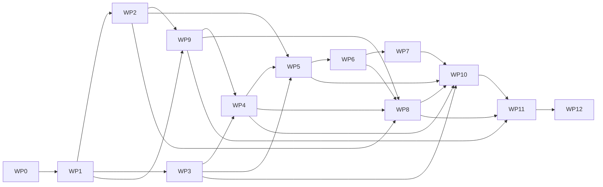

WP 编号是稳定的ownership/追踪ID，不代表数字顺序就是排期。WP2 Catalog和WP3 Account可在WP1后并行；WP9先依赖WP2冻结endpoint policy，再为WP4所有Provider出站提供真实proxy/assertion门；WP4依赖Account identity和WP9，且必须先交付eligibility，WP5才能生成真实preview。WP5的preview/digest依赖WP2 Catalog，不得用临时Action ID固化授权；WP5/6需要Platform团队联合。G-18还要求WP3先交Connection tombstone/receipt/event-snapshot与late-write guard，WP4交signed abandonment codec/replay，WP5交Platform claim/page-action/terminal-ack和两组Agent/Slot约束；三者都完成后WP10才可开放页面、指标和runbook，不能用UI隐藏代替reader/capability门禁。WP8只有在Permit、Credential、exact ActionVersion和WP9 egress均完成后才能闭环，不能以直连Fake绕过前置门禁。

WP 是本 HLD 的技术 ownership 和依赖追踪单位，不是开发流程状态。实施项只需在权威开发记录中标注所属 WP ID；Issue、PR、标签、检查、评审、批准与合并规则全部引用 [AI 主导开发工作流 Spec](SPEC-ai-native-development-workflow.md)，本文不复制或裁剪其门禁。

### 32.4 每个 WP 的统一 DoD

每个 Work Package 同时交付：

- 领域代码和边界清晰的 Adapter，不把规则写进 Hono/Drizzle/React。
- OpenAPI/Zod/事件 Schema 和 generated client，无重复手写类型。
- 向后兼容 migration、约束、索引和 rollback说明。
- 单元、负向、并发/集成测试，按风险增加故障注入。
- audit/log/Trace/Metric/alert 和 Secret canary。
- 用户错误/下一步、管理员排障和 runbook。
- 威胁模型/ADR/HLD 变化和 Reviewer evidence。

只有页面 happy path、SDK 请求成功或 isolated unit test 不构成 WP 完成。

### 32.5 责任边界

| 责任 | Connection Owner | Platform Owner | Product | Security/SRE | Provider Owner |
| --- | --- | --- | --- | --- | --- |
| Catalog/Account/Credential/Execution | 主责 | 协作契约 | 验收行为 | 安全/运行评审 | Adapter/账号 |
| GrantSlot/Confirmation/Permit Platform端 | 联合评审 | 主责 | 授权语义 | 竞态/身份评审 | 不适用 |
| Tool Gateway/渠道/execution | 联合契约 | 主责 | 用户流程 | 网络/身份 | 不适用 |
| KMS/egress/DB/backup/observability | 需求和应用Owner | 平台依赖 | 不适用 | 公司能力和上线主责 | Provider quota |
| Recovery Control/DR trust/Egress assertion proxy | 集成与fail-closed契约 | Platform reader协作 | 不适用 | **生产能力、双人恢复、key和on-call主责** | endpoint policy协作 |
| Proxy最终wire serializer/明文生命周期/Secret canary | **应用契约主责** | 不适用 | 不适用 | runtime隔离、break-glass、on-call主责 | Provider header/body契约协作 |
| UNCERTAIN/对账 | 技术主责 | 展示/时间线 | 用户语义 | 告警/runbook | Provider查询能力 |
| 真实 Provider M1 验收 | 集成主责 | Agent闭环 | 结果签收 | 安全/容量 | 测试账号/契约 |

表中“主责”不替代团队正式 RACI；设计评审需填写具体团队/Owner，不能把单人 Connection Owner 变成所有外部依赖的隐含负责人。

## 33. 需求与验收追踪矩阵

本章仅是非规范性的追踪索引，不重复建立产品或工程权威。产品原文以两份PRD为准，工程边界以工程Spec为准；若下表摘要与链接原文不一致，必须修正本章而不能以本章覆盖权威文档。

### 33.1 Connection PRD 上线验收

权威来源：[Connection M1 PRD §12 上线验收](../prd/PRD-connection-M1.md#12-上线验收)。下表只把每条验收映射到HLD和测试入口。

| PRD 场景 | 权威要求摘要 | HLD 设计证据 | 自动化/验收证据 |
| --- | --- | --- | --- |
| 连接个人账号 | 连接、refresh、重连、断开、返回原对话 | 14-16、22.3 | T-OAUTH、T-REAL 1/4 |
| 重连账号 | 同账号恢复；不同账号重新授权 | 15、16.1、17 | T-UNIT fingerprint、T-REAL 5 |
| 公司共享账号 | 仅当前 USER/ORG 范围发现；仍需 Grant | 14.1/14.4、17、21.4、22.4、24 | T-PG scope约束、T-ISO Shared、T-REAL 8（必验） |
| 多账号选择 | user+Agent+Provider 一个当前 Connection；替换需明确确认 | 11.3、17.4-17.8、21.2 | GrantSlot unique、confirmation/switch concurrency |
| 授权与撤销 | 每 Agent 独立；界面展示 Action；撤销不影响其他 Agent | 17、24.6 | T-ISO、redeem-vs-revoke barrier |
| Action 变更 | 新增需确认；移除/停用立即生效 | 13.4、17.2/17.6、19.1 | Confirmation stale、disable-vs-dispatch |
| 执行 Action | 真实 Provider；完整授权交集 | 17.2、18-20、22.8 | T-EFFECT、T-REAL 2/3 |
| 调用详情 | 本人看到 Provider、脱敏账号、Action、时间、状态、结果/错误 | 20.8、22.3、26 | UI E2E、audit/call RBAC |
| 多用户隔离 | 改名称/ID/参数/用户不能越权或枚举 | 24、27 | T-ISO、T-SEC IDOR/timing |
| 断开连接 | 后续新调用立即拒绝；Grant 暂停；已有操作保留实际状态 | 14.2/14.3、19.1、20 | disconnect-vs-dispatch、T-REAL 7 |
| Provider/ProviderRelease/ActionVersion 停用 | 后续调用立即停止并说明原因 | 13.3、19.1、22.4、23.5 | 三层disable-vs-dispatch、kill switch E2E |
| 凭证保护 | Agent/模型/Sandbox/页面/审计无原始凭证 | 7、16、21.7、27 | T-OAUTH/KMS、Secret canary |

### 33.2 Connection PRD 核心条款

权威来源：[Connection M1 PRD §2-§11](../prd/PRD-connection-M1.md#2-核心概念)。本表中的“要求”是索引摘要，不新增或改写PRD语义。

| PRD 章节 | 要求 | HLD 章节 |
| --- | --- | --- |
| 2 核心概念/角色 | Owner 选能力，用户选账号，管理员管目录/共享/审计 | 6、9、12、17、26 |
| 3 系统边界 | Connection 管目录/凭证/调用，Platform 管身份/Grant | 6、9、17、23 |
| 4 OpenConnector | 只作参考，不作身份/授权权威 | 5、10、30.6/30.7 |
| 5 Provider/Action | 唯一目录、不可任意 URL、版本/停用/真实 Provider | 13、22.4、27.8 |
| 6 Connection 类型 | Personal/Shared/多账号/opaque ID | 11、14、15、21.4 |
| 7 连接与授权 | reconnect、唯一当前账号、扩权、撤销、无 Grant期限 | 14-18 |
| 8 用户隔离 | 服务端解析、不泄露存在、callback 不改归属 | 15、16、24、27 |
| 9 凭证/执行 | Agent 只交 Action/args，Connection 注入凭证 | 6.2、16、19、22.8 |
| 10 错误/审计 | 可执行下一步、调用事实、跨系统关联、可见范围 | 25、26、29 |
| 11 页面 | 我的 Connection、授权、调用、目录、共享、审计 | 22.3-22.5、WP10 |

### 33.3 Platform PRD 依赖

权威来源：[Agent 平台 M1 PRD §9 Connection 集成](../prd/PRD-agent-platform-M1.md#9-connection-集成)与[§14 上线验收](../prd/PRD-agent-platform-M1.md#14-上线验收)。

| Platform PRD 要求 | HLD 闭合方式 | 验证 |
| --- | --- | --- |
| 三个标准模板都接入 Connection | 17.3、22.5-22.7、WP7 | Runtime conformance + E2E |
| Owner 新增 Action 不自动扩权 | immutable confirmation snapshot/intent | Confirmation tests |
| Owner 移除/Connection 停用立即生效 | issue/redeem + dispatch 双 live checks | 并发 barrier |
| 企微按消息发送者使用 Connection | 17.9、24.7 | sender matrix |
| 自定义 WebUI 不能绕过身份/范围 | 24.8，统一 Platform execution/Tool Gateway | direct URL/Pod negative E2E |
| 执行详情显示平台实际 Connection Call | callId event/outbox + Platform reference | correlation/UI E2E |
| Platform/Connection 审计可关联 | 23.6、26、29.1 | audit projection/outbox integration |

### 33.4 工程 Spec 依赖

权威来源：[M1 工程架构 Spec §2 架构结论](SPEC-agent-infra-M1-engineering-architecture.md#2-架构结论)、[§13 Connection 架构](SPEC-agent-infra-M1-engineering-architecture.md#13-connection-架构)与[§24 架构验收](SPEC-agent-infra-M1-engineering-architecture.md#24-架构验收)。下表只做实现落点索引。

| Spec 约束 | HLD 实现 |
| --- | --- |
| TypeScript/Hono/PostgreSQL/Drizzle/OpenAPI | 9、21、22、WP1 |
| 独立 deployment/database account | 6、8、28 |
| apps 只装配、领域规则在 core | 9.1/9.2 |
| 先持久化再处理 | 19、20、21.5 |
| 不预引入消息/工作流基础设施 | PostgreSQL lease/outbox，8/23/28 |
| 用户隔离由服务端决定 | 17、18、24 |
| OpenConnector fixed Fork/Adapter | 10、30.6/30.7 |
| 版本化内部 HTTP/mTLS | 7、22 |
| 无分布式事务 | Grant/Permit 协议、outbox、revisions，18/23 |
| 真实 Provider与故障/负载测试 | 31、WP11/WP12 |

### 33.5 HLD 完整性验收矩阵

| 完成条件 | 本文证据 | 状态 |
| --- | --- | --- |
| 系统边界 | 6-10；权威矩阵、信任边界、部署单元、复用边界 | Architecture A 的private package、同进程、无Runtime Server及OpenConnector非授权权威边界继承PRD/Spec；D-01仅新增kernel allowlist、禁止装配和Fork治理待评审；D-02及新增外部协议的Spec回写待评审 |
| 核心领域模型 | 11-13、17-20；聚合、状态机、invariants、Effect Ledger | 技术候选闭合；G-04/G-05产品语义、G-17 alternate-path重授权及G-18显式放弃/不可恢复语义待批准 |
| Connection 生命周期 | 14-16；Personal/Shared、stored/effective status、connect/reconnect/revalidate/disconnect | 技术候选闭合；G-14/G-16/G-17/G-18产品生命周期Gate及实现/真实Provider证据待关闭 |
| 授权与凭证归属 | 6、16-18；Platform Grant与Connection Credential单一权威 | 技术候选闭合；跨团队协议待D-02/D-03批准，exact-path备用授权待D-18/G-17，跨Agent abandonment/fresh successor待D-19/G-18；两者均不改变Credential只归Connection |
| 数据模型 | 21；逻辑表、字段、unique/check/composite FK/trigger/index/锁顺序，含retry budget三表、七类bounded chain、immutable cancel result；G-17 common的claim/receipt/acquisition、三分source projection、原Connection evidence、SIGNED Platform proof/READY outbox、Connection witness/canonical ACK/六列pointer、Platform ACKED delivery receipt；G-18另增abandonment states/no-target tombstone/late-write guard | Active Schema技术候选闭合；G-17 common integrity按reader-first独立expand，G-18只在其上增加`USER_ABANDONED`产品variant。已写receipt/source/proof/witness/ACK/pointer/delivery/trust history及G-18 tombstone/late-write guard均永久不contract；物理Drizzle migration待各WP验证 |
| API 契约 | 22、23、25.1.7、28.1；Browser/Admin/Internal/Adapter/Egress/Recovery/Event/Operational | 完整inventory为67 logical / 69 physical：默认build 63/65，仅G-04为65/67，仅G-17为另一operation集合的65/67，两Gate均关闭为67/69；另有独立3/12 operational。`consumeConnectionCompletion`以POST、CSRF、strict body和exact replay取代有副作用GET；G-04关闭后proposal/approval两个normal route各生成strict request/result/status、`NO_PUBLIC_IN_PROGRESS` carrier和7/8条failure edge；四build幂等矩阵固定为`29/31/30/32 HEADER_KEY + 2 DOMAIN_COMMITMENT`及`3/7/6/15\|17\|16\|18` policy tuple。G-17关闭后增加两个独立formal route：Platform `restorePlatformAlternateTerminalAcceptance`与Connection `resolvePlatformTerminalAcceptanceWitness`，各自只有一个physical instance、OpenAPI、audience、purpose和幂等模式；G-18复用二者且不新增route。HttpError按四build为52/53/52/53，26/2 failure literal、15/11 Resolution/NextAction及3/12不变。Definitive-loss只在无任何current path等PRD既有场景active；另一path live时G-17未批准只SAFE_DENY零写。OpenAPI baseline、physical expansion、四种build和N/N-1 evidence待WP0/WP1 |
| 跨 Agent 隔离 | 17、18、24；服务端主体解析、Slot/Permit/entitlement、存在性隐藏；G-18 predecessor/acquiring Agent-Slot与page-action actor/ref | HLD设计闭合；两组Agent/Slot逐字段置换、Browser注入和失去旧Agent访问后的名称隐藏待WP5/WP7/WP10 |
| 异常处理 | 20、25；幂等、timeout、retry、cancel、UNCERTAIN/reconcile | 当前active error/condition/retry契约闭合；G-04产品文案、人工解析条件设计和真实故障证据仍待批准 |
| 安全策略 | 7、16、20.9、24、27；Credential、SSRF、JWS/MAC/proof/admission、Journal barrier、mutation RPO=0、两个terminal route的listener/audience/purpose/SA/NetworkPolicy隔离 | HLD设计闭合；G-10至G-13与Security/SRE/DBA Gate待批准；D-20及两个route的逐路权限/历史trust/恢复函数仍需联合批准 |
| 部署拓扑 | 8、28；独立DB/deployment、proxy、listeners、Recovery Control/Journal/Mutation durability；两个terminal route各归现有Platform/Connection recovery-command deployment一个physical instance | Proposed技术候选闭合；新增独立`provider-egress-proxy` workload与PITR域外Recovery Control/Journal运行依赖，必须先更新工程Spec并批准对应ADR。两个terminal route复用现有Platform/Connection部署，不再额外增加业务Deployment或operational route；production Adapter、certificate/Service/NetworkPolicy、容量及双向PITR演练证据待WP12 |
| 可观测性 | 26、29；audit/log/trace/metric/dashboard/alert/SLI，含retry/cancel、G-17零写、proof signer/witness/双向PITR/route result，以及G-18 abandon/lineage/late-write/actor predicate | HLD设计闭合；所有metric使用低基数enum且禁止实体ID/name/signature bytes label，数值SLO与Owner待上线Gate |
| 迁移方案 | 30；有证据的greenfield/legacy分支、expand/contract、signed compatibility/reader capability、mixed version、key/codec/rollback | 设计分支闭合；G-15 inventory、G-17 common proof/witness/双route reader-first expand/readiness、old/new双向矩阵、N/N-1 route absent/partial组合、Connection-only与Platform-only PITR、G-18入口rollback+capable drain和staging旧binary evidence待WP0/WP12。已写receipt/source/proof/witness/canonical ACK/pointer/delivery/trust及G-18 tombstone/late-write guard永久保留 |
| 测试策略 | 31；领域、DB、契约、隔离、并发、crash、DR、真实Provider及31.12冻结包 | 技术候选闭合；67/69四build golden、两个route的cross-listener/audience/purpose负向、五层proof逐字段损坏/历史双层验签、Connection-only/Platform-only PITR、partial bootstrap、ACTIVE->QUARANTINED/total-loss及G-18 A-01至A-13自动化/真实环境证据待WP1-WP12 |
| 分阶段实施计划 | 32；Phase 0-6、WP0-WP12、DAG、DoD、责任边界 | 技术候选闭合；G-17 common integrity与Terminal Recovery Route方案A已传播到WP0/1/3/5/10/12，G-18产品variant另传播到WP0/1/3/4/5/10/12；具体团队/迭代需设计评审填写 |
| 区分 PRD/参考/本项目设计 | 2 的标记和来源继承规则；4 的差异/Gate；5、10、37.2 的固定参考事实 | Architecture A已拆分为PRD产品边界、现有Spec拓扑、固定Commit参考事实和HLD新增治理决策；9.2明确Spec 6.3边界契约不等于可替换实现层，测试Fake不算第二个真实Adapter，新增外部协议先过Spec/ADR Gate |

“HLD设计闭合”只表示本文已给出可评审、可实现、可验证的明确契约，不表示代码、生产Adapter、真实Provider、演练或产品/架构Gate已经完成。评审不得把本表替代31的验收证据或36的批准清单。

### 33.6 关键设计闭环七层追踪

**[本项目设计决策]** 下表把高风险闭环同时追到规范叙述、权威数据、API/Adapter/事件、直接反例、实施包和治理门禁。`N/A`必须说明为何不需要该层，不能用“全文已覆盖”代替可执行引用。

| ID | 闭环主题 | 规范叙述 | 数据约束 | API/Adapter与事件 | 测试/故障证据 | WP与治理 | 闭环状态 |
| --- | --- | --- | --- | --- | --- | --- | --- |
| C-01 | PITR后Agent policy/Catalog/Shared永久disable不复活 | 11.2、13.3、14.2/14.3、17.4-17.8、28.7/28.8；final RESTRICT write-ahead barrier与永久tombstone | 21.2/21.3 typed source receipt、21.4 Shared disable materialization、21.6两库operation projection/record/materialization receipt | 22.4通用safety mutation claim/202/poll；22.11 typed evidence apply；28.7 claim/append/resolve/JournalSafetyGate；23.2/23.3 validation/disable事件 | 31.2、31.6-31.8 claim后投影丢失、`CLAIMED_NO_RECORD / APPEND_IN_PROGRESS / APPENDED`三态resolve、append成功/DB失败、响应未知、两者之间PITR、wrong evidence kind/partition、备份点后缩权/三层disable/Shared永久disable且revalidation为0、disabled-set漏ID | WP0/1/2/3/5/12；G-11/G-14、D-12、Recovery evidence ADR | 技术闭环已给出；G-14 Product Gate与实施证据待关闭 |
| C-02 | Egress JWS全局take-once | 20.5/20.6、22.10、27.5/27.10；proof和receipt不授予第二次发送 | 21.5 Admission-Hop双向DEFERRABLE FK、exact JTI/MAC/generation/proof、全局proxyRequestId、单调receipt | 22.10 accept端完整proof verifier、take-once admission/receipt；审计而非业务domain event | 31.2、31.6-31.8 proof伪造/过期/commit边界、字段拼接、双Proxy、HTTP2、响应丢失、receipt乱序、rotate barrier | WP1/WP9/WP12；D-13、Provider egress ADR | 本版设计闭合；实施证据待WP1/WP9/WP12 |
| C-03 | 完整Provider request binding | 22.9/22.10、27.5/27.10 | 21.5 MAC/version/write-once字段；body/payload引用绑定 | 22.8 `ProviderHttpClient`、22.10 Proxy从actual wire重建/VerifyMac | 31.2、31.6-31.9 query重复/空值/header/body/codec/key变异 | WP1/WP9/WP12；D-13、Provider egress ADR | 本版设计闭合；实施证据待WP1/WP9/WP12 |
| C-04 | API Key只留受限keyed HMAC证据 | 16.2/16.3、27.7 | 21.4 validation attempt、21.6 idempotency result、21.7分级 | 22.3 write-only submit/poll/replay，不返回Secret | 31.3、31.6/31.7、31.9响应丢失/冲突/canary | WP4；Credential encryption ADR | 本版设计闭合；实施证据待WP4 |
| C-05 | OAuth ACCOUNT_PROFILE durable owner | 16.1、20.5、27.4 | 21.4 profile attempt父子terminal矩阵；21.5 EgressHop exactly-one owner | 22.8 attempt context；22.10 purpose/owner claim | 31.2/31.3/31.7合法父子terminal commit、takeover、profile response、candidate cleanup | WP4/WP9；Credential与Provider egress ADR | 本版设计闭合；实施证据待WP4/WP9 |
| C-06 | Grant entitlement连续性和确定终止 | 14.3/14.4、17.2/17.5-17.8、18.3/18.4、28.7/28.8 | 21.4 kind-safe root + append-only evidence + current pointer/exact scope candidate keys +环境Shared reset/Platform投影；21.2 Platform checkpoint与immutable Binding/Snapshot/Grant/Intent/Invocation/Permit exact tuple及same-epoch trigger | 22.6 eligibility与reset status、22.7 checkpoint check/terminate；23.2/23.3/23.5双侧completion event/gap repair | 31.2-31.8跨root/kind/pointer rollback、Personal same-epoch G0->G1、多Connection/无人访问Shared双侧reset/new epoch、普通运行exact-path retention/loss/conditional alternate、batch crash/lease/rotate/乱序、tuple拼接、leave/rejoin、依赖故障 | WP3/WP4/WP5/WP6/WP12；G-16/G-17、D-17/D-18、Connection ownership/Permit ADR | 技术闭环已给出；G-16/G-17 Product Gate与实施证据待关闭 |
| C-07 | Preauthorization先本地匹配再redeem，Invocation/toolCall与Call永久绑定 | 18.2-18.5、19/19.1；所有terminal及UNCERTAIN replay仍指向原Call | 21.2 Invocation/Permit + 21.5 Call write-once hash/version/association；`bound_call_id`与Call association fill-once且终态不释放、不清空、不改绑 | 22.6/22.7/22.9同一commitment；redeem/introspect均绑定，response-loss只解析原association | 31.2、31.6/31.7跨Invocation、不匹配、terminal/UNCERTAIN replay、清空/改绑direct SQL与commit前后crash | WP6/WP8；Connection ownership/Permit ADR | 本版设计闭合；实施证据待WP6/WP8 |
| C-08 | Action payload归属/类型/原子结果 | 20.8、25.8 | 21.5 storage_kind exactly-one、payload composite FK/trigger/unique、DESTROYED清理、object metadata、终态同事务 | 22.6 Call create/detail只给typed pointer；23.2 result事件在commit后 | 31.2、31.6/31.7 INLINE/OBJECT both/neither、跨Call/type置换、并发双写、stage后rollback/orphan | WP8/WP10；External effect ADR | 本版设计闭合；实施证据待WP8/WP10 |
| C-09 | 恢复重校验不等于reconnect或Grant恢复 | 14.2/14.3、16.1/16.2、17.4/17.6-17.8、28.7/28.8 | 21.4 `REVALIDATE_RECOVERY`完整向量、Personal G1/环境Shared reset+new-root evidence；21.2 Platform checkpoint/effective source predicate、same-epoch RECOVERY_RECONFIRM与不可变replacement；Shared零pending child+expected scope tuple | 22.3 Personal + 22.4 Shared admin；22.5 RECOVERY_RECONFIRM；22.6 typed exact evidence/reset status；22.7 checkpoint check；23.2/23.3 completion只收紧不恢复 | 31.2/31.3/31.6-31.8 stored/effective mismatch、Personal G1/response loss、Shared双侧old-root/Grant归零/new epoch、batch crash/lease/second rotate/event gap、final tombstone/DISABLED零入口、scope race、跨owner、generation竞态 | WP3/WP4/WP5/WP12；G-16、Recovery evidence与Connection ownership ADR | 技术闭环已给出；G-16 Product Gate与实施证据待关闭 |
| C-10 | Shared管理权、使用资格与永久disable分离 | 7、14.1-14.4、24.3-24.5；tombstone后只允许补落/清理/只读且revalidation为0 | 21.4 Shared scope/admin cursor、third-head runtime、`JOURNAL_RECORD / FULL_STATE_MANIFEST` materialization、DISABLED/fence/revoke原子补落 | 22.4 Journal-first disable +通用202/poll；22.11独立disable-evidence apply；23.2 terminal disable | 31.2、31.4-31.8非admin/IDOR、claim/append/DB/PITR、disable-vs包括revalidation的全部aggregate命令、response-loss、full-state漏ID、迟到Grant恢复 | WP0/WP3/WP10/WP12；G-14 Product、ownership/API/Security review Gate | 技术闭环已给出；G-14回写PRD后才可批准实现 |
| C-11 | `ONLY_IF_G04_APPROVED`人工解析maker-checker不可改结论 | 20.7 | 21.5条件Schema：immutable proposal + final resolution、composite FK/unique/maker-checker CHECK；Store提交时重验两类live admin capability | 22.4条件proposal/approval split API，strict `ActionEffectResolutionProposalV1/ActionEffectResolutionV1`、201/200 exact replay、`NO_PUBLIC_IN_PROGRESS`；23.2条件audit/outbox事件 | 仅条件suite：31.2、31.5-31.7同人、capability撤销、step-up session复用、unknown field/body-present approval、错`If-Match`、篡改、过期、双批准、proposal/approval分别7/8条failure edge、response-loss exact bytes/status | WP0/WP1/WP8/WP10条件scope；G-04 Product、External effect ADR、Security/API Gate | 条件设计已给出；当前active schema/API/UI/carrier/edge/fixture/WP DoD均排除，G-04回写PRD后才能激活 |
| C-12 | 恢复证据只读引用与命令隔离 | 27.2/27.9/27.10、28.1/28.7 | 不建第二授权库；21.2/21.3/21.4保存`TypedRecoveryEvidenceRefV1`解析后的kind/partition/source exactly-one receipt、exact overlay或Shared tombstone；G-17另保存immutable proof witness而非可写Platform副本 | 22.11 + 28.1独立listeners；三类route-bound typed evidence apply，加两个独立terminal recovery route：Platform restore只写同一历史acceptance，Connection resolve只读exact witness | 31.2、31.5、31.8 route枚举、错listener/identity/audience/purpose/kind/partition/resource/ref/checksum、跨route replay、partial authority、三head gap、Shared manifest漏ID、mutation fuzz | WP1/WP3/WP5/WP10/WP12；D-12/D-14/D-20、Recovery evidence/ownership ADR | 本版设计闭合；实施证据待WP1/WP3/WP5/WP10/WP12 |
| C-13 | Mutating Effect Ledger RPO=0与独立恢复门禁 | 11.3、17.2/17.6、18.2-18.4、20.9、28.7/28.8；read-only恢复不隐式开放write；PROVIDER_COVERAGE只替代历史窗口连续性 | 21.2 Platform runtime/Intent/Snapshot/Invocation/Permit完整common tuple binding；21.4 Connection runtime与Catalog mutating-set root/snapshot；21.5Hop/Admission完整Effect Ledger锚点 | 20.9/28.7 typed decision lease与environment级`activateMutation`；22.10 SIGNER proof和current mutating admission gate；22.11只读typed refs | 31.2、31.6-31.8 evidence kind/ref/checksum/issuedAt/expiry、风险窗口、漏/错PUBLISHED或DEPRECATED ActionVersion、set publish-vs-activate、future topology ref/checksum/expiry、旧reader、Provider成功后PITR与MUTATION_RECOVERY_BLOCKED | WP0/1/2/5/6/8/9/12；D-05/D-15、External effect/Recovery fencing ADR | 本版设计闭合；实施证据待WP0/1/2/5/6/8/9/12 |
| C-14 | logical operation、physical deployment route、error/condition/alternate response、Cancel replay与UX resolution闭环 | 22.1-22.11、25.1、28.1；67 logical / 69 physical完整inventory、四种activation与`29/31/30/32 HEADER_KEY + 2 DOMAIN_COMMITMENT` carrier矩阵、3/12 operational、pre/post-resource carrier、15个ResolutionRoute/11个NextAction；Safety GET/HEAD均为Authority-only pure read | 21.2/21.4/21.5及21.6 first-submission单调门禁、immutable cancel result、completion consume exact result与zero-mutation proof；不持久化message/URL/bearer ref，Browser/internal `VIEW_CALL` ref与predicate按route分离 | 25.1.7 exact edges、alternate contract、CommandIdempotencyMode与`3/7/6/15\|17\|16\|18` policy set、physical expansion、completion POST-only/CSRF/idempotency、`getSafetyMutation` GET及HEAD transport projection只执行`readClaimByOperation -> resolveOperation`且零本地/Authority写、G-04 proposal/approval分别7/8条edge、两个G-17独立route、四入口serializer仅canonical字段逐字节相等而route/actor动态`resolutionRef`分别签发、same/different cancel key；9个internal operation逐项Identity/DB 503且durable accept后回放资源；条件route只在Gate关闭后进入active artifacts | T-OPENAPI/T-PG/T-EFFECT/T-ISO；四build HttpError基数`52/53/52/53`且edge覆盖分别为`52/52`或`53/53`，固定condition/eligibility为`26/26 + 2/2`、三namespace两两互斥、67/69四build、carrier operation集合、15/15 ResolutionRoute、11/11 NextAction、route/Ingress/Service/NetworkPolicy/operational router双向集合、completion prefetch/refresh零写、六个Safety GET/HEAD四类Authority向量全delta零、Browser/internal `VIEW_CALL` cross-route/ref负向、G-04 exact status/body/quoted strong ETag、dependency pre/post-accept与Cancel bytes/multi-effect golden | WP0/WP1/WP7/WP8/WP10；API/Web/UX review，G-04/G-17各自Gate | 本版设计闭合；generated artifacts与条件build证据待对应WP |
| C-15 | retry successor、budget与ProviderFailure唯一分流 | 20.5/20.6、25.2/25.7；预算内唯一successor、exhausted/forbidden不同原子终态、OAuth唯一用户触发deferred-budget、未知效果不伪造确定失败 | 21.4/21.5三张budget表、OAuthTransaction `RETRY_SAME_INTENT + NONE/AWAITING`及用户命令原子定案、Profile/API validation/refresh/revoke/Action pair/Reconcile七类chain、typed owner、required/forbidden矩阵、`sequence <= max` | 22.3 OAuth POST不传actionRef且锁内live tuple；22.8 typed ProviderFailure；25.2四值allowlist、exact resultViolation/reason/public projection，不向wire透传Provider异常 | T-UNIT/T-ADAPTER/T-PG/T-OAUTH/T-EFFECT；waiting零budget/successor、ACQUIRED/EXHAUSTED/FORBIDDEN用户命令整组、旧ref/child/key、partial/wrong-scope/cross-root/Action mismatch/FORBIDDEN扣预算、全链双worker、22a/b/c crash与refresh local CAS | WP4/WP8/WP9；Credential/External effect/Provider egress ADR | 本版设计闭合；实现与真实故障证据待WP4/WP8/WP9/WP11/WP12 |
| C-16 | Shared多路径exact binding不静默切换 | 17.5、17.8、24.4；current bound path仍live保持；无任何current path才走PRD既有definitive loss；另一path live且G-17未批准只SAFE_DENY零写，批准后才把loss与alternate acquire分成两个用户决策 | 21.2/21.4；G-17条件完整typed predecessor、pre-network claim、attempt/previous STALE lineage、PENDING/ROOT_READY、immutable Binding/Intent、atomic terminal receipt/outbox、Connection PENDING_BINDING/BOUND/STALE、本地typed receipt projection及reason no-alias约束 | 22.5/22.6与23.2-23.4；Browser strict联合、signed loss、条件request/response、按资格事实分流的loss与条件bound events/snapshot repair；普通入口只接受BOUND | 31.3/31.5-31.8及31.12 A-00；direct USER+多ORG零写、claim/response/consume/event每个crash、attempt 1 STALE后用户创建attempt 2、BOUND后loss形成新predecessor、event loss/repair、跨Agent BOUND正例和direct-SQL/golden | WP0/WP3/WP4/WP5/WP10/WP12；G-17/D-18、Connection ownership/Permit ADR、Product/API/Web/QA Gate | Retention与“无current path”loss为现有可评审基线；另一path live时零写是未批准行为，条件终结/alternate须G-17回写两份PRD后才可激活；实施证据待关闭 |
| C-17 | Recovery Authority从首次genesis到全损新trust epoch不分叉 | 28.7/28.8；greenfield bootstrap、quarantine、rotate/activate、total-loss rebootstrap各自身份、前置条件和phase顺序不可互换 | Authority分别持久`BootstrapClaimV1/BootstrapPlanV1`与`TotalLossRebootstrapClaimV1/PlanV1`，完整plan先于首个head；三genesis和Control hash chain；两库mirror receipt/runtime exact pointer与Authority双ACK；freeze/head seals/reset/checkpoint；业务DB不成为current权威 | 离线production Adapter的bootstrap/rebootstrap、mirror status/ACK与Control命令；无Browser/management/business route；QUARANTINED阶段只允许typed recovery apply/reset/checkpoint和离线canary | 30.2/30.10、31.2/31.6-31.8 claim-only/partial plan/head/Control response、local receipt/runtime pointer/Authority ACK错配或PITR丢失、并发bootstrap、ACTIVE->QUARANTINED、普通outage误rebootstrap；activate前重鉴权/Grant/Provider请求和旧trust reader均为0，exact current recovery runner仍可推进 | WP0/WP1/WP12；D-11/R-13、Recovery fencing ADR、SRE/Security/DBA P0/P1 Gate | 技术闭环已给出；工程Spec/ADR批准、production Adapter与破坏性演练证据待关闭 |
| C-18 | 未完成alternate attempt显式放弃与跨Agent fresh successor | 17.5/17.8、22.5；用户只通过opaque page action明确永久放弃，ABANDONED永不恢复/转移，另一Agent只在C-19终态完整性成立后重新fresh confirmation；旧Agent不可见时不泄露名称 | 21.2/21.4；Platform `ABANDON_REQUESTED/ABANDONED`、Connection无target/有target ABANDONED tombstone、`USER_ABANDONED` receipt variant、两组Agent/Slot、exactly-one terminal winner、successor lineage与永久late-write guard；通用proof/witness/pointer归C-19 | 22.5/22.6、23.2-23.4；10+1 requirements union、strict page-action、signed `AlternatePathAbandonmentDecisionV1`和`USER_ABANDONED` variant；复用C-19两个route且不新增route，不改变52或53/26/2、15/11或3/12 | 29、30、31.2-31.8、31.12 A-01至A-13；abandon vs create/bind/loss、no-target、late writes、successor-before-proof、lineage gap、Agent/Slot置换、Browser注入/名称隐藏、crash/replay、G-17-only零流量与不可逆drain | WP0/WP1/WP3/WP4/WP5/WP10/WP12；G-18/D-19、两份PRD、工程Spec、Connection ownership/Permit ADR、Product/API/Web/Security/QA/SRE Gate | G-18条件产品闭环已给出；G-17先关闭且G-18产品语义回写两份PRD、Spec/ADR批准前，`ABANDON_REQUESTED/ABANDONED/USER_ABANDONED`及page-action active artifact均为零；一旦写入则永久保留tombstone/late-write guard |
| C-19 | Alternate terminal common integrity、见证与双向PITR | 11.3第21项、17.5、21.2/21.4、22.9/22.11、28.7；五层proof/delivery闭环及五步无环hash | Connection权威receipt；Platform三分source projection+原Connection evidence、SIGNED proof/READY outbox；Connection immutable witness、canonical projection/ACK和六列pointer；Platform proof-bound ACKED delivery receipt；registry/trust history永久保存 | 两个`ONLY_IF_G17_APPROVED`独立route：Platform `restorePlatformAlternateTerminalAcceptance`为HEADER_KEY，Connection `resolvePlatformTerminalAcceptanceWitness`为PROTOCOL_IDENTITY；各自OpenAPI/listener/audience/purpose/physical instance/strict alternate contract，G-18只复用 | 31.2、31.5-31.8、31.12 A-07/A-08/A-11/A-13；五层逐字段损坏、hash层互代、历史双层验签、snapshot/event顺序、六列partial、两个route cross-identity、四build registry、Connection-only与Platform-only PITR及N/N-1 partial-route矩阵 | WP0/WP1/WP3/WP5/WP10/WP12；G-17/D-20、Connection ownership/Permit与Recovery fencing ADR、Platform/Connection/Security/SRE/DBA Gate | 技术闭环已给出；G-17产品结论、两份PRD、工程Spec、D-20/ADR及最终同SHA实施证据未关闭前，两route和writer为零active artifact |

## 34. 运维手册目录

### 34.1 Provider outage/429

1. 按 Provider/action dashboard 确认错误类别、范围和开始时间。
2. 不重启全服务；检查 egress/DNS/TLS 与 Provider status/quota。
3. 启用/调整该 Provider breaker/并发下调，尊重 bounded Retry-After。
4. 保持 Call 明确 `ACTION_PROVIDER_RATE_LIMITED/ACTION_PROVIDER_UNAVAILABLE`，不让 Agent 静默等待。
5. 写 Action 检查是否已有 SUBMISSION_STARTED；未知则 UNCERTAIN，不批量重试。
6. 恢复后从 read-only canary 开始，再按 effect class 放量。

### 34.2 Credential refresh failure/uncertain

1. 区分 definite `invalid_grant`、KMS/DB故障、Provider短暂故障和 SUBMISSION_STARTED 后未知。
2. 停止同 Connection 的 refresh 风暴，保留 refresh attempt/lease 证据。
3. definite invalid -> REAUTH_REQUIRED；unknown -> REFRESH_UNCERTAIN，不能重放 rotating token。
4. Provider 契约有安全 status/replay 才恢复；否则引导重连。
5. 验证新 Credential exact version、scope、fingerprint 和 Secret canary 后恢复。

### 34.3 Action outcome UNCERTAIN

1. 冻结该 LogicalEffect 普通 retry，展示“结果待确认”。
2. 收集 call/effect/dispatch/provider request ID/idempotency key 和时间，不读取 Credential。
3. 运行 Adapter `reconcileEffect` 或 Provider 管理界面/API 查询；不执行原写操作。
4. 追加 CONFIRMED/NOT_APPLIED/仍 UNCERTAIN 证据和审计。
5. 无查询能力时交当前用户/管理员人工核对，保持历史不可改写。
6. 如果同 Action持续产生 UNCERTAIN，停用 ActionVersion 并进入 Provider review。

### 34.4 Credential 泄露疑似事件

1. 立即停用相关 Connection/Provider或网络出口，提升 execution fences。
2. 撤销/轮换 Provider Credential、OAuth Client Secret、相关 KMS wrapping key（按范围）。
3. 保全 audit/log/trace/config/image evidence，限制访问。
4. 扫描 canary/真实值影响面，但报告不复制 Secret。
5. 检查是否有未授权 Provider效果，按 Effect/Provider audit 对账。
6. 完成公司安全事件流程、修复、key/credential恢复和分批重开。

### 34.5 Catalog/executor regression

1. 通过 kill switch DISABLED 阻止新 dispatch，保留已有 Call实际状态。
2. 核对 source/executor/image digest 与发布记录，停止漂移实例。
3. 同 contract 也只能发布引用已验证 build 的新 immutable ActionVersion，并由 Owner 显式选择；contract 变化还会触发 digest/G-05 规则，任何情况都不原地改历史或浮动回切。
4. 检查受影响 Calls、Schema invalid、scope/effect变化和 Credential 泄露。
5. 真实账号 canary与审计通过后重新发布。

### 34.6 DB/KMS/Identity outage

- DB：摘 readiness、保护 commit-unknown call、恢复后 lease/fence/reconcile。
- KMS：所有 Credential 操作 fail closed，不使用缓存明文；确认 key policy/region 后 canary。
- Identity：新 Grant/Permit/Shared/敏感调用 fail closed；不无限延长旧 membership。
- 依赖恢复后不直接全量重放，先检查 ActionCall/refresh/OAuth uncertain states。

### 34.7 Backup restore

按28.7/28.8执行，不使用本段替代完整Runbook：先冻结业务入口/worker/Provider egress并在PITR前CAS外部Control到新cohort、随机Platform/Connection execution generations和QUARANTINED；Platform DB被恢复时另旋转policy validation generation，Connection DB被恢复时另旋转data+catalog validation generations，并把policy、catalog、connection-safety三个Journal required heads固化进current Control。只要Effect Ledger acknowledged commit零丢失不能事前证明，还要旋转mutation generation、置`MUTATION_RECOVERY_BLOCKED`并清空current evidence/canary字段。恢复后先连续验证三个Journal chain和所有unmaterialized RESTRICT barrier，以Authority claim/record重建两库operation projection/receipt；Connection恢复时先重放/验证Shared disabled-set并物化永久tombstone，再以typed evidence逐Agent policy/Catalog对象应用exact overlay。Connection和Platform在QUARANTINED完成Shared reset/checkpoint、零backlog manifest与不出Provider的DB/KMS/object完整性canary；随后SRE双人activate外部Control到ACTIVE并把两侧切入RECONFIRM_ONLY/CANARY。只有此时才完成Account重鉴权：Personal只有PITR域外current account/owner epochs证明continuity时，fresh eligibility才在同root append本代G1并CAS pointer，否则REVOKE旧root。Shared完整scope重校验只证明current资格：所有恢复旧root必须REVOKED，fresh eligibility为当前资格创建new root/new epoch。Platform为current exact evidence复用或插入immutable binding：只有source/target entitlement epoch相同的effective PAUSED_RECOVERY Grant可用RECOVERY_RECONFIRM原子替换；old root已终结时old Grant TERMINATED，new epoch走INITIAL，任何事件都不直接恢复。之后才做Provider Effect observed-set对账和批准的只读smoke。已tombstone Shared不做revalidation。通用Control ACTIVE只允许RECONFIRM_ONLY/CANARY与批准的read-only能力；它不能解除mutation gate。只有完整`MutationDurabilityEvidenceV1`经双人批准并绑定current generation、完整风险窗口、包含PUBLISHED与DEPRECATED effective executable mutating版本的exact Catalog mutating-set和未过期future-write RPO=0 topology，才能独立进入MUTATION_CANARY；`CONTINUITY`证明历史窗口零丢失，`PROVIDER_COVERAGE`必须完整重建/定态该窗口且不能替代未来写拓扑。再以本代Account、policy、Catalog、Grant、Permit、MAC、proof和新admission做受控写canary，才可推进MUTATION_OPEN。任何遗漏保持deny，不能批量盖generation、改stored status、伪造entitlement evidence、revalidate/重新enable同一Shared Connection，或从“仍可见Effect”推断没有丢行；恢复前后都要验证旧binary无法取得certificate/readiness/lease或流量。

### 34.8 Recovery Control/egress fence failure

1. Control mirror freshness、Journal checkpoint、mutation decision或强admission lease超龄，signature/kid/version/hash/cohort/phase/mutation state mismatch，或QUARANTINED/BLOCKED期间出现mutating preview/Permit/Signer/Admission/request start，均按P0停止Platform授权、Connection普通/stale/错purpose worker claim和Provider egress；只有Control current可强读且命中28.7 exact tuple/purpose的recovery runner可继续apply/reset/checkpoint，不手改本地generation/OPEN。
2. 比较外部current object/required Journal heads、两侧mirror/applied checkpoints、Platform/Connection已见最大version、mutation decision/admission lease、Proxy signer/MAC/trust bundle、Connection admission行和最近rotate/activate/activateMutation审计；保全旧Pod、Permit decision checksum、`issuer+kid+jti` keyed hash、hop/dispatch、proxy request/receipt和Effect证据，不复制raw proof/JWS或Secret。
3. Authority可恢复时先恢复强一致read、Journal连续验签和可线性fence rotate的admission lease，保持QUARANTINED同步mirror并drain所有HTTP1/H2 pools；执行零旧Permit、普通/stale/错purpose worker、旧JTI和旧request-stream canary，同时证明exact current recovery-purpose runner仍可claim/renew/batch，之后才走28.8。
4. Authority、Journal required evidence或trust key全损时由SRE + DBA/Security、离线recovery root按28.7执行`rebootstrapAfterTotalLoss`，建立更高trust epoch、三genesis heads、新cohort/全部相关generations；在QUARANTINED只做full-state review/apply、双侧reset/checkpoint和离线完整性canary，activate ACTIVE/CANARY后才做账号重鉴权、Grant重确认与只读Provider对账。绝不从业务DB、日志或mirror推断旧current，也不重用greenfield absence bootstrap。
5. 错assertion/MAC/admission只影响对应durable hop。Accept调查必须逐项验证proof signature/alg/kid、issuer/audience、environment/cohort/generations/phase、Proxy mTLS binding、lease ID/nonce/nbf/exp及事务commit时有效性；只比较checksum不合格。已有`ACCEPTED_NO_START`但没有已验签且持久化的terminal `NOT_STARTED_AFTER_ACCEPT`时按“可能已开始”保守定态；admission响应丢失不得重放JTI。只有exact `NOT_STARTED_AFTER_ACCEPT`允许按20.6考虑新hop，`REQUEST_STARTED`或缺receipt必须保留真实in-flight/UNCERTAIN；不能直连、把receipt当发送许可或盲重放可能已提交的Effect。

### 34.9 Recovery Evidence Journal验证/重放

1. 先把外部Control保持QUARANTINED，分别记录expected `PLATFORM_POLICY`、`CONNECTION_CATALOG`、`CONNECTION_SAFETY` partition及各自required head sequence/hash、minimum reader capability、trust version和恢复备份checkpoint；禁止先改业务row、validation generation或删除/取消历史record。
2. 使用独立recovery runner顺序读取`checkpoint + 1 .. required head`，逐条验证schema/canonicalization version、partition/sequence/previous hash/kid/signature、stable operationId及Authority claim/append commitment、expected old/intended new revision+checksum、decision和approval refs；任何gap、回退、跨环境、未知key、同operation异claim/commitment或record checksum立即停止该partition。业务DB缺projection时从signed claim/record重建，不能创建替代operation。
3. Final RESTRICT record自身先成为全局deny barrier，再补落业务DB deny/validation失配/operation+resource receipt/audit/outbox/applied head；不能要求“本地先deny”作为安全前置。Append响应未知时先以原scope重新claim找回same `operationId + claimChecksum`，再用`operationId + claimChecksum + canonicalRequestHash` resolve；`APPEND_IN_PROGRESS`/不可读时partition保持deny，`APPENDED`时验签Authority返回的record/receipt并只幂等补落该record，`CLAIMED_NO_RECORD`且无in-flight append时才可在重验资源后以同claim重试。不能要求调用方预知record checksum。DB rollback、commit unknown、进程重启或append与materialize之间PITR都不得取消已提交barrier。对permissive record只有新的operation、完整前置链和双人审批成立时才允许materialize；每个apply使用`TypedRecoveryEvidenceRefV1`从Journal重读正文并CAS exact revision/checksum，不能信任调用方提交的kind/ref/checksum或evidence body。
4. Journal不连续时，不拼接日志/audit/mirror。`Platform Owner + Security`、`Catalog Owner + Security`、`Connection Owner + Security`分别对完整Agent policy对象全集、完整Catalog对象全集、完整Shared inventory与disabled ID全集生成签名full-state manifest；漏一个对象或disabled ID就让对应对象保持`*_REVALIDATION_REQUIRED`或Shared effective DISABLED/环境BLOCKED。每次apply都用route-bound `TypedRecoveryEvidenceRefV1`验证kind/partition/resource/ref/checksum；Shared manifest只允许物化永久disable，不存在`PERMIT_EXPANSION`或revalidation。
5. 分区对账required/applied head、SafetyDecision lease head、两库operation projection/record/materialization、逐对象overlay、Shared tombstone materialization的exactly-one evidence source与receipt、unmaterialized RESTRICT最老年龄、manifest checksum、audit/outbox和validation backlog；management evidence refs只返回bounded opaque checksum/ref与authority状态。所有preview/confirm/Permit/eligibility/revalidate/Signer/dispatch reader必须证明使用current JournalSafetyGate；只有计划开放集合验证完、Shared tombstone全部先物化且deny集合仍deny，才把三类evidence交给Control activate审批。
6. 记录演练时间、RPO/RTO、gap/full-loss路径、双人身份、所有失败码和canary结果；不得在runbook、工单或日志中附带Credential、JWS、MAC input或业务payload。

### 34.10 Duplicate JTI或envelope MAC事件

1. `duplicate_jti_attempt_total`、同JTI第二次`ACCEPTED_NOW`、MAC mismatch、unknown codec/key、一个hop多个proxy request或旧HTTP2 pool在rotate后新stream任一出现，立即停止相关Proxy cohort/Provider，并以stable incident operation调用`quarantine`；禁止切直连、放宽verify或用无审计的phase写入替代。
2. 冻结并关联Control version/admission lease ID、proof issuer/kid/version/checksum/nonce hash/nbf/exp、Proxy mTLS binding、hop owner、`issuer+kid+jti` keyed hash、proxyRequestId、MAC/key/codec version、acceptedAdmissionId、actual request safe digest、pool/stream ID和receipt revision/state/checksum；不记录raw proof/JWS、Authorization/Cookie、query Secret或body。
3. 查询Connection Admission-Hop双向线性化结果：`ACCEPTED_NO_START`只能有一个winner且exact pointer/FK一致。若调用方未收到`ACCEPTED_NOW`，按零发送处理且不重放；若有`NOT_STARTED_AFTER_ACCEPT` terminal receipt，可证明未开始；若为`REQUEST_STARTED`、terminal `RESPONSE_RECEIVED|OUTCOME_UNKNOWN`或receipt缺失/冲突，则按Effect/attempt的SUBMISSION_STARTED/UNCERTAIN路径处理。任何receipt都不能返回或恢复发送许可。
4. 比较Proxy actual-wire canonicalization与Connection MAC输入，区分parser差异、header重写、redirect/transport retry错误、key rollout和恶意重放；对query重复/空值/编码、semantic headers、body length/encoding逐项复现。
5. 修复后先部署全Proxy verify兼容，rotate signing/MAC/trust时按30.4/30.5 overlap并drain所有pools；用双Proxy和HTTP2并发barrier证明同JTI第二次发送为零、每新hop独立JTI/MAC后再恢复。

### 34.11 Mutation durability evidence failure

1. WAL/archive gap、同步提交降级、database timeline不连续、typed evidence缺字段/过期/错generation/换kind、Catalog mutating-set变化、future topology proof失效、Provider coverage缺口或“Provider已成功但本地Effect不存在”任一信号出现，Control先停止/fence旧mutation decision与admission lease，再CAS外部current到`MUTATION_RECOVERY_BLOCKED`、清空current evidence/canary字段并同步两服务mirror；保持或恢复批准的read-only不等于允许任何mutating preview、Permit、Signer、Admission或request start。
2. 冻结database topology、commit index/WAL archive、Control typed evidence与历史versions、`catalog_mutating_set_root`及immutable snapshot/entries、signed release manifest、Provider管理审计、已知Effect/Dispatch/Hop/Admission/receipt和幂等key hash证据；不以应用日志、Trace、普通Proxy telemetry、用户陈述、旧mirror或当前DB observed set证明完整性。
3. SRE/DBA先确定风险窗口和required commit boundary。能证明acknowledged commit全保留时，在隔离恢复环境重放并生成`kind=CONTINUITY`的不可变evidence set；不能证明时，只能为具有完整可枚举Provider审计的**全部current-executable mutating ActionVersion**生成`kind=PROVIDER_COVERAGE`的ordered evidence set，逐项重建每个缺失Effect并定态或UNCERTAIN。两种kind都必须计算exact evidence-set checksum、绑定current Catalog mutating-set version/checksum，并附未过期的future-write RPO=0 topology proof。
4. 任一ActionVersion漏项、Provider/version/entry checksum错误、风险窗口gap、多余entry、Catalog set在取证后变化或future topology不成立都持续BLOCKED；先完成Catalog set CAS和新的双人`activateMutation`，不得在OPEN原地替换evidence。可按产品策略只恢复其他已证明的read-only能力；不得通过新idempotency key试探、抽样对账、手工改本地runtime OPEN或关闭admission校验。
5. 双人推进MUTATION_CANARY前运行Platform issue/redeem与Control切BLOCKED barrier、Provider成功后恢复到Effect不存在、publish/disable-vs-activate、evidence expiry/replacement/kind切换、coverage漏Action/错Provider或version/风险窗口gap、future topology过期、旧reader/旧binary、authority不可读和重复用户调用测试；证明mutating preview/confirm/Permit/Signer/admission/request-start在blocked或任一tuple mismatch期均为零，重建后不产生第二个外部效果。Canary通过后才独立推进MUTATION_OPEN，并归档typed evidence、Catalog set、future topology、Owner、风险窗口和受影响Action清单。

### 34.12 Shared entitlement reset/checkpoint停滞

1. 先从外部Recovery Control强一致读取current `sharedEntitlementRecoveryRequired/cohort/两侧generation/phase`，再分别调用22.6/22.7 strong status；本地dashboard、事件、runtime mirror或管理员页面都不能单独证明current。Required=false时若出现current reset/checkpoint/worker立即按配置不变量事件处理，禁止为了“完成它”把flag改true。
2. Required=true时保持Control QUARANTINED、Shared eligibility/revalidation/preview/Confirmation/Permit为零。比较Connection reset、Platform checkpoint和Connection投影的source/target generation、source reset、manifest schema/checksum、cursor/count/rolling checksum、lease owner/fence/revision和last progress time；日志只使用opaque受限correlation，不复制user/root/Grant清单。
3. cursor停滞先区分DB pool/lock timeout、合法热点、stale lease、batch commit unknown、event gap、source strong-read不可用和不变量BLOCKED。Commit unknown必须以同lease fence和checkpoint revision重读该批root/Grant终态、outbox、cursor/count/rolling checksum；不能跳过候选、回退cursor、重置count、重新发送不同loss事实或手工stamp COMPLETED。
4. Lease超时只允许current generation的恢复runner按CAS提升fence接管；旧owner的renew、batch commit和completion必须为零。准备第二次rotate时，先对Platform与Connection写同一freeze ID的REQUESTED，停止两侧新claim/renew，等待在途batch通过共同runtime锁收敛，并验证双侧DRAINED或受审HARD_FENCED receipt；缺任一证据时保持旧Control QUARANTINED且不得rotate。rotate提交后立即终止旧代调度并按新cohort/两侧execution generations使用新reset/checkpoint；Connection DB再次恢复时target data generation变化，未清偿义务carry-forward时target可保持不变。两种情况的旧completion/event/status都只能保留审计，不能投影到current或终结new-generation Grant。
5. Connection完成前验证runtime锁下old-generation ACTIVE Shared root强查询为零、final rolling manifest可复算且started/completed stream连续；Platform完成前验证source strong-read签名/current、runtime锁下old-binding current Grant为零和Platform final manifest。任一count/checksum/schema/source/generation不一致进入BLOCKED并升级Connection + Platform + SRE/DBA联合处理，不能依靠event ACK或抽样放行。
6. 只有Connection COMPLETED、Platform COMPLETED、Connection投影已提交、两侧backlog为零且Recovery Control重算`SharedEntitlementRecoveryCompletionV1`通过，才允许双人activate。随后按28.8先由Shared管理员完成Account/完整scope重校验，再由当前用户fresh eligibility建立new epoch；**[评审门禁 G-16]** 旧Grant终结后的用户文案和INITIAL入口只按Product批准后的PRD开放。
7. 事件关闭条件包括：已记录起止时间与RTO、受影响环境和安全产品状态、所有lease takeover/commit-unknown处理、双侧manifest与Control evidence引用、Required=false/true判定、P0零成功断言、用户影响和复盘action。任何未解释的cursor跳跃、old-generation新写或Control提前ACTIVE都升级安全事件，不仅按性能告警关闭。

### 34.13 Alternate attempt/abandonment卡滞

本Runbook把三种操作严格分开：**普通ACK repair**只能修复已存在Connection权威terminal receipt的非权威见证/投影；**Connection-only PITR**只能用Platform保存的完整原始SIGNED proof恢复同一历史Connection终态；**Platform-only PITR**只能经Terminal Recovery Route方案A，从Connection保存的原Platform-signed witness恢复同一历史Platform acceptance。三者不得共用证据充分性判断、身份、route或数据库函数。日志、Trace、Metric、页面缓存、普通ACK、checksum-only join、当前signer输出、拆散字段或人工工单都不是恢复权威。

执行任一路径前先完成共同控制面检查：

1. 从Recovery Control强一致读取current environment/cohort/control version、Platform/Connection recovery generations、phase、restore scope和runner fence，并从signed compatibility manifest确认G-17、`alternateTerminalIntegrityV1`及两个terminal recovery route的capability。只有实际receipt/proof或待收敛operation属于`USER_ABANDONED/ABANDON_REQUESTED/ABANDONED`分支时，才额外要求G-18和`alternateAbandonmentV1`；G-17-only的STALE/BOUND common repair不得因G-18 capability按设计不存在而被拒绝。PITR路径必须是`QUARANTINED`且restore scope包含实际丢库侧；普通ACK repair也不得绕过current generation/readiness。任一实际所需的mirror、fence、route capability或signed manifest不一致时零写。
2. 冻结新的alternate claim、page action、successor、普通create/bind/consume和旧代worker lease，但保留compatible reader、proof signer和同operation repair。G-17未批准时任何alternate writer/route/fixture可达都是P0；G-17已批准但G-18未批准时不得写`ABANDON_REQUESTED/ABANDONED/USER_ABANDONED`或以TTL、管理员、worker伪造放弃。
3. 用受限evidence ref强读两库相关claim、acquisition、Connection权威receipt、Platform三分source projection与原Connection evidence、proof body/signature/envelope及outbox、Connection witness/projection/canonical ACK/六列pointer、Platform delivery receipt。逐项留存schema/canonicalization/registry version、algorithm、kid、trust purpose、canonical signature input bytes、signature bytes、checksum和历史trust/revocation状态；共享日志和工单不得粘贴canonical bytes、签名字节、实体ID或Agent名称。

**普通ACK repair：**

1. 仅当Connection本地权威terminal receipt仍存在且逐字段匹配claim/operation/attempt/previous lineage/disposition/target shape/两组Agent-Slot时，才允许使用`platform.alternate-path-acquisition-terminal-acknowledged.v1`或普通`AlternatePathTerminalAckSnapshotV1`修复witness、terminal-ack projection、canonical ACK和六列pointer。Receipt缺失即停止普通consumer，转入Connection-only PITR判断；不得因event/snapshot携完整proof就重建权威receipt。
2. 先验证Platform proof为`SIGNED`、outbox为`READY|ACKED`，按proof `signed_at`对应的Platform历史trust验签，再按proof保存的source artifact与原Connection evidence执行第二层历史验签；证明`signatureIssuedAt <= acceptedAt <= signatureExpiresAt`、三分source exactly-one、core/body/signature/envelope五步hash无环且event identity固定。当前时间超过原TTL不能否定当时有效证据，current key不能替代历史key。
3. Event-first与snapshot-first必须物化逐字节相同的witness、projection、canonical ACK和六列pointer。普通snapshot的`platformAcknowledgedAt`必须等于Platform数据库冻结的`accepted_at`及proof event的`occurredAt`，event ID/revision/sequence必须取proof body，不能用snapshot request或新UUID。Platform只在复算ACK并匹配proof后写proof-bound `ACKED` delivery receipt；HTTP 2xx、普通ACK或仅`delivered_at`不算交付。

**Connection-only PITR：**

1. 仅当Connection DB属于本次restore scope且权威terminal receipt确已在PITR中丢失时，exact restricted runner才可接受Platform event/snapshot携带的**完整原始、状态为SIGNED的`PlatformTerminalAcceptanceProofV1`**。不接受单独原Connection signature evidence、普通snapshot中拆出的字段、普通ACK、projection摘要、日志或当前signer重签结果。
2. Runner先按proof `signed_at`对应的Platform历史trust验证完整proof，再按proof内保存的source artifact、原Connection signature evidence和`accepted_at`执行第二层历史验签；随后核对receipt、claim、parent、attempt sequence、previous lineage、两组Agent-Slot、target shape和historical generations。Proof中的historical generations只与恢复出的历史lineage比较；request的current tuple只验证runner、scope、mirror与fence，不要求与历史generation相等。
3. 全部通过后，只能重建proof所证明的同一STALE receipt，或在G-18已批准时重建同一ABANDONED no-target/target tombstone、可选root terminal row及同一proof witness；BOUND只能按既有binding snapshot修复，不能改写为attempt terminal。任何parent/key/registry/source/cursor/typed字段缺失或partial target都保持旧代fenced和Control `QUARANTINED`，零ACK、零successor、零Grant/Permit；普通consumer不得代替runner。
4. Restricted runner提交上述权威终态后必须退出recovery identity，且不得自行生成projection、ACK、六列pointer或改写Platform delivery receipt。随后由Platform以原event identity重投proof-bearing terminal event，或由Connection通过普通snapshot repair取得同一SIGNED proof；普通consumer此时只以刚恢复的receipt为权威前提，在一个inbox事务内幂等提交同一witness、terminal-ack projection、canonical ACK和六列pointer。Platform逐字段复算proof/projection/ACK：原outbox仍为READY时才以本次本地ACK事务时间转ACKED；原delivery receipt已为ACKED时必须与返回ACK逐字节一致并保持原`delivered_at`不可变。任一重投、snapshot、ACK或既有delivery receipt不一致都保持Control `QUARANTINED`、零successor，并回到本节共同证据检查；这一步是Connection-only PITR后的顺序交接，不得让普通consumer复用restricted runner身份或证据充分性判断。

**Platform-only PITR：**

1. 仅当Platform DB属于restore scope且Connection仍保存immutable `platform_terminal_acceptance_proof_witness`时，Platform alternate-terminal recovery runner才可先调用`resolvePlatformTerminalAcceptanceWitness`。调用必须命中Connection recovery-command listener、audience=`connection-recovery-command`、purpose=`PLATFORM_TERMINAL_ACCEPTANCE_WITNESS_RESOLVE`及exact route-specific cross-service identity；request协议身份固定为recovery operation、claim、control/cohort、双generation和runner fence。同tuple只能逐字节返回原canonical witness envelope、witness checksum及proof ID/checksum，Connection不得拆字段、重序列化或写领域事实。
2. Platform独立解析并按historical trust验证resolved witness后，使用新的`Idempotency-Key`调用`restorePlatformAlternateTerminalAcceptance`。该调用必须命中Platform recovery-command listener、audience=`platform-recovery-command`、purpose=`PLATFORM_TERMINAL_ACCEPTANCE_RESTORE`；body不得覆盖environment、side、identity或purpose。受限函数只允许三种成功：exact pre-terminal且terminal artifacts全缺失返回`APPLIED`；exact `BODY_COMMITTED` skeleton返回`COMPLETE_PROOF`；全部历史bytes/pointer相同返回`ALREADY_APPLIED`。相同key/hash逐字节回放，异hash或任何partial/conflict整事务409；证据/历史trust无效422；依赖不可用503；不可发现或错purpose走strict no-store 404。
3. 成功只能恢复原`accepted_at=observed_at`、原SIGNED proof bytes/checksum、原event ID/type/revision/sequence及proof绑定的audit/outbox identity；outbox恢复为`READY`未交付，绝不复制旧`delivered_at`。Aggregate cursor只允许absent+sequence 1、current=sequence-1原子推进，或same sequence/exact event幂等；gap、分叉、same-sequence异event均零写。随后按普通交付重投，只有Connection返回持久化proof-aware ACK后，Platform才以新的本地ACK事务时间写delivery receipt。

**业务终态、混版与关闭：**

1. 按真实winner分流，不做超时猜测：已BOUND则放弃固定失败并保留BOUND；Connection已有`STALE_TARGET_PATH` receipt则Platform只收敛STALE；已有`USER_ABANDONED` receipt则只在G-18条件下收敛ABANDONED；仍为`ABANDON_REQUESTED`且依赖不可用时继续fail closed。无target只允许同claim/operation/attempt/predecessor tombstone；已有PENDING target必须同一事务REVOKE root并写`TARGET_REVOKED` receipt/event/audit/outbox。禁止换operation、重签另一receipt、人工补半组target或互转终态。
2. 五层proof/delivery闭环必须逐项一致：Connection receipt；Platform三分source projection与原Connection evidence；SIGNED Platform proof和READY outbox；Connection immutable witness、canonical projection/ACK和六列pointer；Platform proof-bound ACKED delivery receipt。任一层缺失、source both/neither/partial、hash层互代、六列partial、snapshot gap或delivery checksum不一致，都保持`ALTERNATE_PATH_INVARIANT_BLOCKED`/`ALTERNATE_PATH_ABANDONING`并触发P0/P1，不能人工“选一侧为准”。
3. Successor只有在上述五层闭环完整、前一claim恰为sequence-1且同链未分叉后，由当前用户在目标Agent页面执行新的fresh confirmation创建。顺序证据只使用各库本地提交时间：Platform比较本库claim `created_at`与本库delivery receipt `delivered_at`，Connection比较本库acquisition `created_at`与本库ack projection `observed_at`；远端terminal/ack时间不参与排序。Repair worker、consumer、管理员和旧页面不得分配sequence；旧Agent不可见时只显示固定通用文案。
4. 混版矩阵中，缺任一proof/source/witness/六列pointer能力，或两个terminal route仅存在其一、被合成variant、listener/audience/purpose/Service/NetworkPolicy不一致的实例，必须失去route、readiness、certificate和worker lease。手工复活旧binary应产生零requirements成功、Grant/Permit、claim、repair commit和Provider流量；未知enum不能降级后继续业务。
5. 修复后重放全部迟到root create、Binding/Intent consume、Grant bind、target loss、bound/terminal event、snapshot、Permit和状态UPDATE/DELETE，必须持续零业务写，包括PITR/重启后。任一迟到写被接受即按数据可靠性P0停止release，不能用补偿状态掩盖。
6. 事件关闭证据必须绑定同一reviewed head，并同时包含：三种路径中实际采用的一种及其入口条件；五层proof/delivery逐项对账；历史双层验签与registry/key retention；普通snapshot/event逐字节同ACK，或Connection-only完整proof恢复后按第4步完成普通ACK闭环，或Platform-only两route request/result/cursor及新delivery时间；67/69对应build route golden与N/N-1负向；page action/successor入口状态；late-write重放；29.6告警恢复和31.12对应case。Backlog归零或“最终状态看起来一致”不能替代这些证据，也不是删除schema、receipt、proof、witness、tombstone、trust history或兼容reader的许可。

每个 runbook 的最终文件必须包含 dashboard/alert 链接、具体团队 Owner、升级路径、用户文案、停止条件和复盘模板；本文只定义必需步骤，不写个人路径或机器状态。

## 35. 风险登记

| ID | 风险 | 影响 | 缓解 | 剩余门禁 |
| --- | --- | --- | --- | --- |
| R-01 | OpenConnector 部署级主体/alias 假设与上游变化 | 越权、升级回归 | pinned Adapter、禁止 Runtime、diff/conformance | Fork/security Owner |
| R-02 | 首个 Provider 无稳定账号 identity | 错误恢复 Grant | onboarding hard gate、无 fallback fingerprint | 选 Provider/账号算法 |
| R-03 | Identity 禁用/组织变化无法跨库线性化 | 短窗口 stale authorization | 每次敏感调用 live assertion、short freshness、fail closed | Identity revision/epoch 契约 |
| R-04 | Platform/Connection 无分布式事务 | 撤销/调用/审计不一致 | GrantSlot/Permit、fences、outbox、live check | 联合 concurrency review |
| R-05 | Provider 网络与 DB 不原子 | 重复副作用/未知结果 | LogicalEffect/Dispatch、idempotency、UNCERTAIN/reconcile；只对可枚举Effect生效 | 产品状态和支持责任 |
| R-06 | rotating refresh crash | Credential 丢失/refresh风暴 | durable refresh attempt、REFRESH_UNCERTAIN | Provider refresh contract |
| R-07 | executor 同进程高权限 | Secret/任意出网 | trusted allowlist、lint/build、proxy/NetworkPolicy、签名 | Security review |
| R-08 | KMS/DB/egress/Identity 外部依赖未定 | 无法生产验收 | Adapter + fail closed + Fake；外部 Owner门禁 | 生产产品/测试环境 |
| R-09 | 双系统审计投影 stale | UI矛盾/排障困难 | 明确事件源、source revision、correlation | retention/query设计批准 |
| R-10 | 恢复DB后Provider效果更晚，或授权/账号/entitlement/Catalog/Shared永久disable复活 | 重放旧调用、把G0 evidence冒充G1、从恢复库scope generation误证Shared continuity、无人访问旧root/Grant不收敛、回退pointer、复活旧Grant/Connection或备份点后已缩权/永久禁用能力 | 两侧execution generation；按restore scope旋转policy/data/catalog validation generation；Personal continuity proof + append-only G1，环境级Connection reset + Platform checkpoint强制Shared old-root/Grant全量终结/new epoch；immutable binding/same-epoch Grant replacement；Journal overlay/Shared tombstone；Provider对账 | G-16 Product Gate；备份点后缩权/三层disable/Shared永久disable，以及Personal same-epoch G1、多Connection/无人访问Shared双侧reset/no-G1/new-root、batch/lease/manifest/cross-kind/pointer rollback的DR演练、RPO/RTO |
| R-11 | 大目录被误当已支持 | 供应链/质量风险 | allowlist、每Provider onboarding | 首发目录范围 |
| R-12 | 单人 Owner形成关键人风险 | 评审/值班/升级不可持续 | 明确跨团队RACI、runbook、共同Reviewer | 团队Owner和on-call |
| R-13 | Recovery Control不可用、回退、greenfield partial bootstrap或Authority/trust全损 | 旧授权/普通worker/egress复活、同环境出现两套genesis/current、随机计划漂移、单侧mirror被误当已bootstrap，或全系统敏感路径停摆 | 独立多故障域Authority；greenfield与total-loss分别claim-first immutable plan；三个domain-separated genesis和Control-last线性化；两库local mirror receipt/runtime exact pointer与Authority双ACK共同约束首次activate；幂等quarantine；普通rotate与更高trust epoch的total-loss rebootstrap分离；QUARANTINED先full-state apply/reset/checkpoint、activate后才重鉴权/重确认/只读对账；签名历史、fail closed、双人演练 | SRE生产Adapter；两类claim/plan、partial-head/receipt/ACK/PITR、ACTIVE->QUARANTINED/total-loss破坏性演练；RPO/RTO和on-call |
| R-14 | Egress assertion、MAC canonicalization或Proxy trust实现错误 | stale Pod、JWS重放或被篡改语义请求出网 | 非导出/独立key、mTLS、exact claims/full wire MAC、外部current、NetworkPolicy | parser differential、双Proxy/HTTP2、key rotation conformance |
| R-15 | 三分区Recovery Evidence Journal任一claim/record缺失或断链/回退、stale SafetyDecision、typed evidence错绑或未物化barrier被误放行 | 旧扩大policy/Catalog复活、Shared永久disable消失/被revalidate、跨副本越过restrictive mutation，或恢复命令直接改业务配置 | Authority stable claim+append commitment+`CLAIMED_NO_RECORD / APPEND_IN_PROGRESS / APPENDED`三态resolve、两库operation projection/receipt、final RESTRICT append-first、独立签名partition/head、route-bound typed evidence union、线性decision lease、JournalSafetyGate、unmaterialized backlog、逐对象overlay/Shared tombstone materialization、三类完整manifest | G-11、三组Owner + Security双人协议、claim后投影丢失、append/DB/响应未知/PITR、wrong kind/partition、disabled-set漏ID及partial/full-loss演练 |
| R-16 | take-once admission、proof verifier或强lease成为容量/可用性瓶颈 | Provider调用fail closed、连接池积压；错误优化可能重新引入重放或receipt冒充许可 | 窄Admission API、完整proof verify、Admission-Hop双向约束、单调receipt、DB唯一/CAS、容量预算、分区/索引评审、backpressure；不以TTL cache或receipt旁路 | 峰值QPS/HTTP2 soak、proof伪造/过期、rotate barrier、DB failover和响应丢失证据 |
| R-17 | management-read与recovery-command身份/路由漂移 | diagnostic或业务身份修改validation/OPEN，not-ready Pod形成旁路 | 独立listener/cert/Service/router/SA/NetworkPolicy、route registry枚举、exact evidence schema | Security/SRE deployment review与持续conformance |
| R-18 | Provider mutation已生效但Effect Ledger锚点随failover/PITR丢失，或Platform继续签发旧代写Permit | 无法枚举/对账历史效果；新调用可能重复非幂等副作用 | Effect Ledger acknowledged-commit RPO=0、两服务mutation generation/state mirror、fenced decision/admission leases、environment级all-or-nothing typed evidence；`CONTINUITY`或完整`PROVIDER_COVERAGE`都绑定风险窗口、exact Catalog mutating-set和future-write RPO=0 topology，不完整时read-only可恢复但mutation持续BLOCKED | SRE/DBA签名拓扑与连续性、Provider审计coverage、Catalog set CAS/expiry/kind-switch/旧reader、decision lease并发、Provider成功后恢复到Effect不存在的破坏性演练 |
| R-19 | Shared entitlement reset/checkpoint规模或实现错误 | 无界事务拖垮DB、cursor跳过旧root/Grant、无人访问授权不收敛或Control被错误activate | 环境级持久cursor/lease fence、固定batch/lock timeout、old-generation exact CAS、双侧零查询+versioned manifest、Control activate hard gate、低基数metrics/backpressure | G-16、热点Shared容量/RTO、batch commit unknown/lease接管/第二次rotate/event gap/旧binary破坏性演练 |
| R-20 | Shared用户同时命中direct USER/多ORG时，candidate增删或current exact path失效触发静默重选，或G-17未批准时把另一live path误判为完全失格 | 用户未确认的path替代已签exact evidence；仍具资格却被擅自终结old root/Grant；旧Grant与new root并存；普通GRANT/PERMIT/INITIAL绕过重新授权 | current bound path仍live始终复用；无任何current path才走PRD既有definitive loss；另一path仍live且G-17未批准时SAFE_DENY，root、Grant、terminal reason、loss checksum、terminal audit、outbox、event、migration writer、worker和fixture全部零写。批准后才先终结旧root/Grant，再以pre-network claim、PENDING/ROOT_READY、atomic receipt/outbox和bound event/snapshot显式收敛；target loss精确STALE且只有新用户确认可创建连续attempt，普通入口只接受BOUND | G-17 Product Gate；D-18与Connection ownership/Permit ADR；A-00、多路径并发、attempt 1/2、混版、direct-SQL、每个crash window、event gap/snapshot、跨Agent独立确认和真实Identity成员变更演练 |
| R-21 | 未完成alternate attempt长期卡滞，或放弃被实现为超时/管理员接管/跨Agent静默转移；旧binary回滚复活或页面泄露旧Agent | 同predecessor永久不可用；BOUND/STALE/ABANDONED出现双winner；无target orphan、迟到create/bind/loss覆盖终态；successor绕过fresh confirmation；跨Agent越权和名称/存在性泄露 | G-18 strict opaque page action与current-user/target-Agent predicate；Platform `ABANDON_REQUESTED/ABANDONED`、Connection永久无target/有target tombstone和`USER_ABANDONED` variant；两组Agent/Slot exact约束、successor lineage、防分叉、ABANDONED永不恢复与late-write guard；复用D-20五层完整性门禁，reader-first、G-17-only零流量、capable drain和34.13 runbook | G-18 Product Gate与D-19；两份PRD、工程Spec、Connection ownership/Permit ADR；31.12 A-01至A-13、跨Agent/Web/Security/SRE/QA review及rollback演练 |
| R-22 | Alternate terminal common proof、见证、ACK或双向PITR实现漂移；两个恢复operation被合成variant、仅部署一侧，或listener/audience/purpose/历史trust错误 | 非Platform-signed证据被当成终态；六列pointer或delivery receipt残缺仍允许successor；PITR重建新时间/新event/新proof，或跨route identity读取/修改错误领域 | D-20五层proof/delivery闭环、五步无环hash和`TerminalProofCanonicalizationRegistryV1`；Terminal Recovery Route方案A的两个独立OpenAPI/router/client/physical instance与route-specific mTLS；Connection-only先验Platform proof再验原Connection evidence，Platform-only只用原witness；67/69四build/N/N-1 golden、QUARANTINED fail-closed和34.13三路径runbook | G-17 Product Gate、D-20、工程Spec与Connection ownership/Permit + Recovery fencing ADR；Platform/Connection/Security/SRE/DBA联合批准，A-07/A-08/A-11/A-13及双向破坏性PITR演练 |

## 36. 决策记录与评审门禁

### 36.1 Proposed 决策

| ID | 决策 | 状态 | 批准前必须完成的权威文档动作 |
| --- | --- | --- | --- |
| D-01 | Connector Architecture A：在PRD/Spec既有边界内，将经allowlist的上游代码作为进程内Connector Kernel，并执行10.2禁止装配清单 | 本稿推荐为唯一active proposal；仍为`Proposed for Design Review`，尚未获得独立Owner确认。仅新增kernel allowlist、禁止装配和Fork治理；private package、同进程、无Runtime Server及OpenConnector非授权权威均为继承基线 | 既有基线无需回写Spec；新增治理记录OpenConnector fork governance ADR。若改变继承边界，先更新工程Spec；HLD交付证据不替代ADR批准 |
| D-02 | Platform Grant 权威；Connection 只校验 Permit/保存投影 | Proposed | 澄清两份 PRD/Spec 6.2 |
| D-03 | Authorization Protocol R-A：stable GrantSlot；不可变Grant replacement；effective recovery predicate；ConfirmationIntent source/target exact tuple与same-epoch reconfirm；Invocation持久Connection幂等键；两侧recovery generations；kind-safe entitlement root + append-only evidence/binding；Shared环境reset与Platform checkpoint技术机制 | Connection Engineering Owner已确认R-A作为本地设计输入；本稿按R-A收敛但仍为Proposed并待联合设计评审。该本地确认不批准D-17、D-18或D-19用户行为 | Spec 9.3/13.3 + Connection ownership/Permit ADR |
| D-04 | account/external/shared revisions + execution fence 分离 | Proposed | Spec 数据契约 |
| D-05 | ActionCall/Attempt/LogicalEffect/EffectDispatch、UNCERTAIN和mutating Effect Ledger acknowledged-commit RPO=0 | Proposed，含产品/SRE Gate | Connection PRD + Spec + External effect ADR |
| D-06 | PostgreSQL + KMS envelope + durable refresh attempt | Proposed | Spec credential/ADR（如改变外部选型） |
| D-07 | Connection-owned单一production `ProviderHttpClient` + proxy/NetworkPolicy | Proposed | Security/Deploy contract |
| D-08 | 一个 connection-api deployment；PG lease worker | Proposed | 保持现有 Spec；实现说明 |
| D-09 | 不增加每次写 Action人工确认 | Proposed；PRD 未要求逐次确认 | HLD评审；若新增逐次确认则先更新PRD |
| D-10 | HLD Provider-neutral，首个 Provider单独批准 | Proposed | PRD验收附件/ADR |
| D-11 | PITR域外Recovery Control + greenfield与total-loss各自claim-first immutable plan/三genesis/Control-last、两库local mirror receipt/runtime exact pointer/Authority双ACK首次activate gate、幂等只收紧quarantine、freeze/head-seal rotate、两侧execution generation/activate，以及更高trust epoch的`rebootstrapAfterTotalLoss`；QUARANTINED只做full-state apply/reset/checkpoint和离线canary，activate后才重鉴权/重确认/只读对账 | Proposed，新增Authority生命周期与全损恢复契约 | 工程Spec部署/恢复/Authority身份边界 + Recovery fencing ADR |
| D-12 | PITR域外签名Policy/Catalog/Connection-safety三分区Evidence Journal + Authority stable claim/append commitment/`CLAIMED_NO_RECORD / APPEND_IN_PROGRESS / APPENDED`三态resolve + 两库operation projection/typed source receipt + route-bound `TypedRecoveryEvidenceRefV1` + final RESTRICT append-first/JournalSafetyGate +独立validation generations +逐对象overlay/Shared永久tombstone materialization | Proposed，新增外部依赖 | 工程Spec权威/恢复/身份/路由 + Recovery evidence ADR |
| D-13 | 每logical request/H2 stream的JWS + full envelope MAC + signed lease proof verifier + Connection DB take-once Admission-Hop/receipt状态机 | Proposed，安全与容量Gate | 工程Spec egress/数据/内部API + Provider egress ADR |
| D-14 | management-read与recovery-command使用独立listener/cert/Service/router/identity/NetworkPolicy | Proposed | 工程Spec部署/身份/NetworkPolicy + Recovery evidence ADR |
| D-15 | 两服务共享外部mutation generation/state并用fenced decision/admission lease；M1按environment all-or-nothing恢复，缺完整typed evidence、exact Catalog set或future-write RPO=0 topology时只恢复read-only | Proposed，新增生产数据门禁 | 工程Spec恢复/数据可靠性/Platform Permit + External effect/Recovery fencing ADR |
| D-16 | Shared disable永久终结旧Connection ID、已有引用显示已禁用、重新接入创建新ID | Proposed，G-14 Product Gate | Connection PRD生命周期/验收 + Recovery evidence ADR |
| D-17 | Connection data recovery按环境有界终结全部旧Shared roots，Platform checkpoint终结旧Grants；双侧manifest/backlog为零后才activate，当前资格new epoch并INITIAL | Proposed，G-16 Product Gate | Connection PRD只回写用户行为；Connection ownership/Permit + Recovery fencing ADR记录机制 |
| D-18 | Shared current exact USER/ORG path仍live时保持原root/binding/Grant。Bound path确定失效且另一current path仍live时，只有G-17批准后才单独终结old root/Grant并保持零自动successor；备用path仅通过显式`ALTERNATE_PATH_INITIAL`：完整signed predecessor -> pre-network durable attempt claim -> Connection PENDING root -> Platform ROOT_READY Binding/Intent -> atomic Grant/receipt/outbox -> Connection BOUND event/snapshot；BOUND前target loss使attempt STALE，新的用户确认才可创建连续attempt，通用INITIAL只可在BOUND后独立确认 | Proposed，G-17 Product Gate。未批准时该场景只`SAFE_DENY`，root、Grant、terminal reason、loss checksum、terminal audit、outbox、event、migration writer、worker和fixture全部零写；只有无任何current path等PRD既有确定失格场景可走definitive loss，所有alternate artifact为零 | Product结论必须回写**两份PRD**；随后更新工程Spec的授权/身份传递/跨部署协议，并由Connection ownership/Permit ADR记录typed reason、attempt-aware两侧状态机、事件修复、reader-first mixed version和入口rollback契约 |
| D-19 | G-17条件协议下尚未完成的alternate attempt只允许用户通过服务端签发的opaque page action显式放弃：Platform `ABANDON_REQUESTED -> ABANDONED\|STALE`、Connection永久无target/有target `ABANDONED` tombstone和`USER_ABANDONED` receipt variant、两组predecessor/acquiring Agent-Slot exact binding；另一Agent只能在D-20五层完整性闭环后通过fresh confirmation创建连续successor，ABANDONED及late-write guard永不恢复或contract | Proposed，G-18 Product Gate，且只在G-17和D-20先关闭后可批准。批准前`ABANDON_REQUESTED\|ABANDONED\|USER_ABANDONED`、page action、abandon writer/event/fixture均为零active artifact；一旦写入则只允许capable drain并永久保留tombstone、lineage和late-write证据。G-18复用D-20两个route，不新增route | Product确认提示、不可恢复语义、跨Agent fresh confirmation、旧Agent名称展示和下一步，并回写**两份PRD**；工程Spec记录身份传递、两库状态/事件、reader capability与部署drain；Connection ownership/Permit ADR记录race、两组Agent/Slot、lineage、回滚和永久late-write拒绝 |
| D-20 | G-17 common terminal integrity协议固定为五层proof/delivery闭环及五步无环hash；Connection-only PITR只接受完整原始SIGNED Platform proof并执行Platform proof与原Connection evidence双层历史验签；Platform-only PITR只接受Connection保存的原Platform witness。Terminal Recovery Route方案A把`restorePlatformAlternateTerminalAcceptance`与`resolvePlatformTerminalAcceptanceWitness`登记为两个独立logical operation和physical instance，分别归Platform/Connection recovery-command OpenAPI、listener、audience、purpose与幂等模式；完整inventory为67 logical / 69 physical，G-18只加variant | Terminal Recovery Route方案A是本稿推荐候选，尚未获得独立Owner确认；D-20整体仍为Proposed并受G-17、工程Spec、ADR与正式设计评审约束。G-17未关闭时两个route、proof writer及正向fixture均为零active artifact；一旦写入receipt/source/proof/witness/ACK/pointer/delivery/trust history则永久reader-first保留 | Product先关闭G-17并回写**两份PRD**；工程Spec记录跨部署身份、两个正式route、数据/恢复归属和mixed-version边界；Connection ownership/Permit与Recovery fencing ADR固定canonicalization、历史trust、六列pointer、双向PITR、route isolation、67/69 activation矩阵及回滚；Platform/Connection/Security/SRE/DBA联合批准 |

### 36.2 P0 设计评审门禁

以下未关闭不能开始对应核心实现：

HLD交付证据直接使用[开发工作流Spec](SPEC-ai-native-development-workflow.md)的权威对象，不在本文另建并行状态或自定义证据Schema：primary Issue与稳定AC按§5.1追踪，PR逐AC evidence按§6.6记录，current-head CI/Gate/Review/人工验证按§7收敛，Approve、阻塞线程关闭和合并按§9执行。

上述证据全部绑定同一reviewed head；head变化后旧证据只作历史记录，不能证明新head。工作流通过和HLD PR合并只证明对应版本完成交付，不是产品或架构批准动作，不会使D-01至D-20、G-14/G-16/G-17/G-18、PRD回写、工程Spec或ADR自动生效；各决策仍按本章独立Gate关闭。

1. 产品确认 `UNCERTAIN/结果待确认` 文案、可见性、reconciliation 主体和支持责任。
2. 产品确认 ActionVersion 实质变化后用户是否重新确认；Proposed 为 authorization digest变化必须确认。
3. 产品确认 Permit 已 redeem、尚未 SUBMISSION_STARTED 时随后撤销的 in-flight 语义；Proposed 见 18.5。
4. Platform/Connection 联合批准Authorization Protocol R-A完整包：GrantSlot稳定并发根、不可变Grant replacement、ConfirmationIntent source/target exact tuple、Invocation持久Connection幂等键、Platform/Connection recovery generations、entitlement continuity root/append-only evidence/immutable binding、Shared环境reset/Platform checkpoint/Control activate gate、redeem API和lock/fence时序。Connection Engineering Owner已确认R-A作为本地设计输入且本稿已据此收敛，但本项只有联合架构批准与当前head按工作流Spec §§5.1、6.6、7和9收敛的证据均存在时才可关闭。该本地确认、Connector Architecture A或Terminal Recovery Route方案A的候选状态、HLD PR合并都不能替代D-17/G-16、D-18/G-17、D-19/G-18或D-20 common integrity Gate。
5. 选择首个真实 Provider/Action/auth/test tenant/minimal scope，并证明 stable identity。
6. 明确 Identity account/organization revision、freshness、禁用传播和故障契约。
7. 明确 KMS、mTLS/workload identity、egress proxy、对象存储的生产 Adapter和测试环境。
8. 明确授权审计事件源/投影/query；Platform Grant 权威不得形成第二可写副本。
9. 决定 Personal/Shared 同 fingerprint 是否允许多个 Connection包装；M1 不先加 unique。
10. SRE/Security批准PITR域外Recovery Control、双人CAS、signing/trust key、mirror freshness、强admission lease，以及greenfield与total-loss各自claim-first immutable plan commitment/三genesis/Control-last、两库local bootstrap receipt/runtime exact pointer/Authority ACK首次activate gate、幂等quarantine、freeze/head-seal rotate/activate和更高trust epoch的`rebootstrapAfterTotalLoss`契约；明确QUARANTINED只允许full-state apply/reset/checkpoint和不出Provider canary，activate后才可重鉴权/重确认/只读对账。未批准前禁止实现本地generation自解冻、删除partial head重试、单侧mirror直接activate、普通outage rebootstrap或从业务DB推断current的替代品。
11. 在G-14由Product批准并回写PRD后，Platform Owner + Security、Catalog Owner + Security、Connection Owner + Security分别批准三个Recovery Evidence Journal partition的分类和完整full-state集合；前两者批准restrictive/permissive规则，Connection-safety只允许Shared disable final RESTRICT永久tombstone。共同批准Authority `claimOperation/readClaimByOperation/appendExpectedHead/resolveOperation`精确输入输出、append commitment与record checksum边界、`CLAIMED_NO_RECORD | APPEND_IN_PROGRESS | APPENDED`语义和claim retention；批准两库operation projection/resource receipt/applied-head原子性、通用202 poll、route-bound `TypedRecoveryEvidenceRefV1`/source exactly-one约束、SafetyDecision lease、JournalSafetyGate、unmaterialized barrier补落、三个head、逐对象validation overlay/Shared tombstone materialization和三类recovery runner权限；确认Journal不是第二授权库，本地claim/PITR空表不证明无barrier，append响应未知不得按“未提交”放行，Shared无revalidation/enable/cancel/delete。
12. Security/SRE/Connection批准Egress JWS/full envelope MAC/signed lease proof完整验签/Admission-Hop双向绑定/take-once CAS/receipt单调状态机的线性化点、每request/H2语义、Proxy窄权限、容量预算、key overlap与pool drain；任一“响应未知后重放assertion”或“receipt再次授予发送权”方案不予批准。
13. Security/SRE批准management-read/recovery-command的独立listener、ServiceAccount、证书audience、route registry和NetworkPolicy；逐路批准`restorePlatformAlternateTerminalAcceptance`的Platform listener/audience/purpose/SA/Service/NetworkPolicy，以及`resolvePlatformTerminalAcceptanceWitness`的Connection listener/audience/purpose/cross-service SA/Service/NetworkPolicy。两route不得共享operation ID、serializer allowlist、certificate purpose或被合成既有endpoint variant；禁止临时把恢复命令挂到业务或只读listener。
14. SRE/DBA/Security/Platform/Connection共同批准Effect Ledger acknowledged-commit RPO=0 durability class、两服务mutation generation/state mirror、fenced decision/admission lease和environment级all-or-nothing reopen；同时批准`MutationDurabilityEvidenceV1` common/kind-specific schema、风险窗口、Catalog mutating-set root/snapshot/CAS、future-write topology proof、evidence expiry/replacement/kind切换与旧reader fail-closed判定。未完成签名拓扑、完整Provider coverage、Permit/admission并发门禁和破坏性恢复演练前，mutating Action不得进入实现验收或生产开放。
15. Product Owner确认G-14：Shared disable是否永久、已有引用如何展示、是否允许恢复旧ID以及重新接入的用户流程；Proposed为永久终结旧ID并新建Connection。结论必须先回写Connection PRD，再实现D-16或Shared tombstone。
16. Connection Owner与Data Owner关闭G-15 legacy inventory，提供调查范围、快照时间、记录计数和签署结论。未证明greenfield时，必须先批准legacy实体映射、不可导出Secret重鉴权、Grant重确认、Effect/审计对账、cutover和rollback方案。
17. Product Owner确认G-16：Connection DB恢复且Shared资格连续性不可证明时，旧授权是否终结、用户看到暂停还是终结、是否必须重新授权及提示/下一步。Proposed为环境reset终结旧root/Grant，当前资格使用new epoch并重新INITIAL；结论先回写Connection PRD，PRD不包含reset/cursor/CAS实现词汇。
18. Product Owner确认G-17：Shared用户同时命中多条USER/ORG路径时，current exact path失效后的状态、提示、是否必须重新授权和下一步。Proposed为bound path仍live时绝不重选；bound path失效且另一path仍live时，批准前只SAFE_DENY且对root/Grant/terminal audit/outbox/event/migration writer/worker/fixture零写，批准后才先终结old root/Grant且不自动切换，再由用户显式确认备用path建立new epoch。结论必须先回写两份PRD，再更新工程Spec并批准D-18与D-20所需ADR。D-03的本地Owner确认、D-01/D-20候选方案、同一reviewed head的工作流证据或PR合并都不能替代本Gate；未关闭时active artifact保持无`ALTERNATE_PATH_INITIAL`、claim/receipt/acquisition/bound event、proof writer或两个terminal recovery route。
19. Product Owner在G-17和D-20均已关闭后确认G-18：用户是否能永久放弃`CLAIMED|ROOT_READY/PENDING_BINDING` attempt、确认文案和不可恢复后果、另一Agent为何仍需fresh confirmation、旧Agent不可见时是否只显示通用文案，以及ABANDONING/terminal/error的下一步。Proposed为opaque page action、双侧`ABANDON_REQUESTED/ABANDONED`、无target/target tombstone和`USER_ABANDONED` variant；只有D-20五层proof/delivery闭环后新的用户动作才可创建successor，永不自动转移、TTL终结或管理员接管。结论必须回写两份PRD，工程Spec接纳身份传递/两库状态与reader/drain边界，并批准D-19 ADR；任一动作未完成时active migration/OpenAPI/UI/event/worker/fixture中`ABANDON_REQUESTED|ABANDONED|USER_ABANDONED`及page action均为零。G-17、D-20、任一本地方案确认、同一reviewed head的工作流证据或PR合并都不能关闭G-18。
20. Platform/Connection/Security/SRE/DBA联合批准D-20：五层proof/delivery闭环、五步无环hash、`TerminalProofCanonicalizationRegistryV1`与历史trust retention、六列pointer、Connection-only双层历史验签、Platform-only witness restore、两个独立operation的OpenAPI/listener/audience/purpose/idempotency/strict response/physical instance，以及67/69四build矩阵和34.13三路径runbook。Terminal Recovery Route方案A当前只是本稿推荐候选，不替代工程Spec更新、Connection ownership/Permit与Recovery fencing ADR、同一reviewed head的联合批准或破坏性双向PITR证据。

### 36.3 P1 上线门禁

1. Connection/Call/Effect/audit/payload/idempotency/Credential metadata 的数据分类、保留和删除政策。
2. SLI/SLO、容量、Provider quota、RPO/RTO、backup/restore/on-call/告警 Owner。
3. Fork/license/SBOM/signature/security patch/upstream sync责任。
4. Provider输出进入模型的 trust/prompt策略；首个 Provider 是否需要文件。
5. production migration/rollback、完整signed compatibility matrix、minimum reader capability、Journal claim/append/resolve/typed recovery evidence、Shared reset/checkpoint/status/event/manifest、按资格事实分流的definitive loss、条件G-17 claim/receipt/acquisition/attempt lineage/alternate provenance/bound-event/snapshot和D-20五层proof/witness/六列pointer/delivery receipt/双向PITR及两个独立route，以及条件G-18 abandonment states/strict union/`USER_ABANDONED` variant/late-write guard、preauthorization/JWS/MAC/proof/admission/receipt mixed version、execution+validation+mutation generations/quarantine和旧binary复活零流量演练。G-17 common与G-18入口回滚都必须证明永久兼容reader/repair可用；G-18还必须证明capable drain与ABANDONED/tombstone/late-write guard永久保留，不以CLAIMED/ROOT_READY/PENDING/ABANDON_REQUESTED backlog归零作为回滚前提。
6. 两份 PRD验收矩阵、真实 Provider、Secret scan和高风险安全项签收。
7. Recovery Control HA/failover/key overlap、greenfield与total-loss各自claim-first partial bootstrap、两库local receipt/runtime pointer/Authority ACK缺失或PITR回退、ACTIVE -> QUARANTINED、普通rotate与total-loss rebootstrap、Shared双侧reset backlog/manifest/activate gate、stale Pod和QUARANTINED零重鉴权/Grant/Permit/普通或stale或错purpose worker/egress accept演练，由SRE Owner签收；另必须证明exact current recovery-purpose runner在QUARANTINED可claim/renew/batch并完成reset/checkpoint。签收证据必须证明两类partial retry都不重新随机、ACK前first activate为0、全损activate前零Provider对账且旧trust epoch零readiness。
8. Effect Ledger同步提交/WAL/backup连续性、两种typed evidence freshness、Provider coverage exact set/risk window、Catalog mutating-set与future-write topology、MUTATION_RECOVERY_BLOCKED告警/runbook/on-call由SRE/DBA/业务Owner共同签收。
9. 若纳入G-18，Product/Platform/Connection/Web/Security/SRE/QA共同签收31.12 A-01至A-13、10+1页面状态与actor/ref predicate、旧Agent名称隐藏、29.4低基数指标与29.6 P0/P1告警、34.13业务终态步骤、old/new双向reader矩阵、G-17-only实例零流量、入口cutoff+在途drain、PITR后ABANDONED永不恢复和所有late-write仍拒绝；若不纳入，签收`ABANDON_REQUESTED/ABANDONED/USER_ABANDONED`、page action、writer/event/worker/fixture active artifact数为0。D-20 common proof与双向PITR证据由第10项独立签收，不能因G-18不纳入而省略。
10. 若纳入G-17 common，Platform/Connection/Security/DBA/SRE共同签收五层proof/delivery闭环：Connection权威receipt；Platform三分source projection、原Connection evidence、SIGNED proof与READY outbox；Connection原proof witness、canonical projection/ACK和六列pointer；Platform proof-bound ACKED delivery receipt。签收还必须覆盖`TerminalProofCanonicalizationRegistryV1`、历史双层验签/retention、普通`AlternatePathTerminalAckSnapshotV1.platformAcknowledgedAt=accepted_at=event.occurredAt`、local-time-only successor ordering、Connection-only完整SIGNED proof恢复、Platform-only两独立route及`APPLIED|COMPLETE_PROOF|ALREADY_APPLIED`、67/69四build与N/N-1 partial-route矩阵。证据绑定当前reviewed head，并包含source both/neither/partial、各hash层互代、proof/evidence逐字段损坏、历史key/registry缺失、当前TTL过期正例、普通snapshot冒充受限proof、六列partial、snapshot-first/event-later同ACK、current/historical generation混用和remote-clock反例。

### 36.4 需要新增/更新的 ADR

| ADR | 触发条件 |
| --- | --- |
| Connection ownership and Permit protocol | 授权权威、身份传递、Shared恢复旧root/Grant双侧终结/new-epoch INITIAL、普通运行exact-path retention/无current-path definitive loss/G-17另一path live零写、typed reason mapping、条件alternate pre-network claim/PENDING/ROOT_READY/terminal receipt、BOUND EVENT/SNAPSHOT exactly-one source与同逻辑projection、STALE/跨Agent普通INITIAL；D-20五层proof/delivery闭环、Platform完整SIGNED proof与历史双层验签、普通terminal snapshot冻结`platformAcknowledgedAt`、terminal-ack canonicalization、六列pointer、local-time-only ordering；G-18 opaque page action actor predicate、ABANDON_REQUESTED/ABANDONED、无target/有target tombstone、两组Agent/Slot successor lineage、不可逆drain与永久late-write guard，以及调用线性化 |
| OpenConnector fork governance | 内部 Fork、精确版本、升级和供应链 |
| External effect reliability | Effect Ledger、UNCERTAIN、reconciliation、acknowledged-commit RPO=0、两服务mutation recovery state/decision lease、`CONTINUITY / PROVIDER_COVERAGE` typed evidence、Catalog mutating-set与future-write topology |
| Credential encryption and refresh | KMS envelope、codec、rotating token crash |
| Provider egress boundary | 同进程 executor、proxy、SSRF和NetworkPolicy |
| Recovery fencing | PITR域外Control、greenfield/total-loss各自claim-first immutable plan/三genesis/Control-last、两库bootstrap mirror receipt/runtime exact pointer/Authority ACK首次activate gate、execution/mutation generation、Shared环境reset/Platform checkpoint/completion manifest/activate gate、幂等quarantine、freeze/head-seal rotate、通用与mutation独立phase、强admission lease、typed durability evidence/Catalog set/future topology、key rotation和更高trust epoch全损rebootstrap顺序；D-20两个terminal recovery operation的独立identity/listener/audience/purpose、原witness解析、Platform受限函数三成功态、cursor、原`accepted_at/event identity`、READY重投/新delivery时间及双向PITR失败闭集 |
| Recovery policy/catalog/connection-safety evidence and validation | 三分区签名Journal、Authority stable claim/append commitment/`CLAIMED_NO_RECORD / APPEND_IN_PROGRESS / APPENDED`三态resolve、两库operation projection/resource receipt、route-bound `TypedRecoveryEvidenceRefV1`、final RESTRICT append-first/202 poll、SafetyDecision/JournalSafetyGate、unmaterialized barrier、validation generations/source exactly-one overlays、Shared永久tombstone且无revalidation、三类full-state manifest、split listeners/identities |
| Provider egress assertion and admission | 每request/H2 stream JWS、full envelope MAC、admission lease proof完整验证、Admission-Hop双向约束、Connection DB take-once CAS、receipt状态机、pool drain和容量 |

若评审改变部署单元、权威数据归属、身份传递、Connection 授权或 Agent Runtime Contract，必须先更新工程 Spec并新增 ADR，不能只改本文或代码。

### 36.5 评审人和批准清单

| 角色 | 必须确认 |
| --- | --- |
| Connection Engineering | 领域/DB/API/Provider/运行/实施可行性；G-17零写；D-20 Connection receipt/witness/canonical ACK/六列pointer、resolve route和Connection-only PITR；G-18 tombstone/late-write guard |
| Platform Engineering | GrantSlot/Confirmation/Permit/Shared Grant recovery checkpoint/Tool Gateway/渠道/双库事件；D-20三分source/SIGNED proof/delivery receipt、restore route和Platform-only PITR；G-18 page action、两组Agent/Slot与fresh successor |
| Product | 用户授权、扩权、换号、UNCERTAIN、Shared永久disable/旧ID/重新接入、恢复后旧授权终结/重新授权、Shared多路径exact-path loss/备用path重新授权、未完成attempt显式永久放弃/跨Agent fresh confirmation/旧Agent名称展示、错误/下一步、首Provider验收 |
| Security | Identity/KMS/Credential/SSRF/egress/executor/supply chain/审计；D-20 canonicalization/历史trust/双层验签、两个route的独立identity/audience/purpose/NetworkPolicy；G-18 actor/ref与存在性隐藏 |
| SRE/DBA | deployment/DB/容量/alerts/backup/restore/RPO/RTO、Recovery Control/keys/Shared reset activate gate/egress proxy、全损恢复；D-20双向PITR、N/N-1/route topology与34.13；G-18 reader drain/永久证据/P0-P1/on-call |
| Data Owner | legacy inventory、迁移起点、记录对账、保留与cutover/rollback证据 |
| Web/UX | 我的 Connection、确认 preview、调用详情、状态和可访问性；G-18 10+1状态、永久后果文案、opaque action和名称隐藏 |
| QA | 追踪矩阵、并发/crash/负向/Shared双侧reset、31.12 A-00至A-13与真实Provider证据 |

批准前逐项回答：

- 两份 PRD 与工程 Spec 是否仍有未登记冲突？
- 当前reviewed head是否已按工作流Spec §§5.1、6.6、7和9收敛primary Issue、逐AC evidence、required checks、人工验证、Approve与阻塞线程，且这些交付证据未被当成D-01/D-18/D-19/D-20或Product Gate批准？
- Connector Architecture A是否仍只标为本稿推荐的唯一active proposal，而不是Owner已确认、正式Approved或对G-17/G-18的替代批准？
- Terminal Recovery Route方案A是否仍只标为本稿推荐候选，两个operation仍各自拥有OpenAPI/listener/audience/purpose/idempotency/physical instance，且未被当成Owner确认、G-17、工程Spec、D-20/ADR或正式设计评审批准？
- 每个用户可见状态是否有文案、下一步和 Owner？
- 每个权限决定是否能指出权威系统、live check 和 fence？
- 每个 Provider 网络请求是否已有 LogicalEffect/Dispatch 证据？
- 每个 Secret 是否能画出创建、加密、使用、轮换、销毁路径？
- 每个 crash window 是否有确定恢复或 UNCERTAIN，而非盲重试？
- 每个跨主体资源是否有负向测试和存在性隐藏？
- 每个上线依赖是否有 production Adapter、测试环境和负责团队？
- 每项 PRD验收是否有自动化入口和真实证据？
- 每项恢复授权是否来自current Control/连续Journal/exact overlay，而非恢复DB、缓存或人工SQL？
- Connection data generation旋转后，是否有双侧Shared reset/checkpoint exact manifest、零backlog和无人访问用户收敛证据，且未完成时Control activate/eligibility/preview/Permit均为零？
- Greenfield bootstrap、ACTIVE -> QUARANTINED与Authority total-loss是否分别有不可混用的claim/immutable plan/身份/顺序/crash证据；两库local receipt/runtime pointer/Authority ACK是否逐项绑定同一winner plan和exact Control；且两类partial retry均不重新随机、任一receipt/ACK缺失时first activate为零、activate前零重鉴权/Grant/Provider对账、旧trust epoch零readiness？
- Shared current exact path仍live时是否完全保留原tuple；bound path失效且无任何current path时是否走PRD既有definitive loss，而另一path仍live且G-17未关闭时是否只SAFE_DENY并对root/Grant/terminal audit/outbox/event/migration writer/worker/fixture零写？G-17关闭后是否证明完整predecessor、pre-network attempt claim、PENDING/ROOT_READY、atomic receipt/outbox、event/snapshot BOUND、attempt 1 STALE后只有新用户确认才能创建attempt 2、BOUND后loss形成新predecessor、typed reason no-alias及BOUND后跨Agent独立确认？
- 若纳入G-17 common，是否证明五层proof/delivery闭环、五步无环hash、三分source、原Connection evidence、SIGNED proof、Connection witness/canonical ACK/六列pointer、Platform ACKED delivery receipt逐项一致；两个terminal recovery route独立存在且cross-listener/audience/purpose调用失败；Connection-only PITR是否在原outbox=`READY`时以本次Platform本地ACK事务时间写`ACKED`，而原delivery=`ACKED`时要求ACK逐字节匹配并保留原`delivered_at`；Platform-only PITR是否恢复原时间/bytes/event、将outbox恢复为未交付并仅在ordinary ACK后写新`delivered_at`；67/69四build和N/N-1 partial-route矩阵均通过？
- 若纳入G-18，是否证明opaque page action只按current user/target Agent/ref授权，旧Agent不可见时不泄露名称；abandon vs create/bind/loss恰有一个真实winner；无target/有target tombstone与`USER_ABANDONED`只复用D-20五层闭环且不新增route；successor-before-proof、lineage gap、两组Agent/Slot置换、Browser字段注入和全部迟到写均为零；crash/replay/snapshot与old/new混版可收敛；G-17-only实例零流量；ABANDONED/tombstone/late-write guard在rollback/PITR后永久保留？
- 每个Provider logical request/H2 stream是否有独立durable hop、MAC、JTI和首次`ACCEPTED_NOW`证据？
- management-read与recovery-command是否在部署、身份、路由和网络四层都无法互相替代；Platform restore与Connection witness resolve是否也无法彼此替代或调用对方的其他route？

## 37. 附录

### 37.1 M1 关键不采用项

本节只索引前文已分来源的结论，不建立新的默认设计来源：

| 不采用项 | 来源拆分与权威入口 |
| --- | --- |
| 不部署OpenConnector Runtime Server/Web Console，不使用runtime token/global alias授权 | Runtime/global alias是上游对象：[OpenConnector 参考]；企业授权不可被替代：[PRD]；不部署Runtime：[现有工程 Spec] |
| 不使用SQLite/D1、可选明文SecretCodec、public transit file或Provider后best-effort audit | 上游对象/行为：[OpenConnector 参考]；PostgreSQL/KMS/对象存储/Provider前持久化基线：[现有工程 Spec]；fail-closed与原子审计：[本项目设计决策] |
| 不提供任意Provider proxy、URL模板、运行时JS/npm上传或任意Credential resolver | URL模板/调用未发布Action：[PRD]；不提供任意Provider proxy、禁止装配和allowlist细则：[本项目设计决策] |
| 不做每次写Action人工确认、Grant期限或自动外部回滚 | 外部回滚不承诺：[PRD]；不增加逐次确认和Grant期限：[本项目设计决策]；若改变先回写PRD |
| 不引入Redis/Kafka/NATS/Temporal或额外Connection微服务 | 单Connection部署与PostgreSQL基线：[现有工程 Spec]；M1足够性判断：[本项目设计决策] |
| 不把Eval、Skill Hub、平台Sandbox、多Agent、API/Webhook/定时任务、主动通知带入M1 | [现有工程 Spec]；其中“多Agent”指Roadmap多Agent协作能力，不否定本HLD必须隔离多个独立Agent |

### 37.2 OpenConnector 固定版本审计摘要

**[OpenConnector 参考]** 本节“固定 Commit 事实”列及其复现命令全部是固定 Commit 的上游审计事实；“HLD 结论”列属于 **[本项目设计决策]**，不把上游事实当作本项目验收结果。

| 维度 | 固定 Commit 事实 | HLD 结论 |
| --- | --- | --- |
| 定位 | 本地/自托管 Runtime；部署级 admin/runtime token/JWT + connection alias | 不能直接替代公司用户、Agent、Shared scope 和 Grant 权威 |
| Catalog | 1,211 Provider、12,996 unique Action；lazy executor | 复用结构，生产只发 allowlist |
| Credential | public profile分离，Schema验证；可选AES/明文回退 | 复用safe profile思想，重写KMS store |
| OAuth | PKCE/state/take-once/token防护 | 复用机制，增加公司主体/DB/KMS |
| Refresh | process single-flight + revision CAS | 扩为DB lease/durable attempt/uncertain |
| Network | guarded fetch/redirect/DNS/header stripping | 复用规则但加proxy/NetworkPolicy强制 |
| Validation | 输入Schema；输出未统一强制 | input/output均为发布和执行硬门禁 |
| Idempotency | HTTP claim/replay；企业维度/MCP缺失 | Invocation/Permit/Call/Effect分层重写 |
| Audit | Provider后best-effort，失败仍可返回结果 | 先持久化，终态+audit同事务 |
| File | public capability URL/transit store | 禁止，使用主体绑定对象资源 |
| Deploy/CI | SQLite/D1、浅health、上游CI缺企业面 | 使用项目PG/K8S/OTel/安全发布基线 |

固定快照的目录审计命令如下；在 `git rev-parse HEAD` 等于全文记录的 40 位 commit 后，从 OpenConnector checkout 根目录执行，不把本机临时路径写入证据：

```bash
npm ci --ignore-scripts
npm run generate:catalog
find catalog/apps -type f -name '*.json' | wc -l
jq -s '[.[] | .actions[]? | .id] |
  {total_actions:length,
   unique_action_ids:(unique | length),
   missing_ids:(map(select(. == null)) | length)}' catalog/apps/*.json
find catalog/apps -type f -name '*.json' -print |
  LC_ALL=C sort |
  xargs shasum -a 256 |
  shasum -a 256
```

期望 generator 输出 `Generated 1211 apps and 12996 actions.`；Provider 文件数为 `1211`；jq 输出 `total_actions=12996`、`unique_action_ids=12996`、`missing_ids=0`；聚合 checksum 为 `86bf6e351dff2e896c15960a63fd464274166d758f642598b9aab0c1b8ae7189`。正式 Fork 升级报告必须保存同类输出和 diff，不能只复制本 HLD 的数字。

### 37.3 设计评审输出

正式流程状态、验证证据与最终门禁完全遵循 [AI 主导开发工作流 Spec](SPEC-ai-native-development-workflow.md)，本文不重复列举或缩减。批准后的产品或架构结论必须回写对应PRD、工程Spec、ADR或本文；本地`archive/`、`research/`、聊天记录和个人笔记不是评审批准证据。

评审结束必须产出：

1. 本文状态和版本更新，记录批准/有条件批准/驳回。
2. G/P0/P1 每项结论、Owner 和目标阶段。
3. 需要修改的两份 PRD、工程 Spec 和 ADR 清单。
4. 首个 Provider、Action、测试账号与真实验收计划。
5. WP0-WP12 的团队 Owner、依赖和目标迭代。
6. 未接受风险与阻塞项；不把“会后再看”视为批准。
7. 开发工作流 Spec 要求的评审证据引用，以及本文G/P0/P1门禁到该证据的映射。
