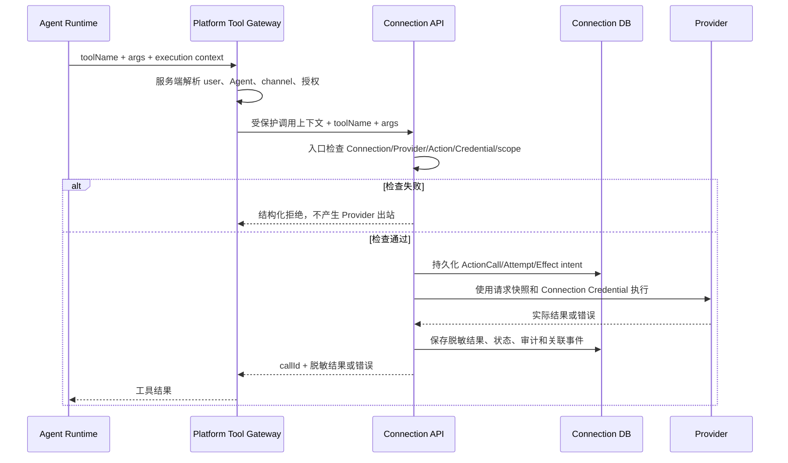

# Connection M1 High-Level Design

| 项目 | 内容 |
| --- | --- |
| 状态 | Proposed for Design Review |
| 版本 | v1.1 |
| 日期 | 2026-08-13 |
| 适用范围 | agent-infra M1 Connection 子系统 |
| 产品依据 | [Agent 平台 M1 PRD](../prd/PRD-agent-platform-M1.md)、[Connection M1 PRD](../prd/PRD-connection-M1.md) |
| 工程依据 | [M1 工程架构 Spec](SPEC-agent-infra-M1-engineering-architecture.md) |
| 参考实现 | [OpenConnector 固定 Commit `07f0a190`](https://github.com/oomol-lab/open-connector/tree/07f0a190a9815827d2d3ecae1e6ba7b8524662e8) |

## 1. 文档目的

本文只冻结 Connection M1 进入实现所需的高层边界和可观察行为。它不替代两份 PRD、工程架构 Spec 或开发工作流 Spec，也不把尚未批准的跨系统授权协议、恢复协议或 Provider 出口协议写成 M1 契约。

产品行为以 PRD 为准，部署、数据归属和身份边界以工程 Spec 为准。本文与权威文档冲突时，先修正权威文档，再更新本文。

## 2. M1 结论

### 2.1 OpenConnector 对齐范围

**[OpenConnector 参考]** 固定 Commit 的托管 Action 请求在入口解析 runtime token 和 policy，形成当前请求快照，然后继续执行；执行过程中不会再次读取授权状态、主动取消 Provider 请求或回滚已经提交的外部操作。

**[本项目设计决策]** M1 只对齐这一可观察行为。OpenConnector 仅作为 Provider、Action、OAuth、凭证刷新和执行机制的参考，不作为公司用户、组织、Agent 或授权关系的权威来源。

### 2.2 当前 M1 active contract

1. 平台托管的 Agent 外部系统调用必须经过 Platform Tool Gateway 和独立的 Connection 服务。
2. Platform 服务端解析当前用户、Agent、渠道和 Platform 授权；调用方提交的身份、Connection、账号和授权字段不是权限依据。
3. Connection 请求入口检查当前 Connection、Provider、Action、凭证和外部 scope 状态一次，并形成请求快照。
4. 检查通过后按请求快照执行。入口检查之后发生的撤权、断开、停用或凭证状态变化，不取消、不回滚已经进入执行的请求；Provider 返回的实际结果仍需保留。
5. 入口检查之前已经生效的撤权、断开、停用或失效，拒绝本次请求且不产生 Provider 出站。
6. 用户修复授权或 Connection 后，主动重试创建新的 Action 调用；不自动重放旧请求。
7. Agent、模型、Sandbox、浏览器和审计查询都不能获得原始凭证。Credential 只在 Connection 服务内部解密和使用。

### 2.3 不属于当前 M1 contract

以下内容不作为 Issue #4 或本 HLD 的 M1 前置：

- `ExecutionPermit`、GrantSlot、在线 redeem、授权 revision fence 和跨系统撤权线性化；
- Platform 与 Connection 之间的跨系统版本/epoch 协议或一次性调用许可协议；
- 自动取消在途 Provider 请求或自动回滚外部副作用；
- PITR 域外 Recovery Control、Evidence Journal、alternate-path acquisition、abandonment 和 terminal proof/delivery 协议；
- 为解决上述候选协议新增的 Egress Proxy、Recovery Command listener 或独立 worker 部署单元。

如果未来确实需要这些能力，必须单独创建 HLD/ADR，先更新工程 Spec，明确产品语义和 Owner，再进入实现。候选设计不得通过本 HLD 的合并或 CI 结果自动生效。

## 3. 产品与工程范围

### 3.1 M1 目标

- Agent 使用真实 Provider API，但永远看不到原始凭证。
- Owner 选择 Agent 可用的已发布 Action；用户选择授权给 Agent 的 Connection 和已确认 Action 集合。
- 个人 Connection、公司共享 Connection、跨用户和跨 Agent 访问相互隔离。
- 至少一个真实 Provider 完成连接、刷新、授权、调用、审计和撤销闭环。
- Platform 与 Connection 保持独立进程、镜像、数据库账号、数据权威和运行身份。

### 3.2 M1 非目标

- 任意 URL、任意 HTTP 模板、任意 Credential resolver、运行时上传脚本或动态加载未知 Provider；
- Agent 自主选择账号、默认账号或在多个账号间切换；
- 每次写 Action 的逐次人工确认；
- Webhook、定时任务、主动通知、事件型 Connector、平台级 Sandbox、Roadmap 多 Agent 协作、Skill Hub 和 Eval；
- 把 OpenConnector Runtime Server 或 Web Console 作为本项目产品入口；
- 引入 Redis、Kafka、NATS、Temporal 或独立 Connection Worker 服务。

## 4. 系统边界与权威归属

### 4.1 部署边界

`connection-api` 是独立部署单元，与 Platform 使用不同进程、镜像、运行身份、数据库账号和 PostgreSQL 数据库。应用入口只负责协议接入和依赖装配；领域规则位于 Connection core，Drizzle 只负责持久化适配。

Connection 服务可在同一进程内装配经过 allowlist、固定版本和安全评审的 OpenConnector Provider/OAuth/Action 代码。不得部署或暴露 OpenConnector Runtime Server 的产品入口。

### 4.2 数据权威

| 数据 | 权威方 | 另一侧允许保存 |
| --- | --- | --- |
| 公司用户、组织、Agent、Owner、渠道和 Agent 可用范围 | 公司身份系统 / Platform | 请求期解析结果和关联 ID |
| 用户到 Agent/Connection 的授权和确认 Action 集合 | Platform DB | Connection 调用上下文中的必要引用、调用事实 |
| Provider、Action、发布状态和执行版本 | Connection DB | Platform 的只读目录缓存或版本引用 |
| Connection、外部账号、共享范围和凭证 | Connection DB + KMS | Platform 的稳定 Connection ID 和展示摘要 |
| ActionCall、Provider 结果、脱敏调用审计 | Connection DB | Platform 的 callId、状态和时间线引用 |

Platform 和 Connection 不直接读取对方数据库，不建立可写授权副本，不使用分布式事务。跨系统操作使用服务身份、版本化 HTTP、稳定 ID、幂等键、状态机和 outbox。

### 4.3 信任边界

- Browser、Agent、模型和 Provider 返回内容均不可信，不能覆盖服务端解析出的主体或目标资源。
- Agent Pod 只能通过 Platform Tool Gateway 使用 Connection，不能访问 Connection DB、KMS 或 Provider Credential endpoint。
- Connection 是唯一能够解密和使用 Provider Credential 的运行身份。
- 所有跨用户、跨 Agent、跨 Connection 的查询和调用失败都必须不泄露目标资源是否存在。

## 5. 核心调用流程



### 5.1 Platform 入口

Platform 从受保护的 execution context 解析用户、Agent、渠道、Owner Action 选择和用户确认的 Connection 授权。Agent 只提交已发布的 `toolName` 和符合 Schema 的参数；不提交 `userId`、`agentId`、`connectionId`、外部账号或 Credential。

Platform 入口负责平台侧的快速拒绝和统一错误映射，但不替代 Connection 的最终 live check。

### 5.2 Connection 入口检查

Connection 在真正创建 Provider 出站前，以一次一致的本地读取检查：

- 受保护上下文中的目标 Connection、Provider/Action 与服务端解析结果；
- Provider、Action 和对应发布版本的当前状态；
- Connection 的 effective status、账号归属或共享范围；
- 当前 Credential 状态和 Provider 所需外部 scope；
- 当前请求的参数 Schema、ActionVersion 执行器和必要的限流/熔断条件。

检查结果形成仅供本次请求使用的快照。检查通过后不再因为授权状态变化进行第二次权限检查；后续执行失败按 Provider/网络/凭证错误返回。

### 5.3 ActionCall 持久化

Connection 在 Provider 出站前获得稳定 `callId` 并持久化请求、状态和必要的脱敏参数摘要。至少保留：

- 一个逻辑 tool call 对应一个 ActionCall；重复请求读取或回放原调用；
- Provider 出站前的 attempt/effect intent；
- Provider 返回的脱敏结果、错误、状态和外部 request ID（如有）；
- Platform execution、Connection call 和审计事件之间的关联 ID。

Provider 超时或响应不确定时保留“结果待确认/`UNCERTAIN`”事实，不盲目重放可能产生副作用的写操作。只有 Provider 明确支持幂等机制时，才允许按工程 Spec 的规则自动重试。

## 6. 授权、撤权与生命周期

### 6.1 有效能力

一次托管 Action 调用必须同时满足：

```text
已发布 Action
∩ Owner 当前选择
∩ 用户最近确认的 Action 集合
∩ 当前用户对 Connection 的有效资格
∩ Connection 当前外部 scope
```

任何一层只能缩小能力，不能因缓存缺失、调用方字段或 Provider 返回内容扩大能力。

### 6.2 Connection 状态

M1 至少区分 `ACTIVE`、`DEGRADED`、`REAUTH_REQUIRED`、`DISCONNECTED` 和 `DISABLED`。状态转换、账号重连、共享范围变化和凭证刷新由 Connection 负责持久化；平台通过稳定 ID、事件或查询同步展示。

### 6.3 撤权竞态

| 变化何时生效 | 本次请求 | 后续请求 |
| --- | --- | --- |
| 入口检查之前已提交 | 拒绝，不产生 Provider 出站 | 继续拒绝，直到用户修复 |
| 入口检查之后提交 | 继续执行，不主动取消、不回滚 | 新请求按当前状态重新检查 |

这条规则同时适用于用户撤销 Agent 授权、断开 Connection、Provider/Action 停用、共享范围失效和凭证失效。不同外部账号重连不会迁移旧授权；同账号重连按 PRD 恢复原授权。

## 7. 连接与凭证

### 7.1 OAuth 与 API Key

- OAuth 使用 Authorization Code + PKCE、一次性 state 和受控回跳地址；state 绑定发起用户、Connection scope 和目标 Connection。
- API Key 只允许受控输入，提交后立即写入 Connection/KMS；API Key 不回显、不进入 Platform、Agent 或日志。
- OAuth access/refresh token 和 API Key 使用公司 KMS/Secret Service envelope encryption；只有 Connection workload identity 可解密。
- refresh、revoke 和 credential replacement 使用 Connection 本地幂等键、revision/CAS 或 PostgreSQL lease，避免并发覆盖。

### 7.2 外部账号身份

Connection 保存 Provider 证明的稳定外部账号标识和脱敏展示信息。展示名、邮箱或 Connection alias 不能作为授权边界。不同外部账号重连创建新的 Connection identity，并要求用户重新授权 Agent。

## 8. 目录与 Provider

- Connection 是 Provider/Action 目录的权威来源；发布对象使用不可变版本。
- 只有经过代码、安全、网络出口和 Provider Owner 评审的 allowlist executor 可以执行；目录中存在的 Provider 不等于自动允许执行。
- Agent Owner 只能选择已发布 Action，不能填写任意 URL、请求模板或自定义 Credential。
- Provider/Action 停用在 Connection 入口拒绝新请求；不要求取消已进入执行的请求。
- Action 的用途、参数、返回结果或外部权限发生实质变化时重新发布并要求 Owner/用户按 PRD 重新选择或确认。

## 9. API 与错误契约

M1 只冻结职责和可观察行为，不在本 HLD 固化内部 token、revision、签名字段或数据库列名。具体 OpenAPI contract 由 `packages/contracts` 和对应 primary Issue 维护，并遵守：

- Browser 和内部接口使用版本化 HTTP/JSON；对话增量使用 SSE；
- 服务端返回稳定错误码、用户可读消息、`traceId` 和可重试标记；
- 认证失败、无权、资源不存在和跨主体访问使用不枚举的错误族；
- Connection 返回的调用结果包含稳定 `callId` 和脱敏状态/结果/错误；
- 同一逻辑请求重试读取原 ActionCall，不创建第二个外部效果；用户主动重试是新的 tool call。

当前 M1 不提供 `execution-permits:redeem`、Permit introspection 或跨系统授权版本接口。

## 10. 审计与可观测性

Connection 审计覆盖连接、重连、断开、Provider/Action 发布和停用、授权相关调用、每次 ActionCall、Provider 状态、结果和错误。审计至少可通过 `executionId`、`callId`、`agentId`、`connectionId`、`actionId` 和时间关联一次调用；不记录原始凭证、聊天正文或模型思考原文。

普通用户只能查看本人 Connection 和调用记录；管理员可以查看 Connection 审计，但不能通过 Connection 审计查看普通用户会话正文；Agent Owner 不能查看其他用户记录。

最小运行指标包括入口拒绝、调用状态、Provider 限流/错误、凭证刷新失败、数据库连接池、outbox 积压和审计写入失败。指标使用低基数状态，不暴露用户、凭证或完整参数。

## 11. 测试与验收

### 11.1 必测行为

- 个人 Connection：连接、OAuth callback、refresh、同账号重连、不同账号切换、断开；
- Shared Connection：当前组织/用户资格、资格失效、仍需 Agent 单独授权；
- Agent 隔离：跨用户、跨 Agent、跨 Connection、伪造主体字段和 alias/参数替换均拒绝且不枚举；
- Credential：Agent、模型、Sandbox、页面、日志和审计均无法读取原始凭证；
- Action：Owner 选择、用户确认新增 Action、停用后新请求拒绝；
- 调用：Provider 前持久化 ActionCall/Effect intent、真实 Provider 结果和脱敏审计；
- 撤权竞态：入口前撤权拒绝；入口后撤权继续并保留 Provider 实际结果；
- 重试：不确定写操作不盲目重放；用户主动重试创建新调用；
- 至少一个真实 Provider 的 OAuth/API/refresh/revoke/Action E2E。

### 11.2 不作为当前验收前置

Permit redeem 竞态、跨系统 epoch、Recovery Control、Evidence Journal、Egress admission、alternate path、abandonment 和 terminal proof 不进入 M1 active 测试矩阵。它们未来单独立项后再增加契约、迁移和故障注入测试。

## 12. 实施顺序

1. 工程底座：`connection-api`、Connection core/store/contracts、独立数据库迁移、服务身份、KMS/Identity Fake 和 OpenConnector pinned Adapter。
2. Provider 目录：目录导入、allowlist、Provider/Action 发布版本、停用和最小 Provider conformance。
3. Connection 生命周期：个人/共享 Connection、OAuth/API Key、refresh/revoke、稳定账号识别和状态页。
4. Platform 授权调用：Tool Gateway 受保护调用上下文、Connection 入口 live check、ActionCall/Effect 持久化和审计关联。
5. 真实闭环：一个真实 Provider 的连接、刷新、授权、调用、撤销、错误和恢复验证。
6. 上线加固：负向隔离、故障注入、容量基线、备份恢复、运行手册和安全签收。

每一步遵循 `Issue -> 实现与验证 -> PR`。改变授权、身份传递、数据权威、部署单元或 Agent Runtime Contract 前，先更新工程 Spec 并新增 ADR。

## 13. 评审退出条件

设计评审通过前必须确认：

- PRD、工程 Spec 与本文没有冲突；
- 首个真实 Provider、Action、测试账号和最小 scope 已确定；
- Platform 与 Connection 的数据权威、服务身份和负向隔离测试已确定；
- Connection 入口一次检查、请求快照、撤权竞态和“不自动重放”已有可执行测试；
- Provider 前持久化、`UNCERTAIN` 处理、真实 Provider 验收和审计关联有 Owner；
- 没有把后续候选协议作为 M1 实现、API、Schema 或上线门禁的隐含前置。

本文合并不等于产品或架构批准。批准后的结论必须回写 PRD、工程 Spec 或 ADR，并由对应 Owner 负责实现和验收。
