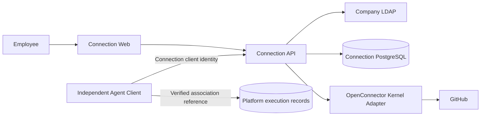

# Connection M1 高层设计

## 1. 状态与范围

本文定义 Connection M1 独立客户端接口与首个 Codex GitHub Pilot 的高层设计。产品行为以 [Connection M1 产品需求](../prd/PRD-connection-M1.md) 和 [Agent 平台 M1 产品需求](../prd/PRD-agent-platform-M1.md) 为准；跨系统工程边界以 [M1 工程架构 Spec](SPEC-agent-infra-M1-engineering-architecture.md) 为准。

本文规定实现与验收边界，不表示代码、部署或 Pilot 已完成。首个 Pilot 只覆盖：

- Connection 独立中文 Web 与 LDAP 登录。
- 独立 MCP/API 客户端身份、具体 Agent 授权和可核实的原调用关联；首个 Pilot 使用 Codex。
- GitHub 专用测试账号、一个受控 private 仓库和三项 Action。
- 连接、Grant、真实创建 PR、幂等、撤权、未知结果、审计和跨主体隔离。

员工日常 GitHub 账号、GitHub App、Bitbucket、Jira、Confluence、共享账号真实组织范围和广泛生产化不在本 Pilot 范围。独立客户端接口及受控测试不表示真实账号 Pilot 已通过。

## 2. 设计目标

1. Connection 独立拥有 Principal、Consumer/Actor、Connection Grant、外部账号、Credential 和调用审计。
2. Platform 任务授权与 Connection 客户端/Agent 授权分别由各自系统校验，不能互相替代。
3. Agent、模型、浏览器和 Platform 都不能获得 Provider Credential；Action 调用不能由 Agent、模型、Platform 或请求字段指定目标 Connection。Connection Web 仅允许当前 Principal 在管理流程中选择经服务端确认其有权使用的 Connection。
4. 撤权在 Provider 提交前可靠阻止调用；提交后保留外部真实结果，不伪造回滚。
5. 写操作结果未知时不自动重发，并能经过限时自动对账、管理员处理和明确未知终态。
6. 所有跨 Principal、Consumer、Actor 和 Connection 访问 fail closed 且不可枚举。

## 3. 核心模型

| 模型 | 含义与权威 |
| --- | --- |
| Principal | Connection 独立确认的用户或应用主体；用户以 `identity issuer + stable subject` 映射，应用使用独立注册身份 |
| BrowserSession | Connection Web 的 hash-only、可撤销登录会话 |
| AdministratorRole | Connection 内独立、可撤销且可审计的管理员角色绑定 |
| Consumer | 独立注册并取得 Connection 访问权限的客户端或应用 |
| ConsumerInstance | Connection 独立认证并绑定 Principal/Consumer 的客户端实例；不使用 Platform workload 替代主体 |
| Actor | Consumer 内不透明稳定授权单元；本 Pilot 为 Agent ID |
| ProviderRelease | 经来源、权限、Schema 和执行审查后发布的 Provider 版本 |
| ActionVersion | ProviderRelease 下不可变的 Action 契约 |
| Connection | Principal 拥有或当前有资格使用的外部账号连接 |
| CredentialVersion | Connection 当前受保护的 Provider Credential 版本 |
| Grant | Principal 对 Consumer/Actor、Connection 和 exact ActionVersion 的确认授权 |
| ActionCall | Connection 已接受并持久化的一次逻辑调用 |
| Effect | WRITE ActionCall 可能产生的外部业务副作用 |
| Dispatch | 向 Provider 发起一次 Action 执行的具体尝试；WRITE Dispatch 关联对应 Effect |

Connection DB 是上述模型的唯一权威。Platform 只保存自身执行事实，以及按工程 Spec §13.2 核实的关联引用与核实状态。

## 4. 系统上下文

- `connection-web` 只调用 Connection Browser API，不读取 Platform DB。
- Agent/客户端直接访问 Connection MCP/API；Platform 不提供 Tool Gateway、delegated assertion 或 Connection 状态投影。
- OpenConnector Kernel 只执行已发布 Provider Action，不拥有 Principal、Grant、Credential、审计或恢复状态。

## 5. Principal 与浏览器会话

### 5.1 LDAP 登录

Connection 使用部署批准的固定 LDAP profile：

1. Browser 通过 HTTPS 向 Connection 提交用户名和密码。
2. Connection 对登录尝试按规范化账号和请求来源执行限速、退避与审计；限流状态不能记录密码，也不能形成可用于锁死指定员工账号的无界远程锁定。
3. Connection 转义所有 DN/filter 输入，设置连接、bind、search 和总请求 deadline，拒绝空密码和匿名 bind。
4. 不存在的账号、密码错误和不允许登录的账号返回相同的外部状态、响应结构和脱敏错误，不能泄露 LDAP 条目是否存在。
5. 成功验证后读取稳定 `uid`，以 `issuer + uid` 查找或创建 Principal。
6. 邮箱、登录名和显示名只更新展示资料，不参与授权键。
7. LDAP 密码在请求结束后丢弃，不进入持久化、Token、Cookie、日志、错误、审计或模型上下文。

LDAP endpoint、Service Bind Credential 和 transport profile 由部署 Secret/配置提供，调用方不能选择或触发降级。默认部署必须使用经过 CA、证书有效期和主机名验证的 LDAPS 或强制 StartTLS；证书验证失败、StartTLS 失败及任何自动回退都必须在启动或请求执行前 fail closed。

当前公司 LDAP profile 参考 Rehoboam 已验证的登录契约：使用部署 Service Bind 查找用户目录条目，读取稳定 `uid` 和展示属性，再以用户 DN bind 验证密码。Connection 不复制 Rehoboam 应用 Token、Socket 登录或会话实现，也不从 Rehoboam 数据库读取身份状态。

唯一例外是具名 LA3 受监督 Pilot profile：它沿用 Rehoboam 当前固定私网 `ldap://` 传输，因为公司 LDAP 没有可用 TLS。部署必须同时限制到批准的 LA3 网络路径、固定 endpoint 和受控 Connection workload，禁止动态 endpoint、自动降级、fallback 和外部网络访问，并明确接受员工密码及 Service Bind Credential 在该私网链路明文传输的风险。该例外不能被其他环境、客户端或生产声明复用；公司 LDAP 提供可用 TLS 后必须迁移，广泛生产上线前必须关闭明文 profile。

LA3 Pilot 保持与 Rehoboam 一致的目录查找和用户 bind 路径，只保证统一外部错误，不宣称不同失败路径的可观察时延不可区分；账号枚举时序属于明确残余风险。正式 profile 除关闭明文传输外，还必须让不存在账号路径执行等价认证工作，并通过安全测试证明外部时序不能可靠区分条目是否存在。

### 5.2 Session

登录成功后签发高熵 opaque Cookie：

- 使用 host-only `__Host-` Cookie，并设置 `HttpOnly`、`Secure`、`SameSite=Strict` 和 `Path=/`，不设置 `Domain`。
- PostgreSQL 只保存 session hash、Principal、issuer、过期、撤销和 recovery generation。
- 退出、过期、Principal 停用或 recovery generation 变化后立即失效。
- BrowserSession 只用于 Connection Web 管理操作，不能作为客户端 Action 调用凭据。
- 除 OAuth callback 外，所有 Browser 写请求必须同时校验独立 CSRF token、精确同源 `Origin` 和 Fetch Metadata；缺失、跨源或不匹配时在执行任何状态变更前拒绝。
- OAuth callback 不依赖 BrowserSession Cookie、`Origin` 或同源 Fetch Metadata；它必须原子消费一次性、短期、不可预测且服务端持久化的 state，并校验其绑定的 Principal、Provider、发起事务和受控回跳地址。callback 只能完成原 OAuth 事务，不能创建 Grant 或接受调用方提供的 Principal、Connection 归属和任意跳转地址。

### 5.3 Principal 复核

- 登录时查询 LDAP。
- 登录后以 Principal 为单位缓存 15 分钟；窗口内的 Session/Token 请求共享该验证时间。
- 缓存过期后的并发请求合并为一次 LDAP 查询，其他请求等待同一结果。
- LDAP 条目缺失时禁用 Principal 并拒绝敏感操作；LDAP 不可用或返回非法结果时 fail closed。
- 当前 Pilot 只验证 `uid` 条目存在。缺少离职 active-state 真值必须进入风险与验收说明，不能描述为离职立即停权。
- Rehoboam 只在登录时执行 LDAP bind，现有 Token 校验不回查 LDAP，也没有可复用的离职状态判断；Connection 不复制该 Token 行为，按已确认的 15 分钟条目存在性策略执行。

## 6. Catalog 与独立授权

### 6.1 Catalog

Connection 是 Provider/Action 目录的唯一权威，向当前获权客户端提供发布的 immutable ActionVersion、输入/输出 Schema、effect 和 required scope。目录发现不能扩大授权；实际调用及 Dispatch 仍重新校验当前发布状态。Platform 不同步目录或维护 Owner Action policy。

### 6.2 Connection Grant

有效 Action 是当前 Consumer/具体 Agent 的 Connection 授权、Principal current Grant exact ActionVersions、Provider/Action/Connection/Credential 状态与 Pilot repository policy 的交集。GitHub OAuth 不自动创建 Grant，新增 Action 不自动扩大旧 Grant；授权主体在 Connection 独立确认。Platform Runtime Grant、workload 或签名上下文不能替代这些授权，不建立 PlatformPolicyFence。

## 7. 独立客户端身份与调用关联

### 7.1 客户端认证与主体映射

Connection 独立签发和撤销短期客户端访问 token。token 绑定 resource、Consumer/client、具体 Agent Actor 及服务端解析的用户或应用主体；首个 consumer profile 不接受缺少 Actor 的 Consumer-level fallback。用户主体使用 Connection 确认的 issuer 与稳定 subject，应用使用独立注册身份；邮箱、显示名、Owner、应用责任人、Platform API 凭证和 Runtime Execution Grant 不参与替代映射。

独立授权交付包含客户端可核对的主体类型/稳定键、Actor、issuer/resource、凭据 revision 和期限。`GET /api/client/identity` 使用该客户端自己的当前访问 token，返回上述服务端解析绑定；不能复用管理浏览器会话。Runtime 原主体 ID 与 Connection 主体 ID 若来自不同 namespace，须有同一次独立授权确认的稳定映射，缺失或错配时拒绝。具体 token 签发和存储仍由 Connection 实现，不由 Platform 签发 assertion。

客户端固定 HTTPS MCP origin、issuer/resource 和只读核实路径。每次 MCP/API 请求重新检查当前 token、Principal、ConsumerInstance 和 Actor；参数、header 或 `_meta` 不能覆盖已认证身份、目标账户或授权。客户端访问 token 与 Provider Credential 分开，后者始终留在 Connection。

### 7.2 MCP 请求与原调用回执

受控 consumer profile 使用 `POST /mcp` 的原生 `tools/call`。可信客户端 leaf 在实际发送前生成 `params._meta["connection.clientRequest/v1"]`：`operationNonce` 绑定一次原生逻辑工具操作，`attemptNonce` 标识本次真实传输；保留字段不得由模型参数或 `_meta` 覆盖。这些值只供关联，不授予权限。

双方对实际请求按 `connection-request-v1` 计算摘要：将 `{version: "connection-request-v1", method, toolName, arguments}` 按 RFC 8785 JSON Canonicalization Scheme 序列化为 UTF-8，再计算 SHA-256；arguments 为通过 schema 校验的原始 wire 业务参数，包含实际 Action selector，不包含 token、cookie、nonce 或回执。schema 不支持的数值或字段在发送/执行前拒绝，摘要不能基于填入默认值或改写字段后的副本。Connection 独立计算并保存摘要，不能只接受客户端提交的摘要值。

写 Action 的业务幂等键由可信客户端从本次逻辑操作生成并放入上述保留 metadata 的 `idempotencyKey`，不作为模型可选择的 Provider 参数。Connection 在原调用命名空间中保持键、主体/Actor、Action、业务参数摘要和 operationNonce 的不可变绑定；同键不同绑定拒绝，传输重试不得把新任务 nonce 追加到旧调用。实际新 attempt 可追加到同一已确认 logical operation。

Connection 创建原调用记录后，在本次匹配 JSON-RPC request ID 的响应 `result._meta["connection.receipt/v1"]` 返回 `callRef`、`operationNonce`、`attemptNonce`、`requestDigestVersion`、`requestDigest`、服务端解析的 `principal`（type/key）、`actorId` 和 `actionVersionId`。已创建记录的 JSON-RPC error 在固定 `error.data` 中使用相同 receipt 结构；未创建记录时明确不返回 callRef。回执包含的记录绑定来源于本次认证请求，不能接受调用方指定的 callRef 或其他任务的真实引用。

### 7.3 原调用只读核实

`GET /api/client/calls/{callRef}` 是固定 Connection origin 下的只读接口，使用原主体当前独立取得的 `calls:read` 权限并逐次鉴权；无权访问时不泄露记录是否存在。它返回原调用的服务端 Principal/type、Consumer/client、Actor、ActionVersion、operationNonce、实际 attemptNonce 集合与 requestDigest/version，不返回 Provider 凭据或要求复制调用结果/审计。

受信客户端核对本地原执行意图、实际请求 nonce/摘要、同一次认证响应的原回执以及只读原记录，全部匹配才记录 verified；任一缺失、错配或查询无权保持 unverified。固定 origin/TLS/resource 错配或跨 origin redirect 拒绝，回执中的 URL 不作为查询地址。相同主体/Agent、相同参数、时间、签名或另一任务的真实 callRef 都不能替代上述匹配。

核实仅查询原记录，不重发 Provider 操作。完整丢失原调用回执时，即使按 nonce 找到记录也不能以缺失的原响应证据宣称 verified。Runtime 的 FD3 交付、真实 leaf 采集与本地可靠保存遵循 [Runtime HLD §9](HLD-agent-runtime-M1.md#9-runtime-身份上下文)；Platform API/Worker 不持有客户端查询凭据。

## 8. GitHub ProviderRelease

首个 Pilot 固定一个 GitHub Cloud ProviderRelease：

| ActionVersion | 用途 | Effect |
| --- | --- | --- |
| `github.get_current_user` | 验证当前 GitHub 账号及稳定数值 ID | READ |
| `github.list_my_repositories` | 确认受控测试仓库可见 | READ |
| `github.create_pull_request` | 从预置 head branch 创建真实 PR | WRITE |

- OAuth App 请求 `read:user repo`；不请求 `user:email`、`workflow` 或 `delete_repo`。
- 只使用专用 GitHub 测试账号；员工日常账号禁止进入 Pilot。
- 外部账号 identity 为 `github.com + numeric user id`，login/name 仅展示。
- 部署级 repository allowlist 绑定唯一 private 测试仓库的 GitHub numeric repository ID，名称和 `owner/repo` 仅用于展示。create-PR 在提交写请求前通过 GitHub 解析目标并核对稳定 repository ID，不匹配或无法确认时 fail closed；repository-read 的返回结果也只按该稳定 ID 保留该仓库。
- 其他 GitHub Action 和其他 Provider 不发布、不发现、不执行。

固定 OpenConnector commit 的 allowlist closure 必须记录 source commit、digest、license、notice 和复制清单。默认不维护 Fork；只有 Provider/OAuth/executor 通用缺口经过评审后才建立最小 Fork。

## 9. Action 执行与撤权

### 9.1 创建调用

Connection 在一个持久化流程中：

1. 验证本次独立客户端身份、具体 Agent 和 current Grant。
2. 校验 Action Schema 和 repository policy。
3. 以 Principal、Consumer/Actor 和业务幂等键查找原调用；业务幂等键在该命名空间内使用唯一约束串行化并发创建。
4. 将 ActionVersion、参数摘要和服务端从 current Grant 解析出的 Connection 稳定 ID 作为原调用的不可变绑定；全部一致时返回原 `callId`，任一字段不同则拒绝。
5. 创建 ActionCall，并为所有需要访问 Provider 的 Action 创建 PENDING Dispatch；WRITE Action 还必须创建 Effect 并将 Dispatch 关联到该 Effect。

### 9.2 Dispatch 线性化

在访问 Provider 前，Connection 在同一 PostgreSQL 事务重新检查：

- Principal、客户端访问凭据及其 revision、ConsumerInstance 和 Actor。
- Grant root/current Grant 和 exact ActionVersion。
- Connection revision/fence 和 CredentialVersion。
- Consumer declaration、ProviderRelease 和 ActionVersion 状态。
- repository allowlist。
- 请求 deadline 尚未到期。

事务必须锁定参与判断的 Grant root/current Grant、Connection fence、CredentialVersion、ConsumerInstance 和 Dispatch 行，或使用覆盖同一 revision/fence 的 CAS，使并发撤权与 Dispatch 转换只能形成一个确定提交顺序。全部有效时原子把 Dispatch 从 `PENDING` 变为 `SUBMISSION_STARTED`。该持久状态转换是 Provider 访问的授权线性化点，可能早于实际网络请求；零行更新或 CAS 冲突等价于本地拒绝，不得调用 Provider。READ Dispatch 直接记录调用结果；WRITE Dispatch 还必须同步对应 Effect 状态。

撤权在该事务前完成时阻止当前调用；事务完成后才撤权时不回滚可能已提交的 Provider 操作，但后续新调用均拒绝。恢复 PENDING Dispatch 时必须重新检查 deadline；已经过期的调用本地终结且不得访问 Provider。

## 10. 未知结果与对账

GitHub create-PR 不接受 Connection 业务幂等键。Provider 可能已接受请求但 Connection 未取得或未保存可靠结果时：

1. ActionCall/Effect 进入 `RESULT_PENDING/UNCERTAIN`。
2. 首次 dispatch 前生成并持久化高熵 opaque correlation marker；`github.create_pull_request` 的 immutable ActionVersion 将该标记以隐藏注释写入 PR body，并记录实际提交的 repository、head、base 和参数摘要。
3. 不自动再次 POST create-PR。
4. 对账最多运行 24 小时并退避查询。
5. 只有 correlation marker、repository、head、base 和预期字段全部匹配且候选唯一时才能自动确认成功；零候选不构成可安全重发证据。
6. 多候选、缺少关联标记或字段冲突立即进入 `NEEDS_MANUAL_REVIEW`。
7. Connection 管理员在 Connection Web 选择有 Provider 证据的结果或记录仍无法确认；普通用户只能查看脱敏证据并提供线索。
8. 管理目标为一个工作日。七天后仍无法确认则进入终态 `UNRESOLVED`。
9. `UNRESOLVED` 既不是成功也不是失败，不再自动查询/重试，原幂等键永久绑定原调用。新操作必须人工核查后显式使用新键。

## 11. Connection 与 Provider 撤销

- Grant revoke、Connection disconnect、Credential fence 和 Provider revoke 分别记录。
- 本地撤销先原子终结 current Grant/fence，立即阻止新 dispatch。
- Disconnect 创建持久 Provider revoke attempt；该 attempt 不可变地绑定断开时的 CredentialVersion 和受保护凭据引用，只撤销该版本对应的单个 GitHub Token，执行或重试时不得解析 Connection 的 current CredentialVersion。
- Provider revoke 记录请求、成功、失败/待重试、attempt 和脱敏证据；旧 CredentialVersion 的受保护凭据保留到 attempt 进入终态，之后按凭据销毁策略删除或 crypto-shred。
- 不默认删除用户对整个 OAuth App 的 grant；该动作只允许由明确展示影响范围的独立用户操作触发。
- 用户在 GitHub 侧撤销或 scope 缩减后，仅当 Provider 返回可确认的无效凭证响应，或独立 token check 明确确认 Token 已撤销或缺少必需 scope 时，才将 Credential fence 为不可用并要求重新连接。普通 `403` 必须先区分限流、abuse protection、仓库权限和其他资源级拒绝，不得据此直接停用整个 Credential。

## 12. Web 与管理

`connection-web` 是独立 React SPA，与 `connection-api` 通过同一批准 public origin 路由：

- Connection Web 路由进入 SPA。
- Browser API、OAuth callback、Catalog、独立 MCP/API 和原调用核实接口进入 Connection API。
- 不使用跨域 Cookie、公共 tunnel 或调用方身份 Header 补偿错误路由。

普通用户可以登录、连接 GitHub、查看脱敏账号、确认/撤销 Grant、断开 Connection，以及查看自己的调用和未知结果。管理员可以管理 Catalog/共享 Connection/审计，并处理 `NEEDS_MANUAL_REVIEW`。LDAP 只认证 Principal；Connection PostgreSQL 保存 AdministratorRole binding，每次管理请求重新检查当前角色。

首个管理员只能由持有部署权限的操作员一次性 bootstrap。目标稳定 LDAP subject 必须来自受保护的部署配置，不能由浏览器请求指定或覆盖；bootstrap 请求必须使用独立的一次性部署凭据或受信 workload identity 认证，不能仅依赖普通 BrowserSession。bootstrap 必须在同一 PostgreSQL 事务中锁定唯一 bootstrap 状态、再次确认不存在管理员、创建首个角色绑定并永久标记已消费；并发请求只能有一个成功。成功后立即撤销 bootstrap 凭据并关闭入口；已有管理员或 bootstrap 已消费后该入口必须 fail closed，重新启用必须经过显式部署变更并记录审计。所有页面默认简体中文。

## 13. 数据与审计

Connection DB 至少保存：

- Principal、identity mapping、BrowserSession 和 AdministratorRole binding。
- Consumer、ConsumerInstance、独立客户端访问凭据绑定和 Actor registration。
- ProviderRelease、ActionVersion 和 Consumer declaration。
- Connection、CredentialVersion、Grant/root/fence。
- AuthorizedInvocation、ActionCall 及不可变请求/回执绑定、Effect、Dispatch 和 reconciliation job。
- Provider revoke attempt 和 Connection audit。

审计记录稳定 ID、主体、版本、状态、时间和脱敏证据。不得记录 LDAP 密码、Provider Token、Cookie、客户端访问 token、加密密钥、聊天正文或模型内部思考。

## 14. 部署与失败停止

- `connection-api`、`connection-web` 和 migration job 使用从 `main` 固定 commit 构建的不可变镜像 digest。
- ProviderRelease 和 Action 默认 disabled，只在具名 LA3 HCI Pilot 环境和测试主体范围内启用；独立批准的本地首通按其具名范围举证，不关闭完整联合 Pilot，客户端 fixture/conformance 不自动启用真实 Provider。
- 缺少 PostgreSQL、LDAP、Credential key、GitHub OAuth、repository policy 或独立客户端身份验证器时，业务路由启动 fail closed。
- 越权、Credential 泄露、错误客户端身份或调用绑定被接受、重复 PR、Effect 无法持久化或撤权后仍可新调用时立即停止 Pilot。
- 停止时禁用 ProviderRelease/Action 或客户端调用入口，保留数据库和审计。回滚到健康检查或只读入口不表示 GitHub 能力仍可用。
- 公司 KMS/Secret 产品、唯一受控 egress、HA/PITR、容量和正式值班仍是 Pilot 后生产化门禁；受监督 Pilot 的局部通过不能关闭这些缺口。
- LA3 私网 `ldap://` 是具名 Pilot 风险接受，不是通用兼容模式；正式上线证据必须证明已使用验证证书和主机名的 LDAPS/StartTLS，并关闭明文 profile。

## 15. Pilot 验证矩阵

### 15.1 正向

- Alice、Bob 分别使用 LDAP 登录并连接各自专用 GitHub 测试账号。
- 两个账号只访问同一受控 private 仓库，并使用不同预置 head branch。
- 两人分别为同一 Agent Actor 确认三项 Action，调用只能解析各自 Connection。
- current-user 返回稳定 numeric ID；repository-read 发现受控仓库；create-PR 产生真实 PR。
- 相同幂等键重试返回同一 `callId` 和 PR，不创建第二个 PR。
- Platform execution 与 Connection audit 按第 7 节核对实际请求、原回执及记录后关联，分别鉴权查询。

### 15.2 负向

- Alice/Bob 不能访问对方 Principal、Connection、Grant、Credential、OAuth transaction 或调用记录。
- 错误 issuer/resource、期限、主体、Consumer/Actor、ActionVersion、参数摘要、nonce 或幂等绑定均拒绝；同主体/Agent 的跨 Execution 真实引用移植不能被核实。
- 已撤销客户端凭据、已终结授权 fence 和超过 deadline 的 PENDING Dispatch 均在 Provider 访问前拒绝。
- LDAP 登录覆盖账号/来源限流、退避、统一失败响应和 CSRF/Origin/Fetch Metadata 拒绝，不能枚举账号或借限流锁死指定员工。
- LA3 Pilot 验证只允许固定私网 LDAP endpoint 且无 downgrade/fallback；证据明确标记明文 Credential 传输风险，不能作为 TLS conformance 证据。
- LA3 Pilot 不宣称 LDAP 失败路径具备时序不可区分性；正式 profile 必须用等价认证工作和安全测试关闭该账号枚举风险。
- 客户端访问凭据撤销、Grant revoke、Connection disconnect、Credential/Action/Provider 停用均阻止新调用。
- repository allowlist 外的请求在访问 GitHub 前拒绝。
- 仓库重命名、转移和同名替换不能改变 allowlist 指向的 numeric repository ID；无法确认稳定 ID 时拒绝写操作。
- GitHub 普通 `403` 覆盖限流、abuse protection 和仓库权限拒绝，不得错误 fence 有效 Credential。
- 浏览器、Agent、Platform、日志、错误和审计均无原始 Secret。

### 15.3 故障与人工处理

- dispatch 前撤权、本地持久化失败、Provider 响应丢失、结果落库失败和进程重启。
- 24 小时自动对账、歧义转管理员、七天 `UNRESOLVED`。
- 单 Token revoke 成功、失败/重试和 GitHub 侧已撤销。
- Provider/Action disable、客户端调用入口关闭和固定 digest 回滚。

## 16. 证据与成功声明

每次 Pilot 记录镜像 digest、migration、ProviderRelease、ActionVersion、测试账号 numeric ID、仓库、PR URL、`callId` 和脱敏审计证据。测试 PR 不合并，验收后关闭；branch 按固定前缀清理；测试 Token 撤销并确认失效，Connection 调用和审计不删除。

Platform Owner、Connection Owner、Security、SRE 和 Pilot 使用者分别签收自己的边界。任一签收缺失，Pilot 不通过。

成功声明的范围遵循 [Connection PRD 第 13 节](../prd/PRD-connection-M1.md#13-首个-github-pilot-验收)。受控 consumer/conformance 测试不表示真实账号验收，也不表示 Connection 服务的实现、部署或正式交接完成。

## 17. 实施顺序

1. 权威文档和 wire contracts。
2. Connection Core/PostgreSQL 与 migrations。
3. 按独立任务实现 LDAP Session、三项 GitHub Adapter、Catalog、Connection Web/Grant 与独立客户端身份/原调用核实接口。
4. 可靠 Effect、对账和 Provider revoke。
5. 运行装配、HCI readiness 和跨系统真实 Pilot。

每项实施使用独立 primary Issue 和 PR，直接从最新 `main` 开始。历史分支、tag 和开放 PR只作为候选证据，不整体合入或作为执行授权。
