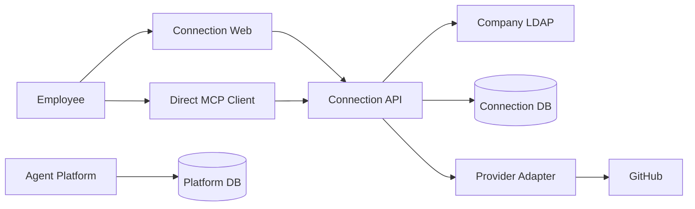
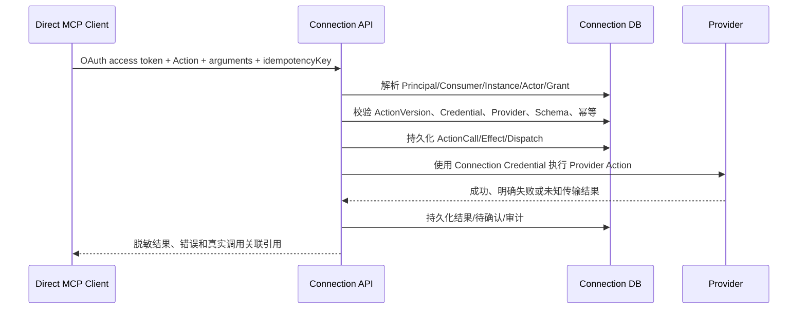

# Connection M1 高层设计

## 1. 状态与权威

本文定义 Connection M1 的独立 Direct MCP/API GitHub Pilot。产品行为以 [Connection M1 产品需求](../prd/PRD-connection-M1.md) 和 [Agent 平台 M1 产品需求](../prd/PRD-agent-platform-M1.md) 为准；跨系统工程边界以 [M1 工程架构 Spec](SPEC-agent-infra-M1-engineering-architecture.md) 为准。

Connection 是独立系统、独立部署单元、独立数据库和独立授权权威。Agent Platform 是一个 Consumer，不是 Connection 的代理、issuer、Grant store、Provider executor 或审计权威。旧 Platform Tool Gateway、delegated assertion 和 Platform policy fence 不属于当前架构。

## 2. 设计目标

1. Connection 独立拥有 Principal、Consumer、ConsumerInstance、Actor、Grant、Provider、Action、Credential、ActionCall、Effect、Dispatch 和审计。
2. Direct MCP Client 只需配置 Connection endpoint，并通过 Connection OAuth 或获准 PAT 访问。
3. Provider Credential 始终留在 Connection 受控执行路径中。
4. 所有调用在 Connection 内经过当前身份、Grant、Action、Credential、Provider 和幂等状态检查。
5. 已明确的 Provider 失败与无法确认副作用的未知结果稳定区分。
6. 跨主体、跨 Consumer、跨 Instance、跨 Actor 和跨 Connection 访问 fail closed。

## 3. 系统上下文

Platform 不通过自身 API 代理 MCP 调用，不读取 Connection DB，不传递 Provider Credential，不签发 Connection 授权证明。Platform 只保存自身 Agent、Execution、工具事实和受信采集得到的关联引用。

## 4. 部署与模块

- `connection-web`：中文登录、Connection 管理和授权确认页面。
- `connection-api`：OAuth Authorization Server、MCP/API、浏览器 API、Catalog、Grant、调用、恢复和审计。
- `connection-core`：Principal、Consumer、Grant、ActionCall、Effect、Dispatch、撤权和未知结果领域规则。
- `connection-store`：Connection PostgreSQL 的事务、唯一约束、加密 Credential 和审计 Adapter。
- `openconnector-adapter`：固定来源、固定版本、经过 allowlist 审查的 Provider/OAuth/executor 叶子实现。
- `connection database`：Connection 唯一权威；Platform 数据库不建立 Connection 状态或审计投影。

领域模块不依赖 Hono、Drizzle、Kubernetes、MCP SDK 或 Provider client。协议层只负责认证材料解析、Schema 校验和结果映射。

## 5. 身份与 OAuth

### 5.1 Principal

Connection 使用部署批准的 LDAP profile，以 `issuer + stable uid` 映射 Principal。LDAP 必须使用 TLS；客户端校验证书链和服务端 hostname，拒绝匿名 bind，并为 bind、查询和响应设置 deadline。DN、filter 和用户名输入必须按 LDAP 语法转义，禁止字符串拼接注入。密码只存在于单次验证过程，不进入持久化、Token、Cookie、日志、错误、审计或模型上下文。邮箱、显示名和登录名不能作为授权键。若隔离 Pilot 获准使用明文 LDAP，必须固定到专用 private endpoint、批准的网络路径和明确的环境配置，禁止动态 endpoint、TLS downgrade 或 fallback，并在启动门禁中拒绝进入正式环境。

Principal 状态由 Connection 自己复核。LDAP 不可用、结果非法、Principal 撤销或 recovery generation 不匹配时，敏感操作 fail closed。

登录入口按 Principal、来源和部署环境实施限速、指数退避和并发上限；失败响应使用统一的状态、时序和消息，不区分账号不存在、密码错误或 Principal 已撤销。连续失败触发短期冻结和安全审计，恢复也必须经过服务端受控流程。

### 5.2 Consumer 与 Instance

每个 Direct MCP 产品独立注册 Consumer。每次 OAuth client installation 创建独立 ConsumerInstance，可单独撤销。OAuth access token 绑定 Principal、Consumer、ConsumerInstance、audience、scope、签发时间和过期时间；若 ConsumerInstance 细分为多个 Actor，则 token 或服务端保存的受信 session 必须同时绑定 Actor，调用方不得自行提交 Actor 身份。没有唯一 Actor 绑定时，调用拒绝而不是猜测。

Connection OAuth 使用 Authorization Code + PKCE。客户端提供的 `state` 对 Connection 保持 opaque，授权响应必须原样返回并由客户端校验；Connection 使用独立生成的一次性、短期、高熵服务端交互标识，将 BrowserSession、Principal、Consumer、ConsumerInstance、原始授权事务和精确受控 `redirect_uri` 绑定并原子消费。authorization code 必须绑定同一 Principal、client、ConsumerInstance、`redirect_uri`、PKCE challenge、audience 和 scope，并在兑换时原子消费。Refresh token 只保存 hash，采用轮换与重放检测；检测到旧 token 重用或执行 revoke 时撤销整个 token family，并记录脱敏审计。BrowserSession 只用于 Web 管理，不可调用 MCP Action。BrowserSession 必须使用 host-only `__Host-` Cookie，并设置 `Secure`、`HttpOnly`、`SameSite=Strict` 和 `Path=/`，不得设置 `Domain`；所有改变 Grant、Connection 或账号状态的请求必须校验 CSRF token、exact Origin，并结合 Fetch Metadata 拒绝跨站请求。

Connection PAT 只对经过注册和批准的 Consumer 开放。PAT 不包含 Provider Credential，不绕过 Principal/Consumer/Grant/Action 检查。

## 6. Catalog 与授权

Catalog 是只读投影，只包含 Provider、immutable ActionVersion、输入/输出 Schema、effect、required scope 和发布状态。Catalog 不包含 Principal、Connection、Grant、Credential、调用或审计。

Grant 绑定：

- 当前 Principal；
- Consumer 与 ConsumerInstance/Actor；
- Connection；
- 用户确认的精确 ActionVersion 集合；
- 当前 Grant revision、签发和过期信息。

Connection OAuth 不自动创建 Grant。Owner、Client、Agent 或 Platform 不能替 Principal 创建、扩大或替换 Grant。能力增加必须由 Principal 在 Connection 中重新确认，撤权由 Connection 线性化并立即阻止新调用。

## 7. MCP/API 调用流程

Connection 只接受 Action ID、ActionVersion、参数和业务幂等键。Principal、Consumer、ConsumerInstance 和 Actor 均由认证上下文解析；目标 Connection、外部账号和 Credential 必须由当前有效 Grant 的受信绑定唯一确定。若没有匹配 Grant、存在多个可匹配 Grant/Connection，或绑定状态不完整，调用必须在创建 ActionCall 和访问 Provider 前 fail closed，禁止按默认值、最近使用记录或调用方字段猜测目标。

## 8. 幂等与线性化

每次 ActionCall 保存 `requestId`、`idempotencyKey`、`callId`、ActionVersion、Principal、Consumer、ConsumerInstance、Actor、解析出的 Connection、参数摘要、状态和 trace correlation。`idempotencyKey` 必须在 `Principal + Consumer + ConsumerInstance + Actor` 命名空间内由数据库唯一约束原子串行化；定义 Actor 的 Consumer 必须解析出非空 Actor，未定义 Actor 的 Consumer 使用不可空且不可与真实 Actor 冲突的 consumer-level 稳定哨兵，禁止以可重复的 `NULL` 参与唯一键。仅当 ActionVersion、Connection、参数摘要及全部主体绑定完全一致时复用原调用，任一字段不同则拒绝且不得返回其他主体的调用信息。

WRITE Action 先在同一事务持久化 Effect/Dispatch 意图，再在 Provider 访问前重新检查 Principal、ConsumerInstance、Actor、Grant、Credential、Action、ProviderRelease、repository policy 和 deadline。撤权与 Dispatch 转换使用同一 revision/CAS 或行锁，形成确定提交顺序。

Connection 不能回滚已提交的外部副作用。取消、撤权和重启只改变后续调用资格，不抹除既有 ActionCall、Effect、Dispatch 或审计。

## 9. Provider Pilot

首个 GitHub ProviderRelease 只发布：

| ActionVersion | Effect | 约束 |
| --- | --- | --- |
| `github.get_current_user` | READ | 返回脱敏账号和稳定 numeric ID |
| `github.list_my_repositories` | READ | 只允许受控仓库范围 |
| `github.create_pull_request` | WRITE | 绑定稳定 repository/head/base 和幂等约束 |

只使用专用测试账号和一个受控 private 仓库。repository allowlist 必须绑定 GitHub immutable numeric repository ID 及固定 owner，不能只按名称或 `owner/repo` 字符串匹配；仓库重命名、转移、ID 不一致或身份无法确认时，WRITE Action 拒绝执行。OAuth scope、repository numeric ID、Action Schema 和 Provider endpoint 固定并可回读。其他 Provider/Action 不进入首个 Pilot。

## 10. 明确失败与未知结果

- 只有能够证明请求未被 Provider 接受的确定性业务或协议拒绝，Connection 才返回脱敏终态失败并记录 `PROVIDER_FAILED` 或等价稳定错误。
- 超时、连接中断、响应丢失、无法确认提交语义的 `5xx`，或 Connection 无法保存 Provider 终态时，进入 `RESULT_PENDING/UNCERTAIN`。
- 未知 WRITE 不自动重试，不重新创建 POST；首次提交前生成并持久化高熵关联标记及 repository、head、base、ActionVersion 和参数摘要，只沿原 `callId` 对账。
- 对账最多运行配置的期限；仅当 Provider 结果包含原关联标记、全部不可变请求字段一致且候选唯一时才能自动确认成功，零候选、多个候选、标记缺失、字段冲突或超时均进入人工处理/最终未知状态。
- `NEEDS_MANUAL_REVIEW`、`UNRESOLVED`、Provider revoke 和管理员处理均保留审计。

## 11. 审计与跨系统关联

Connection 审计保存 Principal、ConsumerInstance、Actor、Connection、ActionCall、Effect、Dispatch、Provider 结果、撤权和人工处理。Platform 只保存自身执行事实。

关联必须来自同一次受信执行采集：Platform 先绑定当前 Execution、工具操作和 attempt，再从经过 Connection 认证的原请求/响应取得 Connection 生成的调用引用。Platform 只能将引用标记为已核实、未核实或缺失，不能以相同字符串、traceId、时间或模型自报证明关联。

两侧查询分别授权。关联引用不授予 Connection 记录访问权；无权主体不能通过关联探测对方对象是否存在。

## 12. 安全与启动门禁

业务路由缺少 PostgreSQL、LDAP、Credential 加密密钥、OAuth 配置、Provider allowlist 或审计写入能力时 fail closed。部署不允许匿名降级、动态 Provider endpoint、Credential 通过请求传入、直连 OpenConnector Runtime Server 或跨库读取 Platform 状态。

管理员 bootstrap 必须通过受信部署身份完成，使用一次性高熵凭据；服务端以原子事务执行单次消费并排除并发重复请求，成功或失败均写入脱敏审计。bootstrap 完成后永久关闭 bootstrap endpoint 和凭据，浏览器会话、普通 Principal、Provider 回调和重放请求均不能触发 bootstrap。

日志、错误、测试 fixture、审计和结果不得包含密码、OAuth token、Provider Credential、Cookie、私钥、完整请求正文或模型内部思考。

## 13. Pilot 验收与成功声明

验收覆盖两名独立 Principal、两个专用 GitHub 账号、一个受控 private 仓库、Direct MCP OAuth、三项 Action、真实 PR、幂等、跨主体隔离、撤权、Provider revoke、未知结果、Credential 边界和调用关联。

成功声明只适用于具名环境、固定版本、记录的 Consumer/Instance、主体、账号、仓库和任务范围；不代表其他 Consumer、Provider、模板或广泛生产上线。

## 14. 历史迁移说明

旧 Platform delegated Consumer、Tool Gateway、delegated assertion、PlatformPolicyFence、workload-to-Actor 和 Platform 代签 Connection 授权不属于当前 Direct MCP 架构。历史代码、旧 Schema 和旧 Issue 只用于迁移审计与负向回归，不得作为新实现入口。
