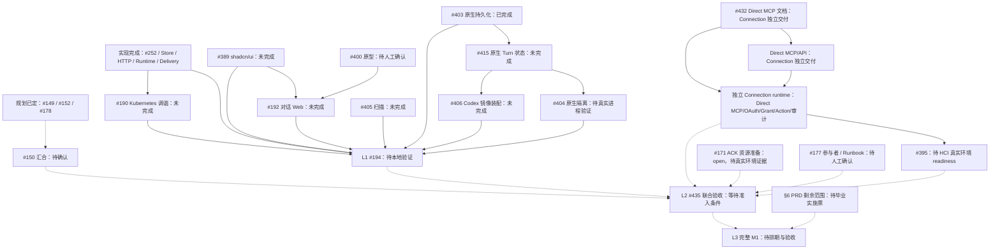

# M1 三层交付与汇合计划

## 1. 状态与权威

本计划承接 [#150](https://github.com/AgoraIO-Extensions/agent-infra/issues/150)，
以 `main` 的 `4e6e1fa` 和 2026-09-07 最终回读的 Issue、原生依赖与
[Project 5](https://github.com/orgs/AgoraIO-Extensions/projects/5) 为核验基线。
状态为**待汇合决策与消费方评审**，不是实现授权、部署许可或 Pilot 通过记录。

产品范围以 [Platform PRD](../prd/PRD-agent-platform-M1.md) 和
[Connection PRD](../prd/PRD-connection-M1.md) 为准；技术边界以
[工程 Spec](SPEC-agent-infra-M1-engineering-architecture.md) 及
[Connection HLD](HLD-connection-M1.md) 为准；交付门禁引用
[开发工作流](SPEC-ai-native-development-workflow.md)。本计划只记录汇合关系，
不复制或降低各 Implementation Issue 的 AC。

GitHub 原生依赖是执行图权威，Issue 的 `Blocked by` 和本图只投影这些边。
下面的虚线表示待确认的验收交接，不能据此自动增加实现依赖或发起执行。
已关闭决策 #152、#178 是规划输入，不阻塞 #150；保留其已完成的原生前置作为历史。

## 2. 三层验收

| 层次 | 唯一验收入口与 Owner | 准入和环境 | 完成证据与可复现条件 |
| --- | --- | --- | --- |
| L1 主系统本地可测 | [#194](https://github.com/AgoraIO-Extensions/agent-infra/issues/194)，@LichKing-2234 | §3 的未完成集合交付；本地 PostgreSQL、kind、正式 Web/API/Worker/RuntimeHost 装配、合成身份和 schema-conformant Fake Connection | #194 的四条完整旅程、准确源码与镜像、执行命令和脱敏 artifact；同时回读 #403 已合入的持久化修复及 #415/#404/#405/#406 的最终版本证据。仅组件测试、healthz 或 Fake Driver 不证明真实 Codex 装配 |
| L2 双系统真实 GitHub 内部 Pilot | [#435](https://github.com/AgoraIO-Extensions/agent-infra/issues/435)；总验收 Owner 由 #150 确认 | L1 通过，Connection readiness、ACK 资源真实验证和环境/参与者准备记录齐备；Platform Worker/Agent 在 ACK，Connection 在具名 LA3 HCI | #435 保存两系统版本、镜像、迁移、配置版本、受控账号/仓库和 `callId`/PR 证据；逐项回读两份 PRD、Connection HLD §§5–13 和 #149，完成真实观察与全部具名签收 |
| L3 完整 M1 上线 | #150 负责毕业 §6 的实施及最终验收票；总验收 Owner 建议 @LichKing-2234，待确认 | L2 通过，完整 PRD 场景全部获得唯一实施票、Owner、上线环境和安全/运维资源窗口 | 最终验收票逐行映射 Platform PRD §14、Connection PRD 的适用要求及工程 Spec §24；每行有版本、自动验证、真实环境验证和人工结论，无失败或未验证硬门禁 |

总验收 Owner 负责收齐证据并记录最终结论，不代签其他角色。
L1 的 Kubernetes 证据还需独立 Workload reviewer，引用
[#194 责任记录](https://github.com/AgoraIO-Extensions/agent-infra/issues/194#issuecomment-5421378243)。
L2 必须分别有 Platform Owner、Connection Owner、Security、SRE 和 Pilot 使用者签收；
技术角色由现有 Issue DRI 承接，Security/SRE/使用者具体人员与窗口仍由 #177/#395 落实。
当前 Connection 实施票 DRI 是 @guoxianzhe，依据
[#156 拆分决议](https://github.com/AgoraIO-Extensions/agent-infra/issues/156#issuecomment-5568126398)；
不能用旧地图中的总负责描述覆盖现有实施 assignee，也不能将同一负责人解释为无限并行容量。

## 3. 当前依赖与最小未完成集合

本计划早期快照中的 `#398 → #186` delegated 依赖已被独立 Direct MCP/API 架构替代。下方保留的旧票、旧 Schema 和旧 Gateway 文字只用于历史迁移审计，不构成当前执行图或实现授权；当前 Connection 权威以 Connection PRD/HLD 及独立运行系统为准。

状态必须分开记录：**规划已定**表示决策完成；**实现完成**表示有 main 合并产物；
**本地验证**和**真实环境验证**分别需要对应版本的可复现证据；
**待人工确认**用于设计、资源、风险接受或验收签收。Issue closed 本身不证明后三项。



`BASE` 是已完成前置的折叠显示，不代表该组每张票都与所有后继相连。
以下表格保留当前执行图的直接原生依赖；#186/#398 的旧 delegated 关系仅保留在历史迁移审计，不是 #194 的当前 gating。完整历史递归图由原生依赖回读，不能从折叠节点推导新边。
协调票 #402 只协调十张 Connection 子票，不作为代码 PR 或联合验收入口。

| Issue | 当前直接原生前置 |
| --- | --- |
| #150 | #152、#178（均 completed） |
| #186 | `not_applicable`：旧 Platform Tool Gateway 由独立 Direct MCP/API 替代 |
| #190 | #181、#188、#189、#256、#257、#275、#276、#277、#278、#285、#286、#287、#288（均 completed） |
| #192 | #251、#253、#321（completed）；#389、#400（open） |
| #194 | #193、#285、#286、#287、#288、#317、#318、#319、#320、#321、#322、#323、#324、#403（completed）；#190、#192、#389、#404、#405、#406（open） |
| #389、#400、#403、#405 | 无 |
| #415 | #403（completed） |
| #404、#406 | #403（completed）；#415（open） |
| #398 | `not_applicable`：旧 delegated contract 已被独立 Connection Direct MCP/API 契约替代，不作为当前实现入口 |
| #399、#396、#390、#391、#392、#394、#397 | `outside_platform_plan`：独立 Connection 系统的历史实施图；不作为 Platform 原生前置，也不能证明当前 Direct MCP/API 已交付 |
| #395 | `external_prerequisite`：仅当独立 Connection runtime 产出绑定发布版本、Schema artifact 来源与校验值的实际 readiness 证据，并由 #435 回读确认后，才满足准入；Issue 状态、历史 HCI 记录和旧依赖图不得单独作为通过依据 |
| #171、#177 | #149（completed） |

### #171 ACK 资源准备边界

[#171](https://github.com/AgoraIO-Extensions/agent-infra/issues/171) 是 open 的资源型 Wayfinder task，
标签为 `wayfinder:task` 和 `wayfinder`（2026-09-07T13:11:28Z 回读）。它只准备 ACK tenancy、
访问入口和 Workload Plane 所需资源，不拥有缺失 Platform/Connection 实现，也不因缺少
Implementation AC 需要再建立文档或实现契约才可继续资源准备。

该分类不构成资源 ready：ACK target 与内部 overlay 尚未确认，真实 API capability、namespace
RBAC、网络隔离、存储、DNS/TLS 和入口证据仍缺失。L2 只消费这些可回读的实际环境证据，
不能以 #171 开放、标签、resource handoff 或本地 kind 结果代替。

### Connection HCI 历史证据与独立系统回读

[#301](https://github.com/AgoraIO-Extensions/agent-infra/issues/301) 保持 open，作为待替代的
历史 HCI 证据，不是已交付的 Connection readiness，也不承接当前联合验收。根据
[#402 的协调验收](https://github.com/AgoraIO-Extensions/agent-infra/issues/402)，旧 HCI Issue、
历史分支、tag 和开放 PR 只能在替代内容合入后关闭；本计划不授权关闭、重启或部署 #301。

[#395](https://github.com/AgoraIO-Extensions/agent-infra/issues/395) 和
[#402](https://github.com/AgoraIO-Extensions/agent-infra/issues/402) 是独立 Connection
系统的历史 readiness/协调入口，不是 Platform primary Implementation Issue、代码 PR 或跨系统
验收入口。线上 Direct MCP/API 的可消费性以独立系统回读为准；不能由这些 Issue 的 open 状态、
Issue #301 的保留状态或历史依赖图推断当前 runtime 是否已交付。

Direct MCP、Connection PAT 和 Connection OAuth Authorization Server 由独立 Connection
系统负责；是否已交付且可供本次 Pilot 使用，以 #435 AC-1 要求的独立系统版本证据和
#395 的实际通过记录为准。本计划只记录其与 Platform 联合验收的边界，不复制 Connection
实现、授权或审计。

L1 消费的 Direct MCP contract 由独立 Connection 系统在 #194 开始前发布版本化、不可变的 HTTP/MCP Schema
artifact，Connection Owner @guoxianzhe 负责版本和兼容说明；#194 的输入证据必须固定该 artifact 的
版本、来源和校验值，其 schema-conformant Fake 只能从该固定 artifact 生成或校验；#435 AC-1
只回读并验证联合验收使用的是同一 artifact，不承担首次固定。该消费约束
不恢复 #398，也不建立 Platform 侧第二套 Connection DTO。

L1 的最小未完成闭包是 **#190、#192、#194、#389、#400、#404、#405、#406、#415**；Connection 独立系统不计入 Platform L1 闭包。
其中 #400 经 #192 间接阻塞 #194，不能只看 #194 的直接依赖而漏掉人工设计确认。
独立回读确认：#186 在 `2026-09-07T13:07:51Z` 已将 #398 同时写入正文和
原生 `blocked_by`；这是当前执行图的已落盘状态，不是本计划提出的候选边。L1 因此也消费
Connection 新契约，但不等待 Connection runtime 或 #402 全部完成。#398 与 #186
保留为历史迁移索引；本计划不重复建票、接管 Connection 或授权旧 Gateway 实现。
组件迁移 #389 与原型 #400 独立推进；#403 已完成持久化修复，#415 是 #404 与 #406 当前未完成的原生前置；#190/#322 不增加 Codex 修正票依赖。
本地验收 #194 复用组件完整矩阵，只新增自身四条整装旅程，不复制 #404 的原生数据隔离矩阵。

当前代码证据包括 [RuntimeHost 正式入口](../../apps/agent-runtime-host/src/index.ts)、
[Worker 装配](../../apps/platform-worker/src/index.ts) 和
[本地 topology 测试](../../tests/local-topology.mjs)。
线上 Connection Direct MCP 入口及其 OAuth metadata 另行证明入口可消费；这些证据不能证明
Platform 与 Connection 的联合 Pilot、正式 Codex 镜像或 ACK/HCI 联合通过。

## 4. 旧 delegated 路线处置

`#398 → #186` 是早期 delegated 执行图，当前标记为 `not_applicable`。独立 Connection 现在通过 Direct MCP/API 提供 OAuth、Consumer/Actor Grant、Catalog、Provider Action、调用、未知结果和审计；Platform 不代理调用、不签发 Connection 授权、不读取 Connection DB。

旧 `ExecutionGrant`、delegated assertion、Platform Tool Gateway、PlatformPolicyFence 和旧 Fake 只保留迁移审计与负向回归用途。不得据此恢复旧 Gateway、issuer、policy fence 或第二套 Connection DTO。

Platform 与 Connection 的真实关联由联合验收入口 `#435` 负责：Platform 绑定自身 Execution、工具操作和 attempt，再从同一次受信 Direct MCP 请求/响应取得 Connection 生成的调用引用。两侧分别授权查询；缺失或无法核实的关联保持未核实。

## 5. 真实 Pilot 的新增门禁

### 5.1 正向执行主体的唯一 Owner 决策

当前权威 PRD 与历史 Pilot 决议的正向执行人数不一致，不能把签收者、观察者或负向身份
重命名为“参与者”来消除差异。产品 PRD 优先于已关闭的 #149 决议和资源票 #177；
在本决策完成前，#177 不能确定 roster、窗口或运行矩阵，L2 不能开始。

| 证据 | 当前文字 | 对 L2 的约束 |
| --- | --- | --- |
| [Platform PRD §9](https://github.com/AgoraIO-Extensions/agent-infra/blob/4e6e1fa456f1712b81d9cc4ac4ad765106ecd811/docs/prd/PRD-agent-platform-M1.md#L262) | 首个受监督 Connection Pilot 仅使用 Codex、两个测试用户、专用 GitHub 测试账号和一个受控 private 仓库 | 正向 Connection 执行只有两个测试用户/账号 |
| [Connection PRD §10](../prd/PRD-connection-M1.md#10-首个-github-pilot-验收) | 两个 LDAP 测试用户分别绑定两个专用 GitHub 账号；唯一成功声明固定为两个 Principal/账号 | 不允许第三个正向 Principal、账号或成功声明 |
| [#149 Resolution 的 Pilot 范围与真实使用观察](https://github.com/AgoraIO-Extensions/agent-infra/issues/149#issuecomment-5420284511) | 3–5 名内部员工；3–5 名参与者持续 5 个工作日，每人至少一次真实 Codex + GitHub PR，总计不少于 10 次任务 | 人数与 PRD 冲突；5 个工作日和不少于 10 次任务本身不冲突 |
| [#177 的 `## Question`](https://github.com/AgoraIO-Extensions/agent-infra/issues/177) | 准备 3–5 名正向参与者，并确认参与者、5 个工作日窗口和不少于 10 次真实任务 | 资源票不能自行扩大 PRD 所限的正向执行主体 |
| [#150 的已确认收口范围与 2026-09-07 汇合审查](https://github.com/AgoraIO-Extensions/agent-infra/issues/150) | 参与人数、工作日观察和任务要求引用 #149 | 该引用不能在未决状态下选择性覆盖两份 PRD |

**唯一决策 Owner：** #150 当前 Owner @LichKing-2234。#177 Owner 只提供 readiness
matrix，@guoxianzhe 只复核 Connection 约束；二者都不以资源准备或实施身份替代产品范围决定。

**待确认的推荐结论：** 首个 Pilot 只有两个正向执行 Principal，分别绑定两个专用
GitHub 测试账号并在同一个受控 private 仓库执行 OAuth、Grant、读取和真实 PR。保留
历史 #149 的连续 5 个工作日和总计不少于 10 次真实任务，两个执行主体可以完成这些任务；
不得将 3–5 名执行用户改称为 reviewer 以制造一致性。Platform、Connection、Security、
SRE 和 Pilot 使用者的签收角色独立于正向执行主体；未授权、禁用、组织变更和管理员等
负向测试身份也独立记录，不能拥有正向 OAuth/Grant/Action 成功证据。此处不指定姓名、
账号、日期或任务分配。

Owner 只能作出下列一项明确选择：

1. **确认推荐结论：** 保持两份 PRD 不变，按下表修改历史决议和资源/汇合投影，再由 #177
   以 readiness matrix 安排资源。
2. **不采用推荐结论：** 先完成两份 PRD 的产品范围修订与评审，再相应修改历史决议和资源/
   汇合投影；在 PRD 修订前不得以部署说明、账号轮换或测试 fixture 扩大正向执行主体。

| 受影响 Issue 段落 | 仅在 Owner 决策后的提议变更 | 不在本 PR 中执行 |
| --- | --- | --- |
| [#149 Resolution：`### Pilot 范围`](https://github.com/AgoraIO-Extensions/agent-infra/issues/149#issuecomment-5420284511) 与 `### 真实使用观察` | 若确认推荐结论，将 3–5 名正向执行员工/参与者修订为两个正向执行 Principal/专用账号；保留 5 个工作日和不少于 10 次任务 | 不改写已关闭决议，不降低观察或任务要求 |
| [#150：`## 已确认的收口范围` 与 `## 2026-09-07 汇合审查`](https://github.com/AgoraIO-Extensions/agent-infra/issues/150) | 记录 Owner 的选择，并使 L2 计划只引用已对齐的执行主体、观察期和任务要求 | 不把本计划提案当作已确认结论或创建执行授权 |

决策、三个 Issue 段落和 #177 readiness matrix 回读一致后，才可启用并执行 §5.2 的联合验收票；#435 已创建但在这些准入条件满足前不得执行或安排参与者与窗口。

资源与运行就绪矩阵由 [#177](https://github.com/AgoraIO-Extensions/agent-infra/issues/177) 持有；
本决策只解决执行主体与观察口径；在推荐结论下，#177 必须增加一项 reconciliation action，将正向参与者数量与两份 PRD 对齐为两个，并在 readiness matrix 中回读该修订；本计划不直接修改 #177，也不确认其身份集成、参与者、窗口、
Registry/Digest、keyring、模型、观测、Runbook 或 Go/No-Go 输入。上述输入须在 #177 以脱敏、
可回读的实际证据完成；未确认项不能作为 Pilot 通过证据。
[#171](https://github.com/AgoraIO-Extensions/agent-infra/issues/171) 继续负责 ACK tenancy、Registry pull
和 Kubernetes Secret 绑定。

执行 Principal、观察参与者（如适用）、未授权/账号禁用/组织变化/用户/Owner/admin 等负向测试身份、
签收和事故响应角色，以及任务、PR、`callId`、Execution 与 Workload 计数必须分别记录；任一类别
不自动满足另一类别。此处不记录姓名、日期、数值 ID、已批准运行值或 Go/No-Go 结论。

### 5.2 唯一联合验收票状态

现有 #194 只负责 Fake，#395 只负责 Connection readiness，#171 只负责 ACK 资源准备；
参与者准备和 Go/No-Go 由 #177 负责。#171 的资源型 Wayfinder 分类不要求新增实现契约，
也不自身证明 ACK 资源已就绪。
[#301](https://github.com/AgoraIO-Extensions/agent-infra/issues/301) 是待替代的历史 HCI 证据，
按 #402 的条件保留至替代内容合入，不承接当前联合验收，也不能被当成已交付。#395 仍 open
其 readiness 通过不再由 Platform 计划中的历史票定义，而由独立 Direct MCP runtime 的版本化证据、Schema 校验和 HCI 记录定义；协调票 #402 只协调 Connection 子票。除 #435 外没有其他票拥有
跨系统真实验收；#435 已创建但仍等待准入条件。
因此 #435 已是唯一的跨系统真实验收 primary Issue：`test(pilot): validate Platform and Connection GitHub convergence`。其启用仍受上文准入条件约束。
归属 #150；建议 DRI @LichKing-2234，Connection reviewer @guoxianzhe。其执行仍等待 §5.1 的范围确认，
不承接旧 #398/#186 的实现。

| 契约章节 | #435 验收正文 |
| --- | --- |
| Problem | Fake 主系统与 Connection-side readiness 不能证明真实双系统授权、写操作、恢复和观察期通过 |
| Scope | 以正式运行装配验证两系统、ACK/HCI 网络与身份映射；执行权威真实矩阵和确认后的观察期；复用组件证据；不实现缺失产品能力、不部署未批准环境 |
| AC-1 | 输入证据全部绑定本次 main commit、两系统镜像、migration、配置版本和具名环境；#194/#395 有对应通过记录，#171 的 ACK 资源实际验证与 #177 的准备记录已回读，错误或缺失输入拒绝开始 |
| AC-2 | Connection PRD §10、HLD §§5–13 的三项 Action、独立 OAuth/Grant、真实 PR、双主体负向、篡改/重放、Grant/ConsumerInstance/Connection/Action/Credential 撤权、未知结果与清理全部有可回读结果；Platform 自身 policy 停止发起任务单独验收，且不作为 Connection 授权输入 |
| AC-3 | #149 的完整申请创建、Owner 配置、真实 Codex、SSE/进程/Pod 恢复及 A/B/C 升级回滚，在本次组合版本通过；不得用预置 Agent、Fake Connection 或不同版本组件报告替代 |
| AC-4 | 经范围确认的参与者完成 #149 规定的观察；每人任务、总任务数、工作日与故障处置有脱敏记录；任一硬门禁失败立即 No-Go，修复后重验受影响组合 |
| AC-5 | 由已授权的验收责任角色回读最终 Go/No-Go 和允许的成功声明；测试 PR/branch/Token 清理由测试资源 Owner 按 HLD 执行，保留 Call/Effect/Dispatch/审计 |
| Validation | 自动矩阵命令、预期结果、真实 GitHub PR/call 关联、环境故障与回滚、观察记录、签收链接和仓库完整验证；所有记录脱敏，不保存 Token、assertion、密码或普通会话正文 |
| Blocked by | #194、#395、#171、#177 的实际通过记录和 #150 的规划决定；不依赖旧 #398/#186，也不依赖 #402 的父票关闭 |

创建 #435 已完成；仅在上述决策确认、票正文和原生边回读一致后，#435 才能启用执行。
规划票 #150 不反向依赖这张实施票，避免“规划等待实施、实施等待规划”的环。
规划、资源和实施条目先按工作流分类；不得把 Wayfinder/资源票冒充 Implementation Issue
接入 AFK Execution Graph。真实验收由人工或受监督 Codex 逐项检查资源与签收准入。

## 6. 完整 M1 尚待安排范围

这些是 PRD 内的未交付范围，不从关闭比例推断日期。每行只有一个规划归属；
尚无完整实施契约的条目由 #150 毕业下列 primary Issue，不能拿 Pilot 票替代。

| 范围与权威 | 当前唯一归属 / 必须提出的 primary Issue | 排期前缺少的输入 |
| --- | --- | --- |
| Claude、OpenCode、Pi 标准模板，均包含模型选择、恢复、隔离和 Connection；Platform PRD §§4、9、14 | #150；按三个真实 Native/ACP/RPC 边界各毕业一票，不重开 Codex #187 | 固定版本、conformance、真实模型资源、Driver DRI 与评审窗口 |
| 平台托管企微及按发送者隔离；Platform PRD §10、§14 | #150；企微 Channel 接入与真实验收票 | 企业应用/回调资源、身份映射、参与者、群聊负向矩阵 |
| 附件、结果文件及历史；Platform PRD §12、§14，已由 #165 明确延后 | #150；文件/对象存储契约决策后毕业端到端文件能力票 | bucket/role、短期 URL、扫描、保留、容量和多用户原生隔离证据 |
| 自定义 Agent、Base Image、自有入口与 Generic ACP 平台入口；Platform PRD §5、§14 | #150；自定义 Agent 准入与入口验收票，消费既有 Registry/Workload 实现 | 可继承 Base Image、真实样例镜像、两种身份入口与升级回滚矩阵 |
| 公司共享 Connection 的真实组织范围；Connection PRD §11 | #150；共享 Connection 范围确认后毕业真实组织授权/管理员验收票 | 真实组织/账号、管理员资格、跨组织负向和授权复核 |
| LDAP 离职状态与正式停权 | [#388](https://github.com/AgoraIO-Extensions/agent-infra/issues/388) 保持唯一调研入口，不作为当前受监督 Pilot 前置 | 权威 active-state、责任人和停权时效；不是“条目仍存在”证明在职 |
| 正式 LDAP TLS/时序、KMS/Secret、唯一受控 egress、容量、HA/PITR、值班与推广；HLD §§5、12、14，工程 Spec §§17、19、21、24 | #150；生产化契约与资源决定后按可独立验收边界毕业加固票，最终 M1 上线验收另有唯一入口 | Security/SRE/DBA、产品 Owner、资源和发布窗口；关闭具名明文 LDAP 例外 |

Bitbucket/Jira/Confluence/Outlook 等按 Connection PRD §11 留待独立产品批次；Direct MCP、
PAT 和 Connection OAuth Server 已属于当前独立系统边界，不自动变成本次完整 M1 的新增必交 Provider。
Platform PRD §15 的 Eval、Skill Hub、统一 Sandbox、多 Agent、删除、API/Webhook/定时任务
和主动通知仍在 Roadmap，不纳入上述 M1 票。

## 7. 估期与 Project 维护

当前没有逐票剩余工作量、DRI 可用人日、消费方评审时段、真实模型/ACK/HCI 资源日期、
设计确认时间、Security/SRE 签收人员及连续观察窗口。因此 L1/L2/L3 的 Target 均为**待估**。
尤其 #404 失败可能触发隔离架构决策，#405 首次真实扫描可能触发独立漏洞修复；
这两项未知成本不能被假定为零。

| 工作包 | DRI / 现有入口 | 估期所需输入 |
| --- | --- | --- |
| L1 五条流和六项修正及新契约 | @LichKing-2234 负责 Platform 票 | 各票剩余实施/测试量与实际并发能力；#400 人工设计、#415 后 #404/#406、#405 报告与修复分支 |
| Connection readiness | 独立 Connection 系统 Owner | 只回读独立系统的发布版本、HCI readiness 和授权/审计证据，不在 Platform 计划中估算或拆票 |
| 跨系统资源与验收 | #171/#177 的 @LichKing-2234；#395 的 @guoxianzhe | ACK/HCI 联通、身份映射、专用账号、模型配额、五方可用时间和 §5.1 决定 |
| 完整 M1 剩余交付 | #150；#388 当前未分配 | §6 逐项形成完整 primary Issue、DRI、上线验证资源后才排期 |

估期使用剩余工作和原生关键路径：L1 从各必需分支的完成窗口取最晚值，再加整装验收；
L2 从 L1、Connection readiness、资源和合约确认的完成窗口取最晚值，
再安排真实矩阵及 #149 的 5 个工作日观察；L3 从全部必交能力与生产化门禁的完成窗口取最晚值。
共享 DRI 的任务必须按其实际容量排队，人工评审和失败修复单独计入。

本次回读发现 #171/#177 仍是 Todo 却投影为 08-31 至 09-04，
历史调谐/Gateway #186/#190 记录为 10-09 至 10-22，#192 为 09-25 至 10-08，#194 为 10-23 至 11-05，
规划票 #150 为 09-28 至 10-02。这些日期没有新的工作量或窗口依据，已清除未发生的 Start 和 Target。
本次 #150 记录实际规划开始日 2026-09-07，Status 为 In Progress，Target 留空；其他票只按真实活动更新
Status，不能因原生无 blocker、assignee 已有或父票关闭而标记 In Progress/Done。

Platform 现有票保留 `M1 - Agent Platform Pilot` milestone；#402 及其未完成 Connection 子票
已归入现有 `M1 - Connection` milestone，避免漏出 Roadmap。
两个 milestone 的既有 09-25/11-05 due date 已清除，原估期保留在 description 中，明确完成日期待估。
上级地图 #144 保留实际开始日和 In Progress，只清除无新依据的 Target；已完成子票保持历史状态。
不为完整 M1 虚构第三个日期，也不批量改写已完成票的历史日期或状态。

## 8. 收口与回读

规划票 #150 只有在以下事项全部记录后才可关闭，文档 PR 合入本身不替代这些条件：

- §4 的历史迁移处置已被评审；不得恢复 #186 Gateway、#398 delegated contract 或建立竞争性实现票。
- §5.1 的产品范围差异完成权威文档评审，L2/L3 总验收 Owner 与必要签收责任得到确认。
- 唯一联合验收票有完整正文、稳定 AC、原生 dependencies 和 milestone；完整 M1 待毕业范围有唯一归属及待估原因。
- 对应开放票的 Status、Start/Target、Milestone 按证据投影；真实日期缺少依据时为空。
- 再次读取 #150、涉及票正文、原生边和 Project；检查投影一致、无漏票、无重复交付、无环、无虚假完成。

本轮已回读 §7 的 Project 日期、Status 和 milestone 更新；本 PR 未修改原生依赖。
最终快照已吸收并发新增的 #398 -> #186 历史边，以及 #403 已完成、#415 为 #404/#406 当前原生前置的状态；Platform L1 闭包只保留本系统未完成票，Connection 由独立系统和 #435 负责真实关联验收。
执行图尚未最终收口的原因是 §4/§5 的待决项，不能将这些投影修正记为完整规划通过。

可复现回读入口：

```bash
gh issue view 150 --repo AgoraIO-Extensions/agent-infra --comments
gh api graphql -f query='query { repository(owner:"AgoraIO-Extensions",name:"agent-infra") { issue(number:194) { number state blockedBy(first:100) { totalCount nodes { number state } } } } }'
gh project item-list 5 --owner AgoraIO-Extensions --limit 500 --format json
gh api repos/AgoraIO-Extensions/agent-infra/milestones --paginate
```

Issue 和 Project 使用活动记录作为证据入口；本文件是该时间点的审查快照，
后续按原生依赖更新投影，不能作为第二套调度权威。
