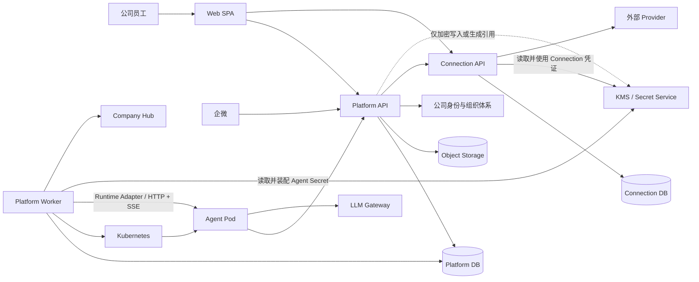
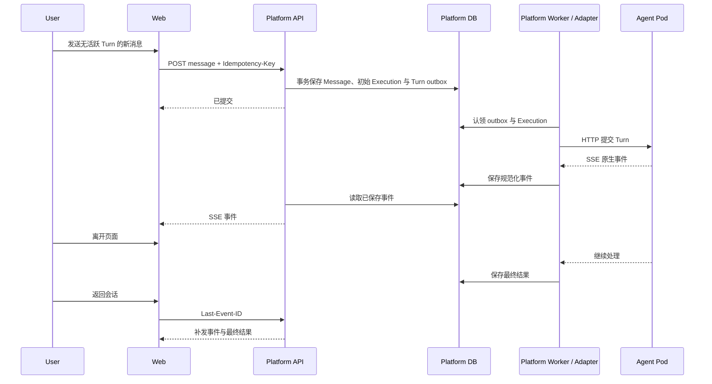
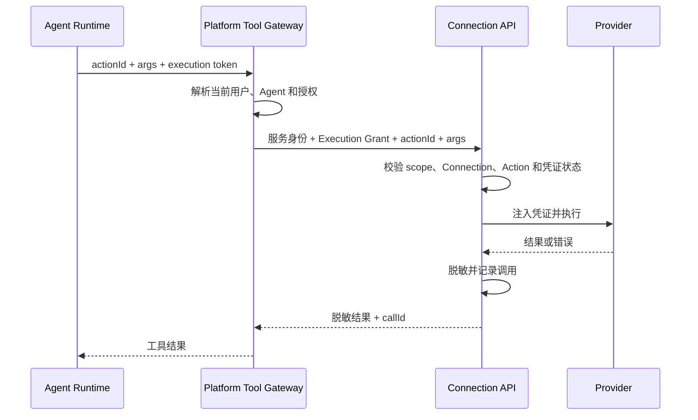

# agent-infra M1 工程架构 Spec

| 项目 | 内容 |
| --- | --- |
| 状态 | Draft for Review |
| 版本 | v0.1 |
| 日期 | 2026-07-30 |
| 适用范围 | Agent 平台 M1、Connection M1 |
| 关联 PRD | [企业级 Agent 平台 M1 产品需求](../prd/PRD-agent-platform-M1.md)、[Connection M1 产品需求](../prd/PRD-connection-M1.md) |

## 1. 文档目的

本文定义 agent-infra M1 的工程实现基线，供前端、后端、运维和安全相关成员评审。它回答以下问题：

1. M1 由哪些部署单元和工程模块组成。
2. Web、平台后端、Agent 运行时和 Connection 如何分工。
3. 用户身份、Agent 权限、Connection 授权和外部凭证如何传递与隔离。
4. 长任务、流式回复、Pod 生命周期和失败恢复如何落地。
5. 前后端分别交付什么，以及如何进行测试和上线验收。

本文不改变 PRD 的产品范围。Roadmap 中的 Eval、Skill Hub、平台级 Sandbox、多 Agent 协作、知识能力、Agent 删除、API/Webhook/定时任务和主动通知不进入 M1 实现。

## 2. 架构结论

M1 采用全 TypeScript 单仓库，使用 Better-T-Stack 初始化基础工程。Better-T-Stack 只负责生成工程骨架，不作为运行时依赖，也不决定领域模块的接口。

### 2.1 技术栈

| 层次 | 选型 | M1 用法 |
| --- | --- | --- |
| 语言 | TypeScript 6 | Web、平台后端、调谐进程、Connection 统一使用 |
| Web | React 19 + TanStack Router + Vite | 登录后的内部 SPA，不使用 SSR |
| Web 数据 | TanStack Query | 管理服务端状态、缓存和请求失效 |
| UI | Tailwind CSS + shadcn/ui | 构建平台工作台、表单、对话和管理页面 |
| HTTP | Hono + Node.js 24 LTS | 平台和 Connection 的 HTTP 接入层 |
| 契约 | Zod + OpenAPI 3.1 | 请求校验、接口文档和 TypeScript 客户端生成 |
| 流式协议 | Server-Sent Events | 对话增量、处理状态和执行详情推送 |
| 数据库 | PostgreSQL + Drizzle | 权威业务数据、事务、迁移和 outbox |
| 文件 | 公司现有 S3 兼容对象存储 | 附件、结果文件和大体积中间结果 |
| Kubernetes | `@kubernetes/client-node` | Agent Workload、Service 和访问入口调谐 |
| 工程 | pnpm workspace + Turborepo | 多应用构建、测试和缓存 |
| 质量 | Biome、Vitest、Playwright | 静态检查、模块测试和端到端测试 |
| 可观测性 | OpenTelemetry + Pino | Trace、Metric 和结构化日志 |
| 部署 | Docker + Helm + Kubernetes | 所有平台部署单元进入公司集群 |

初始化依赖以固定版本 Better-T-Stack 的生成结果为基线，并写入 lockfile。Node.js 使用公司支持的 LTS 版本；Kubernetes JavaScript Client 与目标集群版本配套，不使用浮动 `latest`。

### 2.2 Better-T-Stack 初始化基线

初始化参数固定为：

```text
frontend: tanstack-router
backend: hono
runtime: node
database: postgres
orm: drizzle
auth: none
api: none
package-manager: pnpm
addons: turborepo, biome
web-deploy: docker
server-deploy: docker
```

选择 `auth=none` 是因为公司账户和组织体系是唯一身份来源。选择 `api=none` 是为了避免同时维护 tRPC/oRPC 与 OpenAPI 两套契约；M1 的浏览器接口、内部接口和 Agent Runtime Contract 统一以 HTTP/OpenAPI 为主，SSE 事件单独定义 Schema。

脚手架版本固定为 `create-better-t-stack@3.38.1`。生成依赖作为项目初始化基线；生成后代码归本项目维护，不通过重复运行脚手架升级项目，也不在初始化过程中主动升级生成依赖。

## 3. 架构原则

1. **产品状态与集群状态分离。** PostgreSQL 保存 Agent 期望状态，Kubernetes 保存实际运行状态，调谐进程负责持续收敛。
2. **平台与 Connection 各自保持权威数据。** Agent、权限和用户授权属于平台；Provider、外部账号、凭证和 Action 调用属于 Connection。
3. **凭证不进入 Agent。** Agent 只能提交 Action 和参数，不能读取外部 Access Token、Refresh Token 或 API Key。
4. **先持久化再异步处理。** 消息、审批、生命周期命令和 Action 调用先获得稳定 ID 与状态，再触发后续处理。
5. **接口也是测试面。** Hono、Drizzle、Kubernetes Client 和 OpenConnector 都位于 Adapter 层，领域模块不依赖这些实现。
6. **M1 不预建扩展基础设施。** PostgreSQL 足以支持当前事务、outbox、任务认领和事件回放；不预先引入 Redis、Kafka、NATS 或 Temporal。
7. **用户隔离由服务端决定。** 浏览器、Agent 和模型传入的用户 ID、Connection ID 或组织信息不能成为授权依据。

## 4. 系统结构



### 4.1 部署单元

| 部署单元 | 职责 | 是否保存权威状态 |
| --- | --- | --- |
| `web` | Agent 列表、配置、审批、对话和 Connection 页面 | 否 |
| `platform-api` | 身份入口、Agent 管理、权限、消息、命令与 outbox 持久化、浏览器 SSE、企微回调、Agent Tool Gateway | 否 |
| `platform-worker` | Agent Workload 调谐、模板升级、outbox 认领、Runtime Adapter 和消息投递 | 否 |
| `connection-api` | Provider/Action、OAuth、凭证、Connection 授权校验、Action 执行和调用审计 | 否 |
| `agent pod` | Codex、Claude、OpenCode、Pi 或自定义 Agent 的实际运行环境 | 仅保存 Agent 自有运行数据 |
| `platform database` | Agent、Owner、范围、审批、配置、会话、执行事件、授权关系和平台审计 | 是 |
| `connection database` | Provider、Action、外部账号、加密凭证、OAuth 状态和调用审计 | 是 |

`platform-api` 与 `platform-worker` 使用同一平台领域模块，但以不同进程部署。Connection 使用独立数据库和数据库账号；两个数据库可以位于同一 PostgreSQL 集群，但不能跨库直接读写。

### 4.2 不拆分的部署单元

M1 不单独部署审批、企微、审计、附件或模型配置微服务。这些能力作为平台领域模块存在，由 `platform-api` 或 `platform-worker` 调用。只有独立的安全职责、扩容方式或故障范围出现后，才新增部署单元。

## 5. 单仓库结构

```text
agent-infra/
  apps/
    web/                     React SPA
    platform-api/            Hono HTTP、SSE、企微和 Tool Gateway
    platform-worker/         调谐、outbox、Runtime Adapter 和投递
    connection-api/          Connection HTTP 与 Action 执行
  packages/
    platform-core/           Agent 平台领域规则与用例
    connection-core/         Connection 领域规则与用例
    contracts/               OpenAPI、Zod Schema、SSE 事件 Schema
    platform-store/          Platform DB 的 Drizzle Adapter
    connection-store/        Connection DB 的 Drizzle Adapter
    identity/                公司账户与组织体系 Adapter
    agent-runtime/           固定 Runtime Adapter、平台 Conversation Contract
    kubernetes-runtime/      Kubernetes 调谐 Adapter
    observability/           Trace、Metric、日志和关联 ID
    test-support/            Fake Adapter、fixture 和契约测试工具
  migrations/
    platform/
    connection/
  deploy/
    helm/
    environments/
  tests/
    contract/
    integration/
    e2e/
    load/
  docs/
    prd/
      PRD-agent-platform-M1.md
      PRD-connection-M1.md
    architecture/
      SPEC-agent-infra-M1-engineering-architecture.md
      HLD-agent-runtime-M1.md
  AGENTS.md
  README.md
```

`apps/*` 只负责进程启动、依赖装配和协议接入。领域规则不能直接写在 Hono 路由、React 页面或 Drizzle 查询中。`packages` 不设置无边界的 `shared-utils`；只有被多个明确调用方复用且接口稳定的能力才进入公共 package。

## 6. 工程模块

### 6.1 平台模块

| 模块 | 负责 | 不负责 |
| --- | --- | --- |
| Agent Lifecycle | 申请、审批、撤回、停止、重启、停用、期望版本和状态迁移 | 直接操作 Kubernetes |
| Agent Access | Owner、共同 Owner、员工与组织范围、账号禁用后的权限判断 | 保存公司用户目录 |
| Agent Configuration | 模板、自定义镜像、交互模式、env/Secret、模型、渠道和 Action 选择 | 模型路由和 Provider 凭证 |
| Conversation | 会话、消息、回答版本、附件引用、执行事件和历史查询 | Agent 内部思考原文 |
| Agent Dispatch | 持久化消息投递、幂等、繁忙反馈、取消和补充指令 | Agent 自身的任务调度算法 |
| Channel | Web、企微机器人和企微应用的身份、会话与附件映射 | Runtime 原生 Session 和协议语义 |
| Platform Audit | 管理操作、使用记录和跨系统关联 ID | Connection 的调用细节 |

### 6.2 Connection 模块

| 模块 | 负责 | 不负责 |
| --- | --- | --- |
| Provider Catalog | Provider、Action、版本、参数和外部权限说明 | Agent 是否选择该 Action |
| Connection Account | 个人/共享 Connection、外部账号识别、OAuth 和凭证刷新 | Agent 可用范围 |
| Agent Grant | 校验 Agent、Connection 和已确认 Action 的交集 | 允许 Agent 自行选择用户或账号 |
| Action Execution | 注入凭证、调用 Provider、脱敏结果、幂等与错误映射 | 向 Agent 返回原始凭证 |
| Connection Audit | 连接、授权、Action 调用和结果审计 | 保存平台会话正文 |

### 6.3 Adapter 接口

以下位置必须形成明确接口，并至少提供生产 Adapter 和测试 Fake：

- 公司身份与组织目录。
- Company Hub 镜像解析。
- Kubernetes Agent Runtime。
- 对象存储。
- KMS/Secret Service。
- Codex Native、Claude Native、Generic ACP 和 Pi RPC Runtime。
- 企微机器人与企微应用。
- OpenConnector Provider/Action 执行。

领域模块只接收业务 ID、命令和结果，不接收 Hono Context、数据库连接、Kubernetes 对象或 Provider Token。

## 7. Web 架构

### 7.1 页面模块

Web 按产品入口划分路由：

- `/agents`：Agent 列表与详情。
- `/chat/:agentId/:conversationId?`：对话与历史。
- `/my-agents`：申请和 Owner 管理。
- `/my-agents/:agentId/settings`：范围、模型、渠道和 Action 配置。
- `/connections`：个人 Connection。
- `/connections/grants`：Agent 授权。
- `/connections/calls`：个人调用记录。
- `/admin/approvals`：系统管理员审批。
- `/admin/connections`：Provider、Action 和共享 Connection。
- `/admin/audit`：平台与 Connection 审计入口。

Connection 在产品上是独立系统，但 M1 复用同一 Web Shell 和公司登录态。页面分别调用 `platform-api` 和 `connection-api`，不能通过前端把两个系统的数据拼成新的授权结论。

个人 Connection、OAuth 和调用记录写入 `connection-api`；Agent 授权、Action 确认和撤销写入 `platform-api`。即使这些操作位于同一个 Connection 页面模块，前端也必须按权威系统调用对应接口。

### 7.2 状态管理

- TanStack Query 管理列表、详情、配置和审批等服务端状态。
- 路由参数和 URL Search Params 保存可分享的页面筛选状态，但 M1 不提供会话分享。
- 对话时间线使用独立 reducer 合并持久化消息、SSE 增量和重连补发事件。
- 表单使用 Schema 校验；服务端重复执行同一校验，不能信任浏览器结果。
- 不预装全局状态库。只有出现跨路由、非服务端且难以由 React Context 管理的状态后再引入。

### 7.3 前端安全职责

前端只负责隐藏无权限入口和展示明确错误，不负责最终授权。普通用户不能获得模型 API Key、Connection 原始凭证、内部 Kubernetes 状态或其他用户的资源标识。

## 8. HTTP 与事件契约

### 8.1 浏览器接口

- 管理和查询使用 `/api/v1/*` HTTP/JSON。
- 创建、更新和命令类请求支持 `Idempotency-Key`。
- OpenAPI 3.1 是浏览器接口的规范来源。
- TypeScript 客户端由 OpenAPI 生成，禁止手写重复的请求/响应类型。
- 文件使用预签名上传/下载；业务接口只传文件引用和元数据。

### 8.2 SSE

对话回复和状态流使用 `text/event-stream`：

- 每个事件包含稳定 `eventId`、`executionId`、Execution 内递增 `sequence`、Conversation 内严格递增 `conversationCursor`、`type`、`occurredAt` 和类型化 payload。
- 浏览器通过 `Last-Event-ID` 或显式游标重连；服务端验证游标属于当前有权访问的 Conversation。
- 服务端先保存事件，再向在线连接推送；断线后按持久化序列补发。
- 心跳只用于保持连接，不进入业务时间线。
- 同一事件可能被重复投递，前端按 `eventId` 去重。

M1 不使用 WebSocket。用户发送消息、停止回复和补充指令都通过普通 HTTP 命令完成；只有出现必须由同一连接双向交换低延迟事件的需求后才重新评估。

### 8.3 内部接口

平台到 Connection、`platform-worker` 到 Agent Pod 均使用版本化 HTTP 契约；Runtime 增量事件使用内部 SSE。内部接口通过服务身份和 mTLS 或公司现有等价机制认证，不因位于集群内而跳过鉴权。

M1 不引入 tRPC/oRPC/ConnectRPC。这样可以让自定义 Agent、未来其他语言客户端和测试工具共同使用同一份契约。

## 9. 身份与权限

### 9.1 Web 登录

- `platform-api` 接入公司 OIDC 或现有身份网关。
- `connection-api` 验证同一公司会话或由身份网关签发的等价服务端身份，不能接受前端自行传入用户 ID。
- Web 使用 HttpOnly、Secure、SameSite Cookie，不在 Local Storage 保存公司 Access Token。
- 服务端根据公司稳定用户 ID 解析当前账号和组织关系。
- 账号禁用与组织成员变化在每次敏感操作前重新校验，短期缓存不能成为权限来源。

### 9.2 权限顺序

每次 Agent 使用按以下顺序判断：

1. 公司账号仍然有效。
2. 用户属于 Agent 当前可用范围，或是当前有效 Owner。
3. 当前渠道已绑定并支持目标操作。
4. 模型选项属于标准模板 Owner 当前允许清单，或属于 `platform-adapter` 自定义 Runtime 通过 ACP 返回的当前选项集合。
5. 若调用 Connection，Action 属于 Owner 当前选择范围。
6. 用户对目标 Connection 的授权仍有效，且已确认该 Action。

任何一步失败都停止后续处理，并返回可理解的产品错误。错误不能暴露其他用户、Agent 或 Connection 是否存在。

### 9.3 服务端授权上下文

平台在每个 Turn 或补充指令实际投递前重新解析授权，并生成新的短期、不可篡改的 Execution Grant，绑定：

- 当前执行。
- 当前 Agent。
- 当前公司用户。
- 当前渠道。
- 当前 Conversation 与 Turn。
- 当前允许的 Action 集合版本。

补充指令 Grant 的范围取原 Execution 授权边界与当前授权的交集，不能扩大原用户、Agent、Conversation、渠道或 Action 范围。

Agent 调用 Tool Gateway 时只提交 Action 和参数。平台根据执行记录解析 Connection，随后由平台服务端调用 Connection。Agent 不能提交或覆盖用户 ID、组织 ID、Connection ID 或外部账号。

## 10. Agent Workload 与调谐

### 10.1 Workload 形态

- 一个 Agent 对应一个副本为 0 或 1 的 StatefulSet。
- 运行时为“可用”时副本为 1；已停止或已停用时副本为 0。
- 每个 Agent 使用独立 Service、ServiceAccount 和持久卷。
- ServiceAccount 默认没有 Kubernetes API 权限。
- Agent Service 只提供集群内部地址，Pod 或 Service 地址不作为用户入口。StatefulSet、Service、Ingress 和 NetworkPolicy 只由 `platform-worker` 调谐，Agent 与 Owner 都不能直接创建或修改这些资源。
- 平台配置、对话和 Connection 授权不保存在 Pod 本地。
- Agent 自有记忆或工作区通过独立持久卷保存，并由模板或自定义 Agent 负责用户隔离。

Owner 不能修改 CPU、内存、副本数和存储规格。资源规格由平台按 Agent 类型选择预设 Profile，并在审批页展示。

### 10.2 期望状态

Platform DB 保存：

- 管理状态与期望运行状态。
- 模板或自定义镜像的不可变 Digest。
- 配置修订号。
- 资源 Profile。
- 交互模式、渠道和 Runtime 能力声明。
- 普通 env 与加密 Secret 引用。

`platform-worker` 通过幂等调谐完成：

1. 读取待处理修订号。
2. 从 Company Hub 校验 Digest 和访问权限。
3. 生成或更新 StatefulSet、Service、PVC 和访问入口。
4. 根据探针和 Workload 状态计算产品服务可用性。
5. 写回已应用修订号、可用性和脱敏失败原因。

HTTP 请求只提交期望状态，不等待 Kubernetes 操作完成。

Platform DB 中的 outbox 和工作项只是保证状态变更可恢复的内部实现，不向用户提供统一任务队列、优先级或排队管理能力。

### 10.3 并发与 Leader

- 多个 `platform-worker` 实例可以同时运行。
- 同一 Agent 的调谐通过 PostgreSQL 行锁或 advisory lock 串行化。
- 每次 apply 携带配置修订号，旧任务不能覆盖新状态。
- Kubernetes 资源使用稳定 label 和 annotation 关联 Agent ID 与修订号。
- M1 不创建 CRD；Platform DB 是产品期望状态的唯一来源。

### 10.4 模板与自定义镜像升级

- 标准模板目录保存当前镜像 Digest。模板更新后，所有关联 Agent 进入新修订并自动调谐。
- 自定义 Agent 创建时把 Tag 解析为 Digest；只有 Owner 主动选择新镜像时更新 Digest。
- 同名 Tag 指向新 Digest 时可以通知 Owner，但不能改变已有自定义 Agent 的期望 Digest。
- 自定义 Agent 的新 Digest 先进入候选修订。平台重新读取并校验 Manifest；M1 不支持在升级中切换 `interactionMode`，Schema、Service 或健康检查字段无效，或模式与当前 Agent 不一致时不更新 Workload。有效的新 Service 和健康检查配置进入候选 Workload。
- Manifest 预检通过后，`platform-worker` 应用候选 Workload 并验证健康检查；`platform-adapter` 还必须重新执行 ACP 核心探测。候选 Workload 在验证完成前不加入用户路由或原渠道；无法与旧修订隔离运行时，先关闭用户路由再应用候选 Workload。全部通过后才原子提升候选 Digest、切换路由并确认渠道绑定；失败时把旧 Digest 和 Workload 配置写成新的期望修订并重新调谐，保持或恢复旧路由，保留原渠道绑定和平台历史。
- 标准模板升级失败时，平台把旧 Digest 和 Workload 配置写成新的期望修订，再由 `platform-worker` 通过 Kubernetes API 重新调谐；不能把 Kubernetes 当前状态当作回滚来源。
- 升级和回滚复用原 PVC，保留 Platform DB 中的配置、渠道和会话数据。M1 不自动创建 PVC 快照，也不承诺 Runtime 自有数据兼容旧版本。
- 升级期间产品显示“更新中”；旧修订也无法恢复时才显示 Agent 级“暂时不可用”。任何阶段都不能接受后静默丢弃消息。

### 10.5 自定义 Agent Runtime Manifest

自定义镜像通过 OCI Image Label 提供最小 Runtime Manifest。平台只读取以下稳定边界：

- Manifest Schema 版本。
- 交互模式：`self-managed` 或 `platform-adapter`。
- `platform-adapter` 使用的协议；M1 只允许 ACP。
- Service 端口和健康检查路径。
- 仅 `platform-adapter` 读取模型、附件、结果文件、Connection 和补充指令 capability；缺失的 capability 按不支持处理。`self-managed` 的声明忽略，不能据此开放 Platform Conversation、Connection 或 Tool Gateway 能力。

`self-managed` 自己提供人机交互入口、协议、Session、事件和历史，不进入平台 Conversation Contract。`platform-adapter` 使用平台 Web 或平台托管渠道，并在 Workload 启动后执行 Generic ACP 核心探测。

审批通过后的创建流程先校验 Manifest Schema、交互模式与 Owner 申请选择的一致性，再启动 Workload 并验证健康检查；`platform-adapter` 在健康检查通过后执行 ACP 核心探测。Manifest 缺失、不受支持或与申请不一致时不启动 Workload；Manifest、健康检查或 ACP 核心探测任一步失败，产品状态均为“创建失败”。启动 Workload 后失败时，`platform-worker` 必须先关闭访问路由，再幂等清理本次创建的 Kubernetes Workload、访问资源、配置、Secret 和尚未进入“可用”的新 PVC；Platform DB 中的申请、Agent 配置、失败原因和审计保留，重试时重新创建运行资源。升级必须对候选 Digest 重新执行同一组 Manifest、健康检查和 ACP 验证，并保持当前交互模式；失败处理见 10.4。

标准 Base Image 可以提供生成 Manifest 的构建辅助，但不赋予能力或准入资格。Owner 不填写协议、端口或探针；平台校验 Manifest、Owner 申请选择和实际探测结果，不检查源码。字段和验证规则见 [Agent Runtime M1 HLD](HLD-agent-runtime-M1.md)。

### 10.6 环境变量与 Secret

- 固定 Runtime Registry 为每个标准模板声明 Owner 可配置的 env/Secret 键。`platform-api` 在保存前拒绝该模板未声明的键，`platform-worker` 只装配已声明的键。
- Registry 不得向 Owner 开放代理设置、进程加载器或 Runtime 启动选项等能够改变标准模板受信运行边界的键。
- 自定义镜像接受 Owner 配置的任意 env/Secret K/V，但不能使用平台保留前缀。
- `AGENT_INFRA_*` 由平台保留并按执行环境注入；标准模板或自定义镜像的 Owner 输入使用该前缀时均在保存前拒绝。
- 普通 env 保存于 Platform DB。Secret 通过 KMS 加密保存，读取接口只返回“已设置”，不能返回明文。
- `platform-worker` 将配置装配为 Agent 专属 Kubernetes 配置和 Secret；值不进入 annotation、日志、错误或模型上下文。

### 10.7 标准模板模型配置

- `platform-api` 校验 Owner 选择的 LLM Gateway Base URL、模型和推理强度，并通过 KMS 加密 API Key。
- `platform-worker` 装配标准模板运行配置时，以平台模型配置为最终值；同名的 Owner env 或 Secret 不能覆盖 Base URL、API Key、模型和推理强度。
- `platform-worker` 把标准模板当前需要的密钥作为 Agent 专属 Kubernetes Secret 挂载到 Pod，不写入 Workload annotation、日志或模型上下文。
- Owner 替换密钥或模型配置后产生新配置修订，由调谐器安全更新 Agent。
- 自定义 Agent 的模型配置属于镜像内部；通过 ACP 探测到模型选择能力时，平台入口读取 Runtime 当前提供的选项和默认项并转发使用者选择，不配置或读取其 Base URL 与凭证。提交 Turn 前必须确认选项仍有效，不能在选项失效时静默改用其他模型。

## 11. Agent Runtime 边界

### 11.1 Platform Conversation Contract

Web 和平台托管渠道只面对统一 Platform Conversation Contract。该 Contract 定义创建或恢复 Runtime Session、为新消息或重新生成提交一个 Turn、停止 Turn、查询状态、接收规范化事件和读取 capability，不暴露 ACP、Pi RPC、stdio 或其他 Runtime 原生消息。

四个标准模板实现完整 Contract。使用平台交互入口的自定义 Agent 通过 Generic ACP Adapter 实现 Contract；使用自有交互入口的自定义 Agent 不进入该 Contract。

### 11.2 固定 Runtime Registry

| 标准模板 | Platform Adapter | 补充指令 capability |
| --- | --- | --- |
| Codex | Codex Native | Registry 显式布尔值且 Conformance 通过 |
| Claude | Claude Native | Registry 显式布尔值且 Conformance 通过 |
| OpenCode | Generic ACP | Registry 显式布尔值且 Conformance 通过 |
| Pi | Pi RPC | Registry 显式布尔值且 Conformance 通过 |

Adapter 由 `platform-worker` 运行，并通过 Agent Service 的内部 HTTP/SSE 调用 Pod。Generic ACP 是 M1 唯一的自定义平台入口扩展点；未知协议只能使用 `self-managed`，平台不动态发现或加载 Adapter。

每个标准模板的 Registry 条目必须显式保存 `supplementaryInstruction`；缺失时为 `false`，只有对应 Adapter 通过持久幂等 Conformance 后才能启用。`platform-adapter` 自定义 Agent 的有效值取 Manifest 声明与实际探测结果的交集；缺失、声明为 `false`、探测失败或不能保证 `messageId` 持久去重时均按不支持处理，并在活跃 Turn 上返回繁忙，不使 Agent 创建失败。

### 11.3 数据与生命周期边界

Platform DB 是 Conversation、Message、Execution 和规范化事件的权威来源。Runtime Session ID 及原生事件细节只在 Adapter 内部使用，不能成为浏览器、渠道或 Agent 请求中的身份与授权依据。

Session/Turn/Event 映射、并发、幂等、SSE 补发和 Pod 重启恢复的完整契约见 [Agent Runtime M1 HLD](HLD-agent-runtime-M1.md)，本文不重复定义协议字段。

## 12. 对话与长任务

### 12.1 数据流



上图描述没有活跃 Turn 的普通消息路径。补充指令、重新生成、停止命令和繁忙拒绝按 12.2 的独立事务分支处理。

### 12.2 可靠性规则

- `platform-api` 在同一 Conversation 数据库锁内完成活跃 Execution 查询、普通消息/补充指令/重新生成/繁忙分支判定和对应写入，提交事务后才释放锁；stop 命令复用同一把锁。两个并发请求不能都根据“无活跃 Execution”的旧快照创建 Execution。
- 消息写入数据库成功后才向用户显示“已提交”。
- 已持久化的消息在后续投递失败时不会删除；状态变为繁忙、投递失败或暂时不可用，并提供重试或重新发送入口。
- 没有活跃 Turn 时，平台在同一事务中创建 Message、初始 Execution 和 Turn outbox；相同消息重试使用同一幂等键，不能重复创建初始 Execution。
- 初始 Execution 与 Turn outbox 的事务提交后即视为活跃，包含 Turn 尚未投递、Runtime 是否接受暂时不确定和 Runtime 正在执行的阶段，直到 Execution 进入成功、失败或取消等终态。同一 Conversation 同时只有一个活跃 Turn，不同 Conversation 可以并行处理。
- 活跃 Turn 存在时，只有与当前 Execution 相同 `actorId` 的新消息可以按 capability 作为补充指令。平台在同一事务中创建 Message 和绑定当前 Execution 的补充指令 outbox，不创建新的 Execution 或 Turn；Adapter 以 `messageId` 幂等提交补充指令。
- Adapter 只有在原生协议提供持久幂等结果，或 Pod 内 Agent Service、Runtime Host 或 Bridge 能按 `messageId` 持久去重并恢复原提交结果时，才能声明补充指令 capability。Worker 或 Pod 重启后的重复请求必须返回原结果，不能再次追加；无法满足该条件的 Runtime 不开放补充指令。
- 补充指令 outbox 只有在绑定 Execution 的初始 Turn 已被 Runtime 明确接受后才能投递；初始 Turn 尚未投递或接受结果不确定时保持待处理。同一 Execution 的补充指令按 outbox 创建顺序串行投递，不能抢在初始 Turn 前调用 Runtime。若初始 Execution 在 Runtime 明确接受前进入失败或取消终态，`platform-worker` 必须在同一 Conversation 锁内将其全部待处理补充指令 outbox 置为失败终态，并将对应 Message 标记为“投递失败：原回复未开始”；不得继续重试、创建新 Execution 或改绑其他 Execution。
- `platform-worker` 认领补充指令 outbox 时，必须先从服务端权威数据重解析该 `actorId` 的当前公司账号、组织、Agent、Conversation、渠道绑定和 Agent 可用范围，再在 Conversation 锁内重验绑定 Execution。权限已失效时，把 outbox 置为失败终态、将 Message 标记为“投递失败：权限已失效”，且不调用 Adapter；Execution 已终止时，同样结束 outbox 并将 Message 标记为“投递失败：原回复已结束”。只有权限仍有效且 Execution 仍活跃时，平台才签发范围为原 Execution 边界与当前授权交集的新短期 Grant，并按 `messageId` 提交；Adapter 也必须拒绝向已经终止的原生 Turn 追加指令。失败后不能自动重试、创建 Execution/Turn 或改绑其他 Execution。用户重新发送时使用新的幂等键，重新执行消息准入分支。
- 同一发送者不支持补充指令或不同 `actorId` 提交消息时，平台必须明确返回繁忙且不创建 Message、Execution 或 outbox；不能附加到当前 Turn 或复用其 Execution Grant。普通消息、补充指令、重新生成和繁忙拒绝的分支判定与写入必须原子完成。
- 停止命令不创建 Message 或新 Execution。`platform-api` 必须在 Conversation 锁内校验发送者 `actorId` 与活跃 Execution 相同，并原子创建绑定该 Execution 的 stop outbox；每个 Execution 只有一个 stop outbox 和平台生成的稳定 `stopRequestId`，重复 HTTP 请求返回已有停止状态。没有活跃 Turn 时幂等返回“已结束”，其他发送者无权停止且不创建 outbox。`platform-worker` 认领时重验 Execution；初始 Turn 已被 Runtime 接受且仍活跃时才按 `stopRequestId` 调用 Adapter，已经终止则把 outbox 置为成功终态。Adapter 和 Agent Service 必须把同一 `stopRequestId` 的重复停止视为同一命令。
- 初始 Turn 调用 Runtime 前，`platform-worker` 必须在 Conversation 锁内重验同一 Execution 没有 stop outbox。若 stop 已存在且 Runtime 明确未接受初始 Turn，Worker 必须在同一事务中取消待投递的 Turn outbox、把 Execution 置为“已取消”、把 stop outbox 置为成功终态，并按前述规则结束全部待处理补充指令，不调用 Adapter，初始 Turn 后续不得再投递。初始 Turn 正在投递或接受结果不确定时，stop outbox 保持待处理；Worker 先按原 `executionId` 恢复查询，确认已接受后才调用 Adapter，确认未接受时执行前述本地取消。
- Worker 或 Pod 重启后按持久化状态恢复；对 Runtime 是否已接受 Turn 无法确认时不能盲目重复提交。
- 重新生成只允许在没有活跃 Turn 时发起。平台在 Conversation 锁内校验来源用户 Message，复用该 Message 创建新的 Execution 和 Turn outbox，不创建新 Message；旧回答版本继续保留。`(conversationId, actorId, regenerate, Idempotency-Key)` 唯一约束重复请求，相同 Key 和 `sourceMessageId` 返回同一新 Execution，同一 Key 指向其他 Message 时返回冲突；存在活跃 Turn 时返回繁忙且不创建记录。Adapter 使用新 `executionId` 在当前 Runtime Session 中提交 Turn。
- 停止是尽力而为；已经提交给外部 Provider 的操作不自动撤回。
- 平台不自动重试可能产生副作用的 Connection 写操作，除非 Provider 支持明确的幂等键。

### 12.3 事件保存

平台保存用户可见消息、最终回答、状态变化、模型调用摘要和 Connection 调用引用。Runtime 原生事件经 Adapter 归一化并去重，保存成功后才由 `platform-api` 推送给浏览器；有限补发规则见 [Agent Runtime M1 HLD](HLD-agent-runtime-M1.md)。模型内部思考原文、Provider 原始凭证和未脱敏请求不能进入事件表。

## 13. Connection 架构

### 13.1 OpenConnector 使用方式

M1 基于 OpenConnector 的 TypeScript/Hono 实现构建 `connection-api`：

- 固定使用经评审的上游版本或 Commit，不跟随浮动分支。
- 复用 Provider、Action、OAuth、凭证刷新和 Action 执行语义。
- 增加公司用户、共享范围、Agent 授权和多用户资源隔离。
- 上游 Runtime HTTP 接口不直接暴露给 Agent 或浏览器。
- 对上游的修改集中在 OpenConnector Adapter，不让其存储模型渗透到平台领域模块。

OpenConnector 采用内部 Fork 维护，并发布为固定版本的私有 package。`connection-api` 以精确版本依赖该 package，把 Provider、OAuth 和 Action 执行装配到同一个进程，不额外暴露或部署上游 Runtime Server。Fork 保留上游远端用于审查更新，升级必须经过隔离和契约测试。

### 13.2 授权模型

Platform DB 是 `用户 -> Agent -> Connection -> 已确认 Action 集合` 的权威来源。Connection DB 是外部账号归属、凭证和 Action 执行的权威来源。

一次 Action 调用的有效能力为以下集合的交集：

```text
系统已发布 Action
∩ Owner 当前选择的 Action
∩ 用户最近确认的 Action
∩ 当前 Connection 外部权限
```

Owner 新增 Action 后，旧授权不包含新增项；移除或停用立即生效。

### 13.3 调用链路



### 13.4 凭证

- 外部凭证使用公司 KMS 或 Secret Service 做 envelope encryption。
- 数据库只保存密文、Key 版本和必要元数据。
- 只有 `connection-api` 运行身份可以解密。
- OAuth state 为一次性、短期有效，并绑定发起用户、Connection scope 和受控回跳地址。
- 日志、Trace、错误和审计都经过统一脱敏。

## 14. 使用渠道

### 14.1 Web

平台对话页统一经过 `platform-api`，使用公司登录态、Agent 可用范围和平台 Conversation。自定义 Agent 的自有交互入口不进入 Platform Conversation Contract，历史不互相合并。

### 14.2 企微

企微 Adapter 位于平台侧：

平台只为四个标准模板和通过 Generic ACP 验证的 `platform-adapter` 自定义 Agent 创建企微绑定；`self-managed` Agent 的绑定请求在保存前拒绝。

1. 验证企微回调签名并解析绑定的 Agent。
2. 把企微发送者映射为公司稳定用户 ID。
3. 校验 Agent 可用范围和渠道绑定。
4. 按单聊、群聊和线程规则生成稳定的 Platform Conversation 映射；群聊和线程的映射键必须包含服务端解析的发送者 ID。
5. 持久化消息和 outbox，由 `platform-worker` 交给固定 Runtime Adapter。
6. 使用触发消息发送者的 Connection 授权。

群聊、线程和附件映射由 Channel 层负责；同一群或线程中的不同发送者必须映射到不同 Platform Conversation 和 Runtime Session。Runtime Adapter 不感知企微身份或自行改变会话键。四个标准模板和通过 ACP 验证的自定义 Agent 使用同一渠道链路。Web 与企微会话不合并。

### 14.3 自有交互入口

- 自有交互入口的流量、协议、Session 和历史由自定义 Agent 负责，不经过 Runtime Adapter。
- `platform-worker` 根据 Owner 选择发布用户访问路由；Agent Service 与 Pod 地址始终只在集群内部使用，Agent ServiceAccount 和 Owner 无权创建或修改 Service、Ingress 或 NetworkPolicy。
- 选择自有身份入口时，平台发布 TLS 路由但不经过 Auth Gateway，也不注入可信公司身份、Execution Grant 或平台撤权上下文；自定义 Agent 必须在服务端实施身份和权限，不能信任浏览器自行提交的用户 ID Header。账号生命周期、停用、撤权和会话终止由 Owner 的身份体系负责；需要公司账号或 Agent 可用范围变化立即生效时必须选择平台身份入口。
- 选择平台身份入口时，路由必须经过 Auth Gateway。Gateway 每次请求校验公司账号和 Agent 可用范围，移除或覆盖调用方提交的身份 Header，并传递绑定公司用户、受众、Agent 与有效期的短期签名上下文；自定义 Agent 服务端必须校验签名、签发者、受众、有效期和 Agent 绑定，不能信任浏览器字段。权限撤销后新请求立即失败，长连接按短期凭证到期或服务端主动关闭。

## 15. 数据与一致性

### 15.1 Platform DB 主要实体

- Agent 申请、Agent、Owner、可用范围。
- 模板版本、自定义镜像 Digest、Runtime Manifest、env、加密 Secret 引用和资源 Profile。
- 模型选项、渠道绑定、Owner Action 选择。
- 会话、消息、回答版本、执行和执行事件。
- Adapter 内部 Runtime Session 映射。
- 附件与结果文件元数据。
- 用户对 Agent/Connection 的授权及 Action 确认快照。
- Agent 期望状态、已应用修订和平台审计。
- Outbox 和可重试工作项。

### 15.2 Connection DB 主要实体

- Provider、Action 和发布版本。
- 个人/共享 Connection、外部账号安全标识和 scope。
- 加密凭证、OAuth state 和刷新状态。
- Action 调用、脱敏结果摘要和 Connection 审计。

### 15.3 跨系统一致性

- 两个系统不使用分布式事务。
- 跨系统操作使用稳定 ID、幂等键、状态机和关联 ID。
- Connection 或 Action 停用由 Connection 立即拒绝新调用；平台目录通过版本或事件最终同步展示状态。
- 平台授权撤销后，Platform Tool Gateway 立即停止签发新 Execution Grant。
- 已开始的外部操作保留 Provider 返回的实际结果，不伪造回滚。

### 15.4 文件

- 数据库只保存对象引用、所有者、会话、类型、大小、Hash 和生命周期状态。
- 上传和下载 URL 短期有效并绑定当前用户。
- Agent 获取文件时使用执行期临时访问，不获得对象存储长期凭证。
- 文件类型与大小在 Web、平台和 Agent Runtime 三处按同一能力声明校验。

## 16. 错误、幂等与恢复

### 16.1 错误模型

所有接口返回稳定错误码、用户可读消息、`traceId` 和可重试标记。内部异常、SQL、Pod 名称、Token 和凭证不能进入普通用户错误。

产品状态映射：

| 工程状态 | 产品表现 |
| --- | --- |
| Workload 未就绪 | 启动中 |
| 正在应用新修订 | 更新中 |
| 探针失败或 Adapter 不可达 | 暂时不可用 |
| 单个 Runtime Session 恢复失败 | 对应 Conversation 显示“会话不可用”，历史只读且禁止继续发送；其他 Conversation 不受影响 |
| Agent 明确拒绝新任务 | 繁忙，可重试 |
| Provider 限流或短暂故障 | 明确提示稍后重试 |
| Connection 失效 | 说明原因并提供重连入口 |

### 16.2 幂等

- Agent 申请、审批、停止、重启、配置保存和消息提交接受幂等键。
- Worker 通过业务 ID 与修订号判断是否已经执行。
- Runtime 投递和事件去重按 [Agent Runtime M1 HLD](HLD-agent-runtime-M1.md) 的稳定标识执行。
- OAuth callback 的 state 只能消费一次。
- Action 写操作只有在 Provider 提供幂等机制时才自动重试。

### 16.3 进程重启

`platform-api`、`platform-worker` 或 `connection-api` 重启后，未完成工作从 PostgreSQL 状态继续。内存队列、SSE 连接和本地文件都不是权威状态。

## 17. 安全基线

- 所有用户访问路由使用 TLS；平台身份入口使用公司身份和 Agent 可用范围校验。
- 平台、Connection 和 Agent 使用不同运行身份与数据库账号。
- Agent Pod 不能访问 Platform DB、Connection DB、KMS 或 Kubernetes API。
- Agent Pod 只能通过 Platform Tool Gateway 使用 Connection。
- 标准模板只通过平台认可的 LLM Gateway 使用模型；自定义 `platform-adapter` 的 Owner 模型端点和 `self-managed` 的其他出站访问遵循公司集群现有策略，M1 不新增按 Agent 维护的 egress allowlist。
- 自定义镜像必须来自 Company Hub，并使用不可变 Digest。
- 容器以非 root 用户运行，根文件系统默认只读；需要写入的数据挂载到明确卷。
- 模型 API Key、Owner Secret 和企微凭证加密保存、不回显，只能替换。
- 审计和日志不记录聊天正文、模型思考原文和原始凭证。
- 所有跨用户资源访问测试按“资源不存在”返回，避免枚举。
- 会话和附件查询始终以当前使用者为主体；Agent Owner 身份本身不授予查看其他使用者内容的权限。

网络策略、KMS 选型和公司身份网关的具体产品由部署环境决定，但上述访问结果是 M1 的硬性要求。

## 18. 可观测性

### 18.1 关联 ID

一次用户请求至少关联：

- `traceId`
- `requestId`
- `agentId`
- `conversationId`
- 内部 `executionId`
- Connection `callId`（如有）

日志不记录原始消息内容，只记录必要的类型、状态、耗时、大小和脱敏错误。

### 18.2 工程指标

- HTTP 请求量、错误率和延迟。
- SSE 在线连接、重连和积压事件。
- 消息提交、投递、繁忙、失败和完成数量。
- Agent 启动、更新、不可用和调谐失败数量。
- Connection 调用状态、Provider 限流和凭证刷新失败。
- PostgreSQL 连接池、慢查询、outbox 积压和对象存储失败。

这些是系统运行指标，不是 Roadmap 中的 Agent Eval 与效果指标。

## 19. 测试策略

### 19.1 模块测试

- 领域模块使用 Fake Adapter 验证状态机、权限交集、授权扩展和幂等。
- React 使用 Vitest 与 Testing Library 验证关键交互和错误状态。
- 不以大量 Hono 路由快照代替领域测试。

### 19.2 契约测试

- OpenAPI Schema 变更必须通过兼容性检查。
- Codex Native、Claude Native、Generic ACP 和 Pi RPC Adapter 运行同一 Agent Runtime Conformance Suite。
- Generic ACP 自定义样例镜像验证无需新增平台专用 Adapter；未知协议不能使用平台交互入口。
- Runtime 契约验证 Session 创建与恢复、单个 Conversation 恢复失败隔离、Turn 串行、重新生成、补充指令的发送者隔离和投递前授权重验、事件去重、停止、状态查询、capability 和逐 Turn 身份上下文；补充指令 capability 覆盖缺失或 `false`、声明后探测失败、不具备持久去重以及验证通过四条路径。ACP 核心探测通过但仅补充指令探测失败时，Agent 仍创建成功且有效 capability 为 `false`；活跃 Turn 上返回繁忙，不创建 Message、Execution 或 outbox。
- Agent 配置契约验证标准模板拒绝 Registry 未声明的 env/Secret、Owner 输入不能覆盖平台模型配置、自定义镜像接受非保留前缀的任意 K/V。
- OpenConnector Adapter 运行 Provider/Action、OAuth、凭证隐藏和跨 scope 拒绝测试。
- SSE 验证事件顺序、重复投递、断线重连和游标补发。

### 19.3 集成测试

- PostgreSQL 与对象存储使用容器化真实依赖。
- 消息投递覆盖普通消息、补充指令和繁忙拒绝三个事务分支；补充指令重试或 Worker 重启不能重复投递，繁忙拒绝不能遗留孤儿 Execution 或 outbox。测试必须覆盖两个 API 请求同时进入空闲 Conversation、初始 Turn outbox 尚未认领时立即提交第二条消息、补充指令 outbox 被先认领、初始 Turn 接受后再投递补充指令、初始 Turn 接受前失败或取消并收敛全部待处理补充指令、补充指令提交后 Worker 认领前原 Turn 结束，以及 Adapter 在提交时报告 Turn 已结束；所有路径都只有一个 Execution，第二个请求只进入补充指令或繁忙分支，补充指令不能早于初始 Turn 到达 Runtime，失败进入可见终态且不创建或改绑 Execution/Turn，Worker 重启和两个 Worker 竞争后结果不变。
- 补充指令测试还必须覆盖 Worker 在 Agent Service 接受后崩溃，以及 Pod 重启后以同一 `messageId` 再次提交；两条路径都返回原结果且原生 Turn 只追加一次。不提供持久去重的 Runtime 不得声明补充指令 capability。
- 补充指令测试必须覆盖提交后、实际投递前发送者账号、组织成员关系或 Agent 可用范围失效，以及原 Grant 过期或授权范围缩小；Message 和 outbox 在权限失效时进入失败终态，Runtime 不收到该指令，有效指令只获得原 Execution 边界与当前授权交集的新 Grant。重新生成测试覆盖复用已有 Message、新建单一 Execution/Turn、重复请求、同一 Key 指向其他 Message，以及活跃 Turn 上返回繁忙且不创建任何记录。
- 停止测试覆盖 stop outbox 的事务写入、当前发送者校验、停止先于初始 Turn 投递、初始 Turn 接受结果不确定、目标 Turn 先结束、重复 HTTP 请求和 Worker 重启；Runtime 明确未接受时，待投递 Turn 与 Execution 被原子取消，全部待处理补充指令进入失败终态，且初始 Turn 永不进入 Runtime；接受结果不确定时先恢复查询，已接受时同一 `stopRequestId` 只产生一次停止效果。停止命令不丢失且不创建 Message 或新 Execution。
- Kubernetes 使用 `kind` 验证 StatefulSet 创建、缩容、自定义 Agent 候选 Manifest 与 Workload 升级、候选修订验证前无用户流量、验证成功后的路由切换、失败时旧路由恢复、旧 Digest 回滚、原 PVC 复用和 Pod 重启后的原 Session 恢复；非法端口或健康检查路径在启动 Workload 前被拒绝，创建健康检查或 ACP 探测失败后必须没有可路由入口、运行中 Workload 或遗留新 PVC，并保留 Platform DB 失败状态；用两个 Conversation 验证单个 Session 恢复失败不影响另一会话。
- `kind` 同时验证 Agent ServiceAccount 不能创建或修改 Service、Ingress 和 NetworkPolicy，Pod 与 Service 地址不直接作为用户入口；自定义 `platform-adapter` 可以按公司集群策略访问 Owner 模型端点，但不能访问 Platform DB、Connection DB、KMS/Secret Service 或 Kubernetes API。
- 公司身份、Hub、LLM Gateway 和企微提供可控 Fake Server。
- 至少一个真实 Provider 在受控测试账号完成 Connection 端到端调用。

### 19.4 端到端测试

Playwright 覆盖：

- 申请、撤回、审批、创建、停止、重启和停用。
- Owner、范围、组织变化和账号禁用；平台对话页、平台托管渠道和平台身份入口必须立即执行当前结果。
- 四个标准模板的平台 Web、企微、模型切换、附件、Connection 和长任务恢复。
- 自有身份入口不获得平台身份或撤权上下文；自有交互入口经平台 Auth Gateway 访问时不能绕过权限，调用方身份 Header 不能改变最终签名身份，缺失、签名无效或过期的上下文、错误签发者、错误受众和错误 Agent 绑定均被拒绝，且两类入口的历史都不进入平台。
- Generic ACP 自定义 Agent 的平台入口、capability、Runtime 模型选项读取与选择转发，以及创建拒绝路径；`self-managed` 的 capability 声明不能开放平台能力，平台不保存该 Runtime 的模型 Base URL 或凭证，选项失效时不能静默改用其他模型。
- Connection 连接、Action 扩权确认、调用、换账号和撤销。
- 企微身份映射、群聊和线程按发送者隔离 Platform Conversation/Runtime Session、按发送者使用 Connection，以及其他发送者不能向活跃 Turn 追加补充指令。

### 19.5 负载与故障测试

M1 不承诺固定并发数，但发布前必须提供可重复的负载脚本，逐步增加：并发 Web 用户、同一 Agent 消息、SSE 连接和 Connection 调用。验收要求是消息有明确状态、不静默丢失、用户数据不串线，并获得当前环境的容量基线。

## 20. 前后端职责

| 领域 | 前端交付 | 后端交付 |
| --- | --- | --- |
| 身份与权限 | 登录态、无权限页面、Owner/范围配置 | 公司身份 Adapter、组织解析、RBAC 和每次操作校验 |
| Agent 生命周期 | 申请、审批、状态和操作入口 | 状态机、资源 Profile、outbox 和 Kubernetes 调谐 |
| Agent 使用 | 对话时间线、SSE、停止、重生成、模型选择 | 会话存储、outbox、固定 Runtime Adapter、事件保存和恢复 |
| 附件 | 上传、预览、限制和下载 | 预签名地址、对象权限、元数据和 Agent 临时访问 |
| Connection | 连接、授权、扩权确认和调用记录 | OAuth、凭证、scope、授权校验、Action 执行和审计 |
| 企微渠道 | Owner 绑定配置和状态 | 回调校验、身份映射、Channel 会话键和消息持久化 |
| 自有交互入口 | 入口、不可用与无权限状态 | Auth Gateway、Runtime Manifest、Service 和访问调谐 |
| 管理与审计 | 审批、Provider/Action、共享 Connection 和审计页面 | 管理接口、审计事件、脱敏与跨系统关联 |

前后端共同维护 `packages/contracts`，但后端是权限和数据结果的权威方。

## 21. CI/CD 与环境

### 21.1 Pull Request 检查

- `pnpm install --frozen-lockfile`
- Biome format/lint
- TypeScript typecheck
- Vitest 模块与集成测试
- OpenAPI 生成结果无漂移
- Drizzle migration 校验
- Docker image build
- 依赖漏洞和镜像扫描

### 21.2 发布

- 每个部署单元生成独立镜像并推送 Company Hub。
- 镜像按 Commit SHA 和不可变 Digest 部署。
- Helm 管理平台部署单元，Agent Workload 由 `platform-worker` 调谐。
- 数据库迁移使用独立 Job，先执行向后兼容迁移，再发布应用。
- 环境配置只保存非敏感值；Secret 由公司 Secret Service 注入。

### 21.3 本地开发

- Docker Compose 提供 PostgreSQL、对象存储和 Fake 外部依赖。
- Web、API 和 Worker 由 Turborepo 启动。
- Kubernetes 调谐通过 `kind` 环境验证，不要求日常页面开发连接共享集群。

## 22. 实施顺序

本节只定义依赖顺序，不替代后续实施计划。

1. **工程底座：** monorepo、契约、身份 Fake、数据库迁移、可观测性和 CI。
2. **Agent 生命周期：** 申请审批、权限、Hub Digest、Worker 调谐和状态展示。
3. **Runtime 与 Web 对话：** Conversation/outbox、SSE、四个固定 Runtime Adapter、Generic ACP 样例、附件和长任务恢复。
4. **Connection 闭环：** OpenConnector Adapter、一个真实 Provider、授权与 Action 调用。
5. **渠道与自定义 Agent：** 企微 Channel、Runtime Manifest、自有交互入口 Auth Gateway。
6. **上线加固：** 审计、故障注入、隔离测试、负载基线和运维手册。

## 23. 关键风险与处理

| 风险 | 处理方式 |
| --- | --- |
| TypeScript 缺少 `controller-runtime` 同等级框架 | 控制器保持单一职责，以 Platform DB 修订号和 Kubernetes 幂等 apply 为核心；使用 `kind` 做完整生命周期测试 |
| OpenConnector 尚未原生满足公司多用户隔离 | 上游接口不直接暴露；内部 Fork 补 scope 与 Connection ID 强制校验；增加跨用户攻击测试 |
| 长任务跨进程和断线后状态丢失 | 所有业务事件先持久化；SSE 只负责传输，使用事件游标恢复 |
| 自定义镜像的入口或能力声明不真实 | 使用最小 OCI Runtime Manifest；创建和升级时验证健康检查与 ACP capability；无有效交互入口则拒绝 |
| 原生 Runtime 的 Session 与事件语义不同 | 只维护四个固定 Adapter 和 Generic ACP；用统一 Conformance Suite 验证恢复、去重与并发，不建设动态协议矩阵 |
| 平台与 Connection 无分布式事务 | 使用稳定 ID、幂等键、状态机和审计关联；停用与撤销在权威系统即时拒绝 |
| 全 TypeScript 单仓库形成耦合 | 平台与 Connection 使用独立 core、store、数据库和部署单元；共享仅限契约与基础设施模块 |

## 24. 架构验收

工程架构完成 M1 的最低标准：

1. 两份 PRD 的上线验收场景均有对应模块、接口和自动化测试入口。
2. 浏览器、Agent 和模型都不能伪造用户、Connection 或组织身份完成越权。
3. Agent 停止、重启、升级和平台进程重启后，配置、历史、附件引用和授权关系不丢失。
4. Web 断线或离开页面不影响已提交长任务，返回后可以按游标恢复状态。
5. Codex、Claude、OpenCode 和 Pi 通过统一 Runtime Conformance Suite；Generic ACP 自定义镜像无需新增 Adapter 即可使用平台入口。
6. Pod 重启恢复原 Runtime Session；恢复失败时只有原 Conversation 保持不可用，不静默创建新 Session，其他 Conversation 和 Agent 服务保持正常。
7. 自有交互入口只使用 `platform-worker` 发布的网络入口；自有身份入口由 Agent 服务端鉴权，平台身份入口不能绕过公司身份与 Agent 范围校验；其会话不进入平台历史。
8. 至少一个真实 Provider 完成 OAuth/鉴权、授权、Action、审计和撤销闭环；Platform 和 Connection 任一授权失败都拒绝调用。
9. 负载与故障测试中，所有消息都有可解释状态，企微群聊会话按发送者隔离，不出现静默丢失、重复 Turn 和跨用户数据混用。

## 25. 评审结论记录

团队评审应围绕以下已选方案提出异议或确认，不在同一轮扩展 Roadmap 范围：

- 全 TypeScript 是否满足平台与运维团队的长期维护能力。
- TypeScript Kubernetes 调谐器的测试与值班责任是否可接受。
- OpenConnector 内部 Fork 的维护归属和上游同步方式。
- 最小 OCI Runtime Manifest 是否能进入 Company Hub 的镜像发布规范。
- 公司身份、KMS、对象存储、LLM Gateway 和企微现有接口是否满足本文所需契约。

评审通过后，任何改变部署单元、权威数据归属、身份传递、Connection 授权或 Agent Runtime Contract 的修改都应新增 ADR，不通过零散代码变更隐式改变架构。
