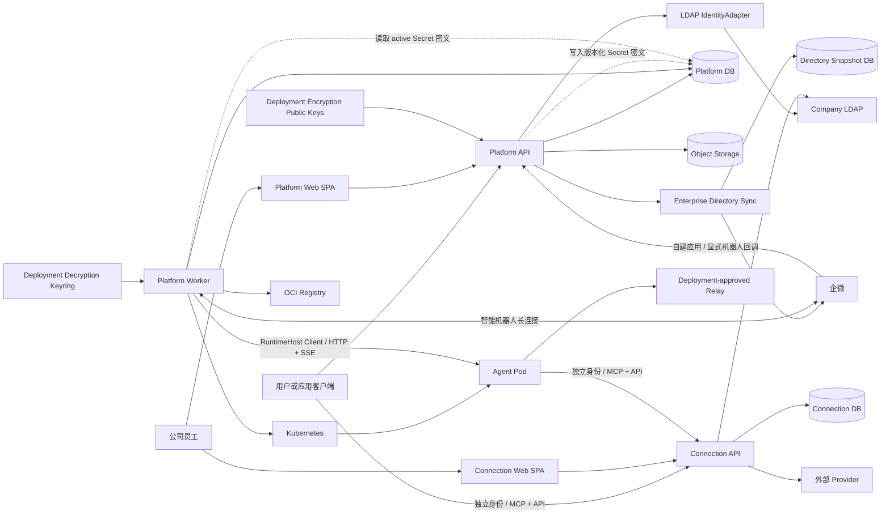
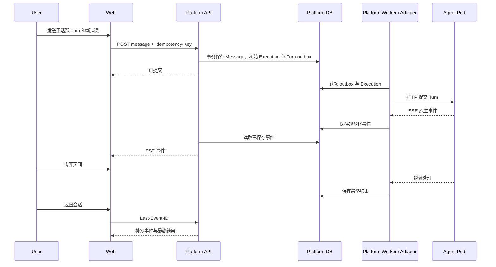
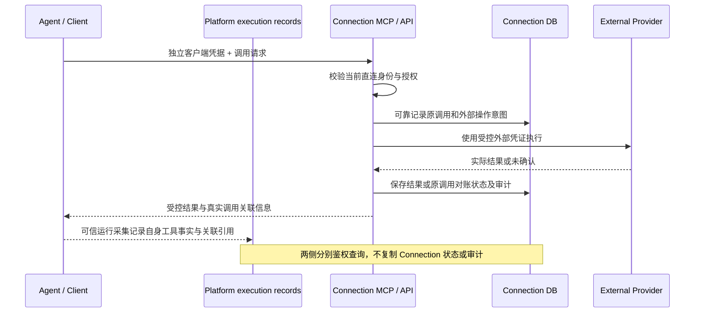

# agent-infra M1 工程架构 Spec

| 项目 | 内容 |
| --- | --- |
| 状态 | Draft for Review |
| 版本 | v0.2 |
| 日期 | 2026-09-13 |
| 适用范围 | Agent 平台 M1、Connection M1 |
| 关联 PRD | [企业级 Agent 平台 M1 产品需求](../prd/PRD-agent-platform-M1.md)、[Connection M1 产品需求](../prd/PRD-connection-M1.md) |

## 1. 文档目的

本文定义 agent-infra M1 的工程实现基线，供前端、后端、运维和安全相关成员评审。它回答以下问题：

1. M1 由哪些部署单元和工程模块组成。
2. Web、平台后端、Agent 运行时和 Connection 如何分工。
3. 用户身份、Agent 权限、Connection 授权和外部凭证如何传递与隔离。
4. 长任务、流式回复、Pod 生命周期和失败恢复如何落地。
5. 前后端分别交付什么，以及如何进行测试和上线验收。

本文不改变 PRD 的产品范围。M1 包含用户与应用 API、后台任务调度、运行可观测、模型质量评估与效果分析（Eval）、持久审计、§10.1.1 的 Session-owned Sandbox 隔离、Browser Capability 和 §11.6 的 Skill Hub。Skill Hub 与 Browser Capability 的工程边界见 §11.5–§11.6；平台会话隔离以外的通用 Sandbox 产品能力、多 Agent 协作、知识能力、Agent 删除、Webhook、定时任务和主动通知仍在 Roadmap。

## 2. 架构结论

M1 的自有产品与控制代码采用全 TypeScript 单仓库，使用 Better-T-Stack 初始化基础工程。Better-T-Stack 只负责生成工程骨架，不作为运行时依赖，也不决定领域模块的接口。Codex 使用固定官方 release，由 Native Driver/Adapter 消费上游能力；第三方源码、私有接缝与执行屏障的边界见 [10.11](#1011-codex-上游原生补丁与执行屏障)。

CI 的 PR-Agent 直接使用官方 GitHub Action，仅启用 Review 与 Suggestions；不维护自有
PR-Agent 脚本、上游补丁或派生 runtime。配置与权限边界见
[Workflow Spec §7.3](SPEC-ai-native-development-workflow.md#73-automated-pr-review)。

### 2.1 技术栈

| 层次 | 选型 | M1 用法 |
| --- | --- | --- |
| 语言 | TypeScript 6 | Web、平台后端、调谐进程、Connection 统一使用 |
| Web | React 19 + TanStack Router + Vite | 登录后的内部 SPA，不使用 SSR |
| Web 数据 | TanStack Query | 管理服务端状态、缓存和请求失效 |
| UI | Tailwind CSS + shadcn/ui | 构建平台工作台、表单、对话和管理页面 |
| HTTP | Hono + Node.js 24 LTS | 平台和 Connection 的 HTTP 接入层 |
| 契约 | Zod + OpenAPI 3.1 | 请求校验、接口文档和 TypeScript 客户端生成 |
| 流式协议 | Server-Sent Events | 对话增量、处理状态和执行详情推送 |
| 数据库 | PostgreSQL + Drizzle | 权威业务数据、事务、迁移和 outbox |
| 文件 | S3 兼容对象存储 Adapter | 附件、结果文件和大体积中间结果 |
| Kubernetes | `@kubernetes/client-node` | Agent Workload、Service 和访问入口调谐 |
| 工程 | pnpm workspace + Turborepo | 多应用构建、测试和缓存 |
| 质量 | Biome、Vitest、Playwright | 静态检查、模块测试和端到端测试 |
| 可观测性 | OpenTelemetry + Pino | Trace、Metric 和结构化日志 |
| 部署 | Docker + Helm + Kubernetes | Web/API 位置无关；Worker 与 Agent Workload 进入 Kubernetes Workload Plane |

Web 页面中凡 shadcn/ui 提供的可复用交互、导航、反馈或表格组件，均使用项目的 `components/ui` 实现，无业务页面例外。Base UI 原语只允许在 shadcn/ui 组件内部使用；语义内容标签和业务状态逻辑不属于组件替代。

初始化依赖以固定版本 Better-T-Stack 的生成结果为基线，并写入 lockfile。Node.js 使用公司支持的 LTS 版本；Kubernetes JavaScript Client 与目标集群版本配套，不使用浮动 `latest`。

### 2.2 Better-T-Stack 初始化基线

初始化参数固定为：

```text
frontend: tanstack-router
backend: hono
runtime: node
database: postgres
orm: drizzle
auth: none
api: none
package-manager: pnpm
addons: turborepo, biome
web-deploy: docker
server-deploy: docker
```

选择 `auth=none` 是为了不引入第二套框架认证协议。仓库提供第一方 LDAP IdentityAdapter，Platform Core 仍只消费可信 IdentityContext，其他部署可替换 Adapter。独立 Connection 按其 HLD 登录，不复用 Platform 浏览器会话。选择 `api=none` 是为了避免同时维护 tRPC/oRPC 与 OpenAPI 两套契约；M1 的浏览器接口、内部接口和 Agent Runtime Contract 统一以 HTTP/OpenAPI 为主，SSE 事件单独定义 Schema。

脚手架版本固定为 `create-better-t-stack@3.38.1`。生成依赖作为项目初始化基线；生成后代码归本项目维护，不通过重复运行脚手架升级项目，也不在初始化过程中主动升级生成依赖。

## 3. 架构原则

1. **产品状态与集群状态分离。** PostgreSQL 保存 Agent 期望状态，Kubernetes 保存实际运行状态，调谐进程负责持续收敛。
2. **平台与 Connection 各自保持权威数据。** Agent、应用与 API 凭证、执行、会话、Eval 和平台审计属于平台；直连身份、Connection Grant、Provider、外部账号、凭证、外部调用和审计属于 Connection。
3. **外部凭证不进入 Agent。** Agent 或客户端使用 Connection 独立签发的访问凭据直连 MCP/API，不能读取外部账号的 Access Token、Refresh Token 或 API Key。
4. **先持久化再异步处理。** 消息、API 任务、审批和生命周期命令先在平台持久受理；外部调用由实际执行系统先可靠记录意图，再触发处理。
5. **接口也是测试面。** Hono、Drizzle、Kubernetes Client 和 OpenConnector 都位于 Adapter 层，领域模块不依赖这些实现。
6. **M1 不预建扩展基础设施。** PostgreSQL 足以支持当前事务、outbox、任务认领和事件回放；不预先引入 Redis、Kafka、NATS 或 Temporal。
7. **主体隔离由服务端决定。** 用户与应用均使用可信主体上下文；浏览器、Agent、模型和 API 调用方提交的身份、组织或关联字段不能成为授权依据。
8. **部署能力通过 Port 接入。** 身份、OCI Registry、模型端点、Kubernetes 和对象存储的具体产品属于部署环境，领域模块只依赖稳定 Adapter 契约。
9. **只冻结跨模块契约。** Wire Schema、数据权威、事务和安全不变量属于 Architecture Baseline；数据库表、UI 结构和 Adapter 内部算法可以在模块内演进。

## 4. 系统结构


```mermaid
flowchart LR
    U[公司员工] --> W[Platform Web SPA]
    U --> CW[Connection Web SPA]
    QW[企微] -->|自建应用 / 显式机器人回调| PA[Platform API]
    CLI[用户或应用客户端] --> PA
    CLI -->|独立身份 / MCP + API| CA
    W --> PA
    CW --> CA[Connection API]

    PA --> PD[(Platform DB)]
    PA --> OS[(Object Storage)]
    PA --> IDP[LDAP IdentityAdapter]
    IDP --> LDAP[Company LDAP]
    PA --> DIR[Enterprise Directory Sync]
    DIR --> DD[(Directory Snapshot DB)]
    DIR --> QW
    PW[Platform Worker] --> PD
    PW <-->|智能机器人长连接| QW

    PW --> K8S[Kubernetes]
    K8S --> AP[Agent Pod]
    PW -->|RuntimeHost Client / HTTP + SSE| AP

    AP -->|独立身份 / MCP + API| CA
    CA --> CD[(Connection DB)]
    CA --> LDAP
    PA -.->|写入版本化 Secret 密文| PD
    PW -.->|读取 active Secret 密文| PD
    PUB[Deployment Encryption Public Keys] --> PA
    PRIV[Deployment Decryption Keyring] --> PW
    CA --> EXT[外部 Provider]

    AP --> MODEL[Deployment-approved Relay]
    PW --> REG[OCI Registry]
```

### 4.1 部署单元

| 部署单元 | 职责 | 是否保存权威状态 |
| --- | --- | --- |
| `web` | Agent、凭证与应用管理、审批、对话、执行详情、Eval 和审计；可独立静态托管 | 否 |
| `connection-web` | 独立 Connection 中文 SPA、登录和 OAuth/Grant 管理入口 | 否 |
| `platform-api` | 可信用户/应用接入、Agent 与任务 API、权限、业务状态/outbox/审计事务、SSE、企微配置与回调、Eval 管理和查询；部署位置无关 | 否 |
| `platform-worker` | Kubernetes Workload Plane 中的 Workload 调谐、模板升级、outbox 认领、有界任务投递、RuntimeHost Client、企微长连接与回复、Eval 执行/评分工作项 | 否 |
| `enterprise-directory-sync` | 每日同步企微员工和部门，原子发布完整、带版本与有效期的目录快照；通过内网受控接口供 Platform 查询 | 否 |
| `connection-api` | 独立登录与客户端身份、MCP/API、Provider/Action、OAuth、Grant、凭证、外部执行、恢复和审计 | 否 |
| `agent pod` | 标准模板与 `platform-adapter` 按 Session-owned Sandbox 运行 RuntimeHost/Driver；`self-managed` 保持自有服务边界 | 仅保存所属运行实例的自有数据 |
| `platform database` | Agent、Owner、范围、管理员手动禁用、应用/API 凭证及授权、个人和 Agent 默认 Relay Key 密文、审批、配置、会话、执行、Eval、反馈和平台审计 | 是 |
| `directory snapshot database` | 企微员工与部门的已确认完整快照、同步版本和有效期；不是 LDAP 身份或 Platform 授权权威 | 是，仅对目录快照 |
| `connection database` | 独立身份与客户端授权、Grant、Provider/Action、外部账号、加密凭证、OAuth 状态、调用/效果和审计 | 是 |

`platform-api` 与 `platform-worker` 使用同一平台领域模块，但以不同进程部署，并通过 Platform DB 状态与 outbox 协作；除下述 `native_metadata_read` 例外外，不建立直接 RPC 依赖。Web 和 `platform-api` 的部署位置不受 Kubernetes Workload Plane 限制；只有 `platform-worker` 获得目标 Kubernetes namespace 的 API 权限。Connection 使用独立数据库和数据库账号；两个数据库可以位于同一 PostgreSQL 集群，但不能跨库直接读写。

仅 [§9.3.1 的 `native_metadata_read`](#931-原生元数据读取授权) 可使用受认证内部 HTTP，
承载 API→Worker 的一次读取投递，以及 Host→Worker→承载原 Request 的 API 实例的在线当前确认。
Worker 保持唯一证明签发与投递方；Host 不直接查询 Platform DB 或 IdentityAdapter。
该通路只服务于同一原 Request 及其可信绑定的 API/Worker/Host 实例关联；服务身份和实例映射由可信部署装配固定，
不能接受调用方回调 URL、任意 origin 或通过负载均衡猜测原实例。
原请求终结、当前确认不可核实、关联丢失或任一关联实例重启使本次读取永久失效，不恢复、续期或复用旧允许结果。
原用户凭证只留承载原 Request 的 API 内存，不进入内部 wire、DB、journal、日志或遥测。
当前认证、读取政策、原持久范围、固定期限、逐相关 await 与响应 bytes 前的复核均遵循 §9.3.1，不能用服务身份替代读取权。
任务调度、Execution/Session/Turn 创建和 control/recovery 仍通过 Platform DB/outbox，不能使用此通路；
metadata 读取不写任务、恢复、fence 或 Key 状态，也不新增持久授权或消息状态机。

目录服务与 Platform 同集群部署，经内部受认证服务边界通信，可使用同一 PostgreSQL 集群的独立数据库账号。它不读取 Platform 或 Connection 数据库；Platform 不把同步快照当作 LDAP 账号状态。Connection 的单一账号级权威和独立 Web 部署取舍分别见 [ADR: Connection 使用单一账号级权威](../adr/0005-use-one-account-backed-connection-authority.md)与 [ADR: 独立部署 Connection Web](../adr/0006-deploy-connection-web-independently.md)。

### 4.2 不拆分的部署单元

M1 不单独部署审批、企微渠道、审计、附件、任务调度、Eval 或模型配置微服务。这些能力作为平台领域模块存在，由 `platform-api` 或 `platform-worker` 调用。企微目录每日同步有独立的数据来源与快照完整性职责，因此使用上表的独立服务；它不处理机器人会话或 Agent 任务。

## 5. 单仓库结构

```text
agent-infra/
  apps/
    web/                     React SPA
    connection-web/          独立 Connection React SPA
    platform-api/            Hono HTTP API、SSE、企微和查询入口
    platform-worker/         调谐、outbox、RuntimeHost Client、投递和 Eval 工作项
    enterprise-directory-sync/  企微目录同步服务入口
    agent-runtime-host/      Agent Pod 内的薄 RuntimeHost 进程入口
    connection-api/          Connection 独立 Web、MCP/API 与外部操作执行
  packages/
    platform-core/           单一深 Platform 领域 Module、Use Case 与 Port
    connection-core/         Connection 领域规则与用例
    contracts/               Wire-only OpenAPI、内部 HTTP、SSE 与 RuntimeHost Schema
    platform-store/          用例级事务 Port 的 Drizzle/PostgreSQL Adapter
    connection-store/        Connection DB 的 Drizzle Adapter
    identity/                Platform IdentityAdapter、IdentityContext 与测试 Fake
    enterprise-directory/    企微快照、完整性与内网读取契约
    enterprise-directory-store/  目录快照的 Drizzle/PostgreSQL Adapter
    image-registry/          ImageRegistryAdapter、OCI Digest/Manifest 与测试 Fake
    secret-store/            版本化 AEAD 密文、DEK 封装与密钥轮换
    model-catalog/           ModelCatalogAdapter 与模型端点政策
    agent-runtime/           RuntimeHost 深 Module、固定 Driver 和 Conversation Contract
    kubernetes-runtime/      KubernetesRuntimeAdapter 与部署路由 Adapter
    observability/           Trace、Metric、日志和关联 ID
    test-support/            Fake Adapter、fixture 和契约测试工具
  migrations/
    platform/
    enterprise-directory/
    connection/
  deploy/
    helm/
    environments/
  tests/
    contract/
    integration/
    e2e/
    load/
  docs/
    prd/
      PRD-agent-platform-M1.md
      PRD-connection-M1.md
    architecture/
      SPEC-agent-infra-M1-engineering-architecture.md
      HLD-agent-runtime-M1.md
  AGENTS.md
  README.md
```

`apps/*` 只负责进程启动、依赖装配和协议接入。领域规则不能直接写在 Hono 路由、React 页面或 Drizzle 查询中。`packages` 不设置无边界的 `shared-utils`；只有被多个明确调用方复用且接口稳定的能力才进入公共 package。

## 6. 工程模块

### 6.1 平台模块

| 模块 | 负责 | 不负责 |
| --- | --- | --- |
| Agent Lifecycle | Web 申请审批、API 直接创建、启动/停止/重启/停用、期望版本与状态迁移 | 直接操作 Kubernetes |
| Agent Access | Owner、员工/组织范围、管理员手动禁用、应用与责任人、API 凭证范围/失效、显式授权及当前权限交集 | LDAP 员工身份、企微目录快照、Connection 授权 |
| Agent Configuration | 模板、自定义镜像、交互模式、自有交互入口身份责任、env/Secret、个人与 Agent 默认 Relay Key、模型、渠道和已验证的集成能力 | Relay 路由和 Connection Provider 凭证 |
| Builder / Build Service | 受控 Repo 工作区、构建定义、镜像构建与推送、Digest 版本、构建审计和可部署性评估 | 用户业务授权、Connection 凭证、生产合并与发布决定 |
| Conversation | 会话、消息、回答版本、附件引用、执行事件和历史查询 | Agent 内部思考原文 |
| Agent Dispatch | API 有界受理/等待与投递、幂等、取消/恢复、Web 繁忙与补充指令 | Runtime 内部执行算法、通用调度服务 |
| Channel | Web、API、企微的主体、会话与附件映射 | Runtime 原生 Session 和协议语义 |
| Platform Audit | 治理、API/执行/Eval 元数据、持久审计与受控查询 | 会话正文、Connection 状态或审计副本 |
| Evaluation | 评测用途授权、版本化数据集/标准、实验/逐例评分、对比、人工复核与主动反馈 | 第二套任务调度、自动导入线上正文 |

### 6.2 Connection 模块

Connection 在自己的 Core/Store/API/Web 中负责客户端身份、Provider/Action、外部账号与凭证、授权、执行、恢复和审计。Platform 只消费独立入口与真实调用的关联信息，不维护这些模块的目录、状态或授权投影。内部模块和 wire contract 由 [Connection M1 HLD](HLD-connection-M1.md) 维护，系统边界见第 13 节。

### 6.3 Adapter 接口

以下位置必须形成明确接口，并至少提供部署 Adapter 或项目实现，以及测试 Fake：

- IdentityAdapter 与可信 IdentityContext；仓库提供第一方 LDAP 实现和测试 Fake。
- 企微目录服务的版本化、受认证快照读取契约与测试 Fake。
- ImageRegistryAdapter、OCI Digest 与 Runtime Manifest 准入。
- RepositoryConnectionAdapter 与受控分支/工作区操作；Builder 只能通过现有 Connection 授权读取或修改 Repo。
- BuildServiceAdapter 与构建任务、目标架构、资源/网络/隔离策略、镜像推送和不可变 Digest；具体构建后端由部署提供，不在领域模块内固定。
- ModelCatalogAdapter 与获准模型端点政策。
- KubernetesRuntimeAdapter 与部署访问路由。
- 对象存储。
- 部署加密公钥与 Worker-only 解密 keyring；Secret 密文、DEK 封装、轮换和候选激活由项目实现。
- Codex Native、Claude Native、Generic ACP 和 Pi RPC Runtime。
- worker 侧 RuntimeHost Client 与 Agent Pod 内 RuntimeHost/Driver。
- 企微机器人与企微应用。
- OpenConnector Provider/Action 执行。

领域模块只接收业务 ID、命令和结果，不接收 Hono Context、数据库连接、Kubernetes 对象或 Provider Token。

`packages/platform-core` 是单一 Platform bounded context，对外只暴露版本化 Use Case、领域结果和窄 Port；Lifecycle、Access、Configuration、Conversation、Dispatch、Channel、Audit 和 Evaluation 只作为内部模块，不拆成 workspace package。Core 定义“业务状态 + outbox + 必要审计”的原子性，`platform-store` 以用例级事务实现；不创建通用 CRUD Repository，也不允许 Hono 路由或 Worker 编排领域 Drizzle 查询。

`packages/contracts` 只保存跨进程 wire DTO/Schema，不依赖 React、Hono、Drizzle、Kubernetes 或应用入口，也不复用数据库实体作为协议类型。Web、API、Worker、RuntimeHost 和 Connection Client 在边界显式映射协议 DTO 与领域对象。

### 6.4 Contract Schema authority

`packages/contracts` 中由 Agent Platform 主系统维护的 wire Schema 只手写 Zod 4，并从该 authoring source 单向生成两类提交到仓库的标准产物：浏览器、用户/应用 API 和内部 HTTP Contract 使用 OpenAPI 3.1，SSE payload、Runtime Manifest 等非 HTTP Contract 使用 JSON Schema 2020-12。生成后的 OpenAPI 是 HTTP 消费者评审和兼容检查的规范来源，其中浏览器 OpenAPI 也是 TypeScript Client 的生成输入；JSON Schema 是非 HTTP Contract 的机器校验入口。调用方不得直接编辑生成产物，也不能从 OpenAPI 或 JSON Schema 反向生成 Zod，项目不维护第三套通用 Schema IR。取舍见 [ADR: Wire Contract 使用 Zod authoring 与标准发布产物](../adr/0003-zod-authored-wire-contracts.md)。

M1 的 Schema family 由以下主责 artifact 维护；表中 Issue 是既有交付入口，新增 API、任务和 Eval 契约的实施归属须在交付计划中对齐，不隐式扩展原 Issue 范围：

| Schema family | 主责 artifact | Implementation Issue |
| --- | --- | --- |
| 公共 primitives、错误模型、生成与兼容工具 | Platform Core/API | [#179](https://github.com/AgoraIO-Extensions/agent-infra/issues/179) |
| Platform HTTP/OpenAPI、SSE 与生产 Web Client | Platform Core/API，Web/API 消费方评审 | [#180](https://github.com/AgoraIO-Extensions/agent-infra/issues/180) |
| 企微目录快照内部 HTTP/OpenAPI | 目录服务，Platform 消费方评审 | [#889](https://github.com/AgoraIO-Extensions/agent-infra/issues/889) |
| RuntimeHost/Driver wire Schema | Codex Runtime，Worker 消费方评审 | [#181](https://github.com/AgoraIO-Extensions/agent-infra/issues/181) |
| Registry、Secret、Kubernetes Workload 与 Runtime Manifest Contract | Agent Workload，Core/Delivery 消费方评审 | [#182](https://github.com/AgoraIO-Extensions/agent-infra/issues/182)；OCI admission 由 [#188](https://github.com/AgoraIO-Extensions/agent-infra/issues/188) 实现 |
| Browser Capability declaration、内部 probe 与 conformance artifact | Runtime/Workload，#1252/#508/#992 消费方评审；Platform/API projection 后续接收 | [#1370](https://github.com/AgoraIO-Extensions/agent-infra/issues/1370) |

生成工具固定版本；产物使用稳定 key/property 顺序、LF 和一个末尾换行，不能包含时间戳、绝对路径或工具版本等易漂移字段。`packages/contracts` 必须在现有 `pnpm test` 路径中执行生成漂移、基于 pull-request merge-base 的 breaking-change 和 consumer contract 检查。test-only Client smoke 只验证 OpenAPI 到浏览器 TypeScript Client 的单向链路，不进入 package exports、`files` 或 `dist`；`packages/test-support` 只提供由正式 Schema 校验的静态 builder/fixture，生产代码不得依赖它。Connection 的 MCP/API、客户端身份、OAuth、Grant、凭证和 Action Schema 由 Connection 自己维护；Platform Schema 不定义 Connection 代调用协议或数据投影。

## 7. Web 架构

### 7.1 页面模块

Platform Web 按产品入口划分路由：

- `/agents`：Agent 列表与详情。
- `/chat/:agentId/:conversationId?`：对话与历史。
- `/my-agents`：申请和 Owner 管理。
- `/my-agents/:agentId/settings`：范围、模型、渠道和已验证的集成入口。
- `/admin/approvals`：系统管理员审批。
- `/admin/audit`：必须交付的平台审计筛选、分页与详情。

Web 同时提供个人 API 凭证、应用及其凭证/Agent 授权、任务执行详情、Eval 数据集/实验/对比和主动反馈入口；具体页面行为以 [平台 Web PRD](../prd/PRD-agent-platform-M1.md#111-页面) 为准。运维观测由部署的日志、指标和 Trace 后端承接。

Connection 使用独立 `connection-web` 和独立浏览器会话，包含登录、个人 Connection、Consumer/Actor Grant、调用记录、待人工处理、Provider/Action、共享 Connection 和 Connection 审计页面。Platform Web 只跳转到 Connection 返回的受控 URL，不能承载或复制 Connection 管理页面。

个人 Connection、OAuth、Grant、Action 确认、撤销和调用记录全部由独立 Connection 入口管理。Platform Web 不复制其页面或数据，也不能把两侧关联信息拼成授权结论。

### 7.2 状态管理

- TanStack Query 管理列表、详情、配置和审批等服务端状态。
- 路由参数和 URL Search Params 保存可分享的页面筛选状态，但 M1 不提供会话分享。
- 对话时间线使用独立 reducer 合并持久化消息、SSE 增量和重连补发事件。
- 表单使用 Schema 校验；服务端重复执行同一校验，不能信任浏览器结果。
- 不预装全局状态库。只有出现跨路由、非服务端且难以由 React Context 管理的状态后再引入。
- Web 使用 OpenAPI 生成的 TypeScript Client，并通过同一 Contract Schema 校验的 Mock Server 和场景 fixture 独立开发。Mock 必须覆盖正常、无权限、启动中、繁忙、失败和 SSE 重连，不能维护另一套手写假接口。

### 7.3 前端安全职责

前端只负责隐藏无权限入口和展示明确错误，不负责最终授权。普通用户不能获得模型 API Key、Connection 原始凭证、内部 Kubernetes 状态或其他用户的资源标识。

## 8. HTTP 与事件契约

### 8.1 浏览器与用户/应用 API

- 管理和查询使用 OpenAPI 声明的 `/api/v1/*` 或 `/api/v2/*` HTTP/JSON。Agent 申请、审批、配置和管理的 V2 契约不包含旧 Action 配置；V1 管理入口退役时，V1 Conversation 入口仍独立保留。
- 创建、更新和命令类请求支持 `Idempotency-Key`。
- 浏览器与用户/应用 API 遵循 [Contract Schema authority](#64-contract-schema-authority)；生成并提交的 OpenAPI 3.1 是消费者使用的规范来源。
- TypeScript 客户端由 OpenAPI 生成，禁止手写重复的请求/响应类型。
- 文件使用平台签发的短期、认证数据面入口上传/下载；业务接口只传文件引用和元数据。入口与执行期文件授权见 [文件](#154-文件)，S3 预签名 URL 不返回浏览器或 Runtime。

API 契约覆盖 Agent 创建/启动/停止/重启、任务提交/查询/取消、结果订阅、凭证与应用授权、审计和 Eval。产品行为分别引用 PRD [API 身份](../prd/PRD-agent-platform-M1.md#73-api-身份凭证与授权)、[后台任务](../prd/PRD-agent-platform-M1.md#104-agent-api-与后台任务)、[审计](../prd/PRD-agent-platform-M1.md#13-平台操作审计)和 [Eval](../prd/PRD-agent-platform-M1.md#15-模型质量评估与效果分析)。路由只解析可信上下文、校验 Schema 并调用 Core；创建和任务受理返回稳定资源 ID 与持久状态，不能把 HTTP 成功等同于 Workload 就绪或任务完成。

### 8.2 SSE

对话回复和状态流使用 `text/event-stream`：

- 每个事件包含稳定 `eventId`、`executionId`、Execution 内递增 `sequence`、Conversation 内严格递增 `conversationCursor`、`type`、`occurredAt` 和类型化 payload。
- Runtime 来源事件与 Platform 来源事件写入同一持久化时间线并共享上述排序空间。Runtime 来源必须携带非空 Runtime cursor，且不能写入 Platform 保留事件类型；Platform 来源按 Schema 显式区分任务受理/等待/取消等状态事件和 `model.selection.fell_back`；其中模型回退事件绑定接收消息的 Execution、Runtime cursor 为空，payload 只包含实际采用的模型选项、推理强度和固定的受限原因。
- 标准模板当前选择失效时，`platform-api` 在接受消息的同一 Conversation 事务中写入一条 `model.selection.fell_back`：初始消息和重新生成绑定新建 Execution，补充指令绑定当前活跃 Execution。该事务同时分配下一 Execution `sequence` 和 Conversation `conversationCursor`、推进两个平台计数器并保存对应审计；幂等重放复用原分配，任何一步失败均整体回滚，且不推进 Execution 的 Runtime cursor。
- Web/API 调用方通过 `Last-Event-ID` 或显式游标重连；服务端验证游标属于当前主体有权访问的 Conversation/Execution，任务流不能带出同会话其他任务的数据。
- 服务端先保存事件，再向在线连接推送；断线后按持久化序列补发。
- 心跳只用于保持连接，不进入业务时间线。
- 同一事件可能被重复投递，消费者按 `eventId` 去重。订阅建立、续传和存续期间执行当前主体/凭证授权；失效后关闭流，审计订阅起止，不逐条审计输出。

M1 不使用 WebSocket。用户发送消息、停止回复和补充指令都通过普通 HTTP 命令完成；只有出现必须由同一连接双向交换低延迟事件的需求后才重新评估。

### 8.3 内部接口

`platform-worker` 到 Agent Pod 使用遵循 [Contract Schema authority](#64-contract-schema-authority) 的版本化 OpenAPI HTTP 契约；Runtime 增量事件使用由 JSON Schema 校验的内部 SSE。内部接口通过部署提供的服务身份认证，并验证执行授权，不因位于集群内而跳过鉴权。

#### 内部 Runtime 传输与身份

Worker 到 RuntimeHost 使用集群内明文 HTTP，决策与接受的风险见 [ADR-0020](../adr/0020-use-in-cluster-plaintext-runtime-transport.md)。它只约束 Worker 到 RuntimeHost 的集群内传输，不改变 Connection 或 Host/Grant/Driver wire；跨集群、跨 VPC 或经过公网的 Runtime 访问必须使用 TLS 并另行评审。

| 要求 | 机制及边界 |
| --- | --- |
| Worker 只访问获准 Host | 只连接服务端从持久 Workload 或 Session 分配解析出的精确 origin `http://<Service>.<namespace>.svc:<port>`；拒绝其他 scheme、userinfo、query、hash 与 redirect，调用方不能覆盖 origin。 |
| 限定访问面 | Agent 级 Workload 与 Session Sandbox 的 NetworkPolicy ingress 只放行 Worker 选择器；healthz 或 Service 存在不证明隔离。 |
| Host 认证部署调用方 | 继续校验既有 service token；它证明持有部署凭证，不是某个 Worker 进程的私钥持有证明。部署控制其发布、访问、轮换和撤销；Host 所持 token 不能取得 Grant 签名私钥。 |
| Host 核对当前授权与部署 | 保留独立 signed readiness 的 Worker/Agent/revision/fence/Digest 本机绑定；业务及控制 Grant 仍按 [§9.3](#93-服务端授权上下文) 校验签名、issuer、audience、时间、对象、用途和操作范围，继续执行原持久幂等、租约与屏障。 |

明文传输意味着能观察集群 Pod 网络的节点、CNI 或特权组件可以看到 token、Grant、会话正文和执行期交付的模型 Key。捕获的 Grant 不能靠传输层消除重放，必须依赖原用途/对象校验、持久幂等与 fence；token 泄露时在两端撤旧并受控重载。

**沿既有 Service 拓扑。** [Runtime HLD §4.1](HLD-agent-runtime-M1.md#41-内部-runtime-service-映射) 区分 Agent 级 candidate/verified Workload 与业务 Session Sandbox。Agent 级主 Service 和 `-probe` Service 分别承载 business 与 readiness/verified control；Sandbox 只使用其原已批准分配的唯一 Service，不复用 Agent 级路由或擅加 `-probe`。本契约不改变 §10.1.1 或 #1322 的资源合同。

**受信部署输入。** 复用[现有 Worker 部署模块](../../deploy/platform-worker/README.md#配置模块形状)：

| 输入 | 入口 |
| --- | --- |
| 部署代码与身份 | `platformWorker.configurationModuleSecretRef.{name,key}` 只读挂载 `/app/dist/configuration.mjs`；导出 `workloadInput`、`signing`、`serviceToken`。`workloadInput.policy.namespace` 必须与 `PLATFORM_WORKER_NAMESPACE` 一致，Agent 来自服务端持久 Workload，不能从请求、Owner env、模型或 live annotation 获取。 |
| token 与 Grant | `platformWorker.runtimeAuthSecretRef.{name,privateKeyKey,serviceTokenKey}` 向 Worker 提供 `/var/run/agent-infra/runtime-auth/{runtime-grant.pem,service-token}`；Host 通过 `policy.runtimeAuth.serviceTokenSecret.{name,key}` 的 `secretKeyRef` 得到同一 transport token。保留 `WorkloadRuntimeAuthV1` 原五字段 `workerId/grantKeyId/grantPublicKey/grantIssuer/serviceTokenSecret`；签名私钥仅在 Worker，Host 只得到公钥和预期身份。 |

`platformWorker.trustedCaSecretRef` 继续作为 Worker 访问目录、Registry 等 HTTPS 依赖的附加信任入口，不用于 Runtime 传输。部署不签发 Runtime CA 或 server leaf，Runtime Pod 不挂载 TLS Secret，kubelet readiness 使用 HTTP。

**迁移。** 旧 TLS Pod 在新期望 Pod 规格下判定为 drift，由既有 fenced 调谐替换，不保留双栈或 HTTPS 兼容层。替换期间沿原受权持久流程停止新准入、核实原执行；旧控制不可达时保持 pending/unknown，使用原 Kubernetes fenced closeRoute、scale-zero 和 ownership cleanup 权限收敛，不重放副作用。

**验收。** business、control、readiness 和 Session 路由均覆盖非精确 origin、redirect、userinfo/query/hash、无效 token 和跨用途/主体/Agent/对象的 Grant；分别验证本机 revision/fence/Digest 与旧请求、重复请求的原屏障。Agent 级主 Service/`-probe` 分别验证 candidate/verified 与业务关路后的控制，Sandbox 验证其独立 Service/分配归属且拒绝跨 Session 路由。kubelet readiness 的 HTTP scheme、path/port 与实际 Pod/StatefulSet drift 核验保持一致。

Agent/客户端到 Connection 的 MCP/API 使用 Connection 的独立身份和契约，不经过 Platform API。平台不读取 Connection Catalog，不持有其目录读取或代调用 workload credential。

M1 不引入 tRPC/oRPC/ConnectRPC。

## 9. 身份与权限

### 9.1 IdentityAdapter

- 仓库提供第一方 LDAP IdentityAdapter 作为企业部署默认实现：浏览器登录由平台服务端查找唯一员工条目并以用户密码完成 LDAP bind，仅从受信查询取得稳定 UID、邮箱与当前账号状态。密码不保存、不送入 Worker/Agent、不进入日志或审计；LDAP 连接通过服务端 `tls` 开关选择协议：默认 `true` 使用受信 `ldaps://`，显式 `false` 使用 `ldap://`；显式端口保留，未指定端口时使用协议默认端口。开关不来自浏览器登录请求，不允许 URL 内嵌凭据，不改变用户 bind、稳定 UID、账号状态或会话校验。Platform Core 仍只消费 IdentityContext，其他部署可替换 Adapter，不要求配置 LDAP。
- 部署通过进程内可信 Adapter、经过认证的服务边界或版本化签名信封向 `platform-api` 提供当前 IdentityContext；跨进程传递时必须校验签发方、audience、签发/过期时间、唯一 context ID、keyVersion 和部署身份绑定，并在缺失、过期、重放或验证失败时 fail closed。
- IdentityContext 至少包含稳定且不透明的用户 ID、当前账号状态、组织成员关系、平台角色，以及足以判断上下文是否仍有效的版本或时效信息。
- 浏览器、Agent、模型和普通调用方不能提交、覆盖或伪造这些字段；`platform-api` 必须验证部署身份边界后才创建 HttpOnly、Secure、SameSite 会话，且不在 Local Storage 保存上游身份凭证。
- Helm 以环境变量向第一方 Adapter 注入允许成为 `system_admin` 的 LDAP 稳定 UID 集合；每次敏感管理员操作按当前 LDAP UID 精确匹配并检查账号有效。邮箱、企微 userid、Relay 角色和请求字段都不能赋予平台管理员身份。该配置为空时不产生隐式管理员。
- Platform 通过受认证的版本化接口消费通用组织目录，不直接调用企业上游协议。独立配套同步服务的 Adapter 每天从企微或企业内部接口拉取员工与部门，上游 Adapter 负责核实成员有效性与部门归属语义，不能把未知状态默认为有效或把查询范围当成直接归属。只有全量校验成功才原子发布带来源、版本、完整性标记和最长一天有效期的快照；失败保留上一版用于诊断，但过期或不完整快照不能继续授权。Platform 以 LDAP 与快照中唯一、有效的邮箱一对一关联，缺失、重复、停用或无法核实均拒绝依赖该映射的 Owner/可用范围新增与敏感操作；不按名字或请求提交的邮箱猜测。组织成员变化以新完整快照生效，允许最长一天延迟。
- 平台不维护独立员工目录，只保存业务所需的稳定 LDAP 用户引用、管理员手动禁用状态和授权记录。管理员禁用在 Platform DB 中持久化并审计，优先于 LDAP active 结果；解除禁用也须当前 LDAP 账号有效，不修改 LDAP 或企微源数据。
- LDAP 当前账号状态、Platform 手动禁用及适用的组织快照在每次敏感操作前重新解析；LDAP 停用和手动禁用立即拒绝，短期缓存不能成为独立权限来源。IdentityAdapter 或目录依赖缺失、非法、过期或不可用时，依赖其结果的敏感操作 fail closed，不能使用调用方字段或不受控旧缓存继续授权。
- IdentityAdapter 确认账号禁用时，平台为该用户全部仍活跃的 Execution 幂等创建平台来源的停止工作项；若平台确认用户失去某个 Agent 的可用范围或某个渠道的权限，则只处理服务端保存的 Agent 或渠道授权上下文受该撤权事实影响的活跃 Execution。该控制操作不借用已撤权用户的调用权限。具体投递和竞态规则见 [Agent Runtime M1 HLD](HLD-agent-runtime-M1.md#81-消息与命令幂等)。

Connection 不消费 Platform 浏览器会话或 Platform API 凭证；其 LDAP 登录、OAuth 客户端身份、授权及复核机制由 [Connection M1 HLD](HLD-connection-M1.md) 定义。

### 9.2 权限顺序

Web/企微依次校验可信用户当前状态、Agent 可用范围/有效 Owner、渠道权限和已验证 Runtime 能力。模型选择须属于标准模板 Owner 当前允许清单或 ACP Runtime 当前有效选项，API 也遵循该模型边界。标准模板的 Relay Key 选择与 Execution 绑定以 10.7 为准；Platform API 凭证和 Connection 凭证均不能替代它。Connection 的独立授权在其调用入口完成。

`platform-core` 的 Access 模块维护独立应用、注册责任人、API 凭证元数据与显式 Agent 授权；用户状态/组织关系仍来自 IdentityAdapter。API Adapter 验证凭证后生成可信用户或应用上下文，保留主体类型、稳定 ID、凭证引用、操作范围及有效期，不能由请求字段覆盖。凭证只保存不可逆校验材料和必要元数据，首次交付后不提供原值读取；个人凭证由本人管理，应用凭证由登记责任人管理。

应用凭证管理与取得/使用凭证材料分别授权。责任人角色只授予元数据、范围、轮换和撤销等管理权限，不自动获得凭证值或应用任务权限；签发与轮换时由 Core 重验接收者当前的独立凭证使用授权，只向该接收者受控交付，不能回显给仅有管理权的请求者，也不能通过重设接收者或交付入口绕过授权。授权、接收者及实际交付结果记录必要审计，凭证值不入审计；不引入新的身份或凭证服务。获授权接收者调用时仍以应用为任务主体，当前 Agent 权限和凭证范围继续生效。

应用凭证材料 grant 的授予/撤销遵循[平台 PRD 7.3](../prd/PRD-agent-platform-M1.md#73-api-身份凭证与授权)：writer 仅来自 9.1 的可信 `system_admin`，每次操作重验当前账号有效、Platform 未禁用及 LDAP 稳定 UID 仍精确匹配管理员配置；责任人或凭证管理角色不能替代该检查。Access 持久保存应用 ID 与接收者可信主体类型、稳定 ID 的绑定，授予、撤销及材料使用均按完整绑定检查，不能仅比较裸 ID。授权变更与必要审计原子保存，审计失败不得放行；授予命令仅返回授权元数据，不签发或交付材料。管理员作为接收者（包括显式自授）仍须在签发、轮换和交付时通过当前独立 grant 检查，撤销后不能继续交付；材料不得进入普通读取、日志、Trace 或审计。

API 创建许可由部署显式配置获准主体集合，以主体类型和稳定 ID 精确匹配，并与凭证的 `agent:create` 范围取交集。集合缺失、主体未列入或当前主体不可确认时拒绝创建；应用不借用责任人的许可，用户与同名应用的裸 ID 不互相代替。该集合只控制创建，不构成逐次审批，也不替代目标 Agent 的独立管理/使用授权。

创建用例将 Agent、创建主体、Owner、初始管理/使用授权、outbox 和必要审计原子保存。用户创建的 Owner 为本人，应用创建的 Owner 为登记的自然人责任人，创建主体仍为应用。API 不进入 Web 申请审批状态机，也不设预审批；镜像/配置与运行能力准入仍适用。管理与使用授权可分别撤销，应用不继承责任人的权限，Owner 不能绕过已撤销的 API 授权。

上述事务是创建请求的可靠受理点，先于 Workload 创建；实例创建失败保留原 Agent 与初始授权，按现有生命周期权限查询、停止或重试，不能产生只有成功部署后才能管理的 Agent。

每次 API 操作在 Core 中检查：当前主体有效、当前对应业务授权、凭证操作范围与有效期、目标 Agent/渠道/Runtime 能力。任务查询、订阅、结果文件访问与调用方取消还须匹配持久保存的提交主体，并具有当前 Agent 使用权；Owner 或责任人角色不能替代这项匹配。相同主体的另一有效凭证可在其权限范围内操作原任务。

Agent 资源授权修订与逐主体的 manage/use 授权修订属于不同版本域。独立授权的撤销、重新授予产生新的授权修订；消费者按完整主体类型、稳定 ID、Agent 与授权类型复核当前记录，不能以授权修订等于 Agent 修订判断是否授权。任务边界分别绑定 `agentAuthorizationRevision` 与 `useGrantRevision` 并复验；审计查询使用当前使用权，同时保留原提交主体和执行关联校验。

Agent 元数据的 API 列表读取要求凭证包含 `agent:read`，并仅返回主体当前显式拥有管理或使用授权的 Agent；任一授权有效即可读取元数据，两项均撤销时排除该 Agent。元数据读取不授予管理或使用操作权，Owner 或系统管理员角色不能替代独立 API 授权。无可见 Agent 时返回空页，浏览器发现与 Owner 读取仍按其既有规则执行。

| 变化 | API/订阅 | 已受理任务 |
| --- | --- | --- |
| 单个凭证过期或撤销 | 拒绝该凭证并关闭其流 | 继续执行，不把凭证失效当作主体撤权 |
| 主体禁用 | 拒绝该主体全部 API 访问和订阅 | 取消未开始任务，向进行中任务投递系统取消，并阻止后续平台受控操作 |
| Agent 使用权撤销 | 拒绝新任务及依赖该使用权的访问和订阅；独立管理授权不被一并撤销，元数据和管理操作按当前对应权限检查 | 取消未开始任务，向进行中任务投递系统取消，并阻止后续平台受控操作 |
| 身份或授权依赖无法确认 | 敏感操作 fail closed | 不凭旧缓存继续投递；保持可解释的等待/未知状态，按原执行恢复核实 |

撤权控制以服务端持久授权关系定位 Execution，由系统身份执行，不能借用已失效调用方凭证。取消请求与实际停止分开保存，不回滚已发生的外部效果；Connection 在自己的入口执行当前授权。

### 9.3 服务端授权上下文

Web 和企微仍按可信用户、当前 Agent 可用范围及渠道权限校验；API 按 9.2 校验。每次 Turn 或补充指令实际投递前，平台重验当前主体和 Agent 使用权，再生成短期、不可篡改且版本化的 Runtime Execution Grant。Grant 绑定签发方、RuntimeHost audience、签发/过期时间、唯一 `grantId`、Execution、Agent、提交主体及类型、渠道、Conversation/Turn、允许命令和附件操作；标准模板业务 Grant 还绑定该 Execution 已固化的 Relay Key 用途、引用与版本，但不含原值。执行范围受原受理授权边界约束，不能因后台 Worker 的服务权限而扩张；Platform API 凭证的后续失效按 9.2 处理，Relay Key 的执行期规则按 10.7 处理。

RuntimeHost 在读取附件或运行命令前校验签名、签发方、audience、有效期与全部对象绑定。服务身份、请求字段、Session Ref 或 Runtime 返回值不能单独作为授权依据。补充指令取原 Execution 边界与当前授权的交集；不匹配或过期时拒绝，日志和审计只保存 Grant 引用及受限原因，不保存原始证明。

平台来源的停止、恢复核实及代次隔离复用同一签名机制，使用与业务执行显式区分的控制用途 Grant。Core 依据已持久化的撤权、停止、隔离记录或经可信历史证明后提交的系统迁移审计及目标当前状态签发，绑定原主体、Agent、Conversation、适用的 Execution、Session 代次、控制操作引用与命令范围；原主体保留为目标和审计归属，不要求其仍具备业务使用权。Host 必须校验控制用途与上述绑定，并继续执行该操作的租约、fence 和屏障规则。控制用途只允许停止、无正文状态核实、必要代次屏障，以及原执行未确认事件向平台持久化处理器的续传与确认。事件续传须绑定原 Execution、代次、当前 fence 和持久确认游标，由处理器按原任务隔离保存；该通道不授予用户查询或正文回放权限。控制 Grant 不能提交或补充 Turn、发起模型/工具调用、读取附件或向用户返回正文，也不能用于 Connection 授权。服务身份或调用方自报撤权不能替代该 Grant；过期后仅能沿同一持久控制记录重新校验签发，不能借此恢复业务权限。

历史执行主体缺失时，只能依据部署受信的原 producer 证据建立原主体与对象绑定，不能按
当前角色补造原受理范围。只有完整原授权边界可恢复业务授权记录；仅能证明主体时，将原
Execution、Session 代次、原操作摘要和迁移来源与必要系统审计原子保存，其持久审计引用
可作为无正文恢复、停止及原事件续传/确认的独立控制来源，不授予提交、补充或业务续期。
Worker 每次签发重新读取该来源与当前租约、fence 和 Workload，不要求原用户仍可用。
Host 通过独立部署信任根验证版本化签名迁移映射，核对当前 Workload 及完整旧 Session
执行集合；签名方须先核实 Platform 迁移审计已提交。映射仅证明历史归属，不是操作 Grant
或 Connection 授权；实际调用仍须独立的短期 Grant。来源缺失、矛盾或不可确认均拒绝。

Runtime Execution Grant 仅授权平台 Runtime 操作，不是 Connection 访问凭据。平台不为 Connection 签发 assertion、不传递 Owner Action policy，也不替 Connection 决定客户端可调用的外部账号。

Workload 就绪检查不以业务 Conversation/Execution 为授权上下文，而使用独立版本化的
只读 Workload Readiness Grant。Worker 在当前调谐候选的权限与 fence 下签发最多 30 秒有效的
证明，绑定签发方、专用 RuntimeHost readiness audience、唯一 Grant/请求标识、Worker、Agent、
Workload revision、fence、镜像 Digest 和 `readiness.read` 用途。Host 同时校验服务身份、签名、
时效及部署注入的本机 Agent/revision/fence/Digest，并将已认证 Worker 与 Grant 绑定核对；
缺失本机绑定或任何不匹配均拒绝。
该接口仅执行无副作用的核心与 capability 读取，不创建 Session/Turn、不读会话或附件，
不调用模型、工具或 Connection。它没有用户、Conversation、Execution 或 Action 字段，不能
用于业务或控制命令；同一有效请求的重复只允许重复读取。Worker 必须按当前候选和 fence
提交检查结果，迟到结果不能激活其他候选。该边界见
[ADR: 独立的 Workload 就绪授权](../adr/0010-separate-workload-readiness-authorization.md)。

#### 9.3.1 原生元数据读取授权

原生命令状态、命令目录和已安装 Skill 目录使用独立版本化读取用途 `native_metadata_read`，
每次读取固定一个 `status | commands | skills` selector。该用途只授权原已持久会话的获准
元数据，不授予正文、附件、模型、工具、压缩、Turn、控制、恢复、事件回放或 Connection
权限；business、control、recovery 和 readiness 的许可不能转换成用户读取许可。

`platform-api` 从本次受认证请求重新解析当前主体和适用凭证，Core 按当前读取政策检查
主体状态、Platform 禁用、对应 Agent/渠道权限及持久提交归属。Web 沿原用户读取规则；
API/应用仅在其当前读取与实际所用凭证合同已接入时启用，不能外推 Web 或任务受理结果。
Owner、管理员或服务身份不替代对应读取权。终态或暂不可执行业务的原执行仍按读取政策
判断，不借业务租约、readiness 或原控制权限放行。

原范围由服务端持久记录解析，绑定主体、Agent、channel、Conversation、原 Execution、
该 Execution 的 sessionGeneration 和 authorizationRevision。Worker/Host 再核唯一的
原持久 Host/Driver/native 与配置绑定，以不透明 `originalHostScopeRef` 关联；当前会话代次、
当前 Agent 配置和模型配置修订不能替代原执行的 Host 配置。调用方不得提交或覆盖主体、
代次、Host/native ref、thread、配置、路径或任意 RPC。范围或原映射无法唯一确认时拒绝。

读取证明是独立版本化数据，绑定读取用途与 selector、可信 issuer、专用 RuntimeHost
metadata audience、keyVersion、issuedAt/expiresAt、唯一 readId、上述原范围和
originalHostScopeRef。API/Core 先完成当前授权及原范围确认，再由唯一投递方 Worker
沿受认证内部链生成并投递证明；Host 校验部署服务身份、签名与所有绑定。证明不含原始
凭证、正文、函数或 native 路径；服务身份、readId、证明未过期和修订相等都不能单独授权。
实际 wire 的版本及字段由读取 producer/consumer 的实现 primary 固定，不扩用旧 Grant
用途或兼容回退。

本次 operation 使用可信服务器时钟，固定期限不晚于读取起点后 30 秒、可信上游 deadline
及适用且已知的会话/凭证绝对到期时间，取最早值；调用方不能指定或续长。浏览器认证源
未暴露绝对到期时间时，不补造该字段，每次重验原请求的当前会话有效性；API 凭证须逐次
核真实到期、撤销、范围与主体，缺合同不启用。30 秒是资源上限，不是授权缓存或撤权宽限。

API 在原请求存续且等待此次 Worker 读取期间登记有界 request-local readId 与认证来源；
该关联只允许受认证 Worker/Host 链按同一 selector 和原范围请求当前确认，引用本身不授权。
每次确认重新核当前认证、Core 政策与同一持久原范围，不使用 initial allowed 或旧 revision
闭包。API→Worker→Host→Driver 保持原单向投递；Host 的异步确认沿受认证内部链回到该
请求关联，不直接查询 Platform DB 或 IdentityAdapter，不向 Runtime 传用户原始凭证。

Host 将原请求取消、固定 deadline、本机生命周期及当前确认失败合并为读取 signal；
同步护栏只核本机已确认状态、deadline、abort 与原持久绑定，异步重验另显式等待。
在各相关 await 后和结果返回前重新确认；API 也须在写出任何响应 bytes 前重验原请求及
同一原范围。明确无权、认证失效、范围/配置/进程变化、期限、abort 或依赖无法确认时，
丢弃结果并使该 context 永久失效，不返回旧结果或伪空目录。请求结束、issuer/Worker/Host
重启或关联丢失时不恢复旧 context；新的读取须重新认证。该方案不宣称存在即时撤权 feed。

读取不新建业务 Execution、Session 或 Turn，不恢复业务、不写 recovery latch、fence、Key
或任务状态，不推进 successor。纯原绑定断言独立于旧业务、控制及 evidence-query latch；
目录不授权后续执行。内部 ref、正文、路径、原始证明和凭证不进入公开投影、审计或遥测。
具体 Host/Driver 生命周期见 [Runtime HLD §5.2](HLD-agent-runtime-M1.md#52-调用生命周期与兼容)。

## 10. Agent Workload 与调谐

### 10.1 Workload 形态

Web 与 `platform-api` 是位置无关的 Platform 服务；`platform-worker`、KubernetesRuntimeAdapter、Agent Workload 和部署访问路由组成 Kubernetes Workload Plane。只有 `platform-worker` 的部署身份可以访问 Kubernetes API，并且权限限制在目标 namespace 内。Web、`platform-api`、Connection 和 Agent Pod 都不能持有 Kubernetes API credential。取舍见 [ADR: Platform 服务与 Kubernetes Workload Plane 分离](../adr/0001-separate-platform-services-from-kubernetes-workload-plane.md)。

开源实现只使用受维护 Kubernetes 版本中的 GA capability baseline：`apps/v1` StatefulSet、core/v1 Pod/Service/ServiceAccount/PVC/Secret、`networking.k8s.io/v1` NetworkPolicy，以及 `networking.k8s.io/v1` Ingress 或部署 Adapter 提供的等价受控路由。每个 release 记录经过 `kind` 和真实部署验证的版本矩阵；不为 Kubernetes 1.16、`networking.k8s.io/v1beta1` Ingress 或超出支持 skew 的客户端维护兼容分支。

- 标准模板与 `platform-adapter` 的每个 Sandbox 对应独立的实际 Pod/Runtime；可使用副本为 0 或 1 的 StatefulSet 管理该 Pod，不再按 Agent 共享一个运行 Pod。
- 每个 Sandbox 使用独立内部 Service、ServiceAccount、PVC、NetworkPolicy 和受控 Secret materialization，不与其他 Sandbox 共享可写工作区、进程命名空间、运行时 HOME/cwd 或凭据挂载。
- Agent 的管理状态控制其所属 Sandbox 的运行资格；实例是否就绪按各自绑定、健康、网络和 Runtime 探测决定，不能用一个实例的就绪代表全部会话。
- `self-managed` 自有服务不承载 Platform Session；保留其既有部署与唯一用户路由，不自动转换为平台会话或按外部会话创建 Sandbox。
- ServiceAccount 默认没有 Kubernetes API 权限。
- Agent Service 只提供集群内部地址，Pod 或 Service 地址不作为用户入口。Pod、可选 StatefulSet、Service、ServiceAccount、PVC、部署访问路由和 NetworkPolicy 只由 `platform-worker` 通过 KubernetesRuntimeAdapter 调谐，Agent 与 Owner 都不能直接创建或修改这些资源。
- 平台配置、对话和 Connection 授权不保存在 Pod 本地。
- 平台会话的个人记忆、工作区和原生 Session 数据保存在所属 Sandbox 的独立持久卷；Runtime 内的文件与进程防护继续有效，不能以 Pod 分离代替必要负向验证。

Owner 不能修改 CPU、内存、副本数和存储规格。资源规格由平台按 Agent 类型选择预设 Profile，Web 审批页展示该配置；API 创建复用相同规格选择，不增加审批。

#### 10.1.1 Session-owned Sandbox 权威与资源绑定

平台采用 `agent_id → session_id → sandbox_id`。`session_id` 表示 Platform Conversation 的
稳定逻辑会话标识，复用 `conversationId`，不新增平行 Session 服务；它不是 Native Session ID、
Host Session Ref 或登录 Session。Platform DB 保存 Session 到唯一 Sandbox 的分配及主体、
Agent、渠道、当前代次、资源归属和状态。`sandbox_id` 由服务端分配，不由请求、Runtime 回包、
Pod 名称或 Connection 身份推导；`project_id` 不参与主键、分配或授权。未来业务工作区字段
不能改变该隔离键或允许复用另一 Session 的可写资源。

创建或续接会话时，在原 Conversation/任务事务内校验当前主体、Agent 与渠道，并持久化或读取
同一 Sandbox 绑定；幂等重试、并发受理和 Worker 恢复不能分配第二个有效 Sandbox。分配不等于
已经创建 Pod 或 Native Session：资源由唯一 Worker 调谐，原生 Session 仍在首次实际投递时创建。
Web、企微回调/长连接和 API 共用该权威；企微会话键保留发送者，渠道会话不自动合并。

Agent 运行资格、镜像修订验证和 Session 实例就绪分别保存，不能互相代替。创建/升级时的
Manifest、健康和 ACP 核心验证由 Worker 使用绑定 Agent、候选修订与管理 fence 的独立验证
Workload 完成；它不属于业务 Session，不挂载任何业务 PVC、会话正文或用户 Connection 凭据，
不加入业务路由，也不能提升或复用为业务 Sandbox。只读探测授权绑定该验证用途与实例，
通过或失败后按原修订回收验证资源；它不创建业务 Execution 或 Native Session。
无 Session 时，当前修订验证通过且管理资格有效即可允许创建首个会话，不要求先有业务 Pod。
Web 打开新会话先完成持久分配和实例准备，就绪前该会话只读；API/企微沿原任务受理与
有界等待规则触发分配，就绪前不投递。已有 Session 的可用性只由自身实例决定；Agent 级
修订验证通过不能覆盖实例失败，单个实例失败也不能将其他就绪会话判为不可用。

Worker 只消费已提交分配，按 Sandbox 串行调谐并校验原 Agent 管理资格。资源名、selector、
ownership、UID、配置/Workload 修订和租约/fence 必须绑定同一 Sandbox、Session 和代次；
仅按 Agent ID 选择 Service、PVC 或清理集合不再足够。旧代次、外部同名对象和归属不明的资源
均拒绝接管；部分创建失败从原分配幂等恢复，不删除其他 Sandbox。只有实例身份、路由、健康、
Runtime readiness 和出站策略全部符合当前期望时才能投递业务；healthz 成功不单独证明隔离。

Session Sandbox 的必需实际资源为 Pod、Service、ServiceAccount、PVC、NetworkPolicy 和
该 Sandbox 专属 Secret 六类。
就绪回执须逐资源回读真实 UID、resourceVersion 与归属，绑定原 allocation、主体、渠道、
租约、代次及当前 `resourceFence`；不能用资源名、期望清单或合成 receipt 代替实际对象。
StatefulSet 仅为可选 Pod 控制器，不是所有 Sandbox 就绪回执的必选资源；实际使用时，
须同时核验其真实 UID/resourceVersion、owner 及与 Pod 的控制关系，不得忽略实际控制器。
此可选性不改变 `self-managed` 部署、独立验证 Workload 及 §10.6 的既有 StatefulSet 规则。

专属 Secret 是该 Sandbox 的受控 Secret materialization，与 Sandbox 同名、`immutable`，只含两项：

- `token`：该 Sandbox 的 transport token，为部署级 service token 对
  `session-sandbox-v1`、namespace 与 Sandbox ID 的 HMAC-SHA256（base64url）。Worker 每次路由
  该 Sandbox 时重新计算，不另行存储；部署 token 轮换按下述受控停止与重建流程更换。Sandbox 的 business 与 control
  路由只发送该值，Agent 级路由不变；部署 token 和其他 Sandbox 的 token 均被该 Host 拒绝。
- `model-config`：Store 随 claim 交付的 verified 模型投影的非敏感配置。只接受 V4 无 Key 投影；
  不是 V4、模板绑定不再受信，或 verified 部署含 Agent 级 `secretRefs` 时，Session prepare 在
  任何写入前以 policy 失败，Worker 不自行推导投影，也不挂载 Agent 级 Secret 或静态模型 Key。
  模型 Key 仍按 [ADR-0016](../adr/0016-bind-relay-key-to-execution.md) 随执行交付。

Pod 以 secretKeyRef 引用这两项，并直接获得 Driver、Agent ID、Worker ID、端口、Grant key ID、
公钥与 issuer；数据目录位于 Sandbox PVC。安全上下文与 Agent 级 Workload 一致：UID/GID/fsGroup
1000、只读根文件系统且 `/tmp` 使用内存 emptyDir、去掉全部 capabilities、seccomp RuntimeDefault，
且不注入其他 Service 的地址。上述任一字段或 Secret 内容漂移均判为 unknown 或 conflict，
不原地修复。Secret 随计算资源一起停止和回收，只保留 PVC；同名外部 Secret 不被接管。

部署 token 轮换须沿现有 Agent 管理停止/重启意图进行：先关闭业务路由并确认原执行和停止
屏障，再以原资源 UID/resourceVersion 回收 Pod 和 Secret；轮换后在同一 Sandbox/PVC 上重新
准备专属 Secret 和 Pod，并取得新的逐资源就绪回执。轮换尚未完成时不继续发送新业务。
原执行或删除结果仍为 unknown 时保留占用，不能把 token 内容漂移当作自动替换资源的授权。
drain 保留原 V4 投影、资源身份与删除 CAS 校验，但不重新要求原模板处于当前 prepare allowlist；
模板撤销不得阻断已获管理授权的原资源回收。

Pod 重建仍沿同一 Session、Sandbox、PVC 和原 allocation 恢复，先证明旧执行源不能双活，
再在当前 `resourceFence` 下由原 Store CAS 接受新 Pod UID 与逐资源版本；不能凭 Pod 消失
推断原 Turn 的副作用或终态。证据不足时保留原身份、占用和 `unknown`，不分配另一实例
重放业务，也不绕过 Runtime HLD §7.3 的 generation tombstone 与 cancellation barrier。
停止或删除按当前受控意图操作，以逐资源 UID/resourceVersion 为前置条件，并回读实际
absence；未证实停止时仍保留占用。计算资源回收不删除原 PVC 或改变原执行未知结果。

删除意图必须在原 `outbox.lifecycle` 中持久保存，并按每个非 PVC 资源记录
`delete-requested`、`absent` 或 `unknown` 进度、唯一 delete-attempt、原 UID/resourceVersion、
Session generation、`resourceFence` 及当前管理 fence。Worker 在实际 DELETE 前，必须在当前
claim/CAS 条件下原子提交 `delete-requested` intent、唯一 attempt identity 及上述原始条件；这只
证明获准发送，不证明 DELETE 已发出或已得到 ACK。随后才能按该原 UID/resourceVersion 发出条件
DELETE，并分别记录实际 ACK、失败或 unknown。删除后即使响应丢失、对象仍处于 terminating 或
进程在回写前崩溃，恢复也必须保留原 intent、attempt 和新回读结果，不能把 absence 伪称为 DELETE ACK。
`absent` 只有在同一 namespace/name 的新回读确认对象不存在、原 UID/resourceVersion 条件已记录、
且不存在同名新 UID 或 fence 冲突时，才可作为该资源的 removed 证据；否则保持 `unknown` 并沿原
intent 重试。每次 progress 写回必须重新取得并校验当前 outbox lease、delivery fence 和 CAS/claim
版本；lease 换手、stale context、同名新 UID 或 fence 变化时拒绝旧写入并沿原意图重新认领。
只有全部计算、路由和身份对象均有上述 removed 证据、保留 PVC 仍按原 UID/resourceVersion
核实、且原执行和停止屏障满足时，才能生成完整 `stopReceipt`；部分成功、失败或未知都保留原
占用和可恢复意图，不得以永久 `unknown` 结束收敛。

业务、控制、readiness 与执行文件授权分别在既有用途内绑定目标 Sandbox；Host 校验服务身份、
已签名对象绑定和部署注入的本机 Sandbox/Session/代次，不能信任孤立的 `sandbox_id`。
控制授权仍只允许原执行的停止、核实和屏障，不恢复业务使用权，不成为 Connection 授权。
新增绑定由原契约 owner 发布版本化 Schema，并同步签发方、Host、文件数据面及消费者；不得
静默改变既有 V1/V2/V4 wire 含义或兼容性放行无 Sandbox 的新业务调用。readiness 不创建
业务 Execution；只对已分配实例作只读检查，不能用其授权读取会话或调用模型/工具。

部署批准的出站策略由 Worker 按 Sandbox 落实，默认拒绝未批准目标；允许集群 DNS、获准模型
和独立 Connection endpoint。Connection 目标和策略修订消费 [§13.5](#135-platform-外部-connection-consumer-配置契约)
的完整 Consumer 配置，不另建 endpoint 或授权来源。Runtime、镜像、模型参数和调用方不能扩大
目的地。Connection 安装凭据仍按 Principal/ConsumerInstance/Actor 隔离并经受保护客户端交付；
Sandbox 身份、ServiceAccount 或网络可达均不授予 Connection 权限。

| 触发 | 必须保持的边界 |
| --- | --- |
| Session 关闭 | 先拒绝新命令、关闭业务路由，再沿原执行停止/核实；确认无剩余副作用后回收计算资源。平台历史和合法持久数据按数据政策保留，不新增删除会话入口。 |
| Agent 停止、停用或升级 | 管理资格作用于所有所属 Sandbox；先阻止新投递，按各实例记录收敛在途任务与路由。升级只复用该 Sandbox 原持久卷，不能共享或交换会话卷；未知执行按恢复规则保持占用。 |
| 重启或恢复 | Sandbox ID、Session、原执行、Key 版本、持久映射及游标保持；新 Pod UID 须由原分配在当前 fence 下核实，不凭同名资源认定恢复。 |
| 撤权 | 单凭证失效与主体/Agent 使用权撤销按 §9.2 区分；后者取消等待任务并持久停止活跃执行，阻止后续受控操作。历史读取仍需当前授权，控制恢复不向被撤权用户输出正文。 |
| 并发或重试 | 同 Session 保持原串行准入；不同 Session 使用不同 Sandbox 并在获准容量内运行。原幂等结果、租约和 fence 防止重复资源及重复副作用，不新增调度权威。 |
| unknown 或恢复失败 | 超时不证明停止；原 Sandbox 保留核实证据和占用，不换实例重放。代次提升必须等待原 cancellation barrier 确认，详见 Runtime HLD §7.3；其他 Session 不受牵连。 |
| 跨主体/Session 访问 | 查询、订阅、文件、控制和 Runtime 投递均复核主体及完整对象绑定；同主体另一 Session 也不得直接访问本 Sandbox。拒绝不泄漏对象存在性。 |

历史 Agent 共享 PVC 不能直接标记为新 Sandbox 已隔离。迁移须先停止旧业务准入，核实并排空
旧执行源；unknown 或归属不明时保持隔离维护，不自动复制共享历史、补造主体或新建 Session。
只有逐 Session 证明原映射、数据归属和独占资源，才可在原事务/fence 下切换；原证据按政策保留。
本契约不授予数据删除或破坏性迁移权限。历史与实施交接见
[ADR: Session-owned Sandbox](../adr/0017-session-owned-sandbox-isolation.md)。

### 10.2 期望状态

Platform DB 保存：

- 管理状态与期望运行状态。
- 模板或自定义镜像的不可变 Digest。
- 配置修订号。
- 资源 Profile，以及 §10.1.1 的 Session/Sandbox 分配、代次、实例期望与恢复状态。
- 交互模式、渠道和 Runtime 能力声明。
- 普通 env、版本化 Secret 密文状态和 active/pending 配置修订。

`platform-worker` 通过幂等调谐完成：

1. 读取待处理修订号。
2. 通过 ImageRegistryAdapter 解析并校验获准 OCI Digest、Runtime Manifest 和访问政策。
3. 按已提交 Sandbox 分配生成或更新 §10.1.1 的六类资源和内部路由；实际使用 StatefulSet 时一并调谐并核验。自有入口与独立验证 Workload 保留原 StatefulSet 规则。
4. 根据探针和 Workload 状态计算产品服务可用性。
5. 写回已应用修订号、可用性和脱敏失败原因。

HTTP 请求只提交期望状态，不等待 Kubernetes 操作完成。

Session Sandbox 的停止与资源缺失按 §10.1.1 核实，不能要求未使用的 StatefulSet 身份。
既有自有入口与独立验证 Workload 的 Kubernetes 调谐结果在已停止、期望副本为 0、
实际 StatefulSet 不存在且路由已关闭时返回
`status: absent`，保留请求、Agent、配置修订、Workload 修订和 fence 的完整关联，固定
`replicas: 0`、`routeClosed: true`，不生成虚构的 Workload UID 或 generation。
运行中期望不能接受该结果；资源期望身份、归属、fence 或路由关闭校验失败仍返回失败，
不能以资源缺失掩盖拒绝或不完整操作。保留的持久卷不因该结果被删除。

Platform DB 的 outbox 保证状态变更和投递可恢复；API 任务在同一 Store 内另保存受理顺序、等待期限和调度状态，由 Dispatch 实施第 12.4 节的有界等待。M1 不提供通用队列管理、优先级、定时调度、资源池、自动休眠或调用方逐任务执行时限参数。

### 10.3 并发与 Leader

- 多个 `platform-worker` 实例可以同时运行。
- Agent 管理变更在原 Agent 锁内串行化；Sandbox 调谐按其分配与修订串行化，复核 Agent 当前资格，不以 Agent 全局运行实例代替会话隔离。
- Agent Workload 调谐每个 Agent 同时只执行一个步骤：Worker 以会话级 advisory lock 取得该 Agent 的调谐权，连接断开即释放，其他 Worker 可接管。Agent 行锁只用于短事务：选择到期 Agent、读取管理状态、配置修订、Workload 状态与 Secret 绑定并认领 outbox 后立即提交。Kubernetes、Registry 与健康探针 I/O 在该事务之外执行，期间不持有 Agent 行锁或打开事务；Secret 激活与解密审计使用各自的短条件事务。
- Workload 调谐写回在新的短事务中重新锁定 Agent，确认管理状态、配置修订和读取时的 Workload 状态均未变化后，才保存新状态、生命周期观测并完成 outbox。任一值变化即丢弃本步结果、交还 outbox 认领，并从已保存状态按新意图重新调谐；步骤内的 Kubernetes 操作因此必须幂等并携带所绑定的 fence。
- 每次 apply 携带配置修订号，旧任务不能覆盖新状态。
- 平台会话的 Kubernetes 资源使用稳定 label 和 annotation 关联 Agent、Session、Sandbox、代次与修订/fence。
- M1 不创建 CRD；Platform DB 是产品期望状态的唯一来源。

### 10.4 模板与自定义镜像升级

- 标准模板目录保存当前镜像 Digest。模板更新后，所有关联 Agent 进入新修订并自动调谐。
- 自定义 Agent 创建时把 Tag 解析为 Digest；只有 Owner 主动选择新镜像时更新 Digest。
- 同名 Tag 指向新 Digest 时可以通知 Owner，但不能改变已有自定义 Agent 的期望 Digest。
- 自定义 Agent 的新 Digest 先进入候选修订。平台重新读取并校验 Manifest；M1 不支持在升级中切换 `interactionMode`，Schema、Service 或健康检查字段无效，或模式与当前 Agent 不一致时不更新 Workload。有效的新 Service 和健康检查配置进入候选 Workload。
- Manifest 预检通过后，`platform-worker` 应用候选 Workload 并验证健康检查；`platform-adapter` 还必须重新执行 ACP 核心探测。候选 Workload 在验证完成前不加入用户路由或原渠道；无法与旧修订隔离运行时，先关闭用户路由再应用候选 Workload。
- 全部验证通过后，`platform-worker` 按候选修订号执行可重入提升。Platform DB 保存期望修订和切换进度，Workload、用户路由和渠道确认均绑定该修订号；这些跨 PostgreSQL 与 Kubernetes 的操作不要求分布式原子事务。每一步必须幂等，Worker 重启或部分切换后根据 Platform DB 和 Kubernetes 资源上的修订号继续收敛；用户路由配置始终只指向一个已验证修订，判定失败的候选修订不能继续接收流量。任一步失败时，把旧 Digest 和 Workload 配置写成新的期望修订并重新调谐，保持或恢复旧路由，保留原渠道绑定和平台历史。
- 标准模板升级失败时，平台把旧 Digest 和 Workload 配置写成新的期望修订，再由 `platform-worker` 通过 Kubernetes API 重新调谐；不能把 Kubernetes 当前状态当作回滚来源。
- 平台会话的升级和回滚只复用目标 Sandbox 自己的原 PVC；自有入口保留原部署由平台管理的持久卷和数据。两者均保留 Platform DB 中的配置、渠道和会话数据。M1 不自动创建 PVC 快照，也不承诺 Runtime 自有数据兼容旧版本。
- 升级期间产品显示“更新中”；旧修订也无法恢复时才显示 Agent 级“暂时不可用”。任何阶段都不能接受后静默丢弃消息。

调谐状态分别持久化管理 fence 与 Workload revision；新状态绑定管理 fence，本地漂移和重试只推进 Workload revision，所有 Kubernetes 操作使用所绑定的 fence。历史 V1 状态缺失 fence 时，Store 在既有 Agent 行锁事务内以 `max(management.fence, state.revision) + 1` 执行一次技术 epoch 接管，经安全整数校验及 application id、旧 fence、管理与 Workload 修订 CAS 后，原子更新管理 fence 和状态 fence，保留 Workload revision。该兼容接管不表示产品生命周期变化，不生成虚构的生命周期历史；事务失败可重试，出现更高 Kubernetes fence 时仍拒绝，不以 Kubernetes 反推产品期望。

将既定标准模板发布应用到单个 Agent，使用独立的部署运维操作。部署绑定允许发布的
当前主体与精确发布目标；主体须经真实身份入口解析为 active 系统管理员，且仍有该部署
运维资格。系统管理员身份本身不授予任意发布权限，Owner 身份也不替代此资格。
普通配置操作继续只接受其既有 Owner 授权，不能消费运维 authority 或请求字段指定的 intent。
取舍见 [ADR: 隔离标准模板发布权限](../adr/0013-isolate-standard-template-release-authority.md)。

部署目标绑定 release ID、Agent、template、预期配置修订与旧 Digest、目标 Digest；
受限内部 HTTP 操作按 Zod/OpenAPI 契约仅接受该既定发布，不接受调用者自报的主体、
角色或任意配置。实际 Request 贯穿身份解析与 request scope。Core 在当前配置读取后
校验旧基线、同一 standard template 和生产 Registry 重新准入的目标 Digest，保持模板的
env/Secret 开放键、平台保留键及 Connection 声明策略不变；只更新 source 的镜像与
准入证据，保留模型、Secret 完整引用、Owner、可用范围、env 和渠道。该操作不授予
Owner 配置权限，不替换 PVC，也不恢复已停止或停用 Agent 的运行资格。

发布使用独立、用途绑定的授权事实；Registry 准入之后、提交之前再次校验当前主体和
部署发布资格。身份修订与 Agent 授权修订分别校验，后者参与现有配置事务的 CAS。
完整发布目标与操作种类进入 canonical 幂等摘要；授权先于 replay，匹配的原持久结果
先于旧基线校验返回，不因重试新增修订。复用原配置事务，原子提交配置、幂等、真实
操作者审计和 outbox；受理只表示新期望已保存，后续验证与回滚仍由唯一 Worker 执行。
此单 Agent 步骤不替代模板目录对所有关联 Agent 的自动升级义务。

### 10.5 自定义 Agent Runtime Manifest

Manifest 字段、交互模式、Runtime 探测顺序和 capability 派生规则只在 [Agent Runtime M1 HLD](HLD-agent-runtime-M1.md#4-runtime-manifest) 中维护。

审批通过后，只有 ImageRegistryAdapter 准入与 Manifest 预检通过才启动 Workload。自有入口与 §10.1.1 的独立验证 Workload 沿既有规则，由 `platform-worker` 创建 StatefulSet、Service、部署访问路由、NetworkPolicy、Kubernetes 配置、Secret 和新 PVC，验证健康检查，再请求 HLD 定义的 Runtime 探测；自有入口的访问路由只有在健康检查和所需核心探测通过后才接收用户流量，独立验证 Workload 不加入业务路由。任一步失败时产品状态为“创建失败”，并返回脱敏且可修复的原因。

业务 Session Sandbox 消费已验证修订，资源准备与就绪遵循 §10.1.1；StatefulSet 可选，不能用 Agent 级验证 Workload 或其就绪结果替代 Session 的六类实际资源证据。

启动 Workload 后创建失败时，`platform-worker` 必须先关闭访问路由，再幂等清理本次创建的 Kubernetes Workload、访问资源、配置、Secret 和尚未进入“可用”的新 PVC；Platform DB 中的申请、Agent 配置、失败原因和审计保留，重试时重新创建运行资源。升级的候选修订、路由切换和失败恢复见 10.4。

Workload preflight 区分永久配置或 admission 拒绝与可重试的基础设施异常。永久拒绝立即进入既有失败处理；临时 Registry、Kubernetes 或依赖异常使用持久化尝试次数，在 `maximumAttempts` 预算内保留 preflight 步骤重试。预算耗尽后复用既有清理或候选拒绝路径，更新失败时保留已验证版本；原始异常正文不进入持久状态。

### 10.6 环境变量与 Secret

Platform Secret 使用项目内置密文、部署加密公钥和 Worker-only 解密 keyring，取舍见 [ADR: Platform Secret 使用项目内置密文存储](../adr/0002-store-platform-secrets-as-application-ciphertext.md)。该模型不自动扩展到 Connection Provider 凭证。

以下 Kubernetes Secret 物化、激活和回滚规则只适用于 Agent env/Secret；标准模板的个人与 Agent 默认 Relay Key 采用同一加密原语，但不物化到长期 Agent Pod 的 env 或 Kubernetes Secret，执行期交付与版本保留见 10.7。两类记录须有不同用途和 AAD，不能将个人 Key 伪装成某个 Agent 的 Owner Secret。

- 固定 Runtime Registry 为每个标准模板声明 Owner 可配置的 env/Secret 键。`platform-api` 在保存前拒绝该模板未声明的键，`platform-worker` 只装配已声明的键。
- Registry 不得向 Owner 开放代理设置、进程加载器或 Runtime 启动选项等能够改变标准模板受信运行边界的键。
- 自定义镜像接受 Owner 配置的任意 env/Secret K/V，但不能使用平台保留前缀。
- `AGENT_INFRA_*` 由平台保留并按执行环境注入；标准模板或自定义镜像的 Owner 输入使用该前缀时均在保存前拒绝。
- 普通 env 保存于 Platform DB。Agent 级 Secret `algorithmVersion = aes-256-gcm:v1` 要求每次加密（包括轮换和失败重试）都由 CSPRNG 新生成 256-bit DEK 和 96-bit nonce，同一 DEK 只允许加密一条记录且不得复用 nonce；`platform-api` 计算不泄露 DEK 的 SHA-256 fingerprint，并通过 Platform DB 唯一约束检测冲突，冲突时丢弃结果并重新生成 DEK/nonce。AEAD 使用 128-bit authentication tag 和版本化 canonical AAD；AAD 按固定顺序对 Secret ID、Owner 类型/ID、Agent ID、Secret 名称、Secret 版本和 `algorithmVersion` 做无歧义的长度前缀 UTF-8 编码。`platform-api` 用 DEK 加密明文，再用部署 active 公钥按 `wrappingAlgorithmVersion = rsa-oaep-sha256:v1` 和至少 3072-bit RSA key 封装 DEK。Platform DB 保存 DEK fingerprint、nonce、ciphertext、authentication tag、wrapped DEK、`algorithmVersion`、`wrappingAlgorithmVersion`、`wrappingKeyVersion` 和生命周期状态；任何字段或 AAD 绑定不一致都必须认证失败。
- 部署只向 `platform-api` 注入版本化加密公钥，向 `platform-worker` 注入对应私钥 keyring；API 不持有可解密历史 Secret 的私钥。私钥不进入仓库、数据库、日志、错误、审计、模型上下文或 Agent Pod；缺少目标私钥、DEK 解封或 AEAD 认证失败、密文元数据非法时 fail closed。
- 新 Secret 先保存为 pending 版本并产生配置修订。`platform-worker` 解封 DEK、受控解密，并以包含 Agent、Secret 版本和配置修订标识的不可变名称创建 Agent 专属 Kubernetes Secret；禁止原地修改已被任一 Workload 引用的 Secret，再调谐只引用该版本化名称的候选 Workload。
- Secret record/reference 的 `configRevision` 表示该不可变 Secret 物化的来源配置修订，与后续 Workload 配置修订不同。后续配置保留完全相同的名称、Secret ID 和版本时，Core/Store 只能在 Agent 锁内从当前持久化配置派生已验证的 active 物化；Worker 沿用其原始 AAD、Kubernetes 名称和激活 fence，正常物化复用时不解密、复制、重新加密或重新激活；候选模型访问验证仅允许 10.7 的受控解密例外，物化丢失或 UID 变化时仅允许下述受控恢复。只有新引入或替换的引用才创建并激活新的 pending 版本。
- Platform DB 与 Kubernetes 不共享事务。Worker 只有在观测到目标 Workload 已使用对应版本化 Secret、通过健康检查，且观测到的 Agent ID、Secret 版本、配置修订、Workload UID/generation 与当前 fence 全部匹配后，才能在同一条件更新中将 pending 版本提升为 active；任一值变化都拒绝激活并重新调谐。Worker 重启时幂等恢复 pending、applying、observed 和 active 中间状态。失败或状态不确定时旧 Workload 与旧 active Secret 继续有效，确认新版本生效、没有 Workload 引用旧名称且满足回滚保留策略前不得回收旧版本。
- Secret 只能替换，Owner/API 只能读取“已设置”、版本和状态。添加新 active 公钥/私钥版本后，由 Worker 执行幂等、可恢复的历史 Secret 重新加密或 DEK 重新封装；数据库不再引用旧 `wrappingKeyVersion` 后，部署才能移除旧私钥。
- `platform-worker` 只把当前 Agent 运行所需的 active Secret 装配到其 Kubernetes Secret；值不进入 annotation、日志、错误或模型上下文，Agent Pod 不能访问解密私钥或其他 Agent Secret。
- Worker 解封、解密、重新加密/封装和 keyVersion 退役都记录不含值的审计事件，至少关联 Secret ID、Agent ID、`wrappingKeyVersion`、操作、结果和 `traceId`；主体绑定或附加认证数据不匹配时拒绝并审计，不能返回明文。

StatefulSet 的逐 Secret activation-fence 旁持久保存实际 Secret UID；创建或可信解密后精确值校验返回的 UID，在再次校验 live 对象身份后与 fence 通过 resourceVersion CAS 一起绑定，调谐保留两者。观察、active 复用和带 activation-fence 的回收必须匹配 live UID；删除使用 UID/resourceVersion 前置条件。历史缺失 UID 绑定时不授权元数据快速复用或删除，须先沿既有解密与精确值校验路径，再绑定同一实际 UID 与原 activation fence；不得仅凭名称或 annotation 回填身份。此内部 Kubernetes 绑定不改变公开 V1 Secret fence 或数据库记录。

已有 active 绑定对应的对象缺失或同名对象 UID 改变时，Worker 必须保持路由关闭，并从 Platform DB 的原始密文记录可信解密、审计，创建或精确校验同一完整 Secret reference 的 immutable Opaque 对象及全部数据。仅当 StatefulSet UID 与持久 activation fence 匹配、generation 未回退、逐 Secret activation fence 与原值精确相等且当前管理 fence 校验通过时，才可在再次回读确认已验证的 live Secret UID 后，通过 StatefulSet resourceVersion CAS 更新 UID 绑定。同名 live 对象的新 UID 证明旧 UID 已不再占据该名称；创建后崩溃的重试仍须重新完成可信值校验，不依赖进程内标记。此路径不修改原 Secret 版本、密文或 activation fence，不重新激活；普通绑定、观察、元数据复用与回收不得据此放宽 UID 校验，任一校验或 CAS 失败继续关闭路由并重试。

已验证 Workload 的 StatefulSet 本身缺失时，原 activation fence 不授权新 StatefulSet。
Core/Store 只能在当前 Agent 锁和管理 fence 下，从当前配置及已验证 Workload 派生恢复来源，
校验完整 Secret reference、原 active record 与当前 Owner 绑定；Worker 先关闭路由并通过
Kubernetes API 确认 StatefulSet 缺失，读取失败或同名对象身份不符不能视为缺失。
在任何恢复解密或资源创建前，Platform DB 的候选 Workload 持久保存恢复意图，绑定来源
reference 与 fence、候选 Workload revision、管理 fence 和确定的新 immutable Secret 名称。
新名称保留 Agent、Secret 版本及来源配置修订关联，并包含本次恢复身份，满足 Kubernetes
命名限制；调用方不能提交或覆盖该映射。取舍见
[ADR: 为缺失 Workload 重建 Secret 物化](../adr/0012-reconstruct-secret-materializations-for-missing-workloads.md)。

Worker 从原始密文可信解密并审计，以新名称创建或精确校验 immutable Opaque Secret 的
完整身份与全部数据，再调谐只引用该候选物化的 Workload；模型投影与 env 必须消费同一映射。
创建后崩溃时按持久意图重试相同名称并重新校验值。新 StatefulSet 只可收养与候选
Agent、revision、fence 和完整期望 spec 精确一致的幂等创建；观测身份一经持久保存，
其他 UID 不得替代。Worker 回读新 StatefulSet UID/generation 与实际 Secret UID，
沿 resourceVersion CAS 绑定本次恢复 fence，完成健康检查、适用核心探测以及所有新绑定的
再次观察后，才能提升已验证 Workload 并恢复路由。任一身份、管理 fence、值、探测或 CAS
不一致均保持路由关闭，沿既有有界重试和失败流程处理，不使用原 activation fence 放行。

恢复物化属于 Workload 私有持久状态，不修改原 Secret ID、版本、来源 configRevision、
密文、AAD、原 Kubernetes reference 或 activation fence，不将 active record 改回 pending，
也不重新激活原记录。后续重启、配置更新与回滚在锁内继承仍适用的已验证物化映射及身份，
不能回退到已失效的原名称或仅凭 annotation 补造绑定；恢复后的 StatefulSet 再次缺失时，
按新的候选恢复意图处理。

恢复后的 StatefulSet 仍存在，但恢复物化的 Secret 缺失或 UID 改变时，目标名称与 fence
只能来自锁内校验的已验证 Workload 私有映射。Worker 校验该映射与原 active record、
完整来源 reference 和当前 Owner 绑定，从原密文可信解密并审计；仅在同一 StatefulSet UID、
generation 未回退、逐 Secret 恢复 fence 精确相等及当前管理 fence 通过时，沿上述精确值
校验、live Secret UID 回读和 resourceVersion CAS 流程修复该物化的 UID 绑定。
原 record 与原 activation fence 保持不变；缺失可信映射时拒绝，不从 annotation 推导。

失败清理保留恢复意图及未完成回收义务，只可按实际 UID/fence
回收本候选且未被已验证或回滚 Workload 引用的物化，不能删除原 active Secret、原 PVC
或任务数据。尚未提升为已验证版本的恢复候选 StatefulSet，可在关闭路由后按持久意图的
精确 UID、revision、fence 及 Kubernetes 删除前置条件清理；确认其不再引用候选 Secret 后
才回收对应物化。保留已验证恢复来源和回收义务，全部清理完成后才清除候选 Workload
身份并进入新的恢复意图；已验证 Workload 不适用此删除例外。
删除成功但进度尚未保存时，按原持久意图和可信缺失观察幂等继续；读取失败、同名不同
UID 或不匹配的 fence 不能授权删除。停止、停用或更高管理 fence 到来时保留清理义务，
按最新管理 fence 关闭路由，清理完成后重新解析当前期望，不能恢复已撤销的运行资格。
恢复运行资源不产生任务恢复授权；原 Conversation、Execution、Session、
撤权、停止、unknown 和 generation barrier 继续按既有契约处理，不重放业务操作。

不涉及上述 StatefulSet 重建的失败升级在切换到已验证配置前，先在关闭路由的 cleaning 步骤回收当前候选中尚未激活的 Secret；回收未完成则保留该步骤重试，避免回滚替换候选绑定和 UID/fence 见证后失去回收路径。该步骤不删除 Workload 或 PVC，仍保护 active、active-origin 与回滚保留项。 停止、重启或配置更新不能覆盖未完成的回收义务；清理期间继续按候选历史配置解析 Secret，使用最新管理 fence 保持路由关闭，完成后才切换至最新管理和配置期望。初次创建失败且无已验证配置时同样保留清理义务，沿既有路径完成候选 Secret、失败 Workload 与新 PVC 回收，并清除旧 Workload 身份后才接纳最新期望。

### 10.7 标准模板模型配置

- 部署通过既有 ModelCatalogAdapter 提供固定、获准的 Relay endpoint、protocol profile 和流式/tool/reasoning 能力政策；Owner 不能输入 Base URL、认证 header 或目录外 endpoint。目录快照继续使用 `schemaVersion: 1`、精确 `revision`、`validUntil`、TLS/禁止重定向和可用状态，过期、移除或不兼容时拒绝新配置。Responses 与 Messages 仍分别按目录 profile 和标准模板 Driver 绑定，不能按 URL 或模型名猜协议。
- 标准模板申请或 API 创建提交一把 Agent 默认 Relay Key；任一当前 Owner 可替换。使用者在个人设置提交本人用于 Web/企微的 Relay Key。两类 Key 分别以 Agent 或用户为用途和 AAD 加密、版本化、不可回显；API 只写密文，Worker-only keyring 按授权用途解密。平台审计提交者，不使用 Relay Admin API 枚举 Key，也不声称已核实个人 Key 的 Relay 账号归属。Relay 实际按 Key 归属计费和授权；Platform 不建 Agent Group 权威。
- Owner 允许模型与默认模型从 Agent 默认 Key 的 Relay `/v1/models` 可见结果和所选 Driver 的能力交集选取，reasoning 档位也须被模板支持；目录仍可进一步限制。`/v1/models` 仅用于候选展示，不证明真实模型请求必然成功。Web/企微只展示 Owner 允许清单，不按个人 Key 预过滤；API 使用同一 Owner 清单。候选、默认值或 capability 无效时拒绝保存或提交，不静默切换模型。实际认证、模型和额度错误由 Relay 返回后映射为稳定、脱敏、可操作的错误。
- 每次受理标准模板 Execution 时，在同一持久事务内冻结 `modelOptionId`、`reasoningLevel`、Key 用途、密文引用和版本：Web/企微绑定实际发送者的个人 Key，全部 Platform API 调用及 Eval 样本运行绑定 Agent 默认 Key；Eval 模型评分也绑定其工作项开始时的 Agent 默认 Key。界面明确费用归属。缺 Key、失效或额度不足不自动回退到其他主体的 Key；Relay 拒绝调用时如实失败。个人或 Agent Key 替换后，新执行选新版本，已受理执行继续用旧版本至终态；仅 Relay 撤销或实际调用失败才使其失败。旧密文在所有引用它的执行终态前不能回收，停止和恢复也不得改绑版本。
- Workload 候选仅预检目录/Driver/profile/模型选项结构及固定 Relay 路由；四个模板的真实镜像与模型链路须逐项独立验证。模型选项集合以 `RuntimeModelConfigurationV4` 保存并校验；该配置仅包含 endpoint、protocol、authentication、模型、reasoning 和能力绑定，**不包含 Key 原值或引用**。它可以沿用现有 immutable 配置 Secret、candidate/verified 投影、指纹、fence 和回滚机制，但不再生成 `AGENT_INFRA_RUNTIME_MODEL_CREDENTIAL_*`。调谐、回滚和 Pod 重启不能从 Kubernetes Secret、env 或旧 active 配置取得任何用户或 Agent 默认 Relay Key。
- Worker 在当前业务 Grant、Execution、选择与 Key 引用/版本一致后，才通过既有受认证且具传输保密的 Worker–Host 私有接口交付本次 Key；原值只在 Worker 解密缓冲区和 Host/Driver 的本次执行内存存在，不进入 Grant、公共 RuntimeSelection、配置、Pod env、PVC、journal、日志、事件或普通错误。Host 在模型请求前核对 Agent、Conversation、Execution、渠道/用途、版本及 operation/fence；同 Agent 的不同用户和相邻 Execution 不能复用传输能力。补充指令继续绑定原 Execution。Worker/Host 重启时只为仍获准的原执行重交同一版本；无法确认旧版本或授权时拒绝恢复，不用当前 Key 替代。执行结束排空在途请求后清除内存中的 Key。
- 四个 Driver 均须在每次实际模型请求前证明原 Execution Key 版本绑定。Codex/Claude 的本地传输按原生 Turn/Query 隔离；OpenCode/Pi 即使相邻执行选择同一模型，也不能复用在启动时固定了旧 Key 的原生 handle。若固定上游不支持可信的执行期换 Key，Driver 须先停止并排空旧 handle，再以同一原 Session 和新执行 Key 重建；无法确认旧 handle 退役或 Session 连续性时拒绝新执行。恢复旧执行只可重交旧版本，不能以新 Key 重建后继续旧执行。
- Worker–Host 使用 `RuntimeHostV4` 的独立版本化私有 Key 字段和共享 Schema；不能把旧 Runtime 配置 V2/V3 中静态 credential 当作新执行的默认值。旧 Host V1–V3 和 verified 投影保持原样可读以供已受理执行的查询、有界恢复和迁移，不推断缺失字段或重写指纹；迁移到 V4 无 Key 配置并完成实际链路验证前，旧版本不接纳新业务 Execution。候选失败沿原 verified 投影和精确清理机制收敛，但不能回滚到会重新准入静态 Key 的配置。既有 [Execution 模型选择 ADR](../adr/0004-bind-execution-model-selection-to-runtime-submit.md)和[协议绑定 ADR](../adr/0009-bind-model-profiles-to-runtime-configuration.md)继续约束选择和 profile；静态凭证交付部分由[按 Execution 绑定 Relay Key ADR](../adr/0016-bind-relay-key-to-execution.md)替代。
- 自定义 Agent 的模型配置仍属镜像内部。Generic ACP 只读取当前 Runtime 模型选项并转发选择，不能取得平台保存的个人或 Agent 默认 Relay Key。

### 10.8 Codex 原生模型传输边界

Codex Driver 在 Agent Pod 内管理一个仅绑定 loopback 的模型传输入口，将原生模型请求转发到
该 Agent 当前配置中所选模型选项的已批准 Relay endpoint。本次 Execution 的 Relay Key 仅保留在父进程内存；
每个 Conversation 代次的原生进程只持有独立随机、短期且绑定该进程的 loopback token，
不能跨 Conversation 共享。入口由 token 得到服务端固定的 Conversation，再查询已确认的
原生 thread/Turn 与原 Execution 关联；请求 header 或正文不能建立、迁移或恢复该关联。
准入、在途请求和撤销均按该 Conversation 划分，外来请求失败不能影响其他 Conversation。
该入口只接受固定的 Responses 路径，不接受调用方选择上游、任意路径、跳转或代理配置；
原生进程退役时撤销其 token 与新准入，重建进程使用新 token；关闭 Driver 后关闭入口。

部署配置以版本化、不可变的选项集合传入 RuntimeHost；每个 `modelOptionId` 独立绑定 endpoint、
真实 model、允许的 reasoning，不因 model 名称相同而合并。Execution 已冻结
的 optionId/reasoning 决定该次原生 Turn；重试沿用原选择，未知选项、配置版本或路由标识拒绝。
Worker 负责目录解析和无 Key 的配置投影、按 Execution 交付受限 Key；RuntimeHost 不读取目录、数据库或 Kubernetes。

Codex 模型切换所需的 local pre-turn compaction 也必须使用该 Execution 已冻结且当前获准的
模型选项与 reasoning。原 Session 的上一模型记为 A，本次有效选择记为 B；在原生调用点
显式使用 B 的 TurnContext，覆盖 `CompHashChanged / PreTurn` 和 `ModelDownshift / PreTurn`，
不先请求 A，也不因压缩失败切换模型。A 仅用于原生历史与触发条件判断，不要求 A 的选项
仍在当前清单或凭据仍可用，不为 A 增加授权。B 的准入、实际压缩请求与后续回答沿用现有
模型 operation/attempt、意图、结果和用量事实，不新增 compaction Grant、公共 Schema 或
私有 FD 协议；若实现不能满足既有屏障，须明确缺口并评审，不能以用途字段放宽准入。

该策略保留原 Session/thread、模型切换和压缩触发、原生历史标准化、窗口与 overflow 算法、
实际压缩及摘要安装顺序；普通当前模型的 context-limit 压缩仍遵循同一选择与授权边界。
禁止在 HTTP body 中把 A 请求改写成 B、伪造或删除 comp_hash、为通过兼容验证而人为删改
reasoning/加密项或历史、跳过实际压缩或更换 Session。既有内部别名到所选真实模型的映射
保持不变。原生重试仍须通过现有每次实际请求的意图与授权屏障，unknown 不授予下一次请求。

这是待验证的原生工程策略，不是对任意真实 provider 或历史格式的兼容承诺。完整验证矩阵
以 [Runtime HLD 第 11 节](HLD-agent-runtime-M1.md#11-验证)为准；部分案例通过不形成永久
支持清单，也不缩减 PRD 的会话内模型切换要求。任一切换路径仍需请求 A 时，唯一 B 准入
继续拒绝该请求；这表示模型选择对接尚未完成，不能作为新的产品例外或宣称完整修复。失败边界见
[Runtime HLD 8.5.2](HLD-agent-runtime-M1.md#852-codex-模型切换前置压缩)，取舍见
[ADR: Codex 模型切换压缩使用当前有效选择](../adr/0014-use-current-selection-for-codex-switch-compaction.md)。

模型 endpoint 必须使用 HTTPS；HTTP 仅允许原始 URL 显式使用 `127.0.0.1` 或 `[::1]`
的 loopback 地址，不接受主机名或其他 IP 别名。V4 标准模板配置的 HTTPS endpoint
只接受域名，不接受 IP 字面量、`localhost` 或其子域；目录准入仍须核对获准的固定 Relay
端点，域名输入校验不能替代出站目的地址与禁止重定向的运行时约束。
本次交付的 Relay Key 必须为 16–8192 个可打印
非空格 ASCII 字符；配置准入拒绝过短值，避免逐子串泄漏检测误拒正常 SSE 字段。
长度下限不替代既有凭证泄漏检测，也不作为凭证熵或供应商认证有效性的证明。

固定 Codex 版本的 `turn/start` 不能切换 provider，因此 Driver 使用每选项唯一的内部模型名
`namespace/model`，namespace 从选项身份确定性生成且仅含非空 ASCII 字母、数字、`_` 或 `-`；
整个别名恰好一个 `/`，model 保留不含 `/` 的真实模型名。固定版本按 model 后缀最长前缀匹配
能力元数据；Driver 准入只接受与 profile 完全相同或以 `-` 分隔后缀的模型名，并选择最长匹配
profile 校验 reasoning；此匹配不代表供应商支持该后缀。多斜线、非法 namespace 或不匹配
已验证 profile 的配置拒绝。父进程仅按完整
内部模型名查询当前批准集合，将请求的 model 改回真实 model，并使用该项固定 Relay endpoint 与原 Execution 的 Key；不根据模型正文、调用方 URL 或同名 model 猜测路由。该方式必须保留原模型在 pinned
Codex 中的能力元数据，不自行生成或放宽 capability profile；无已验证 profile 的选项不准入。
同一会话连续切换两个真实 model 同名的选项，以及相邻 Execution 使用不同 Key 版本，必须有原生测试；
任何上游失败都不得改用其他选项。

供应商 HTTP 失败与 HTTP-200 流内失败必须在进入原生进程前归一为固定脱敏错误；不能把原始
错误正文、headers、credential 或内部路径交给原生进程落盘。成功 SSE 按事件校验格式和大小，
保留正常模型与工具调用语义；非法、超限或不完整终态必须失败，不能当作成功。取消、下游
断开或 Driver 关闭必须中止上游请求并释放资源。此边界不增加模型选择、重试或故障切换政策。

原生 Turn 取消不能只等待 Codex 关闭 HTTP 连接。父进程以已验证的 pinned 请求
`x-codex-turn-metadata` 中 `thread_id` 与 `turn_id` 关联上游请求，并与 Driver 的原生
Thread/Turn 生命周期绑定；缺失、非法或冲突的关联拒绝，不能根据模型正文或上游地址猜测。
该关联只在 Driver 内使用，不替代 Grant/fence 授权，也不进入 RuntimeHost wire、日志或外部响应。
停止 Turn 或取消代次时，在返回取消确认前中止目标 Turn 的全部上游请求并完成资源清理，
拒绝该目标的迟到请求；其他 Thread/Turn 的请求和后续合法 Turn 保持可用。普通请求超时、
全 Agent 中止或生成合成 SSE 内容均不能替代精确取消；原有代次 barrier 保持不变。

Driver 在启动 RPC 前登记可信 Thread、唯一 pending 操作及其原始绝对准入期限。
尚未持久识别 Turn 的模型请求，仅可在该 Thread 已登记的唯一 pending 操作期限内等待；
等待绑定最初的 pending 操作，不因后续操作、通知或响应延长，也不赋予 Turn 关联或转发权限。
没有匹配 pending 操作、存在歧义，或该操作取消、失败、关闭、到期时，等待请求拒绝；
识别或确认其他 Turn 时，不匹配的等待请求同样拒绝。
启动通知仅在完成日志验证与持久识别后，才能把原生 Thread/Turn 关联到同 Thread 唯一的
pending 启动；识别只允许模型请求等待，不能转发。只有匹配 RPC 响应返回同一 running Turn，
且 operation/journal 持久化成功后才准入。沿用既有启动 RPC 预算，从 RPC 发起建立一次覆盖至
持久化完成的绝对准入期限，不因通知或响应重置。错 ID、歧义、终态、RPC 或持久化失败、取消、
关闭或期限到期均拒绝等待请求，并阻断该 Turn 的迟到准入；过期操作按现有 unavailable 或
acceptance-uncertain 路径收敛，不能在期限后恢复普通准入。其他 Thread 不受影响。
私有操作记录用 `admissionPending` 表示尚未完成准入持久确认；清除此标记时必须同时写入
`admissionRecoveryPending`，并等待该写入成功返回后，才能在原绝对期限内提交 transport 准入、
放行等待请求。任一标记存在时均禁止操作重放或恢复转发；确认失败、迟到确认或确认后崩溃
不能因此恢复准入。transport 成功准入后才持久清除恢复标记；该后写仅确认恢复资格，不是
首次转发的前置条件。后写失败时可能已有上游副作用，必须取消并排空，重新持久标记
恢复不确定性；若补写也失败，不得宣称恢复禁令已持久化。不自动创建或重试新 Turn。

模型传输入口保存待准入、运行中的正向授权，以及本次入口生命周期内显式撤销的 native Turn 标记。准入能力绑定提交 operation、精确 native Turn 与持久执行选择对应的 internalModel/reasoningLevel；Driver 在产生原生副作用前将模型与 reasoning 绑定写入私有持久操作记录；缺少模型或 reasoning 绑定的历史 running 记录保持不可用，不猜测模型或档位，历史终态仍可读取。请求只能使用该模型路由；transport 将上游请求的 reasoning.effort 固定为该操作已持久化的获准档位，保留合法 reasoning 其他字段，不采用原生请求的陈旧档位。显式取消或完成后，同一 native Turn 的新旧能力均不能恢复授权，撤销标记不经 TTL/LRU 驱逐；新入口使用新 Token。放弃或过期待准入能力只使该能力失效，不单独形成 Turn 撤销标记。恢复转发走独立路径，先确认持久准入已完成、配置版本匹配，且回读的原生状态与持久执行状态均为 running，再以持久选择绑定相同模型与档位；保持原始准入期限和取消排空要求。

每个提交操作在持久 prepare 阶段绑定非敏感模型配置版本，先于原生副作用；恢复 running 或准入不确定执行的业务能力时，在首次 native RPC 和转发授权前验证该版本与当前配置一致。历史绑定缺失或版本不匹配只拒绝对应执行的业务恢复，不阻止 Host 启动，不回填未知来源。已持久终态和事件无需原生恢复时仍可读取；同一 Session 无旧 active 或不确定执行后，新授权 Turn 可使用当前配置。模型配置版本随端点、模型选项集合、模型、推理等级或默认选择变化而更新；Key 替换只更新 Execution 绑定的 Key 版本，不改变旧执行的模型配置绑定。持久状态不保存端点、Key 或其摘要。

原执行已通过持久屏障封闭模型与工具新准入时，原受理回执、已保存事件和无正文状态核实
不因当前业务模型配置变化而失去恢复入口。Host 仍须验证原执行现有查询授权，或 9.3 的
控制用途 Grant；系统停止只能使用其允许的控制命令。Host 从受保护的原持久记录核对
主体、Agent、Conversation、Execution、Session 代次和原请求摘要。Driver 消费 Host 已验证
的命令，核对自身持久化的原 Session/thread/Turn/operation/attempt 及模型选择绑定，并在
原 fence 和屏障约束下回放原 journal、查询原生状态或精确停止原执行。配置差异
不能成为更换上述绑定、模型选择或重写原回执的依据；缺失、冲突或损坏的绑定仍失败关闭。

该路径不得注册或恢复模型准入、转发模型请求、提交或补充 Turn、重发工具操作，也不得
清除原执行的封闭状态；即使主体权限或配置随后恢复，也不能重新激活已撤销的原执行。
需要启动原执行的查询或控制进程时，仍校验原生 provenance、隔离及原执行所需的屏障能力，并禁止
业务副作用。已有 accepted/running 回执只证明曾被接受，不能充当当前运行状态；停止
ACK、模型连接中断或进程退出不能合成原 Turn 终态。状态收敛、占用与事件确认沿用
[Runtime HLD 7–8](HLD-agent-runtime-M1.md#7-sessionturn-与恢复)，缺少可靠结果时保持
unknown 和原占用。控制续传只交给平台持久化处理器，不向已撤权用户回放正文。

V4 原执行已被 Host 接受而 Platform 丢失 Host Session Ref 时，Worker 可持原执行的
`session.status` 控制 Grant 和原请求摘要调用 V3 私有控制接口的只读
`original-binding` 操作，查询
FileRuntimeStore 已持久的原接受绑定。Host 须重新校验服务身份、控制授权、原
Execution/Turn/代次/fence 与请求摘要；仅返回已保存的真实 Host Session Ref，
不得创建或猜测引用、恢复业务准入或重装 Key。Core 在原 claim 的租约/fence 下
CAS 回填该引用，失败或来源不明时保留 unknown 占用；成功后继续原 stop、终态、
事件游标与 ACK 路径，不晋升后继执行。该只读控制响应以版本化 Schema 和生成
OpenAPI 发布，旧 V3 操作与响应保持原义。

RuntimeHost wire contract、Execution 模型选择、Platform/Connection 权威边界和 #403 的原生
持久数据保持；多用户隔离仍由独立验收证明。正式镜像验收必须包含成功 Turn，以及 HTTP 与
流内失败、取消、异常流的合成负向场景，递归检查原生持久历史、日志与 HTTP/SSE 的脱敏结果。
取舍见 [ADR: Codex 模型错误在原生持久化前脱敏](../adr/0007-sanitize-codex-model-errors-before-native-storage.md)。

### 10.9 Codex 原生 Conversation 隔离边界

Codex Driver 为每个 Conversation 代次维护一个独立的原生 `app-server` 进程。进程选择键由服务端
从可信 `agentId`、`conversationId` 与 `sessionGeneration` 派生，不接受调用方提交的字段，也不由
原生回包决定。每个进程独立完成 pinned provenance、`initialize` 与受限配置准入；一个进程的准入
结果不为另一个进程担保。一个原生传输只允许一个请求多路复用器。

原生持久存储位于该 Session 所属 Sandbox PVC 上 Driver 状态的同级目录，按 `conversations/<key>/{home,workspace}`
分配；`CODEX_HOME` 与 cwd 按 Conversation 绑定，因此原生历史与 rollout 天然不共享目录。所有层级
以 0700 创建并校验归属与权限位，持久目录中出现原生配置或凭证文件即拒绝启动。旧布局与丢失所属
目录的 Session 保留原始文件与映射，相关原生操作 fail closed。

文件边界按平台施加，两种方式都限定到本 Conversation 目录，且不落盘配置文件。任一平台无法施加
边界时拒绝启动原生进程，不回退到无边界模式。

Linux 由部署提供的可信 `setpriv` 对整个原生进程施加 Landlock 边界：pinned legacy Landlock 后端
拒绝需要直接运行时强制的权限 profile，而它的替代后端需要该部署不具备的 namespace 权限。Landlock
规则只能增加访问，深层规则无法收窄父规则，所以必须使用 allowlist。受管权限覆盖可触达常规文件与
目录的文件系统权限，不含只作用于字符/块设备的 `ioctl-dev`；allowlist 只允许 pinned 发行版及其资源、
系统程序与库目录只读，`/etc` 与 `/sys` 只读元数据，`/proc` 只可列举而不可读取（读取会让模型工具从
原生进程环境中取出模型传输凭证），`/dev` 只可读写已有设备节点，以及本次临时 HOME/TMPDIR 与本
Conversation 自己的 `home`、`workspace` 可读写；Conversation 根自身、兄弟 Conversation 目录与共享边界
目录都不在 allowlist 内。规则路径必须是绝对且已规范化的目录：helper 在原生进程工作目录下解析它们，
而 Landlock 把规则绑定到解析后的目录，因此路径中任意一段符号链接都会静默放宽边界。任何落在共享边界
内、或反向包含该边界的外部条目都被拒绝，包括把 pinned 发行版装在系统根目录时推导出的程序目录。

该平台边界在 Linux 是唯一的文件边界：pinned legacy Landlock 后端在执行工具前需要对 `/` 的递归
`read-dir`，而 Landlock 只能增加访问，授予它会让全部兄弟 Conversation 目录重新可列举，本人
`workspace` 写入同时失效。因此 Linux 关闭 pinned Codex 自身的文件 sandbox（`sandbox_mode`），保留
legacy 后端选择只为避免残留代码路径落到需要 namespace 权限的后端。代价是同一 Conversation 内的
模型工具与该 Conversation 自身权限相同，可写入本 Conversation 的原生 `home`；跨 Conversation 读取、
列举、搜索与写入仍全部被拒绝，且必须由镜像验收的负向用例证明。Darwin 不受此影响。

Darwin 由 pinned Codex 自身的权限 profile 施加，以 session flag 注入：Conversation 根 `deny`、
本 Conversation `home` 只读、`workspace` 可写。Darwin 不在原生进程外再包一层平台沙箱：pinned 版本
在 Darwin 用 `sandbox-exec` 执行工具，任何具有约束力的外层 profile 都会使内层 `sandbox_apply` 失败，
从而让工具普遍不可用并伪造出“隔离通过”。

两条路径在跨 Conversation 上的效果一致：模型工具不能读取、列举、搜索、修改或引用其他 Conversation
的工作区与历史；路径别名、符号链接与父目录穿越同样被拒绝。本 Conversation 内的写入能力按平台记录：
Darwin 的 profile 使本人 `workspace` 可写、`home` 只读，因此原生配置、skills 与 HOME 不允许模型
工具写入；Linux 只有平台 Landlock 边界，本 Conversation 的 `home` 对模型工具可写，这是上述后端
限制的已记录代价，不外推为跨 Conversation 结论。

平台自有模型传输始终是 loopback 入口，原生进程必须拒绝为 loopback 走代理，避免宿主代理配置
拦截该入口。原生进程的环境仍是白名单，不继承宿主代理变量或凭证。

上述 Codex 进程/文件边界是 Sandbox 内的防护，不再充当 Agent 共享 Pod/PVC 的隔离依据。
资源与版本化 Grant 绑定遵循 §10.1.1，§10.8 的模型传输与凭据保护继续有效。
验收必须使用真实 pinned Codex 与正式 Host/Driver/Bridge，覆盖并发、进程重启与原 Session 恢复；
本人访问必须成功，工具普遍不可用或平台能力关闭都不构成隔离通过。取舍见
[ADR: 按 Conversation 隔离 Codex 原生进程与文件边界](../adr/0008-isolate-codex-native-processes-per-conversation.md)。

### 10.10 Claude 原生模型传输边界

Claude 原生进程会将模型 API 的错误正文写入会话记录；仅归一化 SDK 事件不能满足凭证与
供应商错误正文不落盘的要求。固定 Claude Driver 在所属 Sandbox Pod 内为每次 Query 创建
独立的 loopback 传输入口，绑定该 Query 已批准的唯一 endpoint、认证、模型和 reasoning。
本次 Execution 的 Relay Key 只保留在 Driver 传输层内存；原生进程只获得该入口的随机短期能力，不能
通过模型名、请求 URL 或请求 header 选择其他选项。该入口不提供平台服务、协议转换、
供应商发现、重试或故障切换。

只允许固定 Messages profile 的 POST 路径；目录 base URL 表示供应商根路径，入口追加
`/v1/messages` 或 `/v1/messages/count_tokens`，保留 pinned CLI 所需的固定查询参数与
版本/capability header，拒绝重定向。每次发送前核对模型、reasoning、Query 与已持久提交
操作的绑定；尚未持久接受、取消中、已退役或配置版本不匹配的 Query 不得向供应商发送。
原生网络重试不能重投接受结果不确定的请求；模型请求已发送但完整响应未确认时，关闭
该 Query 的转发能力并保持执行 unknown，禁止静默重试。

非成功 HTTP、流内错误、非法帧和不完整终态在进入原生进程前替换为固定脱敏错误；不转发
供应商错误正文或响应 header。合法文本和工具内容使用既有凭证泄漏检测原则，传输层不写
请求、响应或诊断日志。停止和 Query 退役先撤销能力、取消并排空上游请求，再确认原生
进程退出；能力不转移到下一个 Query。恢复保持原 Session，不能携带旧入口能力。

### 10.11 Codex 上游原生补丁与执行屏障

M1 的标准 Codex 路径使用固定的官方 upstream release。现有
[Codex release 声明](../../packages/agent-runtime/src/codex-release.json)是 provenance 的唯一
版本来源，至少固定上游 tag/commit、协议与 Schema、每个 target 的 archive/executable hash、
许可证和 NOTICE。安装阶段校验声明与精确字节、Linux sandbox、原生协议以及已声明的 built-in
能力覆盖；运行时不下载依赖、不编译源码，也不把官方发行物描述为包含不存在的私有 barrier。
官方 release 未提供可验证的每次尝试 callback 时，标准路径不宣称 Codex 原生屏障 conformance；
无法观察或控制的隐藏尝试必须记录为能力缺口，不能用日志、普通 approval 或缓存补足。无论
发行路径如何，PRD 要求的每次实际外部动作持久 intent、当前授权、结果或 unknown 确认仍是
准入前置；官方路径无法在该边界可靠控制的操作必须拒绝或标记未支持，不能作为正式 conformance。

Runtime Driver 直接执行的标准 MCP 路径按 [§13.5.4](#1354-runtime-driver-直接消费标准-mcp)
使用官方工具请求/结果接缝：网络动作与秘密读取留在受保护 Driver 内，在原生工具响应前完成
持久确认。此覆盖仅适用于该 Driver 执行的 MCP 操作，不授予其他原生工具 native barrier
conformance，也不改变下述私有 lane 的前置。

需要私有 FD callback、Connection bootstrap/recovery 或等价 native lane 的能力，只有在部署
provenance 明确声明该 lane、协议/Schema 与工具覆盖，并实际验证不可关闭的 native barrier 后
才能启用。该 barrier 在每个真实外部动作前等待 Driver 的持久 intent 与 Host 当前授权，在
结果或 unknown 可靠保存前不得交付原生推理循环；缺失、错配、断连、过期或被模型/Owner
配置关闭时 fail closed。专用 FD 必须由 native 接管后设置 close-on-exec，工具子进程不能继承
或重开控制端。普通官方路径与私有 lane 的 capability 必须分别声明和验收。

本 M1 路径不维护第三方 Codex 源码补丁、vendor builder、派生二进制或下载编译流程。若
上游 release 缺少所需接缝，先走 upstream contribution；引入任何受控 derived/private artifact
前须由单独架构决策明确其来源、供应链证明、维护责任和退出路径，不能在实现中隐式恢复旧
vendor 方案。Platform、Connection、Host 和 Driver 继续使用 TypeScript，不新增自有 Rust
crate、推理循环、服务、插件平台或统一 Sandbox。

PRD 的外部操作持久意图、当前授权和真实结果要求不变；官方 release 的协议可用或部分
能力通过不能被解释为完整 M1 验收。尚不能满足的实际操作必须标记未通过，不能以本节豁免
产品门禁。原生字段和私有协议留在 Driver 内部，事实沿现有版本化公共 Schema 和原事务/游标交付。详细状态、attempt 覆盖和确认顺序只在
[Runtime HLD 8.5.1](HLD-agent-runtime-M1.md#851-codex-原生执行屏障)维护；接缝验收和
Connection prep 边界见 [Runtime HLD 11.2](HLD-agent-runtime-M1.md#112-codex-与-connection-接缝验收)。

升级和回滚完整执行 10.4 的自动恢复流程：候选失败后，将旧 Digest 和 Workload 配置写成
新的期望修订，实际重新调谐并验证旧修订，不能因缺少预先兼容证明跳过该尝试。回滚仍复用
原 PVC；Driver 持久记录原 Session/代次要求的 provenance、lane 和 barrier 能力，旧终态和
事件保持可读，旧 active、unknown 或新协议状态只能核实原执行，不得新建 Session/Turn、
回填成功或重发工具。旧修订仍须通过原执行要求的状态兼容、屏障及 10.9 隔离验证；缺少任一
要求时记录实际恢复失败，保留原数据与核实证据。不得把依赖私有 lane 的原执行降级为普通官方路径。旧修订实际恢复成功后继续提供服务并显示升级失败原因；只有该恢复也失败时才
保持路由关闭、显示“暂时不可用”，由平台团队人工恢复。

官方 release、私有接缝声明和 native contract 须先完成适用架构/安全/维护评审，随后才更新
pin。真实 target 产物、built-ins 正向能力、隔离、故障与恢复均按 Runtime HLD 第 11 节验证；
官方路径与私有 lane 的证明不能互相转移。长期维护及 barrier 替代的取舍见
[ADR: Codex 原生操作必须经过持久执行屏障](../adr/0011-require-codex-native-operation-barrier.md)及
[ADR: Codex 模型切换压缩使用当前有效选择](../adr/0014-use-current-selection-for-codex-switch-compaction.md)。
原执行屏障的既有评审不代表新增压缩策略已获评审；差额的文档和 Issue 范围先完成独立架构、
安全及维护评审，再修改 native/code/pin，沿同一 primary Issue 与实现 PR 交付。

### 10.12 Builder 与平台受控镜像构建

Builder 是现有对话式 Web 中的一个受授权任务能力，复用 Platform 的 IdentityContext、Agent 可用范围、Conversation/Execution、审计和部署状态；M1 不新增独立 Builder 生成 API。API 仍只提供普通非对话 Agent 创建和管理能力。Builder 读取或修改 Repo 必须经现有 Connection 授权，使用隔离分支和独立临时工作区，不接受调用方粘贴的 Token，也不能直接写入受保护分支。代码变更须可查看、可审计并提交 PR，但 PR 与构建/推送是独立链路，构建不等待 PR 合并。

Builder 可以生成或修改 Dockerfile、构建定义以及受平台约束的 System Manifest/Helm 部署。多服务系统在 Platform DB 中仍表示为一个 Agent 管理对象；每个服务的镜像、Service 和部署描述属于该 Agent 的同一版本。平台不创建多 Agent 生命周期，也不为多服务切换提供分布式原子性。数据库迁移、持久业务数据兼容和恢复由系统部署流程与 System Owner 负责，Builder 可以分析、提示或阻断高风险发布，但不自动回退或恢复业务数据。

Builder 生成 System Manifest/Helm 不构成部署授权。Agent 版本绑定前和实际部署前，平台服务端必须按 [Workload 形态](#101-workload-形态)、[环境变量与 Secret](#106-环境变量与-secret) 和[安全基线](#17-安全基线)对最终部署资源（含 Helm 渲染结果）执行准入，拒绝 `privileged`、`hostNetwork`、`hostPath`、未授权的 ServiceAccount/Secret 引用及绕过 Connection 独立授权的配置。不可校验或校验失败时拒绝绑定或部署，用户确认不得豁免。准入结论必须绑定不可变 Agent/系统版本的最终资源内容，实际资源仍仅由 `platform-worker` 调谐且必须与该内容一致；重新渲染或内容变化须重新准入，无法验证一致性时拒绝部署。该静态准入不能替代 Connection 对每次调用的独立授权。

BuildServiceAdapter 至少提供以下语义：

- 为每次构建创建独立、短期的源码/工具/缓存工作区，任务完成或取消后清理；禁止跨用户或跨 Agent 复用工作区、运行时依赖和缓存。
- 按部署目标 ACK 的 Linux OCI 与节点架构构建；目标架构无法产出或验证时失败。GPU、Windows、特定内核和特权运行要求在 M1 中明确不支持。
- 允许受平台网络策略约束的公网依赖下载；不提供私有依赖凭证注入。构建所需私有凭证不可用时失败并说明原因，不能向用户索取粘贴 Token。
- 强制禁止宿主 Docker socket、`privileged`、`hostNetwork`、`hostPath`、Kubernetes API 和内核模块；不得为使构建成功自动放宽隔离。任务超过平台时间、CPU、内存或磁盘上限时终止，不自动申请更高资源。
- 平台负责 Registry 推送和部署拉取权限。镜像仓库统一位于 `agent-infra` 项目，单服务使用服务端生成且不可变的 `agent-id/service-id` 作为路径组件，用户可见名称不得直接参与 Registry 路径；平台拒绝路径分隔符、控制字符和规范化碰撞。任务只有在所有服务镜像构建、推送并取得不可变 Digest 后才可提交 Agent 创建。非研发用户不需要 Harbor/OCI Registry 账号、仓库管理权限或 `imagePullSecret`。
- Builder 可临时安装工具或依赖，但最终镜像必须包含自身运行时依赖。未完成镜像和中间产物不得进入 Agent 版本；跨 Registry 复制私有镜像不属于 M1 P0。

Builder 在构建前根据 Repo、构建定义、声明依赖、网络/环境约束和 ACK 政策进行可部署性预检，部署启动后执行真实能力检查。预检发现必需或核心能力不可用时阻断发布；可选能力缺失只能在明确展示限制并获得用户确认后降级发布；无法判断核心性的能力必须说明不确定并取得确认。静态分析、healthz 或 mock 不能单独证明能力可用；无法部署或证据不足时返回如实的自然语言限制说明，不发布未就绪系统。

BuildServiceAdapter 的任务状态至少区分排队、运行、成功、失败和取消，并持久保存构建批次、输入摘要、源码版本、构建后端版本、目标架构、镜像 Digest、脱敏日志摘要和错误/取消原因。凭证和敏感内容不得进入日志、错误、Trace 或审计正文。失败、取消或 Agent 创建回滚必须终止任务、清理临时资源、未完成产物及该批次已推送但未绑定的 Digest，并阻止后续 Agent 创建；后台 GC 按构建批次追踪并清理异常残留。

成功结果形成不可变 Agent/系统版本；发布需要用户确认，Platform DB 保留当前运行版本与版本历史，升级和回滚复用既有 Agent 生命周期。合并受保护分支和正式生产发布仍需现有相应授权主体明确确认。签名、扫描和 Registry 准入沿用部署政策，不在 BuildServiceAdapter 外新增 Builder 审批流程。当前真实构建、OCI 导出/Digest 及 Registry push 尚待验证；本 Spec 不将某个具体构建器、rootless 实现或探针结果视为已验收事实。

#### 10.12.1 构建批次与可信结果关联

构建和 PR 创建、合并分别执行，均绑定同一固定源码提交。Core 只能根据已有 Connection 的
可信读取结果固定获权仓库的不可变 ID、归属与完整 source commit；可变分支、模型输出和
调用方提交的相同字符串不能建立关联。构建定义摘要绑定该提交中的实际构建输入。
源码变更仍须独立提交 PR；关联 PR 时重新核实仓库 ID 与精确 head commit，后续 head 变化
不改写原批次。PR 交付状态与失败独立保存，创建失败不取消已获权的构建。

批次是原 Conversation/Execution 下的业务记录，复用原 Task 的受理、当前授权、控制记录、
审计和 Worker 调度，不新增任务队列或独立 Builder API。受理事务固定发起主体、执行该任务的
Agent、原 Conversation/Execution、源码证据引用、构建定义摘要、目标 Linux 架构、构建后端
及版本、部署批准的构建参数和时间/资源/网络上限。同一事务生成批次及产物归属使用的
不可变目标 Agent/Service ID；目标 ID 不代表 Agent 已创建，也不授予创建权限。
幂等键沿原主体与任务命名空间串行化；完整输入及归属相同返回原批次，任一绑定变化则拒绝。
读取原批次和幂等重放也必须复核当前访问资格，不泄露其他主体的记录。

Worker 首次提交前持久保存批次、业务幂等键、确切输入及实际调用意图。后端调用只能使用
部署已准入的固定构建入口与有界参数；不接受任意 Job、URL、命令或外部凭据。
直接调用部署批准的 Build Service 时，Worker 只取得该后端获准的服务调用身份，并同时检查
原任务当前业务权限和后端自身授权；服务身份不能代替用户授权或获得外部账号凭据。
若构建后端使用 Connection，实际提交、查询、停止和清理由 [§13.1](#131-独立直连与权威边界)的
Agent 独立客户端路径执行，Worker 只编排原任务并消费绑定原 Execution 的可信结果。
该客户端的独立 Consumer/Instance/Actor、token 绑定及 profile 明确要求的持有证明、Grant、WRITE 确认、撤权与 Dispatch
必须满足 [Connection HLD](HLD-connection-M1.md)；没有合法实际客户端时该绑定不启用。
按 [§13.2](#132-调用与审计关联)，Platform API/Worker 不代理 Connection 调用或持有其查询
凭据，不借用 Owner 身份、跨库读取凭据或把 Platform 授权当作 Connection Grant。

后端受理结果须保存可信调用引用与原 queue/build 等后端引用，查询仅沿该绑定有界执行。
提交超时、响应丢失或重启时无法确认 WRITE 结果，批次记为 `unknown`，只核实原调用，
不得再次提交构建来代替对账。后端不能提供原调用核实、停止及清理能力时，不能启用该绑定。
每次实际调用复核当前授权；撤权或任务控制生效后拒绝新增业务操作，停止与清理由原系统控制
记录和后端获准的控制权限执行，不因用户撤权丢弃原调用或伪造停止成功。

构建状态区分排队、运行、结果未知、停止中、清理中、失败、取消和待确认发布。
后端成功仍须核实原调用、输入、源码提交、构建定义摘要、目标架构、批次及产物归属。
镜像路径按本节规定使用服务端不可变 ID；Digest 来自后端产物记录并通过既有 Registry 准入
读取实际 OCI 内容和目标架构，不能只信任 Tag、日志或模型摘要。全部本批次服务产物准入
成功且临时工作区清理已确认，才可进入待确认发布；该状态不创建 Agent，也不代表发布成功。
版本绑定和发布继续执行本节最终资源准入、当前创建/部署授权和用户确认。

状态写入与原调用绑定及 Worker 当前 fence 原子比较，拒绝陈旧 Worker 和不匹配结果。
重复结果不重复发布状态；停止已受理时，迟到的成功只能登记为待清理产物，不能恢复待发布。
重启恢复沿原输入、调用、控制记录和 fence，不改绑 source、主体或产物。
失败或取消的终态要求确认后端不再产生输出，并确认临时工作区、未完成产物和该批次未绑定
Digest 已清理；未确认时继续显示未知、停止中或清理中，不释放对应占用或创建 Agent。
后台 GC 以批次和版本绑定核实归属，不能删除已绑定版本或其他批次、用户、Agent 的资源。

同一原任务查询和聊天时间线消费上述持久状态、独立 PR 结果与脱敏失败原因。
批次、源码证据、PR、后端调用、产物准入及清理记录保留可信关联，审计分别记录原发起人与
实际执行组件，供既有审计查询消费；普通页面只显示有权读取的摘要，不返回凭据、证明、
原始日志或内部配置。Trace 和模型输出不承担构建业务权威。
各部署绑定启用前须证明固定输入的真实提交、查询、Registry 准入、停止、清理和重启恢复，
并覆盖撤权、跨主体/仓库/源码/Job/产物替换及迟到结果。Fixture/CI 与真实外部验收分别记录；
单服务批次通过不代替多服务、发布、最终资源准入、失败回退和升级回滚的完整验收。

### 10.13 OpenCode 原生工具回执与来源

标准 OpenCode 路径使用固定官方 release，版本和 target 字节以
[OpenCode release 声明](../../packages/agent-runtime/src/opencode-release.json)为唯一来源。
ACP 权限请求和进度通知只按各自协议含义消费。实际工具能力须逐项证明每次外部动作的
持久 intent、当前授权、可信开始及结果或 unknown；权限通过、Plugin before/after hook
或某个工具通过不能补足未观察到的实际尝试与失败终态。

Issue #957 的固定源码回读记录了 v1.18.30 (`3104c1428ec91f809e5ab86631300de41eb6952`)
与官方 v1.18.33 (`51ef4be1d3c122f18fefb510dca8d778571f4f18`) 的五个接缝文件字节相同；
该局部比较不等同于整版相同或升级批准。当前仓库 release 清单的 target 是
`darwin-arm64`、`linux-arm64-musl` 和 `linux-x64-baseline-musl`，其 artifact/hash 仍以
上方 release 声明为准。源码观察点和边界如下：

| 接缝/观察点 | 固定源码证据 | 结论 |
| --- | --- | --- |
| 权限与实际写入 | `packages/opencode/src/tool/edit.ts:102-111`；内部先 `ctx.ask` 再写入 | before hook 不能证明权限通过或实际 I/O 开始 |
| 调用与成功 | `packages/opencode/src/session/tools.ts:106-133` | `execute`/after hook 只表示外层调用返回，不是逐 attempt receipt |
| running、错误与取消 | `packages/opencode/src/session/processor.ts:164-206,331-352,585-606` | 原生状态/中断清理不证明实际 I/O 已开始或执行源已退出 |
| Plugin 接缝 | `packages/plugin/src/index.ts:266-285`；`packages/plugin/src/tool.ts` 的 V1 `ToolContext` | 公开契约没有覆盖每次内部尝试和失败终态的强制 receipt barrier |
| 内部新尝试 | `packages/opencode/src/session/processor.ts:674-688` | provider retry 不是每个工具内部动作的回执 |

因此固定版本、target 和已有 artifact/hash 可以回读；公开扩展的来源/hash、无歧义调用绑定
及逐 attempt receipt 仍是启用前置，未证明时保持 fail closed。上述源码观察只证明文档决策，
不证明四模板真实 Provider/Connection 或 Runtime 验收。

本决策与既有产品和功能票的映射保持如下边界：

| 权威/义务 | 本决策保留的边界 | 状态 |
| --- | --- | --- |
| Platform PRD §2/§13.3/§14、#483 | 实际 I/O 与唯一事实仍由受控 Driver 执行叶子和既有 journal/Worker 事务产生 | 设计约束；#483 真实 Provider/Connection 仍开放 |
| #929 AC-2 | permit 是准入，`started` 只来自实际 I/O/dispatch；未观察到的开始不填造 | 文案已澄清；#929 仍未验收 |
| #930 | ACP progress、before/after 和自有工具不能替代原生 effect receipt；原 built-in 缺口保留 | #930 Draft/能力缺口保留 |
| 四模板、恢复、取消、隔离与 P1 工具义务 | 不因本决策或受控扩展通过而缩减原产品矩阵 | 由后续实现票逐项验证 |

优先通过 upstream contribution 提供可等待、不可由模型或 Owner 关闭的原生接缝。
官方 artifact 缺少可靠接缝时，记录对应能力未通过；不把完整 M1 义务改成模型子集或永久
unsupported 清单。当前 M1 不维护、准备、应用或构建 OpenCode 上游补丁、derived/private
artifact、vendor builder 或修改版发行物，也不把 source-review packet 当作实现交付。若官方
artifact 缺少可靠接缝，运行时必须拒绝对应能力并保留能力缺口；不能通过本 Issue、架构评审、
fixture、环境变量或部署说明授权例外。Upstream contribution 可以由上游项目另行接收和维护，
但不属于本仓实现、运行 pin 或验收证据；不能因此在本仓下载依赖、编译源码、发布或启用修改版，
也不能另建 vendor 服务、插件平台或推理循环。

官方公开工具扩展可以作为受控执行请求入口，实际 I/O 位于现有 Driver 信任域的执行叶子；
扩展只能请求执行并等待结果，不能提交可信开始或结果事实。该路径复用既有 journal、Host
当前授权和 Worker 事务，不新增部署单元或事实权威。启用前须证明工具行为、每次实际尝试、
取消与恢复等价，并阻断所有绕过屏障的原工具入口；固定扩展及配置不可由模型或 Owner
改写。受控工具的证明与官方原 built-in 分别记录，不能因替代路径通过而声称原 built-in 已通过，
也不能缩减完整 M1 工具义务。调用绑定、控制隔离或等价能力尚未证明时，对应能力保持未通过。

原生工具接缝留在 Driver 与原生进程边界，复用唯一公共实际操作事实、现有 journal、Host
授权和 Worker 事务/游标。控制通道不得被工具子进程继承或由模型配置改写；具体确认顺序、
取消与隔离要求只在 [Runtime HLD 8.5.3](HLD-agent-runtime-M1.md#853-opencode-原生工具回执)维护。
OpenCode 模型传输与 Execution Key 版本、原 Session 和 Connection 独立权限继续遵循
既有契约；工具接缝通过不转移这些验收证明。

候选与回滚 artifact 均须验证原数据、终态读取及 active/unknown 的兼容恢复，复用原 PVC
并核实原 attempt；缺少原执行要求的接缝时保留未确认状态，不能重建 Session、降级协议或
重发副作用。官方 artifact 与扩展升级须满足原执行所需的工具覆盖、隔离与故障矩阵，
升级和回滚继续执行 10.4 的恢复流程。[Runtime HLD 11.1](HLD-agent-runtime-M1.md#111-通用-runtime-与-driver-验证)
记录原生矩阵；文档决策、Fixture 或共享 Host 通过均不证明四模板真实模型/工具验收完成。

## 11. Agent Runtime 边界

### 11.1 Platform Conversation Contract

Web、任务 API、Eval 执行和平台托管渠道只面对统一 Platform Conversation Contract。该 Contract 定义创建或恢复 Runtime Session、为新消息或重新生成提交一个带 Execution 已固化有效模型选择的 Turn、停止 Turn、查询状态、接收规范化事件和读取 capability，不暴露 ACP、Pi RPC、stdio 或其他 Runtime 原生消息。

四个标准模板实现完整 Contract。使用平台交互入口的自定义 Agent 通过 Generic ACP Adapter 实现 Contract；使用自有交互入口的自定义 Agent 不进入该 Contract；管理 API 可用不能被解释为任务 API、观测或 Eval 可用。自定义 Agent 的这些能力以接入验证结果为准。

### 11.2 Adapter 部署与 Registry 边界

`platform-worker` 只运行 RuntimeHost Client Adapter，并通过 Agent Service 的内部 HTTP/SSE Interface 调用 Pod；RuntimeHost 和 Native/ACP Driver 在 Agent Pod 内运行。M1 使用固定 Registry，不动态发现或加载 Driver；标准模板绑定、自定义交互模式和 capability 派生规则只在 [Agent Runtime M1 HLD](HLD-agent-runtime-M1.md#3-runtime-registry-与交互模式) 中完整维护。RuntimeHost 的依赖方向和未来抽取维护标准见 [RuntimeHost 未来抽取与维护标准](HLD-agent-runtime-M1.md#12-runtimehost-未来抽取与维护标准)，工程 Spec 不重复定义。

Codex Linux 部署必须启用并完整支持 Landlock ABI V5 的文件系统权限，且允许运行用户在非 root、只读根文件系统、移除全部 capabilities 和 `no-new-privileges` 的约束下安装并应用规则集。原生执行前必须通过实际规则集安装完成能力准入；不能根据 `uname` 或内核版本推断支持，也不能接受部分权限降级。内部后端、可信部署工具与启动顺序见 [Codex Linux sandbox 启动准入](HLD-agent-runtime-M1.md#101-codex-linux-sandbox-启动准入)。

Agent Pod 的 `/tmp` 挂载部署控制、具有显式容量上限的内存临时卷，随 Pod 删除，不保存业务持久数据。Runtime 为每次原生启动分配独立临时目录，仍遵循 [Conversation 隔离边界](#109-codex-原生-conversation-隔离边界)，不能把共享 `/tmp` 根加入原生文件访问许可。生产 Workload 和镜像准入探针必须使用一致的临时卷容量与安全约束；部署参数见 [Kubernetes 交付拓扑](../../deploy/README.md)。

### 11.3 数据与生命周期边界

Platform DB 是 Conversation、Message、Execution 和规范化事件的权威来源，只保存 worker 侧 Client Adapter 使用的不透明 RuntimeHost Session Ref。RuntimeHost 在所属 Sandbox PVC 上保存该引用与 `agentId`、`conversationId`、`sessionGeneration`、§10.1.1 的 Sandbox 归属及 Native Session ID 的绑定；Native Session ID 和原生事件细节不能跨出 RuntimeHost。Host Session Ref 和 Native Session ID 都不能成为浏览器、API、渠道或 Agent 请求中的身份与授权依据。API 与 Eval 复用这套权威关系，不新增 Session 或调度服务。

Session/Turn/Event 映射、并发、幂等、SSE 补发和 Pod 重启恢复的完整契约见 [Agent Runtime M1 HLD](HLD-agent-runtime-M1.md)，本文不重复定义协议字段。

### 11.4 原生命令与已安装 Skill 边界

产品范围见 [平台 PRD §11.3](../prd/PRD-agent-platform-M1.md#113-原生命令与已安装-skill)；目录、调用、固定官方版本及验证矩阵只在 [Runtime HLD §5.1–5.4](HLD-agent-runtime-M1.md#51-命令与-skill-目录及调用) 维护。该能力扩展现有 Platform Conversation Contract，复用公共 Schema、生成 Client、HTTP/SSE 和固定 Driver，不创建插件框架、第二任务调度器或独立聊天应用。

- 部署维护者负责审核并固定命令映射、Skill 包来源、版本及内容摘要，与 Runtime 镜像和配置修订共同验证、升级和回滚。部署只装配获准的目录及资源，排除个人 HOME、祖先目录、全局配置和未经批准的自动发现来源；不把放开一个禁用开关视为完成装配。Skill 包不得夹带凭据、自动安装依赖或扩大工具/网络权限，运行时不能改写已选择版本。
- Platform Core 解析当前主体、Agent 与 Conversation 归属，校验参数、能力修订及调用权限；Store 继续保存权威受理和结果，Worker 仍是唯一投递方。Host 只在已认证的内部接口上消费当前授权及冻结绑定，Driver 将获准能力映射到该固定版本真实公开接口；原生 ID、文件路径、配置和协议帧不透传 Web。
- 能力目录不是授权凭据。新业务调用取当前权限与原受理范围的交集，并保持原模型选择、Key 版本、文件授权和 Connection 独立身份边界；目录读取不获得执行权限。只读命令不创建业务 Turn；产生 Turn 或改变原生状态的操作必须先持久受理，复用原 outbox、串行占用、操作事实和恢复路径。
- 原生 CLI 支持不等于 SDK/API 支持。公开接口缺少所需绑定、事实或恢复接缝时，按具体能力拒绝并记录差额；不能用普通提示、模型自报、私有协议或修改上游产物补齐。尤其不能以 Skill 作为绕过 §10.8–10.13 或文件、隔离、授权门禁的入口。
- 新契约采用显式版本协商；旧 Driver/Host 缺少命令或 Skill 语义时返回不支持，不把新输入降级为旧文本 submit。旧消息、控制、任务与恢复语义保持；新增能力不能迫使旧任务重建或重放。

### 11.5 Browser Capability 边界

Browser Capability 复用 Platform Conversation Contract、Session-owned Sandbox、RuntimeHost、Execution 事件和 File Grant，不新增浏览器调度器、共享浏览器服务或第二套 Session 权威。共享契约位于 `packages/contracts/src/runtime/browser-capability.ts`，同时作为 Runtime Manifest declaration、Runtime capability projection 和 Platform/API projection 的唯一来源。

- Manifest declaration 只声明 capability version、操作类别和 policy limits；它不能证明 Chromium/Playwright 已安装或可用。只有当前 Sandbox 内固定 Browser Runtime probe 通过后，Runtime 才能返回 `available`。
- `available` projection 必须绑定 Chromium/Playwright provenance、不可变镜像 Digest、操作类别、域/资源 policy 和 conformance receipt。`not_configured`、`probe_failed`、`unavailable`、`stale` 和版本不支持必须返回稳定脱敏错误码；调用方不能把缺少投影解释为可用。
- Browser Runtime 不把 Cookie、Storage、BrowserContext、页面原生标识、凭证或无关页面内容带出 RuntimeHost。浏览器动作继续绑定当前 Agent、Conversation、Execution、Session generation 和 fence。
- Browser action request 与 terminal record 必须携带同一不可变 execution binding：Agent、Conversation、Execution、capability version、page revision、Session generation 和 resource fence；Runtime 的 readback 只接受与当前 binding 逐字段一致的记录，不能用 JSON 文本顺序或调用方重新推断替代核对。该 binding 透传与 record 归属见 [ADR-0021](ADR-0021-browser-action-record-binding.md)。
- 导航和观察属于普通 Browser operation；提交、发布、删除、购买、权限变更等动作必须进入现有持久确认与审计协议。超时、连接中断、进程退出或 ACK 丢失时沿原 operation 查询，不自动重放副作用。
- 截图、下载和上传只能经现有 File Grant。Runtime 不能读取任意 Sandbox 路径、枚举对象或取得长期对象存储凭证；File Grant 的对象、主体、Execution、generation 和 operation 绑定保持不变。
- Web/API 只消费版本化 projection；能力状态读取失败必须明确报错，不能返回空能力或由 prompt、env、Skill、Owner 配置伪造。四个标准模板和 `platform-adapter` 的实际可用能力取 Manifest、probe 和启动 conformance 的交集。

### 11.6 Skill Hub、版本绑定与 Worker 装配

Skill Hub 是 Platform DB、版本化 S3 兼容对象存储、Platform API/Web、Platform Worker 和 Sandbox Runtime 的组合能力，不是第二个调度器、权限主体、Connection Store、MCP Server 或 Agent Pod。跨模块决策记录在 [ADR-0019](ADR-0019-magic-aligned-skill-hub.md)。

- Skill project 的规范目录为 `.agents/skills/<name>/SKILL.md`，可选 scripts/、references/ 和 assets/；`.magic/skills` 不属于本平台兼容路径。发布从项目快照生成不可变 ZIP、manifest、内容 digest/signature 和版本记录，对象存储保存字节，Platform DB 保存关系与状态。
- Platform DB 保存 Skill 主记录、Skill Version、发布范围（PRIVATE、MEMBER、ORGANIZATION、MARKET）、审核、市场目录、用户/组织安装、Agent Version 绑定、权限 grant、同步修订、need_upgrade、撤销和审计。Skill Version 一经发布不可变；Agent Version 保存具体 skillVersionId，市场更新不得静默替换已绑定版本。
- Provider Registry 按 system → my_library → market → clawhub → skillhub → npx → github 的固定顺序聚合来源。Provider 适配器由平台部署维护，不能由 Skill、Owner、浏览器或 Runtime 动态注册；外部来源必须固定可验证版本，验证发布者/签名和内容 digest，强制扫描/审核，并拒绝归档路径逃逸、符号链接逃逸、超限包和未授权依赖。
- 上传/导入、Provider 安装和批量安装统一经过临时目录、大小/文件数/SKILL.md/路径验证、staging、manifest 写入、目标目录原子替换和失败恢复；批量安装最多 10 个、并发最多 3 个。安装状态与绑定状态分离，安装成功不代表 Runtime 已挂载。
- Agent Version 绑定后由受控异步同步将固定包 materialize 到 Agent project 的 `.agents/skills/<name>`，并维护 `.agents/SKILLS.md`；只有同步成功、Worker Applied 与 Runtime 装配摘要一致后，Skill 才进入可发现目录。同步失败、撤权、版本撤销、digest/signature 不一致和 Applied 未确认均 fail closed。
- Platform Worker 消费带有 Skill Version、对象版本、manifest、digest/signature、目标相对路径和只读策略的不可变投影，写入并回读版本化 Workload Desired/Applied/恢复事实。调用方不能提交路径、URL、身份、Agent、Connection 或权限字段；Worker 不直接解析 Provider，也不执行未经 grant 的脚本。
- Runtime 的 find_skills、install_skills 和 read_skills 仅作用于当前主体、Agent Version、Sandbox 和已批准 grant 的交集。初始 Prompt 只放有界 metadata（最多 150 项、约 30000 字符），正文和关联资源按需读取；读取结果必须包含实际包版本和加载证据。Runtime 不能自行改变 Hub 权威状态，不能静默跟随同名新版本。
- Skill 的 Tool、Connection、文件、网络和脚本执行 grant 只能收敛既有授权；脚本默认关闭。当前权限失效、跨组织/Agent/Session、无实际加载证据、包不可用或工具结果无法核实时，调用拒绝或保持 unknown，不降级为普通文本。
- Skill Hub 的 API、事务、CAS、idempotency、outbox、audit 和 recovery 必须复用现有 Agent Configuration Revision 和 Execution/Worker fence；不建立第二套 Skill 状态机或调度循环。旧 Driver/Host 不支持该契约时显式返回不支持。

## 12. 对话与长任务

### 12.1 数据流


```mermaid
sequenceDiagram
    participant U as User
    participant W as Web
    participant P as Platform API
    participant D as Platform DB
    participant A as Platform Worker / Adapter
    participant R as Agent Pod

    U->>W: 发送无活跃 Turn 的新消息
    W->>P: POST message + Idempotency-Key
    P->>D: 事务保存 Message、初始 Execution 与 Turn outbox
    P-->>W: 已提交
    A->>D: 认领 outbox 与 Execution
    A->>R: HTTP 提交 Turn
    R-->>A: SSE 原生事件
    A->>D: 保存规范化事件
    P->>D: 读取已保存事件
    P-->>W: SSE 事件
    U->>W: 离开页面
    R-->>A: 继续处理
    A->>D: 保存最终结果
    U->>W: 返回会话
    W->>P: Last-Event-ID
    P-->>W: 补发事件与最终结果
```

上图描述没有活跃 Turn 的普通消息路径。补充指令、重新生成、停止命令和繁忙拒绝按 12.2 的独立事务分支处理。

### 12.2 可靠性规则

- HTTP/Web/回调入口由 `platform-api` 调用 Core，企微长连接入口由 `platform-worker` 调用同一 Core；两者都在同一 Conversation 数据库锁内完成命令准入，将业务记录与 outbox 原子写入 Platform DB。Runtime 投递仅由共享 Worker 认领已提交的 outbox，再通过 RuntimeHost Client 调用 Agent Pod 内的固定 Driver；长连接入站不得直接调用 Runtime。
- 消息持久化成功后才向用户显示“已提交”。后续投递失败不能删除消息或静默丢弃，必须收敛为可解释状态。
- 同一 Conversation 同时只有一个活跃 Turn。普通消息、补充指令、重新生成和停止的重试不能产生重复 Execution、越过发送者边界，或改绑到后续 Execution。
- `platform-worker` 在实际投递前重新解析当前授权；Runtime 是否接受命令不确定时按持久化状态恢复查询，不能盲目重放可能产生副作用的请求。
- 用户可见结果以 [Agent Platform PRD 11.2](../prd/PRD-agent-platform-M1.md#112-对话能力) 为准；幂等键、事务分支、outbox 状态迁移、Runtime 接受竞态和失败收敛的完整工程契约见 [Agent Runtime M1 HLD](HLD-agent-runtime-M1.md#8-消息事件与-sse-可靠性)。
- 停止是尽力而为；已经提交给外部 Provider 的操作不自动撤回。
- Connection 的外部调用幂等、未知结果与恢复由 Connection 负责；平台不能通过重投整个任务来绕过原调用对账。

### 12.3 事件保存

平台保存用户可见消息、最终回答、状态变化、模型/工具调用事实和已验证的 Connection 关联引用。Runtime 原生事件由 RuntimeHost/Driver 归一化，再由 `platform-worker` 按 fence 去重并保存；保存成功后才由 `platform-api` 推送给浏览器。有限补发规则见 [Agent Runtime M1 HLD](HLD-agent-runtime-M1.md)。模型内部思考原文、Provider 原始凭证和未脱敏请求不能进入事件表。

### 12.4 API 受理、调度与恢复

API task 直接映射一个 Platform Execution，不另设与 Execution 竞争的任务状态权威。默认在当前主体与 Agent 下创建新 Conversation；显式续接只接受同主体、同 Agent 且可恢复的 Conversation。任务输入/结果属于受控业务存储，查询和 SSE 从持久状态读取。

- **受理事务：** Core 在 Agent 容量与 Conversation 锁定的用例级事务内检查当前资格和等待容量，保存幂等绑定、输入引用、Execution、受理顺序、等待期限、outbox 与必要审计。API 与 Web/渠道命令共用同一 Conversation 锁或等价条件更新边界，锁内按已提交顺序判定等待和占用，不能各自读取空闲快照后同时准入。重复请求先查原绑定，不重复消耗容量；容量满或停止/停用/故障未恢复时拒绝且不创建新任务。启动/更新中允许有界等待，任务提交不隐式启动 Agent。
- **投递：** Worker 认领持久工作项；Dispatch 只允许同 Conversation 最早的可执行任务占用 Turn，并在 Agent 经验证的并发能力内调度不同 Conversation。准入须重新检查当前授权、能力、平台运行状态及对应 Workload 就绪事实；启动/更新中仍等待，停止/停用/故障则终结确认未投递的等待任务并记录原因。状态变更与准入的原子边界、已占位但未发送和已在途任务的收敛由 Runtime HLD §8.4 定义。认领租约、修订/fence 与事务条件防止双 Worker 重复投递。等待期限由平台配置，在重启后沿用；只对确认未投递的到期任务明确失败。RuntimeHost 管理原生 Turn，不再维护另一套用户排队状态。
- **入口差异：** 等待中的 Execution 还没有活跃 Runtime Turn。API 后续任务排队不改变 Web 的补充指令/繁忙语义；Web 与 API 均通过同一 Conversation 串行准入，后续新 Turn 不能越过已受理任务或改写其他主体上下文；对当前活跃 Turn 的合法补充指令仍按 Web 规则处理。
- **取消：** 未投递任务在与认领互斥的事务中终结，Worker 不能继续启动；投递或接受结果不确定时，先核实原操作。运行中持久保存取消请求、停止工作项和平台规定的停止确认期限，确认停止后才标记已取消。确认超时转为非终态的待核实，保留原操作并沿 Runtime HLD 的查询/屏障恢复；无法自动收敛时由运维按受控恢复流程处置，不能人工猜测完成或直接释放占用。未确认或待核实状态占住该 Conversation，下一任务不能启动；期限不因重复取消或 Worker 重启延长，也不是调用方可设的任务执行时限。
- **恢复：** API/Worker 重启重新认领未开始工作，沿原执行查询 Runtime 接受状态与 Session。已运行任务能恢复则沿原身份继续，确认不可恢复则明确失败；无法确认时标记待核实并阻止受影响 Conversation，不能新建 Session 或重放可能有副作用的任务。结果与审计恢复均按原操作引用去重。

RuntimeHost 命令、租约/fence、原生 Session 和事件字段继续由 [Runtime HLD](HLD-agent-runtime-M1.md) 细化；API 的持久等待属于 Platform Dispatch，不把排队义务下推到 Driver。

## 13. Connection 架构

### 13.1 独立直连与权威边界

按 [平台 Connection PRD](../prd/PRD-agent-platform-M1.md#9-connection-集成)，Agent 或客户端直接调用独立 Connection MCP/API。Connection 负责自己的用户/应用身份、客户端访问凭据、Grant、外部账号、Provider/Action、原始凭证、外部调用和审计。Platform 不代理调用、不签发 Connection 代调用证明、不维护其目录、授权或状态/审计投影；应用在 Connection 独立获权，不继承自然人责任人的权限。

Platform 仅记录自己的任务、模型和工具执行事实。Connection 访问凭据与 Platform API 凭证分别管理；外部账号原始凭证只由 Connection 的受控执行路径使用，不能进入 Agent、模型、浏览器或 Platform DB。平台 Runtime Execution Grant 不参与 Connection 的授权判定。

后台 Agent 的工具执行同样使用原用户或应用在 Connection 独立取得的客户端访问凭据；Pod/workload 或 Platform 服务身份不提供替代授权，凭据缺失/失效时拒绝直连，不回退到 Owner 或应用责任人。直连客户端执行 [PRD 第 9 节](../prd/PRD-agent-platform-M1.md#9-connection-集成)的凭据主体隔离和内容排除规则，并验证其他主体及模型无法取得凭据；客户端凭据的签发、交付及撤销由 Connection HLD 定义，不新增 Platform 签发的执行授权协议。

### 13.2 调用与审计关联


```mermaid
sequenceDiagram
    participant A as Agent / Client
    participant P as Platform execution records
    participant C as Connection MCP / API
    participant D as Connection DB
    participant X as External Provider

    A->>C: 独立客户端凭据 + 调用请求
    C->>C: 校验当前直连身份与授权
    C->>D: 可靠记录原调用和外部操作意图
    C->>X: 使用受控外部凭证执行
    X-->>C: 实际结果或未确认
    C->>D: 保存结果或原调用对账状态及审计
    C-->>A: 受控结果与真实调用关联信息
    A-->>P: 可信运行采集记录自身工具事实与关联引用
    Note over P,D: 两侧分别鉴权查询，不复制 Connection 状态或审计
```

关联至少能从平台实际执行定位实际工具调用，再核对 Connection 产生的原调用引用及两侧记录。平台关联写入须来源于绑定 Execution 的受信运行采集，Connection 侧须有真实调用记录支撑；普通调用方自行提交相同 `traceId`、字符串或 URL 不构成已验证绑定。独立客户端缺少可信平台执行来源时只保留可核实的 Connection 记录，不能伪造平台执行关联。

Runtime callback/client 的准备契约边界见 [Runtime HLD §9.1](HLD-agent-runtime-M1.md#91-codex-独立-connection-consumer-profile)。
其 bootstrap/provenance 投影校验不构成 Connection conformance；真实 HTTP/MCP 接入仍须满足
Connection HLD 的 token/ConsumerInstance 绑定及 profile 明确要求的 sender constraint。

可信采集在发起工具调用前绑定原 Execution、操作和尝试，并从同一次经过服务端认证的 Connection 请求/响应中取得由 Connection 生成的原调用引用。引用须能在 Connection 自身授权下核实其服务端解析的调用主体、操作和真实记录；受信采集再核对该记录确实属于本次请求。难以猜测的引用、签名、同一主体或相近时间都不能单独证明执行绑定，也不能接受模型或客户端从其他任务转交的真实引用。重试核实只查询原记录，不再次执行 Provider 操作；缺失任一侧证据保持未核实。

Connection HLD 的 [§5.2](HLD-connection-M1.md#52-consumer-与-instance) 与 [§7](HLD-connection-M1.md#7-mcpapi-调用流程) 定义独立客户端的 token 绑定、身份解析和调用准入；[§11](HLD-connection-M1.md#11-审计与跨系统关联) 定义真实调用关联与分别授权查询。Runtime HLD 的[身份上下文](HLD-agent-runtime-M1.md#9-runtime-身份上下文)定义原执行客户端绑定、受保护凭据消费与真实 MCP 调用的可靠采集；私有 FD3 只约束明确启用的 native lane。这些字段不构成 Platform 签发的 Connection 授权。Platform API/Worker 不为核实建立 Connection 代理或获得 Connection 查询凭据，也不签发供 Connection 授权的上下文。平台只接收受信采集产生的关联引用与核实状态；Connection 调用详情仍在其独立授权入口查询。

关联信息不是授权。调用方与两侧管理员分别在各自受控 API/页面查询；无权访问时不返回对方对象、状态或存在性。平台工具成功只表示自身已确认的执行事实，不能替代 Connection 对外部效果的结论。响应丢失、关联缺失或无法核实时如实标记，沿原调用补充核实，不把猜测写为成功。

### 13.3 外部执行与恢复

Connection 在实际外部操作开始前持久保存意图，并在执行前重验自己的当前身份、Grant 与凭证状态；拒绝不能因审计故障变为放行。业务幂等键绑定原调用主体、操作及请求，同键同请求复用原操作，冲突拒绝。可能已经提交且无可证明幂等保障的写操作只沿原调用对账，不自动重发。

取消或撤权不抹去既有外部效果。Connection 的执行尝试、结果不确定、后续对账、人工处理和凭证撤销均保留自身审计；平台不接管其状态机或建立分布式事务。

### 13.4 实现与详细设计归属

Connection 只复用固定且经 allowlist 审核的 OpenConnector Provider/OAuth/executor Kernel，保留来源、许可证、notice 和 digest；上游 Runtime Server、Credential Store 和 Web Console 不进入正式拓扑。首个受监督 GitHub Pilot 的范围以 PRD 为准，不把局部 Pilot 推广为完整 M1。

Connection 的 LDAP、OAuth 客户端、MCP/API、Grant、凭证保护、Provider Action、幂等/对账及 Pilot 验证矩阵由 [Connection M1 HLD](HLD-connection-M1.md) 细化。跨文档整合按第 25 节完成，不能以旧的代调用协议覆盖本节独立直连边界。

### 13.5 Platform 外部 Connection Consumer 配置契约

本节冻结 [#1269](https://github.com/AgoraIO-Extensions/agent-infra/issues/1269) 的部署配置，
不改变两份 PRD 的独立直连边界。适用的 Connection HLD 条款为
[§3 系统上下文](HLD-connection-M1.md#3-系统上下文)、
[§5.2 Consumer 与 Instance](HLD-connection-M1.md#52-consumer-与-instance)、
[§7 MCP/API 调用流程](HLD-connection-M1.md#7-mcpapi-调用流程)和
[§11 审计与跨系统关联](HLD-connection-M1.md#11-审计与跨系统关联)。

#### 13.5.1 字段与配置来源

一个部署使用一个完整的 Consumer 配置快照；以下字段全部必填，不能从用户、Agent 或任务输入补齐。

| 字段 | 语义与约束 |
| --- | --- |
| `schemaVersion` | 本配置契约的整数版本，当前为 `1`；不是 Connection API、MCP 或客户端产物版本。 |
| `publicOrigin` | 部署批准并与 Connection 发布配置一致的 HTTPS origin，只含 scheme、host 和可选端口；使用 URL origin 的规范形式，不含凭据、路径、尾斜杠、query 或 fragment。批准范围按完整 origin 精确匹配，不使用域名后缀或通配符。 |
| `mcpPath` | 相对此 origin 的独立绝对路径，以单个 `/` 开始；不含 scheme、host、query、fragment、反斜杠、`.`/`..` 路径段或编码后的路径分隔符及点段。最终 MCP endpoint 为 `publicOrigin + mcpPath`，不以 URL 解析的相对路径回退或重定向改变目标。 |
| `consumerId` | Connection 为该产品注册的非空 Consumer 标识，按原值精确匹配；不是 Principal、ConsumerInstance、Actor 或授权证明，不能由 Platform 创建实例身份或代替 Connection 的认证解析。 |
| `audience` | Connection 为该 Consumer 部署批准的非空目标资源标识，按原值精确匹配；不能从 origin、路径或 Platform Runtime Execution Grant 的 audience 推导。 |
| `egressProfile` | 非敏感的 `{ ref, revision }`，两项均为非空字符串，引用部署批准的出站策略及不可变修订。该策略限定到达上述 Connection 目标所需的网络路径、DNS 和 TLS 校验；引用名不授予授权，也不允许访问 Connection DB 或 Provider。 |

配置来源按以下顺序确定，不在进程内逐字段叠加：

1. 部署显式选择外部配置引用时，该引用的固定修订是整个快照的唯一来源；无法读取或校验失败
   时拒绝启用，不能回退到 Helm values。
2. 未选择外部引用时，使用目标环境的 Helm values 渲染完整非敏感 ConfigMap；ConfigMap 是
   该 values 的交付形式，不是另一层覆盖源。外部引用与内联快照同时配置时视为冲突并拒绝。
3. 源码、镜像和前端包不内置环境 endpoint 或兜底值。普通环境变量、请求体、Agent 配置、
   模型/工具参数和前端常量均不能覆盖快照；环境选择只发生在受控部署配置中。

#### 13.5.2 版本、指纹与失败行为

版本 `1` 只接受上述字段及 `egressProfile` 的两个子字段，拒绝未知字段、缺失值、错误类型和
不满足约束的值；不静默忽略新字段或自动降级。字段集合、语义或规范化规则变化须发布新
`schemaVersion`，并在启用前确认部署与消费方均支持。支持配置版本不表示客户端、MCP/API
或 Connection 服务端兼容；它们仍须通过各自的版本和 readiness 门禁。

配置指纹为以下数组经 `JSON.stringify` 序列化后的 UTF-8 字节的 SHA-256，以小写十六进制
表示；不添加空白、BOM 或尾换行。先完成字段校验；字符串保持原值，不 trim、改写大小写或隐式解码。

```text
[schemaVersion, publicOrigin, mcpPath, consumerId, audience, egressProfile.ref, egressProfile.revision]
```

指纹覆盖有效非敏感配置及出站策略修订，不包含 SecretRef、token、私钥或其 hash；
它用于配置一致性核对，不是签名、安装身份或 Connection 授权。源引用及修订与指纹一并记录，
相同内容从不同批准来源交付可具有相同指纹；出站策略内容变化必须产生新修订和新指纹。

部署以完整快照校验并发布，消费方在启用 Connection 能力前核对预期版本和指纹。
缺失批准来源、origin 未获准、路径非法、Consumer/audience 与批准登记不符、出站策略
不可解析或未落实、版本不支持、指纹不符时，受影响的 Connection 能力保持不可用，不发出调用。
更新不允许混用新旧字段；现有客户端不能原地切换 origin、Consumer 或 audience 并复用旧安装
凭据。恢复须重新核对完整配置和原安装绑定，不回退到旧快照、其他环境、匿名、Owner 或平台
服务身份；已发生但结果未知的外部操作仍沿原调用核实，不向新 endpoint 重放。

#### 13.5.3 SecretRef、权威与交付边界

非敏感快照使用 Helm values/ConfigMap 或上述受控外部配置。必要的安装凭据仅由已批准的
SecretRef 和受保护客户端边界提供；SecretRef 只定位安装隔离的受控凭据，不构成授权，
不得来自请求或 Agent 输入。引用必须解析到与原 Principal、ConsumerInstance、Actor（如适用）、
audience 和凭据修订一致的安装；缺失、失效或绑定不符时拒绝，不能跨安装共享。
具体签发、token 绑定、撤销和刷新遵循 Connection HLD §5.2；profile 明确要求的持有证明另行验证。Codex 的交付与隔离遵循
[Runtime HLD §9.1](HLD-agent-runtime-M1.md#91-codex-独立-connection-consumer-profile)，
不能把 SecretRef 解释为普通 env、argv 或工具进程可读的 token 注入许可。

Platform 在 Connection 相关数据中只保存 Consumer 非敏感配置和 §13.2 的受信关联引用；
不代理 MCP、不读取 Connection DB、不保存 Provider Credential 或 Grant，不复制 Connection
授权与审计权威。Platform API/Worker 不取得客户端凭据来代调用或查询 Connection。
客户端凭据和原始秘密不得进入 Platform DB、ConfigMap、普通配置、日志/错误、模型上下文、
前端 bundle、Issue 或 PR 文本；SecretRef 的解析仅发生在已批准的安装凭据/客户端边界。

**标准 MCP 与 Agent token 消费。** 固定官方 Runtime 的标准 MCP 客户端优先使用 Connection
签发的 OAuth token 或获准 PAT。每个原用户/独立应用与 Agent 组合使用独立 token；不同
Platform Session 仍按所属 Sandbox 隔离客户端状态，不能由 token 共享合并会话、工作区或记忆。
同一获准 Consumer 可管理多个独立 token/ConsumerInstance，不默认为每个 Agent 新建 Consumer；
只有所需外部账号或 Action 权限不同，才消费能表达差异的 Consumer/Actor/Grant 配置。

客户端复用 Connection 的用户确认、固定 callback、不透明 binding 与单次 claim；只保存
消费方需要的非秘密主体/Agent/binding/实例引用。服务端先从当前身份与持久关系固定主体及
Agent，再由获准的受保护客户端领取、保存、选择和撤销 token。callback/query/body、token 名称、
Owner 或 Runtime 自报字段不能改绑；binding 服务凭据与 MCP token 不互换，API/Worker
不领取 token 来代调用。原主体与 Agent、Consumer/实例、issuer/resource、凭据修订/期限
或当前授权无法确认时拒绝，不回退到另一 token、Owner、责任人或共享部署凭据。

标准 MCP/token 接入不以私有 FD3、native callback 或 DPoP 为通用前置。选用额外证明的
profile 必须明确配置、两端可互操作且保持自身门禁；不允许凭兼容开关跳过必需证明。
任何客户端只有在真实版本的凭据保护、主体/Agent 选择、撤权、原执行事实及恢复验证通过后
才开放对应能力。token 接入与可信关联分别验证：没有同次原调用证据时保持未核实，不能
以完成登录、获得 token 或模型返回 callId 宣称关联通过；原执行前意图、必要审计与 unknown
不重放的要求不变。实现与取舍见 [ADR 0018](../adr/0018-use-standard-mcp-with-agent-scoped-tokens.md)。

本消费契约的正式修订由 Platform API/Web、Runtime 客户端和 Connection 契约原 owner
评审，按 PRD → Spec → HLD 的共同版本合入；CODEOWNER、Human Validation 与适用 CI
门禁仍由当前工作流维护。未完成共同文档对齐与消费方评审时，不据文档候选启用客户端。
后续 #851/#1271 只消费已合入版本及具名接收接口；本节不改变 Connection 运行实现、
部署、Provider 或其原 owner 的 tickets，也不签收客户端和真实双系统验收。

本节不实现 API/Worker/Web 接线（分别由
[#1270](https://github.com/AgoraIO-Extensions/agent-infra/issues/1270)、
[#1271](https://github.com/AgoraIO-Extensions/agent-infra/issues/1271)、
[#1272](https://github.com/AgoraIO-Extensions/agent-infra/issues/1272)承接）。
[#1378](https://github.com/AgoraIO-Extensions/agent-infra/issues/1378)负责本消费契约对齐；
[#851](https://github.com/AgoraIO-Extensions/agent-infra/issues/851)负责真实客户端的 token 绑定验证和
受保护交付；[#395](https://github.com/AgoraIO-Extensions/agent-infra/issues/395)负责独立
Connection runtime/readiness；[#435](https://github.com/AgoraIO-Extensions/agent-infra/issues/435)
是已关闭（NOT_PLANNED）的历史联合验收回链，不恢复该入口或已停止探针；当前代表旅程由
[#192](https://github.com/AgoraIO-Extensions/agent-infra/issues/192)回链
[#144](https://github.com/AgoraIO-Extensions/agent-infra/issues/144)，完整 Pilot 义务仍按原验收要求保留。
配置契约或静态校验通过不代表这些验收完成，也不接管
[#907](https://github.com/AgoraIO-Extensions/agent-infra/issues/907)、
[#601](https://github.com/AgoraIO-Extensions/agent-infra/issues/601)或 Connection 服务端实现。

#### 13.5.4 Runtime Driver 直接消费标准 MCP

当固定原生客户端不能满足 §13.5.3 的凭据保护与持久确认时，Runtime 可明确选择由其
Driver 内的 TypeScript 标准 MCP 客户端执行 Connection 操作。客户端只存在于所属 Sandbox
的 RuntimeHost/Driver 受保护范围，直接连接完整获准 profile 的固定 HTTPS endpoint；
API/Worker/Web 仍只交付非敏感配置与自身执行授权，不取得 token，不转发 MCP，也不创建
MCP server、Provider 执行器、Connection 目录或授权/审计投影。产品边界与 token 选择以
§13.5.3 为准。本路径的取舍见 [ADR 0019](../adr/0019-run-standard-mcp-in-protected-runtime-driver.md)。

固定官方 Codex 通过 `thread/start.dynamicTools` 安装有界工具定义，由 `item/tool/call`
向 Driver 请求操作并等待工具响应。此字段属于固定版本的 experimental API，须显式 opt-in，
固定协议/schema，并在最终产物验证；不修改原生 release。定义只来自当前受信 MCP 发现快照，
每个工具名、输入 schema 和修订绑定原 Conversation/generation；它是会话内的客户端元数据，
不成为平台工具目录或 Grant 权威。原生只取得工具定义及按业务权限可见的脱敏结果，token、
SecretRef 内容、服务认证头与客户端对象均不交给原生。原生 Connection MCP 配置保持空，
同一会话不同时启用另一 native MCP、private bootstrap 或 token helper 路径。

**受保护输入。** Host 从当前经过验证且已持久接受的原执行解析 principal、Agent、
Conversation、Sandbox、generation 与授权修订，再定位获准安装的 SecretRef。安装的
Consumer/实例、issuer/resource、凭据修订与期限必须与该原执行及完整 profile 一致。
callback、请求字段、模型/工具参数和 token 名称不能选择安装；SecretRef 或安装映射缺失
时不可用，不尝试其他 token。领取、刷新与撤销只消费 Connection 实际发布且匹配部署的
合同，不发明 identity、binder 或 record-query 路由，不把 metadata 声明当作服务端身份验证。

秘密输入属于 Host 的专用受保护材料，不能写入普通配置、native home/workspace 或原
journal。原生及其工具的真实文件边界必须排除这些材料、父 Host 状态、路径别名与可重开的
FD；传给原生的 stdin/stdout 只携带当前协议内容，秘密句柄不继承。客户端在自身内存中
构造固定目标的认证请求，拒绝重定向、caller header/URL 覆盖和跨安装复用；SDK、错误、
trace、dump 与诊断不能把秘密输出给模型或持久记录。关闭或撤销时停止客户端并释放引用，
不把 JavaScript 引用释放或 Buffer 清零宣称为完整内存保护。

初始受保护 Host profile 限 Linux：真实非 root UID、无有效/许可/继承/ambient capabilities、
`no_new_privs`、原有无 inspector/loader/dump 的进程准入，以及对 native/tool 子进程落实的
文件边界须同时有效。另须从可信内核读取 Yama `ptrace_scope=2` 或 `3`，以阻止同 UID
进程的 attach-mode 内存访问及 `pidfd_getfd`；proc FD/link/fdinfo 读取与重开另由真实
文件边界限制，不能以 Yama 数值代替。最终镜像须分别验证 `ptrace`、`process_vm_readv`、
`/proc/*/mem`、`pidfd_getfd`、`/proc/*/fd`、`fdinfo` 重开与继承攻击实际被拒绝。缺失、不可核实或
策略变化时，先封闭该能力且不读取/领取新 token；原控制与只读恢复仍沿原执行可用。
Runtime 不修改节点 sysctl、不提升权限、不接受 env 的保护声明，不回退另一 OS/profile。

**执行与确认。** 每次工具请求严格复用原 Driver/Host 的 journal、fence、事务/游标和
取消流程；标准 SDK 及 MCP session 只属于原主体/Agent/Conversation/generation，不能
跨 Sandbox 共享。当前 token 与 Connection 自身授权仍由服务端逐次验证。安全分类不
以模型声明或 MCP annotations 为授权；不能确认的副作用按可能有 WRITE 处理。

1. Driver 从受信原生进程的 thread/Turn/callId 映射原 Execution，验证已安装工具及参数
   schema；重复相同请求复用原 operation/attempt，身份、参数或映射冲突拒绝。
2. 在原持久层确认 intent，释放持久队列后等待 Host 当前业务授权，再核对原代次、
   fence、deadline、安装修订、token 期限及保护状态；任一 await 后都重验。
3. 标准客户端发出一次具名 MCP 工具操作，采集同次请求身份/摘要及实际响应；实际开始与
   远端已接受分别记录，不以前置 intent 冒充已执行。所有 SDK 内部实际工具发送也经过此
   边界；无法阻断隐藏重试时不启用该操作。响应丢失或提交不确定的 WRITE 保持 unknown，
   不重发。初始化/发现只做固定目标下的有界协议读取，不代替业务工具意图或授权。
4. 实际结果或 unknown、必要事实与审计沿原 journal 和原 ACK 可靠保存。只有可确认终态
   才回答原生 `item/tool/call`；unknown WRITE 即使已保存，也须封闭原 Turn 的新模型/工具
   动作，保留 Conversation 占用并停止或隔离原生，不能用普通工具错误让推理继续。不能
   确认副作用类别的 unknown 同样处理。Connection 引用仅从同次认证响应采集，并按已发布
   的原记录合同核对；缺失或不能核实保持 unverified，MCP success 不等于外部效果已核实。

结果保存失败时不能发送普通工具错误并任由原生继续推理：官方断连可能产生 fallback 工具
响应。Driver 必须先封闭该原执行的新模型/工具准入，保留已有 intent/未决事实，并按原停止
流程终止或隔离原生进程后处理协议连接；未确认退出不释放会话。崩溃、断连、取消与恢复
均不能新建业务 Session/Turn 或重放未决 MCP；只在当前有效原 token 和两侧独立查询权限下
核实原记录，缺少查询合同则保持 unknown。此流程不新增调度器、事实来源或恢复真值。

源码实现可先以固定官方协议、真实标准 SDK 与受控安装输入开发；功能启用还须通过
Runtime HLD §11.2 的最终产物、主体/Agent、秘密保护、撤销、确认/故障与恢复验证。
文档合入与 fixture 不签收这些结果。该路径只声明 Driver 所执行 MCP 的覆盖，其他原生
外部工具继续按 §10.11 准入；不得以本路径批准隐藏原生动作或私有 lane。

#### 13.5.5 受保护安装交付

本节定义 §13.5.4 客户端的安装输入交付，不定义 Connection 签发、身份或 Grant 的第二权威。
初始文件 profile 复用 Host 现有专用 `standard-mcp-input/bindings` 与 `materials` 布局。
供应方是部署批准的 SecretRef 供应边界：只有在 Connection 原主体的独立确认、安装/实例及
当前凭据引用能按实际发布的合同核实时，才提供对应原 principal＋Agent 的安装输入。
部署或文件声明不能替代服务端身份、当前授权及合法领取。缺少匹配部署的服务合同或供应
引用时，该安装保持不可用；客户端不猜 binder、identity 或原记录路由。

**供应与接收。** 可信部署配置固定输入供应引用与修订，以及完整 Consumer profile 的
fingerprint/source；请求、callback、模型、工具、Token 名称和 Owner 不能选择或覆盖它们。
输入包含非敏感安装 metadata 和分离的 material 引用，不在同一普通 JSON/config 中嵌入
Token。metadata 使用已有客户端字段：principal、Agent、service/Consumer/instance、
issuer/resource/audience、profile/source、credentialRef/revision/expiry 与获准服务合同引用。
Runtime 的当前原执行仍须在使用前独立解析并匹配这些字段，不从安装 descriptor 取得业务
执行权限。API/Worker/Web 只交付非敏感配置，不读取、解密或代转客户端秘密；不能复用
Worker-only 密文库、keyring、普通 `envFrom` Secret 或模型 Key 交付来运输 Connection Token。

交付格式固定当前 reader 的版本 `1`：metadata 为
`Omit<StandardMcpInput, "scope" | "token"> & { agentId: string }`，UTF-8 JSON 上限
65,536 bytes；拒绝未知字段及内嵌 `scope`/`token`。`expiresAt` 为现有毫秒时间戳，
`contract` 保留同一版本的服务/工具结果 schema。分离 material 是 1–4,096 bytes 的 UTF-8
Token，按现有客户端约束验证，不 trim 或改写。供应引用及修订与 Consumer 的 `source`
分别核对，不能把一个当成另一个。安装时不伪造 Conversation、generation 或 Execution
来补 `scope`；它只在当前 reader 从原持久执行解析后补入并重验。

初始供应形式限定部署批准的 Runtime 私有文件 SecretRef export，不新增 Kubernetes Secret
取值、HTTP Token 上传、原生 header helper、MCP 代理或通用秘密服务。供应路径、临时材料
与目标均位于现有 native/tool 共享拒绝树的固定非 Conversation 子目录，禁止路径别名、
任意 URL/外部路径和请求选择。输入文件保持 Host 专用 UID、私有目录与有界、非符号/硬链接
材料；这些文件条件只是准入条件，不签收隔离。供应方须在已批准的秘密边界交付 export，
不能先在模型、工具或普通 staging 文件暴露秘密再声明安装安全。

Host 内安装接收与装配必须在任何 material 读取前通过 §13.5.4 的真实 Linux/进程保护。
原生启动与工具文件边界仍按同节在最终产物验证；不更改节点政策、不提升权限、不接受
环境变量的保护声明。安装过程不向 native/stdin/stdout、普通日志、错误、journal 或平台
接口输出秘密，不继承秘密 FD；失败与诊断只提供受限非敏感状态。

初始接收调用位于 `assembleRuntimeHost`：打开原 Store 后、调用
`createProtectedStandardMcpInput` 前，消费固定供应修订并发布到该 reader 的输入布局。
本次装配不隐式监听其他来源或刷新供应；新供应修订经受控安装重新装配，运行中的客户端
仍沿原 resolver 在每次使用前核对当前绑定。后续实现 primary 必须列出真实供应路径、
批准来源及接收函数，缺失时不能把测试 export 或占位接收器当作生产交付。

**发布与修订。** 接收器复用当前 `installationKey`（principal＋Agent＋完整 profile/source）
和 `materialKey`（installationKey＋credentialRef＋revision），不另建主体或授权索引。
先以私有权限、独占创建和完整持久确认发布不可变 material，成功后才原子发布 metadata。
相同 material 引用和修订只有完全相同内容才能视为同次交付；不同内容或绑定必须拒绝，
不得覆盖旧修订。metadata 临时文件先持久确认，再原子切换并确认目录持久性；切换前
失败保留旧绑定。切换后的持久确认失败或崩溃不承诺旧绑定仍在，须沿同一安装引用核实
当前发布结果，确认前保持不可用；未被引用的 material 不能被选择，失败不能生成可用
声明。重复交付、崩溃及修订冲突不重新领取或重发 Connection 业务操作来补造结果。

已配置供应但不可读取、保护不足或发布失败时，保持选中但不可用，不转为未配置，也不
关闭整台 Host；原 stop/status、已存事实与只读恢复继续可用。确实未配置的输入不独自
启用客户端，非敏感路由快照保留。已有 Thread 工具快照及 unknown 占用不随安装变更
升级、降级或释放；新会话与当次真实发送继续按当前原授权及修订重验。

安装删除、替换或本地关闭不表示 Connection 已远端撤销。刷新、撤销与原记录核实仅消费
其实际发布且匹配部署的合同；不复制 Grant 状态或建立后台同步/调度循环。旧材料的移除
不能消除未决原操作事实或触发新的 Token/操作 fallback，秘密可达引用释放亦不作为完整
内存擦除证明。实现与取舍见 [ADR 0020](../adr/0020-protect-connection-installation-delivery.md)。

源码接收器可先使用受控 export 实现与验证；供应方实际输出、可信 SecretRef 解析、合法
确认/领取、最终 Linux 文件/内存/FD、真实 Runtime/Connection/Provider 与撤销/unknown
验证分别回链 #851。来源未知或证据不足不启用真实 Token，不以未来整票验收替代当前
实施所需的最小合同输入，也不以此方案或 fixture 签收真实保护。

## 14. 使用渠道

### 14.1 Web

平台对话页统一经过 `platform-api`，使用公司登录态、Agent 可用范围和平台 Conversation。自定义 Agent 的自有交互入口不进入 Platform Conversation Contract，历史不互相合并。

### 14.2 企微

企微 Adapter 位于平台侧，绑定体验以[平台 PRD §10.2](../prd/PRD-agent-platform-M1.md#102-渠道绑定)为准。
平台只为四个标准模板和通过 Generic ACP 验证的 `platform-adapter` 自定义 Agent 创建企微绑定；
`self-managed` Agent 的绑定请求在保存前拒绝。

#### 14.2.1 配置与凭证

智能机器人默认使用 WebSocket 长连接。Owner 扫码授权或手动提交 Bot ID、Secret，
两者调用相同的 Core 配置用例；服务端生成渠道引用并复用 Agent 配置的版本、绑定和审计权威。
浏览器表单不要求用户填写内部 `bindingReference`。扫码优先复用企微授权 SDK，手动配置作为独立入口；
部署提供获准的 `source` 与固定官方授权 origin，不能由普通请求指定授权端点。

配置会话绑定当前 Owner、Agent、配置版本及一次性短时随机 state；验证弹窗 origin、source、state、
过期和一次消费，防止跨用户、跨 Agent、重放及旧配置覆盖。SDK 的成功回调不是平台授权或凭证有效证明，
激活前仍由 Core 重验 Owner 权限和当前配置版本，由 Worker 验证企微认证。配置失败或取消保留原有效绑定。
若认证探测会争用正在使用的机器人连接，先展示影响并取得 Owner 确认，不能以“验证”名义静默接管。

企微 Channel 凭证属于 Platform 的渠道接入，不属于 Agent 运行时 env/Secret 或 Connection 外部账号。
Bot Secret 与应用发送 Secret 按既有平台应用层加密规范由 API 只写密文，Worker-only keyring 解密用于连接/发送；
密文用途绑定 Agent、渠道和配置版本，不走会向 Agent Pod 投射 Secret 的路径。
官方扫码返回及手动输入的 Secret 只在本次提交中短暂存在，提交后清除；不得查询回显、写浏览器持久存储、
URL、日志或审计。Agent、模型和 Runtime 均不得获得渠道凭证。
企微自建应用的官方 [`gettoken`](https://developer.work.weixin.qq.com/document/path/91039) 协议要求 Worker 以
HTTPS GET 向固定的 `qyapi.weixin.qq.com/cgi-bin/gettoken` 提交 `corpsecret` 查询参数。此供应商出站请求是
上述 URL 禁令的唯一例外；不得将该 URL 传给浏览器、平台 API、Agent、Runtime、日志、链路追踪或审计。
Adapter 禁止重定向并将网络及响应错误统一脱敏；部署的出站代理和观测设施必须移除该请求的完整查询串。

自建应用单独校验企业 ID、应用 ID、应用 Secret 和接收消息的 Token、EncodingAESKey、TLS 回调地址。
应用主动发送凭证不能代替接收消息配置；启用自建应用或显式机器人回调模式时才要求可达的 TLS 回调。
回调 Token、EncodingAESKey 是 API 校验/解密入站消息所必需的独立材料，由部署的可信绑定解析器按获准绑定
受限注入 API，不从 Worker-only 密文库解密，也不通过 API–Worker RPC 获取。
API 不因此获得 Bot Secret、应用发送 Secret 或历史回复路由的解密私钥；回调校验材料亦不得进入用户查询、
日志或 Agent Pod。部署注入仅提供协议验证能力，不替代 Core 中的绑定与业务授权。

#### 14.2.2 传输与执行

1. `platform-worker` 的企微 Adapter 优先使用固定版本官方 Node SDK 建立、认证并维护长连接，
   SDK 负责协议与心跳/有界重连，业务授权、持久化和投递语义仍由平台负责。重连不等于重放业务发送。
   同一机器人只有一个有效连接持有者；复用 PostgreSQL 租约/隔离令牌，在多副本、重启、解绑和轮换时
   关闭旧连接、隔离旧持有者，防止连接互踢和重复副作用，不新增渠道微服务。
2. 长连接入站验证已认证连接的机器人身份、帧结构、大小、有效期和稳定消息标识，不能信任任意帧自报的身份。
   自建应用与显式机器人回调由 `platform-api` 验证签名、加密接收方、有效期和大小；
   两类传输统一转换为 Core 命令，不向 Core 传递 SDK 对象。
3. 通过受认证的企微目录快照与 LDAP 唯一邮箱关联，把企微发送者映射为公司稳定用户 ID；校验当前 LDAP 状态、管理员禁用、目录有效期、组织、Agent 可用范围和绑定。无法唯一关联或依赖不可用时拒绝，不按显示名或请求字段猜测。
4. 按单聊、群聊和协议支持的线程生成稳定的 Conversation 映射，键包含 Agent、绑定、渠道及服务端发送者；
   同群不同发送者保持独立 Runtime Session，协议无独立线程标识时不伪造线程支持。
5. 标准模板按发送者个人 Relay Key 版本复用同一事务保存消息、Execution、授权边界、outbox 与回复意图，由共享 Worker 通过 RuntimeHost Client
   投递 Agent Pod 内的固定 Driver。重投/重连按稳定事件 ID 去重，变更同 ID 的内容、主体或绑定则拒绝。
6. 回复前再次校验当前身份、绑定和权限，沿获准协议发送。长连接回复不依赖 HTTP `response_url`；
   发送前记录意图，ACK 丢失或断连后保留 `unknown`，不得自动重发或将服务端受理宣称为终端送达。
   协议不支持可验证恢复时保留有界处置；失去有效回复上下文时明确失败/过期。
7. 需要外部操作时由 Agent/客户端直连 Connection；Connection 独立验证触发消息发送者已授予的调用权限，
   不能使用其他群成员的授权。渠道传输变化不得绕过既有授权或新增 Runtime 调度器。

SDK 默认日志、debug 和重试行为必须验证，不照抄输出凭证或正文的示例。审计与指标覆盖绑定、凭证替换、
配置会话、连接状态、受理及回复，保持固定标签和脱敏投影。
群聊、线程和附件映射由 Channel 层负责，RuntimeHost/Driver 不感知企微身份或自行改变映射。
四个标准模板和通过 ACP 验证的自定义 Agent 使用同一执行链路；Web 与企微会话不合并。

### 14.3 自有交互入口

- 自有交互入口的流量、协议、Session 和历史由自定义 Agent 负责，不经过 Runtime Adapter。
- `platform-worker` 根据 Platform DB 中保存的 Owner 身份责任选择只发布对应的一条用户访问路由；Agent Service 与 Pod 地址始终只在集群内部使用，Agent ServiceAccount 和 Owner 无权创建或修改 Service、Ingress 或 NetworkPolicy。
- 选择自有身份入口时，平台发布 TLS 路由但不经过 Auth Gateway，也不注入可信 IdentityContext、Execution Grant 或平台撤权上下文；自定义 Agent 必须在服务端实施身份和权限，不能信任浏览器自行提交的用户 ID Header。账号生命周期、停用、撤权和会话终止由 Owner 的身份体系负责；需要部署身份状态或 Agent 可用范围变化立即生效时必须选择平台身份入口。
- 选择平台身份入口时，路由必须经过 Auth Gateway。Gateway 每次请求校验公司账号和 Agent 可用范围，移除或覆盖调用方提交的身份 Header，并传递绑定公司用户、受众、Agent 与有效期的短期签名上下文；自定义 Agent 服务端必须校验签名、签发者、受众、有效期和 Agent 绑定，不能信任浏览器字段。权限撤销后新请求立即失败，长连接按短期凭证到期或服务端主动关闭。

## 15. 数据与一致性

### 15.1 Platform DB 主要实体

- Agent 申请、Agent、创建主体、Owner、可用范围、独立应用/责任人和显式管理/使用授权。
- API 凭证的校验材料、范围、有效期和撤销状态，不保存可回读原值。
- 模板版本、自定义镜像 Digest、Runtime Manifest、env、版本化 Secret 密文状态和资源 Profile。
- Relay endpoint 的获准配置、Agent 默认与个人 Relay Key 密文/版本/用途、Execution Key 引用、模型选项、渠道绑定和已验证的集成能力。
- 会话、消息、回答版本、执行和执行事件。
- Session 到 Sandbox 的唯一分配与资源归属、worker 侧不透明 RuntimeHost Session Ref、`sessionGeneration` 和恢复状态；标识权威见 §10.1.1。
- 附件与结果文件元数据。
- 平台实际模型/工具事实与经核实的 Connection 关联引用，不保存 Connection 目录、账号、Grant、状态或审计投影。
- Eval 用途授权、版本化数据集/标准、实验及逐例 Execution 引用、实际版本、评分/人工复核、主动反馈；正文和评分理由作为受控业务数据保存。
- Agent 期望状态、已应用修订和平台审计。
- Outbox 和可重试工作项。

### 15.2 Connection DB 主要实体

Connection DB 保存自己的用户/应用及客户端身份、授权、Provider/Action、个人/公司 Connection、外部账号与凭证、OAuth 状态、外部调用/效果、恢复记录和审计。具体实体与事务由 Connection HLD 定义，不保存 Platform policy revision/fence。

### 15.3 跨系统一致性

- 两个系统不使用分布式事务、不跨库读写或同步目录/审计投影。
- Platform 的主体/Agent 撤权在平台受控路径生效；Connection 的身份/Grant/凭证撤权在 Connection 的执行入口生效，权限不互相继承。
- 跨系统核对只使用第 13.2 节的真实调用关联，不能从另一侧的成功或可用状态推断本侧授权。
- 已开始的外部操作保留实际结果；缺失或未知沿原调用核实，不伪造回滚。

### 15.4 文件

文件服务属于 Platform Module。`platform-core` 决定授权、幂等、绑定和生命周期；Platform DB 是元数据权威；`platform-api` 负责认证与有界流式数据面；`platform-worker` 负责执行期访问签发和有界对账。窄 `ObjectStorageAdapter` 同时提供 Fake 和 S3 兼容实现，部署 SDK、bucket、endpoint、role 和凭证只存在于 Adapter 与装配层。Core、Store 和公共 Schema 不接收文件字节或部署位置。

#### 15.4.1 文件记录与写入

- 平台分配稳定 `fileId` 与不透明对象引用，保存 `attachment`/`result`、owner actor、Agent、Channel、Conversation、适用的 Message/Execution 与 Session generation、原始文件名、媒体类型、大小、SHA-256、对象版本/etag、状态和时间。对象引用不能由调用方选择，也不能跨绑定重用；对象存储中的键由 Adapter 根据平台分配引用生成。
- 上传意图以 actor/Agent/Channel/Conversation、种类、适用 Execution 和 `Idempotency-Key` 唯一绑定完整请求摘要。相同请求返回同一文件，内容或绑定冲突拒绝。输入附件在关联 Message/Execution 前保留空关联；关联是同一 owner/Agent/Channel/Conversation 内的单次绑定，不能把已绑定附件改绑给另一执行。
- 文件服务通过部署装配的可信 capability reader 获取目标 Agent 已验证能力、Channel 限制及部署允许类型/大小；以当前配置修订和探测版本绑定，取三者交集。缺失、过期、未验证或空交集拒绝上传/结果分配。独立 `FileLimitsV1` 契约返回该交集及版本，供后续 Web/Channel 在上传前展示并拒绝超限、Runtime 在接收前执行同一限制；本票不把配置布尔值当作类型/大小声明。历史读取不因当前上传 capability 关闭而失效。
- 写入仅在当前 capability、媒体类型与大小限制内开放。数据面限制字节数、持续时间和并发量，流式计算 SHA-256；S3 写入使用条件创建，已存在对象不覆盖。完成确认读取实际对象的固定版本/etag，重新验证媒体类型、实际大小和内容 Hash 后才将记录变为 `available`。调用方声明或 S3 metadata 不能独立证明内容 Hash 或媒体类型；Adapter 根据实际字节核验允许格式，无法确认的格式拒绝，不提供任意二进制类型回退。
- 文件状态为 `pending`、`available`、`failed`、`expired`、`deleting`、`deleted`。对象已写但响应丢失或提交未知时保持原意图，沿同一对象核实；存储不可用不解释为对象缺失，不把 unknown 当成功。已确认文件的完成重放返回原结果；它不再授予写入权。对象版本不可确认或实际内容不匹配时不得引用。

重新生成可通过当前 Execution 的新 Grant 读取原 Message 附件，不修改文件的原始绑定；旧 Grant 或旧 generation 不能因此恢复有效。

#### 15.4.2 认证数据面与短期授权

- 文件服务先持久保存对象/操作/主体/时间/限制绑定的 access 记录，再由部署可信签名器产生独立 `FileAccessGrantV1`（compact JWS、EdDSA、受信 key version）。签发方是配置固定的 Platform 文件授权服务，唯一 audience 为 `platform_files`；`purpose=file_access` 与 Execution Grant 用途显式分离。验证器只接受部署登记的签发方、key 和 audience。
- Claims 绑定 `accessId`、`fileId`、actor、Agent、Channel、Conversation、`read`/`write`、签发/过期时间、最大字节数；执行用途另绑定 Execution、Session generation 和原 Execution Grant 引用。签名器仅消费 Core 已提交的 access 记录，不能接受 Runtime 自报 owner、对象键或任意 claims。数据库保存该记录及 key version，不保存 JWS 或可复用 URL。
- 浏览器取得平台相对数据面路径和独立短期 Grant；Grant 只通过专用请求 Header 传输，不写入 URL、业务历史、日志或审计。每次实际使用同时解析当前用户会话/有效 API 凭证并比较持久主体和全部对象/操作绑定；同一 URL 或 Grant 被其他主体持有也不能使用。读写、完成确认和续签重新检查当前授权；Owner/应用责任人角色不授予内容读取权。Eval 文件另走独立用途授权。
- 执行期访问生产者由可信 Worker 调用 Platform API 的 `/internal/v1/files/exchange`：请求携带原 Execution Grant 及所需单一输入引用或结果描述，且须通过部署服务身份认证；后续 RuntimeHost 文件桥接可复用同一受认证客户端。部署仅向受信 Worker/RuntimeHost 配置服务凭据，并固定映射其允许访问的 Agent 集合；两类组件不具有不同的文件操作权限，请求 Header/Body 不能选择或扩大该映射。Platform API 的文件授权服务是新 File Grant 的唯一签发边界；先验证原 Execution Grant 的签名、配置 issuer 与既有 `runtime_host` audience，原 Grant 只作为执行委托范围的输入证明，不能独立认证交换或直接访问数据面。交换同时检查可信服务身份允许的 Agent 及持久执行状态；不修改旧 Grant 的 audience 或操作含义。再按持久 Execution、Conversation、当前主体/Agent 权限、Session generation、已验证 capability 与限制授权。输入仅可为该 Grant 精确列出的 `attachmentId + read` 签发对象访问；结果先通过文件 Core 分配 execution-bound 文件，再签发仅该对象的 `write` 权限。现有 `ExecutionGrantClaimsV1`、其 audience 和只读附件范围不变，不能用旧 Grant 直接调用文件数据面或凭服务身份签发写入。
- RuntimeHost/Worker 消费新 File Grant；执行数据面还须通过部署提供的服务身份认证，身份绑定受信 RuntimeHost/Worker 与目标 Agent，不能仅凭 Grant bearer 请求访问。数据面重新验签并查询当前 Execution、主体授权及 generation；终态、取消、撤权、过期、代次变化或对象/操作不匹配拒绝。历史读取走当前主体的历史权限，不要求 Agent 正在运行，也不能用过期执行权限读取。控制用途 Grant 不允许文件操作。
- 数据面在授权后由服务端流式访问对象存储；S3 预签名能力只用于服务端内部请求，不返回或重定向到 S3 bearer URL。读取固定版本并检查 etag；写入完成前再次授权，过期/撤销的写入即使产生对象也不能成为可见文件。数据面依赖错误只返回受限代码，不暴露对象存在性、内部 URL、证明或凭证。

#### 15.4.3 消费、恢复与清理

- 新文件 API 和 File Grant 使用独立 V1 Schema、生成的 JSON Schema/OpenAPI 与客户端；不改写既有 Browser、RuntimeHost、Execution Grant 或 `result.file` V1 的含义。后续消费者通过 `fileId` 复用已有附件引用/事件，不能手写第二套文件 DTO；Worker 持久化 `result.file` 前必须核对同一执行中已确认的 `available` 结果记录；事件 `name`、`mediaType`、`sizeBytes` 必须与该记录一致，Runtime 返回值不能成为第二元数据权威，不一致拒绝持久化。
- 正式文件与引用按部署数据政策保留，停止、重启、升级和停用不删除合法历史。平台不新增产品级保留期限、用户删除或导出能力。上传期限、临时访问期限和对账批量是部署资源限制，不能作为正式文件保留策略。
- 对账持久记录处理游标与重试状态，有界处理过期意图、失败对象及本部署文件命名空间中的孤立对象；删除须在状态检查后限定到目标版本，重试不影响其他对象。写入与清理通过状态和租约隔离；清理失败保留 `deleting` 并有界重试。对象写入最晚期限及未完成写入的收敛窗口结束前不遗忘其记录，迟到写入须再次核实清理。
- 文件服务本身提供 Worker/RuntimeHost 的访问生产者与数据面契约；Web 控件、企微媒体映射、具体 Driver 文件桥接和四模板文件 E2E 属于后续整装，不在基础文件服务中伪装为已交付。

权衡记录见 [认证文件数据面与独立执行期文件授权](../adr/0010-authenticated-file-data-plane.md)。

## 16. 错误、幂等与恢复

### 16.1 错误模型

所有接口返回稳定错误码、用户可读消息、`traceId` 和可重试标记。内部异常、SQL、Pod 名称、Token 和凭证不能进入普通用户错误。

产品状态映射：

| 工程状态 | 产品表现 |
| --- | --- |
| Workload 未就绪 | 启动中 |
| 正在应用新修订 | 更新中 |
| 探针失败或 Adapter 不可达 | 暂时不可用 |
| 单个 Runtime Session 恢复失败 | 对应 Conversation 显示“会话不可用”，历史只读且禁止继续发送；其他 Conversation 不受影响 |
| API 等待容量已满 | 受理前拒绝，可稍后重试，不返回新任务标识 |
| 已受理任务等待到期 | 原执行明确失败，保留失败原因 |
| 取消已请求但停止未确认 | 取消处理中，同 Conversation 后续任务继续等待 |
| Runtime 接受或外部结果不确定 | 待核实，不能显示已取消或成功；相关 Conversation 禁止继续执行 |
| Agent 明确拒绝新任务 | 繁忙，可重试 |
| Provider 限流或短暂故障 | 明确提示稍后重试 |
| Connection 失效 | 说明原因并提供重连入口 |

### 16.2 幂等

- Agent API 创建、任务提交与 Web 申请、审批、生命周期及配置命令接受幂等键。绑定为可信主体 + 操作 + 键 + 规范化请求摘要；同请求返回原对象，不同请求拒绝。每次访问仍先校验当前权限，不能借重试读取越权对象。
- API 创建和任务受理将上述幂等绑定、请求摘要及返回对象引用与业务对象、outbox 和必要审计保存在同一事务；任一写入失败全部回滚。事务提交后的响应丢失或进程重启仍沿原绑定返回结果；原操作仍可能执行或结果待核实时不能回收绑定或复用键创建新操作。
- 请求尝试有各自 requestId；业务操作、outbox、Runtime 命令和审计引用稳定，不把网络重试计作新任务或新外部效果。
- Worker 通过业务 ID 与修订号判断是否已经执行。
- Runtime 投递和事件去重按 [Agent Runtime M1 HLD](HLD-agent-runtime-M1.md) 的稳定标识执行。
- OAuth callback 的 state 只能消费一次。
- Connection WRITE Action 必须使用稳定业务幂等键；Provider 未提供可证明的幂等机制时，可能已提交的操作只进入对账，不能自动重试。

### 16.3 进程重启

`platform-api`、`platform-worker` 或 `connection-api` 重启后，未完成工作从 PostgreSQL 状态继续。内存队列、SSE 连接和本地文件都不是权威状态。

## 17. 安全基线

- 所有用户访问路由使用 TLS；平台身份入口使用可信 IdentityContext 和 Agent 可用范围校验。
- 平台、Connection 和 Agent 使用不同运行身份与数据库账号。
- Agent Pod 不能访问 Platform DB、Connection DB、部署解密私钥或 Kubernetes API。
- Agent/客户端使用 Connection 自己的访问凭据直连其 MCP/API；Platform 不充当代理或授权签发方，原始外部凭证始终留在 Connection。
- 平台会话的 Sandbox 出站遵循 §10.1.1；标准模板只使用获准模型端点，自定义 `platform-adapter` 的模型端点同样须获部署批准。`self-managed` 的其他出站沿部署网络策略，不从其声明推导平台会话的出站权限。
- 自定义镜像必须通过 ImageRegistryAdapter 准入，并使用不可变 Digest。
- 容器以非 root 用户运行，根文件系统默认只读；需要写入的数据挂载到明确卷。
- 个人与 Agent 默认 Relay Key、Owner Secret 和企微凭证按各自用途加密保存、不回显，只能替换。旧 Key 密文只在仍有已受理 Execution 引用时保留。
- 审计和日志不记录聊天正文、模型思考原文和原始凭证。
- 所有跨主体（用户或应用）资源访问测试按“资源不存在”返回，避免枚举。
- 任务、会话、附件、执行详情和自身审计查询始终匹配提交主体；Owner/应用责任人不因此获得他人内容或使用记录。Eval 按独立用途和对象授权，不能成为会话访问旁路。

网络、可替换 IdentityAdapter、OCI Registry、固定 Relay 目录、加密公钥/解密 keyring 注入和对象存储的具体装配由部署环境决定，但上述访问结果是 M1 的硬性要求。企业部署默认使用本仓第一方 LDAP Adapter 和独立企微目录同步服务。

## 18. 运行观测、持久审计与 Eval

### 18.1 真实执行事实与关联

`packages/observability` 提供 OpenTelemetry、Pino、受限错误和关联上下文的公共实现；不承载领域授权、审计权威存储或 Eval 正文。Platform API 产生请求与受理事实，Dispatch/Worker 产生等待与投递事实，RuntimeHost/Driver 从实际模型和工具边界采集开始、终态、耗时及可获得的用量，Worker 校验、去重并保存规范化事实。结果保存与 SSE 投递分别观测。

一次任务用 `requestId`、`traceId`、`agentId`、`conversationId`、`executionId`、实际操作/尝试引用及适用的 Runtime fence/cursor 串起 API → 等待/投递 → Worker → Runtime → 模型/工具 → 结果。持久工作项保留关联上下文，异步 Trace 可用 span link 关联原请求；外部调用按第 13.2 节独立核对，不能采信任意传入 Trace 字段作为身份。

四个标准模板必须验证实际模型/工具调用采集，不能以整体 Turn 耗时代替模型耗时。自定义 Agent 只报告已验证能力；缺失、无法确认、不支持与失败是不同结果，不能填成成功、零耗时或零 Token。重连、重放与恢复按稳定事实标识去重，合法的新尝试独立记录。

调用方的执行详情从平台业务事件读取，按 PRD 展示受理、等待、执行、模型/工具和结果阶段；技术组件、主机与依赖定位属于运维后端。详情与结果内容使用原任务权限。日志、指标和 Trace 仅含必要元数据及脱敏错误，不含任务/Eval 正文、附件、思考、调用证明或凭证。

### 18.2 运行指标与故障

部署提供日志、指标、Trace 的采集/查询后端及告警出口；M1 不绑定具体观测厂商。覆盖：

- HTTP 请求量、授权拒绝、错误率与延迟，SSE 在线/重连/事件积压。
- 任务受理、等待时长/数量、投递、执行、取消、失败、待核实与完成；实际模型/工具耗时和错误。
- Agent 启动、更新、可用性、调谐与恢复失败。
- PostgreSQL 连接池/查询延迟、outbox 积压、对象存储和 Runtime 依赖故障。
- 两侧各自的审计写入/查询故障；Connection 在自己的后端观测外部调用、Provider 限流与凭证刷新。

服务不可用、持续积压和异常错误必须有告警与可复现验证，阈值随部署容量配置。高基数 request/execution/用户 ID 放入受控日志和 Trace，不作为指标 label。采集/导出失败有独立健康信号，不能修改任务业务结果；持久审计失败按 18.3 处理，不能套用遥测尽力而为的规则。

### 18.3 持久审计

Core 定义 [平台审计 PRD](../prd/PRD-agent-platform-M1.md#13-平台操作审计) 的事件和查询权限，Store 以用例级事务原子保存业务变更、outbox 与必要审计。API/Worker 只调用这些用例，不能另写无事务保障的成功日志充当审计。审计不随 Trace 采样丢失，不另建审计微服务。

每条记录保存可信主体类型/引用、原始发起人、实际后台执行组件、时间、动作、受控对象、授权与操作结果及请求/执行/操作关联；身份或对象无法确认时明确未知，只记录受限原因，不回显任意自报字段。覆盖治理、应用/凭证/授权、配置/生命周期、API 访问及拒绝、任务全过程、实际模型/工具操作和 Eval 管理/评分/复核。订阅按建立与结束记录；审计查询记录主体、受控筛选范围与结果，不把审计写入递归当作新查询。

API/Worker 的外部操作在调用前保存意图；RuntimeHost/Driver 的实际模型/工具操作须在执行侧可靠记录原操作意图及结果，再按稳定引用投递平台必要审计。只有已持久确认的意图才允许开始操作，记录失败时阻止尚未发生的操作并报告故障。响应或结果保存失败只能记录未确认并沿原操作核实，不能重发有副作用的请求制造结果；Connection 的外部意图/效果始终由 Connection 自己记录。

请求尝试与业务幂等操作、受理与完成、取消请求与停止确认、工具结果与外部效果分别表达。必要审计无法可靠保存时不返回虚假成功；已经发生的效果不能抹去，授权拒绝不能变成放行。审计 API/页面按时间、主体、Agent、动作、结果和执行引用筛选、分页并查看详情；查询故障明确报错，不返回伪空列表。

系统管理员仅按职责读取平台元数据，用户/应用只能查询自己的执行审计；Owner/责任人没有他人使用记录权限，Connection 管理权限不互相继承。审计不存正文、附件、思考、证明或凭证值；保留与受控清理服从部署数据政策，清理不伪造历史业务结果，访问和清理均受权限控制。

### 18.4 Eval 数据与执行

Evaluation 是 `platform-core` 内部模块，API 提供管理与查询，Store 保存权威业务数据，Worker 消费持久工作项。Web 提供数据集/实验/逐例对比/人工复核入口，对话或任务详情提供主动反馈；不新增 Eval 服务、通用评测框架或固定厂商依赖。产品闭环和评分维度以 [Eval PRD](../prd/PRD-agent-platform-M1.md#15-模型质量评估与效果分析) 为准。

- **版本与数据：** 数据集保存获授权样本的输入、必要上下文、任务类型及预期结果/判定标准；修改生成新版本。实验固定数据集/标准版本、基线/候选及评分器版本，每例引用实际 Execution、实际模型、模板/镜像、非敏感配置版本和工具环境。请求的版本与实际执行版本不能混同；条件变化或随机性影响须可见，不可比样本不能冒充同条件排名。
- **任务复用：** 每例通过现有 Dispatch/Conversation/Execution 执行，拥有独立任务引用，默认隔离样本上下文；使用原发起主体的当前 Agent 使用权和独立数据权限，模型调用使用 Agent 默认 Relay Key 并标明费用归属，不能借 Worker 身份、Owner 或责任人身份访问其他任务。取消、查询与恢复复用任务用例，Connection 调用仍需独立授权。四模板必须验证；模板版本对比由平台受控测试配置执行，不赋予 Owner 锁定生产旧模板的能力。
- **评分与复核：** Worker 执行版本化确定性规则或获授权模型评分工作项，人工评分/复核经同一 Core 保存独立结论；评分理由、来源、评分模型与 rubric 版本可追溯。模型评分复用 Agent 默认 Relay Key、获准模型目录与受控请求能力，不扩展 Runtime 传输协议或另建模型路由；Key 无权调用时评分失败并提示费用归属。任务业务失败、评分器故障、缺失和不适用独立保存，评分重试只重跑评分，不重放业务任务。
- **分析与反馈：** 汇总和逐例对比使用相同样本/标准，展示分母、已评分数、缺失/错误及可比覆盖；耗时和 Token 取实际采集值。历史结论保留，新样本/标准以新版本重跑。反馈仅由提交主体对自己的任务主动提交有用/无用和问题分类，绑定实际模型/配置/时间；单独统计数量、反馈率和分布，未反馈不作成功，反馈不混入离线通过率。
- **内容与授权：** 样本、输出、评分理由与实验明细走独立 Eval 用途授权和受控存储，不进入遥测/审计。线上正文禁止自动导入，实际材料须获明确 Eval 用途授权并脱敏；原任务访问权不替代该授权。获授权 Owner 可访问允许的评测数据与反馈汇总，不能因此读取其他主体原会话。评分端点与数据用途需获准，工具使用受控测试账号/环境/响应，不自动重放线上写操作。
- **生命周期：** API、Worker 执行/评分和内容读取都校验当前数据授权；保留、撤权和删除按部署政策执行，历史可回看不绕过当前授权。删除正文后仅保留政策允许的版本和结果元数据，不能继续展示被撤权或删除的样本。

## 19. 测试策略

### 19.1 模块测试

- `platform-core` 使用 Fake Port 验证状态机、权限交集、授权扩展、用例级事务和幂等，不依赖 Hono、Drizzle 或 Kubernetes。
- React 使用 Vitest 与 Testing Library 验证关键交互和错误状态。
- 不以大量 Hono 路由快照代替领域测试。

### 19.2 契约测试

- Contract 测试执行 [Contract Schema authority](#64-contract-schema-authority) 定义的单向生成、漂移、merge-base breaking-change、consumer contract 和发布边界；数据库/领域类型不能绕过映射直接成为 wire contract。
- IdentityAdapter、企微目录快照、ImageRegistryAdapter、ModelCatalogAdapter、部署加密公钥/Worker-only 解密 keyring 和 KubernetesRuntimeAdapter 运行同一 Interface 的 Fake 与部署实现 conformance；缺失、非法或不可用结果都验证 fail closed。
- 第一方 LDAP 登录验证唯一 UID、密码 bind、当前 active 状态、TLS、会话与 Helm 管理员 UID 精确匹配；IdentityAdapter 负向测试覆盖签发方、audience、签发/过期时间、context ID、keyVersion、部署身份绑定和重放。企微目录测试覆盖完整快照原子发布、过期、邮箱缺失/重复、账号停用、LDAP 与企微映射不一致和管理员立即禁用；调用方字段、旧快照或身份依赖不可用都不能形成授权。Connection 会话和角色不被 Platform 继承。
- Platform Secret 负向测试覆盖 API 进程无解密私钥、非 CSPRNG/错误长度、重用 DEK/nonce、DEK fingerprint 冲突、失败重试复用加密材料、非 canonical AAD、跨 Agent/Secret ID 调换 ciphertext 或 wrapped DEK、错误 `wrappingAlgorithmVersion`/`wrappingKeyVersion`、AEAD 认证失败、原地更新被引用的 Kubernetes Secret、候选 Workload 引用错误版本化名称、Worker 在创建 Kubernetes Secret 前后或观测 Workload 前后崩溃，以及 Agent/Secret/config revision/Workload UID/generation/fence 任一 stale 值试图激活候选版本；任何路径都不能泄露明文、改变旧 Workload 的 active Secret、错误提升 active 或提前回收旧版本。
- Model Contract 负向测试覆盖目录外 Base URL、Relay Key 被当普通字段读取/返回、个人与 Agent 默认 Key 跨主体/Agent/Execution/渠道用途复用、旧 V2/V3 静态 Key 接纳新执行、模型或 reasoning 未获 Owner 允许，以及 Runtime capability 验证失败；浏览器与普通使用者响应中不得出现 Key 或 Secret 明文。`/v1/models` 可见不算真实调用成功。
- Agent Runtime Contract 和 Conformance Suite 实现 [Agent Runtime M1 HLD 验证矩阵](HLD-agent-runtime-M1.md#11-验证)，工程 Spec 不重复维护用例清单。
- Agent 配置契约验证标准模板拒绝 Registry 未声明的 env/Secret、Owner 输入不能覆盖平台模型配置、自定义镜像接受非保留前缀的任意 K/V。
- OpenConnector Adapter 运行固定来源、三项 GitHub Action、OAuth scope、repository allowlist、凭证隐藏和跨 scope 拒绝测试。
- 用户/应用 API 契约覆盖可信主体、凭证范围/失效、独立初始授权、创建受理后部署失败仍可管理、跨主体及 Owner/责任人越权拒绝、仅有凭证管理权时签发/轮换/交付不能取得应用凭证、SSE 撤权关闭；Runtime Grant 或 workload 身份不能充当 Connection 凭据。
- 直连关联契约验证真实调用与原执行的绑定、伪造关联拒绝和两侧独立查询权限；覆盖同一主体/Agent 下不同任务的真实调用引用调换、响应丢失与核实重试，不以相同调用方字符串或可转交的真实引用证明关联。
- Connection 的直连身份、Grant、外部执行、幂等/未知结果、撤销和审计测试由其 HLD 验证矩阵维护；未知写操作不得自动重发。

### 19.3 集成测试

- PostgreSQL 与对象存储使用容器化真实依赖。
- Conversation、Execution、outbox、双 Worker 和 Pod 重启的集成与故障注入测试执行 [Agent Runtime M1 HLD 验证矩阵](HLD-agent-runtime-M1.md#11-验证)。
- Kubernetes `kind` 测试覆盖创建失败后无可路由入口、运行中 Workload 或遗留新 PVC，自有入口与独立验证 Workload 停止或停用后 StatefulSet 缩容到 0、重启后从 0 恢复且保留原 PVC 与 Platform DB 状态，候选 Service/健康检查变更，候选提升任一步骤的 Worker 重启和部分切换恢复，升级失败后恢复旧 Digest、路由、渠道和平台历史，切换期间不出现双路由或失败候选继续接收流量，原 PVC 复用，以及第 17 节的安全与网络边界。自有交互入口的两种身份责任选择分别只产生一条用户路由；切换并重新调谐后旧路由被删除，Agent Service、Pod 地址和未选入口均不可达。Pod 重启和 Session 恢复执行 [Agent Runtime M1 HLD 验证矩阵](HLD-agent-runtime-M1.md#11-验证)。
- Session Sandbox 的 `kind` 验证覆盖 §10.1.1 六类实际资源及使用时的 StatefulSet 身份与控制关系；未使用 StatefulSet 时不得要求或合成其 receipt。覆盖逐资源 UID/resourceVersion 漂移、旧 resourceFence、同名外部对象、停止删除前置条件与 absence 回读、原 PVC 保留、Pod 重建的旧执行源排除与 Store CAS，以及 unknown 保留原身份和占用而不重放业务。
- API 受理事务、同会话串行、双 Worker/取消竞态、等待容量/到期、服务重启与未知结果验证持久状态不丢失；凭证失效任务继续与主体撤权系统取消分别注入故障验证。
- 审计事务失败、执行前意图保存失败、查询故障、Trace 采样/导出失败与事件重放分别验证，不能丢必要审计、伪造成功或重复计数。Eval 评分失败、版本变化、数据撤权/删除与用量缺失使用受控样本验证。
- Identity、OCI Registry、模型端点、对象存储和企微边界提供可控 Fake；Fake 使用与正式 Contract 相同的 Schema，不维护第二套接口。
- GitHub Adapter 使用专用测试账号和唯一受控 private 仓库完成 current-user、repository-read 和 create-PR；其他 Provider 不进入首个 Pilot。

### 19.4 端到端测试

Playwright 覆盖：

- 申请、撤回、审批、创建、停止、重启和停用。
- Owner、范围、每日完整企微目录快照及账号禁用；组织变化按最新快照生效且最多延迟一天，LDAP 停用与管理员禁用立即生效。平台对话页、平台托管渠道和平台身份入口须按当前结果撤权，确认撤权后平台中止仍可中止的活跃 Execution。
- 四个标准模板分别用真实镜像、Driver、Relay 模型链路验证就绪和可申请状态，再验证平台 Web、API 真实任务、企微、模型切换、附件、独立 Connection 和长任务恢复；逐一验证实际模型/工具事件和完整 Trace，不以总任务耗时冒充模型耗时。
- 标准模板用两名使用者的不同个人 Key 及 Agent 默认 Key 验证 Web/企微、API、Eval 的费用主体；覆盖 Key 缺失、过期、额度不足不回退，模型可见但无权调用，Key 替换后旧执行固定原版本、新执行使用新版本，Relay 撤销、Worker/Pod 重启恢复及跨用户/Agent/Execution 负向隔离。
- 用户和应用分别 API 创建/启动/停止/重启、提交/查询/订阅/取消任务；无审批且初始授权和 Owner 归属正确，应用不继承责任人权限。审计 API 与基础管理页按条件查询，跨主体和两侧管理员越权拒绝。
- 同一获授权固定集含回答和受控工具样本，以两组模型或配置真实运行；查看汇总/失败样本、规则/人工/模型评分与独立复核，修订后再跑并保留历史。线上反馈独立汇总，评分失败/缺失不算通过，Eval 内容及真实材料用途授权有负向验证。
- 受控的自有身份样例验证匿名、伪造身份字段或在 Owner 身份体系中无权限的请求被 Agent 服务端拒绝，合法身份只能按该体系的权限使用；该入口不获得平台身份或撤权上下文。自有交互入口经平台 Auth Gateway 访问时不能绕过权限，调用方身份 Header 不能改变最终签名身份，缺失、签名无效或过期的上下文、错误签发者、错误受众和错误 Agent 绑定均被拒绝，且两类入口的历史都不进入平台。
- Generic ACP 自定义 Agent 的平台入口、capability、Runtime 模型选项读取与选择转发，以及创建拒绝路径；`self-managed` 的 capability 声明不能开放平台能力，Adapter 不从 Runtime 模型选项读取或保存凭证，平台只按 10.6 把 Owner env/Secret 作为不透明配置保存和注入，选项失效时不能静默改用其他模型。
- Connection 独立 Web 的 LDAP 登录、GitHub OAuth、Grant 再确认、三项 Action、调用记录、管理员未知结果处理、换账号和撤销。
- Alice/Bob 分别绑定专用 GitHub 账号；跨主体、客户端、Connection、Credential、OAuth transaction 和调用记录访问按资源不存在拒绝。
- 企微身份映射、群聊和线程按发送者隔离 Platform Conversation/Runtime Session、按发送者使用 Connection，以及其他发送者不能向活跃 Turn 追加补充指令。

### 19.5 负载与故障测试

M1 不承诺固定并发数，但发布前必须提供可重复的负载脚本，逐步增加：并发 Web/API 主体、同一 Agent 的多 Conversation/任务、SSE 连接、Eval 工作项和 Connection 调用。验收要求是消息有明确状态、不静默丢失、用户数据不串线，等待和投递有界、采集故障可见、持续积压有告警，并获得当前环境的容量基线。

## 20. 前后端职责

| 领域 | 前端交付 | 后端交付 |
| --- | --- | --- |
| 身份与权限 | LDAP 登录态、Owner/范围、个人 Relay Key 与 API 凭证管理 | 第一方 LDAP Adapter、独立企微目录快照、管理员禁用、可信用户/应用上下文与当前授权交集 |
| Agent 生命周期 | Web 申请/审批、状态和操作入口 | API 直接创建与显式授权、状态机、Profile、outbox 和调谐 |
| Agent 使用 | 对话/任务详情、SSE、停止、重生成、模型选择 | API 闭环、会话/Execution、有界 Dispatch、RuntimeHost/Driver、恢复 |
| 附件 | 上传、预览、限制和下载 | 预签名地址、对象权限、元数据和 Agent 临时访问 |
| Connection | 独立中文登录、连接、Grant、扩权确认、调用记录和管理员待处理页面 | 独立用户/应用身份、OAuth、MCP/API、Credential、Grant、外部执行、恢复和审计 |
| 企微渠道 | Owner 扫码/手动配置、连接状态和解绑 | 机器人长连接、自建应用/显式回调校验、身份映射、Channel 会话键、消息持久化及回复 |
| 自有交互入口 | 入口、不可用与无权限状态 | Auth Gateway、Runtime Manifest、Service 和访问调谐 |
| 管理与审计 | 平台审计查询页；Connection 管理在独立入口 | 持久事务审计、受控查询 API、真实调用关联 |
| 运行观测 | 本主体执行阶段/失败详情；运维使用部署后端 | 实际模型/工具采集、日志/指标/Trace、去重与告警 |
| Eval | 数据集、实验、逐例对比、复核与反馈 | 版本/用途授权、复用任务、规则/人工/模型评分、可比汇总 |

前后端共同维护 `packages/contracts`，但后端是权限和数据结果的权威方。Web 从 OpenAPI 生成 Client，并使用同一 Schema 校验的 Mock/fixture 并行开发；后端通过 consumer contract 证明实现一致。

## 21. CI/CD 与环境

### 21.1 Pull Request 检查

- `pnpm install --frozen-lockfile`
- Biome format/lint
- TypeScript typecheck
- Vitest 模块与集成测试
- OpenAPI 生成结果无漂移
- Drizzle migration 校验
- Docker image build

依赖和镜像漏洞发现使用 GitHub repository security alerts 及其维护的依赖图，不在仓库 CI 中复制一套 Trivy 扫描、漏洞库快照、例外审批或漏洞判定门禁。GitHub 安全告警负责报告已知依赖风险；依赖升级 PR、风险处置和安全设置由仓库维护者管理。

CI 仍验证构建出的镜像、不可变 image ID、Runtime probe、Web smoke、Custom Base Image inheritance 及其他产品契约。上述构建和运行验证不等同于漏洞扫描，也不因 GitHub Advisory 数据库更新而失败。依赖和镜像漏洞的修复、风险接受及生产发布审批沿用仓库外部安全流程；不得把普通 CI 通过表述为漏洞已修复。

### 21.2 发布

- 每个部署单元生成独立镜像并推送部署批准的 OCI Registry；`connection-web` 与 `connection-api` 分别构建，但通过同一批准 origin 路由。
- 镜像按 Commit SHA 和不可变 Digest 部署。
- Web 和 `platform-api` 可以由部署环境独立发布；Helm 管理 Kubernetes 中的平台部署单元，Agent Workload 只由 `platform-worker` 通过 KubernetesRuntimeAdapter 调谐。
- 数据库迁移使用独立 Job，先执行向后兼容迁移，再发布应用。
- 环境配置只保存非敏感值；部署向 `platform-api` 注入版本化加密公钥、向 `platform-worker` 注入 Worker-only 解密 keyring，Secret 明文和私钥不进入 values、镜像或仓库。

### 21.3 本地开发

- Docker Compose 提供 PostgreSQL、对象存储和部署边界 Fake。
- Web、API 和 Worker 由 Turborepo 启动。
- Kubernetes 调谐通过 `kind` 环境验证，不要求日常页面开发连接共享集群。

## 22. 实施顺序

本节只定义依赖顺序，不替代后续实施计划。

1. **工程底座：** monorepo、wire contracts、单一 `platform-core`、用例级 Store ports、部署边界 Fake、数据库迁移、可观测性和 CI。
2. **Agent 生命周期与 API 身份：** Web 申请审批、用户/应用与凭证、API 直接创建及显式授权、OCI Digest、Secret 修订、Worker 调谐和状态展示。
3. **Runtime 与任务闭环：** Conversation/Execution/outbox、API 有界等待/取消、Web 行为、SSE、RuntimeHost/固定 Driver、附件和恢复，逐个验证实际模型/工具采集与必要审计。
4. **Connection 独立直连：** 由 Connection 自身文档与实施计划交付身份、MCP/API、Grant、外部执行/恢复和审计，再验证平台实际执行与直连调用的独立授权关联；本文不重排其内部 DAG。
5. **渠道、自定义 Agent 与 Builder：** 企微 Channel、Runtime Manifest、自有交互入口 Auth Gateway、Connection 授权的 Builder、受控 Build Service 和 ACK 可部署性验证。
6. **Eval 与查询入口：** 版本化数据集、实验/逐例任务、评分/复核/反馈、可比分析、审计查询 API 与页面、运行观测后端和告警。
7. **上线加固：** 真实任务/评测、故障注入、权限/隐私隔离、负载基线和运维手册；审计持久化随业务切片交付，不留到最后补日志。

## 23. 关键风险与处理

| 风险 | 处理方式 |
| --- | --- |
| TypeScript 缺少 `controller-runtime` 同等级框架 | Worker 与 API 分离，控制器保持单一职责，以 Platform DB 修订号和 Kubernetes 幂等 apply 为核心；使用受支持版本的 `kind` 做完整生命周期测试 |
| 部署产品渗入开源领域边界 | Identity、OCI Registry、模型目录、对象存储和 Kubernetes 路由通过窄 Adapter 接入，核心只保存稳定 ID、准入结果和业务状态 |
| Secret 外部服务成为强制依赖 | 项目使用随机 DEK、版本化 AEAD 和公钥封装；API 只能加密、Worker 独占解密私钥，候选修订通过可恢复两阶段协议激活 |
| OpenConnector 尚未原生满足公司多用户隔离 | 上游 Runtime 不直接暴露；只复用固定 allowlist Kernel，由 Connection Grant、repository policy 和跨用户攻击测试建立边界 |
| 长任务跨进程和断线后状态丢失 | 受理/等待/取消与原执行持久化，SSE 按游标恢复，未知结果不盲重放 |
| 模型/工具采集与审计被混为尽力日志 | 真实操作边界采集；必要审计先持久化，遥测导出故障独立报告 |
| Eval 分数掩盖缺失或数据越权 | 版本与可比覆盖可追溯，执行/评分失败分开，业务内容独立用途授权 |
| 自定义镜像的入口或能力声明不真实 | 使用最小 OCI Runtime Manifest；创建和升级时验证健康检查与 ACP capability；无有效交互入口则拒绝 |
| 原生 Runtime 的 Session 与事件语义不同 | 只维护四个固定 Adapter 和 Generic ACP；用统一 Conformance Suite 验证恢复、去重与并发，不建设动态协议矩阵 |
| 平台与 Connection 无分布式事务 | 使用稳定 ID、幂等键、状态机和审计关联；停用与撤销在权威系统即时拒绝 |
| 全 TypeScript 单仓库形成耦合 | 平台与 Connection 使用独立 core、store、数据库和部署单元；共享仅限契约与基础设施模块 |

## 24. 架构验收

工程架构完成 M1 的最低标准：

1. 两份 PRD 的上线验收场景均有对应模块、接口和自动化测试入口。
2. 浏览器、API 调用方、Agent 和模型不能伪造用户/应用、Connection 或组织身份完成越权，Owner/责任人不能读取或取消他人任务。
3. Agent 停止、重启、升级和平台进程重启后，配置、历史、附件引用和授权关系不丢失。
4. Web 断线或离开页面不影响已提交长任务，返回后可以按游标恢复状态。
5. Codex、Claude、OpenCode 和 Pi 通过统一 Runtime Conformance Suite；Generic ACP 自定义镜像无需新增 Adapter 即可使用平台入口。
   四个标准模板还须分别有真实镜像、Driver 与 Relay 模型链路证据；未就绪项显示原因且不可申请。标准模板 Key 按 Web/企微个人、API/Eval Agent 默认用途和受理版本隔离，不能从旧 Pod 静态凭证恢复。
6. Pod 重启恢复原 Runtime Session；恢复失败时只有原 Conversation 保持不可用，不静默创建新 Session，其他 Conversation 和 Agent 服务保持正常。
7. 自有交互入口只使用 `platform-worker` 发布的网络入口；自有身份入口由 Agent 服务端鉴权，平台身份入口不能绕过可信 IdentityContext 与 Agent 范围校验；其会话不进入平台历史。
8. 首个受监督 GitHub Pilot 使用两个测试 Principal、两个专用账号和一个受控 private 仓库完成 Direct MCP OAuth、Consumer/Actor Grant、三项 Action、真实 PR、幂等、审计和撤销；Connection 独立身份与 Grant 任一失败都拒绝调用，伪造关联不成立且两侧审计分别鉴权查询，结果只适用于具名环境和固定镜像。
9. 负载与故障测试中，所有消息都有可解释状态，企微群聊会话按发送者隔离，不出现静默丢失、重复 Turn 和跨用户数据混用。
10. Web、API、Worker、RuntimeHost 和 Delivery 只通过版本化 Contract 与窄 Port 汇合；架构测试阻止应用入口、Drizzle/Kubernetes 对象和部署产品类型进入 `platform-core` 或 wire contracts。
11. Web/API 位置无关，只有 Kubernetes Workload Plane 中的 Worker 持有 namespace-scoped Kubernetes authority；部署在现代 GA API 上通过生命周期、安全和失败恢复验证。
12. 用户/应用 API 无审批完成创建与初始授权、启动/停止/重启、任务受理/查询/订阅/取消；同会话串行、等待有界、幂等稳定，凭证失效与主体撤权各按产品规则生效。
13. 四模板有真实模型/工具观测与任务关联，采集缺失和故障如实呈现；运行后端覆盖服务/任务/依赖并验证告警，恢复不重复计数。
14. 审计 API 与基础管理页完整覆盖治理、执行和 Eval；必要审计与状态可靠保存，外部意图先记录，查询故障不显示空结果，记录不随 Trace 采样丢失。
15. 固定集基线/候选真实对比，支持规则/人工/模型评分、逐例分析、复核和新版本再跑；分母/覆盖/评分故障及独立反馈可见，Eval 用途授权与数据生命周期有正负向验证。
16. Builder 仅通过现有对话式 Web 和 Connection 授权工作；构建任务具备独立工作区、资源/网络/隔离上限、目标 ACK 架构约束、脱敏审计和取消清理语义。所有服务镜像成功推送并取得不可变 Digest 后才创建 Agent；Registry 路径使用服务端生成的不可变 Agent/Service ID；失败、取消或创建回滚按构建批次清理未绑定 Digest，后台 GC 兜底。核心能力缺失阻断发布，可选或不确定能力按用户确认规则处理，真实构建与 Registry push 证据齐全后才能宣称验收。

## 25. 评审结论记录

团队评审应围绕以下已选方案提出异议或确认，不在同一轮扩展 Roadmap 范围：

- 全 TypeScript 是否满足平台与运维团队的长期维护能力。
- TypeScript Kubernetes 调谐器的测试与值班责任是否可接受，部署是否提供受支持的现代 Kubernetes capability baseline。
- OpenConnector 固定 allowlist Kernel 的维护归属、来源验证和必要时建立最小 Fork 的批准方式。
- 部署的 IdentityAdapter、ImageRegistryAdapter、ModelCatalogAdapter、对象存储、加密公钥/Worker-only 解密 keyring 注入和企微 Adapter 是否满足本文 conformance。
- Codex 采用官方 upstream release provenance；普通官方路径不强制假设私有 vendor barrier。需要私有 FD callback、Connection bootstrap/recovery 或等价 native lane 时，必须有不可关闭且可回读的 barrier，并在缺失时 fail closed；不恢复第三方源码补丁、vendor builder、派生二进制或下载编译流程。该纠偏以 [#678](https://github.com/AgoraIO-Extensions/agent-infra/issues/678) 的已确认架构方向为依据，具体实现仍须走独立评审。
- Runtime callback/client 的准备契约与真实 Connection 接入按 [§13.2](#132-调用与审计关联) 分别验收；不得以准备层通过替代 Connection HLD 的独立授权门禁。

产品行为或 M1 范围变化先更新 PRD。任何改变部署单元、权威数据归属、身份传递、Secret 模型、Kubernetes Workload Plane、Connection 授权、RuntimeHost 或 Agent Runtime Contract 的修改先更新工程 Spec；同时满足难以逆转、存在真实权衡、未来读者会疑惑时新增 ADR。OpenAPI/SSE breaking change 必须版本化并通过兼容评审。数据库表、索引、UI 结构和 Adapter 内部算法通过普通 Issue/PR、migration 与测试演进，不默认创建 ADR。
